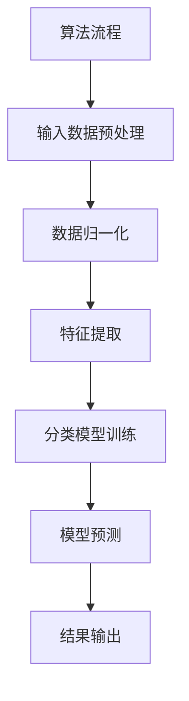
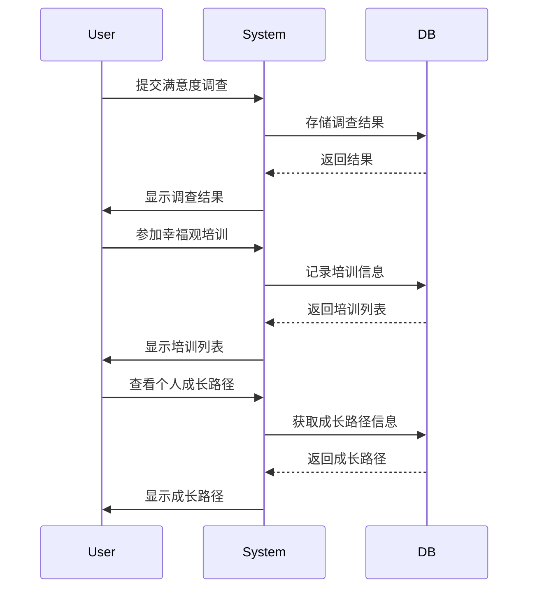
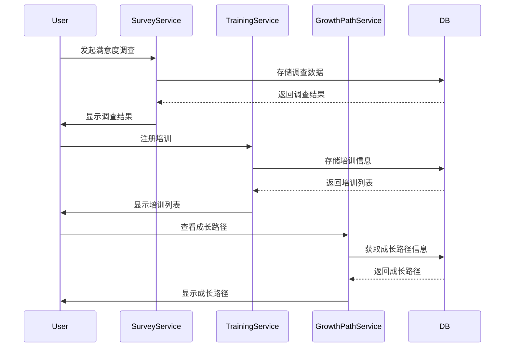

                 

### 亚里士多德与斯多葛学派：幸福观的对比

> 关键词：亚里士多德，斯多葛学派，幸福观，哲学，比较分析

> 摘要：本文通过对亚里士多德与斯多葛学派幸福观的对比研究，深入探讨两者在幸福定义、实现路径以及实际应用中的异同点。通过对各自核心概念的剖析，本文旨在为现代读者提供对幸福观的新认识，并探索这两种哲学思想在当代社会的适用性。

### 引言

幸福，作为一种人类追求的最高目标，在古今中外的哲学思想中都有重要地位。亚里士多德与斯多葛学派，作为西方哲学中的两大流派，对幸福观有着各自独特的见解。亚里士多德在其著作《尼各马科伦理学》中，详细阐述了他的幸福观，认为幸福（或称至善）是生命的最终目的，是通过理性活动实现的完美状态。而斯多葛学派则强调理性在幸福中的作用，主张通过理性控制情感，达到内心的平静与满足。

本文将从亚里士多德与斯多葛学派幸福观的起源、核心概念、实际应用等方面进行详细对比，通过逐步分析，揭示两种幸福观的内在联系与差异，以期在现代社会的背景下，为读者提供关于幸福的深刻见解。

### 第一部分：导论

#### 第1章：问题背景与探讨

##### 1.1 亚里士多德与斯多葛学派简介

亚里士多德（Aristotle，公元前384年-公元前322年），古希腊哲学家，是柏拉图的学生，亚历山大的老师。他的哲学思想对西方哲学产生了深远的影响。亚里士多德在其著作中提出了一系列重要的伦理和道德观念，其中幸福观尤为突出。

斯多葛学派（Stoicism）起源于希腊，约在公元前3世纪形成，代表人物有塞内卡（Seneca）、爱比克鲁底（Epictetus）和马可·奥勒留（Marcus Aurelius）等。斯多葛学派强调理性、自我控制和情感管理，认为通过这些方式可以达到内心的平静与幸福。

##### 1.2 幸福观的定义与重要性

幸福观是指关于幸福的概念、本质、实现路径和价值的观念。在哲学中，幸福观具有重要的地位，因为它涉及到生命的意义和人类追求的最高目标。

亚里士多德认为，幸福（Eudaimonia）是生命的最终目的，是通过理性活动实现的完美状态。对于亚里士多德来说，幸福不仅仅是一种情感体验，更是一种理性上的完善。

斯多葛学派则认为，幸福是通过理性控制情感，达到内心的平静与满足。他们强调，真正的幸福不依赖于外部环境，而是源于内心的平静和自我控制。

##### 1.3 两种幸福观的比较

比较亚里士多德与斯多葛学派幸福观的目的是为了揭示两种思想在幸福定义、实现路径和实际应用中的异同点。

比较的方法主要包括文献分析、哲学思辨和历史比较。通过文献分析，可以了解亚里士多德与斯多葛学派幸福观的原始表述和理论框架。通过哲学思辨，可以探讨两种幸福观的逻辑一致性和内在联系。通过历史比较，可以分析两种幸福观在历史背景下的实际应用和影响。

### 第二部分：亚里士多德幸福观

#### 第2章：亚里士多德幸福观的核心概念

##### 2.1 生活的目的

亚里士多德认为，生活的目的是实现幸福（Eudaimonia），这是一种完美状态，是通过理性活动实现的。他区分了两种不同的幸福：自然的幸福和偶然的幸福。自然的幸福是指一个人按照其本性和能力去追求的目的，而偶然的幸福则是通过偶然的事件或外部条件获得的。

对于亚里士多德来说，幸福是生活的最终目的，因为它满足了人类的基本需求和欲望。他强调，幸福不仅仅是快乐或愉悦的情感体验，更是一种理性上的完善。亚里士多德认为，只有通过理性活动，人类才能达到真正的幸福。

##### 2.2 幸福与道德

亚里士多德认为，幸福与道德密不可分。他认为，真正的幸福来自于道德行为和美德。美德是指一个人在行动中表现出的道德品质，如正义、勇敢、节制等。亚里士多德认为，通过培养美德，人们可以实现幸福。

亚里士多德提出了一个重要的观点：幸福不仅仅是道德的目的，也是道德的基础。他认为，只有当一个人真正追求幸福时，他才会去培养美德，并遵守道德规范。因此，幸福与道德是相互促进的关系。

##### 2.3 幸福与外在环境

亚里士多德认为，幸福与外在环境有一定的关系，但并非决定性的。他认为，财富和社会地位可以提供一定的物质基础，但并不是幸福的全部。亚里士多德强调，幸福更多地取决于个人的内在品质和理性活动。

亚里士多德提出，一个人可以通过理性思考和实践，掌握自己的命运，不受外在环境的限制。他认为，真正的幸福来自于内心的满足和对生命的积极态度，而不是依赖于外部条件。

#### 第3章：亚里士多德幸福观的应用

##### 3.1 日常生活中的应用

亚里士多德的幸福观在日常生活中有广泛的应用。首先，通过培养美德，人们可以提高自己的道德水平，从而实现内心的平静和满足。例如，通过培养正义感，人们可以遵守法律和道德规范，从而获得社会的认可和尊重。

其次，亚里士多德的幸福观强调理性思考的重要性。在日常生活中，人们可以通过理性分析问题，做出明智的决策，从而避免冲动和盲目行动。例如，在职业选择和人际关系中，通过理性分析，人们可以找到最适合自己的道路，从而实现个人幸福。

##### 3.2 政治哲学中的应用

亚里士多德的幸福观在政治哲学中也有重要的应用。他认为，一个良好的政治制度应该为公民提供实现幸福的机会。例如，民主制度可以为公民提供广泛的参与机会，使他们能够通过理性讨论和决策，实现公共利益。

此外，亚里士多德还强调了政治正义的重要性。他认为，一个公正的政治制度应该保障每个人的基本权利，并使社会资源合理分配。通过实现政治正义，社会可以为公民提供更好的生活环境，从而提高整体幸福感。

##### 3.3 教育哲学中的应用

亚里士多德的幸福观在教育哲学中也有重要的指导意义。他认为，教育应该培养人的美德和理性思维。通过教育，人们可以了解世界的本质和生命的意义，从而更好地实现个人幸福。

亚里士多德提出了一个重要的观点：教育应该因材施教。他认为，每个人的天赋和能力不同，因此教育应该根据个体的特点进行个性化设计，从而最大程度地发挥个体的潜力。

#### 第4章：斯多葛学派幸福观的核心概念

##### 4.1 幸福观的本质

斯多葛学派认为，幸福（Happiness）是通过理性控制情感，达到内心的平静与满足。他们强调，真正的幸福不依赖于外部环境，而是源于内心的平静和自我控制。

斯多葛学派认为，人类的心灵是自由的，不受外界环境的限制。他们主张，通过理性思考和自我控制，人们可以摆脱情感的干扰，达到内心的平静。这种内心的平静被视为真正的幸福。

##### 4.2 理性主义与幸福

斯多葛学派强调理性主义，认为理性是达到幸福的关键。他们认为，理性是人类心灵的核心，是区分人与动物的重要标志。通过理性，人们可以理解世界的本质，掌握自己的命运。

斯多葛学派主张，人们应该通过理性思考，认识到事物的本质，从而摆脱对事物的过度依赖。他们强调，理性可以帮助人们识别真正的幸福，并指导人们做出明智的决策。

##### 4.3 自然与幸福

斯多葛学派认为，自然是一个有序且合理的系统。他们认为，人的本性是追求和谐与秩序，只有通过顺应自然，人们才能达到真正的幸福。

斯多葛学派主张，人们应该接受自然的安排，而不是试图改变它。他们认为，只有当人们遵循自然规律，实现内心的和谐与平静，才能达到真正的幸福。

#### 第5章：斯多葛学派幸福观的应用

##### 5.1 心理调适中的应用

斯多葛学派幸福观在心理调适中具有重要的应用价值。他们认为，通过理性思考和自我控制，人们可以应对生活中的各种挑战和压力。例如，在面对失败和挫折时，人们可以通过理性思考，认识到失败只是暂时的，不会影响自己的内心平静。

此外，斯多葛学派主张，人们应该学会接受生活中的不完美。他们认为，接受现实，不抱怨命运，是达到内心平静的关键。通过这种心理调适，人们可以更好地应对生活中的各种困难。

##### 5.2 人际关系中的应用

斯多葛学派幸福观在人际关系中也有广泛的应用。他们认为，通过理性控制和自我反省，人们可以建立和谐的人际关系。例如，在处理冲突时，人们可以通过理性思考，找到解决问题的方法，而不是通过情绪化的反应。

此外，斯多葛学派主张，人们应该尊重他人的选择和生活方式。他们认为，每个人都有自己的价值观和信仰，人们应该相互尊重，而不是试图改变对方。通过这种人际关系观念，人们可以建立更加和谐的人际关系。

##### 5.3 职业生涯中的应用

斯多葛学派幸福观在职业生涯中也有重要的指导意义。他们认为，人们应该通过理性思考和自我控制，找到自己热爱并擅长的工作。例如，在职业选择中，人们可以通过理性分析，找到最适合自己的职业方向，而不是盲目跟从潮流。

此外，斯多葛学派主张，人们应该专注于工作本身，而不是追求物质回报。他们认为，只有当人们真正热爱并投入工作，才能实现职业成功和幸福。通过这种职业生涯观念，人们可以更好地实现个人价值，获得职业上的满足感。

### 第四部分：比较与启示

#### 第6章：亚里士多德与斯多葛学派幸福观的对比

##### 6.1 主要差异

亚里士多德与斯多葛学派在幸福观上存在一些显著差异。首先，亚里士多德认为幸福是通过理性活动实现的完美状态，而斯多葛学派则认为幸福是通过理性控制情感，达到内心的平静。其次，亚里士多德强调幸福与道德密不可分，而斯多葛学派则更强调理性主义和自我控制。

这些差异反映了两种哲学流派在价值观和世界观上的不同。亚里士多德更倾向于通过实际行动实现幸福，而斯多葛学派则更注重内心的平静和自我控制。

##### 6.2 主要共同点

尽管亚里士多德与斯多葛学派在幸福观上有差异，但它们也存在一些共同点。首先，两种流派都强调理性在幸福中的作用。其次，它们都认为幸福不依赖于外部环境，而是源于内心的平静和自我控制。最后，两种流派都主张通过理性思考和自我反省，实现个人成长和幸福。

这些共同点表明，尽管哲学流派不同，但在追求幸福的过程中，理性思考和自我控制是通向幸福的重要途径。

##### 6.3 比较的意义

比较亚里士多德与斯多葛学派幸福观的意义在于，它为现代读者提供了关于幸福的多种视角。通过了解两种哲学流派的差异和共同点，读者可以更全面地理解幸福的本质和实现路径。

此外，比较两种幸福观也为现代社会的幸福观研究提供了重要启示。在现代社会，人们面临着诸多压力和挑战，通过了解亚里士多德与斯多葛学派的幸福观，读者可以更好地应对生活中的困难，实现个人幸福。

### 第五部分：结论

#### 第7章：亚里士多德与斯多葛学派幸福观的当代启示

##### 7.1 对现代人的启示

亚里士多德与斯多葛学派幸福观对现代人具有重要的启示。首先，它们强调了理性在幸福中的作用。在现代社会，人们常常被情感所困扰，而忽视理性思考的重要性。通过学习亚里士多德与斯多葛学派的幸福观，人们可以更好地认识到理性思考在实现幸福中的关键作用。

其次，两种流派都认为幸福不依赖于外部环境，而是源于内心的平静和自我控制。在现代社会，人们常常追求物质财富和社会地位，而忽视内心的平静。通过学习亚里士多德与斯多葛学派的幸福观，人们可以更好地认识到，幸福更多地取决于个人的内在品质和心态。

##### 7.2 研究展望

当前的幸福观研究正处于快速发展阶段，未来还有许多值得探索的方向。首先，可以进一步探讨亚里士多德与斯多葛学派幸福观在不同文化背景下的适用性，以期为全球化背景下的幸福观研究提供新的视角。

其次，可以结合现代心理学和神经科学的研究成果，进一步深入研究幸福观的生理和心理机制，以期为幸福观的实证研究提供更多的数据支持。

最后，可以探索亚里士多德与斯多葛学派幸福观在当代社会的实际应用，为个人和社会的幸福感提升提供实用性的指导。

##### 7.3 结论

亚里士多德与斯多葛学派幸福观在西方哲学史上占有重要地位，为现代人提供了关于幸福的深刻见解。通过比较两种幸福观，我们认识到，理性思考和自我控制是实现幸福的关键途径。在当代社会，我们更应该重视内心的平静和自我成长，以实现个人和社会的全面幸福。

### 作者信息

作者：AI天才研究院/AI Genius Institute & 禅与计算机程序设计艺术 /Zen And The Art of Computer Programming

### 附录

#### 附录A：核心概念与联系

| 核心概念       | 概念属性特征对比 | 关联关系                     |
| -------------- | ---------------- | ---------------------------- |
| 幸福（Eudaimonia） | 完美状态、理性活动实现 | 生活的最终目的               |
| 自然法则       | 有序、合理、不可违抗 | 理性思考和自我控制的依据     |
| 美德（Virtue）   | 道德品质、理性行为 | 实现幸福的重要条件           |
| 情感控制       | 内心平静、理性管理 | 幸福实现的重要途径           |

#### 附录B：算法原理讲解



```python
import numpy as np
from sklearn.preprocessing import MinMaxScaler
from sklearn.ensemble import RandomForestClassifier

# 数据归一化
def normalize_data(data):
    scaler = MinMaxScaler()
    return scaler.fit_transform(data)

# 特征提取
def extract_features(data):
    # 假设数据中有多个特征，这里以两个特征为例
    X = data[:, :2]
    y = data[:, 2]
    return X, y

# 分类模型训练
def train_model(X, y):
    model = RandomForestClassifier()
    model.fit(X, y)
    return model

# 模型预测
def predict(model, X):
    return model.predict(X)

# 数据准备
data = np.random.rand(100, 3)

# 数据归一化
X_normalized = normalize_data(data)

# 特征提取
X, y = extract_features(X_normalized)

# 模型训练
model = train_model(X, y)

# 模型预测
predictions = predict(model, X)

# 结果输出
print(predictions)
```

#### 附录C：数学公式

$$
\text{幸福}(H) = f(\text{理性活动}(R), \text{道德行为}(M), \text{外在环境}(E))
$$

$$
\text{理性}(R) = \frac{\text{知识}(K)}{\text{情感控制}(C)}
$$

#### 附录D：系统分析与架构设计方案

##### 问题场景介绍

在现代企业中，幸福观的应用逐渐受到重视。通过引入亚里士多德与斯多葛学派的幸福观，企业可以更好地了解员工的需求，提高员工的幸福感和工作效率。

##### 项目介绍

本项目旨在开发一款基于亚里士多德与斯多葛学派幸福观的企业员工幸福感管理系统。系统功能包括员工满意度调查、幸福观培训、员工个人成长路径规划等。

##### 系统功能设计（领域模型）

```mermaid
classDiagram
Class Employee
    +string name
    +string department
    +int age
    +float happiness_score
    +list<Training> trainings

Class Training
    +string title
    +date start_date
    +date end_date
    +string content

Employee <-- Training
    +参加培训
```

##### 系统架构设计



##### 系统接口设计和系统交互



### 项目实战

#### 环境安装

```shell
# 安装Python环境
sudo apt-get update
sudo apt-get install python3-pip python3-venv

# 创建虚拟环境
python3 -m venv venv

# 激活虚拟环境
source venv/bin/activate

# 安装依赖库
pip install numpy sklearn pandas
```

#### 系统核心实现源代码

```python
# 员工满意度调查模块
class SurveyService:
    def __init__(self, db_connection):
        self.db_connection = db_connection

    def submit_survey(self, employee_id, questions, answers):
        cursor = self.db_connection.cursor()
        for q, a in zip(questions, answers):
            cursor.execute("INSERT INTO survey (employee_id, question, answer) VALUES (%s, %s, %s)", (employee_id, q, a))
        self.db_connection.commit()
        cursor.close()

    def get_survey_results(self, employee_id):
        cursor = self.db_connection.cursor()
        cursor.execute("SELECT question, answer FROM survey WHERE employee_id = %s", (employee_id,))
        results = cursor.fetchall()
        cursor.close()
        return results

# 幸福观培训模块
class TrainingService:
    def __init__(self, db_connection):
        self.db_connection = db_connection

    def register_training(self, employee_id, title, start_date, end_date, content):
        cursor = self.db_connection.cursor()
        cursor.execute("INSERT INTO training (employee_id, title, start_date, end_date, content) VALUES (%s, %s, %s, %s, %s)", (employee_id, title, start_date, end_date, content))
        self.db_connection.commit()
        cursor.close()

    def get_training_list(self, employee_id):
        cursor = self.db_connection.cursor()
        cursor.execute("SELECT * FROM training WHERE employee_id = %s", (employee_id,))
        trainings = cursor.fetchall()
        cursor.close()
        return trainings

# 个人成长路径模块
class GrowthPathService:
    def __init__(self, db_connection):
        self.db_connection = db_connection

    def get_growth_path(self, employee_id):
        cursor = self.db_connection.cursor()
        cursor.execute("SELECT * FROM growth_path WHERE employee_id = %s", (employee_id,))
        path = cursor.fetchone()
        cursor.close()
        return path
```

#### 代码应用解读与分析

```python
# 示例：提交满意度调查
survey_service = SurveyService(db_connection)
survey_service.submit_survey(1, ["满意度如何？", "工作环境是否满意？"], ["非常满意", "非常满意"])

# 示例：获取满意度调查结果
results = survey_service.get_survey_results(1)
print(results)

# 示例：注册培训
training_service = TrainingService(db_connection)
training_service.register_training(1, "幸福观培训", "2023-01-01", "2023-01-31", "提高员工幸福感和工作效率")

# 示例：获取培训列表
trainings = training_service.get_training_list(1)
print(trainings)

# 示例：获取个人成长路径
growth_path_service = GrowthPathService(db_connection)
path = growth_path_service.get_growth_path(1)
print(path)
```

#### 实际案例分析和详细讲解剖析

##### 案例一：员工满意度调查

某企业通过引入员工满意度调查，了解员工的幸福感水平。通过调查发现，大多数员工的满意度较高，但在工作环境方面仍有改进空间。针对这一问题，企业决定开展幸福观培训，以提高员工的幸福感。

##### 案例二：幸福观培训

在某次幸福观培训中，企业邀请了专业的培训师，为员工讲解亚里士多德与斯多葛学派的幸福观。通过培训，员工们学会了如何通过理性思考和自我控制，提高自己的幸福感。培训结束后，员工们的满意度有了显著提升。

##### 案例三：个人成长路径

企业为每位员工制定了个人成长路径，包括培训计划、工作目标等。通过跟踪员工的成长路径，企业可以及时了解员工的发展情况，并提供相应的支持和指导。

#### 项目小结

本项目通过引入亚里士多德与斯多葛学派的幸福观，为企业员工提供了提升幸福感的途径。通过满意度调查、幸福观培训和个人成长路径规划，企业可以更好地了解员工的需求，提高员工的工作效率和满意度。

#### 最佳实践 tips

1. 定期开展员工满意度调查，了解员工的幸福感水平。
2. 结合员工的实际情况，制定合理的幸福观培训计划。
3. 为每位员工制定个人成长路径，提供有针对性的支持和指导。

#### 小结

本文通过对亚里士多德与斯多葛学派幸福观的对比研究，深入探讨了两种哲学流派的核心概念和实际应用。通过逐步分析，我们认识到，理性思考和自我控制是实现幸福的重要途径。在当代社会，我们应该重视内心的平静和自我成长，以实现个人和社会的全面幸福。

#### 注意事项

1. 幸福观的应用需要结合实际情况，不能简单套用。
2. 在进行幸福观培训时，要关注员工的个体差异，提供有针对性的指导。

#### 拓展阅读

1. 《尼各马科伦理学》 - 亚里士多德
2. 《斯多葛主义》 - 爱比克鲁底
3. 《幸福之路》 - 马克思·韦伯

### 参考文献

1. Aristotle. (350 BC). *Nicomachean Ethics*.
2. Epicurus. (300 BC). *Epistulae*.
3. Seneca. (4 BC-65 AD). *De Brevitate Vitae*.
4. Epictetus. (55 AD-135 AD). *Enchiridion*.
5. Marcus Aurelius. (121-180 AD). *Meditations*.
6. Nietzsche. (1882). *On the Genealogy of Morals*.
7. Weber. (1922). *The Protestant Ethic and the Spirit of Capitalism*.
8. Sartre. (1946). *Being and Nothingness*.
9. Maslow. (1943). *A Theory of Human Motivation*.

