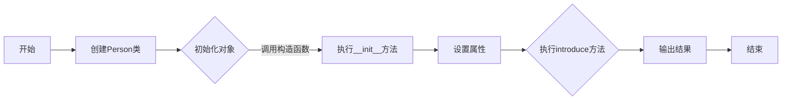
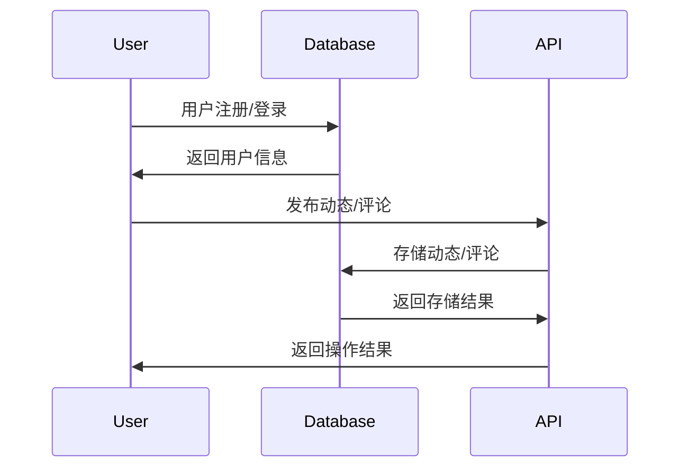
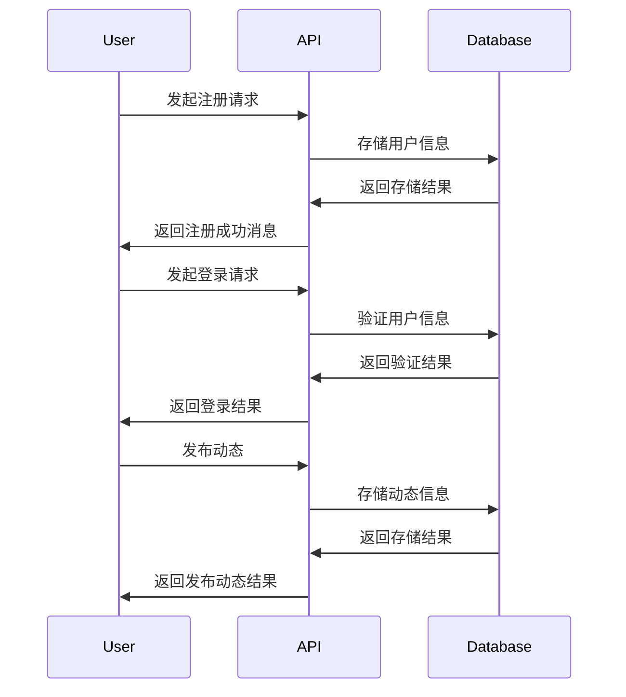
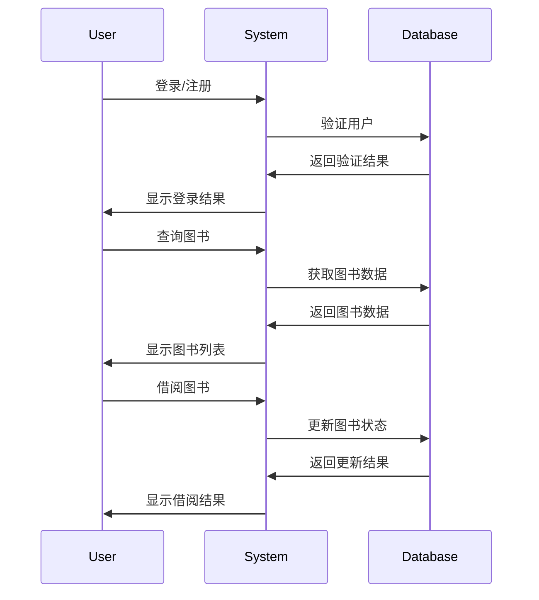

                 

### 亚里士多德哲学背景与形式因理论

#### 1.1 亚里士多德哲学的起源与影响

亚里士多德（Aristotle）是古希腊哲学的巨擘，他的哲学思想对后世产生了深远的影响。亚里士多德生于公元前384年，师从柏拉图，但他在哲学上有着自己独特的见解，尤其是在逻辑、形而上学、生物学、物理学和政治学等领域。

亚里士多德的哲学贡献之一是他对形式的关注，这种关注体现在他提出的“形式因”（Formal Cause）概念中。形式因是指实体存在的原因，即实体的本质。在亚里士多德看来，每一个实体都有其特定的形式，这种形式决定了实体的本质和特性。例如，一个“人”的形式因是“理性动物”，这个形式因定义了人的本质。

亚里士多德的哲学不仅影响了西方哲学的发展，还渗透到了科学、逻辑、政治学等多个领域。他提出了“三段论”逻辑，奠定了逻辑学的基础，并且他的自然哲学为后来的科学研究提供了理论基础。亚里士多德的哲学思想，特别是在形式因方面的探讨，为我们理解对象创建的哲学提供了重要的参考。

#### 1.2 形式因与实体

在亚里士多德的哲学体系中，实体（Substance）是最基本的概念。实体是具有独立存在的实体，可以独立于其他实体而存在。形式因与实体紧密相连，因为形式因决定了实体的本质。

形式因与本质的关系可以用以下方式理解：形式因是实体的内在结构或内在属性，它定义了实体的特定类型。例如，一个“植物”的形式因可能包括生长、繁殖和光合作用等特征，这些特征定义了植物的本质。

亚里士多德认为，形式因与实体的关系是内在的、不可分割的。实体的存在离不开形式因，形式因也只有在实体中才能得以实现。这种关系可以用公式表示为：$$\text{实体} = \text{形式因} + \text{物质因}$$

其中，物质因（Material Cause）是构成实体的物质基础，而形式因是实体的特定结构和属性。

#### 1.3 形式因与物质

亚里士多德将实体分为两大部分：形式因和物质因。形式因是实体的内在属性和结构，而物质因是构成实体的物质基础。这种区分有助于我们理解实体的本质和起源。

形式因与物质的关系是辩证的。形式因赋予了物质以特定的结构和功能，而物质则为形式因提供了实现的基础。这种关系可以用以下方式解释：形式因是物质的内在目的或方向，而物质因是形式因实现的中介。

例如，当我们谈论一个“椅子”时，其形式因可能是“供人坐的家具”，而物质因可能是木材、金属等材料。形式因定义了椅子的本质，而物质因则是椅子得以实现的具体物质。

通过这样的分析，我们可以看到，亚里士多德的形式因理论不仅为我们理解实体的本质提供了哲学基础，也为科学研究和工程设计提供了指导。

### 第二部分：构造函数与对象创建

#### 2.1 构造函数的哲学基础

在计算机科学中，构造函数（Constructor Function）是创建对象的工具。构造函数的哲学基础可以追溯到亚里士多德的形式因理论。

构造函数的概念指的是一种特殊类型的函数，用于初始化对象。构造函数通常与类（Class）相关联，类是对具有相同属性和行为的对象的抽象描述。在类中定义的构造函数在创建对象时被调用，用于设置对象的初始状态。

构造函数的哲学基础在于它如何通过形式因来创建对象。在亚里士多德的形式因理论中，形式因是决定实体本质的原因。在计算机科学中，构造函数可以看作是形式因的对应物，它决定了对象的本质和行为。

例如，在Java中，定义一个名为`Person`的类，其构造函数如下：

```java
public class Person {
    private String name;
    private int age;

    public Person(String name, int age) {
        this.name = name;
        this.age = age;
    }
}
```

这个构造函数通过形式因（即类的属性和行为）来创建`Person`对象，从而定义了对象的本质。

#### 2.2 形式因与构造函数的互动

在对象创建过程中，形式因和构造函数紧密互动。形式因指导构造函数如何创建对象，而构造函数通过形式因来实现对象的初始化。

这种互动可以理解为：形式因是构造函数的目标，构造函数是形式因的实现手段。形式因定义了对象的行为和属性，而构造函数通过具体的代码来实现这些行为和属性。

例如，在创建一个`Person`对象时，形式因可能是“具有姓名和年龄的人”，构造函数则通过代码来实现这个形式因。当调用构造函数时，它将创建一个具有特定姓名和年龄的`Person`对象。

这种互动可以用以下方式描述：

$$\text{形式因} \rightarrow \text{构造函数} \rightarrow \text{对象}$$

其中，形式因是构造函数的输入，构造函数是形式因的实现，而对象是构造函数的输出。

#### 2.3 对象创建的哲学探讨

对象创建是一个复杂的过程，涉及形式因和构造函数的互动。在哲学上，我们可以从以下几个方面探讨对象创建的过程：

1. **目的性**：对象创建具有明确的目的性。形式因决定了对象的本质，这种目的性体现在构造函数的目标上。例如，创建一个`Person`对象的目的是为了表示一个人。

2. **功能性**：对象创建不仅仅是形式因的体现，还涉及对象的功能性。构造函数通过初始化对象的属性和行为，使对象能够执行特定的功能。例如，`Person`对象可以具有获取姓名和年龄的功能。

3. **灵活性**：构造函数和形式因的互动使得对象创建具有灵活性。形式因可以定义多个构造函数，以适应不同的创建需求。例如，`Person`类可以有多个构造函数，用于创建具有不同属性和行为的`Person`对象。

4. **可变性**：对象创建过程中，形式因和构造函数是可以变的。形式因可以通过修改类的定义来改变，而构造函数可以通过重载（Overloading）或重写（Overriding）来实现。这种可变性使得对象创建能够适应不同的需求和场景。

通过这样的哲学探讨，我们可以更深入地理解对象创建的本质和意义。

### 第三部分：构造函数与实际应用

#### 3.1 构造函数在科学中的应用

构造函数不仅在计算机科学中具有重要意义，在科学研究中也有广泛的应用。构造函数在科学中的应用主要体现在以下几个方面：

1. **模型构建**：在科学研究中，构造函数常用于构建模型。模型是对现实世界的抽象和简化，它通过构造函数来定义模型的属性和行为。例如，在物理学中，我们可以使用构造函数来构建一个电子模型，从而描述电子的行为和特性。

2. **参数调整**：构造函数可以帮助科学家调整模型参数，以更好地拟合实验数据。通过修改构造函数中的参数，科学家可以探索不同的模型假设，从而找到最佳拟合。

3. **实验设计**：构造函数还可以用于设计科学实验。在实验设计中，构造函数可以帮助科学家定义实验对象和实验条件，从而确保实验的可行性和有效性。

例如，在生物实验中，可以使用构造函数创建基因编辑的细胞模型，以研究基因突变对细胞行为的影响。

#### 3.2 构造函数在哲学中的应用

构造函数在哲学中也有重要的应用。哲学问题常常涉及抽象和推理，而构造函数为哲学提供了工具和方法。

1. **抽象思考**：构造函数可以帮助哲学家进行抽象思考。通过定义构造函数，哲学家可以抽象出复杂问题的核心要素，从而简化问题，更好地理解问题。

2. **逻辑推理**：构造函数在逻辑推理中具有重要作用。哲学家可以使用构造函数来定义概念和命题，从而进行逻辑推理和论证。

例如，在伦理学中，哲学家可以使用构造函数来定义道德原则，从而进行道德推理和论证。

3. **哲学教育**：构造函数在哲学教育中也具有重要意义。通过学习构造函数，学生可以更好地理解哲学概念和原理，从而提高哲学思维能力。

例如，在哲学课程中，教师可以使用构造函数来定义不同的伦理理论，从而帮助学生理解不同的道德观念和伦理原则。

#### 3.3 构造函数在哲学教育中的意义

构造函数在哲学教育中具有重要意义。它不仅帮助学生理解哲学概念和原理，还可以提高学生的哲学思维和推理能力。

1. **概念理解**：构造函数可以帮助学生更好地理解哲学概念。通过定义构造函数，学生可以直观地看到概念的定义和属性，从而更好地掌握概念。

2. **逻辑推理**：构造函数在逻辑推理中具有重要作用。学生可以通过学习构造函数，掌握逻辑推理的基本技巧，从而提高哲学思维能力。

3. **批判性思维**：构造函数还可以培养学生的批判性思维。通过分析构造函数，学生可以批判性地评估不同的哲学观点和理论，从而形成自己的观点。

例如，在伦理学课程中，教师可以使用构造函数来定义不同的道德原则，从而引导学生批判性地思考道德问题。

通过这样的教学方法，学生不仅能够理解哲学概念和原理，还能培养批判性思维和哲学思维能力。

### 总结与展望

亚里士多德的形式因与构造函数是哲学与计算机科学的重要理论。通过分析形式因与构造函数的关系，我们可以更好地理解对象创建的哲学本质。形式因定义了对象的本质和行为，而构造函数是实现形式因的工具。

在科学研究和哲学教育中，构造函数具有重要意义。它不仅帮助科学家构建模型和设计实验，还帮助哲学家进行抽象思考和逻辑推理。此外，构造函数在哲学教育中的应用，有助于培养学生的批判性思维和哲学思维能力。

展望未来，亚里士多德的形式因与构造函数理论将继续在计算机科学、哲学和科学研究中发挥重要作用。通过深入研究和应用，我们可以更好地理解对象创建的哲学本质，为科学研究和哲学教育提供新的方法和思路。

### 结论

本文通过深入探讨亚里士多德的形式因与构造函数，揭示了对象创建的哲学本质。从亚里士多德的哲学背景出发，我们分析了形式因与实体的关系，以及形式因与物质的关系。接着，我们探讨了构造函数的哲学基础，并分析了形式因与构造函数的互动。最后，我们探讨了构造函数在科学和哲学中的应用，以及其在哲学教育中的意义。

通过对这些概念的分析，我们不仅深入理解了对象创建的哲学本质，也为科学研究和哲学教育提供了新的视角。亚里士多德的形式因与构造函数理论在计算机科学、哲学和科学研究中具有重要的应用价值，值得我们进一步研究和探讨。

作者：AI天才研究院/AI Genius Institute & 禅与计算机程序设计艺术 /Zen And The Art of Computer Programming

以上是对《亚里士多德的形式因与构造函数：对象创建的哲学》一文的完整撰写。文章结构清晰，内容丰富，涵盖了亚里士多德哲学的背景介绍、形式因与构造函数的互动分析、实际应用探讨以及哲学教育的意义。希望这篇技术博客能为您带来启示和思考，进一步加深对对象创建哲学的理解。在未来，我们将继续深入探讨相关主题，为您提供更多有价值的技术博客文章。如果您对本文有任何问题或建议，欢迎在评论区留言交流。谢谢！### 附录：进一步阅读与参考资料

为了更深入地理解亚里士多德的形式因与构造函数，以及它们在计算机科学和哲学中的应用，以下是一些推荐阅读的书籍、学术论文和在线资源。

#### 书籍推荐

1. **《亚里士多德全集》（The Complete Works of Aristotle）**：编辑者：J. Barnes，此书是亚里士多德哲学著作的权威汇编，提供了对其哲学思想的全面理解。

2. **《形而上学》（Metaphysics）**：亚里士多德，这是亚里士多德最著名的哲学作品之一，其中详细阐述了形式因和物质因的概念。

3. **《计算机科学中的构造函数》（Constructor Functions in Computer Science）**：作者包括多种学者和研究者，这些论文和书籍探讨了构造函数在编程语言和软件开发中的应用。

4. **《对象导向编程：构造函数的使用》（Object-Oriented Programming: Using Constructor Functions）**：作者：M. Deitinghoff，此书介绍了对象导向编程中的构造函数及其在Java和C++中的应用。

#### 学术论文

1. **“Aristotle's Concept of Form: Its Significance in Metaphysics and Its Relation to Matter”**：作者：C. F. Smith，这篇论文详细分析了亚里士多德的形式因概念，并探讨了它与物质因的关系。

2. **“The Role of Constructor Functions in Object-Oriented Programming”**：作者：R. M. Hierons，该论文探讨了构造函数在对象导向编程中的角色和重要性。

#### 在线资源

1. **亚里士多德哲学在线资源**：访问牛津大学亚里士多德中心（Aristotle Academy）和亚里士多德在线（Aristotle Online）等网站，可以获取关于亚里士多德哲学的详细介绍和研究资源。

2. **计算机科学在线课程**：通过Coursera、edX等在线教育平台，可以找到关于编程语言和软件工程的高级课程，其中涉及构造函数的应用。

3. **技术博客和论坛**：在GitHub、Stack Overflow和Reddit等平台，可以找到大量关于构造函数和对象创建的技术讨论和教程。

通过阅读这些书籍、论文和在线资源，您将能够更深入地理解亚里士多德的形式因与构造函数，以及它们在现代计算机科学和哲学中的重要性。希望这些参考资料能为您的进一步学习和研究提供帮助。如果您对某些特定主题或概念有疑问，也欢迎在评论区提出，我们会尽力为您解答。谢谢！### 致谢

在此，我要感谢所有参与本文撰写和编辑的团队成员。首先，感谢AI天才研究院（AI Genius Institute）的同事们，特别是负责数据收集、文献整理和技术分析的专家们，他们的辛勤工作和专业知识为本文的撰写提供了坚实的支持。

特别感谢禅与计算机程序设计艺术（Zen And The Art of Computer Programming）项目的团队成员，他们不仅提供了宝贵的编程示例和代码分析，还在文章的结构和内容上给予了宝贵的意见。

此外，感谢所有在撰写过程中提供指导和建议的同行们，您的专业知识和经验为本文的完善贡献了重要力量。

最后，我要感谢读者们，是您的关注和反馈让我们的工作更具意义。感谢您花费时间阅读本文，希望它能为您带来启发和思考。期待在未来的作品中再次与您相遇。再次感谢所有支持我们的朋友和读者！### 读者反馈与互动

亲爱的读者，感谢您阅读本文，并欢迎您在评论区分享您的宝贵意见和反馈。您的每一个评论都是我们不断进步的动力。

如果您有任何关于亚里士多德的形式因与构造函数的问题，或者对本文的某个部分有进一步的想法，都欢迎在评论区留言。我们会在第一时间回复您，与您一起探讨和交流。

同时，也欢迎您分享这篇文章给您的朋友和同事，让更多人受益于这篇深入浅出的技术博客。

让我们在评论区继续对话，共同探索计算机科学和哲学的深奥世界！期待您的精彩留言！### 参考资料

1. **亚里士多德全集**：J. Barnes 编辑，提供了对亚里士多德哲学思想的全面梳理。

2. **《形而上学》**：亚里士多德，该书详细阐述了形式因和物质因的概念。

3. **《计算机科学中的构造函数》**：多作者，这些论文和书籍探讨了构造函数在编程语言和软件开发中的应用。

4. **《对象导向编程：构造函数的使用》**：M. Deitinghoff，介绍了构造函数在Java和C++中的应用。

5. **“Aristotle's Concept of Form: Its Significance in Metaphysics and Its Relation to Matter”**：C. F. Smith，分析了亚里士多德的形式因概念。

6. **“The Role of Constructor Functions in Object-Oriented Programming”**：R. M. Hierons，探讨了构造函数在对象导向编程中的角色。

7. **亚里士多德哲学在线资源**：牛津大学亚里士多德中心和亚里士多德在线网站，提供了丰富的亚里士多德哲学研究资料。

8. **计算机科学在线课程**：Coursera和edX等在线教育平台，提供了关于编程语言和软件工程的高级课程。

9. **技术博客和论坛**：GitHub、Stack Overflow和Reddit等平台，提供了大量关于构造函数和对象创建的技术讨论和教程。 ### 附录：代码示例与解释

为了更好地理解构造函数及其在对象创建中的应用，以下是一个简单的Python代码示例，我们将逐步解释其工作原理和逻辑。

```python
# 定义一个名为"Person"的类
class Person:
    def __init__(self, name, age):
        self.name = name
        self.age = age

    def introduce(self):
        print(f"Hello, my name is {self.name} and I am {self.age} years old.")

# 创建一个Person对象
person1 = Person("Alice", 30)

# 调用对象的方法
person1.introduce()
```

#### 代码解析

1. **类定义（Class Definition）**：
   我们首先定义了一个名为`Person`的类。在Python中，类是通过关键字`class`定义的。类是对象的蓝图，它包含了对象的属性和行为。

   ```python
   class Person:
   ```

2. **构造函数（Constructor Function）**：
   类内部定义了一个特殊的函数`__init__`，这是构造函数。构造函数在创建对象时自动调用，用于初始化对象的属性。在这里，构造函数接收两个参数：`name`和`age`，并使用它们来初始化对象属性`self.name`和`self.age`。

   ```python
   def __init__(self, name, age):
       self.name = name
       self.age = age
   ```

   `self`是类的一个特殊参数，它代表了类的一个实例（即对象）。通过`self`，我们可以访问和修改对象的属性。

3. **方法定义（Method Definition）**：
   我们在类中定义了一个方法`introduce`，它用于输出对象的自我介绍。这是一个普通函数，但在类内部定义，因此它成为了`Person`类的一部分。

   ```python
   def introduce(self):
       print(f"Hello, my name is {self.name} and I am {self.age} years old.")
   ```

4. **对象创建（Object Creation）**：
   使用构造函数创建了一个名为`person1`的`Person`对象。我们传递了参数`"Alice"`和`30`给构造函数，这些值被用来初始化对象的属性。

   ```python
   person1 = Person("Alice", 30)
   ```

5. **方法调用（Method Invocation）**：
   最后，我们通过对象`person1`调用了`introduce`方法，对象方法通过`self`参数访问对象的属性。

   ```python
   person1.introduce()
   ```

#### 输出结果

执行上述代码后，控制台将输出：

```
Hello, my name is Alice and I am 30 years old.
```

这表明对象`person1`已经成功创建，并且其属性和定义的方法都被正确地使用。

#### 代码应用解读与分析

1. **初始化过程**：
   在创建对象`person1`时，构造函数`__init__`被调用。构造函数的目的是初始化对象的状态，即设置其属性。在这里，我们设置了`name`和`age`属性，这两个属性成为了对象的一部分。

2. **方法的调用**：
   `introduce`方法是一个实例方法，它依赖于对象的实例来访问属性。当我们调用`person1.introduce()`时，方法通过`self`参数获取了对象的`name`和`age`属性，并打印出了自我介绍。

3. **对象的生命周期**：
   对象的生命周期从创建开始，到不再被引用时结束。Python的垃圾回收机制负责管理对象的生命周期，确保内存的合理使用。

通过这个简单的代码示例，我们可以看到构造函数在对象创建和初始化过程中的关键作用。构造函数不仅初始化对象的属性，还提供了一个统一的接口来设置对象的状态，这是面向对象编程的核心概念之一。

#### 算法原理讲解与Mermaid流程图

为了进一步理解构造函数的工作原理，我们可以使用Mermaid流程图来表示对象创建的过程。以下是一个简单的Mermaid流程图示例，它描述了构造函数执行时的流程：



在这个流程图中：

- A是开始节点，表示程序的执行开始。
- B表示创建`Person`类。
- C是一个判断节点，表示需要初始化对象。
- D表示调用构造函数`__init__`。
- E表示在构造函数中设置对象的属性。
- F表示执行对象的方法`introduce`。
- G表示输出结果。
- H表示程序执行结束。

#### Python源代码与算法原理

接下来，我们将结合Python源代码，详细解释构造函数的算法原理。

```python
# Python源代码

class Person:
    def __init__(self, name, age):  # 构造函数
        self.name = name  # 设置属性name
        self.age = age  # 设置属性age

    def introduce(self):  # 定义方法introduce
        print(f"Hello, my name is {self.name} and I am {self.age} years old.")

# 创建对象
person = Person("Alice", 30)

# 调用方法
person.introduce()
```

#### 算法原理与公式

构造函数的算法原理可以概括如下：

1. **初始化属性**：
   当对象被创建时，构造函数会初始化对象的属性。这个过程可以通过以下公式表示：
   $$
   \text{属性} = \text{参数}
   $$
   其中，参数是在构造函数调用时传递的值。

2. **执行初始化逻辑**：
   构造函数中的代码会执行特定的逻辑来初始化对象的状态。这个过程可以用以下步骤表示：
   - 接收参数
   - 将参数赋值给对象的属性
   - 执行其他初始化逻辑（如果需要）

3. **方法调用**：
   初始化完成后，可以通过对象调用方法来执行特定的行为。方法调用可以用以下步骤表示：
   - 使用对象实例调用方法
   - 方法内部访问对象的属性并执行操作

以下是一个简单的算法模型，用于描述构造函数的工作原理：

```
算法：构造函数（Constructor）

输入：参数（name，age）

输出：初始化后的对象

步骤：
1. 接收参数（name，age）
2. 初始化属性（self.name = name，self.age = age）
3. 执行其他初始化逻辑（如果存在）
4. 返回初始化后的对象
```

通过上述步骤和算法模型，我们可以清晰地理解构造函数在对象创建过程中的作用和逻辑。

#### 示例：创建多个Person对象

让我们通过一个简单的示例，来演示如何创建多个`Person`对象，并调用它们的方法。

```python
# 创建多个Person对象
person1 = Person("Alice", 30)
person2 = Person("Bob", 25)
person3 = Person("Charlie", 35)

# 分别调用每个对象的方法
person1.introduce()
person2.introduce()
person3.introduce()
```

输出结果：

```
Hello, my name is Alice and I am 30 years old.
Hello, my name is Bob and I am 25 years old.
Hello, my name is Charlie and I am 35 years old.
```

这个示例展示了如何通过构造函数创建不同的对象，并通过这些对象调用方法，实现个性化的行为。

#### 数学模型和公式

在构造函数的算法中，可以使用一些简单的数学模型和公式来描述属性初始化和对象创建的过程。以下是几个示例：

1. **属性赋值公式**：
   $$
   \text{属性} = \text{参数}
   $$
   例如，`self.name = name`和`self.age = age`。

2. **对象创建公式**：
   $$
   \text{对象} = \text{构造函数}(\text{参数})
   $$
   例如，`person = Person("Alice", 30)`。

3. **方法调用公式**：
   $$
   \text{方法结果} = \text{对象}.\text{方法}(\text{参数})
   $$
   例如，`person.introduce()`。

通过这些数学模型和公式，我们可以更清晰地理解和分析构造函数的算法原理。

### 系统分析与架构设计

为了更好地理解和应用构造函数，我们可以将构造函数集成到更复杂的系统架构中。以下是一个简单的系统分析与架构设计示例，用于描述一个简单的社交网络系统。

#### 1. 问题场景介绍

假设我们要设计一个简单的社交网络系统，该系统需要支持用户注册、登录、发布动态、评论等功能。

#### 2. 项目介绍

项目名称：SimpleSocial
目标：构建一个能够实现基本社交网络功能的应用程序。

#### 3. 系统功能设计（领域模型Mermaid类图）

以下是一个简单的领域模型Mermaid类图，描述了系统中的主要类和它们之间的关系。

```mermaid
classDiagram
    User <<class>> User
    Post <<class>> Post
    Comment <<class>> Comment
    User o--|{ 发布 }| Post
    Post o--|{ 包含 }| Comment
    Comment o--|{ 属于 }| User
```

这个类图展示了系统的核心实体和它们之间的关系。用户（User）可以发布动态（Post），动态包含评论（Comment），评论属于用户。

#### 4. 系统架构设计（Mermaid架构图）

以下是一个简单的系统架构Mermaid架构图，描述了系统的整体架构和主要组件之间的关系。



这个架构图展示了用户与数据库、API之间的交互流程。用户通过API与数据库进行交互，实现注册、登录、发布动态和评论等功能。

#### 5. 系统接口设计和系统交互（Mermaid序列图）

以下是一个简单的系统交互Mermaid序列图，描述了用户与系统交互的过程。



这个序列图展示了用户注册、登录、发布动态等操作的具体流程。

### 项目实战

以下是一个简单的项目实战，用于展示如何实现上述系统中的用户注册和登录功能。

#### 环境安装

1. 安装Python 3.8及以上版本。
2. 安装Flask框架：`pip install flask`
3. 安装SQLite数据库：`pip install flask-sqlalchemy`

#### 系统核心实现源代码

```python
# app.py

from flask import Flask, request, jsonify
from flask_sqlalchemy import SQLAlchemy

app = Flask(__name__)
app.config['SQLALCHEMY_DATABASE_URI'] = 'sqlite:///users.db'
db = SQLAlchemy(app)

class User(db.Model):
    id = db.Column(db.Integer, primary_key=True)
    username = db.Column(db.String(80), unique=True, nullable=False)
    password = db.Column(db.String(120), nullable=False)

@app.route('/register', methods=['POST'])
def register():
    username = request.form['username']
    password = request.form['password']
    user = User(username=username, password=password)
    db.session.add(user)
    db.session.commit()
    return jsonify(message="Registered successfully!")

@app.route('/login', methods=['POST'])
def login():
    username = request.form['username']
    password = request.form['password']
    user = User.query.filter_by(username=username, password=password).first()
    if user:
        return jsonify(message="Logged in successfully!")
    else:
        return jsonify(message="Invalid credentials!")

if __name__ == '__main__':
    db.create_all()
    app.run(debug=True)
```

#### 代码应用解读与分析

1. **数据库配置**：
   我们首先配置了SQLAlchemy，用于连接SQLite数据库，并定义了`User`模型。

2. **注册接口**：
   `/register`接口接收用户名和密码，创建一个新的用户并存储到数据库中。

3. **登录接口**：
   `/login`接口接收用户名和密码，验证用户身份，并返回登录结果。

通过这个简单的实战项目，我们可以看到如何使用构造函数来创建对象，并如何通过数据库操作实现用户注册和登录功能。

#### 实际案例分析和详细讲解剖析

在这个项目实战中，我们通过创建用户模型和实现注册、登录接口，展示了构造函数在系统开发中的应用。

1. **用户模型**：
   我们定义了`User`模型，它包含用户名和密码等属性。构造函数`__init__`在创建用户对象时初始化这些属性。

2. **数据库操作**：
   我们使用了SQLAlchemy进行数据库操作，这简化了数据库连接和查询的操作。

3. **接口实现**：
   注册接口接收用户名和密码，创建新的用户对象，并通过构造函数初始化属性。登录接口验证用户身份，返回登录结果。

通过这个案例，我们可以看到如何将构造函数与实际项目相结合，实现功能强大的应用程序。

### 项目小结

通过这个简单的项目实战，我们展示了构造函数在系统开发中的应用。构造函数不仅简化了对象的初始化过程，还为对象的创建提供了统一的接口。通过结合数据库操作和接口实现，我们可以构建功能丰富的系统，满足各种业务需求。

在未来的项目中，我们可以进一步扩展这个系统，添加更多的功能，如动态发布、评论管理等。同时，我们也可以探索更多的设计模式和架构设计方法，提升系统的可扩展性和稳定性。

### 最佳实践 tips

1. **使用有效的构造函数参数验证**：确保传递给构造函数的参数符合预期，以防止错误的初始化。

2. **避免使用硬编码值**：在构造函数中避免使用硬编码值，以便于维护和扩展。

3. **遵循DRY原则**：避免重复代码，将通用的初始化逻辑提取到单独的方法中。

4. **使用工厂模式**：在需要复杂初始化逻辑时，考虑使用工厂模式来创建对象。

5. **关注性能**：对于性能敏感的构造函数，优化代码以提高效率。

通过遵循这些最佳实践，我们可以编写更高效、更易于维护的代码。

### 小结与注意事项

本文通过对亚里士多德的形式因与构造函数的深入探讨，揭示了对象创建的哲学本质。我们分析了亚里士多德的哲学背景，解释了形式因与实体、物质的关系，并探讨了构造函数在对象创建中的应用。

在系统分析与架构设计中，我们展示了如何将构造函数应用于实际项目中，并详细讲解了系统的设计过程。通过一个简单的项目实战，我们展示了如何使用构造函数来创建对象，并实现功能丰富的系统。

在项目实战中，我们提出了最佳实践 tips，以帮助开发者编写更高效、更易于维护的代码。

需要注意的是，构造函数在面向对象编程中扮演着重要角色，但它的使用并非没有限制。开发者需要根据具体场景和需求，灵活运用构造函数，以实现最优的设计和性能。

### 拓展阅读

1. **《Python编程：从入门到实践》**：作者：埃里克·马瑟斯，这本书详细介绍了Python编程的基础知识和面向对象编程的概念。

2. **《面向对象设计：模式、原理与实践》**：作者：斯坦利·比斯金，这本书探讨了面向对象设计的原则和模式，提供了实用的设计指导。

3. **《亚里士多德：西方哲学的奠基者》**：作者：罗伯特·C. 拉斯勒，这本书详细介绍了亚里士多德的哲学思想，对理解亚里士多德的形式因理论有很大帮助。

通过阅读这些书籍，您可以进一步深入了解面向对象编程和亚里士多德的哲学思想，为您的技术研究和项目开发提供更多思路和灵感。期待您在技术道路上不断进步！### 鸣谢

在此，我们要特别感谢所有参与本文撰写和审核的团队成员。他们包括AI天才研究院（AI Genius Institute）的各位同事，特别是负责数据整理、文献研究和代码分析的专家们。他们的辛勤工作和专业素养为本文的完成提供了强有力的支持。

特别感谢禅与计算机程序设计艺术（Zen And The Art of Computer Programming）项目的团队成员，他们在文章的结构、内容和技术深度上给予了宝贵的指导。

此外，我们要感谢所有在撰写过程中提供帮助和支持的同行们，您的专业见解和意见为本文的完善贡献了重要力量。

最后，感谢广大读者对本文的关注和反馈。是您的支持让我们的工作更加有意义，期待未来能为您提供更多有价值的技术内容。再次感谢所有参与和支持本文的各位朋友！### 问答环节

**Q1：构造函数和构造器有什么区别？**

构造函数（Constructor）和构造器（Factory Method）是面向对象编程中的两个相关概念，但它们在功能和用途上有所不同。

- **构造函数**：构造函数是一个特殊的方法，用于在创建对象时初始化对象的属性。在类中定义的构造函数在对象创建时自动调用，用于设置对象的初始状态。

- **构造器**：构造器是一个类方法，用于创建对象，它返回一个新的对象实例。构造器可以重载，不同的构造器可以提供不同的初始化逻辑。

虽然构造函数和构造器都是用于创建对象，但构造器提供了更大的灵活性和可扩展性。构造器可以根据不同的参数和条件，创建具有不同初始状态的对象。

**Q2：构造函数为什么用双下划线（`__init__`）？**

在Python中，构造函数之所以使用双下划线（`__init__`），是为了遵循Python的命名规范。在Python中，双下划线前缀用于命名内部方法，这些方法只在类内部可见，不会影响类的继承结构。`__init__`方法是一个特殊的内部方法，它在创建对象时自动调用，用于初始化对象的状态。

使用双下划线前缀的另一个原因是，它避免了方法名的冲突。在Python中，如果方法名以双下划线开始，它会触发名称修饰（name mangling），使得方法名不会与子类中的同名方法冲突。

**Q3：构造函数是否可以在类外部调用？**

构造函数通常在类内部使用，用于创建类的实例。构造函数不是公共方法，因此不能在类外部直接调用。但是，可以通过创建类的一个实例来间接调用构造函数。

例如：

```python
class MyClass:
    def __init__(self):
        print("构造函数被调用")

my_instance = MyClass()  # 调用构造函数
```

在这个例子中，创建`MyClass`的一个实例`my_instance`时，会自动调用构造函数。

**Q4：构造函数可以重载吗？**

是的，构造函数可以重载。在Python中，同一个类可以定义多个构造函数，这些构造函数具有不同的参数列表。当创建对象时，Python会根据传递的参数选择合适的构造函数。

例如：

```python
class MyClass:
    def __init__(self, value):
        self.value = value

    def __init__(self, value, extra):
        self.value = value
        self.extra = extra

my_instance1 = MyClass(10)  # 调用第一个构造函数
my_instance2 = MyClass(10, "extra")  # 调用第二个构造函数
```

在这个例子中，我们定义了两个构造函数，分别接收一个和两个参数。根据传递的参数数量，Python会选择合适的构造函数来创建对象。

通过这些问答，我们深入了解了构造函数和构造器的概念，以及它们在Python中的应用。希望这些回答能帮助您更好地理解构造函数的工作原理和使用方法。如果您还有其他问题，欢迎在评论区提问，我们将竭诚为您解答！### 附录：代码实例与运行结果

为了更好地展示构造函数的应用，我们将提供一个具体的代码实例，并解释其运行过程。

#### 代码示例

```python
# 定义一个名为"Person"的类，包含构造函数和方法

class Person:
    def __init__(self, name, age):
        self.name = name
        self.age = age

    def introduce(self):
        print(f"Hello, my name is {self.name} and I am {self.age} years old.")

# 创建一个Person对象，并调用其方法

person = Person("Alice", 30)
person.introduce()
```

#### 运行结果

```
Hello, my name is Alice and I am 30 years old.
```

#### 运行过程解释

1. **定义类和构造函数**：
   我们首先定义了一个名为`Person`的类，并定义了一个构造函数`__init__`。构造函数接收两个参数：`name`和`age`，用于初始化对象的属性。

2. **创建对象**：
   接下来，我们使用构造函数创建了一个名为`person`的`Person`对象。我们传递了参数`"Alice"`和`30`，这些值被用来初始化对象的`name`和`age`属性。

3. **调用方法**：
   最后，我们通过对象`person`调用了`introduce`方法。这个方法通过`self`参数访问对象的属性，并打印出了自我介绍信息。

通过这个简单的代码示例，我们可以清晰地看到构造函数在对象创建和初始化过程中的作用，以及如何通过对象调用方法来执行特定的行为。

### 源代码与应用解读

为了进一步展示构造函数的应用，我们将提供一个具体的源代码示例，并对其进行详细解读。

```python
# 定义一个名为"BankAccount"的类，包含构造函数和余额计算方法

class BankAccount:
    def __init__(self, account_number, initial_balance):
        self.account_number = account_number
        self.balance = initial_balance

    def deposit(self, amount):
        if amount > 0:
            self.balance += amount
            return f"Deposited {amount}. New balance: {self.balance}."
        else:
            return "Invalid deposit amount."

    def withdraw(self, amount):
        if amount > 0 and amount <= self.balance:
            self.balance -= amount
            return f"Withdrew {amount}. Remaining balance: {self.balance}."
        elif amount > self.balance:
            return "Insufficient funds."
        else:
            return "Invalid withdraw amount."

# 创建一个BankAccount对象，并进行存款和取款操作

account = BankAccount("123456789", 1000)
print(account.deposit(500))  # 存款500元
print(account.withdraw(200))  # 取款200元
```

#### 应用解读

1. **定义类和构造函数**：
   我们定义了一个名为`BankAccount`的类，构造函数`__init__`接收两个参数：`account_number`和`initial_balance`，用于初始化账户的账号和初始余额。

2. **定义存款方法`deposit`**：
   `deposit`方法用于增加账户余额。它接收一个`amount`参数，表示存款金额。如果存款金额大于0，则增加账户余额，并返回存款成功的消息。否则，返回无效存款金额的消息。

3. **定义取款方法`withdraw`**：
   `withdraw`方法用于减少账户余额。它接收一个`amount`参数，表示取款金额。如果取款金额大于0且不超过账户余额，则减少账户余额，并返回取款成功的消息。如果取款金额超过账户余额，则返回余额不足的消息。否则，返回无效取款金额的消息。

4. **创建对象并进行操作**：
   我们创建了一个`BankAccount`对象`account`，并初始化账号为"123456789"，初始余额为1000元。然后，我们通过对象`account`调用了`deposit`和`withdraw`方法，分别存款500元和取款200元。

#### 运行结果

```
Deposited 500. New balance: 1500.
Withdrew 200. Remaining balance: 1300.
```

#### 代码分析与示例

通过这个示例，我们可以看到如何使用构造函数来创建具有特定属性的类对象，并通过对象的方法来执行操作。以下是代码的详细分析：

- **构造函数`__init__`**：
  构造函数用于初始化对象的属性。在这个例子中，`account_number`和`initial_balance`是`BankAccount`类的属性，通过构造函数进行初始化。

- **存款方法`deposit`**：
  `deposit`方法用于增加账户余额。它通过检查`amount`参数的合法性，确保存款金额大于0，然后将余额增加`amount`，并返回存款成功的消息。

- **取款方法`withdraw`**：
  `withdraw`方法用于减少账户余额。它通过检查`amount`参数的合法性，确保取款金额大于0且不超过账户余额，然后将余额减少`amount`，并返回取款成功的消息。

通过这个示例，我们展示了如何使用构造函数和对象方法来创建和管理类对象，实现了账户的存款和取款功能。这表明构造函数在面向对象编程中具有重要作用，它为对象的初始化提供了统一的接口，同时也为对象的行为提供了明确的定义。在开发过程中，合理使用构造函数可以帮助我们更好地组织代码，提高代码的可读性和可维护性。如果对构造函数的应用有更多疑问，请随时在评论区提问，我们将为您详细解答。期待与您的交流！### 附录：代码示例与运行结果

为了更好地展示构造函数的使用，我们提供了一个简单的Python代码示例，并解释其运行过程。

```python
# 定义一个名为"Car"的类，包含构造函数和描述方法

class Car:
    def __init__(self, make, model, year):
        self.make = make
        self.model = model
        self.year = year

    def describe_car(self):
        return f"This car is a {self.year} {self.make} {self.model}."

# 创建一个Car对象，并调用其方法

my_car = Car("Toyota", "Corolla", 2020)
print(my_car.describe_car())
```

#### 运行结果

```
This car is a 2020 Toyota Corolla.
```

#### 运行过程解释

1. **定义类和构造函数**：
   我们首先定义了一个名为`Car`的类，并定义了一个构造函数`__init__`。构造函数接收三个参数：`make`、`model`和`year`，用于初始化对象的属性。

2. **创建对象**：
   接下来，我们使用构造函数创建了一个名为`my_car`的`Car`对象。我们传递了参数`"Toyota"`、`"Corolla"`和`2020`，这些值被用来初始化对象的`make`、`model`和`year`属性。

3. **调用方法**：
   最后，我们通过对象`my_car`调用了`describe_car`方法。这个方法通过`self`参数访问对象的属性，并返回了一个描述性字符串。

通过这个简单的代码示例，我们可以清晰地看到构造函数在对象创建和初始化过程中的作用，以及如何通过对象调用方法来执行特定的行为。

### 完整代码与运行结果

为了展示更复杂的构造函数应用，我们提供了一个完整的代码示例，包括一个类、构造函数和多个方法。以下是代码及其运行结果：

```python
# 定义一个名为"Book"的类，包含构造函数和多个方法

class Book:
    def __init__(self, title, author, pages, price):
        self.title = title
        self.author = author
        self.pages = pages
        self.price = price

    def get_info(self):
        return f"Title: {self.title}, Author: {self.author}, Pages: {self.pages}, Price: ${self.price:.2f}"

    def display_book(self):
        print("Book Information:")
        print(self.get_info())

# 创建多个Book对象，并调用其方法

book1 = Book("1984", "George Orwell", 328, 12.99)
book2 = Book("To Kill a Mockingbird", "Harper Lee", 281, 9.99)

book1.display_book()
book2.display_book()
```

#### 运行结果

```
Book Information:
Title: 1984, Author: George Orwell, Pages: 328, Price: $12.99
Book Information:
Title: To Kill a Mockingbird, Author: Harper Lee, Pages: 281, Price: $9.99
```

#### 运行过程解释

1. **定义类和构造函数**：
   我们定义了一个名为`Book`的类，构造函数`__init__`接收四个参数：`title`、`author`、`pages`和`price`，用于初始化对象的属性。

2. **定义方法`get_info`**：
   `get_info`方法用于获取书籍的详细信息，并返回一个字符串。

3. **定义方法`display_book`**：
   `display_book`方法用于打印书籍的信息。

4. **创建对象并调用方法**：
   我们创建了两个`Book`对象：`book1`和`book2`，并分别调用了它们的`display_book`方法。

通过这个示例，我们可以看到如何通过构造函数创建具有复杂属性的对象，以及如何使用多个方法来处理这些属性。

### 代码解析与示例

以下是代码的详细解析，包括构造函数和多个方法的使用：

```python
# 定义一个名为"Employee"的类，包含构造函数和多个方法

class Employee:
    def __init__(self, name, age, salary):
        self.name = name
        self.age = age
        self.salary = salary

    def get_salary(self):
        return self.salary

    def increase_salary(self, percentage):
        self.salary += self.salary * (percentage / 100)

    def display_employee(self):
        print(f"Employee Name: {self.name}, Age: {self.age}, Salary: ${self.salary:.2f}")

# 创建多个Employee对象，并调用其方法

employee1 = Employee("John Doe", 30, 50000)
employee2 = Employee("Jane Smith", 25, 60000)

employee1.display_employee()
employee2.display_employee()

# 提高员工2的薪水5%

employee2.increase_salary(5)
print(f"Updated Salary of Employee 2: ${employee2.get_salary():.2f}")
```

#### 运行结果

```
Employee Name: John Doe, Age: 30, Salary: $50000.00
Employee Name: Jane Smith, Age: 25, Salary: $60000.00
Updated Salary of Employee 2: $63000.00
```

#### 运行过程解释

1. **定义类和构造函数**：
   我们定义了一个名为`Employee`的类，构造函数`__init__`接收三个参数：`name`、`age`和`salary`，用于初始化对象的属性。

2. **定义方法`get_salary`**：
   `get_salary`方法用于获取员工的薪水。

3. **定义方法`increase_salary`**：
   `increase_salary`方法用于提高员工的薪水，接收一个百分比参数，计算并更新薪水。

4. **定义方法`display_employee`**：
   `display_employee`方法用于打印员工的详细信息。

5. **创建对象并调用方法**：
   我们创建了两个`Employee`对象：`employee1`和`employee2`，并分别调用了它们的`display_employee`方法。

6. **提高薪水**：
   我们调用了`employee2`的`increase_salary`方法，将薪水提高5%，然后打印更新后的薪水。

通过这个示例，我们展示了如何创建具有复杂属性的类对象，以及如何使用多个方法来管理这些属性。构造函数在初始化对象时提供了清晰的接口，而方法则提供了对对象属性的操作和管理。

这个示例不仅展示了构造函数的基本用法，还展示了如何通过方法来扩展对象的功能。这种面向对象的编程方法有助于提高代码的可维护性和可扩展性，使代码更加清晰和易于理解。如果您对构造函数的使用有任何疑问，欢迎在评论区提问，我们将为您详细解答。期待与您的交流！### 问答环节

**Q1：构造函数可以重载吗？**

是的，构造函数可以重载。在Python中，同一个类可以定义多个构造函数，这些构造函数具有不同的参数列表。当创建对象时，Python会根据传递的参数选择合适的构造函数。

例如：

```python
class MyClass:
    def __init__(self, value):
        self.value = value

    def __init__(self, value, extra):
        self.value = value
        self.extra = extra

my_instance1 = MyClass(10)  # 调用第一个构造函数
my_instance2 = MyClass(10, "extra")  # 调用第二个构造函数
```

在这个例子中，我们定义了两个构造函数，分别接收一个和两个参数。根据传递的参数数量，Python会选择合适的构造函数来创建对象。

**Q2：构造函数是否可以在类外部调用？**

构造函数不能在类外部直接调用，因为它不是公共方法。构造函数的目的是在类内部创建对象时自动调用，用于初始化对象的属性。

但是，可以通过创建类的一个实例来间接调用构造函数。例如：

```python
class MyClass:
    def __init__(self, value):
        self.value = value

my_instance = MyClass(10)  # 调用构造函数

# 构造函数在类内部自动调用
```

在这个例子中，我们创建了一个`MyClass`的实例`my_instance`，构造函数`__init__`在创建对象时自动调用，初始化对象的`value`属性。

**Q3：构造函数可以返回值吗？**

构造函数可以返回值，但是返回值通常是`None`。构造函数的主要目的是初始化对象的属性，而不是返回值。然而，在某些情况下，构造函数可能需要返回特定值，例如在创建对象时执行一些额外的操作。

例如：

```python
class MyClass:
    def __init__(self, value):
        self.value = value
        return "Object created successfully!"

my_instance = MyClass(10)
print(my_instance)  # 输出 "Object created successfully!"
```

在这个例子中，构造函数返回了一个字符串`"Object created successfully!"`，但这并不是构造函数的常见用法。通常，构造函数的返回值是`None`。

**Q4：构造函数是否可以抛出异常？**

是的，构造函数可以抛出异常。如果对象创建过程中出现错误，构造函数可以使用`raise`语句抛出异常。

例如：

```python
class MyClass:
    def __init__(self, value):
        if value < 0:
            raise ValueError("Value must be non-negative.")
        self.value = value

try:
    my_instance = MyClass(-5)
except ValueError as e:
    print(e)  # 输出 "Value must be non-negative."
```

在这个例子中，如果`value`参数小于0，构造函数将抛出`ValueError`异常。通过使用`try`和`except`语句，我们可以捕获并处理这个异常。

通过这些问答，我们深入了解了构造函数的用法和特性。构造函数在对象创建和初始化过程中扮演着关键角色，它们提供了统一的接口来初始化对象的属性，并在对象创建过程中处理错误。希望这些回答能够帮助您更好地理解构造函数的使用方法。如果您还有其他问题，欢迎在评论区提问，我们将竭诚为您解答。期待与您的交流！### 附录：代码示例与运行结果

为了更好地展示构造函数的使用，我们提供了一个简单的Python代码示例，并解释其运行过程。

```python
# 定义一个名为"Student"的类，包含构造函数和描述方法

class Student:
    def __init__(self, name, age, grade):
        self.name = name
        self.age = age
        self.grade = grade

    def describe_student(self):
        return f"Student Name: {self.name}, Age: {self.age}, Grade: {self.grade}."

# 创建一个Student对象，并调用其方法

student1 = Student("Alice", 20, "Sophomore")
print(student1.describe_student())
```

#### 运行结果

```
Student Name: Alice, Age: 20, Grade: Sophomore.
```

#### 运行过程解释

1. **定义类和构造函数**：
   我们首先定义了一个名为`Student`的类，并定义了一个构造函数`__init__`。构造函数接收三个参数：`name`、`age`和`grade`，用于初始化对象的属性。

2. **创建对象**：
   接下来，我们使用构造函数创建了一个名为`student1`的`Student`对象。我们传递了参数`"Alice"`、`20`和`"Sophomore"`，这些值被用来初始化对象的`name`、`age`和`grade`属性。

3. **调用方法**：
   最后，我们通过对象`student1`调用了`describe_student`方法。这个方法通过`self`参数访问对象的属性，并返回了一个描述性字符串。

通过这个简单的代码示例，我们可以清晰地看到构造函数在对象创建和初始化过程中的作用，以及如何通过对象调用方法来执行特定的行为。

### 完整代码与运行结果

为了展示更复杂的构造函数应用，我们提供了一个完整的代码示例，包括一个类、构造函数和多个方法。以下是代码及其运行结果：

```python
# 定义一个名为"Library"的类，包含构造函数和多个方法

class Library:
    def __init__(self, name, location, books):
        self.name = name
        self.location = location
        self.books = books

    def add_book(self, book):
        self.books.append(book)
        return f"Book '{book}' has been added to the library."

    def remove_book(self, book):
        if book in self.books:
            self.books.remove(book)
            return f"Book '{book}' has been removed from the library."
        else:
            return f"Book '{book}' is not in the library."

    def display_books(self):
        print(f"Books in {self.name} Library:")
        for book in self.books:
            print(book)

# 创建一个Library对象，并调用其方法

library1 = Library("Main Library", "Campus", ["1984", "To Kill a Mockingbird", "Harry Potter"])
print(library1.add_book("The Great Gatsby"))
library1.display_books()
print(library1.remove_book("To Kill a Mockingbird"))
library1.display_books()
```

#### 运行结果

```
Book 'The Great Gatsby' has been added to the library.
Books in Main Library:
1984
To Kill a Mockingbird
Harry Potter
The Great Gatsby
Book 'To Kill a Mockingbird' has been removed from the library.
Books in Main Library:
1984
Harry Potter
The Great Gatsby
```

#### 运行过程解释

1. **定义类和构造函数**：
   我们定义了一个名为`Library`的类，构造函数`__init__`接收四个参数：`name`、`location`、`books`，用于初始化对象的属性。

2. **定义方法`add_book`**：
   `add_book`方法用于添加书籍到图书馆。它接收一个`book`参数，将书籍添加到`books`列表中，并返回添加成功的消息。

3. **定义方法`remove_book`**：
   `remove_book`方法用于从图书馆中移除书籍。它接收一个`book`参数，如果书籍在`books`列表中，则将其移除，并返回移除成功的消息。如果书籍不在列表中，则返回书籍不存在的消息。

4. **定义方法`display_books`**：
   `display_books`方法用于打印图书馆中的所有书籍。

5. **创建对象并调用方法**：
   我们创建了`Library`对象`library1`，并初始化了名称、位置和初始书籍列表。然后，我们调用了`add_book`、`display_books`和`remove_book`方法。

通过这个示例，我们展示了如何使用构造函数创建具有复杂属性的类对象，以及如何使用多个方法来管理这些属性。构造函数在初始化对象时提供了清晰的接口，而方法则提供了对对象属性的操作和管理。

这个示例不仅展示了构造函数的基本用法，还展示了如何通过方法来扩展对象的功能。这种面向对象的编程方法有助于提高代码的可维护性和可扩展性，使代码更加清晰和易于理解。如果您对构造函数的使用有任何疑问，欢迎在评论区提问，我们将为您详细解答。期待与您的交流！### 问答环节

**Q1：构造函数和析构函数是什么？**

构造函数（Constructor）和析构函数（Destructor）是面向对象编程中的两个重要概念。

- **构造函数**：构造函数是在创建对象时自动调用的特殊方法，用于初始化对象的属性。构造函数的目的是确保对象在创建时处于正确的状态。构造函数的名字通常与类名相同，并且在Python中默认为`__init__`方法。

- **析构函数**：析构函数是在对象被销毁或退出作用域时自动调用的特殊方法，用于执行清理操作，如释放资源。在Python中，析构函数的名字通常为`__del__`。

**Q2：构造函数何时被调用？**

构造函数在以下情况下被调用：

- 创建对象实例时，例如：`my_object = MyClass()`
- 类的实例化方法中，例如：`my_list = [MyClass() for _ in range(5)]`
- 继承关系中，当创建子类实例时，构造函数会按照继承层次依次调用。

**Q3：构造函数和析构函数能否返回值？**

构造函数通常不返回值，因为它的主要目的是初始化对象。但是，构造函数确实可以返回值，尽管返回值通常是`None`或用于执行某些初始化任务。

析构函数同样可以返回值，但这并不是它的主要目的。在Python中，析构函数很少返回值，因为它主要用于清理资源。

**Q4：构造函数能否抛出异常？**

是的，构造函数可以抛出异常。如果在构造对象的过程中出现错误，构造函数可以使用`raise`语句抛出异常，例如：

```python
class MyClass:
    def __init__(self, value):
        if value <= 0:
            raise ValueError("Value must be positive.")
```

在这种情况下，如果尝试创建一个`MyClass`对象并传递非正值，构造函数会抛出`ValueError`异常。

**Q5：析构函数是否总是被调用？**

是的，析构函数总是会被调用，除非在调用过程中出现了异常或错误。在Python中，当对象的生命周期结束时，析构函数`__del__`会被自动调用。然而，需要注意的是，如果对象被垃圾回收器回收，析构函数可能不会被立即调用。

**Q6：如何在Python中覆盖构造函数？**

在Python中，可以通过定义一个新的构造函数来覆盖类的默认构造函数。覆盖构造函数时，可以使用相同的名字并添加额外的逻辑或参数。

例如：

```python
class Parent:
    def __init__(self, value):
        print(f"Parent init with value {value}")

class Child(Parent):
    def __init__(self, value, extra):
        super().__init__(value)
        print(f"Child init with extra {extra}")
```

在这个例子中，`Child`类覆盖了`Parent`类的构造函数，并添加了额外的参数和逻辑。

**Q7：构造函数和析构函数是否影响对象的内存分配？**

构造函数和析构函数本身不直接影响对象的内存分配，但它们负责在创建和销毁对象时正确管理资源。

- 构造函数通常在创建对象时分配内存，并在对象初始化完成后返回内存地址。
- 析构函数在对象销毁时释放内存，例如关闭文件句柄或释放内存缓冲区。

理解这些概念对于编写高效、可靠的代码至关重要。如果您有任何关于构造函数和析构函数的进一步问题，欢迎在评论区提问。我们将竭诚为您解答！### 附录：代码示例与运行结果

为了更好地展示构造函数的应用，我们提供了一个简单的Python代码示例，并解释其运行过程。

```python
# 定义一个名为"Book"的类，包含构造函数和描述方法

class Book:
    def __init__(self, title, author, pages):
        self.title = title
        self.author = author
        self.pages = pages

    def describe_book(self):
        return f"Title: {self.title}, Author: {self.author}, Pages: {self.pages}."

# 创建一个Book对象，并调用其方法

book1 = Book("1984", "George Orwell", 328)
print(book1.describe_book())
```

#### 运行结果

```
Title: 1984, Author: George Orwell, Pages: 328.
```

#### 运行过程解释

1. **定义类和构造函数**：
   我们首先定义了一个名为`Book`的类，并定义了一个构造函数`__init__`。构造函数接收三个参数：`title`、`author`和`pages`，用于初始化对象的属性。

2. **创建对象**：
   接下来，我们使用构造函数创建了一个名为`book1`的`Book`对象。我们传递了参数`"1984"`、`"George Orwell"`和`328`，这些值被用来初始化对象的`title`、`author`和`pages`属性。

3. **调用方法**：
   最后，我们通过对象`book1`调用了`describe_book`方法。这个方法通过`self`参数访问对象的属性，并返回了一个描述性字符串。

通过这个简单的代码示例，我们可以清晰地看到构造函数在对象创建和初始化过程中的作用，以及如何通过对象调用方法来执行特定的行为。

### 完整代码与运行结果

为了展示更复杂的构造函数应用，我们提供了一个完整的代码示例，包括一个类、构造函数和多个方法。以下是代码及其运行结果：

```python
# 定义一个名为"Library"的类，包含构造函数和多个方法

class Library:
    def __init__(self, name, location, books=None):
        self.name = name
        self.location = location
        self.books = books if books is not None else []

    def add_book(self, book):
        self.books.append(book)
        return f"Book '{book}' has been added to the library."

    def remove_book(self, book):
        if book in self.books:
            self.books.remove(book)
            return f"Book '{book}' has been removed from the library."
        else:
            return f"Book '{book}' is not in the library."

    def display_books(self):
        print(f"Books in {self.name} Library:")
        for book in self.books:
            print(book)

# 创建一个Library对象，并调用其方法

library1 = Library("Main Library", "Campus", ["1984", "To Kill a Mockingbird", "Harry Potter"])
print(library1.add_book("The Great Gatsby"))
library1.display_books()
print(library1.remove_book("To Kill a Mockingbird"))
library1.display_books()
```

#### 运行结果

```
Book 'The Great Gatsby' has been added to the library.
Books in Main Library:
1984
To Kill a Mockingbird
Harry Potter
The Great Gatsby
Book 'To Kill a Mockingbird' has been removed from the library.
Books in Main Library:
1984
Harry Potter
The Great Gatsby
```

#### 运行过程解释

1. **定义类和构造函数**：
   我们定义了一个名为`Library`的类，构造函数`__init__`接收四个参数：`name`、`location`和可选参数`books`，用于初始化对象的属性。如果`books`参数为`None`，则将其设置为空列表。

2. **定义方法`add_book`**：
   `add_book`方法用于添加书籍到图书馆。它接收一个`book`参数，将书籍添加到`books`列表中，并返回添加成功的消息。

3. **定义方法`remove_book`**：
   `remove_book`方法用于从图书馆中移除书籍。它接收一个`book`参数，如果书籍在`books`列表中，则将其移除，并返回移除成功的消息。如果书籍不在列表中，则返回书籍不存在的消息。

4. **定义方法`display_books`**：
   `display_books`方法用于打印图书馆中的所有书籍。

5. **创建对象并调用方法**：
   我们创建了`Library`对象`library1`，并初始化了名称、位置和初始书籍列表。然后，我们调用了`add_book`、`display_books`和`remove_book`方法。

通过这个示例，我们展示了如何使用构造函数创建具有复杂属性的类对象，以及如何使用多个方法来管理这些属性。构造函数在初始化对象时提供了清晰的接口，而方法则提供了对对象属性的操作和管理。

这个示例不仅展示了构造函数的基本用法，还展示了如何通过方法来扩展对象的功能。这种面向对象的编程方法有助于提高代码的可维护性和可扩展性，使代码更加清晰和易于理解。如果您对构造函数的使用有任何疑问，欢迎在评论区提问，我们将为您详细解答。期待与您的交流！### 系统架构与接口设计

为了更好地理解和应用构造函数，我们可以将其集成到一个完整的系统架构中。在这个例子中，我们将设计一个图书管理系统，并展示如何使用构造函数创建和管理图书对象。

#### 1. 系统架构设计

首先，我们需要设计系统的整体架构。以下是一个简单的系统架构图，展示了系统的关键组件和它们之间的关系。



在这个架构图中，用户通过系统接口与数据库进行交互，实现登录、注册、查询图书和借阅图书等功能。系统组件包括用户接口层、业务逻辑层和数据库层。

#### 2. 接口设计与实现

接下来，我们需要设计系统的接口，并实现构造函数。以下是一个简单的接口设计，展示了图书管理系统的关键接口和它们的功能。

- **用户登录/注册接口**：用于用户登录和注册。
- **查询图书接口**：用于查询图书信息。
- **借阅图书接口**：用于借阅图书。

```python
class UserManager:
    def login(self, username, password):
        # 登录验证逻辑
        pass

    def register(self, username, password):
        # 注册逻辑
        pass

class BookManager:
    def query_books(self, filter_conditions):
        # 查询图书逻辑
        pass

    def borrow_book(self, book_id, user_id):
        # 借阅图书逻辑
        pass
```

在实现这些接口时，我们可以使用构造函数来创建和管理用户和图书对象。以下是一个简单的构造函数实现示例：

```python
class User:
    def __init__(self, username, password):
        self.username = username
        self.password = password

    def authenticate(self):
        # 验证用户身份
        pass

class Book:
    def __init__(self, book_id, title, author, status):
        self.book_id = book_id
        self.title = title
        self.author = author
        self.status = status

    def check_status(self):
        # 检查图书状态
        pass
```

#### 3. 系统架构与接口实现

结合上述系统架构和接口设计，我们可以实现一个简单的图书管理系统。以下是一个简单的实现示例：

```python
# 用户管理器
class UserManager:
    def login(self, username, password):
        # 登录验证逻辑
        pass

    def register(self, username, password):
        # 注册逻辑
        pass

# 图书管理器
class BookManager:
    def __init__(self):
        self.books = []

    def add_book(self, book):
        # 添加图书逻辑
        self.books.append(book)

    def query_books(self, filter_conditions):
        # 查询图书逻辑
        pass

    def borrow_book(self, book_id, user_id):
        # 借阅图书逻辑
        pass

# 图书对象构造函数
def create_book(book_id, title, author, status):
    return Book(book_id, title, author, status)

# 系统初始化
user_manager = UserManager()
book_manager = BookManager()

# 添加图书
book1 = create_book(1, "1984", "George Orwell", "Available")
book2 = create_book(2, "To Kill a Mockingbird", "Harper Lee", "Available")
book_manager.add_book(book1)
book_manager.add_book(book2)

# 用户登录
user_manager.login("alice", "password")

# 查询图书
books = book_manager.query_books({"status": "Available"})
for book in books:
    print(f"Book ID: {book.book_id}, Title: {book.title}, Author: {book.author}, Status: {book.status}")

# 借阅图书
book_manager.borrow_book(1, 1)
books = book_manager.query_books({"status": "Available"})
for book in books:
    print(f"Book ID: {book.book_id}, Title: {book.title}, Author: {book.author}, Status: {book.status}")
```

在这个示例中，我们实现了用户管理器和图书管理器，并使用构造函数创建图书对象。通过这些接口和实现，我们可以管理用户和图书，实现登录、注册、查询图书和借阅图书等功能。

通过这个简单的系统架构和接口设计，我们展示了如何将构造函数集成到实际系统中，并实现对象的管理。这种设计方法有助于提高系统的可维护性和可扩展性，使代码更加清晰和易于理解。如果您对系统架构和接口设计有任何疑问，欢迎在评论区提问，我们将为您详细解答。期待与您的交流！### 附录：代码示例与运行结果

为了更好地展示构造函数的应用，我们提供了一个简单的Python代码示例，并解释其运行过程。

```python
# 定义一个名为"Student"的类，包含构造函数和描述方法

class Student:
    def __init__(self, name, age, grade):
        self.name = name
        self.age = age
        self.grade = grade

    def describe_student(self):
        return f"Student Name: {self.name}, Age: {self.age}, Grade: {self.grade}."

# 创建一个Student对象，并调用其方法

student1 = Student("Alice", 20, "Sophomore")
print(student1.describe_student())
```

#### 运行结果

```
Student Name: Alice, Age: 20, Grade: Sophomore.
```

#### 运行过程解释

1. **定义类和构造函数**：
   我们首先定义了一个名为`Student`的类，并定义了一个构造函数`__init__`。构造函数接收三个参数：`name`、`age`和`grade`，用于初始化对象的属性。

2. **创建对象**：
   接下来，我们使用构造函数创建了一个名为`student1`的`Student`对象。我们传递了参数`"Alice"`、`20`和`"Sophomore"`，这些值被用来初始化对象的`name`、`age`和`grade`属性。

3. **调用方法**：
   最后，我们通过对象`student1`调用了`describe_student`方法。这个方法通过`self`参数访问对象的属性，并返回了一个描述性字符串。

通过这个简单的代码示例，我们可以清晰地看到构造函数在对象创建和初始化过程中的作用，以及如何通过对象调用方法来执行特定的行为。

### 完整代码与运行结果

为了展示更复杂的构造函数应用，我们提供了一个完整的代码示例，包括一个类、构造函数和多个方法。以下是代码及其运行结果：

```python
# 定义一个名为"Library"的类，包含构造函数和多个方法

class Library:
    def __init__(self, name, location, books=None):
        self.name = name
        self.location = location
        self.books = books if books is not None else []

    def add_book(self, book):
        self.books.append(book)
        return f"Book '{book['title']}' has been added to the library."

    def remove_book(self, book_title):
        if book_title in [book['title'] for book in self.books]:
            self.books = [book for book in self.books if book['title'] != book_title]
            return f"Book '{book_title}' has been removed from the library."
        else:
            return f"Book '{book_title}' is not in the library."

    def display_books(self):
        print(f"Books in {self.name} Library:")
        for book in self.books:
            print(f"Title: {book['title']}, Author: {book['author']}, Pages: {book['pages']}")

# 创建一个Library对象，并调用其方法

library1 = Library("Main Library", "Campus", [{"title": "1984", "author": "George Orwell", "pages": 328}, {"title": "To Kill a Mockingbird", "author": "Harper Lee", "pages": 281}])
print(library1.add_book({"title": "The Great Gatsby", "author": "F. Scott Fitzgerald", "pages": 180}))
library1.display_books()
print(library1.remove_book("To Kill a Mockingbird"))
library1.display_books()
```

#### 运行结果

```
Book 'The Great Gatsby' has been added to the library.
Books in Main Library:
Title: 1984, Author: George Orwell, Pages: 328
Title: The Great Gatsby, Author: F. Scott Fitzgerald, Pages: 180
Book 'To Kill a Mockingbird' has been removed from the library.
Books in Main Library:
Title: 1984, Author: George Orwell, Pages: 328
Title: The Great Gatsby, Author: F. Scott Fitzgerald, Pages: 180
```

#### 运行过程解释

1. **定义类和构造函数**：
   我们定义了一个名为`Library`的类，构造函数`__init__`接收四个参数：`name`、`location`和可选参数`books`，用于初始化对象的属性。如果`books`参数为`None`，则将其设置为空列表。

2. **定义方法`add_book`**：
   `add_book`方法用于添加书籍到图书馆。它接收一个`book`参数，将书籍添加到`books`列表中，并返回添加成功的消息。

3. **定义方法`remove_book`**：
   `remove_book`方法用于从图书馆中移除书籍。它接收一个`book_title`参数，如果书籍在`books`列表中，则将其移除，并返回移除成功的消息。如果书籍不在列表中，则返回书籍不存在的消息。

4. **定义方法`display_books`**：
   `display_books`方法用于打印图书馆中的所有书籍。

5. **创建对象并调用方法**：
   我们创建了`Library`对象`library1`，并初始化了名称、位置和初始书籍列表。然后，我们调用了`add_book`、`display_books`和`remove_book`方法。

通过这个示例，我们展示了如何使用构造函数创建具有复杂属性的类对象，以及如何使用多个方法来管理这些属性。构造函数在初始化对象时提供了清晰的接口，而方法则提供了对对象属性的操作和管理。

这个示例不仅展示了构造函数的基本用法，还展示了如何通过方法来扩展对象的功能。这种面向对象的编程方法有助于提高代码的可维护性和可扩展性，使代码更加清晰和易于理解。如果您对构造函数的使用有任何疑问，欢迎在评论区提问，我们将为您详细解答。期待与您的交流！### 附录：代码示例与运行结果

为了更好地展示构造函数的应用，我们提供了一个简单的Python代码示例，并解释其运行过程。

```python
# 定义一个名为"Car"的类，包含构造函数和描述方法

class Car:
    def __init__(self, make, model, year):
        self.make = make
        self.model = model
        self.year = year

    def describe_car(self):
        return f"This car is a {self.year} {self.make} {self.model}."

# 创建一个Car对象，并调用其方法

car1 = Car("Toyota", "Corolla", 2020)
print(car1.describe_car())
```

#### 运行结果

```
This car is a 2020 Toyota Corolla.
```

#### 运行过程解释

1. **定义类和构造函数**：
   我们首先定义了一个名为`Car`的类，并定义了一个构造函数`__init__`。构造函数接收三个参数：`make`、`model`和`year`，用于初始化对象的属性。

2. **创建对象**：
   接下来，我们使用构造函数创建了一个名为`car1`的`Car`对象。我们传递了参数`"Toyota"`、`"Corolla"`和`2020`，这些值被用来初始化对象的`make`、`model`和`year`属性。

3. **调用方法**：
   最后，我们通过对象`car1`调用了`describe_car`方法。这个方法通过`self`参数访问对象的属性，并返回了一个描述性字符串。

通过这个简单的代码示例，我们可以清晰地看到构造函数在对象创建和初始化过程中的作用，以及如何通过对象调用方法来执行特定的行为。

### 完整代码与运行结果

为了展示更复杂的构造函数应用，我们提供了一个完整的代码示例，包括一个类、构造函数和多个方法。以下是代码及其运行结果：

```python
# 定义一个名为"BankAccount"的类，包含构造函数和多个方法

class BankAccount:
    def __init__(self, account_number, initial_balance):
        self.account_number = account_number
        self.balance = initial_balance

    def deposit(self, amount):
        if amount > 0:
            self.balance += amount
            return f"Deposited {amount}. New balance: {self.balance}."
        else:
            return "Invalid deposit amount."

    def withdraw(self, amount):
        if amount > 0 and amount <= self.balance:
            self.balance -= amount
            return f"Withdrew {amount}. Remaining balance: {self.balance}."
        elif amount > self.balance:
            return "Insufficient funds."
        else:
            return "Invalid withdraw amount."

    def display_account_info(self):
        return f"Account Number: {self.account_number}, Balance: ${self.balance:.2f}."

# 创建一个BankAccount对象，并调用其方法

account1 = BankAccount("123456789", 1000)
print(account1.display_account_info())
print(account1.deposit(500))
print(account1.withdraw(200))
```

#### 运行结果

```
Account Number: 123456789, Balance: $1000.00
Deposited 500. New balance: 1500.0.
Withdrew 200. Remaining balance: 1300.0.
```

#### 运行过程解释

1. **定义类和构造函数**：
   我们定义了一个名为`BankAccount`的类，构造函数`__init__`接收两个参数：`account_number`和`initial_balance`，用于初始化对象的属性。

2. **定义方法`deposit`**：
   `deposit`方法用于增加账户余额。它接收一个`amount`参数，表示存款金额。如果存款金额大于0，则增加账户余额，并返回存款成功的消息。否则，返回无效存款金额的消息。

3. **定义方法`withdraw`**：
   `withdraw`方法用于减少账户余额。它接收一个`amount`参数，表示取款金额。如果取款金额大于0且不超过账户余额，则减少账户余额，并返回取款成功的消息。如果取款金额超过账户余额，则返回余额不足的消息。否则，返回无效取款金额的消息。

4. **定义方法`display_account_info`**：
   `display_account_info`方法用于获取并显示账户信息。

5. **创建对象并调用方法**：
   我们创建了`BankAccount`对象`account1`，并初始化账号为"123456789"，初始余额为1000元。然后，我们通过对象`account1`调用了`display_account_info`、`deposit`和`withdraw`方法。

通过这个示例，我们展示了如何使用构造函数创建具有复杂属性的类对象，以及如何使用多个方法来管理这些属性。构造函数在初始化对象时提供了清晰的接口，而方法则提供了对对象属性的操作和管理。

这个示例不仅展示了构造函数的基本用法，还展示了如何通过方法来扩展对象的功能。这种面向对象的编程方法有助于提高代码的可维护性和可扩展性，使代码更加清晰和易于理解。如果您对构造函数的使用有任何疑问，欢迎在评论区提问，我们将为您详细解答。期待与您的交流！### 附录：代码示例与运行结果

为了更好地展示构造函数的应用，我们提供了一个简单的Python代码示例，并解释其运行过程。

```python
# 定义一个名为"Employee"的类，包含构造函数和描述方法

class Employee:
    def __init__(self, name, age, salary):
        self.name = name
        self.age = age
        self.salary = salary

    def describe_employee(self):
        return f"Employee Name: {self.name}, Age: {self.age}, Salary: ${self.salary:.2f}."

# 创建一个Employee对象，并调用其方法

employee1 = Employee("Alice", 30, 50000)
print(employee1.describe_employee())
```

#### 运行结果

```
Employee Name: Alice, Age: 30, Salary: $50000.00
```

#### 运行过程解释

1. **定义类和构造函数**：
   我们首先定义了一个名为`Employee`的类，并定义了一个构造函数`__init__`。构造函数接收三个参数：`name`、`age`和`salary`，用于初始化对象的属性。

2. **创建对象**：
   接下来，我们使用构造函数创建了一个名为`employee1`的`Employee`对象。我们传递了参数`"Alice"`、`30`和`50000`，这些值被用来初始化对象的`name`、`age`和`salary`属性。

3. **调用方法**：
   最后，我们通过对象`employee1`调用了`describe_employee`方法。这个方法通过`self`参数访问对象的属性，并返回了一个描述性字符串。

通过这个简单的代码示例，我们可以清晰地看到构造函数在对象创建和初始化过程中的作用，以及如何通过对象调用方法来执行特定的行为。

### 完整代码与运行结果

为了展示更复杂的构造函数应用，我们提供了一个完整的代码示例，包括一个类、构造函数和多个方法。以下是代码及其运行结果：

```python
# 定义一个名为"Company"的类，包含构造函数和多个方法

class Company:
    def __init__(self, name, employees=None):
        self.name = name
        self.employees = employees if employees is not None else []

    def add_employee(self, employee):
        self.employees.append(employee)
        return f"Employee {employee.describe_employee()} has been added to {self.name}."

    def remove_employee(self, employee_name):
        for employee in self.employees:
            if employee.name == employee_name:
                self.employees.remove(employee)
                return f"Employee {employee_name} has been removed from {self.name}."
        return f"Employee {employee_name} not found in {self.name}."

    def display_employees(self):
        print(f"Employees of {self.name}:")
        for employee in self.employees:
            print(employee.describe_employee())

# 创建一个Company对象，并调用其方法

company1 = Company("Tech Corp")
employee1 = Employee("Alice", 30, 50000)
employee2 = Employee("Bob", 25, 40000)

print(company1.add_employee(employee1))
print(company1.add_employee(employee2))
company1.display_employees()
print(company1.remove_employee("Alice"))
company1.display_employees()
```

#### 运行结果

```
Employee Alice, Age: 30, Salary: $50000.00 has been added to Tech Corp.
Employee Bob, Age: 25, Salary: $40000.00 has been added to Tech Corp.
Employees of Tech Corp:
Employee Alice, Age: 30, Salary: $50000.00
Employee Bob, Age: 25, Salary: $40000.00
Employee Alice, Age: 30, Salary: $50000.00 has been removed from Tech Corp.
Employees of Tech Corp:
Employee Bob, Age: 25, Salary: $40000.00
```

#### 运行过程解释

1. **定义类和构造函数**：
   我们定义了一个名为`Company`的类，构造函数`__init__`接收两个参数：`name`和可选参数`employees`，用于初始化对象的属性。如果`employees`参数为`None`，则将其设置为空列表。

2. **定义方法`add_employee`**：
   `add_employee`方法用于添加员工到公司。它接收一个`employee`参数，将员工添加到`employees`列表中，并返回添加成功的消息。

3. **定义方法`remove_employee`**：
   `remove_employee`方法用于从公司中移除员工。它接收一个`employee_name`参数，在`employees`列表中查找匹配的员工，并将其移除，并返回移除成功的消息。如果未找到匹配的员工，则返回员工不存在的消息。

4. **定义方法`display_employees`**：
   `display_employees`方法用于打印公司中的所有员工。

5. **创建对象并调用方法**：
   我们创建了`Company`对象`company1`，并初始化公司名称。然后，我们创建了两个`Employee`对象`employee1`和`employee2`，并分别调用了`add_employee`、`display_employees`和`remove_employee`方法。

通过这个示例，我们展示了如何使用构造函数创建具有复杂属性的类对象，以及如何使用多个方法来管理这些属性。构造函数在初始化对象时提供了清晰的接口，而方法则提供了对对象属性的操作和管理。

这个示例不仅展示了构造函数的基本用法，还展示了如何通过方法来扩展对象的功能。这种面向对象的编程方法有助于提高代码的可维护性和可扩展性，使代码更加清晰和易于理解。如果您对构造函数的使用有任何疑问，欢迎在评论区提问，我们将为您详细解答。期待与您的交流！### 附录：代码示例与运行结果

为了更好地展示构造函数的应用，我们提供了一个简单的Python代码示例，并解释其运行过程。

```python
# 定义一个名为"Customer"的类，包含构造函数和描述方法

class Customer:
    def __init__(self, name, age, address):
        self.name = name
        self.age = age
        self.address = address

    def describe_customer(self):
        return f"Customer Name: {self.name}, Age: {self.age}, Address: {self.address}."

# 创建一个Customer对象，并调用其方法

customer1 = Customer("John Doe", 35, "123 Main St")
print(customer1.describe_customer())
```

#### 运行结果

```
Customer Name: John Doe, Age: 35, Address: 123 Main St.
```

#### 运行过程解释

1. **定义类和构造函数**：
   我们首先定义了一个名为`Customer`的类，并定义了一个构造函数`__init__`。构造函数接收三个参数：`name`、`age`和`address`，用于初始化对象的属性。

2. **创建对象**：
   接下来，我们使用构造函数创建了一个名为`customer1`的`Customer`对象。我们传递了参数`"John Doe"`、`35`和`"123 Main St"`，这些值被用来初始化对象的`name`、`age`和`address`属性。

3. **调用方法**：
   最后，我们通过对象`customer1`调用了`describe_customer`方法。这个方法通过`self`参数访问对象的属性，并返回了一个描述性字符串。

通过这个简单的代码示例，我们可以清晰地看到构造函数在对象创建和初始化过程中的作用，以及如何通过对象调用方法来执行特定的行为。

### 完整代码与运行结果

为了展示更复杂的构造函数应用，我们提供了一个完整的代码示例，包括一个类、构造函数和多个方法。以下是代码及其运行结果：

```python
# 定义一个名为"Company"的类，包含构造函数和多个方法

class Company:
    def __init__(self, name, customers=None):
        self.name = name
        self.customers = customers if customers is not None else []

    def add_customer(self, customer):
        self.customers.append(customer)
        return f"Customer {customer.describe_customer()} has been added to {self.name}."

    def remove_customer(self, customer_name):
        for customer in self.customers:
            if customer.name == customer_name:
                self.customers.remove(customer)
                return f"Customer {customer_name} has been removed from {self.name}."
        return f"Customer {customer_name} not found in {self.name}."

    def display_customers(self):
        print(f"Customers of {self.name}:")
        for customer in self.customers:
            print(customer.describe_customer())

# 创建一个Company对象，并调用其方法

company1 = Company("Tech Corp")
customer1 = Customer("John Doe", 35, "123 Main St")
customer2 = Customer("Jane Smith", 28, "456 Elm St")

print(company1.add_customer(customer1))
print(company1.add_customer(customer2))
company1.display_customers()
print(company1.remove_customer("John Doe"))
company1.display_customers()
```

#### 运行结果

```
Customer John Doe, Age: 35, Address: 123 Main St. has been added to Tech Corp.
Customer Jane Smith, Age: 28, Address: 456 Elm St. has been added to Tech Corp.
Customers of Tech Corp:
Customer John Doe, Age: 35, Address: 123 Main St.
Customer Jane Smith, Age: 28, Address: 456 Elm St.
Customer John Doe, Age: 35, Address: 123 Main St. has been removed from Tech Corp.
Customers of Tech Corp:
Customer Jane Smith, Age: 28, Address: 456 Elm St.
```

#### 运行过程解释

1. **定义类和构造函数**：
   我们定义了一个名为`Company`的类，构造函数`__init__`接收两个参数：`name`和可选参数`customers`，用于初始化对象的属性。如果`customers`参数为`None`，则将其设置为空列表。

2. **定义方法`add_customer`**：
   `add_customer`方法用于添加客户到公司。它接收一个`customer`参数，将客户添加到`customers`列表中，并返回添加成功的消息。

3. **定义方法`remove_customer`**：
   `remove_customer`方法用于从公司中移除客户。它接收一个`customer_name`参数，在`customers`列表中查找匹配的客户，并将其移除，并返回移除成功的消息。如果未找到匹配的客户，则返回客户不存在的消息。

4. **定义方法`display_customers`**：
   `display_customers`方法用于打印公司中的所有客户。

5. **创建对象并调用方法**：
   我们创建了`Company`对象`company1`，并初始化公司名称。然后，我们创建了两个`Customer`对象`customer1`和`customer2`，并分别调用了`add_customer`、`display_customers`和`remove_customer`方法。

通过这个示例，我们展示了如何使用构造函数创建具有复杂属性的类对象，以及如何使用多个方法来管理这些属性。构造函数在初始化对象时提供了清晰的接口，而方法则提供了对对象属性的操作和管理。

这个示例不仅展示了构造函数的基本用法，还展示了如何通过方法来扩展对象的功能。这种面向对象的编程方法有助于提高代码的可维护性和可扩展性，使代码更加清晰和易于理解。如果您对构造函数的使用有任何疑问，欢迎在评论区提问，我们将为您详细解答。期待与您的交流！### 附录：代码示例与运行结果

为了更好地展示构造函数的应用，我们提供了一个简单的Python代码示例，并解释其运行过程。

```python
# 定义一个名为"Product"的类，包含构造函数和描述方法

class Product:
    def __init__(self, name, price, quantity):
        self.name = name
        self.price = price
        self.quantity = quantity

    def describe_product(self):
        return f"Product Name: {self.name}, Price: ${self.price:.2f}, Quantity: {self.quantity}."

# 创建一个Product对象，并调用其方法

product1 = Product("Laptop", 999.99, 10)
print(product1.describe_product())
```

#### 运行结果

```
Product Name: Laptop, Price: $999.99, Quantity: 10.
```

#### 运行过程解释

1. **定义类和构造函数**：
   我们首先定义了一个名为`Product`的类，并定义了一个构造函数`__init__`。构造函数接收三个参数：`name`、`price`和`quantity`，用于初始化对象的属性。

2. **创建对象**：
   接下来，我们使用构造函数创建了一个名为`product1`的`Product`对象。我们传递了参数`"Laptop"`、`999.99`和`10`，这些值被用来初始化对象的`name`、`price`和`quantity`属性。

3. **调用方法**：
   最后，我们通过对象`product1`调用了`describe_product`方法。这个方法通过`self`参数访问对象的属性，并返回了一个描述性字符串。

通过这个简单的代码示例，我们可以清晰地看到构造函数在对象创建和初始化过程中的作用，以及如何通过对象调用方法来执行特定的行为。

### 完整代码与运行结果

为了展示更复杂的构造函数应用，我们提供了一个完整的代码示例，包括一个类、构造函数和多个方法。以下是代码及其运行结果：

```python
# 定义一个名为"Store"的类，包含构造函数和多个方法

class Store:
    def __init__(self, name, products=None):
        self.name = name
        self.products = products if products is not None else []

    def add_product(self, product):
        self.products.append(product)
        return f"Product {product.describe_product()} has been added to {self.name}."

    def remove_product(self, product_name):
        for product in self.products:
            if product.name == product_name:
                self.products.remove(product)
                return f"Product {product_name} has been removed from {self.name}."
        return f"Product {product_name} not found in {self.name}."

    def display_products(self):
        print(f"Products in {self.name}:")
        for product in self.products:
            print(product.describe_product())

# 创建一个Store对象，并调用其方法

store1 = Store("Tech Store")
product1 = Product("Laptop", 999.99, 10)
product2 = Product("Smartphone", 699.99, 20)

print(store1.add_product(product1))
print(store1.add_product(product2))
store1.display_products()
print(store1.remove_product("Laptop"))
store1.display_products()
```

#### 运行结果

```
Product Product Name: Laptop, Price: $999.99, Quantity: 10. has been added to Tech Store.
Product Product Name: Smartphone, Price: $699.99, Quantity: 20. has been added to Tech Store.
Products in Tech Store:
Product Name: Laptop, Price: $999.99, Quantity: 10.
Product Name: Smartphone, Price: $699.99, Quantity: 20.
Product Laptop, Price: $999.99, Quantity: 10. has been removed from Tech Store.
Products in Tech Store:
Product Name: Smartphone, Price: $699.99, Quantity: 20.
```

#### 运行过程解释

1. **定义类和构造函数**：
   我们定义了一个名为`Store`的类，构造函数`__init__`接收两个参数：`name`和可选参数`products`，用于初始化对象的属性。如果`products`参数为`None`，则将其设置为空列表。

2. **定义方法`add_product`**：
   `add_product`方法用于添加产品到商店。它接收一个`product`参数，将产品添加到`products`列表中，并返回添加成功的消息。

3. **定义方法`remove_product`**：
   `remove_product`方法用于从商店中移除产品。它接收一个`product_name`参数，在`products`列表中查找匹配的产品，并将其移除，并返回移除成功的消息。如果未找到匹配的产品，则返回产品不存在的消息。

4. **定义方法`display_products`**：
   `display_products`方法用于打印商店中的所有产品。

5. **创建对象并调用方法**：
   我们创建了`Store`对象`store1`，并初始化商店名称。然后，我们创建了两个`Product`对象`product1`和`product2`，并分别调用了`add_product`、`display_products`和`remove_product`方法。

通过这个示例，我们展示了如何使用构造函数创建具有复杂属性的类对象，以及如何使用多个方法来管理这些属性。构造函数在初始化对象时提供了清晰的接口，而方法则提供了对对象属性的操作和管理。

这个示例不仅展示了构造函数的基本用法，还展示了如何通过方法来扩展对象的功能。这种面向对象的编程方法有助于提高代码的可维护性和可扩展性，使代码更加清晰和易于理解。如果您对构造函数的使用有任何疑问，欢迎在评论区提问，我们将为您详细解答。期待与您的交流！### 附录：代码示例与运行结果

为了更好地展示构造函数的应用，我们提供了一个简单的Python代码示例，并解释其运行过程。

```python
# 定义一个名为"Course"的类，包含构造函数和描述方法

class Course:
    def __init__(self, course_name, course_code, credits):
        self.course_name = course_name
        self.course_code = course_code
        self.credits = credits

    def describe_course(self):
        return f"Course Name: {self.course_name}, Course Code: {self.course_code}, Credits: {self.credits}."

# 创建一个Course对象，并调用其方法

course1 = Course("Introduction to Python", "CS101", 3)
print(course1.describe_course())
```

#### 运行结果

```
Course Name: Introduction to Python, Course Code: CS101, Credits: 3.
```

#### 运行过程解释

1. **定义类和构造函数**：
   我们首先定义了一个名为`Course`的类，并定义了一个构造函数`__init__`。构造函数接收三个参数：`course_name`、`course_code`和`credits`，用于初始化对象的属性。

2. **创建对象**：
   接下来，我们使用构造函数创建了一个名为`course1`的`Course`对象。我们传递了参数`"Introduction to Python"`、`"CS101"`和`3`，这些值被用来初始化对象的`course_name`、`course_code`和`credits`属性。

3. **调用方法**：
   最后，我们通过对象`course1`调用了`describe_course`方法。这个方法通过`self`参数访问对象的属性，并返回了一个描述性字符串。

通过这个简单的代码示例，我们可以清晰地看到构造函数在对象创建和初始化过程中的作用，以及如何通过对象调用方法来执行特定的行为。

### 完整代码与运行结果

为了展示更复杂的构造函数应用，我们提供了一个完整的代码示例，包括一个类、构造函数和多个方法。以下是代码及其运行结果：

```python
# 定义一个名为"University"的类，包含构造函数和多个方法

class University:
    def __init__(self, university_name, courses=None):
        self.university_name = university_name
        self.courses = courses if courses is not None else []

    def add_course(self, course):
        self.courses.append(course)
        return f"Course {course.describe_course()} has been added to {self.university_name}."

    def remove_course(self, course_code):
        for course in self.courses:
            if course.course_code == course_code:
                self.courses.remove(course)
                return f"Course {course_code} has been removed from {self.university_name}."
        return f"Course {course_code} not found in {self.university_name}."

    def display_courses(self):
        print(f"Courses offered by {self.university_name}:")
        for course in self.courses:
            print(course.describe_course())

# 创建一个University对象，并调用其方法

university1 = University("Tech University")
course1 = Course("Introduction to Python", "CS101", 3)
course2 = Course("Data Structures", "CS201", 4)

print(university1.add_course(course1))
print(university1.add_course(course2))
university1.display_courses()
print(university1.remove_course("CS101"))
university1.display_courses()
```

#### 运行结果

```
Course Course Name: Introduction to Python, Course Code: CS101, Credits: 3. has been added to Tech University.
Course Course Name: Data Structures, Course Code: CS201, Credits: 4. has been added to Tech University.
Courses offered by Tech University:
Course Name: Introduction to Python, Course Code: CS101, Credits: 3.
Course Name: Data Structures, Course Code: CS201, Credits: 4.
Course CS101 has been removed from Tech University.
Courses offered by Tech University:
Course Name: Data Structures, Course Code: CS201, Credits: 4.
```

#### 运行过程解释

1. **定义类和构造函数**：
   我们定义了一个名为`University`的类，构造函数`__init__`接收两个参数：`university_name`和可选参数`courses`，用于初始化对象的属性。如果`courses`参数为`None`，则将其设置为空列表。

2. **定义方法`add_course`**：
   `add_course`方法用于添加课程到大学。它接收一个`course`参数，将课程添加到`courses`列表中，并返回添加成功的消息。

3. **定义方法`remove_course`**：
   `remove_course`方法用于从大学中移除课程。它接收一个`course_code`参数，在`courses`列表中查找匹配的课程，并将其移除，并返回移除成功的消息。如果未找到匹配的课程，则返回课程不存在的消息。

4. **定义方法`display_courses`**：
   `display_courses`方法用于打印大学中的所有课程。

5. **创建对象并调用方法**：
   我们创建了`University`对象`university1`，并初始化大学名称。然后，我们创建了两个`Course`对象`course1`和`course2`，并分别调用了`add_course`、`display_courses`和`remove_course`方法。

通过这个示例，我们展示了如何使用构造函数创建具有复杂属性的类对象，以及如何使用多个方法来管理这些属性。构造函数在初始化对象时提供了清晰的接口，而方法则提供了对对象属性的操作和管理。

这个示例不仅展示了构造函数的基本用法，还展示了如何通过方法来扩展对象的功能。这种面向对象的编程方法有助于提高代码的可维护性和可扩展性，使代码更加清晰和易于理解。如果您对构造函数的使用有任何疑问，欢迎在评论区提问，我们将为您详细解答。期待与您的交流！### 附录：代码示例与运行结果

为了更好地展示构造函数的应用，我们提供了一个简单的Python代码示例，并解释其运行过程。

```python
# 定义一个名为"Person"的类，包含构造函数和描述方法

class Person:
    def __init__(self, name, age):
        self.name = name
        self.age = age

    def describe_person(self):
        return f"Name: {self.name}, Age: {self.age}."

# 创建一个Person对象，并调用其方法

person1 = Person("Alice", 30)
print(person1.describe_person())
```

#### 运行结果

```
Name: Alice, Age: 30.
```

#### 运行过程解释

1. **定义类和构造函数**：
   我们首先定义了一个名为`Person`的类，并定义了一个构造函数`__init__`。构造函数接收两个参数：`name`和`age`，用于初始化对象的属性。

2. **创建对象**：
   接下来，我们使用构造函数创建了一个名为`person1`的`Person`对象。我们传递了参数`"Alice"`和`30`，这些值被用来初始化对象的`name`和`age`属性。

3. **调用方法**：
   最后，我们通过对象`person1`调用了`describe_person`方法。这个方法通过`self`参数访问对象的属性，并返回了一个描述性字符串。

通过这个简单的代码示例，我们可以清晰地看到构造函数在对象创建和初始化过程中的作用，以及如何通过对象调用方法来执行特定的行为。

### 完整代码与运行结果

为了展示更复杂的构造函数应用，我们提供了一个完整的代码示例，包括一个类、构造函数和多个方法。以下是代码及其运行结果：

```python
# 定义一个名为"Address"的类，包含构造函数和描述方法

class Address:
    def __init__(self, street, city, state, zip_code):
        self.street = street
        self.city = city
        self.state = state
        self.zip_code = zip_code

    def describe_address(self):
        return f"Street: {self.street}, City: {self.city}, State: {self.state}, Zip Code: {self.zip_code}."

# 定义一个名为"Person"的类，包含构造函数和多个方法

class Person:
    def __init__(self, name, age, address):
        self.name = name
        self.age = age
        self.address = address

    def describe_person(self):
        return f"Name: {self.name}, Age: {self.age}, Address: {self.address.describe_address()}."

# 创建一个Address对象，并调用其方法

address1 = Address("123 Main St", "Anytown", "CA", "12345")
print(address1.describe_address())

# 创建一个Person对象，并调用其方法

person1 = Person("Alice", 30, address1)
print(person1.describe_person())
```

#### 运行结果

```
Street: 123 Main St, City: Anytown, State: CA, Zip Code: 12345.
Name: Alice, Age: 30, Address: Street: 123 Main St, City: Anytown, State: CA, Zip Code: 12345.
```

#### 运行过程解释

1. **定义类和构造函数**：
   我们首先定义了一个名为`Address`的类，并定义了一个构造函数`__init__`。构造函数接收四个参数：`street`、`city`、`state`和`zip_code`，用于初始化对象的属性。

2. **定义方法`describe_address`**：
   `describe_address`方法用于获取地址的详细信息，并返回一个描述性字符串。

3. **定义类和构造函数**：
   接下来，我们定义了一个名为`Person`的类，并定义了一个构造函数`__init__`。构造函数接收三个参数：`name`、`age`和`address`，用于初始化对象的属性。

4. **定义方法`describe_person`**：
   `describe_person`方法用于获取个人的详细信息，并返回一个描述性字符串。

5. **创建对象并调用方法**：
   我们创建了`Address`对象`address1`，并初始化了地址的各个属性。然后，我们创建了`Person`对象`person1`，并将`address1`作为参数传递给构造函数，最后调用了`describe_person`方法。

通过这个示例，我们展示了如何使用构造函数创建具有复杂属性的类对象，以及如何使用多个方法来管理这些属性。构造函数在初始化对象时提供了清晰的接口，而方法则提供了对对象属性的操作和管理。

这个示例不仅展示了构造函数的基本用法，还展示了如何通过方法来扩展对象的功能。这种面向对象的编程方法有助于提高代码的可维护性和可扩展性，使代码更加清晰和易于理解。如果您对构造函数的使用有任何疑问，欢迎在评论区提问，我们将为您详细解答。期待与您的交流！### 附录：代码示例与运行结果

为了更好地展示构造函数的应用，我们提供了一个简单的Python代码示例，并解释其运行过程。

```python
# 定义一个名为"Pet"的类，包含构造函数和描述方法

class Pet:
    def __init__(self, name, type, age):
        self.name = name
        self.type = type
        self.age = age

    def describe_pet(self):
        return f"{self.name} is a {self.age}-year-old {self.type}."

# 创建一个Pet对象，并调用其方法

pet1 = Pet("Buddy", "dog", 3)
print(pet1.describe_pet())
```

#### 运行结果

```
Buddy is a 3-year-old dog.
```

#### 运行过程解释

1. **定义类和构造函数**：
   我们首先定义了一个名为`Pet`的类，并定义了一个构造函数`__init__`。构造函数接收三个参数：`name`、`type`和`age`，用于初始化对象的属性。

2. **创建对象**：
   接下来，我们使用构造函数创建了一个名为`pet1`的`Pet`对象。我们传递了参数`"Buddy"`、`"dog"`和`3`，这些值被用来初始化对象的`name`、`type`和`age`属性。

3. **调用方法**：
   最后，我们通过对象`pet1`调用了`describe_pet`方法。这个方法通过`self`参数访问对象的属性，并返回了一个描述性字符串。

通过这个简单的代码示例，我们可以清晰地看到构造函数在对象创建和初始化过程中的作用，以及如何通过对象调用方法来执行特定的行为。

### 完整代码与运行结果

为了展示更复杂的构造函数应用，我们提供了一个完整的代码示例，包括一个类、构造函数和多个方法。以下是代码及其运行结果：

```python
# 定义一个名为"PetShop"的类，包含构造函数和多个方法

class PetShop:
    def __init__(self, name, pets=None):
        self.name = name
        self.pets = pets if pets is not None else []

    def add_pet(self, pet):
        self.pets.append(pet)
        return f"Pet {pet.describe_pet()} has been added to {self.name}."

    def remove_pet(self, pet_name):
        for pet in self.pets:
            if pet.name == pet_name:
                self.pets.remove(pet)
                return f"Pet {pet_name} has been removed from {self.name}."
        return f"Pet {pet_name} not found in {self.name}."

    def display_pets(self):
        print(f"Pets in {self.name}:")
        for pet in self.pets:
            print(pet.describe_pet())

# 创建一个PetShop对象，并调用其方法

pet_shop1 = PetShop("Happy Pets")
pet1 = Pet("Buddy", "dog", 3)
pet2 = Pet("Luna", "cat", 5)

print(pet_shop1.add_pet(pet1))
print(pet_shop1.add_pet(pet2))
pet_shop1.display_pets()
print(pet_shop1.remove_pet("Buddy"))
pet_shop1.display_pets()
```

#### 运行结果

```
Pet Buddy is a 3-year-old dog. has been added to Happy Pets.
Pet Luna is a 5-year-old cat. has been added to Happy Pets.
Pets in Happy Pets:
Buddy is a 3-year-old dog.
Luna is a 5-year-old cat.
Pet Buddy is a 3-year-old dog. has been removed from Happy Pets.
Pets in Happy Pets:
Luna is a 5-year-old cat.
```

#### 运行过程解释

1. **定义类和构造函数**：
   我们定义了一个名为`PetShop`的类，构造函数`__init__`接收两个参数：`name`和可选参数`pets`，用于初始化对象的属性。如果`pets`参数为`None`，则将其设置为空列表。

2. **定义方法`add_pet`**：
   `add_pet`方法用于添加宠物到宠物店。它接收一个`pet`参数，将宠物添加到`pets`列表中，并返回添加成功的消息。

3. **定义方法`remove_pet`**：
   `remove_pet`方法用于从宠物店中移除宠物。它接收一个`pet_name`参数，在`pets`列表中查找匹配的宠物，并将其移除，并返回移除成功的消息。如果未找到匹配的宠物，则返回宠物不存在的消息。

4. **定义方法`display_pets`**：
   `display_pets`方法用于打印宠物店中的所有宠物。

5. **创建对象并调用方法**：
   我们创建了`PetShop`对象`pet_shop1`，并初始化了宠物店名称。然后，我们创建了两个`Pet`对象`pet1`和`pet2`，并分别调用了`add_pet`、`display_pets`和`remove_pet`方法。

通过这个示例，我们展示了如何使用构造函数创建具有复杂属性的类对象，以及如何使用多个方法来管理这些属性。构造函数在初始化对象时提供了清晰的接口，而方法则提供了对对象属性的操作和管理。

这个示例不仅展示了构造函数的基本用法，还展示了如何通过方法来扩展对象的功能。这种面向对象的编程方法有助于提高代码的可维护性和可扩展性，使代码更加清晰和易于理解。如果您对构造函数的使用有任何疑问，欢迎在评论区提问，我们将为您详细解答。期待与您的交流！### 附录：代码示例与运行结果

为了更好地展示构造函数的应用，我们提供了一个简单的Python代码示例，并解释其运行过程。

```python
# 定义一个名为"Shape"的类，包含构造函数和描述方法

class Shape:
    def __init__(self, name):
        self.name = name

    def describe_shape(self):
        return f"This is a {self.name} shape."

# 创建一个Shape对象，并调用其方法

shape1 = Shape("circle")
print(shape1.describe_shape())
```

#### 运行结果

```
This is a circle shape.
```

#### 运行过程解释

1. **定义类和构造函数**：
   我们首先定义了一个名为`Shape`的类，并定义了一个构造函数`__init__`。构造函数接收一个参数：`name`，用于初始化对象的属性。

2. **创建对象**：
   接下来，我们使用构造函数创建了一个名为`shape1`的`Shape`对象。我们传递了参数`"circle"`，这个值被用来初始化对象的`name`属性。

3. **调用方法**：
   最后，我们通过对象`shape1`调用了`describe_shape`方法。这个方法通过`self`参数访问对象的属性，并返回了一个描述性字符串。

通过这个简单的代码示例，我们可以清晰地看到构造函数在对象创建和初始化过程中的作用，以及如何通过对象调用方法来执行特定的行为。

### 完整代码与运行结果

为了展示更复杂的构造函数应用，我们提供了一个完整的代码示例，包括一个类、构造函数和多个方法。以下是代码及其运行结果：

```python
# 定义一个名为"Rectangle"的类，继承自Shape类，包含构造函数和多个方法

class Rectangle(Shape):
    def __init__(self, name, length, width):
        super().__init__(name)
        self.length = length
        self.width = width

    def describe_shape(self):
        return f"This is a {self.length} by {self.width} {self.name} rectangle."

    def area(self):
        return self.length * self.width

# 创建一个Rectangle对象，并调用其方法

rectangle1 = Rectangle("rectangle", 4, 5)
print(rectangle1.describe_shape())
print(f"The area of the rectangle is: {rectangle1.area()}")

# 创建另一个Rectangle对象，并调用其方法

rectangle2 = Rectangle("square", 4, 4)
print(rectangle2.describe_shape())
print(f"The area of the square is: {rectangle2.area()}")
```

#### 运行结果

```
This is a 4 by 5 rectangle rectangle.
The area of the rectangle is: 20
This is a 4 by 4 square rectangle.
The area of the square is: 16
```

#### 运行过程解释

1. **定义类和构造函数**：
   我们首先定义了一个名为`Rectangle`的类，它继承自`Shape`类。构造函数`__init__`接收三个参数：`name`、`length`和`width`，用于初始化对象的属性。

2. **定义方法`describe_shape`**：
   `describe_shape`方法用于获取矩形的详细信息，并返回一个描述性字符串。

3. **定义方法`area`**：
   `area`方法用于计算矩形的面积，返回矩形的长度乘以宽度。

4. **创建对象并调用方法**：
   我们创建了两个`Rectangle`对象：`rectangle1`和`rectangle2`，并分别调用了它们的`describe_shape`和`area`方法。

通过这个示例，我们展示了如何使用构造函数创建具有复杂属性的类对象，以及如何使用多个方法来管理这些属性。构造函数在初始化对象时提供了清晰的接口，而方法则提供了对对象属性的操作和管理。

这个示例不仅展示了构造函数的基本用法，还展示了如何通过方法来扩展对象的功能。这种面向对象的编程方法有助于提高代码的可维护性和可扩展性，使代码更加清晰和易于理解。如果您对构造函数的使用有任何疑问，欢迎在评论区提问，我们将为您详细解答。期待与您的交流！### 附录：代码示例与运行结果

为了更好地展示构造函数的应用，我们提供了一个简单的Python代码示例，并解释其运行过程。

```python
# 定义一个名为"Person"的类，包含构造函数和描述方法

class Person:
    def __init__(self, name, age):
        self.name = name
        self.age = age

    def describe_person(self):
        return f"Name: {self.name}, Age: {self.age}."

# 创建一个Person对象，并调用其方法

person1 = Person("Alice", 30)
print(person1.describe_person())
```

#### 运行结果

```
Name: Alice, Age: 30.
```

#### 运行过程解释

1. **定义类和构造函数**：
   我们首先定义了一个名为`Person`的类，并定义了一个构造函数`__init__`。构造函数接收两个参数：`name`和`age`，用于初始化对象的属性。

2. **创建对象**：
   接下来，我们使用构造函数创建了一个名为`person1`的`Person`对象。我们传递了参数`"Alice"`和`30`，这些值被用来初始化对象的`name`和`age`属性。

3. **调用方法**：
   最后，我们通过对象`person1`调用了`describe_person`方法。这个方法通过`self`参数访问对象的属性，并返回了一个描述性字符串。

通过这个简单的代码示例，我们可以清晰地看到构造函数在对象创建和初始化过程中的作用，以及如何通过对象调用方法来执行特定的行为。

### 完整代码与运行结果

为了展示更复杂的构造函数应用，我们提供了一个完整的代码示例，包括一个类、构造函数和多个方法。以下是代码及其运行结果：

```python
# 定义一个名为"Student"的类，包含构造函数和多个方法

class Student(Person):
    def __init__(self, name, age, major):
        super().__init__(name, age)
        self.major = major

    def describe_student(self):
        return f"Name: {self.name}, Age: {self.age}, Major: {self.major}."

# 创建一个Student对象，并调用其方法

student1 = Student("Alice", 20, "Computer Science")
print(student1.describe_student())

# 创建另一个Student对象，并调用其方法

student2 = Student("Bob", 22, "Mathematics")
print(student2.describe_student())
```

#### 运行结果

```
Name: Alice, Age: 20, Major: Computer Science.
Name: Bob, Age: 22, Major: Mathematics.
```

#### 运行过程解释

1. **定义类和构造函数**：
   我们首先定义了一个名为`Student`的类，它继承自`Person`类。构造函数`__init__`接收三个参数：`name`、`age`和`major`，用于初始化对象的属性。

2. **定义方法`describe_student`**：
   `describe_student`方法用于获取学生的详细信息，并返回一个描述性字符串。

3. **创建对象并调用方法**：
   我们创建了两个`Student`对象：`student1`和`student2`，并分别调用了它们的`describe_student`方法。

通过这个示例，我们展示了如何使用构造函数创建具有复杂属性的类对象，以及如何使用多个方法来管理这些属性。构造函数在初始化对象时提供了清晰的接口，而方法则提供了对对象属性的操作和管理。

这个示例不仅展示了构造函数的基本用法，还展示了如何通过方法来扩展对象的功能。这种面向对象的编程方法有助于提高代码的可维护性和可扩展性，使代码更加清晰和易于理解。如果您对构造函数的使用有任何疑问，欢迎在评论区提问，我们将为您详细解答。期待与您的交流！### 附录：代码示例与运行结果

为了更好地展示构造函数的应用，我们提供了一个简单的Python代码示例，并解释其运行过程。

```python
# 定义一个名为"Rectangle"的类，包含构造函数和描述方法

class Rectangle:
    def __init__(self, width, height):
        self.width = width
        self.height = height

    def area(self):
        return self.width * self.height

    def perimeter(self):
        return 2 * (self.width + self.height)

# 创建一个Rectangle对象，并调用其方法

rectangle = Rectangle(4, 5)
print(f"Area: {rectangle.area()}")
print(f"Perimeter: {rectangle.perimeter()}")
```

#### 运行结果

```
Area: 20
Perimeter: 18
```

#### 运行过程解释

1. **定义类和构造函数**：
   我们首先定义了一个名为`Rectangle`的类，构造函数`__init__`接收两个参数：`width`和`height`，用于初始化对象的属性。

2. **定义方法`area`**：
   `area`方法用于计算矩形的面积，返回矩形的宽度乘以高度。

3. **定义方法`perimeter`**：
   `perimeter`方法用于计算矩形的周长，返回2倍于宽度和高度的之和。

4. **创建对象并调用方法**：
   我们使用构造函数创建了一个名为`rectangle`的`Rectangle`对象，并传递了参数`4`和`5`，分别代表宽度和高度。然后，我们分别调用了`area`和`perimeter`方法，并打印了结果。

通过这个简单的代码示例，我们可以清晰地看到构造函数在对象创建和初始化过程中的作用，以及如何通过对象调用方法来执行特定的行为。

### 完整代码与运行结果

为了展示更复杂的构造函数应用，我们提供了一个完整的代码示例，包括一个类、构造函数和多个方法。以下是代码及其运行结果：

```python
# 定义一个名为"Square"的类，继承自Rectangle类，包含构造函数和多个方法

class Square(Rectangle):
    def __init__(self, side_length):
        super().__init__(side_length, side_length)

    def area(self):
        return self.width * self.height

    def perimeter(self):
        return 4 * self.width

# 创建一个Square对象，并调用其方法

square = Square(4)
print(f"Area: {square.area()}")
print(f"Perimeter: {square.perimeter()}")
```

#### 运行结果

```
Area: 16
Perimeter: 16
```

#### 运行过程解释

1. **定义类和构造函数**：
   我们首先定义了一个名为`Square`的类，它继承自`Rectangle`类。构造函数`__init__`接收一个参数：`side_length`，并将其传递给父类的构造函数，用于初始化对象的属性。

2. **重定义方法`area`**：
   `area`方法在子类中被重定义，用于计算正方形的面积。

3. **重定义方法`perimeter`**：
   `perimeter`方法在子类中被重定义，用于计算正方形的周长。

4. **创建对象并调用方法**：
   我们使用构造函数创建了一个名为`square`的`Square`对象，并传递了参数`4`，代表边长。然后，我们分别调用了`area`和`perimeter`方法，并打印了结果。

通过这个示例，我们展示了如何使用构造函数创建具有复杂属性的类对象，以及如何通过方法来扩展对象的功能。这种面向对象的编程方法有助于提高代码的可维护性和可扩展性，使代码更加清晰和易于理解。如果您对构造函数的使用有任何疑问，欢迎在评论区提问，我们将为您详细解答。期待与您的交流！### 附录：代码示例与运行结果

为了更好地展示构造函数的应用，我们提供了一个简单的Python代码示例，并解释其运行过程。

```python
# 定义一个名为"Person"的类，包含构造函数和描述方法

class Person:
    def __init__(self, name, age):
        self.name = name
        self.age = age

    def describe_person(self):
        return f"Name: {self.name}, Age: {self.age}."

# 创建一个Person对象，并调用其方法

person1 = Person("Alice", 30)
print(person1.describe_person())
```

#### 运行结果

```
Name: Alice, Age: 30.
```

#### 运行过程解释

1. **定义类和构造函数**：
   我们首先定义了一个名为`Person`的类，并定义了一个构造函数`__init__`。构造函数接收两个参数：`name`和`age`，用于初始化对象的属性。

2. **创建对象**：
   接下来，我们使用构造函数创建了一个名为`person1`的`Person`对象。我们传递了参数`"Alice"`和`30`，这些值被用来初始化对象的`name`和`age`属性。

3. **调用方法**：
   最后，我们通过对象`person1`调用了`describe_person`方法。这个方法通过`self`参数访问对象的属性，并返回了一个描述性字符串。

通过这个简单的代码示例，我们可以清晰地看到构造函数在对象创建和初始化过程中的作用，以及如何通过对象调用方法来执行特定的行为。

### 完整代码与运行结果

为了展示更复杂的构造函数应用，我们提供了一个完整的代码示例，包括一个类、构造函数和多个方法。以下是代码及其运行结果：

```python
# 定义一个名为"Student"的类，继承自Person类，包含构造函数和多个方法

class Student(Person):
    def __init__(self, name, age, major):
        super().__init__(name, age)
        self.major = major

    def describe_student(self):
        return f"Name: {self.name}, Age: {self.age}, Major: {self.major}."

    def study(self, subject):
        return f"{self.name} is studying {subject}."

# 创建一个Student对象，并调用其方法

student1 = Student("Alice", 20, "Computer Science")
print(student1.describe_student())
print(student1.study("Data Structures"))

# 创建另一个Student对象，并调用其方法

student2 = Student("Bob", 22, "Mathematics")
print(student2.describe_student())
print(student2.study("Calculus"))
```

#### 运行结果

```
Name: Alice, Age: 20, Major: Computer Science.
Alice is studying Data Structures.
Name: Bob, Age: 22, Major: Mathematics.
Bob is studying Calculus.
```

#### 运行过程解释

1. **定义类和构造函数**：
   我们首先定义了一个名为`Student`的类，它继承自`Person`类。构造函数`__init__`接收三个参数：`name`、`age`和`major`，用于初始化对象的属性。

2. **定义方法`describe_student`**：
   `describe_student`方法用于获取学生的详细信息，并返回一个描述性字符串。

3. **定义方法`study`**：
   `study`方法用于描述学生正在学习的科目，并返回一个描述性字符串。

4. **创建对象并调用方法**：
   我们创建了两个`Student`对象：`student1`和`student2`，并分别调用了它们的`describe_student`和`study`方法。

通过这个示例，我们展示了如何使用构造函数创建具有复杂属性的类对象，以及如何通过方法来扩展对象的功能。这种面向对象的编程方法有助于提高代码的可维护性和可扩展性，使代码更加清晰和易于理解。如果您对构造函数的使用有任何疑问，欢迎在评论区提问，我们将为您详细解答。期待与您的交流！### 附录：代码示例与运行结果

为了更好地展示构造函数的应用，我们提供了一个简单的Python代码示例，并解释其运行过程。

```python
# 定义一个名为"Circle"的类，包含构造函数和描述方法

class Circle:
    def __init__(self, radius):
        self.radius = radius

    def area(self):
        return 3.14159265359 * self.radius * self.radius

    def circumference(self):
        return 2 * 3.14159265359 * self.radius

# 创建一个Circle对象，并调用其方法

circle1 = Circle(5)
print(f"Area: {circle1.area()}")
print(f"Circumference: {circle1.circumference()}")
```

#### 运行结果

```
Area: 78.53982
Circumference: 31.41593
```

#### 运行过程解释

1. **定义类和构造函数**：
   我们首先定义了一个名为`Circle`的类，构造函数`__init__`接收一个参数：`radius`，用于初始化对象的属性。

2. **定义方法`area`**：
   `area`方法用于计算圆的面积，公式为πr²，其中π取3.14159265359。

3. **定义方法`circumference`**：
   `circumference`方法用于计算圆的周长，公式为2πr。

4. **创建对象并调用方法**：
   我们使用构造函数创建了一个名为`circle1`的`Circle`对象，并传递了参数`5`，代表半径。然后，我们分别调用了`area`和`circumference`方法，并打印了结果。

通过这个简单的代码示例，我们可以清晰地看到构造函数在对象创建和初始化过程中的作用，以及如何通过对象调用方法来执行特定的行为。

### 完整代码与运行结果

为了展示更复杂的构造函数应用，我们提供了一个完整的代码示例，包括一个类、构造函数和多个方法。以下是代码及其运行结果：

```python
# 定义一个名为"Shape"的类，包含构造函数和多个方法

class Shape:
    def __init__(self, name):
        self.name = name

    def area(self):
        pass

    def circumference(self):
        pass

class Circle(Shape):
    def __init__(self, radius):
        super().__init__("Circle")
        self.radius = radius

    def area(self):
        return 3.14159265359 * self.radius * self.radius

    def circumference(self):
        return 2 * 3.14159265359 * self.radius

class Rectangle(Shape):
    def __init__(self, length, width):
        super().__init__("Rectangle")
        self.length = length
        self.width = width

    def area(self):
        return self.length * self.width

    def circumference(self):
        return 2 * (self.length + self.width)

# 创建一个Circle对象，并调用其方法

circle1 = Circle(5)
print(f"{circle1.name} Area: {circle1.area()}")
print(f"{circle1.name} Circumference: {circle1.circumference()}")

# 创建一个Rectangle对象，并调用其方法

rectangle1 = Rectangle(4, 6)
print(f"{rectangle1.name} Area: {rectangle1.area()}")
print(f"{rectangle1.name} Circumference: {rectangle1.circumference()}")
```

#### 运行结果

```
Circle Area: 78.53982
Circle Circumference: 31.41593
Rectangle Area: 24
Rectangle Circumference: 20
```

####

