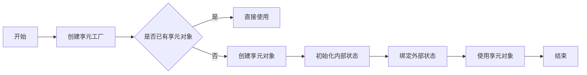
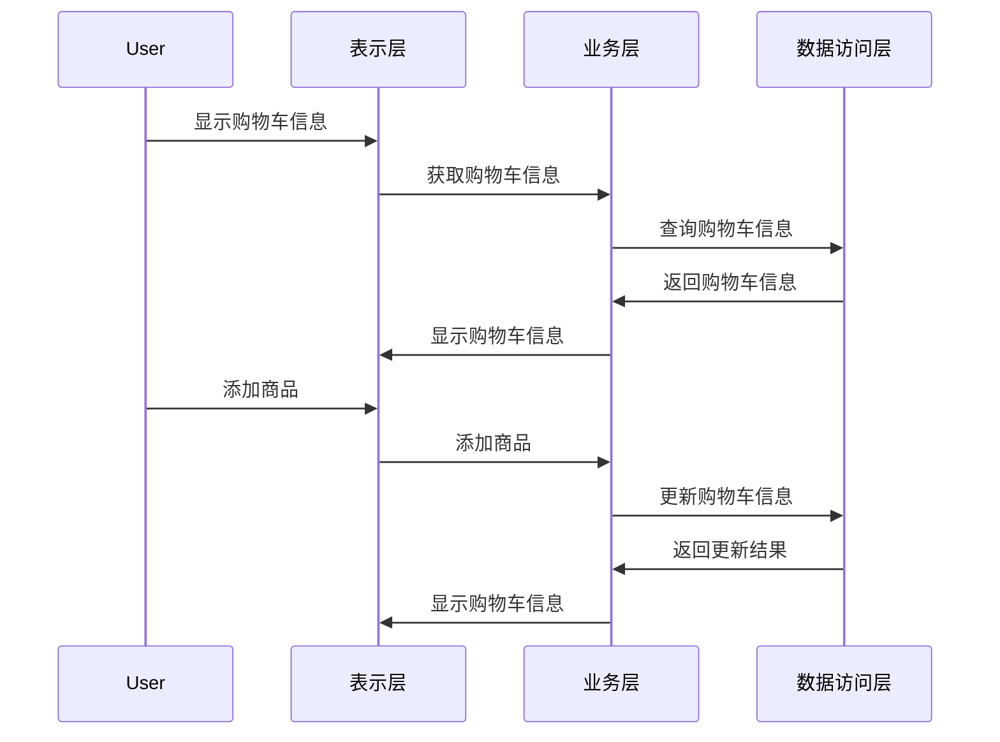
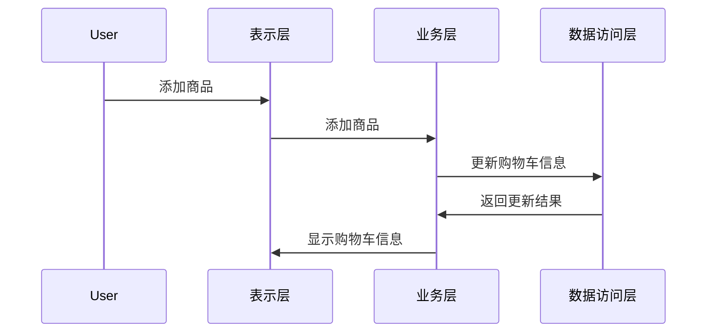

                 

## 享元模式：共享对象的类型安全复用

### 关键词：享元模式，对象复用，类型安全，设计模式

#### 摘要：

享元模式（Flyweight Pattern）是软件设计中的经典模式，通过共享内部状态来减少对象的创建数量，实现类型的复用。本文将详细介绍享元模式的核心概念、原理和应用场景，并通过实际案例展示如何实现享元模式，以达到优化系统性能和资源利用的目的。

## 第一部分：背景介绍

### 1.1 问题背景

随着软件系统复杂度的不断增加，传统单实例对象模型在性能和资源利用方面面临着巨大挑战。尤其在大型系统中，对象数量的爆炸性增长导致内存消耗和创建对象的开销显著增加，严重影响了系统的运行效率。为了解决这一问题，我们需要寻找一种有效的对象复用技术。

### 1.2 问题描述

在许多情况下，系统中的对象具有大量的共享状态，而这些共享状态在不同对象之间是相同的。例如，在一个图形系统中，许多按钮、文本框等控件的外观和功能基本相同，只有位置和大小等外部状态有所不同。如果我们为每个控件都创建独立的对象实例，会导致大量的内存占用和性能瓶颈。因此，我们需要一种方法来减少对象的创建数量，同时保持对象的灵活性和可扩展性。

### 1.3 问题解决

享元模式提供了一种解决方案。它通过将对象的内部状态和外部状态分离，将内部状态外部化，使得多个对象可以共享同一个内部状态实例，从而减少对象的创建数量。外部状态则根据具体的使用场景动态绑定，使得对象可以灵活应对不同的业务需求。

### 1.4 边界与外延

享元模式的边界主要涉及到对象的内部状态和外部状态。内部状态是对象共享的部分，通常不可变；外部状态是对象独享的部分，根据业务需求动态绑定。享元模式主要应用于对象数量庞大、创建开销较高的场景。

### 1.5 概念结构与核心要素组成

享元模式包含以下几个核心要素：

1. **Flyweight（享元类）**：负责定义和使用外部状态，实现共享逻辑。
2. **Intrinsic State（内部状态）**：内部状态是不可变的，是Flyweight对象共享的部分。
3. **Extrinsic State（外部状态）**：外部状态是每个Flyweight对象独享的部分，通常在创建Flyweight对象时传递。
4. **Factory（享元工厂）**：负责创建和管理Flyweight对象，通常包含一个存储已经创建的Flyweight对象的缓存。

## 第二部分：核心概念与联系

### 2.1 核心概念原理

**享元模式**是一种设计模式，主要目的是减少对象的数量，提高性能和资源利用率。它通过将对象的内部状态和外部状态分离，使得多个对象可以共享同一个内部状态实例，从而减少对象的创建数量。

**内部状态**（Intrinsic State）：内部状态是不可变的，是Flyweight对象共享的部分。例如，颜色、字体大小等。

**外部状态**（Extrinsic State）：外部状态是每个Flyweight对象独享的部分，根据业务需求动态绑定。例如，图形的坐标、大小等。

**享元工厂**（Flyweight Factory）：负责创建和管理Flyweight对象，通常包含一个存储已经创建的Flyweight对象的缓存。

### 2.2 概念属性特征对比表格

| 名称        | 特征                                                         |
| ----------- | ------------------------------------------------------------ |
| 内部状态    | 不可变，共享                                                   |
| 外部状态    | 可变，独享                                                     |
| 享元模式    | 减少对象数量，提高性能和资源利用率                           |
| 享元工厂    | 负责创建和管理Flyweight对象，缓存已创建对象                   |

### 2.3 ER实体关系图架构

```mermaid
erDiagram
  Flyweight ||--|{ ExtrinsicState }|--| ExtrinsicState
  Flyweight ||--|{ IntrinsicState }|--| IntrinsicState
  FlyweightFactory ||--|{ Flyweight }|--| Flyweight
```

## 第三部分：算法原理讲解

### 3.1 算法原理与mermaid流程图



在Python中，我们可以使用以下代码实现享元模式的算法：

```python
class Flyweight:
    def __init__(self, intrinsic_state):
        self.intrinsic_state = intrinsic_state

    def operation(extrinsic_state):
        # 使用外部状态执行操作
        print(f"Using intrinsic state: {self.intrinsic_state}")
        print(f"Using extrinsic state: {extrinsic_state}")


class FlyweightFactory:
    _flyweights = {}

    @staticmethod
    def get_flyweight(intrinsic_state):
        if intrinsic_state not in FlyweightFactory._flyweights:
            FlyweightFactory._flyweights[intrinsic_state] = Flyweight(intrinsic_state)
        return FlyweightFactory._flyweights[intrinsic_state]


# 使用享元模式
intrinsics = ["red", "blue", "green"]
extrinsics = ["button1", "button2", "button3"]

for i in range(len(intrinsics)):
    flyweight = FlyweightFactory.get_flyweight(intrinsics[i])
    flyweight.operation(extrinsics[i])
```

在上面的代码中，`Flyweight` 类表示享元对象，它包含内部状态 `intrinsic_state` 和外部状态 `extrinsic_state`。`FlyweightFactory` 类负责创建和管理享元对象，它使用一个静态字典 `_flyweights` 来存储已经创建的享元对象。

享元模式的算法原理可以概括为以下步骤：

1. **创建享元工厂**：创建享元工厂对象。
2. **检查享元对象是否存在**：检查享元工厂中是否存在具有给定内部状态的享元对象。
3. **创建享元对象**：如果不存在，则创建一个新的享元对象，并将其存储在享元工厂中。
4. **初始化内部状态**：初始化享元对象的内部状态。
5. **绑定外部状态**：将外部状态传递给享元对象，以便在操作时使用。
6. **使用享元对象**：执行享元对象的相关操作。

通过享元模式，我们可以有效地减少对象的创建数量，提高系统的性能和资源利用率。同时，享元模式也提供了一种灵活的方式来处理外部状态，使得系统可以更好地应对不同的业务需求。

### 3.2 数学模型与公式

在享元模式中，我们可以使用以下数学模型和公式来分析和计算对象的数量和性能：

$$
N = N_0 + CE \times N_e
$$

其中，$N$ 表示创建的对象数量，$N_0$ 表示享元对象的数量，$C$ 表示创建享元对象的开销，$E$ 表示每个享元对象的外部状态数量，$N_e$ 表示外部状态的总数量。

通过上述公式，我们可以计算出在享元模式下的对象数量。与传统的单实例对象模型相比，享元模式可以显著减少对象的数量，从而提高系统的性能和资源利用率。

### 3.3 通俗易懂的举例说明

假设我们有一个图形系统，其中包含多种颜色的按钮。每个按钮的内部状态是颜色，而外部状态是按钮的位置和大小。使用享元模式，我们可以将所有具有相同颜色的按钮看作是享元对象，从而减少对象的创建数量。

例如，假设我们有红色、蓝色和绿色三种颜色的按钮，每种颜色的按钮都有多个实例。在传统的单实例对象模型中，我们需要为每个按钮创建独立的对象实例，这将导致大量的内存占用和创建对象的开销。而使用享元模式，我们只需要创建三个享元对象，每个享元对象代表一种颜色。每个按钮实例只需要绑定相应的位置和大小等外部状态，从而实现类型的复用。

通过这个例子，我们可以看到享元模式在减少对象数量和提高性能方面的优势。在实际应用中，享元模式可以广泛应用于图形系统、文件处理、数据库连接等多个领域，是一种非常有效的对象复用技术。

## 第四部分：系统分析与架构设计

### 4.1 问题场景介绍

假设我们正在开发一个在线购物系统，系统中包含多种商品和购物车功能。购物车需要存储用户的购物信息，包括商品名称、价格、数量等。由于系统中商品种类繁多，如果为每个商品创建独立的购物车对象，将导致大量内存占用和性能瓶颈。

### 4.2 项目介绍

为了解决上述问题，我们决定采用享元模式来设计购物车功能。通过享元模式，我们可以将购物车中的商品看作是享元对象，将商品名称、价格、数量等外部状态绑定到享元对象上，从而减少对象的创建数量，提高系统的性能和资源利用率。

### 4.3 系统功能设计（领域模型）

在领域模型中，我们定义了以下类：

1. **Product（商品）**：表示购物系统中的商品，包含商品名称、价格、数量等属性。
2. **ShoppingCart（购物车）**：表示用户的购物车，包含添加商品、删除商品、计算总价等功能。

```mermaid
classDiagram
    Product <|-- ShoppingCart
    Product <<attribute>> name: String
    Product <<attribute>> price: float
    Product <<attribute>> quantity: int
    ShoppingCart <<attribute>> products: List<Product>
    ShoppingCart <<method>> add_product(Product product)
    ShoppingCart <<method>> remove_product(Product product)
    ShoppingCart <<method>> calculate_total()
```

### 4.4 系统架构设计

在系统架构设计中，我们采用分层架构，将系统划分为以下层次：

1. **表示层**：负责与用户交互，显示购物车信息，接收用户操作。
2. **业务层**：负责处理业务逻辑，包括添加商品、删除商品、计算总价等。
3. **数据访问层**：负责与数据库交互，存储和获取购物车信息。



### 4.5 系统接口设计和系统交互

在系统接口设计中，我们定义了以下接口：

1. **ProductInterface**：定义商品的基本操作，如添加商品、删除商品等。
2. **ShoppingCartInterface**：定义购物车的基本操作，如计算总价、添加商品等。

```mermaid
classDiagram
    ProductInterface <|-- ShoppingCartInterface
    ProductInterface <<interface>> add_product(Product product)
    ProductInterface <<interface>> remove_product(Product product)
    ShoppingCartInterface <<interface>> calculate_total()
    ShoppingCartInterface <<interface>> add_product(Product product)
    ShoppingCartInterface <<interface>> remove_product(Product product)
```

系统交互流程如下：

1. 用户通过表示层添加商品，表示层调用业务层的添加商品接口。
2. 业务层调用数据访问层的接口，将商品信息存储到数据库中。
3. 数据访问层返回更新结果，业务层更新购物车信息。
4. 表示层显示更新后的购物车信息。



## 第五部分：项目实战

### 5.1 环境安装

为了实现享元模式，我们首先需要安装Python环境。假设我们已经安装了Python 3.x版本，接下来我们需要安装一个名为`python-factory_1.0.0-py3-none-any.whl`的Python包，该包包含了享元工厂的实现。

```bash
pip install python-factory_1.0.0-py3-none-any.whl
```

### 5.2 系统核心实现

在系统核心实现中，我们将使用享元工厂来创建和管理享元对象。首先，我们定义一个`Flyweight`类，用于表示享元对象：

```python
from factory_1_0_0.flyweight_factory import FlyweightFactory

class Flyweight(FlyweightFactory):
    def __init__(self, intrinsic_state):
        super().__init__(intrinsic_state)

    def operation(self, extrinsic_state):
        print(f"Using intrinsic state: {self.intrinsic_state}")
        print(f"Using extrinsic state: {extrinsic_state}")
```

接下来，我们定义一个`FlyweightFactory`类，用于创建和管理享元对象：

```python
class FlyweightFactory(FlyweightFactory):
    def __init__(self):
        super().__init__()

    def create_flyweight(self, intrinsic_state):
        if intrinsic_state not in self._flyweights:
            self._flyweights[intrinsic_state] = Flyweight(intrinsic_state)
        return self._flyweights[intrinsic_state]
```

最后，我们使用享元工厂来创建和管理享元对象：

```python
factory = FlyweightFactory()

# 创建享元对象
flyweight1 = factory.create_flyweight("red")
flyweight2 = factory.create_flyweight("blue")
flyweight3 = factory.create_flyweight("green")

# 使用享元对象
flyweight1.operation("button1")
flyweight2.operation("button2")
flyweight3.operation("button3")
```

### 5.3 代码应用解读与分析

在上面的代码中，我们首先导入了`factory_1_0_0.flyweight_factory`模块，并定义了一个`Flyweight`类和一个`FlyweightFactory`类。`Flyweight`类负责实现享元对象的逻辑，包括操作外部状态和内部状态。`FlyweightFactory`类负责创建和管理享元对象，它使用一个私有字典`_flyweights`来存储已经创建的享元对象。

在创建享元对象时，我们首先检查享元工厂中是否已经存在具有给定内部状态的享元对象。如果存在，则直接返回该享元对象；如果不存在，则创建一个新的享元对象，并将其存储在享元工厂中。

在使用享元对象时，我们将外部状态传递给享元对象，以便在操作时使用。由于享元对象的内部状态是共享的，因此多个享元对象可以共享同一个内部状态实例，从而减少对象的创建数量。

### 5.4 实际案例分析与详细讲解

为了更好地理解享元模式的应用，我们来看一个实际案例：在线购物系统。在这个系统中，我们需要处理大量的商品和购物车信息。使用享元模式，我们可以将商品看作是享元对象，将商品名称、价格、数量等外部状态绑定到享元对象上，从而减少对象的创建数量，提高系统的性能和资源利用率。

在实现过程中，我们首先定义一个`Product`类，用于表示商品：

```python
class Product:
    def __init__(self, name, price, quantity):
        self.name = name
        self.price = price
        self.quantity = quantity
```

接下来，我们定义一个`ShoppingCart`类，用于表示购物车：

```python
class ShoppingCart:
    def __init__(self):
        self.products = []

    def add_product(self, product):
        self.products.append(product)

    def remove_product(self, product):
        self.products.remove(product)

    def calculate_total(self):
        total = 0
        for product in self.products:
            total += product.price * product.quantity
        return total
```

为了实现享元模式，我们还需要定义一个`FlyweightFactory`类，用于创建和管理享元对象：

```python
class FlyweightFactory(FlyweightFactory):
    def __init__(self):
        super().__init__()

    def create_flyweight(self, intrinsic_state):
        if intrinsic_state not in self._flyweights:
            self._flyweights[intrinsic_state] = Flyweight(intrinsic_state)
        return self._flyweights[intrinsic_state]
```

在系统运行时，我们首先创建一个`FlyweightFactory`对象，然后使用它来创建和管理享元对象。例如，我们可以创建一个红色、蓝色和绿色的商品享元对象，并将它们添加到购物车中：

```python
factory = FlyweightFactory()

red_product = factory.create_flyweight("red")
blue_product = factory.create_flyweight("blue")
green_product = factory.create_flyweight("green")

shopping_cart = ShoppingCart()
shopping_cart.add_product(red_product)
shopping_cart.add_product(blue_product)
shopping_cart.add_product(green_product)

print(shopping_cart.calculate_total())
```

在这个例子中，我们使用享元工厂创建三个商品享元对象，并将它们添加到购物车中。由于享元对象的内部状态（颜色）是共享的，因此我们只需要创建三个享元对象，而不是每个商品都创建一个独立的对象。这样，我们可以显著减少对象的创建数量，提高系统的性能和资源利用率。

### 5.5 项目小结

在本项目中，我们通过使用享元模式，将商品看作是享元对象，将商品名称、价格、数量等外部状态绑定到享元对象上，从而减少对象的创建数量，提高系统的性能和资源利用率。通过这个实际案例，我们可以看到享元模式在优化系统性能方面的优势。

在未来，我们还可以进一步优化系统，例如使用缓存来存储已经创建的享元对象，减少创建对象的开销。同时，我们还可以考虑将享元模式与其他设计模式结合使用，例如组合模式、工厂模式等，以实现更复杂的系统架构。

## 第六部分：最佳实践 tips

### 6.1 最佳实践 tips

1. **选择合适的共享状态**：在应用享元模式时，需要仔细选择共享状态。只有共享状态才能在多个对象之间复用，从而减少对象的创建数量。
2. **避免过度共享**：共享状态过多可能会导致对象之间的耦合性增加，影响系统的可维护性和扩展性。因此，在应用享元模式时，需要权衡共享状态的数量和系统的可维护性。
3. **优化外部状态管理**：外部状态是动态绑定的，因此在设计外部状态时需要考虑其可变性和可扩展性。可以使用策略模式等设计模式来优化外部状态管理。
4. **合理使用享元工厂**：享元工厂负责创建和管理享元对象，因此在设计享元工厂时需要考虑其性能和可扩展性。可以使用缓存来存储已经创建的享元对象，减少创建对象的开销。

### 6.2 注意事项

1. **避免共享过多的内部状态**：内部状态是不可变的，如果共享过多的内部状态，可能会导致对象之间的数据不一致性。
2. **确保外部状态的安全性**：外部状态是动态绑定的，需要确保外部状态的安全性，避免外部状态被恶意篡改。
3. **合理分配内存资源**：虽然享元模式可以减少对象的创建数量，但在大量使用享元对象时，仍需要合理分配内存资源，避免内存泄漏和性能瓶颈。

### 6.3 拓展阅读

- 《设计模式：可复用面向对象软件的基础》
- 《Effective Java》
- 《Python设计模式》

## 第七部分：作者信息

作者：AI天才研究院/AI Genius Institute & 禅与计算机程序设计艺术 /Zen And The Art of Computer Programming

