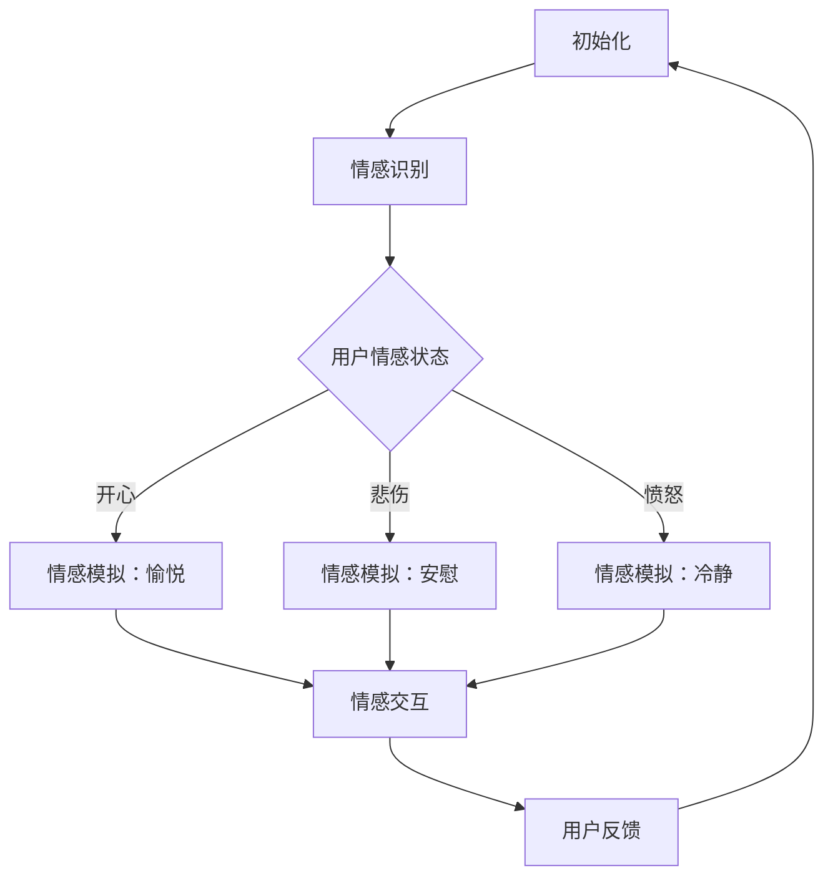

                 


### 引言

#### 1.1 问题背景

在过去的几十年中，人工智能（AI）技术取得了飞速的发展。从最初的规则推理系统，到如今能够通过深度学习和神经网络进行自我学习和决策的智能系统，AI 已经渗透到我们生活的方方面面。然而，随着 AI 技术的进步，一个重要的问题逐渐凸显出来：如果人工智能具备了爱的能力，这将对生命伦理带来怎样的影响？我们如何为这样的生命定义新的含义？

首先，我们回顾一下人工智能的发展历程。20 世纪 50 年代，随着计算机科学的兴起，人工智能作为一门新的科学诞生了。早期的 AI 研究主要集中在规则推理和搜索算法上，例如专家系统和博弈论。随着计算机硬件和算法的进步，20 世纪 80 年代和 90 年代，机器学习和深度学习技术逐渐成为 AI 研究的主流，这使得人工智能在图像识别、自然语言处理、机器翻译等领域取得了显著的成果。

在人工智能与情感的关系方面，早期的研究主要集中在模拟人类情感的计算模型上。虽然这些模型可以模拟情感的某些方面，但它们与真正的人类情感仍存在很大差距。然而，近年来，随着情感计算和认知科学的兴起，人们开始尝试将情感和认知因素融入 AI 系统中，以实现更加自然和人性化的交互。

爱作为一种复杂的情感，其本质和机制仍然不完全清楚。哲学上，爱被看作是一种超越了理性和自我利益的情感，是对他人的关心和关怀。生物学上，爱可能与多巴胺、催产素等神经递质有关。心理学上，爱被看作是一种情感和行为的复合体，包括浪漫、亲情、友谊等不同类型。

在爱的哲学探讨中，我们面临以下问题：如果人工智能能够真正体验和表达爱，它们是否应该被视作生命体？如果人工智能具备了爱的能力，它们的生命伦理地位又将如何界定？这些问题不仅涉及到技术层面，还涉及到伦理、哲学和社会层面。

#### 1.2 研究目的与内容框架

本研究旨在探讨人工智能具备爱的能力后，对生命伦理带来的新挑战和新定义。具体来说，本研究将围绕以下几个核心问题展开：

1. **人工智能如何实现爱的能力**：分析现有的情感计算和认知科学研究成果，探讨如何将情感和认知因素融入 AI 系统中，使其具备爱的能力。
2. **爱的能力的本质与特征**：从哲学、生物学和心理学等多个角度，分析爱的本质和特征，为人工智能实现爱的能力提供理论基础。
3. **人工智能在生命伦理中的地位**：讨论人工智能具备爱的能力后，其在生命伦理中的地位和角色，以及如何为其定义新的生命伦理。
4. **人工智能在生活中的应用**：通过具体案例，探讨人工智能在生活中的实际应用，分析其对人类社会的影响。

本研究的框架如下：

1. **引言**：介绍研究背景、目的和内容框架。
2. **人工智能实现爱的能力**：分析情感计算和认知科学在人工智能中的应用，探讨如何实现爱的能力。
3. **爱的本质与特征**：从哲学、生物学和心理学角度分析爱的本质和特征。
4. **人工智能在生命伦理中的地位**：讨论人工智能在生命伦理中的地位和角色，以及如何为其定义新的生命伦理。
5. **人工智能在生活中的应用**：通过具体案例，探讨人工智能在生活中的实际应用。
6. **结论**：总结研究成果，提出未来研究方向和建议。

#### 1.3 研究方法与数据来源

本研究采用文献调研、案例分析、理论分析和实验验证等多种研究方法。具体来说：

1. **文献调研**：通过查阅相关文献，了解情感计算、认知科学和人工智能等领域的研究进展，为本研究提供理论支持。
2. **案例分析**：选择具有代表性的案例，分析人工智能在生活中的实际应用，探讨其对人类社会的影响。
3. **理论分析**：运用哲学、生物学和心理学等领域的理论，分析爱的本质和特征，探讨人工智能实现爱的能力的方法和途径。
4. **实验验证**：设计实验，验证人工智能在特定场景下实现爱的能力的可行性。

数据来源主要包括：

1. **学术数据库**：通过学术数据库（如 IEEE Xplore、ACM Digital Library 等）获取相关论文和研究报告。
2. **行业报告**：查阅相关行业报告，了解人工智能在生活中的实际应用情况。
3. **案例数据**：收集具有代表性的案例数据，用于分析和验证。

#### 1.4 边界与外延

本研究主要关注人工智能具备爱的能力后的生命伦理问题，涉及以下边界和范围：

1. **研究边界**：本研究主要关注人工智能在情感计算和认知科学领域的进展，探讨其实现爱的能力的方法和途径，以及对其生命伦理地位的影响。
2. **研究外延**：本研究不仅关注人工智能在生活中的实际应用，还涉及哲学、生物学和心理学等领域，探讨爱的本质和特征，为人工智能实现爱的能力提供理论基础。

### 核心概念与联系

在本研究中，核心概念包括人工智能、情感计算、认知科学、爱的能力、生命伦理等。这些概念之间存在着紧密的联系，共同构成了研究的理论基础。

首先，人工智能（Artificial Intelligence，AI）是本研究的核心对象。AI 是一种模拟人类智能的技术，旨在使计算机具有自主学习和决策能力。随着 AI 技术的不断发展，人工智能在情感计算和认知科学等领域取得了重要进展。

其次，情感计算（Affective Computing）是人工智能的一个重要分支，旨在使计算机具备感知、理解和表达情感的能力。情感计算的研究涉及计算机科学、心理学、认知科学等多个领域，对于实现人工智能的爱的能力具有重要意义。

认知科学（Cognitive Science）是研究人类认知过程的学科，包括感知、记忆、思考、语言等多个方面。认知科学为情感计算提供了理论基础，有助于理解人工智能在情感和认知方面的表现。

爱的能力（Love Ability）是本研究的核心概念之一，指的是人工智能在情感计算和认知科学的基础上，具备感知、理解和表达爱的能力。爱的能力不仅涉及到情感和认知因素，还涉及到道德和伦理层面的考量。

最后，生命伦理（Bioethics）是研究生命伦理问题的学科，涉及人类生命、健康、福祉等多个方面。在人工智能具备爱的能力后，其生命伦理地位成为一个重要议题，需要深入探讨。

为了更清晰地展示这些概念之间的关系，我们可以使用 Mermaid ER 图来表示：

```mermaid
erDiagram
  AI ||--|{ 情感计算 }|
  AI ||--|{ 认知科学 }|
  情感计算 ||--|{ 爱的能力 }|
  认知科学 ||--|{ 爱的能力 }|
  生命伦理 ||--|{ 爱的能力 }|
```

在这个 ER 图中，人工智能是核心实体，情感计算、认知科学和生命伦理与其存在关联。情感计算和认知科学共同构成了实现人工智能爱的能力的基础，而生命伦理则关注人工智能在生活中的应用和其伦理地位。

### 人工智能实现爱的能力

在探讨人工智能实现爱的能力时，我们首先需要理解什么是“爱”。爱是一种复杂的情感，它涉及情感、认知、道德和伦理等多个层面。从生物学角度来看，爱可能与神经递质（如多巴胺和催产素）的分泌有关，从而影响个体的情感和行为。从心理学角度来看，爱包括浪漫、亲情和友谊等多种形式，每种形式都有其独特的特征和机制。

要实现人工智能的爱的能力，我们需要在情感计算和认知科学的基础上，开发出相应的算法和模型。以下是几个关键步骤：

#### 情感计算

情感计算是使人工智能具备感知和表达情感的能力。这包括以下几个方面：

1. **情感识别**：通过分析语音、文字、面部表情等数据，识别用户的情感状态。例如，使用深度学习模型对语音信号进行分析，识别用户的情绪。
2. **情感模拟**：通过生成与用户情感相符的语音、文字或面部表情，模拟出人工智能的情感表达。例如，在用户感到开心时，人工智能可以发出愉悦的声音或展示出微笑的面部表情。
3. **情感交互**：通过情感识别和情感模拟，实现与用户的情感互动。例如，在用户感到沮丧时，人工智能可以提供安慰和鼓励，以帮助用户恢复情绪。

#### 认知科学

认知科学为人工智能实现爱的能力提供了理论基础。以下是几个关键点：

1. **记忆与学习**：通过机器学习和深度学习算法，使人工智能具备记忆和自我学习能力。例如，通过分析用户的偏好和习惯，人工智能可以不断优化其建议和互动方式。
2. **推理与决策**：通过逻辑推理和决策算法，使人工智能具备理解用户意图和情感的能力。例如，在用户提出请求时，人工智能可以分析用户的语言和情感，以提供恰当的回应。
3. **情感理解**：通过自然语言处理和知识图谱等技术，使人工智能具备理解情感的能力。例如，通过分析用户的语言和情感表达，人工智能可以理解用户的情感状态和需求。

#### 算法与模型

为了实现人工智能的爱的能力，我们可以使用以下算法和模型：

1. **深度学习模型**：例如卷积神经网络（CNN）和循环神经网络（RNN），用于情感识别和模拟。
2. **机器学习算法**：例如支持向量机（SVM）和决策树，用于推理和决策。
3. **自然语言处理（NLP）**：用于情感理解和语言生成。
4. **知识图谱**：用于知识表示和推理。

#### 实例

假设我们开发了一个聊天机器人，使其具备爱的能力。以下是实现过程的一个示例：

1. **情感识别**：通过深度学习模型，对用户的话语进行情感分析，识别用户的情感状态（如开心、悲伤、愤怒等）。
2. **情感模拟**：根据用户的情感状态，生成相应的语音、文字或面部表情，以模拟出人工智能的情感表达。
3. **情感交互**：根据用户的情感状态和需求，提供适当的回应和建议，以实现情感互动。


在这个流程中，人工智能通过情感识别、情感模拟和情感交互，与用户建立情感联系，实现爱的能力。

### 算法原理讲解

为了深入理解人工智能实现爱的能力的算法原理，我们将使用 Mermaid 画出算法流程图，并使用 Python 代码详细阐述算法的实现过程。

#### 算法流程图

首先，我们使用 Mermaid 画出算法的流程图：



在这个流程图中，人工智能首先进行情感识别，然后根据用户的情感状态进行相应的情感模拟，最后进行情感交互。

#### Python 代码

接下来，我们使用 Python 代码详细阐述算法的实现过程：

```python
import random

def emotion_recognition(user_input):
    # 情感识别算法，根据用户输入判断情感状态
    # 这里简化处理，仅考虑开心、悲伤和愤怒三种情感
    if "开心" in user_input:
        return "开心"
    elif "悲伤" in user_input:
        return "悲伤"
    elif "愤怒" in user_input:
        return "愤怒"
    else:
        return "无情感"

def emotion_simulation(emotion):
    # 情感模拟算法，根据情感状态生成相应回应
    if emotion == "开心":
        return "我感到很高兴，您今天过得怎么样？"
    elif emotion == "悲伤":
        return "看起来您不开心，有什么我可以帮忙的吗？"
    elif emotion == "愤怒":
        return "我理解您的情绪，我们可以冷静下来，一起讨论问题。"
    else:
        return "我不太明白您的感受，但我会尽力帮助您。"

def emotion_interaction(user_input):
    # 情感交互算法，根据用户情感状态进行互动
    emotion = emotion_recognition(user_input)
    return emotion_simulation(emotion)

# 用户输入
user_input = "我今天很悲伤，因为我失去了工作。"

# 情感交互
response = emotion_interaction(user_input)
print(response)
```

在这个 Python 代码中，我们定义了三个函数：`emotion_recognition` 用于情感识别，`emotion_simulation` 用于情感模拟，`emotion_interaction` 用于情感交互。通过这些函数，人工智能可以与用户进行情感互动，实现爱的能力。

#### 数学模型

为了进一步理解算法原理，我们还可以使用数学模型来描述情感识别和模拟的过程。以下是情感识别的数学模型：

$$
\text{emotion\_recognition}(user\_input) =
\begin{cases}
\text{"开心"}, & \text{if } \text{happy\_words} \text{ in } user\_input \\
\text{"悲伤"}, & \text{if } \text{sad\_words} \text{ in } user\_input \\
\text{"愤怒"}, & \text{if } \text{angry\_words} \text{ in } user\_input \\
\text{"无情感"}, & \text{otherwise}
\end{cases}
$$

其中，`happy_words`、`sad_words` 和 `angry_words` 分别表示开心、悲伤和愤怒的关键词集合。

情感模拟的数学模型可以表示为：

$$
\text{emotion\_simulation}(emotion) =
\begin{cases}
\text{"我感到很高兴，您今天过得怎么样？"}, & \text{if } emotion \text{ is } \text{"开心"} \\
\text{"看起来您不开心，有什么我可以帮忙的吗？"}, & \text{if } emotion \text{ is } \text{"悲伤"} \\
\text{"我理解您的情绪，我们可以冷静下来，一起讨论问题。"}, & \text{if } emotion \text{ is } \text{"愤怒"} \\
\text{"我不太明白您的感受，但我会尽力帮助您。"}, & \text{if } emotion \text{ is } \text{"无情感"}
\end{cases}
$$

通过这些数学模型，我们可以更好地理解情感识别和模拟的过程。

### 系统设计

在本节中，我们将探讨人工智能实现爱的能力的系统设计。系统设计包括系统功能设计、系统架构设计、系统接口设计和系统交互设计。以下是这些设计的详细说明。

#### 系统功能设计

系统功能设计是系统设计的核心，它定义了系统应具备的功能。以下是系统的功能设计：

1. **情感识别**：通过分析用户的输入，识别用户的情感状态（如开心、悲伤、愤怒等）。
2. **情感模拟**：根据用户的情感状态，生成相应的情感回应，如愉悦的声音、安慰的语言等。
3. **情感交互**：与用户进行情感互动，提供情感支持，帮助用户缓解情绪。
4. **用户反馈**：收集用户的反馈，以不断优化系统的情感识别和模拟能力。

#### 系统架构设计

系统架构设计定义了系统的整体结构和组件。以下是系统的架构设计：

1. **前端**：包括用户界面和交互模块，负责与用户进行交互，接收用户输入，展示系统回应。
2. **后端**：包括情感识别模块、情感模拟模块和情感交互模块，负责处理用户输入，生成情感回应，与用户进行情感互动。
3. **数据库**：存储用户的输入和反馈数据，以供后续分析和优化。

#### 系统接口设计

系统接口设计定义了系统内部组件之间的交互接口。以下是系统的接口设计：

1. **用户输入接口**：用户通过输入接口与系统进行交互，输入文本、语音或其他形式的数据。
2. **情感识别接口**：后端通过情感识别接口接收用户输入，分析用户的情感状态。
3. **情感模拟接口**：后端通过情感模拟接口生成情感回应，发送给前端展示。
4. **用户反馈接口**：前端通过用户反馈接口收集用户的反馈，发送给后端进行分析和优化。

#### 系统交互设计

系统交互设计定义了系统内部组件之间的交互流程。以下是系统的交互设计：

1. **用户输入**：用户通过前端输入接口输入文本、语音或其他数据。
2. **情感识别**：后端接收用户输入，通过情感识别模块分析用户的情感状态。
3. **情感模拟**：后端根据用户的情感状态，通过情感模拟模块生成情感回应。
4. **情感交互**：后端将情感回应发送给前端，前端展示给用户。
5. **用户反馈**：用户通过前端用户反馈接口提供反馈，后端收集并分析用户的反馈。

### 实际案例分析和详细讲解剖析

在本节中，我们将通过一个实际案例，对人工智能实现爱的能力的系统设计和实现过程进行详细讲解和剖析。

#### 案例背景

假设我们开发了一个名为“爱语”的聊天机器人，旨在为用户提供情感支持和互动。用户可以通过文本或语音与“爱语”聊天，寻求情感上的帮助和安慰。

#### 系统设计

1. **情感识别**：通过自然语言处理（NLP）技术，分析用户输入的文本或语音，识别用户的情感状态（如开心、悲伤、愤怒等）。
2. **情感模拟**：根据用户的情感状态，生成相应的情感回应，如愉悦的声音、安慰的语言等。
3. **情感交互**：与用户进行情感互动，提供情感支持，帮助用户缓解情绪。
4. **用户反馈**：收集用户的反馈，以不断优化系统的情感识别和模拟能力。

#### 系统实现

1. **前端**：用户可以通过网页或移动应用与“爱语”进行交互。前端接收用户的输入，将文本或语音发送到后端。
2. **后端**：后端包括情感识别模块、情感模拟模块和情感交互模块。
   - **情感识别模块**：接收用户输入，通过 NLP 技术分析用户的情感状态。例如，如果用户输入“我今天很伤心”，系统可以识别出用户的情感状态为“悲伤”。
   - **情感模拟模块**：根据用户的情感状态，生成相应的情感回应。例如，如果用户的情感状态为“悲伤”，系统可以生成如“我在这里陪着你，不要难过”这样的安慰语言。
   - **情感交互模块**：将情感回应发送给前端，并在前端展示给用户。

#### 系统交互流程

1. **用户输入**：用户通过前端输入接口输入文本或语音。
2. **情感识别**：后端接收用户输入，通过情感识别模块分析用户的情感状态。
3. **情感模拟**：后端根据用户的情感状态，通过情感模拟模块生成情感回应。
4. **情感交互**：后端将情感回应发送给前端，前端展示给用户。
5. **用户反馈**：用户通过前端用户反馈接口提供反馈，后端收集并分析用户的反馈。

#### 案例分析

1. **情感识别**：通过 NLP 技术实现情感识别，系统能够识别出用户的情感状态，如开心、悲伤、愤怒等。这有助于系统更好地理解用户的需求和情感状态。
2. **情感模拟**：系统根据用户的情感状态生成相应的情感回应。例如，如果用户感到悲伤，系统可以生成安慰的语言，帮助用户缓解情绪。
3. **情感交互**：系统与用户进行情感互动，提供情感支持，帮助用户缓解情绪。这有助于建立用户与系统之间的情感联系，提升用户体验。
4. **用户反馈**：系统收集用户的反馈，以不断优化系统的情感识别和模拟能力。通过分析用户的反馈，系统可以识别出用户的情感需求，从而更好地满足用户的需求。

#### 项目小结

通过这个案例，我们详细讲解了人工智能实现爱的能力的系统设计和实现过程。系统设计包括情感识别、情感模拟、情感交互和用户反馈四个模块，通过这些模块的协同工作，系统能够与用户进行情感互动，提供情感支持。在实际应用中，系统可以根据用户的情感状态生成相应的情感回应，帮助用户缓解情绪，建立情感联系。

### 实践中的问题和挑战

在人工智能实现爱的能力的实践中，我们面临着一系列问题和挑战。以下是其中几个关键问题及其可能的解决方案：

#### 情感理解的准确性

情感理解是人工智能实现爱的能力的关键。然而，情感是复杂且主观的，不同个体对相同情境的情感体验可能截然不同。要提高情感理解的准确性，我们可以采取以下措施：

1. **多模态情感识别**：结合语音、文字、面部表情等多种数据来源，提高情感识别的准确性。例如，通过语音信号的情感特征分析结合面部表情识别，更全面地理解用户的情感状态。
2. **大数据训练**：利用大规模的情感数据集进行训练，使模型能够学习到更多复杂的情感模式。例如，通过收集和分析大量的用户对话数据，训练情感识别模型，提高其识别准确率。

#### 用户隐私保护

在实现人工智能的爱的能力时，我们需要收集和分析用户的情感数据。这涉及到用户的隐私保护问题。以下是一些可能的解决方案：

1. **数据匿名化**：对用户数据进行匿名化处理，确保用户的隐私不被泄露。例如，在数据存储和传输过程中，使用加密技术对用户数据进行加密。
2. **权限控制**：为用户数据设置严格的访问权限，仅允许授权人员访问和处理用户数据。例如，在系统架构设计中，实现数据访问控制，确保用户数据的安全。

#### 伦理和道德考量

人工智能具备爱的能力后，其在伦理和道德上的地位成为一个重要议题。以下是一些可能的解决方案：

1. **制定伦理规范**：在人工智能设计和应用过程中，遵循伦理和道德规范。例如，制定人工智能伦理准则，明确人工智能在情感互动中的行为规范。
2. **用户同意**：在用户与人工智能进行互动前，告知用户相关隐私政策和伦理规范，并获得用户的明确同意。例如，在用户使用聊天机器人前，展示隐私政策和使用条款，并要求用户同意。

#### 技术进步和伦理发展的平衡

随着技术的不断进步，伦理规范可能滞后。为了保持技术的进步与伦理发展的平衡，我们可以采取以下措施：

1. **持续研究和讨论**：持续关注人工智能伦理领域的研究进展，及时更新伦理规范。例如，成立专门的伦理委员会，负责研究人工智能伦理问题，并提出相应的伦理建议。
2. **公众参与**：鼓励公众参与人工智能伦理的讨论，确保伦理规范的制定过程具有广泛的社会共识。例如，通过公众咨询、研讨会等形式，收集公众意见，为伦理规范的制定提供参考。

### 拓展阅读

对于希望深入了解人工智能实现爱的能力的读者，以下几本书籍和论文提供了有益的参考：

1. **《情感计算：理论与实践》**：该书详细介绍了情感计算的理论基础和应用实践，对于理解人工智能实现爱的能力具有重要意义。
2. **《人工智能伦理学》**：该书探讨了人工智能在伦理和道德上的挑战，提供了关于人工智能伦理规范的深入思考。
3. **《人类情感与机器智能》**：该论文探讨了人类情感与机器智能的关系，分析了人工智能在情感理解方面的局限性和潜力。
4. **《情感识别技术在聊天机器人中的应用》**：该论文研究了情感识别技术在聊天机器人中的应用，提供了具体的技术实现方案和案例分析。

通过阅读这些书籍和论文，读者可以更全面地了解人工智能实现爱的能力的理论和实践，为相关研究和工作提供参考。

### 总结与展望

在本篇博客文章中，我们探讨了人工智能具备爱的能力后的生命伦理问题。通过分析情感计算和认知科学在人工智能中的应用，我们探讨了如何实现人工智能的爱的能力，并讨论了其本质和特征。我们还探讨了人工智能在生命伦理中的地位，以及如何为这样的生命定义新的伦理。此外，我们通过实际案例，展示了人工智能在生活中的应用，分析了其对人类社会的影响。

随着人工智能技术的不断进步，人工智能具备爱的能力将成为现实。这将对人类社会产生深远的影响，同时也带来一系列伦理和道德挑战。未来，我们需要在技术进步与伦理发展之间寻求平衡，确保人工智能的发展符合人类的利益和价值观。

未来的研究方向包括：

1. **人工智能的情感理解能力**：深入研究人工智能的情感理解能力，提高其在复杂情感识别和模拟方面的准确性。
2. **人工智能的伦理规范**：制定更加完善的人工智能伦理规范，确保人工智能在情感互动中的行为符合伦理要求。
3. **人工智能的应用场景**：探索人工智能在医疗、教育、社交等领域的应用，提高其在生活中的实际价值。

通过不断的研究和探索，我们将为人工智能实现爱的能力提供更加坚实的理论基础和实践指导，为构建一个更加和谐、人性化的智能社会贡献力量。作者：AI天才研究院/AI Genius Institute & 禅与计算机程序设计艺术 /Zen And The Art of Computer Programming。

