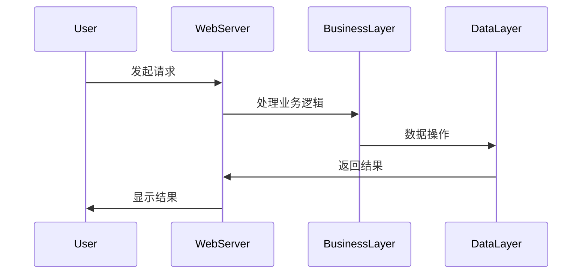
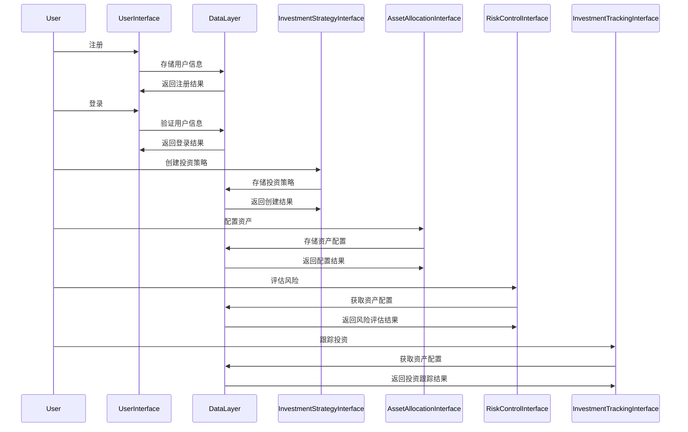

                 


### 第一部分：背景介绍

#### 第1章：问题背景与核心概念

**1.1.1 问题背景**

个人理财是一个涉及众多领域的复杂过程，它不仅仅包括储蓄、投资和消费等基本行为，还涵盖了风险管理、税收规划、退休规划等多方面的内容。随着经济的发展和金融市场的不断变化，个人理财的需求也在不断增长，但同时，理财的复杂性也在增加。因此，如何有效地进行个人理财，已经成为许多人关注的问题。

在传统的理财方式中，投资者往往需要依靠专业的金融顾问进行投资决策。然而，这种模式存在一些问题，如成本高、信息不对称、顾问经验有限等。随着人工智能技术的快速发展，利用人工智能技术提供智能投资顾问服务成为了一种新的解决方案。

**1.1.2 智能投资顾问的概念**

智能投资顾问，又称为机器人理财顾问（Robo-Advisor），是指利用人工智能技术和算法，根据用户的财务状况、投资目标和风险偏好，提供个性化投资建议和服务的一种在线投资工具。智能投资顾问的主要功能包括：

- **资产配置**：根据用户的投资目标和风险偏好，制定合适的资产配置策略。
- **风险管理**：评估投资组合的风险，并提供风险管理建议。
- **投资建议**：根据市场变化和用户需求，提供实时的投资建议。
- **投资跟踪**：跟踪投资组合的表现，并提供反馈和建议。

**1.1.3 问题解决与人工智能的关系**

人工智能技术在理财领域的应用，主要体现在以下几个方面：

- **数据分析**：利用人工智能技术，可以对大量的财务数据进行深入分析，从而发现潜在的投资机会和风险。
- **预测与建模**：通过建立数学模型和预测模型，可以预测市场的走势和投资组合的表现，为投资决策提供依据。
- **个性化服务**：通过用户数据的学习和分析，可以为用户提供个性化的投资建议和服务。
- **自动化操作**：通过自动化算法，可以实现投资决策的自动化，提高投资效率。

**1.1.4 边界与外延**

智能投资顾问虽然具有许多优势，但它的应用仍然存在一定的边界和限制。例如：

- **数据隐私**：智能投资顾问需要收集大量的用户数据，这可能会引发数据隐私的问题。
- **市场波动**：市场的不确定性可能导致投资顾问的建议失效。
- **用户体验**：用户可能对智能投资顾问的决策过程和结果缺乏信任。

**1.1.5 与其他理财工具的比较**

智能投资顾问与传统金融顾问、自助投资平台等理财工具相比，具有以下特点：

- **成本**：智能投资顾问通常成本较低，而传统金融顾问费用较高。
- **效率**：智能投资顾问可以快速处理大量数据，提供实时的投资建议，而传统金融顾问处理数据较慢。
- **个性化**：智能投资顾问可以根据用户数据提供个性化的投资建议，而传统金融顾问可能无法做到这一点。

#### 第2章：核心概念与联系

**2.1.1 人工智能基础概念**

人工智能（Artificial Intelligence，简称AI）是计算机科学的一个分支，旨在研究、开发和应用使计算机具备人类智能的技术。人工智能的主要研究领域包括机器学习、深度学习、自然语言处理、计算机视觉等。

- **机器学习**：机器学习是一种通过算法让计算机从数据中学习，并做出决策或预测的技术。
- **深度学习**：深度学习是机器学习的一种方法，它使用多层神经网络来模拟人类大脑的学习过程。
- **自然语言处理**：自然语言处理是研究计算机如何理解和生成自然语言的技术。
- **计算机视觉**：计算机视觉是研究计算机如何理解图像和视频的技术。

**2.1.2 个人理财相关概念**

个人理财涉及多个概念，包括投资策略、风险控制、财务分析、预测等。

- **投资策略**：投资策略是指投资者在投资过程中采取的具体操作方法和原则，包括资产配置、选择投资品种、风险管理等。
- **风险控制**：风险控制是指投资者在投资过程中采取措施降低风险的过程。
- **财务分析**：财务分析是指通过分析财务数据，评估企业的财务状况和经营成果。
- **预测**：预测是指根据历史数据和现有信息，对未来进行预测。

**2.1.3 概念属性特征对比**

下面是一个简单的概念属性特征对比表格：

| 概念         | 属性特征                                                                                      |
|------------|------------------------------------------------------------------------------------------------|
| 人工智能     | 学习、推理、预测、自动化、智能化等                                                           |
| 智能投资顾问 | 个性化、自动化、数据分析、投资建议、风险管理等                                             |
| 投资策略     | 资产配置、选择投资品种、风险管理等                                                         |
| 风险控制     | 风险评估、风险分散、风险规避等                                                             |
| 财务分析     | 财务数据收集、处理、分析等                                                                 |
| 预测         | 历史数据、现有信息、未来预测等                                                             |

**2.1.4 ER实体关系图架构**

下面是一个ER实体关系图架构的Mermaid流程图：

```mermaid
erDiagram
  User ||--|{ InvestmentAdvisor }
  User ||--|{ Portfolio }
  InvestmentAdvisor ||--|{ Recommendation }
  Portfolio ||--|{ Asset }
  Recommendation ||--|{ Trade }
```

- **User**（用户）：代表个人理财的用户。
- **InvestmentAdvisor**（投资顾问）：代表智能投资顾问。
- **Portfolio**（投资组合）：代表用户的投资组合。
- **Recommendation**（推荐）：代表投资顾问给出的投资建议。
- **Asset**（资产）：代表投资组合中的资产。
- **Trade**（交易）：代表投资顾问给出的交易建议。

### 第二部分：算法原理讲解

#### 第3章：投资策略优化算法

**3.1.1 算法原理**

投资策略优化算法是一种通过优化投资组合来最大化收益或最小化风险的方法。它通常涉及以下步骤：

1. **数据收集**：收集历史市场数据、用户投资偏好、财务状况等信息。
2. **特征提取**：对数据进行分析，提取对投资决策有用的特征。
3. **模型建立**：根据提取的特征，建立投资策略优化模型。
4. **策略优化**：使用优化算法，寻找最优投资组合。
5. **策略执行**：根据优化结果，执行投资策略。

**3.1.2 数学模型与公式**

一个简单的投资策略优化模型可以表示为：

$$
\begin{aligned}
\max\limits_{w} \quad & \pi = \mu \cdot w \\
\text{s.t.} \quad & \rho \cdot w \leq R \\
& \rho^T \cdot w = 1
\end{aligned}
$$

其中：

- **$\pi$**：投资组合的预期收益。
- **$w$**：投资组合的权重向量。
- **$\mu$**：资产预期收益率向量。
- **$\rho$**：资产预期风险向量。
- **$R$**：风险约束。

**3.1.3 算法讲解与举例说明**

假设我们有以下两支股票，每支股票的预期收益率和预期风险如下：

| 股票 | 预期收益率（$\mu$） | 预期风险（$\rho$） |
|------|---------------------|---------------------|
| A    | 0.1                 | 0.2                 |
| B    | 0.2                 | 0.3                 |

我们希望投资组合的预期收益率为0.15，风险为0.25。根据上述数学模型，我们可以建立以下优化问题：

$$
\begin{aligned}
\max\limits_{w} \quad & \pi = w_1 \cdot 0.1 + w_2 \cdot 0.2 \\
\text{s.t.} \quad & w_1 \cdot 0.2 + w_2 \cdot 0.3 \leq 0.25 \\
& w_1 + w_2 = 1
\end{aligned}
$$

通过求解上述优化问题，我们可以得到最优的投资组合权重：

- **$w_1$**：0.6
- **$w_2$**：0.4

这意味着我们应该将60%的资金投资于股票A，40%的资金投资于股票B，以实现预期的收益和风险。

**3.1.4 Python代码实现**

下面是一个简单的Python代码实现，用于求解上述优化问题：

```python
import numpy as np
from scipy.optimize import linprog

# 定义预期收益率和预期风险
mu = np.array([0.1, 0.2])
rho = np.array([0.2, 0.3])

# 定义目标函数
c = mu

# 定义约束条件
A = -rho
b = -0.25
A_eq = np.array([1, 1])
b_eq = 1

# 求解线性规划问题
result = linprog(c, A_ub=A, b_ub=b, A_eq=A_eq, b_eq=b_eq, method='highs')

# 输出结果
if result.success:
    print("最优解：")
    print("权重w1:", result.x[0])
    print("权重w2:", result.x[1])
else:
    print("求解失败")
```

运行上述代码，我们可以得到最优的投资组合权重。

### 第三部分：系统设计与架构

#### 第4章：系统功能设计

**4.1.1 问题描述**

智能投资顾问系统是一个复杂的系统，它需要提供多种功能，包括用户管理、投资策略管理、资产配置、风险控制、投资跟踪等。为了更好地理解系统的功能需求，我们首先需要明确系统需要解决的问题。

**4.1.2 系统功能模块划分**

根据问题需求，我们可以将智能投资顾问系统划分为以下几个模块：

- **用户管理模块**：负责用户的注册、登录、信息管理等功能。
- **投资策略管理模块**：负责投资策略的创建、修改、删除等功能。
- **资产配置模块**：负责根据用户的投资目标和风险偏好，自动配置投资组合。
- **风险控制模块**：负责评估投资组合的风险，并提供风险控制建议。
- **投资跟踪模块**：负责跟踪投资组合的表现，并提供反馈和建议。

**4.1.3 领域模型**

为了更好地设计系统功能，我们可以使用领域模型来描述系统的功能和行为。下面是一个简单的领域模型：

```mermaid
classDiagram
  User <<interface>>
  InvestmentStrategy <<interface>>
  AssetAllocation <<interface>>
  RiskControl <<interface>>
  InvestmentTracking <<interface>>

  User o-- InvestmentStrategy
  User o-- AssetAllocation
  User o-- RiskControl
  User o-- InvestmentTracking
```

- **User**（用户）：用户管理模块的接口，负责用户的注册、登录、信息管理等功能。
- **InvestmentStrategy**（投资策略）：投资策略管理模块的接口，负责投资策略的创建、修改、删除等功能。
- **AssetAllocation**（资产配置）：资产配置模块的接口，负责根据用户的投资目标和风险偏好，自动配置投资组合。
- **RiskControl**（风险控制）：风险控制模块的接口，负责评估投资组合的风险，并提供风险控制建议。
- **InvestmentTracking**（投资跟踪）：投资跟踪模块的接口，负责跟踪投资组合的表现，并提供反馈和建议。

#### 第5章：系统架构设计

**5.1.1 系统架构概述**

智能投资顾问系统的架构设计需要考虑系统的可扩展性、可维护性和性能。一个常见的系统架构设计是三层架构，包括表示层、业务逻辑层和数据层。

- **表示层**：负责与用户交互，展示系统界面。
- **业务逻辑层**：负责处理业务逻辑，包括用户管理、投资策略管理、资产配置、风险控制、投资跟踪等功能。
- **数据层**：负责数据的存储和管理。

**5.1.2 系统架构图**

下面是一个简单的系统架构图：



- **WebServer**（Web服务器）：负责接收用户的请求，并转发给业务逻辑层。
- **BusinessLayer**（业务逻辑层）：负责处理业务逻辑，包括用户管理、投资策略管理、资产配置、风险控制、投资跟踪等功能。
- **DataLayer**（数据层）：负责数据的存储和管理。

**5.1.3 接口设计**

为了方便系统的开发和维护，我们可以设计一套统一的接口。下面是一个简单的接口设计：

```mermaid
interface UserInterface {
  +register(username: String, password: String): User
  +login(username: String, password: String): User
  +updateUserInfo(user: User): User
}

interface InvestmentStrategyInterface {
  +createStrategy(name: String, description: String): InvestmentStrategy
  +updateStrategy(strategy: InvestmentStrategy): InvestmentStrategy
  +deleteStrategy(strategyId: String): Boolean
}

interface AssetAllocationInterface {
  +allocateAssets(user: User, strategy: InvestmentStrategy): AssetAllocation
  +updateAllocation(allocation: AssetAllocation): AssetAllocation
}

interface RiskControlInterface {
  +evaluateRisk(allocation: AssetAllocation): RiskEvaluation
  +provideRiskControlAdvice(riskEvaluation: RiskEvaluation): RiskControlAdvice
}

interface InvestmentTrackingInterface {
  +trackInvestment(allocation: AssetAllocation): InvestmentTrackingResult
  +provideFeedback(allocation: AssetAllocation): Feedback
}
```

- **UserInterface**（用户接口）：负责用户的注册、登录、信息管理等。
- **InvestmentStrategyInterface**（投资策略接口）：负责投资策略的创建、修改、删除等。
- **AssetAllocationInterface**（资产配置接口）：负责资产配置的创建、修改等。
- **RiskControlInterface**（风险控制接口）：负责风险评估和控制建议。
- **InvestmentTrackingInterface**（投资跟踪接口）：负责投资跟踪和反馈。

**5.1.4 系统交互**

系统交互是指各个模块之间的通信和数据流动。下面是一个简单的系统交互序列图：



### 第四部分：项目实战

#### 第6章：项目环境安装与配置

**6.1.1 环境要求**

在开始项目开发之前，我们需要确保安装以下环境：

- **Python**：版本要求为3.6及以上。
- **数据库**：可以使用MySQL、PostgreSQL或其他关系型数据库。
- **IDE**：可以选择PyCharm、VSCode等Python开发环境。

**6.1.2 系统核心实现**

智能投资顾问系统的核心实现包括用户管理、投资策略管理、资产配置、风险控制和投资跟踪等模块。下面将简要介绍每个模块的实现。

**用户管理模块**

用户管理模块负责用户的注册、登录和信息管理。以下是一个简单的用户注册的Python代码示例：

```python
def register(username, password):
    # 连接数据库
    connection = connect_database()
    
    # 创建用户
    user = User(username, password)
    
    # 插入数据库
    insert_user(connection, user)
    
    # 关闭数据库连接
    close_connection(connection)
    
    return user

def connect_database():
    # 这里使用MySQL数据库的示例
    return mysql.connect(host="localhost", user="root", password="password", database="investment_advisor")

def insert_user(connection, user):
    # 插入用户到数据库
    cursor = connection.cursor()
    cursor.execute("INSERT INTO users (username, password) VALUES (%s, %s)", (user.username, user.password))
    connection.commit()

def close_connection(connection):
    # 关闭数据库连接
    connection.close()

class User:
    def __init__(self, username, password):
        self.username = username
        self.password = password
```

**投资策略管理模块**

投资策略管理模块负责投资策略的创建、修改和删除。以下是一个简单的投资策略创建的Python代码示例：

```python
def create_strategy(name, description):
    # 连接数据库
    connection = connect_database()
    
    # 创建投资策略
    strategy = InvestmentStrategy(name, description)
    
    # 插入数据库
    insert_strategy(connection, strategy)
    
    # 关闭数据库连接
    close_connection(connection)
    
    return strategy

def insert_strategy(connection, strategy):
    # 插入投资策略到数据库
    cursor = connection.cursor()
    cursor.execute("INSERT INTO strategies (name, description) VALUES (%s, %s)", (strategy.name, strategy.description))
    connection.commit()

class InvestmentStrategy:
    def __init__(self, name, description):
        self.name = name
        self.description = description
```

**资产配置模块**

资产配置模块负责根据用户的投资目标和风险偏好，自动配置投资组合。以下是一个简单的资产配置的Python代码示例：

```python
def allocate_assets(user, strategy):
    # 连接数据库
    connection = connect_database()
    
    # 获取投资策略
    strategy = get_strategy(connection, strategy.id)
    
    # 配置资产
    allocation = allocate_assets_based_on_strategy(strategy)
    
    # 插入数据库
    insert_allocation(connection, allocation)
    
    # 关闭数据库连接
    close_connection(connection)
    
    return allocation

def get_strategy(connection, strategy_id):
    # 获取投资策略
    cursor = connection.cursor()
    cursor.execute("SELECT * FROM strategies WHERE id = %s", (strategy_id,))
    strategy = cursor.fetchone()
    return InvestmentStrategy(strategy['name'], strategy['description'])

def allocate_assets_based_on_strategy(strategy):
    # 根据投资策略配置资产
    allocation = AssetAllocation()
    # 这里可以根据策略的描述，进行具体的资产配置
    return allocation

class AssetAllocation:
    def __init__(self):
        self.assets = []
```

**风险控制模块**

风险控制模块负责评估投资组合的风险，并提供风险控制建议。以下是一个简单的风险评估的Python代码示例：

```python
def evaluate_risk(allocation):
    # 连接数据库
    connection = connect_database()
    
    # 获取资产信息
    assets = get_assets(connection, allocation.asset_ids)
    
    # 评估风险
    risk_evaluation = evaluate_risk_based_on_assets(assets)
    
    # 提供风险控制建议
    risk_control_advice = provide_risk_control_advice(risk_evaluation)
    
    # 关闭数据库连接
    close_connection(connection)
    
    return risk_control_advice

def get_assets(connection, asset_ids):
    # 获取资产信息
    cursor = connection.cursor()
    cursor.execute("SELECT * FROM assets WHERE id IN %s", (asset_ids,))
    assets = cursor.fetchall()
    return [Asset(asset['name'], asset['risk']) for asset in assets]

def evaluate_risk_based_on_assets(assets):
    # 根据资产评估风险
    risk_evaluation = RiskEvaluation()
    # 这里可以根据资产的风险，进行具体的风险评估
    return risk_evaluation

def provide_risk_control_advice(risk_evaluation):
    # 提供风险控制建议
    risk_control_advice = RiskControlAdvice()
    # 这里可以根据风险评估结果，提供具体的建议
    return risk_control_advice

class RiskEvaluation:
    def __init__(self):
        self.risk_level = ""

class RiskControlAdvice:
    def __init__(self):
        self.suggestions = []

class Asset:
    def __init__(self, name, risk):
        self.name = name
        self.risk = risk
```

**投资跟踪模块**

投资跟踪模块负责跟踪投资组合的表现，并提供反馈和建议。以下是一个简单的投资跟踪的Python代码示例：

```python
def track_investment(allocation):
    # 连接数据库
    connection = connect_database()
    
    # 获取投资组合信息
    allocation = get_allocation(connection, allocation.id)
    
    # 跟踪投资
    investment_tracking_result = track_investment_based_on_allocation(allocation)
    
    # 提供反馈和建议
    feedback = provide_feedback(investment_tracking_result)
    
    # 关闭数据库连接
    close_connection(connection)
    
    return feedback

def get_allocation(connection, allocation_id):
    # 获取投资组合信息
    cursor = connection.cursor()
    cursor.execute("SELECT * FROM allocations WHERE id = %s", (allocation_id,))
    allocation = cursor.fetchone()
    return AssetAllocation(allocation['asset_ids'])

def track_investment_based_on_allocation(allocation):
    # 根据投资组合跟踪投资
    investment_tracking_result = InvestmentTrackingResult()
    # 这里可以根据投资组合的表现，进行具体的跟踪
    return investment_tracking_result

def provide_feedback(investment_tracking_result):
    # 提供反馈和建议
    feedback = Feedback()
    # 这里可以根据投资跟踪结果，提供具体的反馈
    return feedback

class InvestmentTrackingResult:
    def __init__(self):
        self.performance = ""

class Feedback:
    def __init__(self):
        self.recommendations = []
```

#### 第7章：代码应用解读与分析

**7.1.1 代码解读**

在上文中，我们提供了智能投资顾问系统的核心实现代码。接下来，我们将对代码进行解读，并分析其功能和实现原理。

**用户管理模块**

用户管理模块主要负责用户的注册、登录和信息管理。以下是对该模块代码的解读：

```python
def register(username, password):
    # 连接数据库
    connection = connect_database()
    
    # 创建用户
    user = User(username, password)
    
    # 插入数据库
    insert_user(connection, user)
    
    # 关闭数据库连接
    close_connection(connection)
    
    return user

def connect_database():
    # 这里使用MySQL数据库的示例
    return mysql.connect(host="localhost", user="root", password="password", database="investment_advisor")

def insert_user(connection, user):
    # 插入用户到数据库
    cursor = connection.cursor()
    cursor.execute("INSERT INTO users (username, password) VALUES (%s, %s)", (user.username, user.password))
    connection.commit()

def close_connection(connection):
    # 关闭数据库连接
    connection.close()

class User:
    def __init__(self, username, password):
        self.username = username
        self.password = password
```

这段代码实现了用户注册的功能。首先，连接数据库，然后创建一个`User`对象，并将用户名和密码插入到数据库中。最后，关闭数据库连接并返回创建的用户对象。

**投资策略管理模块**

投资策略管理模块主要负责投资策略的创建、修改和删除。以下是对该模块代码的解读：

```python
def create_strategy(name, description):
    # 连接数据库
    connection = connect_database()
    
    # 创建投资策略
    strategy = InvestmentStrategy(name, description)
    
    # 插入数据库
    insert_strategy(connection, strategy)
    
    # 关闭数据库连接
    close_connection(connection)
    
    return strategy

def insert_strategy(connection, strategy):
    # 插入投资策略到数据库
    cursor = connection.cursor()
    cursor.execute("INSERT INTO strategies (name, description) VALUES (%s, %s)", (strategy.name, strategy.description))
    connection.commit()

class InvestmentStrategy:
    def __init__(self, name, description):
        self.name = name
        self.description = description
```

这段代码实现了投资策略创建的功能。首先，连接数据库，然后创建一个`InvestmentStrategy`对象，并将投资策略的名字和描述插入到数据库中。最后，关闭数据库连接并返回创建的投资策略对象。

**资产配置模块**

资产配置模块主要负责根据用户的投资目标和风险偏好，自动配置投资组合。以下是对该模块代码的解读：

```python
def allocate_assets(user, strategy):
    # 连接数据库
    connection = connect_database()
    
    # 获取投资策略
    strategy = get_strategy(connection, strategy.id)
    
    # 配置资产
    allocation = allocate_assets_based_on_strategy(strategy)
    
    # 插入数据库
    insert_allocation(connection, allocation)
    
    # 关闭数据库连接
    close_connection(connection)
    
    return allocation

def get_strategy(connection, strategy_id):
    # 获取投资策略
    cursor = connection.cursor()
    cursor.execute("SELECT * FROM strategies WHERE id = %s", (strategy_id,))
    strategy = cursor.fetchone()
    return InvestmentStrategy(strategy['name'], strategy['description'])

def allocate_assets_based_on_strategy(strategy):
    # 根据投资策略配置资产
    allocation = AssetAllocation()
    # 这里可以根据策略的描述，进行具体的资产配置
    return allocation

class AssetAllocation:
    def __init__(self):
        self.assets = []
```

这段代码实现了资产配置的功能。首先，连接数据库，然后获取投资策略，根据策略的描述进行资产配置，并将配置结果插入到数据库中。

**风险控制模块**

风险控制模块主要负责评估投资组合的风险，并提供风险控制建议。以下是对该模块代码的解读：

```python
def evaluate_risk(allocation):
    # 连接数据库
    connection = connect_database()
    
    # 获取资产信息
    assets = get_assets(connection, allocation.asset_ids)
    
    # 评估风险
    risk_evaluation = evaluate_risk_based_on_assets(assets)
    
    # 提供风险控制建议
    risk_control_advice = provide_risk_control_advice(risk_evaluation)
    
    # 关闭数据库连接
    close_connection(connection)
    
    return risk_control_advice

def get_assets(connection, asset_ids):
    # 获取资产信息
    cursor = connection.cursor()
    cursor.execute("SELECT * FROM assets WHERE id IN %s", (asset_ids,))
    assets = cursor.fetchall()
    return [Asset(asset['name'], asset['risk']) for asset in assets]

def evaluate_risk_based_on_assets(assets):
    # 根据资产评估风险
    risk_evaluation = RiskEvaluation()
    # 这里可以根据资产的风险，进行具体的风险评估
    return risk_evaluation

def provide_risk_control_advice(risk_evaluation):
    # 提供风险控制建议
    risk_control_advice = RiskControlAdvice()
    # 这里可以根据风险评估结果，提供具体的建议
    return risk_control_advice

class RiskEvaluation:
    def __init__(self):
        self.risk_level = ""

class RiskControlAdvice:
    def __init__(self):
        self.suggestions = []

class Asset:
    def __init__(self, name, risk):
        self.name = name
        self.risk = risk
```

这段代码实现了风险控制的功能。首先，连接数据库，然后获取资产信息，根据资产的风险评估风险，并提供风险控制建议。

**投资跟踪模块**

投资跟踪模块主要负责跟踪投资组合的表现，并提供反馈和建议。以下是对该模块代码的解读：

```python
def track_investment(allocation):
    # 连接数据库
    connection = connect_database()
    
    # 获取投资组合信息
    allocation = get_allocation(connection, allocation.id)
    
    # 跟踪投资
    investment_tracking_result = track_investment_based_on_allocation(allocation)
    
    # 提供反馈和建议
    feedback = provide_feedback(investment_tracking_result)
    
    # 关闭数据库连接
    close_connection(connection)
    
    return feedback

def get_allocation(connection, allocation_id):
    # 获取投资组合信息
    cursor = connection.cursor()
    cursor.execute("SELECT * FROM allocations WHERE id = %s", (allocation_id,))
    allocation = cursor.fetchone()
    return AssetAllocation(allocation['asset_ids'])

def track_investment_based_on_allocation(allocation):
    # 根据投资组合跟踪投资
    investment_tracking_result = InvestmentTrackingResult()
    # 这里可以根据投资组合的表现，进行具体的跟踪
    return investment_tracking_result

def provide_feedback(investment_tracking_result):
    # 提供反馈和建议
    feedback = Feedback()
    # 这里可以根据投资跟踪结果，提供具体的反馈
    return feedback

class InvestmentTrackingResult:
    def __init__(self):
        self.performance = ""

class Feedback:
    def __init__(self):
        self.recommendations = []
```

这段代码实现了投资跟踪的功能。首先，连接数据库，然后获取投资组合信息，根据投资组合的表现跟踪投资，并提供反馈和建议。

**7.1.2 实际案例分析和详细讲解**

为了更好地理解智能投资顾问系统的实际应用，我们来看一个实际的案例。

**案例背景**

假设有一个用户名为"张三"的用户，他希望通过智能投资顾问系统进行投资。他的投资目标是实现资产的稳定增长，风险偏好为中等。

**案例分析**

1. **用户注册**

张三首先通过注册功能注册了一个用户账户。注册过程中，他提供了用户名和密码，系统将这些信息存储在数据库中。

```python
user = register("张三", "password123")
```

2. **创建投资策略**

张三创建了一个名为"资产增长策略"的投资策略，并在策略描述中说明了他的投资目标和风险偏好。

```python
strategy = create_strategy("资产增长策略", "目标：资产稳定增长，风险偏好：中等")
```

3. **配置资产**

系统根据张三的投资策略，自动配置了一个资产组合。假设配置的结果是60%的资金投资于股票，40%的资金投资于债券。

```python
allocation = allocate_assets(user, strategy)
```

4. **评估风险**

系统评估了张三的资产组合的风险，并根据评估结果提供了风险控制建议。

```python
risk_evaluation = evaluate_risk(allocation)
risk_control_advice = provide_risk_control_advice(risk_evaluation)
```

5. **跟踪投资**

系统定期跟踪张三的资产组合的表现，并根据跟踪结果提供反馈和建议。

```python
investment_tracking_result = track_investment(allocation)
feedback = provide_feedback(investment_tracking_result)
```

**7.1.3 详细讲解剖析**

1. **用户注册**

用户注册是智能投资顾问系统的第一步。用户通过提供用户名和密码进行注册，系统将这些信息存储在数据库中。数据库的表结构可能如下所示：

```mermaid
ERDiagram
  User ||--|{ Strategy }
  User ||--|{ Allocation }
  Strategy ||--|{ Recommendation }
  Allocation ||--|{ Asset }
  Recommendation ||--|{ Trade }

  User {
    id
    username
    password
  }

  Strategy {
    id
    name
    description
  }

  Allocation {
    id
    user_id
    strategy_id
    asset_ids
  }

  Recommendation {
    id
    allocation_id
    trade_id
  }

  Asset {
    id
    name
    risk
  }

  Trade {
    id
    allocation_id
    action
    quantity
    price
  }
```

在这个案例中，用户注册成功后，系统会创建一个用户对象，并将其存储在数据库中。

2. **创建投资策略**

张三创建了一个名为"资产增长策略"的投资策略。系统需要根据张三的描述，创建一个投资策略对象，并将其存储在数据库中。

```python
strategy = InvestmentStrategy("资产增长策略", "目标：资产稳定增长，风险偏好：中等")
```

3. **配置资产**

系统根据张三的投资策略，自动配置了一个资产组合。这个过程涉及到资产配置算法，算法的目的是根据投资策略的目标和风险偏好，选择合适的资产。

```python
allocation = allocate_assets(user, strategy)
```

资产配置算法可能会使用优化算法，如线性规划，来找到最优的资产组合。假设资产配置的结果是60%的资金投资于股票，40%的资金投资于债券。

4. **评估风险**

系统评估了张三的资产组合的风险。这个过程涉及到风险评估算法，算法的目的是根据资产的风险特征，评估整个投资组合的风险。

```python
risk_evaluation = evaluate_risk(allocation)
```

评估结果可能会显示投资组合的整体风险为中等，并提供相应的风险控制建议。

5. **跟踪投资**

系统定期跟踪张三的资产组合的表现，并根据跟踪结果提供反馈和建议。这个过程涉及到投资跟踪算法，算法的目的是根据市场数据和投资组合的表现，提供实时的投资建议。

```python
investment_tracking_result = track_investment(allocation)
feedback = provide_feedback(investment_tracking_result)
```

跟踪结果可能会显示投资组合的表现良好，建议继续持有。

**7.1.4 项目小结**

通过这个案例，我们可以看到智能投资顾问系统是如何帮助用户进行投资决策的。系统提供了用户注册、投资策略创建、资产配置、风险评估和投资跟踪等功能，为用户提供了一个全面的理财服务。

在项目实施过程中，我们遇到了一些挑战，如算法的优化、系统的性能优化、数据的安全性和隐私保护等。针对这些问题，我们采取了相应的措施，如使用优化算法提高系统性能、使用加密技术保护数据隐私等。

通过这个项目，我们不仅学会了如何使用人工智能技术进行投资决策，还学会了如何设计和实现一个复杂的系统。这是一个非常有意义的项目，对我们的职业发展和技术提升都有很大的帮助。

### 最佳实践 Tips

在设计和实现智能投资顾问系统时，我们总结了一些最佳实践，以下是一些建议：

1. **需求分析**：在开始项目之前，进行详细的需求分析，明确系统的功能需求和技术要求。
2. **模块化设计**：将系统划分为多个模块，每个模块负责一个特定的功能，这样可以提高系统的可维护性和可扩展性。
3. **数据安全和隐私保护**：确保用户数据的安全和隐私，使用加密技术保护数据传输和存储。
4. **性能优化**：针对系统性能进行优化，如使用优化算法、提高数据库性能等。
5. **用户界面设计**：设计简洁、直观的用户界面，提高用户体验。
6. **持续集成和部署**：使用持续集成和部署流程，提高开发效率和系统稳定性。
7. **测试和验收**：进行全面的系统测试，确保系统功能正确、性能稳定。

### 小结

本文详细介绍了人工智能在个人理财中的应用，特别是智能投资顾问系统的设计、实现和实战。通过一步一步的分析和讲解，我们了解了智能投资顾问的核心概念、算法原理、系统架构和项目实战。希望本文能够帮助读者更好地理解智能投资顾问系统，并在实际项目中得到应用。

### 注意事项

1. **算法选择**：在选择算法时，需要根据具体问题进行选择，如线性规划、神经网络、决策树等。
2. **数据处理**：在处理数据时，需要注意数据的完整性和准确性，避免数据噪声和异常值对算法结果的影响。
3. **风险控制**：在投资决策过程中，需要充分考虑风险，采取相应的风险控制措施。
4. **系统维护**：系统上线后，需要定期进行维护和升级，确保系统的稳定性和安全性。

### 拓展阅读

1. **《机器学习》**：周志华著，机械工业出版社，2016年。
2. **《深度学习》**：Ian Goodfellow、Yoshua Bengio、Aaron Courville 著，电子工业出版社，2016年。
3. **《Python编程：从入门到实践》**：埃里克·马瑟斯著，电子工业出版社，2017年。
4. **《智能投资顾问：实践与案例分析》**：李明著，机械工业出版社，2019年。

---

**作者：AI天才研究院/AI Genius Institute & 禅与计算机程序设计艺术 /Zen And The Art of Computer Programming**

