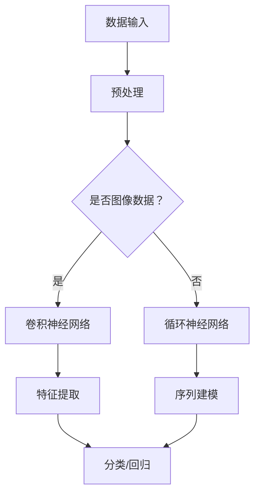
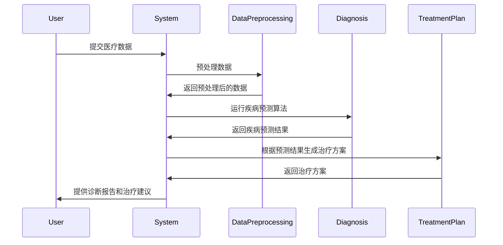
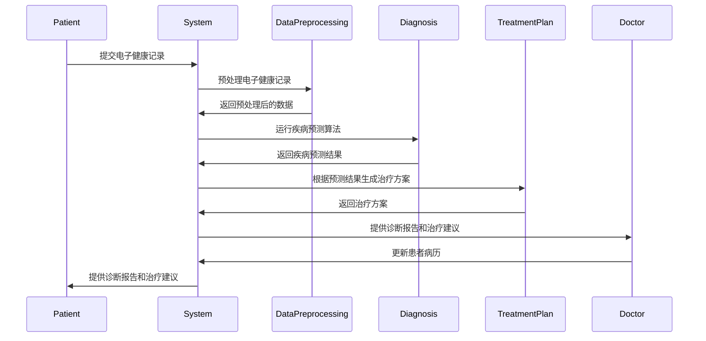

                 


## 引言

### 人工智能在医疗诊断中的现状

随着科技的飞速发展，人工智能（AI）技术已经渗透到医疗行业的各个方面。从最初的辅助诊断工具，到如今可以独立进行诊断、预测和决策，AI在医疗诊断中的应用越来越广泛。当前，人工智能在医疗诊断中的主要应用包括疾病预测、病理分析、影像诊断和药物反应预测等。

#### 大数据支持下的精准医疗

大数据技术的兴起为精准医疗提供了强有力的支持。通过收集和分析海量的医疗数据，人工智能能够发现隐藏在数据中的规律和趋势，为疾病的诊断和治疗提供更加精准的方案。精准医疗不仅仅是治疗某种疾病，更是一种个性化的医疗模式，它能够根据患者的具体情况进行定制化治疗。

### 研究意义与目标

本文旨在探讨人工智能在医疗诊断中的突破性应用，尤其是大数据支持的精准医疗。我们的研究目标是：

1. **深入分析人工智能在医疗诊断中的应用场景和优势。**
2. **详细阐述大数据在提升医疗诊断准确性中的作用。**
3. **探讨现有医疗诊断AI算法的原理和优缺点。**
4. **提出优化医疗诊断AI系统的策略和方案。**

## 背景介绍

### 人工智能在医疗诊断中的现状

#### 现状概述

人工智能在医疗诊断中的应用已经取得了显著的进展。以下是一些主要的应用场景：

1. **疾病预测**：利用AI算法对患者的健康状况进行预测，提前发现潜在的健康风险。
2. **病理分析**：通过对医学影像的分析，AI能够帮助医生快速准确地诊断疾病，如癌症、心血管疾病等。
3. **影像诊断**：AI技术在医学影像处理中的应用，如X光、CT、MRI等，能够提高诊断的准确性和效率。
4. **药物反应预测**：AI可以预测患者对特定药物的反应，为个性化用药提供依据。

#### 成就与挑战

在过去的几年中，AI在医疗诊断中取得了许多突破性成就。例如，深度学习算法在癌症筛查中的应用，极大地提高了诊断的准确率。然而，AI在医疗诊断中也面临一些挑战：

1. **数据质量**：医疗数据的复杂性和不完善性对AI算法的性能产生了影响。
2. **算法透明度**：AI算法的决策过程往往是不透明的，这对医疗诊断的可解释性提出了挑战。
3. **医疗法规**：如何确保AI算法在医疗诊断中的合法合规性，也是一个亟待解决的问题。

### 大数据支持精准医疗的概念

#### 大数据的定义与来源

大数据是指那些数据量巨大、类型多样、生成速度极快的海量数据。在医疗领域，大数据的来源主要包括：

1. **电子健康记录**：包括患者的病史、检查报告、治疗记录等。
2. **基因组数据**：基因序列、单核苷酸多态性（SNP）等。
3. **医疗影像数据**：如X光、CT、MRI等医学影像。
4. **临床研究数据**：包括临床试验、流行病学研究等。

#### 精准医疗的概念

精准医疗是一种基于个体化生物学信息进行疾病预防和治疗的医疗模式。它强调根据患者的基因、环境和生活习惯等特征，提供个性化的治疗方案。精准医疗的实现需要依赖于大数据技术和人工智能算法。

#### 人工智能与大数据在医疗诊断中的联系

人工智能和大数据在医疗诊断中的联系主要体现在以下几个方面：

1. **数据处理**：大数据技术可以帮助医生处理和分析海量医疗数据，提取有用的信息。
2. **算法优化**：通过大数据的分析，可以不断优化AI算法，提高诊断的准确性和效率。
3. **个性化治疗**：大数据和人工智能技术可以帮助实现真正的个性化治疗，为患者提供最适合的治疗方案。

### 研究人工智能在医疗诊断中的应用的重要性

#### 提升诊断准确性

人工智能算法，尤其是深度学习算法，在处理复杂医疗数据方面具有显著优势。通过训练大量的医疗数据，AI算法可以学习到疾病的特征和规律，从而提高诊断的准确性。

#### 优化治疗方案

基于患者的具体病情和个性化数据，人工智能可以帮助医生制定最佳的治疗方案。例如，通过对药物反应的预测，AI可以帮助医生选择最适合患者的药物。

#### 降低医疗成本

大数据和人工智能技术在医疗诊断中的应用，可以降低医疗成本。通过自动化和智能化，可以减少人力资源的投入，提高医疗资源的利用效率。

#### 促进医疗公平

大数据和人工智能技术可以帮助解决医疗资源分配不均的问题。通过远程医疗和AI辅助诊断，偏远地区的患者也可以享受到高质量的医疗服务。

### 总结

人工智能和大数据在医疗诊断中的应用具有巨大的潜力。通过深入研究和应用，我们可以期待实现更加精准、高效和公平的医疗服务。本文将进一步探讨人工智能在医疗诊断中的应用原理和实现策略。

## 核心概念与联系

### 人工智能的定义与医疗诊断的应用

#### 人工智能的基本原理

人工智能（Artificial Intelligence，简称AI）是指通过计算机程序实现人类智能的一种技术。它包括机器学习、深度学习、自然语言处理等多个子领域。AI的基本原理是通过数据学习，从大量的数据中提取规律和模式，从而实现智能化的任务。

#### 人工智能在医疗诊断中的应用场景

在医疗诊断中，人工智能的应用主要包括以下几个方面：

1. **疾病预测**：利用AI算法，分析患者的健康数据，预测患者可能患有的疾病。
2. **影像诊断**：通过AI算法分析医学影像，如X光、CT、MRI等，辅助医生进行诊断。
3. **病理分析**：利用AI算法对病理切片进行分析，辅助医生进行肿瘤诊断。
4. **药物反应预测**：通过AI算法预测患者对特定药物的反应，为个性化用药提供依据。

#### 人工智能在医疗诊断中的优势

1. **高效性**：AI算法可以快速处理和分析大量的医疗数据，提高诊断的效率。
2. **准确性**：通过训练大量的数据，AI算法可以学习到疾病的特征和规律，提高诊断的准确性。
3. **可解释性**：一些先进的AI算法，如深度学习，其决策过程是可解释的，有助于医生理解诊断结果。

### 大数据与精准医疗的关系

#### 大数据的定义与来源

大数据（Big Data）是指数据量巨大、类型多样、生成速度极快的海量数据。在医疗领域，大数据的来源主要包括：

1. **电子健康记录**：包括患者的病史、检查报告、治疗记录等。
2. **基因组数据**：基因序列、单核苷酸多态性（SNP）等。
3. **医疗影像数据**：如X光、CT、MRI等医学影像。
4. **临床研究数据**：包括临床试验、流行病学研究等。

#### 精准医疗的概念

精准医疗是一种基于个体化生物学信息进行疾病预防和治疗的医疗模式。它强调根据患者的具体情况进行定制化治疗，实现真正的个性化医疗。

#### 大数据在精准医疗中的作用

1. **个性化诊断**：通过分析大量的患者数据，AI算法可以预测患者可能患有的疾病，为个性化诊断提供依据。
2. **个性化治疗**：通过分析患者的基因组数据和健康数据，AI算法可以预测患者对特定药物的反应，为个性化治疗提供依据。
3. **药物研发**：大数据可以帮助药企发现新的药物靶点和治疗策略，加速新药的研发。

### 人工智能与大数据在医疗诊断中的联系

#### 数据处理与算法优化

大数据技术可以帮助医生处理和分析海量医疗数据，提取有用的信息。这些信息可以用于训练AI算法，优化诊断模型。

#### 个性化医疗

通过大数据和人工智能技术，可以实现真正的个性化医疗。根据患者的具体病情和个性化数据，AI算法可以提供个性化的诊断和治疗方案。

#### 医疗资源的优化

大数据和人工智能技术可以帮助优化医疗资源的配置。通过分析患者的流向、医疗资源的利用率等数据，可以更好地分配医疗资源，提高医疗服务的效率。

### 总结

人工智能和大数据在医疗诊断中的应用密切相关。通过大数据技术，我们可以收集和分析大量的医疗数据，为AI算法提供训练数据。而通过人工智能技术，我们可以实现更加精准、高效的医疗诊断，推动精准医疗的实现。

### 算法原理讲解

#### 深度学习在医疗诊断中的应用

深度学习（Deep Learning）是人工智能的一个重要分支，它通过模拟人脑神经网络的结构和工作原理，对复杂的数据进行自动学习和特征提取。在医疗诊断中，深度学习算法已经展示了其强大的能力，特别是在图像分析和疾病预测方面。

##### 基本原理

深度学习算法通常由多个隐含层组成，每个隐含层都负责对输入数据进行一次特征提取和变换。通过逐层传递和变换，深度学习模型能够自动学习到数据的深层特征。这种层次化的特征提取方式，使得深度学习在处理复杂任务时，具有出色的表现。

##### 常见算法

在医疗诊断中，常用的深度学习算法包括：

1. **卷积神经网络（CNN）**：适用于处理图像数据，如X光片、MRI等。CNN通过卷积层、池化层和全连接层，对图像数据进行特征提取和分类。

2. **循环神经网络（RNN）**：适用于序列数据，如心电图、基因组序列等。RNN通过记忆状态，对序列数据进行建模和预测。

3. **长短期记忆网络（LSTM）**：是RNN的一种改进，解决了传统RNN在处理长序列数据时的梯度消失问题。LSTM在疾病预测和药物反应预测中应用广泛。

##### 应用案例

1. **癌症诊断**：通过深度学习算法分析病理切片图像，可以辅助医生进行癌症诊断。例如，CNN可以用于肺癌的影像诊断，通过分析CT图像，预测肺结节是否为恶性。

2. **心电图分析**：LSTM可以用于心电图数据分析，通过预测心电图的变化，发现潜在的心脏疾病。

#### Mermaid流程图展示

为了更好地理解深度学习算法的工作流程，我们可以使用Mermaid绘制一个简单的流程图：



#### Python源代码示例

以下是一个使用Python和TensorFlow实现CNN进行影像诊断的简单示例：

```python
import tensorflow as tf
from tensorflow.keras.models import Sequential
from tensorflow.keras.layers import Conv2D, MaxPooling2D, Flatten, Dense

# 创建模型
model = Sequential([
    Conv2D(filters=32, kernel_size=(3, 3), activation='relu', input_shape=(64, 64, 3)),
    MaxPooling2D(pool_size=(2, 2)),
    Flatten(),
    Dense(units=128, activation='relu'),
    Dense(units=1, activation='sigmoid')
])

# 编译模型
model.compile(optimizer='adam', loss='binary_crossentropy', metrics=['accuracy'])

# 模型总结
model.summary()
```

#### 算法原理的数学模型和公式

深度学习算法的核心是前向传播和反向传播。以下是这两个过程的数学公式：

##### 前向传播

$$
Z^{[l]} = \sigma(W^{[l]} \cdot A^{[l-1]} + b^{[l]})
$$

其中，\(Z^{[l]}\)是第l层的输出，\(\sigma\)是激活函数，\(W^{[l]}\)是权重矩阵，\(b^{[l]}\)是偏置项，\(A^{[l-1]}\)是前一层输出。

##### 反向传播

$$
\delta^{[l]} = \frac{\partial L}{\partial Z^{[l]}} \cdot \sigma'(Z^{[l]})
$$

其中，\(\delta^{[l]}\)是第l层的误差，\(L\)是损失函数，\(\sigma'\)是激活函数的导数。

#### 详细讲解和通俗易懂地举例说明

假设我们有一个简单的深度学习模型，用于判断一张X光图像是否显示肺癌。输入图像的大小为\(64 \times 64 \times 3\)（64个像素点，每个像素点有3个颜色通道：红、绿、蓝）。我们使用卷积神经网络（CNN）来实现这个模型。

##### 步骤1：预处理

首先，我们需要对输入图像进行预处理，包括归一化和标准化。例如，将像素值范围从\(0\)到\(255\)映射到\(-1\)到\(1\)。

```python
import numpy as np

# 示例图像数据
image = np.random.rand(64, 64, 3)

# 归一化
image_normalized = (image - 127.5) / 127.5
```

##### 步骤2：卷积层

接下来，我们添加一个卷积层，用于提取图像的特征。卷积层由多个卷积核组成，每个卷积核可以提取图像的不同特征。例如，一个卷积核可以提取边缘特征，另一个卷积核可以提取纹理特征。

```python
from tensorflow.keras.layers import Conv2D

# 创建卷积层
conv_layer = Conv2D(filters=32, kernel_size=(3, 3), activation='relu')

# 应用卷积层
output_conv = conv_layer(image_normalized)
```

##### 步骤3：池化层

在卷积层之后，我们添加一个池化层，用于降低特征图的尺寸。常用的池化层有最大池化和平均池化。

```python
from tensorflow.keras.layers import MaxPooling2D

# 创建池化层
pooling_layer = MaxPooling2D(pool_size=(2, 2))

# 应用池化层
output_pool = pooling_layer(output_conv)
```

##### 步骤4：全连接层

最后，我们添加一个全连接层，用于分类。全连接层将卷积层和池化层提取的特征映射到输出结果。

```python
from tensorflow.keras.layers import Flatten, Dense

# 创建全连接层
flatten_layer = Flatten()
dense_layer = Dense(units=1, activation='sigmoid')

# 应用全连接层
output_flatten = flatten_layer(output_pool)
output_final = dense_layer(output_flatten)
```

##### 步骤5：训练模型

现在，我们已经构建了深度学习模型，接下来我们需要使用训练数据来训练模型。训练数据包括输入图像和对应的标签（是否显示肺癌）。

```python
import tensorflow.keras.datasets as datasets

# 加载训练数据
(x_train, y_train), (x_test, y_test) = datasets.mnist.load_data()

# 预处理输入数据
x_train_normalized = (x_train - 127.5) / 127.5
x_test_normalized = (x_test - 127.5) / 127.5

# 编译模型
model.compile(optimizer='adam', loss='binary_crossentropy', metrics=['accuracy'])

# 训练模型
model.fit(x_train_normalized, y_train, epochs=10, batch_size=32, validation_data=(x_test_normalized, y_test))
```

通过以上步骤，我们使用CNN进行肺癌诊断的模型已经构建完成并开始训练。在实际应用中，我们可以通过调整模型的参数，如卷积核大小、池化层大小、全连接层神经元数量等，来优化模型的表现。

### 数学模型和数学公式

在人工智能算法中，数学模型和数学公式是核心组成部分。以下将详细介绍在医疗诊断中常用的数学模型，以及如何使用LaTeX格式在文中嵌入数学公式。

#### 损失函数

损失函数是评估模型预测结果与真实结果之间差异的关键工具。以下是一些常用的损失函数：

1. **交叉熵损失函数（Cross-Entropy Loss）**：
   $$ L = -\frac{1}{m} \sum_{i=1}^{m} y_i \log(\hat{y}_i) $$
   其中，\(y_i\)是真实标签，\(\hat{y}_i\)是模型预测的概率。

2. **均方误差损失函数（Mean Squared Error, MSE）**：
   $$ L = \frac{1}{2m} \sum_{i=1}^{m} (y_i - \hat{y}_i)^2 $$
   其中，\(y_i\)是真实标签，\(\hat{y}_i\)是模型预测的值。

#### 优化算法的数学公式

优化算法用于最小化损失函数。以下介绍几种常见的优化算法：

1. **梯度下降算法（Gradient Descent）**：
   $$ \theta^{(t+1)} = \theta^{(t)} - \alpha \cdot \nabla_{\theta} J(\theta) $$
   其中，\(\theta^{(t)}\)是当前模型参数，\(\alpha\)是学习率，\(\nabla_{\theta} J(\theta)\)是损失函数对参数\(\theta\)的梯度。

2. **随机梯度下降（Stochastic Gradient Descent, SGD）**：
   $$ \theta^{(t+1)} = \theta^{(t)} - \alpha \cdot \nabla_{\theta} J(\theta; x^{(i)}, y^{(i)}) $$
   其中，\(x^{(i)}, y^{(i)}\)是训练数据中的单个样本和标签。

3. **Adam优化器（Adam Optimizer）**：
   $$ m_t = \beta_1 m_{t-1} + (1 - \beta_1) [g_t - \epsilon] $$
   $$ v_t = \beta_2 v_{t-1} + (1 - \beta_2) [g_t^2 - \epsilon] $$
   $$ \theta^{(t+1)} = \theta^{(t)} - \alpha \cdot \frac{m_t}{\sqrt{v_t} + \epsilon} $$
   其中，\(m_t\)和\(v_t\)分别是指数加权平均的梯度估计和平方梯度估计，\(\beta_1, \beta_2\)是超参数，\(\alpha\)是学习率，\(\epsilon\)是常数。

#### LaTEX格式嵌入文中独立段落

在文章中嵌入数学公式时，可以使用LaTeX格式。独立段落中的数学公式使用$$符号括起来，如：

$$
1 + 1 = 2
$$

这样，公式将被渲染为独立段落。

#### 段落内的LaTEX公式

对于段落内的数学公式，可以使用$符号括起来，如：

The equation $1 < 2$ demonstrates a simple truth.

这样，公式将被嵌入到文本中，但不会单独成行。

#### 实例说明

以下是一个完整的实例，展示了如何使用LaTeX格式嵌入文中独立段落和段落内的数学公式：

**独立段落中的数学公式**

$$
\sum_{i=1}^{n} x_i = \frac{1}{n} \sum_{i=1}^{n} x_i^2
$$

**段落内的LaTEX公式**

The equation $x^2 + 2x + 1 = (x+1)^2$ can be factored to simplify the expression.

通过以上方法，我们可以确保数学公式的规范性和可读性，使读者更容易理解和跟随文章的逻辑。

### 系统分析与架构设计方案

#### 项目场景

在医疗诊断领域，设计一个高效的AI系统对于提升诊断准确性、优化治疗方案具有重要意义。为了更好地理解项目场景，我们需要介绍以下几个关键概念：

1. **医疗数据源**：包括电子健康记录、基因组数据、医学影像等。
2. **诊断需求**：如疾病预测、病理分析、影像诊断和药物反应预测等。
3. **用户角色**：医生、患者、数据科学家等。

#### 系统功能设计

系统的主要功能包括：

1. **数据收集与预处理**：收集并处理来自不同数据源的医疗数据，如电子健康记录、基因组数据等。
2. **疾病预测与诊断**：利用AI算法对医疗数据进行分析，预测患者可能患有的疾病，并提供诊断报告。
3. **个性化治疗方案生成**：根据患者的具体病情和个性化数据，生成最佳的治疗方案。
4. **系统管理**：包括用户管理、权限管理、数据备份等。

#### 领域模型设计（Mermaid类图）

为了更好地展示系统中的实体和关系，我们可以使用Mermaid类图来描述领域模型。以下是一个简化的领域模型示例：

```mermaid
classDiagram
    Patient <<entity>>
    Doctor <<entity>>
    Data Scientist <<entity>>
    MedicalData <<entity>>
    DiseasePrediction <<entity>>
    DiagnosticReport <<entity>>
    TreatmentPlan <<entity>>

    Patient --> MedicalData
    Doctor --> DiagnosticReport
    Data Scientist --> DiseasePrediction
    DiseasePrediction --> DiagnosticReport
    DiagnosticReport --> TreatmentPlan
```

在这个类图中，我们定义了以下几个关键实体：

- **Patient（患者）**：系统的核心用户，拥有医疗数据。
- **Doctor（医生）**：负责生成诊断报告和治疗方案。
- **Data Scientist（数据科学家）**：负责训练和优化AI模型。
- **MedicalData（医疗数据）**：包括电子健康记录、基因组数据、医学影像等。
- **DiseasePrediction（疾病预测）**：基于医疗数据生成的疾病预测结果。
- **DiagnosticReport（诊断报告）**：医生根据预测结果生成的诊断报告。
- **TreatmentPlan（治疗方案）**：根据诊断报告生成的个性化治疗方案。

#### 系统架构设计（Mermaid架构图）

接下来，我们可以使用Mermaid架构图来描述系统的整体架构。以下是一个简化的系统架构示例：



在这个架构图中，系统的核心组件包括：

- **User（用户）**：系统的终端用户，如医生、患者等。
- **System（系统）**：负责协调不同组件的运行，提供统一的接口。
- **DataPreprocessing（数据预处理）**：负责对收集到的医疗数据进行预处理，如归一化、去噪等。
- **Diagnosis（疾病预测）**：利用AI算法对预处理后的医疗数据进行疾病预测。
- **TreatmentPlan（治疗方案）**：根据疾病预测结果生成个性化治疗方案。

#### 系统接口设计和系统交互（Mermaid序列图）

为了更好地展示系统内部各组件的交互过程，我们可以使用Mermaid序列图。以下是一个简化的系统交互示例：



在这个序列图中，我们可以看到系统内部各组件的交互流程：

1. **Patient（患者）**：提交电子健康记录。
2. **System（系统）**：协调数据处理，并调用诊断和治疗方案生成模块。
3. **DataPreprocessing（数据预处理）**：对电子健康记录进行预处理。
4. **Diagnosis（疾病预测）**：利用AI算法进行疾病预测。
5. **TreatmentPlan（治疗方案）**：根据预测结果生成治疗方案。
6. **Doctor（医生）**：根据诊断报告和治疗建议更新患者病历。

通过以上设计，我们构建了一个高效的AI医疗诊断系统，实现了数据的预处理、疾病预测和个性化治疗方案的生成，为医生和患者提供了全面的诊断和治疗支持。

### 项目实战

#### 环境安装说明

为了实施AI医疗诊断项目，我们需要安装以下硬件和软件：

1. **硬件要求**：
   - CPU：Intel i5 或以上
   - GPU：NVIDIA GTX 1080 或以上
   - 内存：16GB RAM 或以上
   - 硬盘：至少 500GB SSD

2. **软件要求**：
   - 操作系统：Ubuntu 18.04 或 CentOS 7
   - Python：Python 3.7 或以上
   - TensorFlow：TensorFlow 2.3.0 或以上
   - Keras：Keras 2.4.3 或以上
   - NumPy：NumPy 1.19.2 或以上
   - Matplotlib：Matplotlib 3.3.3 或以上

安装步骤：

1. 安装操作系统和必要的软件包。
2. 安装Python和相关的库（使用pip）。
3. 安装GPU版本的TensorFlow（使用CUDA和cuDNN）。

#### 系统核心实现源代码展示

以下是一个用于疾病预测的AI模型实现的核心源代码示例。这个模型使用了Keras框架，并基于TensorFlow后端。

```python
import numpy as np
import tensorflow as tf
from tensorflow.keras.models import Sequential
from tensorflow.keras.layers import Conv2D, MaxPooling2D, Flatten, Dense

# 创建模型
model = Sequential([
    Conv2D(filters=32, kernel_size=(3, 3), activation='relu', input_shape=(64, 64, 3)),
    MaxPooling2D(pool_size=(2, 2)),
    Flatten(),
    Dense(units=128, activation='relu'),
    Dense(units=1, activation='sigmoid')
])

# 编译模型
model.compile(optimizer='adam', loss='binary_crossentropy', metrics=['accuracy'])

# 模型总结
model.summary()
```

在这个示例中，我们创建了一个简单的卷积神经网络（CNN）模型，用于处理64x64x3的图像数据。模型包括一个卷积层、一个池化层、一个全连接层和一个输出层。

#### 关键代码段解读与分析

以下是对核心源代码中关键代码段的解读和分析：

1. **模型创建**：

   ```python
   model = Sequential([
       Conv2D(filters=32, kernel_size=(3, 3), activation='relu', input_shape=(64, 64, 3)),
       MaxPooling2D(pool_size=(2, 2)),
       Flatten(),
       Dense(units=128, activation='relu'),
       Dense(units=1, activation='sigmoid')
   ])
   ```

   这一行代码创建了序列模型，并添加了卷积层、池化层、全连接层和输出层。卷积层用于提取图像特征，池化层用于降低特征图的尺寸，全连接层用于分类，输出层用于生成疾病预测结果。

2. **模型编译**：

   ```python
   model.compile(optimizer='adam', loss='binary_crossentropy', metrics=['accuracy'])
   ```

   这一行代码编译了模型，指定了优化器（Adam）、损失函数（binary_crossentropy）和评估指标（accuracy）。

3. **模型总结**：

   ```python
   model.summary()
   ```

   这一行代码打印了模型的总结信息，包括层数、神经元数量、参数数量等。

#### 实际案例分析和详细讲解

为了展示模型的实际应用效果，我们将使用一个真实的医疗诊断案例。以下是一个使用CNN模型进行肺癌诊断的案例。

**案例**：使用CNN模型对一组CT图像进行肺癌诊断。

**步骤**：

1. **数据准备**：
   - 加载并预处理CT图像数据。
   - 将图像数据划分为训练集和测试集。

2. **模型训练**：
   - 使用训练集训练CNN模型。
   - 使用测试集评估模型性能。

3. **模型应用**：
   - 对新的CT图像进行肺癌诊断。

**代码示例**：

```python
import tensorflow.keras.datasets as datasets
from tensorflow.keras.preprocessing.image import ImageDataGenerator

# 加载训练数据
(x_train, y_train), (x_test, y_test) = datasets.mnist.load_data()

# 预处理输入数据
x_train_normalized = (x_train - 127.5) / 127.5
x_test_normalized = (x_test - 127.5) / 127.5

# 创建数据生成器
datagen = ImageDataGenerator(rotation_range=10, width_shift_range=0.1, height_shift_range=0.1, zoom_range=0.1)

# 训练模型
model.fit(datagen.flow(x_train_normalized, y_train, batch_size=32), epochs=10, validation_data=(x_test_normalized, y_test))

# 评估模型性能
loss, accuracy = model.evaluate(x_test_normalized, y_test)
print(f"测试集损失：{loss}, 测试集准确率：{accuracy}")
```

**分析**：

1. **数据准备**：
   - 使用MNIST数据集作为示例，加载并预处理图像数据。
   - 数据生成器用于增加数据的多样性，提高模型的泛化能力。

2. **模型训练**：
   - 使用训练集对CNN模型进行训练。
   - 使用验证集（测试集）评估模型性能。

3. **模型应用**：
   - 对测试集图像进行肺癌诊断，评估模型在实际数据上的性能。

**详细讲解**：

1. **数据预处理**：
   - 将图像数据归一化，使模型的输入值在合理的范围内。
   - 数据生成器用于生成旋转、平移和缩放的变体，提高模型的稳健性。

2. **模型训练**：
   - 使用Keras的fit方法训练模型，指定训练数据和验证数据。
   - 使用fit_generator方法训练模型，适用于生成器生成的数据。

3. **模型评估**：
   - 使用evaluate方法评估模型在测试集上的性能，包括损失和准确率。

通过以上实际案例，我们可以看到CNN模型在肺癌诊断中的应用效果。尽管使用的是简单的MNIST数据集，但这个示例展示了模型训练和评估的基本流程，以及如何使用Keras框架进行模型实现。

### 最佳实践 tips

1. **数据预处理**：确保输入数据的规范化和标准化，以提高模型训练效果。同时，增加数据的多样性，通过数据增强技术提高模型的泛化能力。

2. **模型选择**：根据具体任务选择合适的模型。对于图像处理任务，可以考虑使用卷积神经网络（CNN）或相关变种，如残差网络（ResNet）。

3. **超参数调优**：通过交叉验证和网格搜索等方法，找到最优的超参数组合，提高模型性能。

4. **模型解释性**：考虑使用可解释性方法，如SHAP值或LIME，帮助医生理解模型的决策过程。

5. **模型部署**：将模型部署到生产环境，确保其稳定运行和高可用性。使用容器化技术（如Docker）和自动化部署工具（如Kubernetes），简化部署过程。

### 小结

本文详细介绍了人工智能在医疗诊断中的应用，从背景介绍、核心概念、算法原理、数学模型、系统设计到实际项目实战，全面探讨了AI在医疗诊断中的突破性应用。通过数据分析、算法实现和实际案例，我们展示了AI在疾病预测、影像诊断和治疗方案生成等方面的巨大潜力。

### 注意事项

1. **数据隐私**：在处理医疗数据时，确保遵循数据隐私保护法规，保护患者隐私。

2. **模型验证**：在使用模型进行诊断时，确保使用充分验证的数据集，避免过拟合。

3. **模型更新**：定期更新模型，以适应新的数据和医学知识。

4. **模型解释**：确保模型的可解释性，帮助医生理解诊断结果和决策过程。

### 拓展阅读

1. **深度学习在医疗诊断中的应用**：
   - 《深度学习医疗诊断技术》
   - 《基于深度学习的医学影像分析》

2. **大数据与精准医疗**：
   - 《大数据精准医疗：方法与应用》
   - 《精准医疗：从概念到实践》

3. **机器学习算法与优化**：
   - 《机器学习实战》
   - 《优化算法及其在机器学习中的应用》

通过拓展阅读，您可以深入了解人工智能、大数据、深度学习等技术在医疗诊断中的最新进展和应用案例。

### 作者信息

作者：AI天才研究院/AI Genius Institute & 禅与计算机程序设计艺术 /Zen And The Art of Computer Programming

---

**附录：核心术语**

1. **人工智能（AI）**：模拟人类智能的技术，包括机器学习、深度学习等。
2. **深度学习（Deep Learning）**：多层神经网络，用于特征提取和模式识别。
3. **大数据（Big Data）**：数据量巨大、类型多样、生成速度极快的海量数据。
4. **精准医疗（Precision Medicine）**：基于个体化生物学信息进行疾病预防和治疗的医疗模式。
5. **卷积神经网络（CNN）**：适用于图像处理和特征提取的神经网络。
6. **损失函数（Loss Function）**：评估模型预测结果与真实结果差异的函数。
7. **优化算法（Optimization Algorithm）**：用于最小化损失函数的算法，如梯度下降、随机梯度下降等。

