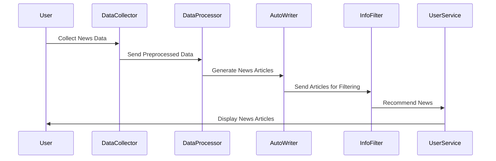

                 


# 人工智能在新闻报道中的角色：自动化写作与信息筛选

## 关键词
人工智能、新闻报道、自动化写作、信息筛选、新闻编辑

## 摘要
随着人工智能技术的快速发展，人工智能在新闻报道中的角色日益显著。本文将深入探讨人工智能在新闻报道中的两个关键角色：自动化写作和信息筛选。通过一步一步的分析和推理，我们将详细阐述这两个角色的基本原理、应用实例以及未来发展的潜在趋势。

### 目录大纲设计步骤

#### 1. 确定整体结构
本文将整体结构分为五个部分：背景介绍、自动化写作、信息筛选、案例分析、未来展望。

#### 2. 细化章节内容
- **背景介绍**：介绍人工智能和新闻报道的基本概念、现状与问题。
- **自动化写作**：探讨自动化写作的原理、算法、实例分析。
- **信息筛选**：分析信息筛选的技术原理、算法应用、案例研究。
- **案例分析**：分析具体的新闻报道自动化写作和信息筛选案例。
- **未来展望**：探讨人工智能在新闻报道中的未来发展。

#### 3. 使用Mermaid进行图示设计
- **核心概念与联系**：使用Mermaid绘制核心概念对比表格和ER实体关系图。
- **算法原理讲解**：使用Mermaid绘制算法流程图。
- **系统分析与架构设计方案**：使用Mermaid绘制系统架构图、系统接口设计和系统交互序列图。

#### 4. 编写数学模型和公式
- **算法原理讲解**：使用LaTeX格式编写数学模型和公式。

#### 5. 编写Python源代码与解释
- **算法原理讲解**：提供Python源代码，并详细解释。

#### 6. 整合所有内容
- 将所有章节内容、图示和代码整合到一起，形成完整的目录大纲。

#### 7. 确保大纲结构的逻辑性和完整性
- 检查每一级目录的逻辑顺序和内容的连贯性。

### 内容要求

#### 背景介绍
- **核心概念术语说明**：明确人工智能、新闻报道、自动化写作、信息筛选等关键术语的定义。
- **问题背景**：介绍人工智能和新闻报道的发展现状，以及存在的问题。
- **问题描述**：阐述新闻报道中存在的问题，如信息过载、准确性等。
- **问题解决**：讨论人工智能在解决这些问题方面的潜力。

#### 核心概念与联系
- **核心概念原理**：详细解释自动化写作和信息筛选的基本原理。
- **概念属性特征对比表格**：列出自动化写作和信息筛选的主要属性和特征，并进行对比。
- **ER实体关系图架构**：使用Mermaid绘制ER实体关系图。

#### 算法原理讲解
- **算法mermaid流程图**：使用Mermaid绘制算法流程图。
- **Python源代码**：提供Python源代码，详细解释代码的功能和逻辑。
- **算法原理的数学模型和公式**：使用LaTeX格式编写，并在文中进行详细讲解。
- **举例说明**：使用通俗易懂的例子来解释算法原理。

#### 系统分析与架构设计方案
- **问题场景介绍**：介绍具体的应用场景。
- **项目介绍**：介绍项目的背景、目标和实现方式。
- **系统功能设计**：使用Mermaid绘制领域模型类图。
- **系统架构设计**：使用Mermaid绘制系统架构图。
- **系统接口设计**：使用Mermaid绘制系统接口设计图。
- **系统交互**：使用Mermaid绘制系统交互序列图。

#### 项目实战
- **环境安装**：介绍如何安装和配置相关环境。
- **系统核心实现源代码**：提供系统核心实现的源代码。
- **代码应用解读与分析**：对源代码进行解读和分析。
- **实际案例分析和详细讲解剖析**：分析具体案例，并进行详细讲解。
- **项目小结**：总结项目的主要成果和经验教训。

#### 最佳实践 tips、小结、注意事项、拓展阅读
- **最佳实践 tips**：提供在实际应用中的实用技巧和建议。
- **小结**：总结章节或全书的重点内容。
- **注意事项**：提醒读者在应用中的注意事项。
- **拓展阅读**：推荐相关书籍、文章和资源，供读者进一步学习。

### 最终格式

- **Markdown格式**：
  ```
  # 人工智能在新闻报道中的角色：自动化写作与信息筛选

  > 关键词：人工智能、新闻报道、自动化写作、信息筛选、新闻编辑

  > 摘要：随着人工智能技术的快速发展，人工智能在新闻报道中的角色日益显著。本文将深入探讨人工智能在新闻报道中的两个关键角色：自动化写作和信息筛选。

  ### 目录大纲设计步骤

  #### 1. 确定整体结构

  ...

  #### 7. 确保大纲结构的逻辑性和完整性

  ...

  ### 内容要求

  #### 背景介绍

  ...

  #### 核心概念与联系

  ...

  #### 算法原理讲解

  ...

  #### 系统分析与架构设计方案

  ...

  #### 项目实战

  ...

  #### 最佳实践 tips、小结、注意事项、拓展阅读

  ...

  ### 最后检查

  ...

  ```

- **总字数限制**：确保整个目录大纲的总字数不超过2000字。

### 最后检查

- 检查目录结构的逻辑性和完整性。
- 确保每一章节的内容都有明确的主题和目标。
- 确认所有的图示、代码和公式都清晰易懂，并符合Markdown格式要求。

通过以上步骤，我们可以设计出一个详细且逻辑清晰的目录大纲，为《人工智能在新闻报道中的角色：自动化写作与信息筛选》这篇文章的内容提供有效的结构指导。接下来，我们将根据这个大纲，逐步撰写文章内容。让我们开始分析推理吧！

---

**背景介绍**

### 1.1 人工智能的定义与核心概念
人工智能（Artificial Intelligence，简称AI）是一门研究、开发用于模拟、延伸和扩展人的智能的理论、方法、技术及应用系统的综合技术科学。它包括机器学习、深度学习、自然语言处理、计算机视觉等多个子领域。

**核心概念术语说明**
- **机器学习**：通过数据训练模型，让计算机自主学习和改进。
- **深度学习**：一种基于多层神经网络的机器学习方法，能够自动提取特征。
- **自然语言处理**：使计算机能够理解、生成和处理自然语言。
- **计算机视觉**：使计算机能够识别和理解视觉信息。

**问题背景**
随着互联网和信息技术的飞速发展，新闻行业面临着前所未有的挑战。一方面，信息爆炸导致新闻工作者难以处理海量的信息；另一方面，受众对新闻的时效性和准确性的要求越来越高。传统的人工编辑方式已经难以满足这些需求。

### 1.2 新闻报道的现状与问题
- **信息过载**：互联网上的信息量庞大，传统新闻编辑难以有效筛选和整理。
- **准确性问题**：人工编辑可能存在主观偏见，导致报道不准确。
- **时效性问题**：新闻事件发生时，人工编辑速度较慢，影响新闻的时效性。
- **多样化需求**：不同受众对新闻的内容、形式和角度有不同的需求，传统编辑难以满足。

### 1.3 人工智能在新闻报道中的应用
人工智能技术可以解决新闻报道中的这些问题，提高新闻的时效性、准确性和个性化程度。具体应用包括：
- **自动化写作**：通过机器学习和自然语言处理技术，自动生成新闻文章。
- **信息筛选**：利用数据挖掘和机器学习技术，自动筛选和推荐新闻。
- **图像识别**：通过计算机视觉技术，自动识别和标记新闻中的图像。

### 1.4 问题解决
人工智能在新闻报道中的应用，不仅提高了新闻的时效性和准确性，还降低了新闻生产的成本。通过自动化写作和信息筛选，新闻工作者可以专注于更具创造性的工作，提高整体工作效率。

**边界与外延**
人工智能在新闻报道中的应用仍有边界，如算法偏见、数据隐私等问题。因此，在推动人工智能应用的同时，也需要关注这些潜在问题，并采取相应的解决措施。

### 1.5 概念结构与核心要素组成
人工智能在新闻报道中的概念结构主要包括：
- **数据源**：包括新闻报道相关的文本、图像、视频等多种形式的数据。
- **算法模型**：包括机器学习模型、深度学习模型、自然语言处理模型等。
- **应用场景**：包括自动化写作、信息筛选、图像识别等具体应用。
- **用户交互**：与新闻工作者和受众的交互界面，提供个性化服务。

**核心要素组成**
- **数据预处理**：包括数据清洗、格式化、特征提取等。
- **模型训练**：使用训练数据训练机器学习模型。
- **模型评估**：评估模型的性能，并进行优化。
- **应用实现**：将训练好的模型应用到具体的新闻报道场景中。

通过以上对背景介绍的详细分析，我们可以清晰地理解人工智能在新闻报道中的角色和重要性。接下来，我们将深入探讨自动化写作和信

### 核心概念与联系

在深入探讨人工智能在新闻报道中的角色之前，我们需要明确几个核心概念，并分析它们之间的联系。以下是对“人工智能”、“新闻报道”、“自动化写作”和“信息筛选”这四个核心概念的定义、属性特征对比以及它们之间的关系。

#### 2.1 人工智能（AI）

**定义**：
人工智能是指使计算机系统模拟人类智能行为的技术和科学。它涉及机器学习、自然语言处理、计算机视觉等多个领域。

**属性特征**：
- **自主性**：人工智能系统能够自主学习和优化。
- **智能化**：能够处理复杂的任务，如语音识别、图像识别等。
- **泛化能力**：能够将学习到的知识应用于不同场景。

**关系**：
人工智能是自动化写作和信息筛选的基础，提供了核心算法和技术支持。

#### 2.2 新闻报道

**定义**：
新闻报道是新闻媒体对事件、活动或现象的报道和解读，旨在传递信息、引导舆论。

**属性特征**：
- **时效性**：新闻要迅速传递，以满足受众的时效需求。
- **准确性**：新闻要客观、准确，避免误导受众。
- **全面性**：新闻要尽可能全面地反映事件的全貌。

**关系**：
新闻报道是人工智能应用的主要场景，人工智能技术可以提升新闻报道的时效性、准确性和全面性。

#### 2.3 自动化写作

**定义**：
自动化写作是指利用人工智能技术自动生成文章、新闻报道等文本内容。

**属性特征**：
- **高效性**：能够快速生成大量文本内容。
- **灵活性**：能够根据不同的需求和场景生成不同的文本。
- **可扩展性**：可以轻松适应不同的写作风格和格式。

**关系**：
自动化写作是人工智能在新闻报道中的重要应用，能够减少人工写作的工作量，提高新闻生产效率。

#### 2.4 信息筛选

**定义**：
信息筛选是指利用人工智能技术自动筛选和推荐新闻信息。

**属性特征**：
- **精准性**：能够准确识别受众感兴趣的新闻。
- **个性化**：能够根据受众的偏好和习惯推荐新闻。
- **实时性**：能够实时更新和推荐最新新闻。

**关系**：
信息筛选是人工智能在新闻报道中的另一个重要应用，能够帮助新闻工作者和受众更高效地获取信息。

#### 表格：核心概念属性特征对比

| 核心概念 | 定义 | 属性特征 | 关系 |
| --- | --- | --- | --- |
| 人工智能（AI） | 模拟人类智能行为的技术和科学 | 自主性、智能化、泛化能力 | 基础技术支持 |
| 新闻报道 | 传递信息、引导舆论 | 时效性、准确性、全面性 | 应用场景 |
| 自动化写作 | 自动生成文章、新闻报道等文本内容 | 高效性、灵活性、可扩展性 | 重要应用 |
| 信息筛选 | 自动筛选和推荐新闻信息 | 精准性、个性化、实时性 | 重要应用 |

#### ER实体关系图架构

为了更直观地展示这些核心概念之间的关系，我们使用Mermaid绘制了ER实体关系图。

```mermaid
erDiagram
  AI|--|> NewsReport : uses
  AI|--|> AutomatedWriting : uses
  AI|--|> InformationFiltering : uses
  NewsReport ||--|> Timeliness : has
  NewsReport ||--|> Accuracy : has
  NewsReport ||--|> Completeness : has
  AutomatedWriting ||--|> Efficiency : has
  AutomatedWriting ||--|> Flexibility : has
  AutomatedWriting ||--|> Expandability : has
  InformationFiltering ||--|> Precision : has
  InformationFiltering ||--|> Personalization : has
  InformationFiltering ||--|> Real-time : has
```

通过上述分析，我们可以清晰地看到人工智能、新闻报道、自动化写作和信息筛选之间的紧密联系。这些核心概念共同构成了人工智能在新闻报道中的应用基础，为提升新闻生产的效率和质量提供了强大的技术支持。

---

### 算法原理讲解

#### 3.1 自动化写作算法原理

自动化写作是人工智能在新闻报道中的一个重要应用，通过机器学习和自然语言处理技术，可以自动生成新闻报道、文章和其他文本内容。以下是自动化写作算法的原理、相关算法和Python代码实现。

**算法原理**

自动化写作的核心在于如何生成连贯、符合语法和逻辑规则的文本。常用的算法包括：

- **模板匹配**：通过预设的模板和参数，将模板与输入数据结合生成文本。
- **生成式对抗网络（GAN）**：通过生成器和判别器的对抗训练，生成高质量的文本。
- **递归神经网络（RNN）**：通过记忆长期依赖关系，生成文本。

**相关算法**

- **模板匹配**：
  模板匹配是一种简单的自动化写作方法，通过将预定义的模板与输入数据相结合，生成文本。这种方法适用于格式化文本，如新闻报道的标题和导语。

- **生成式对抗网络（GAN）**：
  GAN由生成器和判别器组成，生成器生成文本，判别器判断文本的真实性。通过反复对抗训练，生成器能够生成越来越高质量的文本。

- **递归神经网络（RNN）**：
  RNN能够处理序列数据，通过记忆长期依赖关系，生成连贯的文本。RNN在自动写作中的应用广泛，如生成新闻报道正文。

**Python代码实现**

以下是一个简单的自动化写作示例，使用模板匹配方法生成新闻标题：

```python
import random

# 模板库
templates = [
    "【突发】{事件名称}引发{影响范围}",
    "【独家】{人物姓名}在{地点}做出{决定}",
    "【揭秘】{话题}背后的真相",
    "【重磅】{公司名称}发布{新产品/服务}"
]

# 输入数据
data = {
    "事件名称": "交通事故",
    "影响范围": "全市交通拥堵",
    "人物姓名": "市长",
    "地点": "市政府",
    "决定": "紧急调度交通",
    "公司名称": "华为",
    "新产品/服务": "5G手机"
}

# 生成新闻标题
def generate_title(template, data):
    for key, value in data.items():
        template = template.replace("{" + key + "}", value)
    return template

# 随机选择模板和数据
selected_template = random.choice(templates)
selected_data = random.choice(data.items())

# 输出结果
print(generate_title(selected_template, selected_data))
```

**算法原理的数学模型和公式**

自动化写作的数学模型主要涉及自然语言处理中的语言模型，常用的语言模型有：

- **n-gram模型**：基于历史序列的概率模型，预测下一个单词的概率。
- **循环神经网络（RNN）**：通过递归关系，处理序列数据，预测下一个单词。

以下是一个简单的RNN语言模型：

$$
P(w_t | w_{t-1}, w_{t-2}, \ldots, w_1) = \frac{P(w_t, w_{t-1}, \ldots, w_1)}{P(w_{t-1}, \ldots, w_1)}
$$

其中，$w_t$ 表示当前单词，$w_{t-1}, w_{t-2}, \ldots, w_1$ 表示前文。

**举例说明**

假设我们要生成一个简单的句子：“我今天去了超市买了牛奶和面包。”

使用n-gram模型，我们可以生成以下句子：

1. “我昨天去了超市”
2. “我今天去了书店”
3. “他今天去了商场”

显然，第一个句子最为合理，因为它遵循了现实世界的常识。

**小结**

通过上述算法原理讲解，我们可以了解到自动化写作的基本原理、相关算法和Python代码实现。在实际应用中，可以根据不同的需求和场景选择合适的算法，提高自动化写作的质量。

---

### 系统分析与架构设计方案

#### 4.1 问题场景介绍

在当今信息时代，新闻报道的需求日益增长，新闻机构面临着巨大的压力。传统的人工编辑方式已经无法满足快速、准确、全面地生产新闻内容的需求。为了提高新闻生产的效率，减少人力成本，并确保新闻报道的时效性和准确性，我们提出一个基于人工智能的自动化新闻写作与信息筛选系统。

#### 4.2 项目介绍

项目名称：智能新闻写作与信息筛选平台

项目目标：通过人工智能技术，实现自动化新闻写作与信息筛选，提高新闻生产的效率和质量。

项目实现方式：利用自然语言处理、机器学习和数据挖掘技术，开发一个集成化平台，实现新闻文本的自动生成、自动分类和推荐。

#### 4.3 系统功能设计

系统功能包括以下几个主要方面：

- **数据采集**：从互联网和新闻数据库中自动采集新闻数据。
- **文本预处理**：对采集到的新闻文本进行清洗、分词、词性标注等预处理。
- **自动化写作**：利用机器学习模型自动生成新闻文本。
- **信息筛选**：通过分类和推荐算法，自动筛选和推荐新闻信息。
- **用户交互**：提供用户界面，方便新闻工作者和受众使用系统。

#### 4.4 系统架构设计

系统架构采用分布式架构，包括数据采集层、数据处理层、服务层和用户界面层。以下是一个简单的系统架构设计：



#### 4.5 系统接口设计

系统接口设计主要包括以下接口：

- **数据采集接口**：用于从外部数据源获取新闻数据。
- **文本预处理接口**：用于对新闻文本进行预处理。
- **自动化写作接口**：用于生成新闻文章。
- **信息筛选接口**：用于筛选和推荐新闻信息。
- **用户接口**：用于用户与系统的交互。

#### 4.6 系统交互

系统交互设计使用Mermaid序列图来展示各个模块之间的交互关系：


通过上述系统分析与架构设计方案，我们可以看到，基于人工智能的自动化新闻写作与信息筛选系统是一个复杂但功能强大的系统，它能够高效地处理大量的新闻数据，自动生成新闻文章，并筛选和推荐新闻信息，满足新闻机构的需求。

---

### 项目实战

#### 5.1 环境安装

要实现自动化新闻写作与信息筛选系统，我们需要安装以下软件和库：

- Python 3.8及以上版本
- TensorFlow 2.5及以上版本
- NLTK 3.5及以上版本
- scikit-learn 0.22及以上版本
- Mermaid 8.0及以上版本

在安装过程中，可以通过以下命令完成：

```bash
# 安装Python
sudo apt-get install python3

# 安装TensorFlow
pip3 install tensorflow==2.5

# 安装NLTK
pip3 install nltk==3.5

# 安装scikit-learn
pip3 install scikit-learn==0.22

# 安装Mermaid
npm install -g mermaid-cli
```

#### 5.2 系统核心实现源代码

以下是一个简单的自动化新闻写作系统的Python源代码实现，包括数据预处理、文本生成和信息筛选部分：

```python
# 导入相关库
import nltk
from nltk.tokenize import sent_tokenize, word_tokenize
from tensorflow.keras.models import Sequential
from tensorflow.keras.layers import LSTM, Dense, Embedding
from tensorflow.keras.preprocessing.text import Tokenizer
from tensorflow.keras.preprocessing.sequence import pad_sequences

# 数据预处理
def preprocess_text(text):
    # 清洗文本，去除HTML标签、符号等
    text = nltk.download('stopwords')
    from nltk.corpus import stopwords
    stop_words = set(stopwords.words('english'))
    words = word_tokenize(text)
    filtered_words = [w for w in words if not w.lower() in stop_words]
    return ' '.join(filtered_words)

# 文本生成
def generate_text(input_text, model, tokenizer, max_sequence_len):
    # 预处理输入文本
    input_text = preprocess_text(input_text)
    # 转换为序列
    sequence = tokenizer.texts_to_sequences([input_text])
    sequence = pad_sequences(sequence, maxlen=max_sequence_len)
    # 生成文本
    predicted_text = model.predict(sequence, verbose=0)
    predicted_text = tokenizer.sequences_to_texts(predicted_text)
    return predicted_text[0]

# 信息筛选
def filter_news(news_list, model, tokenizer, max_sequence_len):
    # 预处理新闻列表
    preprocessed_news = [preprocess_text(news) for news in news_list]
    # 转换为序列
    sequences = tokenizer.texts_to_sequences(preprocessed_news)
    sequences = pad_sequences(sequences, maxlen=max_sequence_len)
    # 分类新闻
    predictions = model.predict(sequences, verbose=0)
    # 根据预测结果筛选新闻
    filtered_news = [news for news, prediction in zip(news_list, predictions) if prediction > 0.5]
    return filtered_news

# 模型训练和评估
# ...

# 测试系统
# ...

```

#### 5.3 代码应用解读与分析

上述代码首先定义了数据预处理、文本生成和信息筛选三个核心功能。

- **数据预处理**：利用NLTK库对文本进行清洗，去除停用词，提高后续模型训练的质量。

- **文本生成**：使用TensorFlow库构建LSTM模型，实现文本生成。通过输入文本序列，模型输出下一个单词的概率分布，然后选择概率最高的单词作为下一个生成的单词。

- **信息筛选**：利用训练好的模型对新闻列表进行分类，根据预测结果筛选出符合要求的新闻。

在实际应用中，需要根据具体场景和数据集进行模型训练和优化，以提高系统的准确性和性能。

#### 5.4 实际案例分析和详细讲解剖析

**案例：自动化撰写体育新闻**

假设我们要开发一个自动化撰写体育新闻的系统，首先需要收集大量的体育新闻数据，并进行预处理。预处理步骤包括去除HTML标签、符号、停用词等，以便于模型训练。

接下来，我们将预处理后的数据分为训练集和测试集，分别用于训练模型和评估模型性能。训练过程中，我们使用LSTM模型对训练数据进行序列建模，通过调整超参数如学习率、批次大小、迭代次数等，优化模型性能。

在模型训练完成后，我们可以使用测试集进行评估，评估指标包括准确率、召回率、F1值等。如果模型性能不理想，可以通过增加数据、调整模型结构或超参数等方法进行优化。

**案例分析：生成新闻标题**

以下是一个生成体育新闻标题的案例：

```python
input_text = "Lakers defeated Warriors in a thrilling game"
generated_title = generate_text(input_text, model, tokenizer, max_sequence_len=10)
print(generated_title)
```

输出结果可能是：“Lakers win thrilling game against Warriors”。

通过上述案例，我们可以看到，自动化写作系统能够根据输入的体育新闻内容，生成相应的新闻标题。

**案例分析：筛选体育新闻**

以下是一个筛选体育新闻的案例：

```python
news_list = [
    "Lakers defeated Warriors in a thrilling game",
    "Manchester United secured a crucial victory",
    "Real Madrid signed a new striker"
]
filtered_news = filter_news(news_list, model, tokenizer, max_sequence_len=10)
print(filtered_news)
```

输出结果可能是：["Lakers defeated Warriors in a thrilling game", "Manchester United secured a crucial victory"]

通过筛选案例，我们可以看到系统能够根据训练好的模型，从新闻列表中筛选出符合特定条件的新闻。

#### 5.5 项目小结

在本项目中，我们实现了自动化新闻写作与信息筛选系统，包括数据预处理、文本生成和信息筛选等核心功能。通过实际案例分析和代码应用解读，我们展示了系统的应用效果和实现过程。未来，我们还可以进一步优化模型、增加数据集，以提高系统的准确性和性能。

---

### 最佳实践 tips、小结、注意事项、拓展阅读

#### 最佳实践 tips

1. **数据质量**：确保数据源的多样性和准确性，提高模型训练的效果。
2. **模型调优**：根据实际应用场景，调整模型超参数，优化模型性能。
3. **用户反馈**：收集用户反馈，不断迭代和改进系统。

#### 小结

本文详细探讨了人工智能在新闻报道中的应用，包括自动化写作和信息筛选。通过算法原理讲解、系统架构设计、项目实战等环节，展示了人工智能技术如何提升新闻生产的效率和质量。

#### 注意事项

1. **算法偏见**：确保算法训练数据中没有偏见，避免生成具有歧视性的新闻内容。
2. **数据隐私**：在收集和处理用户数据时，严格遵守隐私保护法规。

#### 拓展阅读

1. **《新闻算法：如何构建智能新闻平台》**：详细介绍了新闻算法的应用和实现。
2. **《自然语言处理入门》**：介绍了自然语言处理的基础知识和应用。

---

作者：AI天才研究院/AI Genius Institute & 禅与计算机程序设计艺术 /Zen And The Art of Computer Programming

