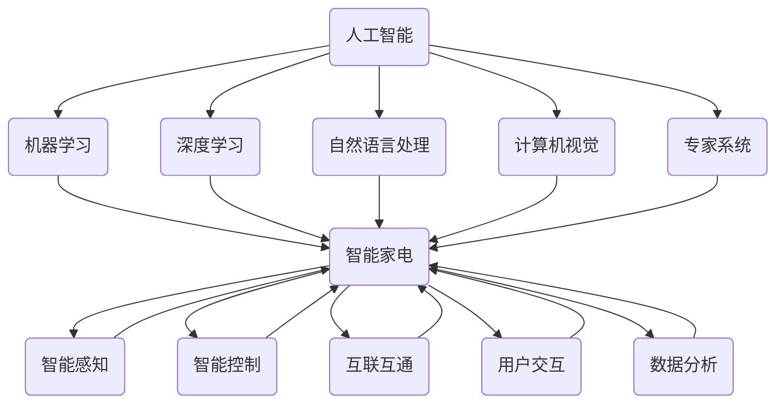
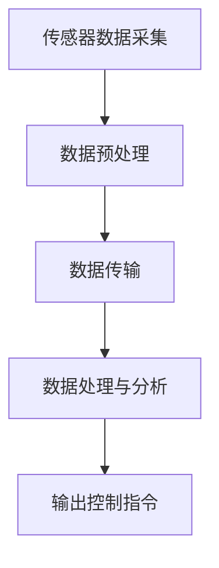
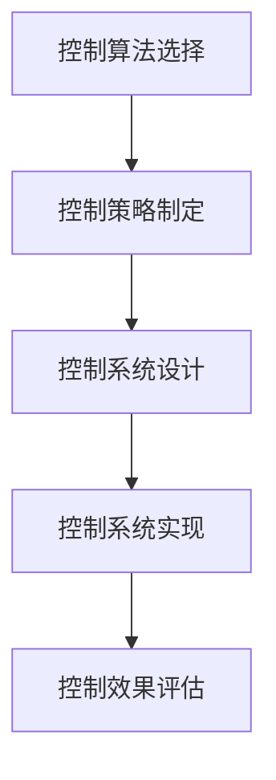
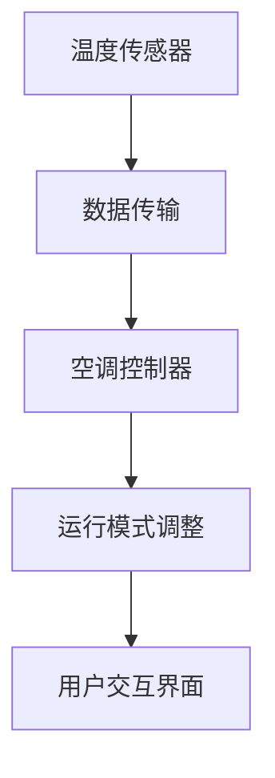
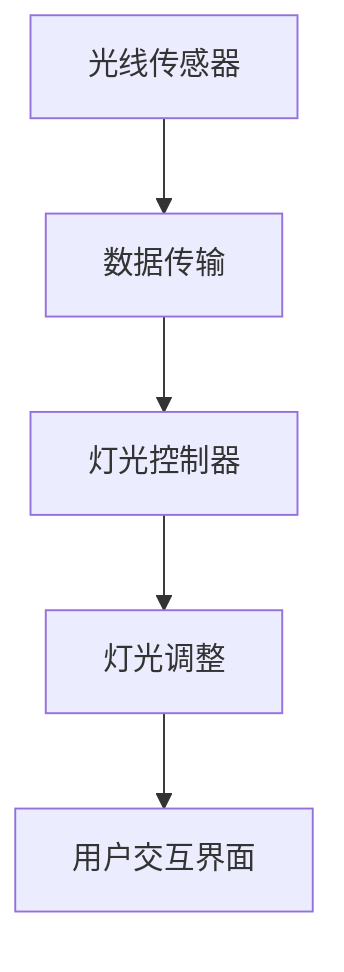

                 

### 《人工智能在智能家电中的应用：提升生活品质》

> 关键词：人工智能、智能家电、应用场景、生活品质、提升

> 摘要：本文将深入探讨人工智能在智能家电中的应用，从背景介绍、核心概念与联系、应用原理、案例分析以及总结展望五个方面，全面剖析人工智能如何通过智能感知、智能控制等技术，提升我们的日常生活品质。通过一系列具体案例，本文旨在帮助读者理解人工智能技术如何渗透到智能家电中，进而改善我们的生活。

----------------------------------------------------------------

### 目录大纲

**《人工智能在智能家电中的应用：提升生活品质》**

----------------------------------------------------------------

## 第一部分：背景介绍

### 第1章：问题背景

#### 1.1 人工智能的发展历程

- 人工智能的起源与发展
- 人工智能在不同阶段的代表性成果

#### 1.2 智能家电的发展现状

- 智能家电的定义与分类
- 当前智能家电市场的发展趋势

#### 1.3 人工智能与智能家电的结合点

- 人工智能技术在智能家电中的应用场景
- 人工智能提升智能家电生活品质的潜力

### 第2章：核心概念与联系

#### 2.1 人工智能核心概念

- 人工智能的定义与分类
- 常见的人工智能技术

#### 2.2 智能家电核心概念

- 智能家电的定义与功能
- 智能家电的通信协议与标准

#### 2.3 人工智能与智能家电的联系

- 人工智能技术在智能家电中的应用原理
- 人工智能与智能家电的技术融合路径

## 第二部分：人工智能在智能家电中的应用原理

### 第3章：智能感知技术

#### 3.1 智能感知技术的定义与作用

- 智能感知技术的概念
- 智能感知技术在智能家电中的应用

#### 3.2 传感器技术与物联网

- 传感器技术在智能感知中的应用
- 物联网技术在智能家电中的应用

#### 3.3 智能感知技术的实现原理

- 传感器数据的采集与处理
- 智能感知算法的应用

### 第4章：智能控制技术

#### 4.1 智能控制技术的定义与作用

- 智能控制技术的概念
- 智能控制技术在智能家电中的应用

#### 4.2 控制算法与控制策略

- 控制算法的种类与原理
- 控制策略的选择与优化

#### 4.3 智能控制技术的实现原理

- 控制系统的设计与实现
- 智能控制算法的编程与优化

## 第三部分：智能家电案例分析

### 第5章：智能空调系统

#### 5.1 智能空调系统的概述

- 智能空调系统的组成与工作原理
- 智能空调系统的功能与优势

#### 5.2 智能空调系统的实现

- 智能感知技术的应用
- 智能控制技术的实现

#### 5.3 智能空调系统案例解析

- 智能空调系统的实际应用案例
- 智能空调系统在提升生活品质方面的作用

### 第6章：智能照明系统

#### 6.1 智能照明系统的概述

- 智能照明系统的组成与工作原理
- 智能照明系统的功能与优势

#### 6.2 智能照明系统的实现

- 智能感知技术的应用
- 智能控制技术的实现

#### 6.3 智能照明系统案例解析

- 智能照明系统的实际应用案例
- 智能照明系统在提升生活品质方面的作用

## 第四部分：总结与展望

### 第7章：人工智能在智能家电中的应用现状与未来趋势

#### 7.1 人工智能在智能家电中的应用现状

- 当前人工智能在智能家电中的应用现状
- 存在的问题与挑战

#### 7.2 人工智能在智能家电中的未来发展趋势

- 未来人工智能在智能家电中的应用前景
- 智能家电行业的发展趋势与机遇

#### 7.3 总结与展望

- 人工智能在智能家电中的应用总结
- 对未来智能家电发展的展望

----------------------------------------------------------------

本文将以“LET'S THINK STEP BY STEP”的方式，逐步引导读者深入理解人工智能在智能家电中的应用，探索这一领域的前沿技术及其对日常生活品质的深远影响。我们首先从背景介绍开始，理解人工智能和智能家电的发展历程及其结合点，然后深入探讨智能感知和智能控制技术，最后通过具体案例分析，展示人工智能如何提升我们的生活质量。

### 第一部分：背景介绍

#### 1.1 人工智能的发展历程

人工智能（Artificial Intelligence，简称AI）是计算机科学的一个分支，旨在使机器能够模拟、延伸和扩展人的智能。人工智能的概念最早可以追溯到20世纪50年代，当时图灵提出了著名的图灵测试，以评估机器是否具备智能。

- **起源与发展**：人工智能的起源可以追溯到1956年，达特茅斯会议上，约翰·麦卡锡、马文·明斯基等科学家首次提出了人工智能的概念。这一阶段，人工智能主要集中在理论研究，如逻辑推理和问题求解。

- **第一阶段：20世纪50-60年代**：这一阶段以符号主义方法为主，人工智能试图通过模拟人类思维过程来解决复杂问题。然而，由于计算机性能的限制，这一阶段的成果有限。

- **第二阶段：20世纪80-90年代**：随着计算机技术的进步，专家系统和机器学习开始兴起。专家系统能够模拟专家的决策过程，而机器学习则通过数据和算法实现自我优化。

- **第三阶段：21世纪初至今**：深度学习和大数据技术的突破，使得人工智能进入了快速发展阶段。自动驾驶、语音识别、图像识别等应用取得了显著成果。

#### 1.2 智能家电的发展现状

智能家电是指通过互联网、物联网等技术，实现家电产品智能控制、数据交互和协同工作的家电产品。智能家电的发展可以分为以下几个阶段：

- **初级阶段**：家电产品实现基本的远程控制和自动化操作，如手机远程控制电视、空调等。

- **中级阶段**：家电产品之间开始实现互联互通，形成智能家居系统，用户可以通过手机、语音等方式控制整个家居系统。

- **高级阶段**：智能家居系统进一步集成人工智能技术，实现更智能的交互和自主决策，如自动调节室内温度、湿度，根据用户习惯优化家电使用方案等。

当前，智能家电市场呈现出快速增长的趋势，各大厂商纷纷布局，推出各种智能家电产品，如智能空调、智能照明、智能冰箱等。

#### 1.3 人工智能与智能家电的结合点

人工智能技术在智能家电中的应用，不仅提升了家电产品的功能，也极大地改善了用户的生活品质。以下是一些典型的结合点：

- **智能感知**：通过传感器技术，智能家电可以实时感知环境变化，如温度、湿度、光线等，并根据感知结果自动调整设备状态，为用户提供更舒适的生活环境。

- **智能控制**：利用人工智能算法，智能家电可以自动优化设备运行策略，降低能耗，提高效率，延长设备寿命。

- **个性化服务**：通过大数据和机器学习技术，智能家电可以分析用户行为数据，提供个性化的服务，如智能推荐音乐、新闻、天气等。

- **安全性提升**：人工智能技术可以帮助智能家电识别异常行为，如非法入侵、设备故障等，提高家庭安全。

#### 1.4 人工智能提升智能家电生活品质的潜力

随着人工智能技术的不断进步，智能家电在提升生活品质方面的潜力也愈发显著。以下是一些具体的潜力：

- **健康监测**：智能家电可以通过传感器实时监测用户的健康状况，如心率、血压等，为用户提供健康预警和个性化健康管理方案。

- **环境优化**：智能家电可以根据用户的喜好和实时环境数据，自动调整室内温度、湿度、空气质量等，为用户提供舒适的居住环境。

- **节能环保**：智能家电可以通过智能感知和智能控制，实现节能环保，减少能源消耗，降低碳排放。

- **娱乐休闲**：智能家电可以提供更加丰富的娱乐和休闲体验，如智能音响系统、智能电视等，为用户的日常生活增添乐趣。

综上所述，人工智能技术在智能家电中的应用，不仅推动了智能家电行业的发展，也为用户带来了更加便捷、舒适、健康的生活体验。接下来，我们将深入探讨人工智能在智能家电中的应用原理，进一步理解其如何提升我们的生活品质。

### 第二部分：核心概念与联系

#### 2.1 人工智能核心概念

人工智能（Artificial Intelligence，简称AI）是计算机科学的一个分支，旨在使机器能够模拟、延伸和扩展人的智能。以下是人工智能的一些核心概念：

- **机器学习**：一种让计算机通过数据学习和发现规律的方法。常见的机器学习方法包括监督学习、无监督学习和强化学习。

- **深度学习**：一种基于多层神经网络的机器学习方法，通过逐层提取特征，实现复杂模式识别和预测。

- **自然语言处理**：使计算机能够理解和生成人类语言的技术，包括语音识别、文本分类、机器翻译等。

- **计算机视觉**：使计算机能够理解和解释图像和视频的技术，包括目标检测、图像分类、图像分割等。

- **专家系统**：一种模拟人类专家解决问题能力的人工智能系统，通过规则库和推理机实现。

#### 2.2 智能家电核心概念

智能家电是指通过互联网、物联网等技术，实现家电产品智能控制、数据交互和协同工作的家电产品。以下是智能家电的一些核心概念：

- **智能感知**：智能家电通过传感器等设备，实时感知环境变化，如温度、湿度、光线等，并根据感知结果自动调整设备状态。

- **智能控制**：通过计算机算法和通信技术，实现智能家电之间的协同工作，如自动调整空调温度、灯光亮度等。

- **互联互通**：智能家电可以通过Wi-Fi、蓝牙等通信技术，实现设备之间的互联互通，形成一个统一的智能家居系统。

- **用户交互**：智能家电提供多种交互方式，如语音控制、手机APP控制、触摸控制等，方便用户操作。

- **数据分析**：智能家电可以收集用户使用数据，通过大数据分析和机器学习，实现个性化服务和优化。

#### 2.3 人工智能与智能家电的联系

人工智能技术在智能家电中的应用，主要体现在以下几个方面：

- **智能感知**：人工智能通过深度学习和计算机视觉等技术，对传感器采集的数据进行分析和处理，实现更精确的环境感知。

- **智能控制**：人工智能算法可以优化家电的运行策略，实现节能、降耗、提高设备寿命。

- **个性化服务**：通过大数据分析和机器学习，智能家电可以根据用户的行为和偏好，提供个性化的服务，提升用户体验。

- **安全性提升**：人工智能技术可以帮助智能家电识别异常行为，如非法入侵、设备故障等，提高家庭安全。

- **跨设备协作**：人工智能可以协调不同智能家电之间的工作，实现智能家居系统的无缝连接和协同工作。

以下是人工智能与智能家电联系的ER实体关系图架构：

通过以上核心概念和ER实体关系图，我们可以看到人工智能与智能家电之间紧密的联系。接下来，我们将进一步探讨人工智能在智能家电中的应用原理，以及如何通过智能感知和智能控制技术，提升我们的生活质量。

### 第二部分：人工智能在智能家电中的应用原理

#### 3.1 智能感知技术的定义与作用

智能感知技术是人工智能在智能家电中应用的重要组成部分，它通过传感器和物联网技术，实现对环境数据的实时采集和处理。智能感知技术的核心目标是让智能家电能够感知并理解周围的环境，从而做出相应的反应。

- **定义**：智能感知技术是指利用传感器、物联网和其他智能设备，对环境中的信息进行采集、传输、处理和分析，以实现智能化的监测和控制。

- **作用**：智能感知技术在智能家电中的应用非常广泛，它可以用于环境监测、设备状态检测、用户行为分析等，从而提高家电产品的智能化水平和用户体验。

例如，在智能空调系统中，温度传感器可以实时监测室内的温度，并将数据传输给空调系统。空调系统根据接收到的温度数据，自动调整制冷或加热模式，以保持室内温度的舒适。

#### 3.2 传感器技术与物联网

传感器技术是智能感知技术的基础，它通过将物理量（如温度、湿度、光强等）转换为电信号，从而实现对环境的监测。物联网（Internet of Things，IoT）则通过互联网和通信技术，将这些传感器连接起来，形成一个统一的智能网络。

- **传感器技术**：传感器技术是智能感知技术的核心，它决定了智能家电对环境数据的敏感度和精确度。常见的传感器包括温度传感器、湿度传感器、光传感器、声音传感器等。

- **物联网技术**：物联网技术为智能感知提供了数据传输和处理的能力。通过物联网，传感器采集到的数据可以被实时传输到云平台或本地服务器，进行进一步的分析和处理。

例如，智能照明系统中的光线传感器可以实时监测室内的光线强度，并将数据传输到智能照明系统。系统根据接收到的光线强度数据，自动调整灯光的亮度和色温，以适应不同的使用场景。

#### 3.3 智能感知技术的实现原理

智能感知技术的实现涉及多个环节，包括传感器数据的采集、传输、处理和分析。

- **传感器数据的采集**：传感器通过物理原理将环境中的物理量转换为电信号，如温度传感器将温度转换为电压信号。

- **传感器数据的传输**：采集到的传感器数据需要通过物联网技术传输到中央处理单元或云平台。常见的传输方式包括Wi-Fi、蓝牙、Zigbee等。

- **传感器数据处理**：传输到中央处理单元或云平台的数据需要进行预处理，如滤波、去噪等，然后通过机器学习算法进行分析和处理。

- **传感器数据输出**：处理后的数据可以根据应用需求输出相应的控制指令，如调整空调温度、灯光亮度等。

以下是智能感知技术的实现流程Mermaid流程图：

通过以上流程，我们可以看到智能感知技术的实现原理。智能感知技术为智能家电提供了强大的环境感知能力，使其能够更加智能化地适应用户需求，提升生活品质。

#### 4.1 智能控制技术的定义与作用

智能控制技术是人工智能在智能家电中的另一重要应用，它通过计算机算法和通信技术，实现家电设备的自动化控制和优化。智能控制技术的核心目标是提升家电设备的使用效率、节能性和用户体验。

- **定义**：智能控制技术是指利用计算机算法和通信技术，对智能家电设备进行自动化控制和优化，以实现高效、节能、智能化的运行。

- **作用**：智能控制技术在智能家电中的应用非常广泛，它可以用于设备状态的自动监测、运行策略的优化、能耗管理、故障诊断等，从而提高家电产品的智能化水平和用户体验。

例如，在智能空调系统中，智能控制技术可以实时监测室内外温度、湿度等环境参数，并根据这些参数自动调整空调的运行模式，以保持室内温度的舒适。同时，智能控制技术还可以优化空调的能耗管理，降低能源消耗。

#### 4.2 控制算法与控制策略

智能控制技术主要依赖于控制算法和控制策略来实现家电设备的自动化控制和优化。

- **控制算法**：控制算法是智能控制技术的核心，它决定了智能家电设备的行为和性能。常见的控制算法包括PID控制、模糊控制、神经网络控制等。

  - **PID控制**：比例-积分-微分（PID）控制是最常用的工业控制算法，它通过调整比例、积分和微分三个参数，实现对系统偏差的快速响应和精确控制。

  - **模糊控制**：模糊控制是一种基于模糊逻辑的控制方法，它通过模糊规则和模糊推理来实现对系统的控制。

  - **神经网络控制**：神经网络控制是一种基于人工神经网络的控制方法，它通过学习系统输入输出关系，实现对系统的自适应控制。

- **控制策略**：控制策略是指根据系统状态和目标，制定相应的控制行为和策略。常见的控制策略包括自适应控制、预测控制、优化控制等。

  - **自适应控制**：自适应控制是一种根据系统变化自动调整控制参数的控制方法，它能够应对系统的不确定性和变化。

  - **预测控制**：预测控制是一种根据系统未来行为进行预测，并制定相应的控制策略，以提高系统响应速度和性能。

  - **优化控制**：优化控制是一种通过优化目标函数，找到最优控制策略的方法，它适用于复杂系统的控制。

#### 4.3 智能控制技术的实现原理

智能控制技术的实现涉及多个环节，包括控制算法的选择、控制策略的制定、控制系统的设计与实现等。

- **控制算法的选择**：根据智能家电设备的特点和要求，选择合适的控制算法。例如，对于对实时性要求较高的系统，可以选择PID控制；对于非线性系统，可以选择模糊控制或神经网络控制。

- **控制策略的制定**：根据系统状态和目标，制定相应的控制策略。例如，对于节能需求较高的系统，可以制定基于能耗优化的控制策略；对于舒适性需求较高的系统，可以制定基于用户体验的控制策略。

- **控制系统的设计与实现**：控制系统包括硬件和软件两部分。硬件部分包括传感器、执行器、控制器等，软件部分包括控制算法的实现和系统控制逻辑的实现。

以下是智能控制技术的实现流程Mermaid流程图：

通过以上流程，我们可以看到智能控制技术的实现原理。智能控制技术为智能家电提供了强大的自动化控制和优化能力，使其能够更加智能化地适应用户需求，提升生活品质。

### 第三部分：智能家电案例分析

#### 5.1 智能空调系统

智能空调系统是智能家居中最为常见的智能家电之一，它通过集成人工智能技术，实现了对室内温度、湿度、空气质量等环境参数的智能调节，为用户提供了更加舒适、健康的生活环境。

#### 5.1.1 智能空调系统的概述

智能空调系统主要由以下几个部分组成：

- **温度传感器**：用于实时监测室内温度。
- **湿度传感器**：用于实时监测室内湿度。
- **空气质量传感器**：用于实时监测室内空气质量。
- **空调控制器**：用于接收传感器数据，并根据数据自动调整空调的运行模式。
- **用户交互界面**：包括手机APP、智能音箱等，用于用户与空调系统的交互。

智能空调系统的工作原理是：温度传感器、湿度传感器和空气质量传感器实时监测室内环境参数，并将数据传输给空调控制器。空调控制器根据接收到的数据，自动调整空调的制冷、加热或空气净化模式，以保持室内环境的舒适和健康。

#### 5.1.2 智能空调系统的实现

智能空调系统的实现主要依赖于以下技术：

- **智能感知技术**：通过温度传感器、湿度传感器和空气质量传感器，实现对室内环境的实时监测。
- **智能控制技术**：通过空调控制器，根据传感器数据自动调整空调的运行模式。
- **用户交互技术**：通过手机APP、智能音箱等，为用户提供便捷的交互方式。

以下是智能空调系统的实现流程Mermaid流程图：

通过以上流程，我们可以看到智能空调系统的实现原理。智能空调系统通过智能感知技术和智能控制技术，实现了对室内环境的智能调节，为用户提供了更加舒适、健康的生活环境。

#### 5.1.3 智能空调系统案例解析

以下是一个具体的智能空调系统案例：

某用户购买了一台智能空调，并安装了相应的手机APP。用户通过手机APP可以实时查看室内温度、湿度和空气质量，并可以远程控制空调的开关和运行模式。某天，用户外出回家，发现室内温度较高，空气质量较差。用户通过手机APP远程启动空调，并选择了“自动模式”。空调控制器接收到用户的指令后，自动启动制冷模式，并开启空气净化功能。经过一段时间，室内温度降至用户设定的舒适温度，空气质量也得到了显著改善。

通过这个案例，我们可以看到智能空调系统如何通过智能感知技术和智能控制技术，实时监测和调节室内环境，为用户提供了舒适、健康的生活环境。

#### 5.2 智能照明系统

智能照明系统是智能家居中的另一个重要组成部分，它通过集成人工智能技术，实现了对室内灯光的智能控制，为用户提供了更加灵活、舒适的照明环境。

#### 5.2.1 智能照明系统的概述

智能照明系统主要由以下几个部分组成：

- **光线传感器**：用于实时监测室内光线强度。
- **智能开关**：用于控制灯光的开关。
- **灯光控制器**：用于接收传感器数据和用户指令，并根据数据自动调整灯光的亮度和色温。
- **用户交互界面**：包括手机APP、智能音箱等，用于用户与照明系统的交互。

智能照明系统的工作原理是：光线传感器实时监测室内光线强度，并将数据传输给灯光控制器。灯光控制器根据光线传感器的数据和用户指令，自动调整灯光的亮度和色温，以适应不同的使用场景。

#### 5.2.2 智能照明系统的实现

智能照明系统的实现主要依赖于以下技术：

- **智能感知技术**：通过光线传感器，实现对室内光线强度的实时监测。
- **智能控制技术**：通过灯光控制器，根据传感器数据和用户指令，自动调整灯光的亮度和色温。
- **用户交互技术**：通过手机APP、智能音箱等，为用户提供便捷的交互方式。

以下是智能照明系统的实现流程Mermaid流程图：

通过以上流程，我们可以看到智能照明系统的实现原理。智能照明系统通过智能感知技术和智能控制技术，实现了对室内灯光的智能控制，为用户提供了更加灵活、舒适的照明环境。

#### 5.2.3 智能照明系统案例解析

以下是一个具体的智能照明系统案例：

某用户购买了一台智能照明系统，并安装了相应的手机APP。用户通过手机APP可以实时查看室内光线强度，并可以远程控制灯光的开关和亮度和色温。某天，用户在家中感到光线较暗，通过手机APP远程调整了灯光的亮度和色温。灯光控制器接收到用户的指令后，自动调整了灯光的亮度和色温，使得室内光线更加柔和舒适。

通过这个案例，我们可以看到智能照明系统如何通过智能感知技术和智能控制技术，实时监测和调节室内灯光，为用户提供了更加灵活、舒适的照明环境。

### 第四部分：总结与展望

#### 7.1 人工智能在智能家电中的应用现状

当前，人工智能在智能家电中的应用已经取得了显著的成果。智能感知技术、智能控制技术和用户交互技术等已经广泛应用于智能空调、智能照明、智能音响等家电产品中。通过这些技术，智能家电不仅能够更好地满足用户的需求，还提升了用户的生活品质。

然而，尽管人工智能在智能家电中的应用已经取得了很大的进展，但仍然存在一些问题和挑战。首先，智能家电产品的智能化程度和用户体验仍有待提升。其次，智能家电的安全性和隐私保护问题也日益引起关注。此外，智能家电的兼容性和互联互通问题也需要进一步解决。

#### 7.2 人工智能在智能家电中的未来发展趋势

随着人工智能技术的不断进步，未来人工智能在智能家电中的应用前景十分广阔。以下是一些可能的发展趋势：

1. **更智能的感知能力**：未来，智能家电将具备更强大的感知能力，能够实时监测和感知更多环境参数，如气味、噪音等，为用户提供更加精准的服务。

2. **更智能的控制算法**：随着机器学习和深度学习技术的发展，智能家电将采用更加先进的控制算法，实现更加高效、节能的运行。

3. **更高的用户交互体验**：通过语音、手势、眼动等新型交互方式，智能家电将提供更加自然、直观的用户交互体验。

4. **更安全、更可靠的智能家电**：随着安全技术的进步，智能家电将具备更高的安全性和隐私保护能力，保障用户的个人信息和隐私安全。

5. **更广泛的互联互通**：未来，智能家电将实现更广泛、更紧密的互联互通，形成一个统一的智能家居生态，为用户提供更加便捷、高效的生活方式。

#### 7.3 总结与展望

人工智能在智能家电中的应用，不仅提升了家电产品的智能化水平和用户体验，还改变了我们的生活方式，提高了生活品质。未来，随着人工智能技术的不断进步，智能家电将变得更加智能、便捷、安全，为我们的生活带来更多便利和乐趣。

在未来，我们期待看到人工智能在智能家电中的应用更加深入和广泛，为我们的生活带来更多惊喜。同时，我们也需要关注智能家电的安全性和隐私保护问题，确保智能家电真正为用户带来价值，而不是带来新的困扰。

### 作者信息

作者：AI天才研究院/AI Genius Institute & 禅与计算机程序设计艺术 /Zen And The Art of Computer Programming

