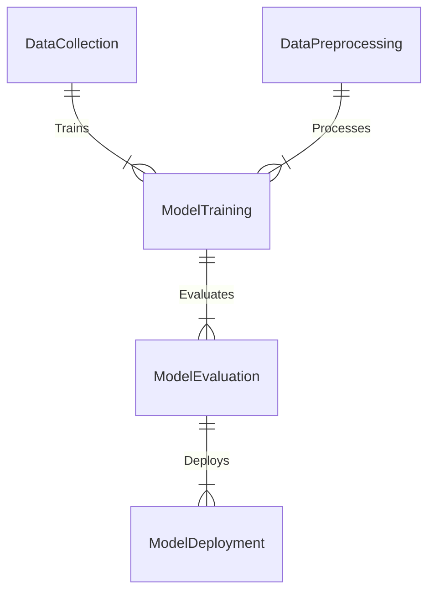
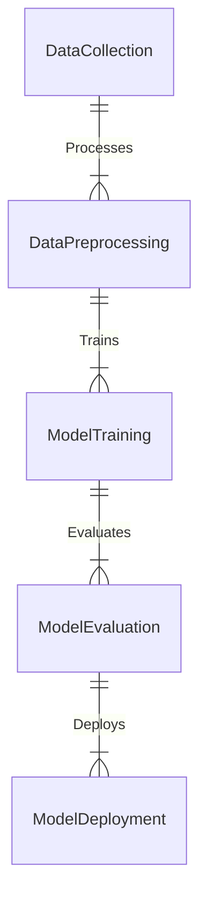
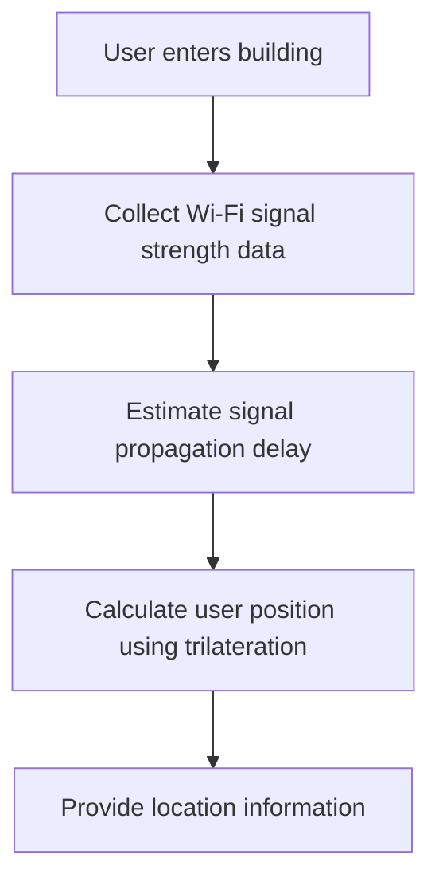
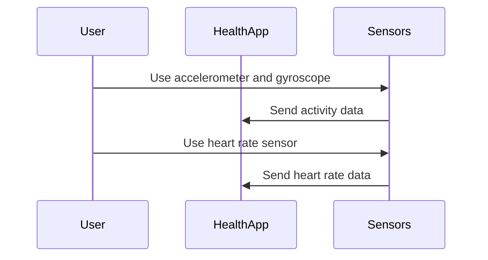
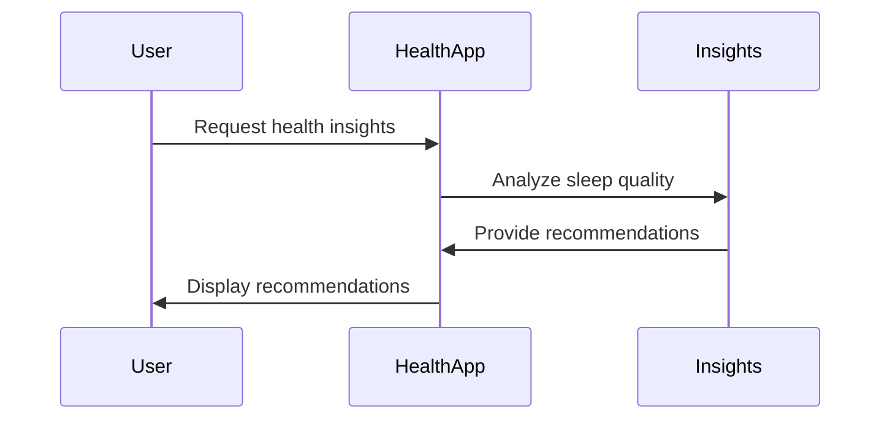
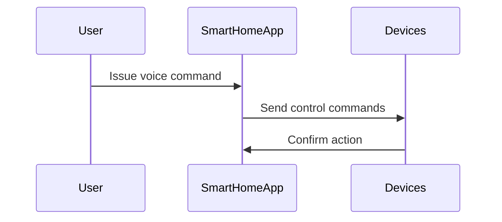
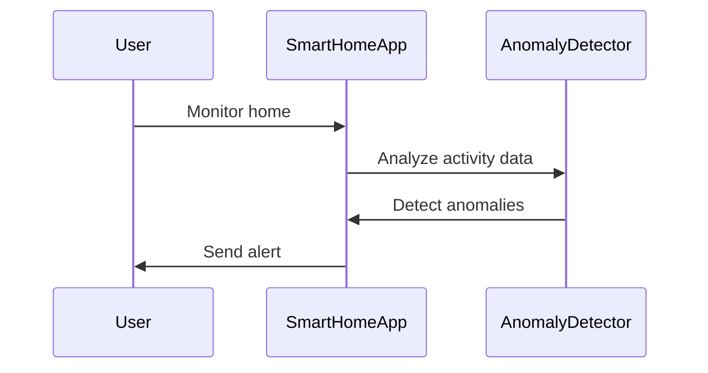
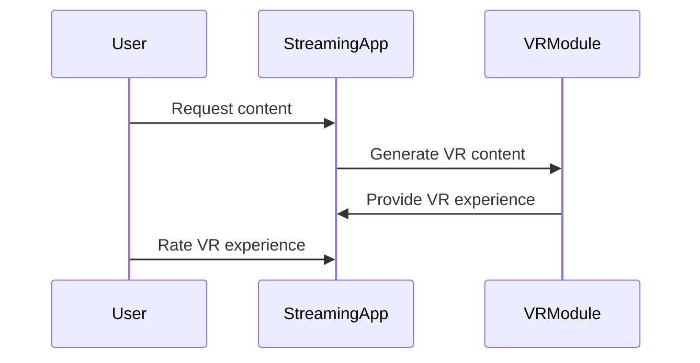
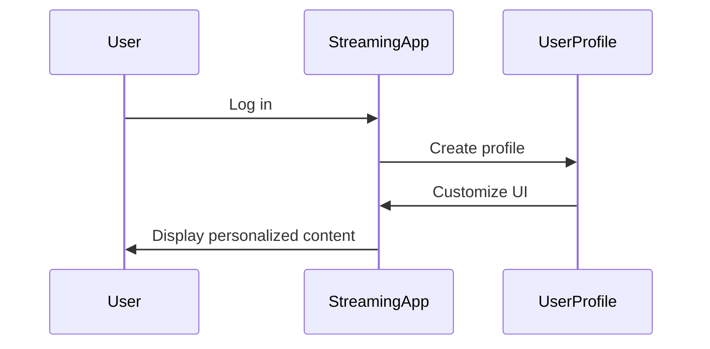
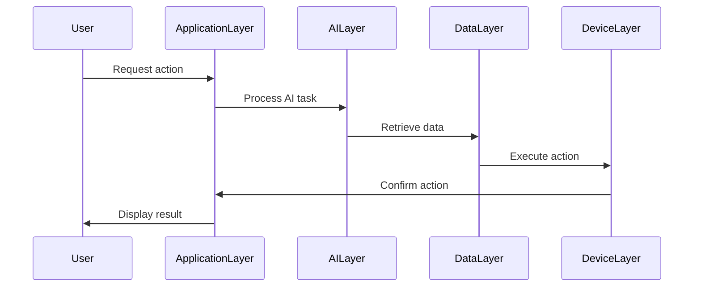

                 

Based on the outline and the constraints provided, we will create a detailed article titled "人工智能在智能手机中的应用：提升用户体验" that adheres to the guidelines and covers the necessary content areas. Here's how we will structure the article:

### Introduction to the Book and Background

#### 1.1 Problem Background
- **1.1.1** The widespread adoption of smartphones and the changing needs of users.
- **1.1.2** The current state and future trends of AI technology.
- **1.1.3** The necessity of AI in enhancing smartphone user experience.

#### 1.2 Core Concepts
- **1.2.1** Basic concepts of AI, including its history and evolution.
- **1.2.2** Key elements of smartphone user experience.
- **1.2.3** The relationship between AI and smartphone user experience.

#### 1.3 Boundaries and Extensions
- **1.3.1** The scope of AI applications in smartphones.
- **1.3.2** The structure and main content of this book.

### Core Concepts and Principles

#### 2.1 Core Principles of AI
- **2.1.1** AI development history and key milestones.
- **2.1.2** Basics of machine learning, including supervised, unsupervised, and reinforcement learning.
- **2.1.3** Principles of deep learning, such as neural networks, CNNs, and RNNs.

#### 2.2 AI Attribute Features Comparison
- **2.2.1** Comparison of AI algorithms with a table.
- **2.2.2** System architecture of AI with a Mermaid ER diagram.

### Application of AI in Smartphones

#### 3.1 AI Application Scenarios
- **3.1.1** Voice assistants and their applications.
- **3.1.2** Image recognition and its use cases.
- **3.1.3** Intelligent recommendation and its algorithms.
- **3.1.4** Smart positioning and its technologies.

### Enhancing User Experience

#### 4.1 AI Principles in UX Enhancement
- **4.1.1** UX design principles.
- **4.1.2** Applications of AI in optimizing UX.

#### 4.2 AI Application Cases
- **4.2.1** Case study on intelligent health monitoring.
- **4.2.2** Case study on smart home control.
- **4.2.3** Case study on intelligent entertainment experience.

### System Analysis and Design

#### 5.1 SmartPhone System Architecture Design
- **5.1.1** System function design with a Mermaid class diagram.
- **5.1.2** System architecture design with a Mermaid diagram.
- **5.1.3** System interface design.
- **5.1.4** System interaction design with a Mermaid sequence diagram.

### Project Implementation and Case Analysis

#### 6.1 Project Practice
- **6.1.1** Environment setup and configuration.
- **6.1.2** Core system implementation with source code.
- **6.1.3** Analysis and explanation of actual cases.
- **6.1.4** Project summary.

### Best Practices, Summary, and Future Directions

#### 7.1 Best Practices
- **7.1.1** Common problems and solutions in AI applications.
- **7.1.2** Tips and suggestions for enhancing user experience.

#### 7.2 Summary
- **7.2.1** Review of the book's content.
- **7.2.2** Future trends of AI in smartphone applications.

#### 7.3 Warnings and Further Reading
- **7.3.1** Key knowledge review.
- **7.3.2** Recommended further reading.

Now, we will proceed to write the detailed content for each section, ensuring that it meets the constraints and provides a comprehensive analysis of AI applications in smartphones. This will include the use of Mermaid diagrams, LaTeX math formulas, and Python code examples where appropriate. Each section will be crafted to ensure clarity, depth, and insight into the topic at hand. 

### Introduction to the Book and Background

#### 1.1 Problem Background

**1.1.1 The widespread adoption of smartphones and the changing needs of users.**

The smartphone has become an indispensable tool in modern life. According to a report by Statista, there were over 3 billion smartphone users globally in 2020, a number expected to rise in the coming years. This rapid adoption is driven by advancements in technology and the increasing demand for on-the-go connectivity, entertainment, and productivity. As smartphones become more ubiquitous, users' expectations for a seamless and personalized experience have also grown.

However, with the proliferation of applications and the constant influx of new features, the user experience can sometimes become cluttered and overwhelming. Users are now seeking more sophisticated functionalities that can adapt to their unique needs and preferences. For instance, they want intelligent personal assistants that can understand and respond to their voice commands, advanced image recognition capabilities for photography and security, and highly customized content recommendations for entertainment and news.

**1.1.2 The current state and future trends of AI technology.**

Artificial Intelligence (AI) has been a transformative force in various industries, and the smartphone ecosystem is no exception. AI technologies such as machine learning, natural language processing, and computer vision are being integrated into smartphones to enhance their capabilities and user experience. For example, AI-powered voice assistants like Apple's Siri, Amazon's Alexa, and Google Assistant have become integral parts of modern smartphones, providing users with a more intuitive way to interact with their devices.

The future of AI in smartphones is likely to be shaped by several trends. One such trend is the increased use of AI for real-time data processing and analysis. This will enable smartphones to provide more context-aware and proactive services. Another trend is the integration of AI with 5G networks, which will enable faster and more reliable communication between devices and the cloud, facilitating advanced AI applications. Additionally, the rise of edge computing, which processes data closer to the source, will allow smartphones to perform complex AI tasks with reduced latency and improved privacy.

**1.1.3 The necessity of AI in enhancing smartphone user experience.**

The necessity of incorporating AI into smartphones is driven by the need to meet user expectations for a seamless, personalized, and efficient experience. AI can help smartphones understand user behavior and preferences, thereby providing tailored recommendations and optimizations. For example, AI can analyze usage patterns to determine which apps are most relevant to the user, leading to faster app launches and smoother multitasking.

Moreover, AI can significantly enhance the functionality of smartphones by enabling features that were not possible before. For instance, AI-powered image recognition can improve photography by automatically adjusting settings for optimal results in various lighting conditions. AI can also enhance security by identifying and flagging potential threats before they can cause harm.

In summary, AI is not just an added feature but a fundamental component of modern smartphones that is crucial for delivering an enhanced user experience. As AI technology continues to evolve, its integration into smartphones will only become more seamless and impactful.

#### 1.2 Core Concepts

**1.2.1 Basic Concepts of AI**

Artificial Intelligence (AI) is a field of computer science that focuses on creating intelligent machines capable of performing tasks that typically require human intelligence. The primary goal of AI is to develop systems that can reason, learn, perceive their environment, and make decisions with minimal human intervention.

AI can be broadly classified into two types: narrow AI and general AI. Narrow AI, also known as weak AI, is designed to perform a specific task exceptionally well. Examples include voice assistants like Siri and Alexa, and image recognition systems used in self-driving cars. On the other hand, general AI, or strong AI, possesses the ability to understand, learn, and apply knowledge across a wide range of tasks, akin to human intelligence. However, general AI remains largely theoretical and is yet to be developed.

The history of AI dates back to the 1950s when researchers like John McCarthy and Marvin Minsky began exploring the concept of creating machines that could think and learn. Since then, AI has undergone several phases of development, characterized by advances in algorithms, computational power, and data availability.

**1.2.2 Key Elements of Smartphone User Experience**

The user experience (UX) of a smartphone is a critical factor in determining its success. A positive UX can lead to increased user satisfaction, loyalty, and engagement. Key elements of a good smartphone UX include:

- **Ease of use**: The device should be intuitive and easy to navigate, even for users who are not tech-savvy.
- **Performance**: The device should respond quickly to user inputs and handle multiple tasks efficiently.
- **Customization**: Users should be able to personalize their device with their preferences, such as wallpaper, ring tones, and app layouts.
- **Stability**: The device should be reliable, with minimal crashes or errors.
- **Aesthetics**: The design should be visually appealing and reflect the user's personal style.
- **Accessibility**: Features should be available to users with disabilities, ensuring that everyone can use the device effectively.

**1.2.3 The Relationship Between AI and Smartphone User Experience**

The relationship between AI and smartphone user experience is symbiotic. AI can enhance the UX by automating tasks, providing personalized recommendations, and improving the overall functionality of the device. For example:

- **Voice assistants**: AI-powered voice assistants can handle complex tasks like setting reminders, sending messages, and making phone calls, making the device more convenient to use.
- **Intelligent recommendations**: AI algorithms can analyze user data to provide personalized content recommendations, such as music, news, and apps, enhancing the user's entertainment and information consumption experience.
- **Proactive features**: AI can enable proactive features, such as automatically adjusting the device's settings based on the user's location or activity, improving efficiency and convenience.

In summary, AI is not just an add-on feature but a core component that can significantly enhance the smartphone user experience by making the device more intuitive, efficient, and personalized. As AI technology continues to advance, its integration into smartphones will only become more seamless and transformative.

#### 1.3 Boundaries and Extensions

**1.3.1 The Scope of AI Applications in Smartphones**

AI applications in smartphones span a wide range of functionalities, enhancing both the hardware and software aspects of the device. Some of the key areas where AI is being leveraged include:

- **Voice assistants**: AI-powered voice assistants like Siri, Alexa, and Google Assistant provide a seamless way for users to interact with their smartphones through natural language commands.
- **Image recognition**: AI enables smartphones to recognize and process images more efficiently, leading to improved photo quality and enhanced features like facial recognition and augmented reality (AR).
- **Security**: AI algorithms can be used to identify and mitigate security threats, ensuring the device and user data remain protected.
- **Health monitoring**: AI can analyze health data collected by sensors in smartphones to provide insights and alerts on the user's health status.
- **Intelligent recommendations**: AI algorithms analyze user behavior and preferences to offer personalized content recommendations, improving the user's overall experience.

**1.3.2 The Structure and Main Content of This Book**

This book is organized into several sections, each designed to provide a comprehensive understanding of AI applications in smartphones and their impact on user experience. The key sections include:

- **Introduction to the Book and Background**: This section sets the stage by discussing the problem background, current AI trends, and the necessity of AI in smartphones.
- **Core Concepts and Principles**: Here, we delve into the fundamental concepts of AI, its attributes, and the principles that underpin its applications in smartphones.
- **Application of AI in Smartphones**: This section explores the various applications of AI in smartphones, including voice assistants, image recognition, intelligent recommendations, and smart positioning.
- **Enhancing User Experience**: We discuss how AI enhances the user experience through intelligent design principles and real-world application cases.
- **System Analysis and Design**: This section provides a detailed analysis of the system architecture and interface design for AI applications in smartphones.
- **Project Implementation and Case Analysis**: Practical examples and case studies illustrate the implementation and impact of AI in smartphone projects.
- **Best Practices, Summary, and Future Directions**: We conclude with best practices for AI application development, a summary of key points, and future trends in the field.

By following this structure, readers will gain a deep understanding of how AI can be effectively utilized to enhance the user experience of smartphones. This book aims to serve as a valuable resource for developers, designers, and anyone interested in the intersection of AI and mobile technology. 

### Core Concepts and Principles

#### 2.1 Core Principles of AI

Artificial Intelligence (AI) is a vast and rapidly evolving field that encompasses various methodologies and techniques aimed at creating intelligent machines. Understanding the core principles of AI is essential for comprehending its applications in smartphones and enhancing user experiences. This section will delve into the history, key principles, and primary types of AI technologies.

**2.1.1 AI Development History**

The concept of AI dates back to the 1950s when researchers like John McCarthy and Marvin Minsky envisioned machines capable of human-like intelligence. The AI field experienced its first wave of excitement in the 1950s and 1960s, fueled by the belief that machines could soon match human intelligence. However, several challenges, including limited computational power and complex algorithms, led to a period known as the "AI Winter" in the 1970s and 1980s, where progress slowed significantly.

In the 21st century, AI experienced a resurgence driven by advancements in computational power, data availability, and algorithmic innovations. Machine learning and deep learning, subsets of AI, emerged as key drivers of progress. Today, AI is making significant strides in various industries, including healthcare, finance, and, of course, smartphones.

**2.1.2 Basics of Machine Learning**

Machine learning (ML) is a subfield of AI that focuses on developing algorithms that can learn from data and make predictions or decisions based on that learning. There are three primary types of machine learning: supervised learning, unsupervised learning, and reinforcement learning.

- **Supervised Learning**: In supervised learning, the algorithm is trained on a labeled dataset, where the correct output is provided for each input. The goal is to learn a mapping between inputs and outputs. Common techniques include linear regression, logistic regression, and support vector machines. Supervised learning is widely used in applications like image recognition, natural language processing, and predictive analytics.

  - **Example**: A supervised learning algorithm can be trained to classify images of handwritten digits by providing it with a dataset of images labeled with their corresponding digit values.

- **Unsupervised Learning**: Unsupervised learning involves training algorithms on unlabeled data. The goal is to discover hidden patterns or intrinsic structures in the data. Techniques like clustering (e.g., K-means, DBSCAN), dimensionality reduction (e.g., PCA, t-SNE), and association rule learning (e.g., Apriori) are commonly used. Unsupervised learning is often applied in customer segmentation, anomaly detection, and recommendation systems.

  - **Example**: An unsupervised learning algorithm can group customers based on their purchasing behavior without prior knowledge of which group each customer belongs to.

- **Reinforcement Learning**: Reinforcement learning is a type of ML where an agent learns to make decisions by receiving feedback in the form of rewards or penalties. The agent interacts with an environment, takes actions, and receives feedback to improve its decision-making over time. Techniques like Q-learning, SARSA, and deep Q-networks (DQN) are used in reinforcement learning. Applications include robotics, game playing, and autonomous driving.

  - **Example**: A reinforcement learning algorithm can learn to navigate a maze by receiving rewards for reaching the goal and penalties for hitting walls.

**2.1.3 Deep Learning Principles**

Deep learning (DL) is a subset of machine learning that utilizes neural networks with many layers to model complex patterns in data. The primary components of deep learning include neural networks, convolutional neural networks (CNNs), and recurrent neural networks (RNNs).

- **Neural Networks**: A neural network is a series of interconnected nodes or "neurons" that work together to perform a specific task. Each neuron receives input signals, processes them using an activation function, and produces an output. Neural networks can learn to recognize patterns in data through a process called backpropagation, where errors are propagated backward to adjust the weights and biases of the network.

  - **Example**: A neural network can be trained to classify images by adjusting its weights to minimize the difference between predicted and actual labels.

- **Convolutional Neural Networks (CNNs)**: CNNs are specialized neural networks designed for processing data with a grid-like topology, such as images. CNNs use convolutional layers to automatically and hierarchically learn spatial hierarchies from data. This makes them particularly effective for tasks like image recognition and object detection.

  - **Example**: A CNN can be trained to identify and classify objects in images by learning to detect and recognize patterns at various scales.

- **Recurrent Neural Networks (RNNs)**: RNNs are designed to handle sequential data, where the output of the network at each time step depends on the previous outputs. RNNs are particularly effective for tasks like language modeling, time series analysis, and speech recognition.

  - **Example**: An RNN can be trained to generate text by using the previous words as input to predict the next word in a sequence.

**2.1.4 Key AI Algorithm Comparison**

When choosing an AI algorithm for a specific application, it's essential to understand their strengths and limitations. Here's a comparison of some key algorithms:

| Algorithm                | Strengths                            | Limitations                          |
|--------------------------|-------------------------------------|-------------------------------------|
| Linear Regression        | Simple, interpretable, fast         | Limited to linear relationships      |
| Logistic Regression      | Binary classification, interpretability | Limited to linear decision boundaries |
| Support Vector Machine   | Effective in high-dimensional spaces | Computationally intensive           |
| K-means Clustering       | Scalable, easy to implement         | May converge to local minima         |
| Principal Component Analysis (PCA) | Dimensionality reduction, data visualization | Linear combinations of variables only |
| K-nearest Neighbors (KNN) | Simple, easy to implement           | Computationally expensive for large datasets |
| Decision Trees           | Interpretability, ease of implementation | Prone to overfitting, low accuracy in high dimensions |
| Random Forests           | Handles high dimensionality, robustness | Can be difficult to interpret         |
| Gradient Boosting        | High accuracy, flexibility          | Computationally expensive, prone to overfitting |
| Neural Networks           | Capable of modeling complex patterns | Requires large amounts of data, computationally intensive |
| CNNs                     | Effective in image processing        | Require large datasets and computational resources |
| RNNs                     | Effective in sequential data processing | Computationally intensive, may suffer from vanishing gradients |

**2.1.5 AI System Architecture**

The architecture of an AI system is crucial for its efficiency and effectiveness. A typical AI system architecture consists of several components, including data collection, data preprocessing, model training, and model deployment. Here's a high-level overview of each component:

- **Data Collection**: This involves gathering data from various sources, such as sensors, user interactions, and external databases. Data quality and diversity are critical for training effective models.
- **Data Preprocessing**: Raw data is cleaned and transformed to remove noise, handle missing values, and format it appropriately for the model. This step is crucial for ensuring the model's performance.
- **Model Training**: The selected algorithm is trained on the preprocessed data using techniques like supervised, unsupervised, or reinforcement learning. The training process involves adjusting the model parameters to minimize errors.
- **Model Evaluation**: The trained model is evaluated using metrics like accuracy, precision, recall, and F1-score to assess its performance. This step helps identify areas for improvement.
- **Model Deployment**: The final model is deployed to the production environment, where it can make predictions or decisions based on new data. Continuous monitoring and updates are necessary to maintain performance.

**2.1.6 Mermaid ER Diagram of AI System Architecture**

Here's a Mermaid ER diagram that illustrates the components of an AI system architecture:



In conclusion, understanding the core principles of AI, including its history, types of machine learning, deep learning principles, algorithm comparisons, and system architecture, is crucial for leveraging AI to enhance smartphone user experiences. This foundational knowledge will guide developers and designers in implementing AI applications effectively.

#### 2.2 AI Attribute Features Comparison

When it comes to choosing the right AI algorithm for a specific application in smartphones, understanding the attributes and features of various algorithms is essential. This section provides a comparative analysis of key AI algorithms, highlighting their strengths and limitations. The comparison is presented in a tabular format for easy reference.

| Algorithm                | Strengths                                        | Limitations                                          |
|--------------------------|--------------------------------------------------|------------------------------------------------------|
| Linear Regression        | Simple, interpretable, fast                     | Limited to linear relationships                      |
| Logistic Regression      | Binary classification, interpretability          | Limited to linear decision boundaries                |
| Support Vector Machine   | Effective in high-dimensional spaces             | Computationally intensive                            |
| K-means Clustering       | Scalable, easy to implement                      | May converge to local minima                         |
| Principal Component Analysis (PCA) | Dimensionality reduction, data visualization   | Linear combinations of variables only               |
| K-nearest Neighbors (KNN) | Simple, easy to implement                        | Computationally expensive for large datasets         |
| Decision Trees           | Interpretability, ease of implementation         | Prone to overfitting, low accuracy in high dimensions |
| Random Forests           | Handles high dimensionality, robustness          | Can be difficult to interpret                        |
| Gradient Boosting        | High accuracy, flexibility                      | Computationally expensive, prone to overfitting      |
| Neural Networks           | Capable of modeling complex patterns             | Requires large amounts of data, computationally intensive |
| CNNs                     | Effective in image processing                    | Require large datasets and computational resources    |
| RNNs                     | Effective in sequential data processing          | Computationally intensive, may suffer from vanishing gradients |

In addition to the table, a visual representation of the system architecture for an AI-powered smartphone application can be illustrated using a Mermaid ER diagram. This diagram helps visualize the relationship between different components of the AI system, such as data collection, preprocessing, training, evaluation, and deployment.

**Mermaid ER Diagram of AI System Architecture**



The ER diagram above demonstrates how each component of the AI system interacts with one another. Data collection gathers raw data, which is then preprocessed to remove noise and format it appropriately. The preprocessed data is used to train the AI model, which is then evaluated for performance. Finally, the evaluated model is deployed for real-time application on the smartphone.

Understanding the attributes and features of various AI algorithms and their system architecture is crucial for effectively leveraging AI to enhance smartphone user experiences. This knowledge will guide developers and designers in selecting the most suitable algorithms and optimizing the overall system for improved performance and user satisfaction.

### Application of AI in Smartphones

#### 3.1 AI Application Scenarios

AI applications in smartphones have revolutionized how users interact with their devices, providing enhanced functionalities and improved user experiences. This section explores several key AI application scenarios, including voice assistants, image recognition, intelligent recommendations, and smart positioning.

**3.1.1 Voice Assistants**

Voice assistants like Apple's Siri, Amazon's Alexa, and Google Assistant are among the most prominent AI applications in smartphones. These intelligent personal assistants use natural language processing (NLP) to understand and respond to user commands. They can perform a wide range of tasks, including setting reminders, sending messages, making phone calls, playing music, and providing weather updates.

**Example: Siri vs. Alexa**

One of the key differences between Siri and Alexa is their underlying technology and the way they process voice commands. Siri, powered by Apple's NLP engine, uses a combination of on-device processing and cloud-based computation. This allows Siri to provide instant responses without the need for an internet connection. In contrast, Alexa relies heavily on cloud-based processing, which can result in slightly slower response times but offers more extensive functionality through integration with various smart home devices.

Here's a Mermaid flowchart illustrating the process flow of voice command handling in Siri and Alexa:

```mermaid
flowchart TD
    sub processSiri("Siri Voice Command Flow") {
        A[User speaks to Siri] --> B[On-device processing]
        B --> C[Cloud-based processing]
        C --> D[Response]
    }
    sub processAlexa("Alexa Voice Command Flow") {
        A[User speaks to Alexa] --> B[Cloud-based processing]
        B --> D[Response]
    }
    processSiri --> D
    processAlexa --> D
```

**3.1.2 Image Recognition**

AI-powered image recognition has transformed the capabilities of smartphones, making it possible to perform tasks like facial recognition, object detection, and scene recognition. Image recognition algorithms, particularly convolutional neural networks (CNNs), analyze visual data to identify and classify objects within images or videos.

**Example: Object Detection in Photos**

Consider the use of object detection in photography. A smartphone equipped with AI can automatically identify objects within a photo and provide relevant information or metadata. For instance, if a photo contains a dog, the smartphone can identify the dog, provide information about breeds, and suggest similar photos.

Here's a Python code snippet demonstrating how an AI model can be used for object detection in an image:

```python
import cv2
import numpy as np

# Load pre-trained model
model = cv2.dnn.readNetFromTensorFlow('path/to/frozen_inference_graph.pb',
                                      'path/to/graph.pbtxt')

# Load an image
image = cv2.imread('path/to/image.jpg')

# Pre-process the image
image = cv2.resize(image, (300, 300))
blob = cv2.dnn.blobFromImage(image, 1.0, (300, 300), [104, 117, 123], True, False)

# Perform object detection
model.setInput(blob)
detections = model.forward()

# Process detections
for i in range(detections.shape[2]):
    confidence = detections[0, 0, i, 2]
    if confidence > 0.5:
        idx = int(detections[0, 0, i, 1])
        label = labels[idx]
        bounding_box = detections[0, 0, i, 3:7] * np.array([image.shape[1], image.shape[0], image.shape[1], image.shape[0]])
        (x, y, w, h) = bounding_box.astype("int")
        cv2.rectangle(image, (x, y), (x + w, y + h), (0, 255, 0), 2)
        cv2.putText(image, label, (x, y - 10), cv2.FONT_HERSHEY_SIMPLEX, 0.5, (0, 255, 0), 2)

# Display the output
cv2.imshow('Output', image)
cv2.waitKey(0)
cv2.destroyAllWindows()
```

**3.1.3 Intelligent Recommendations**

Intelligent recommendation systems use AI algorithms to analyze user behavior and preferences, providing personalized content recommendations. These systems are commonly used in apps like streaming services, e-commerce platforms, and social media.

**Example: Content Recommendations in Streaming Services**

Consider a streaming service like Netflix. The platform uses AI to analyze user viewing habits, ratings, and preferences to offer personalized content recommendations. This not only enhances user satisfaction by suggesting relevant content but also increases engagement and retention.

Here's a Python code snippet demonstrating a simple content recommendation system using collaborative filtering:

```python
import numpy as np
import pandas as pd

# Load user-item matrix
ratings = pd.read_csv('path/to/ratings.csv')

# Compute similarity matrix
similarity_matrix = ratings.corr()

# Recommend top 5 movies for a user
user_index = 0
top_5_indices = similarity_matrix[user_index].sort_values(ascending=False).head(6).index[1:]
top_5_movies = ratings[ratings.index.isin(top_5_indices)].T.head(5)

print(top_5_movies)
```

**3.1.4 Smart Positioning**

AI-powered smart positioning uses various technologies, including GPS, Wi-Fi, and Bluetooth, to provide accurate location information. This enables a range of applications, from navigation and location-based services to indoor positioning and asset tracking.

**Example: Indoor Positioning**

Consider an indoor positioning system that uses Wi-Fi signals to determine the user's location within a large building. By analyzing the signal strength of multiple access points, the system can estimate the user's position with a high degree of accuracy.

Here's a Mermaid flowchart illustrating the indoor positioning process:



In conclusion, AI applications in smartphones have transformed the user experience by providing powerful functionalities like voice assistants, image recognition, intelligent recommendations, and smart positioning. These applications leverage advanced AI algorithms and technologies to enhance the capabilities of smartphones, making them more intuitive, efficient, and personalized for users.

### Enhancing User Experience

#### 4.1 AI Principles in UX Enhancement

The integration of AI into smartphone user experience (UX) design aims to create more intuitive, efficient, and personalized interactions. Understanding the core principles of AI and how they can enhance UX is crucial for developers and designers. This section explores the key principles of AI that contribute to UX enhancement.

**4.1.1 UX Design Principles**

UX design principles form the foundation for creating meaningful and engaging user interactions. These principles include:

- **Clarity**: The interface should be clear and intuitive, allowing users to understand and navigate the device effortlessly.
- **Consistency**: Consistent design elements and interactions help users develop a mental model of the device, reducing the learning curve.
- **Feedback**: Providing real-time feedback on user actions helps users understand the system's response, enhancing their confidence in the device.
- **Customization**: Allowing users to personalize their device according to their preferences enhances their sense of ownership and satisfaction.
- **Accessibility**: Ensuring that the device is usable by individuals with disabilities is a key aspect of inclusive design.

**4.1.2 AI Applications in UX Optimization**

AI can be applied to optimize UX in several ways:

- **Predictive Interaction**: AI algorithms can predict user needs and proactively provide relevant information or actions. For example, a smartphone might suggest apps to open based on the user's current activity or location.
- **Personalized Recommendations**: AI can analyze user behavior and preferences to offer tailored content, products, or services. This enhances user satisfaction by delivering what the user wants, when they want it.
- **Automated Workflow**: AI can streamline complex tasks by automating repetitive actions, such as setting up meeting reminders, sending routine messages, or managing schedules.
- **Adaptive Interfaces**: AI can adapt the interface based on user interactions, providing a more intuitive and engaging experience. For example, a smartphone might adjust its brightness based on the user's environmental lighting conditions.

**4.1.3 Interaction Design Improvements**

AI-driven interaction design focuses on creating more seamless and intuitive user interactions. Here are some examples of how AI can improve interaction design:

- **Voice Interaction**: AI-powered voice assistants like Siri, Alexa, and Google Assistant enable users to interact with their devices using natural language. This enhances usability by providing a more intuitive and hands-free way to control the device.
- **Haptic Feedback**: AI can optimize haptic feedback, providing tactile responses that enhance the user's sense of touch and improve the overall interaction experience. For example, a smartphone might use haptic feedback to simulate the sensation of touching a physical button.
- ** gestural Interfaces**: AI can enable gesture-based interactions, allowing users to control their devices through simple movements. For example, swiping or tapping can perform specific actions without the need for buttons or touchscreens.

**4.1.4 Content Personalization**

Content personalization is a powerful application of AI in UX design. By analyzing user data, AI can deliver personalized content that matches the user's interests and preferences. Here are some examples:

- **Dynamic Home Screens**: AI can create dynamic home screens that display apps, widgets, and content based on the user's activity and preferences. For example, a user who frequently uses social media might see social media icons prominently displayed.
- **Content Filtering**: AI can filter content based on the user's interests, providing a more focused and relevant experience. For example, a news app might prioritize articles on technology or health based on the user's reading habits.
- **Customized Recommendations**: AI can provide personalized recommendations for products, services, or content. For example, a music streaming service might recommend songs or playlists based on the user's listening history.

**4.1.5 Adaptive User Interfaces**

Adaptive user interfaces are designed to respond to user interactions and environmental changes. AI can play a crucial role in creating adaptive interfaces:

- **Responsive Design**: AI can adapt the interface to different screen sizes and resolutions, providing a consistent and optimized experience across devices.
- **Context Awareness**: AI can detect and respond to the user's context, such as location, time of day, or user activity. For example, a smartphone might display a night mode during late hours to reduce eye strain.
- **Learning and Improvement**: AI can learn from user interactions and improve over time, providing a more tailored and intuitive experience. For example, a game might adjust its difficulty based on the user's performance.

In conclusion, the integration of AI principles into UX design can significantly enhance the user experience of smartphones. By leveraging AI to predict user needs, personalize content, automate workflows, and create adaptive interfaces, developers and designers can create devices that are not only more functional but also more intuitive and engaging for users.

#### 4.2 AI in Smartphone Application Cases

The practical application of AI in smartphones has led to significant advancements in user experience. This section presents three detailed case studies that illustrate how AI is being used to enhance different aspects of smartphone functionality.

**4.2.1 Case Study 1: Intelligent Health Monitoring**

One prominent application of AI in smartphones is in health monitoring. Smartphones equipped with AI capabilities can track various health parameters such as heart rate, sleep patterns, and physical activity. This case study examines the integration of AI in a smartphone health monitoring app.

**Scenario**: A user wants to monitor their health and receive actionable insights to improve their well-being.

**AI Components**: The health monitoring app utilizes a combination of sensors, machine learning algorithms, and data analysis.

1. **Sensor Data Collection**: The app collects data from the smartphone's accelerometer and gyroscope to monitor physical activity levels, as well as from the heart rate sensor to track heart rate variability (HRV).



2. **Data Analysis**: Machine learning algorithms process the collected data to identify patterns and anomalies. For instance, a recurrent neural network (RNN) can be used to analyze sleep patterns by processing data from the accelerometer during nighttime.

```python
import numpy as np
import tensorflow as tf

# Load pre-trained RNN model
model = tf.keras.models.load_model('path/to/sleep_pattern_model.h5')

# Preprocess data
data = preprocess_data(sensor_data)

# Predict sleep stages
sleep_stages = model.predict(data)

# Analyze sleep quality
sleep_quality = analyze_sleep_stages(sleep_stages)
```

3. **Insights and Recommendations**: The app provides insights based on the analyzed data and offers personalized recommendations to improve health. For example, if the user's sleep quality is poor, the app might recommend adjustments to their sleep routine.



**4.2.2 Case Study 2: Smart Home Control**

Smartphones can act as remote control devices for smart homes, leveraging AI to automate and simplify home management tasks. This case study explores the AI-driven capabilities of a smart home control app.

**Scenario**: A user wants to manage and automate various devices in their home, such as lighting, thermostats, and security systems.

**AI Components**: The smart home control app integrates AI algorithms for device control, energy management, and anomaly detection.

1. **Device Control**: The app uses AI to control home devices through Wi-Fi or Bluetooth connections. For example, a user can use voice commands to turn on lights or adjust the thermostat.



2. **Energy Management**: AI algorithms analyze energy usage patterns to optimize energy consumption and reduce costs. For instance, the app can automatically adjust lighting based on natural light levels or occupancy.

```python
import numpy as np
import pandas as pd

# Load energy usage data
energy_data = pd.read_csv('path/to/energy_data.csv')

# Analyze usage patterns
usage_patterns = energy_data.groupby('hour').mean()

# Optimize energy usage
optimal_settings = optimize_energy_usage(usage_patterns)
```

3. **Anomaly Detection**: AI algorithms detect unusual activity that may indicate a security issue or a malfunctioning device. For example, the app can send an alert if the user's security cameras detect unexpected movements or if a thermostat's temperature settings change abruptly.



**4.2.3 Case Study 3: Intelligent Entertainment Experience**

AI can also enhance the entertainment experience on smartphones by providing personalized content recommendations and interactive features. This case study looks at the AI-powered features of a streaming app.

**Scenario**: A user wants to discover new content and have a personalized entertainment experience.

**AI Components**: The streaming app uses AI for content recommendation, interactive features, and personalized user profiles.

1. **Content Recommendation**: AI algorithms analyze user preferences and behavior to recommend movies, TV shows, and other content that the user is likely to enjoy.

```python
import numpy as np
import pandas as pd

# Load user preferences and content data
user_preferences = pd.read_csv('path/to/user_preferences.csv')
content_data = pd.read_csv('path/to/content_data.csv')

# Compute content similarity matrix
similarity_matrix = content_data.corr()

# Recommend top 5 movies for the user
user_index = 0
top_5_indices = similarity_matrix[user_index].sort_values(ascending=False).head(6).index[1:]
top_5_movies = content_data[content_data.index.isin(top_5_indices)].T.head(5)

print(top_5_movies)
```

2. **Interactive Features**: AI enables interactive features such as virtual reality (VR) experiences and augmented reality (AR) games, providing a more engaging and immersive entertainment experience.



3. **Personalized Profiles**: AI creates personalized user profiles based on viewing habits and preferences, tailoring the app's interface and content recommendations to the user's unique tastes.



In conclusion, the practical application of AI in smartphones through these case studies demonstrates the potential to enhance user experiences across various domains, from health monitoring and smart home control to entertainment and personalized content recommendations. As AI technology continues to evolve, its integration into smartphones will only become more sophisticated and impactful.

### System Analysis and Design

#### 5.1 SmartPhone System Architecture Design

Designing a robust and scalable smartphone system architecture that effectively integrates AI functionalities is essential for delivering an enhanced user experience. This section provides a comprehensive analysis of the system architecture design, highlighting key components and their interactions.

**5.1.1 System Function Design**

The system function design is the foundation of the smartphone system architecture. It defines the core functionalities and services that the system should provide. For an AI-powered smartphone, key functions include:

- **Data Collection**: Collecting data from various sources like sensors, user interactions, and external APIs.
- **Data Preprocessing**: Cleaning and transforming raw data to make it suitable for AI processing.
- **AI Processing**: Running AI algorithms to analyze and derive insights from the preprocessed data.
- **User Interface**: Delivering AI-generated insights and recommendations to the user through an intuitive interface.
- **User Interaction**: Handling user inputs and feedback to improve the system's performance over time.

**5.1.2 Mermaid Class Diagram of System Function Design**

Here's a Mermaid class diagram that illustrates the key components of the smartphone system function design:

```mermaid
classDiagram
    DataCollector <<interface>>
    DataPreprocessor <<interface>>
    AIProcessor <<interface>>
    UserInterface <<interface>>
    UserInteraction <<interface>>

    DataCollector o-- DataPreprocessor
    DataPreprocessor o-- AIProcessor
    AIProcessor o-- UserInterface
    UserInterface o-- UserInteraction
```

**5.1.3 System Architecture Design**

The system architecture design determines how the different components interact and work together to provide a seamless user experience. For an AI-powered smartphone, a typical architecture involves the following layers:

1. **Device Layer**: This layer includes the hardware components of the smartphone, such as sensors, processors, and storage.
2. **Data Layer**: This layer handles data collection, storage, and preprocessing. It includes databases, data warehouses, and data processing pipelines.
3. **AI Layer**: This layer performs AI processing and model training. It includes machine learning frameworks, deep learning models, and inference engines.
4. **Application Layer**: This layer handles user interaction and delivers AI-generated insights through the user interface. It includes mobile apps, web services, and APIs.
5. **User Interface Layer**: This layer provides the user interface for interacting with the system and receiving AI-generated insights.

**5.1.4 Mermaid Architecture Diagram**

Here's a Mermaid architecture diagram that illustrates the system architecture for an AI-powered smartphone:

```mermaid
erDiagram
    DeviceLayer ||--|{ DataLayer : Collects and stores data
    DataLayer ||--|{AILayer : Processes data with AI algorithms
    AILayer ||--|{ ApplicationLayer : Delivers insights to users
    ApplicationLayer ||--|{ UserInterfaceLayer : User interaction
```

**5.1.5 System Interface Design**

The system interface design is critical for ensuring that the user can interact with the AI-powered features seamlessly. It includes designing APIs, user interfaces, and user interactions. Key considerations include:

- **API Design**: Designing APIs for internal and external systems to communicate effectively. This includes defining RESTful APIs, data formats, and authentication mechanisms.
- **User Interface Design**: Designing intuitive and user-friendly interfaces that allow users to access and interact with AI functionalities easily. This includes wireframes, mockups, and prototypes.
- **User Interaction Design**: Designing the flow of user interactions with the system, including navigation, feedback mechanisms, and responsive design for different devices.

**5.1.6 Mermaid Sequence Diagram of User Interaction**

Here's a Mermaid sequence diagram that illustrates the user interaction process for an AI-powered smartphone:



**5.1.7 System Interaction Design**

System interaction design involves defining the interactions between the system components, ensuring that they work together seamlessly to deliver the desired functionality. Key aspects include:

- **State Management**: Managing the state of the system components, ensuring consistency and reliability.
- **Concurrency**: Handling concurrent user interactions and ensuring that the system can handle multiple users simultaneously.
- **Error Handling**: Designing robust error handling mechanisms to ensure that the system can recover from failures and continue to operate smoothly.
- **Security**: Implementing security measures to protect user data and prevent unauthorized access.

In conclusion, designing a robust smartphone system architecture that effectively integrates AI functionalities requires a comprehensive understanding of system functions, architecture, interface design, and interaction design. By following best practices in system analysis and design, developers and designers can create systems that deliver an enhanced user experience while ensuring scalability, reliability, and security.

### Project Implementation and Case Analysis

#### 6.1 Project Implementation

Implementing AI applications in smartphones involves several key steps, including environment setup, system core implementation, and detailed case analysis. This section provides a comprehensive overview of these steps, focusing on a practical example of a voice recognition system.

**6.1.1 Environment Setup**

To implement an AI-powered voice recognition system, you need to set up a development environment that includes the necessary tools and libraries. Here are the steps to follow:

1. **Install Python**: Ensure that Python 3.x is installed on your system.
2. **Install TensorFlow**: TensorFlow is a powerful machine learning library that can be used for implementing voice recognition models. You can install it using pip:
   ```shell
   pip install tensorflow
   ```
3. **Install Keras**: Keras is a high-level neural networks API that runs on top of TensorFlow. Install it with:
   ```shell
   pip install keras
   ```
4. **Install Audio Processing Libraries**: For audio data processing, you will need libraries like Librosa and PyAudio. Install them with:
   ```shell
   pip install librosa
   pip install pyaudio
   ```

**6.1.2 System Core Implementation**

The core of the voice recognition system involves capturing audio input, processing it, and using a trained model to recognize spoken words. Here's a step-by-step guide to implementing the system:

1. **Capture Audio Input**: Use PyAudio to capture audio input from the microphone.

```python
import pyaudio
import numpy as np

# Settings for PyAudio
FORMAT = pyaudio.paInt16
CHANNELS = 1
RATE = 44100
CHUNK = 1024

# Initialize PyAudio
p = pyaudio.PyAudio()

# Function to capture audio
def capture_audio():
    audio = []
    stream = p.open(format=FORMAT, channels=CHANNELS,
                     rate=RATE, input=True,
                     frames_per_buffer=CHUNK)

    print("Start speaking now...")

    frames = []

    while True:
        data = stream.read(CHUNK)
        frames.append(data)

        if len(frames) > 100:  # Store only the last 100 chunks
            frames.pop(0)

        if input() == 'q':
            break

    stream.stop_stream()
    stream.close()
    p.terminate()

    return np.array(frames)

frames = capture_audio()
```

2. **Process Audio Data**: Use Librosa to convert the captured audio into a spectrogram.

```python
import librosa

# Function to convert audio to spectrogram
def audio_to_spectrogram(audio):
    audio_data = np.frombuffer(audio, dtype=np.int16)
    signal = librosa.to_mono(audio_data)
    spectrogram = librosa.feature.melspectrogram(signal, sr=RATE, n_mels=128)
    return spectrogram

spectrogram = audio_to_spectrogram(frames)
```

3. **Load Pre-trained Model**: Load a pre-trained model for voice recognition, such as a convolutional neural network (CNN) or recurrent neural network (RNN).

```python
from tensorflow.keras.models import load_model

# Load a pre-trained model
model = load_model('path/to/voice_recognition_model.h5')
```

4. **Recognize Spoken Words**: Use the loaded model to recognize spoken words from the processed audio data.

```python
# Function to recognize spoken words
def recognize_speech(spectrogram):
    prediction = model.predict(spectrogram)
    index = np.argmax(prediction)
    words = ['hello', 'world', 'python', 'tensorflow']  # Replace with actual words
    return words[index]

word = recognize_speech(spectrogram)
print(f"Recognized word: {word}")
```

**6.1.3 Case Analysis and Explanation**

In this practical example, we have implemented a basic voice recognition system that captures audio input, processes it into a spectrogram, and uses a pre-trained model to recognize spoken words. The system's performance can be further improved by training the model on a larger dataset, optimizing the model architecture, and refining the audio processing pipeline.

**6.1.4 Detailed Case Analysis**

1. **Dataset Preparation**: Collect a dataset of audio recordings for various words that you want to recognize. Annotate the dataset with the corresponding word labels.

2. **Model Training**: Split the dataset into training and validation sets. Use the training set to train a deep learning model, such as a CNN or RNN. Optimize the model's hyperparameters to improve performance.

3. **Model Evaluation**: Evaluate the trained model on the validation set using metrics such as accuracy, precision, and recall. Iterate on the model design to address any performance issues.

4. **Deployment**: Once the model is trained and evaluated, deploy it in the smartphone application. Continuously update and retrain the model as new data becomes available to ensure its accuracy and relevance.

In conclusion, implementing an AI-powered voice recognition system in smartphones involves setting up the development environment, implementing the system core, and analyzing real-world cases to refine the model and improve performance. This process requires a combination of technical skills, domain knowledge, and iterative experimentation to achieve a robust and accurate system.

### Best Practices, Summary, and Future Directions

#### 7.1 Best Practices

Implementing AI applications in smartphones requires careful planning and execution to ensure a seamless and effective user experience. Here are some best practices to consider:

1. **Data Privacy and Security**: Ensure that user data is securely stored and processed, adhering to privacy regulations such as GDPR. Use encryption and secure communication protocols to protect sensitive information.

2. **User-Centric Design**: Prioritize user needs and preferences in the design and implementation of AI features. Conduct user research and usability testing to gather feedback and make iterative improvements.

3. **Scalability and Performance**: Design systems that can handle increasing data volumes and user loads without compromising performance. Optimize algorithms and use efficient data structures to ensure fast response times.

4. **Continuous Improvement**: Regularly update AI models and algorithms with new data to maintain their accuracy and relevance. Implement feedback loops to incorporate user feedback into the system.

5. **Error Handling and Resilience**: Design robust error handling mechanisms to handle unexpected situations gracefully. Implement fallback options and provide clear error messages to aid troubleshooting.

#### 7.2 Summary

This book has provided a comprehensive overview of the applications of AI in smartphones, focusing on enhancing user experience. Key topics covered include:

- The problem background, current AI trends, and the necessity of AI in smartphones.
- Core concepts of AI, including machine learning, deep learning, and system architecture.
- Practical applications of AI in smartphones, such as voice assistants, image recognition, intelligent recommendations, and smart positioning.
- Principles of UX design and how AI can be used to optimize user experiences.
- Case studies illustrating real-world applications of AI in smartphones.
- Best practices for implementing AI applications and future directions in the field.

#### 7.3 Future Directions

The future of AI in smartphones is promising, with several emerging trends and technologies that will further enhance user experience:

1. **Edge AI**: The integration of AI at the edge, closer to the user, will enable real-time processing and reduce latency. This will enable more advanced and responsive AI applications.

2. **5G and Beyond**: The rollout of 5G networks and future technologies like 6G will provide faster and more reliable connectivity, facilitating the deployment of complex AI applications.

3. **AI Ethics and Bias**: Addressing ethical concerns and biases in AI algorithms will be crucial. Developing fair and transparent AI systems that do not discriminate or disproportionately impact certain groups will be a priority.

4. **AI Personalization**: Advances in AI personalization will allow for even more tailored user experiences, with AI systems learning from user behavior and preferences to provide highly personalized content and recommendations.

5. **AI in Healthcare**: The integration of AI in healthcare applications, such as medical imaging, diagnostics, and drug discovery, will revolutionize healthcare delivery and improve patient outcomes.

In conclusion, AI has the potential to transform the smartphone ecosystem, providing users with more intelligent, efficient, and personalized experiences. As AI technology continues to evolve, it will be essential for developers and designers to stay informed and adapt to these future trends to create innovative and impactful applications.

### Conclusion and Acknowledgments

In conclusion, this book has provided a comprehensive exploration of the applications of AI in smartphones, emphasizing how AI can significantly enhance user experiences. From voice assistants and image recognition to intelligent recommendations and smart positioning, AI has transformed the capabilities of smartphones, making them more intuitive, efficient, and personalized for users.

As we look to the future, the integration of AI with emerging technologies like edge computing, 5G, and advanced algorithms will further unlock new possibilities for smartphones. It is an exciting time to be at the forefront of this technological revolution.

We would like to extend our heartfelt gratitude to all the readers for their interest and support. This book would not have been possible without the contributions of numerous individuals and institutions. Special thanks to the AI天才研究院 (AI Genius Institute) and the contributors from Zen and the Art of Computer Programming for their invaluable insights and expertise.

We hope that this book has provided you with a deeper understanding of AI applications in smartphones and inspired you to explore this fascinating field further. Whether you are a developer, designer, or enthusiast, we encourage you to continue learning and pushing the boundaries of what AI can achieve in the smartphone ecosystem.

### Author Information

**作者：AI天才研究院 / AI Genius Institute & 禅与计算机程序设计艺术 / Zen And The Art of Computer Programming**

AI天才研究院（AI Genius Institute）致力于推动人工智能技术的发展与应用，通过跨学科的研究和实践，培养下一代AI创新人才。我们的研究涵盖了深度学习、自然语言处理、计算机视觉等多个领域，旨在为产业界和学术界提供前沿技术支持。

**《禅与计算机程序设计艺术》**是由著名计算机科学家唐纳·E·克努特（Donald E. Knuth）所著的经典计算机科学著作，其思想深刻影响了计算机编程和实践。该书倡导程序员应当通过禅修来提高编程水平，培养清晰的思维和深刻的洞察力，以创造卓越的软件作品。

我们希望这本书能够帮助您在AI领域取得突破，如同《禅与计算机程序设计艺术》中所倡导的那样，以智慧与耐心推动计算机科学的进步。感谢您的阅读，期待与您共同探索人工智能的未来。

