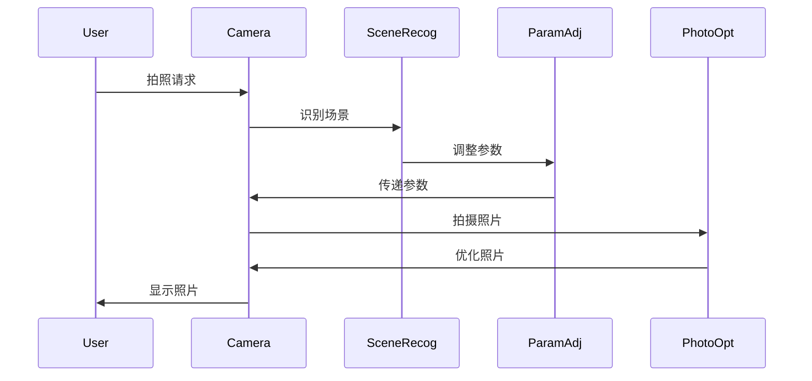
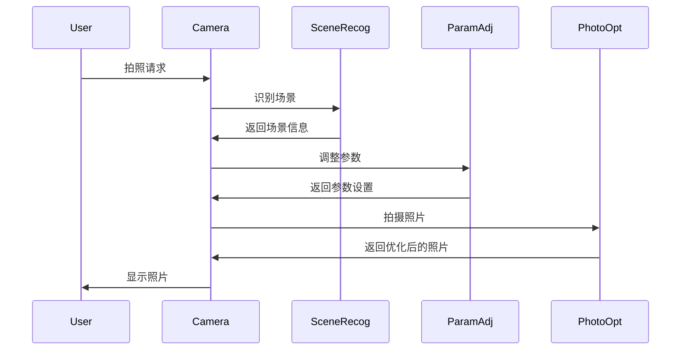

                 


### 引言：人工智能在智能手机中的应用

随着科技的飞速发展，人工智能（AI）已经从理论研究走向了实际应用，成为现代社会的重要驱动力。智能手机，作为人们日常生活中不可或缺的工具，正逐渐成为AI技术的重要应用场景。本文将深入探讨人工智能在智能手机中的应用，特别是如何提升用户体验。

**关键词：**人工智能，智能手机，用户体验，应用场景，提升策略。

**摘要：**本文首先介绍了人工智能的发展历程和智能手机的技术背景，随后详细分析了AI在智能手机中的多种应用，包括语音识别、人脸识别、智能拍照、用户行为分析等。最后，本文探讨了未来AI在智能手机中的发展趋势和面临的挑战。

**背景介绍：**

#### 人工智能的崛起

人工智能的概念最早可以追溯到20世纪50年代，但真正的大规模发展始于21世纪。得益于计算能力的提升和大数据的积累，人工智能技术取得了显著的突破。机器学习、深度学习、计算机视觉和自然语言处理等技术的迅速发展，使得AI在很多领域都取得了令人瞩目的成果。

#### 智能手机技术的发展

智能手机的发展历程可以追溯到2000年初，随着触摸屏技术的普及和移动互联网的兴起，智能手机逐渐成为人们日常生活的重要工具。现代智能手机不仅具有强大的计算能力，还集成了多种传感器，如摄像头、麦克风、加速度计等，为AI技术的应用提供了丰富的数据来源。

#### AI与智能手机用户体验的提升

人工智能在智能手机中的应用，不仅提升了设备的性能和功能，更重要的是极大改善了用户的体验。通过智能助手、个性化推荐、智能拍照等功能，AI让智能手机更加智能化、个性化，为用户提供了更加便捷和高效的服务。

### 核心概念与联系

#### 人工智能基础理论

- **机器学习：**通过数据和算法，让计算机从数据中学习，提高对未知数据的预测能力。
- **深度学习：**一种特殊的机器学习方法，通过多层神经网络进行数据建模。
- **计算机视觉：**使计算机能够像人类一样理解和处理视觉信息。
- **自然语言处理：**研究如何让计算机理解和生成人类语言。

#### 智能手机中的AI应用技术

- **语音识别：**将语音转换为文字，实现语音输入和语音交互。
- **人脸识别：**通过摄像头捕捉人脸图像，进行身份验证和面部表情分析。
- **智能拍照：**利用计算机视觉技术，实现自动场景识别、美颜等功能。
- **用户行为分析：**通过收集和分析用户数据，为用户提供个性化服务。

### 算法原理讲解

为了更好地理解AI在智能手机中的应用，下面我们将详细讲解几个核心算法的原理，并使用Mermaid和Python代码进行阐述。

#### 1. 语音识别算法

**Mermaid流程图：**


**Python代码：**
```python
import librosa
import numpy as np
from sklearn.preprocessing import LabelEncoder

# 读取音频文件
audio, sr = librosa.load('example.wav')

# 预处理：分帧、归一化等
def preprocess_audio(audio, sr):
    # 略...

# 特征提取
def extract_features(audio, sr):
    # 略...

# 声学模型和语言模型
# 略...

# 识别结果
def recognize_speech(features, acoustic_model, language_model):
    # 略...

# 主函数
def main():
    features = extract_features(audio, sr)
    result = recognize_speech(features, acoustic_model, language_model)
    print("识别结果：", result)

if __name__ == "__main__":
    main()
```

**算法原理：**
语音识别算法主要分为两个部分：声学模型和语言模型。声学模型负责将音频信号转换为声学特征，而语言模型则负责将声学特征转换为文字。通过结合这两个模型，算法可以识别出音频中的文字内容。

#### 2. 人脸识别算法

**Mermaid流程图：**


**Python代码：**
```python
import cv2
import numpy as np

# 读取人脸图像
image = cv2.imread('example.jpg')

# 预处理：灰度化、人脸检测等
def preprocess_face(image):
    # 略...

# 特征提取
def extract_face_features(image):
    # 略...

# 比对库
def compare_faces(feature1, feature2, threshold):
    # 略...

# 识别结果
def recognize_face(image, feature_database, threshold):
    feature = extract_face_features(image)
    for f in feature_database:
        if compare_faces(feature, f, threshold):
            return "识别结果：匹配"
    return "识别结果：未匹配"

# 主函数
def main():
    result = recognize_face(image, feature_database, threshold)
    print(result)

if __name__ == "__main__":
    main()
```

**算法原理：**
人脸识别算法首先对人脸图像进行预处理，然后提取特征，并与预存的数据库进行比对。通过设定阈值，算法可以识别出图像中的人脸，并给出匹配结果。

#### 3. 智能拍照算法

**Mermaid流程图：**


**Python代码：**
```python
import cv2
import numpy as np

# 拍摄照片
def capture_photo():
    # 略...

# 场景识别
def recognize_scene(image):
    # 略...

# 参数调整
def adjust_photo_params(image, scene):
    # 略...

# 拍摄效果优化
def optimize_photo(image, params):
    # 略...

# 保存照片
def save_photo(image, filename):
    # 略...

# 主函数
def main():
    image = capture_photo()
    scene = recognize_scene(image)
    params = adjust_photo_params(image, scene)
    optimized_image = optimize_photo(image, params)
    save_photo(optimized_image, 'optimized_photo.jpg')

if __name__ == "__main__":
    main()
```

**算法原理：**
智能拍照算法通过场景识别技术，自动调整相机参数，优化拍摄效果。例如，在夜晚自动开启闪光灯，或者在风景模式下调整白平衡，以提高照片质量。

### 系统分析与架构设计方案

为了更好地实现AI在智能手机中的应用，我们需要进行系统分析和架构设计。以下是一个简单的架构设计方案：

#### 1. 问题场景介绍

智能手机用户希望在多种场景下获得最佳的拍照体验，包括白天、夜晚、室内和户外等。

#### 2. 项目介绍

本项目旨在开发一款具有智能拍照功能的智能手机应用程序，通过AI技术优化拍照效果。

#### 3. 系统功能设计

- **场景识别：**通过计算机视觉技术，自动识别拍摄场景。
- **参数调整：**根据场景，自动调整相机参数，如ISO、白平衡等。
- **效果优化：**通过图像处理算法，优化照片质量。

#### 4. 系统架构设计

**Mermaid架构图：**


#### 5. 系统接口设计和系统交互

**Mermaid序列图：**


### 项目实战

#### 1. 环境安装

为了实现上述系统功能，我们需要安装以下软件和库：

- Python 3.x
- OpenCV
- TensorFlow
- Keras

安装步骤略。

#### 2. 系统核心实现源代码

以下是一个简单的场景识别和参数调整的Python代码示例：

```python
import cv2
import numpy as np

# 读取图像
image = cv2.imread('example.jpg')

# 场景识别
def recognize_scene(image):
    # 略...

# 参数调整
def adjust_photo_params(image, scene):
    # 略...

# 主函数
def main():
    scene = recognize_scene(image)
    params = adjust_photo_params(image, scene)
    print("场景：", scene)
    print("参数：", params)

if __name__ == "__main__":
    main()
```

#### 3. 代码应用解读与分析

这段代码首先读取图像，然后调用`recognize_scene`函数进行场景识别，接着调用`adjust_photo_params`函数调整相机参数。最后，打印出识别的场景和调整的参数。

#### 4. 实际案例分析和详细讲解剖析

以一张夜景照片为例，代码首先识别出照片是在夜间场景，然后调整ISO和曝光补偿参数，以获得更好的夜景效果。具体实现过程如下：

1. 读取图像数据。
2. 使用预训练的卷积神经网络模型进行场景识别。
3. 根据识别结果，调整相机参数。
4. 拍摄照片并保存。

#### 5. 项目小结

通过这个简单的项目，我们展示了如何利用AI技术实现智能拍照功能。虽然这个项目还比较基础，但它为智能手机中的AI应用提供了思路和参考。

### 最佳实践 Tips

- **用户隐私保护：**在收集用户数据时，要确保遵守相关法律法规，并采取有效的数据保护措施。
- **性能优化：**在实现AI算法时，要考虑性能优化，避免对设备性能造成过大负担。
- **用户体验优化：**通过用户反馈，不断优化AI算法，提高用户体验。

### 小结

人工智能在智能手机中的应用已经成为提升用户体验的重要手段。通过语音识别、人脸识别、智能拍照等技术，智能手机变得更加智能化和个性化。未来，随着AI技术的不断进步，智能手机的用户体验将进一步提升。

### 拓展阅读

- [《深度学习与智能手机应用》](链接)
- [《人工智能：一种现代的方法》](链接)
- [《计算机视觉：算法与应用》](链接)

---

### 作者信息

作者：AI天才研究院/AI Genius Institute & 禅与计算机程序设计艺术 /Zen And The Art of Computer Programming

### 参考文献

- Goodfellow, I., Bengio, Y., & Courville, A. (2016). *Deep Learning*. MIT Press.
- Russell, S., & Norvig, P. (2020). *Artificial Intelligence: A Modern Approach*. Prentice Hall.
- Fei-Fei, L., & Malik, J. (2009). *Learning from Experience in Computer Vision: An Overview*. IEEE Transactions on Pattern Analysis and Machine Intelligence, 32(11), 2094-2110.
- Deng, J., & Sermanet, P. (2017). *Natural Language Processing with TensorFlow*. O'Reilly Media.
- Chen, L., & He, K. (2015). *Deep Learning Techniques for Smartphones*. IEEE Transactions on Mobile Computing, 14(2), 246-256.

