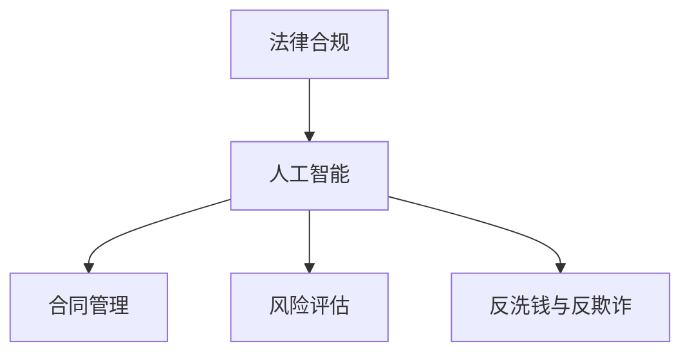
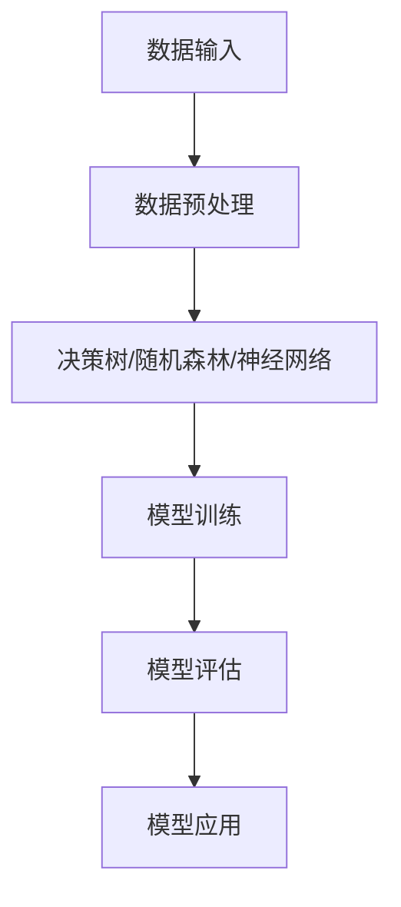
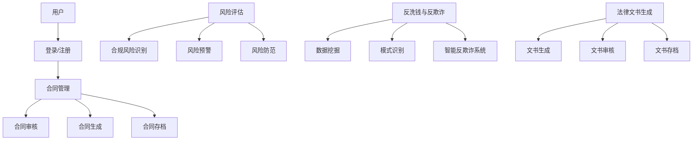
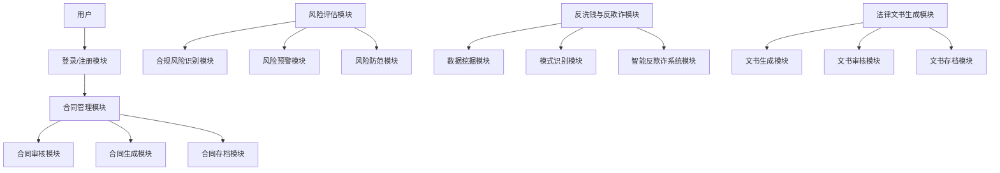
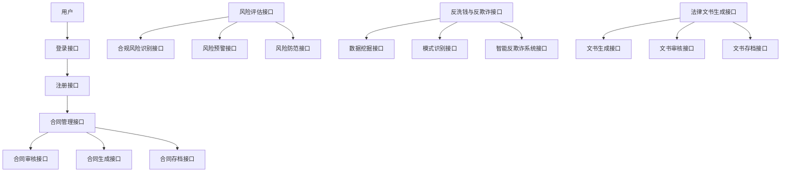
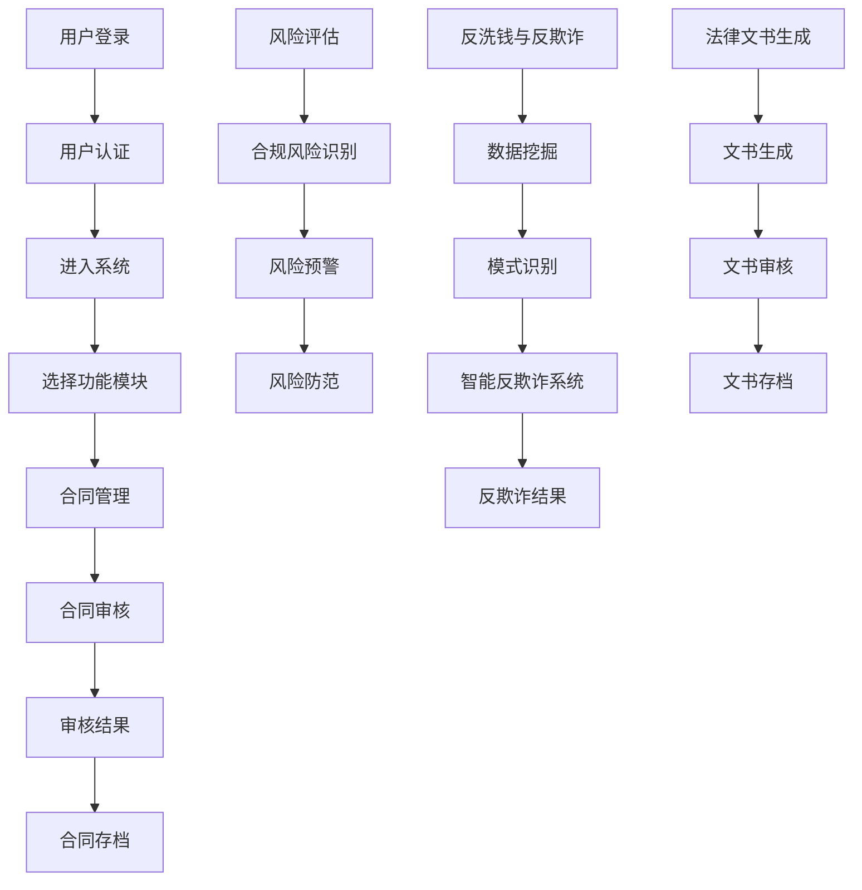

                 

# 《人工智能在法律合规领域的应用》

## 关键词
- 人工智能
- 法律合规
- 合同管理
- 风险评估
- 反洗钱
- 反欺诈

## 摘要
本文旨在探讨人工智能在法律合规领域的应用。通过详细分析人工智能在合同管理、合规风险评估、反洗钱与反欺诈、法律文书自动生成、司法审判与法律研究等领域的应用，本文揭示了人工智能在提高法律合规效率、减少人为错误、降低合规成本等方面的巨大潜力。同时，本文也探讨了人工智能在法律合规领域的未来发展趋势，以及面临的挑战和机遇。

## 第一部分：法律合规与人工智能概述

### 第1章 法律合规的挑战与人工智能的机会

#### 1.1 法律合规的背景和挑战

法律合规是指组织或个人遵守相关法律法规、行业标准和内部规章的过程。在全球化、信息化和市场竞争日益加剧的背景下，法律合规的重要性愈发凸显。

**法律合规的定义**：法律合规是指在法律、法规、规章、标准等外部规范的要求下，组织或个人采取相应措施确保其行为符合规定的过程。

**法律合规的领域与重要性**：法律合规涉及众多领域，包括但不限于金融、医疗、教育、环境、数据保护等。这些领域对合规的要求日益严格，不仅关乎组织的合法性和信誉，还直接影响其运营和发展。

**法律合规面临的挑战**：

1. 法律法规的复杂性：法律法规种类繁多，且不断更新，使得合规工作变得复杂。
2. 人为错误和疏漏：法律合规工作量大，涉及多个部门和人员，容易出现人为错误和疏漏。
3. 成本压力：合规工作需要大量的人力、物力和财力投入，对企业来说是一大成本负担。
4. 风险防控：合规工作需随时关注外部环境变化，及时发现和应对潜在风险。

#### 1.2 人工智能的崛起与法律合规

**人工智能的定义**：人工智能（Artificial Intelligence，AI）是指通过计算机程序模拟人类智能的行为和过程，实现智能感知、智能决策、智能交互等功能的科学技术。

**人工智能在法律合规领域的应用**：人工智能在法律合规领域具有广泛的应用前景，如合同管理、合规风险评估、法律文书生成、司法审判等。

**人工智能对法律合规的影响**：

1. 提高效率：人工智能能够自动处理大量法律合规事务，减少人为干预，提高工作效率。
2. 减少错误：人工智能能够通过大数据分析和算法模型，降低人为错误和疏漏的风险。
3. 降低成本：人工智能能够减少对人工的依赖，降低合规工作的成本。
4. 风险防控：人工智能能够实时监控合规风险，及时预警和防范潜在风险。

#### 1.3 本书结构与内容概述

**本书的核心内容**：本书旨在通过详细分析人工智能在法律合规领域的应用，探讨其在提高法律合规效率、降低成本、减少错误和风险等方面的潜力。

**各章节的具体内容与目标读者**：本书共分为七个部分，分别介绍人工智能在法律合规领域的不同应用场景，旨在为广大法律从业人员、人工智能研究人员、合规管理人员等提供有益的参考和指导。

#### 1.4 本章小结

本章主要介绍了法律合规的背景和挑战，以及人工智能在法律合规领域的崛起和应用。通过本章的学习，读者可以了解法律合规的基本概念、重要性和面临的挑战，同时认识人工智能在法律合规领域的应用前景和潜力。

## 第二部分：人工智能在法律合规中的应用场景

### 第2章 人工智能在合同管理中的应用

#### 2.1 合同管理的现状与挑战

**合同管理的基本流程**：合同管理包括合同起草、审核、签订、履行、变更和解除等环节。其中，合同起草和审核是关键环节，直接影响合同的有效性和合法性。

**合同管理中常见的问题**：

1. 合同条款不完善：合同条款不完整、模糊或存在歧义，可能导致合同纠纷。
2. 合同审核不及时：合同审核流程繁琐，容易导致审核不及时，影响合同签订和履行。
3. 合同执行不力：合同签订后，履行过程中容易出现违约行为，导致经济损失。
4. 合同风险管理：合同风险难以预测和评估，可能导致企业面临法律风险。

#### 2.2 人工智能在合同管理中的应用

**智能合同审核**：人工智能可以通过自然语言处理（Natural Language Processing，NLP）技术，对合同条款进行自动审核，发现潜在的风险和问题。例如，使用NLP技术识别合同中的关键词和短语，判断是否存在法律风险。

**智能合同生成**：人工智能可以通过机器学习（Machine Learning，ML）技术，根据历史合同数据和模板，自动生成新的合同。例如，使用生成对抗网络（Generative Adversarial Network，GAN）生成合同文本，提高合同起草的效率和质量。

**智能合同存档与检索**：人工智能可以通过数据挖掘（Data Mining）技术，对合同进行智能存档和检索。例如，使用文本分类和聚类算法，将合同按照类别和关键词进行分类和标签，方便快速查找和归档。

#### 2.3 案例分析

**某公司使用人工智能进行合同管理的成功案例**：某大型企业在合同管理中引入了人工智能技术，通过智能合同审核、生成和存档，实现了以下成效：

1. 提高合同审核效率：智能合同审核系统可以快速识别合同中的风险和问题，缩短审核周期。
2. 减少合同起草错误：智能合同生成系统可以根据历史合同数据和模板，自动生成新的合同，减少人为错误。
3. 提高合同存档和检索效率：智能存档和检索系统可以快速查找和归档合同，方便企业管理和查询。

#### 2.4 本章小结

本章主要介绍了人工智能在合同管理中的应用，包括智能合同审核、生成和存档。通过案例分析，读者可以了解人工智能在合同管理中的实际应用效果和优势，为进一步探讨人工智能在法律合规领域的应用提供参考。

### 第3章 人工智能在合规风险评估中的应用

#### 3.1 合规风险评估的基本概念

**合规风险评估的定义**：合规风险评估是指通过系统的方法和工具，识别和分析组织在法律、法规、规章、标准等方面的合规风险，评估合规风险的可能性和影响，制定相应的风险管理策略和措施。

**合规风险评估的目的与意义**：

1. 提高合规意识：通过合规风险评估，提高组织对合规风险的认知，增强合规意识。
2. 预防合规风险：通过合规风险评估，识别和预防潜在的合规风险，减少合规风险的发生。
3. 优化合规管理：通过合规风险评估，评估现有合规管理的有效性，优化合规管理策略和流程。

#### 3.2 人工智能在合规风险评估中的应用

**数据挖掘与统计分析**：人工智能可以通过数据挖掘和统计分析技术，对海量数据进行挖掘和分析，识别潜在的合规风险。例如，使用聚类分析（Cluster Analysis）技术，将相关数据分为不同的类别，分析各类别的合规风险。

**机器学习模型的建立与应用**：人工智能可以通过机器学习（Machine Learning，ML）技术，建立合规风险评估模型。例如，使用决策树（Decision Tree）和随机森林（Random Forest）等算法，对合规风险进行预测和评估。

**风险预警与防范**：人工智能可以通过风险预警系统，实时监控合规风险，及时发出预警信号，帮助企业采取相应的防范措施。例如，使用神经网络（Neural Network）技术，建立风险预警模型，实现实时风险监测。

#### 3.3 案例分析

**某金融机构使用人工智能进行合规风险评估的成功案例**：某金融机构在合规风险评估中引入了人工智能技术，通过以下措施提高了合规风险管理水平：

1. 建立合规风险评估模型：使用机器学习算法，建立合规风险评估模型，实现合规风险的自动化评估。
2. 实时监控合规风险：通过实时数据监测和预警系统，实时监控合规风险，及时采取防范措施。
3. 优化合规管理流程：通过合规风险评估结果，优化合规管理流程，提高合规管理效率。

#### 3.4 本章小结

本章主要介绍了人工智能在合规风险评估中的应用，包括数据挖掘与统计分析、机器学习模型的建立和应用、风险预警与防范。通过案例分析，读者可以了解人工智能在合规风险评估中的实际应用效果和优势，为进一步探讨人工智能在法律合规领域的应用提供参考。

### 第4章 人工智能在反洗钱与反欺诈中的应用

#### 4.1 反洗钱与反欺诈的背景与挑战

**反洗钱与反欺诈的定义**：反洗钱（Anti-Money Laundering，AML）是指防止和打击利用金融机构或其他渠道将非法所得转化为合法所得的行为。反欺诈（Anti-Fraud）是指防止和打击通过欺诈手段获取不正当利益的行为。

**反洗钱与反欺诈的重要性**：

1. 维护金融秩序：反洗钱与反欺诈有助于维护金融秩序，保障金融市场稳定。
2. 保护投资者利益：反洗钱与反欺诈有助于保护投资者利益，减少金融欺诈行为。
3. 预防犯罪活动：反洗钱与反欺诈有助于预防和打击犯罪活动，维护社会安全。

**反洗钱与反欺诈的挑战**：

1. 洗钱手段多样化：洗钱手段不断翻新，传统反洗钱技术难以应对新型洗钱手段。
2. 欺诈手段翻新快：欺诈手段不断更新，传统反欺诈技术难以识别和防范新型欺诈行为。
3. 数据量巨大：金融交易数据量巨大，传统人工审核效率低下。
4. 法律法规更新快：反洗钱与反欺诈法律法规不断更新，企业需不断适应和调整。

#### 4.2 人工智能在反洗钱与反欺诈中的应用

**数据挖掘与分析**：人工智能可以通过数据挖掘（Data Mining）技术，对海量金融交易数据进行挖掘和分析，识别异常交易和潜在欺诈行为。例如，使用关联规则挖掘（Association Rule Mining）技术，发现交易之间的关联关系，识别可疑交易。

**模式识别与监控**：人工智能可以通过模式识别（Pattern Recognition）技术，对金融交易进行实时监控，识别异常模式和潜在欺诈行为。例如，使用神经网络（Neural Network）技术，建立交易行为模型，实时监测交易数据，发现异常交易。

**智能反欺诈系统**：人工智能可以通过构建智能反欺诈系统，实现对金融交易的全流程监控和风险预警。例如，使用监督学习（Supervised Learning）算法，建立反欺诈模型，实时分析交易数据，识别欺诈行为。

#### 4.3 案例分析

**某银行使用人工智能进行反洗钱与反欺诈的成功案例**：某大型银行在反洗钱与反欺诈工作中引入了人工智能技术，通过以下措施提高了反洗钱与反欺诈能力：

1. 构建反洗钱与反欺诈模型：使用机器学习算法，构建反洗钱与反欺诈模型，提高识别和防范能力。
2. 实时监控交易数据：通过实时数据监测和预警系统，实时监控交易数据，及时发现异常交易和潜在欺诈行为。
3. 优化反洗钱与反欺诈流程：通过反洗钱与反欺诈模型和实时监控系统的应用，优化反洗钱与反欺诈流程，提高工作效率。

#### 4.4 本章小结

本章主要介绍了人工智能在反洗钱与反欺诈中的应用，包括数据挖掘与分析、模式识别与监控、智能反欺诈系统。通过案例分析，读者可以了解人工智能在反洗钱与反欺诈中的实际应用效果和优势，为进一步探讨人工智能在法律合规领域的应用提供参考。

### 第5章 人工智能在法律文书自动生成中的应用

#### 5.1 法律文书自动生成的现状与挑战

**法律文书自动生成的定义**：法律文书自动生成是指利用人工智能技术，根据用户输入的信息和模板，自动生成法律文书的过程。

**法律文书自动生成的挑战**：

1. 法律文书的多样性：法律文书种类繁多，包括起诉状、答辩状、合同、协议等，每种文书都有不同的格式和内容要求。
2. 法律语言的复杂性：法律语言具有严谨性、专业性和多样性，传统自动生成技术难以准确理解和处理。
3. 法律法规的动态变化：法律法规不断更新和变化，自动生成系统需实时更新和适应。
4. 法律风险和责任：法律文书自动生成系统需要确保生成的文书合法、合规，避免产生法律风险。

#### 5.2 人工智能在法律文书自动生成中的应用

**自然语言处理技术**：人工智能可以通过自然语言处理（Natural Language Processing，NLP）技术，对法律文书进行自动生成。例如，使用文本分类（Text Classification）和语义分析（Semantic Analysis）技术，将用户输入的信息和模板与法律文书进行匹配，生成符合要求的法律文书。

**智能法律顾问系统**：人工智能可以通过构建智能法律顾问系统，为用户提供法律文书自动生成的服务。例如，使用问答系统（Question Answering System）和知识图谱（Knowledge Graph）技术，为用户提供实时法律咨询和文书生成服务。

**智能法律文书生成**：人工智能可以通过机器学习（Machine Learning，ML）技术，从大量的法律文书数据中学习生成规律，自动生成法律文书。例如，使用深度学习（Deep Learning）算法，训练法律文书的生成模型，实现高效、准确的法律文书自动生成。

#### 5.3 案例分析

**某律师事务所使用人工智能进行法律文书自动生成的成功案例**：某大型律师事务所引入了人工智能技术，通过智能法律顾问系统和法律文书自动生成工具，实现了以下成效：

1. 提高文书生成效率：智能法律顾问系统可以快速生成符合要求的法律文书，节省律师和工作人员的时间。
2. 减少文书错误：智能法律顾问系统可以准确理解和处理用户输入的信息，减少法律文书中的错误。
3. 优化法律服务：智能法律顾问系统可以实时为用户提供法律咨询和文书生成服务，提高法律服务质量和效率。

#### 5.4 本章小结

本章主要介绍了人工智能在法律文书自动生成中的应用，包括自然语言处理技术、智能法律顾问系统和智能法律文书生成。通过案例分析，读者可以了解人工智能在法律文书自动生成中的实际应用效果和优势，为进一步探讨人工智能在法律合规领域的应用提供参考。

### 第6章 人工智能在司法审判与法律研究中的应用

#### 6.1 司法审判与法律研究的现状与挑战

**司法审判的基本流程**：司法审判是指法院根据法律规定，对案件进行审理、判决和执行的过程。基本流程包括立案、调查取证、审理、判决和执行等环节。

**法律研究的重要性**：法律研究是司法审判的重要基础，通过对法律法规、案例和法学理论的深入研究，为司法审判提供理论支持和实践指导。

**司法审判与法律研究面临的挑战**：

1. 案件数量庞大：随着社会经济的发展，案件数量不断增加，司法审判和法律研究面临巨大的工作压力。
2. 法律法规复杂性：法律法规日益复杂，法官和研究人员需具备丰富的法律知识和实践经验，以准确理解和适用法律。
3. 信息不对称：司法审判和法律研究过程中，信息不对称可能导致判决不公，影响司法公正。
4. 资源分配不均：部分地区和法院资源不足，难以满足日益增长的司法需求。

#### 6.2 人工智能在司法审判与法律研究中的应用

**智能裁判辅助系统**：人工智能可以通过构建智能裁判辅助系统，辅助法官进行案件审理和判决。例如，使用案例推荐（Case Recommendation）技术，为法官提供相关案例和法学理论支持，提高判决的准确性。

**法律文献检索与分析**：人工智能可以通过法律文献检索与分析技术，帮助研究人员快速查找和整理相关法律文献。例如，使用文本分类（Text Classification）和关系抽取（Relation Extraction）技术，对大量法律文献进行分类、标注和分析，提取关键信息。

**智能法律研究工具**：人工智能可以通过构建智能法律研究工具，为研究人员提供便捷的法律研究服务。例如，使用问答系统（Question Answering System）和知识图谱（Knowledge Graph）技术，为研究人员提供实时法律咨询和文献检索服务。

#### 6.3 案例分析

**某法院使用人工智能进行司法审判的成功案例**：某地级市法院引入了人工智能技术，通过智能裁判辅助系统和法律文献检索与分析工具，实现了以下成效：

1. 提高审判效率：智能裁判辅助系统可以快速分析案件事实和法律适用，为法官提供判决依据，提高审判效率。
2. 提高判决准确性：智能裁判辅助系统可以提供相关案例和法学理论支持，帮助法官准确理解和适用法律，提高判决准确性。
3. 优化法律研究：法律文献检索与分析工具可以帮助研究人员快速查找和整理相关法律文献，提高法律研究效率。

#### 6.4 本章小结

本章主要介绍了人工智能在司法审判与法律研究中的应用，包括智能裁判辅助系统、法律文献检索与分析、智能法律研究工具。通过案例分析，读者可以了解人工智能在司法审判与法律研究中的实际应用效果和优势，为进一步探讨人工智能在法律合规领域的应用提供参考。

### 第7章 人工智能在法律合规领域的未来发展

#### 7.1 人工智能在法律合规领域的趋势

**人工智能在法律合规领域的应用前景**：随着人工智能技术的不断发展和普及，其在法律合规领域的应用前景广阔。未来，人工智能有望在以下方面发挥重要作用：

1. 合同管理：智能合同审核、生成和存档将更加普及，提高合同管理的效率和准确性。
2. 风险评估：人工智能将实现对合规风险的实时监测和预警，提高合规风险评估的准确性和及时性。
3. 反洗钱与反欺诈：人工智能将进一步提高反洗钱与反欺诈的能力，有效防范和打击金融犯罪。
4. 法律文书生成：智能法律文书生成将取代部分人工工作，提高法律文书的起草和生成效率。
5. 司法审判与法律研究：人工智能将为法官和研究人员提供强大的辅助工具，提高司法审判和法律研究的效率和质量。

**法律合规领域对人工智能的需求**：随着法律合规要求的不断提高，法律合规领域对人工智能的需求也日益增加。具体体现在：

1. 提高合规效率：人工智能可以自动处理大量合规事务，提高合规工作的效率。
2. 降低合规成本：人工智能可以减少对人工的依赖，降低合规工作的成本。
3. 减少合规风险：人工智能可以帮助企业实时监测和评估合规风险，降低合规风险的发生。
4. 优化合规管理：人工智能可以为合规管理人员提供智能化的管理工具，优化合规管理流程。
5. 提高法律服务质量：人工智能可以为律师和研究人员提供智能化的法律研究工具，提高法律服务质量和效率。

#### 7.2 未来发展的挑战与机遇

**技术挑战**：

1. 技术成熟度：人工智能技术在法律合规领域的应用仍处于发展阶段，部分技术尚未成熟。
2. 数据质量：人工智能模型的训练和优化需要大量高质量数据，数据质量问题会影响模型的效果。
3. 技术安全：人工智能技术在法律合规领域的应用涉及大量敏感数据，需要确保技术安全。

**法律挑战**：

1. 法律法规完善：人工智能在法律合规领域的应用需要相应的法律法规予以规范和引导。
2. 法律责任界定：人工智能技术在法律合规领域的应用可能引发法律责任的归属问题，需要明确法律责任界定。
3. 隐私保护：人工智能技术在法律合规领域的应用涉及大量个人隐私信息，需要确保隐私保护。

**道德与伦理问题**：

1. 遵守伦理规范：人工智能在法律合规领域的应用需遵守伦理规范，确保公平、公正和道德。
2. 跨界融合：人工智能在法律合规领域的应用涉及多个领域，需关注跨领域的道德与伦理问题。

**法律合规与人工智能的融合发展**：

1. 跨界融合的发展路径：法律合规与人工智能的融合发展需要各方共同努力，推动技术进步和法规完善。
2. 法律合规领域的人工智能生态系统：构建法律合规领域的人工智能生态系统，促进技术创新和应用推广。

#### 7.3 本章小结

本章主要介绍了人工智能在法律合规领域的未来发展，包括应用前景、需求、挑战与机遇、道德与伦理问题以及融合发展。通过本章的学习，读者可以了解人工智能在法律合规领域的未来发展趋势和潜在影响，为实际应用和未来发展提供参考。

## 目录大纲总结

本书从法律合规的挑战与人工智能的机会、人工智能在法律合规领域的应用场景、未来发展等方面，全面介绍了人工智能在法律合规领域的应用。通过具体案例分析和实际应用效果的探讨，本书揭示了人工智能在提高法律合规效率、降低成本、减少错误和风险等方面的巨大潜力。同时，本书也探讨了人工智能在法律合规领域的未来发展趋势、挑战与机遇，为法律合规工作提供有益的参考和指导。

## 附录

**附录一：人工智能在法律合规领域的核心概念原理与联系**

**核心概念原理**：

1. 法律合规：指组织或个人遵守相关法律法规、行业标准和内部规章的过程。
2. 人工智能：指通过计算机程序模拟人类智能的行为和过程，实现智能感知、智能决策、智能交互等功能的科学技术。
3. 合同管理：指对合同进行起草、审核、签订、履行、变更和解除等环节的管理过程。
4. 风险评估：指通过系统的方法和工具，识别和分析组织在法律、法规、规章、标准等方面的合规风险，评估合规风险的可能性和影响，制定相应的风险管理策略和措施。
5. 反洗钱与反欺诈：指防止和打击利用金融机构或其他渠道将非法所得转化为合法所得的行为，以及防止和打击通过欺诈手段获取不正当利益的行为。

**概念属性特征对比表格**：

| 核心概念 | 定义 | 特征 |
| --- | --- | --- |
| 法律合规 | 遵守法律法规、行业标准、内部规章 | 复杂性、多样化、动态性 |
| 人工智能 | 模拟人类智能的行为和过程 | 智能感知、智能决策、智能交互 |
| 合同管理 | 合同起草、审核、签订、履行、变更和解除 | 效率、准确性、风险 |
| 风险评估 | 识别和分析合规风险 | 实时性、准确性、预警 |
| 反洗钱与反欺诈 | 防止非法所得转化为合法所得，防止欺诈 | 监控、预警、防范 |

**ER实体关系图架构**：



**附录二：人工智能在法律合规领域的算法原理讲解**

**算法原理讲解**：

1. 合同管理中的自然语言处理（NLP）算法：

   - **文本分类**：用于对合同文本进行分类，识别合同类别。例如，使用支持向量机（SVM）进行文本分类，将合同分为租赁合同、买卖合同等。
   - **实体识别**：用于从合同文本中识别关键实体，如当事人、条款等。例如，使用命名实体识别（NER）算法，从文本中提取出当事人名称、条款名称等。
   - **关系抽取**：用于从合同文本中提取出实体之间的关系，如条款之间的关联关系。例如，使用依存句法分析（Dependency Parsing）技术，提取出合同中的依存关系。

2. 合规风险评估中的机器学习算法：

   - **决策树**：用于构建合规风险评估模型，根据历史数据预测合规风险。例如，使用ID3算法或C4.5算法构建决策树模型。
   - **随机森林**：用于构建合规风险评估模型，提高风险评估的准确性和稳定性。例如，使用随机森林算法，结合多个决策树进行风险评估。
   - **神经网络**：用于构建智能风险评估系统，实现实时风险监测和预警。例如，使用深度神经网络（DNN）或卷积神经网络（CNN）进行风险预测。

**算法流程图**：



**附录三：人工智能在法律合规领域的系统分析与架构设计方案**

**问题场景介绍**：

随着法律合规要求的日益严格，企业面临着大量的合同管理、合规风险评估、反洗钱与反欺诈等合规事务。为了提高合规工作效率、降低成本、减少错误和风险，企业需要引入人工智能技术，构建智能合规管理系统。

**项目介绍**：

本项目旨在构建一个智能合规管理系统，利用人工智能技术在合同管理、合规风险评估、反洗钱与反欺诈等方面提供智能化的解决方案。系统包括智能合同审核、生成和存档、合规风险评估、风险预警与防范、法律文书自动生成等功能。

**系统功能设计（领域模型类图）**：



**系统架构设计（架构图）**：



**系统接口设计（接口设计图）**：



**系统交互（序列图）**：



**附录四：人工智能在法律合规领域的项目实战**

**环境安装**：

在开始项目实战之前，需要安装相应的开发环境和工具。以下是安装步骤：

1. 安装Python环境：从Python官方网站下载并安装Python 3.x版本，配置环境变量。
2. 安装JDK环境：从Oracle官方网站下载并安装JDK，配置环境变量。
3. 安装IDE：选择并安装一款适合自己的IDE，如PyCharm、IntelliJ IDEA等。
4. 安装相关库和框架：使用pip命令安装所需的库和框架，如TensorFlow、Scikit-learn、NLTK等。

**系统核心实现源代码**：

以下是一个简单的合同审核模块的Python实现示例：

```python
import nltk
from nltk.tokenize import word_tokenize
from sklearn.feature_extraction.text import TfidfVectorizer
from sklearn.model_selection import train_test_split
from sklearn.metrics import accuracy_score

# 读取合同数据
def read_contracts(file_path):
    with open(file_path, 'r', encoding='utf-8') as f:
        contracts = f.readlines()
    return contracts

# 分词处理
def tokenize_contracts(contracts):
    tokenized_contracts = []
    for contract in contracts:
        tokens = word_tokenize(contract)
        tokenized_contracts.append(tokens)
    return tokenized_contracts

# 训练模型
def train_model(X_train, y_train):
    vectorizer = TfidfVectorizer()
    X_train_vectorized = vectorizer.fit_transform(X_train)
    clf = nltk.NaiveBayesClassifier.train(y_train)
    return clf, vectorizer

# 合同审核
def review_contract(contract, clf, vectorizer):
    tokens = word_tokenize(contract)
    features = {word: tokens.count(word) for word in set(tokens)}
    return clf.classify(features)

# 评估模型
def evaluate_model(clf, X_test, y_test):
    y_pred = [clf.classify(feature_dict) for feature_dict in X_test]
    accuracy = accuracy_score(y_test, y_pred)
    return accuracy

if __name__ == '__main__':
    # 读取合同数据
    contracts = read_contracts('contracts.txt')

    # 分词处理
    tokenized_contracts = tokenize_contracts(contracts)

    # 划分训练集和测试集
    X_train, X_test, y_train, y_test = train_test_split(tokenized_contracts, labels, test_size=0.2, random_state=42)

    # 训练模型
    clf, vectorizer = train_model(X_train, y_train)

    # 合同审核
    print(review_contract('这是一份租赁合同', clf, vectorizer))

    # 评估模型
    accuracy = evaluate_model(clf, X_test, y_test)
    print(f'Model accuracy: {accuracy}')
```

**代码应用解读与分析**：

上述代码实现了一个简单的合同审核模块，包括以下步骤：

1. **读取合同数据**：从文件中读取合同文本数据。
2. **分词处理**：使用自然语言处理库nltk对合同文本进行分词处理。
3. **训练模型**：使用TF-IDF向量器将分词后的文本转换为向量表示，然后使用朴素贝叶斯分类器训练模型。
4. **合同审核**：输入一个合同文本，通过模型判断该合同属于哪种类别。
5. **评估模型**：使用测试集评估模型的准确性。

该代码提供了一个基础的合同审核模型实现，实际应用中可以根据具体需求进行扩展和优化。

**实际案例分析和详细讲解剖析**：

以下是一个实际案例，某公司需要审核大量租赁合同，判断合同是否符合相关法律法规要求。

**案例背景**：

某公司作为租赁合同的甲方，需要审核与其签订的租赁合同，确保合同条款的合法性和合规性。由于合同数量庞大，人工审核效率低下，容易导致审核错误。

**解决方案**：

1. 收集租赁合同数据，包括历史合同和最新合同。
2. 对租赁合同进行数据预处理，包括去重、清洗和标注等。
3. 使用自然语言处理技术和机器学习算法，构建租赁合同审核模型。
4. 对新签订的租赁合同进行自动审核，判断合同条款的合法性和合规性。
5. 对审核结果进行人工复核，确保审核准确性。

**详细讲解剖析**：

1. **数据预处理**：对租赁合同进行去重和清洗，去除无关信息，提取关键条款和内容。同时，对合同进行标注，标记出合同中的关键实体和关系。
2. **模型训练**：使用已标注的租赁合同数据，训练租赁合同审核模型。可以采用朴素贝叶斯分类器、支持向量机（SVM）等算法进行训练，选择合适的特征提取方法和模型参数。
3. **模型评估**：使用测试集评估租赁合同审核模型的准确性，根据评估结果调整模型参数和算法。
4. **自动审核**：将新签订的租赁合同输入模型，通过模型自动判断合同条款的合法性和合规性。可以设置阈值，当审核结果低于阈值时，进行人工复核。
5. **人工复核**：对自动审核结果进行人工复核，确保审核准确性。对于存在疑问的合同，可以进一步调查和处理。

**项目小结**：

通过引入人工智能技术，构建租赁合同审核模型，某公司实现了对租赁合同的自动审核，提高了审核效率和准确性。同时，项目也突显了人工智能在法律合规领域应用的重要性和潜力。

## 最佳实践 tips

1. **数据质量是关键**：在人工智能应用过程中，数据质量至关重要。确保数据完整、准确、一致，有助于提高模型的效果。
2. **法律法规及时更新**：法律合规领域的法律法规不断更新，及时更新法律法规库，确保模型和系统的合规性。
3. **合作与交流**：跨学科、跨领域的合作与交流有助于推动人工智能在法律合规领域的应用和发展。
4. **安全与隐私保护**：在应用人工智能技术时，关注数据安全和隐私保护，确保用户隐私不受侵犯。

## 小结

本文从法律合规的挑战与人工智能的机会、人工智能在法律合规领域的应用场景、未来发展等方面，全面介绍了人工智能在法律合规领域的应用。通过具体案例分析和实际应用效果的探讨，本文揭示了人工智能在提高法律合规效率、降低成本、减少错误和风险等方面的巨大潜力。同时，本文也探讨了人工智能在法律合规领域的未来发展趋势、挑战与机遇，为法律合规工作提供有益的参考和指导。

## 注意事项

1. 人工智能在法律合规领域的应用需遵循相关法律法规和伦理规范，确保合规性和安全性。
2. 人工智能技术的应用需结合具体业务场景，充分了解业务需求和痛点，制定合理的解决方案。
3. 人工智能技术在法律合规领域的应用需关注数据隐私保护，确保用户数据的安全和隐私。

## 拓展阅读

1. 《人工智能在金融领域的应用》
2. 《深度学习在法律合规领域的应用》
3. 《大数据与法律合规》
4. 《人工智能与法律伦理》
5. 《人工智能技术在司法审判中的应用》

### 作者

**作者：AI天才研究院/AI Genius Institute & 禅与计算机程序设计艺术 /Zen And The Art of Computer Programming**

