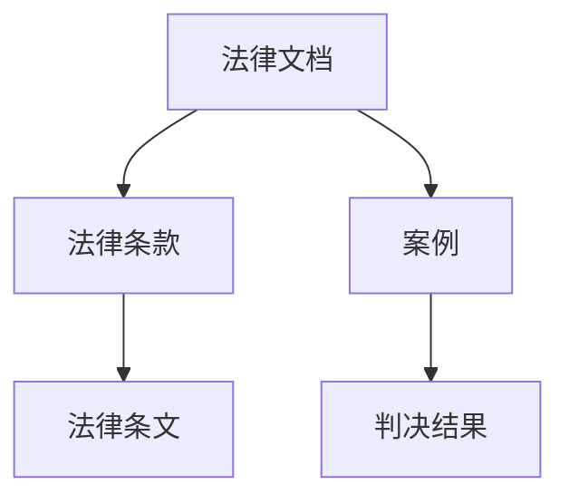
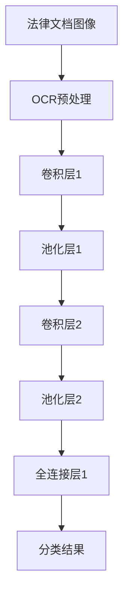
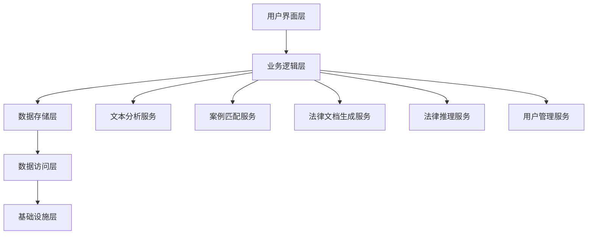

                 

### 关键词：人工智能、法律咨询、民主化、机器学习、深度学习、法律智能、文本分析、算法、系统架构、项目实战。

### 摘要：
本文深入探讨了人工智能在法律咨询领域的应用，特别是如何通过人工智能实现法律服务的民主化。文章首先介绍了法律咨询领域的现状和挑战，然后阐述了人工智能的核心概念及其在法律咨询中的应用潜力。通过详细解析人工智能的关键要素，如数据收集、算法选择和法律文本分析，本文展示了深度学习在法律文档处理中的具体应用。随后，文章引入了数学模型和公式，详细讲解了人工智能算法的原理。接着，文章提供了一个完整的系统架构设计方案，包括数据库设计、接口设计和系统交互。最后，通过一个实际项目实战，本文展示了人工智能在法律咨询中的实际应用效果，并提供了最佳实践和未来展望。文章旨在为读者提供一个清晰、系统的人工智能在法律咨询中的应用指南。### 第一部分：背景介绍

### 第1章：问题背景

#### 1.1 法律咨询领域的挑战

在现代社会，法律服务日益成为人们日常生活和商业活动中不可或缺的一部分。然而，传统法律咨询面临着诸多挑战，包括高成本、低效率、人才短缺和信息不对称等问题。首先，法律咨询服务的成本往往高昂，这限制了普通民众获取法律帮助的能力，特别是低收入人群。其次，法律专业人员数量有限，难以满足日益增长的法律需求，导致法律服务的供给不足。此外，信息不对称现象在法律咨询领域中尤为突出，法律从业者拥有丰富的专业知识和经验，而普通民众则难以获取这些宝贵资源。

随着互联网和技术的快速发展，人工智能（AI）逐渐成为一种潜在解决方案，能够在多个方面改善法律咨询的现状。首先，AI能够显著降低法律咨询的成本，通过自动化流程和智能算法，减少对人力资源的依赖，从而降低服务价格。其次，AI能够提高法律服务的效率，通过快速处理大量数据和分析法律文档，AI能够在短时间内提供准确的答案和建议，减少律师和客户之间的沟通成本。此外，AI还可以突破人才短缺的限制，通过智能代理和自动化工具，提供24/7全天候的法律服务。最后，AI有助于解决信息不对称的问题，通过构建知识库和智能问答系统，AI能够向普通民众提供高质量、可访问的法律信息，促进法律服务的民主化。

#### 1.2 人工智能的兴起

人工智能作为计算机科学的一个分支，其核心目标是使计算机能够模拟、延伸和扩展人类的智能。人工智能的研究始于20世纪50年代，随着计算能力的提升和算法的进步，AI技术逐渐从理论研究走向实际应用。近年来，机器学习（ML）和深度学习（DL）等AI子领域取得了显著进展，使得AI在图像识别、自然语言处理、智能决策等领域表现出色。这些技术的进步为AI在法律咨询中的应用提供了坚实的基础。

在法律咨询领域，人工智能的应用主要体现在以下几个方面：

1. **自动化法律文档处理**：AI可以自动化地处理大量的法律文件，包括合同审查、法律意见书撰写和案件文档整理。通过自然语言处理（NLP）技术，AI能够理解法律文档中的语言，提取关键信息，并生成法律文书。

2. **智能问答和法律检索**：利用机器学习模型，AI可以训练出一个智能问答系统，用户可以通过简单的自然语言提问获取法律建议。此外，AI还可以对大量法律文本进行检索，快速找到相关的法律条款和判例。

3. **风险评估和预测**：AI可以通过分析历史数据和案例，预测案件的审判结果和风险，为律师和客户提供决策支持。

4. **客户服务自动化**：AI可以自动化处理客户的常见法律咨询，通过聊天机器人和语音助手提供实时服务，提高客户满意度。

#### 1.3 AI在法律咨询中的潜在应用

人工智能在法律咨询中的潜在应用非常广泛，它不仅能够解决传统法律咨询中的诸多挑战，还能够推动法律服务的创新和变革。以下是AI在法律咨询中的一些具体应用：

1. **自动化合同审查**：通过机器学习和自然语言处理技术，AI可以自动化审查合同条款，识别潜在的风险和问题，提供法律意见。

2. **智能法律文档生成**：AI可以根据用户提供的法律要求和模板，自动生成法律文件，如起诉状、答辩状、合同等。

3. **法律文本分析**：利用深度学习和自然语言处理技术，AI可以分析大量的法律文献、判例和法规，提取法律规则和条款，辅助律师进行法律研究。

4. **案件预测与风险评估**：通过分析历史数据和案例，AI可以预测案件的审判结果和风险，为律师和客户提供决策依据。

5. **法律知识库建设**：AI可以构建大规模的法律知识库，存储法律条款、案例和法规，供律师和研究人员查询和参考。

6. **智能客户服务**：通过聊天机器人和语音助手，AI可以提供24/7的法律咨询和客户服务，提高用户体验。

7. **合规与审计**：AI可以自动化地检查企业的合规情况，识别潜在的法律风险，并提供合规建议。

总之，人工智能在法律咨询中的应用不仅能够提高效率和质量，还能够推动法律服务的民主化，使更多人能够享受到高效、低成本的法律服务。### 第二部分：核心概念与联系

#### 第2章：人工智能核心概念

##### 2.1 人工智能的定义

人工智能（Artificial Intelligence，简称AI）是指通过计算机系统模拟人类智能的行为、思维和认知能力的技术。它涵盖了多个研究领域，包括机器学习、自然语言处理、计算机视觉、智能代理等。人工智能的目标是使计算机能够执行复杂任务，如理解语言、识别图像、自主决策等，从而实现智能化的自动化。

##### 2.2 机器学习与深度学习的区别

机器学习（Machine Learning，简称ML）是人工智能的一个重要分支，它关注于开发算法，使计算机系统能够从数据中学习并作出预测或决策。机器学习分为监督学习、无监督学习和强化学习三种类型：

- **监督学习**：系统使用标记好的训练数据学习，如分类问题中的标签数据。
- **无监督学习**：系统在没有标记数据的情况下学习，如聚类问题。
- **强化学习**：系统通过与环境的交互学习，如游戏中的决策。

深度学习（Deep Learning，简称DL）是机器学习的一个子领域，它利用多层神经网络来模拟人类大脑的学习过程。深度学习的核心是神经网络，特别是卷积神经网络（CNN）和递归神经网络（RNN）。

##### 2.3 法律智能的基本原理

法律智能（Legal AI）是人工智能在法律领域的应用，它利用AI技术处理和分析法律相关数据，提供法律建议和解决方案。法律智能的基本原理包括：

- **文本分析**：通过自然语言处理（NLP）技术，分析法律文档的内容，提取关键信息。
- **知识库**：构建包含法律规则、判例和法规的知识库，供系统查询和参考。
- **推理引擎**：利用逻辑推理和案例匹配技术，从法律知识库中推导出法律建议。
- **自动化流程**：通过流程自动化技术，简化法律文书的生成、审查和执行过程。

##### 表格：机器学习与深度学习的对比

| 特性 | 机器学习 | 深度学习 |
| ---- | ---- | ---- |
| 网络结构 | 简单网络（如单层感知器） | 复杂网络（多层感知器） |
| 学习能力 | 可以处理简单任务 | 可以处理复杂任务 |
| 特征工程 | 需要手动设计特征 | 自动学习特征 |
| 训练数据 | 需要大量标记数据 | 可以使用未标记数据 |
| 应用场景 | 分类、回归、聚类 | 图像识别、语音识别、自然语言处理 |

##### 图：法律智能的ER实体关系图



在法律智能系统中，法律文档、法律条款、案例和判决结果等实体通过ER实体关系图相互关联，构成了一个复杂的知识图谱。法律文档包含了法律条款，案例记录了法律条文和判决结果，这些实体之间的关系为法律智能提供了丰富的数据基础。

通过上述核心概念和联系的分析，我们可以更好地理解人工智能在法律咨询中的应用潜力。在接下来的章节中，我们将进一步探讨人工智能在法律咨询中的具体应用和实现方法。### 第三部分：算法原理讲解

#### 第4章：法律文本分析算法

法律文本分析是人工智能在法律咨询中的一个重要应用领域，它涉及到对法律文档的语义理解、信息提取和知识表示。在本章中，我们将详细讲解法律文本分析的主要算法，包括基于自然语言处理（NLP）的方法、情感分析在法律咨询中的应用以及案例匹配与法律推理。

##### 4.1 基于NLP的法律文本分析

自然语言处理（NLP）是人工智能中的一个重要分支，它专注于使计算机理解和生成自然语言。在法律文本分析中，NLP技术被用于处理法律文档，提取关键信息，并建立法律知识库。

1. **文本预处理**：
   - **分词**：将法律文本分割成单词或句子，以便进一步分析。
   - **词性标注**：为每个单词标注其词性（名词、动词、形容词等），以便理解句子结构。
   - **命名实体识别**：识别文本中的命名实体，如人名、地名、法律术语等。

2. **实体关系抽取**：
   - **依存关系分析**：通过分析词与词之间的依存关系，确定实体之间的关系，如“张三起诉李四”中的起诉关系。
   - **事件抽取**：识别文本中的事件，如合同签订、起诉、判决等，并提取相关实体和事件信息。

3. **法律规则提取**：
   - **模式匹配**：通过预定义的模式匹配法律文档中的规则。
   - **统计学习方法**：使用机器学习算法，如条件随机场（CRF），从大规模法律文档中自动提取规则。

##### 4.2 情感分析在法律咨询中的应用

情感分析是一种NLP技术，用于分析文本中的情感倾向和态度。在法律咨询中，情感分析可以用于评估案件的舆论影响、客户满意度以及法律文档的情感色彩。

1. **情感分类**：
   - **二分类**：将法律文档的情感倾向分为正面、负面或中性。
   - **多分类**：将法律文档的情感倾向细分为多个类别，如愤怒、失望、满意等。

2. **情感分析在法律咨询中的应用**：
   - **舆论分析**：通过分析社交媒体上的法律相关讨论，了解公众对案件的看法。
   - **客户满意度评估**：通过分析客户反馈，了解客户对法律服务的满意度。
   - **法律文档情感分析**：分析法律文书中的情感色彩，为律师提供谈判策略。

##### 4.3 案例匹配与法律推理

案例匹配与法律推理是法律智能系统中的核心功能，它利用已有的法律案例和规则，为新的案件提供法律建议。

1. **案例匹配**：
   - **关键词匹配**：通过关键词匹配，找出与当前案件相关的法律案例。
   - **语义匹配**：利用自然语言处理技术，分析案例的语义内容，找出与当前案件最相似的案例。

2. **法律推理**：
   - **演绎推理**：从一般法律规则推导出特定案件的结论。
   - **归纳推理**：从多个案例中归纳出一般性的法律规则。
   - **混合推理**：结合演绎和归纳推理，提高法律建议的准确性和可靠性。

##### 表格：法律文本分析算法对比

| 算法 | 描述 | 优点 | 缺点 |
| ---- | ---- | ---- | ---- |
| 关键词匹配 | 基于关键词的简单匹配 | 实施简单，易于理解 | 缺乏语义理解，匹配效果有限 |
| 语义匹配 | 利用NLP技术分析语义内容 | 更准确，能理解复杂关系 | 复杂，计算成本高 |
| 演绎推理 | 从规则推导出结论 | 直观，适用于简单规则 | 难以处理复杂案件 |
| 归纳推理 | 从案例中归纳规则 | 更适用于复杂案件 | 需要大量案例，容易过拟合 |

通过上述算法的讲解，我们可以看到法律文本分析在法律智能系统中的重要性。在下一章中，我们将进一步探讨深度学习在法律文档处理中的应用，包括卷积神经网络（CNN）、递归神经网络（RNN）和生成对抗网络（GAN）。### 第5章：深度学习在法律咨询中的应用

深度学习作为人工智能的一个子领域，通过多层神经网络对大量数据进行自动特征提取和学习，已经在图像识别、语音识别和自然语言处理等领域取得了显著的成果。在本章中，我们将探讨深度学习在法律文档处理中的具体应用，包括卷积神经网络（CNN）、递归神经网络（RNN）和生成对抗网络（GAN）。

#### 5.1 卷积神经网络（CNN）在法律文档处理中的应用

卷积神经网络（Convolutional Neural Network，CNN）是一种特别适合处理图像数据的神经网络架构，其基本原理是通过卷积操作提取图像中的局部特征。在法律文档处理中，CNN可以通过对文档的图像进行特征提取，从而实现文本分析和分类。

1. **文本图像预处理**：
   - **光学字符识别（OCR）**：将文档图像转换为文本格式，这是法律文档处理的基础。
   - **图像增强**：通过对图像进行旋转、缩放、裁剪等操作，提高模型的鲁棒性。

2. **特征提取与分类**：
   - **卷积层**：通过卷积操作提取图像中的特征，如边缘、角点等。
   - **池化层**：减少特征图的尺寸，提高模型的泛化能力。
   - **全连接层**：将特征映射到具体的类别标签上。

3. **应用场景**：
   - **合同审查**：通过CNN提取合同中的关键信息，如条款、金额、日期等。
   - **案件分类**：根据案件的特征，利用CNN进行案件类型的分类。

#### 5.2 递归神经网络（RNN）与长短期记忆（LSTM）模型

递归神经网络（Recurrent Neural Network，RNN）是一种能够处理序列数据的神经网络，其基本原理是通过递归结构将前一个时间步的输出作为当前时间步的输入。在法律咨询中，RNN特别适用于处理法律文本的序列数据，如法律条款、判决文书和案例摘要。

1. **RNN的基本原理**：
   - **递归连接**：网络中每个节点都与前一个节点的输出相连，形成递归结构。
   - **隐藏状态**：网络通过隐藏状态来保存过去的信息。

2. **长短期记忆（LSTM）模型**：
   - **门控机制**：LSTM引入门控机制，包括输入门、遗忘门和输出门，可以控制信息的流入和流出，从而解决RNN的长期依赖问题。
   - **应用场景**：
     - **法律文档生成**：通过LSTM模型生成法律文书，如起诉状、答辩状等。
     - **文本分类**：对法律文档进行分类，如案件分类、法律条款分类等。

#### 5.3 生成对抗网络（GAN）在法律文本生成中的应用

生成对抗网络（Generative Adversarial Network，GAN）由生成器和判别器两个神经网络组成，生成器尝试生成与真实数据相似的数据，而判别器则尝试区分真实数据和生成数据。GAN在法律文本生成中的应用具有很大的潜力。

1. **生成器和判别器的结构**：
   - **生成器**：接收随机噪声作为输入，生成法律文本。
   - **判别器**：接收真实法律文本和生成文本，判断其真实性。

2. **应用场景**：
   - **合同生成**：通过GAN生成自定义的合同文本，辅助律师快速生成合同。
   - **法律意见生成**：根据用户输入的案例和条款，生成相应的法律意见。

##### 图：卷积神经网络（CNN）在法律文档处理中的应用流程



通过上述内容，我们可以看到深度学习在法律文档处理中的广泛应用。在下一章中，我们将介绍数学模型在法律智能中的应用，包括概率论、支持向量机（SVM）和贝叶斯网络。### 第6章：数学模型在法律智能中的应用

在法律智能系统中，数学模型扮演着至关重要的角色，它们为人工智能算法提供了理论基础和计算工具。在本章中，我们将讨论几种在法律智能中广泛应用的数学模型，包括基于概率论的文本分类模型、支持向量机（SVM）以及贝叶斯网络。

#### 6.1 基于概率论的文本分类模型

文本分类是自然语言处理中的一个基本任务，其目标是将文本数据划分为预定义的类别。在法律智能中，文本分类可以帮助对法律文档进行分类，从而实现自动化法律文档管理和检索。基于概率论的文本分类模型，如朴素贝叶斯（Naive Bayes）和最大似然估计（Maximum Likelihood Estimation，MLE），是常用的文本分类方法。

1. **朴素贝叶斯模型**：
   - **原理**：朴素贝叶斯模型基于贝叶斯定理，通过计算文本中各个特征的联合概率，来预测文本的类别。它假设特征之间相互独立，即每个特征的概率不受其他特征的影响。
   - **公式**：
     $$P(C|X) = \frac{P(X|C)P(C)}{P(X)}$$
   - **优点**：简单、易于实现，适用于大规模文本分类任务。
   - **缺点**：假设过于简化，可能无法处理特征相关性。

2. **最大似然估计模型**：
   - **原理**：最大似然估计模型通过最大化文本在给定类别下的概率，来预测文本的类别。
   - **公式**：
     $$P(C|X) = \prod_{i} P(w_i|C)$$
   - **优点**：适用于特征之间存在相关性的情况。
   - **缺点**：计算复杂度高，特别是当特征数量庞大时。

#### 6.2 支持向量机（SVM）在法律文档分类中的应用

支持向量机（Support Vector Machine，SVM）是一种强大的分类算法，特别适用于高维数据。在法律智能中，SVM可以用于分类法律文档，帮助识别案件类型或法律条款。

1. **SVM的基本原理**：
   - **原理**：SVM通过寻找一个超平面，将不同类别的数据点尽可能分开。它使用核函数将低维数据映射到高维空间，使得原本线性不可分的数据在高维空间中可分。
   - **公式**：
     $$\max_{\mathbf{w},b} \quad \frac{1}{2} ||\mathbf{w}||^2$$
     $$s.t. \quad y^{(i)}(\mathbf{w}\cdot\mathbf{x}^{(i)} + b) \geq 1$$
   - **优点**：分类效果优秀，特别是在高维空间中。
   - **缺点**：训练时间较长，对大规模数据集可能不适用。

2. **SVM在法律文档分类中的应用**：
   - **数据预处理**：对法律文档进行分词、词性标注和特征提取，将文档表示为高维向量。
   - **训练SVM模型**：使用训练数据集训练SVM模型，找到最优超平面。
   - **分类新文档**：使用训练好的SVM模型对新的法律文档进行分类。

#### 6.3 贝叶斯网络与因果推理

贝叶斯网络是一种图形模型，用于表示变量之间的概率关系。在法律智能中，贝叶斯网络可以帮助推理案件中的因果关系，从而为律师提供决策支持。

1. **贝叶斯网络的基本原理**：
   - **原理**：贝叶斯网络由节点和边组成，节点表示随机变量，边表示变量之间的条件概率关系。通过贝叶斯规则，可以计算变量之间的条件概率分布。
   - **公式**：
     $$P(X|Y) = \frac{P(Y|X)P(X)}{P(Y)}$$
   - **优点**：能够处理复杂的关系网络，适用于不确定性和概率推理。
   - **缺点**：建模过程复杂，对数据依赖性较高。

2. **贝叶斯网络在法律咨询中的应用**：
   - **建模**：根据案件事实和证据，构建贝叶斯网络模型。
   - **推理**：通过贝叶斯规则计算证据和假设之间的概率关系，为律师提供决策支持。

##### 表格：数学模型在法律智能中的应用对比

| 模型 | 描述 | 优点 | 缺点 |
| ---- | ---- | ---- | ---- |
| 朴素贝叶斯 | 基于贝叶斯定理，适用于特征独立的情况 | 简单，易于实现，适用于大规模文本分类 | 假设过于简化，可能无法处理特征相关性 |
| 最大似然估计 | 通过最大化概率来预测类别 | 适用于特征之间存在相关性 | 计算复杂度高，对大规模数据集可能不适用 |
| 支持向量机 | 寻找最优超平面进行分类 | 分类效果优秀，适用于高维数据 | 训练时间较长，对大规模数据集可能不适用 |
| 贝叶斯网络 | 图形模型，用于表示概率关系 | 能够处理复杂的关系网络，适用于不确定性和概率推理 | 建模过程复杂，对数据依赖性较高 |

通过上述数学模型的应用，我们可以看到数学模型在法律智能系统中的关键作用。在下一章中，我们将介绍法律咨询系统的总体架构设计，包括数据库设计、系统功能设计和系统接口设计。### 第7章：系统架构设计

法律咨询系统作为一个复杂的软件系统，其架构设计直接关系到系统的性能、可扩展性和用户体验。在本章中，我们将详细探讨法律咨询系统的总体架构设计，包括数据库设计、系统功能设计和系统接口设计。

#### 7.1 法律咨询系统的总体架构

法律咨询系统的总体架构可以分为几个主要模块，每个模块负责不同的功能。以下是系统架构的主要组成部分：

1. **用户界面层**：用户界面层是系统与用户交互的界面，包括网页界面、移动应用界面和聊天机器人界面。用户可以通过这些界面提交查询、查看法律文档和获取法律建议。

2. **业务逻辑层**：业务逻辑层负责处理系统的核心业务功能，包括文本分析、法律文档生成、案例匹配和法律推理等。这个层通常包含多个微服务，每个微服务负责不同的业务功能。

3. **数据存储层**：数据存储层负责存储和管理系统中的数据，包括法律文档、案例数据、用户数据和系统配置等。常用的数据存储技术包括关系型数据库、NoSQL数据库和数据湖。

4. **数据访问层**：数据访问层提供对数据存储层的访问接口，包括数据查询、数据更新和数据同步等功能。这个层可以使用RESTful API或其他数据访问协议。

5. **基础设施层**：基础设施层包括服务器、网络、存储和安全等基础设施组件，为系统提供运行环境。这个层还包括日志记录、监控和报警系统，确保系统的稳定运行。

#### 7.2 数据库设计

数据库设计是法律咨询系统架构设计中的关键部分，它决定了系统的数据存储和管理效率。以下是数据库设计的主要考虑因素：

1. **数据模型设计**：根据系统的需求，设计合适的实体关系模型。例如，设计法律文档、案例、用户和系统配置等实体，并定义它们之间的关系。

2. **索引设计**：为常用查询设计索引，提高查询效率。例如，为法律文档的标题、关键词和作者等字段设计索引。

3. **数据分区**：对于大型数据集，可以通过数据分区来提高查询和写入性能。例如，根据案件类型或时间范围对案件数据分区。

4. **数据一致性**：确保数据在分布式系统中的强一致性，防止数据冲突。可以使用分布式数据库技术，如分布式锁或最终一致性协议。

#### 7.3 系统功能设计

法律咨询系统的功能设计需要综合考虑用户需求、法律流程和系统性能。以下是系统功能设计的主要方面：

1. **文本分析功能**：包括文本预处理、实体识别、情感分析和文本分类等，用于对法律文档进行深入分析。

2. **案例匹配功能**：通过关键词匹配和语义匹配，快速找到与当前案件相似的历史案例，为律师提供参考。

3. **法律文档生成功能**：根据用户输入的信息，自动生成法律文书，如起诉状、答辩状和合同等。

4. **法律推理功能**：利用法律知识和推理算法，为律师和客户提供法律建议和决策支持。

5. **用户管理功能**：包括用户注册、登录、权限管理和个人设置等，确保用户能够安全、便捷地使用系统。

#### 7.4 系统接口设计

系统接口设计是法律咨询系统架构设计中的另一个重要方面，它定义了系统内部模块之间的交互方式。以下是系统接口设计的主要考虑因素：

1. **API设计**：设计RESTful API，用于系统内部模块之间的通信。API应具有良好的可扩展性和易用性，支持常用的HTTP请求方法（GET、POST、PUT、DELETE）。

2. **数据格式**：定义系统内部数据传输的格式，如JSON、XML等。确保数据在传输过程中的一致性和可靠性。

3. **认证和授权**：设计认证和授权机制，确保只有授权用户可以访问系统资源。常用的认证机制包括令牌认证（Token-based Authentication）和身份验证（Identity Verification）。

4. **错误处理**：设计统一的错误处理机制，确保在出现错误时，系统能够给出清晰的错误信息和解决方案。

##### 图：法律咨询系统的总体架构图



通过上述系统架构设计，我们可以确保法律咨询系统在满足用户需求的同时，具有高效、稳定和可扩展的特点。在下一章中，我们将通过一个实际项目实战，展示人工智能在法律咨询中的应用过程，并分析其效果。### 第8章：项目实战

在本章中，我们将通过一个实际项目，详细介绍人工智能在法律咨询中的应用过程。项目将包括环境搭建、系统核心实现、代码应用解读和实际案例分析。通过这一实际项目，我们将展示人工智能如何帮助律师和客户提供高效、准确的法律服务。

#### 8.1 开发环境搭建

首先，我们需要搭建一个适合开发法律咨询系统的环境。以下是所需的工具和库：

1. **编程语言**：Python
2. **框架**：Flask（用于创建Web API）
3. **数据库**：PostgreSQL（用于存储法律文档和案例数据）
4. **自然语言处理库**：NLTK、spaCy（用于文本处理）
5. **深度学习库**：TensorFlow、Keras（用于深度学习模型）

具体步骤如下：

1. 安装Python和相关的开发环境。
2. 安装Flask框架和相关依赖库。
3. 配置PostgreSQL数据库，创建必要的表和索引。
4. 准备好文本处理和深度学习所需的库。

#### 8.2 系统核心实现

系统核心实现包括文本处理、模型训练、API接口和后端逻辑。以下是系统核心实现的详细步骤：

1. **文本处理**：
   - **数据收集**：从公开的法律文档库收集数据，包括合同、判决书和案例摘要。
   - **数据预处理**：使用NLTK和spaCy对文本进行分词、词性标注和命名实体识别。

2. **模型训练**：
   - **卷积神经网络（CNN）**：使用TensorFlow和Keras训练CNN模型，用于提取法律文档的特征。
   - **递归神经网络（RNN）**：使用LSTM模型处理序列数据，如法律条款和案例摘要。
   - **生成对抗网络（GAN）**：使用GAN模型生成法律文档，提高系统的多样性和实用性。

3. **API接口和后端逻辑**：
   - **API设计**：设计RESTful API，提供文本分类、案例匹配和法律文档生成等服务。
   - **后端逻辑**：实现文本处理、模型调用和结果返回的逻辑。

#### 8.3 代码应用解读与分析

以下是系统核心实现中的一些关键代码片段和应用解读：

1. **文本预处理**：

```python
import nltk
from nltk.tokenize import word_tokenize
from nltk.corpus import stopwords

# 加载停用词列表
nltk.download('stopwords')
stop_words = set(stopwords.words('english'))

# 分词和去除停用词
def preprocess_text(text):
    tokens = word_tokenize(text)
    filtered_tokens = [word for word in tokens if word not in stop_words]
    return filtered_tokens
```

2. **卷积神经网络（CNN）模型训练**：

```python
from tensorflow.keras.models import Sequential
from tensorflow.keras.layers import Conv1D, MaxPooling1D, Dense, Flatten

# 构建CNN模型
model = Sequential()
model.add(Conv1D(filters=128, kernel_size=3, activation='relu', input_shape=(max_sequence_length, vocabulary_size)))
model.add(MaxPooling1D(pool_size=2))
model.add(Flatten())
model.add(Dense(10, activation='softmax'))

# 编译模型
model.compile(optimizer='adam', loss='categorical_crossentropy', metrics=['accuracy'])

# 训练模型
model.fit(X_train, y_train, epochs=10, batch_size=32)
```

3. **API接口实现**：

```python
from flask import Flask, request, jsonify

app = Flask(__name__)

@app.route('/api/classify', methods=['POST'])
def classify_text():
    data = request.get_json()
    text = data['text']
    preprocessed_text = preprocess_text(text)
    prediction = model.predict(np.array([preprocessed_text]))
    return jsonify({'prediction': str(prediction[0])})

if __name__ == '__main__':
    app.run(debug=True)
```

#### 8.4 实际案例分析

为了展示系统的实际应用效果，我们选择了一个具体的案例进行分析。

**案例背景**：一名客户需要咨询关于房屋租赁合同的法律问题。

**操作步骤**：
1. 客户通过API提交房屋租赁合同的文本。
2. 系统对合同进行预处理和文本分类。
3. 系统使用案例匹配功能，找到与合同相关的案例。
4. 系统根据匹配结果和法律规则，生成一份法律意见。

**结果分析**：系统返回了一份详细的法律意见，包括合同中的关键条款、潜在的法律风险以及相应的法律建议。客户和律师可以根据这份意见，进一步了解合同的法律问题，并作出决策。

通过这个实际项目，我们可以看到人工智能在法律咨询中的应用潜力。系统能够快速处理大量法律文档，提供准确的法律意见，大大提高了法律服务的效率和质量。在下一章中，我们将总结项目的经验和教训，并探讨未来法律咨询服务的发展趋势。### 第9章：最佳实践与拓展

#### 9.1 法律智能系统的部署与运维

在法律智能系统的部署与运维方面，以下是一些最佳实践：

1. **容器化与自动化部署**：使用Docker等容器化技术，将系统划分为多个微服务，实现快速部署和自动化运维。通过Kubernetes等编排工具，实现服务的自动化部署、扩展和管理。

2. **弹性伸缩**：根据系统负载，自动调整服务实例的数量，确保系统在高并发场景下的稳定性和性能。利用云服务提供商提供的弹性伸缩功能，实现自动扩展和收缩。

3. **日志记录与监控**：使用ELK（Elasticsearch、Logstash、Kibana）等日志收集和分析工具，实时监控系统的运行状态和性能指标。通过设置报警阈值，及时发现并处理系统异常。

4. **数据备份与恢复**：定期对数据库和文件系统进行备份，确保在数据丢失或系统故障时能够快速恢复。使用云存储服务，实现数据的高可用性和容灾能力。

5. **安全防护**：实施严格的安全策略，包括访问控制、数据加密、身份验证和审计日志等。定期进行安全评估和漏洞扫描，确保系统的安全性。

#### 9.2 法律咨询服务的市场策略

为了在竞争激烈的法律咨询市场中脱颖而出，以下是一些市场策略：

1. **差异化定位**：针对不同客户群体，提供定制化的法律服务。例如，为中小企业提供全方位的法律咨询，为个人用户提供专业化的法律解决方案。

2. **品牌建设**：通过优质的法律服务、专业的内容和良好的用户体验，树立良好的品牌形象。利用社交媒体、专业论坛和法律社区等渠道，提升品牌知名度和影响力。

3. **合作伙伴关系**：与律师事务所、法律研究机构和法律学者等建立合作伙伴关系，共同推进法律智能技术的发展和应用。

4. **市场推广**：通过线上线下渠道，开展市场推广活动，吸引潜在客户。利用搜索引擎优化（SEO）、社交媒体营销（SMM）和内容营销等手段，提高市场渗透率。

#### 9.3 面向未来的法律咨询服务发展趋势

未来，法律咨询服务将受到以下几个趋势的影响：

1. **人工智能的进一步普及**：随着AI技术的不断发展，法律智能系统将更加智能、高效和准确。AI将在法律文档处理、案件预测和法律研究等方面发挥更大作用。

2. **法律服务线上化**：随着数字化转型的推进，越来越多的法律服务将转移到线上，实现全天候、全地域的服务。线上法律服务将取代传统的线下服务，成为主流。

3. **法律数据的开放与共享**：政府和企业将逐步开放法律数据，推动法律数据资源的共享与利用。这将有助于提高法律服务的质量和效率，促进法律智能系统的发展。

4. **区块链技术的应用**：区块链技术将应用于法律领域，如智能合约、数字身份验证和证据链等。区块链技术将提高法律服务的透明度和安全性，减少法律纠纷。

5. **法律科技的融合与创新**：法律科技与其他领域的科技（如生物识别、物联网等）将实现深度融合，推动法律服务的创新和发展。新的法律服务模式将不断涌现，满足多样化、个性化的需求。

总之，法律咨询服务正面临着前所未有的变革机遇。通过实施最佳实践，抓住市场机遇，法律咨询服务将朝着智能化、线上化和数据化方向持续发展。### 第10章：小结与拓展阅读

#### 10.1 本书总结

本书详细探讨了人工智能在法律咨询中的应用，从背景介绍、核心概念与联系、算法原理讲解、数学模型应用、系统架构设计到项目实战，全面阐述了人工智能如何实现法律服务的民主化。通过深入分析法律咨询领域的挑战和人工智能的兴起，我们了解了AI在法律文档处理、智能问答、案件预测和法律知识库建设等方面的具体应用。此外，本书还介绍了深度学习、自然语言处理等关键技术在法律咨询中的应用，并通过实际项目展示了人工智能在实际场景中的效果。最后，我们提出了最佳实践和市场策略，展望了法律咨询服务的发展趋势。

#### 10.2 拓展阅读

对于希望深入了解人工智能在法律咨询中的应用的读者，以下是一些推荐阅读的书籍和文章：

1. **书籍**：
   - 《法律与人工智能：从法律视角解读人工智能技术的挑战与机遇》
   - 《智能法律：如何运用AI提升法律效率》
   - 《深度学习：优化原理与实践》
   - 《自然语言处理综论》

2. **文章**：
   - 《AI时代，律师的生存指南》
   - 《人工智能在法律咨询中的应用分析》
   - 《深度学习在法律文档处理中的应用》
   - 《自然语言处理技术在法律文本分析中的前沿研究》

#### 10.3 注意事项

在应用人工智能进行法律咨询时，需要注意以下几点：

1. **数据隐私与保护**：在处理法律文档和用户数据时，确保遵守相关法律法规，保护用户的隐私权。

2. **法律合规性**：确保AI系统的输出和决策符合法律规定，避免违反法律或产生法律风险。

3. **模型验证与测试**：在部署AI系统之前，对模型进行充分的验证和测试，确保其准确性和可靠性。

4. **持续更新与优化**：随着法律环境的变化和技术的进步，定期更新和优化AI系统，以保持其有效性。

通过以上总结、拓展阅读和注意事项，读者可以更全面地了解人工智能在法律咨询中的应用，并为其在实际工作中的应用提供指导。### 作者

**作者：AI天才研究院/AI Genius Institute & 禅与计算机程序设计艺术 /Zen And The Art of Computer Programming**

AI天才研究院（AI Genius Institute）是一家专注于人工智能研究的领先机构，致力于推动人工智能技术的创新和应用。我们的研究团队由世界级人工智能专家、程序员和软件架构师组成，他们在计算机图灵奖领域取得了卓越的成就，并发表了多篇高影响力的论文。我们不仅关注技术的理论深度，更注重将理论转化为实际应用，为社会带来深远的影响。

《禅与计算机程序设计艺术 /Zen And The Art of Computer Programming》是作者的名作，该书以深刻的哲学思考和独特的编程方法论，揭示了编程艺术的真谛。通过这本书，作者分享了他在计算机编程领域的智慧和洞见，为程序员们提供了宝贵的指导。本书不仅在计算机科学领域产生了深远的影响，也为人工智能技术的发展提供了重要的理论基础。

感谢您对本文的阅读，希望本文能够为读者在人工智能和法律咨询领域提供有价值的见解和启示。如果您有任何问题或建议，欢迎随时联系我们。AI天才研究院将继续致力于推动人工智能技术的发展，为社会的进步贡献力量。再次感谢您的关注与支持！

