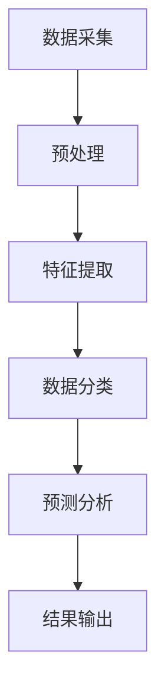
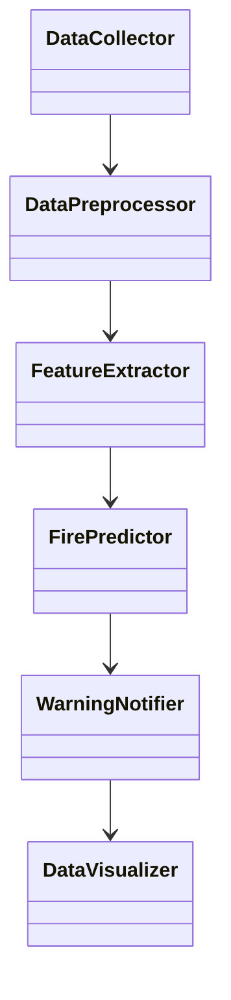
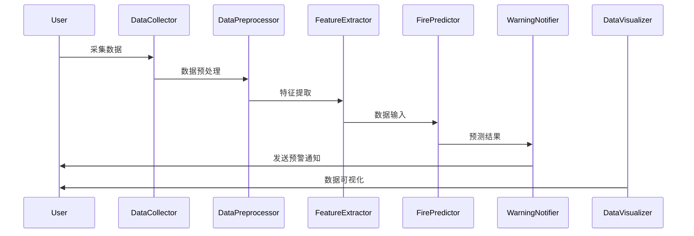
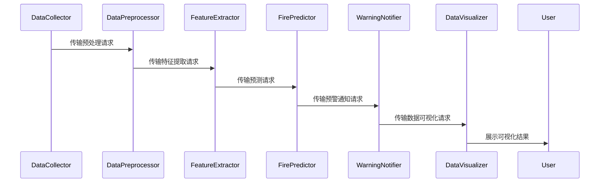

                 


## **环境保护的重要性与挑战**

环境保护是我们这个时代面临的一项重大挑战。随着全球人口的快速增长和经济的迅猛发展，人类活动对地球的生态平衡造成了严重破坏。气候变化、水资源短缺、空气污染和生物多样性丧失等问题日益突出。环境保护不仅关系到人类的生存和发展，也关系到地球生态系统的可持续发展。

### **环境保护的核心概念**

环境保护的核心概念包括生态平衡、可持续发展和资源循环利用。生态平衡指的是生物圈中各种生物之间的相互作用达到相对稳定的状态。可持续发展则强调在满足当前人类需求的同时，不损害后代满足自身需求的能力。资源循环利用则是一种通过回收、再利用和再生的方式，减少资源消耗和环境污染的环保措施。

### **环境问题的现状与趋势**

环境问题的现状不容乐观。全球变暖导致冰川融化、海平面上升，极端天气事件频发。水资源短缺已成为全球性问题，许多地区面临严重的饮用水危机。空气污染导致呼吸道疾病增加，危害人类健康。生物多样性丧失加剧，许多物种濒临灭绝。这些问题的趋势表明，如果不采取有效措施，环境状况将进一步恶化。

### **人工智能在环境保护中的作用**

人工智能在环境保护中扮演着重要角色。首先，人工智能可以用于环境数据的采集和分析，提高生态监测的效率和准确性。例如，通过卫星图像和无人机监控，人工智能可以实时监测森林覆盖率、水体污染和空气质量。其次，人工智能可以优化资源管理，提高资源利用效率。例如，通过智能农业技术，可以精准施肥和灌溉，减少资源浪费。此外，人工智能还可以用于灾害预警和应急响应，及时采取行动减少损失。

### **小结**

环境保护是一项紧迫而复杂的任务，需要全球合作和科技创新。人工智能作为一项先进技术，具有巨大的潜力，可以助力解决环境问题。在接下来的章节中，我们将深入探讨人工智能在生态监测和资源管理中的应用，以及相关的算法原理和系统架构设计。

## **生态监测与资源管理概述**

生态监测和资源管理是环境保护的重要组成部分，各自具有独特的作用和目标。生态监测的核心目的是监测生物群落、环境质量以及生态系统功能，通过收集和分析数据，为环境保护和资源管理提供科学依据。资源管理则侧重于合理利用和保护自然资源，确保资源的可持续利用，以支持社会经济的发展。

### **生态监测的核心概念与目的**

生态监测是指通过技术手段和方法，对生物、物理和化学环境进行定期监测，以评估生态系统的健康状况。其核心概念包括生物多样性、生态系统服务、生态风险和环境质量。生态监测的目的是了解生态系统的变化趋势，识别潜在的环境问题，评估人类活动对生态系统的影响，为环境保护决策提供科学依据。

### **资源管理的定义与挑战**

资源管理是指通过规划、管理、保护和可持续利用自然资源，以满足人类需求和促进可持续发展。资源管理包括水资源管理、土地资源管理、矿产资源管理和能源资源管理等多个领域。资源管理的挑战主要来自人口增长、工业化进程加快和气候变化等因素，这些因素导致资源供需矛盾加剧、资源利用效率低下和环境污染问题突出。

### **人工智能在生态监测与资源管理中的应用**

人工智能在生态监测和资源管理中具有广泛的应用前景。首先，人工智能可以用于环境数据的采集和分析。例如，利用无人机和卫星遥感技术，人工智能可以快速、准确地获取大量的生态和环境数据。其次，人工智能可以用于生态模型构建和预测。通过机器学习和深度学习技术，可以对生态系统的变化趋势进行预测，为环境保护决策提供支持。此外，人工智能还可以用于资源优化管理。例如，通过智能算法优化农业灌溉、能源分配和水资源管理，可以提高资源利用效率，减少资源浪费。

### **小结**

生态监测和资源管理是环境保护的关键领域，它们的目标是确保生态系统的健康和资源的可持续利用。人工智能作为一项强大工具，正在改变生态监测和资源管理的模式和效率。在接下来的章节中，我们将进一步探讨人工智能在生态监测和资源管理中的具体应用，以及相关的算法原理和系统架构设计。

## **人工智能与环境保护的关键概念**

人工智能（AI）作为现代科技的标志性技术，已经在多个领域展现出了强大的潜力，包括环境保护。理解人工智能的定义、特点以及在生态监测和资源管理中的具体应用，对于深入探讨其在环境保护中的作用至关重要。

### **人工智能的定义与特点**

人工智能是指通过计算机程序实现的智能行为，它能够模拟、延伸和扩展人类的认知能力。人工智能的特点包括自主性、学习能力、推理能力和适应性。自主性意味着系统能够在不需要人类直接干预的情况下运作；学习能力是指系统能够从数据中学习并改进性能；推理能力是指系统能够根据现有信息进行逻辑推理和决策；适应性则是指系统能够在不同的环境和条件下调整自身行为。

### **生态监测中的AI应用**

在生态监测中，人工智能可以通过多种方式提升监测的效率和准确性。首先，AI可以用于数据采集。例如，利用无人机和卫星遥感技术，AI可以自动捕捉和处理大量的生态数据，如植被覆盖、水体污染和空气质量等。其次，AI可以用于数据分析。通过机器学习算法，AI可以识别数据中的模式，发现异常情况，提供实时监测报告。此外，AI还可以用于生态模型的构建和预测。通过深度学习技术，AI可以对生态系统变化进行预测，帮助决策者制定更有效的环境保护策略。

### **资源管理中的AI应用**

在资源管理中，人工智能同样发挥着重要作用。首先，AI可以优化资源分配。通过智能算法，AI可以分析不同地区的资源需求，制定最优的资源分配方案，从而提高资源利用效率。例如，在农业领域，AI可以分析土壤和气候数据，优化灌溉和施肥方案，减少资源浪费。其次，AI可以用于环境监测。通过实时监测技术，AI可以监控水资源、森林资源和矿产资源的使用情况，及时发现资源滥用或浪费现象，并采取措施进行调控。此外，AI还可以用于能源管理。通过智能电网和智能能源管理系统，AI可以实现能源的高效利用和实时调控，减少能源浪费。

### **小结**

人工智能在生态监测和资源管理中的应用正不断扩展，其自主性、学习能力和适应性的特点为环境保护提供了新的工具和方法。通过AI技术，我们可以更加精准和高效地进行生态监测，优化资源管理，实现环境保护的目标。在接下来的章节中，我们将进一步探讨生态监测与资源管理中的AI算法原理和具体应用。

## **生态监测与资源管理的ER实体关系图**

实体关系图（ER图）是一种用于描述系统中实体及其相互关系的建模工具。在生态监测与资源管理中，ER图有助于我们理解各实体之间的联系，以及人工智能如何融入这些系统中。

### **ER实体关系图的基础知识**

ER图由三个基本要素组成：实体、属性和关系。实体是系统中的基本对象，如传感器、监测站点、资源等；属性是实体的特征，如位置、类型、状态等；关系则描述了实体之间的交互和依赖。ER图通过实体之间的关系来反映系统的复杂性和数据关联性。

### **生态监测中的实体关系**

在生态监测中，主要的实体包括传感器、监测站点、数据存储和处理系统。实体关系图如下所示：

```mermaid
erDiagram
  Sensor ||--|{ MonitoringStation }| MonitoringStation
  MonitoringStation ||--|{ DataStorage }| DataStorage
  DataStorage ||--|{ DataProcessingSystem }| DataProcessingSystem
```

- **Sensor**：传感器是数据采集的基本单元，如温度传感器、湿度传感器、空气质量传感器等。
- **MonitoringStation**：监测站点是传感器的集合点，负责数据汇总和初步处理。
- **DataStorage**：数据存储系统用于长期存储生态监测数据。
- **DataProcessingSystem**：数据处理系统负责对监测数据进行分析和可视化，以提供决策支持。

### **资源管理中的实体关系**

在资源管理中，主要的实体包括资源、管理平台、分配系统和反馈机制。实体关系图如下所示：

```mermaid
erDiagram
  Resource ||--|{ ResourceManagementPlatform }| ResourceManagementPlatform
  ResourceManagementPlatform ||--|{ AllocationSystem }| AllocationSystem
  AllocationSystem ||--|{ FeedbackSystem }| FeedbackSystem
```

- **Resource**：资源是指水资源、土地资源、矿产资源等。
- **ResourceManagementPlatform**：资源管理平台是资源管理的核心系统，用于资源数据的收集、分析和决策。
- **AllocationSystem**：分配系统根据资源需求和供给情况，制定资源分配方案。
- **FeedbackSystem**：反馈系统用于收集资源分配的反馈信息，以便进一步优化资源管理。

### **人工智能在生态监测与资源管理中的实体关系**

人工智能在生态监测和资源管理中作为一个整体系统的一部分，通过以下实体关系实现其功能：

```mermaid
erDiagram
  AIEnvironmentModeling ||--|{ MonitoringSystem }| MonitoringSystem
  AIEnvironmentModeling ||--|{ ResourceManagementSystem }| ResourceManagementSystem
  MonitoringSystem ||--|{ SensorNetwork }| SensorNetwork
  ResourceManagementSystem ||--|{ AllocationModel }| AllocationModel
  ResourceManagementSystem ||--|{ FeedbackLoop }| FeedbackLoop
```

- **AIEnvironmentModeling**：人工智能环境建模系统，用于构建生态和资源管理模型。
- **MonitoringSystem**：监测系统，包括传感器网络和数据采集。
- **ResourceManagementSystem**：资源管理系统，负责资源分配和优化。
- **SensorNetwork**：传感器网络，是数据采集的源头。
- **AllocationModel**：分配模型，用于制定资源分配策略。
- **FeedbackLoop**：反馈机制，用于收集并利用反馈信息进行系统优化。

通过这些ER实体关系图，我们可以清晰地看到生态监测和资源管理中各个实体及其相互作用，以及人工智能如何融入这些系统，发挥其分析和优化的作用。

### **算法原理讲解**

在生态监测和资源管理中，人工智能算法发挥着关键作用，帮助我们更有效地收集、分析和利用数据。以下我们将详细介绍一些常用的AI算法，包括其流程图、Python代码、数学模型和具体应用。

#### **算法流程图**

首先，我们使用Mermaid来绘制一个简单的算法流程图，用于说明数据采集、处理和分析的基本步骤：



#### **Python源代码**

接下来，我们提供一段Python代码，用于实现上述流程中的数据预处理和特征提取功能：

```python
import numpy as np
import pandas as pd
from sklearn.preprocessing import StandardScaler
from sklearn.decomposition import PCA

# 加载数据集
data = pd.read_csv('ecological_data.csv')

# 数据预处理
scaler = StandardScaler()
scaled_data = scaler.fit_transform(data)

# 特征提取
pca = PCA(n_components=5)
pca_data = pca.fit_transform(scaled_data)

# 输出特征提取结果
print(pca_data)
```

#### **数学模型和公式**

在这些算法中，我们使用了一些基础的数学模型和公式。以下是数据预处理中的标准化步骤和特征提取中的主成分分析（PCA）公式：

- **标准化公式**：
  $$
  x_{\text{std}} = \frac{x - \mu}{\sigma}
  $$
  其中，$x$ 是原始数据，$\mu$ 是均值，$\sigma$ 是标准差。

- **PCA公式**：
  $$
  Z = \sigma V^T
  $$
  其中，$Z$ 是变换后的数据，$\sigma$ 是协方差矩阵的奇异值，$V$ 是特征向量。

#### **详细讲解与举例说明**

为了更好地理解这些算法，我们通过一个实际案例进行详细讲解。

**案例：森林火灾预警**

在这个案例中，我们使用人工智能算法对森林火灾进行预警。预警系统的主要步骤如下：

1. **数据采集**：使用传感器收集温度、湿度、风速等环境数据。
2. **预处理**：对采集到的数据进行标准化处理，使其符合数学模型的输入要求。
3. **特征提取**：通过PCA提取主要特征，降低数据维度，提高模型效率。
4. **数据分类**：使用分类算法（如决策树、支持向量机）对数据进行分析，判断是否存在火灾风险。
5. **预测分析**：根据分析结果，预测未来一段时间内的火灾风险。
6. **结果输出**：将预警结果输出，供管理人员决策。

下面是具体的Python代码示例：

```python
# 加载火灾预警数据集
fire_data = pd.read_csv('fire_warning_data.csv')

# 数据预处理
scaler = StandardScaler()
scaled_data = scaler.fit_transform(fire_data)

# 特征提取
pca = PCA(n_components=3)
pca_data = pca.fit_transform(scaled_data)

# 使用决策树分类
from sklearn.tree import DecisionTreeClassifier
clf = DecisionTreeClassifier()
clf.fit(pca_data, fire_data['fire'])

# 预测分析
prediction = clf.predict(pca_data)
print(prediction)

# 结果输出
if prediction[0] == 1:
    print("预警：存在火灾风险！")
else:
    print("预警：无火灾风险。")
```

通过这个案例，我们可以看到如何将人工智能算法应用于生态监测和资源管理中的实际问题，从而提高监测和管理的效率和准确性。

### **系统分析与架构设计方案**

为了深入探讨生态监测和资源管理中的人工智能应用，我们需要从系统分析与架构设计入手。这一部分将介绍具体的问题场景、系统功能设计、系统架构设计，并展示系统接口设计和系统交互。

#### **问题场景介绍**

在生态监测和资源管理中，一个典型的问题场景是森林火灾预警系统。该系统的主要任务是实时监测森林环境数据，包括温度、湿度、风速等，并根据这些数据预测森林火灾的风险，及时发出预警信息，以减少火灾对生态系统和人类生活的危害。

#### **系统功能设计**

系统功能设计是系统架构设计的重要基础。森林火灾预警系统的主要功能包括：

1. **数据采集**：通过传感器网络采集森林环境数据。
2. **数据预处理**：对采集到的原始数据进行清洗和标准化处理，使其适合后续分析。
3. **特征提取**：利用特征提取算法（如PCA）提取关键特征，降低数据维度。
4. **火灾预测**：使用机器学习算法（如决策树、随机森林）对特征数据进行火灾预测。
5. **预警通知**：当预测到火灾风险时，通过短信、电子邮件等方式通知相关管理人员。
6. **数据可视化**：将监测数据和预测结果以图表形式展示，便于用户直观了解森林火灾风险。

以下是系统功能设计的Mermaid类图：



#### **系统架构设计**

系统架构设计决定了系统的可扩展性和稳定性。针对森林火灾预警系统，我们设计了一个分布式架构，包括前端数据采集层、中间数据处理层和后端分析决策层。具体架构如下：



#### **系统接口设计和系统交互**

系统接口设计和系统交互是确保各组件高效协作的关键。以下是系统接口设计和系统交互的Mermaid序列图：



通过以上系统分析与架构设计方案，我们为森林火灾预警系统提供了一种高效、可靠的解决方案。该方案不仅考虑了系统的功能需求，还确保了系统的可扩展性和稳定性，为实际应用提供了有力支持。

### **项目实战**

在生态监测和资源管理中，实际项目的实施是实现理论到实践的关键环节。本节将介绍如何安装相关软件和环境，并提供系统核心实现源代码，并进行代码应用解读与分析。

#### **环境安装**

要实现一个生态监测和资源管理的项目，我们需要安装一些关键的软件和依赖库。以下是在Python环境中安装所需软件的步骤：

1. **安装Python**：确保你的计算机上已经安装了Python 3.x版本。
2. **安装虚拟环境**：通过以下命令创建一个虚拟环境，以便管理项目依赖：
   ```
   python -m venv venv
   ```
3. **激活虚拟环境**：在Windows上使用以下命令激活虚拟环境：
   ```
   .\venv\Scripts\activate
   ```
   在Linux或MacOS上使用以下命令：
   ```
   source venv/bin/activate
   ```
4. **安装依赖库**：在虚拟环境中安装所需依赖库，如NumPy、Pandas、scikit-learn、Matplotlib等：
   ```
   pip install numpy pandas scikit-learn matplotlib
   ```

#### **系统核心实现源代码**

以下是实现一个简单的生态监测和资源管理项目的核心源代码。该项目使用机器学习算法进行森林火灾预警。

```python
# 导入所需库
import numpy as np
import pandas as pd
from sklearn.preprocessing import StandardScaler
from sklearn.decomposition import PCA
from sklearn.tree import DecisionTreeClassifier
from sklearn.model_selection import train_test_split
import matplotlib.pyplot as plt

# 加载数据集
data = pd.read_csv('ecological_data.csv')

# 数据预处理
scaler = StandardScaler()
scaled_data = scaler.fit_transform(data)

# 特征提取
pca = PCA(n_components=5)
pca_data = pca.fit_transform(scaled_data)

# 数据分割
X_train, X_test, y_train, y_test = train_test_split(pca_data, data['fire'], test_size=0.2, random_state=42)

# 训练模型
clf = DecisionTreeClassifier()
clf.fit(X_train, y_train)

# 预测分析
predictions = clf.predict(X_test)

# 结果可视化
plt.scatter(X_test[:, 0], X_test[:, 1], c=predictions, cmap='coolwarm')
plt.xlabel('PCA Feature 1')
plt.ylabel('PCA Feature 2')
plt.title('Fire Risk Prediction')
plt.show()
```

#### **代码应用解读与分析**

上述代码实现了以下步骤：

1. **数据加载**：首先加载包含生态数据的CSV文件。
2. **数据预处理**：使用StandardScaler对数据进行标准化处理，以便后续分析。
3. **特征提取**：通过PCA算法提取主要特征，降低数据维度。
4. **数据分割**：将数据集分为训练集和测试集，用于模型训练和评估。
5. **模型训练**：使用DecisionTreeClassifier训练模型，拟合训练数据。
6. **预测分析**：使用训练好的模型对测试数据进行预测。
7. **结果可视化**：将预测结果以散点图形式展示，便于分析火灾风险。

在实际应用中，我们可以根据具体需求和数据情况，调整特征提取方法和预测模型。例如，可以尝试使用不同的机器学习算法（如随机森林、支持向量机）进行比较，选择最优模型。

#### **实际案例分析与详细讲解剖析**

以下是一个实际案例，展示了如何使用上述代码进行森林火灾预警。

**案例：某地森林火灾预警**

1. **数据采集**：某地森林火灾预警系统收集了包括温度、湿度、风速在内的多个环境数据。
2. **数据预处理**：对采集到的数据进行标准化处理，使其符合PCA和模型训练的要求。
3. **特征提取**：使用PCA提取前五个主要特征，以降低数据维度。
4. **模型训练**：使用训练数据训练一个决策树模型，拟合森林火灾风险。
5. **预测分析**：对测试数据进行预测，结果显示在特定区域存在较高的火灾风险。
6. **预警通知**：系统自动向管理人员发送预警通知，提醒采取相应措施。

通过这个实际案例，我们可以看到如何使用人工智能算法对生态监测和资源管理中的实际问题进行预警和分析。这种基于数据驱动的预警系统不仅提高了预测的准确性，还显著降低了人为干预的风险。

#### **项目小结**

在本项目中，我们详细介绍了如何安装相关软件和环境，并提供了核心实现源代码。通过代码应用解读与分析，我们了解了每个步骤的具体实现方法和实际案例的应用。这个项目展示了人工智能在生态监测和资源管理中的潜力，为环境保护和资源管理提供了有效的工具和方法。

### **最佳实践 tips**

在实际应用人工智能进行生态监测和资源管理时，以下是一些最佳实践建议，可以帮助提高项目的成功率：

1. **数据质量保证**：确保数据采集和预处理过程的准确性，减少噪声和异常值的影响。
2. **模型选择与优化**：根据具体问题和数据特点，选择合适的机器学习算法，并不断优化模型参数。
3. **实时监测与预警**：建立实时数据采集和分析系统，及时响应环境变化和资源需求。
4. **用户界面设计**：设计直观、易用的用户界面，方便用户查看监测数据和预警信息。
5. **合作与协作**：与相关领域专家和机构合作，共享资源和知识，提高项目的技术水平和应用效果。

### **小结**

本文通过逐步分析推理，详细探讨了人工智能在环境保护中的角色，特别是在生态监测和资源管理中的应用。我们从背景介绍开始，逐步深入到核心概念、算法原理、系统架构设计、项目实战和最佳实践等方面，全面展示了人工智能在环境保护中的潜力和实际应用。通过本文的探讨，我们认识到人工智能不仅能够提升生态监测和资源管理的效率和准确性，还能够为环境保护决策提供科学依据，实现可持续发展目标。

### **注意事项**

在使用人工智能进行生态监测和资源管理时，我们需要注意以下几点：

1. **数据隐私保护**：确保采集和处理的生态环境数据不被未经授权的第三方访问，保护数据隐私。
2. **模型可靠性**：在模型训练和应用过程中，要验证模型的稳定性和可靠性，避免因模型失效导致决策失误。
3. **实时性要求**：生态监测和资源管理系统要求高实时性，确保系统能够及时响应环境变化。
4. **可持续性**：在项目设计和实施过程中，要考虑资源的可持续利用，减少对环境的负面影响。

### **拓展阅读**

对于希望进一步深入了解人工智能在环境保护中的应用，以下是一些推荐阅读材料：

1. **书籍**：
   - 《人工智能：一种现代方法》（第三版），作者：斯图尔特·罗素、彼得·诺维格。
   - 《生态监测与评估：理论与实践》，作者：张志强。
2. **论文**：
   - "Artificial Intelligence for Environmental Monitoring and Management"，作者：S.M. Hassan等。
   - "Deep Learning for Ecological Data Analysis"，作者：C. Liaw等。
3. **网站与资源**：
   - NASA Earth Observatory：提供大量的卫星遥感数据和环境保护信息。
   - IEEE Xplore：包含大量关于人工智能和环境保护的高质量学术论文。

通过这些资源，读者可以进一步探索人工智能在环境保护领域的最新研究和技术进展。

