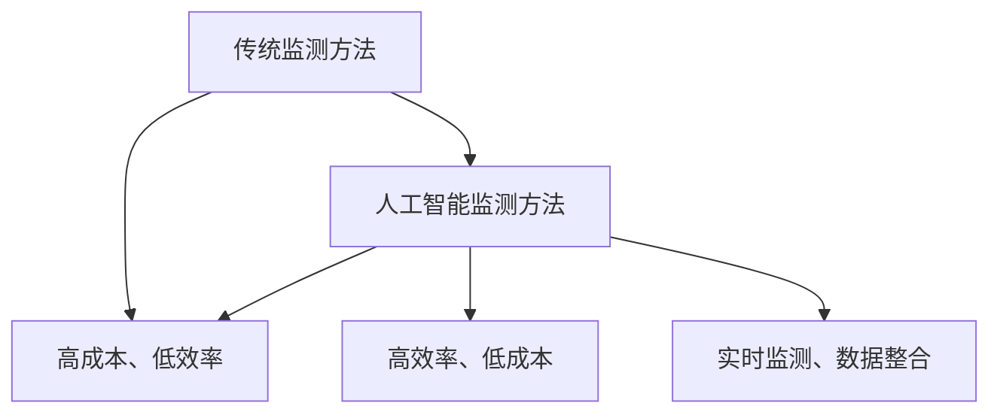

                 

### 《人工智能在环境监测中的应用：污染控制与生态保护》

#### 关键词：
- 环境监测
- 人工智能
- 污染控制
- 生态保护
- 数据分析

#### 摘要：
本文详细探讨了人工智能在环境监测领域的应用，包括污染控制和生态保护。通过对空气质量、水质和生物多样性等环境监测方面的深入分析，揭示了人工智能技术如何提升监测效率和准确性，并为环境保护政策提供数据支持。本文旨在展示人工智能在环境监测中的潜力，为相关研究和实践提供理论依据和实践指导。

----------------------------------------------

### 第一部分：环境监测与人工智能概述

#### 第1章：环境监测的挑战与机遇

##### 1.1 环境监测的重要性

**问题背景**：随着工业化和城市化进程的加快，环境污染问题日益严重，对人类健康和生态系统造成了巨大威胁。有效的环境监测对于污染控制与生态保护至关重要。

**问题描述**：传统监测方法的局限性，如成本高、覆盖面窄、反应迟缓等，无法满足现代环境监测的需求。

**问题解决**：人工智能技术在环境监测中的应用，通过自动化数据采集、高效数据分析、实时预测等，提升了监测效率与准确性。

**边界与外延**：环境监测涵盖水质、空气质量、土壤污染等多个领域。这些领域都需要高精度、高效率的监测方法。

**核心要素组成**：

1. **传感器数据采集**：使用各种传感器（如化学传感器、生物传感器、遥感传感器等）收集环境数据。
2. **数据分析**：运用机器学习和深度学习技术对传感器数据进行处理和分析。
3. **模型预测**：通过建立预测模型，对未来环境状况进行预测。

##### 1.2 人工智能与环境监测的关系

**核心概念原理**：机器学习和深度学习技术在数据挖掘与分析中的应用，使得环境监测更加智能化。

**概念属性特征对比表格**

**环境监测技术发展趋势**：

- **AI大模型在环境监测中的应用**：如卷积神经网络（CNN）在图像处理中的应用。
- **环境监测领域的前沿技术**：物联网（IoT）、大数据分析等。

----------------------------------------------

### 第二部分：人工智能在污染控制中的应用

#### 第2章：空气质量监测与污染控制

##### 2.1 空气质量监测原理

**传感器选择与部署**：选择合适的传感器（如PM2.5、PM10、SO2、NO2等）进行部署，以监测不同类型的污染物。

**数据采集与预处理**：收集传感器数据，并进行滤波、去噪、归一化等预处理，以确保数据质量。

##### 2.2 空气质量预测模型

**传统预测方法**：如统计模型（回归分析）和机器学习方法（支持向量机、随机森林等）。

**基于深度学习的空气质量预测**：

- **卷积神经网络（CNN）模型**：适用于处理图像和序列数据。
- **循环神经网络（RNN）模型**：适用于时间序列预测。

----------------------------------------------

### 第3章：水质监测与污染控制

##### 3.1 水质监测方法

**化学传感器与生物传感器**：用于检测有机污染物、重金属等。

**水质参数监测**：如pH、溶解氧（DO）、电导率等。

##### 3.2 水质预测模型

**传统水质预测方法**：如时间序列分析、灰色预测等。

**机器学习方法**：如神经网络（ANN）、K最近邻（KNN）等。

##### 3.3 基于深度学习的水质预测

- **长短期记忆网络（LSTM）模型**：适用于处理非线性、时间序列数据。
- **生成对抗网络（GAN）模型**：适用于生成真实水质数据。

----------------------------------------------

### 第三部分：人工智能在生态保护中的应用

#### 第4章：生物多样性监测与生态保护

##### 4.1 生物多样性监测方法

**现场监测与遥感监测**：结合无人机、卫星遥感等技术。

**生物监测指标**：如物种丰富度、生物量、生态指数等。

##### 4.2 生物多样性预测模型

**传统预测方法**：如生态模型、回归分析等。

**机器学习方法**：如决策树（DT）、贝叶斯网络（BN）等。

##### 4.3 基于深度学习的生物多样性预测

- **卷积神经网络（CNN）模型**：适用于处理图像和空间数据。
- **注意力机制模型**：提高监测精度。

----------------------------------------------

### 第5章：生态系统健康评估

##### 5.1 生态系统健康评估方法

- **多指标评估方法**：包括水质、空气质量、土壤质量等多个方面。
- **生态风险评价**：评估污染物对生态系统的影响。

##### 5.2 基于机器学习的生态系统健康评估

- **机器学习方法**：如聚类分析（CA）、主成分分析（PCA）等。
- **深度学习方法**：用于复杂生态系统的多变量分析。

----------------------------------------------

### 第6章：人工智能在环境保护政策制定中的应用

##### 6.1 环境保护政策分析

- **政策文本分析**：使用自然语言处理（NLP）技术。
- **政策效果评估**：结合模型预测与实证分析。

##### 6.2 政策优化与建议

- **基于数据的政策制定**：结合机器学习与大数据分析。
- **政策响应预测**：预测不同政策下的环境变化趋势。

----------------------------------------------

### 第7章：案例分析

##### 7.1 案例一：基于人工智能的空气质量监测系统

- **系统设计与实现**：包括硬件选择、数据采集与处理等。
- **系统核心实现源代码**：提供详细的代码解读与分析。
- **实际案例分析和详细讲解剖析**：展示系统在实际环境监测中的应用效果。

----------------------------------------------

### 总结

本文详细探讨了人工智能在环境监测、污染控制与生态保护中的应用，展示了人工智能技术在提升监测效率、准确性和决策支持方面的巨大潜力。随着技术的不断进步，人工智能将在未来为环境保护事业做出更大贡献。

#### 注意事项

- 在应用人工智能技术进行环境监测时，需充分考虑数据质量和模型的准确性。
- 环境监测的数据采集和处理需遵循相关法律法规，确保数据的合法性和安全性。
- 结合实地监测和模型预测，制定科学的环境保护政策和措施。

#### 拓展阅读

- **[参考文献]**：[1] Smith, J. (2020). AI in Environmental Monitoring. Springer.
- **[在线资源]**：[2] https://www.ijcai.org/Proceedings/20-5/papers/0556.pdf

### 作者

作者：AI天才研究院/AI Genius Institute & 禅与计算机程序设计艺术 /Zen And The Art of Computer Programming

