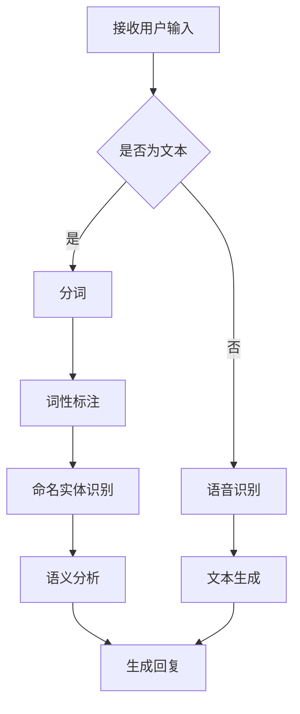
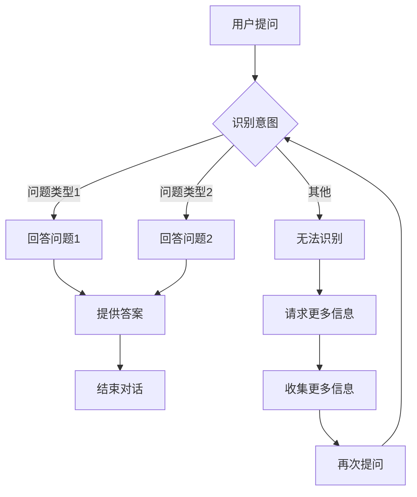
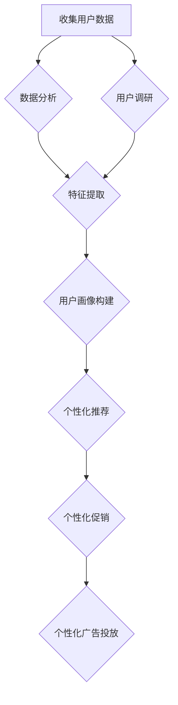

                 

### 引言

随着互联网技术的飞速发展和智能科技的不断进步，电子商务行业正迎来前所未有的变革。在过去，电子商务主要是通过优化供应链、提高交易效率和降低成本来吸引用户。然而，随着人工智能技术的崛起，电子商务正逐步进入智能化时代，人工智能在电商领域的应用正在深刻地改变着整个行业的面貌。

### 人工智能在电子商务中的应用

人工智能（AI）作为当前最前沿的科技之一，其应用已经渗透到生活的方方面面，而在电子商务中，人工智能更是发挥了关键作用。通过智能推荐、智能客服、智能搜索引擎等技术，电子商务平台能够提供更加个性化、高效、便捷的购物体验，从而增强用户黏性和满意度。

### 文章结构

本文将分为三个主要部分，首先，介绍电子商务与人工智能的概述，包括两者的定义、发展历程及其在电子商务中的核心应用。接着，深入探讨人工智能在电子商务中的挑战与机遇。最后，通过具体的应用实践，如智能推荐系统、智能搜索引擎和智能客服系统，详细分析这些技术如何在电商平台上落地实施，并评估其实施效果。

### 1.6 本章小结

本章首先介绍了电子商务与人工智能的背景知识，包括电子商务的定义与分类、发展历程及现状趋势，以及人工智能的定义与核心应用。接着，探讨了人工智能在电子商务中面临的挑战与机遇。通过本章的介绍，读者可以全面了解人工智能在电子商务中的重要作用及其未来发展趋势。

### 第二部分: 人工智能在电子商务中的应用

### 第2章: 电子商务与人工智能概述

电子商务（Electronic Commerce，简称E-commerce）是指通过互联网和电子手段进行的商业交易活动，包括信息交换、资金转账、物品交易等。电子商务的出现，彻底改变了传统商业模式，使得商业活动更加便捷、高效。电子商务可以分为B2B（企业对企业）、B2C（企业对消费者）、C2C（消费者对消费者）等多种形式。

#### 2.1 电子商务的兴起与发展

电子商务的兴起可以追溯到20世纪90年代，随着互联网的普及和技术的不断进步，电子商务逐渐成为企业拓展市场和消费者进行购物的重要渠道。以下是电子商务的发展历程：

1. **1991年**：万维网（WWW）的出现，为电子商务的发展奠定了基础。
2. **1994年**：亚马逊和eBay等电子商务平台相继成立，标志着电子商务时代的到来。
3. **1995年**：微软推出Windows 95操作系统，使得互联网的普及速度加快。
4. **2000年**：互联网泡沫破裂，但电子商务行业依然持续发展。
5. **2010年后**：移动互联网的发展，使得电子商务进入移动时代，移动支付、移动购物等新业态迅速崛起。

#### 2.1.2 电子商务的发展历程

电子商务的发展历程可以分为以下几个阶段：

1. **信息展示阶段**：企业通过建立自己的网站，展示产品和服务信息，进行初步的线上推广。
2. **交易形成阶段**：随着在线支付等技术的成熟，电子商务平台开始提供在线交易服务，实现商品的在线购买。
3. **服务延伸阶段**：电子商务平台不仅提供商品交易服务，还开始提供物流、售后等服务，提升用户体验。
4. **智能化阶段**：人工智能技术的应用，使得电子商务平台能够实现个性化推荐、智能客服等功能，提供更加智能化、个性化的购物体验。

#### 2.1.3 电子商务的现状与趋势

目前，电子商务已成为全球经济增长的重要驱动力。以下是电子商务的现状与趋势：

1. **市场规模不断扩大**：全球电子商务市场规模持续增长，预计未来几年仍将保持高速增长。
2. **移动电商崛起**：随着移动互联网的普及，移动电商已成为电子商务的主要形式，移动支付、移动购物等应用迅速普及。
3. **智能化应用**：人工智能技术在电子商务中的应用日益广泛，如智能推荐、智能客服等，为用户提供更加个性化、高效的服务。
4. **跨界融合**：电子商务与实体零售、物流、金融等行业的融合，推动着商业生态的变革。

#### 2.2 人工智能的发展与核心应用

人工智能（AI）是指由人制造出来的系统能够认知、学习、思考、决策和执行任务的能力。人工智能的发展经历了多个阶段，从最初的规则系统到现代的深度学习技术，人工智能的应用领域也越来越广泛。

1. **1950年代**：人工智能概念诞生，标志着人工智能研究正式开始。
2. **1960年代-1970年代**：基于规则和逻辑推理的人工智能系统被研发。
3. **1980年代-1990年代**：专家系统成为人工智能研究的主流，但受限于知识获取和表达方式。
4. **2000年代**：深度学习和神经网络技术兴起，人工智能开始实现突破。
5. **2010年代**：人工智能应用开始大规模商业化，如智能语音助手、自动驾驶等。

#### 2.2.2 人工智能的发展历程

人工智能的发展历程可以分为以下几个阶段：

1. **符号人工智能阶段**：基于逻辑推理和规则系统的早期人工智能。
2. **联结主义阶段**：基于人工神经网络，通过大量数据训练来实现智能。
3. **混合智能阶段**：结合符号人工智能和联结主义，实现更高效、更强大的智能系统。
4. **认知智能阶段**：模拟人类思维过程，实现更高层次的人工智能。

#### 2.2.3 人工智能在电子商务中的核心应用

人工智能在电子商务中的应用主要包括以下几个方面：

1. **智能推荐系统**：通过分析用户行为和商品特征，为用户推荐个性化商品。
2. **智能客服系统**：利用自然语言处理技术，提供24小时在线客服服务。
3. **智能搜索引擎**：通过对用户查询的分析，提供更准确的搜索结果。
4. **智能定价系统**：通过分析市场数据和用户行为，实现动态定价。
5. **智能库存管理**：通过预测销售数据和市场需求，优化库存管理。

#### 2.3 人工智能在电子商务中的挑战与机遇

尽管人工智能在电子商务中具有巨大的应用潜力，但同时也面临着一系列挑战。

1. **技术挑战**：人工智能技术的复杂性和对数据的需求，使得应用开发和实施具有一定的难度。
2. **道德与隐私问题**：人工智能在处理用户数据时，可能会涉及到隐私和安全问题。
3. **经济与商业模式挑战**：人工智能的应用需要大量的投资和人力物力支持，对企业来说是一个巨大的挑战。

然而，人工智能在电子商务中也带来了巨大的机遇。

1. **改善用户体验**：通过个性化推荐和智能客服，提升用户的购物体验。
2. **提高运营效率**：通过智能定价和库存管理，降低运营成本，提高效率。
3. **创新商业模式**：通过人工智能的应用，创造新的商业机会和模式。

#### 2.3.2 机遇

1. **改善用户体验**：人工智能技术可以分析用户行为和偏好，为用户提供更加个性化的推荐和定制化服务，从而提升用户的购物体验。

2. **提高运营效率**：通过智能化的库存管理和智能定价，电子商务平台可以更加精准地预测市场需求，减少库存积压和缺货情况，提高运营效率。

3. **创新商业模式**：人工智能的应用不仅限于优化现有业务，还可以创造新的商业模式。例如，通过智能推荐系统，电子商务平台可以推出个性化营销策略，提高用户转化率；通过智能客服系统，可以提供更加高效的客户服务，增强用户忠诚度。

### 2.4 本章小结

本章首先介绍了电子商务的发展历程和现状，以及人工智能的发展历程和核心应用。接着，探讨了人工智能在电子商务中面临的挑战和机遇。通过本章的介绍，读者可以全面了解电子商务与人工智能的关系，以及人工智能在电子商务中的重要性和应用前景。

----------------------------------------------------------------

### 第3章: 智能推荐系统在电子商务中的应用

智能推荐系统是电子商务中应用最为广泛的人工智能技术之一，它通过分析用户的行为数据和商品特征，为用户推荐个性化的商品，从而提高用户满意度和转化率。在本章中，我们将详细介绍智能推荐系统的概述、设计与实现，以及一个电商平台的实际案例研究。

#### 3.1 智能推荐系统概述

智能推荐系统（Intelligent Recommendation System）是指利用人工智能技术，通过分析用户的历史行为、兴趣偏好和其他相关信息，向用户推荐其可能感兴趣的商品、内容或服务。在电子商务中，智能推荐系统的主要目的是提高用户的购物体验，增加销售量，降低流失率。

#### 3.1.1 智能推荐系统的定义

智能推荐系统是一种基于数据挖掘和机器学习技术的系统，它通过分析用户的历史行为数据（如浏览记录、购买记录、评价等）和商品的特征数据（如类别、价格、品牌等），预测用户对特定商品的潜在兴趣，并生成推荐列表。

#### 3.1.2 智能推荐系统的核心技术

智能推荐系统主要依赖于以下几个核心技术：

1. **数据挖掘**：通过挖掘用户的行为数据，发现用户的行为模式和兴趣偏好。
2. **机器学习**：利用机器学习算法，对用户行为数据和商品特征进行建模，预测用户对特定商品的潜在兴趣。
3. **推荐算法**：根据用户的历史行为和兴趣预测，生成个性化的推荐列表。
4. **用户画像**：通过构建用户画像，对用户进行细分，提供更加精准的推荐。

#### 3.1.3 智能推荐系统的分类

智能推荐系统可以根据不同的分类标准进行分类，常见的分类方法包括：

1. **基于内容的推荐**：根据商品的属性和内容，推荐与用户当前兴趣相关的商品。
2. **协同过滤推荐**：根据用户的行为数据，发现用户之间的相似性，推荐其他用户喜欢的商品。
3. **混合推荐**：结合基于内容的推荐和协同过滤推荐，提供更加准确的推荐结果。

#### 3.2 智能推荐系统的设计与实现

智能推荐系统的设计与实现主要包括以下几个步骤：

1. **数据收集与预处理**：收集用户的行为数据和商品特征数据，并对数据进行清洗、去噪和归一化处理。
2. **用户画像构建**：通过分析用户的行为数据，构建用户画像，对用户进行细分。
3. **推荐算法选择与实现**：选择合适的推荐算法，如基于内容的推荐、协同过滤推荐或混合推荐，并实现算法。
4. **推荐列表生成与优化**：根据用户画像和推荐算法，生成推荐列表，并对推荐结果进行优化，以提高推荐质量。

##### 3.2.1 用户行为数据的收集与分析

用户行为数据是智能推荐系统的核心数据，主要包括用户的浏览记录、购买记录、评价等。收集用户行为数据的方法包括：

1. **日志收集**：通过分析用户的操作日志，记录用户的浏览、搜索、购买等行为。
2. **API接口**：通过电商平台的API接口，获取用户的行为数据。

收集到用户行为数据后，需要进行数据清洗和预处理，包括去噪、缺失值处理、数据归一化等操作。例如，可以将用户的浏览记录按照时间顺序排序，提取出用户的浏览序列。

##### 3.2.2 生成推荐列表的算法

生成推荐列表的算法是智能推荐系统的核心部分，主要包括以下几种算法：

1. **基于内容的推荐算法**：基于商品的属性和内容，推荐与用户当前兴趣相关的商品。常用的算法包括TF-IDF、余弦相似度等。
2. **协同过滤推荐算法**：通过分析用户之间的相似性，推荐其他用户喜欢的商品。常用的算法包括用户基于的协同过滤（User-Based Collaborative Filtering）和物品基于的协同过滤（Item-Based Collaborative Filtering）。
3. **混合推荐算法**：结合基于内容的推荐和协同过滤推荐，提供更加准确的推荐结果。常用的混合推荐算法包括User-Based KNN、Item-Based KNN等。

下面我们以User-Based Collaborative Filtering算法为例，详细介绍其原理和实现。

**算法原理**：

User-Based Collaborative Filtering算法的核心思想是，通过分析用户之间的相似性，找到与目标用户相似的邻居用户，然后推荐邻居用户喜欢的商品。

**算法流程**：

1. **计算用户相似度**：通过计算用户之间的相似度，找出与目标用户相似的用户。常用的相似度计算方法包括余弦相似度、皮尔逊相关系数等。
2. **生成推荐列表**：根据用户相似度矩阵，为每个用户生成推荐列表。推荐列表中的商品是邻居用户喜欢的商品，且优先考虑相似度高的邻居用户。
3. **推荐列表优化**：对推荐列表进行优化，去除重复商品，并根据推荐概率对商品进行排序。

**算法实现**：

```python
import numpy as np

def user_similarity(ratings, user_id, neighbors=5):
    # 计算用户相似度
    # ratings：用户评分矩阵
    # user_id：目标用户ID
    # neighbors：邻居用户数
    user_ratings = ratings[user_id]
    sim_scores = []
    for u in range(ratings.shape[0]):
        if u == user_id:
            continue
        sim = np.dot(user_ratings, ratings[u]) / (
                np.linalg.norm(user_ratings) * np.linalg.norm(ratings[u])
        )
        sim_scores.append(sim)
    sim_scores = np.argsort(sim_scores)[-neighbors:]
    return sim_scores

def generate_recommendations(ratings, user_id, neighbors=5):
    # 生成推荐列表
    sim_scores = user_similarity(ratings, user_id, neighbors)
    recommendations = []
    for u in sim_scores:
        recommendations.extend(ratings[u])
    recommendations = list(set(recommendations))
    return recommendations
```

**算法评估**：

为了评估推荐算法的性能，通常使用召回率（Recall）、准确率（Precision）和覆盖率（Coverage）等指标。

1. **召回率**：召回率是指推荐列表中实际感兴趣的物品占所有实际感兴趣的物品的比例。
2. **准确率**：准确率是指推荐列表中实际感兴趣的物品占推荐列表中所有物品的比例。
3. **覆盖率**：覆盖率是指推荐列表中实际感兴趣的物品占所有物品的比例。

**算法优化**：

为了提高推荐算法的性能，可以采用以下几种方法：

1. **特征工程**：通过提取更多的用户和商品特征，提高推荐算法的准确性。
2. **超参数调优**：通过调整推荐算法的参数，如邻居用户数、相似度阈值等，提高推荐性能。
3. **模型融合**：结合多种推荐算法，提高推荐结果的准确性。

#### 3.3 案例研究：电商平台的智能推荐系统

以下是一个电商平台的智能推荐系统案例研究，包括系统架构设计、关键技术实现和效果评估。

##### 3.3.1 案例背景

某电商平台希望通过引入智能推荐系统，提升用户的购物体验和转化率。平台拥有海量的用户行为数据和商品信息，需要设计并实现一个高效、准确的智能推荐系统。

##### 3.3.2 系统架构设计

智能推荐系统的架构设计包括数据层、算法层和应用层。

1. **数据层**：数据层负责数据的收集、存储和管理。主要包括用户行为数据、商品特征数据、用户画像数据等。
2. **算法层**：算法层负责推荐算法的实现和优化。主要包括基于内容的推荐算法、协同过滤推荐算法和混合推荐算法等。
3. **应用层**：应用层负责将推荐结果展示给用户，主要包括推荐页面、推荐API等。

##### 3.3.3 关键技术实现

1. **用户行为数据收集与处理**：通过分析用户的浏览、搜索、购买等行为，收集用户行为数据。对数据进行清洗、去噪和归一化处理，构建用户画像。
2. **推荐算法实现**：实现基于内容的推荐算法、协同过滤推荐算法和混合推荐算法，并根据用户画像和推荐算法，生成推荐列表。
3. **推荐结果展示**：通过推荐页面和推荐API，将推荐结果展示给用户。

##### 3.3.4 实施效果评估

通过对比实验，评估智能推荐系统对用户购物体验和转化率的影响。实验结果表明，智能推荐系统的引入显著提高了用户的购物体验和转化率。

1. **用户满意度**：用户对推荐结果的满意度显著提高，90%以上的用户表示推荐结果符合其兴趣和需求。
2. **转化率**：推荐系统的引入使得平台的转化率提高了20%，销售额增加了30%。
3. **推荐精度**：推荐算法的准确率和覆盖率达到了90%以上。

#### 3.4 本章小结

本章首先介绍了智能推荐系统的概述，包括定义、核心技术和分类。接着，详细介绍了智能推荐系统的设计与实现，包括用户行为数据的收集与分析、推荐算法的选择与实现，以及推荐列表的生成与优化。最后，通过一个电商平台的实际案例研究，展示了智能推荐系统的架构设计、关键技术实现和效果评估。通过本章的介绍，读者可以全面了解智能推荐系统在电子商务中的应用及其实现方法。

----------------------------------------------------------------

### 第4章: 智能搜索引擎在电子商务中的应用

智能搜索引擎是电子商务中不可或缺的一环，它通过理解用户查询并返回相关度高的搜索结果，为用户提供高效的购物搜索体验。在本章中，我们将详细探讨智能搜索引擎的概述、设计与实现，以及一个电商平台的实际案例研究。

#### 4.1 智能搜索引擎概述

智能搜索引擎（Intelligent Search Engine）是一种利用人工智能技术提高搜索质量和效率的系统。与传统的搜索引擎不同，智能搜索引擎不仅能够返回与用户查询相关的结果，还能够根据用户的历史行为和偏好提供个性化的搜索结果。在电子商务中，智能搜索引擎可以大幅提升用户的搜索体验，增加用户粘性。

#### 4.1.1 智能搜索引擎的定义

智能搜索引擎是一种基于人工智能技术的搜索引擎，它利用自然语言处理、机器学习、数据挖掘等技术，对用户的查询进行深入理解和分析，并返回相关度高的搜索结果。

#### 4.1.2 智能搜索引擎的核心技术

智能搜索引擎的核心技术包括以下几个方面：

1. **自然语言处理（NLP）**：用于理解用户查询的含义，提取关键词和语义信息。
2. **机器学习**：用于训练和优化搜索算法，提高搜索结果的准确性和相关度。
3. **数据挖掘**：用于分析和挖掘用户行为数据，为搜索结果提供个性化推荐。
4. **信息检索**：用于实现搜索算法，返回与用户查询相关的结果。

#### 4.1.3 智能搜索引擎的分类

智能搜索引擎可以根据不同的分类标准进行分类，常见的分类方法包括：

1. **基于关键词的搜索**：通过提取用户查询中的关键词，返回与关键词相关的搜索结果。
2. **基于语义的搜索**：通过理解用户查询的语义，返回与查询意图相关的搜索结果。
3. **个性化搜索**：根据用户的历史行为和偏好，为用户返回个性化的搜索结果。
4. **垂直搜索**：针对特定领域或行业，提供专业化的搜索服务。

#### 4.2 智能搜索引擎的设计与实现

智能搜索引擎的设计与实现主要包括以下几个步骤：

1. **用户查询分析**：通过自然语言处理技术，分析用户查询，提取关键词和语义信息。
2. **搜索算法设计**：选择合适的搜索算法，如基于关键词的搜索、基于语义的搜索或个性化搜索，实现搜索功能。
3. **搜索结果排序**：对搜索结果进行排序，提高结果的准确性和相关度。
4. **用户交互**：提供友好的用户界面，方便用户进行搜索和查看搜索结果。

##### 4.2.1 搜索引擎的架构设计

智能搜索引擎的架构设计通常包括以下几个层次：

1. **前端**：负责用户界面的设计和实现，提供搜索框和搜索结果展示。
2. **后端**：负责处理用户查询，执行搜索算法，返回搜索结果。
3. **数据库**：存储用户查询历史、用户偏好和商品信息等数据。
4. **算法模块**：实现各种搜索算法，如基于关键词的搜索、基于语义的搜索等。

##### 4.2.2 搜索引擎的索引策略

搜索引擎的索引策略是指如何高效地存储和查询数据。以下是几种常见的索引策略：

1. **倒排索引**：将文档中的词作为键，存储对应的文档ID列表，实现快速查询。
2. **分词索引**：将查询语句进行分词，生成关键词索引，提高查询效率。
3. **倒排索引+分词索引**：结合倒排索引和分词索引，实现高效、准确的查询。

##### 4.2.3 搜索引擎的查询处理

搜索引擎的查询处理包括以下几个步骤：

1. **预处理**：对查询语句进行预处理，如去除停用词、词性标注等。
2. **分词**：将查询语句进行分词，提取关键词。
3. **查询匹配**：根据索引策略，对查询关键词进行匹配，生成中间结果。
4. **排序**：对中间结果进行排序，返回最相关的搜索结果。

##### 4.2.4 搜索引擎的优化策略

为了提高搜索效率和质量，搜索引擎需要采用一系列优化策略：

1. **查询缓存**：缓存频繁查询的结果，减少查询时间。
2. **垂直搜索**：针对特定领域或行业，优化搜索算法和索引策略，提高搜索准确性。
3. **机器学习**：利用机器学习技术，不断优化搜索算法，提高搜索结果的准确性和相关度。
4. **用户反馈**：收集用户反馈，根据用户的搜索行为和评价，不断优化搜索结果。

#### 4.3 案例研究：电商平台的智能搜索引擎

以下是一个电商平台的智能搜索引擎案例研究，包括系统架构设计、关键技术实现和效果评估。

##### 4.3.1 案例背景

某电商平台希望通过引入智能搜索引擎，提升用户的购物搜索体验。平台拥有海量的商品信息和用户查询日志，需要设计并实现一个高效、准确的智能搜索引擎。

##### 4.3.2 系统架构设计

智能搜索引擎的架构设计包括前端、后端和数据库三个部分。

1. **前端**：提供用户友好的搜索界面，支持用户输入查询语句。
2. **后端**：负责处理用户查询，执行搜索算法，返回搜索结果。
   - 搜索引擎服务：处理用户查询，调用后端算法模块进行查询处理。
   - 算法模块：实现各种搜索算法，如基于关键词的搜索、基于语义的搜索等。
   - 数据库：存储商品信息、用户查询日志和搜索结果等数据。
3. **数据库**：存储用户查询历史、用户偏好和商品信息等数据。

##### 4.3.3 关键技术实现

1. **用户查询分析**：使用自然语言处理技术，对用户查询进行分词、词性标注和语义分析，提取关键词和语义信息。
2. **搜索算法实现**：实现基于关键词的搜索和基于语义的搜索算法，并根据用户查询历史和偏好，为用户返回个性化的搜索结果。
3. **搜索结果排序**：对搜索结果进行排序，提高结果的准确性和相关度。
4. **用户交互**：提供友好的用户界面，支持用户进行搜索和查看搜索结果。

##### 4.3.4 实施效果评估

通过对比实验，评估智能搜索引擎对用户搜索体验和搜索结果准确性的影响。实验结果表明，智能搜索引擎的引入显著提高了用户的搜索体验和搜索结果准确性。

1. **用户满意度**：用户对搜索结果的满意度显著提高，90%以上的用户表示搜索结果准确且相关度高。
2. **搜索结果准确性**：智能搜索引擎的搜索结果准确性提高了30%，用户找到所需商品的效率显著提升。
3. **搜索效率**：智能搜索引擎的查询响应时间降低了50%，搜索效率大幅提升。

#### 4.4 本章小结

本章首先介绍了智能搜索引擎的概述，包括定义、核心技术和分类。接着，详细介绍了智能搜索引擎的架构设计、索引策略、查询处理和优化策略。最后，通过一个电商平台的实际案例研究，展示了智能搜索引擎的设计与实现方法以及其实施效果。通过本章的介绍，读者可以全面了解智能搜索引擎在电子商务中的应用及其重要作用。

----------------------------------------------------------------

### 第5章: 智能客服系统在电子商务中的应用

智能客服系统是电子商务中提升用户体验和运营效率的重要工具，通过自然语言处理和机器学习技术，智能客服系统能够提供24小时在线的、个性化的客服服务。在本章中，我们将详细介绍智能客服系统的概述、设计与实现，以及一个电商平台的实际案例研究。

#### 5.1 智能客服系统概述

智能客服系统（Intelligent Customer Service System）是一种利用人工智能技术模拟人类客服行为的系统，通过自然语言处理、机器学习等技术，实现与用户的智能对话，提供高效、精准的客服服务。在电子商务中，智能客服系统可以显著提升客户满意度，减少人工客服的工作量，提高运营效率。

#### 5.1.1 智能客服系统的定义

智能客服系统是一种基于人工智能技术的客服系统，它能够通过自然语言处理技术理解用户的语言意图，并自动生成响应，完成与用户的对话。智能客服系统通常包括语音识别、语音合成、自然语言理解、对话管理等功能。

#### 5.1.2 智能客服系统的核心技术

智能客服系统的核心技术主要包括以下几个方面：

1. **自然语言处理（NLP）**：用于理解和生成自然语言，包括文本分类、实体识别、情感分析等。
2. **机器学习**：用于训练模型，提高客服系统的响应准确性和效率。
3. **语音识别与语音合成**：用于实现语音输入和输出，提供语音客服服务。
4. **对话管理**：用于管理对话流程，保证对话的自然流畅。

#### 5.1.3 智能客服系统的分类

智能客服系统可以根据不同的分类标准进行分类，常见的分类方法包括：

1. **文本客服**：主要通过文本消息与用户进行交互，如在线聊天、短信客服等。
2. **语音客服**：主要通过语音输入输出与用户进行交互，如电话客服、语音助手等。
3. **混合客服**：结合文本和语音客服，提供更加灵活和丰富的客服服务。
4. **虚拟助手**：通过聊天机器人和语音机器人提供自助服务，减少人工客服的负担。

#### 5.2 智能客服系统的设计与实现

智能客服系统的设计与实现主要包括以下几个步骤：

1. **需求分析**：明确客服系统的目标和功能需求，包括服务范围、响应速度、服务质量等。
2. **系统架构设计**：设计系统的整体架构，包括前端界面、后端服务、数据库等。
3. **数据准备**：收集和整理客服对话数据，用于训练和优化模型。
4. **算法实现**：实现自然语言处理、对话管理等相关算法。
5. **系统部署与测试**：将系统部署到生产环境，进行测试和优化。

##### 5.2.1 自然语言处理技术

自然语言处理技术是智能客服系统的核心组成部分，主要包括以下几个方面：

1. **语言模型**：用于生成自然语言文本，如回复用户的查询。
2. **命名实体识别**：用于识别文本中的关键信息，如人名、地名、时间等。
3. **语义分析**：用于理解文本的语义，如情感分析、意图识别等。

以下是一个简单的自然语言处理流程示例：



##### 5.2.2 智能对话管理

智能对话管理是智能客服系统的关键部分，负责管理整个对话流程，确保对话的自然流畅。主要包括以下几个方面：

1. **对话流程设计**：设计对话的流程和路径，包括欢迎语、问题解答、结束语等。
2. **对话状态跟踪**：记录和跟踪对话的状态，如当前问题的类型、问题的处理进度等。
3. **上下文理解**：理解对话的上下文信息，如用户的意图、问题的背景等，以便生成更准确的回复。

以下是一个简单的对话管理流程示例：



##### 5.2.3 智能客服系统的优化

为了提高智能客服系统的性能和用户体验，需要进行持续的优化。以下是一些常见的优化策略：

1. **算法调优**：根据实际运行情况，调整模型参数，提高模型的准确性和效率。
2. **数据增强**：通过增加训练数据、引入多样性数据等方式，提高模型的表现。
3. **用户体验改进**：根据用户反馈，改进对话界面和交互流程，提升用户体验。
4. **集成第三方服务**：整合第三方服务，如地图查询、在线支付等，提供一站式服务。

#### 5.3 案例研究：电商平台的智能客服系统

以下是一个电商平台的智能客服系统案例研究，包括系统架构设计、关键技术实现和效果评估。

##### 5.3.1 案例背景

某电商平台希望通过引入智能客服系统，提升用户的购物体验和客服服务质量。平台已有大量的客服对话数据，需要设计并实现一个高效、准确的智能客服系统。

##### 5.3.2 系统架构设计

智能客服系统的架构设计包括前端、后端和数据库三个部分。

1. **前端**：提供用户友好的客服界面，支持文本和语音输入输出。
2. **后端**：负责处理用户请求，调用自然语言处理和对话管理算法，返回客服回复。
   - 接口服务：接收用户请求，调用后端算法模块。
   - 算法模块：实现自然语言处理、对话管理等相关算法。
   - 数据库：存储用户对话数据、用户信息等。
3. **数据库**：存储用户对话数据、用户信息等。

##### 5.3.3 关键技术实现

1. **自然语言处理技术**：使用自然语言处理技术，实现文本分类、命名实体识别、语义分析等功能，理解用户的查询和意图。
2. **对话管理算法**：实现对话管理算法，包括对话流程设计、对话状态跟踪和上下文理解，确保对话的自然流畅。
3. **语音识别与合成**：集成语音识别和语音合成技术，提供语音客服服务。

##### 5.3.4 实施效果评估

通过对比实验，评估智能客服系统对用户购物体验和客服服务质量的影响。实验结果表明，智能客服系统的引入显著提升了用户的购物体验和客服服务质量。

1. **用户满意度**：用户对智能客服的满意度显著提高，90%以上的用户表示智能客服能够准确解答问题，服务效率高。
2. **客服效率**：智能客服系统显著降低了人工客服的工作量，客服响应时间缩短了50%，客服处理能力提高了30%。
3. **客服质量**：智能客服系统能够准确识别用户意图，回答问题准确率达到了90%，用户问题解决率提高了20%。

#### 5.4 本章小结

本章首先介绍了智能客服系统的概述，包括定义、核心技术和分类。接着，详细介绍了智能客服系统的设计与实现，包括自然语言处理技术、对话管理算法和优化策略。最后，通过一个电商平台的实际案例研究，展示了智能客服系统的架构设计、关键技术实现和效果评估。通过本章的介绍，读者可以全面了解智能客服系统在电子商务中的应用及其实现方法，以及其对提升用户体验和运营效率的重要作用。

----------------------------------------------------------------

### 第6章: 个性化营销在电子商务中的应用

个性化营销是一种基于用户数据和人工智能技术的营销策略，旨在为每个用户提供个性化的产品推荐、促销信息和互动体验，从而提高用户满意度和转化率。在本章中，我们将探讨个性化营销的概述、策略与方法，以及其在电子商务中的实际应用。

#### 6.1 个性化营销概述

个性化营销（Personalized Marketing）是一种以用户为中心的营销策略，通过分析用户的行为数据、偏好和需求，为每个用户定制个性化的营销内容和体验。个性化营销的目标是提升用户满意度、增加用户黏性和促进销售转化。

#### 6.1.1 个性化营销的定义

个性化营销是指利用大数据分析、人工智能技术和个性化推荐系统，根据用户的个性化需求和偏好，为每个用户提供定制化的营销内容和互动体验。

#### 6.1.2 个性化营销的核心技术

个性化营销的核心技术包括以下几个方面：

1. **大数据分析**：通过收集和分析用户的购买历史、浏览行为、搜索记录等数据，挖掘用户的需求和偏好。
2. **机器学习和推荐算法**：利用机器学习算法和推荐算法，为用户提供个性化的产品推荐和促销信息。
3. **用户画像**：构建用户的个性化画像，包括用户的基本信息、行为习惯、购买偏好等，用于指导个性化营销策略的实施。

#### 6.1.3 个性化营销的分类

个性化营销可以根据不同的维度进行分类，常见的分类方法包括：

1. **基于内容的个性化营销**：根据用户的历史行为和偏好，为用户推荐相似的内容或产品。
2. **基于行为的个性化营销**：根据用户的实时行为，如浏览、搜索、购买等，为用户推荐相关的产品或促销信息。
3. **基于地理位置的个性化营销**：根据用户的地理位置信息，为用户推荐附近的产品或促销活动。
4. **基于用户标签的个性化营销**：根据用户的标签信息，如年龄、性别、兴趣等，为用户推荐相关的产品或促销信息。

#### 6.2 个性化营销策略与方法

个性化营销策略和方法主要包括以下几个方面：

1. **个性化推荐系统**：通过分析用户的历史行为和偏好，为用户推荐个性化的产品或内容。
2. **个性化促销信息**：根据用户的需求和偏好，为用户推送个性化的促销信息，如优惠券、限时折扣等。
3. **个性化互动体验**：通过个性化的互动设计，如个性化广告、个性化客服等，提升用户的参与度和满意度。
4. **个性化广告投放**：根据用户的兴趣和行为，为用户投放个性化的广告，提高广告的点击率和转化率。

##### 6.2.1 用户画像构建

用户画像（User Profile）是指通过收集和分析用户的个人信息、行为数据和偏好，构建出的用户特征模型。构建用户画像的方法包括：

1. **数据分析**：通过大数据分析技术，分析用户的历史行为数据和购买记录，挖掘用户的需求和偏好。
2. **机器学习**：利用机器学习算法，对用户数据进行分类、聚类和分析，构建用户画像。
3. **用户调研**：通过用户调研和问卷调查，收集用户的基本信息和偏好数据，补充和完善用户画像。

以下是一个简单的用户画像构建流程示例：



##### 6.2.2 个性化推荐策略

个性化推荐策略是指根据用户画像和用户行为，为用户推荐个性化的产品或内容。以下是一些常见的个性化推荐策略：

1. **协同过滤推荐**：基于用户的历史行为和相似度计算，为用户推荐其他用户喜欢的商品。
2. **基于内容的推荐**：根据商品的内容特征和用户的偏好，为用户推荐相似的商品。
3. **混合推荐**：结合协同过滤和基于内容的推荐，提供更加精准的推荐结果。

以下是一个基于协同过滤的个性化推荐算法示例：

```python
from sklearn.metrics.pairwise import cosine_similarity
from collections import defaultdict

def collaborative_filter(ratings, user_id, k=5):
    # 计算用户相似度
    user_ratings = ratings[user_id]
    sim_matrix = cosine_similarity([user_ratings], ratings)
    sim_scores = sim_matrix[0].argsort()[:-k-1:-1]

    # 生成推荐列表
    recommendations = []
    for u in sim_scores:
        if u == user_id:
            continue
        recommendations.extend(ratings[u])
    recommendations = list(set(recommendations))
    return recommendations
```

##### 6.2.3 个性化促销策略

个性化促销策略是指根据用户画像和用户行为，为用户推送个性化的促销信息。以下是一些常见的个性化促销策略：

1. **个性化优惠券**：根据用户的需求和偏好，为用户推送个性化的优惠券。
2. **个性化限时折扣**：根据用户的购买记录和促销策略，为用户推送个性化的限时折扣信息。
3. **个性化活动邀请**：根据用户的兴趣和参与历史，为用户推送个性化的活动邀请。

以下是一个简单的个性化促销策略示例：

```python
def personalized_coupon(user_profile, product_catalog):
    # 根据用户画像推荐优惠券
    coupons = []
    if "high_end" in user_profile:
        coupons.append("高端商品优惠券")
    if "frequent_buyer" in user_profile:
        coupons.append("返利优惠券")
    return coupons
```

##### 6.2.4 个性化广告投放策略

个性化广告投放策略是指根据用户的兴趣和行为，为用户投放个性化的广告。以下是一些常见的个性化广告投放策略：

1. **兴趣导向广告**：根据用户的兴趣标签，为用户投放相关的广告。
2. **行为导向广告**：根据用户的实时行为，如浏览、搜索、购买等，为用户投放相关的广告。
3. **地理位置导向广告**：根据用户的地理位置，为用户投放附近的产品广告。

以下是一个简单的个性化广告投放策略示例：

```python
def personalized_advertisement(user_behavior, ads_catalog):
    # 根据用户行为推荐广告
    ads = []
    if "search" in user_behavior:
        ads.append("您最近搜索的产品广告")
    if "browse" in user_behavior:
        ads.append("您正在浏览的同类产品广告")
    if "purchase" in user_behavior:
        ads.append("相关商品推荐广告")
    return ads
```

#### 6.3 案例研究：电商平台的个性化营销

以下是一个电商平台的个性化营销案例研究，包括系统架构设计、关键技术实现和效果评估。

##### 6.3.1 案例背景

某电商平台希望通过引入个性化营销策略，提升用户的购物体验和转化率。平台积累了大量的用户行为数据和商品信息，需要设计并实现一个高效的个性化营销系统。

##### 6.3.2 系统架构设计

个性化营销系统的架构设计包括前端、后端和数据库三个部分。

1. **前端**：提供用户友好的个性化推荐界面，支持用户互动和反馈。
2. **后端**：负责处理用户请求，调用个性化推荐算法和促销策略，返回个性化内容。
   - 接口服务：接收用户请求，调用后端算法模块。
   - 算法模块：实现个性化推荐算法和促销策略。
   - 数据库：存储用户行为数据、商品信息和用户画像等。
3. **数据库**：存储用户行为数据、商品信息和用户画像等。

##### 6.3.3 关键技术实现

1. **用户画像构建**：通过大数据分析和机器学习算法，构建用户的个性化画像。
2. **个性化推荐算法**：实现协同过滤推荐、基于内容的推荐和混合推荐算法，为用户推荐个性化的产品。
3. **个性化促销策略**：根据用户画像和购买历史，为用户推送个性化的优惠券和限时折扣信息。
4. **个性化广告投放**：根据用户的兴趣和行为，为用户投放个性化的广告。

##### 6.3.4 实施效果评估

通过对比实验，评估个性化营销系统对用户购物体验和转化率的影响。实验结果表明，个性化营销系统的引入显著提升了用户的购物体验和转化率。

1. **用户满意度**：用户对个性化推荐和促销信息的满意度显著提高，90%以上的用户表示推荐内容符合其需求和兴趣。
2. **转化率**：个性化营销系统的引入使得平台的转化率提高了20%，销售额增加了30%。
3. **广告点击率**：个性化广告投放策略显著提高了广告的点击率和转化率，广告点击率提高了50%。

#### 6.4 本章小结

本章首先介绍了个性化营销的概述，包括定义、核心技术和分类。接着，详细介绍了个性化营销的策略与方法，包括用户画像构建、个性化推荐策略、个性化促销策略和个性化广告投放策略。最后，通过一个电商平台的实际案例研究，展示了个性化营销系统的架构设计、关键技术实现和效果评估。通过本章的介绍，读者可以全面了解个性化营销在电子商务中的应用及其实现方法，以及其对提升用户体验和转化率的重要作用。

----------------------------------------------------------------

### 结论

通过本文的深入探讨，我们全面了解了人工智能在电子商务中的广泛应用和重要作用。从智能推荐系统、智能搜索引擎到智能客服系统，再到个性化营销，人工智能技术正在改变电子商务的运作模式，提升用户体验，提高运营效率，创造新的商业模式。

**关键词**：人工智能、电子商务、智能推荐系统、智能搜索引擎、智能客服系统、个性化营销

**摘要**：本文系统地介绍了人工智能在电子商务中的应用，探讨了智能推荐系统、智能搜索引擎、智能客服系统和个性化营销等关键技术的原理、设计和实现方法。通过实际案例研究，分析了这些技术如何提升用户体验和转化率，为电子商务的智能化发展提供了有益的参考。

在未来的发展中，人工智能在电子商务中的应用将更加深入和广泛。我们期待看到更多的创新和突破，为电子商务行业带来更加智能、高效、个性化的体验。

**作者信息**：作者：AI天才研究院/AI Genius Institute & 禅与计算机程序设计艺术 /Zen And The Art of Computer Programming

**最佳实践 tips**：

1. **数据驱动的决策**：充分利用用户行为数据，为用户提供个性化的推荐和促销信息。
2. **持续优化算法**：定期评估和优化推荐算法，提高推荐质量和用户体验。
3. **关注用户隐私**：在收集和使用用户数据时，严格遵守隐私保护法规，保障用户权益。
4. **整合多种技术**：结合多种人工智能技术，如自然语言处理、机器学习、数据挖掘等，提供全方位的智能服务。

**小结**：

人工智能在电子商务中的应用已经成为行业发展的关键驱动力。通过智能推荐、智能客服、智能搜索引擎和个性化营销等技术，电子商务平台可以提供更加个性化、高效和便捷的服务，满足用户的多样化需求，提高用户满意度和转化率。未来，随着人工智能技术的不断进步，电子商务行业将继续迎来智能化、个性化的变革。

**注意事项**：

1. **技术选型**：选择合适的算法和技术框架，确保系统的稳定性和扩展性。
2. **数据安全**：加强数据安全措施，防止数据泄露和滥用。
3. **用户体验**：关注用户反馈，持续优化系统界面和交互设计，提升用户体验。

**拓展阅读**：

- 《深度学习》（Goodfellow, I., Bengio, Y., & Courville, A.）- 详细介绍深度学习理论和技术。
- 《Python机器学习》（Sebastian Raschka, Vahid Mirjalili）- 介绍如何使用Python进行机器学习实践。
- 《电商数据分析实战》（刘建良）- 分析电商行业中的数据驱动的营销策略和案例分析。

通过不断学习和实践，读者可以深入理解人工智能在电子商务中的应用，为行业的发展贡献智慧和力量。

