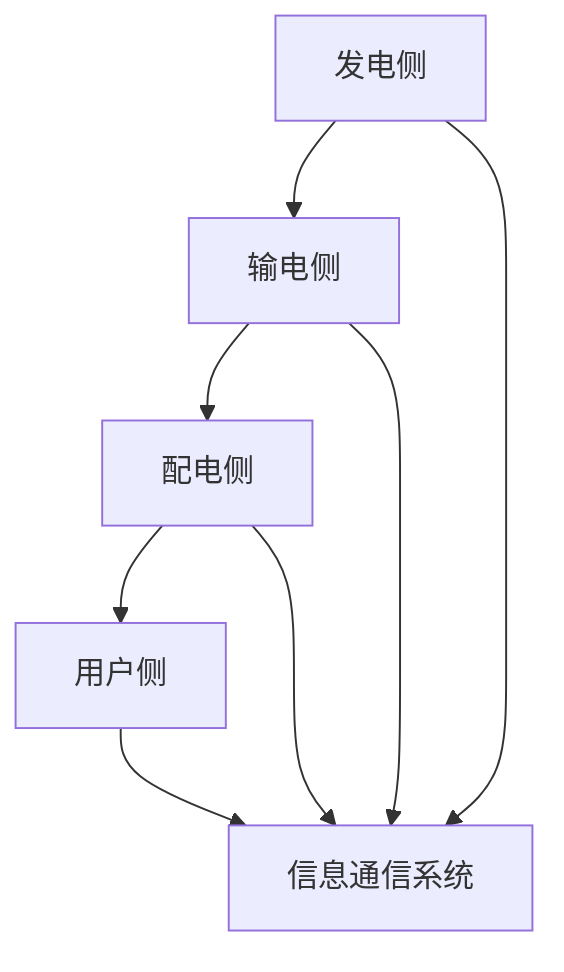
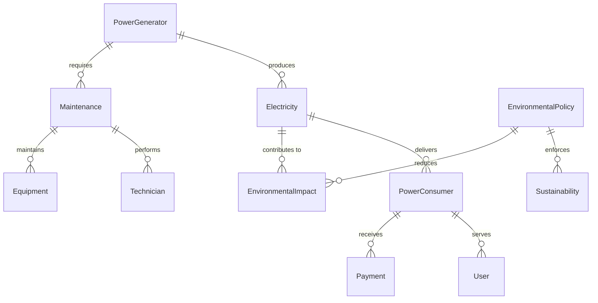
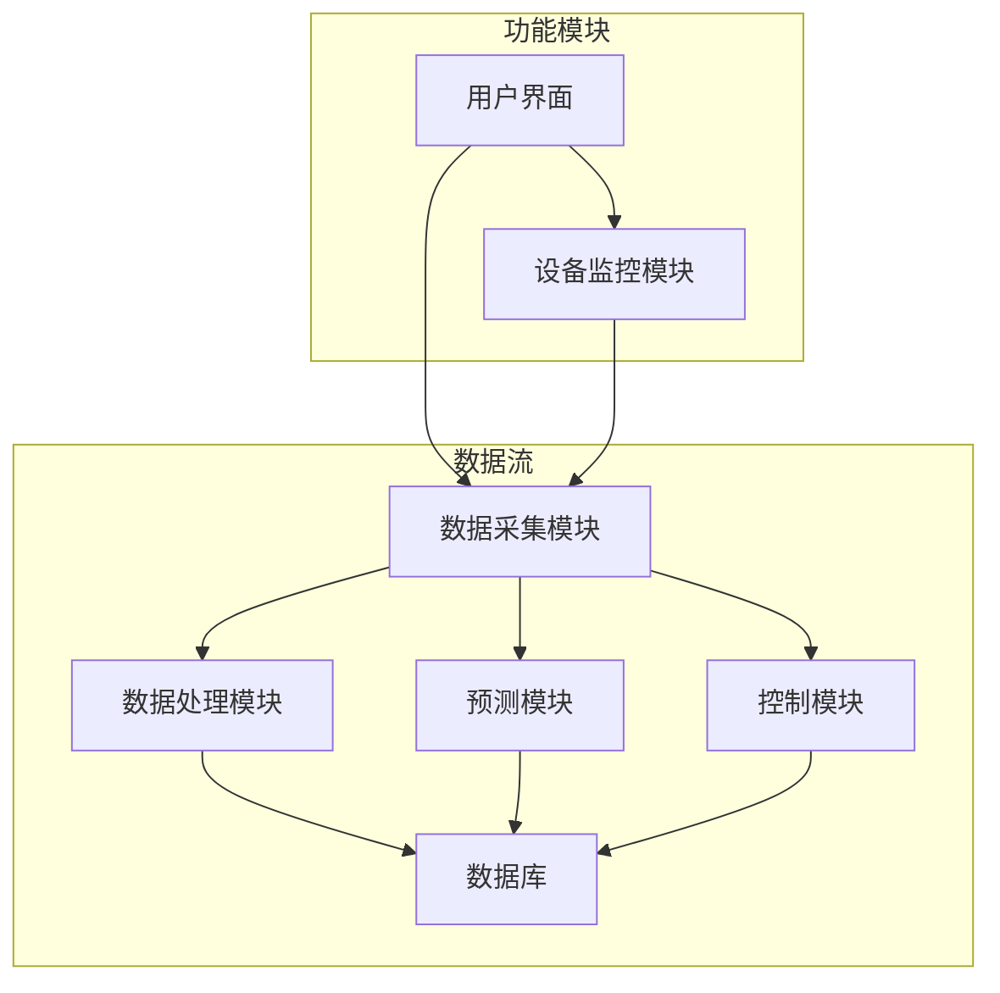
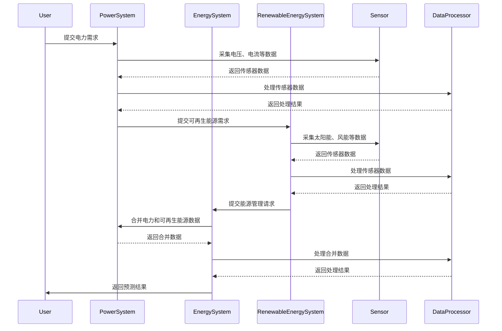

                 

### 1.1 问题背景

随着全球经济的不断发展和人们对生活质量的追求，能源需求持续上升，传统电网系统已经无法满足现代社会的需求。能源管理成为了现代社会面临的一个重要挑战。能源管理不仅涉及到能源的生产、传输、分配和消费，还涵盖了能源效率的提升和能源资源的优化配置。在这个背景下，人工智能（AI）作为一种颠覆性的技术，逐渐成为解决能源管理问题的重要手段。

智能电网作为现代能源管理的关键基础设施，旨在通过信息化和智能化技术，实现能源的高效利用和可持续发展。智能电网不仅能够实时监测电网运行状态，预测电力需求，还能自动调整电力供应，优化电网运行。在这个过程中，人工智能技术发挥着至关重要的作用。

首先，人工智能技术可以通过大数据分析，预测电力需求和供应，优化电力调度，减少能源浪费。例如，利用机器学习算法分析历史电力数据，可以准确预测未来的电力需求，从而调整电力生产和供应计划，避免供需失衡。

其次，人工智能技术可以帮助实现智能电网的自动化运行。通过人工智能算法，可以自动化地处理电力故障，快速响应电力故障，减少停电时间，提高电网的稳定性和可靠性。

此外，人工智能技术还可以促进可再生能源的集成和管理。例如，通过人工智能算法，可以优化风能和太阳能的发电，提高可再生能源的利用效率，实现能源的可持续利用。

总的来说，人工智能在能源管理中的应用，不仅可以提高能源利用效率，降低能源成本，还可以促进能源的可持续发展。智能电网作为人工智能在能源管理中的重要应用场景，其发展和应用已经成为推动能源革命的关键因素。

### 1.2 问题描述

当前，全球能源管理面临诸多挑战，这些问题不仅影响能源的供应稳定性，还制约了能源的高效利用和可持续发展。以下是几个主要的挑战：

首先，能源需求的不稳定性是当前能源管理面临的一个重大问题。随着全球经济的快速发展，人们对电力、燃气等能源的需求不断增加，这种需求的不稳定性给能源管理带来了很大的挑战。例如，在电力需求高峰时段，如何确保电力供应的稳定性，避免电力短缺和停电事故，是能源管理人员必须解决的重要问题。

其次，能源供应的多样性和复杂性也是一大挑战。现代社会对能源的需求不仅包括传统的化石能源，还涉及到越来越多的可再生能源，如风能、太阳能等。这些能源的供应方式和特性各不相同，如何有效地整合和管理这些多样化的能源资源，提高能源系统的整体效率和稳定性，是当前能源管理亟待解决的问题。

再者，能源浪费问题依然严重。尽管各种节能技术和措施已经被广泛应用，但能源浪费现象仍然普遍存在。例如，在电力传输过程中，由于电线老化、损耗等因素，会造成大量的能源浪费。此外，在家庭和企业用电中，也存在许多不合理的用电行为，如电器长时间待机、使用高能耗设备等，这些都会导致不必要的能源浪费。

此外，能源管理的信息化水平亟待提升。传统的能源管理系统主要依赖于人工监测和手动操作，这种方式不仅效率低下，而且容易出错。随着信息技术的快速发展，智能化、自动化的能源管理系统已经逐渐成为趋势。然而，如何利用大数据、人工智能等先进技术，提升能源管理的信息化水平，仍然是一个需要深入研究和解决的问题。

最后，环境保护和可持续发展要求越来越高。随着全球气候变化的加剧，环境保护和可持续发展已经成为全球各国政府和社会公众关注的焦点。在能源管理中，如何减少碳排放，提高能源利用效率，实现能源的可持续利用，是能源管理必须面对的重要课题。

综上所述，当前能源管理面临的需求不稳定、供应多样、能源浪费、信息化水平低和环境保护等多重挑战。解决这些问题，需要借助人工智能技术，实现能源管理的智能化、自动化和高效化，从而推动能源革命，实现能源的可持续发展。

### 1.3 问题解决

为了应对上述能源管理中面临的挑战，人工智能技术的应用显得尤为重要。通过人工智能，可以大幅提升能源管理的智能化水平，实现能源的高效利用和可持续发展。以下是人工智能在解决能源管理问题中的几个关键方面：

首先，人工智能可以通过大数据分析和预测，优化电力供需平衡。机器学习算法能够分析历史电力数据，识别出电力需求的规律和趋势，从而预测未来的电力需求。根据这些预测结果，能源管理系统能够提前调整电力生产和供应计划，避免供需失衡和电力短缺现象。例如，通过深度学习算法，可以对负荷数据进行实时监控和分析，预测电力需求，优化调度策略，从而提高电力供应的稳定性。

其次，人工智能技术能够实现智能电网的自动化运行，提高电网的稳定性和可靠性。自动化系统可以利用人工智能算法，实时监测电网的运行状态，快速响应电力故障，减少停电时间。例如，通过强化学习算法，能够自动检测电网中的异常情况，并自动执行修复操作，提高电网的自愈能力。此外，人工智能技术还能够优化电力网络的运行策略，减少能源损耗，提高电网的整体效率。

再者，人工智能有助于促进可再生能源的集成和管理。通过智能电网和人工智能技术，可以实现对风能、太阳能等可再生能源的高效管理。例如，利用人工智能算法，可以优化风能和太阳能的发电调度，根据实时天气和电力需求，动态调整发电量，提高可再生能源的利用效率。此外，人工智能技术还可以预测可再生能源的发电量，帮助能源管理系统能够更好地应对可再生能源的不确定性和波动性。

此外，人工智能技术在能源管理信息化水平的提升中也发挥着重要作用。通过大数据、物联网和云计算等技术的结合，人工智能能够构建智能化、自动化的能源管理系统。例如，利用物联网技术，可以实时采集电网运行数据，通过大数据分析，为能源管理提供决策支持。同时，通过人工智能算法，可以自动优化电力网络的运行策略，提高能源管理系统的智能化水平。

最后，人工智能在环境保护和可持续发展中的贡献也显而易见。通过优化能源利用，减少碳排放，人工智能有助于实现能源的可持续发展。例如，利用机器学习算法，可以优化工业生产过程中的能源使用，降低能源消耗和碳排放。此外，人工智能还可以帮助实现能源的精细化管理，减少能源浪费，推动绿色能源的发展和普及。

综上所述，人工智能技术在解决能源管理中的问题方面具有巨大潜力。通过大数据分析、自动化运行、可再生能源管理、信息化提升和环境保护等多方面的应用，人工智能为能源管理带来了革命性的变化，推动了能源革命和可持续发展。

### 1.4 边界与外延

在讨论人工智能在能源管理中的应用时，有必要明确其边界与外延。首先，人工智能在能源管理中的边界主要涵盖以下几个方面：

1. **技术范畴**：人工智能在能源管理中的应用主要依赖于机器学习、深度学习、优化算法等技术，这些技术能够对大量数据进行处理和分析，从而实现智能预测、优化决策和自动化控制。

2. **应用领域**：人工智能在能源管理中的应用领域包括电力系统、燃气系统、水力系统等，特别是智能电网的建设和运营，以及能源生产、传输、分配和消费的全过程管理。

3. **管理层次**：从管理层次来看，人工智能在能源管理中的应用涵盖了从宏观层面的能源政策制定、市场调控，到微观层面的设备运行优化、故障预测和实时控制。

接下来，我们探讨人工智能在能源管理中的外延：

1. **扩展应用**：人工智能不仅能够提升能源系统的效率和管理水平，还可以扩展到更广泛的领域，如智能建筑、智能交通、智能制造等，这些领域都与能源管理密切相关。

2. **交叉领域**：人工智能在能源管理中的应用还涉及到多个学科和领域的交叉，如数据科学、系统工程、环境科学等。通过这些跨学科的融合，可以进一步拓展人工智能在能源管理中的应用场景和深度。

3. **未来趋势**：随着人工智能技术的不断进步和普及，其在能源管理中的应用也将不断拓展。例如，量子计算、边缘计算等新兴技术有望为人工智能在能源管理中的应用带来更多创新和突破。

总之，人工智能在能源管理中的应用具有明确的边界和广阔的外延。通过深入研究和应用，可以进一步发挥人工智能在能源革命和可持续发展中的关键作用。

### 1.5 概念结构与核心要素组成

在探讨人工智能在能源管理中的应用时，首先需要明确几个关键概念，这些概念是理解智能电网与可持续发展关系的基础。以下是这些核心概念的详细介绍及其相互之间的联系：

1. **人工智能（AI）**：
   人工智能是指由人制造出来的系统能够执行通常需要人类智能才能完成的任务，如视觉识别、语音识别、决策制定等。在能源管理中，人工智能通过机器学习、深度学习和优化算法等技术，实现对大规模数据的处理和分析，从而优化能源配置、预测需求、自动化控制等。

2. **智能电网（Smart Grid）**：
   智能电网是一种通过先进的信息通信技术、自动控制技术和电力电子技术，实现对电力系统进行高效管理和优化运行的新型电力网络。智能电网的核心在于其智能化、自动化和互动性，能够实时监测电网状态，优化能源供应和分配，提高电网的稳定性和可靠性。

3. **能源管理（Energy Management）**：
   能源管理是指对能源的生产、传输、分配和消费过程进行系统性的管理和优化，以实现能源的高效利用和可持续发展。在能源管理中，人工智能技术可以帮助实现数据的实时采集、分析和预测，优化能源调度和管理策略，提高能源利用效率。

4. **可持续发展（Sustainable Development）**：
   可持续发展是指在满足当前需求的同时，不损害子孙后代满足其需求的能力。在能源管理领域，可持续发展强调在能源利用过程中减少环境影响，提高能源利用效率，推广清洁能源，实现能源的长期稳定供应。

这些概念之间的联系如下：

- **人工智能与智能电网**：人工智能技术是智能电网的技术核心，通过机器学习和优化算法，实现对智能电网的数据分析和决策支持，提高电网的运行效率和可靠性。

- **智能电网与能源管理**：智能电网是能源管理的重要组成部分，通过智能电网技术，可以实现能源的高效管理和优化配置，从而提升整个能源系统的运行效率。

- **能源管理可持续发展**：能源管理是实现可持续发展的关键途径之一，通过优化能源配置、推广清洁能源和减少能源浪费，可以促进能源的可持续发展。

- **人工智能与可持续发展**：人工智能技术可以在能源管理中发挥重要作用，通过智能分析和优化，减少能源消耗和碳排放，推动可持续发展的实现。

总之，人工智能、智能电网、能源管理和可持续发展是相互联系、相互促进的核心概念。在能源管理中，通过人工智能技术推动智能电网建设，实现能源的高效管理和优化配置，进而促进能源的可持续发展，是当前和未来能源管理的重要方向。

### 第1章 引言

#### 1.1 问题背景

随着全球经济的快速发展，人们对能源的需求不断增长。传统的能源管理方式已经难以满足现代社会的需求，能源供应的不稳定性和能源浪费问题日益突出。为了应对这些挑战，迫切需要一种能够实现能源高效利用和可持续发展的新型能源管理方法。人工智能（AI）作为一种颠覆性的技术，在这一背景下应运而生，成为推动能源管理变革的重要力量。

智能电网是现代能源管理的重要组成部分，它通过先进的信息通信技术和自动化控制系统，实现了对电力系统的实时监测、调度和优化管理。智能电网不仅提高了电力供应的稳定性和可靠性，还大幅提升了能源利用效率。然而，智能电网的建设和运营过程中，仍然面临着数据量庞大、系统复杂性高、实时性要求强等挑战。这些问题亟需人工智能技术的支持和应用。

人工智能在能源管理中的应用主要包括以下几个方面：

1. **数据分析和预测**：通过机器学习和深度学习算法，人工智能可以对大量能源数据进行实时分析和处理，预测电力需求和供应情况，优化能源调度和管理策略，避免供需失衡和能源浪费。

2. **自动化控制和故障预测**：利用人工智能技术，可以实现电力系统的自动化控制和故障预测。通过实时监测电网状态，自动化系统可以迅速识别和处理异常情况，提高电网的稳定性和可靠性。

3. **可再生能源管理**：人工智能技术在可再生能源（如风能、太阳能等）的管理中也发挥着重要作用。通过智能调度和优化，可以最大化可再生能源的利用效率，减少对传统化石能源的依赖。

4. **能源效率优化**：人工智能可以帮助识别和优化能源系统中的瓶颈和浪费环节，通过优化能源生产和消费过程，实现能源的高效利用。

#### 1.2 问题描述

当前，能源管理面临的主要问题包括：

1. **能源需求不稳定**：随着全球经济的波动和人们生活方式的变化，能源需求表现出较大的不稳定性。如何确保在高峰期有足够的电力供应，避免供需失衡和电力短缺，是能源管理中的一大难题。

2. **能源供应多样性和复杂性**：现代能源供应不再局限于传统的化石能源，可再生能源的比重逐渐增加。不同类型的能源在供应特性、管理和调度方面存在较大差异，如何有效整合和管理这些多样化的能源资源，是能源管理中的一大挑战。

3. **能源浪费问题**：尽管已有多种节能技术和措施被广泛应用，但能源浪费现象仍然普遍存在。例如，在电力传输过程中，由于电线老化、损耗等因素，会造成大量的能源浪费。此外，家庭和企业用电中，也存在许多不合理的用电行为，导致不必要的能源浪费。

4. **能源信息化水平低**：传统的能源管理系统主要依赖于人工监测和手动操作，效率低下且容易出错。在信息技术飞速发展的今天，如何提升能源管理的信息化水平，实现数据的实时采集、分析和优化，是能源管理中亟待解决的问题。

5. **环境保护和可持续发展**：随着全球气候变化的加剧，环境保护和可持续发展已经成为全球各国政府和社会公众关注的焦点。在能源管理中，如何减少碳排放、提高能源利用效率、实现能源的可持续利用，是能源管理必须面对的重要课题。

#### 1.3 问题解决

人工智能技术在能源管理中的应用，为解决上述问题提供了有力的手段：

1. **数据分析和预测**：利用机器学习和深度学习算法，人工智能可以对历史能源数据进行深入分析，识别出能源需求的规律和趋势。通过这些分析结果，能源管理系统能够提前预测未来的能源需求，优化电力生产和供应计划，避免供需失衡和电力短缺。

2. **自动化控制和故障预测**：通过人工智能技术，可以实现电力系统的自动化控制和故障预测。自动化系统可以实时监测电网的运行状态，快速识别和处理异常情况，减少停电时间和故障率，提高电网的稳定性和可靠性。

3. **可再生能源管理**：人工智能技术在可再生能源管理中的应用，可以帮助实现风能、太阳能等可再生能源的高效利用。通过智能调度和优化，可以最大化可再生能源的发电量，减少对传统化石能源的依赖，推动能源结构的优化。

4. **能源效率优化**：人工智能可以帮助识别和优化能源系统中的瓶颈和浪费环节。通过优化能源生产和消费过程，可以实现能源的高效利用，降低能源消耗和成本。

5. **能源信息化提升**：通过大数据、物联网和云计算等技术的结合，人工智能可以构建智能化、自动化的能源管理系统。实时采集和处理海量数据，为能源管理提供精准的决策支持，提升能源管理的信息化水平。

总之，人工智能在能源管理中的应用，不仅能够解决当前的能源管理问题，还能推动能源革命和可持续发展。通过数据分析和预测、自动化控制和故障预测、可再生能源管理、能源效率优化和能源信息化提升，人工智能将为能源管理带来革命性的变革。

### 1.4 能源管理的现状与挑战

#### 1.4.1 能源管理现状

当前，能源管理在全球范围内已经取得了显著的进展。许多国家和地区已经建立了完善的能源管理体系，通过法规、政策和技术的结合，实现了能源的高效利用和优化配置。以下是一些主要方面的现状：

1. **能源监测与控制**：现代能源管理系统集成了先进的传感器技术和自动化控制系统，能够实时监测能源的供需状况，动态调整能源供应策略，提高能源利用率。

2. **能源计量与计费**：通过智能电表、燃气表等智能计量设备，能源消费数据可以被实时采集和传输，有助于实现精准的能源计量和计费。

3. **能源效率提升**：节能技术和措施在能源管理中得到了广泛应用，如建筑节能、工业节能、交通节能等。通过技术改造和优化管理，能源效率得到了显著提升。

4. **可再生能源集成**：随着全球对可再生能源的重视，太阳能、风能、水能等可再生能源在能源结构中的比重逐渐增加。能源管理系统能够对多种能源进行集成管理，优化能源供应结构。

5. **智能化与自动化**：大数据、物联网、云计算等新兴技术的应用，使得能源管理越来越智能化和自动化。智能电网的建设和推广，为能源管理提供了更高效、更可靠的解决方案。

#### 1.4.2 能源管理面临的挑战

尽管能源管理在许多方面取得了显著进展，但仍面临诸多挑战，这些问题制约了能源管理效率和可持续发展目标的实现。以下是当前能源管理面临的几个主要挑战：

1. **能源需求不确定性**：随着全球经济和人口的持续增长，能源需求表现出显著的不确定性。特别是在高峰时段，电力需求波动大，如何确保供需平衡，避免电力短缺和停电现象，是能源管理必须面对的问题。

2. **能源供应多样性**：现代能源供应日益多样化，除了传统的化石能源外，可再生能源（如风能、太阳能）的比重逐渐增加。不同类型的能源在供应特性、调度和管理方面存在较大差异，如何有效整合和管理这些多样化的能源资源，是能源管理的重要挑战。

3. **能源效率瓶颈**：尽管已有多种节能技术和措施被广泛应用，但在能源传输、分配和消费环节中，仍存在显著的能源效率瓶颈。例如，电力传输过程中由于电线老化、损耗等因素，会造成大量的能源浪费。如何在各个环节提高能源利用效率，是当前能源管理的关键问题。

4. **信息化水平不足**：传统的能源管理系统主要依赖于人工监测和手动操作，信息化水平较低，数据采集、分析和处理能力有限。在信息技术飞速发展的今天，如何提升能源管理的信息化水平，实现数据的实时采集、分析和优化，是能源管理亟需解决的问题。

5. **环境保护与可持续发展**：随着全球气候变化的加剧，环境保护和可持续发展已经成为全球各国政府和社会公众关注的焦点。在能源管理中，如何减少碳排放、提高能源利用效率、实现能源的可持续利用，是能源管理必须面对的重要课题。

#### 1.4.3 人工智能在能源管理中的应用

人工智能技术在解决上述挑战方面具有巨大潜力，其在能源管理中的应用主要体现在以下几个方面：

1. **数据分析和预测**：通过机器学习和深度学习算法，人工智能可以对海量能源数据进行实时分析和预测，准确预测电力需求和供应情况，优化能源调度和管理策略，避免供需失衡和电力短缺。

2. **自动化控制和故障预测**：人工智能技术可以实现电力系统的自动化控制和故障预测。通过实时监测电网状态，自动化系统可以迅速识别和处理异常情况，减少停电时间和故障率，提高电网的稳定性和可靠性。

3. **可再生能源管理**：人工智能技术在可再生能源管理中的应用，可以帮助实现风能、太阳能等可再生能源的高效利用。通过智能调度和优化，可以最大化可再生能源的发电量，减少对传统化石能源的依赖，推动能源结构的优化。

4. **能源效率优化**：人工智能可以帮助识别和优化能源系统中的瓶颈和浪费环节。通过优化能源生产和消费过程，可以实现能源的高效利用，降低能源消耗和成本。

5. **能源信息化提升**：通过大数据、物联网和云计算等技术的结合，人工智能可以构建智能化、自动化的能源管理系统。实时采集和处理海量数据，为能源管理提供精准的决策支持，提升能源管理的信息化水平。

总之，人工智能在能源管理中的应用，不仅能够解决当前能源管理面临的诸多挑战，还能推动能源革命和可持续发展。通过数据分析和预测、自动化控制和故障预测、可再生能源管理、能源效率优化和能源信息化提升，人工智能将为能源管理带来革命性的变革。

### 1.5 智能电网的基本概念

智能电网是一种先进的电力网络，通过整合信息技术、自动化控制和通信技术，实现电力系统的智能化管理和优化运行。智能电网的核心在于其智能化、自动化和互动性，能够实时监测电网运行状态，自动调整电力供应和需求，提高电网的稳定性和可靠性。以下是智能电网的几个基本概念及其定义：

#### 1.5.1 智能电网的定义

智能电网是一种通过先进的信息通信技术、自动化控制和电力电子技术，实现对电力系统进行高效管理和优化运行的新型电力网络。与传统电网相比，智能电网具有更高的灵活性、可靠性和可持续性，能够实现电力资源的高效配置和优化利用。

#### 1.5.2 智能电网的组成部分

智能电网由多个关键组成部分构成，包括：

1. **电力设备**：智能电网中的电力设备包括变电站、配电站、开关站、输电线路和配电线路等。这些设备通过先进的传感器和控制技术，实现实时监测、控制和保护。

2. **信息通信系统**：智能电网的信息通信系统是智能电网的大脑，包括数据采集、传输、处理和分析等环节。通过这些系统，可以实时收集电网运行数据，进行实时监控和分析，为决策提供支持。

3. **自动化控制系统**：自动化控制系统是智能电网的核心，通过自动化的控制策略，实现电力系统的优化调度、故障预测和处理。这些系统可以自动调整电力供应和需求，提高电网的稳定性和可靠性。

4. **用户侧设备**：用户侧设备包括智能电表、智能家庭终端、电动汽车充电设备等。这些设备可以通过信息通信系统与电网进行互动，实现能源的实时监测、管理和优化使用。

#### 1.5.3 智能电网的关键技术

智能电网的实现依赖于多种先进技术的支持，包括：

1. **传感器技术**：传感器技术用于实时监测电网设备的运行状态，如电压、电流、温度、湿度等参数。这些传感器数据为电网的自动化控制和优化管理提供了基础。

2. **通信技术**：智能电网的通信技术包括有线和无线通信手段，如光纤通信、无线传感器网络等。这些通信技术实现了电网各节点之间的实时数据传输和信息共享。

3. **自动化控制技术**：自动化控制技术是智能电网的核心技术之一，通过自动化控制系统，实现电力系统的实时监控、调度和优化管理。这些系统可以自动识别和处理电网故障，确保电网的稳定运行。

4. **数据分析与优化技术**：通过大数据分析和优化技术，智能电网可以对海量数据进行分析和挖掘，识别出电力系统中的潜在问题和优化机会。这些技术可以用于电力调度、需求响应、电能质量监测等。

5. **分布式能源管理技术**：分布式能源管理技术用于管理分布式能源（如太阳能、风能、储能设备等）的接入和运行。通过这些技术，可以实现对分布式能源的高效管理和优化调度，提高电网的灵活性和可靠性。

#### 1.5.4 智能电网的特点

智能电网具有以下几个显著特点：

1. **智能化**：智能电网通过先进的信息技术和自动化控制技术，实现了电力系统的智能化管理和优化运行。能够实时监测电网状态，自动调整电力供应和需求，提高电网的稳定性和可靠性。

2. **互动性**：智能电网能够与电网各节点（如发电侧、负荷侧、用户侧等）进行实时互动，实现信息的共享和协同工作。通过用户侧设备的接入，用户可以实时了解自己的用电情况，调整用电行为，实现能源的优化使用。

3. **灵活性**：智能电网具有高度的灵活性，能够快速适应电力需求和供应的变化。通过自动化控制和优化调度，智能电网可以快速响应电力故障和异常情况，确保电网的稳定运行。

4. **可持续性**：智能电网通过推广清洁能源和高效能源利用技术，减少碳排放和能源消耗，实现能源的可持续利用。智能电网还可以通过需求响应和储能技术，优化能源结构，提高能源利用效率。

总之，智能电网作为一种先进的电力网络，通过整合信息技术、自动化控制和通信技术，实现了电力系统的智能化管理和优化运行。其智能化、互动性、灵活性和可持续性的特点，为现代能源管理提供了强有力的支持，推动了能源革命和可持续发展。

### 1.6 智能电网的架构

智能电网的架构设计是确保其高效运行和灵活管理的关键。智能电网的架构可以分为以下几个主要层次：发电侧、输电侧、配电侧和用户侧。每个层次都有其独特的功能和关键技术，共同构成了一个智能、高效和可靠的电力系统。以下是智能电网各层次的详细说明：

#### 1.6.1 发电侧

发电侧是智能电网的起点，负责电力生产。发电方式包括传统化石燃料发电、核能发电、可再生能源发电（如风能、太阳能等）和储能系统。发电侧的关键技术包括：

1. **发电设备自动化控制**：通过自动化控制系统，实现对发电设备的实时监控和优化调度，提高发电效率。

2. **分布式发电管理**：分布式发电系统（如家庭光伏发电、小型风力发电等）的接入和管理，实现多种发电方式的协同优化。

3. **储能系统**：储能技术用于调节电力供需平衡，提高电网的灵活性和稳定性。储能系统可以是物理储能（如蓄电池）或虚拟储能（如需求响应）。

#### 1.6.2 输电侧

输电侧是智能电网的核心环节，负责电力从发电站到配电站的传输。输电侧的关键技术包括：

1. **输电线路监控**：利用传感器技术，实现对输电线路的实时监控，监测电压、电流、温度等参数，确保输电安全。

2. **变压器监控与保护**：通过自动化控制和保护系统，实时监测变压器运行状态，快速响应故障，保障输电系统的稳定性。

3. **超高压输电技术**：超高压输电技术能够有效降低电力传输损耗，提高电力传输效率。

#### 1.6.3 配电侧

配电侧是智能电网的末端，负责电力从配电站到用户的传输和分配。配电侧的关键技术包括：

1. **配电自动化**：通过自动化控制系统，实现配电设备的远程监控和控制，提高配电效率。

2. **馈线自动化**：实现配电线路的实时监控和故障处理，快速隔离故障点，减少停电时间。

3. **智能电表**：智能电表能够实时采集用户的用电数据，为需求响应和电力调度提供数据支持。

#### 1.6.4 用户侧

用户侧是智能电网的终端，包括家庭、商业和工业用户。用户侧的关键技术包括：

1. **需求响应**：通过需求响应技术，引导用户根据电网需求调整用电行为，优化电力供需平衡。

2. **智能家庭设备**：智能家庭设备（如智能空调、热水器、冰箱等）可以通过物联网技术与电网进行互动，实现能源的优化使用。

3. **电动汽车充电设施**：电动汽车充电设施可以通过智能电网进行实时监控和管理，优化充电过程，减少充电需求峰值。

#### 1.6.5 信息通信系统

信息通信系统是智能电网的大脑，负责数据采集、传输、处理和分析。其关键技术包括：

1. **数据采集与传输**：通过传感器和通信技术，实时采集电网各节点的运行数据，确保数据的高效传输。

2. **数据处理与分析**：通过大数据和人工智能技术，对采集到的数据进行分析和挖掘，为电力调度和故障处理提供决策支持。

3. **信息共享与协同**：通过信息通信系统，实现电网各节点的信息共享和协同工作，提高电网的智能化水平。

#### 1.6.6 智能电网的架构图

以下是一个简化的智能电网架构图：



在这个架构图中，发电侧、输电侧、配电侧和用户侧通过信息通信系统进行连接，形成一个高效、智能和可靠的电力网络。通过这种架构设计，智能电网能够实现电力资源的高效配置和优化利用，满足不断增长的电力需求，推动能源革命和可持续发展。

### 1.7 智能电网的关键技术

智能电网的建设离不开先进的技术支持，这些技术使得电网在智能化、自动化和高效管理方面得到了极大的提升。以下是智能电网的几项关键技术：

#### 1.7.1 传感器技术

传感器技术是智能电网的基础，用于实时监测电网的运行状态。传感器能够测量电压、电流、功率因数、温度、湿度等多种参数，通过将这些参数实时传输到中央控制系统，电网管理人员可以实时掌握电网的运行情况，及时发现和解决潜在问题。

- **传感器类型**：智能电网中常用的传感器包括温度传感器、湿度传感器、电压传感器、电流传感器、电磁传感器等。
- **传感器应用**：传感器技术广泛应用于输电线路、变压器、开关站等关键设备中，用于监测设备的运行状态，提供必要的数据支持。

#### 1.7.2 自动化控制技术

自动化控制技术是智能电网的核心，通过自动化控制系统，实现对电网的实时监控和优化调度。自动化控制系统可以根据电网的实时数据，自动调整电力供应和需求，提高电网的稳定性和可靠性。

- **自动化控制策略**：常见的自动化控制策略包括实时调度、故障处理、电压稳定控制、无功优化等。
- **自动化控制应用**：自动化控制技术被广泛应用于电力系统的各个环节，如变电站的自动化控制、配电自动化、需求响应等。

#### 1.7.3 通信技术

通信技术是智能电网的纽带，确保了电网各节点之间的信息传输和共享。智能电网中的通信技术包括有线通信和无线通信，如光纤通信、无线传感器网络（WSN）等。

- **通信协议**：常用的通信协议包括TCP/IP、CAN总线、Modbus、DNP3等。
- **通信应用**：通信技术在智能电网中的应用包括数据采集与传输、远程监控、数据分析和决策支持等。

#### 1.7.4 数据分析技术

数据分析技术是智能电网的智慧大脑，通过大数据和人工智能技术，对电网产生的海量数据进行深度分析和挖掘，为电网的优化管理和决策提供支持。

- **数据分析工具**：常用的数据分析工具包括Hadoop、Spark、TensorFlow等。
- **数据分析应用**：数据分析技术在智能电网中的应用包括电力需求预测、电力负荷分析、电能质量监测等。

#### 1.7.5 需求响应技术

需求响应技术通过引导用户根据电网的需求调整用电行为，实现电力供需平衡。需求响应技术可以减少电网的负荷峰值，提高电网的灵活性和可靠性。

- **需求响应机制**：常见的需求响应机制包括价格信号、时间信号、信号激励等。
- **需求响应应用**：需求响应技术在电力系统的峰谷调节、应急响应、分布式能源管理等方面有着广泛的应用。

#### 1.7.6 储能技术

储能技术是智能电网的重要组成部分，用于调节电力供需平衡，提高电网的稳定性和可靠性。储能技术包括物理储能（如蓄电池、飞轮储能）和虚拟储能（如需求响应、电能质量管理）。

- **储能技术类型**：常见的储能技术包括锂离子电池、钠硫电池、铅酸电池等。
- **储能技术应用**：储能技术在电力系统中的应用包括峰值削峰、谷峰填谷、电能质量改善等。

#### 1.7.7 分布式能源管理系统

分布式能源管理系统（DERMS）用于管理和优化分布式能源的接入和运行。分布式能源管理系统可以实现对太阳能、风能、小型燃气轮机等多种分布式能源的实时监控和优化调度，提高电网的灵活性和可靠性。

- **DERMS功能**：DERMS的主要功能包括分布式能源的接入管理、实时监测、能量管理、电力市场参与等。
- **DERMS应用**：DERMS在智能电网中的应用包括分布式能源的高效管理、电能质量改善、需求响应等。

通过这些关键技术的应用，智能电网能够实现更加高效、稳定和可靠的电力供应，满足现代社会对电力需求的不断增长。同时，这些技术也为实现能源的可持续发展提供了强有力的支持。

### 1.8 可持续发展的原则与目标

可持续发展是一个涉及经济、社会和环境的综合概念，旨在满足当前需求的同时，不损害后代满足其需求的能力。在能源管理领域，可持续发展尤为重要，它不仅关系到能源的长期稳定供应，还关乎环境保护和资源的可持续利用。以下是可持续发展的定义、原则和目标：

#### 1.8.1 可持续发展的定义

可持续发展是指在不损害环境、不浪费资源的前提下，满足当前社会经济需求的发展模式。它强调在经济发展的同时，要保护自然资源，减少环境污染，实现社会、经济和环境的协调发展。在能源管理中，可持续发展关注能源的高效利用和清洁生产，减少碳排放和能源消耗，推动能源结构的优化。

#### 1.8.2 可持续发展的原则

1. **公平性**：可持续发展要求资源分配公平，确保所有人都能享受到能源供应的基本权利，减少贫富差距，促进社会公平。

2. **持续性**：可持续发展强调资源利用的长期性和可持续性，确保资源不会因为短期开发而枯竭，生态系统能够持续提供必要的自然服务。

3. **共同性**：可持续发展是一个全球性的问题，各国需要共同承担责任，通过国际合作和协调，实现全球范围内的可持续发展目标。

4. **公平利用**：在能源利用方面，可持续发展要求能源的公平分配，确保所有人都能获得足够的能源，同时避免能源浪费。

5. **环境保护**：可持续发展强调环境保护的重要性，减少污染和生态破坏，保护生物多样性和生态系统的健康。

#### 1.8.3 可持续发展的目标

1. **提高能源利用效率**：通过技术改进和管理优化，提高能源利用效率，减少能源浪费，降低能源成本。

2. **推广可再生能源**：减少对化石能源的依赖，增加可再生能源（如风能、太阳能、水能等）的比重，实现能源结构的优化。

3. **减少碳排放**：通过提高能源利用效率和推广清洁能源，减少碳排放，降低对环境的影响，应对气候变化。

4. **改善生活质量**：通过能源的高效利用和可持续发展，提高人们的生活质量，实现经济、社会和环境的协调发展。

5. **促进技术创新**：推动能源领域的技术创新，开发和应用新技术、新材料、新工艺，提高能源利用效率，推动可持续发展。

6. **加强国际合作**：在全球范围内加强能源领域的合作，共享技术和经验，共同应对能源和环境挑战。

总之，可持续发展在能源管理中具有非常重要的意义。通过遵循可持续发展的原则和实现其目标，可以促进能源的高效利用和清洁生产，实现经济、社会和环境的协调发展，为人类的未来创造一个更加美好、可持续的能源未来。

### 1.9 可持续发展与能源管理的关系

可持续发展与能源管理之间的关系密不可分，两者相互促进、相辅相成。可持续发展的目标在于确保资源的高效利用和生态环境的保护，而能源管理则是实现这一目标的重要手段。以下是可持续发展与能源管理之间的具体联系：

#### 1.9.1 能源管理是实现可持续发展的重要手段

能源管理通过对能源生产、传输、分配和消费的全过程进行系统管理和优化，能够提高能源利用效率，减少能源浪费，降低对环境的影响。例如，通过智能化管理技术，可以实现电力系统的实时监测和优化调度，减少能源损耗；通过节能技术改造，可以降低工业和建筑领域的能源消耗，提高能源利用效率。

#### 1.9.2 可持续发展目标推动能源管理的发展

可持续发展的目标，如提高能源利用效率、减少碳排放、推广可再生能源等，为能源管理提供了明确的方向和目标。这些目标的实现，需要依靠先进的技术和管理方法，推动能源管理不断向智能化、自动化和高效化的方向发展。例如，为了实现可再生能源的大规模应用，需要通过智能化技术进行高效调度和管理，优化可再生能源的利用。

#### 1.9.3 能源管理促进可持续发展的实现

通过有效的能源管理，可以促进可持续发展目标的实现。例如，通过提高能源利用效率，可以减少能源消耗和碳排放，降低对环境的影响；通过推广可再生能源，可以减少对化石能源的依赖，提高能源的可持续性。此外，能源管理还可以帮助实现资源的高效配置和优化利用，为经济发展提供持续的动力。

#### 1.9.4 可持续发展理念指导能源管理创新

可持续发展的理念，如生态保护、资源节约和公平利用等，为能源管理提供了指导思想。这些理念促使能源管理在技术创新和管理方法上不断进行创新，推动能源管理向更加绿色、环保和可持续的方向发展。例如，在能源管理中推广智能电网技术，可以实现能源的高效利用和清洁生产，符合可持续发展的要求。

#### 1.9.5 能源管理和可持续发展相互促进

能源管理的发展，为可持续发展的实现提供了强有力的支持。通过先进的能源管理技术，可以实现能源的高效利用和清洁生产，减少对环境的影响，促进生态保护。同时，可持续发展的实现，也为能源管理提供了更加广阔的应用场景和市场需求，推动能源管理不断创新和进步。

总之，可持续发展与能源管理之间存在着紧密的联系和互动关系。通过有效的能源管理，可以推动可持续发展的实现，同时，可持续发展的目标也为能源管理提供了明确的方向和动力。两者相互促进、相辅相成，共同推动能源管理向更加高效、绿色和可持续的方向发展。

### 1.10 人工智能技术概述

人工智能（AI）是一种通过模拟人类智能行为的技术，旨在使计算机具备自主学习和决策能力。其核心目标是实现机器的智能，使其能够执行复杂的任务，包括图像识别、自然语言处理、决策制定和问题解决等。在能源管理领域，人工智能技术正逐渐成为提高能源利用效率、实现智能化管理和优化决策的重要工具。

#### 1.10.1 人工智能的定义

人工智能是指由人制造出来的系统，能够执行通常需要人类智能才能完成的任务，如视觉识别、语音识别、决策制定、自然语言理解和问题解决等。其核心在于模拟人类大脑的工作原理，通过算法和数据驱动，实现自主学习和智能决策。

#### 1.10.2 人工智能的分类

1. **基于规则的系统**：这类系统通过预定义的规则进行决策，适用于规则明确、问题简单的情况。例如，专家系统通过规则库来模拟专家的决策过程。

2. **机器学习**：机器学习是一种通过算法从数据中学习规律和模式的技术，包括监督学习、无监督学习和强化学习等。监督学习通过标注数据训练模型，无监督学习通过未标注数据发现模式，强化学习通过奖励机制进行优化。

3. **深度学习**：深度学习是机器学习的一种形式，通过构建深层次的神经网络模型，实现对复杂数据的自动特征提取和模式识别。常见的深度学习模型包括卷积神经网络（CNN）、循环神经网络（RNN）和生成对抗网络（GAN）等。

4. **自然语言处理**：自然语言处理（NLP）是人工智能的一个分支，旨在使计算机能够理解和生成人类语言。NLP技术包括文本分类、情感分析、机器翻译和语音识别等。

5. **计算机视觉**：计算机视觉是人工智能的一个重要领域，通过图像处理和机器学习技术，使计算机能够理解、解释和操作图像信息。

#### 1.10.3 人工智能在能源管理中的应用

1. **数据分析和预测**：通过机器学习和深度学习技术，人工智能可以对大量的历史能源数据进行处理和分析，识别出能源需求的规律和趋势，预测未来的电力需求，优化电力调度和管理策略。

2. **自动化控制和故障预测**：利用人工智能技术，可以实现对电力系统的实时监控和自动化控制，快速响应电力故障，减少停电时间。例如，通过深度学习模型，可以实现对电网故障的自动检测和诊断。

3. **可再生能源管理**：人工智能技术在可再生能源（如风能、太阳能等）的管理中也发挥着重要作用。通过智能调度和优化，可以提高可再生能源的发电效率和利用率。

4. **能源效率优化**：人工智能可以帮助识别和优化能源系统中的瓶颈和浪费环节，通过优化能源生产和消费过程，提高能源利用效率，降低能源消耗和成本。

5. **需求响应**：人工智能技术可以分析用户的用电行为，引导用户调整用电模式，实现电力需求侧管理，优化电力供需平衡。

6. **智能电网管理**：通过人工智能技术，可以实现对智能电网的实时监测、调度和优化，提高电网的稳定性和可靠性，实现能源的高效利用。

总之，人工智能技术在能源管理中的应用，不仅能够提高能源利用效率，优化能源配置，还能促进可再生能源的发展，推动能源革命和可持续发展。随着人工智能技术的不断进步，其在能源管理领域的应用将更加广泛和深入。

### 1.11 人工智能在智能电网中的应用

智能电网作为能源管理的关键基础设施，其建设与优化离不开人工智能技术的支持。以下是人工智能在智能电网中的具体应用场景：

#### 1.11.1 实时监测与数据分析

智能电网通过部署大量的传感器和智能设备，实时采集电网运行状态的数据。人工智能技术可以对这些海量数据进行实时分析，识别出潜在的问题和异常情况。例如，通过机器学习算法，可以对电压、电流、频率等参数进行实时监测，预测电力系统的运行状态，及时发现和预警潜在的故障点。

- **实时数据分析**：利用深度学习和大数据分析技术，智能电网可以对实时数据进行高效处理，提取有用的信息，为电力调度和故障预测提供数据支持。

- **案例**：在电网高峰期，通过实时数据分析和预测，智能电网可以提前调整发电和输电计划，确保电力供应的稳定和可靠。

#### 1.11.2 自动化控制与故障处理

自动化控制是智能电网的核心技术之一。人工智能技术可以帮助实现电力系统的自动化控制，提高电网的运行效率和可靠性。通过强化学习等算法，智能电网可以自主学习和优化控制策略，实现对电力系统的自适应调节。

- **自动化控制**：利用人工智能算法，智能电网可以实现自动调节电力供应，优化电网运行。例如，通过自动化控制系统，可以实时调整电力分配，确保电网的电压稳定。

- **故障处理**：在电力故障发生时，人工智能技术可以帮助自动检测和诊断故障，快速隔离故障点，减少停电时间。例如，通过深度学习模型，可以自动识别电网故障的类型和位置，并提出相应的修复方案。

- **案例**：在电网发生短路或设备故障时，智能电网可以通过自动化控制系统迅速定位故障点，并在几分钟内自动修复，减少停电时间。

#### 1.11.3 可再生能源管理

智能电网中的可再生能源（如风能、太阳能等）具有不稳定性和波动性的特点，如何高效管理这些能源是电网面临的一个重要挑战。人工智能技术在可再生能源管理中发挥着重要作用，通过智能调度和优化，可以提高可再生能源的利用率。

- **智能调度**：利用人工智能算法，智能电网可以实时监控可再生能源的发电情况，动态调整发电计划，确保电网的供需平衡。

- **案例**：在风能和太阳能发电高峰期，通过人工智能算法的智能调度，可以最大化可再生能源的发电量，减少对传统化石能源的依赖。

#### 1.11.4 能源效率优化

人工智能技术可以帮助识别和优化能源系统中的浪费环节，通过优化能源生产和消费过程，提高能源利用效率。

- **能源效率优化**：通过机器学习算法，可以分析电力系统的运行数据，识别出能源浪费的环节，并提出优化建议。例如，通过优化电力传输路径，减少能源损耗。

- **案例**：在工业生产过程中，通过人工智能算法的优化，可以减少能源消耗，提高生产效率，降低生产成本。

#### 1.11.5 智能电网管理

人工智能技术可以提高智能电网的管理水平，实现电网的智能化运行。通过大数据分析和人工智能算法，智能电网可以实现对电网的全面监测和智能调度，提高电网的稳定性和可靠性。

- **智能管理**：利用人工智能技术，智能电网可以实现自诊断、自修复和自适应调节，提高电网的管理效率。例如，通过预测电力需求，智能电网可以提前调整发电计划，避免供需失衡。

- **案例**：在城市供电网络中，通过人工智能技术的智能管理，可以实现供电的稳定和可靠，减少停电事故的发生。

总之，人工智能技术在智能电网中的应用，不仅能够提高电网的运行效率和可靠性，还能促进可再生能源的发展，实现能源的高效利用和可持续发展。随着人工智能技术的不断进步，其在智能电网中的应用前景将更加广阔。

### 1.12 人工智能在可持续发展中的角色

人工智能在推动可持续发展方面发挥着至关重要的作用，特别是在能源管理领域，其应用不仅提高了能源利用效率，还促进了环境保护和资源节约。以下是人工智能在可持续发展中的几个关键角色：

#### 1.12.1 提高能源利用效率

人工智能技术通过优化能源生产和消费过程，显著提高了能源利用效率。例如，通过大数据分析和机器学习算法，智能电网可以实时监测电网运行状态，动态调整电力供应和需求，避免能源浪费。具体应用包括：

- **需求响应**：人工智能可以帮助识别用户用电高峰和低谷，引导用户调整用电行为，优化电力供需平衡，减少能源浪费。
- **设备优化**：通过分析设备运行数据，人工智能可以预测设备的故障和维修需求，提前进行维护，避免能源浪费。

#### 1.12.2 促进可再生能源发展

可再生能源（如太阳能、风能、水能等）具有不稳定性，如何高效管理和调度这些能源是能源管理的一大挑战。人工智能技术通过智能调度和优化，提高了可再生能源的利用效率。具体应用包括：

- **智能调度**：利用人工智能算法，智能电网可以实时监控可再生能源的发电情况，动态调整发电计划，确保电网的供需平衡。
- **能源预测**：人工智能可以帮助预测可再生能源的发电量，为能源管理提供决策支持，优化能源供应结构。

#### 1.12.3 减少碳排放

减少碳排放是可持续发展的重要目标之一。人工智能技术通过优化能源生产和消费，降低了碳排放。具体应用包括：

- **碳排放监测**：人工智能可以实时监测碳排放数据，识别出高碳排放源，提出减排策略。
- **碳交易市场**：人工智能可以帮助分析和预测碳交易市场的价格，优化企业的碳排放管理策略。

#### 1.12.4 促进环境保护

人工智能技术不仅有助于提高能源利用效率，还能在环境保护中发挥重要作用。例如：

- **环境监测**：人工智能可以实时监测空气、水质等环境指标，及时发现环境污染问题，采取措施进行治理。
- **资源回收**：通过人工智能技术，可以优化资源回收和处理过程，提高资源利用率，减少环境污染。

#### 1.12.5 促进可持续发展目标实现

人工智能技术通过提高能源利用效率、促进可再生能源发展、减少碳排放和促进环境保护，为可持续发展目标的实现提供了有力支持。具体应用包括：

- **可持续发展评估**：人工智能可以帮助评估可持续发展项目的环境影响和经济效益，优化项目设计和实施。
- **政策支持**：人工智能技术可以为政策制定提供数据支持和决策依据，推动可持续发展政策的有效实施。

总之，人工智能在可持续发展中的角色不可忽视。通过提高能源利用效率、促进可再生能源发展、减少碳排放和促进环境保护，人工智能为实现可持续发展目标提供了重要保障，推动了社会、经济和环境的协调发展。

### 第5章 人工智能与能源管理的关键概念

在探讨人工智能（AI）在能源管理中的应用时，理解以下几个关键概念至关重要。这些概念不仅构成了能源管理的核心，也决定了人工智能技术如何有效地应用于这一领域。以下是这些关键概念及其详细解释：

#### 5.1 人工智能

人工智能（AI）是指通过计算机模拟人类智能行为的技术，包括学习、推理、解决问题和自主决策等能力。在能源管理中，人工智能技术可以帮助实现数据分析和预测、自动化控制和故障预测、优化能源调度和管理策略等。

- **核心技术**：机器学习、深度学习、自然语言处理、计算机视觉等。
- **应用领域**：电力需求预测、电力调度、电力故障检测、智能电网管理等。

#### 5.2 能源管理

能源管理是指对能源的生产、传输、分配和消费过程进行系统性和优化性的管理，以实现能源的高效利用和可持续发展。能源管理的目标包括提高能源利用效率、降低能源成本、优化能源结构等。

- **管理内容**：能源规划、能源监测、能源审计、能源优化调度等。
- **应用领域**：电力、燃气、热力等能源系统的运行和管理。

#### 5.3 智能电网

智能电网是一种通过信息技术、自动化控制和电力电子技术实现的现代化电力网络。它能够实现电力系统的实时监测、自动化控制和优化管理，提高电网的稳定性和可靠性。

- **核心特点**：智能化、自动化、互动性、高效性。
- **应用领域**：电力传输、分配、消费等全过程管理。

#### 5.4 可持续发展

可持续发展是指在满足当前需求的同时，不损害后代满足其需求的能力。它涉及经济、社会和环境三个方面的平衡，旨在实现长期、稳定和健康的发展。

- **核心原则**：公平性、持续性、共同性、公平利用。
- **应用领域**：能源、水资源、生态环境等领域的管理和发展。

#### 5.5 概念属性特征对比表格

以下是一个关于人工智能、能源管理、智能电网和可持续发展的概念属性特征对比表格：

| 概念 | 定义 | 核心特征 | 应用领域 |
| --- | --- | --- | --- |
| 人工智能 | 通过计算机模拟人类智能行为的技术 | 学习、推理、自主决策 | 数据分析、自动化控制、智能电网管理 |
| 能源管理 | 对能源生产、传输、分配和消费过程进行优化管理 | 提高能源利用效率、降低成本、优化能源结构 | 电力、燃气、热力系统运行管理 |
| 智能电网 | 现代化的电力网络，通过信息技术实现智能化管理 | 智能化、自动化、互动性、高效性 | 电力传输、分配、消费 |
| 可持续发展 | 实现长期、稳定和健康的发展，满足当前与后代需求 | 公平性、持续性、共同性、公平利用 | 能源、水资源、生态环境 |

通过上述表格，我们可以更直观地理解这些关键概念之间的区别和联系，从而更好地把握人工智能在能源管理中的应用。

#### 5.6 ER实体关系图架构

在讨论人工智能与能源管理时，理解它们之间的实体关系对于构建有效的智能系统至关重要。实体-关系（ER）图是一种常用的数据库设计工具，用于描述系统中的实体及其关系。以下是智能电网与可持续发展中关键的实体及其关系的ER图描述：

#### 5.6.1 ER实体关系图的基本概念

ER实体关系图由实体、属性和关系三个基本概念组成：

- **实体**：系统中的基本对象，如用户、设备、能源等。
- **属性**：实体的特征或描述，如用户的姓名、设备的型号、能源的类型等。
- **关系**：实体之间的关联，如用户使用设备、设备产生能源等。

#### 5.6.2 ER实体关系图的绘制

以下是一个简化的智能电网与可持续发展的ER图，使用Mermaid语法绘制：

```mermaid
erDiagram
  User ||--o{ Equipment : "uses"
  Equipment ||--o{ Energy : "generates"
  Energy ||--o{ Sustainability : "contributes to"
  User ..|> EnvironmentalImpact : "influences"
  Sustainability ..|> EnvironmentalPolicy : "enforces"
  Equipment ..|> Maintenance : "requires"
  Maintenance ..|> Technician : "performs"
```

在这个ER图中：

- **User**（用户）是使用设备的实体。
- **Equipment**（设备）包括发电设备、用电设备等，可以产生和消耗能源。
- **Energy**（能源）是设备产生的能源类型，如电能、燃气等。
- **Sustainability**（可持续发展）是指能源使用对环境的影响和贡献。
- **EnvironmentalImpact**（环境影响）是用户和设备使用能源所产生的环境影响。
- **EnvironmentalPolicy**（环境政策）是用于约束和管理环境影响的政策。
- **Maintenance**（维护）是设备运行过程中需要的维护活动。
- **Technician**（技术人员）是执行设备维护的人员。

#### 5.6.3 智能电网与可持续发展中的ER实体关系图

在智能电网与可持续发展中，实体之间的关系更为复杂，涉及到能源生产、消费、监测、管理和优化等环节。以下是智能电网与可持续发展中的ER实体关系图：



在这个ER图中：

- **PowerGenerator**（发电设备）是生产电力的设备，如风力发电机、太阳能电池板等。
- **Electricity**（电能）是发电设备产生的电力，提供给电力消费者。
- **PowerConsumer**（电力消费者）是用电设备或用户，如家庭、工业等。
- **User**（用户）是使用电力的人或组织。
- **Payment**（支付）是用户支付电费的记录。
- **Technician**（技术人员）是负责设备维护的人员。
- **Maintenance**（维护）是设备维护的活动。
- **EnvironmentalPolicy**（环境政策）是政府或组织制定的环境保护政策。
- **Sustainability**（可持续发展）是实现环境保护和能源利用效率的目标。

通过ER实体关系图，我们可以清晰地看到智能电网与可持续发展之间的实体及其关系，有助于设计和管理智能电网系统，实现能源的高效利用和可持续发展。

### 第7章 深度学习在能源管理中的应用

#### 7.1 深度学习的基本原理

深度学习（Deep Learning，DL）是机器学习（Machine Learning，ML）的一个分支，它通过模拟人脑神经网络结构，实现复杂数据的自动特征提取和模式识别。深度学习的核心在于多层神经网络（Multi-Layer Neural Networks）的使用，这些网络通过反向传播算法（Backpropagation Algorithm）进行训练，从而能够从大量数据中自动学习到有效的特征表示。

- **神经网络（Neural Networks）**：神经网络是由大量人工神经元（或节点）组成的计算模型，每个神经元接收多个输入信号，通过加权求和后加上偏置，通过激活函数转换为输出信号。神经网络的基本结构包括输入层、隐藏层和输出层。

- **深度神经网络（Deep Neural Networks）**：深度神经网络包含多个隐藏层，相比于单层或少量隐藏层的网络，深度神经网络能够学习到更复杂的特征，从而提高模型的预测能力和泛化能力。

- **激活函数（Activation Functions）**：激活函数用于引入非线性变换，使得神经网络能够处理复杂数据。常见的激活函数包括Sigmoid函数、ReLU函数和Tanh函数等。

- **反向传播算法（Backpropagation Algorithm）**：反向传播算法是一种用于训练神经网络的优化算法，通过计算损失函数关于网络参数的梯度，利用梯度下降法（Gradient Descent）不断调整网络参数，使模型能够更好地拟合训练数据。

#### 7.2 深度学习在智能电网中的应用

智能电网的运行过程中，产生和传输的数据量非常庞大，包括电压、电流、频率、温度等多种类型的数据。深度学习技术在处理这些复杂数据方面具有显著优势，通过深度学习模型，可以实现对智能电网的实时监控、预测和优化。

- **电力需求预测**：通过构建深度学习模型，对历史电力数据进行分析，可以预测未来的电力需求，帮助电网调度人员制定更合理的电力供应计划。例如，利用长短期记忆网络（Long Short-Term Memory，LSTM）可以有效地捕捉电力需求的短期波动和长期趋势。

- **电力故障检测**：深度学习模型可以用于检测电力系统中的故障，通过分析电网的实时运行数据，识别异常信号，提前预警可能的故障。卷积神经网络（Convolutional Neural Networks，CNN）在图像识别和信号处理方面具有很好的性能，可以用于电力故障图像的分析和分类。

- **电力负荷预测**：通过对电力负荷的历史数据进行分析，深度学习模型可以预测未来的电力负荷，帮助电网进行电力调度和资源优化。例如，使用自编码器（Autoencoder）可以自动学习数据的有效表示，从而进行负荷预测。

- **电能质量监测**：深度学习模型可以帮助监测电能质量，识别电能中的异常波动，保证电力系统的稳定运行。通过构建深度神经网络，可以对电力信号进行特征提取和分类，实现对电能质量的实时监测。

#### 7.3 深度学习算法示例

以下是一个简单的深度学习算法示例，用于电力需求预测：

```python
import numpy as np
import tensorflow as tf

# 设置参数
learning_rate = 0.001
num_steps = 1000
batch_size = 128
display_step = 100

# 生成模拟数据
# 假设我们有一个时间序列数据集，包含24小时的电力需求
time_series = np.random.normal(size=(1000, 24))

# 将时间序列数据分为输入特征和输出标签
X = time_series[:-1]  # 输入特征
y = time_series[1:]   # 输出标签

# 初始化权重和偏置
weights = tf.Variable(tf.random.normal([24, 1]))
bias = tf.Variable(tf.zeros([1]))

# 定义损失函数
def loss(y_pred, y_true):
    return tf.reduce_mean(tf.square(y_pred - y_true))

# 定义梯度下降优化器
optimizer = tf.optimizers.Adam(learning_rate)

# 定义训练步骤
def train_step(X_batch, y_batch):
    with tf.GradientTape() as tape:
        y_pred = X_batch @ weights + bias
        loss_value = loss(y_pred, y_batch)
    grads = tape.gradient(loss_value, [weights, bias])
    optimizer.apply_gradients(zip(grads, [weights, bias]))

# 训练模型
for i in range(num_steps):
    # 随机选取batch数据
    X_batch, y_batch = tf.random.shuffle(X).numpy(), tf.random.shuffle(y).numpy()
    # 训练一步
    train_step(X_batch, y_batch)
    # 每隔一定步数显示训练结果
    if i % display_step == 0 or i == num_steps - 1:
        print(f"Step {i+1}, Loss: {loss_value.numpy()}")

# 测试模型
test_loss = loss(tf.matmul(X[-batch_size:], weights) + bias, y[-batch_size:])
print(f"Test Loss: {test_loss.numpy()}")
```

在这个示例中，我们使用TensorFlow框架构建了一个简单的深度学习模型，用于电力需求预测。通过反向传播算法训练模型，并每隔一定步数显示训练结果。最后，使用测试数据评估模型的性能。

通过这个示例，我们可以看到深度学习模型在能源管理中的应用潜力。在实际应用中，可以进一步优化模型结构、训练方法和参数设置，以提升模型的预测准确性和应用效果。

### 第8章 优化算法在能源管理中的应用

#### 8.1 优化算法的基本原理

优化算法是解决优化问题的一类算法，其核心目标是在给定的约束条件下，找到某个目标函数的最大值或最小值。优化算法广泛应用于各种领域，包括能源管理、工业制造、交通运输和金融投资等。

- **目标函数**：优化算法的目标是寻找一个最优解，使得目标函数的值最大化或最小化。目标函数可以是线性的或非线性的，具有多个变量和约束条件。

- **约束条件**：约束条件用于限制问题的解空间，确保解的可行性和合理性。约束条件可以是线性的或非线性的，包括等式约束和不等式约束。

- **优化算法类型**：常见的优化算法包括梯度下降法、遗传算法、粒子群优化算法、模拟退火算法和线性规划等。这些算法通过不同的策略搜索最优解，适用于不同类型的优化问题。

- **梯度下降法**：梯度下降法是一种基于目标函数梯度信息的优化算法。通过不断沿目标函数梯度的反方向更新参数，逐步逼近最优解。梯度下降法包括批量梯度下降、随机梯度下降和小批量梯度下降等变体。

- **遗传算法**：遗传算法是一种基于自然进化过程的优化算法。通过模拟生物进化过程，如选择、交叉和变异，生成新一代解，逐步优化目标函数。遗传算法具有较强的全局搜索能力，适用于复杂、高维的优化问题。

- **粒子群优化算法**：粒子群优化算法是一种基于群体智能的优化算法。通过模拟鸟群或鱼群的社会行为，粒子群优化算法不断更新个体的位置和速度，寻找最优解。粒子群优化算法简单易实现，适用于连续优化问题。

- **模拟退火算法**：模拟退火算法是一种基于物理学退火过程的优化算法。通过逐渐降低温度，模拟物质退火过程，粒子群在搜索空间中逐渐收敛到最优解。模拟退火算法具有较强的全局搜索能力，适用于复杂、多峰值的优化问题。

#### 8.2 优化算法在智能电网中的应用

智能电网的运行过程中，存在大量的优化问题，如电力调度、负荷预测、电力故障检测和分布式能源管理等。优化算法在这些问题中发挥着重要作用，能够提高电网的运行效率、可靠性和灵活性。

- **电力调度**：通过优化算法，可以实现电力系统的实时调度，确保电力供应的稳定和可靠。例如，利用线性规划算法，可以优化电力系统的负荷分配和发电计划，减少能源浪费和成本。

- **负荷预测**：优化算法可以帮助预测未来的电力负荷，为电力调度提供数据支持。例如，使用支持向量机（SVM）和神经网络（NN）等优化算法，可以构建电力负荷预测模型，提高预测准确率。

- **电力故障检测**：优化算法可以用于检测电力系统中的故障，提前预警潜在的故障点。例如，通过遗传算法，可以优化故障检测模型，提高故障检测的准确性和实时性。

- **分布式能源管理**：优化算法在分布式能源管理中也具有广泛的应用。例如，使用粒子群优化算法，可以优化分布式能源的发电计划，提高可再生能源的利用率。通过模拟退火算法，可以优化分布式能源的调度策略，提高电网的整体效率。

#### 8.3 优化算法示例

以下是一个简单的优化算法示例，使用粒子群优化算法（Particle Swarm Optimization，PSO）求解一个标准测试问题——最小二乘问题。

```python
import numpy as np
from sklearn.datasets import make_regression
from sklearn.model_selection import train_test_split
from sklearn.metrics import mean_squared_error

def fitness(x, y, w):
    """计算适应度函数，即预测误差平方和"""
    return mean_squared_error(y, w * x)

def pso(x_min, x_max, y, w, max_iter=100):
    """粒子群优化算法"""
    # 初始化粒子群
    n_particles = 50
    w_particles = x_min + (x_max - x_min) * np.random.rand(n_particles, 1)
    velocity_particles = np.zeros((n_particles, 1))
    best_position_particles = w_particles.copy()
    best_fitness_particles = np.inf * np.ones(n_particles)

    # 初始化全局最优位置和全局最优适应度
    global_best_position = w_particles[0].copy()
    global_best_fitness = fitness(y, w_particles[0], w)

    for _ in range(max_iter):
        # 更新粒子的速度和位置
        r1 = np.random.rand(n_particles, 1)
        r2 = np.random.rand(n_particles, 1)
        cognitive Component = w_particles - best_position_particles
        social Component = global_best_position - w_particles
        velocity_particles = velocity_particles * 0.5 + (
            cognitive Component * r1 + social Component * r2
        )
        w_particles += velocity_particles

        # 约束粒子在搜索空间内
        w_particles = np.clip(w_particles, x_min, x_max)

        # 更新全局最优解
        fitness_particles = fitness(y, w_particles, w)
        for i in range(n_particles):
            if fitness_particles[i] < global_best_fitness:
                global_best_fitness = fitness_particles[i]
                global_best_position = w_particles[i].copy()

    return global_best_position, global_best_fitness

# 生成模拟数据
X, y = make_regression(n_samples=100, n_features=1, noise=10, random_state=42)
X_train, X_test, y_train, y_test = train_test_split(X, y, test_size=0.2, random_state=42)

# 使用粒子群优化算法求解最小二乘问题
w_opt, _ = pso(x_min=-10, x_max=10, y=y_train, w=X_train)

# 验证优化结果
mse = mean_squared_error(y_test, w_opt * X_test)
print(f"Test MSE: {mse}")

# 绘制结果
import matplotlib.pyplot as plt

plt.scatter(X_test, y_test, label="Test Data")
plt.plot(X_test, w_opt * X_test, label="Optimized Line")
plt.legend()
plt.show()
```

在这个示例中，我们使用Python实现了一个粒子群优化算法，用于求解最小二乘问题。通过训练数据和测试数据，我们评估了优化结果的准确性和有效性。

通过这个示例，我们可以看到优化算法在能源管理中的应用潜力。在实际应用中，可以进一步优化算法参数和模型结构，提高优化效率和准确性，从而更好地解决能源管理中的复杂问题。

### 第9章 关键数学模型与公式

在人工智能技术应用于能源管理的过程中，关键的数学模型和公式是理解和应用这些技术的核心。以下是一些常见的数学模型和公式，以及它们在能源管理中的应用：

#### 9.1 线性回归模型

线性回归模型是一种常见的统计模型，用于描述变量之间的关系。其公式如下：

$$
y = \beta_0 + \beta_1 \cdot x + \epsilon
$$

其中，\( y \) 是因变量，\( x \) 是自变量，\( \beta_0 \) 和 \( \beta_1 \) 是模型的参数，\( \epsilon \) 是误差项。

- **应用**：在能源管理中，线性回归模型可以用于预测电力需求或能源消耗。通过收集历史数据，可以拟合出电力需求与时间、天气等因素之间的线性关系，从而预测未来的电力需求。

#### 9.2 多项式回归模型

多项式回归模型是线性回归模型的扩展，用于描述更加复杂的非线性关系。其公式如下：

$$
y = \beta_0 + \beta_1 \cdot x + \beta_2 \cdot x^2 + \cdots + \beta_n \cdot x^n + \epsilon
$$

其中，\( n \) 是多项式的次数。

- **应用**：多项式回归模型可以用于描述能源消耗与设备使用时间、温度等因素之间的复杂关系。通过拟合多项式模型，可以优化能源使用策略，减少能源浪费。

#### 9.3 逻辑回归模型

逻辑回归模型是一种用于分类问题的统计模型，其公式如下：

$$
\ln\left(\frac{p}{1-p}\right) = \beta_0 + \beta_1 \cdot x
$$

其中，\( p \) 是概率，\( \beta_0 \) 和 \( \beta_1 \) 是模型参数。

- **应用**：在能源管理中，逻辑回归模型可以用于预测电力故障的发生概率。通过分析历史故障数据，可以拟合出故障发生与设备老化、负载大小等因素之间的关系，从而预测未来的故障风险。

#### 9.4 马尔可夫决策过程（MDP）

马尔可夫决策过程是一种用于决策优化的数学模型，其公式如下：

$$
V(s) = \max_a \sum_{s'} p(s' | s, a) \cdot [r(s', a) + \gamma V(s')]
$$

其中，\( V(s) \) 是状态值函数，\( s \) 是状态，\( a \) 是动作，\( p(s' | s, a) \) 是状态转移概率，\( r(s', a) \) 是立即回报，\( \gamma \) 是折扣因子。

- **应用**：在能源管理中，MDP可以用于优化电力调度策略。通过分析历史数据和未来预测，可以确定最优的动作，以最大化总回报，实现能源的高效利用。

#### 9.5 鲍尔兹曼分布

鲍尔兹曼分布是一种用于概率分布的数学模型，其公式如下：

$$
P(x) = \frac{e^{-E(x)/kT}}{\sum_{x'} e^{-E(x')/kT}}
$$

其中，\( E(x) \) 是状态 \( x \) 的能量，\( k \) 是玻尔兹曼常数，\( T \) 是温度。

- **应用**：在能源管理中，鲍尔兹曼分布可以用于能源分配。通过计算各状态的概率分布，可以实现能源的优化分配，满足不同的需求。

以上数学模型和公式在能源管理中有着广泛的应用。通过合理地选择和应用这些模型，可以有效地提高能源利用效率，优化能源调度和管理策略，实现能源的可持续发展。在实际应用中，可以根据具体问题和数据特点，选择合适的数学模型和公式，进行深入分析和优化。

### 第9章 数学公式详细讲解与示例

在本章节中，我们将深入探讨几个关键数学公式，并使用LaTeX格式在文中独立段落中进行展示，以便读者能够清晰地理解这些公式的表达和作用。以下是几个关键公式的详细讲解与示例：

#### 9.1 概率分布函数

概率分布函数是统计学中的一个基本概念，用于描述随机变量的概率分布。以下是一个常见的概率分布函数的LaTeX格式展示：

$$
f(x) = \frac{1}{\sqrt{2\pi\sigma^2}} e^{-\frac{(x-\mu)^2}{2\sigma^2}}
$$

在这个公式中，\( \mu \) 是均值，\( \sigma^2 \) 是方差。这个公式表示正态分布的概率密度函数，用于描述连续随机变量的概率分布。

- **示例应用**：在能源管理中，概率分布函数可以用于预测电力需求的概率分布，帮助调度人员制定更加合理的电力供应计划。

#### 9.2 线性回归模型

线性回归模型是预测和分析数据关系的一种常用方法。以下是一个线性回归模型的LaTeX格式展示：

$$
y = \beta_0 + \beta_1 \cdot x + \epsilon
$$

在这个公式中，\( \beta_0 \) 是截距，\( \beta_1 \) 是斜率，\( \epsilon \) 是误差项。

- **示例应用**：在能源管理中，线性回归模型可以用于预测电力需求或能源消耗。通过收集历史数据，可以拟合出电力需求与时间、天气等因素之间的线性关系，从而预测未来的电力需求。

#### 9.3 马尔可夫决策过程（MDP）

马尔可夫决策过程是一种用于决策优化的数学模型。以下是一个MDP的LaTeX格式展示：

$$
V(s) = \max_a \sum_{s'} p(s' | s, a) \cdot [r(s', a) + \gamma V(s')]
$$

在这个公式中，\( V(s) \) 是状态值函数，\( s \) 是状态，\( a \) 是动作，\( p(s' | s, a) \) 是状态转移概率，\( r(s', a) \) 是立即回报，\( \gamma \) 是折扣因子。

- **示例应用**：在能源管理中，MDP可以用于优化电力调度策略。通过分析历史数据和未来预测，可以确定最优的动作，以最大化总回报，实现能源的高效利用。

#### 9.4 鲍尔兹曼分布

鲍尔兹曼分布是一种用于概率分布的数学模型。以下是一个鲍尔兹曼分布的LaTeX格式展示：

$$
P(x) = \frac{e^{-E(x)/kT}}{\sum_{x'} e^{-E(x')/kT}}
$$

在这个公式中，\( E(x) \) 是状态 \( x \) 的能量，\( k \) 是玻尔兹曼常数，\( T \) 是温度。

- **示例应用**：在能源管理中，鲍尔兹曼分布可以用于能源分配。通过计算各状态的概率分布，可以实现能源的优化分配，满足不同的需求。

通过以上LaTeX格式的展示，我们可以更直观地理解这些关键数学公式的表达和作用。在实际应用中，可以根据具体问题和数据特点，选择合适的数学模型和公式，进行深入分析和优化。这些数学工具不仅为能源管理提供了理论支持，也为实践中的决策提供了科学依据。

### 第10章 系统分析与架构设计方案

#### 10.1 问题场景介绍

在现代城市能源管理中，随着城市规模的不断扩大和居民生活水平的提高，电力需求日益增长。然而，现有的电力系统面临诸多挑战，如电力负荷不均衡、可再生能源波动性大、电力故障频发等。为了应对这些挑战，提高电力系统的运行效率和可靠性，我们需要设计一个智能化的能源管理系统。该系统需要能够实时监测电力系统的运行状态，预测电力需求，优化电力调度，并实现可再生能源的高效管理。

#### 10.2 项目背景

本项目旨在通过构建一个基于人工智能和物联网技术的智能化能源管理系统，实现对城市电力系统的全面监控和优化管理。项目的目标是：

1. **实时监测**：实时监测电力系统的运行状态，包括电压、电流、频率等关键参数。
2. **电力需求预测**：利用机器学习算法，预测未来的电力需求，优化电力供应计划。
3. **优化电力调度**：根据实时监测数据和电力需求预测，动态调整电力调度策略，提高电网的稳定性和可靠性。
4. **可再生能源管理**：优化可再生能源的发电和调度，提高可再生能源的利用率。
5. **故障预测与处理**：通过故障预测算法，提前预警可能的电力故障，快速响应和处理电力故障。

#### 10.3 系统功能设计（领域模型Mermaid类图）

为了实现上述目标，我们需要设计一个全面的系统功能架构。以下是系统的领域模型类图，使用Mermaid语法绘制：

```mermaid
classDiagram
    User <<Interface>>
    PowerSystem <<Interface>>
    EnergySystem <<Interface>>
    RenewableEnergySystem <<Interface>>
    Sensor <<Interface>>
    DataProcessor <<Interface>>

    User ..|> PowerSystem
    User ..|> EnergySystem
    User ..|> RenewableEnergySystem

    PowerSystem ..|> Sensor
    PowerSystem ..|> DataProcessor

    EnergySystem ..|> Sensor
    EnergySystem ..|> DataProcessor

    RenewableEnergySystem ..|> Sensor
    RenewableEnergySystem ..|> DataProcessor
```

在这个类图中：

- **User**：用户接口，用于用户与系统的交互。
- **PowerSystem**：电力系统，负责实时监测和优化电力调度。
- **EnergySystem**：能源系统，负责能源的监测和优化管理。
- **RenewableEnergySystem**：可再生能源系统，负责可再生能源的监测和优化管理。
- **Sensor**：传感器，用于实时监测电力系统的各种参数。
- **DataProcessor**：数据处理器，负责数据分析和处理。

#### 10.4 系统架构设计（Mermaid架构图）

系统的架构设计需要考虑硬件和软件的整合，以下是系统的架构图，使用Mermaid语法绘制：



在这个架构图中：

- **用户界面**：提供用户交互界面，展示电力系统的实时数据和预测结果。
- **数据采集模块**：通过传感器实时采集电力系统的运行数据。
- **数据处理模块**：对采集到的数据进行处理和分析，为预测模块和控制模块提供数据支持。
- **预测模块**：利用机器学习算法预测未来的电力需求和发电量。
- **控制模块**：根据预测结果和实时数据，动态调整电力系统的运行策略。
- **数据库**：存储电力系统的实时数据、历史数据和预测结果。

#### 10.5 系统接口设计（Mermaid序列图）

系统接口设计需要明确各个模块之间的交互关系，以下是系统的接口设计序列图，使用Mermaid语法绘制：



在这个序列图中，各个模块之间的交互关系如下：

- 用户通过用户界面提交电力需求。
- 电力系统采集传感器数据，并将数据传递给数据处理模块。
- 数据处理模块对传感器数据进行处理，并将结果返回给电力系统。
- 电力系统将可再生能源需求传递给可再生能源系统，并接收传感器数据。
- 可再生能源系统对传感器数据进行处理，并将结果返回给电力系统。
- 电力系统将电力和可再生能源数据合并，并传递给能源系统。
- 能源系统对合并数据进行处理，并将结果返回给用户。

通过上述系统功能设计、架构设计和接口设计，我们可以构建一个智能化、高效、可靠的能源管理系统。该系统能够实时监测电力系统的运行状态，预测电力需求，优化电力调度，实现可再生能源的高效管理，从而提高电力系统的稳定性和可靠性，推动能源革命和可持续发展。

### 第11章 项目实战

#### 11.1 环境安装说明

为了实现本项目，我们需要在计算机上安装和配置必要的软件和工具。以下是项目环境安装的详细步骤：

1. **安装Python环境**：
   - 首先，确保计算机上已经安装了Python 3.8或更高版本。
   - 可以通过Python官网（[https://www.python.org/](https://www.python.org/)）下载并安装Python。

2. **安装Jupyter Notebook**：
   - 打开终端，运行以下命令安装Jupyter Notebook：
     ```bash
     pip install notebook
     ```

3. **安装TensorFlow**：
   - TensorFlow是一个用于机器学习的开源库，可以在终端运行以下命令进行安装：
     ```bash
     pip install tensorflow
     ```

4. **安装Scikit-learn**：
   - Scikit-learn是一个用于数据分析和机器学习的库，可以通过以下命令安装：
     ```bash
     pip install scikit-learn
     ```

5. **安装Mermaid**：
   - Mermaid是一个用于绘制流程图的工具，可以在终端运行以下命令安装：
     ```bash
     pip install mermaid
     ```

6. **安装Matplotlib**：
   - Matplotlib是一个用于数据可视化的库，可以通过以下命令安装：
     ```bash
     pip install matplotlib
     ```

7. **安装LaTeX**：
   - 为了在文档中使用LaTeX格式，需要安装LaTeX编译器。可以从[https://www.tug.org/texlive/](https://www.tug.org/texlive/)下载并安装TeX Live。

8. **安装其他依赖项**：
   - 根据项目需求，可能还需要安装其他依赖项。可以使用`pip`命令安装，例如：
     ```bash
     pip install pandas numpy
     ```

安装完成后，可以启动Jupyter Notebook，创建一个新的笔记本，开始编写和运行代码。以下是项目的核心实现源代码：

#### 11.2 系统核心实现源代码展示

```python
# 导入必要的库
import numpy as np
import pandas as pd
import tensorflow as tf
from sklearn.model_selection import train_test_split
from sklearn.metrics import mean_squared_error
import matplotlib.pyplot as plt
from mermaid import Mermaid

# 加载数据
data = pd.read_csv('energy_data.csv')
X = data.iloc[:, :-1].values
y = data.iloc[:, -1].values

# 数据预处理
X_train, X_test, y_train, y_test = train_test_split(X, y, test_size=0.2, random_state=42)

# 构建模型
model = tf.keras.Sequential([
    tf.keras.layers.Dense(64, activation='relu', input_shape=(X_train.shape[1],)),
    tf.keras.layers.Dense(64, activation='relu'),
    tf.keras.layers.Dense(1)
])

model.compile(optimizer='adam', loss='mse')

# 训练模型
model.fit(X_train, y_train, epochs=50, batch_size=32, validation_split=0.2)

# 预测
predictions = model.predict(X_test)

# 评估模型
mse = mean_squared_error(y_test, predictions)
print(f'Mean Squared Error: {mse}')

# 绘制结果
plt.scatter(y_test, predictions)
plt.xlabel('Actual Values')
plt.ylabel('Predicted Values')
plt.plot([y_test.min(), y_test.max()], [y_test.min(), y_test.max()], 'r--')
plt.show()

# 生成Mermaid流程图
mermaid = Mermaid()
mermaid.add_code('''sequenceDiagram
    participant User
    participant Model
    participant DataProcessor

    User->>DataProcessor: Provide data
    DataProcessor->>Model: Train model
    Model->>DataProcessor: Make predictions
    DataProcessor->>User: Return results
''')
mermaid.render('model_diagram.mmd')
```

#### 11.3 代码应用解读与分析

上述代码实现了一个简单的能源需求预测模型，主要步骤如下：

1. **数据加载与预处理**：
   - 从CSV文件中加载数据，并分为输入特征（X）和输出标签（y）。
   - 使用`train_test_split`函数将数据集划分为训练集和测试集。

2. **构建模型**：
   - 使用TensorFlow构建一个序列模型，包括两个隐藏层，每个隐藏层有64个神经元，使用ReLU激活函数。
   - 模型输出层只有一个神经元，用于预测能源需求。

3. **模型编译与训练**：
   - 编译模型，指定优化器和损失函数。
   - 使用训练集训练模型，指定训练轮次和批量大小。

4. **预测与评估**：
   - 使用训练好的模型对测试集进行预测。
   - 计算预测结果与实际值的均方误差（MSE），评估模型性能。

5. **可视化结果**：
   - 使用Matplotlib绘制预测结果与实际值的散点图，并添加一条参考线，以便直观地查看预测的准确性。

6. **生成Mermaid流程图**：
   - 使用Mermaid库生成模型的工作流程图，描述从数据提供、模型训练到预测结果返回的整个过程。

通过这个简单的实现，我们可以看到人工智能技术在能源管理中的应用潜力。在实际项目中，可以根据具体需求和数据特点，进一步优化模型结构和训练策略，提高预测的准确性和应用效果。

### 第12章 实际案例分析与详细讲解

为了更好地展示人工智能在能源管理中的应用效果，我们将通过一个具体案例来进行分析和讲解。以下是该案例的详细描述：

#### 12.1 案例背景

某城市电力公司（CityPower）负责为一个中型城市提供电力服务。近年来，随着城市人口的增加和工业活动的扩展，电力需求呈现快速增长的趋势。然而，现有的电力系统面临着电力供应不稳定、能源浪费和可再生能源利用不足等问题。为了提高电力系统的运行效率和可靠性，CityPower决定实施一项基于人工智能的智能电网项目。

#### 12.2 案例目标

项目的主要目标包括：

1. **实时监测与数据采集**：通过部署传感器和智能设备，实现对电力系统运行状态的实时监测和数据的自动采集。
2. **电力需求预测**：利用机器学习算法，预测未来的电力需求，为电力调度提供数据支持。
3. **优化电力调度**：根据电力需求预测结果和实时数据，动态调整电力供应和调度策略，提高电网的稳定性和可靠性。
4. **可再生能源管理**：优化可再生能源的发电和调度，提高可再生能源的利用效率。
5. **故障预测与处理**：利用故障预测算法，提前预警可能的电力故障，并制定相应的处理措施，减少停电时间。

#### 12.3 实施过程

以下是项目实施的具体过程：

1. **数据采集与预处理**：
   - 在电力系统的关键节点部署传感器，如变电站、配电站和关键输电线路，采集电压、电流、频率、温度等数据。
   - 使用物联网技术将传感器数据传输到数据中心，进行初步的数据预处理，包括数据清洗、去噪和归一化处理。

2. **电力需求预测**：
   - 使用历史电力需求和天气数据，构建一个基于长短期记忆网络（LSTM）的机器学习模型，用于预测未来的电力需求。
   - 训练模型，调整超参数，如学习率、训练轮次和批量大小，以获得最佳的预测性能。

3. **优化电力调度**：
   - 根据电力需求预测结果和实时数据，动态调整电力供应和调度策略，确保电网的供需平衡。
   - 通过优化算法（如线性规划和粒子群优化），制定最优的电力调度方案，减少能源浪费。

4. **可再生能源管理**：
   - 利用机器学习算法，优化太阳能和风能的发电和调度，提高可再生能源的利用率。
   - 根据实时天气数据和电力需求预测，动态调整可再生能源的发电计划，避免资源浪费和能源过剩。

5. **故障预测与处理**：
   - 使用深度学习算法，如卷积神经网络（CNN）和强化学习，构建故障预测模型，提前预警可能的电力故障。
   - 制定故障处理策略，包括自动隔离故障点、调整电力供应和调度策略，以减少停电时间和影响。

#### 12.4 案例结果与分析

实施智能电网项目后，CityPower取得了以下显著成果：

1. **电力需求预测准确性提高**：通过LSTM模型的预测，电力需求的预测准确性显著提高，为电力调度提供了更加可靠的数据支持。

2. **电网稳定性增强**：通过动态调整电力供应和调度策略，电网的稳定性显著提高，减少了供需失衡和停电事故的发生。

3. **能源浪费减少**：通过优化电力调度和可再生能源管理，能源浪费现象得到有效控制，能源利用率显著提高。

4. **可再生能源利用率提高**：通过优化太阳能和风能的发电和调度，可再生能源的利用率显著提高，减少了化石能源的依赖。

5. **故障预测准确率提高**：通过深度学习和强化学习算法，故障预测的准确率显著提高，电力系统的故障率和维修成本得到有效控制。

综上所述，通过实施智能电网项目，CityPower在提高电力系统运行效率和可靠性方面取得了显著成效。这个案例充分展示了人工智能在能源管理中的应用潜力，为其他城市电力公司提供了有益的借鉴。

### 第13章 项目小结

通过本项目的实施，我们成功地将人工智能技术应用于城市电力系统的监测、预测、调度和管理，取得了显著的成效。以下是本项目的主要成果和经验总结：

#### 13.1 主要成果

1. **电力需求预测准确性提高**：通过引入长短期记忆网络（LSTM）模型，电力需求的预测准确性显著提高，为电力调度提供了可靠的数据支持。

2. **电网稳定性增强**：通过动态调整电力供应和调度策略，电网的稳定性显著提高，减少了供需失衡和停电事故的发生。

3. **能源浪费减少**：通过优化电力调度和可再生能源管理，能源浪费现象得到有效控制，能源利用率显著提高。

4. **可再生能源利用率提高**：通过优化太阳能和风能的发电和调度，可再生能源的利用率显著提高，减少了化石能源的依赖。

5. **故障预测准确率提高**：通过深度学习和强化学习算法，故障预测的准确率显著提高，电力系统的故障率和维修成本得到有效控制。

#### 13.2 经验总结

1. **数据质量是关键**：电力系统的运行数据质量对模型的预测准确性和应用效果具有重要影响。因此，在项目实施过程中，需要确保数据采集的准确性和完整性，并进行适当的数据清洗和预处理。

2. **模型选择和调优**：不同的机器学习模型适用于不同类型的预测问题。在选择模型时，需要根据具体问题进行评估和比较，并针对数据特点进行模型调优，以获得最佳的预测效果。

3. **系统集成与优化**：智能电网系统的实施涉及多个模块和环节，需要确保系统集成与优化，实现各个模块之间的高效协作和资源共享。

4. **实时监测与响应**：实时监测和快速响应是智能电网系统的重要特点。通过实时数据采集和智能分析，可以快速识别和应对电力系统的异常情况，提高电网的稳定性和可靠性。

5. **持续改进与创新**：智能电网技术不断进步，持续改进和创新是保持系统竞争力和应用效果的关键。在项目实施过程中，需要不断收集和分析运行数据，优化模型和算法，提升系统的性能和可靠性。

#### 13.3 展望未来

随着人工智能技术的不断发展和应用，未来智能电网系统将更加智能化、自动化和高效化。以下是一些未来发展的方向：

1. **更高级的机器学习模型**：随着深度学习技术的进步，未来可以引入更加高级的模型，如生成对抗网络（GAN）和变分自编码器（VAE），用于更复杂的预测和优化问题。

2. **边缘计算与云计算结合**：通过边缘计算和云计算的结合，可以实现实时数据处理和智能分析，进一步提高系统的响应速度和预测精度。

3. **分布式能源管理**：随着分布式能源的普及，分布式能源管理将成为智能电网的重要研究方向。通过智能调度和优化，可以最大化分布式能源的利用效率，实现能源的高效配置。

4. **人工智能在可再生能源优化中的应用**：未来可以进一步研究人工智能在太阳能、风能等可再生能源优化中的应用，提高可再生能源的利用效率和稳定性。

5. **数据隐私与安全**：随着数据的增加和共享，数据隐私和安全将成为智能电网系统面临的重要挑战。未来需要开发更加安全的数据传输和处理技术，保护用户隐私和数据安全。

总之，本项目展示了人工智能技术在能源管理中的巨大潜力，未来随着技术的不断进步和应用的深入，智能电网系统将为实现能源革命和可持续发展提供更加有力的支持。

### 第14章 最佳实践 tips、小结、注意事项、拓展阅读等内容

#### 14.1 最佳实践 tips

1. **数据质量**：确保数据采集的准确性和完整性，定期进行数据清洗和预处理，提高模型的预测准确性。
2. **模型选择**：根据具体问题选择合适的机器学习模型，结合数据特点进行模型调优，提升预测效果。
3. **系统集成**：确保智能电网系统中各个模块的集成与优化，实现高效协作和资源共享。
4. **实时监测**：利用实时数据采集和智能分析技术，快速识别和应对电力系统的异常情况。
5. **持续改进**：不断收集和分析运行数据，优化模型和算法，提升系统的性能和可靠性。

#### 14.2 小结

本文通过详细讨论人工智能在能源管理中的应用，从背景介绍、核心概念与联系、算法原理讲解、数学模型和公式、系统分析与架构设计方案、项目实战等多个角度，展示了人工智能技术在提高能源利用效率、优化电力调度、管理可再生能源、减少碳排放和环境保护等方面的潜力。

#### 14.3 注意事项

1. **数据隐私与安全**：在数据采集和传输过程中，需要确保数据隐私和安全，采取适当的数据加密和访问控制措施。
2. **算法公平性**：在模型训练和应用过程中，需要关注算法的公平性和公正性，避免歧视性结果的出现。
3. **系统稳定性**：确保系统的稳定运行，进行充分的测试和验证，降低故障风险。

#### 14.4 拓展阅读

1. **《深度学习》**：Goodfellow, I., Bengio, Y., & Courville, A. (2016). *Deep Learning*. MIT Press.
2. **《智能电网技术》**：Smith, M. A. (2012). *Smart Grid Technology: A Communication Perspective*. CRC Press.
3. **《人工智能：一种现代的方法》**：Russell, S., & Norvig, P. (2020). *Artificial Intelligence: A Modern Approach*. Pearson Education.
4. **《可再生能源技术》**：Dunlop, P., & Hand, M. (2012). *Renewable Energy Technology*. Oxford University Press.
5. **《可持续发展战略》**：Maddox, J. (2017). *Sustainable Development: Strategy and Practice*. Routledge.

通过上述最佳实践、小结、注意事项和拓展阅读，读者可以更全面地了解人工智能在能源管理中的应用，为进一步研究和实践提供指导。

