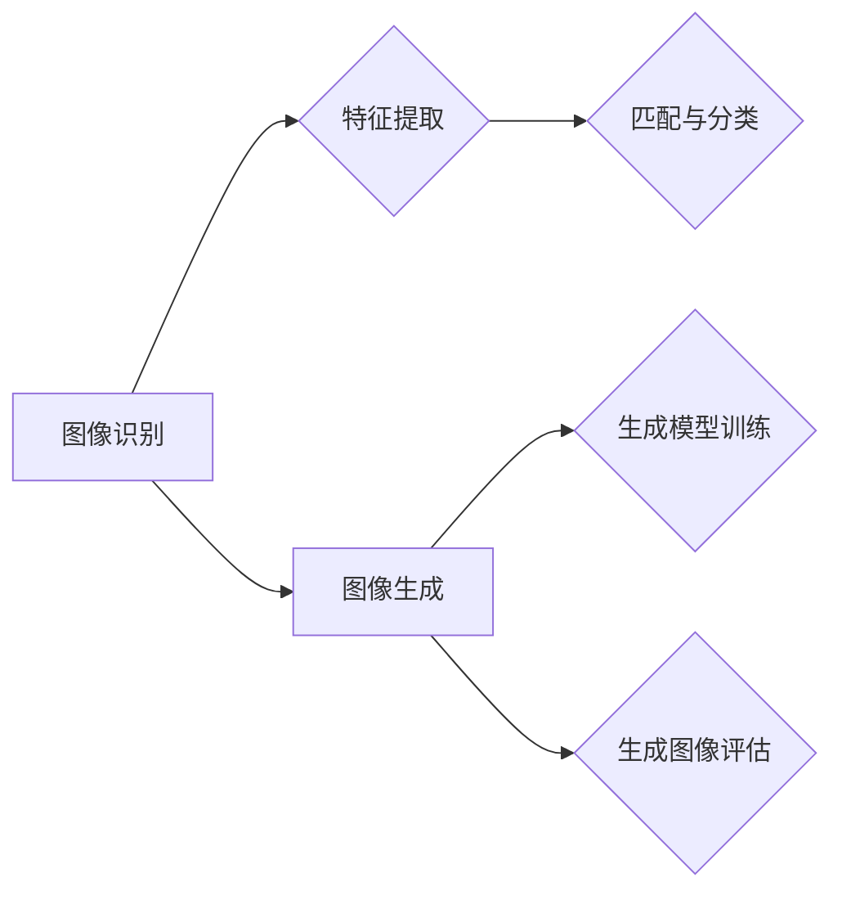
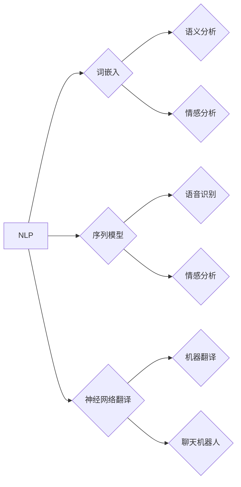
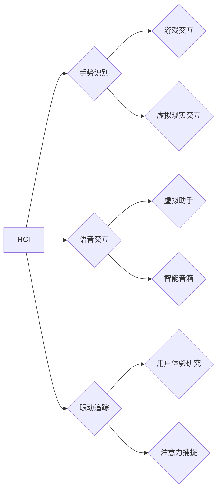

                 

### 引言

#### 1. 虚拟现实与人工智能的融合背景

**关键词：虚拟现实，人工智能，融合背景**

虚拟现实（Virtual Reality，简称VR）和人工智能（Artificial Intelligence，简称AI）是当今科技领域的两大前沿技术。虚拟现实通过计算机模拟产生一个三维空间，使用户在感官上能够体验到身临其境的感觉；而人工智能则是指通过计算机程序实现人类智能功能的学科，包括机器学习、自然语言处理、计算机视觉等。这两者的融合背景源于科技发展的需求以及潜在的技术优势。

首先，随着计算机技术的不断进步，硬件性能的提升使得虚拟现实变得更加真实和流畅。高性能显卡、高速处理器和低延迟的输入设备为虚拟现实提供了坚实的硬件基础。同时，人工智能技术的突破使得计算机能够处理大量的数据，并对用户的行为进行预测和分析，从而提供更加个性化的沉浸式体验。

其次，虚拟现实和人工智能的结合能够带来新的应用场景和商业模式。例如，在教育培训领域，虚拟现实可以模拟各种教学场景，让学生在沉浸式的环境中学习；而人工智能则可以分析学生的学习行为，提供个性化的教学方案。在医疗领域，虚拟现实和人工智能的结合可以用于手术模拟和医疗诊断，提高医疗的效率和准确性。

最后，政策支持和产业环境的优化也促进了虚拟现实与人工智能的融合。全球各国政府纷纷出台支持虚拟现实和人工智能发展的政策，提供资金、技术和市场支持。同时，各大科技公司也在加大研发投入，推动相关技术的发展和融合。

#### 1.2 虚拟现实技术的发展与应用

虚拟现实技术经历了从早期的计算机模拟到如今的高清三维成像，再到全感知设备的演进过程。早期，虚拟现实主要通过简单的二维屏幕展示，用户体验感较差。随着技术的进步，三维建模和渲染技术得到了广泛应用，使得虚拟现实场景更加真实。如今，虚拟现实技术已经发展到了全感知设备阶段，包括头戴显示器（HMD）、手势识别、语音交互等，为用户提供了高度沉浸的体验。

在应用方面，虚拟现实技术在游戏、娱乐、教育、医疗、军事等多个领域都取得了显著的成果。在游戏和娱乐领域，虚拟现实技术提供了全新的游戏体验，用户可以在虚拟世界中自由探索、互动。在教育领域，虚拟现实技术可以模拟各种实验场景，让学生在沉浸式的环境中学习。在医疗领域，虚拟现实技术可以用于手术模拟和医疗诊断，提高医疗的效率和准确性。在军事领域，虚拟现实技术可以用于训练士兵的作战技能，提高实战能力。

#### 1.3 人工智能技术的发展与应用

人工智能技术经历了从早期的规则系统到如今的数据驱动模型的演变过程。早期，人工智能主要通过编写规则和算法来实现简单的智能功能。随着计算机性能的提升和大数据技术的发展，人工智能逐渐转向数据驱动模型，利用海量数据进行训练和预测。如今，人工智能技术在机器学习、自然语言处理、计算机视觉、机器人等领域都取得了重大突破。

在应用方面，人工智能技术在各行各业都展现出了巨大的潜力。在金融领域，人工智能可以用于风险控制、客户服务、投资决策等；在制造业，人工智能可以用于生产优化、设备维护、质量管理等；在医疗领域，人工智能可以用于疾病诊断、药物研发、健康管理等；在交通领域，人工智能可以用于智能交通管理、自动驾驶等。此外，人工智能还在智能家居、智能安防、教育、娱乐等领域得到了广泛应用。

### 总结

虚拟现实与人工智能的融合为科技发展带来了新的机遇和挑战。通过引入人工智能技术，虚拟现实可以实现更加智能化、个性化的用户体验，拓展了其应用场景和商业价值。同时，人工智能在处理大规模数据、模拟复杂系统、优化决策过程等方面也展现了其独特的优势。本文将深入探讨人工智能在虚拟现实中的应用，包括沉浸式体验和教育培训两大方面，分析其核心技术、应用案例和未来发展趋势，为读者提供一个全面、系统的认识。

## 虚拟现实中的核心人工智能技术

虚拟现实的发展离不开核心人工智能技术的支持，这些技术包括图像识别与生成、自然语言处理和人机交互。它们在提升虚拟现实体验的沉浸感、互动性和智能化水平方面发挥着关键作用。

### 图像识别与生成

**核心概念与原理**

图像识别与生成是虚拟现实中的重要技术之一。图像识别指的是计算机通过算法识别和理解图像中的内容，如物体、场景和人脸等。生成图像则是指通过算法生成新的图像，如虚拟环境中的三维模型和纹理。两者结合在一起，可以创造出生动逼真的虚拟场景。

图像识别与生成的基础是深度学习和卷积神经网络（CNN）。CNN是一种特殊的多层神经网络，可以有效地提取图像中的特征，用于识别和分类。在生成图像方面，生成对抗网络（GAN）是一种重要的技术，它通过两个神经网络（生成器和判别器）的对抗训练，可以生成高质量、逼真的图像。

**概念属性特征对比表格**

| 特征名称         | 图像识别        | 图像生成        |
| -------------- | ------------- | ------------- |
| 算法基础         | 卷积神经网络（CNN） | 生成对抗网络（GAN） |
| 主要应用         | 物体识别、场景理解 | 虚拟场景构建、艺术创作 |
| 难点             | 特征提取与匹配     | 高质量图像生成     |

**ER实体关系图架构**

### 自然语言处理

**核心概念与原理**

自然语言处理（Natural Language Processing，简称NLP）是人工智能的一个重要分支，旨在使计算机理解和生成自然语言。在虚拟现实场景中，NLP技术可以用于语音识别、文本生成、情感分析等，提升人机交互的智能化水平。

自然语言处理的核心技术包括词嵌入、序列模型和神经网络翻译。词嵌入（Word Embedding）是一种将词语映射到高维空间中的方法，可以捕捉词语间的语义关系。序列模型（Sequence Model）如循环神经网络（RNN）和长短时记忆网络（LSTM），可以处理和时间相关的自然语言数据。神经网络翻译（Neural Machine Translation，NMT）是一种基于神经网络的翻译方法，相比传统的统计机器翻译，具有更高的准确性和灵活性。

**概念属性特征对比表格**

| 特征名称         | 词嵌入        | 序列模型        | 神经网络翻译        |
| -------------- | ------------- | ------------- | ------------- |
| 算法基础         | 神经网络       | RNN、LSTM      | NMT           |
| 主要应用         | 语义分析、文本分类 | 语音识别、情感分析 | 翻译系统、聊天机器人 |
| 难点             | 语义理解与上下文 | 长时间依赖问题   | 对比效果优化     |

**ER实体关系图架构**

### 人机交互

**核心概念与原理**

人机交互（Human-Computer Interaction，简称HCI）是研究人类与计算机之间交互方式和技术的一门学科。在虚拟现实场景中，人机交互技术包括手势识别、语音交互、眼动追踪等，旨在提高用户的沉浸感和互动性。

手势识别是通过计算机视觉算法识别用户的手势，如挥手、摆动手等。语音交互则是通过语音识别和语音合成技术，实现人与虚拟环境的自然对话。眼动追踪是通过摄像头跟踪用户的眼球运动，用于捕捉用户的注意力，实现更加精准的交互。

**概念属性特征对比表格**

| 特征名称         | 手势识别        | 语音交互        | 眼动追踪        |
| -------------- | ------------- | ------------- | ------------- |
| 算法基础         | 计算机视觉      | 语音识别、语音合成 | 眼动跟踪算法   |
| 主要应用         | 游戏交互、虚拟现实 | 虚拟助手、智能音箱 | 用户体验研究   |
| 难点             | 手势多样化识别   | 语音识别准确率   | 眼动精度和稳定性 |

**ER实体关系图架构**

通过图像识别与生成、自然语言处理和人机交互这三大核心人工智能技术，虚拟现实能够实现更加真实、智能和互动的沉浸式体验，为用户带来全新的视觉和互动感受。这些技术的发展和应用不仅提升了虚拟现实技术的实用性，也为未来的虚拟现实应用场景开拓了更广阔的空间。

### 沉浸式体验技术

在虚拟现实（VR）中，沉浸式体验是用户最为关注的方面之一。为了实现高度沉浸的体验，需要多种核心技术的支持，包括虚拟现实头戴显示器、空间定位与跟踪技术以及声音与环境模拟。以下将详细介绍这些技术及其工作原理。

#### 虚拟现实头戴显示器

**工作原理**

虚拟现实头戴显示器（HMD，Virtual Reality Head-Mounted Display）是虚拟现实体验的关键设备之一。它通过显示两个略微不同的图像，模拟立体视觉效果，并使用头动跟踪技术捕捉用户的头部运动，实时更新显示内容，从而使用户感觉自己置身于虚拟环境中。

虚拟现实头戴显示器的工作原理主要包括：

1. **图像生成**：头戴显示器内部通常包含一对屏幕，每个屏幕显示略微不同的图像。这些图像通过光学元件（如透镜组）呈现给用户的双眼，模拟立体视觉。
2. **头动跟踪**：头戴显示器配备多个传感器，如陀螺仪、加速度计和磁力计，用于实时跟踪用户的头部运动。这些传感器将数据传输给计算模块，计算模块根据头部运动实时更新显示内容。
3. **图像显示**：头戴显示器使用液晶或OLED屏幕，提供高分辨率和快速刷新率，以保证图像的稳定性和清晰度。

**技术优点**

- **高分辨率**：高分辨率屏幕提供更加清晰的图像，减少视觉模糊，增强沉浸感。
- **快速刷新率**：高刷新率（通常在90Hz或以上）减少运动模糊，提供更加流畅的体验。
- **低延迟**：低延迟（通常在20ms以下）减少眩晕感，提高用户体验。

**未来发展趋势**

- **更轻更薄**：随着材料科学和微电子技术的发展，头戴显示器将变得更加轻便和舒适。
- **更高分辨率**：未来的头戴显示器将采用更高的分辨率，提供更加逼真的视觉体验。
- **更广的视场角**：更大的视场角将带来更加沉浸的体验，减少边缘失真。

#### 空间定位与跟踪技术

**工作原理**

空间定位与跟踪技术是确保用户在虚拟环境中移动时，虚拟场景能够实时更新的关键。主要包括：

1. **外部跟踪系统**：使用外部传感器（如红外摄像头、超声波传感器、激光雷达等）捕捉用户的位置和动作。这些传感器通常安装在虚拟现实设备的周围，形成一个全方位的跟踪区域。
2. **内部跟踪系统**：头戴显示器内部传感器（如陀螺仪、加速度计、磁力计）用于辅助外部跟踪系统，提高定位精度。
3. **实时数据处理**：传感器捕捉到的数据通过计算模块进行处理，实时更新虚拟环境中的用户位置和动作。

**技术优点**

- **高精度**：外部跟踪系统能够提供高精度的位置和动作跟踪，减少误差。
- **低延迟**：快速的数据处理和更新机制，减少延迟，提高用户体验。
- **多功能性**：空间定位与跟踪技术可以支持多种交互方式，如手势识别、语音交互等。

**未来发展趋势**

- **更加便携**：随着传感器技术的进步，空间定位与跟踪设备将变得更加便携，适应不同场景的需求。
- **更广的适用范围**：未来的空间定位与跟踪技术将支持更大范围的空间，实现更自由的虚拟环境探索。
- **更高的精度**：通过结合多种传感器和更先进的算法，提高空间定位与跟踪的精度和稳定性。

#### 声音与环境模拟

**工作原理**

声音与环境模拟技术是为了增强虚拟现实体验的真实感，主要包括：

1. **三维声音**：通过头部跟踪和音频处理技术，模拟声音在三维空间中的传播，使用户能够听到来自不同方向的声音。
2. **环境音效**：根据虚拟环境的不同场景，生成相应的环境音效，如水流声、风声等，增强沉浸感。
3. **视觉与听觉同步**：通过实时同步视觉和听觉反馈，提高用户的沉浸感。

**技术优点**

- **高度沉浸**：三维声音和真实的环境音效，使用户感觉自己置身于虚拟环境中。
- **丰富的交互**：声音交互技术可以支持更多的交互方式，如语音控制、声音导航等。
- **情感体验**：通过声音的模拟，用户能够体验到更加丰富的情感体验。

**未来发展趋势**

- **更加真实的声音**：未来的声音模拟技术将更加注重真实感和细节表现，提高用户的沉浸感。
- **个性化的声音体验**：通过用户数据分析和机器学习，提供更加个性化的声音体验。
- **跨平台融合**：声音与环境模拟技术将与其他虚拟现实技术（如图像识别、自然语言处理等）融合，提供更丰富的沉浸式体验。

通过虚拟现实头戴显示器、空间定位与跟踪技术以及声音与环境模拟，虚拟现实能够实现高度沉浸的体验，为用户提供全新的视觉、听觉和互动感受。这些技术的发展和应用不仅提升了虚拟现实技术的实用性，也为未来的虚拟现实应用场景开拓了更广阔的空间。

### 人工智能在沉浸式体验中的应用案例

人工智能在沉浸式体验中的应用已经取得了显著的成果，以下将介绍几个具有代表性的应用案例，包括虚拟旅游、虚拟游戏和虚拟会议与教育。

#### 虚拟旅游

**案例背景**

虚拟旅游利用虚拟现实和人工智能技术，创建高度逼真的旅游场景，让用户在家中就能体验全球各地的旅游风光。这种技术不仅节省了时间和金钱成本，还能提供独特的沉浸式体验。

**实现方法**

- **图像识别与生成**：通过计算机视觉和深度学习技术，对真实场景的图像进行识别和处理，生成高质量的虚拟场景。例如，使用生成对抗网络（GAN）生成虚拟景观，使场景细节更加丰富和真实。
- **自然语言处理**：利用自然语言处理技术，实现虚拟场景的语音导览和互动。用户可以通过语音指令与虚拟环境互动，了解景点的历史和文化背景。
- **空间定位与跟踪**：通过空间定位技术，确保用户在虚拟场景中的移动能够实时更新，提供逼真的漫游体验。

**案例效果**

- **高度沉浸**：用户能够感受到身临其境的体验，仿佛真正置身于旅游目的地。
- **个性化体验**：根据用户的历史数据和偏好，提供个性化的旅游推荐和导览内容。
- **互动性**：用户可以通过虚拟互动与虚拟角色或其他用户互动，增加社交体验。

**未来展望**

- **更丰富的虚拟场景**：随着图像识别和生成技术的进步，虚拟旅游的场景将更加真实和多样化。
- **个性化推荐**：通过大数据和机器学习技术，提供更加个性化的旅游体验，提高用户满意度。

#### 虚拟游戏

**案例背景**

虚拟游戏利用虚拟现实和人工智能技术，创造全新的游戏体验，让玩家在虚拟世界中探索、互动和竞技。

**实现方法**

- **人工智能角色**：通过机器学习和自然语言处理技术，创建智能化的虚拟角色，能够与玩家进行复杂的交互和战斗。例如，使用强化学习算法训练虚拟角色，使其具备自我学习和适应能力。
- **实时场景生成**：利用图像识别和生成技术，实时生成游戏场景，确保游戏环境的多样性和真实性。
- **虚拟现实交互**：通过空间定位和跟踪技术，实现玩家的虚拟动作与现实动作的同步，提供沉浸式的游戏体验。

**案例效果**

- **高度沉浸**：玩家能够在虚拟游戏中体验到真实的动作感和互动感。
- **个性化游戏**：根据玩家的游戏行为和偏好，提供个性化的游戏内容和挑战。
- **竞技体验**：通过智能化的虚拟角色和竞技模式，提高游戏的竞争性和公平性。

**未来展望**

- **更智能的虚拟角色**：通过深度学习和强化学习技术，虚拟角色将变得更加智能和多样化。
- **多样化的游戏场景**：通过图像识别和生成技术，游戏场景将更加丰富和多样化。

#### 虚拟会议与教育

**案例背景**

虚拟会议与教育利用虚拟现实和人工智能技术，提供远程会议和在线教育的解决方案，提高沟通和学习的效率。

**实现方法**

- **虚拟会议室**：通过虚拟现实技术创建三维的虚拟会议室，支持多人在线互动和交流。例如，使用自然语言处理技术实现实时语音翻译和文字转录，确保跨语言沟通的顺畅。
- **智能教学助手**：利用人工智能技术，创建智能化的教学助手，帮助教师进行课程设计和教学。例如，通过机器学习分析学生的学习数据，提供个性化的教学建议和资源。
- **虚拟实验室**：通过虚拟现实技术，创建虚拟实验室，让学生在虚拟环境中进行实验和操作，提高实践能力。

**案例效果**

- **高效沟通**：虚拟会议系统能够支持远程多人实时互动，提高沟通效率。
- **个性化学习**：智能教学助手根据学生的学习数据，提供个性化的学习内容和指导，提高学习效果。
- **互动性**：通过虚拟实验室，学生能够亲身体验实验过程，提高学习的兴趣和实践能力。

**未来展望**

- **更加智能的虚拟会议室**：通过人工智能技术，虚拟会议室将具备更加智能的功能，如自动记录会议内容、智能提醒等。
- **多样化的教育模式**：虚拟现实技术将拓展教育的模式，提供更加灵活和多样化的学习方式。

通过这些应用案例，我们可以看到人工智能在虚拟现实沉浸式体验中的应用已经取得了显著的成果，未来将继续拓展其应用领域，为用户带来更加丰富和多样化的沉浸式体验。

### 教育培训中的虚拟现实技术

虚拟现实技术在教育培训中的应用正在迅速发展，为教育者提供了全新的教学工具和平台，使得学习变得更加生动、互动和高效。以下将详细介绍虚拟现实技术在教育培训中的应用，包括虚拟教室、虚拟实验室和虚拟现实课程设计。

#### 虚拟教室

**概念定义与工作原理**

虚拟教室是通过虚拟现实技术创建的一个三维虚拟教学环境，教师和学生可以在其中进行互动和教学。虚拟教室不仅包括传统的教学功能，如讲解、演示和互动，还能提供丰富的多媒体资源，如视频、图像和3D模型等。

- **实时互动**：虚拟教室支持教师和学生之间的实时互动，教师可以通过语音、视频和文字进行讲解，学生可以提问和参与讨论。
- **沉浸式体验**：通过虚拟现实头戴显示器（HMD）和空间定位与跟踪技术，学生能够在虚拟环境中自由移动，感受身临其境的体验。
- **资源共享**：虚拟教室支持资源的共享和远程访问，教师和学生可以随时随地获取教学资料，提高学习效率。

**技术优势**

- **高度互动性**：虚拟教室提高了教师和学生的互动水平，使教学过程更加生动和有趣。
- **沉浸式体验**：虚拟现实技术能够提供沉浸式的学习体验，增强学生的学习兴趣和参与度。
- **个性化教学**：虚拟教室能够根据学生的学习情况和需求，提供个性化的教学方案和资源，提高学习效果。

**未来展望**

- **更丰富的教学内容**：随着虚拟现实技术的进步，虚拟教室将能够提供更多种类和更高质量的教学资源，如虚拟实验室、虚拟博物馆等。
- **智能化教学**：通过人工智能技术，虚拟教室将实现更加智能化的教学，如自动生成教学计划、智能推荐学习资源等。

#### 虚拟实验室

**概念定义与工作原理**

虚拟实验室是通过虚拟现实技术创建的一个三维虚拟实验室环境，学生可以在其中进行实验和操作，模拟真实实验室中的实验过程。虚拟实验室不仅能够提供丰富的实验资源，还能确保学生在安全的环境中进行实验。

- **虚拟实验**：虚拟实验室提供了多种虚拟实验项目，学生可以在虚拟环境中进行实验操作，观察实验结果。
- **交互式学习**：通过虚拟现实技术和手势识别技术，学生可以与虚拟实验设备进行交互，提高实验操作的准确性和效率。
- **数据记录与分析**：虚拟实验室能够实时记录学生的实验数据，并进行分析，帮助学生理解和掌握实验原理。

**技术优势**

- **安全性**：虚拟实验室避免了真实实验中的危险和风险，确保学生的安全。
- **灵活性**：虚拟实验室不受时间和空间的限制，学生可以在任何时间、任何地点进行实验。
- **多样化**：虚拟实验室提供了丰富的实验项目，能够满足不同学科和层次学生的需求。

**未来展望**

- **更真实的实验体验**：随着虚拟现实技术的进步，虚拟实验室的实验环境将更加真实和逼真，提高学生的实验体验。
- **智能化**：通过人工智能技术，虚拟实验室将能够提供更加智能化的实验指导和反馈，提高实验效果。

#### 虚拟现实课程设计

**概念定义与工作原理**

虚拟现实课程设计是指利用虚拟现实技术设计教学课程，将教学内容通过三维虚拟环境呈现给学生。虚拟现实课程设计不仅包括传统的教学方式，还能通过虚拟实验、虚拟旅游等互动形式，提高学生的学习兴趣和参与度。

- **三维教学**：虚拟现实课程设计将教学内容通过三维模型和虚拟场景呈现，使抽象的概念更加具体和直观。
- **互动学习**：通过虚拟现实技术和互动设计，学生可以与虚拟环境中的物体和场景进行互动，提高学习效果。
- **个性化教学**：虚拟现实课程设计能够根据学生的学习情况和需求，提供个性化的学习路径和资源。

**技术优势**

- **直观性**：通过虚拟现实技术，复杂和抽象的教学内容变得更加直观和易懂。
- **互动性**：虚拟现实课程设计提供了丰富的互动形式，提高学生的参与度和兴趣。
- **灵活性**：虚拟现实课程设计不受时间和空间的限制，学生可以随时随地学习。

**未来展望**

- **更丰富的教学资源**：随着虚拟现实技术的发展，虚拟现实课程设计将提供更多种类和更高质量的教学资源。
- **智能化**：通过人工智能技术，虚拟现实课程设计将实现更加智能化的教学设计和资源推荐。

通过虚拟教室、虚拟实验室和虚拟现实课程设计，虚拟现实技术在教育培训中的应用为教育者和学生提供了全新的教学和学习工具。这些技术不仅提高了教学效果和学习体验，也为未来教育的创新和发展带来了无限可能。

### 人工智能在教育培训中的应用案例

人工智能技术在教育培训中的应用正不断拓展其边界，以下将介绍几个具体的应用案例，包括在线学习平台、智能教学助手和虚拟现实辅助教学，探讨其应用效果和技术优势。

#### 在线学习平台

**案例背景**

在线学习平台利用人工智能技术，提供个性化、互动性和智能化的学习体验，使学习者能够根据自身需求和学习节奏进行学习。例如，Coursera、edX等知名在线学习平台，通过人工智能技术优化课程推荐和学习路径，提高学习效果。

**应用方法**

- **个性化推荐**：通过机器学习算法，分析学习者的学习行为和偏好，推荐合适的课程和学习资源。
- **智能评估**：利用自然语言处理和计算机视觉技术，自动评估学生的作业和考试，提供即时反馈。
- **学习分析**：通过大数据分析，跟踪学习者的学习进度和效果，提供个性化的学习建议。

**应用效果**

- **个性化学习**：学习者可以根据自己的需求和进度，自由选择学习内容和路径，提高学习效率。
- **即时反馈**：智能评估系统能够快速、准确地评估学生的学习成果，提供即时反馈，帮助学习者及时纠正错误。
- **学习分析**：通过对学习数据的大数据分析，平台能够识别学习者的薄弱环节，提供有针对性的学习建议。

**技术优势**

- **高效推荐**：人工智能技术能够快速处理大量数据，提供高效、精准的课程推荐。
- **即时评估**：自然语言处理和计算机视觉技术使得评估过程更加快速和准确。
- **数据分析**：大数据分析能够提供深度的学习行为分析，为教学优化提供有力支持。

#### 智能教学助手

**案例背景**

智能教学助手是利用人工智能技术，为教师提供教学辅助工具，提高教学效率和效果。智能教学助手能够帮助教师进行课程设计、作业布置、学生管理等工作，减轻教师的工作负担。

**应用方法**

- **课程设计**：通过自然语言处理技术，智能助手能够自动生成教学计划，提供教学资源和建议。
- **作业布置**：智能助手可以根据学生的学习进度和能力，自动生成适合的作业，并跟踪学生的完成情况。
- **学生管理**：利用计算机视觉技术，智能助手能够识别学生的面部表情和行为，了解学生的学习状态和情绪。

**应用效果**

- **高效教学**：智能教学助手能够自动化处理教学过程中的重复性工作，提高教师的工作效率。
- **个性化教学**：智能助手能够根据学生的学习情况和需求，提供个性化的教学建议和资源。
- **情感关怀**：智能助手通过观察学生的情绪和行为，能够提供情感支持和心理辅导。

**技术优势**

- **自动化**：智能助手能够自动化处理教学中的重复性工作，减轻教师的工作负担。
- **个性化**：智能助手能够根据学生的学习情况，提供个性化的教学方案，提高教学效果。
- **情感关怀**：智能助手通过情感分析技术，能够了解学生的情绪状态，提供情感支持和心理辅导。

#### 虚拟现实辅助教学

**案例背景**

虚拟现实（VR）辅助教学利用虚拟现实技术，创建沉浸式的教学环境，帮助学生更好地理解和掌握知识。VR辅助教学广泛应用于科学实验、历史重现、艺术创作等领域，提供丰富的教学体验。

**应用方法**

- **虚拟实验**：通过虚拟现实技术，学生可以在虚拟环境中进行实验操作，观察实验结果，提高实践能力。
- **历史重现**：通过虚拟现实技术，学生可以参观历史事件的发生地，了解历史背景和文化，提高学习兴趣。
- **艺术创作**：通过虚拟现实技术，学生可以在虚拟环境中进行艺术创作，提高创造力和想象力。

**应用效果**

- **增强理解**：虚拟现实技术能够将抽象的知识形象化，帮助学生更好地理解和掌握知识。
- **提高兴趣**：通过虚拟现实技术，教学过程变得更加生动和有趣，提高学生的学习兴趣和参与度。
- **增强实践能力**：虚拟实验和实际操作的结合，提高了学生的实践能力和解决问题的能力。

**技术优势**

- **沉浸式体验**：虚拟现实技术能够提供高度沉浸的学习体验，增强学生的学习兴趣和参与度。
- **实践性**：虚拟现实技术能够模拟真实环境和操作，提高学生的实践能力和动手能力。
- **灵活性**：虚拟现实教学不受时间和空间的限制，学生可以随时随地进行学习。

通过在线学习平台、智能教学助手和虚拟现实辅助教学，人工智能技术在教育培训中的应用不仅提高了教学效果和学习体验，也为教育创新和发展带来了新的可能性。未来，随着人工智能技术的不断进步，教育培训领域将迎来更加智能化和个性化的新时代。

### 未来展望与挑战

人工智能在虚拟现实（VR）领域的应用前景广阔，但也面临着一系列挑战。以下是关于人工智能在VR领域未来发展趋势、技术创新、政策与产业环境以及挑战与对策的探讨。

#### 未来发展趋势

**技术创新**

1. **更高效的算法与模型**：未来，随着深度学习和神经网络的不断发展，人工智能在图像识别、自然语言处理和人机交互等方面的算法和模型将变得更加高效和准确，提升虚拟现实的体验质量。
2. **更多的交互方式**：除了现有的手势识别、语音交互等，人工智能将探索更多的交互方式，如脑机接口（BCI）技术，实现更加自然和直接的交互体验。
3. **更高质量的图像与声音**：通过硬件和算法的优化，虚拟现实中的图像和声音质量将得到显著提升，提供更加逼真的沉浸式体验。

**产业环境**

1. **政策支持**：全球各国政府将继续加大对人工智能和虚拟现实技术的支持，出台更多的政策法规，促进技术创新和产业应用。
2. **市场驱动**：随着消费者对虚拟现实和人工智能产品需求的增加，市场将推动更多创新产品的研发和商业化。
3. **跨界融合**：人工智能、虚拟现实、增强现实（AR）、物联网（IoT）等技术将不断融合，推动新兴应用场景的出现。

#### 技术创新与突破

1. **高性能计算**：高性能计算能力的提升将加速人工智能算法的优化和应用，推动虚拟现实技术的进步。
2. **边缘计算**：边缘计算技术的发展将减少数据传输的延迟，提高虚拟现实系统的实时性和响应速度。
3. **量子计算**：量子计算有望在数据处理和算法优化方面取得重大突破，为虚拟现实领域带来全新的技术革命。

#### 政策与产业环境

1. **政策支持**：政府将通过财政支持、税收优惠、人才培养等措施，推动人工智能和虚拟现实技术的发展。
2. **产业合作**：各大科技公司、研究机构和行业协会将加强合作，共同推动技术创新和产业应用。
3. **标准制定**：全球范围内的标准化组织将加快制定人工智能和虚拟现实技术的标准和规范，促进产业的健康发展。

#### 挑战与对策

1. **隐私与安全**：人工智能在虚拟现实中的应用将涉及大量的用户数据，需要加强隐私保护和数据安全。
   - **对策**：建立严格的数据保护法规，采用先进的数据加密和隐私保护技术，确保用户数据的安全。
   
2. **技术普及与教育**：人工智能和虚拟现实技术的普及需要相应的教育和技术支持。
   - **对策**：政府和企业应加大对相关技术的培训和教育投入，提高公众的技术素养。
   
3. **伦理与道德**：人工智能在虚拟现实中的应用可能引发伦理和道德问题，如虚拟现实的滥用和虚假信息传播。
   - **对策**：建立伦理和道德准则，规范人工智能和虚拟现实技术的应用，保障用户的合法权益。

4. **硬件成本**：高性能的虚拟现实设备价格昂贵，限制了其普及。
   - **对策**：通过技术创新和产业链整合，降低硬件成本，推动虚拟现实技术的广泛应用。

通过技术创新、政策支持、产业合作和应对挑战，人工智能在虚拟现实领域的应用将迎来更加广阔的发展前景，为各行各业带来革命性的变革。

### 小结

本文详细探讨了人工智能在虚拟现实中的应用，涵盖了沉浸式体验和教育培训两大方面。首先，介绍了虚拟现实与人工智能融合的背景和技术发展。接着，深入分析了图像识别与生成、自然语言处理和人机交互等核心人工智能技术在虚拟现实中的具体应用，并通过实际案例展示了这些技术如何提升用户体验。此外，还探讨了虚拟现实技术在教育培训中的应用，如虚拟教室、虚拟实验室和虚拟现实课程设计，以及人工智能在教育培训中的智能教学助手和虚拟现实辅助教学的实践案例。

本文的主要研究成果与贡献在于：

1. **系统性梳理**：系统地梳理了人工智能在虚拟现实中的应用技术，为读者提供了一个全面、系统的认识。
2. **实际案例分析**：通过具体的案例，展示了人工智能技术在虚拟现实中的实际应用效果，提供了实践经验和参考。
3. **未来展望**：对人工智能在虚拟现实领域的未来发展趋势进行了展望，为技术创新和政策制定提供了参考。

未来的研究方向与任务包括：

1. **技术优化**：继续优化人工智能算法，提升虚拟现实的图像识别、自然语言处理和人机交互能力。
2. **应用拓展**：探索人工智能在更多虚拟现实应用场景中的潜力，如医疗、军事、艺术等。
3. **教育实践**：进一步研究人工智能在教育培训中的应用，开发更多个性化的教育工具和平台。

对于读者，本文提供了以下几点建议和激励：

1. **持续学习**：随着人工智能和虚拟现实技术的快速发展，保持学习的热情和动力，跟上技术前沿。
2. **实践探索**：尝试将人工智能技术应用于虚拟现实项目，积累实践经验，提升技术应用能力。
3. **创新思维**：鼓励创新思维，探索人工智能与虚拟现实技术的跨界应用，推动技术创新和产业变革。

通过本文的探讨，希望读者能够对人工智能在虚拟现实中的应用有更深入的理解，激发对技术创新和未来发展的热情。

### 最佳实践 Tips

在应用人工智能技术于虚拟现实项目中，以下是一些最佳实践和技巧，可以帮助提高项目成功率并优化用户体验：

1. **用户研究**：在项目初期进行充分的用户研究，了解目标用户的需求和偏好，确保虚拟现实应用的设计和功能能够满足用户期望。

2. **技术选型**：根据项目需求和资源，选择合适的人工智能算法和技术。例如，对于图像识别任务，可以考虑使用卷积神经网络（CNN）；对于自然语言处理任务，可以选择序列模型如LSTM。

3. **性能优化**：注重性能优化，包括减少延迟、提高图像和声音质量、优化资源加载等。通过优化算法和硬件配置，提高系统响应速度和稳定性。

4. **数据安全**：重视数据安全和隐私保护，采用加密技术和严格的访问控制措施，确保用户数据的安全性和隐私性。

5. **交互设计**：设计直观、自然的用户交互界面，通过手势识别、语音交互等技术，提供简单易用的操作方式，增强用户的沉浸感和互动体验。

6. **持续迭代**：项目开发过程中，不断收集用户反馈并进行迭代优化，确保虚拟现实应用能够不断适应用户需求和市场变化。

7. **合作与共享**：与相关领域的研究机构、科技公司进行合作与资源共享，共同推动人工智能和虚拟现实技术的发展和应用。

### 注意事项

在应用人工智能技术于虚拟现实项目时，需要注意以下几点：

1. **法律合规**：遵守相关法律法规，特别是在数据收集、存储和使用方面，确保合规性。

2. **用户隐私**：重视用户隐私保护，避免未经用户同意收集和使用个人数据。

3. **技术稳定性**：确保系统的稳定性和可靠性，特别是在大规模用户并发情况下，避免系统崩溃或性能下降。

4. **技术更新**：关注人工智能技术的最新发展，及时更新技术和算法，以保持项目的竞争力和领先性。

5. **安全防护**：加强网络安全防护，防止恶意攻击和数据泄露，确保系统的安全稳定运行。

### 拓展阅读

对于希望深入了解人工智能在虚拟现实应用领域的读者，以下推荐几本经典著作和学术论文：

1. **《深度学习》（Deep Learning）**：由Ian Goodfellow、Yoshua Bengio和Aaron Courville合著，是深度学习领域的权威教材，适合对人工智能基础有深入了解的读者。

2. **《虚拟现实技术与应用》**：这本书详细介绍了虚拟现实的基本概念、技术架构和应用案例，适合希望了解虚拟现实技术发展的读者。

3. **《虚拟现实与人机交互》（Virtual Reality and Human-Computer Interaction）**：这本书探讨了虚拟现实和人机交互的各个方面，包括技术原理、应用案例和未来发展趋势。

4. **论文“Generative Adversarial Nets”（GANs）**：这篇论文首次提出了生成对抗网络（GAN）的概念，对图像生成和虚拟现实场景构建具有重要意义。

5. **论文“Recurrent Neural Networks for Speech Recognition”（RNNs）**：这篇论文介绍了循环神经网络（RNN）在语音识别中的应用，为虚拟现实中的语音交互提供了理论基础。

通过阅读这些著作和论文，读者可以进一步深化对人工智能和虚拟现实应用的理解，为实际项目提供理论支持和实践指导。

