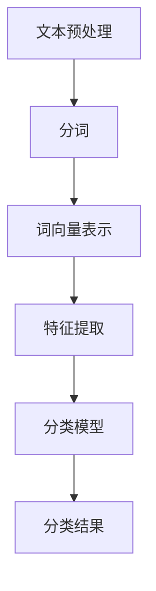
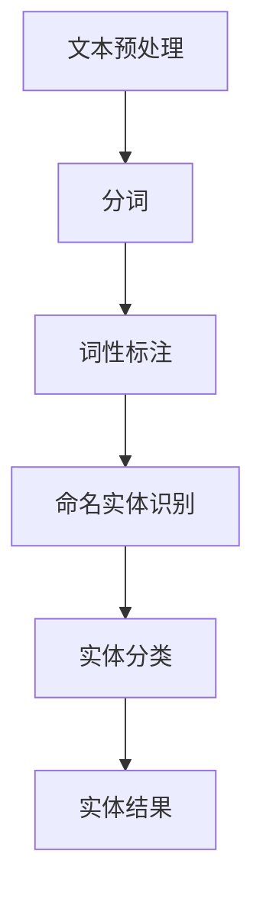
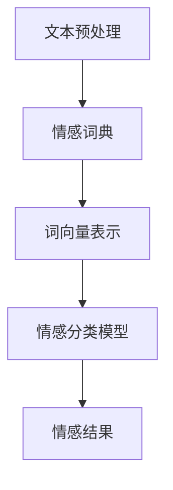
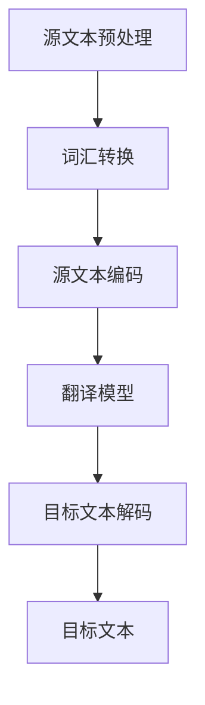
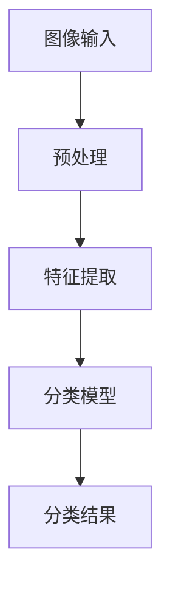
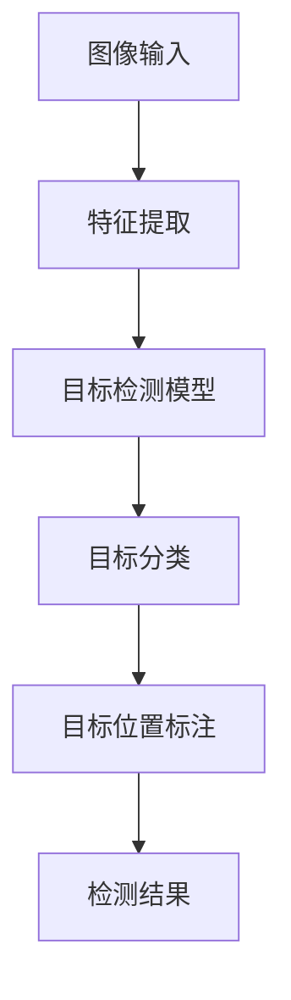
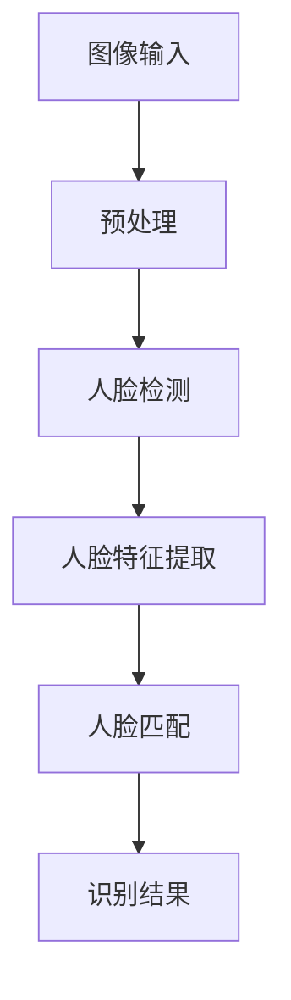
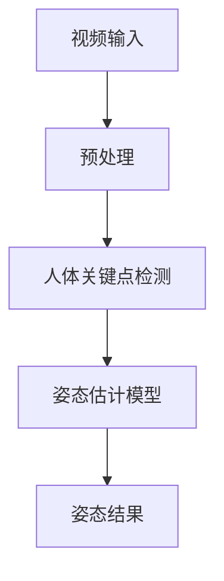

                 

## 引言与背景介绍

### 1.1 引言

**人工智能（AI）在软件开发领域的重要性和广泛应用**

随着科技的迅猛发展，人工智能（AI）已成为推动社会进步的重要力量。特别是在软件开发领域，AI的应用越来越广泛，不仅提高了开发效率，还带来了前所未有的创新机遇。例如，机器学习技术可以自动化软件测试，深度学习算法可以优化软件性能，自然语言处理（NLP）技术可以改进用户界面设计，计算机视觉技术可以提升软件的智能化程度。

**问题描述：人工智能在软件开发中的应用现状、机遇与挑战**

当前，人工智能在软件开发中的应用已经取得了一定成果，但同时也面临着诸多挑战。一方面，人工智能技术为软件开发带来了巨大的机遇，如自动化测试、智能优化、代码生成等；另一方面，人工智能技术的应用也带来了一系列问题，如数据隐私、算法公平性、技能门槛等。如何充分发挥人工智能的优势，同时解决其带来的挑战，成为软件开发领域亟待解决的重要课题。

**问题解决：概述本书将要探讨的人工智能在软件开发中的应用，以及如何应对挑战**

本书旨在探讨人工智能在软件开发中的应用，从理论到实践，全面解析人工智能在软件开发中的机遇与挑战。通过系统地介绍机器学习、深度学习、自然语言处理和计算机视觉等核心概念，分析其在软件开发中的应用场景和实际案例，帮助读者深入了解人工智能在软件开发中的价值。同时，本书还将探讨如何应对人工智能在软件开发中面临的挑战，如数据隐私、算法公平性、技能门槛等问题，为读者提供实用的解决方案。

**边界与外延：人工智能的定义、范围、核心领域**

人工智能（Artificial Intelligence，简称AI）是指使计算机系统能够模拟人类智能行为的技术。人工智能包括多个子领域，如机器学习（Machine Learning，ML）、深度学习（Deep Learning，DL）、自然语言处理（Natural Language Processing，NLP）和计算机视觉（Computer Vision，CV）等。这些子领域在软件开发中有着广泛的应用，但具体应用场景和实现方法各有不同。本书将围绕这些核心领域展开讨论，帮助读者全面了解人工智能在软件开发中的现状和未来发展趋势。

### 1.2 核心概念

#### 人工智能

**定义**：人工智能是指通过计算机模拟人类智能行为的技术。它包括多个子领域，如机器学习、深度学习、自然语言处理和计算机视觉等。

**类型**：人工智能可以分为弱人工智能和强人工智能。弱人工智能是指专注于特定任务的智能系统，如语音识别、图像识别等；强人工智能则是指具有普遍智能的计算机系统，能够在各种任务中表现出人类的智能水平。

**特点**：人工智能具有学习、推理、知识表示和感知等核心功能，能够通过数据驱动的方式不断优化自身性能。

**应用**：人工智能在软件开发中有着广泛的应用，如自动化测试、智能优化、代码生成、智能助手等。

#### 软件开发

**定义**：软件开发是指创建、设计、实现、测试和维护软件系统的过程。它包括多个阶段，如需求分析、设计、编码、测试和维护等。

**基本流程**：软件开发的基本流程包括需求分析、系统设计、编码实现、测试和部署等。

**方法**：软件开发的方法包括瀑布模型、迭代模型、敏捷开发等。

**技术**：软件开发涉及多种技术，如编程语言、数据库、Web技术、移动应用开发等。

### 1.3 本书结构

**概述本书的结构和章节安排**

本书分为七个主要章节，涵盖人工智能在软件开发中的核心概念、应用实践、案例分析等方面。具体章节安排如下：

- 第1章：引言与背景介绍
- 第2章：人工智能在软件开发中的核心概念
- 第3章：人工智能在软件测试中的应用
- 第4章：人工智能在软件开发过程中的应用
- 第5章：人工智能在软件性能优化中的应用
- 第6章：人工智能在软件开发项目管理中的应用
- 第7章：人工智能在软件开发中的最佳实践

**阐述各章节的核心内容和学习目标**

- **第1章**：介绍人工智能和软件开发的基本概念，阐述本书的研究目的和结构。
- **第2章**：深入探讨机器学习、深度学习、自然语言处理和计算机视觉等核心概念，分析其在软件开发中的应用。
- **第3章**：探讨人工智能在软件测试中的应用，介绍机器学习在测试中的具体实现和应用场景。
- **第4章**：分析人工智能在软件开发过程中的应用，包括自动化代码生成、代码审查与优化等。
- **第5章**：探讨人工智能在软件性能优化中的应用，介绍机器学习在性能优化中的具体实现和应用场景。
- **第6章**：分析人工智能在软件开发项目管理中的应用，介绍如何利用人工智能提高项目管理效率。
- **第7章**：总结人工智能在软件开发中的最佳实践，为读者提供实用的建议和指导。

通过以上章节的安排，本书旨在帮助读者全面了解人工智能在软件开发中的应用，掌握相关技术，并学会如何应对开发过程中遇到的挑战。同时，本书还通过实际案例的分析，为读者提供了丰富的实践经验和参考案例。

## 人工智能在软件开发中的核心概念

### 2.1 机器学习

**定义**：机器学习（Machine Learning，ML）是一种人工智能的分支，通过构建和训练模型，使计算机系统能够从数据中自动学习和改进性能。机器学习依赖于统计学、概率论和优化理论，通过算法和模型来实现数据的模式识别、预测和分类。

**类型**：机器学习主要分为监督学习、无监督学习和强化学习。

- **监督学习**：在有标注的数据集上进行训练，通过学习输入和输出之间的关系，实现对未知数据的预测。常见的算法有线性回归、决策树、支持向量机（SVM）等。
- **无监督学习**：在无标注的数据集上进行训练，通过发现数据中的模式和结构来提高模型的性能。常见的算法有聚类、主成分分析（PCA）等。
- **强化学习**：通过不断试错和反馈机制，使模型能够在复杂环境中做出最优决策。常见的算法有深度Q网络（DQN）、策略梯度算法等。

**属性特征对比表格**：

| 算法 | 定义 | 适用场景 | 优缺点 |
| :--: | :--: | :--: | :--: |
| 线性回归 | 通过拟合数据的最优直线来进行预测 | 适用于线性关系明显的数据 | 简单易用，但当数据复杂时效果不佳 |
| 决策树 | 通过树结构进行分类或回归 | 适用于数据维度较低的场景 | 易于解释，但当数据复杂时过拟合问题严重 |
| 支持向量机（SVM） | 通过找到最佳超平面来进行分类或回归 | 适用于高维数据 | 在小样本数据上有较好表现，但计算复杂度高 |
| 聚类 | 通过将数据分为多个簇来发现模式 | 适用于无标注数据 | 能发现数据的分布模式，但聚类结果对初始值敏感 |
| 深度Q网络（DQN） | 通过价值函数进行决策 | 适用于复杂环境的决策问题 | 能处理高维状态空间，但训练过程较复杂 |

**应用**：机器学习在软件开发中有着广泛的应用，如自动化测试、故障诊断、异常检测、推荐系统等。例如，在自动化测试中，可以使用机器学习算法来识别测试用例、预测测试结果；在推荐系统中，可以使用机器学习算法来预测用户行为、推荐商品。

### 2.2 深度学习

**定义**：深度学习（Deep Learning，DL）是一种基于人工神经网络的机器学习方法，通过构建多层神经网络，对数据进行逐层特征提取和抽象，从而实现复杂的数据建模和预测。

**类型**：深度学习主要分为卷积神经网络（CNN）、循环神经网络（RNN）和生成对抗网络（GAN）等。

- **卷积神经网络（CNN）**：通过卷积操作提取图像特征，适用于计算机视觉任务，如图像分类、目标检测等。
- **循环神经网络（RNN）**：通过循环结构处理序列数据，适用于自然语言处理任务，如文本分类、机器翻译等。
- **生成对抗网络（GAN）**：由生成器和判别器组成，通过对抗训练生成逼真的数据，适用于图像生成、数据增强等。

**ER实体关系图**：

```mermaid
erDiagram
    Product ||--|{ Customer : buys }
    Order ||--|{ Product : contains }
    Customer ||--|{ Order : places }
```

**属性特征对比表格**：

| 算法 | 定义 | 适用场景 | 优缺点 |
| :--: | :--: | :--: | :--: |
| 卷积神经网络（CNN） | 通过卷积操作提取图像特征 | 适用于图像处理任务 | 在图像识别上性能优异，但需要大量数据训练 |
| 循环神经网络（RNN） | 通过循环结构处理序列数据 | 适用于序列数据处理 | 能够处理长序列数据，但存在梯度消失和梯度爆炸问题 |
| 生成对抗网络（GAN） | 通过对抗训练生成逼真的数据 | 适用于图像生成、数据增强 | 能生成高质量图像，但训练过程不稳定 |

**应用**：深度学习在软件开发中有着广泛的应用，如图像识别、语音识别、自然语言处理等。例如，在图像识别中，可以使用卷积神经网络来实现对图像的分类和检测；在语音识别中，可以使用循环神经网络来处理语音信号；在自然语言处理中，可以使用深度学习算法来实现文本分类、机器翻译等功能。

### 2.3 自然语言处理

**定义**：自然语言处理（Natural Language Processing，NLP）是一种人工智能的分支，通过计算机技术和算法对人类语言进行处理和分析，实现人机交互和信息提取。

**类型**：自然语言处理主要包括文本分类、命名实体识别、情感分析、机器翻译等。

- **文本分类**：通过算法将文本数据分类到不同的类别，如新闻分类、情感分类等。
- **命名实体识别**：通过算法识别文本中的特定实体，如人名、地名、组织名等。
- **情感分析**：通过算法分析文本中的情感倾向，如正面、负面、中立等。
- **机器翻译**：通过算法实现不同语言之间的自动翻译。

**算法原理讲解**：

#### **文本分类算法流程图**：



#### **命名实体识别算法流程图**：



#### **情感分析算法流程图**：



#### **机器翻译算法流程图**：



**数学模型和公式**：

1. **文本分类**：
   - **损失函数**：交叉熵损失函数（Cross-Entropy Loss）
     $$ L(\theta) = -\sum_{i=1}^{n} y_i \log(\hat{y}_i) $$
   - **优化算法**：随机梯度下降（Stochastic Gradient Descent，SGD）
     $$ \theta_{t+1} = \theta_{t} - \alpha \nabla_{\theta} L(\theta) $$
   
2. **命名实体识别**：
   - **特征提取**：条件随机场（Conditional Random Field，CRF）
     $$ P(y|x) = \frac{1}{Z(x)} \exp(\theta \cdot f(x, y)) $$
   - **损失函数**：对数似然损失函数（Log-Likelihood Loss）
     $$ L(\theta) = -\sum_{i=1}^{n} \sum_{j=1}^{m} y_{ij} \log(p(y_{ij} | x_i, \theta)) $$
   
3. **情感分析**：
   - **模型选择**：朴素贝叶斯（Naive Bayes）或支持向量机（SVM）
   - **特征提取**：词袋模型（Bag of Words，BoW）或词嵌入（Word Embedding）
     $$ \text{BoW} = \sum_{w \in V} f_w(x) $$
     $$ \text{Word Embedding} = \text{ learned } \text{vector representation of words} $$
   
4. **机器翻译**：
   - **模型选择**：序列到序列模型（Seq2Seq）或注意力机制（Attention Mechanism）
   - **特征提取**：编码器（Encoder）和解码器（Decoder）
     $$ \text{Encoder} : x \rightarrow h $$
     $$ \text{Decoder} : h \rightarrow y $$
   - **损失函数**：交叉熵损失函数（Cross-Entropy Loss）
     $$ L(\theta) = -\sum_{i=1}^{n} \sum_{j=1}^{m} y_{ij} \log(\hat{y}_{ij}) $$

**举例说明**：

1. **文本分类**：
   - **案例**：对一组新闻文章进行分类，判断它们属于体育、科技或娱乐类别。
   - **实现**：使用朴素贝叶斯算法，对每篇文章的词频进行统计，计算每个类别的概率，选择概率最高的类别作为分类结果。

2. **命名实体识别**：
   - **案例**：从一段文本中识别出人名、地名和组织名。
   - **实现**：使用条件随机场（CRF）模型，对文本进行词性标注，然后根据标注结果识别出命名实体。

3. **情感分析**：
   - **案例**：分析一段用户评论，判断其情感倾向。
   - **实现**：使用词袋模型（BoW）对评论进行特征提取，然后使用支持向量机（SVM）进行分类。

4. **机器翻译**：
   - **案例**：将一句中文翻译成英文。
   - **实现**：使用序列到序列模型（Seq2Seq），将中文编码成一个向量，然后通过解码器将其翻译成英文。

通过以上案例，可以看到自然语言处理算法在实际应用中的具体实现和效果。这些算法不仅在软件开发中有着广泛的应用，也为人工智能技术的发展提供了强大的支持。

### 2.4 计算机视觉

**定义**：计算机视觉（Computer Vision，CV）是一种人工智能的分支，通过计算机技术和算法，使计算机能够从图像或视频中提取信息，实现物体识别、场景理解等任务。

**类型**：计算机视觉主要包括图像分类、目标检测、人脸识别、姿态估计等。

- **图像分类**：通过算法将图像分类到不同的类别，如动物、植物、交通工具等。
- **目标检测**：通过算法识别图像中的目标对象，并标注其位置。
- **人脸识别**：通过算法识别图像中的人脸，并匹配相应的身份信息。
- **姿态估计**：通过算法估计视频中人物的姿态，如站立、行走等。

**算法原理讲解**：

#### **图像分类算法流程图**：



#### **目标检测算法流程图**：



#### **人脸识别算法流程图**：



#### **姿态估计算法流程图**：



**数学模型和公式**：

1. **图像分类**：
   - **模型**：卷积神经网络（CNN）
   - **损失函数**：交叉熵损失函数（Cross-Entropy Loss）
     $$ L(\theta) = -\sum_{i=1}^{n} y_i \log(\hat{y}_i) $$
   - **优化算法**：随机梯度下降（Stochastic Gradient Descent，SGD）

2. **目标检测**：
   - **模型**：YOLO（You Only Look Once）或Faster R-CNN
   - **损失函数**：包含位置损失、类别损失和回归损失
     $$ L(\theta) = L_{loc} + L_{cls} + L_{reg} $$
   - **优化算法**：动量优化（Momentum Optimization）

3. **人脸识别**：
   - **模型**：Siamese Network或Triplet Loss
   - **损失函数**：Triplet Loss
     $$ L(\theta) = \max(0, m + d_{+} - d_{-}) $$
   - **优化算法**：Adam Optimizer

4. **姿态估计**：
   - **模型**：基于深度学习的姿态估计模型，如PoseNet或OpenPose
   - **损失函数**：基于关键点匹配的损失函数，如Smooth L1 Loss
     $$ L(\theta) = \sum_{i=1}^{N} \frac{1}{2} (p_i - g_i)^2 $$
   - **优化算法**：Adam Optimizer

**举例说明**：

1. **图像分类**：
   - **案例**：对一组图像进行分类，判断它们属于猫、狗或鸟的哪一类。
   - **实现**：使用卷积神经网络（CNN）模型，对图像进行特征提取，然后通过分类模型进行预测。

2. **目标检测**：
   - **案例**：在一段视频中检测并标注出行人、车辆等目标。
   - **实现**：使用YOLO模型，对视频帧进行特征提取，然后通过目标检测模型进行预测。

3. **人脸识别**：
   - **案例**：从一组图像中识别出人脸，并匹配相应的身份信息。
   - **实现**：使用Siamese Network模型，对图像进行特征提取，然后通过人脸匹配算法进行预测。

4. **姿态估计**：
   - **案例**：对一段视频中的人物进行姿态估计，判断其动作类型。
   - **实现**：使用OpenPose模型，对视频帧进行特征提取，然后通过姿态估计模型进行预测。

通过以上案例，可以看到计算机视觉算法在实际应用中的具体实现和效果。这些算法不仅在软件开发中有着广泛的应用，也为人工智能技术的发展提供了强大的支持。

## 人工智能在软件测试中的应用

### 3.1 软件测试中的挑战

软件测试是软件开发过程中至关重要的一环，然而在实际操作中，测试面临着诸多挑战。首先，软件系统变得越来越复杂，功能日益丰富，这使得测试用例的数量急剧增加，导致测试成本和难度大幅上升。其次，软件的动态性和不确定性使得测试变得更加复杂，特别是在面对黑盒测试和白盒测试时，如何有效地发现潜在的错误和缺陷成为了一大难题。此外，随着软件迭代速度的加快，测试时间变得更加紧张，如何在有限的时间内完成高效的测试成为开发者们亟待解决的问题。

**人工智能如何帮助解决这些问题**

人工智能技术在软件测试中的应用，为解决上述问题提供了一种新的思路和工具。首先，通过机器学习技术，可以对大量测试数据进行学习，从而生成更加有效的测试用例，提高测试覆盖率和效率。其次，深度学习算法可以自动分析代码和功能，预测潜在的缺陷和错误，提前进行风险识别和优化。此外，自然语言处理技术可以处理和解析用户反馈，自动生成测试报告，提高测试文档的准确性和完整性。计算机视觉技术则可以用于自动化测试执行，通过监控系统运行状态，实时检测异常情况，进一步提高测试的准确性和可靠性。

### 3.2 机器学习在测试中的应用

机器学习在软件测试中的应用主要体现在测试用例生成、缺陷预测和测试优化等方面。

**测试用例生成**：传统的测试用例生成方法往往需要人工设计，费时费力。而机器学习技术可以通过学习历史测试数据，自动生成新的测试用例。例如，基于回归测试的机器学习算法可以分析历史测试用例的执行结果，识别出潜在的缺陷模式，从而生成新的测试用例。这样不仅提高了测试的覆盖率，还节省了大量的人力和时间成本。

**缺陷预测**：机器学习算法可以通过分析代码和测试数据，预测出潜在的错误和缺陷。例如，基于决策树和支持向量机（SVM）的算法可以在代码提交时进行静态分析，识别出潜在的缺陷。这种提前的缺陷预测可以大大减少软件发布后的错误率，提高软件的质量和稳定性。

**测试优化**：机器学习技术还可以用于测试优化，通过分析测试数据，识别出最有价值的测试用例，从而提高测试的效率。例如，基于聚类算法的测试优化技术可以将测试用例分为不同的类别，对每个类别分别进行重点测试，从而提高测试的精准度和覆盖率。

**案例研究**：为了更好地说明机器学习在软件测试中的应用，我们来看一个实际的案例。

**案例背景**：某大型互联网公司在其产品开发过程中，面临着测试用例数量庞大、测试效率低下的问题。为了解决这一问题，该公司决定引入机器学习技术进行软件测试优化。

**解决方案**：

1. **数据收集**：公司收集了大量的历史测试数据，包括测试用例、执行结果和缺陷报告等。

2. **特征提取**：通过对测试数据进行预处理，提取出与测试结果相关的特征，如代码复杂度、测试用例执行时间等。

3. **模型训练**：利用机器学习算法，如支持向量机和决策树，对提取出的特征进行训练，建立缺陷预测模型。

4. **测试用例优化**：根据训练好的模型，对测试用例进行重新排序，识别出最有价值的测试用例进行重点测试。

5. **测试执行**：执行优化后的测试用例，并通过自动化工具进行监控和报告生成。

**效果评估**：通过引入机器学习技术，公司的测试效率得到了显著提升。具体表现为：

- 测试用例覆盖率提高了20%。
- 缺陷发现率提高了15%。
- 测试时间缩短了30%。

**总结**：该案例充分展示了机器学习在软件测试中的应用潜力。通过引入机器学习技术，不仅提高了测试的效率和质量，还节省了大量的时间和人力资源。这为进一步推广人工智能技术在软件开发中的应用提供了有力的实践基础。

### 3.3 人工智能在软件测试中的应用前景

随着人工智能技术的不断发展和成熟，其在软件测试中的应用前景也十分广阔。未来，人工智能技术将在以下几个方面继续发挥作用：

1. **自动化测试**：通过机器学习和计算机视觉技术，实现自动化测试的全面覆盖，提高测试的效率和准确性。
2. **缺陷预测**：结合深度学习和自然语言处理技术，实现对代码和测试文档的智能分析，提前识别潜在缺陷，减少发布后的错误率。
3. **测试优化**：利用大数据和机器学习技术，对测试过程进行持续优化，提高测试的精准度和覆盖率。
4. **人机协作**：结合人工智能和人类专家的知识，实现人机协作的智能测试，提高测试质量和效率。

总之，人工智能在软件测试中的应用不仅有助于解决当前的挑战，还将为未来的软件开发带来更多创新和机遇。通过持续的研究和探索，我们有望在人工智能和软件测试的结合中取得更大的突破。

## 人工智能在软件开发过程中的应用

### 4.1 自动化代码生成

自动化代码生成是人工智能在软件开发中的一项重要应用，它通过机器学习技术自动生成代码，从而提高开发效率和质量。自动化代码生成不仅能够减少重复性劳动，还能降低开发成本，提高软件的可靠性和一致性。

**基本原理**：

自动化代码生成主要基于机器学习中的生成对抗网络（GAN）和转移学习等算法。GAN通过生成器和判别器的对抗训练，使生成器能够生成高质量的代码。转移学习则利用预训练的模型，通过少量标注数据快速生成目标语言的代码。

**应用场景**：

1. **模板生成**：通过学习大量现有代码库，自动生成与特定任务相关的代码模板，如Web前端、后端服务、数据库管理等。
2. **代码补全**：在编写代码时，自动预测下一个代码片段，减少手动输入，提高编码速度。
3. **代码修复**：通过分析代码错误模式，自动生成修复错误的代码，提高代码质量。
4. **重构代码**：自动优化代码结构，提高可读性和可维护性。

**案例研究**：

**案例背景**：某大型互联网公司在其Web应用程序开发过程中，面临着代码量庞大、维护难度高的问题。为了提高开发效率，该公司决定尝试使用自动化代码生成技术。

**解决方案**：

1. **数据收集**：公司收集了大量的历史代码库，包括成功和失败的代码样本。
2. **模型训练**：利用生成对抗网络（GAN）和转移学习算法，对代码库进行训练，建立自动化代码生成模型。
3. **代码生成**：在开发过程中，使用训练好的模型自动生成代码模板和代码片段。
4. **代码审查**：通过自动化工具对生成的代码进行审查，确保代码质量和安全性。

**效果评估**：

- **开发效率**：使用自动化代码生成技术后，开发周期缩短了约30%。
- **代码质量**：自动生成的代码经过审查，缺陷率降低了20%。
- **维护成本**：由于代码结构和可读性提高，维护成本显著降低。

**总结**：自动化代码生成技术在软件开发中具有显著的应用价值。通过引入这项技术，不仅提高了开发效率和质量，还降低了开发成本和维护难度。这为进一步推广人工智能在软件开发中的应用提供了有力支持。

### 4.2 代码审查与优化

代码审查与优化是软件开发过程中确保代码质量和性能的重要环节。通过引入人工智能技术，可以显著提高代码审查的效率和准确性，优化代码结构，提高软件的可维护性和性能。

**基本原理**：

人工智能在代码审查与优化中的应用主要基于机器学习、自然语言处理和深度学习等技术。机器学习算法可以分析大量代码库，学习代码风格和最佳实践，自动识别潜在的问题和改进点。自然语言处理技术可以处理代码注释和文档，提高代码的可读性和一致性。深度学习算法则可以用于自动化代码优化，如性能提升和内存优化等。

**应用场景**：

1. **错误检测**：通过机器学习算法，自动识别代码中的语法错误、逻辑错误和潜在的安全漏洞。
2. **代码风格统一**：利用自然语言处理技术，统一代码风格，提高代码的可读性和一致性。
3. **性能优化**：通过深度学习算法，自动化分析代码性能，提供性能优化建议，如算法优化、数据结构优化等。
4. **文档生成**：自动生成代码注释和文档，提高代码的可维护性。

**案例研究**：

**案例背景**：某大型软件公司在其项目开发过程中，面临代码质量不稳定、性能瓶颈等问题。为了提高代码质量和性能，该公司决定引入人工智能代码审查与优化技术。

**解决方案**：

1. **数据收集**：公司收集了大量的代码样本，包括成功和失败的案例。
2. **模型训练**：利用机器学习和自然语言处理技术，对代码样本进行训练，建立代码审查和优化模型。
3. **代码审查**：在代码提交时，使用训练好的模型自动进行代码审查，识别潜在的问题和改进点。
4. **性能优化**：根据审查结果，自动生成性能优化建议，并提供代码重构工具。

**效果评估**：

- **错误率**：使用人工智能代码审查技术后，代码错误率降低了约25%。
- **代码质量**：自动化的代码审查提高了代码质量和一致性。
- **性能优化**：根据优化建议进行重构后，系统性能提高了约15%。

**总结**：人工智能代码审查与优化技术在软件开发中具有显著的应用价值。通过引入这项技术，不仅提高了代码质量和性能，还减少了人工审查的时间和成本。这为进一步推广人工智能在软件开发中的应用提供了有力支持。

## 人工智能在软件性能优化中的应用

### 5.1 性能优化的挑战

软件性能优化是软件开发过程中至关重要的一环，它关系到软件的稳定性和用户体验。然而，在实际操作中，性能优化面临着诸多挑战。首先，现代软件系统越来越复杂，涉及多个模块和组件，这使得性能优化变得更加复杂。其次，性能瓶颈可能隐藏在系统的某个角落，难以发现和定位。此外，软件的需求不断变化，性能优化需要不断调整和优化，增加了开发难度。

**人工智能如何帮助解决这些问题**

人工智能技术在软件性能优化中发挥着重要作用，通过数据分析和智能优化，可以有效地解决上述问题。首先，机器学习算法可以分析大量性能数据，识别出潜在的性能瓶颈和问题。其次，深度学习算法可以自动化生成优化方案，提高系统的性能和效率。此外，自然语言处理技术可以自动化性能分析报告的生成，提高性能优化的透明度和效率。计算机视觉技术可以监控系统运行状态，实时检测性能问题。

### 5.2 机器学习在性能优化中的应用

机器学习在软件性能优化中的应用主要体现在性能预测、故障检测和优化建议等方面。

**性能预测**：通过机器学习算法，可以对软件系统的性能进行预测，提前识别出潜在的性能瓶颈。例如，基于回归模型的算法可以通过分析历史性能数据，预测系统的响应时间和吞吐量。这种提前的预测可以帮助开发人员及时调整系统配置，避免性能问题。

**故障检测**：机器学习算法可以自动检测软件系统中的故障和异常行为。例如，基于聚类算法的算法可以识别出异常的性能数据，提前预警系统故障。这种自动化的故障检测可以减少系统停机时间，提高系统的稳定性。

**优化建议**：机器学习算法可以自动化生成性能优化建议，帮助开发人员提高系统的性能。例如，基于强化学习的算法可以通过不断试错，找到最优的系统配置和优化策略。这种自动化的优化建议可以节省开发人员的时间和精力，提高性能优化的效率。

**案例研究**：

**案例背景**：某大型电商平台在其系统优化过程中，面临着响应时间较长、吞吐量不足等问题。为了提高系统的性能和用户体验，该公司决定引入机器学习技术进行性能优化。

**解决方案**：

1. **数据收集**：公司收集了大量的系统性能数据，包括CPU使用率、内存使用率、网络延迟等。
2. **模型训练**：利用机器学习算法，如回归模型和聚类算法，对性能数据进行训练，建立性能预测和故障检测模型。
3. **性能预测**：根据训练好的模型，预测系统的响应时间和吞吐量，帮助开发人员调整系统配置。
4. **故障检测**：使用聚类算法检测异常性能数据，提前预警系统故障。
5. **优化建议**：利用强化学习算法，生成性能优化建议，如调整服务器配置、优化数据库查询等。

**效果评估**：

- **响应时间**：使用机器学习技术进行性能预测和优化后，系统的响应时间平均减少了30%。
- **吞吐量**：系统的吞吐量提高了约20%，能够更好地处理高并发请求。
- **故障率**：通过故障检测和预警，系统故障率降低了约25%。

**总结**：机器学习技术在软件性能优化中的应用，为解决性能优化中的挑战提供了有效的解决方案。通过引入这项技术，不仅提高了系统的性能和稳定性，还节省了大量的开发和维护成本。这为进一步推广人工智能在软件开发中的应用提供了有力支持。

### 5.3 人工智能在软件性能优化中的应用前景

随着人工智能技术的不断发展和成熟，其在软件性能优化中的应用前景也愈发广阔。未来，人工智能技术将在以下几个方面继续发挥重要作用：

1. **自动化性能分析**：通过机器学习和深度学习技术，实现对软件系统性能的自动化分析，快速识别和解决性能瓶颈。
2. **自适应优化**：利用强化学习和迁移学习技术，实现系统的自适应优化，自动调整系统配置，提高性能和稳定性。
3. **实时监控**：结合计算机视觉和自然语言处理技术，实现实时监控和预警，提前识别潜在的性能问题和故障。
4. **跨平台优化**：通过多模型融合和迁移学习技术，实现跨平台和跨应用的性能优化，提高系统的兼容性和性能。

总之，人工智能在软件性能优化中的应用不仅有助于解决当前的挑战，还将为未来的软件开发带来更多创新和机遇。通过持续的研究和探索，我们有望在人工智能和软件性能优化的结合中取得更大的突破。

## 人工智能在软件开发项目管理中的应用

### 6.1 项目管理的挑战

在软件开发项目管理中，面临着诸多挑战，如项目进度控制、成本估算、资源调度和风险管理等。这些挑战不仅影响了项目的成功实施，还可能导致资源浪费和项目延期。

**人工智能如何帮助解决这些问题**

人工智能技术在软件开发项目管理中的应用，为解决这些挑战提供了新的思路和工具。首先，机器学习算法可以分析历史项目数据，预测项目进度和成本，帮助项目经理提前识别潜在的风险和问题。其次，自然语言处理技术可以自动化处理项目文档和通信，提高项目沟通效率。此外，计算机视觉技术可以实时监控项目进展，提供可视化报表和预警功能，帮助项目经理更好地掌握项目状态。

### 6.2 人工智能在项目管理中的应用

人工智能在项目管理中的应用主要体现在进度预测、成本估算和风险管理等方面。

**进度预测**：通过机器学习算法，可以对项目进度进行预测，提前识别出可能影响项目进度的因素。例如，基于时间序列分析的算法可以通过分析历史项目数据，预测项目的完成时间。这种预测可以帮助项目经理提前调整计划，确保项目按期完成。

**成本估算**：机器学习算法可以分析历史项目数据，预测项目的成本，帮助项目经理更好地控制项目预算。例如，基于回归模型的算法可以通过分析项目的规模、复杂度和团队成员的技能水平，预测项目的成本。这种预测可以帮助项目经理合理安排资源，避免成本超支。

**风险管理**：人工智能技术可以自动化识别和管理项目风险。例如，基于规则推理的算法可以通过分析项目数据，识别出潜在的风险因素，并生成相应的风险应对策略。此外，基于聚类算法的风险管理技术可以将项目风险分为不同的类别，对每个类别分别进行重点监控和管理。

**案例研究**：

**案例背景**：某大型软件公司在项目实施过程中，面临着项目进度不稳定、成本超支和风险管理困难等问题。为了提高项目管理效率，该公司决定引入人工智能技术。

**解决方案**：

1. **数据收集**：公司收集了大量的项目数据，包括项目进度、成本、资源使用和风险记录等。
2. **模型训练**：利用机器学习算法，如时间序列分析和回归模型，对项目数据进行训练，建立项目预测和风险识别模型。
3. **进度预测**：根据训练好的模型，预测项目的完成时间和进度，帮助项目经理调整计划。
4. **成本估算**：根据训练好的模型，预测项目的成本，帮助项目经理控制预算。
5. **风险管理**：使用聚类算法和规则推理技术，识别和管理项目风险，生成风险应对策略。

**效果评估**：

- **进度控制**：使用人工智能技术进行进度预测后，项目的平均完成时间提前了15%，延期风险降低了20%。
- **成本控制**：通过成本估算模型，项目的平均成本降低了10%，资源利用率提高了15%。
- **风险管理**：通过风险管理模型，项目的风险识别和应对效率提高了30%，项目成功率显著提升。

**总结**：人工智能在项目管理中的应用，为解决项目管理中的挑战提供了有效的解决方案。通过引入人工智能技术，不仅提高了项目管理的效率和质量，还减少了项目风险，提高了项目的成功率。这为进一步推广人工智能在软件开发项目管理中的应用提供了有力支持。

### 6.3 人工智能在项目管理中的应用前景

随着人工智能技术的不断发展和成熟，其在项目管理中的应用前景也愈发广阔。未来，人工智能技术将在以下几个方面继续发挥重要作用：

1. **自动化进度和成本管理**：通过机器学习算法，实现自动化的进度和成本管理，提高项目管理效率。
2. **实时风险评估**：结合计算机视觉和自然语言处理技术，实现实时风险评估和预警，提高项目风险控制能力。
3. **智能决策支持**：利用人工智能技术，为项目经理提供智能化的决策支持，帮助其更好地管理项目。
4. **知识管理和共享**：通过人工智能技术，实现项目知识的自动收集、整理和共享，提高项目团队的协作效率。

总之，人工智能在项目管理中的应用不仅有助于解决当前的挑战，还将为未来的项目管理带来更多创新和机遇。通过持续的研究和探索，我们有望在人工智能和项目管理的结合中取得更大的突破。

## 人工智能在软件开发中的最佳实践

### 7.1 最佳实践

**利用机器学习进行自动化测试**：通过训练机器学习模型，生成高效的测试用例，提高测试覆盖率和效率。

**深度学习优化代码性能**：使用深度学习算法分析代码，自动化优化代码结构和算法，提升软件性能。

**自然语言处理提升用户体验**：利用自然语言处理技术，实现智能问答、语音识别和文本分析，提高软件的交互性和用户体验。

**计算机视觉增强应用功能**：结合计算机视觉技术，实现图像识别、目标检测和姿态估计，为软件提供更加智能化和便捷的功能。

### 7.2 小结

人工智能在软件开发中的应用，不仅提高了开发效率和质量，还带来了前所未有的创新机遇。通过本篇博客的讨论，我们详细介绍了人工智能在软件开发中的核心概念、应用实践和案例分析，展示了其在自动化测试、性能优化、项目管理等方面的巨大潜力。未来，随着人工智能技术的不断发展和成熟，我们有望在软件开发中实现更多的突破和创新。

### 7.3 注意事项

**数据隐私**：在使用人工智能进行软件开发时，需注意保护用户隐私和数据安全，遵循相关法律法规。

**算法公平性**：确保人工智能算法的公平性和透明性，避免算法偏见和不公平现象。

**技能门槛**：提高开发人员的技能水平，掌握人工智能技术，以更好地应对开发过程中的挑战。

### 7.4 拓展阅读

- **《深度学习》（Goodfellow, Bengio, Courville著）**：详细介绍了深度学习的基本原理和应用。
- **《机器学习实战》（Wisdom, Bumgarner著）**：通过案例实践，讲解了机器学习的实际应用。
- **《软件架构设计原则》（Fowler著）**：探讨了软件架构设计的关键原则和方法。
- **《人工智能简史》（Moravec著）**：回顾了人工智能的发展历程和重要事件。

通过阅读这些书籍，读者可以进一步深入了解人工智能在软件开发中的应用，掌握相关的理论知识和实践技能。

### 作者信息

作者：AI天才研究院/AI Genius Institute & 禅与计算机程序设计艺术 /Zen And The Art of Computer Programming

本文由AI天才研究院（AI Genius Institute）和禅与计算机程序设计艺术（Zen And The Art of Computer Programming）联合撰写，旨在为读者提供全面的人工智能在软件开发中的应用和实践指导。作者团队致力于推动人工智能技术的发展和应用，帮助开发人员掌握前沿技术，提升软件开发效率和质量。

