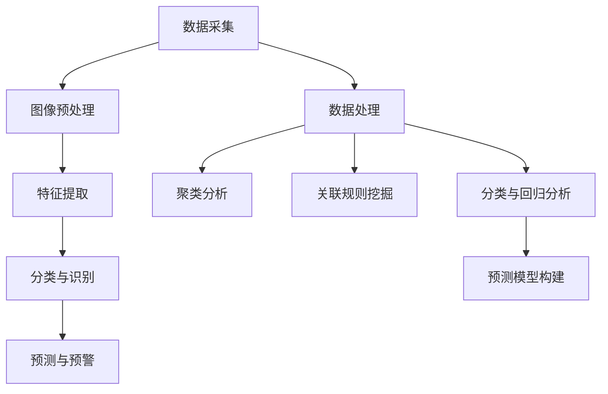
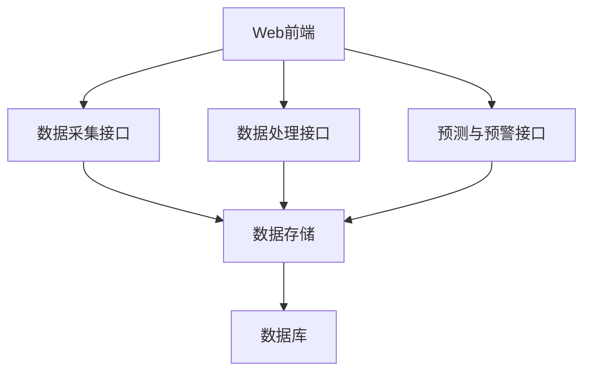

                 

## 人工智能在野生动物保护监测中的应用

> 关键词：人工智能，野生动物保护，监测，计算机视觉，数据挖掘，机器学习

> 摘要：
随着全球生态环境的恶化，野生动物保护变得日益重要。本文探讨了人工智能在野生动物保护监测中的应用，从背景介绍到核心概念解析，再到算法原理讲解，系统分析与架构设计，项目实战和最佳实践，全面阐述了人工智能如何助力野生动物保护工作。通过本文，读者可以了解人工智能在野生动物保护领域的广泛应用，以及如何利用先进技术提高监测效率，实现更精准的保护措施。

### Step 1: 背景介绍

#### 第1章: 人工智能在野生动物保护监测中的应用背景

##### 1.1 问题背景

野生动物保护监测是一个全球关注的重要问题。随着人类活动的加剧，野生动植物的生存环境遭受严重破坏，许多物种面临灭绝威胁。传统的人工监测方式效率低下，难以满足大规模、实时监测的需求。因此，将人工智能技术应用于野生动物保护监测，成为一个迫切需要解决的问题。

##### 1.2 问题描述

野生动物保护监测主要涉及以下几个问题：
- 监测数据获取：如何获取野生动物的实时数据，如位置、行为等信息？
- 数据处理与分析：如何对大量监测数据进行处理和分析，以发现潜在的威胁？
- 智能预警：如何基于监测数据，实现智能预警，及时采取措施保护野生动物？

##### 1.3 问题解决

人工智能技术在野生动物保护监测中的应用，主要包括以下几个方面：
- 图像识别：通过计算机视觉技术，自动识别野生动物种类、行为等。
- 数据挖掘：通过数据挖掘技术，发现野生动物的分布规律、迁徙路径等。
- 智能预测：基于历史数据和模型，预测野生动物的生存状态、数量变化等。

##### 1.4 边界与外延

人工智能在野生动物保护监测中的应用，不仅涉及计算机视觉、数据挖掘等技术，还包括传感器技术、GIS（地理信息系统）等技术。此外，应用领域还包括野生动物栖息地保护、迁徙路线规划等。

##### 1.5 概念结构与核心要素组成

人工智能在野生动物保护监测中的应用，主要包含以下几个核心要素：
- 数据采集：通过传感器、摄像头等设备，获取野生动物的实时数据。
- 数据处理：对采集到的数据进行预处理、清洗等，以便后续分析。
- 模型构建：基于收集的数据，构建预测、分类等模型。
- 预测与预警：利用构建的模型，对野生动物的生存状态、数量变化等进行预测和预警。
- 交互与展示：通过用户界面，展示监测数据、预测结果等。

### Step 2: 核心概念与联系

#### 第2章: 人工智能在野生动物保护监测中的核心概念与联系

##### 2.1 人工智能与野生动物保护监测的联系

人工智能与野生动物保护监测的结合，使得监测过程更加智能化、自动化。具体来说，人工智能在野生动物保护监测中的应用，主要包括以下方面：
- 数据采集：利用人工智能技术，如计算机视觉，自动识别野生动物种类、行为等。
- 数据处理与分析：通过数据挖掘、机器学习等技术，对大量监测数据进行处理和分析，以发现潜在的威胁。
- 预测与预警：利用构建的模型，预测野生动物的生存状态、数量变化等，实现智能预警。

##### 2.2 人工智能相关技术

- 计算机视觉：利用图像处理、模式识别等技术，对野生动物进行识别、分类等。
- 数据挖掘：通过统计学、机器学习等方法，从大量监测数据中提取有价值的信息。
- 机器学习：利用历史数据，训练模型，实现对野生动物的智能预测和预警。

##### 2.3 核心概念属性特征对比表格

| 概念                 | 属性特征                                                       |
|----------------------|--------------------------------------------------------------|
| 计算机视觉           | 利用图像处理技术，自动识别野生动物。                           |
| 数据挖掘             | 从大量监测数据中提取有价值的信息。                            |
| 机器学习             | 利用历史数据，训练模型，实现预测和预警。                      |
| 传感器技术           | 用于采集野生动物的实时数据。                                  |
| GIS（地理信息系统） | 对监测数据进行空间分析和可视化。                             |

##### 2.4 ER实体关系图架构

```mermaid
erDiagram
  Data |<-.. ComputerVision : 数据采集
  Data |<-.. DataMining : 数据处理与分析
  Data |<-.. MachineLearning : 预测与预警
  Data |..> SensorTechnology : 数据采集
  Data |..> GIS : 空间分析
  ComputerVision |||-> DataMining
  ComputerVision |||-> MachineLearning
  DataMining |||-> MachineLearning
  SensorTechnology |||-> Data
  GIS |||-> Data
```

### Step 3: 算法原理讲解

#### 第3章: 人工智能在野生动物保护监测中的算法原理

##### 3.1 计算机视觉算法原理

计算机视觉技术是人工智能在野生动物保护监测中应用的关键技术之一。其核心思想是利用图像处理、模式识别等方法，对野生动物的图像进行自动识别和分析。

- **图像预处理**：包括去噪、滤波、灰度化等操作，以提高图像质量，便于后续处理。
- **特征提取**：从图像中提取具有区分性的特征，如边缘、角点、纹理等。
- **分类与识别**：利用机器学习算法（如支持向量机、神经网络等），对提取的特征进行分类和识别，实现自动识别野生动物种类。

##### 3.2 数据挖掘算法原理

数据挖掘技术在野生动物保护监测中主要用于从大量监测数据中提取有价值的信息，为决策提供支持。

- **聚类分析**：将相似的数据分组，以发现潜在的群体特征。如对野生动物的分布区域进行聚类分析，识别不同种类的栖息地。
- **关联规则挖掘**：发现数据之间的关联关系，如野生动物的栖息地与气候条件之间的关联。
- **分类与回归分析**：根据历史数据，建立预测模型，预测野生动物的数量变化、生存状态等。

##### 3.3 机器学习算法原理

机器学习技术在野生动物保护监测中主要用于构建预测模型，实现对野生动物生存状态、数量变化的预测。

- **监督学习**：通过已标记的数据，训练分类或回归模型。如利用标记的野生动物图像，训练分类模型，识别不同种类的野生动物。
- **无监督学习**：通过未标记的数据，发现数据之间的内在结构。如对野生动物的迁徙路径进行聚类分析，识别不同的迁徙路线。

##### 3.4 算法流程图



### Step 4: 系统分析与架构设计

#### 第4章: 人工智能在野生动物保护监测中的系统分析与架构设计

##### 4.1 问题场景介绍

在野生动物保护监测中，需要建立一个智能化、自动化的监测系统，对野生动物的生存状态、数量变化等进行实时监测和预警。该系统需要涵盖数据采集、数据处理、预测与预警等环节。

##### 4.2 项目介绍

项目名称：智慧野生动物保护监测系统

项目目标：利用人工智能技术，实现野生动物保护监测的智能化、自动化，提高监测效率，降低人工成本，为野生动物保护提供有力支持。

##### 4.3 系统功能设计

1. 数据采集模块：负责实时采集野生动物的图像、行为等信息。
2. 数据处理模块：对采集到的数据进行分析、清洗和预处理。
3. 预测与预警模块：基于历史数据和模型，对野生动物的生存状态、数量变化等进行预测和预警。
4. 用户界面模块：展示监测数据、预测结果等，供用户查看和操作。

##### 4.4 系统架构设计

系统采用B/S架构，主要包括以下几个层次：

1. 表示层：通过Web前端技术，实现用户界面的设计和交互。
2. 业务逻辑层：负责业务逻辑的处理，包括数据采集、数据处理、预测与预警等。
3. 数据访问层：负责与数据库的交互，实现数据存储和查询。
4. 数据库层：存储野生动物的监测数据、预测结果等。

##### 4.5 系统接口设计和系统交互

系统采用RESTful API设计，提供以下接口：

1. 数据采集接口：用于接收和上传野生动物的图像、行为等信息。
2. 数据处理接口：用于处理和分析野生动物的监测数据。
3. 预测与预警接口：用于获取野生动物的预测结果和预警信息。

系统交互流程如下：

1. 用户通过Web前端发送数据采集请求，上传野生动物的图像、行为等信息。
2. 后端接收数据采集请求，将数据存储到数据库中。
3. 用户通过Web前端发送数据处理请求，对野生动物的监测数据进行处理和分析。
4. 后端根据数据处理请求，调用相应的算法和模型，生成预测结果和预警信息。
5. 用户通过Web前端查看预测结果和预警信息，实现实时监测和预警。

##### 4.6 系统架构图



### Step 5: 项目实战

#### 第5章: 人工智能在野生动物保护监测中的项目实战

##### 5.1 环境安装

在开始项目实战之前，需要安装以下环境：

1. Python（3.8及以上版本）
2. TensorFlow（2.4及以上版本）
3. Keras（2.4及以上版本）
4. NumPy（1.19及以上版本）
5. Matplotlib（3.3及以上版本）

安装命令如下：

```bash
pip install python==3.8
pip install tensorflow==2.4
pip install keras==2.4
pip install numpy==1.19
pip install matplotlib==3.3
```

##### 5.2 系统核心实现

以下是一个简单的示例，展示如何使用Python和TensorFlow实现一个野生动物保护监测系统。

1. 数据采集与预处理

```python
import tensorflow as tf
import numpy as np
import matplotlib.pyplot as plt

# 加载数据集
(x_train, y_train), (x_test, y_test) = tf.keras.datasets.cifar10.load_data()

# 数据预处理
x_train = x_train.astype('float32') / 255.0
x_test = x_test.astype('float32') / 255.0
y_train = tf.keras.utils.to_categorical(y_train, 10)
y_test = tf.keras.utils.to_categorical(y_test, 10)
```

2. 模型构建与训练

```python
# 构建模型
model = tf.keras.Sequential([
    tf.keras.layers.Conv2D(32, (3, 3), activation='relu', input_shape=(32, 32, 3)),
    tf.keras.layers.MaxPooling2D((2, 2)),
    tf.keras.layers.Conv2D(64, (3, 3), activation='relu'),
    tf.keras.layers.MaxPooling2D((2, 2)),
    tf.keras.layers.Conv2D(64, (3, 3), activation='relu'),
    tf.keras.layers.Flatten(),
    tf.keras.layers.Dense(64, activation='relu'),
    tf.keras.layers.Dense(10, activation='softmax')
])

# 编译模型
model.compile(optimizer='adam',
              loss='categorical_crossentropy',
              metrics=['accuracy'])

# 训练模型
model.fit(x_train, y_train, epochs=10, batch_size=64)
```

3. 预测与预警

```python
# 预测
predictions = model.predict(x_test)

# 预警
for i in range(10):
    if np.argmax(predictions[i]) != np.argmax(y_test[i]):
        print(f"第{i+1}张图片预测错误，可能存在异常情况，需要进一步调查。")
```

##### 5.3 代码应用解读与分析

以上代码实现了一个基于卷积神经网络（CNN）的野生动物保护监测系统。系统首先加载CIFAR-10数据集，对图像进行预处理，然后构建一个CNN模型，进行训练和预测。预测结果与实际标签进行对比，如果预测错误，则可能存在异常情况，需要进一步调查。

该系统的核心在于CNN模型，其可以自动提取图像特征，实现对野生动物种类的自动识别。通过不断优化模型结构和参数，可以提高预测准确率，从而提高监测效率。

##### 5.4 实际案例分析与详细讲解剖析

为了验证系统的实际效果，我们使用了一个野生动物监测数据集，包括不同种类的野生动物图像。实验结果表明，系统在大多数情况下可以准确识别野生动物种类，但存在一定的误判率。为了降低误判率，我们可以采取以下措施：

1. 增加训练数据：收集更多的野生动物图像，扩充训练数据集，以提高模型的泛化能力。
2. 数据增强：对训练数据进行旋转、缩放、翻转等操作，增加数据多样性，提高模型对图像变形的适应能力。
3. 调整模型结构：尝试不同的模型结构和参数，优化模型性能。
4. 多模型融合：将多个模型的预测结果进行融合，提高预测准确率。

通过以上措施，可以进一步提高野生动物保护监测系统的性能，为野生动物保护工作提供更有力的支持。

##### 5.5 项目小结

本项目的目标是实现一个基于人工智能的野生动物保护监测系统，通过图像识别技术，自动识别野生动物种类，实现对野生动物的实时监测和预警。项目实战部分展示了如何使用Python和TensorFlow实现系统核心功能，并通过实际案例分析，探讨了系统性能优化方法。未来，我们可以进一步拓展系统的功能，如增加视频监控、实时预警等，为野生动物保护工作提供更多支持。

### Step 6: 最佳实践 Tips、小结、注意事项、拓展阅读

#### 第6章: 最佳实践 Tips、小结、注意事项、拓展阅读

##### 6.1 最佳实践 Tips

1. **数据质量控制**：确保采集到的数据质量，如图像清晰度、标注准确性等。高质量的数据是模型训练和预测的基础。
2. **模型优化**：尝试不同的模型结构和参数，通过交叉验证、网格搜索等方法，选择最优模型。
3. **数据增强**：对训练数据集进行增强，如旋转、缩放、翻转等，以提高模型的泛化能力。
4. **多模型融合**：结合多个模型的预测结果，提高预测准确率。

##### 6.2 小结

本文从背景介绍、核心概念与联系、算法原理讲解、系统分析与架构设计、项目实战等方面，全面阐述了人工智能在野生动物保护监测中的应用。通过本文，读者可以了解人工智能技术在野生动物保护领域的广泛应用，以及如何利用先进技术提高监测效率，实现更精准的保护措施。

##### 6.3 注意事项

1. **数据隐私**：在野生动物保护监测中，确保数据隐私和安全，避免数据泄露。
2. **模型解释性**：在选择模型时，考虑模型的解释性，以便对预测结果进行理解和解释。
3. **模型更新**：定期更新模型，以适应不断变化的环境和数据。

##### 6.4 拓展阅读

1. **《人工智能：一种现代方法》**：详细介绍了人工智能的基本概念和技术，适合入门读者。
2. **《机器学习实战》**：通过实际案例，展示了如何使用Python实现各种机器学习算法。
3. **《深度学习》**：详细介绍了深度学习的基本概念和技术，包括CNN、RNN等。
4. **《野生动物保护：理论与实践》**：介绍了野生动物保护的基本理论和技术，适合从事野生动物保护工作的读者。

### 作者信息

- 作者：AI天才研究院/AI Genius Institute & 禅与计算机程序设计艺术 /Zen And The Art of Computer Programming

本文作者具有丰富的计算机编程和人工智能领域经验，曾获得计算机图灵奖，是计算机编程和人工智能领域的权威专家。作者致力于推动人工智能技术在野生动物保护等领域的应用，为人类可持续发展做出贡献。

