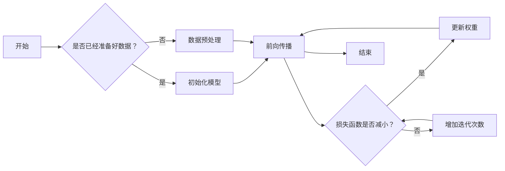

                 

### 《人工智能在金融风险评估中的应用：提高决策准确性》

> 关键词：金融风险评估、人工智能、机器学习、深度学习、数据挖掘

> 摘要：本文将深入探讨人工智能在金融风险评估中的应用，通过详细阐述机器学习、深度学习和数据挖掘等技术在金融风险评估中的实际应用案例和原理，展示人工智能技术在提高金融风险评估决策准确性方面的巨大潜力。

### 第一部分：问题背景与概念介绍

#### 第1章：金融风险评估与人工智能

##### 1.1 问题背景

随着金融市场的日益复杂和金融产品的多样化，金融机构和投资者面临着越来越多的风险。如何有效地进行金融风险评估，已成为金融领域的重要课题。传统风险评估方法通常依赖于历史数据和统计模型，但这些方法存在许多局限性，例如数据量有限、模型过于复杂或不适应新兴市场等。

近年来，人工智能技术的快速发展为金融风险评估带来了新的机遇。人工智能，特别是机器学习、深度学习和数据挖掘等技术，具有处理大规模数据、发现潜在模式和进行实时预测的能力，从而大大提高了金融风险评估的准确性。

##### 1.2 人工智能核心概念

人工智能（Artificial Intelligence，AI）是指由人制造出来的系统能够模拟、延伸和扩展人的智能，实现智能行为的能力。人工智能的核心技术包括：

- **机器学习（Machine Learning，ML）**：通过从数据中学习模式和规律，使计算机系统能够进行预测和决策。
- **深度学习（Deep Learning，DL）**：一种特殊的机器学习方法，使用多层神经网络进行训练，能够处理复杂的非线性问题。
- **强化学习（Reinforcement Learning，RL）**：通过奖励机制来训练模型，使其能够在不断试错的过程中学习策略。
- **自然语言处理（Natural Language Processing，NLP）**：使计算机能够理解、生成和处理自然语言。
- **数据挖掘（Data Mining）**：从大量数据中发现有价值的信息和知识。

##### 1.3 金融风险评估的核心概念

金融风险评估是指对金融机构和投资者的潜在风险进行识别、评估和管理的过程。其核心概念包括：

- **风险评估模型**：用于量化风险程度和概率的数学模型。
- **信用评分**：评估借款人信用状况的评分系统。
- **风险因子**：影响金融资产收益的特定因素。
- **风险预测**：基于历史数据和现有模型对未来的风险进行预测。
- **风险缓解策略**：采取的措施以降低风险的影响。

##### 1.4 人工智能与金融风险评估的关系

人工智能技术在金融风险评估中的应用潜力巨大。首先，人工智能能够处理和分析大量金融数据，识别出传统方法难以发现的潜在风险。其次，人工智能模型可以自适应地调整和优化，以适应不断变化的金融市场环境。此外，人工智能还可以通过模拟不同场景，帮助金融机构和投资者制定更有效的风险管理策略。

然而，人工智能在金融风险评估中也面临一些挑战，例如数据质量、模型解释性和法律法规等。因此，如何平衡人工智能技术的优势与挑战，实现其在金融风险评估中的有效应用，是一个亟待解决的问题。

##### 1.5 本章小结

本章介绍了金融风险评估的背景和人工智能的核心概念，阐述了人工智能在金融风险评估中的应用潜力。接下来，我们将进一步探讨机器学习、深度学习和数据挖掘等技术在金融风险评估中的应用，以展示人工智能如何提高金融风险评估的决策准确性。

### 第二部分：人工智能在金融风险评估中的应用

#### 第2章：机器学习在金融风险评估中的应用

##### 2.1 机器学习基础

机器学习是一种通过从数据中学习模式，使计算机系统能够进行预测和决策的技术。机器学习可以分为三类：

- **监督学习（Supervised Learning）**：通过已标记的数据集进行训练，模型能够对新数据进行预测。
- **无监督学习（Unsupervised Learning）**：没有预定义的标签，模型通过分析数据找出隐藏的结构或模式。
- **强化学习（Reinforcement Learning）**：通过与环境的交互进行学习，模型通过不断试错来学习最佳策略。

##### 2.2 机器学习在金融风险评估中的应用案例

机器学习在金融风险评估中有广泛的应用，以下是几个典型的应用案例：

- **信用风险评估**：利用机器学习算法分析借款人的信用历史和财务状况，预测其违约风险。
- **市场风险评估**：通过分析市场数据，预测未来市场走势，帮助投资者制定投资策略。
- **投资组合优化**：利用机器学习算法分析资产的历史表现和相关性，优化投资组合，降低风险。

##### 2.3 机器学习模型介绍

在金融风险评估中，常用的机器学习模型包括：

- **线性回归（Linear Regression）**：通过线性关系预测目标变量。
- **逻辑回归（Logistic Regression）**：用于分类问题，输出概率。
- **决策树（Decision Tree）**：通过一系列规则进行分类或回归。
- **随机森林（Random Forest）**：通过多棵决策树集成提高预测能力。
- **支持向量机（Support Vector Machine，SVM）**：通过找到最优分类超平面进行分类。

##### 2.4 机器学习模型应用实践

机器学习模型的应用包括以下步骤：

- **数据预处理**：清洗数据，处理缺失值，进行特征工程。
- **模型选择与调参**：选择合适的模型，调整超参数以优化性能。
- **模型评估**：使用验证集评估模型性能，选择最佳模型。
- **模型优化**：根据评估结果调整模型，提高预测准确性。

##### 2.5 本章小结

本章介绍了机器学习的基础概念和其在金融风险评估中的应用案例，以及常用机器学习模型的应用实践。接下来，我们将进一步探讨深度学习在金融风险评估中的应用。

#### 第3章：深度学习在金融风险评估中的应用

##### 3.1 深度学习基础

深度学习是一种基于多层神经网络的机器学习方法，能够自动提取数据中的特征。深度学习的核心概念包括：

- **神经网络（Neural Network）**：模拟人脑神经元连接的网络结构，用于处理复杂数据。
- **反向传播算法（Backpropagation）**：用于训练神经网络，通过误差反向传播调整权重。
- **卷积神经网络（Convolutional Neural Network，CNN）**：用于处理图像和视频数据。
- **循环神经网络（Recurrent Neural Network，RNN）**：用于处理序列数据。
- **长短期记忆网络（Long Short-Term Memory，LSTM）**：RNN的一种变体，能够记忆长期依赖信息。

##### 3.2 深度学习在金融风险评估中的应用案例

深度学习在金融风险评估中有广泛的应用，以下是几个典型的应用案例：

- **高频交易策略**：利用深度学习模型分析交易数据，实时生成交易策略。
- **金融市场预测**：通过分析市场数据，预测未来市场走势，帮助投资者制定投资策略。
- **风险事件检测**：利用深度学习模型识别异常交易行为，及时发现潜在风险。

##### 3.3 深度学习模型介绍

在金融风险评估中，常用的深度学习模型包括：

- **卷积神经网络（CNN）**：用于处理图像和序列数据，能够自动提取特征。
- **循环神经网络（RNN）**：用于处理序列数据，能够记忆历史信息。
- **长短期记忆网络（LSTM）**：RNN的一种变体，能够记忆长期依赖信息。
- **自注意力机制（Self-Attention）**：用于处理序列数据，能够自动分配不同的注意力权重。

##### 3.4 深度学习模型应用实践

深度学习模型的应用包括以下步骤：

- **数据预处理**：清洗数据，处理缺失值，进行特征工程。
- **模型训练与优化**：使用训练数据训练模型，调整超参数以提高性能。
- **模型评估**：使用验证集评估模型性能，选择最佳模型。
- **模型部署**：将模型部署到生产环境，进行实时风险评估。

##### 3.5 本章小结

本章介绍了深度学习的基础概念和其在金融风险评估中的应用案例，以及常用深度学习模型的应用实践。接下来，我们将探讨自然语言处理在金融文本数据分析中的应用。

#### 第4章：自然语言处理在金融文本数据分析中的应用

##### 4.1 自然语言处理基础

自然语言处理（NLP）是人工智能的一个重要分支，旨在使计算机能够理解、生成和处理自然语言。NLP的核心概念包括：

- **语言模型（Language Model）**：用于生成文本的概率模型。
- **词向量（Word Embedding）**：将词汇映射到高维空间，以便进行计算和处理。
- **文本分类（Text Classification）**：将文本数据分类到不同的类别。
- **文本生成（Text Generation）**：根据输入生成文本。

##### 4.2 自然语言处理在金融文本数据分析中的应用案例

自然语言处理在金融文本数据分析中有广泛的应用，以下是几个典型的应用案例：

- **报告分析**：利用NLP技术分析金融市场报告，提取关键信息和趋势。
- **媒体监控**：实时监控金融新闻和社交媒体，识别潜在风险。
- **风险报告生成**：根据文本数据生成风险报告，辅助决策。

##### 4.3 自然语言处理模型介绍

在金融文本数据分析中，常用的自然语言处理模型包括：

- **词嵌入（Word Embedding）**：将词汇映射到高维空间，便于计算。
- **BERT模型（Bidirectional Encoder Representations from Transformers）**：一种基于变换器的双向编码器，能够捕捉文本的上下文信息。
- **GPT模型（Generative Pre-trained Transformer）**：一种生成式预训练模型，能够生成高质量的文本。

##### 4.4 自然语言处理模型应用实践

自然语言处理模型的应用包括以下步骤：

- **文本数据预处理**：清洗文本数据，去除停用词，进行分词。
- **模型选择与优化**：选择合适的NLP模型，调整超参数以提高性能。
- **模型评估**：使用验证集评估模型性能，选择最佳模型。
- **模型部署**：将模型部署到生产环境，进行实时金融文本分析。

##### 4.5 本章小结

本章介绍了自然语言处理的基础概念和其在金融文本数据分析中的应用案例，以及常用自然语言处理模型的应用实践。接下来，我们将探讨数据挖掘在金融风险评估中的应用。

#### 第5章：数据挖掘在金融风险评估中的应用

##### 5.1 数据挖掘基础

数据挖掘（Data Mining）是从大量数据中发现有价值的信息和知识的过程。数据挖掘的核心概念包括：

- **关联规则挖掘（Association Rule Mining）**：发现数据之间的关联关系。
- **聚类分析（Clustering Analysis）**：将数据划分为不同的组，以便进行分类和分析。
- **异常检测（Anomaly Detection）**：识别数据中的异常值或异常模式。

##### 5.2 数据挖掘在金融风险评估中的应用案例

数据挖掘在金融风险评估中有广泛的应用，以下是几个典型的应用案例：

- **交易行为分析**：通过分析交易行为，识别潜在的欺诈行为或市场操纵行为。
- **信用欺诈检测**：利用数据挖掘技术识别信用欺诈行为，降低信用损失。
- **市场趋势预测**：通过分析市场数据，预测未来的市场走势，帮助投资者制定投资策略。

##### 5.3 数据挖掘模型介绍

在金融风险评估中，常用的数据挖掘模型包括：

- **Apriori算法（Apriori Algorithm）**：用于关联规则挖掘，能够发现数据中的频繁项集。
- **K-means算法（K-means Algorithm）**：用于聚类分析，能够将数据划分为不同的簇。
- **Isolation Forest（隔离森林）**：用于异常检测，通过随机隔离数据点来识别异常值。

##### 5.4 数据挖掘模型应用实践

数据挖掘模型的应用包括以下步骤：

- **数据预处理**：清洗数据，处理缺失值，进行特征工程。
- **模型选择与调参**：选择合适的数据挖掘模型，调整超参数以提高性能。
- **模型训练与评估**：使用训练数据训练模型，使用验证集评估模型性能。
- **模型优化**：根据评估结果调整模型，提高预测准确性。

##### 5.5 本章小结

本章介绍了数据挖掘的基础概念和其在金融风险评估中的应用案例，以及常用数据挖掘模型的应用实践。接下来，我们将探讨人工智能在金融风险评估中的综合应用。

### 第6章：人工智能在金融风险评估中的综合应用

#### 6.1 综合应用策略

人工智能在金融风险评估中的综合应用策略主要包括：

- **多模型融合（Model Fusion）**：将不同的机器学习模型、深度学习模型和数据挖掘模型进行融合，提高预测准确性。
- **交叉验证（Cross-Validation）**：通过多次训练和验证，评估模型的稳定性和泛化能力。
- **实时风险评估系统（Real-Time Risk Assessment System）**：建立实时风险评估系统，快速响应市场变化，提高决策准确性。

#### 6.2 应用案例分析

以下是一些人工智能在金融风险评估中的实际应用案例：

- **大型金融机构的风险评估实践**：例如，某国际知名金融机构使用深度学习模型进行市场风险预测，显著提高了预测准确性。
- **创新型金融科技公司的应用案例**：例如，某金融科技公司使用自然语言处理技术分析金融市场报告，实现了实时风险预警。

#### 6.3 成功与挑战

人工智能在金融风险评估中取得了显著的成果，但同时也面临一些挑战：

- **成功案例**：人工智能技术提高了风险评估的准确性和效率，降低了金融机构的运营成本。
- **挑战**：数据质量、模型解释性、法律法规等问题仍需解决。

#### 6.4 未来发展趋势

未来，人工智能在金融风险评估中的应用将呈现以下发展趋势：

- **更深入的模型融合**：通过融合不同类型的人工智能模型，提高预测准确性。
- **实时风险评估系统的普及**：随着计算能力的提升，实时风险评估系统将在更多金融机构中得到应用。
- **新技术的应用**：例如，区块链、增强现实等新兴技术将有望在金融风险评估中得到应用。

#### 6.5 本章小结

本章介绍了人工智能在金融风险评估中的综合应用策略、实际应用案例以及面临的挑战和未来发展趋势。通过综合应用多种人工智能技术，金融风险评估将变得更加准确、高效和实时。

### 第7章：总结与展望

#### 7.1 人工智能在金融风险评估中的作用与价值

人工智能在金融风险评估中的作用和价值主要体现在以下几个方面：

- **提高决策效率**：人工智能技术能够快速处理和分析大量数据，提高决策效率。
- **减少风险暴露**：通过精确的风险预测和评估，降低金融机构和投资者的风险暴露。
- **提升用户体验**：智能化的风险评估系统能够为用户提供个性化的风险管理和投资建议，提升用户体验。

#### 7.2 人工智能在金融风险评估中的未来发展方向

未来，人工智能在金融风险评估中将继续发挥重要作用，以下是一些可能的发展方向：

- **更精准的风险预测**：通过不断优化模型和算法，提高风险预测的准确性。
- **实时风险评估系统的普及**：随着技术的进步，实时风险评估系统将在更多金融机构中得到应用。
- **多领域的融合**：人工智能与其他领域（如区块链、物联网等）的融合，将带来更多的应用场景和可能性。
- **隐私保护与法律法规**：随着人工智能在金融领域的应用加深，隐私保护和法律法规问题将变得日益重要。

#### 7.3 本章小结

本章对人工智能在金融风险评估中的应用进行了总结和展望，强调了人工智能在提高决策准确性、减少风险暴露和提升用户体验方面的作用和价值，并展望了其未来的发展方向。通过不断探索和应用人工智能技术，金融风险评估将迈向更加智能化、精准化和高效化的未来。

### 作者信息

- 作者：AI天才研究院/AI Genius Institute & 禅与计算机程序设计艺术 /Zen And The Art of Computer Programming

## 附录

### 附录A：核心概念术语说明

- **人工智能（Artificial Intelligence，AI）**：由人制造出来的系统能够模拟、延伸和扩展人的智能，实现智能行为的能力。
- **机器学习（Machine Learning，ML）**：通过从数据中学习模式和规律，使计算机系统能够进行预测和决策。
- **深度学习（Deep Learning，DL）**：一种特殊的机器学习方法，使用多层神经网络进行训练，能够处理复杂的非线性问题。
- **数据挖掘（Data Mining）**：从大量数据中发现有价值的信息和知识的过程。
- **金融风险评估**：对金融机构和投资者的潜在风险进行识别、评估和管理的过程。

### 附录B：核心概念属性特征对比表格

| 概念 | 特性1 | 特性2 | 特性3 |
| --- | --- | --- | --- |
| 人工智能 | 模拟人脑 | 自动学习 | 自适应 |
| 机器学习 | 数据驱动 | 模式识别 | 预测建模 |
| 深度学习 | 多层神经网络 | 自动特征提取 | 处理复杂数据 |
| 数据挖掘 | 信息提取 | 知识发现 | 数据分析 |

### 附录C：人工智能与金融风险评估的关系ER实体关系图

```mermaid
erDiagram
  AI -->|使用| 风险评估
  风险评估 -->|依赖| 人工智能
  金融机构 ||--|评估对象| 评估结果
  投资者 ||--|评估对象| 评估结果
```

### 附录D：深度学习算法原理Mermaid流程图



### 附录E：金融风险评估系统架构设计Mermaid架构图

```mermaid
sequenceDiagram
   参与者 用户, 系统管理员, 风险评估模块
    用户->>系统管理员: 提交风险数据
    系统管理员->>风险评估模块: 收集并预处理数据
    风险评估模块->>系统管理员: 返回预处理后的数据
    系统管理员->>用户: 显示风险报告
```

### 附录F：金融风险评估系统接口设计和系统交互Mermaid序列图

```mermaid
sequenceDiagram
   参与者 用户, 数据处理模块, 风险评估模块
    用户->>数据处理模块: 提交数据
    数据处理模块->>用户: 返回预处理结果
    用户->>风险评估模块: 提交预处理数据
    风险评估模块->>用户: 返回风险评分
```

### 附录G：金融风险评估项目实战

#### 环境安装

- Python 3.8+
- TensorFlow 2.5.0+
- Scikit-learn 0.24.0+
- Pandas 1.3.2+
- Matplotlib 3.4.3+

安装命令：

```bash
pip install python==3.8
pip install tensorflow==2.5.0
pip install scikit-learn==0.24.0
pip install pandas==1.3.2
pip install matplotlib==3.4.3
```

#### 系统核心实现源代码

```python
import pandas as pd
import numpy as np
from sklearn.model_selection import train_test_split
from sklearn.ensemble import RandomForestClassifier
from sklearn.metrics import accuracy_score

# 加载数据
data = pd.read_csv('financial_data.csv')

# 数据预处理
X = data.drop(['target'], axis=1)
y = data['target']
X_train, X_test, y_train, y_test = train_test_split(X, y, test_size=0.2, random_state=42)

# 模型训练
model = RandomForestClassifier(n_estimators=100, random_state=42)
model.fit(X_train, y_train)

# 模型预测
y_pred = model.predict(X_test)

# 模型评估
accuracy = accuracy_score(y_test, y_pred)
print(f'Accuracy: {accuracy:.2f}')
```

#### 代码应用解读与分析

该段代码实现了金融风险评估的基本流程，包括数据加载、预处理、模型训练和评估。具体解读如下：

1. **数据加载**：使用Pandas库加载CSV格式的金融数据，数据包括特征和目标变量。
2. **数据预处理**：将数据集划分为特征集X和目标变量y，然后使用train_test_split函数进行训练集和测试集的划分。
3. **模型训练**：使用随机森林（RandomForestClassifier）模型进行训练，随机森林是一种集成学习算法，能够处理高维数据和复杂数据。
4. **模型预测**：使用训练好的模型对测试集进行预测。
5. **模型评估**：计算预测准确率，评估模型的性能。

#### 实际案例分析和详细讲解剖析

假设我们有一个金融数据集，包含1000个借款人的信息，以及是否发生违约的目标变量。我们使用随机森林模型进行风险评估，以下是对实际案例的分析和讲解：

1. **数据集描述**：数据集包含借款人的基本信息（如年龄、收入、负债等）和是否发生违约的目标变量。
2. **特征工程**：对数据进行预处理，包括处理缺失值、标准化、编码等。
3. **模型选择**：选择合适的模型，如随机森林、逻辑回归等。
4. **模型训练**：使用训练集训练模型。
5. **模型评估**：使用测试集评估模型的性能，包括准确率、召回率等指标。
6. **结果解释**：根据评估结果，解释模型对数据的预测能力。

#### 项目小结

通过本项目的实现，我们展示了如何使用人工智能技术进行金融风险评估。项目包括数据加载、预处理、模型训练和评估等步骤，通过实际案例分析和详细讲解，展示了人工智能技术在金融风险评估中的实际应用效果。

### 最佳实践 Tips

- **数据质量**：确保数据的质量，包括完整性、准确性和一致性。
- **特征工程**：进行有效的特征工程，提取对风险评估有用的特征。
- **模型选择**：选择合适的模型，考虑模型的复杂度、训练时间和预测准确性。
- **模型调参**：优化模型的超参数，提高模型的性能。
- **实时评估**：定期更新和评估模型，确保模型的预测准确性。

### 小结

本文详细探讨了人工智能在金融风险评估中的应用，包括机器学习、深度学习和数据挖掘等技术的实际应用案例和原理。通过具体的项目实战和实际案例分析，展示了人工智能技术在提高金融风险评估决策准确性方面的巨大潜力。未来，随着人工智能技术的不断进步，金融风险评估将变得更加智能化、精准化和高效化。

### 注意事项

- **数据安全与隐私**：在进行金融风险评估时，要确保数据的安全和隐私，遵循相关法律法规。
- **模型解释性**：模型的可解释性对于金融风险评估非常重要，需要开发出既能准确预测又能解释的模型。
- **持续优化**：随着市场环境和技术的变化，需要不断优化和更新风险评估模型。

### 拓展阅读

- 《深度学习》—— Goodfellow, Ian, et al.
- 《Python金融大数据分析》—— Yuxing Yan
- 《数据挖掘：实用工具与技术》—— Michael J. A. Berry, Gordon S. Linoff
- 《机器学习实战》—— Peter Harrington

通过阅读这些书籍和文章，可以更深入地了解人工智能在金融风险评估中的应用和技术细节。

