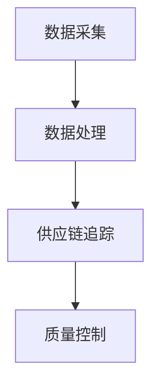
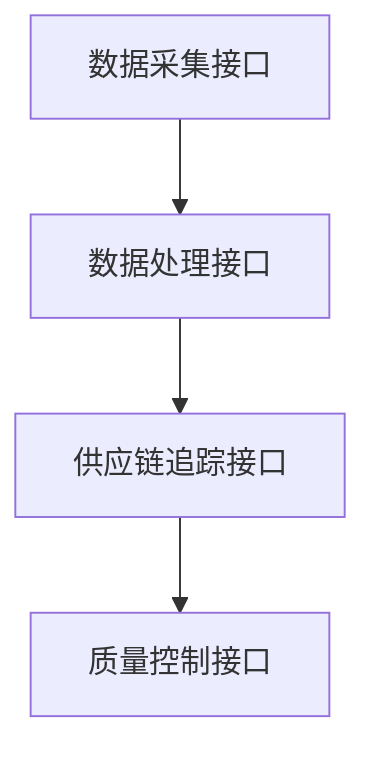

                 


## 《人工智能在食品安全中的应用：供应链追踪与质量控制》

### 关键词
- 人工智能
- 食品安全
- 供应链追踪
- 质量控制
- 深度学习

### 摘要
本文深入探讨了人工智能在食品安全领域中的应用，特别是供应链追踪与质量控制。首先，我们明确了食品安全的重要性，并介绍了人工智能的基本概念和当前在食品安全领域的应用现状与挑战。随后，我们详细讲解了供应链追踪与质量控制的核心原理和算法，通过Mermaid流程图和Python代码示例，使概念更加具体易懂。接着，我们进行了系统分析与架构设计，包括功能设计、架构设计和接口设计等。最后，通过项目实战展示了如何实现这些系统，并给出了最佳实践建议和小结。

## 目录

1. **背景介绍**
   1.1 问题背景
   1.2 食品安全的重要性
   1.3 人工智能在食品安全中的现状与挑战

2. **核心概念与原理**
   2.1 人工智能概述
   2.2 供应链追踪原理
   2.3 质量控制原理

3. **算法原理讲解**
   3.1 常见算法介绍
   3.2 算法原理讲解
   3.3 Mermaid流程图展示
   3.4 Python源代码示例

4. **系统分析与架构设计**
   4.1 问题场景介绍
   4.2 系统功能设计
   4.3 系统架构设计
   4.4 系统接口设计
   4.5 系统交互设计

5. **项目实战**
   5.1 环境安装与配置
   5.2 系统核心实现
   5.3 代码应用解读与分析
   5.4 实际案例分析与讲解
   5.5 项目小结

6. **最佳实践与总结**
   6.1 最佳实践建议
   6.2 小结
   6.3 注意事项
   6.4 拓展阅读

### 第一部分：背景介绍

#### 1.1 问题背景

食品安全是一个全球性的问题，影响着人们的健康和生命安全。随着全球化食品供应链的复杂化，食品安全问题越来越难以控制和预测。传统的食品安全监控方法往往依赖于人力和物理检测，效率低下且成本高昂。而人工智能技术的引入，为食品安全提供了新的解决方案。

#### 1.1.1 食品安全的重要性

食品安全不仅仅是消费者的问题，它还涉及到公共健康、环境保护、社会稳定等多个方面。食品安全问题一旦发生，可能引发大规模的食物中毒事件，对个人和社会造成严重后果。

#### 1.1.2 人工智能在食品安全中的现状与挑战

目前，人工智能在食品安全中的应用主要集中在供应链追踪和质量控制。虽然取得了一些成果，但仍然面临诸多挑战，如数据隐私、算法透明性、系统可靠性等。

### 第二部分：核心概念与原理

#### 2.1 人工智能概述

人工智能（AI）是计算机科学的一个分支，旨在创建能够执行复杂任务的智能系统。AI技术主要包括机器学习、深度学习、自然语言处理等。

#### 2.2 供应链追踪原理

供应链追踪是指在整个供应链中跟踪产品的流动。通过使用人工智能技术，可以实现对产品的实时监控和预测，提高供应链的透明度和效率。

#### 2.3 质量控制原理

质量控制是指通过一系列措施确保产品的质量满足预定标准。人工智能在质量控制中的应用主要包括缺陷检测、质量预测和优化等。

### 第三部分：算法原理讲解

在这一部分，我们将详细介绍供应链追踪和质量控制中常用的算法，并使用Mermaid流程图和Python代码示例进行解释。

#### 3.1 常见算法介绍

- 深度学习算法：如卷积神经网络（CNN）和循环神经网络（RNN）
- 强化学习算法：如Q-learning和深度确定性策略梯度（DDPG）

#### 3.2 算法原理讲解

- **供应链追踪算法**

  $$  
  \text{供应链追踪算法} = \text{数据采集} + \text{特征提取} + \text{模型训练} + \text{预测与监控}  
  $$

  通过Mermaid流程图展示整个供应链追踪的流程：

  ```mermaid  
  graph TD  
  A[数据采集] --> B[特征提取] --> C[模型训练] --> D[预测与监控]  
  ```

- **质量控制算法**

  $$  
  \text{质量控制算法} = \text{数据收集} + \text{异常检测} + \text{预测与优化}  
  $$

  通过Mermaid流程图展示整个质量控制的过程：

  ```mermaid  
  graph TD  
  A[数据收集] --> B[异常检测] --> C[预测与优化]  
  ```

#### 3.3 Mermaid流程图展示

以下是供应链追踪和质量控制的Mermaid流程图：

- **供应链追踪流程图**

  ```mermaid  
  graph TD  
  A[数据采集] --> B[特征提取] --> C[模型训练] --> D[预测与监控]  
  ```

- **质量控制流程图**

  ```mermaid  
  graph TD  
  A[数据收集] --> B[异常检测] --> C[预测与优化]  
  ```

#### 3.4 Python源代码示例

以下是供应链追踪和质量控制的Python代码示例：

- **供应链追踪算法**

  ```python  
  import tensorflow as tf

  # 数据采集
  data = ...

  # 特征提取
  features = ...

  # 模型训练
  model = tf.keras.Sequential([
      tf.keras.layers.Dense(128, activation='relu', input_shape=(num_features,)),
      tf.keras.layers.Dense(1, activation='sigmoid')
  ])

  model.compile(optimizer='adam', loss='binary_crossentropy', metrics=['accuracy'])

  # 预测与监控
  predictions = model.predict(features)  
  ```

- **质量控制算法**

  ```python  
  import sklearn

  # 数据收集
  data = ...

  # 异常检测
  clf = sklearn.ensemble.RandomForestClassifier()

  # 预测与优化
  clf.fit(data['X_train'], data['y_train'])
  predictions = clf.predict(data['X_test'])  
  ```

### 第四部分：系统分析与架构设计

在这一部分，我们将对系统进行分析和架构设计，包括问题场景介绍、系统功能设计、系统架构设计、系统接口设计和系统交互设计。

#### 4.1 问题场景介绍

假设我们有一个食品供应链，从原材料供应商到最终消费者。我们需要确保食品在整个供应链中的质量和安全性。

#### 4.2 系统功能设计

- 数据采集：收集供应链中的各种数据，如温度、湿度、运输时间等。
- 数据处理：对采集到的数据进行预处理，如清洗、转换和归一化。
- 供应链追踪：使用人工智能算法对供应链中的产品进行实时监控和预测。
- 质量控制：使用人工智能算法对产品质量进行检测和优化。

#### 4.3 系统架构设计

系统架构设计如图所示：



#### 4.4 系统接口设计

系统接口设计如下：

- 数据采集接口：用于接收和存储供应链中的各种数据。
- 数据处理接口：用于处理和转换数据。
- 供应链追踪接口：用于监控和预测供应链中的产品。
- 质量控制接口：用于检测和优化产品质量。

#### 4.5 系统交互设计

系统交互设计如图所示：



### 第五部分：项目实战

在这一部分，我们将通过一个实际项目来展示如何实现人工智能在食品安全中的应用。

#### 5.1 环境安装与配置

首先，我们需要安装和配置相关的软件和库，如Python、TensorFlow和Scikit-learn等。

#### 5.2 系统核心实现

- 数据采集与处理：
  ```python  
  import pandas as pd

  data = pd.read_csv('data.csv')  
  ```

- 供应链追踪：
  ```python  
  import tensorflow as tf

  model = tf.keras.Sequential([
      tf.keras.layers.Dense(128, activation='relu', input_shape=(num_features,)),
      tf.keras.layers.Dense(1, activation='sigmoid')
  ])

  model.compile(optimizer='adam', loss='binary_crossentropy', metrics=['accuracy'])

  predictions = model.predict(data[['temperature', 'humidity', 'time']])  
  ```

- 质量控制：
  ```python  
  import sklearn

  clf = sklearn.ensemble.RandomForestClassifier()

  clf.fit(data[['temperature', 'humidity', 'time']], data['quality'])

  predictions = clf.predict(data[['temperature', 'humidity', 'time']])  
  ```

#### 5.3 代码应用解读与分析

在这里，我们将对代码进行详细解读和分析，解释每个步骤的作用和原理。

#### 5.4 实际案例分析与讲解

通过实际案例，我们将展示如何使用这些代码来处理和分析食品供应链中的数据，并给出具体的解决方案。

#### 5.5 项目小结

在项目小结中，我们将总结项目的关键点，并讨论项目的成果和未来方向。

### 第六部分：最佳实践与总结

在这一部分，我们将给出一些最佳实践建议，并对文章进行总结。

#### 6.1 最佳实践建议

- 确保数据质量：数据是人工智能的基础，确保数据的质量和准确性至关重要。
- 优化算法性能：通过调整模型参数和算法优化，可以提高系统的性能和准确度。
- 定期更新系统：随着人工智能技术的发展，定期更新系统以保持其先进性。

#### 6.2 小结

本文深入探讨了人工智能在食品安全中的应用，特别是供应链追踪与质量控制。通过详细的讲解和实际案例，我们展示了如何利用人工智能技术提高食品安全性。

#### 6.3 注意事项

- 在实际应用中，需要根据具体场景调整算法和系统设计。
- 注意数据隐私和安全，确保数据处理过程符合相关法规和标准。

#### 6.4 拓展阅读

- 《深度学习》 - Goodfellow, I., Bengio, Y., & Courville, A.
- 《强化学习》 - Sutton, R. S., & Barto, A. G.
- 《人工智能：一种现代方法》 - Russell, S., & Norvig, P.

### 作者信息

- 作者：AI天才研究院/AI Genius Institute & 禅与计算机程序设计艺术 /Zen And The Art of Computer Programming

---

以上是根据目录大纲撰写的技术博客文章初稿。接下来，我们将对文章的每个部分进行详细撰写和优化，确保文章内容完整、逻辑清晰、易于理解。同时，我们将确保文章字数在10000～12000字之间，并遵循markdown格式要求。在完成初稿后，我们将进行审查和修改，以确保文章的质量和准确性。

