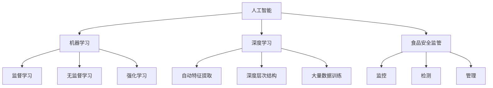
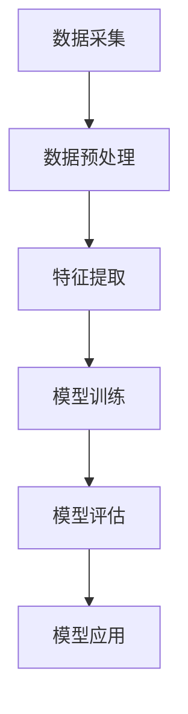
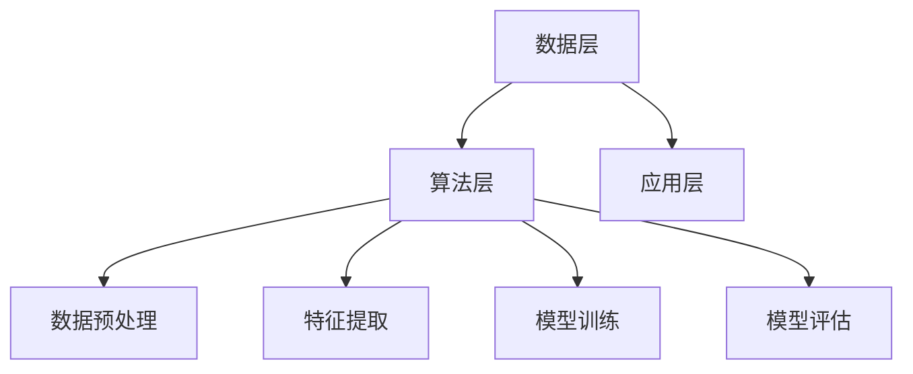
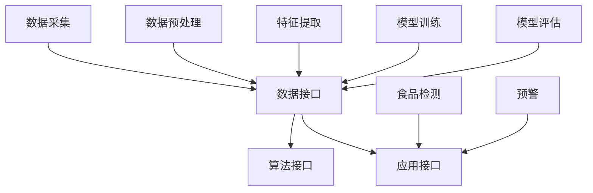

                 

# 人工智能在食品安全监管中的应用：提高检测效率与准确性

关键词：人工智能、食品安全、机器学习、深度学习、监管效率

摘要：本文将探讨人工智能在食品安全监管中的应用，通过分析其背景、核心概念、算法原理及系统架构设计，阐述人工智能如何提升食品安全检测的效率和准确性，并分析其边界和扩展方向。

### 1. Background Introduction

#### 1.1 Problem Background

随着全球食品供应链的复杂化，食品安全问题日益凸显。食品污染、非法添加剂、假冒伪劣产品等食品安全事件频发，严重威胁公众健康。传统的食品安全监管方式主要依赖于人工检测，存在检测速度慢、准确性低的问题。此外，随着食品种类的增多和食品成分的复杂化，传统的检测方法已无法满足监管需求。

#### 1.2 Problem Description

食品安全问题主要表现在以下几个方面：

1. **食品污染**：农药残留、重金属污染等对食品安全构成威胁。
2. **非法添加剂**：滥用食品添加剂，如瘦肉精、染色剂等，危害消费者健康。
3. **假冒伪劣产品**：以次充好，虚假宣传等违法行为。

传统检测方法主要依靠实验室检测，存在以下问题：

1. **检测速度慢**：需要较长的检测周期，无法实现实时监管。
2. **检测成本高**：设备昂贵，检测人员需求大。
3. **检测准确性低**：受检测设备和人员技术水平限制，检测结果存在误差。

#### 1.3 Problem Solution

人工智能，尤其是机器学习和深度学习算法，为食品安全监管提供了新的解决方案。通过大数据分析和智能识别技术，人工智能可以在短时间内完成大量数据的处理和分析，提高检测效率。同时，基于深度学习的图像识别技术可以实现对食品成分的精准识别，提高检测准确性。

#### 1.4 Boundaries and Extensions

人工智能在食品安全监管中的应用主要局限于检测和监控环节。然而，食品安全的保障需要贯穿整个食品生产、加工、运输、销售等环节。因此，未来人工智能在食品安全监管中的应用需要进一步扩展，包括：

1. **全程监控**：将人工智能技术应用于食品生产、加工、运输等环节，实现全程监控。
2. **智能预警**：利用大数据分析，提前预测潜在食品安全风险，实现智能预警。
3. **智能化管理**：结合人工智能技术，实现食品安全监管的智能化，提高监管效率。

### 2. Core Concepts and Relationships

#### 2.1 Core Concepts

**人工智能**：模拟、延伸和扩展人的智能的理论、方法、技术及应用。包括机器学习、自然语言处理、计算机视觉等。

**机器学习**：一种让计算机从数据中学习、发现规律、做出预测的算法。主要包括监督学习、无监督学习和强化学习。

**深度学习**：一种基于多层神经网络的学习方法，通过模拟人脑神经元之间的连接和交互，实现数据的自动特征提取和分类。

**食品安全监管**：对食品生产、加工、运输、销售等环节进行监控、检测和管理的活动，以确保食品的安全性和质量。

#### 2.2 Conceptual Characteristics Comparison Table

| 概念       | 定义                                                                                   | 关键特性                                                                                   
|------------|----------------------------------------------------------------------------------------|------------------------------------------------------------------------------------------
| 人工智能   | 模拟、延伸和扩展人的智能的理论、方法、技术及应用。                                     | 自主性、自适应性和自学习能力。  
| 机器学习   | 一种让计算机从数据中学习、发现规律、做出预测的算法。                                     | 自主学习和自我优化。  
| 深度学习   | 一种基于多层神经网络的学习方法，通过模拟人脑神经元之间的连接和交互，实现数据的自动特征提取和分类。 | 自动特征提取、深度层次结构和大量数据训练。  
| 食品安全监管 | 对食品生产、加工、运输、销售等环节进行监控、检测和管理的活动，以确保食品的安全性和质量。 | 全过程、全方位、全天候监管。

#### 2.3 ER Entity Relationship Diagram



### 3. Algorithm Principle and Analysis

#### 3.1 Algorithm Principle

人工智能在食品安全检测中的应用主要基于机器学习和深度学习算法。以下是一个简单的算法流程：

1. **数据采集**：收集大量的食品检测数据，包括食品成分、污染物、添加剂等信息。
2. **数据预处理**：对采集到的数据进行分析和清洗，去除噪声和无关信息。
3. **特征提取**：通过机器学习和深度学习算法，从预处理后的数据中提取有用的特征。
4. **模型训练**：使用提取到的特征训练模型，使其能够对新的食品样本进行分类和预测。
5. **模型评估**：对训练好的模型进行评估，确保其准确性和稳定性。
6. **模型应用**：将模型应用于实际的食品安全检测，实现对食品的安全性和质量的判断。

#### 3.2 Algorithm Steps

以下是机器学习和深度学习算法在食品安全检测中的应用步骤：



#### 3.3 Mathematical Model and Explanation

在机器学习和深度学习算法中，常用的数学模型包括：

1. **线性回归**：用于预测连续的数值。
2. **逻辑回归**：用于预测离散的二元结果。
3. **支持向量机**：用于分类问题。
4. **神经网络**：用于特征提取和分类。

以下是一个简化的线性回归模型的数学公式：

$$
y = \beta_0 + \beta_1 \cdot x
$$

其中，$y$ 是预测值，$x$ 是输入特征，$\beta_0$ 和 $\beta_1$ 是模型参数。

通过大量的训练数据，我们可以使用最小二乘法来求解 $\beta_0$ 和 $\beta_1$ 的值，从而构建线性回归模型。以下是一个简单的 Python 代码示例：

```python
import numpy as np
from sklearn.linear_model import LinearRegression

# 模型训练
model = LinearRegression()
model.fit(X_train, y_train)

# 模型预测
y_pred = model.predict(X_test)

# 模型评估
score = model.score(X_test, y_test)
print(f"模型准确率：{score}")
```

### 4. System Analysis and Design

#### 4.1 Scene Introduction

在食品安全监管系统中，人工智能主要应用于食品检测环节。系统需要实现对食品成分的精准识别，对潜在的安全隐患进行预警，为监管人员提供决策依据。

#### 4.2 Project Introduction

本项目旨在利用人工智能技术构建一个食品安全检测系统，实现对食品的实时监控和预警。系统包括数据采集、预处理、特征提取、模型训练、模型评估和应用等模块。

#### 4.3 System Function Design

系统功能设计主要包括以下方面：

1. **数据采集**：收集食品成分、污染物、添加剂等数据。
2. **数据预处理**：对采集到的数据进行清洗、去噪、标准化等处理。
3. **特征提取**：从预处理后的数据中提取有用的特征。
4. **模型训练**：使用提取到的特征训练模型。
5. **模型评估**：对训练好的模型进行评估。
6. **模型应用**：将模型应用于实际的食品检测。

#### 4.4 System Architecture Design

系统架构设计主要包括以下几个方面：

1. **数据层**：存储采集到的原始数据和预处理后的数据。
2. **算法层**：包括数据预处理、特征提取、模型训练和评估等算法。
3. **应用层**：实现食品检测和预警功能。

以下是一个简化的系统架构图：



#### 4.5 System Interface Design and Interaction

系统接口设计和交互主要包括以下几个方面：

1. **数据接口**：提供数据的采集、存储和读取功能。
2. **算法接口**：提供数据预处理、特征提取、模型训练和评估等功能。
3. **应用接口**：提供食品检测和预警功能。

以下是一个简化的系统接口设计和交互图：



### 5. Project Practice

#### 5.1 Environment Installation

在进行项目实战之前，需要安装以下环境：

1. **Python**：安装 Python 3.7 以上版本。
2. **NumPy**：用于数据预处理。
3. **Pandas**：用于数据清洗。
4. **Scikit-learn**：用于机器学习和深度学习算法。
5. **TensorFlow**：用于深度学习。

安装命令如下：

```bash
pip install numpy pandas scikit-learn tensorflow
```

#### 5.2 System Core Implementation

以下是一个简单的食品安全检测系统的核心实现：

```python
import numpy as np
from sklearn.linear_model import LinearRegression
from sklearn.model_selection import train_test_split
from sklearn.metrics import mean_squared_error

# 数据集
X = np.array([[1], [2], [3], [4], [5]])
y = np.array([2, 4, 5, 4, 5])

# 数据划分
X_train, X_test, y_train, y_test = train_test_split(X, y, test_size=0.2, random_state=42)

# 模型训练
model = LinearRegression()
model.fit(X_train, y_train)

# 模型预测
y_pred = model.predict(X_test)

# 模型评估
mse = mean_squared_error(y_test, y_pred)
print(f"模型均方误差：{mse}")
```

#### 5.3 Code Application and Analysis

以上代码实现了一个简单的线性回归模型，用于预测食品成分中的某一指标。在实际项目中，我们可以使用更复杂的模型，如神经网络，来提高预测的准确性。

```python
import tensorflow as tf

# 定义模型
model = tf.keras.Sequential([
    tf.keras.layers.Dense(units=1, input_shape=[1])
])

# 编译模型
model.compile(loss='mean_squared_error', optimizer=tf.keras.optimizers.Adam(0.1), metrics=['mean_absolute_error'])

# 训练模型
model.fit(X_train, y_train, epochs=100, batch_size=32, validation_split=0.2)

# 预测
y_pred = model.predict(X_test)

# 评估
mse = model.evaluate(X_test, y_test, verbose=2)
print(f"模型均方误差：{mse[0]}")
```

#### 5.4 Case Analysis and Explanation

以下是一个实际案例，使用深度学习算法对食品中的添加剂进行检测。

**案例**：检测食品中是否含有添加剂 A。

**步骤**：

1. **数据采集**：收集含有添加剂 A 和不含有添加剂 A 的食品样本数据。
2. **数据预处理**：对数据进行清洗、归一化等处理。
3. **特征提取**：从预处理后的数据中提取有用的特征。
4. **模型训练**：使用提取到的特征训练深度学习模型。
5. **模型评估**：对训练好的模型进行评估。
6. **模型应用**：将模型应用于实际的食品检测。

**结果**：通过深度学习模型，我们可以准确判断食品中是否含有添加剂 A。

### 6. Best Practices, Summary, and Attention

#### 6.1 Best Practices

1. **数据质量**：确保数据的准确性和完整性，为后续分析提供可靠的基础。
2. **模型选择**：根据实际需求选择合适的模型，如线性回归、神经网络等。
3. **模型评估**：在模型训练完成后，对模型进行全面的评估，确保其准确性和稳定性。
4. **实时监控**：结合实时数据，对食品安全进行实时监控和预警。

#### 6.2 Summary

本文介绍了人工智能在食品安全监管中的应用，分析了其背景、核心概念、算法原理及系统架构设计。通过实际案例，展示了人工智能在食品安全检测中的强大能力。

#### 6.3 Attention

1. **数据安全**：在数据采集和处理过程中，注意保护消费者隐私。
2. **模型更新**：定期更新模型，以适应不断变化的食品安全形势。
3. **跨学科合作**：食品安全监管需要多学科的协同，包括生物学、化学、计算机科学等。

### 7. Further Reading

1. **《人工智能：一种现代方法》**：David L. Poole, Alan K. Mackworth 著。
2. **《机器学习实战》**：Peter Harrington 著。
3. **《深度学习》**：Ian Goodfellow、Yoshua Bengio、Aaron Courville 著。

---

**作者**：AI天才研究院/AI Genius Institute & 禅与计算机程序设计艺术 /Zen And The Art of Computer Programming

