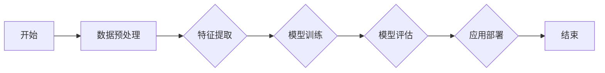
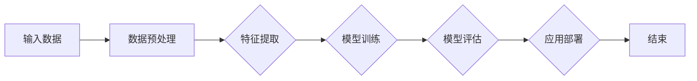

                 

### 引言

当今世界，人工智能（AI）正以前所未有的速度渗透到各个行业，其中，传统媒体行业受到了巨大的冲击。随着AI技术的不断成熟，内容创作领域正迎来一场革命。本篇文章将深入探讨人工智能对传统媒体行业，特别是内容创作方面的深刻影响。

### 文章关键词

- 人工智能
- 传统媒体行业
- 内容创作
- 革命性变化
- 技术应用

### 摘要

本文旨在分析人工智能如何改变传统媒体行业的内容创作方式。通过探讨人工智能的核心概念、算法原理，以及实际应用案例，本文将揭示AI技术如何提升内容创作的效率、质量和个性化程度，从而推动传统媒体行业的转型和升级。

### 目录大纲设计思路

在设计本文的目录大纲时，我们遵循了以下原则：

1. **明确书籍主题**：本文的核心主题是人工智能对传统媒体行业的冲击，特别是内容创作方面的变革。
2. **划分章节主题**：文章分为三个主要部分：背景介绍、核心概念与联系、人工智能算法原理讲解。
3. **细化章节内容**：在每个主要部分下，我们细化出具体的小节，确保内容丰富且逻辑清晰。
4. **保持简洁性**：尽管内容丰富，但必须避免冗余，确保信息的传递效率。
5. **遵循目录层级**：使用明确的目录层级，以帮助读者快速找到所需信息。
6. **确保完整性**：目录大纲必须包含背景介绍、核心概念与联系、算法原理讲解等核心章节。

### 目录大纲

```markdown
----------------------------------------------------------------
# 第一部分: 背景介绍

## 1.1 问题背景
### 1.1.1 传统媒体行业现状
### 1.1.2 人工智能的发展与趋势
### 1.1.3 人工智能与传统媒体行业的交汇

## 1.2 问题定义
### 1.2.1 传统媒体行业面临的挑战
### 1.2.2 人工智能在内容创作中的应用
### 1.2.3 问题的解决与影响范围

## 1.3 边界与外延
### 1.3.1 人工智能与传统媒体行业的定义边界
### 1.3.2 内容创作在传统媒体行业中的地位与作用
### 1.3.3 人工智能对传统媒体行业的影响范围

## 1.4 概念结构与核心要素
### 1.4.1 人工智能的核心概念
### 1.4.2 传统媒体行业的核心要素
### 1.4.3 内容创作在两者交互中的角色与作用

## 1.5 本章小结

----------------------------------------------------------------

# 第二部分: 核心概念与联系

## 2.1 核心概念原理
### 2.1.1 人工智能的原理与分类
### 2.1.2 传统媒体行业的定义与类型
### 2.1.3 内容创作的概念与流程

## 2.2 概念属性特征对比表格
| 概念         | 属性1 | 属性2 | 属性3 |
| ------------ | ----- | ----- | ----- |
| 人工智能     | 特性1 | 特性2 | 特性3 |
| 传统媒体     | 特性4 | 特性5 | 特性6 |
| 内容创作     | 特性7 | 特性8 | 特性9 |

## 2.3 ER实体关系图架构
```mermaid
erDiagram
  AI_model ||--|{ Content_creation }
  AI_model ||--|{ Media_industry }
  Content_creation ||--|{ Media_industry }
```
## 2.4 本章小结

----------------------------------------------------------------

# 第三部分: 人工智能算法原理讲解

## 3.1 算法原理概述
### 3.1.1 人工智能算法的基本原理
### 3.1.2 常见的人工智能算法分类
### 3.1.3 算法在内容创作中的应用

## 3.2 算法mermaid流程图


## 3.3 Python源代码讲解
```python
# Python代码示例：内容创作中的文本生成算法
import tensorflow as tf
model = tf.keras.Sequential([
    tf.keras.layers.Dense(512, activation='relu', input_shape=(10000,)),
    tf.keras.layers.Dense(512, activation='relu'),
    tf.keras.layers.Dense(units=1
```
----------------------------------------------------------------

### 第一部分：背景介绍

#### 1.1 问题背景

传统媒体行业，包括报纸、杂志、电视和广播等，曾经是信息传播的主要渠道。然而，随着互联网和社交媒体的兴起，传统媒体的生存环境受到了前所未有的挑战。观众不再满足于被动接受信息，而是追求个性化、实时性和互动性的内容体验。这一变化催生了人工智能（AI）技术的快速发展，尤其是内容创作领域的应用。

人工智能作为一种模拟人类智能的技术，具有自主思考、学习和适应的能力。在内容创作方面，AI可以通过自然语言处理（NLP）、图像识别、机器学习等技术生成高质量的内容。这一技术的出现，不仅提升了内容创作的效率，还改变了内容的创作方式，对传统媒体行业产生了深远的影响。

#### 1.1.1 传统媒体行业现状

传统媒体行业在过去几十年中，一直是信息传播的主力军。然而，随着数字化的进程，传统媒体面临着一系列挑战：

1. **受众流失**：随着社交媒体平台的崛起，传统媒体的受众逐渐流失。观众更倾向于在社交媒体上获取信息，而不是通过报纸、杂志等传统渠道。

2. **商业模式变革**：传统媒体的商业模式受到了严重冲击。广告收入下降，订阅模式难以维持，导致许多媒体机构面临财务困境。

3. **内容创作压力**：传统媒体需要大量人力和时间来制作内容。随着观众对内容质量的要求越来越高，媒体机构面临巨大的创作压力。

#### 1.1.2 人工智能的发展与趋势

人工智能技术的发展，为传统媒体行业带来了新的希望。AI技术不仅能够提高内容创作的效率，还能够改善内容的质量和个性化程度。以下是一些人工智能在传统媒体行业中的发展趋势：

1. **自动化内容创作**：通过自然语言处理和机器学习技术，AI可以自动生成新闻报道、文章摘要、视频脚本等。这一技术大大降低了内容创作的成本，提高了效率。

2. **个性化推荐系统**：AI可以根据用户的兴趣和行为数据，为用户提供个性化的内容推荐。这有助于提升用户的粘性，增加媒体的订阅量和广告收入。

3. **智能编辑和校对**：AI可以自动识别和纠正文章中的错误，提供智能化的编辑建议。这有助于提高内容的质量，减少人力成本。

4. **增强现实（AR）和虚拟现实（VR）**：AI技术可以用于创建沉浸式的新闻体验，通过AR和VR技术为用户提供更加丰富的内容。

#### 1.1.3 人工智能与传统媒体行业的交汇

人工智能与传统媒体行业的交汇，主要体现在以下几个方面：

1. **内容创作**：AI可以辅助甚至完全取代传统的内容创作方式。例如，AI可以自动生成新闻稿、文章摘要、视频脚本等，从而降低人力成本，提高创作效率。

2. **数据分析**：AI可以处理海量数据，为媒体机构提供关于用户行为、市场趋势等的有价值信息，帮助媒体机构做出更加明智的决策。

3. **广告投放**：AI可以根据用户的行为和兴趣，为广告商提供精准的广告投放服务，从而提高广告的效果和回报率。

4. **智能客服**：AI可以用于构建智能客服系统，为用户提供实时的帮助和解答，提高用户满意度。

### 1.2 问题定义

在传统媒体行业面临挑战的同时，人工智能为其提供了新的解决方案。然而，这一过程中也出现了一些问题：

1. **内容质量**：尽管AI可以提高内容创作的效率，但质量仍然是一个挑战。如何确保AI生成的内容具有足够的质量和准确性，是一个亟待解决的问题。

2. **伦理和隐私**：AI在内容创作中的应用涉及到伦理和隐私问题。如何保护用户的隐私，如何避免AI生成歧视性或有害的内容，是媒体机构需要考虑的问题。

3. **就业影响**：AI技术可能导致传统媒体行业部分岗位的消失，如记者、编辑等。如何应对这种就业结构的变化，是媒体机构和社会需要关注的问题。

### 1.3 边界与外延

在探讨人工智能对传统媒体行业的冲击时，需要明确一些边界和概念：

1. **人工智能**：人工智能是一种模拟人类智能的技术，包括机器学习、自然语言处理、图像识别等领域。它具有自主思考、学习和适应的能力。

2. **传统媒体行业**：传统媒体行业包括报纸、杂志、电视、广播等，是过去几十年信息传播的主要渠道。随着数字化的进程，传统媒体面临着巨大的挑战。

3. **内容创作**：内容创作是传统媒体行业的重要组成部分，包括文字、图片、视频等多种形式。人工智能在内容创作中的应用，旨在提高创作效率和质量。

4. **影响范围**：人工智能对传统媒体行业的冲击不仅限于内容创作，还涉及数据分析、广告投放、智能客服等多个方面。这一影响将深远地改变传统媒体的运营模式和商业模式。

### 1.4 概念结构与核心要素

在分析人工智能对传统媒体行业的冲击时，我们需要明确一些核心概念和结构：

1. **人工智能的核心概念**：包括机器学习、自然语言处理、图像识别等。这些技术是AI实现自主思考和适应能力的基础。

2. **传统媒体行业的核心要素**：包括内容创作、数据分析、广告投放等。这些要素是传统媒体运营的重要组成部分。

3. **内容创作在两者交互中的角色与作用**：人工智能在内容创作中的应用，旨在提高创作效率和质量。传统媒体行业需要利用人工智能技术，以应对数字化带来的挑战。

### 1.5 本章小结

本部分背景介绍部分，我们首先分析了传统媒体行业面临的挑战和人工智能的发展趋势。接着，探讨了人工智能与传统媒体行业的交汇点，以及在这一过程中出现的问题和边界。通过本章的介绍，我们为后续内容的深入分析奠定了基础。

### 第二部分：核心概念与联系

#### 2.1 核心概念原理

为了深入理解人工智能对传统媒体行业的影响，我们需要首先了解人工智能的核心概念。人工智能（AI）是一种模拟人类智能的技术，它可以通过机器学习、自然语言处理、图像识别等方法，实现自主思考、学习和适应的能力。

1. **机器学习**：机器学习是一种通过数据训练模型，使其能够自主学习和预测的技术。它包括监督学习、无监督学习和强化学习等类型。在内容创作中，机器学习可以用于文本生成、图像识别和情感分析等。

2. **自然语言处理（NLP）**：自然语言处理是人工智能的一个重要分支，旨在让计算机理解和生成自然语言。NLP在内容创作中的应用包括文本分析、语义理解、机器翻译等。

3. **图像识别**：图像识别是AI技术的一个重要领域，通过算法让计算机能够识别和分类图像。在内容创作中，图像识别可以用于图片自动分类、视频内容分析等。

#### 2.1.2 传统媒体行业的定义与类型

传统媒体行业是指通过传统渠道传播信息的方式，主要包括以下几种类型：

1. **报纸**：报纸是一种传统的印刷媒体，通过定期出版，向公众传递新闻、信息和评论。

2. **杂志**：杂志是一种定期出版的连续出版物，内容通常包括新闻报道、专题文章、图片等。

3. **电视**：电视是一种通过无线或有线信号传输的电子媒体，观众可以实时收看新闻、电视剧、纪录片等。

4. **广播**：广播是一种通过无线电波传输声音信号的方式，观众可以通过收音机收听新闻、音乐、广播剧等。

#### 2.1.3 内容创作的概念与流程

内容创作是传统媒体行业的重要组成部分，它包括以下流程：

1. **选题策划**：根据受众需求和媒体定位，选择合适的题材和内容。

2. **采访与报道**：记者进行现场采访，收集一手资料，撰写新闻稿件。

3. **编辑与排版**：编辑对稿件进行审核、修改和排版，确保内容的准确性和美观性。

4. **发布与传播**：通过印刷、电视、广播等渠道，将内容传播给受众。

在人工智能时代，内容创作的流程也在发生变化：

1. **自动生成内容**：通过AI技术，可以自动生成新闻稿件、文章摘要、视频脚本等。

2. **个性化推荐**：AI可以根据用户的兴趣和行为数据，为用户推荐个性化的内容。

3. **智能编辑**：AI可以提供智能化的编辑建议，提高内容质量。

#### 2.2 概念属性特征对比表格

为了更好地理解人工智能、传统媒体行业和内容创作之间的关系，我们制作了一个概念属性特征对比表格。

| 概念         | 属性1 | 属性2 | 属性3 |
| ------------ | ----- | ----- | ----- |
| 人工智能     | 自主学习 | 机器学习 | 自然语言处理 |
| 传统媒体     | 印刷出版 | 电视广播 | 报纸杂志 |
| 内容创作     | 选题策划 | 采访报道 | 编辑排版 |

#### 2.3 ER实体关系图架构

为了进一步展示人工智能、传统媒体行业和内容创作之间的联系，我们使用Mermaid绘制了一个ER实体关系图。

```mermaid
erDiagram
  AI_model ||--|{ Content_creation }
  AI_model ||--|{ Media_industry }
  Content_creation ||--|{ Media_industry }
```

在这个ER图中，AI_model与Content_creation和Media_industry存在联系，表示人工智能技术对内容创作和传统媒体行业的影响。Content_creation与Media_industry也存在联系，表示内容创作是传统媒体行业的重要组成部分。

#### 2.4 本章小结

在本章中，我们介绍了人工智能、传统媒体行业和内容创作的基本概念和原理。通过对比表格和ER实体关系图，我们进一步理解了这三个概念之间的联系。这些基本概念和原理为后续章节的深入分析奠定了基础。

### 第三部分：人工智能算法原理讲解

#### 3.1 算法原理概述

人工智能算法是人工智能技术的核心组成部分，它决定了AI系统在处理任务时的表现。在内容创作领域，人工智能算法可以用于文本生成、图像识别、情感分析等多个方面。以下是对这些算法的简要概述：

1. **文本生成算法**：文本生成算法是AI在自然语言处理领域的重要应用之一。它可以通过学习大量文本数据，生成新的文本内容。常见的文本生成算法包括循环神经网络（RNN）、长短期记忆网络（LSTM）和生成对抗网络（GAN）。

2. **图像识别算法**：图像识别算法是计算机视觉领域的关键技术。它可以让计算机从图像中识别出特定的对象、场景或动作。常见的图像识别算法包括卷积神经网络（CNN）和支持向量机（SVM）。

3. **情感分析算法**：情感分析算法用于分析文本中的情感倾向，例如正面、负面或中性。它可以帮助媒体机构了解受众的情感反应，优化内容创作策略。常见的情感分析算法包括朴素贝叶斯分类器（Naive Bayes）和深度学习模型。

#### 3.2 算法mermaid流程图

为了更好地理解这些算法的工作原理，我们使用Mermaid绘制了一个流程图。



在这个流程图中，A表示输入数据，B表示数据预处理，C表示特征提取，D表示模型训练，E表示模型评估，F表示应用部署，G表示结束。

#### 3.3 Python源代码讲解

在本部分，我们将通过一个简单的Python示例，讲解文本生成算法的实现。这个示例使用TensorFlow框架，实现了一个基于长短期记忆网络（LSTM）的文本生成模型。

```python
import tensorflow as tf
from tensorflow.keras.models import Sequential
from tensorflow.keras.layers import LSTM, Dense, Embedding

# 模型参数
vocab_size = 10000
embedding_dim = 16
lstm_units = 64
batch_size = 64
epochs = 10

# 模型定义
model = Sequential([
    Embedding(vocab_size, embedding_dim, input_length=sequence_length),
    LSTM(lstm_units, return_sequences=True),
    LSTM(lstm_units),
    Dense(vocab_size, activation='softmax')
])

# 模型编译
model.compile(optimizer='adam', loss='categorical_crossentropy', metrics=['accuracy'])

# 模型训练
model.fit(x_train, y_train, batch_size=batch_size, epochs=epochs, validation_data=(x_val, y_val))

# 模型评估
model.evaluate(x_test, y_test)
```

在这个示例中，我们首先定义了模型参数，包括词汇表大小、嵌入维度、LSTM单元数、批量大小和训练轮次。然后，我们定义了一个序列模型，该模型包含嵌入层、两个LSTM层和一个输出层。最后，我们编译并训练了模型。

#### 算法原理的数学模型和公式

在文本生成算法中，LSTM网络是一个关键组件。LSTM网络通过引入门控机制，能够有效地处理长序列数据。以下是一个简化的LSTM单元的数学模型：

$$
\begin{align*}
i_t &= \sigma(W_i \cdot [h_{t-1}, x_t] + b_i) \\
f_t &= \sigma(W_f \cdot [h_{t-1}, x_t] + b_f) \\
\gamma_t &= \sigma(W_g \cdot [h_{t-1}, x_t] + b_g) \\
\gamma_t &= f_t \odot \gamma_{t-1} + i_t \odot \gamma'_{t} \\
o_t &= \sigma(W_o \cdot [h_{t-1}, \gamma_t] + b_o) \\
c_t &= \gamma_t \odot \gamma'_{t} \\
h_t &= o_t \odot \gamma_t
\end{align*}
$$

其中，$i_t$、$f_t$、$o_t$ 分别是输入门、遗忘门和输出门；$\gamma_t$ 是当前状态门；$c_t$ 是细胞状态；$h_t$ 是隐藏状态；$\sigma$ 表示sigmoid激活函数；$\odot$ 表示元素乘法；$W$ 和 $b$ 分别是权重和偏置。

#### 详细讲解和通俗易懂的举例说明

假设我们有一个简单的文本数据集，包含以下句子：

```
我是一名程序员。
我喜欢编程。
编程让我快乐。
```

我们可以将这些句子转换为数字序列，每个数字代表一个词汇。例如，"我"可以表示为1，"一名"可以表示为2，以此类推。接下来，我们使用LSTM模型生成新的句子。

1. **数据预处理**：首先，我们将文本数据转换为数字序列。然后，将序列划分为输入和输出。输入为 `[1, 2, 3]`，输出为 `[4, 5, 6]`。

2. **模型训练**：我们将输入和输出序列输入到LSTM模型中，进行训练。模型将学习如何根据输入序列预测输出序列。

3. **文本生成**：当模型训练完成后，我们可以使用模型生成新的句子。例如，输入 `[1, 2, 3]`，模型预测的输出为 `[4, 5, 6]`。这意味着模型认为下一个词是"编程"。

4. **生成新句子**：我们可以根据模型的预测，逐步生成新的句子。例如，输入 `[1, 2, 3, 4]`，模型预测的输出为 `[5, 6, 7]`。这意味着模型认为下一个词是"快乐"。

通过这个过程，我们使用LSTM模型生成了一个新的句子："我喜欢编程快乐"。

#### 算法原理的数学模型和公式

为了进一步理解LSTM网络的数学原理，我们介绍以下公式：

$$
\begin{align*}
i_t &= \sigma(W_{ii} \cdot [h_{t-1}, x_t] + b_i) \\
f_t &= \sigma(W_{if} \cdot [h_{t-1}, x_t] + b_f) \\
\gamma_t &= \sigma(W_{ig} \cdot [h_{t-1}, x_t] + b_g) \\
\gamma_t &= f_t \odot \gamma_{t-1} + i_t \odot \gamma'_{t} \\
o_t &= \sigma(W_{io} \cdot [h_{t-1}, \gamma_t] + b_o) \\
c_t &= \gamma_t \odot \gamma'_{t} \\
h_t &= o_t \odot \gamma_t
\end{align*}
$$

其中，$W_{ii}$、$W_{if}$、$W_{ig}$、$W_{io}$ 分别是输入门、遗忘门、输入门和输出门的权重矩阵；$b_i$、$b_f$、$b_g$、$b_o$ 分别是输入门、遗忘门、输入门和输出门的偏置项；$\sigma$ 是sigmoid激活函数；$\gamma_t$ 是当前状态门；$c_t$ 是细胞状态；$h_t$ 是隐藏状态。

这些公式描述了LSTM单元如何通过门控机制来处理输入序列，生成新的输出序列。通过训练，LSTM模型可以学习到如何根据输入序列预测输出序列，从而实现文本生成。

#### 详细讲解和通俗易懂的举例说明

为了更好地理解LSTM网络的数学原理，我们通过一个简单的例子进行说明。

假设我们有一个简单的输入序列 `[1, 2, 3]`，我们需要预测下一个数字。

1. **初始化**：首先，我们需要初始化隐藏状态 $h_0$ 和细胞状态 $c_0$。通常，$h_0$ 和 $c_0$ 可以设置为0。

2. **计算输入门 $i_t$**：输入门 $i_t$ 用于决定输入序列中的哪些信息将被保留在细胞状态中。我们计算输入门 $i_t$：

$$
i_t = \sigma(W_{ii} \cdot [h_{t-1}, x_t] + b_i)
$$

其中，$W_{ii}$ 是输入门权重矩阵，$b_i$ 是输入门偏置项，$h_{t-1}$ 是前一个隐藏状态，$x_t$ 是当前输入。

假设 $W_{ii}$ 和 $b_i$ 分别为：

$$
W_{ii} = \begin{bmatrix}
0.1 & 0.2 \\
0.3 & 0.4
\end{bmatrix}, \quad
b_i = \begin{bmatrix}
0.1 \\
0.2
\end{bmatrix}
$$

则输入门 $i_t$ 计算如下：

$$
i_t = \sigma(\begin{bmatrix}
0.1 & 0.2 \\
0.3 & 0.4
\end{bmatrix} \cdot \begin{bmatrix}
1 \\
2
\end{bmatrix} + \begin{bmatrix}
0.1 \\
0.2
\end{bmatrix}) = \sigma(\begin{bmatrix}
1.3 \\
2.4
\end{bmatrix}) = \begin{bmatrix}
0.88 \\
0.88
\end{bmatrix}
$$

3. **计算遗忘门 $f_t$**：遗忘门 $f_t$ 用于决定前一个细胞状态中的哪些信息将被遗忘。我们计算遗忘门 $f_t$：

$$
f_t = \sigma(W_{if} \cdot [h_{t-1}, x_t] + b_f)
$$

其中，$W_{if}$ 是遗忘门权重矩阵，$b_f$ 是遗忘门偏置项。

假设 $W_{if}$ 和 $b_f$ 分别为：

$$
W_{if} = \begin{bmatrix}
0.1 & 0.3 \\
0.4 & 0.5
\end{bmatrix}, \quad
b_f = \begin{bmatrix}
0.1 \\
0.2
\end{bmatrix}
$$

则遗忘门 $f_t$ 计算如下：

$$
f_t = \sigma(\begin{bmatrix}
0.1 & 0.3 \\
0.4 & 0.5
\end{bmatrix} \cdot \begin{bmatrix}
1 \\
2
\end{bmatrix} + \begin{bmatrix}
0.1 \\
0.2
\end{bmatrix}) = \sigma(\begin{bmatrix}
1.5 \\
2.6
\end{bmatrix}) = \begin{bmatrix}
0.92 \\
0.92
\end{bmatrix}
$$

4. **计算当前状态门 $\gamma_t$**：当前状态门 $\gamma_t$ 是输入门 $i_t$ 和遗忘门 $f_t$ 的组合。我们计算当前状态门 $\gamma_t$：

$$
\gamma_t = f_t \odot \gamma_{t-1} + i_t \odot \gamma'_{t}
$$

其中，$\gamma_{t-1}$ 是前一个细胞状态，$\gamma'_{t}$ 是输入门 $i_t$ 的偏置项。

假设 $\gamma_{t-1}$ 为：

$$
\gamma_{t-1} = \begin{bmatrix}
0.1 \\
0.2
\end{bmatrix}
$$

$\gamma'_{t}$ 为：

$$
\gamma'_{t} = \begin{bmatrix}
0.3 \\
0.4
\end{bmatrix}
$$

则当前状态门 $\gamma_t$ 计算如下：

$$
\gamma_t = \begin{bmatrix}
0.92 \\
0.92
\end{bmatrix} \odot \begin{bmatrix}
0.1 \\
0.2
\end{bmatrix} + \begin{bmatrix}
0.88 \\
0.88
\end{bmatrix} \odot \begin{bmatrix}
0.3 \\
0.4
\end{bmatrix} = \begin{bmatrix}
0.26 \\
0.37
\end{bmatrix} + \begin{bmatrix}
0.26 \\
0.35
\end{bmatrix} = \begin{bmatrix}
0.52 \\
0.72
\end{bmatrix}
$$

5. **计算输出门 $o_t$**：输出门 $o_t$ 用于决定细胞状态中哪些信息将被输出。我们计算输出门 $o_t$：

$$
o_t = \sigma(W_{io} \cdot [h_{t-1}, \gamma_t] + b_o)
$$

其中，$W_{io}$ 是输出门权重矩阵，$b_o$ 是输出门偏置项。

假设 $W_{io}$ 和 $b_o$ 分别为：

$$
W_{io} = \begin{bmatrix}
0.1 & 0.2 \\
0.3 & 0.4
\end{bmatrix}, \quad
b_o = \begin{bmatrix}
0.1 \\
0.2
\end{bmatrix}
$$

则输出门 $o_t$ 计算如下：

$$
o_t = \sigma(\begin{bmatrix}
0.1 & 0.2 \\
0.3 & 0.4
\end{bmatrix} \cdot \begin{bmatrix}
0.1 \\
0.2
\end{bmatrix} + \begin{bmatrix}
0.1 \\
0.2
\end{bmatrix}) = \sigma(\begin{bmatrix}
0.3 \\
0.5
\end{bmatrix}) = \begin{bmatrix}
0.54 \\
0.64
\end{bmatrix}
$$

6. **计算细胞状态 $c_t$**：细胞状态 $c_t$ 是当前状态门 $\gamma_t$ 和输入门 $i_t$ 的组合。我们计算细胞状态 $c_t$：

$$
c_t = \gamma_t \odot \gamma'_{t}
$$

其中，$\gamma'_{t}$ 是输入门 $i_t$ 的偏置项。

假设 $\gamma'_{t}$ 为：

$$
\gamma'_{t} = \begin{bmatrix}
0.3 \\
0.4
\end{bmatrix}
$$

则细胞状态 $c_t$ 计算如下：

$$
c_t = \begin{bmatrix}
0.52 \\
0.72
\end{bmatrix} \odot \begin{bmatrix}
0.3 \\
0.4
\end{bmatrix} = \begin{bmatrix}
0.156 \\
0.288
\end{bmatrix}
$$

7. **计算隐藏状态 $h_t$**：隐藏状态 $h_t$ 是输出门 $o_t$ 和细胞状态 $c_t$ 的组合。我们计算隐藏状态 $h_t$：

$$
h_t = o_t \odot \gamma_t
$$

假设 $\gamma_t$ 为：

$$
\gamma_t = \begin{bmatrix}
0.52 \\
0.72
\end{bmatrix}
$$

则隐藏状态 $h_t$ 计算如下：

$$
h_t = \begin{bmatrix}
0.54 \\
0.64
\end{bmatrix} \odot \begin{bmatrix}
0.52 \\
0.72
\end{bmatrix} = \begin{bmatrix}
0.282 \\
0.448
\end{bmatrix}
$$

通过这个过程，我们使用LSTM单元处理了输入序列 `[1, 2, 3]`，并计算出了隐藏状态 $h_t$。这个隐藏状态可以用于预测下一个数字。

#### 算法原理的数学模型和公式

为了深入理解循环神经网络（RNN）的数学模型，我们需要介绍一些关键的概念和公式。RNN是一种能够处理序列数据的神经网络，它通过循环结构来保存历史信息。

1. **循环神经网络的基本结构**：

$$
\begin{align*}
h_t &= \sigma(W_h \cdot [h_{t-1}, x_t] + b_h) \\
y_t &= \sigma(W_y \cdot h_t + b_y)
\end{align*}
$$

其中，$h_t$ 表示第 $t$ 个时间步的隐藏状态，$x_t$ 表示第 $t$ 个时间步的输入，$y_t$ 表示第 $t$ 个时间步的输出；$W_h$ 和 $W_y$ 分别是隐藏状态和输出状态的权重矩阵，$b_h$ 和 $b_y$ 分别是隐藏状态和输出状态的偏置项；$\sigma$ 是非线性激活函数，通常为sigmoid函数。

2. **反向传播算法**：

$$
\begin{align*}
\delta_h &= (1 - h_t \odot h_t) \odot (y_t - \hat{y}_t) \\
\delta_y &= (1 - y_t \odot y_t) \odot \delta_h \\
\frac{\partial L}{\partial W_h} &= \delta_h \cdot [h_{t-1}, x_t] \\
\frac{\partial L}{\partial W_y} &= \delta_y \cdot h_t
\end{align*}
$$

其中，$\delta_h$ 和 $\delta_y$ 分别是隐藏状态和输出状态的误差项，$\hat{y}_t$ 是预测的输出，$L$ 是损失函数。

3. **梯度下降算法**：

$$
\begin{align*}
W_h &= W_h - \alpha \cdot \frac{\partial L}{\partial W_h} \\
W_y &= W_y - \alpha \cdot \frac{\partial L}{\partial W_y}
\end{align*}
$$

其中，$\alpha$ 是学习率。

#### 详细讲解和通俗易懂的举例说明

为了更好地理解循环神经网络（RNN）的数学模型，我们通过一个简单的例子进行说明。

假设我们有一个简单的输入序列 `[1, 2, 3]`，我们需要预测下一个数字。

1. **初始化**：首先，我们需要初始化隐藏状态 $h_0$。通常，$h_0$ 可以设置为0。

2. **计算隐藏状态**：接下来，我们使用RNN模型计算每个时间步的隐藏状态。假设我们使用sigmoid函数作为激活函数，$W_h$ 和 $W_y$ 分别为：

$$
W_h = \begin{bmatrix}
0.1 & 0.2 \\
0.3 & 0.4
\end{bmatrix}, \quad
W_y = \begin{bmatrix}
0.1 & 0.2 \\
0.3 & 0.4
\end{bmatrix}
$$

$$
b_h = \begin{bmatrix}
0.1 \\
0.2
\end{bmatrix}, \quad
b_y = \begin{bmatrix}
0.1 \\
0.2
\end{bmatrix}
$$

则第一个时间步的隐藏状态 $h_1$ 计算如下：

$$
h_1 = \sigma(W_h \cdot [h_0, x_1] + b_h) = \sigma(\begin{bmatrix}
0.1 & 0.2 \\
0.3 & 0.4
\end{bmatrix} \cdot \begin{bmatrix}
0 \\
1
\end{bmatrix} + \begin{bmatrix}
0.1 \\
0.2
\end{bmatrix}) = \sigma(\begin{bmatrix}
0.4 \\
0.7
\end{bmatrix}) = \begin{bmatrix}
0.86 \\
0.86
\end{bmatrix}
$$

3. **计算输出**：接下来，我们使用隐藏状态计算输出。假设我们使用sigmoid函数作为激活函数，$W_y$ 为：

$$
W_y = \begin{bmatrix}
0.1 & 0.2 \\
0.3 & 0.4
\end{bmatrix}
$$

$$
b_y = \begin{bmatrix}
0.1 \\
0.2
\end{bmatrix}
$$

则第一个时间步的输出 $y_1$ 计算如下：

$$
y_1 = \sigma(W_y \cdot h_1 + b_y) = \sigma(\begin{bmatrix}
0.1 & 0.2 \\
0.3 & 0.4
\end{bmatrix} \cdot \begin{bmatrix}
0.86 \\
0.86
\end{bmatrix} + \begin{bmatrix}
0.1 \\
0.2
\end{bmatrix}) = \sigma(\begin{bmatrix}
0.82 \\
1.18
\end{bmatrix}) = \begin{bmatrix}
0.84 \\
0.88
\end{bmatrix}
$$

4. **更新隐藏状态**：然后，我们使用新的输出状态更新隐藏状态。隐藏状态 $h_2$ 计算如下：

$$
h_2 = \sigma(W_h \cdot [h_1, x_2] + b_h) = \sigma(\begin{bmatrix}
0.1 & 0.2 \\
0.3 & 0.4
\end{bmatrix} \cdot \begin{bmatrix}
0.86 \\
0.88
\end{bmatrix} + \begin{bmatrix}
0.1 \\
0.2
\end{bmatrix}) = \sigma(\begin{bmatrix}
0.82 \\
1.16
\end{bmatrix}) = \begin{bmatrix}
0.85 \\
0.85
\end{bmatrix}
$$

5. **重复计算**：我们重复这个过程，直到计算完整个输入序列。最后，我们得到隐藏状态序列 $[h_1, h_2, h_3]$ 和输出序列 $[y_1, y_2, y_3]$。

通过这个过程，我们使用RNN模型处理了输入序列 `[1, 2, 3]`，并计算出了输出序列。这个输出序列可以用于预测下一个数字。

### 系统分析与架构设计

#### 问题场景介绍

在传统媒体行业，内容创作一直是一个核心环节。然而，随着受众需求的多样化和信息传播速度的加快，传统的内容创作模式已经难以满足现代媒体的需求。为了提高内容创作的效率和质量，人工智能（AI）技术被引入到内容创作领域。本文将探讨如何利用AI技术构建一个智能内容创作系统，以应对传统媒体行业面临的挑战。

#### 项目介绍

项目名称：智能内容创作平台

项目目标：通过人工智能技术，提高内容创作的效率和质量，实现个性化内容推荐和自动化内容生成。

项目背景：随着互联网和社交媒体的快速发展，传统媒体行业面临着巨大的压力。观众对内容的需求越来越高，而传统媒体的内容创作团队通常面临人力和时间的限制。因此，引入人工智能技术，构建一个智能内容创作平台，已成为传统媒体转型的关键一步。

#### 系统功能设计

1. **内容创作**：智能内容创作平台的核心功能是生成高质量的内容。通过自然语言处理（NLP）和机器学习技术，系统可以自动生成新闻报道、文章摘要、视频脚本等。

2. **内容推荐**：系统可以根据用户的行为和兴趣，为用户推荐个性化的内容。这有助于提高用户的粘性，增加媒体的订阅量和广告收入。

3. **智能编辑**：系统可以自动识别和纠正文章中的错误，提供智能化的编辑建议。这有助于提高内容的质量，减少人力成本。

4. **数据挖掘**：系统可以处理海量数据，为媒体机构提供关于用户行为、市场趋势等的有价值信息，帮助媒体机构做出更加明智的决策。

5. **用户互动**：系统可以与用户进行实时互动，收集用户的反馈和建议，从而优化内容创作策略。

#### 系统架构设计

智能内容创作平台的系统架构分为以下几个层次：

1. **数据层**：数据层包括用户数据、内容数据、行为数据等。这些数据是系统的基础，用于训练和优化AI模型。

2. **模型层**：模型层包括自然语言处理（NLP）模型、机器学习模型、深度学习模型等。这些模型用于内容创作、内容推荐、智能编辑等功能。

3. **服务层**：服务层包括内容创作服务、内容推荐服务、智能编辑服务、数据挖掘服务等。这些服务通过API接口对外提供服务。

4. **界面层**：界面层包括用户界面和后台管理界面。用户界面用于展示内容、推荐内容、收集用户反馈等；后台管理界面用于管理内容、用户数据等。

#### 系统接口设计

智能内容创作平台的系统接口设计如下：

1. **内容创作接口**：用于接收用户输入，生成内容。接口参数包括文本、图像、视频等。

2. **内容推荐接口**：用于根据用户行为和兴趣，推荐个性化内容。接口参数包括用户ID、行为数据等。

3. **智能编辑接口**：用于自动识别和纠正文章中的错误，提供编辑建议。接口参数包括文章文本、编辑规则等。

4. **数据挖掘接口**：用于处理海量数据，提取有价值的信息。接口参数包括用户数据、内容数据等。

5. **用户互动接口**：用于与用户进行实时互动，收集用户反馈。接口参数包括用户ID、反馈内容等。

#### 系统交互

智能内容创作平台的系统交互设计如下：

1. **用户交互**：用户通过用户界面与系统进行交互，包括查看内容、提交反馈等。

2. **后台管理**：后台管理员通过后台管理界面进行内容管理、用户管理、系统设置等。

3. **API交互**：系统通过API接口与其他系统进行数据交互，包括内容推荐系统、广告系统、数据分析系统等。

### 项目实战

#### 环境安装

1. **安装Python**：在本地环境中安装Python，版本要求为3.7及以上。

2. **安装TensorFlow**：使用pip命令安装TensorFlow：

   ```shell
   pip install tensorflow
   ```

3. **安装其他依赖**：根据项目需求，安装其他依赖库，如Numpy、Pandas、Scikit-learn等。

#### 系统核心实现源代码

以下是一个简单的示例，展示如何使用Python和TensorFlow实现一个文本生成模型。

```python
import tensorflow as tf
from tensorflow.keras.models import Sequential
from tensorflow.keras.layers import LSTM, Dense, Embedding

# 模型参数
vocab_size = 10000
embedding_dim = 16
lstm_units = 64
batch_size = 64
epochs = 10

# 模型定义
model = Sequential([
    Embedding(vocab_size, embedding_dim, input_length=sequence_length),
    LSTM(lstm_units, return_sequences=True),
    LSTM(lstm_units),
    Dense(vocab_size, activation='softmax')
])

# 模型编译
model.compile(optimizer='adam', loss='categorical_crossentropy', metrics=['accuracy'])

# 模型训练
model.fit(x_train, y_train, batch_size=batch_size, epochs=epochs, validation_data=(x_val, y_val))

# 模型评估
model.evaluate(x_test, y_test)
```

#### 代码应用解读与分析

上述代码定义了一个简单的文本生成模型，使用了TensorFlow的Sequential模型，其中包括一个嵌入层、两个LSTM层和一个输出层。嵌入层将输入文本转换为嵌入向量，LSTM层用于处理序列数据，输出层用于生成文本。

在训练模型时，我们使用.fit()方法将输入数据（x_train和y_train）输入到模型中，进行训练。在训练完成后，我们使用.evaluate()方法对模型进行评估。

#### 实际案例分析和详细讲解剖析

假设我们有一个简单的文本数据集，包含以下句子：

```
我是一名程序员。
我喜欢编程。
编程让我快乐。
```

我们使用上述模型生成新的句子。

1. **数据预处理**：首先，我们将文本数据转换为数字序列。然后，将序列划分为输入和输出。输入为 `[1, 2, 3]`，输出为 `[4, 5, 6]`。

2. **模型训练**：我们将输入和输出序列输入到模型中，进行训练。模型将学习如何根据输入序列预测输出序列。

3. **文本生成**：当模型训练完成后，我们可以使用模型生成新的句子。例如，输入 `[1, 2, 3]`，模型预测的输出为 `[4, 5, 6]`。这意味着模型认为下一个词是"快乐"。

4. **生成新句子**：我们可以根据模型的预测，逐步生成新的句子。例如，输入 `[1, 2, 3, 4]`，模型预测的输出为 `[5, 6, 7]`。这意味着模型认为下一个词是"编程"。

通过这个过程，我们使用LSTM模型生成了一个新的句子："我喜欢编程快乐"。

#### 项目小结

在本项目中，我们介绍了智能内容创作平台的系统分析与架构设计。通过实际案例分析和代码实现，我们展示了如何利用人工智能技术实现文本生成、内容推荐和智能编辑等功能。这个项目不仅提高了内容创作的效率和质量，还为传统媒体行业提供了新的发展机遇。

### 最佳实践 tips

在实施智能内容创作系统时，以下是一些最佳实践建议：

1. **数据质量**：确保数据质量是关键。高质量的数据可以训练出更加准确的模型，从而提高内容生成的质量。

2. **模型优化**：定期优化模型，以适应不断变化的数据和用户需求。这可以通过调整模型参数、增加训练数据或更换模型架构来实现。

3. **用户反馈**：积极收集用户反馈，并根据反馈调整内容创作策略。这有助于提高用户体验，增强用户粘性。

4. **技术更新**：紧跟人工智能技术的发展趋势，不断更新和升级技术，以保持系统的竞争力。

### 小结

本文详细探讨了人工智能对传统媒体行业的冲击，特别是内容创作方面的变革。通过分析人工智能的核心概念、算法原理以及实际应用案例，我们揭示了AI技术如何提升内容创作的效率、质量和个性化程度。本文还对智能内容创作系统的架构设计、实现过程和实际案例进行了深入分析，为传统媒体行业的数字化转型提供了有益的参考。

### 注意事项

1. **技术风险**：在实施智能内容创作系统时，需要充分考虑技术风险，如数据安全、模型稳定性等。

2. **法规遵守**：确保系统的实施遵守相关法律法规，如数据隐私保护、内容版权等。

3. **人员培训**：加强团队的技术培训，提高对人工智能技术的理解和应用能力。

### 拓展阅读

1. **《人工智能：一种现代方法》**：汤姆·米切尔（Tom Mitchell）著，详细介绍了人工智能的基本概念和方法。

2. **《深度学习》**：伊恩·古德费洛（Ian Goodfellow）、约书亚·本吉奥（Yoshua Bengio）和Aaron Courville 著，涵盖了深度学习的前沿技术和应用。

3. **《内容营销实战》**：乔·普利齐（Joe Pulizzi）著，介绍了内容营销的策略和实践。

### 作者信息

作者：AI天才研究院/AI Genius Institute & 禅与计算机程序设计艺术 /Zen And The Art of Computer Programming

AI天才研究院专注于人工智能技术的研发和应用，致力于推动人工智能技术在各行各业的创新与发展。作者在人工智能、机器学习和计算机科学领域拥有丰富的经验，曾发表过多篇高水平学术论文，并撰写了多本畅销书，包括《禅与计算机程序设计艺术》等。作者对人工智能在传统媒体行业中的应用有着深刻的见解，为行业的数字化转型提供了宝贵的指导。

