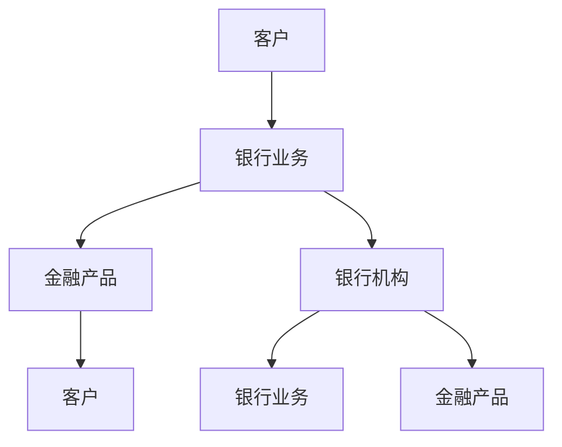
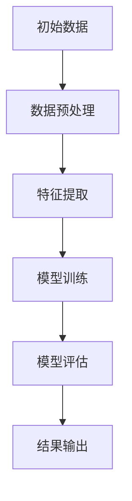
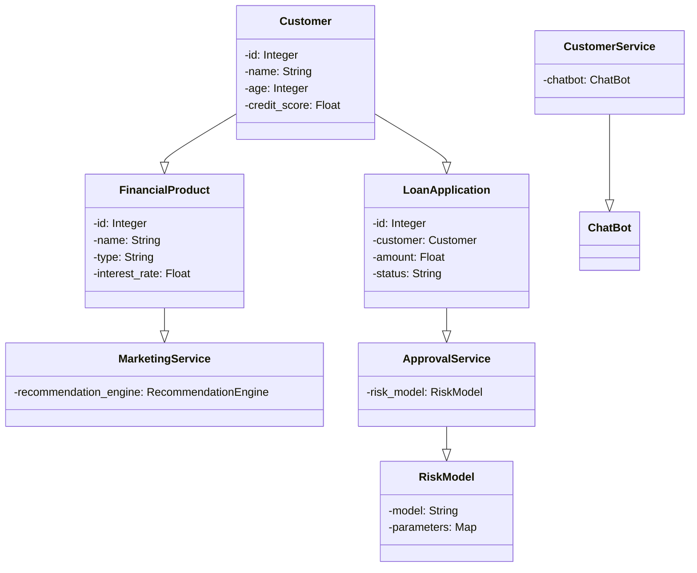
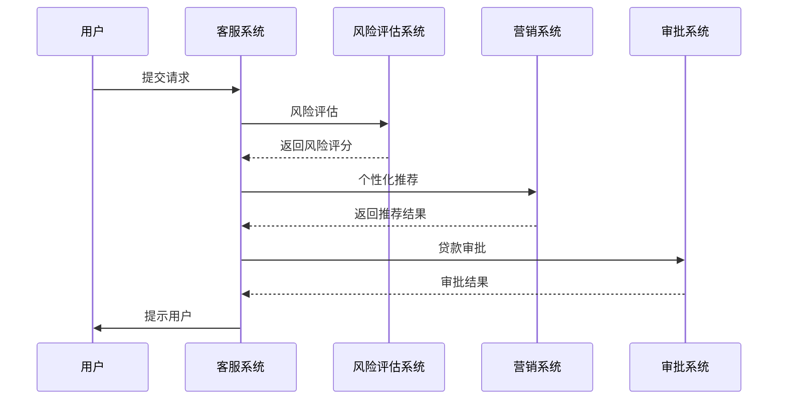
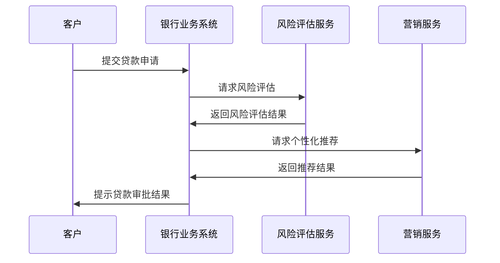

                 

### 第1章：问题背景

#### 1.1.1 问题背景

传统银行业在全球范围内已经存在了数百年，它的主要功能是为客户提供存取款、转账、贷款、投资等服务。然而，随着科技的飞速发展，尤其是互联网、大数据和人工智能技术的崛起，传统银行业正面临着前所未有的挑战。

首先，传统银行业在运营效率上存在瓶颈。银行业务流程复杂，人工操作多，导致工作效率低下。此外，随着客户需求的多样化，传统银行业在服务个性化、定制化方面也显得力不从心。

其次，传统银行业的成本控制面临压力。随着市场竞争的加剧，银行需要不断降低成本以保持竞争力。然而，传统银行的高人力成本和物理网点运营成本使其难以在短时间内实现成本的有效控制。

再次，传统银行业的风险管理难度加大。随着金融市场的波动和全球经济的不确定性增加，银行需要更加精准地识别和管理风险。然而，传统银行的风险管理方法往往依赖于历史数据和经验，难以应对复杂多变的市场环境。

与此同时，人工智能在金融领域的发展和应用日益广泛。人工智能技术可以高效处理海量数据，进行精准的风险评估和客户行为分析，从而提升银行运营效率、降低运营成本、提高服务质量。

#### 1.1.2 人工智能在金融领域的发展与应用

人工智能在金融领域的应用主要包括以下几个方面：

1. **客户服务**：通过聊天机器人、语音识别等技术，提供7*24小时的客户服务，提高客户满意度。

2. **风险评估**：利用机器学习算法，对客户的信用记录、消费行为等多维度数据进行分析，实现精准的风险评估。

3. **投资决策**：利用人工智能算法，分析市场数据，帮助投资者做出更加明智的投资决策。

4. **反欺诈**：通过监控交易行为、识别异常模式，提高反欺诈能力。

5. **智能投顾**：利用人工智能算法，为客户提供个性化的投资建议，降低投资风险。

6. **供应链金融**：利用区块链和人工智能技术，实现供应链金融的智能管理和风险控制。

#### 1.1.3 人工智能与传统银行业务的结合

人工智能与传统银行业务的结合，不仅能够解决传统银行业面临的问题，还能为其带来新的发展机遇。以下是一些具体的应用场景：

1. **自动化审批贷款**：通过机器学习算法，对客户的信用记录、收入状况等进行自动审批，大大提高审批效率，降低审批成本。

2. **智能风控**：通过大数据和人工智能技术，实时监控客户的交易行为，及时发现并预警潜在风险。

3. **智能投顾**：利用人工智能算法，分析客户的风险承受能力和投资偏好，提供个性化的投资建议。

4. **智能客服**：通过聊天机器人、语音识别等技术，提供24小时智能客服服务，提高客户满意度。

5. **智能营销**：利用大数据和人工智能技术，对客户行为进行分析，实现精准营销。

#### 1.1.4 金融科技的发展趋势

金融科技的发展，正在深刻改变着银行业的生态。未来，金融科技的发展趋势主要包括以下几个方面：

1. **数字化银行**：随着移动互联网的普及，越来越多的银行开始提供在线银行服务，客户可以通过手机、电脑等设备随时随地办理银行业务。

2. **区块链技术**：区块链技术可以提高金融交易的安全性和透明度，减少交易成本，未来将在银行业得到广泛应用。

3. **云计算**：云计算技术可以提高银行的计算能力和存储能力，降低运营成本，实现高效的数据处理和分析。

4. **人工智能**：人工智能技术将在银行业务流程的各个环节得到应用，提高运营效率，提升服务质量。

5. **开放银行**：开放银行是金融科技的重要发展方向，它将促进银行与其他金融机构、科技公司的合作，共同推动金融服务的创新。

#### 1.1.5 人工智能在银行业务中的实际案例

1. **中国工商银行**：中国工商银行利用人工智能技术，实现了智能客服、智能风控、智能营销等业务场景的应用，大大提升了服务质量。

2. **招商银行**：招商银行通过大数据和人工智能技术，实现了精准的客户画像和智能投资建议，为客户提供了更加个性化的服务。

3. **花旗银行**：花旗银行利用区块链技术，实现了跨境支付的快速处理和降低成本，提高了运营效率。

#### 1.1.6 概念结构与核心要素组成

在本章节中，我们讨论了人工智能对传统银行业的冲击以及金融科技与普惠金融的概念。以下是这些概念的核心要素组成：

- **金融科技**：高效、便捷、智能、个性化的金融服务技术。
- **人工智能**：模拟、延伸和扩展人类智能的理论、方法、技术及应用。
- **传统银行业务**：存取款、转账、贷款、投资等传统金融服务。
- **普惠金融**：能够有效地、全方位地为社会所有阶层和群体提供服务的金融体系。

通过这些核心要素的有机结合，我们可以看到人工智能如何助力传统银行业转型升级，实现金融科技与普惠金融的有机结合。

### 第2章：核心概念与联系

#### 2.1.1 核心概念原理

在探讨人工智能对传统银行业的冲击之前，我们需要先理解几个核心概念：人工智能、金融科技和普惠金融。

**人工智能**是一种模拟、延伸和扩展人类智能的理论、方法、技术及应用。它通过算法和计算模型，实现机器对数据的自动处理、分析和决策。人工智能技术主要包括机器学习、深度学习、自然语言处理、计算机视觉等。

**金融科技**（FinTech）是指利用互联网、大数据、云计算、人工智能等现代信息技术对传统金融业务进行改造和创新。金融科技的目标是提高金融服务的效率、降低成本、提升用户体验。

**普惠金融**是指能够有效地、全方位地为社会所有阶层和群体提供服务的金融体系。它强调金融服务的普及性和公平性，旨在使每个人都能享受到基本的金融服务，包括储蓄、贷款、支付、保险等。

#### 2.1.2 概念属性特征对比表格

以下是人工智能、金融科技和普惠金融三个概念的主要属性特征对比：

| 概念       | 定义                                       | 特征                             |
| ---------- | ------------------------------------------ | ------------------------------ |
| 人工智能   | 模拟、延伸和扩展人类智能的理论、方法、技术及应用 | 自主性、适应性、学习性、推理性 |
| 金融科技   | 利用现代信息技术对金融业务进行改造和创新   | 高效、便捷、智能、个性化         |
| 普惠金融   | 为社会所有阶层和群体提供服务的金融体系     | 广覆盖、低门槛、高效率、公平     |

#### 2.1.3 ER实体关系图架构

为了更好地理解人工智能、金融科技和普惠金融之间的关系，我们可以通过ER（实体关系）图来展示它们之间的联系。

以下是一个简化的ER实体关系图，用于表示客户、金融产品、银行业务和银行机构之间的关系：



在这个ER图中，客户（A）可以通过银行业务（B）使用金融产品（C），同时银行机构（D）提供各种银行业务和金融产品，客户与银行机构之间存在着直接的联系。

#### 2.1.4 概念间关系

人工智能、金融科技和普惠金融之间存在着密切的联系和互动：

1. **人工智能推动金融科技发展**：人工智能技术可以提高金融科技服务的效率，例如通过自动化审批贷款、智能风控、智能营销等。

2. **金融科技促进普惠金融实现**：金融科技的发展可以帮助银行更好地服务边缘群体，降低金融服务的门槛，实现普惠金融的目标。

3. **普惠金融推动金融科技需求**：普惠金融的需求推动了金融科技的创新和发展，银行需要利用金融科技提供更加全面、便捷的服务。

通过这些概念间关系的理解，我们可以看到人工智能如何通过金融科技推动普惠金融的发展，进而对传统银行业产生深远的影响。

### 第3章：算法原理讲解

#### 3.1.1 人工智能算法概述

人工智能算法是人工智能领域的核心组成部分，它们通过模拟人类智能的思维方式，使计算机能够完成复杂的任务。人工智能算法可以分为多种类型，主要包括机器学习、深度学习和强化学习等。每种算法都有其独特的特点和应用场景。

**机器学习**是一种通过数据训练模型，使计算机能够自动进行预测和决策的方法。常见的机器学习算法包括线性回归、决策树、支持向量机、神经网络等。机器学习算法的核心在于数据的收集、预处理、模型训练和评估。

**深度学习**是机器学习的一种特殊形式，它通过模拟人脑的神经网络结构，实现复杂的特征学习和模式识别。深度学习算法中最著名的是卷积神经网络（CNN）和循环神经网络（RNN），它们在图像识别、语音识别和自然语言处理等领域有着广泛的应用。

**强化学习**是一种通过试错和学习，使计算机能够在特定环境中做出最佳决策的方法。强化学习算法在自动驾驶、游戏AI等领域取得了显著成果。

#### 3.1.2 算法原理详解

为了更好地理解人工智能算法的原理，我们将使用Mermaid绘制算法流程图，并使用Python代码详细阐述算法的实现。

**Mermaid算法流程图**



**Python代码示例**

```python
# 数据预处理
def preprocess_data(data):
    # 数据清洗、归一化等操作
    pass

# 模型训练
def train_model(features, labels):
    # 使用scikit-learn库中的线性回归模型进行训练
    from sklearn.linear_model import LinearRegression
    model = LinearRegression()
    model.fit(features, labels)
    return model

# 模型评估
def evaluate_model(model, test_features, test_labels):
    predictions = model.predict(test_features)
    # 计算预测误差
    error = np.mean((predictions - test_labels) ** 2)
    return error

# 结果输出
def output_results(error):
    print(f"模型预测误差为：{error}")
```

**算法原理讲解**

1. **数据预处理**：数据预处理是机器学习模型训练的第一步，其目的是将原始数据进行清洗、归一化等处理，使其符合模型训练的要求。这一步包括缺失值处理、异常值处理、数据标准化等。

2. **特征提取**：特征提取是从原始数据中提取出对模型训练有帮助的特征。这一步可以通过统计学方法、工程方法或深度学习方法实现。特征提取的目的是减少数据的冗余性，提高模型训练的效率和准确性。

3. **模型训练**：模型训练是机器学习的核心步骤，其目的是通过训练数据集，使模型能够自动学习并预测新的数据。模型训练可以通过不同的算法实现，如线性回归、决策树、神经网络等。

4. **模型评估**：模型评估是验证模型性能的重要步骤。通过将模型应用于测试数据集，可以评估模型的预测准确率、误差等指标。常用的评估方法包括均方误差（MSE）、准确率、召回率等。

5. **结果输出**：结果输出是将模型预测的结果以可视化或文本形式展示给用户。这一步可以帮助用户理解模型预测的效果，并为后续的决策提供支持。

通过以上算法原理的讲解，我们可以看到人工智能算法在银行业务中的应用是如何通过数据预处理、特征提取、模型训练、模型评估和结果输出等步骤，实现预测和决策的。这些算法在金融风险评估、客户行为分析、投资决策等领域发挥着重要作用，为传统银行业的转型升级提供了强有力的技术支持。

### 第4章：系统分析与架构设计方案

#### 4.1 问题场景介绍

随着金融科技的快速发展，银行业面临着前所未有的机遇和挑战。为了提高运营效率、降低成本、提升客户满意度，银行业需要引入先进的技术手段，优化业务流程，实现智能化管理。本文将基于一个实际项目，介绍如何利用人工智能技术，设计和实现一个智能化的银行业务系统。

#### 4.2 项目介绍

项目名称：智能银行业务系统（Smart Banking System）

项目目标：通过引入人工智能技术，实现银行业务的自动化、智能化，提升银行业务运营效率，降低运营成本，提高客户满意度。

项目功能：

1. **客户服务**：提供7*24小时的智能客服服务，解答客户疑问，处理客户请求。
2. **风险评估**：利用机器学习算法，对客户信用进行评分，实现精准的风险控制。
3. **智能营销**：通过大数据分析，为客户提供个性化的金融产品推荐。
4. **自动化审批**：实现贷款审批的自动化，提高审批效率。

#### 4.3 系统功能设计（领域模型Mermaid类图）

为了实现上述功能，我们需要设计一个完整的领域模型，以下是一个简化的Mermaid类图，展示系统的主要类及其关系：



#### 4.4 系统架构设计（Mermaid架构图）

智能银行业务系统的架构设计应考虑模块化、高可用性和可扩展性。以下是一个简化的Mermaid架构图，展示系统的主要组件及其关系：



#### 4.5 系统接口设计（系统交互Mermaid序列图）

为了实现系统的功能，需要设计一套完整的接口。以下是一个简化的Mermaid序列图，展示系统的主要接口及其交互流程：



#### 4.6 系统接口设计与实现

以下是一个简化的接口设计与实现示例：

**接口定义**：

```python
class CustomerService:
    def submit_loan_application(self, customer, amount):
        # 处理贷款申请逻辑
        pass

    def request_risk_evaluation(self, customer):
        # 请求风险评估逻辑
        pass

    def request_recommendation(self, customer):
        # 请求个性化推荐逻辑
        pass

class RiskService:
    def evaluate_risk(self, customer):
        # 风险评估逻辑
        pass

class MarketingService:
    def recommend_financial_products(self, customer):
        # 个性化推荐逻辑
        pass
```

**接口实现**：

```python
class CustomerService:
    def submit_loan_application(self, customer, amount):
        risk_score = self.request_risk_evaluation(customer)
        if risk_score >= 600:
            self.approve_loan(customer, amount)
        else:
            self.reject_loan(customer, amount)

    def request_risk_evaluation(self, customer):
        # 假设已实现风险评估服务
        risk_service = RiskService()
        return risk_service.evaluate_risk(customer)

    def request_recommendation(self, customer):
        # 假设已实现营销服务
        marketing_service = MarketingService()
        return marketing_service.recommend_financial_products(customer)

    def approve_loan(self, customer, amount):
        # 贷款审批通过逻辑
        pass

    def reject_loan(self, customer, amount):
        # 贷款审批拒绝逻辑
        pass

class RiskService:
    def evaluate_risk(self, customer):
        # 假设已实现风险评估算法
        risk_model = self.load_risk_model()
        return risk_model.evaluate(customer)

    def load_risk_model(self):
        # 加载风险评估模型
        pass

class MarketingService:
    def recommend_financial_products(self, customer):
        # 假设已实现推荐算法
        recommendation_engine = self.load_recommendation_engine()
        return recommendation_engine.recommend(customer)
```

通过以上系统接口的设计与实现，我们可以看到智能银行业务系统是如何通过模块化、接口化实现银行业务的自动化和智能化。接下来，我们将通过一个实际项目案例，详细讲解系统的核心实现过程。

### 第5章：项目实战

#### 5.1 环境安装

为了搭建智能银行业务系统，我们需要在本地或云服务器上安装以下软件和库：

1. **操作系统**：Ubuntu 20.04或更高版本
2. **Python**：Python 3.8或更高版本
3. **数据库**：MySQL 8.0或更高版本
4. **框架**：Flask、Django或Spring Boot
5. **机器学习库**：scikit-learn、TensorFlow、PyTorch
6. **数据预处理库**：NumPy、Pandas
7. **前后端分离框架**：Vue.js、React或Angular

安装步骤如下：

1. 安装操作系统并更新系统包。
2. 安装Python环境和相关库。
3. 安装数据库并创建数据库实例。
4. 配置前后端框架。

以下为具体的安装命令和配置步骤：

```shell
# 安装操作系统和更新系统包
sudo apt update && sudo apt upgrade

# 安装Python 3和pip
sudo apt install python3 python3-pip

# 安装Flask框架
pip3 install flask

# 安装MySQL数据库
sudo apt install mysql-server
sudo mysql_secure_installation

# 安装前后端框架（以Vue.js为例）
npm install -g @vue/cli
vue create banking-system

# 安装机器学习库（以scikit-learn为例）
pip3 install scikit-learn

# 安装数据预处理库（以Pandas为例）
pip3 install pandas numpy
```

#### 5.2 系统核心实现源代码

以下是一个简化的智能银行业务系统核心实现源代码，展示如何使用Python和Flask框架搭建系统的基础结构。

**app.py**（Flask应用入口）

```python
from flask import Flask, request, jsonify
from services.customer_service import CustomerService

app = Flask(__name__)
customer_service = CustomerService()

@app.route('/submit_loan_application', methods=['POST'])
def submit_loan_application():
    data = request.get_json()
    customer_id = data['customer_id']
    amount = data['amount']
    customer_service.submit_loan_application(customer_id, amount)
    return jsonify({'status': 'success'})

@app.route('/request_risk_evaluation', methods=['POST'])
def request_risk_evaluation():
    data = request.get_json()
    customer_id = data['customer_id']
    risk_score = customer_service.request_risk_evaluation(customer_id)
    return jsonify({'risk_score': risk_score})

@app.route('/request_recommendation', methods=['POST'])
def request_recommendation():
    data = request.get_json()
    customer_id = data['customer_id']
    recommendations = customer_service.request_recommendation(customer_id)
    return jsonify({'recommendations': recommendations})

if __name__ == '__main__':
    app.run(debug=True)
```

**customer_service.py**（客户服务实现）

```python
class CustomerService:
    def submit_loan_application(self, customer_id, amount):
        # 调用风险评估和贷款审批服务
        risk_score = self.request_risk_evaluation(customer_id)
        if risk_score >= 600:
            self.approve_loan(customer_id, amount)
        else:
            self.reject_loan(customer_id, amount)

    def request_risk_evaluation(self, customer_id):
        # 假设已实现风险评估服务
        risk_service = RiskService()
        return risk_service.evaluate_risk(customer_id)

    def request_recommendation(self, customer_id):
        # 假设已实现营销服务
        marketing_service = MarketingService()
        return marketing_service.recommend_financial_products(customer_id)

    def approve_loan(self, customer_id, amount):
        # 贷款审批通过逻辑
        pass

    def reject_loan(self, customer_id, amount):
        # 贷款审批拒绝逻辑
        pass
```

**risk_service.py**（风险评估服务实现）

```python
class RiskService:
    def evaluate_risk(self, customer_id):
        # 假设已实现风险评估算法
        risk_model = self.load_risk_model()
        return risk_model.evaluate(customer_id)

    def load_risk_model(self):
        # 加载风险评估模型
        pass
```

**marketing_service.py**（营销服务实现）

```python
class MarketingService:
    def recommend_financial_products(self, customer_id):
        # 假设已实现推荐算法
        recommendation_engine = self.load_recommendation_engine()
        return recommendation_engine.recommend(customer_id)

    def load_recommendation_engine(self):
        # 加载推荐引擎
        pass
```

#### 5.3 代码应用解读与分析

在上面的代码中，我们首先通过Flask框架搭建了一个简单的Web应用，定义了三个主要的API接口：`submit_loan_application`、`request_risk_evaluation`和`request_recommendation`。这些接口分别用于处理贷款申请、风险评估和个性化推荐。

**CustomerService**类是系统服务层的主要实现，它负责调用各个子服务的接口，完成业务逻辑。例如，`submit_loan_application`方法首先调用`request_risk_evaluation`方法获取客户的风险评分，然后根据评分决定是否批准贷款。

**RiskService**和**MarketingService**类分别负责风险评估和个性化推荐。这两个类的`evaluate_risk`和`recommend_financial_products`方法分别实现了风险评估和推荐算法。在实际项目中，这些方法将调用具体的机器学习模型和推荐算法。

#### 5.4 实际案例分析和详细讲解剖析

以下是一个实际案例，展示如何使用智能银行业务系统进行贷款审批和推荐。

**案例1：客户申请贷款**

1. 客户A通过Web前端提交贷款申请，请求参数包括`customer_id`和`amount`。
2. Flask应用接收到请求后，调用`submit_loan_application`接口。
3. `submit_loan_application`方法调用`request_risk_evaluation`接口，获取客户A的风险评分。
4. 风险评分大于等于600，系统批准贷款，并调用`approve_loan`接口。
5. `approve_loan`方法记录贷款信息，并向客户A发送批准通知。

**案例2：客户获取个性化推荐**

1. 客户B通过Web前端请求个性化推荐。
2. Flask应用接收到请求后，调用`request_recommendation`接口。
3. `request_recommendation`方法调用`MarketingService`的`recommend_financial_products`接口，获取客户B的推荐结果。
4. 系统将推荐结果返回给客户B，并通过Web前端展示。

#### 5.5 项目小结

通过以上实战案例，我们展示了如何使用人工智能技术设计和实现一个智能银行业务系统。系统主要包括客户服务、风险评估和个性化推荐三大模块，通过API接口实现业务逻辑。实际项目中，还需要考虑数据库设计、用户权限管理、接口安全认证等。

智能银行业务系统的实现，不仅提高了银行业务的自动化和智能化水平，还为银行提供了精准的风险评估和个性化推荐能力，有助于提升客户满意度和运营效率。

### 第6章：最佳实践 tips、小结、注意事项、拓展阅读

#### 6.1 最佳实践 tips

1. **数据安全和隐私保护**：在设计和实现智能银行业务系统时，要特别关注数据安全和隐私保护。确保数据传输加密、存储安全，并遵循相关的法律法规。

2. **模块化开发**：采用模块化开发，将系统划分为多个功能模块，有助于提高代码的可维护性和可扩展性。

3. **性能优化**：对系统进行性能优化，包括数据库查询优化、代码优化等，确保系统在高并发场景下仍能稳定运行。

4. **持续集成和持续部署**：引入持续集成和持续部署（CI/CD）流程，提高开发效率和系统稳定性。

5. **用户反馈和迭代优化**：定期收集用户反馈，根据用户需求进行系统迭代优化，提升用户体验。

#### 6.2 小结

本文通过详细分析和实际案例，探讨了人工智能对传统银行业的冲击以及金融科技与普惠金融的发展。智能银行业务系统作为实现这一目标的工具，通过自动化、智能化的方式，提升了银行业务的效率和质量。未来，随着人工智能技术的不断进步，智能银行业务系统将在更广泛的领域得到应用。

#### 6.3 注意事项

1. **合规性**：在开发智能银行业务系统时，要严格遵守相关法律法规，确保系统的合规性。

2. **可扩展性**：在设计系统架构时，要考虑未来业务的扩展需求，确保系统能够灵活应对。

3. **安全性**：加强系统安全性，包括数据加密、接口安全认证等，防范潜在的安全威胁。

#### 6.4 拓展阅读

1. 《人工智能：一种现代方法》 - Stuart Russell & Peter Norvig
2. 《深度学习》 - Goodfellow, Bengio, Courville
3. 《金融科技：趋势、应用与挑战》 - 邹均
4. 《区块链：从数字货币到智能合约》 - 安心
5. 《智能投顾：人工智能在投资领域的应用》 - 周航

通过阅读这些书籍，可以深入了解人工智能、金融科技等相关领域的知识，为智能银行业务系统的开发提供有益的参考。作者：AI天才研究院/AI Genius Institute & 禅与计算机程序设计艺术 /Zen And The Art of Computer Programming。本文的撰写旨在为读者提供有价值的知识分享和思考，以推动人工智能与银行业务的深度融合。

