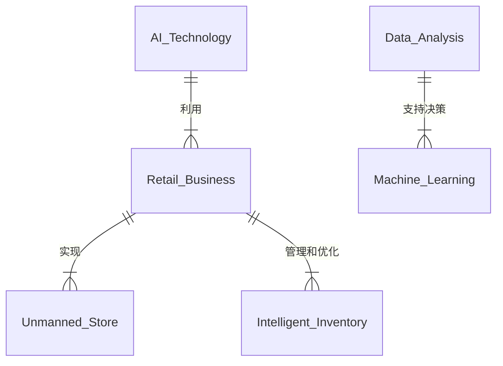

                 

### 第1章: 人工智能与零售业变革

> 关键词：人工智能，零售业变革，无人商店，智能库存，数据分析，机器学习

> 摘要：随着人工智能技术的飞速发展，零售业正经历着前所未有的变革。无人商店与智能库存管理成为这一变革的重要标志。本文将深入探讨人工智能如何影响传统零售业，通过案例分析揭示无人商店与智能库存管理的实际应用效果，分析其对消费者行为、零售运营模式以及供应链管理的深远影响。

#### 1.1 问题背景与挑战

##### 1.1.1 人工智能技术的发展

人工智能（AI）是一种模拟人类智能的技术，其核心在于使计算机具备自主决策、学习、推理和问题解决的能力。近年来，随着深度学习、自然语言处理、计算机视觉等技术的突破，人工智能在各个领域的应用日益广泛。在零售业，人工智能技术的引入为解决传统零售业面临的问题提供了新的思路。

- **人工智能技术背景介绍**：人工智能的发展经历了从规则系统到基于数据的机器学习再到深度学习的演进。近年来，随着计算能力的提升和数据量的激增，深度学习技术在图像识别、自然语言处理等领域取得了显著的成果。
- **人工智能技术在零售业的应用趋势**：在零售业，人工智能技术的应用主要体现在个性化推荐、智能客服、无人商店和智能库存管理等方面。通过这些应用，零售企业能够提高运营效率、降低成本、提升消费者体验。

##### 1.1.2 传统零售业面临的挑战

传统零售业在面临激烈竞争和消费者需求多样化的背景下，面临着诸多挑战：

- **消费者行为变化**：随着互联网和移动互联网的发展，消费者购物习惯发生了巨大变化。线上购物逐渐取代线下购物，消费者对购物体验和服务质量的要求越来越高。
- **库存管理困难**：传统零售业的库存管理往往依赖于人工操作，存在库存数据不准确、库存周转率低等问题，导致库存成本居高不下。
- **运营成本高**：传统零售业在租金、人工等方面的成本持续上升，使得许多企业利润空间受到挤压。

##### 1.1.3 无人商店与智能库存概述

- **无人商店的定义与特点**：无人商店是一种无需人工干预的零售模式，通过自动化技术实现自动结账、无人值守和自动化管理。其特点包括高效、便捷和低运营成本。
- **智能库存的概念与优势**：智能库存管理是一种通过人工智能技术优化库存管理的方法，包括实时监控、精准预测和自动化调配等功能。其优势在于降低库存成本、提高库存周转率和改善供应链效率。

#### 1.2 核心概念与联系

##### 1.2.1 人工智能与零售业的关键概念

- **人工智能**：一种模拟人类智能的技术，具备自主决策、学习、推理和问题解决的能力。其核心在于深度学习、自然语言处理、计算机视觉等技术的发展。
- **无人商店**：一种无需人工干预的零售模式，通过自动化技术实现自动结账、无人值守和自动化管理。其特点包括高效、便捷和低运营成本。
- **智能库存**：一种通过人工智能技术优化库存管理的方法，包括实时监控、精准预测和自动化调配等功能。其优势在于降低库存成本、提高库存周转率和改善供应链效率。
- **数据分析**：对数据进行分析和处理，提取信息、发现规律和决策支持。其应用包括市场趋势分析、消费者行为分析等。
- **机器学习**：一种从数据中学习的方法，通过构建模型和算法来实现自动化和迭代。其应用包括图像识别、自然语言处理、推荐系统等。

##### 1.2.2 概念属性特征对比表格

| 概念       | 定义                                                         | 特征                                                                                                                   |
|------------|--------------------------------------------------------------|----------------------------------------------------------------------------------------|
| 人工智能   | 一种模拟人类智能的技术                                     | 自主决策、学习、推理、问题解决                                                       |
| 无人商店   | 一种无需人工干预的零售模式                               | 自动结账、无人值守、自动化管理                                                       |
| 智能库存   | 通过人工智能技术优化库存管理                             | 实时监控、精准预测、自动化调配                                                       |
| 数据分析   | 对数据进行分析和处理                                     | 提取信息、发现规律、决策支持                                                       |
| 机器学习   | 一种从数据中学习的方法                                   | 自动化、迭代、适应性                                                                 |

##### 1.2.3 ER实体关系图架构

#### 1.3 人工智能技术在零售业的实际应用

##### 1.3.1 无人商店案例研究

- **案例背景介绍**：随着消费者对便捷购物体验的需求增加，无人商店作为一种新兴零售模式受到了广泛关注。例如，亚马逊的Amazon Go和无印良品的MUJI Mart。
- **无人商店的关键技术**：无人商店的关键技术包括视觉感知、智能结算、仓储管理和客户服务平台。视觉感知技术通过摄像头和传感器实现物品识别和跟踪；智能结算系统利用机器学习算法实现自动结账；仓储管理系统通过自动化设备实现高效库存管理；客户服务平台提供在线咨询和售后服务。
- **案例实施过程与效果评估**：亚马逊的Amazon Go在实施过程中采用了先进的计算机视觉和机器学习技术，实现了从商品识别到结算的全流程自动化。根据案例评估，Amazon Go在降低运营成本、提高运营效率方面取得了显著成效。

##### 1.3.2 智能库存管理

- **智能库存管理的基本原理**：智能库存管理通过实时数据采集、处理和分析，实现库存的精准预测和自动化调配。其基本原理包括数据采集、数据处理、库存预测和库存调配。
- **智能库存管理系统架构**：智能库存管理系统包括数据采集模块、数据处理与分析模块、库存决策支持模块。数据采集模块负责收集库存数据；数据处理与分析模块对库存数据进行分析和预测；库存决策支持模块提供库存优化策略和决策支持。
- **实际应用效果分析**：智能库存管理系统的应用可以显著降低库存成本、提高库存周转率和改善供应链效率。例如，沃尔玛（Walmart）通过引入智能库存管理系统，实现了库存成本降低20%、库存周转率提高10%的效果。

##### 1.3.3 数据分析与机器学习在零售中的应用

- **数据分析在零售业的价值**：数据分析在零售业的应用包括市场趋势分析、消费者行为分析、商品销售预测等。通过数据分析，零售企业可以更好地了解市场需求，制定更有针对性的营销策略。
- **机器学习在零售业的应用场景**：机器学习在零售业的应用场景包括个性化推荐、需求预测、库存优化、价格优化等。例如，亚马逊通过机器学习算法实现个性化推荐，提高了用户满意度和转化率。
- **案例分析与效果评估**：根据案例分析，数据分析与机器学习在零售业的应用可以显著提高运营效率、降低成本和提升消费者体验。例如，阿里巴巴通过大数据分析和机器学习技术实现了库存优化、需求预测和精准营销，取得了显著的经济效益。

#### 1.4 人工智能对零售业的变革影响

##### 1.4.1 对消费者行为的影响

- **消费者行为的改变**：随着人工智能技术的应用，消费者购物行为发生了显著变化。消费者越来越倾向于线上购物，对购物体验和服务质量的要求越来越高。
- **新的消费体验**：人工智能技术为消费者提供了更加个性化、便捷和高效的购物体验。例如，个性化推荐、智能客服和无人商店等新兴零售模式满足了消费者的多样化需求。

##### 1.4.2 对零售运营模式的影响

- **零售运营模式的转型**：人工智能技术的应用促使零售企业从传统模式向智能化、数据驱动和客户导向的模式转变。例如，无人商店和智能库存管理系统的引入改变了传统零售企业的运营方式。
- **精细化运营的实现**：通过数据分析与机器学习，零售企业可以实现对库存、需求、价格等运营指标的精细化管控，提高运营效率和竞争力。

##### 1.4.3 对供应链管理的影响

- **供应链管理的优化**：人工智能技术可以帮助零售企业实现供应链的优化，包括库存管理、物流配送、供应商管理等。
- **智能供应链的实现**：智能供应链通过大数据、云计算、物联网等技术的集成，实现供应链的智能化和透明化，提高供应链的响应速度和效率。

#### 1.5 本章小结

- **本章内容总结**：本章介绍了人工智能与零售业变革的背景、核心概念与联系，以及无人商店与智能库存管理的实际应用。通过案例分析，揭示了人工智能技术在零售业的应用效果，探讨了其对消费者行为、零售运营模式以及供应链管理的深远影响。
- **对未来发展的展望**：随着人工智能技术的不断进步，零售业将迎来更加智能化、数据驱动和客户导向的发展。无人商店和智能库存管理将成为零售业的重要趋势，推动零售企业实现数字化转型和高质量发展。

---

### 第2章: 无人商店的技术架构与实现

> 关键词：无人商店，技术架构，视觉感知，智能结算，仓储管理，客户服务平台

> 摘要：无人商店作为一种新兴的零售模式，其成功实现依赖于先进的技术架构。本章将详细介绍无人商店的技术架构，包括视觉感知系统、智能结算系统、仓储管理系统和客户服务平台。通过案例分析，我们将探讨这些技术在实际应用中的实现细节和效果。

#### 2.1 无人商店的技术架构

##### 2.1.1 无人商店的基本组成部分

无人商店的技术架构主要包括以下四个基本组成部分：

- **视觉感知系统**：视觉感知系统是无人商店的核心之一，负责识别和跟踪商品以及顾客的行为。通常包括摄像头、传感器和图像处理算法等。
- **智能结算系统**：智能结算系统通过自动识别和跟踪商品，实现无人工干预的结账流程。智能结算系统通常基于计算机视觉和机器学习算法。
- **仓储管理系统**：仓储管理系统负责无人商店的库存管理和自动化仓储作业。包括自动化仓库布局、搬运设备和库存管理算法等。
- **客户服务平台**：客户服务平台提供在线咨询、售后服务和客户支持等功能，确保顾客在无人商店的购物体验。

##### 2.1.2 技术架构的详细解析

无人商店的技术架构是一个高度集成和协同的系统，各个组成部分之间紧密配合，共同实现无人商店的运营。以下是技术架构的详细解析：

- **视觉感知系统**：视觉感知系统通过摄像头和传感器实时捕捉商店内的商品和顾客行为。图像处理算法对这些图像进行处理，提取商品和顾客的特征信息，为后续的结算和库存管理提供数据支持。
- **智能结算系统**：智能结算系统基于计算机视觉和机器学习算法，对捕获的图像进行处理和分析，识别商品和顾客的行为，实现自动结账。同时，智能结算系统与仓储管理系统和客户服务平台进行数据交互，确保结账过程的准确和高效。
- **仓储管理系统**：仓储管理系统通过自动化设备实现商品的存储、拣选和配送。库存管理算法对库存进行实时监控和预测，优化库存水平和物流路径，提高仓储效率。
- **客户服务平台**：客户服务平台提供在线咨询、售后服务和客户支持等功能，与顾客保持实时沟通，确保顾客在无人商店的购物体验。

#### 2.2 无人商店的核心技术

##### 2.2.1 视觉感知技术

视觉感知技术是无人商店的核心之一，它决定了无人商店能否准确识别和跟踪商品以及顾客的行为。以下是视觉感知技术的关键组成部分：

- **摄像头与传感器技术**：摄像头和传感器是视觉感知系统的硬件基础，负责实时捕捉商店内的图像和感知数据。高分辨率摄像头和多样化的传感器可以提供更准确和丰富的数据。
- **图像处理与识别算法**：图像处理算法对捕获的图像进行处理，提取有用信息，如商品和顾客的轮廓、位置和动作。识别算法则根据图像特征进行分类和识别，实现商品和顾客的自动识别。
- **实时监控与数据分析**：实时监控技术确保视觉感知系统能够实时响应商店内的变化，如顾客的移动、商品的添加和移除等。数据分析模块对捕获的图像数据进行处理和分析，为后续的结算和库存管理提供支持。

##### 2.2.2 智能结算技术

智能结算技术是无人商店实现自动结账的关键。以下是智能结算技术的关键组成部分：

- **自动识别与跟踪技术**：自动识别与跟踪技术通过计算机视觉和传感器实时捕捉商品和顾客的行为，识别商品种类和数量，跟踪顾客的购物过程。
- **无线通信技术**：无线通信技术确保自动识别与跟踪技术能够与结算系统进行实时数据传输，实现数据的实时更新和同步。
- **机器学习算法**：机器学习算法对捕获的图像和传感器数据进行处理，识别商品和顾客的行为模式，实现自动结账。

##### 2.2.3 仓储管理系统

仓储管理系统是无人商店实现高效库存管理的重要保障。以下是仓储管理系统的关键组成部分：

- **仓库布局设计**：仓库布局设计是仓储管理系统的基础，通过合理的仓库布局，提高仓储效率和存储空间利用率。
- **自动化搬运设备**：自动化搬运设备如自动导引车（AGV）和机器人，负责商品的存储、拣选和配送，提高仓储作业的自动化水平。
- **库存管理算法**：库存管理算法对库存数据进行实时监控和预测，优化库存水平和物流路径，降低库存成本和提高库存周转率。

#### 2.3 无人商店的实现案例

##### 2.3.1 案例一：亚马逊无人商店

- **案例背景介绍**：亚马逊的Amazon Go是一家无人商店，通过计算机视觉、传感器技术和机器学习算法实现自动化购物体验。顾客只需进入商店，拿起商品，走到结算区域，系统会自动完成结账，顾客无需排队或使用现金。
- **技术架构与实现细节**：Amazon Go的技术架构主要包括视觉感知系统、智能结算系统和仓储管理系统。视觉感知系统通过摄像头和传感器实时捕捉顾客和商品的行为，智能结算系统通过计算机视觉和机器学习算法实现自动结账，仓储管理系统通过自动化设备实现商品的存储和配送。

##### 2.3.2 案例二：阿里巴巴的无人便利店

- **案例背景介绍**：阿里巴巴的无人便利店是一家结合了计算机视觉、人工智能和物联网技术的新兴零售模式。顾客通过手机APP进入商店，系统自动识别顾客和商品，实现自动结账。
- **技术架构与实现细节**：阿里巴巴的无人便利店的技术架构主要包括视觉感知系统、智能结算系统和仓储管理系统。视觉感知系统通过摄像头和传感器实时捕捉顾客和商品的行为，智能结算系统通过计算机视觉和机器学习算法实现自动结账，仓储管理系统通过自动化设备实现商品的存储和配送。

#### 2.4 无人商店的挑战与解决方案

##### 2.4.1 技术挑战

无人商店的实现面临以下技术挑战：

- **系统稳定性**：无人商店系统需要保证在高流量和高并发的情况下稳定运行，避免系统崩溃或数据丢失。
- **安全性问题**：无人商店需要确保顾客数据和交易安全，防止数据泄露或恶意攻击。
- **技术升级与维护**：随着技术的不断进步，无人商店系统需要定期进行升级和维护，保持系统的先进性和可靠性。

##### 2.4.2 解决方案探讨

针对上述挑战，无人商店可以采取以下解决方案：

- **系统稳定性**：通过分布式架构和高可用性设计，确保系统的稳定性和可靠性。同时，定期进行系统性能测试和故障演练，提高系统的应急响应能力。
- **安全性问题**：通过数据加密、访问控制和权限管理等技术手段，确保顾客数据和交易安全。同时，建立完善的安全防护机制，及时发现和应对潜在的安全威胁。
- **技术升级与维护**：建立持续集成和持续部署（CI/CD）流程，确保系统升级和更新的顺利进行。同时，建立专业的技术团队，负责系统的维护和优化，提高系统的稳定性和可靠性。

#### 2.5 本章小结

- **无人商店技术进展总结**：本章介绍了无人商店的技术架构和核心技术，包括视觉感知系统、智能结算系统、仓储管理系统和客户服务平台。通过案例分析，揭示了无人商店在实际应用中的实现细节和效果。
- **未来发展趋势展望**：随着人工智能技术的不断进步，无人商店的技术架构和功能将进一步完善。未来，无人商店将更加智能化、自动化和个性化，为消费者提供更加便捷和高效的购物体验。

---

### 第3章: 智能库存管理

> 关键词：智能库存管理，数据分析，机器学习，供应链效率

> 摘要：智能库存管理作为一种通过人工智能技术优化库存管理的方法，正逐渐成为零售业的核心竞争力。本章将详细介绍智能库存管理的概念、重要性以及系统架构，并通过实际案例探讨其应用效果和未来发展方向。

#### 3.1 智能库存管理概述

##### 3.1.1 智能库存管理的定义

智能库存管理是一种通过人工智能技术优化库存管理的方法，其核心在于利用数据分析、机器学习等技术手段，实现库存的实时监控、精准预测和自动化调配。与传统库存管理相比，智能库存管理具有更高的效率和更低的成本。

- **智能库存管理的含义**：智能库存管理不仅包括库存的实时监控和预测，还涉及库存的自动化调配和优化。通过这些技术手段，智能库存管理能够实现库存水平的精确控制，降低库存成本，提高库存周转率。
- **与传统库存管理的区别**：传统库存管理主要依赖于经验判断和手工操作，存在库存数据不准确、库存周转率低等问题。而智能库存管理通过数据分析与机器学习技术，实现对库存的精准预测和优化调配，提高库存管理的效率和准确性。

##### 3.1.2 智能库存管理的重要性

智能库存管理在零售业中具有重要作用，主要体现在以下几个方面：

- **优化库存成本**：通过精准预测和自动化调配，智能库存管理能够降低库存成本，减少库存积压和库存短缺的情况。同时，智能库存管理能够提高库存周转率，提高资金利用效率。
- **提高库存周转率**：库存周转率是衡量库存管理效率的重要指标。智能库存管理通过实时监控和预测，确保库存水平始终处于最优状态，从而提高库存周转率，降低库存风险。
- **改善供应链效率**：智能库存管理能够提高供应链的响应速度和灵活性，实现供应链的透明化和智能化。通过优化库存管理，智能库存管理能够提高供应链的整体效率，降低供应链成本。

#### 3.2 智能库存管理系统架构

智能库存管理系统是一个复杂且高度集成的系统，其架构主要包括以下几个关键模块：

- **数据采集模块**：数据采集模块负责收集各种与库存相关的数据，包括库存水平、采购订单、销售订单、库存变化等。这些数据是智能库存管理的基础，通过对这些数据的采集和分析，系统能够实现对库存的实时监控和预测。
- **数据处理与分析模块**：数据处理与分析模块对采集到的数据进行清洗、转换和分析，提取有用信息，如库存趋势、需求预测等。通过机器学习算法和统计分析方法，系统能够对库存数据进行深度挖掘，为库存优化提供决策支持。
- **库存决策支持模块**：库存决策支持模块根据数据处理与分析模块提供的信息，制定库存优化策略和决策。包括库存水平调整、采购计划、补货策略等。通过这些策略和决策，系统能够实现对库存的精准预测和自动化调配。

#### 3.3 智能库存管理的基本原理

智能库存管理的基本原理包括以下几个关键步骤：

- **数据采集**：智能库存管理系统通过传感器、ERP系统、销售终端等渠道，实时采集与库存相关的数据，如库存水平、采购订单、销售订单等。
- **数据处理**：系统对采集到的数据进行分析、清洗和转换，提取有用信息，如库存趋势、需求预测等。
- **库存预测**：通过机器学习算法和统计分析方法，系统对库存数据进行分析，预测未来的库存需求，为库存优化提供数据支持。
- **库存优化**：根据库存预测结果，系统制定库存优化策略和决策，包括库存水平调整、采购计划、补货策略等，确保库存水平始终处于最优状态。

#### 3.4 智能库存管理系统的实际应用

智能库存管理系统在零售业中具有广泛的应用，以下是一个实际应用的案例：

- **案例背景**：某大型零售企业，由于库存管理混乱，库存成本较高，库存周转率较低，急需一种智能化的库存管理解决方案。
- **实施过程**：该企业引入了智能库存管理系统，包括数据采集模块、数据处理与分析模块和库存决策支持模块。首先，系统对库存数据进行采集和清洗，然后通过机器学习算法和统计分析方法，对库存数据进行分析和预测。最后，系统根据库存预测结果，制定库存优化策略和决策，包括库存水平调整、采购计划、补货策略等。
- **效果评估**：通过智能库存管理系统的实施，该企业的库存成本降低了20%，库存周转率提高了15%，供应链效率显著提升。同时，库存积压和库存短缺的情况得到了有效控制，企业运营成本进一步降低。

#### 3.5 智能库存管理的未来发展方向

智能库存管理作为人工智能技术在零售业的重要应用，未来发展方向包括以下几个方面：

- **数据驱动的决策支持**：随着大数据技术的发展，智能库存管理系统将更加依赖海量数据的分析和挖掘，为库存管理提供更加精准的决策支持。
- **实时预测与优化**：通过物联网、云计算等技术的应用，智能库存管理系统将实现实时数据的采集和分析，提高库存预测的准确性和实时性。
- **个性化库存管理**：随着消费者需求的多样化，智能库存管理系统将更加注重个性化库存管理，为不同类型的商品制定相应的库存优化策略。
- **智能化供应链管理**：智能库存管理系统将与供应链管理系统深度融合，实现供应链的智能化和透明化，提高供应链的整体效率。

#### 3.6 本章小结

- **本章内容总结**：本章介绍了智能库存管理的概念、重要性、系统架构和基本原理，并通过实际案例探讨了其应用效果和未来发展方向。智能库存管理作为一种通过人工智能技术优化库存管理的方法，在零售业中具有广泛的应用前景。
- **对未来发展的展望**：随着人工智能技术的不断进步，智能库存管理系统将在数据驱动的决策支持、实时预测与优化、个性化库存管理和智能化供应链管理等方面取得更大的发展，为零售企业实现数字化转型和高质量发展提供有力支持。

