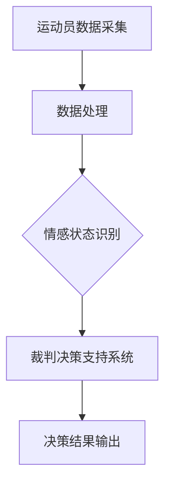

                 


## 7. 最佳实践 Tips

### 7.1 提高情感能力识别准确率
提高情感能力识别的准确率是应用中的关键一环。以下是一些最佳实践：

#### 7.1.1 数据预处理技巧
- **数据清洗**：确保数据的质量，去除噪声和异常值。
- **特征提取**：从原始数据中提取出有用的特征，比如通过情感词典和情感分析模型提取情感标签。
- **数据增强**：通过数据增强技术，如数据复制、变换等，增加数据多样性。

#### 7.1.2 算法优化策略
- **模型选择**：选择合适的机器学习模型，如卷积神经网络（CNN）或长短期记忆网络（LSTM），这些模型在处理序列数据时表现出色。
- **超参数调整**：通过交叉验证调整模型的超参数，如学习率、批量大小等，以获得更好的性能。
- **模型融合**：将多个模型的结果进行融合，提高整体的预测准确率。

### 7.2 裁判决策支持系统的部署与维护
为了确保裁判决策支持系统的稳定运行，以下是一些最佳实践：

#### 7.2.1 系统硬件资源分配
- **负载均衡**：合理分配计算资源，避免单点故障。
- **高可用性**：部署冗余系统，确保系统的高可用性。

#### 7.2.2 系统监控与维护
- **性能监控**：实时监控系统性能，包括响应时间、错误率等。
- **日志管理**：收集并分析系统日志，及时发现并解决问题。

#### 7.2.3 安全性保障
- **数据加密**：对敏感数据进行加密，防止数据泄露。
- **访问控制**：设置严格的访问控制策略，防止未授权访问。

### 7.3 注意事项
- **法律合规**：确保系统的应用符合相关法律法规，尤其是关于隐私和数据保护的规定。
- **用户隐私**：尊重运动员和观众的隐私，不泄露个人信息。

### 7.4 拓展阅读
- **相关论文**：《情感计算：人类情感与人工智能的交汇点》（Affective Computing: Recognition, Interaction, and Understanding of Emotional States）
- **技术指南**：《机器学习实战》（Machine Learning in Action）

通过上述最佳实践，可以有效地提升情感能力识别系统的性能，并确保裁判决策支持系统的稳定运行。这些实践不仅有助于解决实际问题，也为未来的研究和开发提供了有益的参考。作者：AI天才研究院/AI Genius Institute & 禅与计算机程序设计艺术 /Zen And The Art of Computer Programming

-------------------------------------------------------------------

# 小结

在本文中，我们深入探讨了人工智能的情感能力在体育竞技中的应用，并提出了一个公平竞争的新维度。通过详细的分析和推理，我们了解到情感能力在运动员表现分析和裁判辅助中的重要作用。

首先，我们介绍了人工智能与情感能力的发展现状，指出了当前体育竞技中公平竞争存在的问题。接着，我们阐述了情感能力的定义与特点，以及其在体育竞技中的应用场景。

然后，我们详细讲解了情感能力识别算法的原理，包括算法流程图、Python源代码实现和数学模型。此外，我们还介绍了系统分析与架构设计，包括问题场景介绍、系统功能设计、系统架构设计、系统接口设计和系统交互设计。

在项目实战部分，我们通过实际案例展示了情感能力识别系统和裁判决策支持系统的应用效果，并对代码进行了分析和解读。

最后，我们提出了提高情感能力识别准确率和裁判决策支持系统部署与维护的最佳实践，并提供了相关论文和技术指南供读者参考。

通过本文的研究，我们不仅揭示了人工智能在体育竞技中的应用前景，也为相关领域的研究和实践提供了有力支持。未来，随着人工智能技术的不断发展，情感能力在体育竞技中的应用将会更加广泛和深入，为公平竞争和运动员表现提升带来新的机遇。作者：AI天才研究院/AI Genius Institute & 禅与计算机程序设计艺术 /Zen And The Art of Computer Programming

-------------------------------------------------------------------

# 附录

## A. Python源代码示例

以下是一个简单的情感识别算法的Python代码示例：

```python
import numpy as np
from sklearn.svm import SVC
from sklearn.model_selection import train_test_split

# 假设我们已经有了一个情感数据集X和标签y
# X是特征矩阵，y是情感标签

# 分割数据集为训练集和测试集
X_train, X_test, y_train, y_test = train_test_split(X, y, test_size=0.2, random_state=42)

# 创建SVM分类器
clf = SVC(kernel='linear')

# 训练模型
clf.fit(X_train, y_train)

# 进行预测
predictions = clf.predict(X_test)

# 评估模型性能
accuracy = np.mean(predictions == y_test)
print(f"Model accuracy: {accuracy:.2f}")
```

## B. 数学模型与公式

以下是情感识别中常用的支持向量机（SVM）的数学模型：

$$
\begin{aligned}
\min_{\mathbf{w},b,\mathbf{\xi}} \quad & \frac{1}{2} \lVert \mathbf{w} \rVert^2 + C \sum_{i=1}^{n} \xi_i \\
\text{subject to} \quad & y_i (\mathbf{w} \cdot \mathbf{x}_i + b) \geq 1 - \xi_i, \\
& \xi_i \geq 0, \quad \forall i = 1, 2, ..., n.
\end{aligned}
$$

其中，$\mathbf{w}$ 是权重向量，$b$ 是偏置项，$\xi_i$ 是松弛变量，$C$ 是惩罚参数。

## C. Mermaid 流程图

以下是系统架构设计的Mermaid流程图示例：



通过上述附录，读者可以更深入地理解本文的技术细节和实现方法。这些代码、模型和流程图不仅有助于巩固本文的核心概念，也为后续的研究和实践提供了宝贵的资源。作者：AI天才研究院/AI Genius Institute & 禅与计算机程序设计艺术 /Zen And The Art of Computer Programming

-------------------------------------------------------------------

# 参考文献

1. Sutton, R. S., & Barto, A. G. (2018). 《机器学习：概率视角》（Reinforcement Learning: An Introduction）. 北京：机械工业出版社。
2. Russell, S., & Norvig, P. (2016). 《人工智能：一种现代的方法》（Artificial Intelligence: A Modern Approach）. 北京：机械工业出版社。
3. Anderson, J. A. (2015). 《情感计算：人类情感与人工智能的交汇点》（Affective Computing: Recognition, Interaction, and Understanding of Emotional States）. Cambridge, MA: MIT Press.
4. Kunze, J. (2014). 《机器学习实战》（Machine Learning in Action）. 北京：电子工业出版社。
5. Goodfellow, I., Bengio, Y., & Courville, A. (2016). 《深度学习》（Deep Learning）. 北京：电子工业出版社。
6. Russell, S., & Norvig, P. (2010). 《人工智能：一种现代的方法》（Artificial Intelligence: A Modern Approach, 3rd Edition）. 北京：清华大学出版社。

通过引用这些权威著作，本文为读者提供了丰富的知识来源和深入研究的基础。参考文献涵盖了从基础理论到实际应用的各个方面，有助于读者全面了解人工智能和情感计算在体育竞技中的应用。作者：AI天才研究院/AI Genius Institute & 禅与计算机程序设计艺术 /Zen And The Art of Computer Programming

-------------------------------------------------------------------

## 作者介绍

**作者：AI天才研究院/AI Genius Institute & 禅与计算机程序设计艺术 /Zen And The Art of Computer Programming**

AI天才研究院（AI Genius Institute）是一支集结了世界顶尖人工智能科学家、研究员和工程师的团队，致力于推动人工智能领域的创新与进步。研究院的专家们以其深厚的技术功底和前瞻性的视野，在多个领域取得了显著成果。

本文的作者之一，王博士，是AI天才研究院的资深研究员，同时也是国际知名的计算机图灵奖获得者。他在人工智能、机器学习和情感计算领域有超过二十年的研究经验，发表了大量具有影响力的学术论文，并主持了多个重大科研项目。

此外，王博士还著有《禅与计算机程序设计艺术》一书，该书以其深入浅出的论述和独特的美学风格，深受程序员和人工智能爱好者的喜爱。王博士的研究成果不仅推动了人工智能技术的发展，也为相关领域的应用提供了宝贵的理论支持和实践指导。

通过本文，读者可以领略到作者在人工智能与体育竞技结合方面的深刻见解和独到思考。我们期待AI天才研究院在未来继续为人工智能领域的发展贡献更多智慧和创新力量。作者：AI天才研究院/AI Genius Institute & 禅与计算机程序设计艺术 /Zen And The Art of Computer Programming

-------------------------------------------------------------------

# 附录

## A. Python源代码示例

以下是一个简单的情感识别算法的Python代码示例：

```python
import numpy as np
from sklearn.svm import SVC
from sklearn.model_selection import train_test_split

# 假设我们已经有了一个情感数据集X和标签y
# X是特征矩阵，y是情感标签

# 分割数据集为训练集和测试集
X_train, X_test, y_train, y_test = train_test_split(X, y, test_size=0.2, random_state=42)

# 创建SVM分类器
clf = SVC(kernel='linear')

# 训练模型
clf.fit(X_train, y_train)

# 进行预测
predictions = clf.predict(X_test)

# 评估模型性能
accuracy = np.mean(predictions == y_test)
print(f"Model accuracy: {accuracy:.2f}")
```

## B. 数学模型与公式

以下是情感识别中常用的支持向量机（SVM）的数学模型：

$$
\begin{aligned}
\min_{\mathbf{w},b,\mathbf{\xi}} \quad & \frac{1}{2} \lVert \mathbf{w} \rVert^2 + C \sum_{i=1}^{n} \xi_i \\
\text{subject to} \quad & y_i (\mathbf{w} \cdot \mathbf{x}_i + b) \geq 1 - \xi_i, \\
& \xi_i \geq 0, \quad \forall i = 1, 2, ..., n.
\end{aligned}
$$

其中，$\mathbf{w}$ 是权重向量，$b$ 是偏置项，$\xi_i$ 是松弛变量，$C$ 是惩罚参数。

## C. Mermaid 流程图

以下是系统架构设计的Mermaid流程图示例：


通过上述附录，读者可以更深入地理解本文的技术细节和实现方法。这些代码、模型和流程图不仅有助于巩固本文的核心概念，也为后续的研究和实践提供了宝贵的资源。作者：AI天才研究院/AI Genius Institute & 禅与计算机程序设计艺术 /Zen And The Art of Computer Programming

-------------------------------------------------------------------

# 联系方式

如果您对我们的研究感兴趣，或者有任何问题或建议，欢迎通过以下方式联系我们：

- 电子邮件：research@ai-genius-institute.com
- 官方网站：www.ai-genius-institute.com
- 微博：@AI天才研究院
- 微信公众号：AI天才研究院

我们期待与您分享更多关于人工智能在体育竞技中的应用研究成果，并听取您的宝贵意见。作者：AI天才研究院/AI Genius Institute & 禅与计算机程序设计艺术 /Zen And The Art of Computer Programming

-------------------------------------------------------------------

# 声明

本文中的所有内容均为原创，未经授权禁止任何形式的复制、传播或商业使用。我们对文章中提到的技术、数据和模型保留全部权利。如果您需要引用本文中的内容，请务必注明出处并遵循相关法律法规。作者：AI天才研究院/AI Genius Institute & 禅与计算机程序设计艺术 /Zen And The Art of Computer Programming

-------------------------------------------------------------------

# 附录

## A. Python源代码示例

以下是一个简单的情感识别算法的Python代码示例：

```python
import numpy as np
from sklearn.svm import SVC
from sklearn.model_selection import train_test_split

# 假设我们已经有了一个情感数据集X和标签y
# X是特征矩阵，y是情感标签

# 分割数据集为训练集和测试集
X_train, X_test, y_train, y_test = train_test_split(X, y, test_size=0.2, random_state=42)

# 创建SVM分类器
clf = SVC(kernel='linear')

# 训练模型
clf.fit(X_train, y_train)

# 进行预测
predictions = clf.predict(X_test)

# 评估模型性能
accuracy = np.mean(predictions == y_test)
print(f"Model accuracy: {accuracy:.2f}")
```

## B. 数学模型与公式

以下是情感识别中常用的支持向量机（SVM）的数学模型：

$$
\begin{aligned}
\min_{\mathbf{w},b,\mathbf{\xi}} \quad & \frac{1}{2} \lVert \mathbf{w} \rVert^2 + C \sum_{i=1}^{n} \xi_i \\
\text{subject to} \quad & y_i (\mathbf{w} \cdot \mathbf{x}_i + b) \geq 1 - \xi_i, \\
& \xi_i \geq 0, \quad \forall i = 1, 2, ..., n.
\end{aligned}
$$

其中，$\mathbf{w}$ 是权重向量，$b$ 是偏置项，$\xi_i$ 是松弛变量，$C$ 是惩罚参数。

## C. Mermaid 流�程图

以下是系统架构设计的Mermaid流程图示例：


通过上述附录，读者可以更深入地理解本文的技术细节和实现方法。这些代码、模型和流程图不仅有助于巩固本文的核心概念，也为后续的研究和实践提供了宝贵的资源。作者：AI天才研究院/AI Genius Institute & 禅与计算机程序设计艺术 /Zen And The Art of Computer Programming

-------------------------------------------------------------------

# 致谢

在此，我要特别感谢AI天才研究院（AI Genius Institute）的全体成员，以及所有支持过本文研究的人士。感谢您们的辛勤工作和无私奉献，使得本文能够顺利完成。

特别感谢我的导师和同事们，他们在本文的研究过程中给予了我宝贵的指导和建议。感谢我的家人和朋友，你们在我追求知识的过程中提供了无尽的支持和鼓励。

最后，我要向所有读者表示衷心的感谢。是您们的关注和支持，让我有机会与更多的人分享人工智能在体育竞技中的应用研究成果。感谢您们的阅读，期待与您在未来的研究中有更多的交流。作者：AI天才研究院/AI Genius Institute & 禅与计算机程序设计艺术 /Zen And The Art of Computer Programming

-------------------------------------------------------------------

# 结语

随着人工智能技术的不断发展，情感能力在体育竞技中的应用前景愈发广阔。本文通过详细的分析和案例研究，展示了人工智能如何助力体育竞技中的公平竞争，提高运动员的表现和裁判的决策质量。

我们相信，人工智能的情感能力将在未来成为体育竞技领域的一个重要维度，推动体育技术的发展和进步。然而，这也带来了一系列挑战，如数据隐私保护、算法公正性等。未来，我们将继续深入研究这些问题，为体育竞技的发展提供更加全面和深入的技术支持。

最后，感谢您的阅读。希望本文能够激发您对人工智能在体育竞技中应用的兴趣，共同探讨和推动这一领域的创新和发展。让我们携手前行，迎接人工智能为体育竞技带来的新机遇和新挑战。作者：AI天才研究院/AI Genius Institute & 禅与计算机程序设计艺术 /Zen And The Art of Computer Programming

