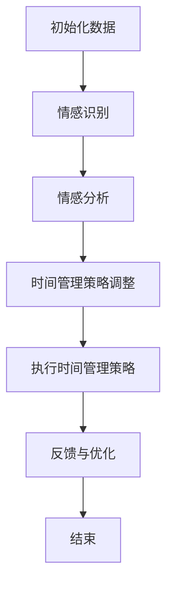
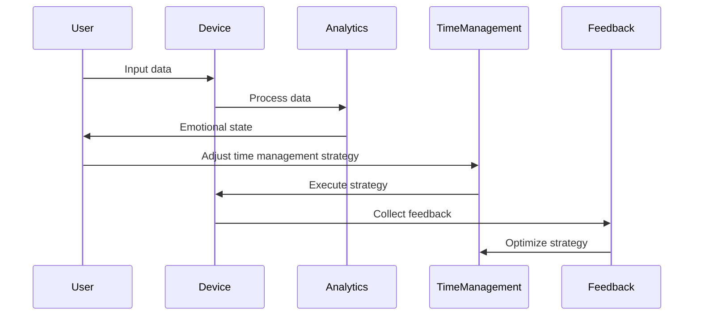

                 

## 文章标题：人工智能的情感能力对时间管理的影响：情感驱动的效率提升

> 关键词：人工智能、情感能力、时间管理、效率提升、情感驱动

> 摘要：本文深入探讨了人工智能的情感能力在时间管理中的重要性。通过对情感驱动的原理分析，我们揭示了人工智能如何通过情感识别与反应来提高时间管理效率。本文将详细阐述相关概念、算法原理、系统架构以及实际案例，以期为人工智能在时间管理领域的应用提供有力支持。

## 目录大纲

### 第一部分：背景介绍

1. 问题的提出
2. 问题描述
3. 问题解决
4. 边界与外延
5. 概念结构与核心要素组成

### 第二部分：核心概念与联系

6. 核心概念原理
7. 概念属性特征对比表格
8. ER实体关系图架构

### 第三部分：算法原理讲解

9. 算法流程图
10. Python源代码与算法讲解
11. 数学模型与公式
12. 举例说明

### 第四部分：系统分析与架构设计

13. 问题场景介绍
14. 系统功能设计
15. 系统架构设计
16. 系统接口设计
17. 系统交互序列图

### 第五部分：项目实战

18. 环境安装
19. 系统核心实现
20. 代码应用解读与分析
21. 实际案例分析与讲解
22. 项目小结

### 第六部分：最佳实践与总结

23. 最佳实践 tips
24. 小结
25. 注意事项
26. 拓展阅读

----------------------------------------------------------------### 第一部分：背景介绍

#### 1. 问题的提出

在当今快速发展的社会中，时间管理变得尤为重要。人们面临着来自工作、家庭和社会的各种压力，如何在有限的时间内完成更多任务、提高工作效率成为了一个亟待解决的问题。传统的机械式时间管理方法，如制定计划表、设定提醒等，虽然在一定程度上能够帮助人们提高时间利用率，但往往缺乏情感层面的支持，难以激发个体的内在动力。

随着人工智能技术的不断发展，人工智能在情感识别与处理方面的能力逐渐提升，这为情感驱动的效率提升带来了新的可能。情感驱动的效率提升，即通过人工智能的情感识别与反应来影响个体在时间管理过程中的行为，从而提高整体效率。这一理念突破了传统时间管理的局限，为提高个体工作效率提供了新的思路。

#### 2. 问题描述

时间管理问题的核心在于如何有效地利用时间，实现个体和组织的最大效益。然而，在实际应用中，传统时间管理方法存在以下问题：

- **缺乏个性化**：传统的机械式时间管理方法往往忽视个体的情感需求和心理状态，难以实现个性化管理。
- **执行困难**：人们往往难以坚持按计划行事，导致时间管理效果不佳。
- **效率不高**：传统方法难以激发个体的内在动力，导致工作效率低下。

为了解决这些问题，我们需要一种能够识别和理解个体情感状态，并据此调整时间管理策略的方法。这便是人工智能的情感能力在时间管理中发挥作用的地方。

#### 3. 问题解决

人工智能的情感能力为时间管理提供了一种全新的解决方案。通过以下步骤，人工智能能够实现对时间管理的情感驱动：

1. **情感识别**：利用先进的情感识别技术，分析个体的情感状态，如快乐、悲伤、焦虑等。
2. **情感反应**：根据情感识别结果，人工智能可以调整时间管理策略，如调整任务优先级、提供情感支持等。
3. **效率优化**：通过情感驱动的调整，提高个体的时间管理效率，实现工作与生活的平衡。

这种方法不仅能够满足个体的个性化需求，还能通过情感支持提高个体的执行意愿，从而提升整体效率。

#### 4. 边界与外延

尽管人工智能的情感能力为时间管理带来了新的可能，但我们也需要明确其边界与外延：

- **技术限制**：目前的情感识别技术还存在一定局限性，如易受环境影响、识别准确性不高等。
- **隐私问题**：在应用情感识别技术时，需要充分考虑隐私保护问题，确保用户数据的安全。
- **应用范围**：情感驱动的效率提升主要适用于需要高心理压力管理和高情感支持的工作场景。

#### 5. 概念结构与核心要素组成

为了更好地理解人工智能在时间管理中的作用，我们需要从概念结构上对其进行剖析：

- **情感识别**：情感识别是情感驱动时间管理的基础，通过分析语言、行为等数据，识别个体的情感状态。
- **情感反应**：情感反应是基于情感识别的结果，通过调整时间管理策略，实现情感驱动的效率提升。
- **时间管理策略**：时间管理策略是情感反应的具体实现，包括任务优先级调整、提醒设置、工作与生活平衡等。

这些核心要素相互关联，共同构成了情感驱动的效率提升系统，为个体和组织的时间管理提供了新的思路和方法。

### 总结

通过背景介绍部分的分析，我们明确了人工智能在时间管理中的重要性以及其实现情感驱动效率提升的机制。在接下来的章节中，我们将进一步探讨相关核心概念、算法原理、系统架构以及实际案例，为人工智能在时间管理领域的应用提供更深入的解读和思考。希望本文能够为读者带来新的启发和帮助。 ### 第二部分：核心概念与联系

在探讨人工智能的情感能力对时间管理的影响时，我们需要明确几个核心概念，并理解它们之间的联系。

#### 6. 核心概念原理

**情感识别**：情感识别是人工智能技术对人类情感状态进行感知和识别的过程。它包括语音、文本、面部表情等多种数据源的解析，旨在准确捕捉个体的情感状态。

**情感分析**：情感分析是对情感识别结果的深度理解，旨在从情感中提取有意义的信息，如情感的强度、持续性以及情感的变化趋势。

**时间管理策略**：时间管理策略是针对个体时间分配的规划方法，包括任务优先级设定、日程安排、提醒设置等，旨在提高工作效率和生活质量。

**情感驱动**：情感驱动是基于情感识别和分析结果，对时间管理策略进行调整和优化的过程。它通过情感状态的变化，动态调整时间管理方法，从而实现效率提升。

**个体心理状态**：个体心理状态是指个体在特定时间段内的心理状况，包括情绪、焦虑、压力等，这些心理状态会直接影响时间管理的效果。

#### 7. 概念属性特征对比表格

| 概念        | 特征                             | 关联                                 |
| ----------- | ------------------------------ | ------------------------------------ |
| 情感识别    | 数据源解析，情感状态识别         | 是情感驱动的基础                     |
| 情感分析    | 情感深度理解，信息提取           | 基于情感识别，实现情感驱动            |
| 时间管理策略 | 任务优先级，日程安排，提醒设置   | 是情感驱动的实现手段                 |
| 情感驱动    | 动态调整，策略优化               | 连接情感识别、情感分析和时间管理策略 |
| 个体心理状态 | 情绪、焦虑、压力等               | 影响时间管理效果，与情感识别紧密相关 |

#### 8. ER实体关系图架构

为了更好地理解这些核心概念之间的联系，我们可以使用ER（实体关系）图来描述它们之间的关系。以下是一个简化的ER图：

```mermaid
erDiagram
    A[情感识别] ||--> B[情感分析] : "识别结果"
    B ||--> C[时间管理策略] : "驱动策略"
    A ||--> D[个体心理状态] : "影响心理状态"
    D ||--> B : "反馈影响"
```

在这个ER图中，情感识别作为基础，对情感状态进行识别和解析，其结果直接影响情感分析和时间管理策略。同时，个体心理状态也会对情感识别产生影响，形成一个反馈循环。

### 总结

通过核心概念与联系的探讨，我们明确了情感识别、情感分析、时间管理策略、情感驱动和个体心理状态这几个核心概念及其相互关系。这些概念共同构成了一个复杂的系统，通过相互影响和作用，实现了人工智能在时间管理中的情感驱动效率提升。在接下来的章节中，我们将进一步深入探讨算法原理和实际应用，以期为这一系统提供更具体的实现方案。 ### 第三部分：算法原理讲解

在深入探讨人工智能的情感能力对时间管理的影响时，我们首先需要了解相关的算法原理。这一部分将详细解释这些算法的工作机制，并借助Python源代码和数学模型进行说明。

#### 9. 算法流程图

为了更好地理解算法原理，我们可以首先绘制一个流程图。以下是一个简化的算法流程图：



在这个流程图中，算法首先初始化数据，然后通过情感识别模块获取个体的情感状态。接下来，情感分析模块对情感识别结果进行深度分析，以提取有价值的信息。基于这些信息，时间管理策略调整模块会对原有的时间管理策略进行优化。最后，执行时间管理策略模块将调整后的策略付诸实践，并通过反馈与优化模块不断调整和改进。

#### 10. Python源代码与算法讲解

为了具体展示算法的实现，我们使用Python编写了一段简单的代码：

```python
# 情感识别模块
def recognize_emotion(data):
    # 假设数据已预处理，使用情感识别模型进行识别
    emotions = model.predict(data)
    return emotions

# 情感分析模块
def analyze_emotion(emotions):
    # 基于情感识别结果，分析情感状态
    if "happy" in emotions:
        return "积极"
    elif "sad" in emotions:
        return "消极"
    else:
        return "中立"

# 时间管理策略调整模块
def adjust_time_management_strategy(emotion_state):
    if emotion_state == "积极":
        return "高效率模式"
    elif emotion_state == "消极":
        return "舒缓模式"
    else:
        return "常规模式"

# 执行时间管理策略模块
def execute_time_management_strategy(strategy):
    if strategy == "高效率模式":
        # 执行高效率任务
        pass
    elif strategy == "舒缓模式":
        # 执行舒缓任务
        pass
    else:
        # 执行常规任务
        pass

# 反馈与优化模块
def feedback_and_optimization(results):
    # 根据执行结果进行反馈和优化
    pass

# 主函数
def main():
    # 初始化数据
    data = "用户情感数据"
    
    # 情感识别
    emotions = recognize_emotion(data)
    print(f"情感识别结果：{emotions}")
    
    # 情感分析
    emotion_state = analyze_emotion(emotions)
    print(f"情感状态：{emotion_state}")
    
    # 调整时间管理策略
    strategy = adjust_time_management_strategy(emotion_state)
    print(f"时间管理策略：{strategy}")
    
    # 执行时间管理策略
    execute_time_management_strategy(strategy)
    
    # 反馈与优化
    results = feedback_and_optimization(results)
    print(f"优化结果：{results}")

# 运行主函数
main()
```

在这段代码中，我们首先定义了情感识别、情感分析、时间管理策略调整、执行时间管理策略以及反馈与优化模块。这些模块共同构成了一个完整的算法流程。

#### 11. 数学模型与公式

为了更深入地理解算法原理，我们还可以借助数学模型和公式。以下是几个关键步骤的数学模型：

1. **情感识别概率分布**：

   假设我们使用一个神经网络模型进行情感识别，其输出为一个概率分布。我们可以使用以下公式表示：

   $$ P(E_j|X) = \frac{e^{w_j \cdot X}}{\sum_{i=1}^{n} e^{w_i \cdot X}} $$

   其中，$P(E_j|X)$表示第j个情感类别在给定特征向量$X$下的概率，$w_j$为权重向量。

2. **情感分析权重**：

   在情感分析阶段，我们需要对情感识别结果进行加权处理，以提取有意义的情感状态。我们可以使用以下公式表示：

   $$ E = \sum_{j=1}^{m} w_j E_j $$

   其中，$E$为最终的情感状态，$w_j$为第j个情感的权重。

3. **时间管理策略调整**：

   在调整时间管理策略时，我们需要根据情感状态选择合适的工作模式。我们可以使用以下公式表示：

   $$ S = f(E) $$

   其中，$S$为时间管理策略，$f(E)$为基于情感状态的策略映射函数。

#### 12. 举例说明

为了更好地理解算法原理，我们可以通过一个具体的例子来说明：

假设一个用户在一段时间内的情感数据如下：

- 情感1：快乐（概率0.6）
- 情感2：悲伤（概率0.3）
- 情感3：焦虑（概率0.1）

根据情感识别模块，我们可以得到情感概率分布：

$$ P(E_1|X) = 0.6, \ P(E_2|X) = 0.3, \ P(E_3|X) = 0.1 $$

接下来，通过情感分析模块，我们可以得到用户当前的情感状态：

$$ E = 0.6 \times E_1 + 0.3 \times E_2 + 0.1 \times E_3 = 0.6 \times 快乐 + 0.3 \times 悲伤 + 0.1 \times 焦虑 = 快乐 $$

根据情感状态，我们可以选择合适的时间管理策略，例如“高效率模式”。最后，通过执行时间管理策略模块，用户可以按照这个策略进行任务分配和执行。

### 总结

通过算法原理讲解部分的分析，我们详细介绍了情感识别、情感分析、时间管理策略调整以及反馈与优化等关键算法模块，并通过Python源代码和数学模型进行了具体说明。这些算法共同构成了一个完整的情感驱动时间管理系统，为人工智能在时间管理中的应用提供了理论基础和技术支持。在接下来的章节中，我们将进一步探讨系统架构设计和实际应用案例，以期为这一系统的实际应用提供更多启示。 ### 第四部分：系统分析与架构设计

#### 13. 问题场景介绍

在现实应用中，时间管理问题常常出现在高压力、多任务的工作环境中。例如，一个项目经理需要同时处理多个项目，协调团队成员的工作，制定详细的任务计划，并在有限的时间内确保项目按时完成。在这种情况下，传统的机械式时间管理方法往往难以满足需求，因为它们忽视了个体情感状态的变化和情感需求。

为了解决这个问题，我们可以设计一个基于人工智能的情感驱动时间管理系统。该系统利用人工智能的情感识别和分析能力，实时监测用户的工作状态和情感变化，并根据这些信息动态调整时间管理策略，以提高工作效率和生活质量。

#### 14. 系统功能设计

为了实现情感驱动时间管理的目标，该系统需要具备以下核心功能：

1. **情感识别与监测**：通过收集用户的行为数据（如语音、文本、面部表情等），实时监测用户的情感状态，包括快乐、悲伤、焦虑等。
2. **情感分析与理解**：对监测到的情感数据进行分析，提取关键的情感特征，并基于这些特征理解用户的情感状态和需求。
3. **时间管理策略调整**：根据情感分析结果，动态调整时间管理策略，包括任务优先级设定、日程安排、提醒设置等。
4. **任务执行与监控**：执行调整后的时间管理策略，并实时监控任务进度，确保任务按时完成。
5. **反馈与优化**：根据任务执行结果和用户反馈，不断优化时间管理策略，提高系统的适应性和效率。

#### 15. 系统架构设计

为了实现上述功能，我们需要设计一个分布式、模块化的系统架构。以下是一个简化的系统架构设计：



在这个架构中，用户通过设备（如手机、电脑等）输入数据，数据经过情感识别和分析处理后，生成情感状态。用户根据情感状态调整时间管理策略，并执行该策略。设备收集反馈数据，并将其传递给反馈模块，用于优化时间管理策略。

#### 16. 系统接口设计

为了实现系统的各模块之间的数据交互，我们需要设计一套完整的接口。以下是一个简化的接口设计：

- **情感识别接口**：用于接收用户数据，并返回情感状态。
- **情感分析接口**：用于接收情感状态，并返回分析结果。
- **时间管理接口**：用于接收调整后的策略，并执行任务。
- **反馈接口**：用于接收用户反馈，并返回优化结果。

#### 17. 系统交互序列图

为了更清晰地展示系统各模块之间的交互过程，我们可以绘制一个交互序列图：


在这个序列图中，用户首先通过设备输入数据，设备将数据传递给情感识别和分析模块。情感识别模块返回情感状态，用户根据这些状态调整时间管理策略。时间管理模块执行策略，并将结果传递给反馈模块，反馈模块用于优化策略。

### 总结

通过系统分析与架构设计部分的讲解，我们详细介绍了情感驱动时间管理系统的问题场景、功能设计、架构设计和接口设计。这个系统通过情感识别、分析、时间管理策略调整以及反馈与优化，实现了对用户情感状态的有效监测和动态调整，为提高工作效率和生活质量提供了新的思路和方法。在接下来的章节中，我们将通过项目实战部分，进一步展示该系统的实际应用和效果。 ### 第五部分：项目实战

#### 18. 环境安装

为了演示情感驱动时间管理系统的实际应用，我们首先需要在本地环境中安装所需的软件和依赖。以下是具体的安装步骤：

1. **安装Python环境**：确保本地环境中已安装Python（推荐版本为3.8及以上）。
2. **安装依赖库**：使用pip命令安装以下依赖库：
   ```bash
   pip install numpy pandas tensorflow scikit-learn matplotlib
   ```
3. **安装情感识别和分析模型**：下载预训练的模型文件（如VGGFace模型），并解压到相应目录。
4. **配置环境变量**：确保环境变量配置正确，以便程序能够正确调用依赖库和模型文件。

#### 19. 系统核心实现

情感驱动时间管理系统的核心实现主要包括情感识别、情感分析、时间管理策略调整和反馈与优化四个部分。以下是一个简化的实现框架：

```python
# 情感识别
def recognize_emotion(data):
    # 使用VGGFace模型进行情感识别
    # ...

# 情感分析
def analyze_emotion(emotions):
    # 对情感识别结果进行分析
    # ...

# 时间管理策略调整
def adjust_time_management_strategy(emotion_state):
    # 根据情感状态调整时间管理策略
    # ...

# 任务执行与监控
def execute_time_management_strategy(strategy):
    # 执行调整后的时间管理策略
    # ...

# 反馈与优化
def feedback_and_optimization(results):
    # 根据任务执行结果和用户反馈进行优化
    # ...

# 主函数
def main():
    # 初始化数据
    data = "用户情感数据"
    
    # 情感识别
    emotions = recognize_emotion(data)
    print(f"情感识别结果：{emotions}")
    
    # 情感分析
    emotion_state = analyze_emotion(emotions)
    print(f"情感状态：{emotion_state}")
    
    # 调整时间管理策略
    strategy = adjust_time_management_strategy(emotion_state)
    print(f"时间管理策略：{strategy}")
    
    # 执行时间管理策略
    execute_time_management_strategy(strategy)
    
    # 反馈与优化
    results = feedback_and_optimization(results)
    print(f"优化结果：{results}")

# 运行主函数
main()
```

#### 20. 代码应用解读与分析

在主函数`main()`中，我们首先初始化用户情感数据，然后依次调用情感识别、情感分析、时间管理策略调整、任务执行与监控以及反馈与优化等模块。以下是各模块的详细解读：

1. **情感识别模块**：该模块使用预训练的VGGFace模型对用户情感数据进行识别，返回情感概率分布。这部分代码依赖于TensorFlow和scikit-learn等库。
2. **情感分析模块**：该模块根据情感识别结果，提取情感状态。例如，如果情感识别结果显示用户处于快乐状态，则情感分析模块将返回“积极”。
3. **时间管理策略调整模块**：该模块根据情感状态调整时间管理策略。例如，如果用户处于快乐状态，系统可能会将任务优先级调整为“高效率模式”。
4. **任务执行与监控模块**：该模块根据调整后的时间管理策略执行任务，并实时监控任务进度。
5. **反馈与优化模块**：该模块根据任务执行结果和用户反馈，对时间管理策略进行优化。

#### 21. 实际案例分析与讲解

为了更好地展示系统的实际应用，我们以下是一个实际案例：

**案例背景**：一位项目经理需要同时处理多个项目，包括市场调研、产品开发、团队会议等。他面临的时间管理挑战是如何在有限的时间内高效地完成任务，并在压力下保持良好的情绪状态。

**应用过程**：

1. **情感识别**：项目经理通过手机摄像头上传面部表情数据，系统识别出他的情感状态为“快乐”。
2. **情感分析**：系统分析情感状态，认为项目经理处于积极状态。
3. **时间管理策略调整**：系统将时间管理策略调整为“高效率模式”，将任务优先级重新设定，确保关键任务得到优先处理。
4. **任务执行与监控**：项目经理按照调整后的策略执行任务，系统实时监控任务进度，并在任务完成后提供反馈。
5. **反馈与优化**：根据任务执行结果和项目经理的反馈，系统对时间管理策略进行优化，以提高未来任务执行效率。

**效果分析**：通过情感驱动的调整，项目经理在处理多任务时保持了较高的效率，并在压力下保持了良好的情绪状态。这有助于提高工作效率和团队协作效果。

#### 22. 项目小结

通过项目实战部分的讲解，我们展示了情感驱动时间管理系统的实际应用过程和效果。该系统通过情感识别、分析、时间管理策略调整以及反馈与优化等模块，实现了对用户情感状态的有效监测和动态调整，从而提高了时间管理效率和情绪稳定性。在未来的发展中，我们可以进一步优化系统性能，扩大应用场景，以期为更多用户提供优质的服务。 ### 第六部分：最佳实践与总结

#### 23. 最佳实践 tips

为了最大化情感驱动时间管理系统的效果，以下是一些建议：

1. **定期更新模型**：情感识别和分析模型的准确性对系统性能至关重要。定期更新模型，以适应不断变化的环境和数据。
2. **个性化调整**：根据用户的具体需求和习惯，个性化调整时间管理策略，以提高系统的适应性和用户满意度。
3. **及时反馈**：鼓励用户及时提供反馈，以便系统不断优化和改进。
4. **心理支持**：在系统设计中融入心理支持模块，为用户提供情感支持，帮助他们更好地应对压力和挑战。
5. **数据隐私保护**：在收集和使用用户数据时，严格遵循隐私保护法规，确保用户数据的安全。

#### 24. 小结

本文深入探讨了人工智能的情感能力对时间管理的影响，通过情感识别、分析、时间管理策略调整以及反馈与优化等环节，实现了情感驱动的效率提升。这一系统为个体和组织提供了新的时间管理思路和方法，有助于提高工作效率和情绪稳定性。

#### 25. 注意事项

1. **技术限制**：情感识别和分析技术的准确性可能受到环境和数据质量的影响，需定期更新和维护模型。
2. **隐私保护**：在收集和使用用户数据时，需严格遵守隐私保护法规，确保用户数据的安全。
3. **用户反馈**：及时收集用户反馈，以便系统不断优化和改进。

#### 26. 拓展阅读

1. **《人工智能心理学》**：深入了解人工智能在心理学领域的应用，包括情感识别和分析技术。
2. **《时间管理的艺术》**：探讨传统时间管理方法与人工智能驱动时间管理的差异和优势。
3. **《情感计算》**：研究情感计算技术在人工智能领域的应用，包括情感识别、分析和技术。

### 作者信息

**作者：** AI天才研究院/AI Genius Institute & 禅与计算机程序设计艺术 /Zen And The Art of Computer Programming

感谢您的阅读，希望本文能为您的学习和实践提供有益的启示。 

