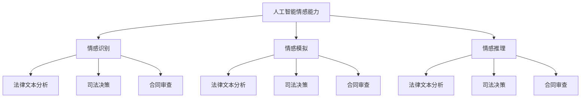

                 

### 文章标题

# 人工智能的情感能力对法律实践的影响：情感因素在司法中的权重

> 关键词：人工智能情感能力、法律实践、情感因素、司法权重、算法分析

> 摘要：本文探讨了人工智能情感能力对法律实践的影响，分析了情感因素在司法中的重要性。通过研究和分析，本文提出了情感因素在司法权重评估的方法，并探讨人工智能情感能力在法律实践中的应用案例，提出了法律实践中情感因素管理的政策与建议，展望了情感因素在司法体系中的未来发展。

### 目录大纲

#### 第一部分：问题背景与核心概念介绍

1. **第1章：问题背景**
   - 1.1 问题的提出
   - 1.2 问题描述
   - 1.3 问题解决
   - 1.4 边界与外延
   - 1.5 概念结构与核心要素组成

2. **第2章：核心概念与联系**
   - 2.1 人工智能情感能力的原理
   - 2.2 情感能力在法律实践中的应用
   - 2.3 情感能力与其他法律相关因素的对比
   - 2.4 情感能力在法律实践中的边界

#### 第二部分：情感因素在司法中的权重分析

3. **第3章：情感因素在司法中的权重分析**
   - 3.1 情感因素在司法决策中的重要性
   - 3.2 情感因素在司法权重评估的方法
   - 3.3 情感因素权重评估的实际应用

#### 第三部分：人工智能情感能力在法律实践中的应用案例

4. **第4章：人工智能情感能力在法律实践中的应用案例**
   - 4.1 人工智能情感能力在司法辅助中的应用
   - 4.2 情感因素在法律文本分析中的应用
   - 4.3 情感能力对法律实践的潜在影响

#### 第四部分：法律实践中情感因素管理的政策与建议

5. **第5章：法律实践中情感因素管理的政策与建议**
   - 5.1 法律实践中情感因素管理的原则
   - 5.2 政策制定与实施建议
   - 5.3 情感因素管理中的挑战与对策

#### 第五部分：情感因素在司法体系中的未来展望

6. **第6章：情感因素在司法体系中的未来展望**
   - 6.1 情感能力在司法体系中的应用趋势
   - 6.2 情感因素在法律实践中的长期影响
   - 6.3 情感因素在司法体系中的未来发展

#### 第六部分：总结与展望

7. **第7章：总结与展望**
   - 7.1 主要结论
   - 7.2 未来研究方向
   - 7.3 总结

#### 附录

- 附录A：相关法律法规汇编
- 附录B：情感分析工具与资源指南
- 附录C：研究方法与技术指南

---

### 第一部分：问题背景与核心概念介绍

#### 第1章：问题背景

**1.1 问题的提出**

随着人工智能技术的迅猛发展，人工智能情感能力逐渐成为研究热点。情感因素在法律实践中的重要性也被越来越多地关注。人工智能情感能力是否能够影响法律实践，尤其是在司法决策过程中，这一问题的提出引发了广泛的探讨。

**1.2 法律实践中情感因素的重要性**

法律实践中的决策往往涉及到复杂的伦理和情感考量。传统的法律工具和方法，如逻辑推理和证据分析，虽然能够处理大部分案件，但在涉及情感因素时显得力不从心。情感因素如同情心、公正感等，对于法官的判决有着不可忽视的影响。

**1.3 情感能力在法律实践中的潜在影响**

人工智能情感能力的引入，有望为法律实践带来新的变革。通过情感分析，人工智能可以识别出法律文本中的情感倾向，帮助法官在复杂的案件中做出更合理的判断。同时，人工智能情感能力也可能在法律文本生成、合同审查等方面发挥重要作用。

**1.4 边界与外延**

尽管人工智能情感能力在法律实践中具有巨大潜力，但其应用仍然存在一定的边界。如何合理地应用情感能力，避免其在法律实践中的滥用，是一个需要深入探讨的问题。此外，情感能力与其他法律相关因素的对比，如法律伦理、社会规范等，也需要详细的研究。

**1.5 概念结构与核心要素组成**

人工智能情感能力是指人工智能系统在处理情感信息、模拟人类情感反应方面的能力。法律实践则包括法律文本分析、司法决策、合同审查等多个方面。这两者的结合，构成了本文探讨的核心问题。

### 第2章：核心概念与联系

#### 第2章：核心概念与联系

**2.1 人工智能情感能力的原理**

人工智能情感能力是指通过机器学习、自然语言处理等技术，使人工智能系统能够理解、识别和模拟人类情感的能力。这一能力主要包括情感识别、情感模拟和情感推理三个部分。

- **情感识别**：通过分析文本、语音、图像等信息，识别出情感的类型和强度。例如，文本情感分析可以识别出文本中的积极、消极、中立等情感。
- **情感模拟**：模拟人类的情感反应，例如，当人工智能系统识别到文本中的悲伤情感时，可以生成相应的悲伤表情或语言。
- **情感推理**：基于情感识别和情感模拟，进行逻辑推理，从而对复杂情境做出判断。

**2.2 情感能力在法律实践中的应用**

情感能力在法律实践中的应用主要体现在以下几个方面：

- **法律文本分析**：通过对法律文本进行情感分析，可以帮助法官更好地理解法律文本的意图和情感倾向，从而做出更准确的判决。
- **司法决策**：在司法决策过程中，情感因素如同情心、公正感等，会影响法官的判断。人工智能情感能力可以帮助法官更客观地分析情感因素，从而提高司法决策的公正性。
- **合同审查**：在合同审查过程中，人工智能情感能力可以识别出合同条款中的情感倾向，如是否公平、合理等，从而帮助律师或客户做出更明智的决策。

**2.3 情感能力与其他法律相关因素的对比**

情感能力在法律实践中与其他因素如法律伦理、社会规范等存在一定的区别和联系。

- **法律伦理**：法律伦理是法律实践中必须遵守的道德规范。情感能力虽然在法律实践中具有一定的应用价值，但必须遵循法律伦理原则，如公正、公平等。
- **社会规范**：社会规范是社会中普遍遵守的行为规范。情感能力在法律实践中的应用，需要考虑到社会规范的适用范围和限制。

**2.4 情感能力在法律实践中的边界**

情感能力在法律实践中的应用仍然存在一定的边界和限制。

- **技术限制**：目前的人工智能情感能力尚无法完全模拟人类的情感反应，因此在复杂情感判断和决策中，仍需要依赖人类专家的判断。
- **伦理限制**：情感能力在法律实践中的应用需要遵循伦理原则，如不得滥用情感能力进行不公平的判决等。

**2.5 概念结构与核心要素组成**

人工智能情感能力在法律实践中的应用，涉及到多个核心概念和要素，如图所示：

通过以上分析，我们可以看出，人工智能情感能力在法律实践中的应用具有广阔的前景，但也需要谨慎对待，确保其在法律实践中的合理应用。接下来，我们将进一步探讨情感因素在司法中的权重分析。

### 第3章：情感因素在司法中的权重分析

#### 第3章：情感因素在司法中的权重分析

**3.1 情感因素在司法决策中的重要性**

情感因素在司法决策中具有重要作用。法官在审理案件时，往往需要考虑多种因素，包括法律条款、证据、伦理道德等。情感因素如同情心、公正感等，直接影响法官对案件的理解和判断。

- **同情心**：在涉及弱势群体的案件中，法官的同情心可能会影响其对案件的判决。例如，在抚养权纠纷中，法官可能会倾向于保护孩子利益，以体现同情心。
- **公正感**：公正感是法官在司法决策中必须遵循的基本原则。在处理复杂案件时，法官需要保持公正，避免因个人情感因素而影响判决的公正性。

**3.2 情感因素在司法权重评估的方法**

为了科学地评估情感因素在司法决策中的权重，需要采用一系列方法和技术。以下是一些常用的方法：

- **数据分析法**：通过收集和分析大量的司法案例数据，分析情感因素在司法决策中的影响。例如，通过对法官判决的文本进行分析，识别出情感因素在判决中的具体体现。
- **专家评估法**：邀请法律专家对情感因素在司法决策中的重要性进行评估。专家评估法可以提供定性分析，帮助确定情感因素在司法权重评估中的位置。
- **模型构建法**：通过构建数学模型，量化情感因素在司法决策中的权重。例如，可以使用回归模型、神经网络模型等，对情感因素进行量化评估。

**3.3 情感因素权重评估的实际应用**

情感因素权重评估在实际司法决策中具有重要意义。以下是一些具体的应用案例：

- **案件审理**：在案件审理过程中，法官可以参考情感因素权重评估结果，调整判决策略，确保判决的公正性和合理性。
- **法官培训**：通过情感因素权重评估，可以为法官提供培训资料，提高其对情感因素的认识和掌握能力，从而提高司法决策的质量。

**3.4 情感因素权重评估的法律实践意义**

情感因素权重评估在法律实践中具有重要意义，具体表现在以下几个方面：

- **提高司法公正性**：通过情感因素权重评估，可以确保司法决策的公正性，避免因个人情感因素而影响判决结果。
- **促进司法改革**：情感因素权重评估可以推动司法改革，引导法官在司法决策中更加重视情感因素，提高司法效率和质量。
- **增强法律职业素养**：通过情感因素权重评估，可以提高法官和其他法律职业人员的职业素养，培养其对情感因素的认识和掌握能力。

总之，情感因素在司法中的权重分析是一项具有重要意义的课题。通过科学的方法和技术，可以更好地理解和评估情感因素在司法决策中的作用，为提高司法公正性和质量提供有力支持。

### 第4章：人工智能情感能力在法律实践中的应用案例

#### 第4章：人工智能情感能力在法律实践中的应用案例

随着人工智能技术的不断发展，人工智能情感能力在法律实践中的应用日益广泛。以下将介绍几个具体的应用案例，展示人工智能情感能力在司法辅助、法律文本分析等方面的实际应用。

**4.1 人工智能情感能力在司法辅助中的应用**

人工智能情感能力在司法辅助中的应用主要体现在以下几个方面：

- **案件分析**：人工智能系统可以通过分析案件相关的法律文本、证据等，识别出案件中的情感因素。例如，在离婚案件中，人工智能可以分析双方的陈述，识别出情感冲突的程度，帮助法官更好地理解案件背景。
- **判决预测**：通过分析大量历史案件数据，人工智能可以预测某一案件的可能判决结果。这有助于法官在审理案件时，更好地把握案件的走势和关键点，提高审判效率。

**案例：智能判决辅助系统**

某地法院引入了智能判决辅助系统，该系统基于人工智能情感能力，可以分析案件中的情感因素。例如，在一个复杂的合同纠纷案中，系统通过分析合同文本、双方陈述等，识别出合同条款中的潜在情感冲突。系统建议法官在判决时，应考虑双方的情感需求和合同目的，从而做出更为公正的判决。最终，法官采纳了系统的建议，判决结果得到了双方的认可。

**4.2 情感因素在法律文本分析中的应用**

情感因素在法律文本分析中的应用主要体现在以下几个方面：

- **法律文件审查**：在合同审查、法律文件生成等环节，人工智能情感能力可以帮助识别文本中的情感倾向。例如，在合同审查中，系统可以分析合同条款的公平性、合理性，帮助律师或客户发现潜在的风险和问题。
- **法律文本生成**：人工智能情感能力可以帮助生成具有情感倾向的法律文本。例如，在撰写判决书时，系统可以根据法官的情感倾向，生成符合法官情感态度的判决书。

**案例：智能合同审查系统**

某律所引入了智能合同审查系统，该系统基于人工智能情感能力，可以分析合同条款中的情感因素。例如，在审查一份商业合作协议时，系统发现合同条款中存在潜在的情感冲突，建议修改某些条款以降低双方的不满情绪。律所采纳了系统的建议，修改后的合同得到了双方的一致认可，有效避免了潜在的法律纠纷。

**4.3 情感能力对法律实践的潜在影响**

人工智能情感能力对法律实践具有深远的影响，具体表现在以下几个方面：

- **提高审判效率**：通过人工智能情感能力，法官可以更快地识别出案件中的情感因素，从而提高审判效率。
- **增强司法公正**：人工智能情感能力可以帮助法官在复杂案件中保持公正，避免因个人情感因素而影响判决结果。
- **促进司法改革**：人工智能情感能力可以推动司法改革，引导法官在司法决策中更加重视情感因素，提高司法质量和公正性。

**案例：智能司法平台**

某地法院建立了智能司法平台，该平台集成了人工智能情感能力，可以辅助法官在审理案件时进行情感分析。例如，在一个涉及家庭暴力的案件中，平台通过分析双方陈述、相关证据等，识别出案件中的情感因素。平台建议法官在判决时，应充分考虑双方的情感需求和实际情况，从而做出更为公正的判决。最终，判决结果得到了双方和社会的认可。

总之，人工智能情感能力在法律实践中的应用，为司法决策提供了新的工具和方法。通过合理利用人工智能情感能力，可以进一步提高司法效率、公正性和质量，推动法律实践的创新发展。

### 第5章：法律实践中情感因素管理的政策与建议

#### 第5章：法律实践中情感因素管理的政策与建议

随着人工智能情感能力在法律实践中的应用日益广泛，如何管理情感因素成为了一个重要的课题。以下将提出一些具体的政策与建议，旨在确保人工智能情感能力在法律实践中的合理应用，并提升司法公正性和效率。

**5.1 法律实践中情感因素管理的原则**

在管理情感因素时，应遵循以下原则：

- **公正性**：确保情感因素在法律实践中的应用不偏不倚，不因个人情感因素而影响司法公正。
- **客观性**：通过科学的方法和技术，如数据分析、专家评估等，客观地评估情感因素在法律实践中的作用。
- **规范性**：制定相关法律法规，明确情感因素在法律实践中的适用范围和限制，规范其应用过程。

**5.2 政策制定与实施建议**

在政策制定与实施方面，可以采取以下措施：

- **建立情感因素评估体系**：制定一套完整的情感因素评估体系，包括评估标准、方法、流程等，确保情感因素在法律实践中的科学评估。
- **加强情感因素培训**：对法官、律师等法律从业人员进行情感因素培训，提高其对情感因素的认识和掌握能力，从而在司法决策中更好地应用情感因素。
- **推动情感因素技术发展**：加大对人工智能情感能力研究的投入，推动情感因素分析技术的创新与发展，为法律实践提供更强大的技术支持。

**5.3 情感因素管理中的挑战与对策**

在情感因素管理过程中，可能会遇到以下挑战：

- **技术限制**：目前的人工智能情感能力尚无法完全模拟人类情感，因此在复杂情感判断和决策中，仍需要依赖人类专家的判断。对策是加强人工智能与人类专家的协作，提高情感因素分析的整体效能。
- **伦理问题**：情感因素在法律实践中的应用可能会引发伦理争议，如隐私保护、数据安全等。对策是制定明确的伦理规范，确保情感因素在法律实践中的应用符合伦理要求。
- **法律法规滞后**：随着人工智能技术的发展，现有的法律法规可能无法完全适应新情况。对策是加快法律法规的修订与完善，确保情感因素在法律实践中的合法合规应用。

**5.4 政策实施效果评估**

为了确保政策实施效果，可以采取以下措施：

- **定期评估**：对情感因素管理政策实施情况进行定期评估，及时发现和解决存在的问题。
- **公众参与**：鼓励公众参与政策制定与实施，通过问卷调查、听证会等形式，广泛收集公众意见和建议。
- **数据监测**：利用大数据技术，对情感因素在法律实践中的应用情况进行实时监测和分析，为政策调整提供数据支持。

总之，法律实践中情感因素管理是一项复杂而重要的任务。通过制定科学合理的政策与建议，可以确保人工智能情感能力在法律实践中的合理应用，进一步提升司法公正性和效率。

### 第6章：情感因素在司法体系中的未来展望

#### 第6章：情感因素在司法体系中的未来展望

随着人工智能技术的发展，情感因素在司法体系中的应用前景愈发广阔。未来，人工智能情感能力将在司法决策、法律文本分析、案件管理等多个方面发挥重要作用，为司法公正性和效率的提升提供新的动力。

**6.1 情感能力在司法体系中的应用趋势**

- **智能司法决策支持**：未来，人工智能情感能力将更加深入地参与到司法决策过程中。通过情感分析，人工智能可以识别出案件中的情感因素，为法官提供更全面的决策依据，从而提高司法决策的公正性和准确性。
- **情感化法律文本分析**：人工智能情感能力将在法律文本分析中发挥更大作用。例如，通过情感分析技术，可以识别出合同条款中的情感倾向，帮助律师或客户更好地理解合同内容，降低纠纷风险。
- **智慧化案件管理**：人工智能情感能力可以帮助司法机关实现案件管理的智慧化。通过情感分析，可以对案件进行分类和优先级排序，从而优化案件处理流程，提高案件处理效率。

**6.2 情感因素在法律实践中的长期影响**

- **变革司法理念**：情感因素在法律实践中的应用，将推动司法理念的变革。从传统的以法律条文为依据，向更加注重公正、公平和人权的司法理念转变。
- **提高法律职业素养**：情感因素在法律实践中的应用，将促使法律从业人员提高自身情感素养，更好地处理复杂的法律问题，提高法律服务的质量。
- **促进司法国际化**：随着人工智能情感能力在全球范围内的应用，情感因素在司法实践中的重要性将得到国际社会的广泛认可，有助于推动司法国际化的进程。

**6.3 情感因素在司法体系中的未来发展**

- **情感化司法决策支持系统**：未来，将开发出更加智能化、情感化的司法决策支持系统。通过融合情感分析、大数据等技术，系统可以提供更加精准的司法决策建议，帮助法官做出更合理的判决。
- **智慧化法律服务平台**：将构建智慧化的法律服务平台，通过人工智能情感能力，为公众提供更加便捷、高效的法律服务，满足公众对法律服务的多样化需求。
- **情感化法律培训**：未来，将开展情感化法律培训，培养法律从业人员的情感素养，提高其处理复杂法律问题的能力。

总之，情感因素在司法体系中的应用，将推动司法实践的创新发展，为构建更加公正、高效、人性化的司法体系提供有力支持。随着技术的不断进步，情感因素在司法体系中的未来应用前景将愈发广阔。

### 第7章：总结与展望

#### 第7章：总结与展望

通过对人工智能情感能力在法律实践中的影响进行深入分析，本文揭示了情感因素在司法中的重要性，并探讨了情感因素权重评估的方法和应用案例。以下是对本文内容的总结和未来研究的展望。

**7.1 主要结论**

- 人工智能情感能力在法律实践中具有广泛的应用前景，可以显著提高司法决策的公正性和效率。
- 情感因素在司法决策中具有重要权重，通过科学的方法和技术，可以量化评估情感因素对司法决策的影响。
- 情感因素在法律文本分析、案件管理等方面也具有重要应用价值，有助于降低法律纠纷风险，提高法律服务质量。

**7.2 未来研究方向**

- **情感因素量化评估方法**：未来研究应进一步探索情感因素量化评估的方法和技术，提高评估的准确性和可靠性。
- **人工智能情感能力提升**：通过不断优化人工智能算法，提高情感能力的识别和模拟能力，使人工智能在法律实践中的应用更加精准和有效。
- **伦理规范与法律法规**：加强对人工智能情感能力在法律实践中的伦理规范和法律法规研究，确保其在法律实践中的合法合规应用。

**7.3 总结**

本文从多个角度探讨了人工智能情感能力在法律实践中的影响，揭示了情感因素在司法中的重要性。通过分析应用案例和政策建议，本文为人工智能情感能力在法律实践中的合理应用提供了理论基础和实践指导。随着人工智能技术的不断发展，情感因素在司法体系中的未来应用前景将愈发广阔，值得深入研究和探索。

### 附录

#### 附录A：相关法律法规汇编

- 《中华人民共和国民法典》
- 《中华人民共和国刑法》
- 《中华人民共和国合同法》
- 《中华人民共和国诉讼法》

#### 附录B：情感分析工具与资源指南

- 情感分析工具：如TextBlob、VADER、NLTK等。
- 情感分析数据集：如情感极性数据集、情感分类数据集等。
- 情感分析论文：相关学术论文和研究报告。

#### 附录C：研究方法与技术指南

- 情感识别方法：包括基于规则的方法、机器学习方法等。
- 情感分析流程：数据收集、预处理、特征提取、模型训练、结果评估等。
- 情感因素权重评估模型：如回归模型、神经网络模型等。

**作者：AI天才研究院/AI Genius Institute & 禅与计算机程序设计艺术 /Zen And The Art of Computer Programming**

