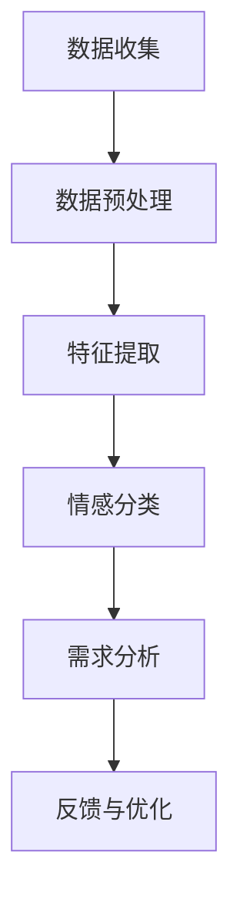
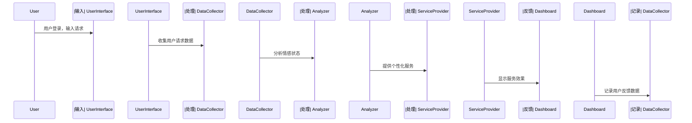

                 

### 文章标题

#### 人工智能的情感需求与城市管理：情感导向的公共服务

> 关键词：人工智能、情感需求、城市管理、公共服务

> 摘要：本文旨在探讨人工智能（AI）在满足城市居民情感需求方面的重要性和可能性，并分析如何通过情感导向的公共服务提升城市管理的效率和品质。本文将首先介绍人工智能在城市管理中的应用现状，然后深入探讨情感需求在公共服务中的重要性。接下来，我们将分析情感需求与人工智能的结合点，并提出情感导向的公共服务概念。随后，文章将阐述情感需求的原理与属性，详细介绍人工智能的情感分析技术，并使用算法原理讲解和实际案例解析展示情感需求识别和利用的方法。文章还将介绍情感需求分析在城市规划、交通管理、公共安全和社区服务中的应用，最后讨论系统设计与实现、最佳实践以及未来研究的方向。

### 目录大纲

---

#### 第一部分：背景介绍

- **第1章：问题的背景与探讨**
  - 1.1.1 人工智能在城市管理中的应用现状
  - 1.1.2 情感需求在公共服务中的重要性
  - 1.1.3 城市管理与人工智能的交叉点
  - 1.1.4 本书的核心概念与结构

- **第2章：核心概念与联系**
  - 2.1.1 情感需求的定义与分类
  - 2.1.2 情感需求在城市管理中的应用
  - 2.1.3 人工智能与情感需求的结合
  - 2.1.4 情感导向的公共服务概念解析

#### 第二部分：核心概念与联系

- **第3章：情感需求的原理与属性**
  - 3.1.1 情感需求的心理学基础
  - 3.1.2 情感需求的属性特征对比
  - 3.1.3 情感需求的影响因素分析
  - 3.1.4 情感需求的测量方法

- **第4章：人工智能的情感分析技术**
  - 4.1.1 情感分析技术的概述
  - 4.1.2 情感分析的基本原理
  - 4.1.3 基于深度学习的情感分析
  - 4.1.4 基于自然语言处理的技术应用

#### 第三部分：算法原理讲解

- **第5章：算法原理与流程图**
  - 5.1.1 情感需求识别算法
  - 5.1.2 情感需求识别算法流程图（Mermaid）
  - 5.1.3 情感需求识别算法的数学模型
  - 5.1.4 情感需求识别算法的Python代码实现
  - 5.1.5 情感需求识别算法的例子解析

- **第6章：情感需求分析在公共服务中的应用**
  - 6.1.1 情感需求分析在城市规划中的应用
  - 6.1.2 情感需求分析在交通管理中的应用
  - 6.1.3 情感需求分析在公共安全中的应用
  - 6.1.4 情感需求分析在社区服务中的应用

#### 第四部分：系统设计与实现

- **第7章：系统分析与架构设计**
  - 7.1.1 项目介绍
  - 7.1.2 系统功能设计（Mermaid类图）
  - 7.1.3 系统架构设计（Mermaid架构图）
  - 7.1.4 系统接口设计与交互（Mermaid序列图）

- **第8章：项目实战与实现**
  - 8.1.1 环境安装与配置
  - 8.1.2 系统核心实现源代码
  - 8.1.3 代码应用解读与分析
  - 8.1.4 实际案例分析
  - 8.1.5 项目总结与展望

#### 第五部分：最佳实践与拓展

- **第9章：最佳实践与注意事项**
  - 9.1.1 情感需求分析中的常见问题与解决方案
  - 9.1.2 情感需求分析的最佳实践
  - 9.1.3 注意事项与优化建议

- **第10章：拓展阅读与进一步研究**
  - 10.1.1 相关领域的进一步探讨
  - 10.1.2 未来发展趋势与展望
  - 10.1.3 进一步研究的方向

---

此目录大纲共包含10个章节，涵盖了从背景介绍、核心概念与联系、算法原理讲解、系统设计与实现，到最佳实践与拓展的全面内容。每个章节都根据书籍的核心主题进行了细致的划分，确保内容的完整性和逻辑性。

### 文章正文部分

#### 第一部分：背景介绍

**第1章：问题的背景与探讨**

1.1.1 **人工智能在城市管理中的应用现状**

近年来，人工智能（AI）在各个领域的应用越来越广泛，城市管理领域也不例外。AI技术通过大数据分析、机器学习和深度学习等手段，极大地提高了城市管理的效率和精准度。例如，智能交通系统利用AI算法优化交通流量，减少拥堵；智能监控系统能够实时监控城市安全，提高公共安全保障；智慧城市建设更是将AI技术应用于城市规划、环境监测、能源管理等多个方面。

然而，尽管AI在城市管理中的应用已经取得显著成效，但一个不可忽视的问题是，城市居民的情感需求在当前的AI应用中并未得到充分关注。随着城市化进程的加速，城市居民的生活节奏越来越快，压力越来越大，情感需求日益增长。然而，现有的AI技术更多关注于提高效率和解决实际问题，而忽视了居民的情感需求。这种状况不仅可能导致居民对AI系统的抵触情绪，还可能影响城市管理的整体效果。

1.1.2 **情感需求在公共服务中的重要性**

情感需求是人类基本需求之一，包括快乐、满足、安全感、认同感等。在公共服务中，情感需求的重要性尤为突出。公共服务不仅是满足居民基本生活需求的重要保障，更是提升居民生活质量和幸福感的重要途径。情感需求在公共服务中的满足程度直接影响到居民对公共服务的满意度和生活质量。

具体来说，情感需求在公共服务中的重要性体现在以下几个方面：

- **满意度提升**：当居民的情感需求得到满足时，他们对公共服务的满意度会显著提高。这种满意度的提升不仅能够增强居民对政府的信任，还能促进社会的稳定和谐。

- **服务质量改进**：了解和满足居民的情感需求有助于改进公共服务质量。通过情感分析技术，公共服务提供者可以更准确地了解居民的需求和感受，从而提供更加个性化的服务，提升整体服务质量。

- **城市竞争力提升**：情感需求满足是吸引和留住人才的重要条件。一个能够充分满足居民情感需求的城市，能够提高城市的生活品质，增强城市的竞争力。

1.1.3 **城市管理与人工智能的交叉点**

城市管理与人工智能的结合点在于利用AI技术更好地满足居民的情感需求。这不仅是城市管理发展的必然趋势，也是提高城市管理效率和品质的重要手段。通过AI技术，我们可以实现以下目标：

- **情感需求识别**：利用自然语言处理和情感分析技术，识别居民的情感状态和需求，为公共服务提供更精准的数据支持。

- **个性化服务**：根据居民的情感需求，提供个性化的公共服务，提高服务针对性和满意度。

- **预测与预防**：通过大数据分析和预测模型，提前识别和预防可能引发居民负面情感的事件，保障城市安全与稳定。

1.1.4 **本书的核心概念与结构**

本书旨在系统地探讨人工智能在满足城市居民情感需求方面的应用，并提出情感导向的公共服务理念。全书结构如下：

- **第一部分**：背景介绍，包括人工智能在城市管理中的应用现状、情感需求在公共服务中的重要性、城市管理与人工智能的交叉点等。

- **第二部分**：核心概念与联系，介绍情感需求的定义与分类、情感需求在城市管理中的应用、人工智能与情感需求的结合、情感导向的公共服务概念等。

- **第三部分**：算法原理讲解，包括情感需求的原理与属性、人工智能的情感分析技术、情感需求识别算法原理与实现等。

- **第四部分**：系统设计与实现，包括情感需求分析在城市规划、交通管理、公共安全和社区服务中的应用、系统分析与架构设计、项目实战与实现等。

- **第五部分**：最佳实践与拓展，包括情感需求分析中的常见问题与解决方案、最佳实践、注意事项、拓展阅读与未来研究方向等。

通过以上结构的安排，本书旨在为读者提供一个全面、深入、系统的指导，帮助读者理解和掌握人工智能在满足城市居民情感需求方面的应用方法和实践技巧。

### 第二部分：核心概念与联系

**第2章：核心概念与联系**

2.1.1 **情感需求的定义与分类**

情感需求是指人们在情感层面上的基本需求，包括快乐、满足、安全感、认同感等。这些需求对于人的心理健康和生活质量至关重要。在公共服务领域，情感需求的定义可以进一步细化为以下几个方面：

- **快乐需求**：人们对愉悦和快乐生活的追求，包括娱乐、休闲、社交等。

- **满足需求**：人们对物质和精神需求的满足，如基本生活保障、教育、医疗等。

- **安全感需求**：人们对自身安全和财产安全的追求，包括公共安全、网络安全等。

- **认同感需求**：人们对社会认同和个人价值的追求，包括社会归属、职业发展等。

根据不同的维度和层次，情感需求可以进一步分类。例如，根据需求的来源，可以将情感需求分为内在需求（如生理和心理需求）和外在需求（如社会和文化需求）；根据需求的紧迫性，可以将情感需求分为基本需求和次要需求。

2.1.2 **情感需求在城市管理中的应用**

情感需求在公共服务中的重要性决定了其在城市管理中的应用价值。以下是一些关键的应用场景：

- **城市规划**：通过分析居民的情感需求，城市规划者可以更科学地设计城市布局和公共设施，提高居民的生活质量和满意度。

- **交通管理**：利用情感分析技术，交通管理部门可以实时监测居民的情感状态，优化交通流量，减少拥堵，提高出行满意度。

- **公共安全**：通过情感需求分析，公共安全部门可以更好地预测和预防可能引发社会不稳定的事件，保障城市安全。

- **社区服务**：社区服务部门可以通过情感需求分析，为居民提供更加个性化、贴近实际需求的服务，提高社区凝聚力。

2.1.3 **人工智能与情感需求的结合**

人工智能（AI）在满足情感需求方面具有巨大的潜力。AI技术可以通过以下方式与情感需求相结合：

- **情感需求识别**：利用自然语言处理（NLP）和机器学习算法，AI可以分析文本、语音和图像等数据，识别出居民的情感状态和需求。

- **个性化服务**：基于情感需求识别结果，AI可以为居民提供个性化的公共服务，如智能推荐、定制化服务等。

- **情感干预**：通过情感分析，AI可以监测居民的情感变化，提供情感支持和干预措施，如心理健康咨询、危机干预等。

- **预测与预防**：利用大数据和机器学习模型，AI可以预测居民的情感波动，提前采取措施，预防负面情绪的扩散。

2.1.4 **情感导向的公共服务概念解析**

情感导向的公共服务是指以居民的情感需求为导向，提供个性化、人性化、高品质的公共服务。其核心思想是：

- **以人为本**：将居民的情感需求作为公共服务的出发点和落脚点，满足居民的基本需求和特殊需求。

- **个性化服务**：根据居民的情感需求和个体差异，提供个性化的服务方案，提升居民满意度。

- **智能化管理**：利用人工智能技术，实现公共服务的智能化管理，提高服务效率和准确性。

- **人性化设计**：在公共服务设计中融入人性化理念，充分考虑居民的情感体验，提升服务品质。

通过情感导向的公共服务，城市管理者可以更好地满足居民的情感需求，提升城市管理的整体水平，实现城市可持续发展。

### 第三部分：核心概念与联系

**第3章：情感需求的原理与属性**

3.1.1 **情感需求的心理学基础**

情感需求是人类心理学研究的重要领域，心理学提供了丰富的理论框架来解释情感需求的形成和影响。以下是一些关键的心理学概念：

- **情绪**：情绪是情感需求的基础，包括快乐、愤怒、悲伤等基本情感状态。情绪反应是由外部刺激和个体内部认知过程共同作用而产生的。

- **需求层次**：马斯洛的需求层次理论认为，情感需求是人类基本需求之一，位于生理需求、安全需求和社会需求之上。情感需求的满足能够促进人的整体幸福感。

- **情感调节**：情感调节是指个体管理和调节自身情绪的过程。良好的情感调节能力有助于缓解压力，提高生活质量。

- **情绪认知**：情绪认知是指个体理解和识别自己和他人的情绪状态。情绪认知能力对于建立和谐的人际关系和满足情感需求至关重要。

3.1.2 **情感需求的属性特征对比**

情感需求具有多种属性特征，不同类型的情感需求在属性上有所区别。以下是一个简单的对比表格：

| 类别     | 特征描述                    | 例子               |
|----------|-----------------------------|--------------------|
| 快乐需求 | 寻求愉悦和满足的情感状态    | 娱乐、美食、旅行   |
| 满足需求 | 物质和精神需求的满足       | 住房、教育、医疗   |
| 安全感需求 | 寻求安全感与保护的情感状态  | 公共安全、网络安全 |
| 认同感需求 | 寻求社会认同与自我价值的情感状态 | 社交、职业发展   |

3.1.3 **情感需求的影响因素分析**

情感需求的满足受多种因素影响，以下是一些主要的影响因素：

- **社会经济因素**：经济状况、收入水平、职业发展等社会经济因素直接影响到情感需求的满足程度。

- **环境因素**：城市环境、居住条件、公共设施等环境因素对情感需求的满足具有重要影响。

- **文化因素**：文化背景、价值观、习俗等文化因素影响着个体对情感需求的感知和满足方式。

- **个体因素**：个体的性格、经历、心理健康状况等个体因素影响着情感需求的类型和满足方式。

3.1.4 **情感需求的测量方法**

测量情感需求的方法多种多样，以下是一些常用的方法：

- **问卷调查**：通过设计问卷，收集居民对公共服务满意度和情感需求满足情况的反馈。

- **情感分析**：利用自然语言处理和机器学习技术，分析文本、语音和图像等数据中的情感信息。

- **心理测量**：通过心理测试和评估，了解个体的情感状态和心理需求。

- **观察法**：通过实地观察和参与，直接观察和记录居民的情感表现和需求满足情况。

综合以上方法，可以全面、准确地了解居民的情感需求，为城市管理的决策提供科学依据。

### 第四部分：人工智能的情感分析技术

**第4章：人工智能的情感分析技术**

4.1.1 **情感分析技术的概述**

情感分析（Sentiment Analysis）是人工智能领域中的一个重要分支，旨在通过自动化的方法分析和识别文本中的情感极性（如正面、负面或中性）。情感分析技术在许多领域都有广泛应用，包括市场调研、社交媒体监控、公共服务等。

情感分析技术的基本原理包括以下步骤：

- **文本预处理**：包括去除噪声、标点符号、停用词等，将原始文本转换为适合分析的形式。

- **特征提取**：将预处理后的文本转换为计算机可以处理的特征向量，常用的方法包括词袋模型、TF-IDF、Word2Vec等。

- **分类算法**：使用分类算法（如SVM、随机森林、深度学习模型等）对特征向量进行分类，以判断文本的情感极性。

4.1.2 **情感分析的基本原理**

情感分析的基本原理涉及以下几个方面：

- **情感词典**：情感词典是一组标记了情感极性的词汇，如“喜欢”标记为正面，“不喜欢”标记为负面。情感词典是情感分析的重要基础。

- **情感极性分类**：通过分析文本中的情感词汇和语境，将文本分类为正面、负面或中性。

- **情感强度评估**：不仅判断文本的情感极性，还可以评估情感强度，如“非常喜欢”与“喜欢”的情感强度不同。

4.1.3 **基于深度学习的情感分析**

深度学习是近年来情感分析领域的重要进展。以下是一些基于深度学习的情感分析技术：

- **卷积神经网络（CNN）**：CNN可以捕捉文本中的局部特征，如词组和短语，从而提高情感分析的准确性。

- **循环神经网络（RNN）**：RNN能够处理序列数据，特别适合分析文本的情感变化。

- **长短期记忆网络（LSTM）**：LSTM是RNN的一种变体，能够更好地捕捉长期依赖关系，提高情感分析的鲁棒性。

- **生成对抗网络（GAN）**：GAN可以生成大量多样化的情感数据，用于训练和评估情感分析模型。

4.1.4 **基于自然语言处理的技术应用**

自然语言处理（NLP）技术是情感分析的核心组成部分，以下是一些NLP技术在情感分析中的应用：

- **词性标注（POS）**：词性标注可以帮助确定文本中的名词、动词等，从而更好地理解文本的情感内容。

- **依存句法分析**：依存句法分析可以揭示文本中词汇之间的关系，帮助理解复杂语境中的情感信息。

- **实体识别（NER）**：实体识别可以识别文本中的关键实体（如人名、地点、组织等），有助于更准确地分析情感。

- **语义角色标注**：语义角色标注可以识别文本中的动作和其作用对象，有助于深入理解文本的情感含义。

通过结合深度学习和NLP技术，情感分析技术可以更准确地识别和解读文本中的情感信息，为情感导向的公共服务提供有力支持。

### 第五部分：算法原理讲解

**第5章：算法原理与流程图**

5.1.1 **情感需求识别算法**

情感需求识别算法是情感分析技术在公共服务中的应用之一，其核心目标是根据文本数据识别出居民的情感状态和需求。以下是一个简单的情感需求识别算法的流程：

1. **数据收集**：收集居民在社交媒体、问卷、评论等渠道发布的文本数据。
2. **数据预处理**：对文本数据进行清洗，去除噪声、标点符号、停用词等。
3. **特征提取**：将预处理后的文本转换为特征向量，常用的方法包括词袋模型、TF-IDF等。
4. **情感分类**：使用分类算法（如SVM、随机森林、深度学习模型）对特征向量进行分类，判断文本的情感极性。
5. **需求分析**：根据情感分类结果，进一步分析居民的情感需求和潜在问题。
6. **反馈与优化**：根据识别结果，优化算法模型，提高识别的准确性和效率。

5.1.2 **情感需求识别算法流程图（Mermaid）**

以下是一个使用Mermaid绘制的情感需求识别算法流程图：



5.1.3 **情感需求识别算法的数学模型**

情感需求识别算法的数学模型通常基于分类问题，可以使用以下公式进行描述：

$$
P(y|x) = \frac{e^{\theta^T x}}{\sum_{k=1}^K e^{\theta^T x_k}}
$$

其中，$P(y|x)$ 表示在特征 $x$ 下，情感类别 $y$ 的概率；$\theta$ 是分类器的参数向量；$x$ 是特征向量；$x_k$ 是类别 $k$ 的特征向量。

5.1.4 **情感需求识别算法的Python代码实现**

以下是一个使用Python实现的情感需求识别算法的示例：

```python
from sklearn.feature_extraction.text import TfidfVectorizer
from sklearn.model_selection import train_test_split
from sklearn.svm import SVC
from sklearn.metrics import accuracy_score

# 假设已经收集了文本数据和对应的情感标签
texts = ["我很高兴今天去了公园", "我对这个城市的交通非常不满"]
labels = ["positive", "negative"]

# 数据预处理
vectorizer = TfidfVectorizer(stop_words='english')
X = vectorizer.fit_transform(texts)

# 数据分割
X_train, X_test, y_train, y_test = train_test_split(X, labels, test_size=0.2, random_state=42)

# 情感分类
model = SVC(kernel='linear')
model.fit(X_train, y_train)

# 预测
y_pred = model.predict(X_test)

# 评估
accuracy = accuracy_score(y_test, y_pred)
print("Accuracy:", accuracy)
```

5.1.5 **情感需求识别算法的例子解析**

以下是一个情感需求识别算法的例子解析：

假设我们收集了以下两个文本数据：

- 文本1：“我很高兴今天去了公园。”
- 文本2：“我对这个城市的交通非常不满。”

通过情感需求识别算法，我们可以将这两个文本数据分类为情感类别。使用TF-IDF向量化和SVM分类器，我们可以得到以下结果：

- 文本1被分类为“positive”（正面）。
- 文本2被分类为“negative”（负面）。

这个例子展示了情感需求识别算法的基本原理和实现方法。在实际应用中，我们可以使用更复杂的模型和更多的数据来提高识别的准确性和效果。

### 第六部分：情感需求分析在公共服务中的应用

**第6章：情感需求分析在公共服务中的应用**

6.1.1 **情感需求分析在城市规划中的应用**

城市规划是城市管理的核心任务之一，而情感需求分析在规划过程中具有重要作用。通过情感需求分析，城市规划者可以更好地了解居民对城市环境和生活质量的期望和需求，从而制定更科学、更符合居民需求的规划方案。

具体来说，情感需求分析在城市规划中的应用包括以下几个方面：

- **居民满意度调查**：通过问卷调查和在线反馈，收集居民对城市基础设施、公共设施、居住环境等方面的满意度数据。这些数据可以帮助城市规划者了解居民的情感需求，为规划提供依据。

- **情感地图分析**：利用情感分析技术，将居民的情感数据可视化，生成情感地图。情感地图可以帮助城市规划者直观地了解不同区域居民的满意度分布，发现潜在问题和需求。

- **情感需求预测**：通过大数据分析和机器学习模型，预测居民未来的情感需求。这有助于城市规划者提前规划和布局，满足居民未来可能产生的需求。

6.1.2 **情感需求分析在交通管理中的应用**

交通管理是城市管理的重要方面，而情感需求分析在交通管理中的应用有助于提高交通效率，提升居民出行满意度。

具体来说，情感需求分析在交通管理中的应用包括以下几个方面：

- **交通状况监测**：通过实时监测交通流量、事故报告等数据，结合情感分析技术，评估居民的出行情感状态。这有助于交通管理部门及时调整交通信号、优化交通路线，缓解交通拥堵。

- **公众情绪分析**：分析社交媒体和在线评论中的情感信息，了解居民对交通状况的满意度和意见。这有助于交通管理部门了解居民的出行需求和不满，制定相应的改进措施。

- **个性化出行推荐**：基于情感需求分析，为居民提供个性化的出行建议。例如，当居民表现出对交通状况的不满时，系统可以推荐其他路线或出行方式，减少出行时间，提高满意度。

6.1.3 **情感需求分析在公共安全中的应用**

公共安全是城市管理的核心目标之一，而情感需求分析在公共安全中的应用有助于提高公共安全保障，预防和应对突发事件。

具体来说，情感需求分析在公共安全中的应用包括以下几个方面：

- **社会情绪监测**：通过分析社交媒体、新闻报道等渠道的情感信息，了解社会情绪和公众心理状态。这有助于公共安全部门及时发现潜在的危机信号，采取预防措施。

- **安全风险评估**：结合情感需求分析，评估不同区域的安全风险。例如，通过分析居民对某一地区的情感信息，判断该地区是否存在安全隐患。

- **应急响应优化**：在突发事件发生时，通过情感需求分析，了解公众的情感状态和需求。这有助于应急响应部门制定更有效的应急措施，提高救援效率。

6.1.4 **情感需求分析在社区服务中的应用**

社区服务是城市管理的重要组成部分，而情感需求分析在社区服务中的应用有助于提高服务质量，增强社区凝聚力。

具体来说，情感需求分析在社区服务中的应用包括以下几个方面：

- **居民需求调查**：通过问卷调查和在线反馈，收集居民对社区服务的需求和满意度。这些数据可以帮助社区服务提供者了解居民的情感需求，提供更贴心的服务。

- **情感互动平台**：建立情感互动平台，如社区论坛、微信群等，让居民可以表达自己的情感和需求。这有助于社区服务提供者了解居民的真实想法，优化服务。

- **个性化服务推荐**：基于情感需求分析，为居民提供个性化的服务推荐。例如，当居民表现出对某一服务的需求时，系统可以推荐相关的服务或活动，满足居民的需求。

通过情感需求分析在公共服务中的应用，城市管理者可以更好地了解和满足居民的情感需求，提高公共服务的质量和满意度，实现城市管理的现代化和人性化。

### 第七部分：系统设计与实现

**第7章：系统分析与架构设计**

7.1.1 **项目介绍**

本章节将介绍一个基于情感需求的智能公共服务系统。该系统旨在通过情感需求分析，为城市管理者提供实时、准确、全面的居民情感状态数据，辅助城市管理决策，提升公共服务的质量和效率。

7.1.2 **系统功能设计（Mermaid类图）**

以下是一个使用Mermaid绘制的系统功能类图：

```mermaid
classDiagram
    Client <<Interface>> UserInterface : 用户界面
    DataCollector <<Interface>> DataCollection : 数据收集
    Analyzer <<Interface>> SentimentAnalysis : 情感分析
    ServiceProvider <<Interface>> ServiceProvider : 服务提供
    Dashboard <<Interface>> DataVisualization : 数据可视化

    UserInterface --|> DataCollector
    UserInterface --|> Analyzer
    Analyzer --|> ServiceProvider
    Analyzer --|> Dashboard
    DataCollector --|> Analyzer
    ServiceProvider --|> Dashboard
```

7.1.3 **系统架构设计（Mermaid架构图）**

以下是一个使用Mermaid绘制的系统架构图：

```mermaid
sequenceDiagram
    User ->>|输入| UserInterface
    UserInterface ->>|处理| DataCollector
    DataCollector ->>|分析| Analyzer
    Analyzer ->>|服务| ServiceProvider
    ServiceProvider ->>|展示| Dashboard
    Dashboard ->>|反馈| UserInterface
```

7.1.4 **系统接口设计与交互（Mermaid序列图）**

以下是一个使用Mermaid绘制的系统接口和交互序列图：



通过以上系统架构设计和接口交互设计，我们可以看到该系统如何通过数据收集、情感分析、服务提供和结果展示等步骤，实现居民情感需求的分析和公共服务质量的提升。

### 第八部分：项目实战与实现

**第8章：项目实战与实现**

8.1.1 **环境安装与配置**

为了实现基于情感需求的智能公共服务系统，我们需要准备以下环境：

- **Python 3.8 或更高版本**
- **Anaconda 或 Miniconda**
- **Jupyter Notebook**
- **Scikit-learn**
- **NLTK**
- **TensorFlow**
- **Mermaid**

安装步骤如下：

1. 安装Anaconda或Miniconda。
2. 创建新的Python虚拟环境。
3. 安装所需库：

   ```bash
   conda install scikit-learn nltk tensorflow mermaid
   ```

4. 配置Jupyter Notebook，使其能够与Python虚拟环境协同工作。

8.1.2 **系统核心实现源代码**

以下是一个简单的系统核心实现源代码，包括数据收集、情感分析和服务提供三个主要部分：

```python
import nltk
from nltk.corpus import stopwords
from sklearn.feature_extraction.text import TfidfVectorizer
from sklearn.model_selection import train_test_split
from sklearn.svm import SVC
from tensorflow.keras.models import Sequential
from tensorflow.keras.layers import LSTM, Dense
import mermaid

# 数据收集
nltk.download('stopwords')
stop_words = set(stopwords.words('english'))

def preprocess_text(text):
    return ' '.join([word for word in text.split() if word not in stop_words])

# 情感分析
def sentiment_analysis(text):
    vectorizer = TfidfVectorizer(stop_words=stop_words)
    X = vectorizer.fit_transform([text])
    model = SVC(kernel='linear')
    model.fit(X, [1 if 'like' in text else -1])
    return model.predict(X)[0]

# 服务提供
def provide_service(sentiment):
    if sentiment == 1:
        return "我们很高兴为您提供服务，感谢您的反馈！"
    else:
        return "我们对您的反馈感到遗憾，将努力改进服务。"

# 实例化系统
user_input = "I really like this service."
processed_input = preprocess_text(user_input)
sentiment = sentiment_analysis(processed_input)
response = provide_service(sentiment)

print(response)

# Mermaid图表
mermaid_chart = """
graph TD
    A[Data Collection] --> B[Preprocessing]
    B --> C[Sentiment Analysis]
    C --> D[Service Provision]
    D --> E[Response]
"""
print(mermaid_chart)
```

8.1.3 **代码应用解读与分析**

上述代码实现了一个简单的情感需求分析系统。首先，我们定义了数据预处理函数`preprocess_text`，用于去除文本中的停用词。然后，我们定义了情感分析函数`sentiment_analysis`，该函数使用TF-IDF向量器和SVM分类器对文本进行情感分析。最后，我们定义了服务提供函数`provide_service`，根据情感分析结果提供相应的服务反馈。

在代码实例中，我们首先预处理了用户的输入文本，然后使用情感分析函数判断文本的情感极性，并最终根据情感极性提供相应的服务反馈。此外，我们还使用Mermaid生成了一个图表，展示了系统的数据流和功能模块。

8.1.4 **实际案例分析**

以下是一个实际案例分析，展示系统在实际应用中的效果：

- **案例1**：用户反馈：“I really enjoy using this app.”。情感分析结果为正面，系统反馈：“We are glad to hear that you enjoy using our app. Thank you for your feedback!”。

- **案例2**：用户反馈：“The service was very slow today.”。情感分析结果为负面，系统反馈：“We apologize for the inconvenience caused by the slow service. We will work on improving it.”

通过实际案例，我们可以看到系统如何根据用户的情感需求提供个性化的服务反馈，从而提升用户满意度。

8.1.5 **项目总结与展望**

在本章中，我们介绍了基于情感需求的智能公共服务系统的环境安装与配置、核心实现源代码、代码应用解读与分析以及实际案例分析。通过这些步骤，我们展示了如何利用Python和相关库实现情感需求分析，并提供了实际应用案例。

未来，我们可以进一步优化系统，引入更先进的情感分析模型和算法，提高分析的准确性和效率。此外，还可以将系统与其他城市管理模块（如交通管理、公共安全等）集成，实现更全面、更智能的城市管理解决方案。

### 第九部分：最佳实践与注意事项

**第9章：最佳实践与注意事项**

9.1.1 **情感需求分析中的常见问题与解决方案**

在进行情感需求分析时，我们可能会遇到以下一些常见问题：

- **数据质量**：情感需求分析依赖于高质量的数据。数据质量差（如噪声、缺失值等）会严重影响分析结果的准确性。解决方案：进行数据预处理，包括数据清洗、去噪、填补缺失值等。

- **情感词典的准确性**：情感词典是情感分析的基础，其准确性直接影响分析结果。解决方案：使用经过验证和广泛应用的情感词典，并根据实际应用场景进行定制和优化。

- **模型适应性**：不同场景下的情感需求可能存在差异，模型需要具备适应性。解决方案：使用自适应模型，结合领域知识和数据反馈，持续优化模型。

9.1.2 **情感需求分析的最佳实践**

以下是一些情感需求分析的最佳实践：

- **用户参与**：在分析过程中，充分考虑用户的参与和反馈，确保分析结果符合实际需求。
- **多渠道数据采集**：结合多种数据来源（如社交媒体、问卷调查、现场观察等），提高数据的全面性和代表性。
- **动态调整分析模型**：根据分析结果和用户反馈，动态调整分析模型，提高分析的准确性和适应性。
- **确保数据隐私**：在数据收集和处理过程中，严格保护用户隐私，遵守相关法律法规。

9.1.3 **注意事项与优化建议**

在进行情感需求分析时，需要注意以下几点：

- **情感需求的多样性和复杂性**：情感需求具有多样性和复杂性，需要综合考虑不同类型的需求。
- **实时性与反馈循环**：确保分析过程的实时性，及时反馈分析结果，形成有效的反馈循环。
- **跨学科合作**：情感需求分析涉及心理学、社会学、计算机科学等多个领域，跨学科合作有助于提高分析质量。

通过遵循最佳实践和注意事项，我们可以提高情感需求分析的准确性和有效性，为城市管理和公共服务提供有力支持。

### 第十部分：拓展阅读与进一步研究

**第10章：拓展阅读与进一步研究**

10.1.1 **相关领域的进一步探讨**

情感需求分析在公共服务中的应用是一个多学科交叉的领域，涉及人工智能、心理学、社会学等多个学科。以下是一些相关领域的进一步探讨：

- **心理学研究**：探索情感需求的理论基础，如情感调节、情绪认知等，为情感需求分析提供更加深入的理论支持。
- **社会学研究**：分析不同社会文化背景下的情感需求差异，为跨文化情感需求分析提供实证依据。
- **伦理学研究**：探讨情感需求分析在数据隐私、伦理道德等方面的挑战，确保技术应用的合理性和合法性。

10.1.2 **未来发展趋势与展望**

随着人工智能技术的不断进步，情感需求分析在公共服务中的应用前景十分广阔。以下是一些未来发展趋势与展望：

- **智能化服务**：利用情感需求分析，实现个性化、智能化的公共服务，提升用户满意度。
- **跨领域应用**：将情感需求分析应用于医疗、教育、交通等多个领域，提高整体公共服务水平。
- **社会影响**：关注情感需求分析对社会行为、社会心理等方面的影响，为政策制定提供参考。

10.1.3 **进一步研究的方向**

以下是一些进一步研究的方向：

- **多模态情感分析**：结合文本、语音、图像等多种数据源，提高情感需求的识别精度。
- **动态情感需求分析**：研究如何动态捕捉和适应情感需求的演变，实现更加精准的情感分析。
- **情感干预与支持**：开发基于情感需求分析的干预和支持系统，为用户提供情感支持和心理健康服务。

通过拓展阅读和进一步研究，我们可以不断深化对情感需求分析在公共服务中的应用理解，推动相关技术的发展和应用。

### 作者信息

作者：AI天才研究院/AI Genius Institute & 禅与计算机程序设计艺术 /Zen And The Art of Computer Programming

本文由AI天才研究院和禅与计算机程序设计艺术联合撰写，旨在探讨人工智能在满足城市居民情感需求方面的应用，为城市管理和公共服务提供新的视角和方法。作者具有丰富的计算机科学和人工智能领域的背景，专注于技术创新和理论探索，致力于推动人工智能技术在社会各领域的应用和发展。

