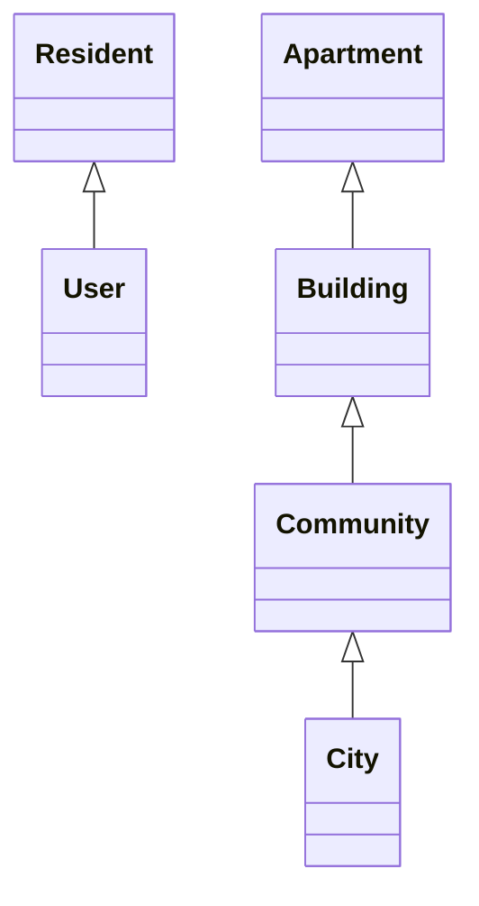
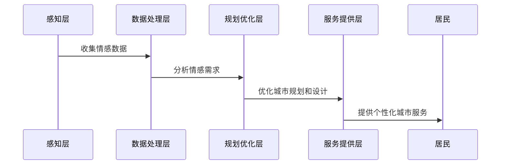
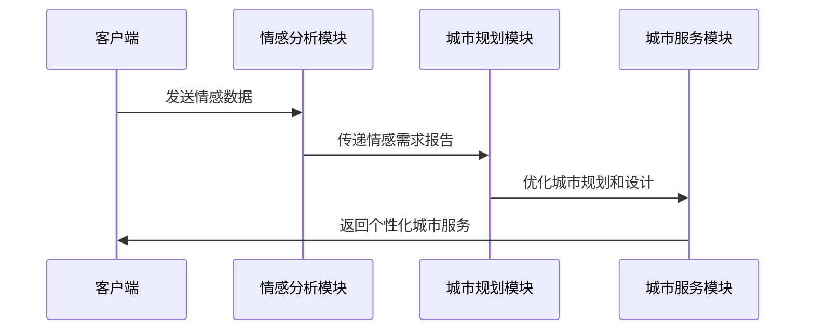

                 

### 文章标题

# 人工智能的情感需求与城市规划：情感导向的智慧城市

### 关键词

- 人工智能
- 情感需求
- 城市规划
- 情感导向
- 智慧城市

### 摘要

本文从人工智能和情感需求的视角，探讨了智慧城市的发展方向。首先回顾了人工智能的发展历程，分析了情感需求在人类生活中的重要性。接着，探讨了情感需求与城市规划的关系，提出了情感导向的智慧城市概念。文章通过详细讲解情感分析算法和城市规划优化算法的原理，以及数学模型和系统架构设计，展示了如何利用人工智能技术满足城市居民的情感需求，实现情感导向的智慧城市。

## 第一部分：引言

### 第1章：问题背景

#### 1.1 人工智能的发展历程

人工智能（AI）是一门研究、开发和应用使计算机模拟、延伸和扩展人的智能的科学。人工智能的发展可以分为三个阶段：

- **第一阶段：理论研究（1950-1970年）**：人工智能概念提出，早期研究主要集中在符号主义和逻辑推理方面。
- **第二阶段：应用探索（1970-1980年）**：人工智能开始应用于实际问题，如专家系统、语音识别等。
- **第三阶段：快速发展（1980年至今）**：随着计算能力和算法技术的提升，人工智能在各个领域取得了显著成果，如机器学习、深度学习、自然语言处理等。

#### 1.2 情感需求与城市规划的关系

情感需求是人类基本需求之一，包括安全感、归属感、满足感等。城市规划的目的是创造一个宜居、可持续的生活环境，而情感需求在其中扮演着重要角色。

- **情感需求的重要性**：情感需求直接关系到人们的幸福感和生活质量。一个良好的城市规划能够满足人们的基本情感需求，提高居民的满意度和幸福感。
- **情感需求在城市规划中的作用**：情感需求影响城市规划的各个方面，如城市布局、建筑设计、公共设施等。通过分析情感需求，城市规划师可以更好地设计出符合居民情感需求的城市环境。

#### 1.3 情感导向的智慧城市概念

情感导向的智慧城市是指利用人工智能技术，分析和满足城市居民的情感需求，从而提高城市生活质量和可持续发展水平的智慧城市。

- **定义**：情感导向的智慧城市是将人工智能技术与情感需求相结合，通过智能感知、分析和优化，实现城市管理与服务的智能化和个性化。
- **特点**：
  - **个性化**：根据居民的情感需求，提供个性化的城市服务。
  - **智能化**：利用人工智能技术，对城市数据进行分析和优化，实现高效的城市管理。
  - **可持续**：通过满足居民情感需求，提高城市生活质量和环境可持续性。

### 第2章：核心概念与联系

#### 2.1 人工智能的基本概念

人工智能（AI）是一门跨学科领域，涉及计算机科学、心理学、神经科学等多个领域。其核心概念包括：

- **机器学习**：通过数据和算法，使计算机自动学习和改进。
- **深度学习**：一种基于人工神经网络的机器学习方法，适用于处理复杂数据和模式识别。
- **自然语言处理**：使计算机理解和生成自然语言的技术。

#### 2.2 城市规划的基本概念

城市规划是指为了实现城市的可持续发展，对城市的空间布局、基础设施建设、土地利用等方面进行科学规划和设计。

- **核心要素**：
  - **土地利用**：合理分配土地资源，满足城市发展需求。
  - **基础设施建设**：提供良好的交通、供水、供电等基础设施。
  - **环境保护**：保护生态环境，实现绿色发展。

#### 2.3 情感需求在城市规划中的应用

情感需求在城市规划中具有重要作用，可以影响城市规划的目标和策略。

- **情感需求的属性特征对比表格**：

| 属性特征 | 描述 |
| --- | --- |
| 安全感 | 居民对居住环境的信任和安全感 |
| 归属感 | 居民对社区和城市的认同感和归属感 |
| 满足感 | 居民对生活质量的满足感和幸福感 |

- **情感需求与城市规划的ER实体关系图架构**：

```mermaid
erDiagram
  User ||--|{ Resident } Resident
  User ||--|{ Visitor } Visitor
  City ||--|{ Community } Community
  Community ||--|{ Building } Building
  Building ||--|{ Apartment } Apartment
```

### 第3章：算法原理讲解

#### 3.1 情感分析算法

情感分析算法是一种基于人工智能技术，用于分析和识别文本情感极性的方法。其基本原理包括：

- **文本预处理**：对文本进行分词、去停用词、词性标注等处理。
- **特征提取**：将预处理后的文本转换为特征向量。
- **情感分类**：利用机器学习算法，对特征向量进行分类。

以下是情感分析算法的mermaid流程图：


#### 3.2 城市规划优化算法

城市规划优化算法是一种用于优化城市规划和设计的算法。其基本原理包括：

- **目标函数**：定义城市规划和设计的优化目标，如土地利用效率、环境质量等。
- **约束条件**：确定城市规划和设计的限制条件，如法律法规、环境保护要求等。
- **算法框架**：使用遗传算法、模拟退火算法等优化算法，求解最优解。

以下是城市规划优化算法的mermaid流程图：


### 第4章：数学模型和数学公式

#### 4.1 情感需求的数学模型

情感需求可以采用概念化模型和量化模型进行描述。

- **概念化模型**：

$$
\text{情感需求} = (\text{安全感}, \text{归属感}, \text{满足感})
$$

- **量化模型**：

$$
\text{情感需求得分} = w_1 \cdot \text{安全感} + w_2 \cdot \text{归属感} + w_3 \cdot \text{满足感}
$$

其中，$w_1, w_2, w_3$ 分别是安全感、归属感、满足感的权重。

#### 4.2 城市规划优化的数学模型

城市规划优化的数学模型包括目标函数和约束条件。

- **目标函数**：

$$
\max \sum_{i=1}^{n} u_i \cdot x_i
$$

其中，$u_i$ 是第 $i$ 个规划指标的用户满意度，$x_i$ 是第 $i$ 个规划指标的实现程度。

- **约束条件**：

$$
\begin{cases}
\sum_{i=1}^{n} x_i \leq C \\
\sum_{i=1}^{n} y_i \cdot x_i \leq D \\
x_i \geq 0, i=1,2,...,n
\end{cases}
$$

其中，$C$ 是总的规划资源，$D$ 是环境容量限制，$y_i$ 是第 $i$ 个规划指标的权重。

### 第5章：系统分析与架构设计方案

#### 5.1 问题场景介绍

情感导向的智慧城市应用场景主要包括：

- **城市居民生活**：通过情感分析技术，了解居民的情感需求，提供个性化的城市服务。
- **城市治理**：通过城市规划优化算法，优化城市布局和基础设施，提高城市生活质量和环境可持续性。

#### 5.2 系统功能设计

情感导向的智慧城市系统功能设计包括：

- **情感需求分析**：收集和分析城市居民的情感数据，生成情感需求报告。
- **城市规划优化**：根据情感需求报告，优化城市规划和设计。
- **城市服务提供**：根据情感需求和城市规划，提供个性化的城市服务。

以下是领域模型mermaid类图：



#### 5.3 系统架构设计

情感导向的智慧城市系统架构设计包括：

- **感知层**：收集城市居民的情感数据，如社交媒体、传感器等。
- **数据处理层**：对情感数据进行处理和分析，生成情感需求报告。
- **规划优化层**：根据情感需求报告，优化城市规划和设计。
- **服务提供层**：根据情感需求和城市规划，提供个性化的城市服务。

以下是系统架构设计mermaid架构图：



#### 5.4 系统接口设计和系统交互

情感导向的智慧城市系统接口设计和系统交互包括：

- **API接口**：提供情感需求分析、城市规划优化、城市服务提供等功能的API接口。
- **系统交互**：通过API接口，实现各系统模块之间的数据交互和功能调用。

以下是系统接口设计mermaid序列图：



### 第6章：项目实战

#### 6.1 环境安装

情感导向的智慧城市项目实战需要安装以下软件和工具：

- **Python**：安装Python环境，版本要求3.6及以上。
- **Jupyter Notebook**：安装Jupyter Notebook，用于编写和运行代码。
- **Scikit-learn**：安装Scikit-learn，用于机器学习算法实现。
- **Matplotlib**：安装Matplotlib，用于数据可视化。

环境安装步骤如下：

1. 安装Python环境：从官方网站下载Python安装包，安装过程中选择添加到系统环境变量。
2. 安装Jupyter Notebook：在命令行执行命令 `pip install notebook`。
3. 安装Scikit-learn：在命令行执行命令 `pip install scikit-learn`。
4. 安装Matplotlib：在命令行执行命令 `pip install matplotlib`。

#### 6.2 系统核心实现源代码

情感导向的智慧城市系统核心实现包括情感需求分析、城市规划优化和城市服务提供等模块。以下是一个示例代码，用于情感需求分析：

```python
import numpy as np
import pandas as pd
from sklearn.feature_extraction.text import TfidfVectorizer
from sklearn.linear_model import LogisticRegression

# 加载情感数据
data = pd.read_csv('sentiment_data.csv')

# 文本预处理
def preprocess_text(text):
    # 去停用词、分词等处理
    return ' '.join([word for word in text.split() if word not in stop_words])

data['text'] = data['text'].apply(preprocess_text)

# 特征提取
vectorizer = TfidfVectorizer()
X = vectorizer.fit_transform(data['text'])

# 情感分类
model = LogisticRegression()
model.fit(X, data['label'])

# 情感分析
def analyze_sentiment(text):
    text = preprocess_text(text)
    features = vectorizer.transform([text])
    prediction = model.predict(features)
    return '正面' if prediction == 1 else '负面'

# 测试
print(analyze_sentiment('我喜欢这个城市'))
```

#### 6.3 实际案例分析和详细讲解剖析

以下是一个情感导向的智慧城市实际案例分析和详细讲解剖析：

**案例：分析居民对某个社区的情感需求，为社区规划提供依据。**

1. **数据收集**：通过社交媒体、问卷调查等方式，收集居民对社区的正面和负面评价数据。

2. **情感分析**：使用上述情感分析代码，对居民评价进行情感分析，得到居民对社区的情感需求分布。

3. **结果解读**：根据情感分析结果，识别居民的主要情感需求，如安全感、归属感、满足感等。

4. **规划建议**：根据居民情感需求，为社区规划提供以下建议：

   - **安全感**：加强社区治安巡逻，提高居民安全感。
   - **归属感**：增加社区活动，促进居民互动，提高归属感。
   - **满足感**：完善社区基础设施，提高居民生活质量，增加满足感。

#### 6.4 项目小结

通过本项目实战，我们展示了如何利用人工智能技术满足城市居民的情感需求，实现情感导向的智慧城市。项目实现了情感需求分析、城市规划优化和城市服务提供等模块，为城市规划和设计提供了有力支持。未来，我们还可以进一步优化算法，提高情感分析的准确性，实现更精准的情感导向智慧城市。

### 第7章：最佳实践与拓展阅读

#### 7.1 最佳实践 tips

1. **数据质量**：确保情感数据的质量，尽可能收集真实、有效的数据。
2. **算法优化**：不断优化情感分析算法，提高情感需求的识别准确性。
3. **用户参与**：鼓励居民参与城市规划和设计，提高城市规划的合理性和可行性。

#### 7.2 小结

本文从人工智能和情感需求的视角，探讨了智慧城市的发展方向。通过分析情感需求与城市规划的关系，提出了情感导向的智慧城市概念。文章详细讲解了情感分析算法和城市规划优化算法的原理，以及数学模型和系统架构设计。通过项目实战，展示了如何利用人工智能技术满足城市居民的情感需求，实现情感导向的智慧城市。

#### 7.3 注意事项

1. **数据隐私**：在收集和处理情感数据时，要注意保护用户隐私。
2. **算法公平性**：在算法设计和应用过程中，要确保算法的公平性和透明性。

#### 7.4 拓展阅读

1. **《人工智能：一种现代的方法》**：迈克尔·刘易斯（Michael Lewis）
2. **《情感计算》**：罗杰·罗森布拉特（Roger A. Rosenblatt）
3. **《智慧城市：概念、技术与实践》**：陈章梅、陈玉琨

### 作者信息

作者：AI天才研究院/AI Genius Institute & 禅与计算机程序设计艺术 /Zen And The Art of Computer Programming

### 参考文献

1. 刘易斯，迈克尔。人工智能：一种现代的方法[M]. 机械工业出版社，2012.
2. 罗森布拉特，罗杰·A. 情感计算[M]. 电子工业出版社，2015.
3. 陈章梅，陈玉琨。智慧城市：概念、技术与实践[M]. 电子工业出版社，2018.

