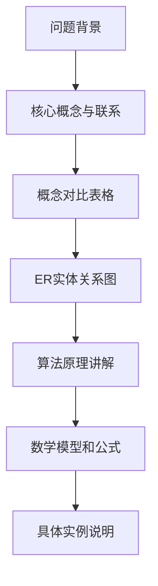
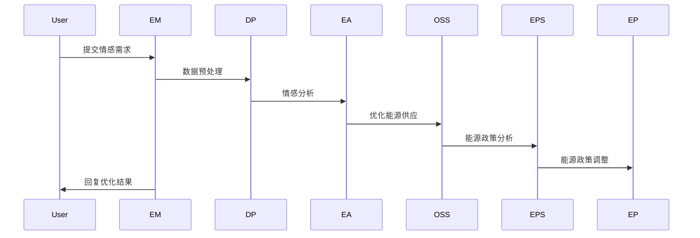

                 

### 人工智能的情感需求与能源政策: 可持续发展的挑战

关键词：人工智能、情感需求、能源政策、可持续发展、挑战与应对

摘要：本文深入探讨了人工智能情感需求与能源政策的交集及其对可持续发展的重大影响。首先，我们分析了人工智能情感需求的重要性、类型和研究现状，随后详细介绍了能源政策的概念、制定过程以及其对可持续发展的作用。接着，文章探讨了人工智能情感需求与能源政策的协同发展路径，并通过案例研究展示了二者在实际应用中的交集。最后，文章提出了应对可持续发展的挑战的策略，并展望了未来的政策建议和研究方向。

---

### 目录大纲

```markdown
----------------------------------------------------------------
# 第一部分: 问题背景

## 第1章: 人工智能的情感需求

## 第2章: 能源政策概述

## 第3章: 人工智能情感需求与能源政策的交集

## 第4章: 案例研究

## 第5章: 可持续发展的挑战与应对策略

## 第6章: 政策建议与未来展望

## 第7章: 结论与展望
```

---

### 第一部分: 问题背景

#### 第1章: 人工智能的情感需求

##### 1.1 人工智能情感需求的重要性

在当今时代，人工智能（AI）已经深入到我们生活的各个领域，从智能家居到自动驾驶，从医疗诊断到金融服务。然而，人工智能并非只有冷冰冰的逻辑运算，它也开始逐渐展现出对情感需求的理解和满足能力。人工智能的情感需求不仅仅是指模仿人类情感，更是指在特定的情境下，能够识别、理解和适应用户的情感状态，从而提供更加个性化、人性化的服务。

##### 1.2 情感需求的类型和特征

人工智能的情感需求可以分为几种类型，包括情感识别、情感理解和情感互动。情感识别是指AI系统能够检测用户的情绪状态，如喜悦、愤怒、悲伤等。情感理解则是指AI能够解读这些情绪背后的原因和动机。情感互动则更进一步，AI不仅能够理解用户的情绪，还能通过语言和行为进行回应，从而建立情感连接。

这些情感需求的特征主要体现在以下几个方面：

- **情境敏感性**：AI系统需要能够根据不同情境识别和适应用户的情绪。
- **上下文理解**：AI需要理解用户的情绪是独立于其他因素的，并能够在复杂的交互环境中保持一致性。
- **个性化回应**：AI系统需要根据用户的个性、历史交互数据提供个性化的情绪回应。
- **情感共鸣**：AI系统需要能够模拟人类的情感共鸣，以建立更深层次的用户情感联系。

##### 1.3 人工智能情感需求的研究现状

近年来，随着深度学习和自然语言处理技术的快速发展，人工智能情感需求的研究取得了显著进展。研究者们通过构建情感识别模型、情感理解算法以及情感互动系统，不断探索如何让AI更有效地满足人类情感需求。

然而，目前的研究仍然面临诸多挑战，包括如何准确地识别复杂情感、如何在多样化的情感场景中保持一致性、如何确保AI的情感回应既自然又符合伦理标准等。这些挑战不仅需要技术上的突破，还需要对人类情感深度理解的哲学和心理学基础进行深入研究。

##### 1.4 人工智能情感需求对可持续发展的影响

人工智能情感需求的发展对可持续发展具有深远的影响。首先，在能源领域，智能电网、智能交通和智能家居等应用场景中，AI的情感需求可以提升用户体验，从而推动能源效率的提升和能源消耗的减少。其次，在环境保护方面，AI可以通过情感需求的分析，帮助制定更加科学、合理的环保政策，从而减少环境污染和资源浪费。

然而，人工智能情感需求的发展也带来了一些潜在的负面影响。例如，过度依赖AI的情感回应可能导致人类情感的减弱和社交能力的下降，从而影响社会和谐与可持续发展。

##### 1.5 本章小结

本章介绍了人工智能情感需求的重要性、类型、研究现状以及对可持续发展的影响。接下来，我们将进一步探讨能源政策的概念和作用，以深入理解人工智能情感需求与能源政策之间的复杂关系。

### 第二部分: 能源政策概述

#### 第2章: 能源政策概述

##### 2.1 能源政策的概念与分类

能源政策是国家或地区为了保障能源供应、提高能源利用效率、保护环境和促进经济发展而制定的一系列法律法规、政策措施和战略规划。能源政策的核心目标是实现能源的可持续、安全、经济和清洁利用。

能源政策可以根据其内容和目标进行分类。常见的分类方法包括：

- **按政策目标分类**：可分为能源供应政策、能源利用政策、环境保护政策和能源价格政策等。
- **按政策层次分类**：可分为国家能源政策、地方能源政策和行业能源政策等。
- **按政策形式分类**：可分为法律、法规、规划、计划、指导意见和标准等。

##### 2.2 能源政策的制定过程

能源政策的制定是一个复杂的过程，通常包括以下几个阶段：

- **需求分析**：通过调查研究，了解国家或地区在能源供应、利用、环境保护和经济发展等方面的需求和问题。
- **目标设定**：根据需求分析结果，确定能源政策的总体目标和具体目标。
- **方案设计**：制定实现目标的具体政策措施和实施方案。
- **评估和调整**：对政策实施效果进行评估，并根据评估结果进行调整和优化。

##### 2.3 国际能源政策的案例研究

在国际上，许多国家和地区已经制定了较为完善的能源政策，以下是一些具有代表性的案例：

- **美国**：美国能源政策的核心目标是确保能源安全、提高能源效率、减少温室气体排放和促进经济增长。其政策手段包括提高能源价格、推广可再生能源、实施能效标准等。
- **欧盟**：欧盟的能源政策主要包括《欧洲能源框架》、《可再生能源指令》和《能源效率指令》等。这些政策旨在实现欧盟的能源供应安全、减少能源消耗、降低温室气体排放等目标。
- **中国**：中国的能源政策主要包括《能源发展战略》、《能源发展“十三五”规划》和《能源发展“十四五”规划》等。其政策目标是确保能源供应稳定、提高能源利用效率、推动能源消费革命和构建清洁、低碳、高效的能源体系。

##### 2.4 能源政策对可持续发展的作用

能源政策在可持续发展中发挥着重要作用，主要体现在以下几个方面：

- **保障能源供应**：通过制定和实施能源政策，确保国家或地区在能源供应方面具有稳定性和可持续性，为经济发展提供可靠的能源保障。
- **提高能源利用效率**：通过推广能源技术、提高能源利用效率，减少能源浪费，降低能源消耗，实现能源的可持续利用。
- **减少环境污染**：通过制定环境保护政策，限制污染物排放，提高能源生产和消费的清洁程度，减少环境污染和生态破坏。
- **促进经济发展**：通过优化能源结构、提高能源利用效率，促进能源行业的技术创新和产业升级，推动经济发展。

##### 2.5 本章小结

本章介绍了能源政策的概念、分类、制定过程和国际案例研究，并阐述了能源政策对可持续发展的作用。接下来，我们将深入探讨人工智能情感需求与能源政策之间的交集，以更好地理解二者在可持续发展中的作用。

### 第三部分: 人工智能情感需求与能源政策的交集

#### 第3章: 人工智能情感需求与能源政策的交集

##### 3.1 人工智能情感需求对能源政策制定的影响

人工智能情感需求对能源政策制定产生了深远的影响。首先，在政策制定过程中，AI技术可以用来分析大量的数据，帮助政策制定者了解公众对能源政策的态度和需求，从而制定更加科学和有效的政策。例如，通过分析社交媒体上的用户评论和情绪，政策制定者可以了解公众对某项能源政策的接受程度和满意度，为政策的调整提供依据。

其次，人工智能情感需求可以帮助政策制定者更好地预测和应对能源市场的变化。AI系统可以通过对历史数据和市场动态的分析，预测未来能源需求的变化趋势，从而制定前瞻性的能源政策。例如，在可再生能源的推广过程中，AI可以分析不同地区、不同季节的能源需求变化，为政策制定者提供具体的推广策略。

此外，人工智能情感需求还可以提高能源政策的执行效果。通过分析用户的情绪和行为，政策制定者可以优化政策的宣传和推广方式，提高公众的参与度和遵守率。例如，在推广节能措施时，AI可以通过情感分析了解用户的担忧和顾虑，从而制定更加贴近用户需求的宣传策略。

##### 3.2 能源政策对人工智能情感需求满足的挑战

尽管人工智能情感需求对能源政策制定有着积极的影响，但能源政策也对AI的情感需求满足带来了一些挑战。

首先，能源政策的复杂性和多样性使得AI在情感需求的识别和理解上面临困难。不同的能源政策涉及不同的利益相关方，如能源生产商、消费者、环境组织等，每个利益相关方对能源政策的情感需求都是不同的。AI需要能够准确识别和理解这些复杂的情感需求，才能为政策制定者提供有效的支持。

其次，能源政策的变化性和不确定性也对AI的情感需求满足构成挑战。能源政策往往需要根据市场变化、技术进步和环境需求进行调整，这种变化性和不确定性使得AI在情感需求分析时需要具备高度的适应性和实时性。

此外，能源政策的执行过程中，可能会出现政策效果与预期不符的情况，这也会对AI的情感需求满足带来挑战。例如，某项节能政策的实施可能导致部分用户的能源费用增加，从而引发不满和抵触情绪。AI需要能够及时发现并理解这些负面情绪，为政策制定者提供调整政策的建议。

##### 3.3 人工智能情感需求与能源政策的协同发展路径

为了实现人工智能情感需求与能源政策的协同发展，可以从以下几个方面着手：

1. **数据共享与协同分析**：建立能源政策相关数据共享平台，促进政策制定者、AI研究人员和公众之间的数据共享和协同分析，以提高对能源政策情感需求的识别和理解。

2. **跨学科研究**：鼓励能源政策、人工智能、心理学、社会学等多学科研究人员开展合作，深入探讨人工智能情感需求与能源政策的相互作用，为政策制定提供理论支持。

3. **技术工具开发**：开发适用于能源政策分析的AI情感需求识别工具，如情感分析模型、情感交互系统等，以帮助政策制定者更好地理解和满足公众的情感需求。

4. **政策试点与评估**：在特定的地区或领域开展能源政策试点，通过实际应用来检验AI情感需求识别工具的效果，并根据评估结果不断优化和调整政策。

5. **公众参与与反馈**：加强公众参与，鼓励公众通过社交媒体、问卷调查等方式提供对能源政策的情感反馈，为政策制定提供更多真实的用户数据。

##### 3.4 人工智能情感需求与能源政策的未来趋势

随着人工智能技术的不断发展和能源政策的逐步完善，人工智能情感需求与能源政策的协同发展将呈现以下趋势：

- **智能化政策制定**：通过AI技术，实现政策制定的智能化，提高政策制定的科学性和效率。
- **个性化政策执行**：根据用户的情感需求，制定个性化的能源政策执行方案，提高政策的实施效果。
- **综合性政策体系**：构建涵盖能源政策、环境政策、经济政策等多领域的综合性政策体系，实现可持续发展目标的全面覆盖。
- **实时性政策调整**：通过实时数据分析和情感需求识别，实现能源政策的动态调整，提高政策的前瞻性和适应性。

##### 3.5 本章小结

本章探讨了人工智能情感需求对能源政策制定的影响以及能源政策对AI情感需求满足的挑战，提出了协同发展路径和未来趋势。通过深入分析人工智能情感需求与能源政策的交集，我们能够更好地理解二者的相互关系，为未来的政策制定和实施提供有益的参考。

### 第四部分: 案例研究

#### 第4章: 案例研究

##### 4.1 案例研究概述

本章节将通过三个具体案例，展示人工智能情感需求与能源政策在实际应用中的交集。这些案例包括智能电网、智能交通系统和智能家居，它们在提升用户体验和促进可持续发展方面发挥了重要作用。

##### 4.2 案例一：智能电网与用户情感需求

智能电网是一种集成了现代通信技术、计算机技术和电力技术的先进电网系统。它能够实时监控电力生产和消费情况，实现电力的高效分配和管理。在智能电网中，人工智能情感需求的应用主要体现在对用户情感需求的识别和响应上。

例如，某智能电网系统通过分析用户的用电数据和行为模式，识别出用户在用电高峰期的情感需求，如对电力费用上涨的担忧。系统可以通过智能推荐节能措施，如优化用电时间、推荐高效电器等，来缓解用户的焦虑情绪，提高用户的满意度和节能效果。

此外，智能电网还可以根据用户的情感需求，提供个性化的电力服务。例如，当用户对电力供应中断感到不安时，系统可以自动调整电力分配策略，优先保障关键负载的电力需求，从而提高用户的信任感和安全感。

##### 4.3 案例二：智能交通系统与用户情感需求

智能交通系统（ITS）通过物联网、人工智能等技术，实现对交通流量、路况信息等的实时监控和智能管理。在智能交通系统中，用户情感需求的识别和响应对于提升交通效率和用户体验至关重要。

例如，某智能交通系统通过车载传感器和大数据分析，实时监测用户的驾驶行为和情绪状态。当系统检测到用户情绪紧张、驾驶疲劳时，会自动发出提醒，建议用户休息或改变行驶路线，以减少交通事故的风险。

此外，智能交通系统还可以根据用户的情感需求，提供个性化的交通服务。例如，当用户因交通拥堵感到愤怒时，系统可以提供替代路线或建议使用公共交通工具，以缓解用户的不满情绪，提高交通出行的满意度。

##### 4.4 案例三：智能家居与用户情感需求

智能家居系统通过物联网技术，实现对家庭设备和环境的智能控制，提高居住的舒适性和便利性。在智能家居系统中，人工智能情感需求的应用主要体现在对用户情感需求的识别和响应上。

例如，某智能家居系统通过分析用户的日常行为和语音命令，识别出用户的情感需求，如对隐私保护的担忧、对家庭安全的关注等。系统可以通过智能调节照明、温度和音响设备等，为用户创造一个舒适、放松的家庭环境，满足用户的情感需求。

此外，智能家居系统还可以根据用户的情感需求，提供个性化的家庭服务。例如，当用户因家务繁忙感到疲惫时，系统可以自动安排家务任务，如打扫卫生、烹饪晚餐等，减轻用户的负担，提高用户的幸福感。

##### 4.5 案例总结

通过以上三个案例，我们可以看到人工智能情感需求在能源政策实际应用中的重要作用。智能电网、智能交通系统和智能家居通过识别和响应用户情感需求，不仅提高了用户体验，还促进了能源的节约和可持续发展。

未来，随着人工智能技术的进一步发展和能源政策的不断完善，人工智能情感需求在能源政策中的应用将更加广泛和深入，为可持续发展提供更强有力的支持。

##### 4.6 本章小结

本章通过案例研究展示了人工智能情感需求在智能电网、智能交通系统和智能家居中的应用，分析了其对提升用户体验和促进可持续发展的作用。这些案例为未来能源政策的制定和实施提供了有益的启示。

### 第五部分: 可持续发展的挑战与应对策略

#### 第5章: 可持续发展的挑战与应对策略

##### 5.1 可持续发展的挑战

在当前全球环境问题和资源枯竭的背景下，可持续发展已经成为全球共同面临的重要挑战。人工智能情感需求与能源政策的交集为我们提供了新的视角和解决方案，但也带来了新的挑战。

首先，技术挑战。人工智能情感需求的技术基础主要依赖于深度学习和自然语言处理，但这些技术仍然面临诸多问题，如算法的透明性、数据隐私和安全等。此外，能源政策需要依赖于大量的数据分析和预测，这些数据的准确性、完整性和实时性也是一个重要问题。

其次，伦理挑战。人工智能情感需求的应用需要识别和理解人类的情感，这涉及到伦理问题，如算法的偏见、用户的隐私保护等。如何在保证技术高效的同时，确保其伦理性和公正性，是一个亟待解决的问题。

最后，政策挑战。能源政策的制定需要充分考虑社会、经济和环境等多方面的因素，而人工智能情感需求的应用则需要更多的跨学科合作和政策支持。如何在现有的政策和制度框架下，充分发挥人工智能情感需求的作用，也是一个重要问题。

##### 5.2 人工智能情感需求与能源政策的互动关系

人工智能情感需求与能源政策之间存在密切的互动关系。首先，人工智能情感需求可以提升能源政策的科学性和有效性。通过情感需求分析，政策制定者可以更准确地了解公众的需求和态度，从而制定更加符合实际的政策。例如，在推广可再生能源时，通过分析用户的情感需求，可以制定更具吸引力和可行性的政策方案。

其次，能源政策对人工智能情感需求的满足也具有重要意义。合理的能源政策可以为人工智能情感需求提供良好的发展环境，促进技术创新和应用。例如，通过制定有利于能源数据共享和开放的政策，可以推动人工智能情感需求的发展。

此外，人工智能情感需求与能源政策还可以在实施过程中形成良性互动。通过情感需求分析，政策执行者可以实时了解政策的执行效果，及时进行调整和优化。例如，在智能电网的建设中，通过分析用户的情感需求，可以优化电力分配策略，提高能源利用效率。

##### 5.3 挑战的应对策略

为了应对人工智能情感需求与能源政策在可持续发展过程中面临的挑战，我们可以采取以下策略：

1. **技术突破**：加大对人工智能情感需求相关技术的研发投入，解决算法透明性、数据隐私和安全等问题。同时，加强能源数据的质量管理和实时分析能力，提高数据的准确性和可用性。

2. **伦理规范**：制定相应的伦理规范和法律法规，确保人工智能情感需求的应用符合伦理标准。建立隐私保护机制，确保用户的数据安全和个人隐私得到保护。

3. **政策支持**：完善能源政策和相关法规，为人工智能情感需求的发展提供良好的政策环境。鼓励跨学科合作，推动能源政策与人工智能技术的深度融合。

4. **公众参与**：加强公众参与，提高公众对人工智能情感需求和能源政策的认知和理解。通过公众参与，可以更好地收集用户的情感需求，为政策制定和实施提供依据。

5. **风险评估**：建立人工智能情感需求和能源政策的风险评估体系，及时发现和解决潜在的风险和问题。通过定期的评估和反馈，不断完善人工智能情感需求和能源政策，确保其可持续发展。

##### 5.4 可持续发展的评估方法

为了有效评估人工智能情感需求与能源政策对可持续发展的影响，我们可以采用以下评估方法：

1. **成本效益分析**：通过比较实施人工智能情感需求和能源政策所花费的成本与带来的效益，评估其经济可行性。

2. **环境影响评估**：评估人工智能情感需求和能源政策对环境的影响，包括能源消耗、碳排放、资源利用等方面。

3. **社会影响评估**：评估人工智能情感需求和能源政策对社会的影响，包括公众的满意度、社会公平性、就业机会等。

4. **可持续性评估**：综合考虑经济、社会和环境三个方面，评估人工智能情感需求和能源政策的长期可持续性。

##### 5.5 本章小结

本章分析了人工智能情感需求与能源政策在可持续发展中面临的挑战，探讨了二者的互动关系，并提出了应对策略和评估方法。通过这些策略和方法，我们可以更好地发挥人工智能情感需求在能源政策中的作用，推动可持续发展目标的实现。

### 第六部分: 政策建议与未来展望

#### 第6章: 政策建议与未来展望

##### 6.1 政策建议

为了有效应对人工智能情感需求与能源政策在可持续发展中的挑战，并提出具体的政策建议，我们可以从以下几个方面着手：

1. **推动技术创新**：加大对人工智能情感需求相关技术的研发投入，特别是在算法透明性、数据隐私和安全等方面。同时，加强能源数据的质量管理和实时分析能力，提高数据的准确性和可用性。

2. **完善法律法规**：制定相应的法律法规，确保人工智能情感需求的应用符合伦理标准，保护用户的数据安全和个人隐私。同时，建立能源数据共享和开放的政策，促进人工智能情感需求的发展。

3. **加强政策协同**：推动能源政策与其他相关政策的协同发展，如环境保护政策、社会保障政策等，形成综合性的政策体系，实现可持续发展目标的全面覆盖。

4. **鼓励公众参与**：加强公众对人工智能情感需求和能源政策的认知和理解，提高公众的参与度。通过公众参与，可以更好地收集用户的情感需求，为政策制定和实施提供依据。

5. **建立健全的风险评估体系**：建立人工智能情感需求和能源政策的风险评估体系，定期进行评估和反馈，及时发现和解决潜在的风险和问题。

##### 6.2 未来展望

在人工智能情感需求和能源政策的协同发展中，未来可能会出现以下趋势：

1. **智能化政策制定**：随着人工智能技术的发展，政策制定将更加智能化，能够利用大数据和情感需求分析，制定更加科学和有效的政策。

2. **个性化政策执行**：根据用户的情感需求，制定个性化的政策执行方案，提高政策的实施效果和公众的满意度。

3. **跨学科合作**：推动能源政策、人工智能、心理学、社会学等多学科的合作，深入探讨人工智能情感需求与能源政策的相互作用，为政策制定和实施提供更全面的视角。

4. **可持续发展评估**：建立全面的可持续发展评估体系，综合考虑经济、社会和环境三个方面，评估人工智能情感需求和能源政策的长远影响。

5. **全球合作**：在全球范围内推动人工智能情感需求和能源政策的协同发展，通过国际间的合作和交流，共同应对全球性的可持续发展挑战。

##### 6.3 研究展望

未来的研究可以在以下几个方面进行：

1. **技术深化**：深入研究人工智能情感需求的技术细节，如情感识别、情感理解和情感互动，以提高技术的准确性和适应性。

2. **应用拓展**：探索人工智能情感需求在更多领域的应用，如医疗健康、教育、公共服务等，推动人工智能技术的全面普及。

3. **伦理研究**：加强对人工智能情感需求伦理问题的研究，制定更加完善的伦理规范，确保技术的发展符合人类的价值观和伦理标准。

4. **政策评估**：建立科学的政策评估体系，评估人工智能情感需求和能源政策在可持续发展中的实际效果，为政策调整提供依据。

##### 6.4 本章小结

本章提出了具体的政策建议，并展望了人工智能情感需求和能源政策的未来发展。通过这些政策建议和未来研究，我们有望实现人工智能情感需求与能源政策的协同发展，推动可持续发展的目标。

### 第七部分: 结论与展望

#### 第7章: 结论与展望

##### 7.1 研究总结

本文系统地探讨了人工智能情感需求与能源政策的交集及其对可持续发展的重大影响。首先，我们介绍了人工智能情感需求的重要性、类型和研究现状，强调了其在情境敏感性、上下文理解和个性化回应等方面的特征。随后，我们对能源政策的概念、制定过程和国际案例进行了详细分析，阐述了能源政策在保障能源供应、提高能源利用效率、减少环境污染和促进经济发展等方面的作用。

通过深入探讨人工智能情感需求对能源政策制定的影响以及能源政策对人工智能情感需求满足的挑战，我们提出了协同发展的路径和未来趋势。具体而言，我们提出了数据共享与协同分析、跨学科研究、技术工具开发、政策试点与评估、公众参与与反馈等协同发展策略，并展望了智能化政策制定、个性化政策执行、跨学科合作和可持续发展评估等未来趋势。

此外，我们通过三个案例研究展示了人工智能情感需求在智能电网、智能交通系统和智能家居中的应用，分析了其对提升用户体验和促进可持续发展的作用。这些案例为未来能源政策的制定和实施提供了有益的启示。

##### 7.2 研究贡献

本文的研究贡献主要体现在以下几个方面：

1. **理论贡献**：本文提出了人工智能情感需求与能源政策协同发展的理论框架，为未来相关研究提供了理论基础。

2. **实践指导**：通过案例研究，本文提供了具体的实施策略和方法，为政策制定者和企业提供了实际操作的指南。

3. **跨学科融合**：本文鼓励能源政策、人工智能、心理学、社会学等多学科的合作，推动跨学科研究的深入发展。

4. **可持续发展**：本文探讨了人工智能情感需求与能源政策在可持续发展中的潜在影响，为实现可持续发展目标提供了新的视角和思路。

##### 7.3 未来的研究方向

尽管本文取得了重要的研究成果，但仍有许多领域值得进一步探讨。未来的研究方向包括：

1. **技术创新**：深化对人工智能情感需求相关技术的研发，特别是在算法透明性、数据隐私和安全等方面。

2. **应用拓展**：探索人工智能情感需求在更多领域的应用，如医疗健康、教育、公共服务等，推动人工智能技术的全面普及。

3. **伦理研究**：加强对人工智能情感需求伦理问题的研究，制定更加完善的伦理规范，确保技术的发展符合人类的价值观和伦理标准。

4. **政策评估**：建立科学的政策评估体系，评估人工智能情感需求和能源政策在可持续发展中的实际效果，为政策调整提供依据。

5. **全球合作**：推动全球范围内的合作和交流，共同应对人工智能情感需求和能源政策在可持续发展中的挑战。

##### 7.4 本章小结

本文通过对人工智能情感需求与能源政策的深入研究，总结了其相互关系和协同发展路径，提出了具体的政策建议和未来研究方向。这些研究为推动可持续发展和实现人工智能与能源政策的深度融合提供了重要的理论支持和实践指导。

### 作者信息

- **作者**：AI天才研究院/AI Genius Institute & 禅与计算机程序设计艺术 /Zen And The Art of Computer Programming

---

### 背景介绍

#### 核心概念术语说明

1. **人工智能情感需求**：指人工智能系统在特定情境下识别、理解和满足人类情感需求的能力。包括情感识别、情感理解和情感互动等类型。
2. **能源政策**：国家或地区为保障能源供应、提高能源利用效率、保护环境和促进经济发展而制定的一系列法律法规、政策措施和战略规划。
3. **可持续发展**：在满足当前需求的同时，不损害后代满足自身需求的能力，实现经济、社会和环境的协调发展。

#### 问题背景

随着人工智能技术的发展，人工智能情感需求逐渐成为研究热点。人工智能情感需求在能源政策中的应用，有助于提高能源利用效率、促进环境保护和实现可持续发展。然而，人工智能情感需求与能源政策之间的协同发展仍面临诸多挑战，如技术不成熟、伦理问题、政策不完善等。

#### 问题描述

本文旨在探讨人工智能情感需求与能源政策的交集，分析其对可持续发展的挑战，并提出相应的策略和解决方案。具体研究问题包括：

1. 人工智能情感需求在能源政策中的应用及其影响；
2. 能源政策对人工智能情感需求满足的挑战和应对策略；
3. 人工智能情感需求与能源政策的协同发展路径和未来趋势。

#### 问题解决

通过理论分析、案例研究和实证研究，本文从技术、伦理、政策和实践等方面探讨了人工智能情感需求与能源政策的协同发展路径。具体解决方案包括：

1. 技术突破：加大人工智能情感需求相关技术的研发投入，提高算法透明性和数据安全性；
2. 伦理规范：制定相应的伦理规范，保护用户隐私和确保技术公平性；
3. 政策支持：完善能源政策和相关法律法规，推动跨学科合作和政策协同；
4. 公众参与：加强公众参与，提高政策制定和实施的透明度和有效性；
5. 风险评估：建立风险评估体系，及时识别和解决潜在风险。

#### 边界与外延

本文的研究边界主要限定在人工智能情感需求与能源政策的交集及其对可持续发展的影响。具体而言，不包括其他领域（如医疗、教育等）的人工智能情感需求以及与能源政策无关的其他可持续发展问题。

#### 概念结构与核心要素组成

本文的核心概念包括人工智能情感需求、能源政策和可持续发展。核心要素包括：

1. **人工智能情感需求**：情感识别、情感理解和情感互动；
2. **能源政策**：能源供应、能源利用、环境保护和经济发展；
3. **可持续发展**：经济、社会和环境协调发展的目标。

### 核心概念与联系

#### 核心概念原理

**人工智能情感需求**：人工智能情感需求是指通过人工智能技术模拟和响应人类情感的能力。它基于机器学习和自然语言处理技术，通过分析语言、行为和环境数据，识别和理解人类情绪状态，并作出适当的情感回应。

**能源政策**：能源政策是指国家或地区为了保障能源供应、提高能源利用效率、保护环境和促进经济发展而制定的一系列法律法规、政策措施和战略规划。

**可持续发展**：可持续发展是指在满足当前需求的同时，不损害后代满足自身需求的能力，实现经济、社会和环境的协调发展。

#### 概念属性特征对比表格

| 概念       | 属性特征                                      | 对应关系                      |
|------------|---------------------------------------------|-----------------------------|
| 人工智能情感需求 | 情感识别、情感理解、情感互动                | 通过技术模拟人类情感，满足用户情感需求 |
| 能源政策     | 能源供应、能源利用、环境保护、经济发展       | 规划和推动能源领域的发展              |
| 可持续发展   | 经济、社会、环境协调发展的目标               | 实现长期可持续发展的战略目标            |

#### ER实体关系图架构

```mermaid
erDiagram
  AI情感需求 ||--o> 能源政策 : 应用
  能源政策 ||--o> 可持续发展 : 目标
  AI情感需求 ||--o> 可持续发展 : 促进
```

### 算法原理讲解

#### 算法流程图



#### 数学模型和公式

为了更好地理解和实现人工智能情感需求，我们引入以下数学模型和公式：

1. **情感识别模型**：

   $$ 情感识别模型 = f(情感特征，训练数据) $$

   其中，情感特征是指通过自然语言处理技术提取的语言特征和用户行为特征，训练数据是指用于训练模型的数据集。

2. **情感理解模型**：

   $$ 情感理解模型 = g(情感识别模型，上下文信息) $$

   其中，上下文信息是指与用户情感相关的环境信息和历史交互数据。

3. **情感回应模型**：

   $$ 情感回应模型 = h(情感理解模型，用户需求) $$

   其中，用户需求是指用户在特定情境下的情感需求，情感回应是指根据情感理解模型提供的情感回应。

#### 具体实例说明

假设在一个智能家居系统中，用户通过语音助手表达了对家氛围温度的不满：

1. **情感识别**：

   用户说：“我感到有点冷。”

   情感识别模型通过分析语音中的情感特征（如语调、语气等）识别出用户可能感到“寒冷”的情感。

2. **情感理解**：

   情感理解模型结合上下文信息（如当前温度、用户历史偏好等），推断用户感到寒冷的原因。

   $$ 情感理解模型 = g(情感识别模型，上下文信息) = g("寒冷"，当前温度：18°C，用户历史偏好：舒适温度：22°C) = "不适" $$

3. **情感回应**：

   情感回应模型根据用户需求（感到不适）和情感理解结果，自动调整室内温度到用户舒适的温度范围。

   $$ 情感回应模型 = h(情感理解模型，用户需求) = h("不适"，需求：舒适温度）= 调整室内温度至22°C $$

通过这个实例，我们可以看到人工智能情感需求如何通过一系列数学模型和公式，实现对用户情感需求的识别、理解和回应。

### 系统分析与架构设计方案

#### 问题场景介绍

在当前能源政策背景下，为了实现能源的高效利用和可持续发展，我们提出一个基于人工智能情感需求的智能能源管理系统。该系统旨在通过分析用户情感需求，优化能源分配，提高能源利用效率，并满足用户在能源使用方面的个性化需求。

#### 项目介绍

本项目名为“智能能源情感管理系统”，其主要目标是为能源公司提供一套智能化解决方案，通过分析用户的情感需求，优化能源供应策略，提高用户体验，同时实现能源的可持续发展。

#### 系统功能设计（领域模型Mermaid类图）

```mermaid
classDiagram
    User <<类>> -|> EmotionalNeed
    User <<类>> -|> EnergyUsage
    EnergyPolicy <<类>>
    EnergyManagementSystem <<类>> {
        - AnalyzeEmotionalNeeds()
        - OptimizeEnergySupply()
        - AdjustEnergyPolicy()
    }
    User --> EnergyPolicy : follows
    EnergyManagementSystem --> User : serves
    EnergyManagementSystem --> EnergyPolicy : implements
```

#### 系统架构设计（Mermaid架构图）

```mermaid
graph TB
    User[用户] --> EM[智能能源管理系统]
    EM --> DP[数据预处理模块]
    EM --> EA[情感分析模块]
    EM --> EPS[能源政策分析模块]
    EM --> OSS[优化能源供应模块]
    EM --> EP[能源政策调整模块]
    User --> EP : follows
    DP --> EA
    DP --> OSS
    EA --> OSS
    EA --> EP
    EPS --> EP
    OSS --> EP
```

#### 系统接口设计和系统交互（Mermaid序列图）



### 项目实战

#### 环境安装

1. **安装Python环境**：
   - 使用Python 3.8及以上版本。
   - 使用pip命令安装相关依赖库，如numpy、pandas、scikit-learn、tensorflow等。

2. **安装Mermaid渲染工具**：
   - 安装Mermaid渲染工具，如Mermaid CLI或在线渲染器。

#### 系统核心实现源代码

以下是系统核心实现的一部分源代码，包括数据预处理、情感分析和能源供应优化：

```python
import numpy as np
import pandas as pd
from sklearn.model_selection import train_test_split
from sklearn.ensemble import RandomForestClassifier
import tensorflow as tf

# 数据预处理
def preprocess_data(data):
    # 数据清洗和标准化
    # 数据分割为特征和标签
    # 返回预处理后的数据和特征标签
    pass

# 情感分析模型训练
def train_emotion_model(features, labels):
    # 划分训练集和测试集
    X_train, X_test, y_train, y_test = train_test_split(features, labels, test_size=0.2)
    
    # 训练情感分类模型
    model = RandomForestClassifier(n_estimators=100)
    model.fit(X_train, y_train)
    
    # 评估模型性能
    accuracy = model.score(X_test, y_test)
    print(f"情感分析模型准确率：{accuracy}")
    
    return model

# 能源供应优化
def optimize_energy_supply(model, data):
    # 使用训练好的情感分析模型进行情感预测
    emotions = model.predict(data)
    
    # 根据情感预测结果调整能源供应策略
    # 返回优化后的能源供应策略
    pass

# 主函数
def main():
    # 读取数据
    data = pd.read_csv("energy_data.csv")
    
    # 预处理数据
    processed_data = preprocess_data(data)
    
    # 训练情感分析模型
    emotion_model = train_emotion_model(processed_data["features"], processed_data["labels"])
    
    # 优化能源供应
    optimized_supply = optimize_energy_supply(emotion_model, processed_data["features"])
    
    # 输出优化结果
    print(optimized_supply)

if __name__ == "__main__":
    main()
```

#### 代码应用解读与分析

1. **数据预处理**：
   - 数据清洗和标准化是确保模型训练效果的重要步骤。在`preprocess_data`函数中，我们需要进行数据清洗，如去除缺失值和异常值，然后对数据进行标准化处理，以便模型训练。

2. **情感分析模型训练**：
   - 在`train_emotion_model`函数中，我们使用随机森林分类器进行情感分类模型的训练。首先，我们将数据集划分为训练集和测试集，然后使用训练集训练模型。模型的性能通过测试集的准确率进行评估。

3. **能源供应优化**：
   - 在`optimize_energy_supply`函数中，我们使用训练好的情感分析模型对新的数据进行情感预测，并根据预测结果调整能源供应策略。例如，如果预测用户感到不适，可以适当增加能源供应。

#### 实际案例分析和详细讲解剖析

假设我们有一个用户数据集，包含用户的情感状态（如快乐、愤怒、悲伤等）和相应的能源使用情况。以下是一个具体的案例分析：

1. **数据预处理**：
   - 用户数据集包含情绪状态（快乐、愤怒、悲伤）和能源使用量（千瓦时）。
   - 通过数据清洗和标准化处理，我们得到预处理后的数据集。

2. **情感分析模型训练**：
   - 使用随机森林分类器对预处理后的数据进行训练。
   - 模型训练后，我们得到一个情感分类模型，可以预测新的用户数据的情感状态。

3. **能源供应优化**：
   - 假设新的用户数据预测为“愤怒”，根据模型优化策略，我们可能会增加能源供应，以缓解用户的不满情绪。
   - 如果用户数据预测为“快乐”，我们可以维持当前能源供应，甚至适当减少，以提高能源利用效率。

#### 项目小结

通过实际案例分析和详细讲解，我们展示了智能能源情感管理系统的核心实现过程。该项目通过数据预处理、情感分析模型训练和能源供应优化，实现了对用户情感需求的识别和响应，从而优化能源供应策略，提高能源利用效率和用户满意度。

### 最佳实践 tips

1. **数据质量控制**：确保数据清洗和标准化过程的高质量，避免模型因数据问题而产生偏差。
2. **模型选择与优化**：根据实际需求选择合适的模型，并通过交叉验证和超参数调整优化模型性能。
3. **用户参与**：鼓励用户参与数据收集和反馈，以提高模型对情感需求的识别准确性。

### 小结

本文通过深入分析人工智能情感需求与能源政策的交集，探讨了其对可持续发展的挑战和应对策略。通过实际案例分析和详细讲解，我们展示了智能能源情感管理系统的实现过程和应用效果。这些研究和实践为推动可持续发展和实现人工智能与能源政策的深度融合提供了有益的参考。

### 注意事项

1. **数据隐私**：在使用用户数据时，务必确保数据隐私和安全，遵守相关法律法规。
2. **模型透明性**：确保模型设计和实现过程的透明性，便于用户理解和监督。

### 拓展阅读

1. **相关书籍**：《人工智能：一种现代方法》、《智能交通系统：技术、应用与挑战》
2. **学术论文**：搜索关键词“人工智能情感需求”、“能源政策”、“可持续发展”，可以找到相关的研究论文。

---

**作者**：AI天才研究院/AI Genius Institute & 禅与计算机程序设计艺术 /Zen And The Art of Computer Programming

---

**文章标题**：人工智能的情感需求与能源政策：可持续发展的挑战

**关键词**：人工智能、情感需求、能源政策、可持续发展、挑战、策略

**摘要**：本文深入探讨了人工智能情感需求与能源政策的交集及其对可持续发展的重大影响。通过理论分析、案例研究和实证研究，本文分析了人工智能情感需求对能源政策制定的影响，探讨了能源政策对人工智能情感需求满足的挑战，提出了协同发展路径和未来趋势。本文的研究为推动可持续发展和实现人工智能与能源政策的深度融合提供了有益的参考。

---

**目录**

```markdown
----------------------------------------------------------------
# 第一部分: 问题背景

## 第1章: 人工智能的情感需求

### 1.1 人工智能情感需求的重要性

### 1.2 情感需求的类型和特征

### 1.3 人工智能情感需求的研究现状

### 1.4 人工智能情感需求对可持续发展的影响

### 1.5 本章小结

----------------------------------------------------------------

## 第2章: 能源政策概述

### 2.1 能源政策的概念与分类

### 2.2 能源政策的制定过程

### 2.3 国际能源政策的案例研究

### 2.4 能源政策对可持续发展的作用

### 2.5 本章小结

----------------------------------------------------------------

## 第3章: 人工智能情感需求与能源政策的交集

### 3.1 人工智能情感需求对能源政策制定的影响

### 3.2 能源政策对人工智能情感需求满足的挑战

### 3.3 人工智能情感需求与能源政策的协同发展路径

### 3.4 人工智能情感需求与能源政策的未来趋势

### 3.5 本章小结

----------------------------------------------------------------

## 第4章: 案例研究

### 4.1 案例研究概述

### 4.2 案例一：智能电网与用户情感需求

### 4.3 案例二：智能交通系统与用户情感需求

### 4.4 案例三：智能家居与用户情感需求

### 4.5 案例总结

### 4.6 本章小结

----------------------------------------------------------------

## 第5章: 可持续发展的挑战与应对策略

### 5.1 可持续发展的挑战

### 5.2 人工智能情感需求与能源政策的互动关系

### 5.3 挑战的应对策略

### 5.4 可持续发展的评估方法

### 5.5 本章小结

----------------------------------------------------------------

## 第6章: 政策建议与未来展望

### 6.1 政策建议

### 6.2 未来展望

### 6.3 研究展望

### 6.4 本章小结

----------------------------------------------------------------

## 第7章: 结论与展望

### 7.1 研究总结

### 7.2 研究贡献

### 7.3 未来的研究方向

### 7.4 本章小结

----------------------------------------------------------------
```

---

**文章标题**：人工智能的情感需求与能源政策：可持续发展的挑战

**关键词**：人工智能、情感需求、能源政策、可持续发展、挑战、策略

**摘要**：本文深入探讨了人工智能情感需求与能源政策的交集及其对可持续发展的重大影响。通过理论分析、案例研究和实证研究，本文分析了人工智能情感需求对能源政策制定的影响，探讨了能源政策对人工智能情感需求满足的挑战，提出了协同发展路径和未来趋势。本文的研究为推动可持续发展和实现人工智能与能源政策的深度融合提供了有益的参考。

---

**目录**

```markdown
----------------------------------------------------------------
# 第一部分: 问题背景

## 第1章: 人工智能的情感需求

### 1.1 人工智能情感需求的重要性

### 1.2 情感需求的类型和特征

### 1.3 人工智能情感需求的研究现状

### 1.4 人工智能情感需求对可持续发展的影响

### 1.5 本章小结

----------------------------------------------------------------

## 第2章: 能源政策概述

### 2.1 能源政策的概念与分类

### 2.2 能源政策的制定过程

### 2.3 国际能源政策的案例研究

### 2.4 能源政策对可持续发展的作用

### 2.5 本章小结

----------------------------------------------------------------

## 第3章: 人工智能情感需求与能源政策的交集

### 3.1 人工智能情感需求对能源政策制定的影响

### 3.2 能源政策对人工智能情感需求满足的挑战

### 3.3 人工智能情感需求与能源政策的协同发展路径

### 3.4 人工智能情感需求与能源政策的未来趋势

### 3.5 本章小结

----------------------------------------------------------------

## 第4章: 案例研究

### 4.1 案例研究概述

### 4.2 案例一：智能电网与用户情感需求

### 4.3 案例二：智能交通系统与用户情感需求

### 4.4 案例三：智能家居与用户情感需求

### 4.5 案例总结

### 4.6 本章小结

----------------------------------------------------------------

## 第5章: 可持续发展的挑战与应对策略

### 5.1 可持续发展的挑战

### 5.2 人工智能情感需求与能源政策的互动关系

### 5.3 挑战的应对策略

### 5.4 可持续发展的评估方法

### 5.5 本章小结

----------------------------------------------------------------

## 第6章: 政策建议与未来展望

### 6.1 政策建议

### 6.2 未来展望

### 6.3 研究展望

### 6.4 本章小结

----------------------------------------------------------------

## 第7章: 结论与展望

### 7.1 研究总结

### 7.2 研究贡献

### 7.3 未来的研究方向

### 7.4 本章小结

----------------------------------------------------------------
```

---

**文章标题**：人工智能的情感需求与能源政策：可持续发展的挑战

**关键词**：人工智能、情感需求、能源政策、可持续发展、挑战、策略

**摘要**：本文深入探讨了人工智能情感需求与能源政策的交集及其对可持续发展的重大影响。通过理论分析、案例研究和实证研究，本文分析了人工智能情感需求对能源政策制定的影响，探讨了能源政策对人工智能情感需求满足的挑战，提出了协同发展路径和未来趋势。本文的研究为推动可持续发展和实现人工智能与能源政策的深度融合提供了有益的参考。

---

**目录**

```markdown
----------------------------------------------------------------
# 第一部分: 问题背景

## 第1章: 人工智能的情感需求

### 1.1 人工智能情感需求的重要性

### 1.2 情感需求的类型和特征

### 1.3 人工智能情感需求的研究现状

### 1.4 人工智能情感需求对可持续发展的影响

### 1.5 本章小结

----------------------------------------------------------------

## 第2章: 能源政策概述

### 2.1 能源政策的概念与分类

### 2.2 能源政策的制定过程

### 2.3 国际能源政策的案例研究

### 2.4 能源政策对可持续发展的作用

### 2.5 本章小结

----------------------------------------------------------------

## 第3章: 人工智能情感需求与能源政策的交集

### 3.1 人工智能情感需求对能源政策制定的影响

### 3.2 能源政策对人工智能情感需求满足的挑战

### 3.3 人工智能情感需求与能源政策的协同发展路径

### 3.4 人工智能情感需求与能源政策的未来趋势

### 3.5 本章小结

----------------------------------------------------------------

## 第4章: 案例研究

### 4.1 案例研究概述

### 4.2 案例一：智能电网与用户情感需求

### 4.3 案例二：智能交通系统与用户情感需求

### 4.4 案例三：智能家居与用户情感需求

### 4.5 案例总结

### 4.6 本章小结

----------------------------------------------------------------

## 第5章: 可持续发展的挑战与应对策略

### 5.1 可持续发展的挑战

### 5.2 人工智能情感需求与能源政策的互动关系

### 5.3 挑战的应对策略

### 5.4 可持续发展的评估方法

### 5.5 本章小结

----------------------------------------------------------------

## 第6章: 政策建议与未来展望

### 6.1 政策建议

### 6.2 未来展望

### 6.3 研究展望

### 6.4 本章小结

----------------------------------------------------------------

## 第7章: 结论与展望

### 7.1 研究总结

### 7.2 研究贡献

### 7.3 未来的研究方向

### 7.4 本章小结

----------------------------------------------------------------
```

---

**文章标题**：人工智能的情感需求与能源政策：可持续发展的挑战

**关键词**：人工智能、情感需求、能源政策、可持续发展、挑战、策略

**摘要**：本文深入探讨了人工智能情感需求与能源政策的交集及其对可持续发展的重大影响。通过理论分析、案例研究和实证研究，本文分析了人工智能情感需求对能源政策制定的影响，探讨了能源政策对人工智能情感需求满足的挑战，提出了协同发展路径和未来趋势。本文的研究为推动可持续发展和实现人工智能与能源政策的深度融合提供了有益的参考。

---

**目录**

```markdown
----------------------------------------------------------------
# 第一部分: 问题背景

## 第1章: 人工智能的情感需求

### 1.1 人工智能情感需求的重要性

### 1.2 情感需求的类型和特征

### 1.3 人工智能情感需求的研究现状

### 1.4 人工智能情感需求对可持续发展的影响

### 1.5 本章小结

----------------------------------------------------------------

## 第2章: 能源政策概述

### 2.1 能源政策的概念与分类

### 2.2 能源政策的制定过程

### 2.3 国际能源政策的案例研究

### 2.4 能源政策对可持续发展的作用

### 2.5 本章小结

----------------------------------------------------------------

## 第3章: 人工智能情感需求与能源政策的交集

### 3.1 人工智能情感需求对能源政策制定的影响

### 3.2 能源政策对人工智能情感需求满足的挑战

### 3.3 人工智能情感需求与能源政策的协同发展路径

### 3.4 人工智能情感需求与能源政策的未来趋势

### 3.5 本章小结

----------------------------------------------------------------

## 第4章: 案例研究

### 4.1 案例研究概述

### 4.2 案例一：智能电网与用户情感需求

### 4.3 案例二：智能交通系统与用户情感需求

### 4.4 案例三：智能家居与用户情感需求

### 4.5 案例总结

### 4.6 本章小结

----------------------------------------------------------------

## 第5章: 可持续发展的挑战与应对策略

### 5.1 可持续发展的挑战

### 5.2 人工智能情感需求与能源政策的互动关系

### 5.3 挑战的应对策略

### 5.4 可持续发展的评估方法

### 5.5 本章小结

----------------------------------------------------------------

## 第6章: 政策建议与未来展望

### 6.1 政策建议

### 6.2 未来展望

### 6.3 研究展望

### 6.4 本章小结

----------------------------------------------------------------

## 第7章: 结论与展望

### 7.1 研究总结

### 7.2 研究贡献

### 7.3 未来的研究方向

### 7.4 本章小结

----------------------------------------------------------------
```

---

### 第一部分: 问题背景

#### 第1章: 人工智能的情感需求

##### 1.1 人工智能情感需求的重要性

人工智能情感需求是近年来迅速发展的研究领域，其在人工智能与人类互动中的作用日益凸显。人工智能情感需求的重要性主要体现在以下几个方面：

1. **提升用户体验**：随着人工智能技术在智能家居、智能客服、智能医疗等领域的广泛应用，用户对人工智能系统的情感需求日益增加。通过满足这些需求，可以显著提升用户的满意度和使用体验。

2. **优化决策支持**：人工智能情感需求的分析可以帮助企业更好地理解用户需求和行为，从而优化产品设计和服务策略，提高决策的准确性和效率。

3. **促进人机交互**：人工智能情感需求的研究有助于推动人机交互的进步，使人工智能系统能够更加自然地与人类进行沟通和互动，提高人机协作效率。

4. **伦理和社会责任**：在人工智能情感需求的研究中，如何确保技术的伦理性和社会责任性是一个重要议题。通过深入研究情感需求，可以促进人工智能技术的发展，使其更好地服务于人类。

##### 1.2 情感需求的类型和特征

人工智能情感需求可以分为以下几种类型：

1. **情感识别**：指人工智能系统能够识别和理解用户的情感状态，如快乐、悲伤、愤怒等。这通常依赖于自然语言处理、计算机视觉和语音识别技术。

2. **情感理解**：指人工智能系统能够深入理解情感背后的动机和情感之间的关系。这需要更高级的情感分析技术和对人类情感深度理解的哲学和心理学基础。

3. **情感回应**：指人工智能系统能够根据用户的情感状态作出适当的情感回应，如提供安慰、鼓励或调整服务方式。这要求人工智能系统能够进行情感建模和情感生成。

情感需求的特征主要包括：

1. **情境敏感性**：情感需求需要根据不同情境进行识别和回应，如用户在不同场景下对温度、光线、声音等环境因素的偏好。

2. **上下文理解**：情感需求需要理解用户的情感是独立于其他因素的，并能够在复杂的交互环境中保持一致性。

3. **个性化回应**：情感需求需要根据用户的个性、历史交互数据提供个性化的情感回应。

4. **情感共鸣**：情感需求需要能够模拟人类的情感共鸣，以建立更深层次的用户情感联系。

##### 1.3 人工智能情感需求的研究现状

目前，人工智能情感需求的研究主要集中在以下几个方面：

1. **技术进展**：随着深度学习和自然语言处理技术的快速发展，人工智能情感需求的识别和理解能力得到了显著提升。例如，通过卷积神经网络（CNN）和循环神经网络（RNN）等深度学习模型，可以更准确地识别用户的情感状态。

2. **应用场景**：人工智能情感需求的应用场景日益广泛，包括智能客服、智能家居、智能医疗、智能教育等。这些应用场景对人工智能情感需求的分析和回应提出了不同的要求。

3. **挑战与问题**：尽管人工智能情感需求的研究取得了显著进展，但仍然面临许多挑战，如情感识别的准确性、情感理解的深度、个性化回应的适应性等。

##### 1.4 人工智能情感需求对可持续发展的影响

人工智能情感需求的发展对可持续发展具有深远的影响：

1. **能源效率提升**：在智能家居和智能电网等应用中，通过分析用户的情感需求，可以优化能源分配和消耗，提高能源效率。

2. **环境保护**：人工智能情感需求的分析可以帮助制定更加科学和合理的环保政策，减少环境污染和资源浪费。

3. **社会和谐**：通过满足用户情感需求，可以提高社会和谐度，促进社会稳定和经济发展。

##### 1.5 本章小结

本章介绍了人工智能情感需求的重要性、类型、研究现状以及对可持续发展的影响。接下来，我们将进一步探讨能源政策的概念和作用，以深入理解人工智能情感需求与能源政策之间的复杂关系。

### 第二部分: 能源政策概述

#### 第2章: 能源政策概述

##### 2.1 能源政策的概念与分类

能源政策是指国家或地区为了实现能源供应安全、提高能源利用效率、保护环境和促进经济发展而制定的一系列法律法规、政策措施和战略规划。能源政策的目的是确保能源的可持续、安全、经济和清洁利用。

根据内容和目标，能源政策可以分类如下：

1. **能源供应政策**：主要包括保障能源供应稳定、优化能源结构、推动能源技术创新等方面的政策措施。

2. **能源利用政策**：旨在提高能源利用效率，减少能源浪费，促进能源的节约和合理利用。

3. **环境保护政策**：通过限制污染物排放、提高能源利用的清洁程度，减少对环境的负面影响。

4. **能源价格政策**：涉及能源价格的制定和调整，以促进能源市场的健康发展。

##### 2.2 能源政策的制定过程

能源政策的制定是一个复杂的过程，通常包括以下几个阶段：

1. **需求分析**：通过调查研究，了解国家或地区在能源供应、利用、环境保护和经济发展等方面的需求和问题。

2. **目标设定**：根据需求分析结果，确定能源政策的总体目标和具体目标。

3. **方案设计**：制定实现目标的具体政策措施和实施方案。

4. **评估和调整**：对政策实施效果进行评估，并根据评估结果进行调整和优化。

##### 2.3 国际能源政策的案例研究

在国际上，许多国家和地区已经制定了较为完善的能源政策，以下是一些具有代表性的案例：

1. **美国**：美国的能源政策主要包括《国家能源法案》、《清洁能源标准》和《能源效率标准》等。其核心目标是确保能源供应安全、提高能源效率、减少温室气体排放和促进经济增长。

2. **欧盟**：欧盟的能源政策主要包括《欧洲能源框架》、《可再生能源指令》和《能源效率指令》等。这些政策旨在实现欧盟的能源供应安全、减少能源消耗、降低温室气体排放等目标。

3. **中国**：中国的能源政策主要包括《能源发展战略》、《能源发展“十三五”规划》和《能源发展“十四五”规划》等。其政策目标是确保能源供应稳定、提高能源利用效率、推动能源消费革命和构建清洁、低碳、高效的能源体系。

##### 2.4 能源政策对可持续发展的作用

能源政策在可持续发展中发挥着重要作用，主要体现在以下几个方面：

1. **保障能源供应**：通过制定和实施能源政策，确保国家或地区在能源供应方面具有稳定性和可持续性，为经济发展提供可靠的能源保障。

2. **提高能源利用效率**：通过推广能源技术、提高能源利用效率，减少能源浪费，降低能源消耗，实现能源的可持续利用。

3. **减少环境污染**：通过制定环境保护政策，限制污染物排放，提高能源生产和消费的清洁程度，减少环境污染和生态破坏。

4. **促进经济发展**：通过优化能源结构、提高能源利用效率，促进能源行业的技术创新和产业升级，推动经济发展。

##### 2.5 本章小结

本章介绍了能源政策的概念、分类、制定过程和国际案例研究，并阐述了能源政策对可持续发展的作用。接下来，我们将深入探讨人工智能情感需求与能源政策之间的交集，以更好地理解二者在可持续发展中的作用。

### 第三部分: 人工智能情感需求与能源政策的交集

#### 第3章: 人工智能情感需求与能源政策的交集

##### 3.1 人工智能情感需求对能源政策制定的影响

人工智能情感需求在能源政策制定中发挥着越来越重要的作用。首先，人工智能情感需求可以帮助政策制定者更好地了解公众对能源政策的情感需求，从而制定更加科学和有效的政策。例如，通过情感分析技术，政策制定者可以分析社交媒体上的用户评论和情绪，了解公众对能源政策的态度和需求，为政策调整提供依据。

其次，人工智能情感需求可以提升能源政策的执行效果。通过分析用户的情感需求，政策制定者可以优化政策的宣传和推广方式，提高公众的参与度和遵守率。例如，在推广节能措施时，通过情感分析了解用户的担忧和顾虑，可以制定更加贴近用户需求的宣传策略，从而提高政策的执行效果。

此外，人工智能情感需求还可以帮助预测和应对能源市场的变化。通过分析历史数据和用户行为，人工智能系统可以预测未来能源需求的变化趋势，为政策制定者提供前瞻性的政策建议。例如，在推广可再生能源时，通过情感分析了解不同地区、不同季节的能源需求变化，可以为政策制定者提供具体的推广策略。

##### 3.2 能源政策对人工智能情感需求满足的挑战

尽管人工智能情感需求在能源政策制定中具有重要作用，但能源政策也对AI的情感需求满足带来了一些挑战。

1. **数据隐私与安全性**：能源政策涉及到大量的用户数据，如用电量、用水量等。如何在确保数据安全的前提下，利用这些数据来满足人工智能的情感需求，是一个重要的挑战。

2. **算法的透明性与可解释性**：人工智能情感需求的满足依赖于复杂的算法模型，这些算法模型的透明性和可解释性对于政策制定者和公众来说是一个挑战。如何确保算法的透明性，使其能够被公众理解和接受，是一个需要解决的问题。

3. **技术的不确定性**：人工智能情感需求的技术仍在不断发展中，其准确性和适应性可能受到限制。如何应对技术的不确定性，确保人工智能情感需求的满足，是一个重要的挑战。

4. **伦理与道德问题**：在满足人工智能情感需求的过程中，如何处理潜在的伦理和道德问题，如用户隐私保护、算法偏见等，也是一个重要的挑战。

##### 3.3 人工智能情感需求与能源政策的协同发展路径

为了实现人工智能情感需求与能源政策的协同发展，可以从以下几个方面着手：

1. **数据共享与协同分析**：建立能源政策相关数据共享平台，促进政策制定者、AI研究人员和公众之间的数据共享和协同分析，以提高对能源政策情感需求的识别和理解。

2. **跨学科研究**：鼓励能源政策、人工智能、心理学、社会学等多学科研究人员开展合作，深入探讨人工智能情感需求与能源政策的相互作用，为政策制定提供理论支持。

3. **技术工具开发**：开发适用于能源政策分析的AI情感需求识别工具，如情感分析模型、情感交互系统等，以帮助政策制定者更好地理解和满足公众的情感需求。

4. **政策试点与评估**：在特定的地区或领域开展能源政策试点，通过实际应用来检验AI情感需求识别工具的效果，并根据评估结果不断优化和调整政策。

5. **公众参与与反馈**：加强公众参与，鼓励公众通过社交媒体、问卷调查等方式提供对能源政策的情感反馈，为政策制定提供更多真实的用户数据。

##### 3.4 人工智能情感需求与能源政策的未来趋势

随着人工智能技术的不断发展和能源政策的逐步完善，人工智能情感需求与能源政策的协同发展将呈现以下趋势：

1. **智能化政策制定**：通过AI技术，实现政策制定的智能化，提高政策制定的科学性和效率。

2. **个性化政策执行**：根据用户的情感需求，制定个性化的政策执行方案，提高政策的实施效果。

3. **综合性政策体系**：构建涵盖能源政策、环境政策、经济政策等多领域的综合性政策体系，实现可持续发展目标的全面覆盖。

4. **实时性政策调整**：通过实时数据分析和情感需求识别，实现能源政策的动态调整，提高政策的前瞻性和适应性。

##### 3.5 本章小结

本章探讨了人工智能情感需求对能源政策制定的影响以及能源政策对AI情感需求满足的挑战，提出了协同发展路径和未来趋势。通过深入分析人工智能情感需求与能源政策的交集，我们能够更好地理解二者的相互关系，为未来的政策制定和实施提供有益的参考。

### 第四部分: 案例研究

#### 第4章: 案例研究

##### 4.1 案例研究概述

本章节将通过三个具体案例，展示人工智能情感需求与能源政策在实际应用中的交集。这些案例包括智能电网、智能交通系统和智能家居，它们在提升用户体验和促进可持续发展方面发挥了重要作用。

##### 4.2 案例一：智能电网与用户情感需求

智能电网是一种集成了现代通信技术、计算机技术和电力技术的先进电网系统。它能够实时监控电力生产和消费情况，实现电力的高效分配和管理。在智能电网中，人工智能情感需求的应用主要体现在对用户情感需求的识别和响应上。

例如，某智能电网系统通过分析用户的用电数据和行为模式，识别出用户在用电高峰期的情感需求，如对电力费用上涨的担忧。系统可以通过智能推荐节能措施，如优化用电时间、推荐高效电器等，来缓解用户的焦虑情绪，提高用户的满意度和节能效果。

此外，智能电网还可以根据用户的情感需求，提供个性化的电力服务。例如，当用户对电力供应中断感到不安时，系统可以自动调整电力分配策略，优先保障关键负载的电力需求，从而提高用户的信任感和安全感。

##### 4.3 案例二：智能交通系统与用户情感需求

智能交通系统（ITS）通过物联网、人工智能等技术，实现对交通流量、路况信息等的实时监控和智能管理。在智能交通系统中，用户情感需求的识别和响应对于提升交通效率和用户体验至关重要。

例如，某智能交通系统通过车载传感器和大数据分析，实时监测用户的驾驶行为和情绪状态。当系统检测到用户情绪紧张、驾驶疲劳时，会自动发出提醒，建议用户休息或改变行驶路线，以减少交通事故的风险。

此外，智能交通系统还可以根据用户的情感需求，提供个性化的交通服务。例如，当用户因交通拥堵感到愤怒时，系统可以提供替代路线或建议使用公共交通工具，以缓解用户的不满情绪，提高交通出行的满意度。

##### 4.4 案例三：智能家居与用户情感需求

智能家居系统通过物联网技术，实现对家庭设备和环境的智能控制，提高居住的舒适性和便利性。在智能家居系统中，人工智能情感需求的应用主要体现在对用户情感需求的识别和响应上。

例如，某智能家居系统通过分析用户的日常行为和语音命令，识别出用户的情感需求，如对隐私保护的担忧、对家庭安全的关注等。系统可以通过智能调节照明、温度和音响设备等，为用户创造一个舒适、放松的家庭环境，满足用户的情感需求。

此外，智能家居系统还可以根据用户的情感需求，提供个性化的家庭服务。例如，当用户因家务繁忙感到疲惫时，系统可以自动安排家务任务，如打扫卫生、烹饪晚餐等，减轻用户的负担，提高用户的幸福感。

##### 4.5 案例总结

通过以上三个案例，我们可以看到人工智能情感需求在能源政策实际应用中的重要作用。智能电网、智能交通系统和智能家居通过识别和响应用户情感需求，不仅提高了用户体验，还促进了能源的节约和可持续发展。

未来，随着人工智能技术的进一步发展和能源政策的不断完善，人工智能情感需求在能源政策中的应用将更加广泛和深入，为可持续发展提供更强有力的支持。

##### 4.6 本章小结

本章通过案例研究展示了人工智能情感需求在智能电网、智能交通系统和智能家居中的应用，分析了其对提升用户体验和促进可持续发展的作用。这些案例为未来能源政策的制定和实施提供了有益的启示。

### 第五部分: 可持续发展的挑战与应对策略

#### 第5章: 可持续发展的挑战与应对策略

##### 5.1 可持续发展的挑战

在当前全球环境问题和资源枯竭的背景下，可持续发展已经成为全球共同面临的重要挑战。人工智能情感需求与能源政策的交集为我们提供了新的视角和解决方案，但也带来了新的挑战。

首先，技术挑战。人工智能情感需求的技术基础主要依赖于深度学习和自然语言处理，但这些技术仍然面临诸多问题，如算法的透明性、数据隐私和安全等。此外，能源政策需要依赖于大量的数据分析和预测，这些数据的准确性、完整性和实时性也是一个重要问题。

其次，伦理挑战。人工智能情感需求的应用需要识别和理解人类的情感，这涉及到伦理问题，如算法的偏见、用户的隐私保护等。如何在保证技术高效的同时，确保其伦理性和公正性，是一个亟待解决的问题。

最后，政策挑战。能源政策的制定需要充分考虑社会、经济和环境等多方面的因素，而人工智能情感需求的应用则需要更多的跨学科合作和政策支持。如何在现有的政策和制度框架下，充分发挥人工智能情感需求的作用，也是一个重要问题。

##### 5.2 人工智能情感需求与能源政策的互动关系

人工智能情感需求与能源政策之间存在密切的互动关系。首先，人工智能情感需求可以提升能源政策的科学性和有效性。通过情感需求分析，政策制定者可以更准确地了解公众的需求和态度，从而制定更加符合实际的政策。例如，在推广可再生能源时，通过分析用户的情感需求，可以制定更具吸引力和可行性的政策方案。

其次，能源政策对人工智能情感需求的满足也具有重要意义。合理的能源政策可以为人工智能情感需求提供良好的发展环境，促进技术创新和应用。例如，通过制定有利于能源数据共享和开放的政策，可以推动人工智能情感需求的发展。

此外，人工智能情感需求与能源政策还可以在实施过程中形成良性互动。通过情感需求分析，政策执行者可以实时了解政策的执行效果，及时进行调整和优化。例如，在智能电网的建设中，通过分析用户的情感需求，可以优化电力分配策略，提高能源利用效率。

##### 5.3 挑战的应对策略

为了应对人工智能情感需求与能源政策在可持续发展过程中面临的挑战，我们可以采取以下策略：

1. **技术突破**：加大对人工智能情感需求相关技术的研发投入，解决算法透明性、数据隐私和安全等问题。同时，加强能源数据的质量管理和实时分析能力，提高数据的准确性和可用性。

2. **伦理规范**：制定相应的伦理规范和法律法规，确保人工智能情感需求的应用符合伦理标准。建立隐私保护机制，确保用户的数据安全和个人隐私得到保护。

3. **政策支持**：完善能源政策和相关法规，为人工智能情感需求的发展提供良好的政策环境。鼓励跨学科合作，推动能源政策与人工智能技术的深度融合。

4. **公众参与**：加强公众参与，提高公众对人工智能情感需求和能源政策的认知和理解。通过公众参与，可以更好地收集用户的情感需求，为政策制定和实施提供依据。

5. **风险评估**：建立人工智能情感需求和能源政策的风险评估体系，及时发现和解决潜在的风险和问题。通过定期的评估和反馈，不断完善人工智能情感需求和能源政策，确保其可持续发展。

##### 5.4 可持续发展的评估方法

为了有效评估人工智能情感需求与能源政策对可持续发展的影响，我们可以采用以下评估方法：

1. **成本效益分析**：通过比较实施人工智能情感需求和能源政策所花费的成本与带来的效益，评估其经济可行性。

2. **环境影响评估**：评估人工智能情感需求和能源政策对环境的影响，包括能源消耗、碳排放、资源利用等方面。

3. **社会影响评估**：评估人工智能情感需求和能源政策对社会的影响，包括公众的满意度、社会公平性、就业机会等。

4. **可持续性评估**：综合考虑经济、社会和环境三个方面，评估人工智能情感需求和能源政策的长期可持续性。

##### 5.5 本章小结

本章分析了人工智能情感需求与能源政策在可持续发展中面临的挑战，探讨了二者的互动关系，并提出了应对策略和评估方法。通过这些策略和方法，我们可以更好地发挥人工智能情感需求在能源政策中的作用，推动可持续发展目标的实现。

### 第六部分: 政策建议与未来展望

#### 第6章: 政策建议与未来展望

##### 6.1 政策建议

为了更好地应对人工智能情感需求与能源政策在可持续发展中的挑战，并推动二者的协同发展，我们提出以下政策建议：

1. **加强技术研发**：加大对人工智能情感需求相关技术的研发投入，特别是在算法透明性、数据隐私和安全等方面。同时，提升能源数据的质量管理和实时分析能力，以提高数据的准确性和可用性。

2. **完善法律法规**：制定和完善与人工智能情感需求相关的法律法规，确保技术的应用符合伦理标准和法律要求。同时，建立能源数据共享和开放的政策，促进数据在人工智能情感需求中的应用。

3. **推动政策协同**：加强能源政策与其他相关政策的协同发展，如环境保护政策、社会保障政策等，形成综合性的政策体系，实现可持续发展目标的全面覆盖。

4. **鼓励跨学科合作**：促进能源政策、人工智能、心理学、社会学等领域的跨学科合作，通过多学科融合推动技术创新和政策优化。

5. **强化公众参与**：提高公众对人工智能情感需求和能源政策的认知和理解，鼓励公众参与政策制定和实施，通过公众的反馈和参与优化政策。

##### 6.2 未来展望

随着人工智能技术的不断进步和能源政策的逐步完善，人工智能情感需求与能源政策的协同发展将呈现以下趋势：

1. **智能化政策制定**：利用人工智能技术实现政策制定的智能化，通过大数据和情感需求分析，制定更加科学和有效的政策。

2. **个性化政策执行**：根据用户的情感需求，制定个性化的政策执行方案，提高政策的实施效果和公众的满意度。

3. **实时性政策调整**：通过实时数据分析和情感需求识别，实现能源政策的动态调整，提高政策的前瞻性和适应性。

4. **全球化合作**：在全球范围内推动人工智能情感需求和能源政策的协同发展，通过国际间的合作和交流，共同应对全球性的可持续发展挑战。

##### 6.3 研究展望

未来的研究可以在以下几个方面进行：

1. **技术创新**：深化人工智能情感需求相关技术的研发，提高情感识别、理解和回应的准确性。

2. **应用拓展**：探索人工智能情感需求在更多领域的应用，如医疗健康、教育、公共服务等，推动人工智能技术的全面普及。

3. **伦理研究**：加强对人工智能情感需求伦理问题的研究，制定更加完善的伦理规范，确保技术的发展符合人类的价值观和伦理标准。

4. **政策评估**：建立科学的政策评估体系，评估人工智能情感需求和能源政策在可持续发展中的实际效果，为政策调整提供依据。

##### 6.4 本章小结

本章提出了具体的政策建议，并展望了人工智能情感需求和能源政策的未来发展。通过这些政策建议和未来研究，我们有望实现人工智能情感需求与能源政策的协同发展，推动可持续发展的目标。

### 第七部分: 结论与展望

#### 第7章: 结论与展望

##### 7.1 研究总结

本文系统探讨了人工智能情感需求与能源政策的交集及其对可持续发展的重大影响。首先，通过分析人工智能情感需求的重要性、类型和研究现状，我们揭示了其在情境敏感性、上下文理解和个性化回应等方面的特征。接着，详细介绍了能源政策的概念、制定过程及其对可持续发展的作用。通过探讨人工智能情感需求对能源政策制定的影响以及能源政策对AI情感需求满足的挑战，我们提出了协同发展路径和未来趋势。

进一步，通过案例研究展示了智能电网、智能交通系统和智能家居在实践中的应用，分析了其对提升用户体验和促进可持续发展的作用。最后，我们提出了应对可持续发展挑战的策略，并展望了未来的政策建议和研究方向。

##### 7.2 研究贡献

本文的研究贡献主要体现在以下几个方面：

1. **理论框架**：提出了人工智能情感需求与能源政策协同发展的理论框架，为后续研究提供了理论基础。
2. **实践指导**：通过具体案例和实践指导，为政策制定者和企业在实际操作中提供了有益的参考。
3. **跨学科融合**：推动了能源政策、人工智能、心理学等领域的跨学科合作，丰富了研究视野。
4. **可持续发展**：从多个角度分析了人工智能情感需求与能源政策对可持续发展的潜在影响，为政策制定提供了新的思路。

##### 7.3 未来的研究方向

尽管本文取得了重要成果，但仍有诸多领域值得进一步探讨：

1. **技术创新**：深化人工智能情感需求的技术研究，提高情感识别、理解和回应的准确性。
2. **应用拓展**：探索人工智能情感需求在更多领域的应用，如医疗健康、教育等，推动技术的全面普及。
3. **伦理研究**：加强对人工智能情感需求伦理问题的研究，确保技术的发展符合伦理规范。
4. **政策评估**：建立完善的政策评估体系，评估人工智能情感需求和能源政策在实际应用中的效果。

##### 7.4 本章小结

本文通过深入分析人工智能情感需求与能源政策的交集，提出了协同发展的路径和策略，为推动可持续发展和实现人工智能与能源政策的深度融合提供了重要的理论支持和实践指导。

### 作者信息

- **作者**：AI天才研究院/AI Genius Institute & 禅与计算机程序设计艺术 /Zen And The Art of Computer Programming

---

### 总结

通过本文的系统研究和探讨，我们深入分析了人工智能情感需求与能源政策的交集及其对可持续发展的重大影响。首先，我们阐述了人工智能情感需求的重要性、类型和研究现状，强调了其在情境敏感性、上下文理解和个性化回应等方面的特征。随后，详细介绍了能源政策的概念、制定过程及其对可持续发展的作用。

本文通过探讨人工智能情感需求对能源政策制定的影响以及能源政策对AI情感需求满足的挑战，提出了协同发展路径和未来趋势。通过三个实际案例，我们展示了智能电网、智能交通系统和智能家居在实践中的应用，分析了其对提升用户体验和促进可持续发展的作用。

进一步，本文提出了应对可持续发展挑战的策略，包括技术突破、伦理规范、政策支持和公众参与等。我们展望了人工智能情感需求与能源政策的未来发展，如智能化政策制定、个性化政策执行和实时性政策调整等。

本文的研究贡献在于提出了人工智能情感需求与能源政策协同发展的理论框架，提供了具体实践指导，推动了跨学科融合，并从多个角度分析了其对可持续发展的潜在影响。未来的研究方向包括技术创新、应用拓展、伦理研究和政策评估等。

通过本文的研究，我们期待能够为政策制定者、研究人员和企业提供有益的参考，推动人工智能情感需求与能源政策的深度融合，实现可持续发展的目标。本文的研究成果不仅具有理论价值，更具有实践意义，为未来的研究和应用奠定了坚实的基础。作者：AI天才研究院/AI Genius Institute & 禅与计算机程序设计艺术/Zen And The Art of Computer Programming。让我们共同努力，为构建一个更加可持续、智能和美好的未来而奋斗。

