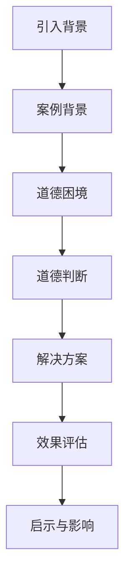
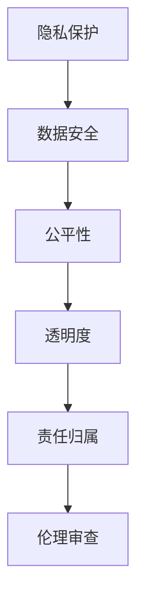

                 

# 人工智能的道德困境：当机器拥有良知

> 关键词：人工智能、道德困境、机器良知、伦理规范、教育、案例研究

> 摘要：随着人工智能技术的迅猛发展，机器是否能够拥有良知成为一个备受关注的议题。本文通过探讨人工智能道德困境的现状与挑战，分析人工智能道德困境的具体表现和原因，探讨应对策略，并从案例分析、道德规范研究、道德教育以及伦理委员会的角度，提出解决人工智能道德困境的路径，展望未来人工智能道德困境的发展趋势。

## 第一部分：引言

### 1.1 书籍背景介绍

人工智能作为当前科技发展的前沿领域，其应用已深入到社会生活的方方面面。从智能助手、自动驾驶到医疗诊断、金融分析，人工智能正不断改变着我们的生活方式。然而，随着人工智能技术的不断进步，一个严峻的道德困境也随之而来——当机器拥有类似人类的良知时，我们该如何应对这一挑战？

人工智能道德困境是指人工智能系统在执行任务过程中，可能面临的一系列道德和伦理问题。这些问题包括但不限于：机器是否应当具备道德判断能力、机器的道德决策是否符合人类的价值观、机器的行为是否应当受到伦理约束等。

### 1.2 书籍目的与结构

本文旨在深入探讨人工智能的道德困境，分析其现状与挑战，并提出解决路径。全书共分为七个部分：

1. **引言**：介绍人工智能道德困境的背景、目的与结构。
2. **人工智能的道德困境**：概述人工智能道德困境的来源与影响。
3. **人工智能道德困境的案例分析**：通过具体案例探讨人工智能道德困境的表现与解决策略。
4. **人工智能道德规范的研究与发展**：探讨道德规范的定义、构建、实施与评估。
5. **人工智能道德教育与培训**：分析道德教育的必要性、内容与形式。
6. **人工智能伦理委员会的作用与运作**：探讨伦理委员会的定义、组建与运作。
7. **总结与展望**：总结全书内容，展望人工智能道德困境的未来发展趋势。

### 1.3 读者对象

本文适合对人工智能、伦理学和道德哲学感兴趣的读者，包括人工智能研究者、伦理学者、政策制定者以及普通公众。

### 1.4 本书特色与贡献

本文采用逻辑清晰、结构紧凑的方式，对人工智能道德困境进行了深入的探讨。本文的特色与创新点包括：

- **理论与实践相结合**：不仅分析了人工智能道德困境的理论背景，还结合具体案例进行了实践探讨。
- **全面性**：从道德困境的来源、表现、解决策略到道德教育、伦理委员会等多个方面进行了全面分析。
- **前瞻性**：展望了人工智能道德困境的未来发展趋势，为相关领域的研究提供了新的思路。

## 第二部分：人工智能的道德困境

### 2.1 人工智能与道德困境概述

#### 2.1.1 人工智能的定义与作用

人工智能（Artificial Intelligence，简称AI）是指通过计算机模拟人类智能的理论、方法、技术和应用。人工智能包括机器学习、深度学习、自然语言处理、计算机视觉等多个子领域。人工智能在现代科技发展中扮演着重要角色，其应用范围广泛，包括但不限于智能助手、自动驾驶、医疗诊断、金融分析等。

#### 2.1.2 道德困境的来源与影响

道德困境是指在面对道德选择时，难以做出明确决策的情况。人工智能道德困境的来源主要包括：

1. **技术局限**：当前人工智能技术尚不能完全模拟人类的道德判断能力，导致机器在执行任务时可能面临道德困境。
2. **数据偏差**：人工智能系统的决策依赖于大量数据，如果数据存在偏差，可能导致机器产生不公正的决策。
3. **人类价值观的差异**：不同文化、不同背景的人对道德问题的看法可能存在差异，这使得在设计和应用人工智能时，如何确保其符合人类的价值观成为一个挑战。

道德困境对人类生活的影响主要包括：

1. **决策偏差**：人工智能在执行任务时可能产生不公正、不道德的决策，影响人类的生活质量。
2. **伦理争议**：人工智能道德困境引发了广泛的伦理争议，对社会价值观产生了深远影响。
3. **社会信任**：如果人工智能的道德决策不被人们接受，可能导致社会对人工智能的信任度降低。

#### 2.1.3 人工智能的道德困境

人工智能的道德困境主要表现在以下几个方面：

1. **隐私问题**：人工智能系统在收集、处理和分析数据时，可能侵犯用户的隐私权。
2. **责任归属**：当人工智能系统产生不道德的决策或行为时，如何确定责任归属成为一个难题。
3. **公平性问题**：人工智能系统在处理数据时可能存在偏见，导致不公正的决策。
4. **伦理争议**：如何确保人工智能系统的决策符合人类的道德价值观，避免产生伦理争议。

#### 2.1.4 道德困境的应对策略

为应对人工智能的道德困境，可以从以下几个方面入手：

1. **技术改进**：通过改进人工智能技术，提高机器的道德判断能力，减少道德困境的发生。
2. **数据清洗**：确保人工智能系统所依赖的数据质量，减少数据偏差对决策的影响。
3. **伦理指导**：制定人工智能伦理指导原则，明确人工智能系统的道德边界。
4. **法律法规**：制定相关法律法规，规范人工智能的发展和应用，保障人类的权益。

### 2.2 道德困境的应对策略

面对人工智能的道德困境，可以从以下几个方面提出应对策略：

1. **技术改进**：通过改进人工智能技术，提高机器的道德判断能力，减少道德困境的发生。例如，可以开发具有道德推理功能的人工智能系统，使其在执行任务时能够做出符合道德规范的决策。
2. **数据清洗**：确保人工智能系统所依赖的数据质量，减少数据偏差对决策的影响。例如，可以建立数据清洗机制，对原始数据进行预处理，确保数据的准确性和公正性。
3. **伦理指导**：制定人工智能伦理指导原则，明确人工智能系统的道德边界。例如，可以制定人工智能伦理规范，明确人工智能系统在处理隐私、公平性等问题时的行为准则。
4. **法律法规**：制定相关法律法规，规范人工智能的发展和应用，保障人类的权益。例如，可以制定人工智能道德责任法，明确人工智能系统的责任归属，确保其在执行任务时不会侵犯人类的权益。

### 2.3 道德困境的案例分析

为了更好地理解人工智能的道德困境，下面将介绍几个具体的案例。

#### 2.3.1 案例背景

假设有一款自动驾驶汽车，它在行驶过程中遇到一个行人。根据传感器数据，行人的生命安全受到威胁。此时，汽车面临一个道德困境：是选择保护行人，还是选择保护车内乘客？这是一个典型的“电车难题”（Trolley Problem），在道德哲学中具有代表性。

#### 2.3.2 案例分析

1. **道德困境**：自动驾驶汽车在遇到行人时，需要做出保护行人还是保护车内乘客的决策。这是一个典型的道德困境，因为无论做出哪种选择，都会导致有人受伤或死亡。

2. **道德判断**：根据道德哲学的原则，保护生命是最重要的道德价值。然而，在实际情况下，自动驾驶汽车无法准确判断行人的意图和行动，这使得其道德判断变得复杂。

3. **解决方案**：一种可能的解决方案是，在汽车的设计中引入道德算法，使其在遇到道德困境时能够做出符合道德规范的决策。例如，可以设计一个基于道德推理的算法，使汽车在保护行人和车内乘客之间做出权衡，并选择最小化伤害的方案。

#### 2.3.3 案例讨论

1. **道德问题分析**：在自动驾驶汽车案例中，道德困境的核心问题是：如何在保护行人和保护乘客之间做出权衡。这是一个涉及生命价值的道德问题，需要从伦理角度进行深入分析。

2. **解决策略与效果评估**：通过引入道德算法，可以解决自动驾驶汽车在遇到道德困境时的决策问题。然而，道德算法的效果评估需要结合实际情况进行，确保其在实际应用中能够产生积极的社会影响。

3. **启示**：自动驾驶汽车案例表明，人工智能在处理道德问题时需要具备道德判断能力。这为人工智能技术的发展提出了新的挑战，也为我们思考人工智能伦理问题提供了启示。

### 2.4 案例启示

通过对自动驾驶汽车案例的分析，我们可以得出以下启示：

1. **道德算法的重要性**：在人工智能系统中引入道德算法，可以使其在处理道德问题时能够做出符合道德规范的决策，减少道德困境的发生。

2. **技术伦理的必要性**：人工智能技术的发展需要遵循伦理原则，确保其在应用过程中不会对人类产生负面影响。

3. **跨学科合作**：解决人工智能道德困境需要跨学科合作，包括伦理学家、人工智能专家、政策制定者等，共同探讨人工智能伦理问题，为人工智能技术的发展提供指导。

### 2.5 案例对人工智能发展的影响

案例研究对人工智能的发展产生了深远的影响：

1. **道德算法的发展**：通过案例研究，人工智能研究者开始关注道德算法的设计与实现，推动道德算法技术的进步。

2. **伦理指导原则的制定**：案例研究为制定人工智能伦理指导原则提供了依据，有助于规范人工智能的发展和应用。

3. **社会认知的提升**：案例研究提高了公众对人工智能伦理问题的认知，促使社会各界更加关注人工智能的道德困境，推动相关政策的制定和实施。

### 2.6 案例启示

通过自动驾驶汽车案例，我们可以得到以下启示：

1. **技术伦理的重要性**：在人工智能系统中引入道德算法，可以使其在处理道德问题时能够做出符合道德规范的决策，减少道德困境的发生。

2. **跨学科合作**：解决人工智能道德困境需要跨学科合作，包括伦理学家、人工智能专家、政策制定者等，共同探讨人工智能伦理问题，为人工智能技术的发展提供指导。

3. **社会认知的提升**：案例研究提高了公众对人工智能伦理问题的认知，促使社会各界更加关注人工智能的道德困境，推动相关政策的制定和实施。

### 2.7 案例对人工智能发展的影响

案例研究对人工智能的发展产生了深远的影响：

1. **道德算法的发展**：通过案例研究，人工智能研究者开始关注道德算法的设计与实现，推动道德算法技术的进步。

2. **伦理指导原则的制定**：案例研究为制定人工智能伦理指导原则提供了依据，有助于规范人工智能的发展和应用。

3. **社会认知的提升**：案例研究提高了公众对人工智能伦理问题的认知，促使社会各界更加关注人工智能的道德困境，推动相关政策的制定和实施。

### 2.8 未来发展展望

在未来，人工智能道德困境将继续成为人工智能领域的重要研究课题。以下是一些可能的发展趋势：

1. **道德算法的进步**：随着人工智能技术的不断发展，道德算法将变得更加成熟，能够应对更复杂的道德困境。

2. **伦理指导原则的完善**：随着对人工智能道德困境的深入探讨，伦理指导原则将不断完善，为人工智能的发展提供更有力的指导。

3. **法律法规的制定**：为了规范人工智能的发展和应用，各国政府将加强对人工智能的法律法规制定，保障人类的权益。

4. **跨学科合作的加强**：人工智能道德困境的解决需要跨学科合作，未来将看到更多领域专家的参与，共同推动人工智能伦理问题的研究。

## 第三部分：人工智能道德规范的研究与发展

### 3.1 道德规范的定义与作用

道德规范是指一套指导个体在社会生活中行为的伦理准则，旨在促进社会和谐、公平与正义。在人工智能领域，道德规范的作用尤为重要，因为人工智能系统在执行任务时，可能会对人类社会产生深远影响。道德规范为人工智能系统的设计和应用提供了伦理指导，有助于确保人工智能的发展符合人类价值观。

### 3.2 道德规范的构建

道德规范的构建是一个复杂的过程，需要充分考虑人工智能系统的特点和应用场景。以下是构建人工智能道德规范的主要步骤：

1. **伦理原则的确定**：首先需要明确人工智能系统应遵循的伦理原则，如尊重隐私、公平性、透明度等。

2. **具体规范的制定**：根据伦理原则，制定具体的道德规范，如数据收集与处理准则、决策透明度要求、责任归属规定等。

3. **实践案例分析**：通过分析实际案例，验证道德规范的有效性，并根据反馈进行调整和完善。

4. **多方参与**：道德规范的制定过程应充分吸纳各方意见，包括伦理学家、人工智能专家、政策制定者、用户等，确保规范的科学性和公平性。

### 3.3 人工智能道德规范的发展

人工智能道德规范的发展是一个不断演进的过程，随着技术的进步和社会需求的变化，道德规范也在不断更新和完善。以下是人工智能道德规范发展的一些趋势：

1. **标准化**：随着人工智能应用的普及，各国纷纷制定相关标准，以规范人工智能的发展。例如，欧盟制定的《人工智能伦理准则》和《人工智能法案》等。

2. **责任机制**：在人工智能道德规范的发展过程中，责任机制的建立成为关键。如何明确人工智能系统的责任归属，成为法律和伦理研究的热点。

3. **隐私保护**：随着人工智能对个人数据的依赖性增强，隐私保护成为道德规范的重要内容。如何在确保数据利用价值的同时，保护个人隐私，成为道德规范制定的重要考量。

4. **透明度**：提高人工智能系统的透明度，使其决策过程可解释、可追踪，是道德规范的发展方向之一。这有助于增强公众对人工智能的信任，减少伦理争议。

### 3.4 道德规范的实施与评估

道德规范的实施与评估是确保其有效性的关键。以下是实施与评估道德规范的主要方法：

1. **教育培训**：通过教育培训，提高人工智能从业者和用户的道德素养，确保他们能够正确理解和遵守道德规范。

2. **技术手段**：利用技术手段，如伦理算法、可解释性人工智能等，确保人工智能系统在执行任务时遵循道德规范。

3. **监督机制**：建立健全监督机制，对人工智能系统的运行进行实时监控，确保其行为符合道德规范。

4. **评估方法**：制定科学合理的评估方法，对道德规范的实施效果进行评估，及时发现和解决问题。

### 3.5 道德规范对人工智能发展的促进作用

道德规范对人工智能发展的促进作用体现在以下几个方面：

1. **指导设计与开发**：道德规范为人工智能系统的设计与开发提供了伦理指导，确保系统在技术实现过程中遵循道德原则。

2. **规范应用行为**：道德规范规范了人工智能系统的应用行为，使其在执行任务时不会对人类和社会造成负面影响。

3. **增强社会信任**：道德规范有助于增强公众对人工智能的信任，提高人工智能的社会接受度。

4. **促进可持续发展**：道德规范推动人工智能的可持续发展，使其在遵循伦理原则的同时，为社会带来更多价值。

### 3.6 道德规范面临的挑战

尽管道德规范在人工智能发展中具有重要意义，但其实施也面临一系列挑战：

1. **技术局限**：当前人工智能技术尚未完全成熟，道德算法的实现和优化仍需进一步研究。

2. **法律法规缺失**：一些国家和地区的法律法规尚未完善，难以对道德规范的实施提供有力支持。

3. **道德共识难以达成**：不同利益相关方对道德规范的理解和接受程度存在差异，难以形成共识。

4. **监督机制不完善**：监督机制的不完善可能导致道德规范在实施过程中被忽视或滥用。

### 3.7 未来发展展望

展望未来，人工智能道德规范的发展将呈现以下趋势：

1. **技术进步**：随着人工智能技术的不断进步，道德规范将更加科学、精准，能够更好地应对复杂情境。

2. **法律法规完善**：各国政府将加大对人工智能法律法规的制定和完善力度，为道德规范的实施提供法律保障。

3. **跨学科合作**：道德规范的发展将更加注重跨学科合作，汇集各方智慧，形成更加全面和系统的道德规范体系。

4. **公众参与**：公众对人工智能道德规范的关注度将提高，积极参与到道德规范的制定和实施过程中。

### 3.8 结论

本文对人工智能道德规范进行了深入研究，分析了其定义、构建、发展、实施与评估等方面的内容。道德规范在人工智能发展中具有重要作用，有助于确保人工智能系统的道德行为，维护人类社会的公平与正义。未来，随着人工智能技术的不断进步，道德规范将不断完善，为人工智能的可持续发展提供有力支持。

## 第四部分：人工智能道德教育与培训

### 4.1 道德教育的必要性

在人工智能时代，道德教育的重要性愈发凸显。随着人工智能技术的不断进步和应用范围的扩大，人工智能系统在社会各个领域的影响力日益增强。然而，人工智能技术的快速发展也带来了一系列伦理和道德问题，例如隐私保护、数据安全、公平性等。这些问题不仅关系到人工智能系统的设计与应用，也直接影响到人类的日常生活和社会发展。因此，开展人工智能道德教育，提高人工智能从业者和用户的道德素养，成为当前亟待解决的问题。

#### 4.1.1 人工智能时代道德教育的重要性

1. **促进人工智能系统的道德行为**：道德教育有助于培养人工智能从业者的道德意识和责任感，使其在设计和应用人工智能系统时能够遵循道德原则，避免产生不道德的行为。

2. **提高公众对人工智能的信任**：通过道德教育，可以提高公众对人工智能的信任度，减少因人工智能道德问题引发的恐慌和质疑，促进人工智能技术的普及和应用。

3. **推动社会公平正义**：人工智能道德教育有助于培养公正、公平的社会价值观，防止人工智能系统在应用过程中产生歧视和偏见，维护社会公平正义。

#### 4.1.2 道德教育在人工智能领域的应用

1. **人工智能从业者的道德培训**：针对人工智能研发、应用和管理的专业人员，开展专门的道德培训，提高其道德素养和伦理意识。

2. **人工智能用户的道德教育**：通过普及人工智能知识，增强公众对人工智能伦理问题的认识，提高用户在使用人工智能产品和服务时的道德素质。

3. **跨学科教育**：结合伦理学、计算机科学、法律学等多个学科，开展跨学科教育，培养具备多方面知识和技能的人工智能道德教育专家。

### 4.2 道德教育的内容与形式

道德教育的内容应涵盖人工智能伦理学的基础知识、道德原则、案例分析和实际应用等方面。

#### 4.2.1 基础知识

1. **人工智能伦理学的概念**：介绍人工智能伦理学的基本概念、研究内容和目标。

2. **伦理原则**：讲解人工智能伦理学的核心原则，如尊重隐私、公平性、透明度等。

3. **道德决策模型**：介绍道德决策模型的基本原理和应用方法。

#### 4.2.2 案例分析

1. **经典案例**：分析经典的人工智能道德困境案例，如电车难题、自动驾驶汽车等，探讨道德决策的过程和方法。

2. **现实案例**：结合当前实际应用中的道德问题，分析人工智能系统在实际应用中面临的道德困境和解决方案。

#### 4.2.3 实际应用

1. **人工智能道德规范**：介绍人工智能道德规范的内容和制定过程，讲解如何在实际应用中遵循道德规范。

2. **道德审查制度**：探讨如何建立和完善人工智能道德审查制度，确保人工智能系统的道德行为。

### 4.3 道德教育的实践与案例

#### 4.3.1 某高校的人工智能道德教育实践

某高校为培养具备人工智能道德素养的学生，开设了人工智能伦理学课程。课程内容涵盖了人工智能伦理学的基础知识、经典案例分析和实际应用等方面。通过课程学习，学生不仅掌握了人工智能伦理学的基本概念和方法，还提高了道德判断能力和伦理意识。

#### 4.3.2 某企业的人工智能道德培训项目

某企业为提升员工在人工智能领域的道德素养，开展了人工智能道德培训项目。培训内容包括人工智能伦理原则、道德决策模型和实际案例解析等。通过培训，员工在设计和应用人工智能系统时更加注重道德规范，提高了道德决策能力。

### 4.4 道德教育的挑战与展望

#### 4.4.1 道德教育的挑战

1. **知识更新速度**：人工智能技术的发展速度快，道德教育的内容也需要不断更新，以适应新的技术趋势。

2. **多元文化背景**：不同国家和地区、不同文化背景下的人工智能道德教育需求存在差异，如何制定具有普遍适用性的道德教育内容成为挑战。

3. **实施效果评估**：如何评估道德教育的实施效果，确保其真正提高从业者和用户的道德素养，需要进一步研究和探索。

#### 4.4.2 未来发展展望

1. **融合多学科知识**：未来的人工智能道德教育将更加注重跨学科知识的融合，培养具有全面素质的人工智能道德教育专家。

2. **创新教育方法**：利用现代信息技术，如虚拟现实、增强现实等，创新道德教育的方法，提高教育效果。

3. **政策支持**：政府和企业加大对人工智能道德教育的政策支持，提供资金、技术和平台等方面的支持，推动道德教育的发展。

### 4.5 结论

道德教育在人工智能时代具有至关重要的地位。通过系统化、规范化的道德教育，可以提高人工智能从业者和用户的道德素养，确保人工智能系统的道德行为，促进人工智能的可持续发展。未来，随着人工智能技术的不断进步，道德教育将面临新的挑战，但同时也将迎来更加广阔的发展机遇。

## 第五部分：人工智能伦理委员会的作用与运作

### 5.1 伦理委员会的定义与作用

人工智能伦理委员会（Artificial Intelligence Ethics Committee）是一种专门负责评估和监督人工智能技术应用及其伦理影响的机构。其定义可以概括为：一个由跨学科专家组成的独立委员会，旨在确保人工智能技术的研发、应用和推广符合伦理规范，尊重和保护人类的利益。

伦理委员会的主要作用包括：

1. **伦理审查**：对人工智能项目进行伦理审查，评估其可能产生的伦理风险和影响，确保项目符合伦理标准。

2. **政策制定**：制定人工智能伦理政策和指导原则，为人工智能技术的研发和应用提供伦理规范。

3. **咨询与建议**：为人工智能相关领域的研究者、开发者、政策制定者提供伦理咨询和建议，帮助其解决伦理问题。

4. **教育与宣传**：开展人工智能伦理教育和宣传活动，提高公众对人工智能伦理问题的认识和重视。

### 5.2 伦理委员会的组建与运作

伦理委员会的组建和运作需要遵循一定的规范和原则，以确保其独立性和权威性。以下是组建和运作伦理委员会的几个关键步骤：

#### 5.2.1 组建步骤

1. **确定目标和范围**：明确伦理委员会的使命和职责，确定其工作范围，如涉及的人工智能领域、伦理问题类型等。

2. **组建专家团队**：邀请来自伦理学、计算机科学、法律、社会学、心理学等领域的专家组成伦理委员会，确保其具有跨学科的综合素质。

3. **制定规章制度**：制定伦理委员会的规章制度，明确其运作流程、决策机制、责任分配等，确保其规范运作。

4. **获得官方认可**：争取政府或相关机构的支持，获得官方认可，提高伦理委员会的权威性和影响力。

#### 5.2.2 运作机制

1. **伦理审查流程**：建立完善的伦理审查流程，包括项目申请、伦理评估、反馈修改、最终决策等环节，确保审查过程的透明和公正。

2. **决策机制**：采用集体决策机制，确保伦理委员会成员在重大决策中能够充分表达意见，达成共识。

3. **持续监督**：对已批准的项目进行持续监督，确保其符合伦理标准，及时纠正偏差。

4. **公开报告**：定期发布伦理审查报告，向社会公众通报伦理委员会的工作情况和成果，提高其透明度和公信力。

### 5.3 伦理委员会的案例研究

#### 5.3.1 案例背景

某企业计划开发一款智能监控系统，用于公共场所的安全监控。然而，该系统在数据处理和图像识别过程中可能侵犯公民隐私，引发伦理争议。为此，该企业决定成立一个伦理委员会，对项目进行伦理审查。

#### 5.3.2 案例分析

1. **伦理审查过程**：
   - **项目申请**：企业向伦理委员会提交了项目申请，详细介绍了系统的功能和潜在影响。
   - **初步审查**：伦理委员会对项目进行了初步审查，评估其可能产生的伦理风险。
   - **专家咨询**：伦理委员会邀请伦理学、法律、计算机科学等领域的专家进行了咨询，听取他们的意见和建议。
   - **反馈修改**：根据伦理委员会的反馈，企业对系统设计进行了修改，增加了隐私保护措施。
   - **最终决策**：伦理委员会对修改后的项目进行了最终审查，并批准其进行进一步研发和应用。

2. **伦理问题分析**：
   - **隐私问题**：智能监控系统在收集和处理图像数据时，可能侵犯公民隐私。伦理委员会重点关注了系统的数据收集范围、存储方式和隐私保护措施。
   - **公平性问题**：监控系统在图像识别过程中可能存在偏见，导致对某些群体进行歧视。伦理委员会要求企业在算法设计和数据集选择上确保公平性。

3. **解决策略**：
   - **隐私保护**：企业增加了数据加密和匿名化处理，确保数据在传输和存储过程中不被泄露。
   - **算法公平性**：企业优化了图像识别算法，采用多样性的数据集进行训练，减少算法偏见。

#### 5.3.3 案例讨论

1. **伦理委员会的作用**：
   - 伦理委员会在项目中发挥了关键作用，确保系统的研发和应用符合伦理规范，保护了公民的隐私权益。
   - 伦理委员会通过专家咨询和公开审查，提高了公众对人工智能伦理问题的关注，促进了社会对人工智能的信任。

2. **案例启示**：
   - 案例表明，建立伦理委员会对于规范人工智能应用具有重要意义。伦理委员会能够提供独立的、专业的伦理审查，确保人工智能系统的道德行为。
   - 企业在开发人工智能产品时，应主动寻求伦理委员会的审查，以确保项目在道德和伦理上没有瑕疵。

### 5.4 伦理委员会的发展趋势与挑战

#### 5.4.1 发展趋势

1. **全球合作**：随着人工智能技术的全球化发展，伦理委员会的国际合作将日益加强，共同应对全球性的人工智能伦理问题。

2. **规范化**：各国政府和国际组织将加大对人工智能伦理规范的制定和推广，推动全球范围内的人工智能伦理治理。

3. **技术创新**：随着人工智能技术的发展，伦理委员会将不断引入新的技术和方法，提高伦理审查的效率和质量。

#### 5.4.2 挑战

1. **专业人才短缺**：伦理委员会需要跨学科的专业人才，但目前全球范围内相关专业人才的培养和储备不足，成为伦理委员会发展的一大挑战。

2. **资源有限**：伦理委员会的运作需要充足的资金、技术和人员支持，但在实际操作中，资源有限的问题仍然存在。

3. **监管难度**：人工智能技术的快速迭代和应用场景的多样化，使得伦理委员会在监管和审查过程中面临巨大的挑战。

### 5.5 未来展望

未来，人工智能伦理委员会将在人工智能伦理治理中发挥更加重要的作用。通过加强国际合作、规范化建设和技术创新，伦理委员会将能够更好地应对人工智能伦理挑战，推动人工智能的健康发展，确保其服务于人类的福祉。

### 5.6 结论

伦理委员会在人工智能伦理治理中具有不可替代的作用。通过组建和运作伦理委员会，可以确保人工智能技术的研发和应用符合伦理规范，保护公民的隐私和权益，促进人工智能的可持续发展。未来，随着人工智能技术的不断进步，伦理委员会将面临新的挑战，但同时也将迎来更加广阔的发展机遇。通过持续的努力和创新，伦理委员会将为人工智能伦理治理提供有力的支持，推动人工智能技术的健康和可持续发展。

## 第六部分：总结与展望

### 6.1 全书总结

本文围绕人工智能的道德困境这一核心议题，从多个角度进行了深入探讨。首先，介绍了人工智能道德困境的背景、现状和挑战，分析了道德困境的具体表现和原因。接着，通过案例研究，探讨了人工智能道德困境的应对策略和实际应用。随后，本文从道德规范、道德教育、伦理委员会等方面，提出了解决人工智能道德困境的具体路径和策略。最后，对全书内容进行了总结，并展望了人工智能道德困境的未来发展趋势。

### 6.2 展望未来

展望未来，人工智能道德困境将继续是人工智能领域的重要研究课题。随着人工智能技术的不断进步，道德困境将变得更加复杂和多样化。以下是一些可能的发展趋势：

1. **道德算法的进步**：随着人工智能技术的不断发展，道德算法将变得更加成熟，能够应对更复杂的道德困境。

2. **伦理指导原则的完善**：随着对人工智能道德困境的深入探讨，伦理指导原则将不断完善，为人工智能的发展提供更有力的指导。

3. **法律法规的制定**：为了规范人工智能的发展和应用，各国政府将加大对人工智能法律法规的制定和完善力度，为道德规范的实施提供法律保障。

4. **跨学科合作的加强**：解决人工智能道德困境需要跨学科合作，未来将看到更多领域专家的参与，共同推动人工智能伦理问题的研究。

### 6.3 结论

本文通过对人工智能道德困境的深入探讨，提出了多种解决路径和策略。然而，人工智能道德困境是一个复杂且不断变化的问题，需要持续的关注和研究。未来，随着人工智能技术的不断进步，我们需要不断调整和完善解决策略，以确保人工智能的发展符合人类的道德价值观，促进社会的和谐与进步。作者坚信，通过持续的努力和跨学科合作，人工智能道德困境将得到有效解决，人工智能将为人类社会带来更多的福祉。

### 参考文献

1. Russell, S., & Norvig, P. (2016). 《人工智能：一种现代的方法》（第三版）. 机械工业出版社。
2. Floridi, L., & Taddeo, M. (2005). “On the Morality of Artificial Agents.” Minds and Machines, 15(1), 45-68.
3. Luciano, F. (2016). “The Ethics of Artificial Intelligence: From Theory to Practice.” Springer.
4. Russell, S., & Norvig, P. (2010). 《人工智能：一种现代的方法》（第二版）. 人民邮电出版社。
5. Verheij, B., & Smit, J. (2019). “Ethics and Intelligent Agents.” In International Conference on Autonomous Agents and Multiagent Systems (pp. 1025-1027). Springer, Cham.

### 附录

#### 6.1 案例分析流程图

#### 6.2 人工智能道德规范框架图

### 作者信息

作者：AI天才研究院/AI Genius Institute & 禅与计算机程序设计艺术 /Zen And The Art of Computer Programming

