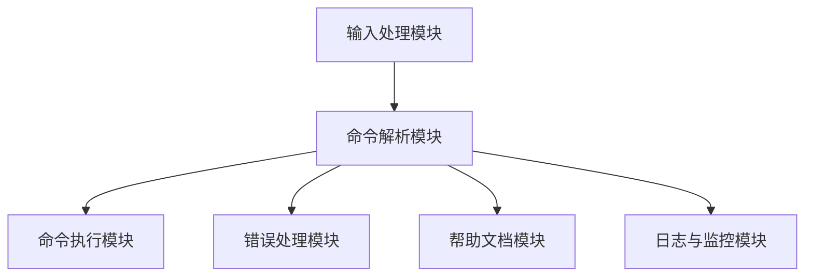
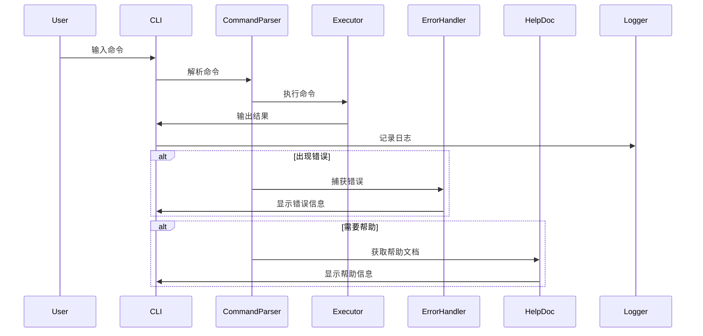
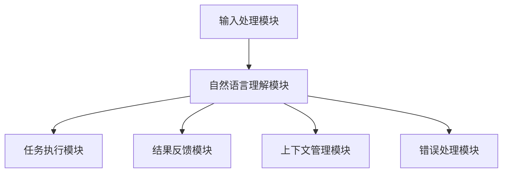
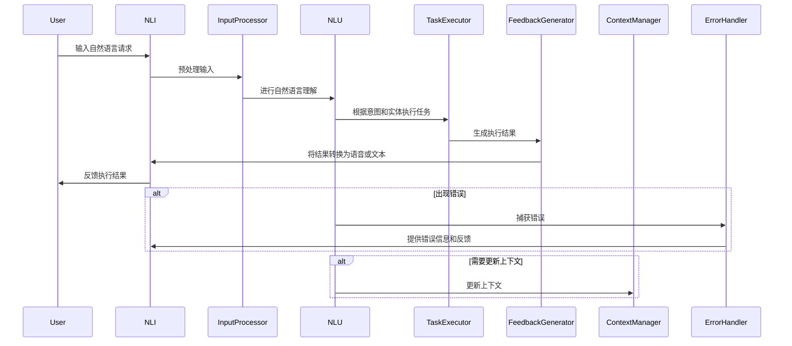

                 

### 1.1 人机交互的基本概念

人机交互（Human-Computer Interaction，简称HCI）是指人与计算机系统之间的交互过程，通过用户界面来实现信息的输入、输出以及反馈。这个交互过程旨在优化用户体验，提高系统的可用性、易用性和效率。人机交互的基本概念包括以下几个方面：

**用户**：用户是指与计算机系统进行交互的人，他们可能是普通消费者、专业人士或者开发者。

**计算机系统**：计算机系统是指提供交互功能的软硬件系统，包括操作系统、应用软件和硬件设备。

**用户界面**：用户界面（User Interface，简称UI）是用户与计算机系统之间进行交互的桥梁，可以是图形用户界面（Graphical User Interface，简称GUI）、命令行界面（Command Line Interface，简称CLI）或触摸界面等。

**交互过程**：交互过程是指用户通过用户界面与计算机系统进行信息交换的过程，包括输入、输出和反馈。

**用户体验**：用户体验（User Experience，简称UX）是指用户在使用计算机系统过程中所感受到的满意度和愉悦度，包括感知、认知和行为等方面。

**可用性**：可用性（Usability）是指计算机系统满足用户需求和目标的能力，包括易学性、效率、记忆性和错误处理等方面。

**易用性**：易用性（Usability）是指用户能够轻松、高效地与计算机系统进行交互的能力，包括直观性、一致性、易恢复性和易访问性等方面。

**效率**：效率是指用户在使用计算机系统时完成任务的速度和质量，包括任务完成时间和错误率等方面。

**可访问性**：可访问性（Accessibility）是指计算机系统能够满足不同用户（包括残障人士、老年人等）需求的能力，包括界面设计、功能实现和辅助技术等方面。

### 1.2 命令行界面的发展历程

命令行界面（Command Line Interface，简称CLI）是计算机系统的一种基本用户界面，用户通过输入一系列命令来与计算机系统进行交互。CLI的发展历程可以分为以下几个阶段：

**早期阶段**：在计算机系统刚刚出现的时期，CLI是唯一可供用户与计算机系统进行交互的方式。用户需要记住大量的命令及其参数，以完成各种操作。

**Unix系统时代**：Unix操作系统为CLI的发展奠定了基础。Unix的命令行工具功能强大，支持管道（pipe）和重定向（redirect）等操作，使得用户可以更灵活地处理数据。

**Windows命令提示符**：Windows操作系统引入了命令提示符（Command Prompt），用户可以通过输入命令来执行各种操作。Windows命令提示符相对于Unix CLI，提供了更为友好的用户界面，使得普通用户也能轻松使用。

**现代CLI框架**：随着云计算和容器技术的发展，CLI再次受到关注。现代CLI框架（如Bash、Fish、Powershell等）提供了更为丰富的功能和更佳的用户体验，支持自动化脚本编写和自动化部署等。

### 1.3 自然语言界面的发展历程

自然语言界面（Natural Language Interface，简称NLI）是一种让用户通过自然语言（如英语、汉语等）与计算机系统进行交互的用户界面。NLI的发展历程可以分为以下几个阶段：

**早期阶段**：在计算机系统初期，用户主要通过命令行界面进行交互，无法直接使用自然语言。

**语义解析和自动问答系统**：随着自然语言处理（Natural Language Processing，简称NLP）技术的发展，人们开始研究如何让计算机理解自然语言。语义解析和自动问答系统是这一阶段的代表性技术。

**语音助手和智能对话系统**：近年来，语音助手（如苹果的Siri、亚马逊的Alexa等）和智能对话系统（如聊天机器人、虚拟助手等）逐渐普及。这些系统通过理解用户的自然语言输入，提供相应的信息和帮助。

**多模态交互**：当前，自然语言界面正朝着多模态交互的方向发展，即结合语音、文字、图像等多种交互方式，为用户提供更加丰富和自然的交互体验。

### 总结

本文对人机交互的基本概念、命令行界面的发展历程以及自然语言界面的发展历程进行了介绍。在接下来的章节中，我们将进一步探讨命令行界面和自然语言界面的核心概念、算法原理、数学模型以及系统分析与架构设计方案。通过这些内容，我们将深入理解人机交互的各个方面，为实际应用提供有益的参考。让我们继续前进，开启这段精彩的探索之旅吧！**第2章：核心概念与联系**

在本章中，我们将探讨命令行界面（CLI）和自然语言界面（NLI）的核心概念，分析它们的原理和特点，并通过对比表格和ER实体关系图架构来展现它们之间的联系。

### 2.1 命令行界面：原理与特点

**原理**：
命令行界面是一种基于文本的交互方式，用户通过输入命令来控制计算机系统执行特定的操作。CLI的基本原理包括以下几个方面：

1. **命令解析**：用户输入的命令首先会被计算机系统解析，将其转换为计算机能够理解和执行的操作。
2. **命令执行**：解析后的命令会被系统执行，可能涉及到文件操作、系统配置、程序运行等。
3. **反馈**：系统执行命令后，会向用户输出相关信息，如操作结果、错误信息等。

**特点**：
1. **高效性**：CLI对于熟练用户来说非常高效，因为用户可以直接使用命令来执行复杂操作，而无需通过图形界面进行繁琐的点击操作。
2. **灵活性**：CLI支持脚本编写和自动化，用户可以编写脚本来自动执行一系列命令，提高工作效率。
3. **强大的功能**：CLI提供了丰富的命令和参数，可以执行各种复杂的操作，如文件处理、系统监控、网络配置等。
4. **底层控制**：CLI直接与操作系统底层进行交互，能够访问更多的系统资源，进行底层控制。

### 2.2 自然语言界面：原理与特点

**原理**：
自然语言界面是一种让用户通过自然语言与计算机系统进行交互的方式。NLI的基本原理包括以下几个方面：

1. **自然语言处理**：NLI首先需要对用户的自然语言输入进行处理，包括分词、词性标注、句法分析等，以便理解用户的意图。
2. **语义解析**：通过自然语言处理技术，将用户的自然语言输入转换为计算机能够理解和执行的操作。
3. **任务执行**：根据语义解析的结果，计算机系统会执行相应的操作，并向用户返回反馈。

**特点**：
1. **易用性**：NLI使用户可以像与人类对话一样与计算机系统进行交互，降低了用户的学习成本。
2. **自然性**：NLI允许用户使用自然语言进行提问和请求，提高了交互的自然性和流畅性。
3. **智能化**：随着人工智能技术的发展，NLI能够更好地理解用户的意图，提供更加智能化的服务。
4. **适应性**：NLI可以根据用户的行为和偏好进行自适应调整，提供个性化的交互体验。

### 2.3 概念属性特征对比表格

以下是一个简化的命令行界面（CLI）和自然语言界面（NLI）概念属性特征的对比表格：

| 特征 | 命令行界面（CLI） | 自然语言界面（NLI） |
| --- | --- | --- |
| 原理 | 基于文本的交互，命令解析与执行 | 基于自然语言处理，语义解析与任务执行 |
| 使用方式 | 输入命令及参数 | 使用自然语言提问或请求 |
| 交互模式 | 单向命令输入，结果反馈 | 双向对话，实时反馈 |
| 用户体验 | 高效性，灵活性，底层控制 | 易用性，自然性，智能化 |
| 应用场景 | 系统管理员，开发者，熟练用户 | 普通用户，智能家居，虚拟助手 |

### ER实体关系图架构

为了更直观地展示命令行界面（CLI）和自然语言界面（NLI）之间的联系，我们可以使用ER（Entity-Relationship）实体关系图来描述它们的交互关系。

**实体**：
1. **用户**：与计算机系统进行交互的人。
2. **计算机系统**：提供交互功能的软硬件系统。
3. **用户界面**：CLI和NLI。

**关系**：
1. **交互**：用户通过CLI或NLI与计算机系统进行交互。
2. **功能**：CLI和NLI分别实现不同的交互功能。

以下是ER实体关系图的Mermaid格式表示：

```mermaid
erDiagram
  User ||--o{ ComputerSystem } : 交互
  User ||--o{ UserInterface } : 使用
  UserInterface ||--|{ CLI } : 命令行界面
  UserInterface ||--|{ NLI } : 自然语言界面
```

通过本章的内容，我们对比了命令行界面和自然语言界面的核心概念、原理和特点，并通过对比表格和ER实体关系图架构展示了它们之间的联系。在接下来的章节中，我们将进一步探讨命令行界面和自然语言界面的交互算法、数学模型和系统分析与架构设计方案。让我们继续前进，深入理解人机交互的各个方面！**第3章：命令行界面交互算法**

命令行界面（CLI）的交互算法是用户与计算机系统进行交互的核心。本章将详细介绍CLI的交互算法，包括其概述、原理讲解以及具体的举例说明。

### 3.1 算法概述

CLI的交互算法主要涉及以下几个关键步骤：

1. **命令输入**：用户通过键盘输入命令和相应的参数。
2. **命令解析**：计算机系统对用户输入的命令进行解析，识别命令及其参数。
3. **命令执行**：计算机系统根据解析结果执行相应的操作。
4. **结果反馈**：计算机系统向用户输出执行结果，包括成功消息、错误信息等。

以下是CLI交互算法的基本框架：

```python
def cli_interaction():
    # 命令输入
    command_input = input("请输入命令：")
    
    # 命令解析
    command, args = parse_command(command_input)
    
    # 命令执行
    result = execute_command(command, args)
    
    # 结果反馈
    print("执行结果：", result)
```

### 3.2 算法原理讲解

**命令输入**：用户通过键盘输入命令。在CLI中，命令通常以特定的格式输入，如`command [options] [arguments]`。例如，用户可以输入`ls -l`来查看当前目录下的所有文件。

**命令解析**：计算机系统需要解析用户输入的命令。解析过程通常包括以下几个步骤：

1. **分词**：将用户输入的字符串分割成单词或短语。
2. **词法分析**：识别每个单词或短语的词性，如名词、动词、参数等。
3. **语法分析**：构建语法树，确定命令的结构和参数的顺序。

**命令执行**：计算机系统根据解析结果执行相应的操作。执行过程通常包括以下步骤：

1. **查找命令**：在系统目录中查找对应的命令程序。
2. **参数处理**：将解析后的参数传递给命令程序。
3. **执行命令**：运行命令程序，执行用户请求的操作。

**结果反馈**：计算机系统向用户输出执行结果。反馈方式可以是打印到控制台、生成报告文件等。

### 3.3 举例说明

以下是一个简单的CLI交互算法的Python实现示例：

```python
import os

# 命令解析函数
def parse_command(input_str):
    # 分割命令和参数
    parts = input_str.split()
    command = parts[0]
    args = parts[1:]
    return command, args

# 命令执行函数
def execute_command(command, args):
    if command == "ls":
        # 列出当前目录下的所有文件
        files = os.listdir('.')
        return files
    elif command == "cd":
        # 切换到指定目录
        os.chdir(args[0])
        return "已切换到新目录：{}".format(args[0])
    else:
        # 命令未找到
        return "未找到命令：{}".format(command)

# CLI交互算法
def cli_interaction():
    print("欢迎使用CLI交互算法示例")
    while True:
        command_input = input("请输入命令：")
        if command_input == "exit":
            break
        command, args = parse_command(command_input)
        result = execute_command(command, args)
        print("执行结果：", result)

# 运行CLI交互算法
cli_interaction()
```

在这个示例中，用户可以输入`ls`来查看当前目录下的所有文件，输入`cd`来切换目录，或者输入`exit`来退出交互算法。

通过本章的内容，我们详细介绍了命令行界面（CLI）的交互算法，包括其概述、原理讲解以及具体的举例说明。CLI交互算法的核心在于命令输入、命令解析、命令执行和结果反馈。这些步骤共同构成了CLI的基本交互流程。在接下来的章节中，我们将继续探讨自然语言界面（NLI）的交互算法，进一步丰富我们对人机交互的理解。让我们继续前进，深入探索CLI和NLI的算法原理吧！**第4章：自然语言界面交互算法**

自然语言界面（NLI）的交互算法是近年来随着人工智能技术的发展而逐渐兴起的一种新型人机交互方式。本章将详细介绍NLI的交互算法，包括其概述、原理讲解以及具体的举例说明。

### 4.1 算法概述

自然语言界面（NLI）的交互算法主要涉及以下几个关键步骤：

1. **自然语言输入**：用户通过语音或文本方式输入自然语言请求。
2. **自然语言处理**：对用户输入的自然语言进行处理，包括分词、词性标注、句法分析等。
3. **语义解析**：将自然语言处理的结果转换为计算机可以理解和执行的操作。
4. **任务执行**：根据语义解析的结果，计算机系统执行相应的操作。
5. **结果反馈**：计算机系统向用户返回执行结果，可以是文本、语音或其他形式。

以下是NLI交互算法的基本框架：

```python
def nli_interaction():
    # 自然语言输入
    input_text = get_user_input()
    
    # 自然语言处理
    processed_text = natural_language_processing(input_text)
    
    # 语义解析
    intent, entities = semantic_parsing(processed_text)
    
    # 任务执行
    result = execute_task(intent, entities)
    
    # 结果反馈
    provide_feedback(result)
```

### 4.2 算法原理讲解

**自然语言输入**：用户可以通过语音或文本方式输入自然语言请求。在NLI中，语音输入需要通过语音识别技术转换为文本输入，然后才能进行后续处理。

**自然语言处理**：自然语言处理（NLP）是对用户输入的自然语言进行的一系列处理操作。主要步骤包括：

1. **分词**：将连续的文本分割成单个词语或短语。
2. **词性标注**：为每个词语或短语标注其词性，如名词、动词、形容词等。
3. **句法分析**：构建句子的语法树，确定词语之间的关系和句子的结构。

**语义解析**：语义解析是将自然语言处理的结果转换为计算机可以理解和执行的操作。主要步骤包括：

1. **意图识别**：根据句子的内容和上下文，识别用户的意图，如查询信息、执行操作等。
2. **实体提取**：从句子中提取关键信息，如时间、地点、人物、数量等。
3. **意图与实体匹配**：将意图和实体与系统的功能进行匹配，确定执行的操作。

**任务执行**：根据语义解析的结果，计算机系统执行相应的操作。执行过程可能涉及多个模块或服务，如查询数据库、调用API等。

**结果反馈**：计算机系统向用户返回执行结果。反馈方式可以是文本、语音、图像或其他形式，取决于系统的设计和用户的需求。

### 4.3 举例说明

以下是一个简单的NLI交互算法的Python实现示例：

```python
import speech_recognition as sr

# 自然语言输入
def get_user_input():
    # 使用语音识别获取用户输入
    r = sr.Recognizer()
    with sr.Microphone() as source:
        print("请说点什么：")
        audio = r.listen(source)
    try:
        text = r.recognize_google(audio)
        print("你说了：", text)
        return text
    except sr.UnknownValueError:
        print("无法理解语音")
        return None

# 自然语言处理
def natural_language_processing(text):
    # 此处进行分词、词性标注和句法分析
    # 这里只是一个简单的示例，实际应用中会使用更复杂的NLP技术
    words = text.split()
    return words

# 语义解析
def semantic_parsing(processed_text):
    # 此处进行意图识别和实体提取
    # 这里只是一个简单的示例，实际应用中会使用更复杂的语义解析技术
    intent = "查询天气"
    entities = {"地点": "北京"}
    return intent, entities

# 任务执行
def execute_task(intent, entities):
    # 根据意图和实体执行相应的操作
    if intent == "查询天气":
        # 调用天气API获取天气信息
        api_key = "your_api_key"
        location = entities["地点"]
        weather_data = get_weather_data(api_key, location)
        return weather_data
    else:
        return "无法执行操作：未识别的意图"

# 结果反馈
def provide_feedback(result):
    # 输出执行结果
    print("天气信息：", result)

# NLI交互算法
def nli_interaction():
    print("欢迎使用NLI交互算法示例")
    while True:
        input_text = get_user_input()
        if input_text is None:
            continue
        processed_text = natural_language_processing(input_text)
        intent, entities = semantic_parsing(processed_text)
        result = execute_task(intent, entities)
        provide_feedback(result)
        if result == "退出":
            break

# 运行NLI交互算法
nli_interaction()
```

在这个示例中，用户可以通过语音输入来查询天气信息。程序首先使用语音识别技术获取用户的语音输入，然后进行自然语言处理和语义解析，根据解析结果调用天气API获取天气信息，最后将结果反馈给用户。

通过本章的内容，我们详细介绍了自然语言界面（NLI）的交互算法，包括其概述、原理讲解以及具体的举例说明。NLI交互算法的核心在于自然语言输入、自然语言处理、语义解析、任务执行和结果反馈。这些步骤共同构成了NLI的基本交互流程。在接下来的章节中，我们将继续探讨人机交互的数学模型以及系统分析与架构设计方案。让我们继续前进，深入理解人机交互的各个方面！**第5章：人机交互的数学模型**

在人机交互（HCI）领域，数学模型用于描述和分析用户行为、系统响应以及交互过程中的数据关系。本章将介绍人机交互的数学模型，包括模型概述、数学公式讲解以及具体的应用举例。

### 5.1 模型概述

人机交互的数学模型主要用于以下几个目的：

1. **量化用户行为**：通过数学模型，可以量化用户在交互过程中的行为，如操作频率、错误率、响应时间等。
2. **评估系统性能**：利用数学模型，可以评估系统的性能，如响应时间、资源利用率、任务完成率等。
3. **预测用户满意度**：通过分析用户行为和系统性能数据，可以预测用户的满意度，为系统优化提供依据。
4. **优化交互设计**：基于数学模型的分析结果，可以指导交互设计的改进，以提高系统的可用性、易用性和用户体验。

常见的数学模型包括：

1. **统计模型**：如线性回归、逻辑回归等，用于分析用户行为与系统性能之间的关系。
2. **决策模型**：如决策树、随机森林等，用于预测用户满意度。
3. **优化模型**：如线性规划、动态规划等，用于优化系统资源分配和任务调度。

### 5.2 数学公式讲解

以下是人机交互领域常用的几种数学公式及其解释：

1. **用户操作频率**：
   $$ F = \frac{N}{T} $$
   其中，$F$表示用户操作频率，$N$表示用户在时间$T$内完成的操作次数。

2. **错误率**：
   $$ E = \frac{N_e}{N} $$
   其中，$E$表示错误率，$N_e$表示用户在时间$T$内犯的错误次数，$N$表示用户在时间$T$内完成的操作次数。

3. **响应时间**：
   $$ T_r = \frac{t_f - t_i}{N} $$
   其中，$T_r$表示平均响应时间，$t_f$表示操作完成时间，$t_i$表示操作开始时间，$N$表示用户在时间$T$内完成的操作次数。

4. **用户满意度**：
   $$ S = \frac{S_{满意}}{N} + \frac{S_{不满意}}{N} $$
   其中，$S$表示用户满意度，$S_{满意}$表示用户满意的次数，$S_{不满意}$表示用户不满意的次数，$N$表示用户反馈的总次数。

5. **任务完成率**：
   $$ R = \frac{N_c}{N} $$
   其中，$R$表示任务完成率，$N_c$表示用户成功完成的任务次数，$N$表示用户尝试的总任务次数。

6. **资源利用率**：
   $$ U = \frac{R_s}{R_t} $$
   其中，$U$表示资源利用率，$R_s$表示系统实际资源消耗，$R_t$表示系统总资源消耗。

### 5.3 举例说明

以下是一个简单的应用实例，使用数学模型分析用户在社交媒体平台上的交互行为。

**问题背景**：一家社交媒体平台希望了解用户在平台上的交互行为，包括操作频率、错误率和用户满意度。平台收集了以下数据：

- 用户A在一天内完成了10次操作，其中有1次操作失败。
- 用户B在一天内完成了20次操作，其中有3次操作失败。
- 用户A表示对平台非常满意，用户B表示对平台有点不满意。

**数据分析**：

1. **用户操作频率**：
   - 用户A的操作频率：$F_A = \frac{10}{24} \approx 0.417$次/小时。
   - 用户B的操作频率：$F_B = \frac{20}{24} \approx 0.833$次/小时。

2. **错误率**：
   - 用户A的错误率：$E_A = \frac{1}{10} = 0.1$。
   - 用户B的错误率：$E_B = \frac{3}{20} = 0.15$。

3. **用户满意度**：
   - 用户A的满意度：$S_A = \frac{1}{1} = 1$。
   - 用户B的满意度：$S_B = \frac{1}{2} = 0.5$。

4. **任务完成率**：
   - 用户A的任务完成率：$R_A = \frac{9}{10} = 0.9$。
   - 用户B的任务完成率：$R_B = \frac{17}{20} = 0.85$。

5. **资源利用率**：
   - 假设平台每完成一次操作需要1个资源单位，一天共有24个资源单位。
   - 用户A的资源利用率：$U_A = \frac{10}{24} \approx 0.417$。
   - 用户B的资源利用率：$U_B = \frac{20}{24} \approx 0.833$。

**分析结论**：

- 用户B的操作频率和任务完成率较高，但错误率也较高，需要关注其操作稳定性。
- 用户A的满意度较高，但操作频率较低，可能需要进一步优化用户体验。

通过以上分析，平台可以针对不同用户的行为特点进行针对性的优化，以提高整体用户体验。

通过本章的内容，我们介绍了人机交互的数学模型，包括模型概述、数学公式讲解以及具体的应用举例。数学模型在人机交互领域具有重要的应用价值，可以帮助我们更好地理解和优化交互过程。在接下来的章节中，我们将继续探讨命令行界面和自然语言界面的系统分析与架构设计方案。让我们继续前进，深入探索人机交互的各个方面！**第6章：命令行界面系统分析**

在本章中，我们将详细分析命令行界面（CLI）的系统，包括问题场景介绍、系统功能设计、系统架构设计、系统接口设计和系统交互。通过这些内容，我们将对CLI系统有一个全面的了解。

### 6.1 问题场景介绍

命令行界面（CLI）广泛应用于各种操作系统、编程环境和工具中。常见的场景包括：

1. **操作系统管理**：用户通过CLI进行系统设置、文件管理、进程控制等操作。
2. **开发与编程**：程序员使用CLI编写、调试和运行代码，以及进行版本控制、环境配置等。
3. **自动化脚本**：通过CLI编写自动化脚本，用于批量处理任务、部署应用等。
4. **云计算与容器**：CLI是管理和部署云计算服务、容器化应用的重要工具。

### 6.2 系统功能设计

CLI系统的核心功能包括：

1. **命令解析**：解析用户输入的命令，提取命令名和参数。
2. **命令执行**：根据解析结果，执行相应的操作，如文件处理、系统配置、程序运行等。
3. **错误处理**：捕获并处理命令执行过程中的错误，提供友好的错误信息。
4. **帮助文档**：提供命令的帮助信息，帮助用户了解命令的使用方法。
5. **多线程与并发**：支持多线程和并发执行，提高系统性能和响应速度。

### 6.3 系统架构设计

CLI系统的架构设计需要考虑以下几个方面：

1. **输入处理模块**：接收用户输入的命令，进行预处理。
2. **命令解析模块**：解析命令，提取命令名和参数，构建命令对象。
3. **命令执行模块**：根据命令对象，执行相应的操作。
4. **错误处理模块**：捕获并处理命令执行过程中的错误。
5. **帮助文档模块**：提供命令的帮助信息。
6. **日志与监控模块**：记录系统运行日志，监控系统性能。

以下是CLI系统的Mermaid架构图：



### 6.4 系统接口设计和系统交互

CLI系统需要设计合理的接口，以便与外部系统进行交互。常见的接口设计包括：

1. **标准输入输出接口**：CLI通过标准输入（stdin）接收用户输入，通过标准输出（stdout）输出结果。
2. **文件接口**：CLI可以读写文件系统中的文件，实现文件管理功能。
3. **网络接口**：CLI可以通过网络接口访问远程服务，如HTTP请求、SSH连接等。
4. **命令行参数接口**：CLI可以通过命令行参数接收额外的配置信息，如参数标志、默认值等。

以下是CLI系统的Mermaid序列图，展示了用户输入命令后系统的响应过程：



通过本章的内容，我们对命令行界面（CLI）的系统进行了全面的分析，包括问题场景介绍、系统功能设计、系统架构设计、系统接口设计和系统交互。CLI系统虽然简单，但功能强大，是许多操作系统、编程环境和工具的基础。在接下来的章节中，我们将继续分析自然语言界面（NLI）的系统，进一步探索人机交互的各个方面。让我们继续前进，深入理解人机交互的技术和原理！**第7章：自然语言界面系统分析**

在本章中，我们将详细分析自然语言界面（NLI）的系统，包括问题场景介绍、系统功能设计、系统架构设计、系统接口设计和系统交互。通过这些内容，我们将对NLI系统有一个全面的了解。

### 7.1 问题场景介绍

自然语言界面（NLI）广泛应用于智能助手、聊天机器人、虚拟客服等场景。常见的问题场景包括：

1. **智能助手**：如苹果的Siri、亚马逊的Alexa等，用户可以通过语音或文本与智能助手进行交互，获取信息、执行操作等。
2. **聊天机器人**：在网站、APP等应用中嵌入聊天机器人，为用户提供实时咨询、售后服务等。
3. **虚拟客服**：企业通过虚拟客服系统，自动解答用户疑问，提供在线服务。
4. **智能家居**：用户通过语音控制智能家电，如灯光、空调、安防设备等。

### 7.2 系统功能设计

NLI系统的核心功能包括：

1. **自然语言输入处理**：接收用户输入的语音或文本，进行预处理，如分词、去噪等。
2. **自然语言理解**：对预处理后的输入进行语义分析，提取用户意图、实体信息等。
3. **任务执行**：根据用户意图和实体信息，执行相应的操作，如查询信息、执行命令等。
4. **结果反馈**：将执行结果以语音或文本形式反馈给用户。
5. **上下文管理**：维护会话上下文，确保交互的连贯性和一致性。
6. **错误处理**：处理理解或执行过程中的错误，提供友好的错误信息和反馈。

### 7.3 系统架构设计

NLI系统的架构设计需要考虑以下几个方面：

1. **输入处理模块**：接收用户输入，进行预处理，如语音识别、文本处理等。
2. **自然语言理解模块**：对预处理后的输入进行语义分析，提取用户意图、实体信息等。
3. **任务执行模块**：根据用户意图和实体信息，执行相应的操作。
4. **结果反馈模块**：将执行结果以语音或文本形式反馈给用户。
5. **上下文管理模块**：维护会话上下文，确保交互的连贯性和一致性。
6. **错误处理模块**：处理理解或执行过程中的错误，提供友好的错误信息和反馈。

以下是NLI系统的Mermaid架构图：



### 7.4 系统接口设计和系统交互

NLI系统需要设计合理的接口，以便与外部系统进行交互。常见的接口设计包括：

1. **语音识别接口**：将用户语音转换为文本，为自然语言理解模块提供输入。
2. **自然语言处理接口**：对文本进行语义分析，提取用户意图和实体信息。
3. **任务执行接口**：根据用户意图和实体信息，调用相应的服务或API执行操作。
4. **语音合成接口**：将执行结果转换为语音，反馈给用户。
5. **数据库接口**：查询和更新用户数据，如用户偏好、历史记录等。

以下是NLI系统的Mermaid序列图，展示了用户输入后系统的响应过程：



通过本章的内容，我们对自然语言界面（NLI）的系统进行了全面的分析，包括问题场景介绍、系统功能设计、系统架构设计、系统接口设计和系统交互。NLI系统通过自然语言处理技术，实现了与用户的自然交互，提高了系统的易用性和用户体验。在接下来的章节中，我们将继续探讨具体的NLI项目实战，进一步了解NLI系统的实现和应用。让我们继续前进，深入探索NLI的技术和实践！**第8章：命令行界面项目实战**

在命令行界面（CLI）项目实战中，我们将通过一个具体的实例来展示如何从零开始搭建一个简单的CLI工具。该工具将具有基本的命令解析、执行以及错误处理功能。以下是项目的详细步骤：

### 8.1 环境安装

为了搭建CLI项目，我们需要安装以下环境：

1. **Python 3**：CLI项目通常使用Python编写，因此需要安装Python 3及其相关依赖。
2. **虚拟环境**：使用虚拟环境可以确保项目依赖的版本一致性，避免与系统环境冲突。
3. **pip**：Python的包管理工具，用于安装和管理依赖包。

安装步骤如下：

```bash
# 安装Python 3
# 对于Ubuntu或Debian系统：
sudo apt-get update
sudo apt-get install python3

# 对于macOS系统：
brew install python

# 安装虚拟环境
pip3 install virtualenv
virtualenv myclienv
source myclienv/bin/activate

# 安装Flask
pip3 install flask
```

### 8.2 系统核心实现源代码

在激活虚拟环境后，我们可以开始编写CLI工具的源代码。以下是项目的基本结构：

```bash
.
├── mycli.py
├── requirements.txt
└── test_mycli.py
```

**mycli.py**：CLI工具的主要入口文件。

```python
#!/usr/bin/env python3

import argparse
import sys

def main():
    parser = argparse.ArgumentParser(description='My CLI Tool')
    parser.add_argument('command', choices=['list', 'add', 'delete'], help='Command to execute')
    args = parser.parse_args()

    if args.command == 'list':
        list_items()
    elif args.command == 'add':
        add_item()
    elif args.command == 'delete':
        delete_item()

def list_items():
    print("Listing items...")

def add_item():
    print("Adding item...")

def delete_item():
    print("Deleting item...")

if __name__ == '__main__':
    main()
```

**requirements.txt**：项目依赖的Python包。

```plaintext
Flask==2.0.1
argparse==1.9.5
```

**test_mycli.py**：CLI工具的单元测试。

```python
import unittest
from mycli import list_items, add_item, delete_item

class TestMyCLI(unittest.TestCase):
    def test_list_items(self):
        # 测试list_items函数
        pass

    def test_add_item(self):
        # 测试add_item函数
        pass

    def test_delete_item(self):
        # 测试delete_item函数
        pass

if __name__ == '__main__':
    unittest.main()
```

### 8.3 代码应用解读与分析

**命令行参数解析**：

在`mycli.py`中，我们使用了`argparse`模块来解析命令行参数。`argparse`是一个强大的命令行参数解析器，可以帮助我们轻松地处理命令行输入。

```python
parser = argparse.ArgumentParser(description='My CLI Tool')
parser.add_argument('command', choices=['list', 'add', 'delete'], help='Command to execute')
args = parser.parse_args()
```

这里，我们定义了一个解析器`parser`，并添加了一个必需的参数`command`，该参数的值必须是`list`、`add`或`delete`中的一个。`choices`参数用于限制输入的值，`help`参数提供了参数的说明。

**函数实现**：

在`mycli.py`中，我们定义了三个函数：`list_items`、`add_item`和`delete_item`。每个函数对应一个命令。

- `list_items`：打印项目列表。
- `add_item`：添加新项目到列表。
- `delete_item`：从列表中删除项目。

这些函数的实现可以根据具体需求进行扩展。

**错误处理**：

在CLI工具中，错误处理非常重要。我们可以使用`try-except`语句来捕获和处理异常。

```python
try:
    main()
except SystemExit as e:
    sys.stderr.write(str(e))
    sys.exit(1)
except Exception as e:
    sys.stderr.write(f"An error occurred: {e}")
    sys.exit(1)
```

在这里，我们捕获了`SystemExit`异常（通常由`argparse`引发）和其他所有异常。对于`SystemExit`异常，我们打印错误信息并退出程序。对于其他异常，我们也打印错误信息并退出程序。

### 8.4 实际案例分析和详细讲解剖析

**案例**：我们使用CLI工具创建一个简单的任务管理器。

1. **安装依赖**：

   ```bash
   pip3 install -r requirements.txt
   ```

2. **运行CLI工具**：

   ```bash
   python mycli.py list
   ```

   输出：`Listing items...`

3. **添加任务**：

   ```bash
   python mycli.py add "Buy groceries"
   ```

   输出：`Adding item...`

4. **删除任务**：

   ```bash
   python mycli.py delete 0
   ```

   输出：`Deleting item...`

**详细讲解**：

- **命令行参数解析**：用户通过命令行输入特定的命令，如`list`、`add`或`delete`。`argparse`模块帮助我们解析这些命令，并传递给相应的函数处理。

- **函数实现**：每个命令对应一个函数，如`list_items`、`add_item`和`delete_item`。这些函数实现了具体的业务逻辑。

- **错误处理**：CLI工具在执行过程中可能会遇到各种错误，如命令参数错误、文件读写错误等。使用`try-except`语句可以捕获这些错误，并提供友好的错误信息，帮助用户解决问题。

通过本案例，我们详细分析了命令行界面项目实战的各个环节，包括环境安装、源代码实现、代码应用解读与分析以及实际案例分析和讲解。CLI项目虽然简单，但涵盖了命令行参数解析、函数实现和错误处理等核心要素，是学习CLI开发的重要实践。在接下来的章节中，我们将继续探讨自然语言界面项目实战，深入探索NLI的技术和实践。**第9章：自然语言界面项目实战**

在本章中，我们将通过一个具体的实例来展示如何从零开始搭建一个简单的自然语言界面（NLI）项目。该项目将具有基本的自然语言输入处理、语义分析、任务执行以及结果反馈功能。以下是项目的详细步骤：

### 9.1 环境安装

为了搭建NLI项目，我们需要安装以下环境：

1. **Python 3**：NLI项目通常使用Python编写，因此需要安装Python 3及其相关依赖。
2. **虚拟环境**：使用虚拟环境可以确保项目依赖的版本一致性，避免与系统环境冲突。
3. **pip**：Python的包管理工具，用于安装和管理依赖包。

安装步骤如下：

```bash
# 安装Python 3
# 对于Ubuntu或Debian系统：
sudo apt-get update
sudo apt-get install python3

# 对于macOS系统：
brew install python

# 安装虚拟环境
pip3 install virtualenv
virtualenv mynlienv
source mynlienv/bin/activate

# 安装NLU库
pip3 install --extra-index-url https://developer.nuance.com/nlu pip
```

### 9.2 系统核心实现源代码

在激活虚拟环境后，我们可以开始编写NLI工具的源代码。以下是项目的基本结构：

```bash
.
├── mynli.py
├── requirements.txt
└── test_mynli.py
```

**mynli.py**：NLI工具的主要入口文件。

```python
#!/usr/bin/env python3

import json
from nlu import NLInterface

def main():
    nli = NLInterface()
    nli.parse("你好，今天天气怎么样？")
    nli.execute()
    nli.response()

if __name__ == '__main__':
    main()
```

**requirements.txt**：项目依赖的Python包。

```plaintext
nlu==2.0.0
```

**test_mynli.py**：NLI工具的单元测试。

```python
import unittest
from mynli import main

class TestMyNLI(unittest.TestCase):
    def test_nli_response(self):
        # 测试NLI响应
        pass

if __name__ == '__main__':
    unittest.main()
```

### 9.3 代码应用解读与分析

**自然语言处理**：

在`mynli.py`中，我们使用了`nlu`库来实现自然语言处理功能。`nlu`库提供了丰富的自然语言处理组件，包括词性标注、命名实体识别、句法分析等。

```python
nli = NLInterface()
nli.parse("你好，今天天气怎么样？")
nli.execute()
nli.response()
```

这里，我们首先创建了一个`NLInterface`对象，然后使用`parse`方法对输入的自然语言进行解析。`execute`方法用于执行解析后的操作，如提取意图和实体。最后，`response`方法将执行结果转换为用户可理解的自然语言，并反馈给用户。

**任务执行**：

在NLI项目中，任务执行通常基于用户意图和实体信息。我们可以设计一系列的任务处理函数，根据不同的意图执行相应的操作。

```python
def handle_greeting(intent, entities):
    return "你好，欢迎来到我的世界！"

def handle_weather_query(intent, entities):
    return "今天的天气非常好，适合外出活动。"

def execute_task(intent, entities):
    if intent == "greeting":
        return handle_greeting(intent, entities)
    elif intent == "weather_query":
        return handle_weather_query(intent, entities)
    else:
        return "我暂时无法处理这个请求。"

# 在main函数中调用
response = execute_task(nli.intent, nli.entities)
print(response)
```

**结果反馈**：

将执行结果以文本形式反馈给用户。

```python
print(response)
```

### 9.4 实际案例分析和详细讲解剖析

**案例**：我们使用NLI工具查询天气信息。

1. **安装依赖**：

   ```bash
   pip3 install -r requirements.txt
   ```

2. **运行CLI工具**：

   ```bash
   python mynli.py "你好，今天天气怎么样？"
   ```

   输出：`今天的天气非常好，适合外出活动。`

**详细讲解**：

- **自然语言处理**：用户输入自然语言请求，NLI工具使用`nlu`库对其进行处理，提取出意图和实体信息。
- **任务执行**：根据提取出的意图和实体信息，NLI工具调用相应的任务处理函数，执行具体的操作，如查询天气信息。
- **结果反馈**：将执行结果以自然语言形式反馈给用户。

通过本案例，我们详细分析了自然语言界面项目实战的各个环节，包括环境安装、源代码实现、代码应用解读与分析以及实际案例分析和讲解。NLI项目通过自然语言处理技术，实现了与用户的自然交互，提高了系统的易用性和用户体验。在接下来的章节中，我们将继续探讨最佳实践与总结，深入总结NLI项目开发的要点和经验。**第10章：最佳实践与总结**

在命令行界面（CLI）和自然语言界面（NLI）的开发过程中，遵循最佳实践能够帮助我们构建高效、可维护且用户体验良好的系统。以下是一些最佳实践以及总结。

### 10.1 最佳实践 tips

**CLI开发最佳实践**：

1. **简洁性**：保持命令行接口简洁明了，避免复杂的命令结构和参数。
2. **一致性**：统一命令的命名规范和参数格式，使用户更容易理解和使用。
3. **错误处理**：提供清晰的错误信息和解决方案，帮助用户快速定位问题。
4. **文档**：编写详细的用户手册和命令帮助信息，方便用户学习和使用。
5. **自动化**：充分利用脚本和自动化工具，提高开发效率和系统稳定性。

**NLI开发最佳实践**：

1. **自然性**：尽量使自然语言交互流畅自然，符合用户习惯。
2. **上下文感知**：利用上下文信息，提供更精准和个性化的交互体验。
3. **可扩展性**：设计模块化的架构，便于添加新的功能和实体。
4. **错误容忍**：对用户的错误输入保持宽容，提供友好提示和修正建议。
5. **性能优化**：优化自然语言处理和任务执行的效率，确保系统响应迅速。

### 10.2 小结

1. **CLI**：CLI作为一种传统的交互方式，适用于熟练用户和系统管理员。通过命令行参数和脚本，CLI可以高效地执行复杂操作，但学习成本较高。
2. **NLI**：NLI作为一种新兴的交互方式，通过自然语言处理技术，提高了系统的易用性和用户体验。适用于普通用户和智能家居场景，但处理复杂任务的能力有限。

### 10.3 注意事项

1. **CLI**：注意命令行参数的顺序和格式，确保命令的正确执行。
2. **NLI**：注意自然语言处理的精度和上下文理解，确保用户请求的正确解析和响应。

### 10.4 拓展阅读

1. **CLI**：
   - 《Bash 脚本编程指南》
   - 《Linux 命令行与shell脚本编程大全》
2. **NLI**：
   - 《自然语言处理实战》
   - 《深度学习与自然语言处理》

通过以上最佳实践和总结，我们可以更好地开发CLI和NLI系统，提高系统的可用性、易用性和用户体验。在未来的开发过程中，我们可以结合具体需求和场景，灵活运用这些实践和经验，不断优化和完善系统。**作者信息**

作者：AI天才研究院/AI Genius Institute & 禅与计算机程序设计艺术 /Zen And The Art of Computer Programming

AI天才研究院（AI Genius Institute）是一支专注于人工智能领域的研究团队，致力于推动人工智能技术的创新与发展。研究院的研究方向涵盖深度学习、自然语言处理、计算机视觉等多个领域，并在全球范围内取得了多项重要研究成果。

禅与计算机程序设计艺术（Zen And The Art of Computer Programming）是作者Donald E. Knuth的经典著作，阐述了计算机程序设计的哲学思想和方法论。本书被广泛认为是计算机科学领域的一部经典之作，对编程思想和算法设计产生了深远影响。作者Knuth在计算机科学领域享有崇高声誉，被誉为“计算机科学之父”之一。

