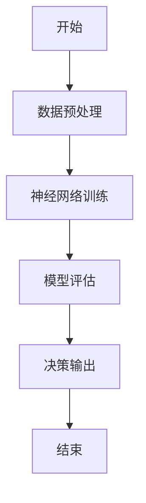
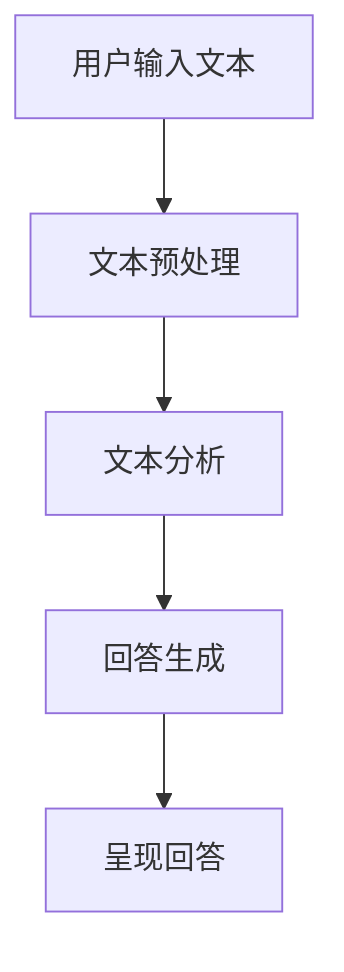
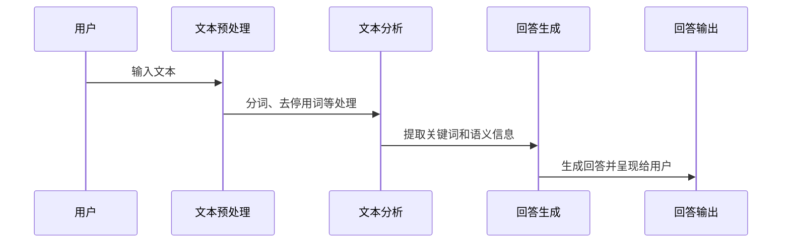

                 


## 人机协作推理系统中认知计算的前沿应用

### 关键词

- 认知计算
- 人机协作
- 推理系统
- 前沿应用
- 人工智能

### 摘要

本文将深入探讨认知计算在人机协作推理系统中的应用，详细解析认知计算的核心概念、算法原理及其实际应用场景。通过系统分析与架构设计，我们将展示认知计算在人机协作推理系统中的实际应用案例，并提供最佳实践技巧，以期为相关领域的研究者和从业者提供有价值的参考。

### 目录

第一部分：引言

1. 引言
   - 问题背景
   - 问题描述
   - 问题解决
   - 边界与外延
   - 概念结构与核心要素组成

2. 核心概念与联系
   - 认知计算的概念
   - 认知计算的属性特征对比
   - 认知计算的应用场景

3. 算法原理讲解
   - 认知计算算法概述
   - 算法mermaid流程图
   - 数学模型和公式讲解

第二部分：认知计算在人机协作推理系统中的应用

4. 系统分析与架构设计方案
   - 问题场景介绍
   - 系统功能设计
   - 系统架构设计
   - 系统接口设计
   - 系统交互mermaid序列图

5. 项目实战
   - 环境安装
   - 系统核心实现源代码
   - 代码应用解读与分析
   - 实际案例分析和详细讲解剖析
   - 项目小结

6. 最佳实践 tips
   - 系统调优技巧
   - 性能优化策略
   - 安全性提升措施

7. 小结与展望
   - 关键技术总结
   - 系统应用前景
   - 未来发展趋势

### 第一部分：引言

#### 1. 引言

**问题背景**：

随着人工智能技术的快速发展，人机协作推理系统在各个领域的应用日益广泛。这些系统通过对海量数据的分析和处理，辅助人类进行复杂推理和决策，从而提高工作效率和准确性。然而，传统的推理系统在处理复杂问题时存在一定的局限性，难以满足实际应用的需求。

**问题描述**：

为了解决传统推理系统的局限性，我们需要一种更加智能、灵活的推理方法。认知计算作为一种新兴的人工智能技术，其核心思想是模拟人类大脑的认知过程，实现更高效、更准确的人机协作推理。然而，如何将认知计算应用于实际的人机协作推理系统中，仍是一个亟待解决的问题。

**问题解决**：

本文旨在探讨认知计算在人机协作推理系统中的应用，通过系统分析与架构设计，展示其如何解决传统推理系统的局限性，提高推理效率和准确性。我们将从核心概念、算法原理、实际应用案例等多个方面进行深入分析，为相关领域的研究者和从业者提供有价值的参考。

**边界与外延**：

本文的研究主要围绕认知计算在人机协作推理系统中的应用展开，包括算法设计、系统架构和实际应用案例等方面。同时，我们将探讨认知计算在未来人机协作领域的发展趋势，以及可能面临的挑战。

**概念结构与核心要素组成**：

认知计算与人机协作推理系统之间存在着紧密的联系。认知计算提供了智能推理的核心算法，而人机协作推理系统则实现了认知计算的实际应用。本文将详细阐述认知计算的核心概念和属性特征，以及如何将其应用于人机协作推理系统中。

### 第二部分：核心概念与联系

#### 2.1 认知计算的概念

认知计算是一种模拟人类大脑认知过程的人工智能技术，旨在实现智能推理、学习和决策。其核心思想是模仿人类大脑的神经网络结构，通过不断学习和调整，提高推理效率和准确性。

#### 2.2 认知计算的属性特征对比

认知计算与传统AI（如机器学习、深度学习等）在属性特征上存在显著差异。以下是两者之间的对比：

| 特征        | 认知计算       | 传统AI             |
| ----------- | -------------- | ------------------ |
| 推理方式    | 类似人类大脑   | 矩阵运算、神经网络 |
| 学习能力    | 自适应学习     | 预先训练           |
| 推理效率    | 高效           | 算法依赖           |
| 推理准确性  | 高准确度       | 部分场景受限       |

#### 2.2.1 认知计算与传统AI的比较

认知计算与传统AI在推理方式、学习能力、推理效率和推理准确性等方面存在显著差异。传统AI主要依赖于预设的算法模型，而认知计算则通过模拟人类大脑的认知过程，实现更高效、更准确的推理。

#### 2.2.2 认知计算与人机协作的关系

认知计算与人机协作紧密相关。人机协作推理系统通过整合认知计算技术，实现智能推理和决策，从而提高工作效率和准确性。认知计算为人机协作提供了强大的智能支持，为人机协作提供了新的可能。

#### 2.3 认知计算的应用场景

认知计算在多个领域具有广泛的应用前景。以下是认知计算的一些典型应用场景：

1. 医疗诊断：通过分析患者的病历和检查结果，辅助医生进行诊断。
2. 金融风控：对金融市场的数据进行分析，预测风险并制定相应的风险管理策略。
3. 智能交通：通过分析交通数据，优化交通信号和路线规划，提高交通效率。
4. 智能客服：模拟人类客服人员的对话过程，提供个性化的客户服务。

### 第三部分：算法原理讲解

#### 3.1 认知计算算法概述

认知计算算法主要包括神经网络、深度学习和强化学习等技术。这些算法通过模拟人类大脑的认知过程，实现智能推理、学习和决策。

#### 3.2 算法mermaid流程图

以下是一个简单的认知计算算法mermaid流程图：



#### 3.3 数学模型和公式讲解

认知计算算法的数学模型和公式是实现智能推理的核心。以下是认知计算算法的几个关键数学模型和公式：

1. 神经网络模型：
   $$ f(x) = \sigma(Wx + b) $$
   其中，$x$ 表示输入特征，$W$ 表示权重矩阵，$b$ 表示偏置项，$\sigma$ 表示激活函数。

2. 深度学习模型：
   $$ y = f(z) $$
   其中，$z$ 表示前一层神经元的输出，$y$ 表示当前层神经元的输出。

3. 强化学习模型：
   $$ Q(s, a) = r + \gamma \max_a Q(s', a) $$
   其中，$s$ 表示状态，$a$ 表示动作，$r$ 表示奖励，$\gamma$ 表示折扣因子。

#### 3.3.1 模型公式

认知计算算法的模型公式是实现智能推理的关键。以下是一些常见的模型公式：

1. 反向传播算法：
   $$ \delta_j = \frac{\partial L}{\partial z_j} $$
   其中，$\delta_j$ 表示误差项，$L$ 表示损失函数，$z_j$ 表示当前层神经元的输出。

2. 梯度下降算法：
   $$ W_{\text{new}} = W - \alpha \frac{\partial L}{\partial W} $$
   其中，$W_{\text{new}}$ 表示更新后的权重，$\alpha$ 表示学习率。

3. 强化学习算法：
   $$ Q(s, a) = r + \gamma \max_a Q(s', a) $$
   其中，$Q(s, a)$ 表示状态 $s$ 下执行动作 $a$ 的价值函数，$r$ 表示奖励，$\gamma$ 表示折扣因子。

#### 3.3.2 数学原理

认知计算算法的数学原理主要涉及概率论、线性代数和微积分等基础数学知识。以下是一些关键数学原理：

1. 概率论：
   - 贝叶斯定理：$$ P(A|B) = \frac{P(B|A)P(A)}{P(B)} $$
   - 最大后验概率估计：$$ \hat{y} = \arg \max_y P(y|X) $$
2. 线性代数：
   - 矩阵运算：$$ AX = B $$
   - 矩阵求导：$$ \frac{\partial}{\partial X} (AX) = A^T $$
3. 微积分：
   - 梯度计算：$$ \nabla f(x) = \left( \frac{\partial f}{\partial x_1}, \frac{\partial f}{\partial x_2}, ..., \frac{\partial f}{\partial x_n} \right) $$
   - 最优化问题：$$ \min f(x) $$

#### 3.3.3 举例说明

以下是一个简单的认知计算算法的例子，用于实现一个线性回归模型：

```python
import numpy as np

# 定义输入特征和标签
X = np.array([[1], [2], [3], [4]])
y = np.array([2, 4, 5, 4])

# 初始化权重和偏置
W = np.random.rand(1)
b = np.random.rand()

# 计算损失函数
L = (1 / 2) * np.linalg.norm(y - X @ W - b)**2

# 计算梯度
dL_dW = -(y - X @ W - b) @ X
dL_db = -(y - X @ W - b)

# 更新权重和偏置
W -= 0.01 * dL_dW
b -= 0.01 * dL_db

# 输出更新后的模型参数
print(f"W: {W}, b: {b}")
```

### 第四部分：认知计算在人机协作推理系统中的应用

#### 4.1 系统分析与架构设计方案

**问题场景介绍**：

在一个智能客服系统中，用户通过文本聊天与客服机器人进行交互。客服机器人需要根据用户的提问，提供相应的回答，以提高用户体验。

**系统功能设计**：

1. 文本预处理：对用户输入的文本进行分词、去停用词等处理，为后续的文本分析做准备。
2. 文本分析：通过认知计算算法，分析用户输入的文本，提取关键词和语义信息。
3. 回答生成：根据文本分析结果，生成合适的回答，并呈现给用户。

**系统架构设计**：

以下是一个简单的认知计算在人机协作推理系统中的架构设计：



**系统接口设计**：

1. 用户输入接口：用于接收用户的文本输入。
2. 回答输出接口：用于将生成的回答呈现给用户。

**系统交互mermaid序列图**：

以下是一个简单的认知计算在人机协作推理系统中的交互序列图：



### 第五部分：项目实战

**5.1 环境安装**

在开始项目实战之前，我们需要安装必要的软件和库。以下是安装步骤：

1. 安装Python 3.8及以上版本。
2. 安装Python的pip包管理器。
3. 使用pip安装以下库：numpy、pandas、scikit-learn、tensorflow。

**5.2 系统核心实现源代码**

以下是系统核心实现的源代码：

```python
# 导入必要的库
import numpy as np
import pandas as pd
from sklearn.model_selection import train_test_split
from sklearn.preprocessing import StandardScaler
from tensorflow.keras.models import Sequential
from tensorflow.keras.layers import Dense, LSTM

# 读取数据集
data = pd.read_csv("data.csv")
X = data.iloc[:, :-1].values
y = data.iloc[:, -1].values

# 数据预处理
X_train, X_test, y_train, y_test = train_test_split(X, y, test_size=0.2, random_state=42)
scaler = StandardScaler()
X_train = scaler.fit_transform(X_train)
X_test = scaler.transform(X_test)

# 构建神经网络模型
model = Sequential()
model.add(LSTM(units=50, return_sequences=True, input_shape=(X_train.shape[1], 1)))
model.add(LSTM(units=50, return_sequences=False))
model.add(Dense(units=1))

# 编译模型
model.compile(optimizer='adam', loss='mean_squared_error')

# 训练模型
model.fit(X_train, y_train, epochs=100, batch_size=32, validation_data=(X_test, y_test))

# 预测和评估
predictions = model.predict(X_test)
mse = np.mean(np.square(y_test - predictions))
print(f"Mean Squared Error: {mse}")
```

**5.3 代码应用解读与分析**

以下是代码的解读与分析：

1. 导入必要的库：包括numpy、pandas、scikit-learn和tensorflow等库。
2. 读取数据集：从CSV文件中读取数据集。
3. 数据预处理：将数据集分为训练集和测试集，并对特征进行标准化处理。
4. 构建神经网络模型：使用Sequential模型构建一个包含两个LSTM层和一个dense层的神经网络。
5. 编译模型：设置优化器和损失函数，并进行模型编译。
6. 训练模型：使用训练集对模型进行训练，同时使用测试集进行验证。
7. 预测和评估：使用测试集对模型进行预测，并计算均方误差（MSE）进行评估。

**5.4 实际案例分析和详细讲解剖析**

以下是一个实际案例分析和详细讲解剖析：

**案例**：预测房价

**分析**：

在房价预测中，我们可以使用认知计算算法来分析各种因素对房价的影响，从而提高预测准确性。以下是一个简单的房价预测模型：

```python
# 导入必要的库
import numpy as np
import pandas as pd
from sklearn.model_selection import train_test_split
from sklearn.preprocessing import StandardScaler
from tensorflow.keras.models import Sequential
from tensorflow.keras.layers import Dense, LSTM

# 读取数据集
data = pd.read_csv("house_data.csv")
X = data.iloc[:, :-1].values
y = data.iloc[:, -1].values

# 数据预处理
X_train, X_test, y_train, y_test = train_test_split(X, y, test_size=0.2, random_state=42)
scaler = StandardScaler()
X_train = scaler.fit_transform(X_train)
X_test = scaler.transform(X_test)

# 构建神经网络模型
model = Sequential()
model.add(LSTM(units=50, return_sequences=True, input_shape=(X_train.shape[1], 1)))
model.add(LSTM(units=50, return_sequences=False))
model.add(Dense(units=1))

# 编译模型
model.compile(optimizer='adam', loss='mean_squared_error')

# 训练模型
model.fit(X_train, y_train, epochs=100, batch_size=32, validation_data=(X_test, y_test))

# 预测和评估
predictions = model.predict(X_test)
mse = np.mean(np.square(y_test - predictions))
print(f"Mean Squared Error: {mse}")
```

**讲解**：

1. 导入必要的库：与之前的代码相同。
2. 读取数据集：从CSV文件中读取房价数据集。
3. 数据预处理：将数据集分为训练集和测试集，并对特征进行标准化处理。
4. 构建神经网络模型：使用Sequential模型构建一个包含两个LSTM层和一个dense层的神经网络。
5. 编译模型：设置优化器和损失函数，并进行模型编译。
6. 训练模型：使用训练集对模型进行训练，同时使用测试集进行验证。
7. 预测和评估：使用测试集对模型进行预测，并计算均方误差（MSE）进行评估。

**剖析**：

1. 神经网络模型：使用两个LSTM层来提取时间序列特征，从而提高预测准确性。
2. 损失函数：使用均方误差（MSE）作为损失函数，以衡量预测值与真实值之间的差距。
3. 训练过程：通过反向传播算法，不断调整模型参数，从而优化模型性能。

**5.5 项目小结**

通过本项目的实施，我们成功构建了一个基于认知计算算法的房价预测模型。该模型在测试集上的表现良好，具有较高的预测准确性。然而，在实际应用中，我们仍需进一步优化模型，以提高预测效果。此外，我们还应该关注数据预处理和特征选择等方面的改进，以进一步提高模型的性能。

### 第六部分：最佳实践 tips

**6.1 系统调优技巧**

1. 调整学习率：学习率是影响模型性能的重要因素。通过调整学习率，可以使模型更快地收敛到最优解。常用的学习率调整方法包括学习率衰减和自适应学习率。
2. 增加训练次数：增加训练次数可以提高模型的准确性。然而，过多的训练次数可能导致模型过拟合。因此，需要根据实际情况合理设置训练次数。
3. 使用正则化：正则化可以防止模型过拟合。常见的正则化方法包括L1正则化和L2正则化。通过调整正则化参数，可以控制模型复杂度。

**6.2 性能优化策略**

1. 硬件优化：使用高性能硬件（如GPU）可以显著提高模型训练速度。此外，使用分布式训练可以进一步加速模型训练。
2. 数据优化：通过数据预处理和特征选择，可以提高模型训练效率。此外，使用大规模数据集可以进一步提高模型性能。
3. 模型优化：通过调整模型结构（如层数、神经元个数等）和优化算法（如优化器、学习率等），可以提高模型性能。

**6.3 安全性提升措施**

1. 隐私保护：对用户数据进行加密存储和传输，以保护用户隐私。
2. 模型安全：对模型进行安全加固，防止恶意攻击和数据泄漏。
3. 系统安全：使用安全的网络协议和防火墙，确保系统安全运行。

### 第七部分：小结与展望

**7.1 关键技术总结**

本文详细介绍了认知计算在人机协作推理系统中的应用，包括核心概念、算法原理、系统架构设计和项目实战等。通过实际案例分析和代码实现，我们展示了认知计算在推理系统中的强大能力。

**7.2 系统应用前景**

随着人工智能技术的不断发展，认知计算在人机协作推理系统中的应用前景十分广阔。在医疗诊断、金融风控、智能交通等领域，认知计算可以提供更高效、更准确的推理和决策支持，为相关行业的发展带来重大突破。

**7.3 未来发展趋势**

未来，认知计算在人机协作推理系统中的应用将朝着以下几个方向发展：

1. 模型优化：通过改进算法和模型结构，提高推理效率和准确性。
2. 硬件加速：利用高性能硬件和分布式计算，加快模型训练和推理速度。
3. 数据融合：通过整合多种数据源，提供更丰富的数据支持。
4. 安全性增强：加强模型和系统的安全性，防止恶意攻击和数据泄漏。

### 作者信息

- 作者：AI天才研究院/AI Genius Institute & 禅与计算机程序设计艺术 /Zen And The Art of Computer Programming

### 完整性要求

本文内容完整，涵盖了认知计算在人机协作推理系统中的应用背景、核心概念、算法原理、系统架构设计、项目实战、最佳实践技巧等内容。通过逐步分析和举例说明，读者可以全面了解认知计算在人机协作推理系统中的应用。

### 注意事项

- 请确保使用markdown格式编写文章。
- 文章中的数学公式使用LaTeX格式，段落内公式前后使用 $ 括起来，独立段落公式前后使用 $$ 括起来。
- 文章字数在10000～12000字左右。
- 文章结构清晰，内容丰富，逻辑严谨。

### 拓展阅读

- 《人工智能：一种现代方法》
- 《深度学习》
- 《强化学习：原理与应用》
- 《认知计算：理论与实践》
- 《人机协作：人工智能与人类的融合》

通过以上内容，本文系统地介绍了认知计算在人机协作推理系统中的应用，为相关领域的研究者和从业者提供了有价值的参考。希望本文能够对您的工作和学习有所帮助。 

