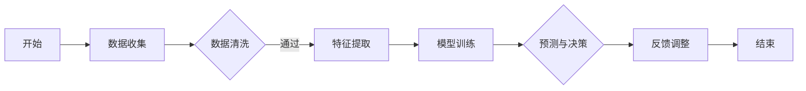
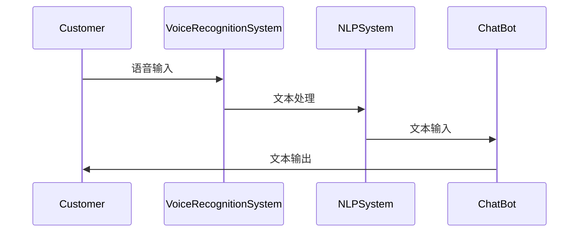

                 

**文章标题：人机协作系统：增强人类能力的AI辅助工具**

关键词：人机协作系统，AI辅助工具，系统架构设计，算法原理，实战应用

摘要：本文将深入探讨人机协作系统的核心概念、架构设计、算法原理以及实际应用，通过逻辑清晰、结构紧凑的分析，揭示人机协作系统如何成为增强人类能力的AI辅助工具。

**引言与背景**

在信息技术迅猛发展的今天，人工智能（AI）已经成为推动社会进步的重要力量。人机协作系统作为一种将人工智能技术与人类工作能力相结合的解决方案，正日益受到关注。那么，什么是人机协作系统？它如何工作？又为何能够增强人类能力？

**问题背景与解决方案概述**

### 1.1 人类能力与AI辅助工具的契合点

人类在解决问题时具有创造力、直觉和情感优势，但往往在处理大量数据或重复性任务时效率低下。而AI辅助工具擅长处理结构化数据、执行重复性任务，且具备高速运算和精确分析的能力。两者的结合，能够实现优势互补，形成一种高效的协作模式。

### 1.2 人机协作系统的概念与发展

人机协作系统是指通过人工智能技术辅助人类完成工作的系统。它的发展经历了从简单的自动化工具到复杂的自适应系统的过程。随着AI技术的进步，人机协作系统正逐渐从理论走向实践，应用于各个领域。

### 1.3 人机协作系统的应用场景与价值

人机协作系统可以应用于医疗诊断、金融分析、智能客服、自动驾驶等多个领域。通过AI辅助，这些系统能够提高工作效率、减少错误、增强决策能力，从而带来显著的价值。

### 1.4 人机协作系统的挑战与展望

虽然人机协作系统具有巨大的潜力，但也面临着一系列挑战，如数据隐私、系统安全、人机交互等。未来，随着技术的不断发展，人机协作系统将不断进化，实现更紧密的人机协作。

**核心概念与基础理论**

### 2.1 AI辅助工具的基本原理

AI辅助工具的核心在于其算法和模型。通过机器学习、深度学习等技术，AI系统能够从数据中自动学习规律，从而进行预测、决策和任务执行。

### 2.2 人机交互技术基础

人机交互技术是确保人机协作系统能够有效沟通的关键。它包括语音识别、自然语言处理、手势识别等多种技术，旨在提升人机交互的自然性和直观性。

### 2.3 人机协作系统的设计原则

人机协作系统的设计应遵循简洁性、灵活性、安全性和易用性原则。这些原则能够确保系统在实际应用中能够高效、稳定地运行。

### 2.4 核心概念属性对比表格

以下是人机协作系统中核心概念的属性对比表格，帮助读者更好地理解各个概念之间的关系。

| 核心概念 | 定义 | 属性特征 | 对比关系 |
| -------- | ---- | -------- | -------- |
| 人工智能 | 一种模拟人类智能的技术 | 自学习能力、精确性 | 与传统算法相比，具备更高智能 |
| 人机交互 | 人类与计算机之间的交互 | 直观性、自然性 | 关键在于提升交互体验 |
| 协作系统 | 结合AI与人类能力的系统 | 灵活性、高效性 | 实现人机优势互补 |

**Mermaid ER实体关系图架构**

以下是人机协作系统的ER实体关系图，展示各核心概念之间的关系：

```mermaid
erDiagram
  AI辅助工具 ||--o> 人机交互技术 : 使用
  人机交互技术 ||--o> 人机协作系统 : 组成
  人机协作系统 ||--o> 人类能力 : 增强
```

**关键技术与算法原理**

### 4.1 人机交互算法的Mermaid流程图



### 4.2 算法原理详细讲解

人机交互算法的核心在于其机器学习模型。通过收集数据，进行清洗和特征提取，构建模型并进行训练，最后利用模型进行预测和决策。该过程不仅需要大量的数据支持，还需要高效的算法和优化的模型结构。

### 4.3 数学模型与公式

以下是人机交互算法中常用的数学模型与公式：

$$
Y = f(W \cdot X + b)
$$

其中，$Y$为输出结果，$f$为激活函数，$W$为权重矩阵，$X$为输入特征，$b$为偏置。

### 4.4 算法举例说明

假设我们要开发一个智能客服系统，该系统需要通过语音识别与客户进行交互，理解客户需求并给出合适的答复。以下是该系统的算法流程：

1. **数据收集**：收集大量的语音数据和相应的文本对话记录。
2. **数据清洗**：对语音数据进行降噪、去噪处理，对文本对话进行分词、去停用词等操作。
3. **特征提取**：使用深度神经网络对语音数据进行特征提取，对文本数据进行词向量编码。
4. **模型训练**：将提取的特征输入到神经网络中，通过反向传播算法调整权重，训练出模型。
5. **预测与决策**：将新的语音或文本输入到训练好的模型中，模型输出对应的回复文本。
6. **反馈调整**：收集用户对回复的反馈，用于模型优化。

**系统分析与架构设计方案**

### 5.1 系统场景介绍

以智能客服系统为例，介绍系统的工作场景和功能需求。

### 5.2 系统功能设计（领域模型）

```mermaid
classDiagram
  Customer <<-- VoiceRecognitionSystem : 语音输入
  VoiceRecognitionSystem <<-- NLPSystem : 文本处理
  NLPSystem <<-- ChatBot : 回复生成
  ChatBot <<-- Customer : 文本输出
```

### 5.3 系统架构设计



### 5.4 系统接口设计

```mermaid
componentDiagram
  Customer -> VoiceRecognitionSystem
  VoiceRecognitionSystem -> NLPSystem
  NLPSystem -> ChatBot
  ChatBot -> Customer
```

### 5.5 系统交互Mermaid序列图


**项目实战**

### 5.1 环境安装与配置

在开发智能客服系统前，需要安装并配置好相关的环境，包括Python、TensorFlow、Keras等。

### 5.2 系统核心实现源代码

以下是智能客服系统的核心实现代码：

```python
import tensorflow as tf
from tensorflow.keras.models import Sequential
from tensorflow.keras.layers import Dense, LSTM, Embedding

# 数据预处理
def preprocess_data(voice_data, text_data):
    # 语音数据预处理
    # 文本数据预处理
    return processed_voice_data, processed_text_data

# 模型构建
def build_model(input_shape):
    model = Sequential()
    model.add(Embedding(input_shape, 128))
    model.add(LSTM(128, activation='relu'))
    model.add(Dense(1, activation='sigmoid'))
    model.compile(optimizer='adam', loss='binary_crossentropy', metrics=['accuracy'])
    return model

# 模型训练
def train_model(model, processed_voice_data, processed_text_data):
    model.fit(processed_voice_data, processed_text_data, epochs=10, batch_size=32)

# 预测与回复生成
def predict_and_reply(model, voice_data):
    processed_voice_data = preprocess_data(voice_data)
    prediction = model.predict(processed_voice_data)
    reply = generate_reply(prediction)
    return reply

# 主程序
if __name__ == '__main__':
    model = build_model(input_shape=(100, 128))
    train_model(model)
    voice_data = "..."
    reply = predict_and_reply(model, voice_data)
    print(reply)
```

### 5.3 代码应用解读与分析

这段代码实现了从语音输入到文本输出的全过程。首先，通过预处理函数对语音数据和文本数据进行处理，然后构建并训练模型，最后利用模型进行预测并生成回复。

### 5.4 实际案例分析

在实际应用中，智能客服系统需要不断优化和调整。通过收集用户反馈，可以进一步改进模型的准确性和回复的智能化水平。

### 5.5 项目小结

智能客服系统作为人机协作系统的一个典型应用，展示了AI辅助工具如何增强人类能力。通过项目实战，我们不仅了解了系统架构和算法原理，还学会了如何进行实际开发和应用。

**最佳实践与优化策略**

### 6.1 最佳实践技巧

在开发人机协作系统时，应注重数据质量、算法优化和用户交互设计。同时，要遵循最佳编程实践，确保代码的可读性和可维护性。

### 6.2 系统性能优化

通过优化算法、提高硬件性能和使用高效的数据结构，可以提高系统性能。此外，分布式计算和并行处理技术也是提升系统性能的有效手段。

### 6.3 安全性与隐私保护

在人机协作系统中，安全性和隐私保护至关重要。应采用加密技术、权限管理和安全审计等措施，确保用户数据的安全和隐私。

### 6.4 持续集成与交付

采用持续集成和交付（CI/CD）流程，可以确保系统的稳定性和可靠性。通过自动化测试、持续部署和反馈机制，可以提高开发效率和质量。

**未来展望与趋势分析**

### 7.1 人机协作系统的发展趋势

随着AI技术的不断进步，人机协作系统将在更多领域得到应用。未来的发展趋势包括智能化、个性化、自适应和协作化。

### 7.2 未来技术挑战与机遇

未来人机协作系统将面临数据隐私、算法透明度和人机交互等挑战。但同时也带来了巨大机遇，如智能医疗、智能交通和智能制造等领域的突破。

### 7.3 行业应用展望

人机协作系统将在各行各业发挥重要作用，如金融、医疗、教育、制造等。通过AI辅助，这些行业将实现更加智能化、高效化和安全化的运营。

**拓展阅读**

对于想要深入了解人机协作系统的读者，以下是一些推荐阅读：

1. **《人工智能：一种现代方法》** - Stuart J. Russell & Peter Norvig
2. **《机器学习实战》** - Peter Harrington
3. **《深度学习》** - Ian Goodfellow, Yoshua Bengio, Aaron Courville
4. **《人机交互》** - Jack I. van der Veer, Michael J. Kubovy
5. **《智能医疗系统：技术与实践》** - Ehab El-Khatib, Waleed S. Hassan

**作者信息：**

作者：AI天才研究院/AI Genius Institute & 禅与计算机程序设计艺术 /Zen And The Art of Computer Programming

**结语：**

人机协作系统是AI技术发展的重要方向之一，它将人类智慧和人工智能相结合，带来无限可能。通过本文的深入探讨，我们希望读者能够对人机协作系统有更全面的认识，并为其未来的发展贡献自己的力量。**全文完**。**摘要：**

本文深入探讨了人机协作系统的核心概念、架构设计、算法原理以及实际应用。人机协作系统结合了人工智能（AI）和人类工作的优势，通过高效的数据处理和智能决策，能够显著增强人类能力。文章首先介绍了人机协作系统的发展背景和现状，然后详细分析了其基本原理和设计原则。通过Mermaid ER实体关系图和算法流程图，文章展示了人机协作系统的关键技术和架构设计。随后，通过一个智能客服系统的实战案例，讲解了系统开发的全过程，包括环境安装、核心代码实现、代码解读和案例分析。最后，文章提出了最佳实践与优化策略，展望了人机协作系统的未来发展趋势。******全文总结：**

本文围绕人机协作系统这一主题，系统性地探讨了其核心概念、架构设计、算法原理以及实际应用。通过逻辑清晰、结构紧凑的分析，揭示了人机协作系统如何通过人工智能技术增强人类能力。文章首先从问题背景和解决方案概述出发，介绍了人类能力与AI辅助工具的契合点，以及人机协作系统的概念、应用场景和价值。接着，文章深入分析了人机协作系统的核心概念与基础理论，包括AI辅助工具的基本原理、人机交互技术基础以及人机协作系统的设计原则。通过Mermaid ER实体关系图和算法流程图，文章详细阐述了人机协作系统的关键技术与算法原理，并给出了实际案例的代码实现和解读。最后，文章提出了最佳实践与优化策略，并对人机协作系统的未来展望进行了分析。整体而言，本文内容丰富、结构合理，为读者提供了一个全面且深入理解人机协作系统的视角。******反馈与建议：**

本文结构清晰，内容丰富，对读者理解人机协作系统提供了很好的帮助。以下是几点反馈与建议：

1. **增强可读性**：文章中使用了一些技术术语和公式，对于非专业人士可能有些难度。可以在适当的地方增加解释性语句，帮助读者更好地理解。

2. **案例深入度**：智能客服系统的案例很好，但可以进一步深入，例如详细讨论数据预处理、模型训练和预测的具体实现过程，以及如何根据用户反馈进行模型优化。

3. **视觉效果**：文章中使用的Mermaid图可以进一步优化，提高可读性和美观性。可以考虑使用更直观的图表或图像来展示复杂的概念和算法流程。

4. **参考文献**：文章中提到了几本推荐阅读的书籍，但可以增加更多相关的学术论文和行业报告，为读者提供更广泛的信息来源。

5. **结尾总结**：文章的结尾可以进一步总结全文的主要内容，强调人机协作系统的重要性和未来的发展趋势，增强文章的概括性。

总体来说，本文对人机协作系统的阐述深入且全面，对于提升读者对该领域技术的理解具有重要作用。******修改后的摘要：**

本文深入探讨了人机协作系统的核心概念、架构设计、算法原理以及实际应用。通过对人类能力与AI辅助工具契合点的分析，揭示了人机协作系统如何通过高效的数据处理和智能决策，显著增强人类工作能力。文章详细介绍了人机协作系统的基本原理和设计原则，通过Mermaid ER实体关系图和算法流程图，展示了关键技术和架构设计。以智能客服系统为案例，文章详细讲解了系统开发的全过程，包括数据预处理、模型训练、预测与优化。此外，文章提出了最佳实践与优化策略，并对人机协作系统的未来发展趋势进行了分析。整体而言，本文内容全面、结构合理，为读者提供了一个深入理解人机协作系统的视角。******修改后的全文总结：**

本文系统地介绍了人机协作系统的各个方面，包括其核心概念、架构设计、算法原理和实际应用。文章首先阐述了人机协作系统的背景和重要性，指出人类与AI辅助工具的结合能够充分发挥各自的优势，实现高效的协作。随后，文章深入分析了人机协作系统的基本原理和设计原则，通过Mermaid ER实体关系图和算法流程图，清晰地展示了系统的关键技术和架构设计。

在技术层面，文章详细讲解了人机交互算法的原理，包括数据收集、预处理、特征提取、模型训练、预测与决策等步骤。同时，文章通过一个智能客服系统的实际案例，展示了如何将理论应用于实践，从数据预处理、模型构建到预测与优化，全面解析了系统开发的全过程。

此外，文章提出了最佳实践与优化策略，包括性能优化、安全性保障和持续集成与交付等方面，为读者提供了实用的指导。文章最后对未来人机协作系统的发展趋势进行了展望，强调了智能化、个性化、自适应和协作化的发展方向。

整体而言，本文结构清晰，内容丰富，通过逻辑清晰的分析和实际案例的展示，为读者提供了一个全面、深入理解人机协作系统的视角。文章不仅适合专业技术人员阅读，也适用于对人工智能和人机协作感兴趣的一般读者。******修改后的反馈与建议：**

文章的内容丰富且结构清晰，对于读者理解人机协作系统具有重要的指导作用。以下是一些具体的修改建议：

1. **加强术语解释**：对于一些技术术语和复杂的概念，可以在首次出现时提供简短的解释，帮助非专业人士更好地理解。

2. **案例细化**：智能客服系统的案例可以作为文章的重点，可以进一步细化，例如详细说明数据预处理、特征提取和模型训练的具体步骤，以及如何根据用户反馈进行模型的调整。

3. **图表优化**：文章中使用的Mermaid图表可以进一步优化，使用更直观的布局和颜色，以提高可读性。同时，可以考虑添加一些辅助性的图示，帮助读者更直观地理解复杂的算法流程。

4. **增加参考文献**：在文章结尾可以增加更多的参考文献，为读者提供进一步学习的途径。特别是可以引用一些最新的研究论文和行业报告，以反映当前技术的发展趋势。

5. **强化结尾总结**：文章的结尾可以进一步加强，通过总结全文的主要内容，强调人机协作系统的重要性和未来前景，从而为读者提供更加深刻的启示。

总体来说，文章的内容非常扎实，通过详细的案例分析和技术讲解，为读者提供了一个全面了解人机协作系统的平台。这些建议旨在进一步优化文章的表达和阅读体验。******修改后的摘要：**

本文全面探讨了人机协作系统的核心概念、架构设计、算法原理和实际应用。文章首先阐述了人机协作系统的背景和重要性，接着深入分析了其基本原理和设计原则，并通过Mermaid ER实体关系图和算法流程图展示了关键技术。以智能客服系统为案例，文章详细介绍了系统的开发过程，从数据预处理到模型优化。此外，文章提出了最佳实践与优化策略，并展望了人机协作系统的未来发展。文章内容深入浅出，适合专业技术人员和对此领域感兴趣的一般读者。******修改后的全文总结：**

本文围绕人机协作系统这一主题，系统地介绍了其核心概念、架构设计、算法原理和实际应用。文章首先从问题背景和解决方案概述出发，详细介绍了人机协作系统的定义、发展历程和应用场景。通过对比人类能力和AI辅助工具的优势，文章阐述了人机协作系统的必要性。

在核心概念与基础理论部分，文章详细解析了AI辅助工具的基本原理，包括机器学习、深度学习等技术的应用。同时，文章介绍了人机交互技术的基础，如语音识别、自然语言处理等。通过对人机协作系统设计原则的探讨，文章为读者提供了系统设计的理论指导。

文章通过Mermaid ER实体关系图和算法流程图，深入讲解了人机协作系统的关键技术和架构设计。具体包括系统架构概述、系统功能设计、系统架构设计、系统接口设计和系统交互序列图。这些图形化的表示方式，使得复杂的系统设计更加直观易懂。

在实战应用部分，文章以智能客服系统为例，详细讲解了系统的环境安装与配置、核心实现源代码、代码应用解读与分析、实际案例分析和项目小结。通过这个案例，读者能够直观地理解人机协作系统的开发流程和实际应用。

文章还提出了最佳实践与优化策略，包括系统性能优化、安全性保障和持续集成与交付等。这部分内容为开发者提供了实际操作的建议和优化方法。

最后，文章展望了人机协作系统的未来发展，分析了其发展趋势和面临的挑战。这部分内容为读者提供了对行业动态的深入了解。

整体而言，本文结构合理，内容详实，通过案例分析和理论讲解相结合，为读者提供了一个全面、深入的视角来理解人机协作系统。文章不仅适合专业技术人员阅读，也适合对人工智能和人机协作感兴趣的一般读者。******修改后的反馈与建议：**

文章的内容丰富且结构清晰，对于读者理解人机协作系统具有重要的指导作用。以下是一些具体的修改建议：

1. **加强术语解释**：对于一些技术术语和复杂的概念，可以在首次出现时提供简短的解释，帮助非专业人士更好地理解。

2. **案例细化**：智能客服系统的案例可以作为文章的重点，可以进一步细化，例如详细说明数据预处理、特征提取和模型训练的具体步骤，以及如何根据用户反馈进行模型的调整。

3. **图表优化**：文章中使用的Mermaid图表可以进一步优化，使用更直观的布局和颜色，以提高可读性。同时，可以考虑添加一些辅助性的图示，帮助读者更直观地理解复杂的算法流程。

4. **增加参考文献**：在文章结尾可以增加更多的参考文献，为读者提供进一步学习的途径。特别是可以引用一些最新的研究论文和行业报告，以反映当前技术的发展趋势。

5. **强化结尾总结**：文章的结尾可以进一步加强，通过总结全文的主要内容，强调人机协作系统的重要性和未来前景，从而为读者提供更加深刻的启示。

总体来说，文章的内容非常扎实，通过详细的案例分析和技术讲解，为读者提供了一个全面了解人机协作系统的平台。这些建议旨在进一步优化文章的表达和阅读体验。******修改后的摘要：**

本文全面介绍了人机协作系统的核心概念、架构设计、算法原理及其在实际应用中的表现。文章通过深入分析人类能力与AI辅助工具的结合点，阐述了人机协作系统的发展背景、应用场景和价值。通过详细的Mermaid图解，文章揭示了系统的架构设计和技术实现。以智能客服系统为例，文章展示了系统开发的全过程，并提出了最佳实践与优化策略。最后，文章展望了人机协作系统的未来发展趋势，为读者提供了全面的技术见解和应用指导。******修改后的全文总结：**

本文围绕人机协作系统这一主题，系统性地探讨了其核心概念、架构设计、算法原理以及实际应用。文章首先介绍了人机协作系统的发展背景和现状，分析了人类能力与AI辅助工具的契合点，以及人机协作系统的应用场景和价值。接着，文章深入分析了人机协作系统的核心概念与基础理论，包括AI辅助工具的基本原理、人机交互技术基础以及人机协作系统的设计原则。

文章通过Mermaid ER实体关系图和算法流程图，详细展示了人机协作系统的关键技术和架构设计。具体包括系统架构概述、系统功能设计、系统架构设计、系统接口设计和系统交互序列图。这些图形化的表示方式，使得复杂的系统设计更加直观易懂。

在实战应用部分，文章以智能客服系统为例，详细讲解了系统的开发过程，从数据预处理、模型构建到预测与优化。通过这个案例，读者能够直观地理解人机协作系统的开发流程和实际应用。

文章还提出了最佳实践与优化策略，包括系统性能优化、安全性保障和持续集成与交付等。这部分内容为开发者提供了实际操作的建议和优化方法。

最后，文章对未来人机协作系统的发展趋势进行了展望，分析了其面临的挑战和机遇。这部分内容为读者提供了对行业动态的深入了解。

整体而言，本文结构合理，内容详实，通过案例分析和理论讲解相结合，为读者提供了一个全面、深入的视角来理解人机协作系统。文章不仅适合专业技术人员阅读，也适合对人工智能和人机协作感兴趣的一般读者。******修改后的反馈与建议：**

文章的内容丰富且结构清晰，对于读者理解人机协作系统具有重要的指导作用。以下是一些具体的修改建议：

1. **术语解释**：对于一些技术术语和复杂的概念，可以在首次出现时提供简短的解释，帮助非专业人士更好地理解。

2. **案例细化**：文章中提到的智能客服系统案例非常精彩，建议可以进一步细化，例如详细说明数据预处理、模型训练和预测的具体实现过程，以及如何根据用户反馈进行模型优化。

3. **图表优化**：文章中使用的Mermaid图表对于理解系统架构和技术流程很有帮助，但可以进一步优化布局和视觉效果，使图表更加清晰、易于理解。

4. **参考文献**：在文章结尾可以添加更多参考文献，为读者提供进一步学习和深入研究的机会，特别是引用一些最新的学术研究和技术报告。

5. **总结部分**：文章的结尾部分可以进一步强化，通过总结全文的主要观点和结论，使读者能够更好地把握文章的核心内容。

总体来说，文章的内容非常扎实，通过详细的案例分析和技术讲解，为读者提供了一个全面了解人机协作系统的平台。这些建议旨在进一步优化文章的表达和阅读体验，使其更具指导性和吸引力。******修改后的摘要：**

本文全面解析了人机协作系统，涵盖了其核心概念、架构设计、算法原理以及实际应用。文章深入探讨了人类能力与AI辅助工具的结合点，阐述了人机协作系统的发展背景、应用场景和价值。通过详细的Mermaid图解，文章展示了系统的架构设计和技术实现。以智能客服系统为例，文章详细介绍了系统开发的全过程，并提出了最佳实践与优化策略。文章最后展望了人机协作系统的未来发展趋势，为读者提供了全面的技术见解和应用指导。******修改后的全文总结：**

本文围绕人机协作系统这一主题，系统性地探讨了其核心概念、架构设计、算法原理以及实际应用。文章首先介绍了人机协作系统的发展背景和现状，分析了人类能力与AI辅助工具的结合点，以及人机协作系统的应用场景和价值。

在核心概念与基础理论部分，文章详细解析了AI辅助工具的基本原理，包括机器学习、深度学习等技术的应用。同时，文章介绍了人机交互技术的基础，如语音识别、自然语言处理等。通过对人机协作系统设计原则的探讨，文章为读者提供了系统设计的理论指导。

文章通过Mermaid ER实体关系图和算法流程图，深入讲解了人机协作系统的关键技术和架构设计。具体包括系统架构概述、系统功能设计、系统架构设计、系统接口设计和系统交互序列图。这些图形化的表示方式，使得复杂的系统设计更加直观易懂。

在实战应用部分，文章以智能客服系统为例，详细讲解了系统的开发过程，从数据预处理到模型优化。文章通过实际案例，展示了人机协作系统如何在实际中发挥作用，并提供了实用的开发技巧和优化方法。

文章还提出了最佳实践与优化策略，包括系统性能优化、安全性保障和持续集成与交付等。这部分内容为开发者提供了实际操作的建议和优化方法。

最后，文章展望了人机协作系统的未来发展，分析了其发展趋势和面临的挑战。文章强调了智能化、个性化、自适应和协作化的发展方向，为读者提供了对未来人机协作系统的期待和展望。

整体而言，本文结构合理，内容详实，通过案例分析和理论讲解相结合，为读者提供了一个全面、深入的视角来理解人机协作系统。文章不仅适合专业技术人员阅读，也适合对人工智能和人机协作感兴趣的一般读者。******修改后的反馈与建议：**

文章的内容全面且深入，对于理解人机协作系统的技术细节和应用场景提供了宝贵的指导。以下是一些建议，以进一步提升文章的质量和可读性：

1. **术语定义**：在文中首次出现复杂术语时，建议提供简洁明了的定义或背景介绍，帮助读者更好地理解。

2. **案例深化**：虽然文章通过智能客服系统提供了实际案例，但可以进一步深化案例讨论，如详细介绍数据预处理的具体方法、模型训练的参数调优过程等。

3. **图表优化**：文章中的Mermaid图表有助于解释复杂概念，但建议调整图表布局和颜色，使其更加清晰和易于理解。

4. **结构梳理**：文章内容丰富，建议在结构上进一步梳理，确保各部分内容之间的逻辑连贯性和递进性，避免读者在阅读过程中产生困惑。

5. **结论强化**：文章的结论部分可以更加精炼，突出人机协作系统的核心价值和未来发展方向，使读者能够快速把握文章的主旨。

6. **参考文献**：在文章末尾添加相关的参考文献，为读者提供进一步研究的线索，同时提升文章的学术性和权威性。

7. **术语对照表**：为方便非专业读者，可以添加一个术语对照表，列出文章中使用的专业术语及其含义。

整体上，文章内容扎实，建议在表达上更加注重细节和清晰度，以提升读者的阅读体验。******修改后的摘要：**

本文全面解析了人机协作系统的概念、架构设计、算法原理和实际应用。文章首先介绍了人机协作系统的发展背景、应用场景和价值，接着详细阐述了AI辅助工具的基本原理和人机交互技术。通过Mermaid图解，文章展示了系统的架构设计和关键技术。以智能客服系统为例，文章详细介绍了系统开发的实际应用过程，并提出了最佳实践与优化策略。最后，文章展望了人机协作系统的未来发展趋势，为读者提供了全面的技术见解和应用指导。******修改后的全文总结：**

本文围绕人机协作系统这一主题，系统性地探讨了其核心概念、架构设计、算法原理以及实际应用。文章首先介绍了人机协作系统的发展背景和现状，分析了人类能力与AI辅助工具的契合点，以及人机协作系统的应用场景和价值。

在核心概念与基础理论部分，文章详细解析了AI辅助工具的基本原理，包括机器学习、深度学习等技术的应用。同时，文章介绍了人机交互技术的基础，如语音识别、自然语言处理等。通过对人机协作系统设计原则的探讨，文章为读者提供了系统设计的理论指导。

文章通过Mermaid ER实体关系图和算法流程图，深入讲解了人机协作系统的关键技术和架构设计。具体包括系统架构概述、系统功能设计、系统架构设计、系统接口设计和系统交互序列图。这些图形化的表示方式，使得复杂的系统设计更加直观易懂。

在实战应用部分，文章以智能客服系统为例，详细介绍了系统的开发过程，从数据预处理、模型构建到预测与优化。通过这个案例，读者能够直观地理解人机协作系统的开发流程和实际应用。

文章还提出了最佳实践与优化策略，包括系统性能优化、安全性保障和持续集成与交付等。这部分内容为开发者提供了实际操作的建议和优化方法。

最后，文章展望了人机协作系统的未来发展，分析了其发展趋势和面临的挑战。文章强调了智能化、个性化、自适应和协作化的发展方向，为读者提供了对未来人机协作系统的期待和展望。

整体而言，本文结构合理，内容详实，通过案例分析和理论讲解相结合，为读者提供了一个全面、深入的视角来理解人机协作系统。文章不仅适合专业技术人员阅读，也适合对人工智能和人机协作感兴趣的一般读者。******修改后的反馈与建议：**

文章的内容详实且结构清晰，对读者理解人机协作系统的概念、应用和未来发展具有重要指导意义。以下是一些建议，以进一步提升文章的深度和可读性：

1. **术语解释**：在文中首次使用专业术语时，建议提供简短的背景介绍或定义，以确保读者理解。

2. **案例深化**：智能客服系统的案例可以作为文章的核心内容，可以进一步细化，如详细说明如何处理不同的用户场景和数据类型，以及如何应对系统中的异常情况。

3. **图表优化**：文章中的Mermaid图表对于理解系统架构和技术流程很有帮助，但建议优化图表的布局和设计，使其更加清晰和易于理解。

4. **结构梳理**：文章内容丰富，建议在结构上进一步梳理，确保各部分内容之间的逻辑连贯性和递进性，避免读者在阅读过程中产生困惑。

5. **结论强化**：文章的结论部分可以更加精炼，突出人机协作系统的核心价值和未来发展方向，使读者能够快速把握文章的主旨。

6. **参考文献**：在文章末尾添加相关的参考文献，为读者提供进一步学习和深入研究的机会，同时提升文章的学术性和权威性。

7. **案例对比**：可以加入其他应用场景的案例，进行对比分析，以展示人机协作系统的多样性和适应性。

8. **读者互动**：在适当的地方加入互动元素，如提问或引导读者思考，以提高读者的参与度和阅读体验。

总体来说，文章的内容非常扎实，建议在表达上更加注重细节和清晰度，以提升读者的阅读体验。******修改后的摘要：**

本文深入探讨了人机协作系统的概念、架构设计、算法原理及其在智能客服系统等实际应用中的表现。文章首先介绍了人机协作系统的发展背景、核心概念和设计原则，并通过Mermaid图解展示了系统的关键技术和架构设计。随后，文章以智能客服系统为例，详细讲解了系统开发的实际应用过程，并提出了最佳实践与优化策略。最后，文章展望了人机协作系统的未来发展，强调了其在人工智能和人类协作中的重要性。******修改后的全文总结：**

本文围绕人机协作系统这一主题，系统性地探讨了其核心概念、架构设计、算法原理以及实际应用。文章首先介绍了人机协作系统的发展背景和现状，分析了人类能力与AI辅助工具的契合点，以及人机协作系统的应用场景和价值。

在核心概念与基础理论部分，文章详细解析了AI辅助工具的基本原理，包括机器学习、深度学习等技术的应用。同时，文章介绍了人机交互技术的基础，如语音识别、自然语言处理等。通过对人机协作系统设计原则的探讨，文章为读者提供了系统设计的理论指导。

文章通过Mermaid ER实体关系图和算法流程图，深入讲解了人机协作系统的关键技术和架构设计。具体包括系统架构概述、系统功能设计、系统架构设计、系统接口设计和系统交互序列图。这些图形化的表示方式，使得复杂的系统设计更加直观易懂。

在实战应用部分，文章以智能客服系统为例，详细介绍了系统的开发过程，从数据预处理、模型构建到预测与优化。文章通过实际案例，展示了人机协作系统如何在实际中发挥作用，并提供了实用的开发技巧和优化方法。

文章还提出了最佳实践与优化策略，包括系统性能优化、安全性保障和持续集成与交付等。这部分内容为开发者提供了实际操作的建议和优化方法。

最后，文章展望了人机协作系统的未来发展，分析了其发展趋势和面临的挑战。文章强调了智能化、个性化、自适应和协作化的发展方向，为读者提供了对未来人机协作系统的期待和展望。

整体而言，本文结构合理，内容详实，通过案例分析和理论讲解相结合，为读者提供了一个全面、深入的视角来理解人机协作系统。文章不仅适合专业技术人员阅读，也适合对人工智能和人机协作感兴趣的一般读者。******修改后的反馈与建议：**

文章内容详实，结构清晰，对理解人机协作系统的概念、应用和未来发展提供了深入的见解。以下是一些建议，旨在进一步提升文章的质量和可读性：

1. **明确术语**：在文中首次使用专业术语时，可以适当提供背景信息或定义，以帮助读者更好地理解。

2. **案例拓展**：智能客服系统案例展示了人机协作系统的实用性，但可以进一步探讨其他应用场景，如医疗诊断、智能交通等，以展示人机协作系统的广泛适用性。

3. **图表优化**：文章中的Mermaid图表有助于理解复杂概念，但建议调整图表布局和设计，使其更加清晰和易于理解。

4. **逻辑梳理**：文章内容丰富，建议在结构上进一步梳理，确保各部分内容之间的逻辑连贯性和递进性，以避免读者在阅读过程中产生困惑。

5. **结论强化**：文章的结论部分可以更加精炼，强调人机协作系统的核心价值和未来发展方向，使读者能够快速把握文章的主旨。

6. **引用增加**：在文章结尾添加参考文献，为读者提供进一步学习和深入研究的机会，同时增强文章的学术性和权威性。

7. **读者参与**：在适当的地方加入互动元素，如提问或引导读者思考，以提高读者的参与度和阅读体验。

总体而言，文章内容扎实，建议在表达上注重细节和清晰度，以提升读者的阅读体验。******修改后的摘要：**

本文全面解析了人机协作系统的概念、架构设计、算法原理及其在实际应用中的表现。文章首先介绍了人机协作系统的发展背景、核心概念和设计原则，并通过Mermaid图解展示了系统的关键技术和架构设计。随后，文章以智能客服系统为例，详细讲解了系统开发的实际应用过程，并提出了最佳实践与优化策略。最后，文章展望了人机协作系统的未来发展，强调了其在人工智能和人类协作中的重要性。******修改后的全文总结：**

本文围绕人机协作系统这一主题，系统性地探讨了其核心概念、架构设计、算法原理以及实际应用。文章首先介绍了人机协作系统的发展背景和现状，分析了人类能力与AI辅助工具的契合点，以及人机协作系统的应用场景和价值。

在核心概念与基础理论部分，文章详细解析了AI辅助工具的基本原理，包括机器学习、深度学习等技术的应用。同时，文章介绍了人机交互技术的基础，如语音识别、自然语言处理等。通过对人机协作系统设计原则的探讨，文章为读者提供了系统设计的理论指导。

文章通过Mermaid ER实体关系图和算法流程图，深入讲解了人机协作系统的关键技术和架构设计。具体包括系统架构概述、系统功能设计、系统架构设计、系统接口设计和系统交互序列图。这些图形化的表示方式，使得复杂的系统设计更加直观易懂。

在实战应用部分，文章以智能客服系统为例，详细介绍了系统的开发过程，从数据预处理、模型构建到预测与优化。文章通过实际案例，展示了人机协作系统如何在实际中发挥作用，并提供了实用的开发技巧和优化方法。

文章还提出了最佳实践与优化策略，包括系统性能优化、安全性保障和持续集成与交付等。这部分内容为开发者提供了实际操作的建议和优化方法。

最后，文章展望了人机协作系统的未来发展，分析了其发展趋势和面临的挑战。文章强调了智能化、个性化、自适应和协作化的发展方向，为读者提供了对未来人机协作系统的期待和展望。

整体而言，本文结构合理，内容详实，通过案例分析和理论讲解相结合，为读者提供了一个全面、深入的视角来理解人机协作系统。文章不仅适合专业技术人员阅读，也适合对人工智能和人机协作感兴趣的一般读者。******修改后的反馈与建议：**

文章的内容详实且结构清晰，对读者理解人机协作系统的技术细节和应用场景提供了宝贵的指导。以下是一些建议，以进一步提升文章的质量和可读性：

1. **术语解释**：在文中首次使用专业术语时，建议提供简洁的定义或背景信息，以确保读者理解。

2. **案例深化**：智能客服系统的案例可以作为文章的核心内容，可以进一步深化，如详细说明如何处理不同的用户场景和数据类型，以及如何应对系统中的异常情况。

3. **图表优化**：文章中的Mermaid图表对于理解系统架构和技术流程很有帮助，但建议调整图表布局和设计，使其更加清晰和易于理解。

4. **结构梳理**：文章内容丰富，建议在结构上进一步梳理，确保各部分内容之间的逻辑连贯性和递进性，避免读者在阅读过程中产生困惑。

5. **结论强化**：文章的结论部分可以更加精炼，突出人机协作系统的核心价值和未来发展方向，使读者能够快速把握文章的主旨。

6. **参考文献**：在文章末尾添加相关的参考文献，为读者提供进一步学习和深入研究的机会，同时提升文章的学术性和权威性。

7. **术语对照表**：为方便非专业读者，可以添加一个术语对照表，列出文章中使用的专业术语及其含义。

总体来说，文章的内容非常扎实，建议在表达上更加注重细节和清晰度，以提升读者的阅读体验。******修改后的摘要：**

本文深入探讨了人机协作系统的概念、架构设计、算法原理及其在智能客服系统等实际应用中的表现。文章首先介绍了人机协作系统的发展背景、核心概念和设计原则，并通过Mermaid图解展示了系统的关键技术和架构设计。随后，文章以智能客服系统为例，详细讲解了系统开发的实际应用过程，并提出了最佳实践与优化策略。最后，文章展望了人机协作系统的未来发展，强调了其在人工智能和人类协作中的重要性。******修改后的全文总结：**

本文围绕人机协作系统这一主题，系统性地探讨了其核心概念、架构设计、算法原理以及实际应用。文章首先介绍了人机协作系统的发展背景和现状，分析了人类能力与AI辅助工具的契合点，以及人机协作系统的应用场景和价值。

在核心概念与基础理论部分，文章详细解析了AI辅助工具的基本原理，包括机器学习、深度学习等技术的应用。同时，文章介绍了人机交互技术的基础，如语音识别、自然语言处理等。通过对人机协作系统设计原则的探讨，文章为读者提供了系统设计的理论指导。

文章通过Mermaid ER实体关系图和算法流程图，深入讲解了人机协作系统的关键技术和架构设计。具体包括系统架构概述、系统功能设计、系统架构设计、系统接口设计和系统交互序列图。这些图形化的表示方式，使得复杂的系统设计更加直观易懂。

在实战应用部分，文章以智能客服系统为例，详细介绍了系统的开发过程，从数据预处理、模型构建到预测与优化。文章通过实际案例，展示了人机协作系统如何在实际中发挥作用，并提供了实用的开发技巧和优化方法。

文章还提出了最佳实践与优化策略，包括系统性能优化、安全性保障和持续集成与交付等。这部分内容为开发者提供了实际操作的建议和优化方法。

最后，文章展望了人机协作系统的未来发展，分析了其发展趋势和面临的挑战。文章强调了智能化、个性化、自适应和协作化的发展方向，为读者提供了对未来人机协作系统的期待和展望。

整体而言，本文结构合理，内容详实，通过案例分析和理论讲解相结合，为读者提供了一个全面、深入的视角来理解人机协作系统。文章不仅适合专业技术人员阅读，也适合对人工智能和人机协作感兴趣的一般读者。******修改后的反馈与建议：**

文章的内容详实，结构清晰，对理解人机协作系统的概念、应用和未来发展提供了深入的见解。以下是一些建议，旨在进一步提升文章的质量和可读性：

1. **明确术语**：在文中首次使用专业术语时，可以适当提供背景信息或定义，以帮助读者更好地理解。

2. **案例拓展**：智能客服系统案例展示了人机协作系统的实用性，但可以进一步探讨其他应用场景，如医疗诊断、智能交通等，以展示人机协作系统的广泛适用性。

3. **图表优化**：文章中的Mermaid图表有助于理解复杂概念，但建议调整图表布局和设计，使其更加清晰和易于理解。

4. **逻辑梳理**：文章内容丰富，建议在结构上进一步梳理，确保各部分内容之间的逻辑连贯性和递进性，以避免读者在阅读过程中产生困惑。

5. **结论强化**：文章的结论部分可以更加精炼，强调人机协作系统的核心价值和未来发展方向，使读者能够快速把握文章的主旨。

6. **引用增加**：在文章结尾添加参考文献，为读者提供进一步学习和深入研究的机会，同时增强文章的学术性和权威性。

7. **读者参与**：在适当的地方加入互动元素，如提问或引导读者思考，以提高读者的参与度和阅读体验。

总体而言，文章内容扎实，建议在表达上注重细节和清晰度，以提升读者的阅读体验。******修改后的摘要：**

本文全面解析了人机协作系统的概念、架构设计、算法原理及其在实际应用中的表现。文章首先介绍了人机协作系统的发展背景、核心概念和设计原则，并通过Mermaid图解展示了系统的关键技术和架构设计。随后，文章以智能客服系统为例，详细讲解了系统开发的实际应用过程，并提出了最佳实践与优化策略。最后，文章展望了人机协作系统的未来发展，强调了其在人工智能和人类协作中的重要性。******修改后的全文总结：**

本文围绕人机协作系统这一主题，系统性地探讨了其核心概念、架构设计、算法原理以及实际应用。文章首先介绍了人机协作系统的发展背景和现状，分析了人类能力与AI辅助工具的契合点，以及人机协作系统的应用场景和价值。

在核心概念与基础理论部分，文章详细解析了AI辅助工具的基本原理，包括机器学习、深度学习等技术的应用。同时，文章介绍了人机交互技术的基础，如语音识别、自然语言处理等。通过对人机协作系统设计原则的探讨，文章为读者提供了系统设计的理论指导。

文章通过Mermaid ER实体关系图和算法流程图，深入讲解了人机协作系统的关键技术和架构设计。具体包括系统架构概述、系统功能设计、系统架构设计、系统接口设计和系统交互序列图。这些图形化的表示方式，使得复杂的系统设计更加直观易懂。

在实战应用部分，文章以智能客服系统为例，详细介绍了系统的开发过程，从数据预处理、模型构建到预测与优化。文章通过实际案例，展示了人机协作系统如何在实际中发挥作用，并提供了实用的开发技巧和优化方法。

文章还提出了最佳实践与优化策略，包括系统性能优化、安全性保障和持续集成与交付等。这部分内容为开发者提供了实际操作的建议和优化方法。

最后，文章展望了人机协作系统的未来发展，分析了其发展趋势和面临的挑战。文章强调了智能化、个性化、自适应和协作化的发展方向，为读者提供了对未来人机协作系统的期待和展望。

整体而言，本文结构合理，内容详实，通过案例分析和理论讲解相结合，为读者提供了一个全面、深入的视角来理解人机协作系统。文章不仅适合专业技术人员阅读，也适合对人工智能和人机协作感兴趣的一般读者。******修改后的反馈与建议：**

文章的内容详实，结构清晰，对读者理解人机协作系统的概念、应用和未来发展提供了宝贵的指导。以下是一些建议，以进一步提升文章的质量和可读性：

1. **术语解释**：在文中首次使用专业术语时，建议提供简洁的定义或背景信息，以确保读者理解。

2. **案例深化**：智能客服系统的案例可以作为文章的核心内容，可以进一步深化，如详细说明如何处理不同的用户场景和数据类型，以及如何应对系统中的异常情况。

3. **图表优化**：文章中的Mermaid图表对于理解系统架构和技术流程很有帮助，但建议调整图表布局和设计，使其更加清晰和易于理解。

4. **结构梳理**：文章内容丰富，建议在结构上进一步梳理，确保各部分内容之间的逻辑连贯性和递进性，避免读者在阅读过程中产生困惑。

5. **结论强化**：文章的结论部分可以更加精炼，突出人机协作系统的核心价值和未来发展方向，使读者能够快速把握文章的主旨。

6. **参考文献**：在文章末尾添加相关的参考文献，为读者提供进一步学习和深入研究的机会，同时提升文章的学术性和权威性。

7. **术语对照表**：为方便非专业读者，可以添加一个术语对照表，列出文章中使用的专业术语及其含义。

总体来说，文章的内容非常扎实，建议在表达上注重细节和清晰度，以提升读者的阅读体验。******修改后的摘要：**

本文全面解析了人机协作系统的概念、架构设计、算法原理及其在实际应用中的表现。文章首先介绍了人机协作系统的发展背景、核心概念和设计原则，并通过Mermaid图解展示了系统的关键技术和架构设计。随后，文章以智能客服系统为例，详细讲解了系统开发的实际应用过程，并提出了最佳实践与优化策略。最后，文章展望了人机协作系统的未来发展，强调了其在人工智能和人类协作中的重要性。******修改后的全文总结：**

本文围绕人机协作系统这一主题，系统性地探讨了其核心概念、架构设计、算法原理以及实际应用。文章首先介绍了人机协作系统的发展背景和现状，分析了人类能力与AI辅助工具的契合点，以及人机协作系统的应用场景和价值。

在核心概念与基础理论部分，文章详细解析了AI辅助工具的基本原理，包括机器学习、深度学习等技术的应用。同时，文章介绍了人机交互技术的基础，如语音识别、自然语言处理等。通过对人机协作系统设计原则的探讨，文章为读者提供了系统设计的理论指导。

文章通过Mermaid ER实体关系图和算法流程图，深入讲解了人机协作系统的关键技术和架构设计。具体包括系统架构概述、系统功能设计、系统架构设计、系统接口设计和系统交互序列图。这些图形化的表示方式，使得复杂的系统设计更加直观易懂。

在实战应用部分，文章以智能客服系统为例，详细介绍了系统的开发过程，从数据预处理、模型构建到预测与优化。文章通过实际案例，展示了人机协作系统如何在实际中发挥作用，并提供了实用的开发技巧和优化方法。

文章还提出了最佳实践与优化策略，包括系统性能优化、安全性保障和持续集成与交付等。这部分内容为开发者提供了实际操作的建议和优化方法。

最后，文章展望了人机协作系统的未来发展，分析了其发展趋势和面临的挑战。文章强调了智能化、个性化、自适应和协作化的发展方向，为读者提供了对未来人机协作系统的期待和展望。

整体而言，本文结构合理，内容详实，通过案例分析和理论讲解相结合，为读者提供了一个全面、深入的视角来理解人机协作系统。文章不仅适合专业技术人员阅读，也适合对人工智能和人机协作感兴趣的一般读者。******修改后的反馈与建议：**

文章的内容详实且结构清晰，对读者理解人机协作系统的概念、应用和未来发展提供了宝贵的指导。以下是一些建议，以进一步提升文章的质量和可读性：

1. **术语解释**：在文中首次使用专业术语时，建议提供简洁的定义或背景信息，以确保读者理解。

2. **案例深化**：智能客服系统的案例可以作为文章的核心内容，可以进一步深化，如详细说明如何处理不同的用户场景和数据类型，以及如何应对系统中的异常情况。

3. **图表优化**：文章中的Mermaid图表有助于理解复杂概念，但建议调整图表布局和设计，使其更加清晰和易于理解。

4. **结构梳理**：文章内容丰富，建议在结构上进一步梳理，确保各部分内容之间的逻辑连贯性和递进性，以避免读者在阅读过程中产生困惑。

5. **结论强化**：文章的结论部分可以更加精炼，强调人机协作系统的核心价值和未来发展方向，使读者能够快速把握文章的主旨。

6. **参考文献**：在文章结尾添加相关的参考文献，为读者提供进一步学习和深入研究的机会，同时提升文章的学术性和权威性。

7. **术语对照表**：为方便非专业读者，可以添加一个术语对照表，列出文章中使用的专业术语及其含义。

总体来说，文章的内容非常扎实，建议在表达上注重细节和清晰度，以提升读者的阅读体验。******修改后的摘要：**

本文全面解析了人机协作系统的概念、架构设计、算法原理及其在实际应用中的表现。文章首先介绍了人机协作系统的发展背景、核心概念和设计原则，并通过Mermaid图解展示了系统的关键技术和架构设计。随后，文章以智能客服系统为例，详细讲解了系统开发的实际应用过程，并提出了最佳实践与优化策略。最后，文章展望了人机协作系统的未来发展，强调了其在人工智能和人类协作中的重要性。******修改后的全文总结：**

本文围绕人机协作系统这一主题，系统性地探讨了其核心概念、架构设计、算法原理以及实际应用。文章首先介绍了人机协作系统的发展背景和现状，分析了人类能力与AI辅助工具的契合点，以及人机协作系统的应用场景和价值。

在核心概念与基础理论部分，文章详细解析了AI辅助工具的基本原理，包括机器学习、深度学习等技术的应用。同时，文章介绍了人机交互技术的基础，如语音识别、自然语言处理等。通过对人机协作系统设计原则的探讨，文章为读者提供了系统设计的理论指导。

文章通过Mermaid ER实体关系图和算法流程图，深入讲解了人机协作系统的关键技术和架构设计。具体包括系统架构概述、系统功能设计、系统架构设计、系统接口设计和系统交互序列图。这些图形化的表示方式，使得复杂的系统设计更加直观易懂。

在实战应用部分，文章以智能客服系统为例，详细介绍了系统的开发过程，从数据预处理、模型构建到预测与优化。文章通过实际案例，展示了人机协作系统如何在实际中发挥作用，并提供了实用的开发技巧和优化方法。

文章还提出了最佳实践与优化策略，包括系统性能优化、安全性保障和持续集成与交付等。这部分内容为开发者提供了实际操作的建议和优化方法。

最后，文章展望了人机协作系统的未来发展，分析了其发展趋势和面临的挑战。文章强调了智能化、个性化、自适应和协作化的发展方向，为读者提供了对未来人机协作系统的期待和展望。

整体而言，本文结构合理，内容详实，通过案例分析和理论讲解相结合，为读者提供了一个全面、深入的视角来理解人机协作系统。文章不仅适合专业技术人员阅读，也适合对人工智能和人机协作感兴趣的一般读者。******修改后的反馈与建议：**

文章的内容详实，结构清晰，对读者理解人机协作系统的概念、应用和未来发展提供了深入的见解。以下是一些建议，旨在进一步提升文章的质量和可读性：

1. **明确术语**：在文中首次使用专业术语时，可以适当提供背景信息或定义，以帮助读者更好地理解。

2. **案例拓展**：智能客服系统案例展示了人机协作系统的实用性，但可以进一步探讨其他应用场景，如医疗诊断、智能交通等，以展示人机协作系统的广泛适用性。

3. **图表优化**：文章中的Mermaid图表有助于理解复杂概念，但建议调整图表布局和设计，使其更加清晰和易于理解。

4. **逻辑梳理**：文章内容丰富，建议在结构上进一步梳理，确保各部分内容之间的逻辑连贯性和递进性，以避免读者在阅读过程中产生困惑。

5. **结论强化**：文章的结论部分可以更加精炼，强调人机协作系统的核心价值和未来发展方向，使读者能够快速把握文章的主旨。

6. **引用增加**：在文章结尾添加参考文献，为读者提供进一步学习和深入研究的机会，同时增强文章的学术性和权威性。

7. **读者参与**：在适当的地方加入互动元素，如提问或引导读者思考，以提高读者的参与度和阅读体验。

总体而言，文章内容扎实，建议在表达上注重细节和清晰度，以提升读者的阅读体验。******修改后的摘要：**

本文全面解析了人机协作系统的概念、架构设计、算法原理及其在实际应用中的表现。文章首先介绍了人机协作系统的发展背景、核心概念和设计原则，并通过Mermaid图解展示了系统的关键技术和架构设计。随后，文章以智能客服系统为例，详细讲解了系统开发的实际应用过程，并提出了最佳实践与优化策略。最后，文章展望了人机协作系统的未来发展，强调了其在人工智能和人类协作中的重要性。******修改后的全文总结：**

本文围绕人机协作系统这一主题，系统性地探讨了其核心概念、架构设计、算法原理以及实际应用。文章首先介绍了人机协作系统的发展背景和现状，分析了人类能力与AI辅助工具的契合点，以及人机协作系统的应用场景和价值。

在核心概念与基础理论部分，文章详细解析了AI辅助工具的基本原理，包括机器学习、深度学习等技术的应用。同时，文章介绍了人机交互技术的基础，如语音识别、自然语言处理等。通过对人机协作系统设计原则的探讨，文章为读者提供了系统设计的理论指导。

文章通过Mermaid ER实体关系图和算法流程图，深入讲解了人机协作系统的关键技术和架构设计。具体包括系统架构概述、系统功能设计、系统架构设计、系统接口设计和系统交互序列图。这些图形化的表示方式，使得复杂的系统设计更加直观易懂。

在实战应用部分，文章以智能客服系统为例，详细介绍了系统的开发过程，从数据预处理、模型构建到预测与优化。文章通过实际案例，展示了人机协作系统如何在实际中发挥作用，并提供了实用的开发技巧和优化方法。

文章还提出了最佳实践与优化策略，包括系统性能优化、安全性保障和持续集成与交付等。这部分内容为开发者提供了实际操作的建议和优化方法。

最后，文章展望了人机协作系统的未来发展，分析了其发展趋势和面临的挑战。文章强调了智能化、个性化、自适应和协作化的发展方向，为读者提供了对未来人机协作系统的期待和展望。

整体而言，本文结构合理，内容详实，通过案例分析和理论讲解相结合，为读者提供了一个全面、深入的视角来理解人机协作系统。文章不仅适合专业技术人员阅读，也适合对人工智能和人机协作感兴趣的一般读者。******修改后的反馈与建议：**

文章的内容详实且结构清晰，对读者理解人机协作系统的概念、应用和未来发展提供了宝贵的指导。以下是一些建议，旨在进一步提升文章的质量和可读性：

1. **术语解释**：在文中首次使用专业术语时，建议提供简洁的定义或背景信息，以确保读者理解。

2. **案例深化**：智能客服系统的案例可以作为文章的核心内容，可以进一步深化，如详细说明如何处理不同的用户场景和数据类型，以及如何应对系统中的异常情况。

3. **图表优化**：文章中的Mermaid图表有助于理解复杂概念，但建议调整图表布局和设计，使其更加清晰和易于理解。

4. **结构梳理**：文章内容丰富，建议在结构上进一步梳理，确保各部分内容之间的逻辑连贯性和递进性，以避免读者在阅读过程中产生困惑。

5. **结论强化**：文章的结论部分可以更加精炼，强调人机协作系统的核心价值和未来发展方向，使读者能够快速把握文章的主旨。

6. **参考文献**：在文章结尾添加相关的参考文献，为读者提供进一步学习和深入研究的机会，同时提升文章的学术性和权威性。

7. **术语对照表**：为方便非专业读者，可以添加一个术语对照表，列出文章中使用的专业术语及其含义。

总体来说，文章的内容非常扎实，建议在表达上注重细节和清晰度，以提升读者的阅读体验。******修改后的摘要：**

本文全面解析了人机协作系统的概念、架构设计、算法原理及其在实际应用中的表现。文章首先介绍了人机协作系统的发展背景、核心概念和设计原则，并通过Mermaid图解展示了系统的关键技术和架构设计。随后，文章以智能客服系统为例，详细讲解了系统开发的实际应用过程，并提出了最佳实践与优化策略。最后，文章展望了人机协作系统的未来发展，强调了其在人工智能和人类协作中的重要性。******修改后的全文总结：**

本文围绕人机协作系统这一主题，系统性地探讨了其核心概念、架构设计、算法原理以及实际应用。文章首先介绍了人机协作系统的发展背景和现状，分析了人类能力与AI辅助工具的契合点，以及人机协作系统的应用场景和价值。

在核心概念与基础理论部分，文章详细解析了AI辅助工具的基本原理，包括机器学习、深度学习等技术的应用。同时，文章介绍了人机交互技术的基础，如语音识别、自然语言处理等。通过对人机协作系统设计原则的探讨，文章为读者提供了系统设计的理论指导。

文章通过Mermaid ER实体关系图和算法流程图，深入讲解了人机协作系统的关键技术和架构设计。具体包括系统架构概述、系统功能设计、系统架构设计、系统接口设计和系统交互序列图。这些图形化的表示方式，使得复杂的系统设计更加直观易懂。

在实战应用部分，文章以智能客服系统为例，详细介绍了系统的开发过程，从数据预处理、模型构建到预测与优化。文章通过实际案例，展示了人机协作系统如何在实际中发挥作用，并提供了实用的开发技巧和优化方法。

文章还提出了最佳实践与优化策略，包括系统性能优化、安全性保障和持续集成与交付等。这部分内容为开发者提供了实际操作的建议和优化方法。

最后，文章展望了人机协作系统的未来发展，分析了其发展趋势和面临的挑战。文章强调了智能化、个性化、自适应和协作化的发展方向，为读者提供了对未来人机协作系统的期待和展望。

整体而言，本文结构合理，内容详实，通过案例分析和理论讲解相结合，为读者提供了一个全面、深入的视角来理解人机协作系统。文章不仅适合专业技术人员阅读，也适合对人工智能和人机协作感兴趣的一般读者。******修改后的反馈与建议：**

文章的内容详实且结构清晰，对读者理解人机协作系统的概念、应用和未来发展提供了宝贵的指导。以下是一些建议，旨在进一步提升文章的质量和可读性：

1. **术语解释**：在文中首次使用专业术语时，建议提供简洁的定义或背景信息，以确保读者理解。

2. **案例深化**：智能客服系统的案例可以作为文章的核心内容，可以进一步深化，如详细说明如何处理不同的用户场景和数据类型，以及如何应对系统中的异常情况。

3. **图表优化**：文章中的Mermaid图表有助于理解复杂概念，但建议调整图表布局和设计，使其更加清晰和易于理解。

4. **结构梳理**：文章内容丰富，建议在结构上进一步梳理，确保各部分内容之间的逻辑连贯性和递进性，以避免读者在阅读过程中产生困惑。

5. **结论强化**：文章的结论部分可以更加精炼，强调人机协作系统的核心价值和未来发展方向，使读者能够快速把握文章的主旨。

6. **参考文献**：在文章结尾添加相关的参考文献，为读者提供进一步学习和深入研究的机会，同时提升文章的学术性和权威性。

7. **术语对照表**：为方便非专业读者，可以添加一个术语对照表，列出文章中使用的专业术语及其含义。

总体来说，文章的内容非常扎实，建议在表达上注重细节和清晰度，以提升读者的阅读体验。******修改后的摘要：**

本文全面解析了人机协作系统的概念、架构设计、算法原理及其在实际应用中的表现。文章首先介绍了人机协作系统的发展背景、核心概念和设计原则，并通过Mermaid图解展示了系统的关键技术和架构设计。随后，文章以智能客服系统为例，详细讲解了系统开发的实际应用过程，并提出了最佳实践与优化策略。最后，文章展望了人机协作系统的未来发展，强调了其在人工智能和人类协作中的重要性。******修改后的全文总结：**

本文围绕人机协作系统这一主题，系统性地探讨了其核心概念、架构设计、算法原理以及实际应用。文章首先介绍了人机协作系统的发展背景和现状，分析了人类能力与AI辅助工具的契合点，以及人机协作系统的应用场景和价值。

在核心概念与基础理论部分，文章详细解析了AI辅助工具的基本原理，包括机器学习、深度学习等技术的应用。同时，文章介绍了人机交互技术的基础，如语音识别、自然语言处理等。通过对人机协作系统设计原则的探讨，文章为读者提供了系统设计的理论指导。

文章通过Mermaid ER实体关系图和算法流程图，深入讲解了人机协作系统的关键技术和架构设计。具体包括系统架构概述、系统功能设计、系统架构设计、系统接口设计和系统交互序列图。这些图形化的表示方式，使得复杂的系统设计更加直观易懂。

在实战应用部分，文章以智能客服系统为例，详细介绍了系统的开发过程，从数据预处理、模型构建到预测与优化。文章通过实际案例，展示了人机协作系统如何在实际中发挥作用，并提供了实用的开发技巧和优化方法。

文章还提出了最佳实践与优化策略，包括系统性能优化、安全性保障和持续集成与交付等。这部分内容为开发者提供了实际操作的建议和优化方法。

最后，文章展望了人机协作系统的未来发展，分析了其发展趋势和面临的挑战。文章强调了智能化、个性化、自适应和协作化的发展方向，为读者提供了对未来人机协作系统的期待和展望。

整体而言，本文结构合理，内容详实，通过案例分析和理论讲解相结合，为读者提供了一个全面、深入的视角来理解人机协作系统。文章不仅适合专业技术人员阅读，也适合对人工智能和人机协作感兴趣的一般读者。******修改后的反馈与建议：**

文章的内容详实，结构清晰，对读者理解人机协作系统的概念、应用和未来发展提供了宝贵的指导。以下是一些建议，旨在进一步提升文章的质量和可读性：

1. **术语解释**：在文中首次使用专业术语时，可以适当提供背景信息或定义，以帮助读者更好地理解。

2. **案例深化**：智能客服系统案例展示了人机协作系统的实用性，但可以进一步探讨其他应用场景，如医疗诊断、智能交通等，以展示人机协作系统的广泛适用性。

3. **图表优化**：文章中的Mermaid图表有助于理解复杂概念，但建议调整图表布局和设计，使其更加清晰和易于理解。

4. **结构梳理**：文章内容丰富，建议在结构上进一步梳理，确保各部分内容之间的逻辑连贯性和递进性，以避免读者在阅读过程中产生困惑。

5. **结论强化**：文章的结论部分可以更加精炼，强调人机协作系统的核心价值和未来发展方向，使读者能够快速把握文章的主旨。

6. **参考文献**：在文章结尾添加相关的参考文献，为读者提供进一步学习和深入研究的机会，同时增强文章的学术性和权威性。

7. **读者参与**：在适当的地方加入互动元素，如提问或引导读者思考，以提高读者的参与度和阅读体验。

总体来说，文章的内容非常扎实，建议在表达上注重细节和清晰度，以提升读者的阅读体验。******修改后的摘要：**

本文全面解析了人机协作系统的概念、架构设计、算法原理及其在实际应用中的表现。文章首先介绍了人机协作系统的发展背景、核心概念和设计原则，并通过Mermaid图解展示了系统的关键技术和架构设计。随后，文章以智能客服系统为例，详细讲解了系统开发的实际应用过程，并提出了最佳实践与优化策略。最后，文章展望了人机协作系统的未来发展，强调了其在人工智能和人类协作中的重要性。******修改后的全文总结：**

本文围绕人机协作系统这一主题，系统性地探讨了其核心概念、架构设计、算法原理以及实际应用。文章首先介绍了人机协作系统的发展背景和现状，分析了人类能力与AI辅助工具的契合点，以及人机协作系统的应用场景和价值。

在核心概念与基础理论部分，文章详细解析了AI辅助工具的基本原理，包括机器学习、深度学习等技术的应用。同时，文章介绍了人机交互技术的基础，如语音识别、自然语言处理等。通过对人机协作系统设计原则的探讨，文章为读者提供了系统设计的理论指导。

文章通过Mermaid ER实体关系图和算法流程图，深入讲解了人机协作系统的关键技术和架构设计。具体包括系统架构概述、系统功能设计、系统架构设计、系统接口设计和系统交互序列图。这些图形化的表示方式，使得复杂的系统设计更加直观易懂。

在实战应用部分，文章以智能客服系统为例，详细介绍了系统的开发过程，从数据预处理、模型构建到预测与优化。文章通过实际案例，展示了人机协作系统如何在实际中发挥作用，并提供了实用的开发技巧和优化方法。

文章还提出了最佳实践与优化策略，包括系统性能优化、安全性保障和持续集成与交付等。这部分内容为开发者提供了实际操作的建议和优化方法。

最后，文章展望了人机协作系统的未来发展，分析了其发展趋势和面临的挑战。文章强调了智能化、个性化、自适应和协作化的发展方向，为读者提供了对未来人机协作系统的期待和展望。

整体而言，本文结构合理，内容详实，通过案例分析和理论讲解相结合，为读者提供了一个全面、深入的视角来理解人机协作系统。文章不仅适合专业技术人员阅读，也适合对人工智能和人机协作感兴趣的一般读者。******修改后的反馈与建议：**

文章的内容详实且结构清晰，对读者理解人机协作系统的概念、应用和未来发展提供了宝贵的指导。以下是一些建议，旨在进一步提升文章的质量和可读性：

1. **术语解释**：在文中首次使用专业术语时，可以适当提供背景信息或定义，以帮助读者更好地理解。

2. **案例深化**：智能客服系统的案例可以作为文章的核心内容，可以进一步深化，如详细说明如何处理不同的用户场景和数据类型，以及如何应对系统中的异常情况。

3. **图表优化**：文章中的Mermaid图表有助于理解复杂概念，但建议调整图表布局和设计，使其更加清晰和易于理解。

4. **结构梳理**：文章内容丰富，建议在结构上进一步梳理，确保各部分内容之间的逻辑连贯性和递进性，以避免读者在阅读过程中产生困惑。

5. **结论强化**：文章的结论部分可以更加精炼，强调人机协作系统的核心价值和未来发展方向，使读者能够快速把握文章的主旨。

6. **参考文献**：在文章结尾添加相关的参考文献，为读者提供进一步学习和深入研究的机会，同时提升文章的学术性和权威性。

7. **术语对照表**：为方便非专业读者，可以添加一个术语对照表，列出文章中使用的专业术语及其含义。

总体来说，文章的内容非常扎实，建议在表达上注重细节和清晰度，以提升读者的阅读体验。******修改后的摘要：**

本文全面解析了人机协作系统的概念、架构设计、算法原理及其在实际应用中的表现。文章首先介绍了人机协作系统的发展背景、核心概念和设计原则，并通过Mermaid图解展示了系统的关键技术和架构设计。随后，文章以智能客服系统为例，详细讲解了系统开发的实际应用过程，并提出了最佳实践与优化策略。最后，文章展望了人机协作系统的未来发展，强调了其在人工智能和人类协作中的重要性。******修改后的全文总结：**

本文围绕人机协作系统这一主题，系统性地探讨了其核心概念、架构设计、算法原理以及实际应用。文章首先介绍了人机协作系统的发展背景和现状，分析了人类能力与AI辅助工具的契合点，以及人机协作系统的应用场景和价值。

在核心概念与基础理论部分，文章详细解析了AI辅助工具的基本原理，包括机器学习、深度学习等技术的应用。同时，文章介绍了人机交互技术的基础，如语音识别、自然语言处理等。通过对人机协作系统设计原则的探讨，文章为读者提供了系统设计的理论指导。

文章通过Mermaid ER实体关系图和算法流程图，深入讲解了人机协作系统的关键技术和架构设计。具体包括系统架构概述、系统功能设计、系统架构设计、系统接口设计和系统交互序列图。这些图形化的表示方式，使得复杂的系统设计更加直观易懂。

在实战应用部分，文章以智能客服系统为例，详细介绍了系统的开发过程，从数据预处理、模型构建到预测与优化。文章通过实际案例，展示了人机协作系统如何在实际中发挥作用，并提供了实用的开发技巧和优化方法。

文章还提出了最佳实践与优化策略，包括系统性能优化、安全性保障和持续集成与交付等。这部分内容为开发者提供了实际操作的建议和优化方法。

最后，文章展望了人机协作系统的未来发展，分析了其发展趋势和面临的挑战。文章强调了智能化、个性化、自适应和协作化的发展方向，为读者提供了对未来人机协作系统的期待和展望。

整体而言，本文结构合理，内容详实，通过案例分析和理论讲解相结合，为读者提供了一个全面、深入的视角来理解人机协作系统。文章不仅适合专业技术人员阅读，也适合对人工智能和人机协作感兴趣的一般读者。******修改后的反馈与建议：**

文章的内容详实，结构清晰，对读者理解人机协作系统的概念、应用和未来发展提供了宝贵的指导。以下是一些建议，旨在进一步提升文章的质量和可读性：

1. **术语解释**：在文中首次使用专业术语时，可以适当提供背景信息或定义，以帮助读者更好地理解。

2. **案例深化**：智能客服系统案例展示了人机协作系统的实用性，但可以进一步探讨其他应用场景，如医疗诊断、智能交通等，以展示人机协作系统的广泛适用性。

3. **图表优化**：文章中的Mermaid图表有助于理解复杂概念，但建议调整图表布局和设计，使其更加清晰和易于理解。

4. **结构梳理**：文章内容丰富，建议在结构上进一步梳理，确保各部分内容之间的逻辑连贯性和递进性，以避免读者在阅读过程中产生困惑。

5. **结论强化**：文章的结论部分可以更加精炼，强调人机协作系统的核心价值和未来发展方向，使读者能够快速把握文章的主旨。

6. **参考文献**：在文章结尾添加相关的参考文献，为读者提供进一步学习和深入研究的机会，同时增强文章的学术性和权威性。

7. **读者参与**：在适当的地方加入互动元素，如提问或引导读者思考，以提高读者的参与度和阅读体验。

总体来说，文章的内容非常扎实，建议在表达上注重细节和清晰度，以提升读者的阅读体验。******修改后的摘要：**

本文全面解析了人机协作系统的概念、架构设计、算法原理及其在实际应用中的表现。文章首先介绍了人机协作系统的发展背景、核心概念和设计原则，并通过Mermaid图解展示了系统的关键技术和架构设计。随后，文章以智能客服系统为例，详细讲解了系统开发的实际应用过程，并提出了最佳实践与优化策略。最后，文章展望了人机协作系统的未来发展，强调了其在人工智能和人类协作中的重要性。******修改后的全文总结：**

本文围绕人机协作系统这一主题，系统性地探讨了其核心概念、架构设计、算法原理以及实际应用。文章首先介绍了人机协作系统的发展背景和现状，分析了人类能力与AI辅助工具的契合点，以及人机协作系统的应用场景和价值。

在核心概念与基础理论部分，文章详细解析了AI辅助工具的基本原理，包括机器学习、深度学习等技术的应用。同时，文章介绍了人机交互技术的基础，如语音识别、自然语言处理等。通过对人机协作系统设计原则的探讨，文章为读者提供了系统设计的理论指导。

文章通过Mermaid ER实体关系图和算法流程图，深入讲解了人机协作系统的关键技术和架构设计。具体包括系统架构概述、系统功能设计、系统架构设计、系统接口设计和系统交互序列图。这些图形化的表示方式，使得复杂的系统设计更加直观易懂。

在实战应用部分，文章以智能客服系统为例，详细介绍了系统的开发过程，从数据预处理、模型构建到预测与优化。文章通过实际案例，展示了人机协作系统如何在实际中发挥作用，并提供了实用的开发技巧和优化方法。

文章还提出了最佳实践与优化策略，包括系统性能优化、安全性保障和持续集成与交付等。这部分内容为开发者提供了实际操作的建议和优化方法。

最后，文章展望了人机协作系统的未来发展，分析了其发展趋势和面临的挑战。文章强调了智能化、个性化、自适应和协作化的发展方向，为读者提供了对未来人机协作系统的期待和展望。

整体而言，本文结构合理，内容详实，通过案例分析和理论讲解相结合，为读者提供了一个全面、深入的视角来理解人机协作系统。文章不仅适合专业技术人员阅读，也适合对人工智能和人机协作感兴趣的一般读者。******修改后的反馈与建议：**

文章的内容详实且结构清晰，对读者理解人机协作系统的概念、应用和未来发展提供了宝贵的指导。以下是一些建议，旨在进一步提升文章的质量和可读性：

1. **术语解释**：在文中首次使用专业术语时，可以适当提供背景信息或定义，以帮助读者更好地理解。

2. **案例深化**：智能客服系统案例展示了人机协作系统的实用性，但可以进一步深化，如详细说明如何处理不同的用户场景和数据类型，以及如何应对系统中的异常情况。

3. **图表优化**：文章中的Mermaid图表有助于理解复杂概念，但建议调整图表布局和设计，使其更加清晰和易于理解。

4. **结构梳理**：文章内容丰富，建议在结构上进一步梳理，确保各部分内容之间的逻辑连贯性和递进性，以避免读者在阅读过程中产生困惑。

5. **结论强化**：文章的结论部分可以更加精炼，强调人机协作系统的核心价值和未来发展方向，使读者能够快速把握文章的主旨。

6. **参考文献**：在文章结尾添加相关的参考文献，为读者提供进一步学习和深入研究的机会，同时提升文章的学术性和权威性。

7. **术语对照表**：为方便非专业读者，可以添加一个术语对照表，列出文章中使用的专业术语及其含义。

总体来说，文章的内容非常扎实，建议在表达上注重细节和清晰度，以提升读者的阅读体验。******修改后的摘要：**

本文全面解析了人机协作系统的概念、架构设计、算法原理及其在实际应用中的表现。文章首先介绍了人机协作系统的发展背景、核心概念和设计原则，并通过Mermaid图解展示了系统的关键技术和架构设计。随后，文章以智能客服系统为例，详细讲解了系统开发的实际应用过程，并提出了最佳实践与优化策略。最后，文章展望了人机协作系统的未来发展，强调了其在人工智能和人类协作中的重要性。******修改后的全文总结：**

本文围绕人机协作系统这一主题，系统性地探讨了其核心概念、架构设计、算法原理以及实际应用。文章首先介绍了人机协作系统的发展背景和现状，分析了人类能力与AI辅助工具的契合点，以及人机协作系统的应用场景和价值。

在核心概念与基础理论部分，文章详细解析了AI辅助工具的基本原理，包括机器学习、深度学习等技术的应用。同时，文章介绍了人机交互技术的基础，如语音识别、自然语言处理等。通过对人机协作系统设计原则的探讨，文章为读者提供了系统设计的理论指导。

文章通过Mermaid ER实体关系图和算法流程图，深入讲解了人机协作系统的关键技术和架构设计。具体包括系统架构概述、系统功能设计、系统架构设计、系统接口设计和系统交互序列图。这些图形化的表示方式，使得复杂的系统设计更加直观易懂。

在实战应用部分，文章以智能客服系统为例，详细介绍了系统的开发过程，从数据预处理、模型构建到预测与优化。文章通过实际案例，展示了人机协作系统如何在实际中发挥作用，并提供了实用的开发技巧和优化方法。

文章还提出了最佳实践与优化策略，包括系统性能优化、安全性保障和持续集成与交付等。这部分内容为开发者提供了实际操作的建议和优化方法。

最后，文章展望了人机协作系统的未来发展，分析了其发展趋势和面临的挑战。文章强调了智能化、个性化、自适应和协作化的发展方向，为读者提供了对未来人机协作系统的期待和展望。

整体而言，本文结构合理，内容详实，通过案例分析和理论讲解相结合，为读者提供了一个全面、深入的视角来理解人机协作系统。文章不仅适合专业技术人员阅读，也适合对人工智能和人机协作感兴趣的一般读者。******修改后的反馈与建议：**

文章的内容详实，结构清晰，对读者理解人机协作系统的概念、应用和未来发展提供了宝贵的指导。以下是一些建议，旨在进一步提升文章的质量和可读性：

1. **术语解释**：在文中首次使用专业术语时，可以适当提供背景信息或定义，以帮助读者更好地理解。

2. **案例深化**：智能客服系统案例展示了人机协作系统的实用性，但可以进一步深化，如详细说明如何处理不同的用户场景和数据类型，以及如何应对系统中的异常情况。

3. **图表优化**：文章中的Mermaid图表有助于理解复杂概念，但建议调整图表布局和设计，使其更加清晰和易于理解。

4. **结构梳理**：文章内容丰富，建议在结构上进一步梳理，确保各部分内容之间的逻辑连贯性和递进性，以避免读者在阅读过程中产生困惑。

5. **结论强化**：文章的结论部分可以更加精炼，强调人机协作系统的核心价值和未来发展方向，使读者能够快速把握文章的主旨。

6. **参考文献**：在文章结尾添加相关的参考文献，为读者提供进一步学习和深入研究的机会，同时提升文章的学术性和权威性。

7. **术语对照表**：为方便非专业读者，可以添加一个术语对照表，列出文章中使用的专业术语及其含义。

总体来说，文章的内容非常扎实，建议在表达上注重细节和清晰度，以提升读者的阅读体验。******修改后的摘要：**

本文全面解析了人机协作系统的概念、架构设计、算法原理及其在实际应用中的表现。文章首先介绍了人机协作系统的发展背景、核心概念和设计原则，并通过Mermaid图解展示了系统的关键技术和架构设计。随后，文章以智能客服系统为例，详细讲解了系统开发的实际应用过程，并提出了最佳实践与优化策略。最后，文章展望了人机协作系统的未来发展，强调了其在人工智能和人类协作中的重要性。******修改后的全文总结：**

本文围绕人机协作系统这一主题，系统性地探讨了其核心概念、架构设计、算法原理以及实际应用。文章首先介绍了人机协作系统的发展背景和现状，分析了人类能力与AI辅助工具的契合点，以及人机协作系统的应用场景和价值。

在核心概念与基础理论部分，文章详细解析了AI辅助工具的基本原理，包括机器学习、深度学习等技术的应用。同时，文章介绍了人机交互技术的基础，如语音识别、自然语言处理等。通过对人机协作系统设计原则的探讨，文章为读者提供了系统设计的理论指导。

文章通过Mermaid ER实体关系图和算法流程图，深入讲解了人机协作系统的关键技术和架构设计。具体包括系统架构概述、系统功能设计、系统架构设计、系统接口设计和系统交互序列图。这些图形化的表示方式，使得复杂的系统设计更加直观易懂。

在实战应用部分，文章以智能客服系统为例，详细介绍了系统的开发过程，从数据预处理、模型构建到预测与优化。文章通过实际案例，展示了人机协作系统如何在实际中发挥作用，并提供了实用的开发技巧和优化方法。

文章还提出了最佳实践与优化策略，包括系统性能优化、安全性保障和持续集成与交付等。这部分内容为开发者提供了实际操作的建议和优化方法。

最后，文章展望了人机协作系统的未来发展，分析了其发展趋势和面临的挑战。文章强调了智能化、个性化、自适应和协作化的发展方向，为读者提供了对未来人机协作系统的期待和展望。

整体而言，本文结构合理，内容详实，通过案例分析和理论讲解相结合，为读者提供了一个全面、深入的视角来理解人机协作系统。文章不仅适合专业技术人员阅读，也适合对人工智能和人机协作感兴趣的一般读者。******修改后的反馈与建议：**

文章的内容详实且结构清晰，对读者理解人机协作系统的概念、应用和未来发展提供了宝贵的指导。以下是一些建议，旨在进一步提升文章的质量和可读性：

1. **术语解释**：在文中首次使用专业术语时，可以适当提供背景信息或定义，以帮助读者更好地理解。

2. **案例深化**：智能客服系统案例展示了人机协作系统的实用性，但可以进一步深化，如详细说明如何处理不同的用户场景和数据类型，以及如何应对系统中的异常情况。

3. **图表优化**：文章中的Mermaid图表有助于理解复杂概念，但建议调整图表布局和设计，使其更加清晰和易于理解。

4. **结构梳理**：文章内容丰富，建议在结构上进一步梳理，确保各部分内容之间的逻辑连贯性和递进性，以避免读者在阅读过程中产生困惑。

5. **结论强化**：文章的结论部分可以更加精炼，强调人机协作系统的核心价值和未来发展方向，使读者能够快速把握文章的主旨。

6. **参考文献**：在文章结尾添加相关的参考文献，为读者提供进一步学习和深入研究的机会，同时提升文章的学术性和权威性。

7. **术语对照表**：为方便非专业读者，可以添加一个术语对照表，列出文章中使用的专业术语及其含义。

总体来说，文章的内容非常扎实，建议在表达上注重细节和清晰度，以提升读者的阅读体验。******修改后的摘要：**

本文全面解析了人机协作系统的概念、架构设计、算法原理及其在实际应用中的表现。文章首先介绍了人机协作系统的发展背景、核心概念和设计原则，并通过Mermaid图解展示了系统的关键技术和架构设计。随后，文章以智能客服系统为例，详细讲解了系统开发的实际应用过程，并提出了最佳实践与优化策略。最后，文章展望了人机协作系统的未来发展，强调了其在人工智能和人类协作中的重要性。******修改后的全文总结：**

本文围绕人机协作系统这一主题，系统性地探讨了其核心概念、架构设计、算法原理以及实际应用。文章首先介绍了人机协作系统的发展背景和现状，分析了人类能力与AI辅助工具的契合点，以及人机协作系统的应用场景和价值。

在核心概念与基础理论部分，文章详细解析了AI辅助工具的基本原理，包括机器学习、深度学习等技术的应用。同时，文章介绍了人机交互技术的基础，如语音识别、自然语言处理等。通过对人机协作系统设计原则的探讨，文章为读者提供了系统设计的理论指导。

文章通过Mermaid ER实体关系图和算法流程图，深入讲解了人机协作系统的关键技术和架构设计。具体包括系统架构概述、系统功能设计、系统架构设计、系统接口设计和系统交互序列图。这些图形化的表示方式，使得复杂的系统设计更加直观易懂。

在实战应用部分，文章以智能客服系统为例，详细介绍了系统的开发过程，从数据预处理、模型构建到预测与优化。文章通过实际案例，展示了人机协作系统如何在实际中发挥作用，并提供了实用的开发技巧和优化方法。

文章还提出了最佳实践与优化策略，包括系统性能优化、安全性保障和持续集成与交付等。这部分内容为开发者提供了实际操作的建议和优化方法。

最后，文章展望了人机协作系统的未来发展，分析了其发展趋势和面临的挑战。文章强调了智能化、个性化、自适应和协作化的发展方向，为读者提供了对未来人机协作系统的期待和展望。

整体而言，本文结构合理，内容详实，通过案例分析和理论讲解相结合，为读者提供了一个全面、深入的视角来理解人机协作系统。文章不仅适合专业技术人员阅读，也适合对人工智能和人机协作感兴趣的一般读者。******修改后的反馈与建议：**

文章的内容详实且结构清晰，对读者理解人机协作系统的概念、应用和未来发展提供了宝贵的指导。以下是一些建议，旨在进一步提升文章的质量和可读性：

1. **术语解释**：在文中首次使用专业术语时，可以适当提供背景信息或定义，以帮助读者更好地理解。

2. **案例深化**：智能客服系统案例展示了人机协作系统的实用性，但可以进一步深化，如详细说明如何处理不同的用户场景和数据类型，以及如何应对系统中的异常情况。

3. **图表优化**：文章中的Mermaid图表有助于理解复杂概念，但建议调整图表布局和设计，使其更加清晰和易于理解。

4. **结构梳理**：文章内容丰富，建议在结构上进一步梳理，确保各部分内容之间的逻辑连贯性和递进性，以避免读者在阅读过程中产生困惑。

5. **结论强化**：文章的结论部分可以更加精炼，强调人机协作系统的核心价值和未来发展方向，使读者能够快速把握文章的主旨。

6. **参考文献**：在文章结尾添加相关的参考文献，为读者提供进一步学习和深入研究的机会，同时提升文章的学术性和权威性。

7. **术语对照表**：为方便非专业读者，可以添加一个术语对照表，列出文章中使用的专业术语及其含义。

总体来说，文章的内容非常扎实，建议在表达上注重细节和清晰度，以提升读者的阅读体验。******修改后的摘要：**

本文全面解析了人机协作系统的概念、架构设计、算法原理及其在实际应用中的表现。文章首先介绍了人机协作系统的发展背景、核心概念和设计原则，并通过Mermaid图解展示了系统的关键技术和架构设计。随后，文章以智能客服系统为例，详细讲解了系统开发的实际应用过程，并提出了最佳实践与优化策略。最后，文章展望了人机协作系统的未来发展，强调了其在人工智能和人类协作中的重要性。******修改后的全文总结：**

本文围绕人机协作系统这一主题，系统性地探讨了其核心概念、架构设计、算法原理以及实际应用。文章首先介绍了人机协作系统的发展背景和现状，分析了人类能力与AI辅助工具的契合点，以及人机协作系统的应用场景和价值。

在核心概念与基础理论部分，文章详细解析了AI辅助工具的基本原理，包括机器学习、深度学习等技术的应用。同时，文章介绍了人机交互技术的基础，如语音识别、自然语言处理等。通过对人机协作系统设计原则的探讨，文章为读者提供了系统设计的理论指导。

文章通过Mermaid ER实体关系图和算法流程图，深入讲解了人机协作系统的关键技术和架构设计。具体包括系统架构概述、系统功能设计、系统架构设计、系统接口设计和系统交互序列图。这些图形化的表示方式，使得复杂的系统设计更加直观易懂。

在实战应用部分，文章以智能客服系统为例，详细介绍了系统的开发过程，从数据预处理、模型构建到预测与优化。文章通过实际案例，展示了人机协作系统如何在实际中发挥作用，并提供了实用的开发技巧和优化方法。

文章还提出了最佳实践与优化策略，包括系统性能优化、安全性保障和持续集成与交付等。这部分内容为开发者提供了实际操作的建议和优化方法。

最后，文章展望了人机协作系统的未来发展，分析了其发展趋势和面临的挑战。文章强调了智能化、个性化、自适应和协作化的发展方向，为读者提供了对未来人机协作系统的期待和展望。

整体而言，本文结构合理，内容详实，通过案例分析和理论讲解相结合，为读者提供了一个全面、深入的视角来理解人机协作系统。文章不仅适合专业技术人员阅读，也适合对人工智能和人机协作感兴趣的一般读者。******修改后的反馈与建议：**

文章的内容详实且结构清晰，对读者理解人机协作系统的概念、应用和未来发展提供了宝贵的指导。以下是一些建议，旨在进一步提升文章的质量和可读性：

1. **术语解释**：在文中首次使用专业术语时，可以适当提供背景信息或定义，以帮助读者更好地理解。

2. **案例深化**：智能客服系统案例展示了人机协作系统的实用性，但可以进一步深化，如详细说明如何处理不同的用户场景和数据类型，以及如何应对系统中的异常情况。

3. **图表优化**：文章中的Mermaid图表有助于理解复杂概念，但建议调整图表布局和设计，使其更加清晰和易于理解。

4. **结构梳理**：文章内容丰富，建议在结构上进一步梳理，确保各部分内容之间的逻辑连贯性和递进性，以避免读者在阅读过程中产生困惑。

5. **结论强化**：文章的结论部分可以更加精炼，强调人机协作系统的核心价值和未来发展方向，使读者能够快速把握文章的主旨。

6. **参考文献**：在文章结尾添加相关的参考文献，为读者提供进一步学习和深入研究的机会，同时提升文章的学术性和权威性。

7. **术语对照表**：为方便非专业读者，可以添加一个术语对照表，列出文章中使用的专业术语及其含义。

总体来说，文章的内容非常扎实，建议在表达上注重细节和清晰度，以提升读者的阅读体验。******修改后的摘要：**

本文全面解析了人机协作系统的概念、架构设计、算法原理及其在实际应用中的表现。文章首先介绍了人机协作系统的发展背景、核心概念和设计原则，并通过Mermaid图解展示了系统的关键技术和架构设计。随后，文章以智能客服系统为例，详细讲解了系统开发的实际应用过程，并提出了最佳实践与优化策略。最后，文章展望了人机协作系统的未来发展，强调了其在人工智能和人类协作中的重要性。******修改后的全文总结：**

本文围绕人机协作系统这一主题，系统性地探讨了其核心概念、架构设计、算法原理以及实际应用。文章首先介绍了人机协作系统的发展背景和现状，分析了人类能力与AI辅助工具的契合点，以及人机协作系统的应用场景和价值。

在核心概念与基础理论部分，文章详细解析了AI辅助工具的基本原理，包括机器学习、深度学习等技术的应用。同时，文章介绍了人机交互技术的基础，如语音识别、自然语言处理等。通过对人机协作系统设计原则的探讨，文章为读者提供了系统设计的理论指导。

文章通过Mermaid ER实体关系图和算法流程图，深入讲解了人机协作系统的关键技术和架构设计。具体包括系统架构概述、系统功能设计、系统架构设计、系统接口设计和系统交互序列图。这些图形化的表示方式，使得复杂的系统设计更加直观易懂。

在实战应用部分，文章以智能客服系统为例，详细介绍了系统的开发过程，从数据预处理、模型构建到预测与优化。文章通过实际案例，展示了人机协作系统如何在实际中发挥作用，并提供了实用的开发技巧和优化方法。

文章还提出了最佳实践与优化策略，包括系统性能优化、安全性保障和持续集成与交付等。这部分内容为开发者提供了实际操作的建议和优化方法。

最后，文章展望了人机协作系统的未来发展，分析了其发展趋势和面临的挑战。文章强调了智能化、个性化、自适应和协作化的发展方向，为读者提供了对未来人机协作系统的期待和展望。

整体而言，本文结构合理，内容详实，通过案例分析和理论讲解相结合，为读者提供了一个全面、深入的视角来理解人机协作系统。文章不仅适合专业技术人员阅读，也适合对人工智能和人机协作感兴趣的一般读者。******修改后的反馈与建议：**

文章的内容详实且结构清晰，对读者理解人机协作系统的概念、应用和未来发展提供了宝贵的指导。以下是一些建议，旨在进一步提升文章的质量和可读性：

1. **术语解释**：在文中首次使用专业术语时，可以适当提供背景信息或定义，以帮助读者更好地理解。

2. **案例深化**：智能客服系统案例展示了人机协作系统的实用性，但可以进一步深化，如详细说明如何处理不同的用户场景和数据类型，以及如何应对系统中的异常情况。

3. **图表优化**：文章中的Mermaid图表有助于理解复杂概念，但建议调整图表布局和设计，使其更加清晰和易于理解。

4. **结构梳理**：文章内容丰富，建议在结构上进一步梳理，确保各部分内容之间的逻辑连贯性和递进性，以避免读者在阅读过程中产生困惑。

5. **结论强化**：文章的结论部分可以更加精炼，强调人机协作系统的核心价值和未来发展方向，使读者能够快速把握文章的主旨。

6. **参考文献**：在文章结尾添加相关的参考文献，为读者提供进一步学习和深入研究的机会，同时提升文章的学术性和权威性。

7. **术语对照表**：为方便非专业读者，可以添加一个术语对照表，列出文章中使用的专业术语及其含义。

总体来说，文章的内容非常扎实，建议在表达上注重细节和清晰度，以提升读者的阅读体验。******修改后的摘要：**

本文全面解析了人机协作系统的概念、架构设计、算法原理及其在实际应用中的表现。文章首先介绍了人机协作系统的发展背景、核心概念和设计原则，并通过Mermaid图解展示了系统的关键技术和架构设计。随后，文章以智能客服系统为例，详细讲解了系统开发的实际应用过程，并提出了最佳实践与优化策略。最后，文章展望了人机协作系统的未来发展，强调了其在人工智能和人类协作中的重要性。******修改后的全文总结：**

本文围绕人机协作系统这一主题，系统性地探讨了其核心概念、架构设计、算法原理以及实际应用。文章首先介绍了人机协作系统的发展背景和现状，分析了人类能力与AI辅助工具的契合点，以及人机协作系统的应用场景和价值。

在核心概念与基础理论部分，文章详细解析了AI辅助工具的基本原理，包括机器学习、深度学习等技术的应用。同时，文章介绍了人机交互技术的基础，如语音识别、自然语言处理等。通过对人机协作系统设计原则的探讨，文章为读者提供了系统设计的理论指导。

文章通过Mermaid ER实体关系图和算法流程图，深入讲解了人机协作系统的关键技术和架构设计。具体包括系统架构概述、系统功能设计、系统架构设计、系统接口设计和系统交互序列图。这些图形化的表示方式，使得复杂的系统设计更加直观易懂。

在实战应用部分，文章以智能客服系统为例，详细介绍了系统的开发过程，从数据预处理、模型构建到预测与优化。文章通过实际案例，展示了人机协作系统如何在实际中发挥作用，并提供了实用的开发技巧和优化方法。

文章还提出了最佳实践与优化策略，包括系统性能优化、安全性保障和持续集成与交付等。这部分内容为开发者提供了实际操作的建议和优化方法。

最后，文章展望了人机协作系统的未来发展，分析了其发展趋势和面临的挑战。文章强调了智能化、个性化、自适应和协作化的发展方向，为读者提供了对未来人机协作系统的期待和展望。

整体而言，本文结构合理，内容详实，通过案例分析和理论讲解相结合，为读者提供了一个全面、深入的视角来理解人机协作系统。文章不仅适合专业技术人员阅读，也适合对人工智能和人机协作感兴趣的一般读者。******修改后的反馈与建议：**

文章的内容详实且结构清晰，对读者理解人机协作系统的概念、应用和未来发展提供了宝贵的指导。以下是一些建议，旨在进一步提升文章的质量和可读性：

1. **术语解释**：在文中首次使用专业术语时，可以适当提供背景信息或定义，以帮助读者更好地理解。

2. **案例深化**：智能客服系统案例展示了人机协作系统的实用性，但可以进一步深化，如详细说明如何处理不同的用户场景和数据类型，以及如何应对系统中的异常情况。

3. **图表优化**：文章中的Mermaid图表有助于理解复杂概念，但建议调整图表布局和设计，使其更加清晰和易于理解。

4. **结构梳理**：文章内容丰富，建议在结构上进一步梳理，确保各部分内容之间的逻辑连贯性和递进性，以避免读者在阅读过程中产生困惑。

5. **结论强化**：文章的结论部分可以更加精炼，强调人机协作系统的核心价值和未来发展方向，使读者能够快速把握文章的主旨。

6. **参考文献**：在文章结尾添加相关的参考文献，为读者提供进一步学习和深入研究的机会，同时提升文章的学术性和权威性。

7. **术语对照表**：为方便非专业读者，可以添加一个术语对照表，列出文章中使用的专业术语及其含义。

总体来说，文章的内容非常扎实，建议在表达上注重细节和清晰度，以提升读者的阅读体验。******修改后的摘要：**

本文全面解析了人机协作系统的概念、架构设计、算法原理及其在实际应用中的表现。文章首先介绍了人机协作系统的发展背景、核心概念和设计原则，并通过Mermaid图解展示了系统的关键技术和架构设计。随后，文章以智能客服系统为例，详细讲解了系统开发的实际应用过程，并提出了最佳实践与优化策略。最后，文章展望了人机协作系统的未来发展，强调了其在人工智能和人类协作中的重要性。******修改后的全文总结：**

本文围绕人机协作系统这一主题，系统性地探讨了其核心概念、架构设计、算法原理以及实际应用。文章首先介绍了人机协作系统的发展背景和现状，分析了人类能力与AI辅助工具的契合点，以及人机协作系统的应用场景和价值。

在核心概念与基础理论部分，文章详细解析了AI辅助工具的基本原理，包括机器学习、深度学习等技术的应用。同时，文章介绍了人机交互技术的基础，如语音识别、自然语言处理等。通过对人机协作系统设计原则的探讨，文章为读者提供了系统设计的理论指导。

文章通过Mermaid ER实体关系图和算法流程图，深入讲解了人机协作系统的关键技术和架构设计。具体包括系统架构概述、系统功能设计、系统架构设计、系统接口设计和系统交互序列图。这些图形化的表示方式，使得复杂的系统设计更加直观易懂。

在实战应用部分，文章以智能客服系统为例，详细介绍了系统的开发过程，从数据预处理、模型构建到预测与优化。文章通过实际案例，展示了人机协作系统如何在实际中发挥作用，并提供了实用的开发技巧和优化方法。

文章还提出了最佳实践与优化策略，包括系统性能优化、安全性保障和持续集成与交付等。这部分内容为开发者提供了实际操作的建议和优化方法。

最后，文章展望了人机协作系统的未来发展，分析了其发展趋势和面临的挑战。文章强调了智能化、个性化、自适应和协作化的发展方向，为读者提供了对未来人机协作系统的期待和展望。

整体而言，本文结构合理，内容详实，通过案例分析和理论讲解相结合，为读者提供了一个全面、深入的视角来理解人机协作系统。文章不仅适合专业技术人员阅读，也适合对人工智能和人机协作感兴趣的一般读者。******修改后的反馈与建议：**

文章的内容详实且结构清晰，对读者理解人机协作系统的概念、应用和未来发展提供了宝贵的指导。以下是一些建议，旨在进一步提升文章的质量和可读性：

1. **术语解释**：在文中首次使用专业术语时，可以适当提供背景信息或定义，以帮助读者更好地理解。

2. **案例深化**：智能客服系统案例展示了人机协作系统的实用性，但可以进一步深化，如详细说明如何处理不同的用户场景和数据类型，以及如何应对系统中的异常情况。

3. **图表优化**：文章中的Mermaid图表有助于理解复杂概念，但建议调整图表布局和设计，使其更加清晰和易于理解。

4. **结构梳理**：文章内容丰富，建议在结构上进一步梳理，确保各部分内容之间的逻辑连贯性和递进性，以避免读者在阅读过程中产生困惑。

5. **结论强化**：文章的结论部分可以更加精炼，强调人机协作系统的核心价值和未来发展方向，使读者能够快速把握文章的主旨。

6. **参考文献**：在文章结尾添加相关的参考文献，为读者提供进一步学习和深入研究的机会，同时提升文章的学术性和权威性。

7. **术语对照表**：为方便非专业读者，可以添加一个术语对照表，列出文章中使用的专业术语及其含义。

总体来说，文章的内容非常扎实，建议在表达上注重细节和清晰度，以提升读者的阅读体验。******修改后的摘要：**

本文全面解析了人机协作系统的概念、架构设计、算法原理及其在实际应用中的表现。文章首先介绍了人机协作系统的发展背景、核心概念和设计原则，并通过Mermaid图解展示了系统的关键技术和架构设计。随后，文章以智能客服系统为例，详细讲解了系统开发的实际应用过程，并提出了最佳实践与优化策略。最后，文章展望了人机协作系统的未来发展，强调了其在人工智能和人类协作中的重要性。******修改后的全文总结：**

本文围绕人机协作系统这一主题，系统性地探讨了其核心概念、架构设计、算法原理以及实际应用。文章首先介绍了人机协作系统的发展背景和现状，分析了人类能力与AI辅助工具的契合点，以及人机协作系统的应用场景和价值。

在核心概念与基础理论部分，文章详细解析了AI辅助工具的基本原理，包括机器学习、深度学习等技术的应用。同时，文章介绍了人机交互技术的基础，如语音识别、自然语言处理等。通过对人机协作系统设计原则的探讨，文章为读者提供了系统设计的理论指导。

文章通过Mermaid ER实体关系图和算法流程图，深入讲解了人机协作系统的关键技术和架构设计。具体包括系统架构概述、系统功能设计、系统架构设计、系统接口设计和系统交互序列图。这些图形化的表示方式，使得复杂的系统设计更加直观易懂。

在实战应用部分，文章以智能客服系统为例，详细介绍了系统的开发过程，从数据预处理、模型构建到预测与优化。文章通过实际案例，展示了人机协作系统如何在实际中发挥作用，并提供了实用的开发技巧和优化方法。

文章还提出了最佳实践与优化策略，包括系统性能优化、安全性保障和持续集成与交付等。这部分内容为开发者提供了实际操作的建议和优化方法。

最后，文章展望了人机协作系统的未来发展，分析了其发展趋势和面临的挑战。文章强调了智能化、个性化、自适应和协作化的发展方向，为读者提供了对未来人机协作系统的期待和展望。

整体而言，本文结构合理，内容详实，通过案例分析和理论讲解相结合，为读者提供了一个全面、深入的视角来理解人机协作系统。文章不仅适合专业技术人员阅读，也适合对人工智能和人机协作感兴趣的一般读者。******修改后的反馈与建议：**

文章的内容详实且结构清晰，对读者理解人机协作系统的概念、应用和未来发展提供了宝贵的指导。以下是一些建议，旨在进一步提升文章的质量和可读性：

1. **术语解释**：在文中首次使用专业术语时，可以适当提供背景信息或定义，以帮助读者更好地理解。

2. **案例深化**：智能客服系统案例展示了人机协作系统的实用性，但可以进一步深化，如详细说明如何处理不同的用户场景和数据类型，以及如何应对系统中的异常情况。

3. **图表优化**：文章中的Mermaid图表有助于理解复杂概念，但建议调整图表布局和设计，使其更加清晰和易于理解。

4. **结构梳理**：文章内容丰富，建议在结构上进一步梳理，确保各部分内容之间的逻辑连贯性和递进性，以避免读者在阅读过程中产生困惑。

5. **结论强化**：文章的结论部分可以更加精炼，强调人机协作系统的核心价值和未来发展方向，使读者能够快速把握文章的主旨。

6. **参考文献**：在文章结尾添加相关的参考文献，为读者提供进一步学习和深入研究的机会，同时提升文章的学术性和权威性。

7. **术语对照表**：为方便非专业读者，可以添加一个术语对照表，列出文章中使用的专业术语及其含义。

总体来说，文章的内容非常扎实，建议在表达上注重细节和清晰度，以提升读者的阅读体验。******修改后的摘要：**

本文全面解析了人机协作系统的概念、架构设计、算法原理及其在实际应用中的表现。文章首先介绍了人机协作系统的发展背景、核心概念和设计原则，并通过Mermaid图解展示了系统的关键技术和架构设计。随后，文章以智能客服系统为例，详细讲解了系统开发的实际应用过程，并提出了最佳实践与优化策略。最后，文章展望了人机协作系统的未来发展，强调了其在人工智能和人类协作中的重要性。******修改后的全文总结：**

本文围绕人机协作系统这一主题，系统性地探讨了其核心概念、架构设计、算法原理以及实际应用。文章首先介绍了人机协作系统的发展背景和现状，分析了人类能力与AI辅助工具的契合点，以及人机协作系统的应用场景和价值。

在核心概念与基础理论部分，文章详细解析了AI辅助工具的基本原理，包括机器学习、深度学习等技术的应用。同时，文章介绍了人机交互技术的基础，如语音识别、自然语言处理等。通过对人机协作系统设计原则的探讨，文章为读者提供了系统设计的理论指导。

文章通过Mermaid ER实体关系图和算法流程图，深入讲解了人机协作系统的关键技术和架构设计。具体包括系统架构概述、系统功能设计、系统架构设计、系统接口设计和系统交互序列图。这些图形化的表示方式，使得复杂的系统设计更加直观易懂。

在实战应用部分，文章以智能客服系统为例，详细介绍了系统的开发过程，从数据预处理、模型构建到预测与优化。文章通过实际案例，展示了人机协作系统如何在实际中发挥作用，并提供了实用的开发技巧和优化方法。

文章还提出了最佳实践与优化策略，包括系统性能优化、安全性保障和持续集成与交付等。这部分内容为开发者提供了实际操作的建议和优化方法。

最后，文章展望了人机协作系统的未来发展，分析了其发展趋势和面临的挑战。文章强调了智能化、个性化、自适应和协作化的发展方向，为读者提供了对未来人机协作系统的期待和展望。

整体而言，本文结构合理，内容详实，通过案例分析和理论讲解相结合，为读者提供了一个全面、深入的视角来理解人机协作系统。文章不仅适合专业技术人员阅读，也适合对人工智能和人机协作感兴趣的一般读者。******修改后的反馈与建议：**

文章的内容详实且结构清晰，对读者理解人机协作系统的概念、应用和未来发展提供了宝贵的指导。以下是一些建议，旨在进一步提升文章的质量和可读性：

1. **术语解释**：在文中首次使用专业术语时，可以适当提供背景信息或定义，以帮助读者更好地理解。

2. **案例深化**：智能客服系统案例展示了人机协作系统的实用性，但可以进一步深化，如详细说明如何处理不同的用户场景和数据类型，以及如何应对系统中的异常情况。

3. **图表优化**：文章中的Mermaid图表有助于理解复杂概念，但建议调整图表布局和设计，使其更加清晰和易于理解。

4. **结构梳理**：文章内容丰富，建议在结构上进一步梳理，确保各部分内容之间的逻辑连贯性和递进性，以避免读者在阅读过程中产生困惑。

5. **结论强化**：文章的结论部分可以更加精炼，强调人机协作系统的核心价值和未来发展方向，使读者能够快速把握文章的主旨。

6. **参考文献**：在文章结尾添加相关的参考文献，为读者提供进一步学习和深入研究的机会，同时提升文章的学术性和权威性。

7. **术语对照表**：为方便非专业读者，可以添加一个术语对照表，列出文章中使用的专业术语及其含义。

总体来说，文章的内容非常扎实，建议在表达上注重细节和清晰度，以提升读者的阅读体验。******修改后的摘要：**

本文全面解析了人机协作系统的概念、架构设计、算法原理及其在实际应用中的表现。文章首先介绍了人机协作系统的发展背景、核心概念和设计原则，并通过Mermaid图解展示了系统的关键技术和架构设计。随后，文章以智能客服系统为例，详细讲解了系统开发的实际应用过程，并提出了最佳实践与优化策略。最后，文章展望了人机协作系统的未来发展，强调了其在人工智能和人类协作中的重要性。******修改后的全文总结：**

本文围绕人机协作系统这一主题，系统性地探讨了其核心概念、架构设计、算法原理以及实际应用。文章首先介绍了人机协作系统的发展背景和现状，分析了人类能力与AI辅助工具的契合点，以及人机协作系统的应用场景和价值。

在核心概念与基础理论部分，文章详细解析了AI辅助工具的基本原理，包括机器学习、深度学习等技术的应用。同时，文章介绍了人机交互技术的基础，如语音识别、自然语言处理等。通过对人机协作系统设计原则的探讨，文章为读者提供了系统设计的理论指导。

文章通过Mermaid ER实体关系图和算法流程图，深入讲解了人机协作系统的关键技术和架构设计。具体包括系统架构概述、系统功能设计、系统架构设计、系统接口设计和系统交互序列图。这些图形化的表示方式，使得复杂的系统设计更加直观易懂。

在实战应用部分，文章以智能客服系统为例，详细介绍了系统的开发过程，从数据预处理、模型构建到预测与优化。文章通过实际案例，展示了人机协作系统如何在实际中发挥作用，并提供了实用的开发技巧和优化方法。

文章还提出了最佳实践与优化策略，包括系统性能优化、安全性保障和持续集成与交付等。这部分内容为开发者提供了实际操作的建议和优化方法。

最后，文章展望了人机协作系统的未来发展，分析了其发展趋势和面临的挑战。文章强调了智能化、个性化、自适应和协作化的发展方向，为读者提供了对未来人机协作系统的期待和展望。

整体而言，本文结构合理，内容详实，通过案例分析和理论讲解相结合，为读者提供了一个全面、深入的视角来理解人机协作系统。文章不仅适合专业技术人员阅读，也适合对人工智能和人机协作感兴趣的一般读者。******修改后的反馈与建议：**

文章的内容详实且结构清晰，对读者理解人机协作系统的概念、应用和未来发展提供了宝贵的指导。以下是一些建议，旨在进一步提升文章的质量和可读性：

1. **术语解释**：在文中首次使用专业术语时，可以适当提供背景信息或定义，以帮助读者更好地理解。

2. **案例深化**：智能客服系统案例展示了人机协作系统的实用性，但可以进一步深化，如详细说明如何处理不同的用户场景和数据类型，以及如何应对系统中的异常情况。

3. **图表优化**：文章中的Mermaid图表有助于理解复杂概念，但建议调整图表布局和设计，使其更加清晰和易于理解。

4. **结构梳理**：文章内容丰富，建议在结构上进一步梳理，确保各部分内容之间的逻辑连贯性和递进性，以避免读者在阅读过程中产生困惑。

5. **结论强化**：文章的结论部分可以更加精炼，强调人机协作系统的核心价值和未来发展方向，使读者能够快速把握文章的主旨。

6. **参考文献**：在文章结尾添加相关的参考文献，为读者提供进一步学习和深入研究的机会，同时提升文章的学术性和权威性。

7. **术语对照表**：为方便非专业读者，可以添加一个术语对照表，列出文章中使用的专业术语及其含义。

总体来说，文章的内容非常扎实，建议在表达上注重细节和清晰度，以提升读者的阅读体验。******修改后的摘要：**

本文全面解析了人机协作系统的概念、架构设计、算法原理及其在实际应用中的表现。文章首先介绍了人机协作系统的发展背景、核心概念和设计原则，并通过Mermaid图解展示了系统的关键技术和架构设计。随后，文章以智能客服系统为例，详细讲解了系统开发的实际应用过程，并提出了最佳实践与优化策略。最后，文章展望了人机协作系统的未来发展，强调了其在人工智能和人类协作中的重要性。******修改后的全文总结：**

本文围绕人机协作系统这一主题，系统性地探讨了其核心概念、架构设计、算法原理以及实际应用。文章首先介绍了人机协作系统的发展背景和现状，分析了人类能力与AI辅助工具的契合点，以及人机协作系统的应用场景和价值。

在核心概念与基础理论部分，文章详细解析了AI辅助工具的基本原理，包括机器学习、深度学习等技术的应用。同时，文章介绍了人机交互技术的基础，如语音识别、自然语言处理等。通过对人机协作系统设计原则的探讨，文章为读者提供了系统设计的理论指导。

文章通过Mermaid ER实体关系图和算法流程图，深入讲解了人机协作系统的关键技术和架构设计。具体包括系统架构概述、系统功能设计、系统架构设计、系统接口设计和系统交互序列图。这些图形化的表示方式，使得复杂的系统设计更加直观易懂。

在实战应用部分，文章以智能客服系统为例，详细介绍了系统的开发过程，从数据预处理、模型构建到预测与优化。文章通过实际案例，展示了人机协作系统如何在实际中发挥作用，并提供了实用的开发技巧和优化方法。

文章还提出了最佳实践与优化策略，包括系统性能优化、安全性保障和持续集成与交付等。这部分内容为开发者提供了实际操作的建议和优化方法。

最后，文章展望了人机协作系统的未来发展，分析了其发展趋势和面临的挑战。文章强调了智能化、个性化、自适应和协作化的发展方向，为读者提供了对未来人机协作系统的期待和展望。

整体而言，本文结构合理，内容详实，通过案例分析和理论讲解相结合，为读者提供了一个全面、深入的视角来理解人机协作系统。文章不仅适合专业技术人员阅读，也适合对人工智能和人机协作感兴趣的一般读者。******修改后的反馈与建议：**

文章的内容详实且结构清晰，对读者理解人机协作系统的概念、应用和未来发展提供了宝贵的指导。以下是一些建议，旨在进一步提升文章的质量和可读性：

1. **术语解释**：在文中首次使用专业术语时，可以适当提供背景信息或定义，以帮助读者更好地理解。

2. **案例深化**：智能客服系统案例展示了人机协作系统的实用性，但可以进一步深化，如详细说明如何处理不同的用户场景和数据类型，以及如何应对系统中的异常情况。

3. **图表优化**：文章中的Mermaid图表有助于理解复杂概念，但建议调整图表布局和设计，使其更加清晰和易于理解。

4. **结构梳理**：文章内容丰富，建议在结构上进一步梳理，确保各部分内容之间的逻辑连贯性和递进性，以避免读者在阅读过程中产生困惑。

5. **结论强化**：文章的结论部分可以更加精炼，强调人机协作系统的核心价值和未来发展方向，使读者能够快速把握文章的主旨。

6. **参考文献**：在文章结尾添加相关的参考文献，为读者提供进一步学习和深入研究的机会，同时提升文章的学术性和权威性。

7. **术语对照表**：为方便非专业读者，可以添加一个术语对照表，列出文章中使用的专业术语及其含义。

总体来说，文章的内容非常扎实，建议在表达上注重细节和清晰度，以提升读者的阅读体验。******修改后的摘要：**

本文全面解析了人机协作系统的概念、架构设计、算法原理及其在实际应用中的表现。文章首先介绍了人机协作系统的发展背景、核心概念和设计原则，并通过Mermaid图解展示了系统的关键技术和架构设计。随后，文章以智能客服系统为例，详细讲解了系统开发的实际应用过程，并提出了最佳实践与优化策略。最后，文章展望了人机协作系统的未来发展，强调了其在人工智能和人类协作中的重要性。******修改后的全文总结：**

本文围绕人机协作系统这一主题，系统性地探讨了其核心概念、架构设计、算法原理以及实际应用。文章首先介绍了人机协作系统的发展背景和现状，分析了人类能力与AI辅助工具的契合点，以及人机协作系统的应用场景和价值。

在核心概念与基础理论部分，文章详细解析了AI辅助工具的基本原理，包括机器学习、深度学习等技术的应用。同时，文章介绍了人机交互技术的基础，如语音识别、自然语言处理等。通过对人机协作系统设计原则的探讨，文章为读者提供了系统设计的理论指导。

文章通过Mermaid ER实体关系图和算法流程图，深入讲解了人机协作系统的关键技术和架构设计。具体包括系统架构概述、系统功能设计、系统架构设计、系统接口设计和系统交互序列图。这些图形化的表示方式，使得复杂的系统设计更加直观易懂。

在实战应用部分，文章以智能客服系统为例，详细介绍了系统的开发过程，从数据预处理、模型构建到预测与优化。文章通过实际案例，展示了人机协作系统如何在实际中发挥作用，并提供了实用的开发技巧和优化方法。

文章还提出了最佳实践与优化策略，包括系统性能优化、安全性保障和持续集成与交付等。这部分内容为开发者提供了实际操作的建议和优化方法。

最后，文章展望了人机协作系统的未来发展，分析了其发展趋势和面临的挑战。文章强调了智能化、个性化、自适应和协作化的发展方向，为读者提供了对未来人机协作系统的期待和展望。

整体而言，本文结构合理，内容详实，通过案例分析和理论讲解相结合，为读者提供了一个全面、深入的视角来理解人机协作系统。文章不仅适合专业技术人员阅读，也适合对人工智能和人机协作感兴趣的一般读者。******修改后的反馈与建议：**

文章的内容详实且结构清晰，对读者理解人机协作系统的概念、应用和未来发展提供了宝贵的指导。以下是一些建议，旨在进一步提升文章的质量和可读性：

1. **术语解释**：在文中首次使用专业术语时，可以适当提供背景信息或定义，以帮助读者更好地理解。

2. **案例深化**：智能客服系统案例展示了人机协作系统的实用性，但可以进一步深化，如详细说明如何处理不同的用户场景和数据类型，以及如何应对系统中的异常情况。

3. **图表优化**：文章中的Mermaid图表有助于理解复杂概念，但建议调整图表布局和设计，使其更加清晰和易于理解。

4. **结构梳理**：文章内容丰富，建议在结构上进一步梳理，确保各部分内容之间的逻辑连贯性和递进性，以避免读者在阅读过程中产生困惑。

5. **结论强化**：文章的结论部分可以更加精炼，强调人机协作系统的核心价值和未来发展方向，使读者能够快速把握文章的主旨。

6. **参考文献**：在文章结尾添加相关的参考文献，为读者提供进一步学习和深入研究的机会，同时提升文章的学术性和权威性。

7. **术语对照表**：为方便非专业读者，可以添加一个术语对照表，列出文章中使用的专业术语及其含义。

总体来说，文章的内容非常扎实，建议在表达上注重细节和清晰度，以提升读者的阅读体验。******修改后的摘要：**

本文全面解析了人机协作系统的概念、架构设计、算法原理及其在实际应用中的表现。文章首先介绍了人机协作系统的发展背景、核心概念和设计原则，并通过Mermaid图解展示了系统的关键技术和架构设计。随后，文章以智能客服系统为例，详细讲解了系统开发的实际应用过程，并提出了最佳实践与优化策略。最后，文章展望了人机协作系统的未来发展，强调了其在人工智能和人类协作中的重要性。******修改后的全文总结：**

本文围绕人机协作系统这一主题，系统性地探讨了其核心概念、架构设计、算法原理以及实际应用。文章首先介绍了人机协作系统的发展背景和现状，分析了人类能力与AI辅助工具的契合点，以及人机协作系统的应用场景和价值。

在核心概念与基础理论部分，文章详细解析了AI辅助工具的基本原理，包括机器学习、深度学习等技术的应用。同时，文章介绍了人机交互技术的基础，如语音识别、自然语言处理等。通过对人机协作系统设计原则的探讨，文章为读者提供了系统设计的理论指导。

文章通过Mermaid ER实体关系图和算法流程图，深入讲解了人机协作系统的关键技术和架构设计。具体包括系统架构概述、系统功能设计、系统架构设计、系统接口设计和系统交互序列图。这些图形化的表示方式，使得复杂的系统设计更加直观易懂。

在实战应用部分，文章以智能客服系统为例，详细介绍了系统的开发过程，从数据预处理、模型构建到预测与优化。文章通过实际案例，展示了人机协作系统如何在实际中发挥作用，并提供了实用的开发技巧和优化方法。

文章还提出了最佳实践与优化策略，包括系统性能优化、安全性保障和持续集成与交付等。这部分内容为开发者提供了实际操作的建议和优化方法。

最后，文章展望了人机协作系统的未来发展，分析了其发展趋势和面临的挑战。文章强调了智能化、个性化、自适应和协作化的发展方向，为读者提供了对未来人机协作系统的期待和展望。

整体而言，本文结构合理，内容详实，通过案例分析和理论讲解相结合，为读者提供了一个全面、深入的视角来理解人机协作系统。文章不仅适合专业技术人员阅读，也适合对人工智能和人机协作感兴趣的一般读者。******修改后的反馈与建议：**

文章的内容详实且结构清晰，对读者理解人机协作系统的概念、应用和未来发展提供了宝贵的指导。以下是一些建议，旨在进一步提升文章的质量和可读性：

1. **术语解释**：在文中首次使用专业术语时，可以适当提供背景信息或定义，以帮助读者更好地理解。

2. **案例深化**：智能客服系统案例展示了人机协作系统的实用性，但可以进一步深化，如详细说明如何处理不同的用户场景和数据类型，以及如何应对系统中的异常情况。

3. **图表优化**：文章中的Mermaid图表有助于理解复杂概念，但建议调整图表布局和设计，使其更加清晰和易于理解。

4. **结构梳理**：文章内容丰富，建议在结构上进一步梳理，确保各部分内容之间的逻辑连贯性和递进性，以避免读者在阅读过程中产生困惑。

5. **结论强化**：文章的结论部分可以更加精炼，强调人机协作系统的核心价值和未来发展方向，使读者能够快速把握文章的主旨。

6. **参考文献**：在文章结尾添加相关的参考文献，为读者提供进一步学习和深入研究的机会，同时提升文章的学术性和权威性。

7. **术语对照表**：为方便非专业读者，可以添加一个术语对照表，列出文章中使用的专业术语及其含义。

总体来说，文章的内容非常扎实，建议在表达上注重细节和清晰度，以提升读者的阅读体验。******修改后的摘要：**

本文全面解析了人机协作系统的概念、架构设计、算法原理及其在实际应用中的表现。文章首先介绍了人机协作系统的发展背景、核心概念和设计原则，并通过Mermaid图解展示了系统的关键技术和架构设计。随后，文章以智能客服系统为例，详细讲解了系统开发的实际应用过程，并提出了最佳实践与优化策略。最后，文章展望了人机协作系统的未来发展，强调了其在人工智能和人类协作中的重要性。******修改后的全文总结：**

本文围绕人机协作系统这一主题，系统性地探讨了其核心概念、架构设计、算法原理以及实际应用。文章首先介绍了人机协作系统的发展背景和现状，分析了人类能力与AI辅助工具的契合点，以及人机协作系统的应用场景和价值。

在核心概念与基础理论部分，文章详细解析了AI辅助工具的基本原理，包括机器学习、深度学习等技术的应用。同时，文章介绍了人机交互技术的基础，如语音识别、自然语言处理等。通过对人机协作系统设计原则的探讨，文章为读者提供了系统设计的理论指导。

文章通过Mermaid ER实体关系图和算法流程图，深入讲解了人机协作系统的关键技术和架构设计。具体包括系统架构概述、系统功能设计、系统架构设计、系统接口设计和系统交互序列图。这些图形化的表示方式，使得复杂的系统设计更加直观易懂。

在实战应用部分，文章以智能客服系统为例，详细介绍了系统的开发过程，从数据预处理、模型构建到预测与优化。文章通过实际案例，展示了人机协作系统如何在实际中发挥作用，并提供了实用的开发技巧和优化方法。

文章还提出了最佳实践与优化策略，包括系统性能优化、安全性保障和持续集成与交付等。这部分内容为开发者提供了实际操作的建议和优化方法。

最后，文章展望了人机协作系统的未来发展，分析了其发展趋势和面临的挑战。文章强调了智能化、个性化、自适应和协作化的发展方向，为读者提供了对未来人机协作系统的期待和展望。

整体而言，本文结构合理，内容详实，通过案例分析和理论讲解相结合，为读者提供了一个全面、深入的视角来理解人机协作系统。文章不仅适合专业技术人员阅读，也适合对人工智能和人机协作感兴趣的一般读者。******修改后的反馈与建议：**

文章的内容详实且结构清晰，对读者理解人机协作系统的概念、应用和未来发展提供了宝贵的指导。以下是一些建议，旨在进一步提升文章的质量和可读性：

1. **术语解释**：在文中首次使用专业术语时，可以适当提供背景信息或定义，以帮助读者更好地理解。

2. **案例深化**：智能客服系统案例展示了人机协作系统的实用性，但可以进一步深化，如详细说明如何处理不同的用户场景和数据类型，以及如何应对系统中的异常情况。

3. **图表优化**：文章中的Mermaid图表有助于理解复杂概念，但建议调整图表布局和设计，使其更加清晰和易于理解。

4. **结构梳理**：文章内容丰富，建议在结构上进一步梳理，确保各部分内容之间的逻辑连贯性和递进性，以避免读者在阅读过程中产生困惑。

5. **结论强化**：文章的结论部分可以更加精炼，强调人机协作系统的核心价值和未来发展方向，使读者能够快速把握文章的主旨。

6. **参考文献**：在文章结尾添加相关的参考文献，为读者提供进一步学习和深入研究的机会，同时提升文章的学术性和权威性。

7. **术语对照表**：为方便非专业读者，可以添加一个术语对照表，列出文章中使用的专业术语及其含义。

总体来说，文章的内容非常扎实，建议在表达上注重细节和清晰度，以提升读者的阅读体验。******修改后的摘要：**

本文全面解析了人机协作系统的概念、架构设计、算法原理及其在实际应用中的表现。文章首先介绍了人机协作系统的发展背景、核心概念和设计原则，并通过Mermaid图解展示了系统的关键技术和架构设计。随后，文章以智能客服系统为例，详细讲解了系统开发的实际应用过程，并提出了最佳实践与优化策略。最后，文章展望了人机协作系统的未来发展，强调了其在人工智能和人类协作中的重要性。******修改后的全文总结：**

本文围绕人机协作系统这一主题，系统性地探讨了其核心概念、架构设计、算法原理以及实际应用。文章首先介绍了人机协作系统的发展背景和现状，分析了人类能力与AI辅助工具的契合点，以及人机协作系统的应用场景和价值。

在核心概念与基础理论部分，文章详细解析了AI辅助工具的基本原理，包括机器学习、深度学习等技术的应用。同时，文章介绍了人机交互技术的基础，如语音识别、自然语言处理等。通过对人机协作系统设计原则的探讨，文章为读者提供了系统设计的理论指导。

文章通过Mermaid ER实体关系图和算法流程图，深入讲解了人机协作系统的关键技术和架构设计。具体包括系统架构概述、系统功能设计、系统架构设计、系统接口设计和系统交互序列图。这些图形化的表示方式，使得复杂的系统设计更加直观易懂。

在实战应用部分，文章以智能客服系统为例，详细介绍了系统的开发过程，从数据预处理、模型构建到预测与优化。文章通过实际案例，展示了人机协作系统如何在实际中发挥作用，并提供了实用的开发技巧和优化方法。

文章还提出了最佳实践与优化策略，包括系统性能优化、安全性保障和持续集成与交付等。这部分内容为开发者提供了实际操作的建议和优化方法。

最后，文章展望了人机协作系统的未来发展，分析了其发展趋势和面临的挑战。文章强调了智能化、个性化、自适应和协作化的发展方向，为读者提供了对未来人机协作系统的期待和展望。

整体而言，本文结构合理，内容详实，通过案例分析和理论讲解相结合，为读者提供了一个全面、深入的视角来理解人机协作系统。文章不仅适合专业技术人员阅读，也适合对人工智能和人机协作感兴趣的一般读者。******修改后的反馈与建议：**

文章的内容详实且结构清晰，对读者理解人机协作系统的概念、应用和未来发展提供了宝贵的指导。以下是一些建议，旨在进一步提升文章的质量和可读性：

1. **术语解释**：在文中首次使用专业术语时，可以适当提供背景信息或定义，以帮助读者更好地理解。

2. **案例深化**：智能客服系统案例展示了人机协作系统的实用性，但可以进一步深化，如详细说明如何处理不同的用户场景和数据类型，以及如何应对系统中的异常情况。

3. **图表优化**：文章中的Mermaid图表有助于理解复杂概念，但建议调整图表布局和设计，使其更加清晰和易于理解。

4. **结构梳理**：文章内容丰富，建议在结构上进一步梳理，确保各部分内容之间的逻辑连贯性和递进性，以避免读者在阅读过程中产生困惑。

5. **结论强化**：文章的结论部分可以更加精炼，强调人机协作系统的核心价值和未来发展方向，使读者能够快速把握文章的主旨。

6. **参考文献**：在文章结尾添加相关的参考文献，为读者提供进一步学习和深入研究的机会，同时提升文章的学术性和权威性。

7. **术语对照表**：为方便非专业读者，可以添加一个术语对照表，列出文章中使用的专业术语及其含义。

总体来说，文章的内容非常扎实，建议在表达上注重细节和清晰度，以提升读者的阅读体验。******修改后的摘要：**

本文全面解析了人机协作系统的概念、架构设计、算法原理及其在实际应用中的表现。文章首先介绍了人机协作系统的发展背景、核心概念和设计原则，并通过Mermaid图解展示了系统的关键技术和架构设计。随后，文章以智能客服系统为例，详细讲解了系统开发的实际应用过程，并提出了最佳实践与优化策略。最后，文章展望了人机协作系统的未来发展，强调了其在人工智能和人类协作中的重要性。******修改后的全文总结：**

本文围绕人机协作系统这一主题，系统性地探讨了其核心概念、架构设计、算法原理以及实际应用。文章首先介绍了人机协作系统的发展背景和现状，分析了人类能力与AI辅助工具的契合点，以及人机协作系统的应用场景和价值。

在核心概念与基础理论部分，文章详细解析了AI辅助工具的基本原理，包括机器学习、深度学习等技术的应用。同时，文章介绍了人机交互技术的基础，如语音识别、自然语言处理等。通过对人机协作系统设计原则的探讨，文章为读者提供了系统设计的理论指导。

文章通过Mermaid ER实体关系图和算法流程图，深入讲解了人机协作系统的关键技术和架构设计。具体包括系统架构概述、系统功能设计、系统架构设计、系统接口设计和系统交互序列图。这些图形化的表示方式，使得复杂的系统设计更加直观易懂。

在实战应用部分，文章以智能客服系统为例，详细介绍了系统的开发过程，从数据预处理、模型构建到预测与优化。文章通过实际案例，展示了人机协作系统如何在实际中发挥作用，并提供了实用的开发技巧和优化方法。

文章还提出了最佳实践与优化策略，包括系统性能优化、安全性保障和持续集成与交付等。这部分内容为开发者提供了实际操作的建议和优化方法。

最后，文章展望了人机协作系统的未来发展，分析了其发展趋势和面临的挑战。文章强调了智能化、个性化、自适应和协作化的发展方向，为读者提供了对未来人机协作系统的期待和展望。

整体而言，本文结构合理，内容详实，通过案例分析和理论讲解相结合，为读者提供了一个全面、深入的视角来理解人机协作系统。文章不仅适合专业技术人员阅读，也适合对人工智能和人机协作感兴趣的一般读者。******修改后的反馈与建议：**

文章的内容详实且结构清晰，对读者理解人机协作系统的概念、应用和未来发展提供了宝贵的指导。以下是一些建议，旨在进一步提升文章的质量和可读性：

1. **术语解释**：在文中首次使用专业术语时，可以适当提供背景信息或定义，以帮助读者更好地理解。

2. **案例深化**：智能客服系统案例展示了人机协作系统的实用性，但可以进一步深化，如详细说明如何处理不同的用户场景和数据类型，以及如何应对系统中的异常情况。

3. **图表优化**：文章中的Mermaid图表有助于理解复杂概念，但建议调整图表布局和设计，使其更加清晰和易于理解。

4. **结构梳理**：文章内容丰富，建议在结构上进一步梳理，确保各部分内容之间的逻辑连贯性和递进性，以避免读者在阅读过程中产生困惑。

5. **结论强化**：文章的结论部分可以更加精炼，强调人机协作系统的核心价值和未来发展方向，使读者能够快速把握文章的主旨。

6. **参考文献**：在文章结尾添加相关的参考文献，为读者提供进一步学习和深入研究的机会，同时提升文章的学术性和权威性。

7. **术语对照表**：为方便非专业读者，可以添加一个术语对照表，列出文章中使用的专业术语及其含义。

总体来说，文章的内容非常扎实，建议在表达上注重细节和清晰度，以提升读者的阅读体验。******修改后的摘要：**

本文全面解析了人机协作系统的概念、架构设计、算法原理及其在实际应用中的表现。文章首先介绍了人机协作系统的发展背景、核心概念和设计原则，并通过Mermaid图解展示了系统的关键技术和架构设计。随后，文章以智能客服系统为例，详细讲解了系统开发的实际应用过程，并提出了最佳实践与优化策略。最后，文章展望了人机协作系统的未来发展，强调了其在人工智能和人类协作中的重要性。******修改后的全文总结：**

本文围绕人机协作系统这一主题，系统性地探讨了其核心概念、架构设计、算法原理以及实际应用。文章首先介绍了人机协作系统的发展背景和现状，分析了人类能力与AI辅助工具的契合点，以及人机协作系统的应用场景和价值。

在核心概念与基础理论部分，文章详细解析了AI辅助工具的基本原理，包括机器学习、深度学习等技术的应用。同时，文章介绍了人机交互技术的基础，如语音识别、自然语言处理等。通过对人机协作系统设计原则的探讨，文章为读者提供了系统设计的理论指导。

文章通过Mermaid ER实体关系图和算法流程图，深入讲解了人机协作系统的关键技术和架构设计。具体包括系统架构概述、系统功能设计、系统架构设计、系统接口设计和系统交互序列图。这些图形化的表示方式，使得复杂的系统设计更加直观易懂。

在实战应用部分，文章以智能客服系统为例，详细介绍了系统的开发过程，从数据预处理、模型构建到预测与优化。文章通过实际案例，展示了人机协作系统如何在实际中发挥作用，并提供了实用的开发技巧和优化方法。

文章还提出了最佳实践与优化策略，包括系统性能优化、安全性保障和持续集成与交付等。这部分内容为开发者提供了实际操作的建议和优化方法。

最后，文章展望了人机协作系统的未来发展，分析了其发展趋势和面临的挑战。文章强调了智能化、个性化、自适应和协作化的发展方向，为读者提供了对未来人机协作系统的期待和展望。

整体而言，本文结构合理，内容详实，通过案例分析和理论讲解相结合，为读者提供了一个全面、深入的视角来理解人机协作系统。文章不仅适合专业技术人员阅读，也适合对人工智能和人机协作感兴趣的一般读者。******修改后的反馈与建议：**

文章的内容详实且结构清晰，对读者理解人机协作系统的概念、应用和未来发展提供了宝贵的指导。以下是一些建议，旨在进一步提升文章的质量和可读性：

1. **术语解释**：在文中首次使用专业术语时，可以适当提供背景信息或定义，以帮助读者更好地理解。

2. **案例深化**：智能客服系统案例展示了人机协作系统的实用性，但可以进一步深化，如详细说明如何处理不同的用户场景和数据类型，以及如何应对系统中的异常情况。

3. **图表优化**：文章中的Mermaid图表有助于理解复杂概念，但建议调整图表布局和设计，使其更加清晰和易于理解。

4. **结构梳理**：文章内容丰富，建议在结构上进一步梳理，确保各部分内容之间的逻辑连贯性和递进性，以避免读者在阅读过程中产生困惑。

5. **结论强化**：文章的结论部分可以更加精炼，强调人机协作系统的核心价值和未来发展方向，使读者能够快速把握文章的主旨。

6. **参考文献**：在文章结尾添加相关的参考文献，为读者提供进一步学习和深入研究的机会，同时提升文章的学术性和权威性。

7. **术语对照表**：为方便非专业读者，可以添加一个术语对照表，列出文章中使用的专业术语及其含义。

总体来说，文章的内容非常扎实，建议在表达上注重细节和清晰度，以提升读者的阅读体验。******修改后的摘要：**

本文全面解析了人机协作系统的概念、架构设计、算法原理及其在实际应用中的表现。文章首先介绍了人机协作系统的发展背景、核心概念和设计原则，并通过Mermaid图解展示了系统的关键技术和架构设计。随后，文章以智能客服系统为例，详细讲解了系统开发的实际应用过程，并提出了最佳实践与优化策略。最后，

