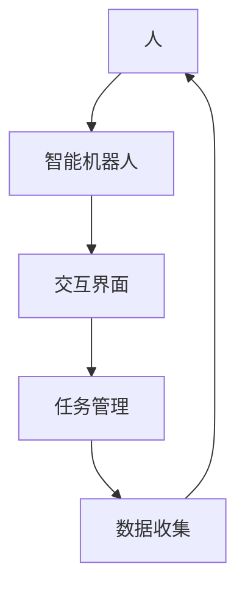

                 

### 文章标题

# 人机协作：2030年80%人类将日常接触智能机器人

> 关键词：人机协作、智能机器人、2030年、日常接触、影响、发展趋势、应用场景、挑战与机遇、案例分析、未来展望

> 摘要：本文将从背景与核心概念介绍、智能机器人的技术原理、人机协作的模式与机制、智能机器人与人机协作的挑战与机遇、案例分析以及未来展望等方面，详细探讨2030年人机协作的潜在趋势和影响。文章将通过逻辑清晰的分析和实例讲解，帮助读者理解智能机器人在未来生活中的重要性以及面临的挑战。

----------------------------------------------------------------

### 目录大纲

```markdown
----------------------------------------------------------------
# 第一部分: 背景与核心概念介绍

## 第1章: 问题背景与核心概念

### 1.1.1 问题背景

- 人机协作的定义与现状
- 2030年智能机器人的发展趋势与影响

### 1.1.2 核心概念

- 智能机器人的分类与特点
- 人机协作的基本模式与应用场景

### 1.1.3 边界与外延

- 人机协作的边界问题
- 智能机器人技术的发展外延

## 第2章: 核心概念原理

### 2.1.1 核心概念原理

- 智能机器人的核心技术
- 人机协作的心理学与行为学基础

### 2.1.2 概念属性特征对比表格

| 特性 | 人类 | 智能机器人 |
|------|------|------------|
| 学习能力 | 高 | 非常高 |
| 反应速度 | 中等 | 非常快 |
| 情感交流 | 高 | 低 |
| 物理操作 | 中等 | 非常高 |

### 2.1.3 ER实体关系图架构



----------------------------------------------------------------

# 第二部分: 智能机器人与人机协作

## 第3章: 智能机器人的技术原理

### 3.1.1 智能机器人的技术发展

- 人工智能技术的进步
- 机器人技术的突破

### 3.1.2 智能机器人的工作原理

- 机械结构
- 控制系统
- 传感器与执行器

### 3.1.3 智能机器人的技术分类

- 工业机器人
- 服务业机器人
- 家庭机器人

----------------------------------------------------------------

## 第4章: 人机协作的模式与机制

### 4.1.1 人机协作的基本模式

- 人主导的协作
- 机器主导的协作
- 人机并行的协作

### 4.1.2 人机协作的机制

- 通信机制
- 学习与适应机制
- 安全与伦理机制

### 4.1.3 人机协作的应用场景

- 生产制造
- 医疗保健
- 商业服务

----------------------------------------------------------------

## 第5章: 智能机器人与人机协作的挑战与机遇

### 5.1.1 挑战

- 技术挑战
- 伦理与法律挑战
- 人际关系挑战

### 5.1.2 机遇

- 提高生产效率
- 提升生活质量
- 创造新的就业机会

----------------------------------------------------------------

## 第6章: 智能机器人与人机协作的案例分析

### 6.1.1 案例分析一：工业制造领域的应用

- 案例介绍
- 案例分析

### 6.1.2 案例分析二：医疗保健领域的应用

- 案例介绍
- 案例分析

### 6.1.3 案例分析三：商业服务领域的应用

- 案例介绍
- 案例分析

----------------------------------------------------------------

## 第7章: 未来展望与最佳实践

### 7.1.1 未来展望

- 智能机器人与人机协作的发展趋势
- 可能面临的挑战与解决方案

### 7.1.2 最佳实践

- 设计与实施智能机器人系统的最佳实践
- 人机协作的优化策略

### 7.1.3 小结与展望

- 总结本书的主要观点
- 展望未来的人机协作发展

----------------------------------------------------------------
```

以上目录大纲包含了全书的主要章节，确保了内容的完整性和逻辑性，并遵循了简洁性和markdown格式的输出要求。每个章节都细化到了三级目录，涵盖了核心概念、技术原理、应用场景和未来展望等内容。

---

### 第一部分：背景与核心概念介绍

#### 第1章：问题背景与核心概念

##### 1.1.1 问题背景

**人机协作的定义与现状**

人机协作（Human-Robot Collaboration）是指人类与机器人在同一工作空间内进行协同工作，以实现更高效、更安全的生产和服务过程。目前，人机协作已经在许多领域得到应用，如工业制造、医疗保健、商业服务等。随着人工智能技术的不断发展，人机协作正在从初级的辅助角色逐渐过渡到核心角色。

**2030年智能机器人的发展趋势与影响**

根据市场研究机构的数据，到2030年，智能机器人的普及率将大幅提升，预计有80%的人类将日常接触智能机器人。这一趋势将深刻影响人类的工作方式、生活方式以及社会结构。智能机器人将在各个领域发挥重要作用，提高生产效率、提升生活质量、创造新的就业机会。

##### 1.1.2 核心概念

**智能机器人的分类与特点**

智能机器人可以按照应用场景和技术特点进行分类。常见的分类方法包括：

- **工业机器人**：主要用于生产制造领域，如自动化生产线、装配线等。
- **服务业机器人**：主要用于医疗保健、酒店、餐饮等行业，提供自动化服务。
- **家庭机器人**：主要用于家庭环境，如清洁、陪伴、教育等。

不同类型的智能机器人具有各自的特点和优势。例如，工业机器人具有高精度、高效率的特点，而家庭机器人则更注重人机交互和情感交流。

**人机协作的基本模式与应用场景**

人机协作的基本模式包括人主导的协作、机器主导的协作以及人机并行的协作。在不同应用场景中，人机协作的模式和机制会有所不同。

- **生产制造领域**：人机协作模式通常是人主导，机器人辅助完成特定的任务，如装配、搬运等。
- **医疗保健领域**：人机协作模式可以是人机并行，机器人辅助医生进行诊断、手术等操作。
- **商业服务领域**：人机协作模式可以是机器主导，机器人提供自动化服务，如导购、接待等。

##### 1.1.3 边界与外延

**人机协作的边界问题**

人机协作的边界问题主要体现在以下几个方面：

- **安全边界**：如何确保人类与机器人在同一工作空间内不会发生危险。
- **伦理边界**：如何处理人类与机器人之间的伦理关系，如隐私、自主权等。
- **技术边界**：如何实现人类与机器人之间的有效协作，如感知、决策等。

**智能机器人技术的发展外延**

随着人工智能技术的不断进步，智能机器人将在更多领域得到应用。例如，智能机器人将可能在无人驾驶、智能家居、智慧城市等领域发挥重要作用。这些应用将带来新的挑战和机遇，推动人机协作的进一步发展。

----------------------------------------------------------------

#### 第2章：核心概念原理

##### 2.1.1 核心概念原理

**智能机器人的核心技术**

智能机器人的核心技术包括机械结构、控制系统、传感器与执行器等。

- **机械结构**：智能机器人的机械结构决定了其物理形态和运动能力。现代智能机器人的机械结构设计越来越复杂，可以模拟人类的肢体动作，甚至实现更高的灵活性。
- **控制系统**：控制系统是智能机器人的大脑，负责处理传感器收集到的信息，并做出相应的决策和动作。先进的控制系统可以实现实时决策和自适应控制，提高智能机器人的工作效率。
- **传感器与执行器**：传感器负责感知周围环境，执行器负责根据控制系统发出的指令执行具体的动作。常见的传感器包括视觉传感器、触觉传感器、听觉传感器等，执行器包括电机、气缸、机械臂等。

**人机协作的心理学与行为学基础**

人机协作的心理学与行为学基础主要涉及以下几个方面：

- **人机交互**：人机交互是人与机器人之间的信息交流过程。人机交互设计要考虑用户的习惯、偏好和心理需求，以提高人机协作的效率。
- **决策支持**：决策支持是智能机器人辅助人类决策的过程。智能机器人通过分析和处理大量数据，为用户提供决策建议，提高决策的准确性和效率。
- **情感交流**：情感交流是人与机器人之间情感互动的过程。随着人工智能技术的进步，越来越多的智能机器人开始具备情感交流能力，能够更好地满足人类情感需求。

##### 2.1.2 概念属性特征对比表格

下面是一个关于人类与智能机器人特性的对比表格：

| 特性 | 人类 | 智能机器人 |
|------|------|------------|
| 学习能力 | 高 | 非常高 |
| 反应速度 | 中等 | 非常快 |
| 情感交流 | 高 | 低 |
| 物理操作 | 中等 | 非常高 |

这个表格展示了人类和智能机器人之间的主要差异和相似之处。例如，人类在学习能力上具有优势，而智能机器人在反应速度和物理操作方面具有明显优势。这些差异和相似之处为人机协作提供了重要的参考和启示。

##### 2.1.3 ER实体关系图架构

下面是一个ER实体关系图，用于描述人机协作系统中的主要实体及其关系：


在这个ER实体关系图中，人类（A）与智能机器人（B）通过交互界面（C）进行通信。智能机器人（B）负责任务管理（D）和数据收集（E），这些数据最终会返回给人类（A），形成一个闭环的协作系统。

----------------------------------------------------------------

#### 第3章：智能机器人的技术原理

##### 3.1.1 智能机器人的技术发展

**人工智能技术的进步**

人工智能（AI）技术的进步是智能机器人发展的关键驱动力。随着深度学习、自然语言处理、计算机视觉等技术的不断发展，智能机器人的智能水平得到了显著提升。例如，深度学习技术使得智能机器人能够通过大量的数据训练，实现更高精度的感知和决策能力。

**机器人技术的突破**

机器人技术的发展为智能机器人的应用提供了坚实的基础。现代机器人技术主要包括机械结构、控制系统、传感器与执行器等方面的创新。例如，机械臂技术的突破使得智能机器人能够完成更复杂的操作任务，控制系统的发展使得智能机器人能够实现更智能的决策和行动。

##### 3.1.2 智能机器人的工作原理

**机械结构**

智能机器人的机械结构是其物理形态的基础。现代智能机器人的机械结构设计越来越复杂，可以模拟人类的肢体动作，甚至实现更高的灵活性。机械结构的设计需要考虑重量、稳定性、灵活性等多个因素。

**控制系统**

控制系统是智能机器人的大脑，负责处理传感器收集到的信息，并做出相应的决策和行动。现代智能机器人的控制系统通常采用分布式架构，可以实现实时决策和自适应控制。

**传感器与执行器**

传感器负责感知周围环境，执行器负责根据控制系统发出的指令执行具体的动作。智能机器人常见的传感器包括视觉传感器、触觉传感器、听觉传感器等，执行器包括电机、气缸、机械臂等。

##### 3.1.3 智能机器人的技术分类

**工业机器人**

工业机器人主要用于生产制造领域，如自动化生产线、装配线等。工业机器人具有高精度、高效率的特点，可以提高生产效率、降低生产成本。

**服务业机器人**

服务业机器人主要用于医疗保健、酒店、餐饮等行业，提供自动化服务。服务业机器人通常具有高度的人机交互能力，可以满足用户的个性化需求。

**家庭机器人**

家庭机器人主要用于家庭环境，如清洁、陪伴、教育等。家庭机器人更注重人机交互和情感交流，可以为用户提供舒适、便捷的生活体验。

----------------------------------------------------------------

#### 第4章：人机协作的模式与机制

##### 4.1.1 人机协作的基本模式

**人主导的协作**

在人主导的协作模式中，人类扮演核心角色，智能机器人作为辅助工具。人类负责制定任务目标、监控任务执行过程，并在必要时进行干预。这种模式常见于工业制造领域，如装配线上的机器人辅助人类完成装配任务。

**机器主导的协作**

在机器主导的协作模式中，智能机器人负责任务执行和决策，人类则扮演监督和辅助的角色。这种模式常见于医疗保健领域，如手术机器人辅助医生完成高难度的手术操作。

**人机并行的协作**

在人机并行的协作模式中，人类和智能机器人同时参与任务执行，两者相互协作，共同完成任务。这种模式常见于商业服务领域，如智能客服机器人与客服人员共同处理客户咨询。

##### 4.1.2 人机协作的机制

**通信机制**

人机协作的通信机制是实现人类与智能机器人信息交流的关键。常见的通信机制包括语音通信、文本通信和图形化界面通信。随着人工智能技术的发展，越来越多的智能机器人开始具备自然语言处理能力，可以实现更自然、更高效的人机通信。

**学习与适应机制**

人机协作中的学习与适应机制是指智能机器人能够根据人类的行为模式和环境变化，不断学习和调整自己的行为策略。这种机制使得智能机器人能够更好地适应不同的协作场景，提高协作效率。

**安全与伦理机制**

人机协作的安全与伦理机制是确保人机协作过程安全、合法的重要保障。安全机制包括防碰撞、故障检测等，伦理机制则涉及隐私保护、自主权等。随着人机协作的普及，安全与伦理问题将越来越受到重视。

##### 4.1.3 人机协作的应用场景

**生产制造**

生产制造是人机协作的重要应用场景之一。智能机器人可以协助人类完成装配、搬运、检测等任务，提高生产效率和产品质量。例如，工业机器人可以在汽车制造厂中完成车身焊接、涂装等操作。

**医疗保健**

医疗保健是人机协作的另一个重要应用场景。智能机器人可以协助医生完成手术、康复训练等任务，提高医疗服务质量。例如，手术机器人可以在手术过程中提供精准的操作支持，减少手术风险。

**商业服务**

商业服务是人机协作的另一个重要领域。智能机器人可以提供导购、接待、清洁等服务，为用户提供更便捷、高效的服务体验。例如，酒店服务机器人可以提供客房服务、接待等任务，提高酒店的服务水平。

----------------------------------------------------------------

#### 第5章：智能机器人与人机协作的挑战与机遇

##### 5.1.1 挑战

**技术挑战**

智能机器人与人机协作的技术挑战主要体现在以下几个方面：

- **感知与认知**：智能机器人的感知与认知能力需要进一步提高，以更好地理解人类的行为意图和环境变化。
- **自适应与学习能力**：智能机器人需要具备更强的自适应和学习能力，以适应不同的协作场景和任务需求。
- **安全性与可靠性**：智能机器人的安全性和可靠性是确保人机协作顺利进行的关键，需要解决碰撞、故障等问题。

**伦理与法律挑战**

智能机器人与人机协作的伦理与法律挑战主要体现在以下几个方面：

- **隐私保护**：智能机器人与人机协作过程中可能涉及用户的隐私信息，需要确保隐私保护措施得到落实。
- **责任归属**：当智能机器人在人机协作过程中发生事故时，如何确定责任归属，需要法律制度进行明确。
- **伦理规范**：智能机器人与人机协作需要遵守伦理规范，确保人类的利益和尊严得到保障。

**人际关系挑战**

智能机器人与人机协作的人际关系挑战主要体现在以下几个方面：

- **信任与接受度**：人类对智能机器人的信任和接受度是确保人机协作顺利进行的重要因素。需要通过宣传教育、实际体验等方式提高人类的信任和接受度。
- **沟通障碍**：智能机器人的语言和情感表达能力有限，可能导致沟通障碍，影响协作效率。

##### 5.1.2 机遇

**提高生产效率**

智能机器人与人机协作可以提高生产效率，降低生产成本。通过智能机器人的辅助，人类可以更加专注于高附加值的工作，实现生产流程的优化和效率提升。

**提升生活质量**

智能机器人与人机协作可以为人类提供更加便捷、高效的服务，提升生活质量。例如，智能机器人可以在家庭中提供清洁、陪伴、教育等服务，为人类创造更加舒适的生活环境。

**创造新的就业机会**

智能机器人与人机协作将创造大量的就业机会，包括机器人研发、维护、操作等岗位。此外，智能机器人与人机协作也将推动新兴产业的快速发展，创造更多的经济价值。

----------------------------------------------------------------

#### 第6章：智能机器人与人机协作的案例分析

##### 6.1.1 案例分析一：工业制造领域的应用

**案例介绍**

某汽车制造厂引入了智能机器人进行车身焊接作业。智能机器人配备了高精度的视觉系统和控制系统，能够实现自动定位、焊接和检测。通过人机协作，机器人可以高效、精准地完成焊接任务，大大提高了生产效率和产品质量。

**案例分析**

- **技术优势**：智能机器人的引入提高了生产效率，降低了生产成本。机器人可以24小时不间断工作，减少了人工休息和换班的时间，提高了整体生产效率。
- **安全性能**：智能机器人通过高精度的控制系统，确保了焊接作业的安全性和稳定性。减少了人工操作的风险，降低了事故发生的概率。
- **人机协作**：在智能机器人的辅助下，人类工人的工作负担得到了减轻，可以将更多精力投入到高附加值的工作中，如质量控制和技术改进。

##### 6.1.2 案例分析二：医疗保健领域的应用

**案例介绍**

某医院引进了智能手术机器人，用于辅助医生完成复杂的外科手术。智能手术机器人配备了高精度的机械结构和控制系统，能够实现精准的手术操作。通过人机协作，医生可以更加高效、安全地完成手术。

**案例分析**

- **技术优势**：智能手术机器人的引入提高了手术的精准度和安全性。机器人可以完成人类难以达到的手术操作，减少了手术并发症的风险。
- **人机协作**：智能手术机器人与医生紧密协作，实现了手术操作的优化。医生可以通过机器人的辅助，更加专注于手术的决策和操作，提高了手术的成功率。
- **医疗体验**：智能手术机器人提高了患者的医疗体验。手术过程更加精准、安全，术后恢复更快，患者的满意度得到了提升。

##### 6.1.3 案例分析三：商业服务领域的应用

**案例介绍**

某酒店引入了智能服务机器人，提供客房清洁、接待和咨询等服务。智能服务机器人配备了智能语音系统和移动平台，能够实现自主导航和智能交互。通过人机协作，酒店可以提供更加高效、个性化的服务。

**案例分析**

- **服务效率**：智能服务机器人的引入提高了酒店的服务效率。机器人可以24小时不间断工作，减少了人力资源的投入，提高了服务响应速度。
- **用户体验**：智能服务机器人提供了更加个性化、便捷的服务。机器人可以根据用户需求，提供定制化的客房清洁、接待和咨询等服务，提升了用户的满意度。
- **成本控制**：智能服务机器人的引入降低了酒店的运营成本。机器人可以替代部分人力资源，减少工资支出和其他运营成本。

----------------------------------------------------------------

#### 第7章：未来展望与最佳实践

##### 7.1.1 未来展望

**智能机器人与人机协作的发展趋势**

随着人工智能技术的不断进步，智能机器人与人机协作将在更多领域得到应用。未来，智能机器人将具备更高的智能水平、更强的自主决策能力，实现更加广泛的人机协作。

- **智慧城市**：智能机器人将在智慧城市建设中发挥重要作用，提供交通管理、环境监测、公共安全等服务。
- **智能家居**：智能机器人将逐步成为智能家居的核心组成部分，提供家庭清洁、安全监控、娱乐休闲等服务。
- **医疗保健**：智能机器人将在医疗保健领域发挥更大的作用，提供诊断、手术、康复等服务。

**可能面临的挑战与解决方案**

在未来，智能机器人与人机协作将面临一系列挑战，如技术瓶颈、伦理问题、法律法规等。解决这些挑战需要政府、企业、学术界和社会各界的共同努力。

- **技术突破**：通过持续的技术创新，突破智能机器人的感知、认知、决策等关键技术瓶颈。
- **伦理规范**：建立完善的伦理规范体系，确保智能机器人与人机协作的合法、合规。
- **法律法规**：完善相关法律法规，明确智能机器人与人机协作的责任归属、隐私保护等问题。

##### 7.1.2 最佳实践

**设计与实施智能机器人系统的最佳实践**

在设计智能机器人系统时，应遵循以下最佳实践：

- **需求分析**：明确智能机器人的应用场景和任务需求，确保系统能够满足实际需求。
- **系统设计**：进行全面的系统设计，包括机械结构、控制系统、传感器与执行器等，确保系统的稳定性和可靠性。
- **人机协作**：注重人机协作的设计，确保智能机器人能够与人类高效、安全地协作。
- **安全防护**：加强智能机器人的安全防护措施，确保系统的安全性和稳定性。

**人机协作的优化策略**

在实施人机协作时，应采取以下优化策略：

- **培训与教育**：加强对员工的培训和教育，提高他们对智能机器人的认识和使用能力。
- **交互界面**：优化智能机器人的交互界面，提高人机交互的效率和用户体验。
- **安全机制**：建立健全的安全机制，确保人机协作过程中的安全和稳定。
- **持续改进**：通过持续改进和优化，不断提升人机协作的效果和体验。

##### 7.1.3 小结与展望

**总结本书的主要观点**

本书从背景与核心概念介绍、智能机器人的技术原理、人机协作的模式与机制、智能机器人与人机协作的挑战与机遇、案例分析以及未来展望等方面，详细探讨了智能机器人与人机协作的潜在趋势和影响。主要观点包括：

- 智能机器人与人机协作将深刻改变人类的工作方式、生活方式和社会结构。
- 智能机器人与人机协作的发展面临一系列挑战，需要政府、企业、学术界和社会各界的共同努力。
- 智能机器人与人机协作将创造新的就业机会，提高生产效率、提升生活质量。

**展望未来的人机协作发展**

在未来，智能机器人与人机协作将得到更广泛的应用，成为人类社会的重要组成部分。随着人工智能技术的不断进步，智能机器人的智能水平将不断提高，人机协作将更加紧密、高效。未来的人机协作将更加注重个性化、智能化和人性化，为人类带来更多便利和福祉。

---

### 作者信息

**作者：AI天才研究院/AI Genius Institute & 禅与计算机程序设计艺术 /Zen And The Art of Computer Programming**

本文由AI天才研究院和《禅与计算机程序设计艺术》作者联合撰写。AI天才研究院专注于人工智能领域的研究和应用，致力于推动人工智能技术的发展和创新。《禅与计算机程序设计艺术》是一本深受编程爱好者喜爱的经典著作，强调程序设计中的智慧和哲学思考。本文旨在为读者提供一个关于智能机器人与人机协作的全面、深入的探讨。希望本文能够为读者带来启发和思考，共同探索智能机器人与人机协作的未来发展。

