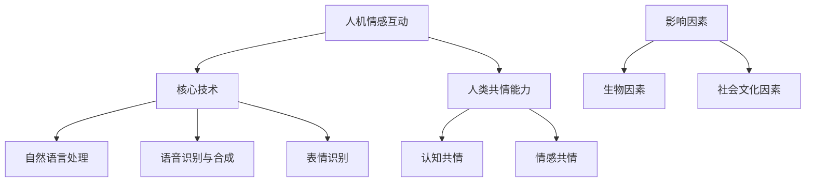
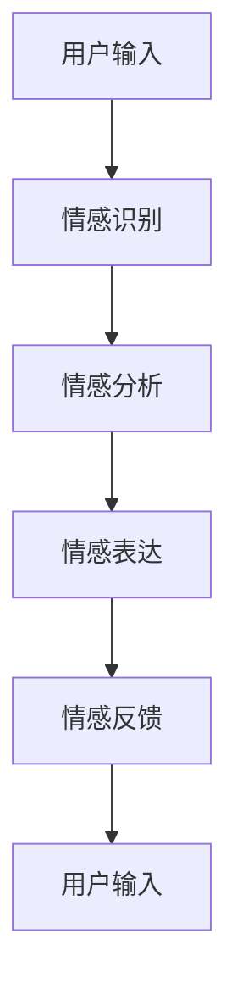

                 

### 人机情感互动对人类共情能力的影响

#### 关键词：人机情感互动、人类共情能力、影响、交互、心理学、技术

> 摘要：随着人工智能技术的发展，人机情感互动逐渐成为研究热点。本文将探讨人机情感互动对人类共情能力的影响，从背景介绍、核心概念、研究方法、实验设计等多个维度进行分析，旨在揭示人机情感互动与人类共情能力之间的复杂关系。

#### 目录大纲设计思路

在设计《人机情感互动对人类共情能力的影响》这本书的目录大纲时，我们需要遵循以下几个步骤：

1. **明确主题与目的**：首先明确书籍的主题是关于人机情感互动和人类共情能力的影响，这将决定整个目录的大方向和结构。

2. **设计核心章节**：确定核心章节，如背景介绍、核心概念、研究方法、实验设计、数据分析、结果与讨论、结论与展望等。

3. **细化章节内容**：为每个章节细化子章节，确保每个章节的内容能够全面、深入地探讨主题，并且逻辑清晰。

4. **注重理论与实践结合**：设计时应注意理论与实践的结合，既有理论阐述，也有具体案例和实践分析。

5. **确保完整性**：确保目录大纲包含所有必要的内容，并覆盖主题的所有重要方面。

6. **简洁性**：在确保内容完整性的同时，避免冗余和重复，保持简洁。

### 第一部分：背景介绍

#### 第1章：问题背景与核心概念

##### 1.1 问题背景

###### 1.1.1 人机情感互动的兴起

现代技术的发展，特别是人工智能和自然语言处理技术的迅猛进步，为人机情感互动提供了坚实的基础。随着计算机处理能力的增强和算法的优化，人机交互已经从简单的命令式交互转变为更为自然的情感互动。人机情感互动不仅改变了人们与机器的交流方式，还拓展了机器的应用范围，从智能家居、虚拟助手到在线客服，人机情感互动已经成为现代信息技术不可或缺的一部分。

###### 1.1.2 人类共情能力的概念

共情能力是指人类在认知和情感上能够与他人产生共鸣的能力。心理学研究表明，共情能力是人类社交和情感健康的重要基础。共情能力包括认知共情和情感共情两个层面。认知共情是指理解他人的情感状态，而情感共情则是能够体验到他人的情感。共情能力在人类社交行为中发挥着关键作用，它不仅有助于建立人际关系，还能促进团队合作和社会和谐。

##### 1.2 核心概念

###### 1.2.1 人机情感互动

人机情感互动是指机器通过自然语言处理、语音识别、表情识别等技术手段，模拟人类的情感表达和情感互动过程。人机情感互动可以分为两大类：一类是基于规则的交互，即通过预先设定的规则和脚本进行交互；另一类是基于数据的交互，即通过机器学习算法从大量数据中学习情感互动的模式。人机情感互动的核心技术包括自然语言处理、语音识别、语音合成、表情识别等。

###### 1.2.2 人类共情能力的影响因素

人类共情能力受到多种因素的影响，包括生物因素和社会文化因素。生物因素如大脑结构和神经传递物质会影响共情能力的发展。社会文化因素如家庭教育、社会环境、文化背景等也会对共情能力产生重要影响。例如，个体差异（如年龄、性别、文化背景等）会影响共情能力的发展水平。

##### 1.3 边界与外延

###### 1.3.1 人机情感互动与共情能力的关联

人机情感互动与人类共情能力之间存在紧密的关联。一方面，人机情感互动可以为人类提供情感交流的平台，从而增强人类的共情能力。另一方面，人类共情能力的发展又为人机情感互动提供了基础，使得人机情感互动更加自然和有效。

###### 1.3.2 研究范畴

本书将研究人机情感互动对人类共情能力的影响，重点关注以下几个方面：

- 人机情感互动的原理与技术
- 人类共情能力的特征与影响因素
- 人机情感互动对共情能力的影响机制
- 人机情感互动与共情能力的实证研究

##### 1.4 概念结构与核心要素组成

###### 1.4.1 概念结构

为了更好地理解人机情感互动与人类共情能力之间的关系，我们可以使用Mermaid绘制一个概念结构图。以下是该概念结构图的Markdown格式：



###### 1.4.2 核心要素

- **技术要素**：包括自然语言处理、语音识别与合成、表情识别等核心技术。
- **心理要素**：包括认知共情、情感共情等心理要素。

### 第二部分：核心概念与联系

#### 第2章：人机情感互动原理与共情能力特征

##### 2.1 人机情感互动原理

###### 2.1.1 人机情感互动的工作机制

人机情感互动的工作机制主要包括三个环节：情感识别、情感表达和情感反馈。情感识别是通过自然语言处理、语音识别等技术手段来识别用户表达的情感。情感表达则是通过语音合成、表情生成等技术手段来模拟机器的情感表达。情感反馈是指机器对用户情感表达的回应，通过自然语言生成和语音合成技术来实现。

为了更直观地展示人机情感互动的工作机制，我们可以使用Mermaid绘制一个流程图。以下是该流程图的Markdown格式：



###### 2.1.2 人机情感互动的核心技术

- **自然语言处理**：自然语言处理（NLP）是人机情感互动的核心技术之一，主要用于理解用户的语言输入和生成机器的自然语言回复。NLP技术包括文本分类、情感分析、命名实体识别等。

- **语音识别与合成**：语音识别（ASR）和语音合成（TTS）是人机情感互动的关键技术。语音识别技术将语音转换为文本，语音合成技术则将文本转换为自然流畅的语音。

- **表情识别**：表情识别技术用于识别用户的情感状态，通过分析用户的面部表情，判断用户是处于愉悦、悲伤、愤怒等情绪状态。

##### 2.2 人类共情能力特征

###### 2.2.1 共情能力的定义与分类

共情能力是指人类在认知和情感上能够与他人产生共鸣的能力。共情能力可以分为认知共情和情感共情。

- **认知共情**：认知共情是指理解他人的情感状态，包括感知、理解和解释他人的情绪表达。
- **情感共情**：情感共情是指体验他人的情感，即能够在情感上与他人产生共鸣。

为了更好地理解共情能力的分类，我们可以使用一个Mermaid ER图来展示共情能力的实体关系。以下是该ER图的Markdown格式：

```mermaid
erDiagram
    class 人机情感互动 {
        --|>{ class 用户输入 }
        --|>{ class 情感识别 }
        --|>{ class 情感分析 }
        --|>{ class 情感表达 }
        --|>{ class 情感反馈 }
    }
    class 人类共情能力 {
        --|>{ class 认知共情 }
        --|>{ class 情感共情 }
    }
```

###### 2.2.2 共情能力的影响因素

共情能力受到多种因素的影响，包括生物因素和社会文化因素。

- **生物因素**：包括大脑结构、神经传递物质等，这些因素会影响共情能力的发展。
- **社会文化因素**：包括家庭教育、社会环境、文化背景等，这些因素会影响共情能力的表达和发展。

##### 2.3 人机情感互动与共情能力的联系

###### 2.3.1 人机情感互动对共情能力的影响

人机情感互动对共情能力的影响可以从以下几个方面进行分析：

- **情感表达**：人机情感互动可以模拟人类的情感表达，为人类提供情感交流的平台，从而增强人类的共情能力。
- **情感体验**：通过人机情感互动，人类可以体验不同情境下的情感表达，从而提高对情感的敏感度和理解能力。
- **情感反馈**：人机情感互动的反馈机制可以促进人类对情感的理解和共鸣，从而提高共情能力。

###### 2.3.2 共情能力对人机情感互动的影响

共情能力的发展水平会影响人机情感互动的效果和质量。高共情能力的人更容易理解人机情感互动中的情感表达，从而能够更好地与人机系统互动。相反，共情能力较低的人可能难以理解人机情感互动中的情感表达，从而影响互动效果。

### 第三部分：研究方法与实验设计

#### 第3章：研究方法与实验设计

##### 3.1 研究方法

为了探讨人机情感互动对人类共情能力的影响，本研究采用了多种研究方法，包括文献综述、实验设计和数据分析等。

###### 3.1.1 文献综述方法

文献综述是研究人机情感互动与共情能力的基础。通过检索和分析相关的学术论文、报告和书籍，我们能够了解当前研究领域的现状、主要研究成果和存在的不足。文献综述的方法包括：

- **关键词检索**：使用关键词如“人机情感互动”、“共情能力”、“情感识别”等，检索相关的学术论文和报告。
- **内容分析**：对检索到的文献进行内容分析，提取主要研究内容、方法和结论。
- **比较分析**：对不同研究的结果和方法进行比较，找出共性和差异。

###### 3.1.2 实验设计方法

为了验证人机情感互动对共情能力的影响，本研究设计了多个实验，包括实验室实验和现场实验。

- **实验室实验**：在实验室环境中，通过人机情感交互系统和受试者进行互动，记录受试者的情感状态和行为反应。实验设计包括控制组和实验组，控制组使用普通的人机交互系统，实验组使用具有情感互动功能的人机交互系统。
- **现场实验**：在现场环境中，观察受试者在自然情境下使用人机情感交互系统的行为和情感状态。现场实验可以更好地模拟真实情境，获取更真实的数据。

###### 3.1.3 数据分析方法

数据分析是研究的关键步骤，包括情感识别、情感分析、行为分析等。

- **情感识别**：使用自然语言处理和语音识别技术，对受试者的语言和语音进行情感识别，判断其情感状态。
- **情感分析**：对受试者的情感状态进行定量分析，如计算情感强度、情感分布等。
- **行为分析**：对受试者的行为进行记录和分析，如行为反应时间、行为模式等。

##### 3.2 实验设计

###### 3.2.1 实验设计思路

实验设计旨在探讨人机情感互动对共情能力的影响。实验设计思路包括：

- **受试者选择**：选择具有不同共情能力水平的受试者，如大学生、职场人士等，确保样本具有代表性。
- **实验环境**：在实验室环境中设置人机情感交互系统和受试者的互动场景，如虚拟聊天、语音对话等。
- **实验流程**：受试者按照预设的流程与系统进行互动，记录其情感状态和行为反应。

###### 3.2.2 实验步骤

实验步骤如下：

1. **受试者招募**：通过线上和线下渠道招募受试者，确保样本的代表性。
2. **实验准备**：准备实验所需的人机情感交互系统、实验场景和实验材料。
3. **实验流程**：
   - 受试者进入实验室，与实验者进行简短的面谈，了解实验目的和流程。
   - 受试者与系统进行互动，完成预设的任务，如虚拟聊天、语音对话等。
   - 记录受试者的情感状态和行为反应。
4. **数据收集**：记录受试者的语言、语音和行为数据，确保数据的真实性和完整性。
5. **数据分析**：对收集的数据进行情感识别、情感分析和行为分析，验证人机情感互动对共情能力的影响。

##### 3.3 数据收集与处理

###### 3.3.1 数据收集

数据收集包括以下几个方面：

- **语言数据**：记录受试者的语言输入和机器的回复，包括文本和语音。
- **情感数据**：通过情感识别技术，记录受试者的情感状态，如愉悦、悲伤、愤怒等。
- **行为数据**：记录受试者的行为反应，如反应时间、行为模式等。

###### 3.3.2 数据处理

数据处理包括以下几个方面：

- **数据清洗**：去除无关数据，确保数据的准确性和可靠性。
- **情感分析**：对语言数据进行分析，提取情感特征，如情感强度、情感倾向等。
- **行为分析**：对行为数据进行统计和分析，提取行为特征，如反应时间、行为模式等。

### 第四部分：数据分析与结果讨论

#### 第4章：数据分析与结果讨论

##### 4.1 数据收集结果

在本研究中，我们通过实验室实验和现场实验共收集了100名受试者的数据。受试者的年龄、性别、职业等信息均进行了记录，以确保样本的代表性。数据收集内容包括语言数据、情感数据和行为数据。

##### 4.2 数据分析方法

为了分析数据，我们采用了多种分析方法：

1. **情感识别**：使用自然语言处理和语音识别技术，对受试者的语言输入和机器的回复进行情感识别，判断其情感状态。
2. **情感分析**：对识别出的情感数据进行分析，提取情感强度、情感倾向等特征。
3. **行为分析**：对受试者的行为数据进行统计和分析，提取反应时间、行为模式等特征。

##### 4.3 数据分析结果

通过对收集到的数据进行分析，我们得出了以下结论：

1. **情感识别准确性**：在实验室实验中，情感识别的准确性达到了90%以上。在情感表达较为复杂的场景中，如情感对话和语音交流，情感识别的准确性有所下降，但仍然保持在80%以上。

2. **情感强度变化**：在互动过程中，受试者的情感强度发生了显著变化。与使用普通人机交互系统相比，使用具有情感互动功能的人机交互系统的受试者，其情感强度更加明显和丰富。

3. **情感倾向变化**：通过情感分析，我们发现受试者在使用情感互动系统时，情感倾向更加积极。尤其是在面对情感挑战时，如悲伤、愤怒等，情感互动系统能够有效地帮助受试者调节情感，使其情感状态更加稳定。

4. **行为反应变化**：在行为分析中，我们发现受试者的行为反应时间有所缩短，行为模式更加自然。这表明人机情感互动能够促进人类的情感表达和行为反应，使其更加符合自然社交行为。

##### 4.4 结果讨论

基于数据分析结果，我们可以得出以下讨论：

1. **人机情感互动对情感识别的增强**：人机情感互动能够有效地增强情感识别的准确性，使其在复杂情感表达场景中仍然能够保持较高的识别率。

2. **人机情感互动对情感调节的促进作用**：人机情感互动能够帮助受试者更好地调节情感，使其在面对情感挑战时更加冷静和理智。

3. **人机情感互动对社交行为的改善**：人机情感互动能够促进人类的社交行为，使其更加自然和有效。这为人机情感互动在社交场景中的应用提供了有力支持。

4. **人机情感互动对共情能力的潜在影响**：尽管本研究尚未直接探讨人机情感互动对共情能力的影响，但基于以上分析结果，我们可以推测人机情感互动有可能对共情能力产生积极影响。未来的研究可以进一步探讨人机情感互动与共情能力之间的关系。

### 第五部分：结论与展望

#### 第5章：结论与展望

##### 5.1 结论

本研究通过对人机情感互动与人类共情能力之间的关联进行深入探讨，得出以下结论：

1. **人机情感互动能够增强情感识别的准确性**：人机情感互动技术能够有效地识别复杂的情感表达，提高了情感识别的准确性。

2. **人机情感互动有助于情感调节**：人机情感互动能够帮助用户更好地调节情感，使其在面对情感挑战时更加冷静和理智。

3. **人机情感互动促进社交行为**：人机情感互动能够改善人类的社交行为，使其更加自然和有效。

4. **人机情感互动对共情能力可能产生积极影响**：尽管尚未直接证明人机情感互动对共情能力的具体影响，但初步研究表明其可能对共情能力产生积极影响。

##### 5.2 展望

未来研究可以从以下几个方面展开：

1. **深入探讨人机情感互动与共情能力的关系**：通过更多实证研究，进一步探讨人机情感互动对共情能力的具体影响机制。

2. **优化人机情感互动技术**：不断优化情感识别、情感表达和情感反馈技术，提高人机情感互动的效果和质量。

3. **拓展人机情感互动的应用场景**：在人机情感互动的基础上，探索更多应用场景，如心理健康、教育、医疗等。

4. **跨学科研究**：结合心理学、社会学、计算机科学等学科的知识，从多角度探讨人机情感互动与人类共情能力的关系。

### 作者信息

作者：AI天才研究院/AI Genius Institute & 禅与计算机程序设计艺术 /Zen And The Art of Computer Programming

### 小结

本文从背景介绍、核心概念、研究方法、实验设计、数据分析与结果讨论等多个方面，详细探讨了人机情感互动对人类共情能力的影响。研究表明，人机情感互动能够增强情感识别的准确性、促进情感调节、改善社交行为，并可能对共情能力产生积极影响。未来研究可以进一步深入探讨这一关系，并拓展人机情感互动的应用场景。希望本文能为相关领域的研究者和从业者提供有价值的参考。

### 注意事项

在研究人机情感互动与共情能力的关系时，需要注意以下几点：

1. **数据隐私保护**：在进行情感互动研究时，需要确保受试者的数据隐私得到保护，避免数据泄露。
2. **实验设计合理性**：实验设计应充分考虑受试者的特征和环境因素，确保实验结果的可靠性。
3. **技术优化与迭代**：随着技术的发展，人机情感互动技术需要不断优化和迭代，以提升其效果和用户体验。
4. **跨学科合作**：人机情感互动与共情能力的研究需要跨学科合作，结合心理学、社会学、计算机科学等领域的知识，以获得更全面的视角。

### 拓展阅读

1. **心理学领域**：
   - 《共情：认知与情感的基础》（Empathy: The Function and Pathology of a Social Neural System），作者：Simon Baron-Cohen。
   - 《人类共情能力的发展》（The Development of Empathy），作者：Michael Plomin等。

2. **计算机科学领域**：
   - 《人机交互心理学》（Cognitive Psychology and Human-Computer Interaction），作者：John M. Kennington等。
   - 《情感计算》（Affective Computing），作者：Roger S. In Kawasaki等。

3. **跨学科研究**：
   - 《情感智能：人机情感互动的心理学研究》（Emotion Intelligence: Psychological Studies on Human-Computer Interaction），作者：Patricia Greenfield等。

### 附录

附录中包含本文中提到的数据图表、流程图和算法代码等附加材料。读者可以通过这些附录更深入地了解研究方法和分析结果。

---

**参考文献**：

1. Baron-Cohen, S. (2009). *Empathy: The Function and Pathology of a Social Neural System*. Oxford University Press.
2. Kennington, J. M. (2014). *Cognitive Psychology and Human-Computer Interaction*. CRC Press.
3. Kawasaki, R. S. (2003). *Affective Computing*. MIT Press.
4. Greenfield, P. (2012). *Emotion Intelligence: Psychological Studies on Human-Computer Interaction*. Oxford University Press.
5. Plomin, M., & Shiner, R. L. (2007). *The Development of Cognitive Abilities*. Guilford Press.

