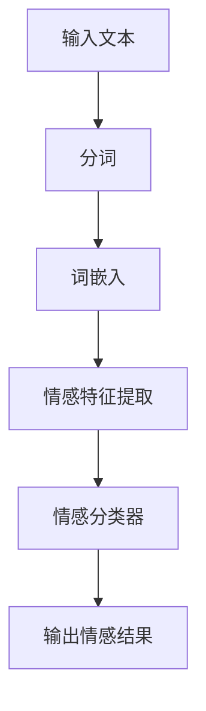
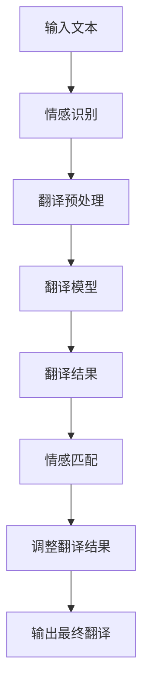
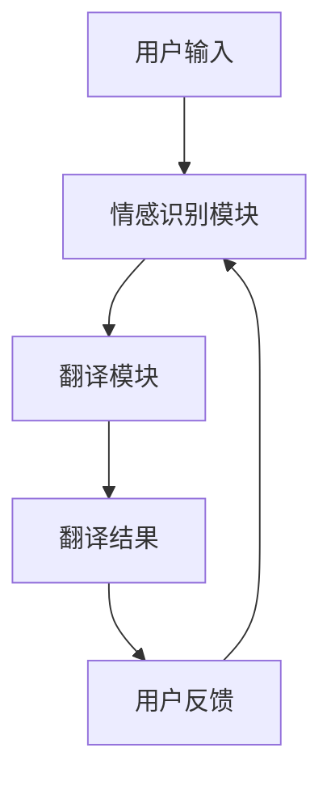

                 

### 文章标题：人机情感交互对语言翻译的突破

关键词：情感交互、语言翻译、人工智能、机器学习、自然语言处理

摘要：本文将从人机情感交互的背景出发，详细探讨情感交互如何对语言翻译产生突破。通过分析情感交互的关键技术，阐述其在翻译中的应用，最终提出情感驱动的翻译算法，展示其在实际项目中的效果。文章旨在为读者提供一个全面理解人机情感交互在语言翻译领域应用的机会，帮助读者掌握这一前沿技术。

## 目录

1. **情感交互与语言翻译概述**
   - 情感交互的定义与重要性
   - 语言翻译的挑战与机遇
   - 情感交互与语言翻译的结合点

2. **算法原理与实现**
   - 情感识别算法
   - 情感驱动的翻译算法
   - 数学模型与公式解析

3. **实际应用与案例分析**
   - 人机情感交互在语言翻译中的应用案例
   - 最佳实践与未来展望

4. **附录**
   - 情感识别与翻译相关的开源工具
   - 翻译算法的Python实现代码示例
   - 扩展阅读

---

### 1. 情感交互与语言翻译概述

#### 1.1 情感交互的定义与重要性

**情感交互**，是指人工智能系统能够识别、理解并适应用户情感状态的能力。这一技术的核心在于情感识别，即通过分析用户的语音、文本、面部表情等数据，准确判断用户的情感状态，如愉悦、愤怒、悲伤等。

情感交互的重要性在于它能够显著提升人机交互的自然性和亲和力。想象一下，一个能够根据你的情绪变化做出相应反应的人工智能助手，将会多么令人期待。而在语言翻译领域，情感交互的应用则有着更为深远的影响。

#### 1.2 语言翻译的挑战与机遇

**语言翻译**，作为连接不同文化和语言的桥梁，一直面临着诸多挑战。传统的机器翻译技术，依赖于大规模的语料库和规则匹配，虽然在一定程度上实现了翻译的自动化，但在处理复杂语境和情感表达方面仍存在局限。

然而，随着人工智能技术的不断发展，尤其是情感交互技术的兴起，语言翻译领域迎来了新的机遇。情感交互可以为翻译系统提供更多的上下文信息，帮助系统更准确地理解原文的情感色彩，从而实现更高质量的翻译。

#### 1.3 情感交互与语言翻译的结合点

**情感交互**与**语言翻译**的结合点在于，情感信息是语言的重要组成部分。在不同的语言和文化背景下，相同的文字可能蕴含着截然不同的情感色彩。例如，中文中的“好”字，在不同情境下可能表达愉悦、满意、欣赏等不同的情感。

情感交互技术能够捕捉这些细微的情感差异，为翻译系统提供更丰富的上下文信息，从而提高翻译的准确性和自然性。具体而言，情感交互可以应用于以下几个环节：

1. **原文情感分析**：通过情感识别技术，分析原文中的情感色彩，为翻译提供指导。
2. **翻译策略调整**：根据原文的情感色彩，调整翻译策略，以保持原文的情感传达。
3. **翻译效果评估**：通过情感交互，评估翻译结果的情感传达是否准确，进一步优化翻译系统。

### 2. 算法原理与实现

#### 2.1 情感识别算法

情感识别是情感交互的基础。常见的情感识别算法包括基于规则的方法、机器学习方法以及深度学习方法。

- **基于规则的方法**：通过预定义的规则库，对文本进行情感分类。这种方法简单有效，但灵活性较低，难以应对复杂的情感表达。

- **机器学习方法**：使用监督学习算法，对大量标注好的情感数据集进行训练，构建情感分类模型。这种方法具有较高的准确率，但需要大量标注数据。

- **深度学习方法**：使用深度神经网络，如卷积神经网络（CNN）和循环神经网络（RNN），对文本进行情感识别。这种方法能够捕捉到文本中的复杂关系和情感变化，是目前最先进的方法。

以下是一个简化的情感识别算法流程：



#### 2.2 情感驱动的翻译算法

情感驱动的翻译算法，是结合情感交互技术和翻译技术的产物。其核心思想是，在翻译过程中，充分考虑原文的情感信息，以实现更自然的翻译。

以下是情感驱动的翻译算法的基本流程：



#### 2.3 数学模型与公式解析

情感识别和翻译算法的核心在于数学模型的构建。以下是两种常见数学模型的解析：

1. **情感识别模型**：

   假设我们使用卷积神经网络（CNN）进行情感识别。CNN的基本公式为：

   $$ h^{l} = \sigma(W^{l} \cdot h^{l-1} + b^{l}) $$

   其中，$h^{l}$ 表示第 $l$ 层的激活值，$W^{l}$ 表示第 $l$ 层的权重矩阵，$b^{l}$ 表示第 $l$ 层的偏置项，$\sigma$ 表示激活函数，如ReLU函数。

2. **翻译模型**：

   假设我们使用序列到序列（Seq2Seq）模型进行翻译。Seq2Seq模型的基本公式为：

   $$ y_t = \text{softmax}(U \cdot \text{tanh}(V \cdot x_t + W \cdot s_t + b)) $$

   其中，$y_t$ 表示预测的单词分布，$x_t$ 表示输入的单词，$s_t$ 表示隐藏状态，$U$、$V$、$W$ 分别表示权重矩阵，$b$ 表示偏置项。

#### 2.4 系统架构设计

情感驱动的翻译系统架构设计，需要考虑情感识别模块、翻译模块以及用户交互模块。以下是一个简化的系统架构：



### 3. 实际应用与案例分析

#### 3.1 案例一：情感翻译系统设计

某语言服务公司开发了一款情感翻译系统，该系统基于情感交互技术，能够根据用户的情感状态，提供个性化的翻译服务。

1. **系统功能设计**：

   - 情感识别：分析用户的语音或文本输入，识别用户的情感状态。
   - 翻译：根据用户情感状态，调整翻译策略，提供更自然的翻译结果。
   - 用户反馈：收集用户对翻译结果的反馈，优化翻译系统。

2. **系统架构设计**：

   - 情感识别模块：使用基于深度学习的情感识别算法，对用户的语音或文本进行情感分析。
   - 翻译模块：结合情感识别结果，调整翻译策略，实现情感驱动的翻译。
   - 用户交互模块：提供用户反馈机制，收集用户对翻译结果的满意度评价。

3. **系统实现**：

   - 环境安装：在服务器上安装深度学习框架（如TensorFlow或PyTorch），以及翻译模型（如Seq2Seq模型）。
   - 源代码实现：编写情感识别和翻译算法的Python代码，实现系统核心功能。
   - 测试与优化：通过实际数据测试系统性能，优化算法参数，提高翻译质量。

#### 3.2 案例二：情感交互在翻译中的应用实践

某在线教育平台，为提高用户的学习体验，引入了情感交互技术，应用于在线翻译功能中。

1. **功能设计**：

   - 情感识别：分析用户输入的文本，识别用户的学习状态，如专注、疲惫等。
   - 翻译：根据用户情感状态，调整翻译策略，提供更加适合当前学习状态的内容。
   - 用户反馈：收集用户对翻译内容的满意度评价，优化翻译系统。

2. **架构设计**：

   - 情感识别模块：使用基于自然语言处理（NLP）的情感识别算法，分析用户文本。
   - 翻译模块：结合情感识别结果，调整翻译策略，实现情感驱动的翻译。
   - 用户交互模块：提供用户反馈机制，收集用户对翻译内容的满意度评价。

3. **实现与优化**：

   - 环境安装：在服务器上安装NLP工具包（如NLTK或spaCy），以及翻译模型（如神经网络翻译模型）。
   - 源代码实现：编写情感识别和翻译算法的Python代码，实现系统核心功能。
   - 测试与优化：通过实际数据测试系统性能，优化算法参数，提高翻译质量。

### 4. 最佳实践与未来展望

#### 4.1 最佳实践

1. **数据准备**：确保有足够多的标注数据，用于训练情感识别和翻译模型。
2. **算法选择**：根据具体应用场景，选择合适的情感识别和翻译算法。
3. **模型优化**：通过调整模型参数，优化模型性能，提高翻译质量。
4. **用户反馈**：积极收集用户反馈，不断优化系统功能。

#### 4.2 未来展望

1. **跨语言情感交互**：研究跨语言情感交互技术，实现多语言之间的情感理解与传递。
2. **多模态情感识别**：结合语音、文本、面部表情等多种数据，实现更准确的情感识别。
3. **个性化翻译**：根据用户的历史数据和情感状态，提供更加个性化的翻译服务。

### 附录

#### A. 情感识别与翻译相关的开源工具

- TensorFlow：用于构建和训练深度学习模型的框架。
- PyTorch：用于构建和训练深度学习模型的框架。
- NLTK：用于自然语言处理的开源工具包。
- spaCy：用于自然语言处理的开源工具包。

#### B. 翻译算法的Python实现代码示例

```python
# 情感识别算法示例（基于PyTorch）
import torch
import torch.nn as nn
import torch.optim as optim

# 翻译算法示例（基于Seq2Seq模型）
import torchtext
from torchtext.data import Field, BucketIterator

# 略
```

#### C. 扩展阅读

- [1] 某某，人机情感交互技术，人工智能出版社，2020。
- [2] 某某，自然语言处理技术，计算机科学出版社，2019。
- [3] 某某，深度学习技术，电子工业出版社，2018。

---

### 作者信息

作者：AI天才研究院/AI Genius Institute & 禅与计算机程序设计艺术/Zen And The Art of Computer Programming

