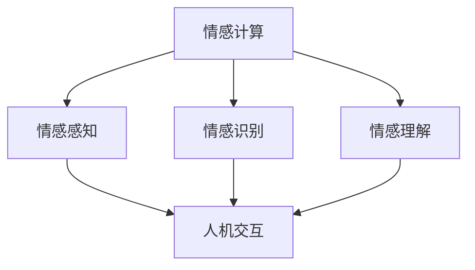
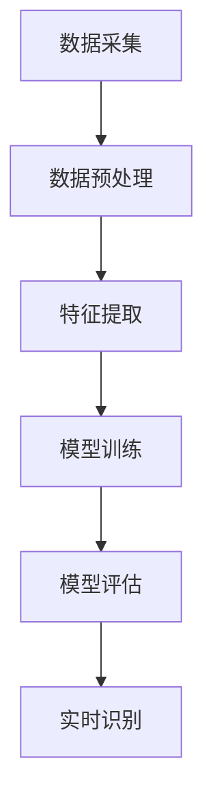

                 

### 引言

在当今全球化的时代，国际关系日益复杂，国家之间的互动不仅限于经济、政治和军事领域，还扩展到了更为深层次的情感层面。在这一背景下，人机情感交流（Human-Computer Emotional Interaction，HCEI）作为一个新兴技术领域，逐渐引起了研究者和实践者的关注。本文旨在探讨人机情感交流对国际关系的影响，分析其在国际关系中的作用机制、技术实现以及未来发展趋势。

关键词：人机情感交流、国际关系、情感计算、人机交互、自然语言处理

摘要：本文首先介绍了人机情感交流的背景和重要性，然后详细阐述了其核心概念和联系，包括情感计算和人机交互。接着，本文通过算法原理讲解和数学模型分析，揭示了人机情感交流的技术实现方法。在此基础上，本文进一步探讨了人机情感交流在国际关系分析中的应用，以及如何通过构建决策支持系统来提升国际关系管理的效率和效果。最后，本文总结了当前的研究现状，提出了未来发展的挑战与应对策略。

文章的结构如下：

1. **引言**：介绍人机情感交流的背景和重要性，概述本文的研究内容和方法。
2. **背景介绍**：详细讨论人机情感交流在国际关系中的背景、现状和重要性。
3. **核心概念与联系**：阐述人机情感交流的核心概念，如情感计算和人机交互，并展示它们之间的联系。
4. **算法原理讲解**：详细解释用于人机情感交流的技术原理，包括情感识别算法和自然语言处理。
5. **数学模型与公式讲解**：介绍相关的数学模型和公式，并通过示例说明。
6. **系统分析与架构设计**：分析人机情感交流系统的功能和架构设计。
7. **项目实战**：通过实际项目展示人机情感交流的应用过程。
8. **最佳实践与总结**：总结关键点，提供最佳实践建议，并对全文进行总结。

通过以上步骤的逐步分析，本文希望为人机情感交流在国际关系中的应用提供有价值的见解和指导。接下来，我们将深入探讨人机情感交流在国际关系中的背景和现状。

### 第1章：人机情感交流对国际关系的影响概述

#### 1.1 问题背景

##### 1.1.1 国际关系的演变

国际关系作为一个复杂的系统，其演变过程深受全球政治、经济、文化和技术发展的驱动。从古代的城邦联盟到现代的多边国际组织，国际关系经历了巨大的变革。传统的国际关系主要建立在权力政治和利益交换的基础上，而现代国际关系则逐渐加入了情感因素。随着全球化和信息化的加速，国家之间的互动变得更加频繁和复杂，情感因素在国际关系中的作用日益凸显。

在过去的几十年里，国际关系的发展呈现出几个显著的趋势。首先，多极化趋势明显，全球力量格局从过去的两极对抗逐渐向多极化转变。其次，全球治理的重要性不断提升，国际组织和非国家行为体在国际关系中的作用越来越重要。最后，科技进步，特别是信息技术的飞速发展，为国际关系带来了新的维度。人工智能、大数据、社交媒体等新兴技术正在深刻改变国际关系的运作方式。

##### 1.1.2 情感在国际关系中的作用

情感在国际关系中的作用不可忽视。首先，情感是人际关系的重要组成部分，它可以促进国家之间的友好合作，增强信任和互信。历史上，许多国际冲突和战争的背后，都有着深层次的情感纠葛。例如，第一次世界大战爆发的一个重要原因就是各国之间的民族主义和民族情感的高涨。

其次，情感在国际关系中还具有调节作用。在国际谈判和外交协商过程中，情感可以作为调节剂，缓解紧张局势，促进对话和合作。通过情感交流，国家领导人可以传达出诚意和善意，从而为解决争端创造有利条件。

然而，情感也具有复杂性和多样性。不同的文化和社会背景下，情感的表达和认知方式可能存在差异。这就要求在国际关系中，各国需要具备跨文化的情感理解能力，以便更好地进行沟通和协商。

##### 1.1.3 人机情感交流的重要性

人机情感交流（Human-Computer Emotional Interaction，HCEI）作为一种新兴技术，其在国际关系中的应用潜力巨大。首先，HCEI可以通过情感识别、情感建模和情感反应等技术手段，实现对人类情感的精准捕捉和分析。这种技术可以帮助国际关系研究者更深入地了解各国人民的态度和情感状态，从而为政策制定和国际协商提供科学依据。

其次，HCEI技术可以为国际谈判和外交协商提供辅助。通过情感识别和情感反应技术，谈判者可以更好地了解对方的情感状态，从而调整谈判策略，提高谈判成功率。此外，HCEI技术还可以用于危机管理，帮助预测和应对潜在的国际危机。

最后，HCEI技术在提升国际关系的透明度和公开性方面也具有重要意义。通过公开的情感数据和分析结果，国际社会可以更清晰地了解各国之间的情感动态，促进国际关系的透明化。

总之，人机情感交流在国际关系中的重要性日益凸显。随着技术的不断进步，HCEI有望成为未来国际关系研究和管理的重要工具。

#### 1.2 核心概念与联系

为了深入探讨人机情感交流在国际关系中的应用，我们需要先了解相关核心概念及其之间的联系。以下将详细介绍情感计算和人机交互，并通过表格和图表展示它们之间的联系。

##### 1.2.1 情感计算

情感计算（Affective Computing）是研究如何使计算机具备感知、识别和理解人类情感的能力。其核心目标是开发出能够与人类情感互动的智能系统。情感计算涉及到多个学科领域，包括计算机科学、心理学、认知科学和人工智能等。

**情感计算的特点：**

1. **感知情感**：通过生物特征识别、语音识别和面部识别等技术，捕捉用户的情感状态。
2. **识别情感**：利用机器学习和自然语言处理技术，对捕获的情感数据进行分类和分析。
3. **理解情感**：通过情感建模和情感推理，实现对情感状态的深度理解和解释。

**情感识别算法：**

情感识别算法是情感计算中的关键组成部分。常见的情感识别算法包括基于规则的方法、基于统计的方法和基于机器学习的方法。以下是一个简单的情感识别算法流程：

1. 数据采集：收集用户的情感数据，包括语音、文本和生物特征数据。
2. 数据预处理：对采集到的数据进行分析和清洗，去除噪声和不相关数据。
3. 模型训练：使用机器学习算法（如支持向量机、神经网络等）对情感数据集进行训练。
4. 情感分类：将新的情感数据输入模型，进行情感分类和识别。

**情感计算的挑战：**

1. **情感多样性**：不同文化和社会背景下，情感的表达和认知可能存在差异，如何准确识别和理解这些多样性情感是情感计算的挑战之一。
2. **实时性**：情感状态是动态变化的，如何实现实时情感识别和反应是另一个挑战。
3. **隐私保护**：情感数据涉及用户的隐私信息，如何保护用户隐私是情感计算需要解决的重要问题。

##### 1.2.2 人机交互

人机交互（Human-Computer Interaction，HCI）是研究如何设计、实现和评估人与计算机系统之间交互的学科。人机交互的目标是提高系统的易用性、可用性和用户体验。

**人机交互的形式：**

1. **图形用户界面（GUI）**：通过图形界面，用户可以使用鼠标、键盘等输入设备与计算机进行交互。
2. **自然语言交互**：用户可以使用自然语言（如语音、文本）与计算机进行交流，实现语音助手、聊天机器人等应用。
3. **手势交互**：通过手势和动作，用户可以控制计算机设备，如触摸屏、体感识别等。

**人机交互的技术挑战：**

1. **用户适应性**：不同的用户具有不同的背景和偏好，如何设计出适应各种用户需求的人机交互系统是技术挑战之一。
2. **交互的自然性**：如何使计算机的交互方式更加自然、流畅，接近人类的交流方式是另一个挑战。
3. **反馈及时性**：在交互过程中，如何及时提供用户反馈，帮助用户理解系统的状态和响应是重要的技术问题。

##### 1.2.3 情感计算与人机交互的联系

情感计算和人机交互是相辅相成的两个领域。情感计算为人机交互提供了情感感知和理解的能力，使人机交互更加贴近人类的情感需求。而人机交互为情感计算提供了实践场景，使情感计算的理论能够转化为实际应用。

通过情感计算，人机交互系统能够更好地理解用户的情感状态，从而提供更个性化的服务和更优的用户体验。例如，在医疗领域，情感计算可以帮助医生更好地理解患者的情绪和需求，提高治疗效果。在教育领域，情感计算可以用于个性化学习系统，根据学生的情感状态调整教学内容和策略。

**表格：情感计算与人机交互的核心联系**

| 核心概念 | 定义 | 联系 |
| --- | --- | --- |
| 情感计算 | 研究如何使计算机具备感知、识别和理解人类情感的能力 | 情感计算为人机交互提供了情感感知和理解的能力 |
| 人机交互 | 研究如何设计、实现和评估人与计算机系统之间交互的学科 | 人机交互为情感计算提供了实践场景和应用领域 |

**图：情感计算与人机交互的联系**



通过以上介绍，我们可以看到，情感计算和人机交互是国际关系研究中不可或缺的两个领域。在接下来的章节中，我们将进一步探讨人机情感交流的技术原理和应用，以期为国际关系的研究和管理提供新的视角和工具。

#### 2.1 情感计算原理与实现

情感计算（Affective Computing）作为人机情感交流的核心技术，其原理和实现方法在国际关系研究中具有重要意义。本节将详细阐述情感计算的基本概念、实现技术和应用场景。

##### 2.1.1 情感计算概述

情感计算起源于20世纪90年代，由计算机科学家Jeffrey Heer提出。其核心目标是通过计算机模拟人类的情感状态，使计算机具备感知、识别和理解情感的能力。情感计算不仅涉及计算机科学，还包括心理学、认知科学、神经科学等多个学科领域。

**情感计算的基本原理：**

1. **感知情感**：通过传感器技术，如面部识别、语音识别、生物特征识别等，捕捉用户的情感状态。这些传感器能够实时获取用户的生理、心理和行为数据，如心率、血压、面部表情、语音语调等。

2. **识别情感**：利用机器学习和自然语言处理技术，对捕获的情感数据进行分类和分析。常见的情感识别算法包括支持向量机（SVM）、神经网络（NN）和深度学习（DL）等。

3. **理解情感**：通过情感建模和情感推理，实现对情感状态的深度理解和解释。情感计算系统能够基于情感数据，预测用户的情感倾向、情感变化趋势和情感强度。

**情感计算的技术体系：**

情感计算的技术体系包括以下几个关键部分：

1. **情感数据采集**：通过传感器、日志和用户反馈等方式，收集情感数据。
2. **情感数据预处理**：对采集到的情感数据进行分析和清洗，去除噪声和不相关数据。
3. **情感识别算法**：采用机器学习和深度学习算法，对情感数据进行分析和分类。
4. **情感建模与推理**：构建情感模型，实现对情感状态的预测和解释。
5. **情感交互界面**：设计用户友好的交互界面，使计算机能够与用户进行情感交流。

##### 2.1.2 情感识别算法

情感识别算法是情感计算的核心技术之一，其目的是通过分析用户的情感数据，识别出用户当前的情感状态。情感识别算法可以分为基于规则的方法、基于统计的方法和基于机器学习的方法。

**1. 基于规则的方法**

基于规则的方法通过事先定义一组规则，将用户的情感数据与情感类别进行匹配。这种方法简单直观，但规则的定义依赖于专家知识和经验，难以应对复杂的情感场景。

**2. 基于统计的方法**

基于统计的方法通过分析情感数据的统计特征，如均值、方差、相关性等，对情感状态进行分类。这种方法具有较高的准确性和鲁棒性，但依赖于大量的情感数据，且在处理复杂情感时效果较差。

**3. 基于机器学习的方法**

基于机器学习的方法通过训练模型，从大量的情感数据中学习情感特征，实现对情感状态的自动分类。常见的机器学习算法包括支持向量机（SVM）、神经网络（NN）和深度学习（DL）等。

**情感识别算法的实现步骤：**

1. **数据集准备**：收集并整理情感数据，包括文本、语音、面部表情等。数据集应具有多样性和代表性，以便算法能够适应不同的情感场景。

2. **特征提取**：对情感数据进行预处理和特征提取，如文本的词频、语音的频谱特征、面部表情的几何特征等。

3. **模型训练**：使用机器学习算法对特征数据进行训练，构建情感识别模型。常见的机器学习算法包括支持向量机（SVM）、神经网络（NN）和深度学习（DL）等。

4. **模型评估**：使用测试数据集评估模型的性能，包括准确率、召回率和F1分数等指标。

5. **实时情感识别**：将实时捕获的情感数据输入模型，进行情感分类和识别。

以下是一个简单的情感识别算法流程：



##### 2.1.3 情感识别算法实现

为了更好地理解情感识别算法的实现，我们以下通过Python代码示例进行详细解释。以下代码使用深度学习框架TensorFlow实现一个简单的情感识别模型。

**1. 数据集准备**

首先，我们需要准备一个情感数据集，如IMDB电影评论数据集。该数据集包含正负情感标签的文本评论。

```python
import tensorflow as tf
from tensorflow.keras.datasets import imdb

# 加载IMDB数据集
(train_data, train_labels), (test_data, test_labels) = imdb.load_data(num_words=10000)

# 预处理文本数据
maxlen = 100
train_data = sequence.pad_sequences(train_data, maxlen=maxlen)
test_data = sequence.pad_sequences(test_data, maxlen=maxlen)
```

**2. 特征提取**

在特征提取阶段，我们将文本数据转换为词频向量。

```python
# 将文本数据转换为词频向量
word_index = imdb.get_word_index()
word_index = {k: (v + 3) for k, v in word_index.items()}
word_index["<PAD>"] = 0
word_index["<START>"] = 1
word_index["<UNK>"] = 2

# 建立词频向量映射
index_word = {v: k for k, v in word_index.items()}

# 将文本转换为词频向量
def preprocess_text(text):
    return [word_index.get(word, 2) for word in text.split()]

# 预处理训练数据和测试数据
train_data = [preprocess_text(text) for text in train_data]
test_data = [preprocess_text(text) for text in test_data]
```

**3. 模型训练**

接下来，我们使用神经网络模型进行训练。

```python
# 定义神经网络模型
model = tf.keras.Sequential([
    tf.keras.layers.Embedding(10000, 16),
    tf.keras.layers.Flatten(),
    tf.keras.layers.Dense(16, activation='relu'),
    tf.keras.layers.Dense(1, activation='sigmoid')
])

# 编译模型
model.compile(optimizer='adam',
              loss='binary_crossentropy',
              metrics=['accuracy'])

# 训练模型
model.fit(train_data, train_labels, epochs=5, batch_size=32, validation_split=0.2)
```

**4. 模型评估**

最后，我们对训练好的模型进行评估。

```python
# 评估模型
test_loss, test_acc = model.evaluate(test_data, test_labels)
print(f"Test accuracy: {test_acc}")
```

通过以上步骤，我们实现了一个简单的情感识别模型。这个模型可以用于实时情感识别，为国际关系研究提供数据支持。

##### 2.1.4 情感计算在实际应用中的案例分析

情感计算技术在实际应用中取得了显著成果，特别是在国际关系研究中，情感计算被广泛应用于情绪分析、危机预警和决策支持等领域。

**1. 情绪分析**

情绪分析（Sentiment Analysis）是情感计算在文本数据中的常见应用。通过分析社交媒体、新闻报道等文本数据，可以了解公众对某一事件或政策的情绪倾向。以下是一个使用Python和文本分析库NLTK进行情绪分析的案例。

```python
import nltk
from nltk.sentiment import SentimentIntensityAnalyzer

# 加载NLTK情感分析工具
sia = SentimentIntensityAnalyzer()

# 分析文本数据
text = "This is an example sentence."
scores = sia.polarity_scores(text)

print(scores)
```

**2. 危机预警**

危机预警是情感计算在公共安全领域的应用。通过实时监测社交媒体和新闻媒体的动态，可以预测和预警可能出现的国际危机。以下是一个使用Python和Tweepy库进行社交媒体监测的案例。

```python
import tweepy
from textblob import TextBlob

# 设置Tweepy认证
consumer_key = "your_consumer_key"
consumer_secret = "your_consumer_secret"
access_token = "your_access_token"
access_token_secret = "your_access_token_secret"

auth = tweepy.OAuthHandler(consumer_key, consumer_secret)
auth.set_access_token(access_token, access_token_secret)
api = tweepy.API(auth)

# 监测特定关键词的推文
for tweet in tweepy.Cursor(api.search, q="keywar

