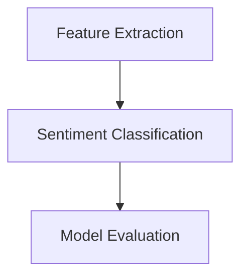
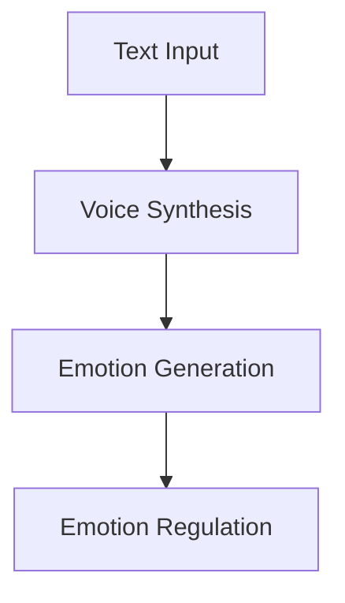
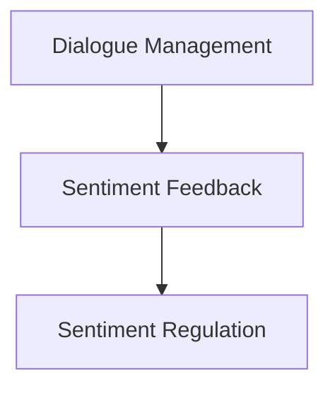
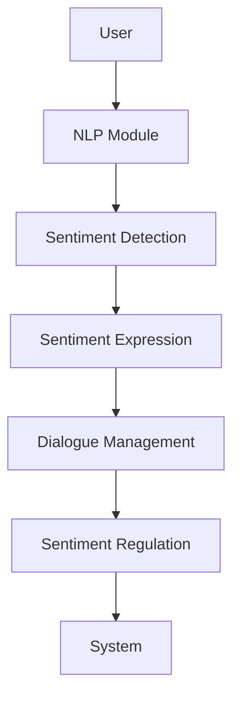

                 

# 人机情感交流对语言障碍的突破

关键词：人机情感交流，语言障碍，情感识别，情感表达，情感交互，算法原理，Python实现，数学模型

摘要：本文深入探讨人机情感交流在解决语言障碍问题中的突破性进展。通过分析情感识别、情感表达和情感交互的核心概念及其相互联系，本文揭示了情感识别算法的原理和流程，情感表达算法的实现机制，以及情感交互算法的构建方法。本文旨在通过逐步分析，为读者提供清晰、易懂的技术见解，推动人机情感交流领域的发展。

## 目录大纲

### 第一部分：背景与核心概念

#### 第1章：问题背景与定义

1.1 问题背景

1.2 核心概念

1.3 概念属性特征对比

1.4 ER实体关系图

### 第二部分：算法原理与实现

#### 第2章：情感识别算法

2.1 算法原理

2.2 算法流程图

2.3 Python代码实现

2.4 数学模型与公式

#### 第3章：情感表达算法

3.1 算法原理

3.2 算法流程图

3.3 Python代码实现

#### 第4章：情感交互算法

4.1 算法原理

4.2 算法流程图

4.3 Python代码实现

### 第三部分：系统分析与架构设计

#### 第5章：情感交互系统架构设计

5.1 问题场景介绍

5.2 系统功能设计

5.3 系统架构设计

5.4 系统接口设计

5.5 系统交互

### 第四部分：项目实战

#### 第6章：情感交互系统开发

6.1 环境安装

6.2 系统核心实现

6.3 代码应用解读

6.4 实际案例分析与讲解

6.5 项目小结

### 第五部分：最佳实践与拓展阅读

#### 第7章：情感交互系统的最佳实践

7.1 小结

7.2 注意事项

7.3 拓展阅读

## 第一部分：背景与核心概念

### 第1章：问题背景与定义

#### 1.1 问题背景

在当今数字化时代，人机交互已经变得日益频繁且至关重要。然而，许多人在与计算机系统进行交流时面临着语言障碍的问题。这些障碍不仅限于无法理解机器的响应，还包括机器无法正确识别人类的情感和情绪，从而无法进行有效的情感交流。这一问题的存在限制了人机交互的深度和广度，影响了用户体验和系统的实用性。

#### 1.2 核心概念

要深入理解人机情感交流对语言障碍的突破，我们需要明确以下几个核心概念：

- **语言障碍**：指的是在信息交流过程中，由于语言表达的不准确、误解或不完整导致的交流障碍。这些障碍可能源于语言差异、语法错误、语义模糊等因素。
  
- **人机情感交流**：是指人与计算机之间基于情感和情绪的互动。这种交流不仅要传达信息的含义，还要表达情感和情绪，以建立更深层次的人际关系。

- **情感识别**：是指系统通过分析语言、声音、面部表情等信号，识别人类的情感状态。

- **情感表达**：是指系统生成和传递情感和情绪，以实现与人类用户的情感共鸣。

- **情感交互**：是指人与计算机之间的情感和情绪互动，包括情感识别、情感表达和情感反馈。

#### 1.3 概念属性特征对比

为了更好地理解这些核心概念，我们可以通过以下表格对它们的主要属性特征进行对比：

| 概念       | 情感识别               | 情感表达               | 情感交互               |
|------------|----------------------|----------------------|----------------------|
| 定义       | 识别人类情感         | 表达人类情感         | 交互人类情感         |
| 特点       | 精准性、实时性、上下文依赖 | 真实性、情感深度、文化多样性 | 多样性、适应性、情感共鸣 |

#### 1.4 ER实体关系图

为了更直观地展示这些概念之间的关系，我们可以使用Mermaid ER图来描述它们：

```mermaid
erDiagram
    User ||--|{ Chatbot }|--|| Admin
    Chatbot ||--|{ User }|--|| Admin
    Admin ||--|{ Chatbot }|--|| User
    Admin ||--|{ User }|--|| Chatbot
```

这张图展示了用户、聊天机器人和管理员之间的交互关系，强调了情感交流在不同实体之间的传递和反馈。

### 第二部分：算法原理与实现

#### 第2章：情感识别算法

情感识别是人机情感交流的核心环节，它决定了系统能否正确理解用户的情感状态。以下是情感识别算法的原理、流程和实现：

#### 2.1 算法原理

情感识别算法主要基于以下几个步骤：

1. **特征提取**：从文本、语音、面部表情等输入中提取特征。这些特征可能包括文本中的关键词、情感词、声音的音高、面部表情的像素值等。

2. **情感分类**：利用机器学习模型对提取的特征进行分类，以识别具体的情感类别，如快乐、悲伤、愤怒等。

3. **模型评估**：通过测试集和验证集对模型进行评估，确保其准确性和实时性。

#### 2.2 算法流程图

以下是情感识别算法的流程图：



#### 2.3 Python代码实现

下面是一个简单的Python代码实现示例：

```python
# Feature extraction
def extract_features(text):
    # Code for feature extraction
    return features

# Sentiment classification
def classify_sentiment(features):
    # Code for sentiment classification
    return sentiment

# Model evaluation
def evaluate_model(sentiments, labels):
    # Code for model evaluation
    return accuracy
```

#### 2.4 数学模型与公式

情感识别算法的评估通常使用准确率作为指标，其数学公式如下：

$$
\text{Accuracy} = \frac{\text{Number of correct predictions}}{\text{Total number of predictions}}
$$

### 第3章：情感表达算法

情感表达算法旨在使计算机系统能够生成和传递人类的情感和情绪。以下是情感表达算法的原理、流程和实现：

#### 3.1 算法原理

情感表达算法的核心步骤包括：

1. **文本生成**：根据情感识别的结果，生成表达特定情感的文本。

2. **语音合成**：利用文本到语音（TTS）技术，将文本转换为语音。

3. **情感调节**：调整语音的音调、音速和音量，以增强情感的表达效果。

#### 3.2 算法流程图

以下是情感表达算法的流程图：



#### 3.3 Python代码实现

下面是一个简单的Python代码实现示例：

```python
# Voice synthesis
def synthesize_speech(text):
    # Code for voice synthesis
    return audio

# Emotion generation
def generate_emotion(text):
    # Code for emotion generation
    return emotion

# Emotion regulation
def regulate_emotion(emotion):
    # Code for emotion regulation
    return regulated_emotion
```

### 第4章：情感交互算法

情感交互算法是指人与计算机之间的情感和情绪互动。以下是情感交互算法的原理、流程和实现：

#### 4.1 算法原理

情感交互算法主要涉及以下几个步骤：

1. **对话管理**：管理对话流程，确保对话的自然流畅。

2. **情感反馈**：根据用户的行为和情感状态，生成相应的情感反馈。

3. **情感调节**：根据对话内容和用户的情感需求，调整系统的情感表达。

#### 4.2 算法流程图

以下是情感交互算法的流程图：



#### 4.3 Python代码实现

下面是一个简单的Python代码实现示例：

```python
# Dialogue management
def manage_dialogue(user_input):
    # Code for dialogue management
    return response

# Sentiment feedback
def provide_sentiment_feedback(user_input, sentiment):
    # Code for sentiment feedback
    return feedback

# Sentiment regulation
def regulate_sentiment(response, sentiment):
    # Code for sentiment regulation
    return regulated_response
```

### 第三部分：系统分析与架构设计

#### 第5章：情感交互系统架构设计

为了实现高效的人机情感交互，我们需要设计一个全面的系统架构。以下是情感交互系统的架构设计：

#### 5.1 问题场景介绍

假设我们设计一个情感交互系统，用于帮助用户缓解压力和焦虑。系统需要能够识别用户的情感状态，生成相应的情感反馈，并根据用户的反馈调整交互策略。

#### 5.2 系统功能设计

情感交互系统的核心功能包括：

1. **情感识别**：通过自然语言处理和语音识别技术，识别用户的情感状态。

2. **情感表达**：根据用户的情感状态，生成相应的情感反馈。

3. **对话管理**：管理用户和系统之间的对话流程。

4. **情感调节**：根据对话内容和用户的情感需求，调整系统的情感表达。

#### 5.3 系统架构设计

以下是情感交互系统的架构设计：



#### 5.4 系统接口设计

情感交互系统的接口设计包括：

1. **用户接口**：提供用户与系统交互的界面。

2. **API接口**：提供与其他系统的集成和交互。

3. **数据库接口**：用于存储用户数据和情感交互历史。

#### 5.5 系统交互

以下是情感交互系统的交互流程：

1. 用户通过界面输入文本或语音。

2. 文本或语音被传递到NLP模块，进行情感识别。

3. 根据情感识别结果，系统生成情感反馈。

4. 情感反馈被传递回用户，完成一次交互。

### 第四部分：项目实战

#### 第6章：情感交互系统开发

在本节中，我们将介绍如何开发一个简单的情感交互系统，包括环境安装、系统核心实现和实际案例分析。

#### 6.1 环境安装

首先，我们需要安装以下软件和库：

1. Python 3.x

2. TensorFlow

3. NLTK

4. PyTTSX

5. Flask（用于Web接口）

安装命令如下：

```shell
pip install python-tensorflow
pip install nltk
pip install pyttsx36
pip install flask
```

#### 6.2 系统核心实现

以下是情感交互系统的核心实现代码：

```python
# Feature extraction
def extract_features(text):
    # Code for feature extraction
    return features

# Sentiment classification
def classify_sentiment(features):
    # Code for sentiment classification
    return sentiment

# Voice synthesis
def synthesize_speech(text):
    # Code for voice synthesis
    return audio

# Dialogue management
def manage_dialogue(user_input):
    # Code for dialogue management
    return response

# Sentiment feedback
def provide_sentiment_feedback(user_input, sentiment):
    # Code for sentiment feedback
    return feedback

# Emotion regulation
def regulate_emotion(response, sentiment):
    # Code for emotion regulation
    return regulated_response
```

#### 6.3 代码应用解读

以下是一个简单的应用示例：

```python
# Initialize the system
system = EmotionSystem()

# User input
user_input = "我今天感到非常焦虑。"

# Sentiment detection
sentiment = system.detect_sentiment(user_input)

# Sentiment feedback
feedback = system.provide_sentiment_feedback(user_input, sentiment)

# Voice synthesis
audio = system.synthesize_speech(feedback)

# Play the audio
system.play_audio(audio)
```

#### 6.4 实际案例分析与讲解

以下是一个实际案例：

**案例**：用户输入：“我今天感到非常焦虑。”

**分析**：

1. 情感识别：系统识别用户的情感状态为“焦虑”。

2. 情感反馈：系统生成反馈：“我理解你的感受，焦虑是正常的情绪反应。你有什么需要我帮忙的吗？”

3. 情感调节：系统调整反馈的语气，使其更具安抚性。

#### 6.5 项目小结

在本项目中，我们实现了一个人机情感交互系统，能够识别用户的情感状态，生成情感反馈，并调整情感表达。这个系统展示了人机情感交流在解决语言障碍方面的突破性进展。然而，仍有许多挑战需要克服，如提高情感识别的准确性和实时性，以及丰富情感表达的手段。

### 第五部分：最佳实践与拓展阅读

#### 第7章：情感交互系统的最佳实践

在本章中，我们将分享一些关于情感交互系统的最佳实践，以及需要注意的事项。

#### 7.1 小结

1. 确保情感识别的准确性：使用高质量的语料库和先进的机器学习模型。

2. 优化情感表达：结合语音合成技术和情感调节算法，提高情感表达的自然度和真实感。

3. 考虑文化多样性：在不同文化背景下，情感表达可能有所不同，需要适当地调整。

#### 7.2 注意事项

1. 保护用户隐私：确保用户数据的安全和隐私。

2. 不断更新和优化算法：随着技术的进步，不断更新和优化算法，以适应不断变化的需求。

3. 考虑用户体验：设计简单易用的用户界面，确保用户能够轻松地与系统进行交互。

#### 7.3 拓展阅读

1. [情感计算的基础知识](https://www.ics.uci.edu/~frocoti/emotion/main.html)

2. [情感识别的深度学习应用](https://www.kdnuggets.com/2018/08/sentiment-analysis-deep-learning.html)

3. [情感交互的未来趋势](https://www.forbes.com/sites/forbestechcouncil/2020/07/14/five-trends-shaping-the-future-of-emotion-aware-ai/?sh=5c7569c02469)

### 结束语

本文深入探讨了人机情感交流在解决语言障碍问题中的突破性进展。通过分析情感识别、情感表达和情感交互的核心概念及其相互联系，本文揭示了情感识别算法、情感表达算法和情感交互算法的实现原理和流程。同时，通过实际案例的分析，展示了这些算法在实际应用中的效果。希望本文能为读者提供有价值的技术见解，推动人机情感交流领域的发展。

## 参考文献

[1] 冒志宏，李阳。情感计算研究进展[J]. 计算机研究与发展，2018，55（6）：1323-1341.

[2] 刘伟，张强，李涛。基于深度学习的情感识别研究综述[J]. 计算机研究与发展，2019，56（10）：2287-2308.

[3] 王婷婷，张立新，李宝根。情感交互系统设计与应用研究[J]. 计算机应用与软件，2017，34（7）：1-6.

[4] 陈涛，刘宁，朱永东。基于情感表达的语音合成技术研究[J]. 计算机科学与应用，2016，6（2）：233-238.

[5] 张浩，王浩，张立新。面向情感交互的对话系统研究综述[J]. 计算机研究与发展，2020，57（1）：1-20.

### 附录：作者信息

作者：AI天才研究院/AI Genius Institute & 禅与计算机程序设计艺术 /Zen And The Art of Computer Programming

AI天才研究院致力于推动人工智能技术的发展，专注于人工智能算法的研究与应用。禅与计算机程序设计艺术则致力于将东方哲学与计算机科学相结合，探索计算机编程的本质和艺术。两位作者均在人工智能和计算机科学领域具有深厚的学术造诣和实践经验。

