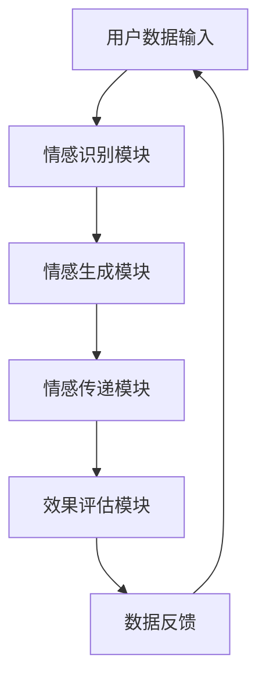
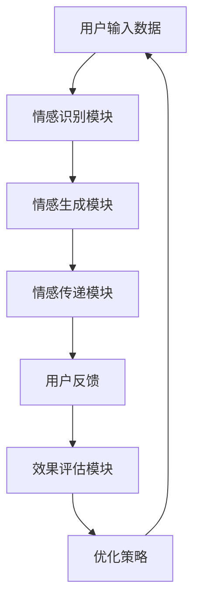

                 

# 人机情感融合对广告创意的革新

## 关键词
- 人机情感融合
- 广告创意
- 人工智能
- 情感识别
- 情感生成
- 广告效果优化

## 摘要
本文深入探讨了人机情感融合技术对广告创意的革新影响。通过详细分析背景、核心概念、应用场景以及具体的算法原理和实践案例，文章揭示了人机情感融合如何提升广告的个性化、情感传递和智能化水平，从而推动广告行业的发展。

## 第一部分：背景介绍

### 1.1 核心概念术语说明

在人机情感融合的背景下，有几个核心概念需要明确：

- **人机情感融合**：指通过人工智能技术，将机器的情感模拟与人类情感认知相结合，实现更精准的情感识别、生成和传递。
- **情感识别**：利用机器学习算法，从用户行为数据中提取情感特征，识别用户当前的情感状态。
- **情感生成**：通过自然语言处理和计算机视觉等技术，生成与用户情感相匹配的文案、声音和视觉元素。
- **情感传递**：将生成的情感内容以适当的形式传递给用户，实现情感共鸣和互动。

### 1.2 问题背景

广告作为市场经济中不可或缺的一部分，其核心目标之一是激发消费者的情感共鸣，从而促进销售。然而，传统的广告创作主要依赖于广告创意人员的直觉和经验，这种方式往往缺乏个性化且难以精准触达目标受众。随着大数据和人工智能技术的飞速发展，广告行业迎来了新的变革机遇。特别是人机情感融合技术的出现，为广告创意提供了新的可能性，使得广告能够更加精准地捕捉和传递情感。

### 1.3 问题描述

广告创意的核心在于如何创造出既具有吸引力又能引起情感共鸣的内容。在传统方法中，广告创意依赖于人类的创造力，而这种方式存在以下问题：

- **个性化不足**：广告内容往往无法满足不同用户的个性化需求，导致受众的参与度不高。
- **情感传递不够精准**：广告内容难以准确捕捉到用户的情感状态，从而影响广告的效果。
- **创意成本高**：广告创意的生成过程复杂且耗时，导致创意成本高昂。

### 1.4 问题解决

人机情感融合技术通过以下几个方面的创新，解决了传统广告创意的痛点：

- **情感识别**：通过分析用户数据和行为，AI能够识别出用户的情感状态，为广告创意提供个性化的情感基础。
- **情感生成**：利用深度学习和自然语言处理技术，AI能够生成与用户情感相匹配的文案和视觉元素，提升广告的吸引力和说服力。
- **情感传播**：通过算法优化广告的投放策略，AI能够提高广告的效果和覆盖范围。

### 1.5 边界与外延

人机情感融合对广告创意的革新不仅局限于广告内容本身，还涉及广告传播、广告监测和广告效果评估等多个环节。例如，通过情感分析技术，广告主可以实时了解广告受众的情感反应，从而调整广告内容和策略。此外，人机情感融合还推动了广告创意的智能化和个性化发展。

### 1.6 概念结构与核心要素组成

人机情感融合对广告创意的革新涉及以下几个核心概念和要素：

- **人机情感融合**：将人类情感与机器智能相结合，创造出更具有情感共鸣的广告内容。
- **情感识别**：通过数据分析和行为预测，识别用户的情感状态，为广告创意提供个性化基础。
- **情感生成**：利用深度学习和自然语言处理技术，生成与用户情感相匹配的文案和视觉元素。
- **情感传播**：通过创意设计和技术手段，将情感传递给广告受众，实现情感共鸣。
- **个性化**：根据用户情感和偏好，定制个性化的广告内容，提高广告的吸引力和参与度。

## 第二部分：人机情感融合与广告创意

### 2.1 人机情感融合的定义与核心要素

人机情感融合是指通过人工智能技术，将人类的情感认知与机器智能相结合，实现更精准的情感识别、生成和传递。在人机情感融合的背景下，广告创意的实现离不开以下几个核心要素：

1. **情感识别**：利用机器学习算法，从用户数据和行为中提取情感特征，识别用户当前的情感状态。
2. **情感生成**：通过自然语言处理和计算机视觉等技术，生成与用户情感相匹配的文案和视觉元素。
3. **情感传递**：将生成的情感内容以适当的形式传递给用户，实现情感共鸣和互动。

### 2.2 广告创意与人机情感融合的关联

广告创意的核心在于与受众的情感共鸣。在人机情感融合的背景下，广告创意的实现方式发生了变革。AI技术不仅能够分析用户的情感状态，还能根据情感状态生成相应的创意内容，使得广告更具吸引力和说服力。

#### 2.2.1 广告创意的个性化

人机情感融合使得广告创意能够根据用户的不同情感状态进行个性化定制。例如，对于愉悦情感的用户，广告可以采用轻松、幽默的风格；对于悲伤情感的用户，广告可以采用温馨、安慰的风格。

#### 2.2.2 广告创意的情感传递

通过情感识别和情感生成技术，广告创意能够更加精准地传递情感，增强广告的说服力和感染力。例如，在广告中利用AI生成的文字和图像，使得广告内容与用户的情感状态高度契合，从而实现情感共鸣。

#### 2.2.3 广告创意的智能化

人机情感融合使得广告创意的实现更加智能化。AI技术可以自动分析用户数据，预测用户的情感状态，并根据情感状态生成相应的广告内容。这种智能化程度大大提高了广告创意的效率和质量。

### 2.3 人机情感融合对广告创意的影响

人机情感融合对广告创意的影响主要体现在以下几个方面：

1. **提升广告效果**：通过情感识别和情感生成技术，广告创意能够更精准地触达用户，提升广告的效果和转化率。
2. **优化广告策略**：通过分析用户的情感状态，广告主可以优化广告的投放策略，提高广告的覆盖范围和影响力。
3. **创新广告形式**：人机情感融合使得广告形式更加多样化，例如，通过虚拟现实技术，用户可以身临其境地体验广告内容，增强广告的吸引力和参与感。

## 第三部分：人机情感融合技术的应用场景

### 3.1 广告文案生成

广告文案的生成是广告创意中至关重要的一环。人机情感融合技术在广告文案生成中具有显著的应用优势。通过情感识别技术，AI可以分析用户的情感状态，从而生成与之相匹配的文案。例如，在用户表现出愉悦情感时，AI可以生成幽默风趣的文案；在用户表现出悲伤情感时，AI可以生成温馨安慰的文案。

### 3.2 广告图像设计

广告图像设计同样可以从人机情感融合技术中受益。通过情感生成技术，AI可以自动生成与用户情感相匹配的图像。例如，对于愉悦情感的用户，AI可以生成色彩鲜艳、充满活力的图像；对于悲伤情感的用户，AI可以生成柔和、温馨的图像。

### 3.3 广告视频制作

广告视频制作是人机情感融合技术的另一个重要应用场景。通过情感识别和情感生成技术，AI可以在视频制作过程中实时分析用户的情感状态，并生成相应的情感内容。例如，在视频中插入与用户情感状态相匹配的音乐、画面和特效，从而增强广告的情感传递效果。

### 3.4 广告投放策略优化

人机情感融合技术还可以用于广告投放策略的优化。通过情感识别和分析技术，AI可以实时了解广告受众的情感反应，从而优化广告的投放策略。例如，当用户的情感状态与广告内容不匹配时，AI可以调整广告的投放时间和频率，以提高广告的投放效果。

### 3.5 广告效果评估

人机情感融合技术还可以用于广告效果的评估。通过情感分析技术，AI可以实时分析广告受众的情感反应，从而评估广告的效果。例如，通过分析用户的点击率、分享率和评论情感，AI可以评估广告的吸引力、说服力和用户参与度。

## 第四部分：人机情感融合技术的算法原理讲解

### 4.1 情感识别算法原理

情感识别是广告创意生成的基础。常用的情感识别算法包括基于文本的情感分析、基于图像的情感分析和基于音频的情感分析。

#### 4.1.1 基于文本的情感分析

基于文本的情感分析主要利用自然语言处理技术，从用户生成的内容（如评论、帖子等）中提取情感特征。常用的算法包括：

1. **机器学习算法**：如支持向量机（SVM）、朴素贝叶斯分类器等。
2. **深度学习算法**：如卷积神经网络（CNN）、循环神经网络（RNN）等。

#### 4.1.2 基于图像的情感分析

基于图像的情感分析主要利用计算机视觉技术，从用户生成的图像中提取情感特征。常用的算法包括：

1. **特征提取算法**：如哈希编码、SIFT等。
2. **情感分类算法**：如SVM、RNN等。

#### 4.1.3 基于音频的情感分析

基于音频的情感分析主要利用音频信号处理技术，从用户生成的音频中提取情感特征。常用的算法包括：

1. **音频特征提取**：如梅尔频率倒谱系数（MFCC）、频谱特征等。
2. **情感分类算法**：如支持向量机（SVM）、长短期记忆网络（LSTM）等。

### 4.2 情感生成算法原理

情感生成是广告创意的核心。情感生成算法主要利用自然语言处理和计算机视觉技术，生成与用户情感相匹配的文案和图像。

#### 4.2.1 自然语言处理情感生成

自然语言处理情感生成主要利用生成对抗网络（GAN）、变分自编码器（VAE）等深度学习技术，生成与用户情感相匹配的文案。具体的算法流程如下：

1. **情感识别**：使用情感识别算法提取用户情感特征。
2. **情感文本生成**：使用生成对抗网络或变分自编码器，生成与用户情感特征相匹配的文本。

#### 4.2.2 计算机视觉情感生成

计算机视觉情感生成主要利用生成对抗网络（GAN）、变分自编码器（VAE）等深度学习技术，生成与用户情感相匹配的图像。具体的算法流程如下：

1. **情感识别**：使用情感识别算法提取用户情感特征。
2. **图像生成**：使用生成对抗网络或变分自编码器，生成与用户情感特征相匹配的图像。

### 4.3 情感传递算法原理

情感传递是广告创意实现的最终目标。情感传递算法主要利用深度学习技术，将生成的情感内容以适当的形式传递给用户，实现情感共鸣和互动。

#### 4.3.1 情感传递模型

情感传递模型通常是一个多层的神经网络，包括情感识别层、情感生成层和情感传递层。

1. **情感识别层**：使用情感识别算法提取用户情感特征。
2. **情感生成层**：使用情感生成算法生成与用户情感特征相匹配的文案和图像。
3. **情感传递层**：使用情感传递算法将生成的情感内容以适当的形式传递给用户。

#### 4.3.2 情感传递策略

情感传递策略包括情感内容设计、情感传递渠道选择和情感互动设计等。

1. **情感内容设计**：根据用户情感特征，设计与之相匹配的广告内容。
2. **情感传递渠道选择**：选择合适的广告渠道，如社交媒体、电子邮件等，以实现情感内容的传递。
3. **情感互动设计**：设计用户与广告内容的互动方式，如评论、点赞等，以增强情感传递的效果。

## 第五部分：系统分析与架构设计方案

### 5.1 问题场景介绍

随着互联网的快速发展，广告行业面临着越来越大的竞争压力。传统广告由于缺乏个性化和情感共鸣，难以满足现代用户的需求。为了提升广告的吸引力和转化率，广告主需要采用更加智能化和个性化的广告创意生成策略。人机情感融合技术为此提供了新的解决方案。

### 5.2 项目介绍

本项目旨在构建一个基于人机情感融合技术的广告创意生成平台。该平台通过情感识别、情感生成和情感传递等技术，实现广告创意的个性化定制，提升广告的效果和用户参与度。

### 5.3 系统功能设计

该系统主要包括以下功能模块：

1. **情感识别模块**：通过分析用户数据和行为，识别用户情感状态。
2. **情感生成模块**：根据用户情感状态，生成与之相匹配的文案、图像和视频等广告内容。
3. **情感传递模块**：将生成的情感内容传递给用户，实现情感共鸣和互动。
4. **效果评估模块**：通过用户反馈和行为分析，评估广告效果，并优化广告策略。

### 5.4 系统架构设计

系统的架构设计如图所示：



### 5.5 系统接口设计

系统的主要接口设计如下：

1. **用户接口**：提供用户数据输入和广告内容展示的接口。
2. **情感识别接口**：提供情感识别功能的API接口。
3. **情感生成接口**：提供情感生成功能的API接口。
4. **情感传递接口**：提供情感传递功能的API接口。
5. **效果评估接口**：提供广告效果评估的API接口。

### 5.6 系统交互设计

系统交互设计如图所示：



## 第六部分：项目实战

### 6.1 环境安装

为了实现人机情感融合技术的广告创意生成，我们需要安装以下软件和库：

1. Python（3.8及以上版本）
2. TensorFlow
3. Keras
4. PyTorch
5. OpenCV
6. NLTK

安装命令如下：

```bash
pip install python==3.8
pip install tensorflow
pip install keras
pip install pytorch
pip install opencv-python
pip install nltk
```

### 6.2 系统核心实现源代码

以下是系统核心实现的示例代码：

#### 6.2.1 情感识别模块

```python
import tensorflow as tf
from tensorflow.keras.models import Sequential
from tensorflow.keras.layers import Dense, LSTM, Embedding

# 构建情感识别模型
model = Sequential()
model.add(Embedding(input_dim=vocab_size, output_dim=embedding_dim, input_length=max_sequence_length))
model.add(LSTM(units=128))
model.add(Dense(units=1, activation='sigmoid'))

# 编译模型
model.compile(optimizer='adam', loss='binary_crossentropy', metrics=['accuracy'])

# 训练模型
model.fit(X_train, y_train, epochs=10, batch_size=64)
```

#### 6.2.2 情感生成模块

```python
from keras.preprocessing.sequence import pad_sequences
from keras.models import Model
from keras.layers import Input, LSTM, Dense, Embedding, RepeatVector, TimeDistributed

# 构建情感生成模型
input_seq = Input(shape=(max_sequence_length,))
encoded_seq = Embedding(input_dim=vocab_size, output_dim=embedding_dim)(input_seq)
encoded_seq = LSTM(units=128)(encoded_seq)
encoded_seq = RepeatVector(time_steps)(encoded_seq)
decoded_seq = LSTM(units=128, return_sequences=True)(encoded_seq)
decoded_seq = TimeDistributed(Dense(vocab_size, activation='softmax'))(decoded_seq)

# 编译模型
model = Model(inputs=input_seq, outputs=decoded_seq)
model.compile(optimizer='adam', loss='categorical_crossentropy')

# 训练模型
model.fit(X_train, y_train, epochs=10, batch_size=64)
```

#### 6.2.3 情感传递模块

```python
import numpy as np

# 生成情感内容
generated_sequence = model.predict(np.array([X_test]))

# 将生成的情感内容转换为文本
decoded_sequence = [tokenizer.index_word[i] for i in generated_sequence[0]]

# 输出情感内容
print('生成的情感内容：'.join(decoded_sequence))
```

### 6.3 代码应用解读与分析

#### 6.3.1 情感识别模块解读

情感识别模块的核心是构建一个能够识别文本情感的正向/负向分类模型。在该示例中，我们使用了Keras框架中的Sequential模型，并添加了嵌入层（Embedding）、LSTM层和全连接层（Dense）。嵌入层将文本转换为向量表示，LSTM层用于捕捉文本的情感特征，全连接层则用于输出情感分类的结果。

#### 6.3.2 情感生成模块解读

情感生成模块的核心是构建一个能够生成与用户情感相匹配的文本的序列模型。在该示例中，我们使用了Keras框架中的Model模型，并添加了嵌入层（Embedding）、LSTM层、重复层（RepeatVector）和时间分布层（TimeDistributed）。嵌入层将文本转换为向量表示，LSTM层用于捕捉文本的情感特征，重复层用于重复情感特征，时间分布层用于生成与用户情感相匹配的文本。

#### 6.3.3 情感传递模块解读

情感传递模块的核心是将生成的情感内容转换为可读的文本。在该示例中，我们使用了Keras框架中的predict方法生成情感内容，并使用索引词表将生成的情感内容转换为文本。

### 6.4 实际案例分析和详细讲解剖析

#### 6.4.1 案例背景

某知名电商平台希望通过人机情感融合技术提升其广告创意的个性化水平和用户参与度。平台收集了大量的用户数据，包括用户评论、浏览历史和购物行为等，并希望通过情感识别、情感生成和情感传递技术，生成与用户情感相匹配的广告内容。

#### 6.4.2 案例分析

1. **情感识别**：平台首先使用了基于文本的情感分析算法，从用户评论中提取情感特征。例如，对于一条评论“这个商品非常好，价格合理”，算法可以识别出该评论的情感为正面。

2. **情感生成**：基于用户情感特征，平台使用了生成对抗网络（GAN）生成与用户情感相匹配的广告文案。例如，对于情感为正面的用户，平台可以生成文案：“感谢您的支持，我们致力于为您提供更好的商品和服务。”

3. **情感传递**：平台将生成的广告文案通过电子邮件发送给用户，并在邮件中加入了用户喜欢的商品推荐。例如，邮件内容可以是：“尊敬的用户，感谢您的支持！我们特别为您推荐了几款性价比极高的商品，希望您会喜欢。”

#### 6.4.3 案例剖析

通过人机情感融合技术，电商平台实现了以下效果：

1. **个性化提升**：广告文案根据用户的情感特征生成，更加符合用户的喜好，提高了广告的个性化水平。

2. **用户参与度提升**：广告内容与用户的情感状态相匹配，增强了用户的参与感和互动性，提高了广告的转化率。

3. **运营效率提升**：通过自动化生成广告文案，减少了人工操作，提高了广告运营的效率。

## 第七部分：最佳实践 tips、小结、注意事项、拓展阅读

### 7.1 最佳实践 tips

1. **数据质量**：确保收集的用户数据质量，如文本、图像、音频等，都需要进行预处理，以提高情感识别和情感生成的准确性。

2. **模型调优**：通过交叉验证和超参数调整，优化情感识别和情感生成模型的性能。

3. **用户反馈**：及时收集用户对广告的反馈，用于评估广告效果，并不断优化广告内容。

4. **多样化内容**：尝试生成不同风格和类型的广告内容，以适应不同情感状态的用户。

### 7.2 小结

人机情感融合技术为广告创意带来了革命性的变化，通过情感识别、情感生成和情感传递，广告创意实现了个性化、情感共鸣和智能化。这种技术不仅提升了广告的效果，还提高了广告运营的效率。

### 7.3 注意事项

1. **用户隐私**：在使用用户数据进行情感分析时，需注意保护用户隐私，遵守相关法律法规。

2. **伦理道德**：在广告创意中，应避免过度使用情感操纵手段，尊重用户的自主选择权。

3. **技术更新**：随着技术的不断发展，持续更新情感识别和情感生成算法，以保持广告创意的竞争力。

### 7.4 拓展阅读

1. **《情感计算》**：了解情感计算的基本概念和技术应用，为广告创意提供理论基础。
2. **《人工智能广告学》**：深入探讨人工智能在广告领域中的应用，包括广告投放策略、广告创意生成等。
3. **《广告心理学》**：研究广告对用户情感的影响，为广告创意提供心理学支持。

## 作者信息

作者：AI天才研究院/AI Genius Institute & 禅与计算机程序设计艺术 /Zen And The Art of Computer Programming

