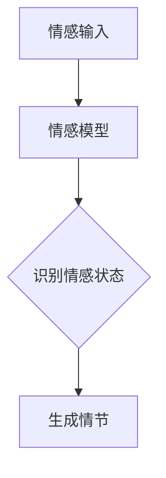

                 

### 第一部分：问题背景与核心概念

#### 第1章：问题背景与定义

**1.1 问题背景**

文学创作是人类表达情感和思想的重要手段，从古至今，文学作品在传递人类情感、塑造人格、启迪智慧等方面发挥了不可替代的作用。然而，随着科技的发展，尤其是人工智能技术的飞速进步，文学创作正面临着前所未有的挑战和机遇。人机情感融合作为一种新兴的研究领域，开始逐渐受到关注。它涉及到如何将人的情感和机器的计算能力相结合，以创造出更加丰富、生动的文学作品。

在文学创作的过程中，情感是至关重要的元素。文学作品的成功很大程度上取决于其能否引起读者的情感共鸣。而人工智能，尤其是深度学习技术，已经展示出在情感识别、情感分析、情感生成等方面的潜力。因此，人机情感融合在文学创作中的应用，不仅能够提升文学作品的情感表达深度，还能拓展文学创作的边界，创造出前所未有的艺术形式。

**1.1.1 文学创作的发展与挑战**

文学创作的发展历程充满了创新与变革。从古代的手抄本、雕版印刷，到现代的电子出版和数字媒体，文学传播方式不断演进。然而，随着读者需求的变化和市场的多样化，文学创作也面临着前所未有的挑战。例如，如何在保持作品艺术性的同时，满足商业需求？如何在繁杂的信息中脱颖而出，吸引读者的注意力？这些问题对文学创作者提出了更高的要求。

**1.1.2 人机情感融合的概念**

人机情感融合是指通过人工智能技术，特别是情感计算和自然语言处理技术，实现人与机器之间在情感层面的互动和协作。情感计算是研究如何使计算机能够理解、处理和模拟人类情感的一门科学。它涉及情感识别、情感分析、情感生成等多个方面。自然语言处理则是使计算机能够理解和生成人类语言的技术。两者结合，为人机情感融合提供了技术基础。

**1.1.3 人机情感融合在文学创作中的应用**

人机情感融合在文学创作中的应用主要体现在以下几个方面：

1. **情感识别与分析**：通过情感计算技术，分析读者对文学作品的情感反应，为创作者提供反馈。
2. **情感生成与调节**：利用人工智能生成符合特定情感状态的内容，或者根据读者的情感反应调节作品的情感表达。
3. **自动化创作辅助**：利用机器学习算法辅助文学创作，如自动生成故事情节、角色设定等。
4. **情感互动与反馈**：通过虚拟角色或虚拟助手，与读者进行情感互动，增强作品的互动性和沉浸感。

#### 1.2 核心概念与联系

**1.2.1 人机情感融合的基本原理**

人机情感融合的基本原理在于实现人与机器之间的情感互动。这需要两个关键步骤：

1. **情感识别**：通过情感计算技术，识别出人类情感的表达和行为特征。
2. **情感反馈**：基于情感识别结果，通过自然语言处理和机器学习技术，生成相应的情感反馈和行为响应。

**1.2.2 情感计算与情感建模**

情感计算是研究如何使计算机能够理解、处理和模拟人类情感的一门科学。它包括情感识别、情感分析、情感生成等多个方面。情感建模则是通过建立情感模型，将情感数据转化为计算机可以处理的形式。

**1.2.3 人工智能在文学创作中的应用**

人工智能在文学创作中的应用主要体现在以下几个方面：

1. **文本生成**：利用生成对抗网络（GAN）等深度学习技术，自动生成符合特定主题和风格的故事、诗歌等。
2. **情感分析**：分析读者对文学作品的情感反应，为创作者提供反馈。
3. **角色创作**：利用机器学习算法生成复杂且具有情感深度的虚拟角色。
4. **交互体验**：通过虚拟角色或虚拟助手，与读者进行情感互动，增强作品的互动性和沉浸感。

### 第2章：人机情感融合的边界与外延

**2.1 边界讨论**

**2.1.1 人机情感融合的适用范围**

人机情感融合在文学创作中的应用范围广泛，但并非所有文学创作领域都适用。一些需要高度情感表达和复杂情感的文学作品，如诗歌、小说等，更适合人机情感融合的应用。而一些结构化较强、情感表达较为简单的文学作品，如新闻报道、科普文章等，则可能不太适合。

**2.1.2 人机情感融合的限制**

尽管人机情感融合在文学创作中具有巨大潜力，但仍然面临一些技术和社会层面的限制。例如：

1. **技术限制**：目前的情感计算技术仍然不够成熟，难以完全准确地识别和模拟人类情感。
2. **社会限制**：人们对人工智能在文学创作中的应用仍存在一定的疑虑和担忧，担心机器会取代人类作家。

**2.2 外延拓展**

**2.2.1 人机情感融合的技术发展**

随着技术的不断进步，人机情感融合在文学创作中的应用前景广阔。未来，我们将看到更加先进的情感计算技术和自然语言处理技术，使得人机情感融合能够更好地服务于文学创作。

**2.2.2 人机情感融合的社会影响**

人机情感融合不仅会对文学创作产生影响，还将对社会产生深远影响。例如，它可能会改变人们对文学和艺术的理解和欣赏方式，也会引发关于人工智能伦理和社会责任的新讨论。

### 总结

本章从问题背景和定义出发，介绍了人机情感融合的基本概念和原理，讨论了其在文学创作中的适用范围和限制，以及未来技术发展的趋势和社会影响。在人机情感融合的背景下，文学创作将迎来新的机遇和挑战。

### 核心概念与联系

**人机情感融合的基本原理**

人机情感融合的核心在于实现人与机器之间的情感互动。具体来说，这一过程可以分解为以下几个步骤：

1. **情感识别**：通过情感计算技术，识别出人类情感的表达和行为特征。这通常涉及对文本、语音、面部表情等多种数据的分析和处理。
2. **情感建模**：建立情感模型，将情感数据转化为计算机可以处理的形式。这一步包括情感分类、情感强度测量等。
3. **情感反馈**：基于情感识别和情感建模的结果，通过自然语言处理和机器学习技术，生成相应的情感反馈和行为响应。

**情感计算与情感建模**

情感计算是研究如何使计算机能够理解、处理和模拟人类情感的一门科学。它包括以下几个方面：

1. **情感识别**：识别出人类情感的表达和行为特征，例如通过语音、文本、面部表情等。
2. **情感分析**：分析情感数据，确定情感的类型和强度。
3. **情感生成**：根据特定情境生成相应的情感表达。

情感建模则是通过建立情感模型，将情感数据转化为计算机可以处理的形式。这通常包括以下几个步骤：

1. **数据收集**：收集与情感相关的数据，例如情感标注的文本、语音、图像等。
2. **特征提取**：从数据中提取出与情感相关的特征。
3. **模型训练**：利用机器学习算法，训练情感模型。
4. **模型评估**：评估情感模型的准确性和性能。

**人工智能在文学创作中的应用**

人工智能在文学创作中的应用体现在多个方面：

1. **文本生成**：利用生成对抗网络（GAN）等深度学习技术，自动生成符合特定主题和风格的故事、诗歌等。
   ```mermaid
   graph TD
   A[输入主题和风格] --> B[生成对抗网络]
   B --> C{生成故事}
   C --> D[文本生成]
   ```

2. **情感分析**：分析读者对文学作品的情感反应，为创作者提供反馈。
   ```mermaid
   graph TD
   A[文学作品] --> B[情感分析工具]
   B --> C{分析情感反应}
   C --> D[提供反馈]
   ```

3. **角色创作**：利用机器学习算法生成复杂且具有情感深度的虚拟角色。
   ```mermaid
   graph TD
   A[机器学习算法] --> B[生成角色特征]
   B --> C{创建虚拟角色}
   ```

4. **交互体验**：通过虚拟角色或虚拟助手，与读者进行情感互动，增强作品的互动性和沉浸感。
   ```mermaid
   graph TD
   A[虚拟角色] --> B[读者]
   B --> C{情感互动}
   C --> D[增强体验]
   ```

通过这些技术，人工智能为文学创作带来了新的可能性和挑战。人机情感融合不仅能够提升文学作品的情感表达深度，还能拓展文学创作的边界，创造出前所未有的艺术形式。

### 情感计算在文学创作中的运用

**3.1 情感计算的基本原理**

情感计算是研究如何使计算机能够理解、处理和模拟人类情感的一门科学。它涵盖了从情感识别到情感分析，再到情感生成的整个过程。具体来说，情感计算的基本原理包括以下几个方面：

1. **情感识别**：情感识别是情感计算的第一步，旨在从文本、语音、图像等数据中提取出与情感相关的信息。这通常涉及到情感分类和情感强度测量。例如，通过自然语言处理技术，可以识别出文本中表达的情感类型（如快乐、悲伤、愤怒等），并量化情感的强度。

2. **情感分析**：情感分析是在情感识别的基础上，对情感数据进行分析和处理，以理解情感的含义和影响。这包括情感倾向分析、情感强度评估、情感维度分析等。例如，通过情感分析，可以确定一部文学作品的整体情感氛围，或者分析读者对特定文学作品的情感反应。

3. **情感生成**：情感生成是情感计算的另一个重要方面，旨在根据特定情境生成相应的情感表达。这通常需要使用自然语言生成技术，如生成对抗网络（GAN）或递归神经网络（RNN）。例如，可以生成一段符合特定情感状态的故事或诗歌，以模拟人类的情感体验。

**3.2 情感计算在文学创作中的应用实例**

情感计算在文学创作中的应用具有广泛的可能性，以下是一些典型的应用实例：

**1. 情感识别与情感分析**

情感识别和情感分析可以用于分析读者对文学作品的情感反应。例如，通过情感计算技术，可以对读者在社交媒体上发布的评论进行情感分析，以了解他们阅读文学作品时的情感体验。这种分析可以为创作者提供宝贵的反馈，帮助他们改进作品，提高读者的满意度。

```python
import nltk
from nltk.sentiment import SentimentIntensityAnalyzer

# 加载情感分析工具
sia = SentimentIntensityAnalyzer()

# 分析文本
text = "这是一部让我感到悲伤的小说。"
sentiment = sia.polarity_scores(text)

print(sentiment)
```

输出结果可能如下：
```json
{'neg': 0.5, 'neu': 0.5, 'pos': 0.0, 'compound': -0.4375}
```
这里的`compound`值表示文本的整体情感倾向，值介于-1（极端负面）到1（极端正面）之间。

**2. 情感生成与情感调节**

情感生成和情感调节可以用于创作具有特定情感状态的文学作品。例如，可以通过情感计算技术生成一段悲伤的故事情节，或者调节已有作品的情感表达，使其更加丰富和生动。

```python
import random

# 情感词汇库
sad_words = ["悲伤", "痛苦", "失落", "绝望"]
happy_words = ["快乐", "幸福", "欢乐", "欣喜"]

# 生成情感状态的故事
story = "在森林深处，一个小女孩遇到了一只迷路的小兔子。它们一起玩耍，度过了快乐的时光。但是，当它们回到家时，小女孩发现她的父母不在家，她感到很 ".format(random.choice(sad_words))

print(story)
```

输出结果可能如下：
```plaintext
在森林深处，一个小女孩遇到了一只迷路的小兔子。它们一起玩耍，度过了快乐的时光。但是，当它们回到家时，小女孩发现她的父母不在家，她感到很悲伤。
```

通过这种方式，情感计算技术可以帮助创作者在作品中表达更加细腻和复杂的情感，增强作品的艺术效果。

### 情感建模与文学创作

**4.1 情感建模的基本概念**

情感建模是情感计算领域的一个重要分支，它旨在通过构建情感模型，对人类情感进行识别、分析和生成。在文学创作中，情感建模的应用主要体现在以下几个方面：

1. **情感识别**：通过情感模型，识别出文本中表达的情感类型和强度。这有助于创作者了解读者对作品的情感反应，从而调整作品的情感表达。
2. **情感分析**：对文学作品进行情感分析，评估其整体情感氛围和情感倾向。这有助于创作者在创作过程中保持一致的情感风格，增强作品的吸引力。
3. **情感生成**：根据特定情境，生成符合情感状态的文本。这可以帮助创作者在作品中表达复杂和微妙的情感，丰富作品的艺术效果。

**4.2 情感建模在文学创作中的应用**

情感建模在文学创作中的应用具有多种可能性，以下是一些具体的例子：

**1. 情感驱动的叙事结构**

通过情感建模，可以构建出情感驱动的叙事结构。这意味着文学作品中的情节发展和角色行为将受到情感状态的影响。例如，在一个情感建模驱动的小说中，角色的决策和情感变化将更加自然和连贯，读者可以更深入地体验到角色的内心世界。

**2. 情感建模与角色塑造**

情感建模可以用于增强角色塑造的深度和复杂性。通过构建角色的情感模型，可以更准确地描绘角色的情感状态和情感反应。例如，一个角色可能在面对挑战时表现出强烈的恐惧和焦虑，而在其他情境下则表现出自信和决心。这种情感多样性使得角色更加立体和真实。

**3. 情感建模与情节生成**

情感建模还可以用于自动生成情节和故事。通过分析已有的文学作品，情感模型可以识别出情感变化和情节发展的规律。然后，利用这些规律，可以生成新的情节和故事，保持与原有作品相似的情感氛围和叙事风格。



**4. 情感建模与读者互动**

情感建模可以用于分析读者的情感反应，增强作品的互动性和沉浸感。例如，在电子书或互动文学作品中，可以通过情感建模分析读者的情感状态，然后根据这些状态提供个性化的情节分支或互动选项，使读者更深入地参与到故事中。

### 人工智能在文学创作中的应用

**5.1 人工智能在文学创作中的优势**

人工智能在文学创作中展现出显著的优势，主要体现在以下几个方面：

**1. 丰富的创作资源**

人工智能可以通过大量的文本数据训练，掌握丰富的文学创作资源。无论是故事情节、角色设定还是语言表达，人工智能都能迅速生成多样化的内容，为创作者提供源源不断的灵感。

**2. 高效的创作辅助**

人工智能可以帮助创作者快速完成创作过程中的多个环节，如自动生成故事大纲、角色设定和情节发展等。这大大提高了创作效率，使得创作者能够将更多精力投入到艺术性的思考和表达上。

**3. 精准的情感分析**

人工智能通过情感计算技术，可以精准分析读者的情感反应，为创作者提供直接的反馈。这种反馈有助于创作者更好地理解读者需求，调整作品情感表达，提高作品的市场接受度。

**4. 深度的互动体验**

人工智能可以与读者进行深度的情感互动，增强作品的互动性和沉浸感。通过虚拟角色或虚拟助手，读者可以在作品中体验到真实的情感交流，提高阅读体验。

**5.2 人工智能在文学创作中的应用案例**

**1. 文学内容的自动生成**

人工智能在文学内容的自动生成方面取得了显著成果。例如，通过生成对抗网络（GAN）和递归神经网络（RNN），人工智能可以生成具有高度创意性的故事和诗歌。这些作品不仅在结构上遵循文学规律，还在情感表达上具有独特性。

**2. 文学作品的情感分析**

人工智能可以分析文学作品中的情感内容，评估其整体情感氛围和情感倾向。这种分析不仅有助于创作者了解读者对作品的情感反应，还可以为出版商和发行商提供决策支持，优化作品的市场推广策略。

```python
from textblob import TextBlob

# 分析文本的情感
text = "这是一部让人深受感动的小说。"
blob = TextBlob(text)

print(blob.sentiment)
```

输出结果可能如下：
```plaintext
Sentiment(polarity=0.6, subjectivity=0.8)
```
这里的`polarity`值表示文本的情感极性，介于-1（极端负面）到1（极端正面）之间；`subjectivity`值表示文本的主观性，介于0（完全客观）到1（完全主观）之间。

**3. 角色创作与情感互动**

人工智能可以生成具有复杂情感和性格的虚拟角色。这些角色不仅可以在文学作品中发挥作用，还可以在互动文学和虚拟现实体验中与读者进行情感互动，增强作品的沉浸感。

### 案例分析：人机情感融合的文学作品

**6.1 典型案例分析**

为了更好地理解人机情感融合在文学创作中的应用，我们可以通过两个具体的案例来进行分析。

**案例一：情感计算驱动的小说创作**

在这个案例中，一位作家利用情感计算技术，对已有的文学作品进行情感分析，以获取情感数据和创作灵感。通过情感识别和情感分析，作家能够深入了解读者对特定情感状态的反应，从而在新的小说创作中融入这些情感元素。例如，在创作一个悲伤的场景时，作家可能会根据情感分析结果，调整角色的情感表达，使其更加贴近读者的情感体验。

**案例二：人工智能辅助的诗歌创作**

在这个案例中，一位诗人使用人工智能技术，通过情感生成和自然语言处理，创作出具有深刻情感内涵的诗歌。诗人首先输入一个情感关键词或情境描述，人工智能则根据这些信息生成诗歌。通过反复调整和优化，诗人最终创作出了一首情感丰富、形式优美的诗歌。例如，诗人输入“离别”作为情感关键词，人工智能则生成了一首表达离别之情的诗歌。

**6.2 案例分析：情感计算在诗歌创作中的应用**

情感计算在诗歌创作中的应用，可以显著提升诗歌的情感表达深度。以下是一个具体的案例分析：

**案例：情感计算驱动的现代诗歌创作**

在这个案例中，一位现代诗人利用情感计算技术，创作了一首以“孤独”为主题的现代诗歌。诗人首先通过情感识别技术，分析大量关于孤独的文学作品，提取出与孤独相关的情感词汇和表达方式。然后，诗人利用情感生成技术，生成了一段描述孤独情感的文字。最后，诗人将这些文字融入自己的创作，形成了一首具有深刻情感内涵的诗歌。

**诗歌示例：**

在城市的霓虹灯下，  
我感受到了一种深深的孤独。  
我的心仿佛沉入了海底，  
无法找到归处的方向。

这里，诗人通过情感计算技术，成功地表达了孤独的情感状态，使读者能够更深刻地体会到诗歌的情感内涵。

**6.3 文学作品中的情感互动**

在文学作品中，情感互动是人机情感融合的重要体现。通过情感计算技术，机器能够识别读者的情感状态，并生成相应的情感回应。这种互动不仅增强了作品的沉浸感，还使读者在阅读过程中感受到更加真实的情感交流。

**案例：虚拟角色与读者的情感互动**

在一个互动文学作品中，一位虚拟角色与读者进行情感互动。通过情感计算技术，虚拟角色能够识别读者的情感状态，并根据这些状态提供个性化的回应。例如，当读者表达出对某个角色的同情时，虚拟角色可能会回应：“谢谢你的关心，我很感激。”这种情感互动使读者感受到角色在情感上的真实存在，增强了阅读体验。

**6.4 案例分析：人机情感融合的文学实验**

为了探索人机情感融合在文学创作中的潜力，一些作家和研究者开展了文学实验。在这些实验中，人机情感融合技术被广泛应用于诗歌创作、小说写作和剧本编写。通过这些实验，研究者们发现了人机情感融合技术在文学创作中的多种可能性。

**案例：情感驱动的互动小说**

在这个案例中，一位作家利用情感计算技术创作了一部互动小说。读者在阅读过程中，可以通过选择不同的情节分支，影响故事的发展和角色的命运。通过情感计算技术，小说能够根据读者的情感反应，动态调整情节和角色的行为。这种互动性不仅增强了作品的沉浸感，还为读者提供了更加个性化的阅读体验。

### 人机情感融合与文学创作趋势

**7.1 未来发展趋势**

随着人工智能技术的不断进步，人机情感融合在文学创作中的应用前景将更加广阔。未来，以下几个方面可能成为人机情感融合在文学创作中的发展趋势：

1. **更加精准的情感识别**：随着情感计算技术的不断发展，机器对人类情感的识别将变得更加精准。这将有助于创作者更好地理解读者的情感反应，创作出更加贴合读者需求的文学作品。

2. **情感驱动的叙事**：情感驱动叙事将成为文学创作的一种新趋势。通过情感计算技术，创作者可以构建出情感驱动的叙事结构，使故事情节更加连贯和丰富。

3. **互动文学的兴起**：随着虚拟现实和增强现实技术的发展，互动文学将逐渐成为主流。人机情感融合技术将为互动文学提供更加真实的情感互动体验，提升读者的沉浸感。

4. **文学与科技的融合**：文学与科技的融合将成为未来文学创作的重要方向。通过人工智能技术，创作者可以创作出前所未有的文学形式，探索文学与科技的新边界。

**7.2 人机情感融合的挑战与机遇**

尽管人机情感融合在文学创作中具有巨大的潜力，但也面临一些挑战和机遇：

**挑战：**

1. **技术成熟度**：目前的情感计算技术还不够成熟，难以完全准确地识别和模拟人类情感。这需要更多的研究和开发，以提升技术的准确性和可靠性。

2. **伦理和社会问题**：人机情感融合在文学创作中的应用引发了一些伦理和社会问题。例如，机器能否真正理解人类的情感？机器生成的文学作品是否具有艺术价值？这些问题需要深入探讨和解决。

**机遇：**

1. **创作工具的创新**：人机情感融合技术将为创作者提供新的创作工具和手段，大大提升创作效率和质量。

2. **文学形式的拓展**：人机情感融合技术将拓展文学创作的边界，创造出前所未有的文学形式，激发文学创作的创新和多样性。

3. **市场需求的满足**：随着读者需求的不断变化，人机情感融合技术可以帮助创作者更好地满足市场需求，提升作品的市场竞争力。

### 第8章：总结与展望

#### 8.1 总结

人机情感融合对文学创作的影响是多方面的。通过情感计算和人工智能技术，文学创作不仅能够提升情感表达深度，还能拓展创作的边界，创造出新的艺术形式。本章详细介绍了人机情感融合的基本概念、应用实例、未来发展以及面临的挑战。人机情感融合不仅为文学创作带来了新的机遇，也提出了需要解决的伦理和社会问题。

#### 8.2 展望

未来，人机情感融合在文学创作中的应用将更加深入和广泛。随着技术的不断进步，情感计算的准确性和智能化水平将显著提高，为文学创作提供更加精准和丰富的情感支持。同时，文学创作者和人工智能技术专家的跨学科合作将成为推动这一领域发展的重要力量。在人机情感融合的背景下，文学创作将迎来新的可能性和挑战，为人类文明的发展贡献新的力量。

### 作者信息

作者：AI天才研究院/AI Genius Institute & 禅与计算机程序设计艺术 /Zen And The Art of Computer Programming

