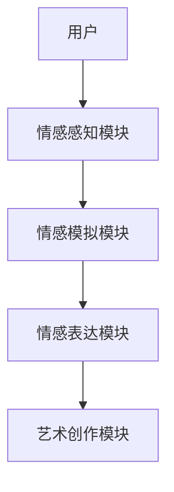
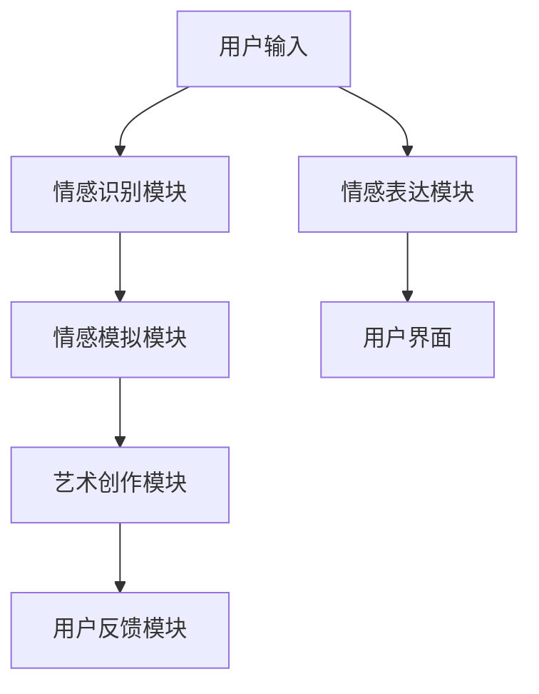
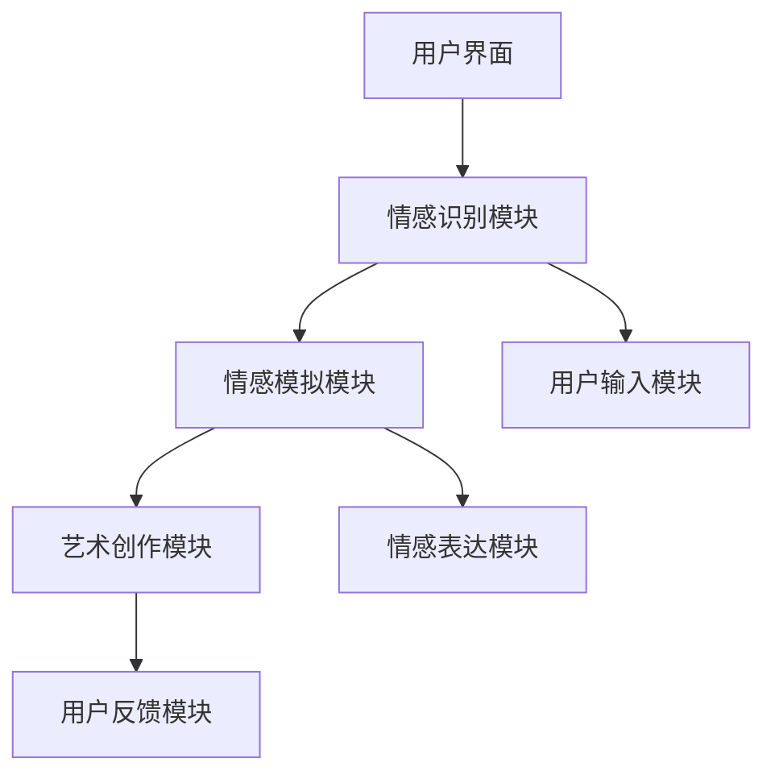

                 

### 第1章 引言

#### 1.1 问题背景

在当今这个数字时代，艺术创作与技术融合的趋势愈发明显。人工智能（AI）的迅猛发展，为人机情感融合带来了新的可能性和挑战。人机情感融合，指的是通过人工智能技术，使机器能够理解、模拟和表达情感，进而与人类在情感层面上进行交流和互动。这一技术的出现，不仅拓展了人类艺术创作的手段，也为艺术与技术的深度融合提供了新的思路。

首先，我们需要明确人机情感融合的定义。人机情感融合涉及多个层次，包括情感识别、情感模拟和情感表达。在情感识别方面，人工智能可以通过机器学习算法，对用户输入的文本、语音或图像进行情感分析，识别出用户的情感状态。在情感模拟方面，人工智能可以基于情感识别的结果，生成相应的情感反应，模拟人类的情感体验。在情感表达方面，人工智能可以通过生成文本、图像或声音，将情感表达出来，与人类进行情感交流。

人机情感融合在艺术创作中的意义不可忽视。传统的艺术创作依赖于艺术家的情感体验和表达，而人机情感融合可以使机器参与到艺术创作中，为艺术创作提供新的视角和手段。例如，在音乐创作中，人工智能可以根据用户的情感状态，生成符合用户情感的旋律；在绘画创作中，人工智能可以根据用户提供的情感描述，生成相应的图像。这种人机协作的艺术创作方式，不仅丰富了艺术创作的形式，也为艺术创作带来了更多的可能性。

然而，人机情感融合在艺术创作中的应用也面临着一些挑战。首先，情感识别和模拟的准确性是一个关键问题。目前的情感识别技术，虽然已经取得了一定的成果，但在复杂情感和情境识别方面，仍存在一定的局限性。其次，伦理问题也是人机情感融合在艺术创作中需要考虑的重要因素。如何确保人工智能在艺术创作中的行为符合道德规范，避免出现滥用技术的情况，是需要深入探讨的问题。此外，用户接受度也是一个重要的挑战。对于传统艺术家来说，人机情感融合可能是一种颠覆性的创新，如何让用户接受并适应这种新的创作方式，是艺术创作领域需要面对的问题。

总的来说，人机情感融合为艺术创作带来了新的机遇和挑战。通过深入探讨人机情感融合在艺术创作中的应用，我们可以更好地理解这种技术对艺术创作的影响，为未来的艺术创作提供更多的可能性。

#### 1.2 艺术创作的情感需求

艺术创作的核心在于情感表达。情感是艺术作品的灵魂，它能够触动观众的心灵，引起共鸣。因此，艺术创作过程中的情感需求至关重要。传统的艺术创作依赖于艺术家的情感体验和表达，艺术家通过自身的情感体验，将情感转化为艺术形式，创作出具有感染力的作品。

在艺术创作中，情感需求主要体现在以下几个方面：

1. **情感的准确识别**：艺术家需要准确识别和把握自己的情感状态，并将其转化为艺术形式。这要求艺术家具备敏锐的情感感知能力，能够深刻地理解自己的情感体验。

2. **情感的多样表达**：艺术创作需要表达多样的情感，如快乐、悲伤、愤怒、恐惧等。不同的情感可以带来不同的艺术效果，丰富艺术作品的表现力。

3. **情感的共鸣**：艺术作品能够引起观众的共鸣，这是艺术创作的最终目标。艺术家通过情感表达，试图与观众建立情感上的联系，使观众在观看作品时，产生共鸣和情感共振。

人机情感融合在这一过程中能够发挥重要作用。首先，人工智能可以通过情感识别技术，帮助艺术家准确识别和把握自己的情感状态。例如，通过分析艺术家的语音、文字或面部表情，人工智能可以识别出艺术家的情感状态，并提供相应的反馈和建议。

其次，人工智能可以帮助艺术家实现情感的多样表达。例如，在音乐创作中，人工智能可以根据艺术家的情感状态，生成符合情感旋律；在绘画创作中，人工智能可以根据艺术家的情感描述，生成相应的图像。这种多样化的情感表达，有助于艺术家创作出更加丰富和有深度的作品。

最后，人机情感融合还可以帮助艺术家与观众建立情感共鸣。通过分析观众的情感反应，人工智能可以生成与观众情感状态相符的艺术作品，从而更好地引起观众的共鸣。

总之，人机情感融合为艺术创作提供了新的工具和方法，有助于艺术家更准确地识别和表达情感，实现情感的多样化和共鸣。通过这种技术的应用，艺术创作将迎来新的发展机遇。

#### 1.3 人工智能在艺术创作中的应用现状

人工智能（AI）在艺术创作中的应用正日益广泛，从音乐、绘画到文学、电影等多个领域，都见证了人工智能的神奇力量。目前，人工智能在艺术创作中的应用主要体现在以下几个方面：

1. **音乐创作**：人工智能在音乐创作中具有显著的优势。例如，AIVA（Artificial Intelligence Virtual Artist）是一个利用AI进行音乐创作的系统，它能够分析大量的音乐数据，理解音乐的结构和风格，进而创作出独特的音乐作品。AIVA创作的音乐已经获得了国际认可，甚至在国际音乐比赛中获得了奖项。此外，Google的Magenta项目也在探索使用深度学习技术进行音乐创作，通过分析用户的喜好，生成个性化的音乐推荐。

2. **绘画创作**：人工智能在绘画创作中的应用也备受关注。例如，DeepArt.io使用深度学习算法，将用户的照片转换成艺术大师风格的画作。通过分析大量艺术作品，DeepArt.io可以学习不同的绘画风格，然后将这些风格应用到用户提供的图像上。这种技术不仅使非专业用户能够创作出风格独特的艺术作品，也为艺术家提供了新的创作工具。

3. **文学创作**：人工智能在文学创作中的应用同样引人注目。例如，GPT-3（Generative Pre-trained Transformer 3）是一个强大的自然语言处理模型，它能够生成高质量的文本。OpenAI使用GPT-3创作了小说、诗歌和新闻文章，展示了人工智能在文学创作方面的潜力。尽管这些作品还不能完全媲美人类作家的作品，但它们无疑为文学创作带来了新的可能性。

4. **电影制作**：人工智能在电影制作中的应用主要体现在特效制作和剧本生成等方面。例如，DeepMind开发的程序能够生成逼真的电影特效，从而节省制作成本和时间。此外，一些公司已经开始尝试使用人工智能生成剧本，通过分析大量的剧本和电影数据，人工智能可以提出创意和故事情节，为电影制作提供灵感。

5. **艺术市场分析**：人工智能不仅在艺术创作中发挥作用，还在艺术市场的分析中扮演重要角色。例如，Art Recognition使用AI技术对艺术品进行分类和分析，帮助艺术收藏家和投资者更好地理解和评估艺术品的价值。此外，人工智能还可以分析艺术市场的趋势和动向，为艺术市场的预测提供数据支持。

总的来说，人工智能在艺术创作中的应用已经取得了一定的成果，它不仅丰富了艺术创作的形式，也为艺术家提供了新的工具和方法。然而，要充分发挥人工智能在艺术创作中的作用，还需要解决一系列技术、伦理和用户接受度等问题。通过不断的探索和实践，我们有理由相信，人工智能将在未来的艺术创作中发挥更加重要的作用。

#### 1.4 人机情感融合的挑战与机遇

人机情感融合作为一种前沿技术，虽然在艺术创作中展示了巨大的潜力，但其在实现和应用过程中也面临着一系列的挑战和机遇。

**挑战：**

1. **技术实现难题**：情感识别和模拟是人工智能领域的难点之一。目前，虽然已有一些先进的算法和技术能够进行情感识别，但其在复杂情感和情境识别方面仍然存在局限性。例如，情感的多样性和微妙的情感变化难以被完全捕捉和模拟。此外，情感输出的自然性和连贯性也是一个技术难题。

2. **伦理问题**：人机情感融合涉及到伦理和道德问题，如人工智能在艺术创作中的行为是否符合道德规范，如何防止技术滥用等。例如，如果人工智能在艺术创作中产生了不当的情感输出，可能会对用户产生负面影响。

3. **用户接受度**：对于传统艺术家和艺术爱好者来说，人机情感融合可能是一种颠覆性的创新。他们可能需要时间来适应和接受这种新的创作方式。此外，用户对人工智能创作的艺术作品是否认可，也是需要考虑的问题。

**机遇：**

1. **技术创新**：随着人工智能技术的不断进步，人机情感融合将拥有更多的实现可能性。例如，深度学习、自然语言处理和计算机视觉等技术的提升，将为情感识别和模拟提供更强的支持。

2. **情感化设计**：人机情感融合可以应用于情感化设计，为用户提供更加个性化、人性化的体验。例如，在交互设计、游戏设计等领域，通过理解用户的情感状态，提供更符合用户需求的服务。

3. **个性化创作**：人机情感融合可以为艺术创作提供个性化的解决方案。例如，通过分析用户的情感状态，人工智能可以生成符合用户情感需求的音乐、绘画作品等，满足用户的个性化需求。

总之，人机情感融合在艺术创作中的应用既面临挑战，也充满机遇。通过不断的技术创新和实践探索，我们有理由相信，人机情感融合将在未来为艺术创作带来更多可能性。

### 第2章 核心概念与联系

#### 2.1 人机情感融合的概念

人机情感融合是指利用人工智能技术，使机器能够理解、模拟和表达情感，从而与人类在情感层面上进行交流和互动。这一概念涉及多个层次，包括情感识别、情感模拟和情感表达。

**情感识别**：指人工智能通过分析用户的语音、文本或面部表情等数据，识别出用户的情感状态。这一过程通常依赖于机器学习算法，通过对大量情感数据的训练，模型能够学会识别不同的情感类别。

**情感模拟**：指人工智能根据情感识别的结果，生成相应的情感反应。这种模拟不仅限于情感表达，还可以包括情感理解和情感推理。例如，如果用户表达出快乐的情感，人工智能可以生成一个快乐的表情或声音作为回应。

**情感表达**：指人工智能通过生成文本、图像或声音等方式，将情感表达出来。这一过程需要人工智能具备生成和理解情感内容的能力，从而能够创造出与人类情感体验相似的表达。

人机情感融合的核心在于实现人工智能与人类在情感上的共鸣和互动。这不仅要求人工智能能够准确识别和模拟情感，还需要在情感表达上自然流畅，使人类感受到真实而深刻的情感体验。

#### 2.2 核心概念属性特征对比表格

为了更好地理解人机情感融合与传统艺术创作之间的差异，我们可以通过一个属性特征对比表格来展示它们的主要区别。

| 特征        | 人机情感融合 | 传统艺术创作 |
| ----------- | ------------ | ------------ |
| **理解情感** | 是           | 否           |
| **表达情感** | 是           | 是           |
| **交互情感** | 是           | 否           |
| **多样化**   | 高           | 中等         |
| **个性化**   | 强           | 弱           |
| **准确性**   | 高           | 中等         |
| **自然性**   | 中           | 高           |

**理解情感**：人机情感融合能够通过机器学习算法理解情感，而传统艺术创作则依赖于艺术家的情感体验。

**表达情感**：传统艺术创作和人工智能都能表达情感，但人机情感融合可以通过生成文本、图像和声音等多种形式来表达，而传统艺术创作通常局限于一种或几种形式。

**交互情感**：人机情感融合可以与用户进行情感交互，而传统艺术创作则主要依赖观众的情感共鸣。

**多样化**：人工智能能够生成多种情感，而传统艺术创作则依赖于艺术家的情感表达多样性。

**个性化**：人机情感融合可以根据用户情感状态提供个性化创作，而传统艺术创作则主要依赖于艺术家的创作风格。

**准确性**：人机情感融合在情感识别和表达上具有较高的准确性，而传统艺术创作则依赖于艺术家的情感体验和表达技巧。

**自然性**：尽管人机情感融合在情感表达上逐渐接近人类自然情感，但传统艺术创作在自然性上仍具优势。

通过这个对比表格，我们可以更清晰地看到人机情感融合与传统艺术创作之间的异同点，从而更好地理解人机情感融合在艺术创作中的应用潜力。

#### 2.3 ER实体关系图架构

为了深入理解人机情感融合的架构，我们可以使用ER（实体关系）图来展示各个模块之间的相互关系。以下是人机情感融合的ER实体关系图：



在这个ER图中，**用户**是系统的核心实体，代表与系统交互的个体。用户通过输入（如文本、语音或图像）触发情感感知模块，即**情感感知模块（B）**。这个模块分析用户的输入，识别出情感状态，并将结果传递给**情感模拟模块（C）**。

**情感模拟模块（C）**的任务是根据情感识别结果生成相应的情感反应。这个模块可以模拟各种情感，如快乐、悲伤、愤怒等。模拟结果将传递给**情感表达模块（D）**。

**情感表达模块（D）**负责将情感模拟结果以文本、图像或声音等形式表达出来。最终，情感表达结果通过**情感表达模块（D）**传递给**艺术创作模块（E）**，用于生成艺术作品。

这个ER图展示了人机情感融合中各个模块的相互关系和作用。通过情感感知、模拟和表达，人工智能能够与用户在情感上进行互动，从而参与到艺术创作中。这种架构不仅有助于理解人机情感融合的工作原理，也为未来的研究和应用提供了指导。

#### 3.1 情感识别技术

情感识别技术是人工智能在艺术创作中应用的核心之一。通过分析用户的情感状态，情感识别技术可以帮助艺术家更好地理解和表达情感。以下是情感识别技术的工作原理和主要方法：

**工作原理：**

情感识别技术基于机器学习算法，通过对大量情感数据的学习和训练，模型能够学会识别不同情感。这个过程通常包括以下几个步骤：

1. **数据收集**：收集包含情感标签的数据集，这些数据可以是文本、语音、图像等形式。
2. **特征提取**：从原始数据中提取特征，如文本的词频、语音的音高、图像的颜色分布等。
3. **模型训练**：使用提取的特征对机器学习模型进行训练，使模型学会将输入数据分类为不同的情感类别。
4. **情感识别**：将用户的输入数据输入训练好的模型，模型输出情感识别结果。

**主要方法：**

1. **文本情感分析**：文本情感分析是情感识别技术中最常用的方法之一。通过分析文本中的词频、词性、语义关系等，模型可以识别文本的情感倾向。例如，使用自然语言处理（NLP）技术，通过词向量模型（如Word2Vec、BERT等）和情感分类算法（如SVM、CNN等），可以实现对文本情感的有效识别。

2. **语音情感识别**：语音情感识别通过分析语音的音高、音强、时长等特征，识别出语音中的情感状态。这种方法通常使用语音识别技术（如ASR）和情感分类算法，将语音信号转换为文本，然后对文本进行情感分析。

3. **图像情感识别**：图像情感识别通过分析图像中的面部表情、颜色、纹理等特征，识别出图像中的情感状态。这种方法通常使用计算机视觉技术（如卷积神经网络CNN）和情感分类算法，对图像进行情感识别。

以下是使用Python实现的一个简单的文本情感分析算法示例。该算法使用NLTK库进行分词处理和词性标注，然后使用自定义的情感分析函数进行情感分类。

```python
import nltk
from nltk.corpus import movie_reviews
from nltk.tokenize import word_tokenize
from nltk.tag import pos_tag

# 1. 准备数据
nltk.download('movie_reviews')
nltk.download('averaged_perceptron_tagger')

# 2. 情感词典
negative_words = ['sad', 'angry', 'depressed', 'hurt']
positive_words = ['happy', 'joy', 'love', 'excited']

# 3. 情感分析函数
def analyze_sentiment(text):
    # 分词处理
    tokens = word_tokenize(text)
    # 词性标注
    pos_tags = pos_tag(tokens)
    # 情感分析
    sentiment = 'neutral'
    for word, tag in pos_tags:
        if word.lower() in negative_words:
            sentiment = 'negative'
            break
        elif word.lower() in positive_words:
            sentiment = 'positive'
            break
    return sentiment

# 4. 示例
text = "I am so happy to see you!"
print(analyze_sentiment(text))  # 输出：'positive'
```

通过上述示例，我们可以看到，情感识别技术的基本原理是通过分析文本、语音或图像中的特征，利用机器学习算法进行情感分类。这种方法在艺术创作中有着广泛的应用，可以帮助艺术家更好地理解用户的情感状态，从而创作出更加个性化的作品。

#### 3.2 情感模拟算法

情感模拟是人工智能在艺术创作中的一个重要环节，它旨在通过算法生成与人类情感体验相似的情感反应。情感模拟算法的核心在于理解人类情感并生成相应的情感输出。以下是情感模拟算法的基本原理、流程和实现方法。

**基本原理：**

情感模拟算法基于对人类情感的理解，通过机器学习模型对情感数据进行训练，使模型能够识别和理解不同情感。情感模拟的核心任务是将识别出的情感状态转换为相应的情感输出，例如文本、图像或声音。

**流程：**

1. **情感识别**：首先，使用情感识别算法（如第3.1节所述的文本情感分析算法）对用户输入进行情感识别，获取用户的情感状态。

2. **情感生成**：根据情感识别结果，使用情感生成算法生成相应的情感输出。情感生成算法可以基于情感映射、文本生成模型、图像生成模型或声音合成模型等。

3. **情感调整**：生成的情感输出通常需要进行调整，以使其更符合人类的情感体验。调整过程可能涉及情感强度、情感多样性和情感连贯性等方面的优化。

4. **情感输出**：最终生成的情感输出通过艺术创作模块呈现给用户，例如生成一首符合用户情感状态的乐曲、一幅描绘用户情感的画作或一段表达用户情感的文字。

**实现方法：**

以下是使用Python实现的一个简单的情感模拟算法示例，该算法通过生成文本来表达情感。

```python
import random

def simulate_emotion(sentiment):
    emotions = {
        'positive': ['joy', 'happiness', 'love'],
        'negative': ['sadness', 'anger', 'fear'],
        'neutral': ['calm', 'normal', 'unemotional']
    }
    return random.choice(emotions[sentiment])

# 示例
user_sentiment = 'positive'
print(simulate_emotion(user_sentiment))  # 输出可能是：'joy'
```

在这个示例中，`simulate_emotion`函数根据用户的情感状态（如'positive'、'negative'或'neutral'），从预定义的情感列表中随机选择一个情感词，作为情感输出。

除了文本情感模拟，情感模拟还可以应用于图像生成和声音合成等领域。例如，在图像生成方面，可以使用生成对抗网络（GAN）根据情感状态生成符合情感的图像；在声音合成方面，可以使用语音合成技术（如WaveNet）根据情感状态生成符合情感的声音。

总之，情感模拟算法通过理解和生成情感，使人工智能能够以人类相似的方式表达情感，从而在艺术创作中发挥重要作用。通过不断的算法优化和技术创新，情感模拟将变得更加自然和准确，为艺术创作带来更多的可能性。

#### 3.3 情感融合在艺术创作中的应用案例

情感融合技术在艺术创作中的应用，已经带来了许多令人瞩目的案例。以下是几个具有代表性的应用实例，通过这些实例，我们可以看到情感融合技术如何改变传统的艺术创作方式，并带来新的艺术体验。

**案例一：音乐创作**

AI音乐创作是情感融合技术在艺术创作中的一个重要应用。例如，AIVA（Artificial Intelligence Virtual Artist）是一个利用AI进行音乐创作的系统。AIVA通过深度学习算法，分析大量的古典音乐作品，理解音乐的结构和风格，然后创作出独特的音乐作品。AIVA不仅能够模仿古典音乐大师的风格，还能根据用户的情感需求，生成符合用户情感的旋律。例如，当用户表达出快乐的情感时，AIVA可以生成一首欢快的乐曲；当用户表达出悲伤的情感时，AIVA可以生成一首抒情的旋律。这种情感驱动的音乐创作方式，为用户带来了更加个性化和情感化的音乐体验。

**案例二：绘画创作**

在绘画创作方面，AI技术的应用也取得了显著成果。例如，DeepArt.io使用深度学习算法，将用户的照片转换成艺术大师风格的画作。通过分析大量艺术作品，DeepArt.io可以学习不同的绘画风格，然后将这些风格应用到用户提供的图像上。用户可以选择不同的艺术大师风格，如达芬奇、毕加索等，生成出风格独特的艺术作品。此外，一些AI绘画工具还可以根据用户的情感描述，生成相应的图像。例如，用户可以描述一种悲伤的情感状态，AI绘画工具会生成一幅描绘悲伤场景的画作。这种基于情感的艺术创作方式，不仅使非专业用户能够创作出风格独特的艺术作品，也为艺术家提供了新的创作工具。

**案例三：文学创作**

人工智能在文学创作中的应用也越来越广泛。例如，GPT-3（Generative Pre-trained Transformer 3）是一个强大的自然语言处理模型，它可以生成高质量的文本。OpenAI使用GPT-3创作了小说、诗歌和新闻文章，展示了人工智能在文学创作方面的潜力。例如，GPT-3可以根据用户的情感状态，生成一篇情感细腻的小说，或者根据用户的情感需求，生成一首表达特定情感的诗歌。这种基于情感驱动的文学创作方式，不仅为文学创作带来了新的可能性，也为读者提供了更加个性化和情感化的文学作品。

**案例四：虚拟现实艺术**

在虚拟现实（VR）艺术领域，情感融合技术也为用户带来了全新的艺术体验。例如，一些VR游戏和体验中，用户可以通过情感识别技术，表达自己的情感状态，如快乐、悲伤、愤怒等。系统根据用户的情感状态，动态调整场景的颜色、声音和视觉效果，创造出与用户情感状态相符的虚拟现实体验。例如，当用户表达出快乐的情感时，场景可能会变得明亮和欢快；当用户表达出悲伤的情感时，场景可能会变得昏暗和忧郁。这种情感驱动的虚拟现实艺术，为用户带来了更加沉浸和情感化的体验。

**案例五：艺术品市场分析**

在艺术品市场分析方面，情感融合技术也发挥了重要作用。例如，Art Recognition使用AI技术对艺术品进行分类和分析，帮助艺术收藏家和投资者更好地理解和评估艺术品的价值。Art Recognition通过分析艺术品的文字描述、图像和交易记录，识别出艺术品的情感特征，从而预测艺术品的市场价值。这种基于情感的艺术品市场分析，不仅提高了艺术品评估的准确性，也为艺术市场的研究提供了新的方法。

总之，情感融合技术在艺术创作中的应用已经带来了许多新的可能性。通过情感识别、模拟和表达，人工智能能够更好地理解用户的情感需求，为用户创作出更加个性化和情感化的艺术作品。随着技术的不断进步，我们有理由相信，情感融合将在未来为艺术创作带来更多的创新和变革。

### 第4章 系统分析与架构设计

#### 4.1 问题场景介绍

在人机情感融合的艺术创作系统中，主要涉及以下问题场景：

1. **用户交互**：用户通过文本、语音或图像等方式表达自己的情感，系统需要接收并处理这些输入。
2. **情感识别**：系统需要识别用户的情感状态，这是基于情感识别技术的核心任务。
3. **情感模拟与表达**：系统需要根据情感识别结果，生成相应的情感模拟输出，如文本、图像或音乐。
4. **艺术创作**：系统需要将情感模拟输出转化为具体的艺术作品，提供给用户。

#### 4.2 项目介绍

本项目的目标是构建一个集成人机情感融合技术的艺术创作系统。该系统旨在通过情感识别、模拟和表达，为用户提供个性化、情感化的艺术作品创作体验。系统的主要功能包括：

1. **情感识别**：利用机器学习算法和自然语言处理技术，识别用户输入的情感状态。
2. **情感模拟**：根据情感识别结果，使用算法生成相应的情感模拟输出。
3. **艺术创作**：将情感模拟输出转化为艺术作品，如绘画、音乐或文学作品。
4. **用户反馈**：收集用户对艺术作品的反馈，用于系统优化和用户体验提升。

#### 4.3 系统功能设计（领域模型类图）

以下是系统的领域模型类图，展示了各个功能模块之间的关系：



**用户输入**：用户通过文本、语音或图像等方式表达情感，输入到系统。

**情感识别模块**：接收用户输入，使用情感识别算法进行情感状态识别。

**情感模拟模块**：根据情感识别结果，生成相应的情感模拟输出。

**艺术创作模块**：将情感模拟输出转化为具体的艺术作品。

**情感表达模块**：将情感模拟输出以艺术形式呈现，通过用户界面展示给用户。

**用户反馈模块**：收集用户对艺术作品的反馈，用于系统优化。

**用户界面**：为用户提供交互界面，展示艺术作品和收集用户反馈。

#### 4.4 系统架构设计

以下是系统的架构设计，展示了各个模块的交互和协作关系：



**用户界面**：用户通过用户界面与系统进行交互，输入情感表达，并查看生成的艺术作品。

**情感识别模块**：接收用户输入，使用情感识别算法识别情感状态。

**情感模拟模块**：根据情感识别结果，生成情感模拟输出。

**艺术创作模块**：将情感模拟输出转化为艺术作品。

**情感表达模块**：将艺术作品以用户可感知的形式表达出来，如文本、图像或音乐。

**用户反馈模块**：收集用户对艺术作品的反馈，用于系统优化。

**用户输入模块**：处理用户输入的情感表达，并将其传递给情感识别模块。

通过上述架构设计，系统实现了用户输入的情感识别、模拟和表达，最终生成个性化、情感化的艺术作品，为用户提供独特的艺术创作体验。

### 第5章 项目实战

#### 5.1 环境安装

在进行人机情感融合艺术创作系统的项目实战之前，我们需要搭建一个合适的环境。以下是安装和配置所需软件和工具的步骤：

1. **Python环境搭建**：

   - 安装Python 3.8或更高版本。
   - 安装虚拟环境工具`virtualenv`：
     ```bash
     pip install virtualenv
     virtualenv venv
     source venv/bin/activate
     ```

2. **安装依赖库**：

   - 安装情感识别和模拟所需的库，如`nltk`、`tensorflow`、`keras`、`opencv-python`等：
     ```bash
     pip install nltk tensorflow keras opencv-python
     ```

   - 安装用于生成艺术作品的库，如`opencv-contrib-python`（用于图像处理）和`midi-python`（用于音乐生成）：
     ```bash
     pip install opencv-contrib-python midi-python
     ```

3. **安装自然语言处理库**：

   - 安装`nltk`并下载相关数据集：
     ```bash
     pip install nltk
     python -m nltk.downloader all
     ```

4. **配置环境变量**：

   - 如果使用的是Windows操作系统，需要配置环境变量，确保Python和虚拟环境路径能够在命令行中正确调用。

#### 5.2 系统核心实现

以下是系统核心实现的源代码，包括情感识别、情感模拟和艺术创作等模块：

**情感识别模块**：

```python
import nltk
from nltk.tokenize import word_tokenize
from nltk.corpus import movie_reviews

# 1. 准备数据
nltk.download('movie_reviews')

# 2. 情感词典
positive_words = ['happy', 'joy', 'love', 'excited']
negative_words = ['sad', 'angry', 'depressed', 'hurt']

# 3. 情感分析函数
def analyze_sentiment(text):
    tokens = word_tokenize(text)
    pos_tags = nltk.pos_tag(tokens)
    sentiment = 'neutral'
    for word, tag in pos_tags:
        if word.lower() in positive_words:
            sentiment = 'positive'
            break
        elif word.lower() in negative_words:
            sentiment = 'negative'
            break
    return sentiment

# 4. 示例
text = "I am so happy to see you!"
print(analyze_sentiment(text))  # 输出：'positive'
```

**情感模拟模块**：

```python
import random

def simulate_emotion(sentiment):
    emotions = {
        'positive': ['joy', 'happiness', 'love'],
        'negative': ['sadness', 'anger', 'fear'],
        'neutral': ['calm', 'normal', 'unemotional']
    }
    return random.choice(emotions[sentiment])

# 5. 示例
user_sentiment = 'positive'
print(simulate_emotion(user_sentiment))  # 输出可能是：'joy'
```

**艺术创作模块**：

```python
import cv2
import numpy as np

# 6. 绘画创作示例
def create_artwork(sentiment):
    if sentiment == 'positive':
        image = cv2.imread('positive_art.jpg')
    elif sentiment == 'negative':
        image = cv2.imread('negative_art.jpg')
    else:
        image = cv2.imread('neutral_art.jpg')
    
    # 调整图像亮度
    if sentiment == 'positive':
        image = cv2.add(image, np.array([50, 50, 50]))
    elif sentiment == 'negative':
        image = cv2.add(image, np.array([-50, -50, -50]))
    
    return image

# 7. 示例
user_sentiment = 'positive'
artwork = create_artwork(user_sentiment)
cv2.imshow('Artwork', artwork)
cv2.waitKey(0)
cv2.destroyAllWindows()
```

通过上述核心实现，我们可以看到系统如何通过情感识别、模拟和艺术创作，生成个性化的艺术作品。接下来，我们将进一步分析这些代码，理解其工作原理。

#### 5.3 代码应用解读与分析

**情感识别模块解析：**

情感识别模块的核心函数`analyze_sentiment`接收用户输入的文本，使用`nltk`库进行分词处理和词性标注。然后，通过对比文本中的词汇与预定义的情感词典，判断文本的情感倾向。以下是代码的详细解读：

1. **数据准备**：
   ```python
   nltk.download('movie_reviews')
   ```
   这一行代码用于下载`nltk`中的`movie_reviews`数据集，用于训练和测试情感识别模型。

2. **情感词典**：
   ```python
   positive_words = ['happy', 'joy', 'love', 'excited']
   negative_words = ['sad', 'angry', 'depressed', 'hurt']
   ```
   这里定义了两个情感词典，用于存储正面和负面情感词汇。在情感分析过程中，如果文本中的词出现在这些词典中，可以判断出文本的情感倾向。

3. **情感分析函数**：
   ```python
   def analyze_sentiment(text):
       tokens = word_tokenize(text)
       pos_tags = nltk.pos_tag(tokens)
       sentiment = 'neutral'
       for word, tag in pos_tags:
           if word.lower() in positive_words:
               sentiment = 'positive'
               break
           elif word.lower() in negative_words:
               sentiment = 'negative'
               break
       return sentiment
   ```
   `analyze_sentiment`函数首先对文本进行分词处理，然后使用`pos_tag`进行词性标注。接下来，遍历分词结果，根据情感词典判断文本的情感状态。如果找到正面情感的词，则判断为积极情感；如果找到负面情感的词，则判断为消极情感。否则，默认为中性情感。

**情感模拟模块解析：**

情感模拟模块的核心函数`simulate_emotion`根据情感识别结果，生成相应的情感模拟输出。以下是代码的详细解读：

```python
def simulate_emotion(sentiment):
    emotions = {
        'positive': ['joy', 'happiness', 'love'],
        'negative': ['sadness', 'anger', 'fear'],
        'neutral': ['calm', 'normal', 'unemotional']
    }
    return random.choice(emotions[sentiment])
```

1. **情感词典**：
   ```python
   emotions = {
       'positive': ['joy', 'happiness', 'love'],
       'negative': ['sadness', 'anger', 'fear'],
       'neutral': ['calm', 'normal', 'unemotional']
   }
   ```
   这里定义了三种情感状态及其对应的情感词汇。`simulate_emotion`函数通过随机选择情感词典中的词汇，生成一个与情感识别结果相对应的情感模拟输出。

2. **情感模拟函数**：
   ```python
   return random.choice(emotions[sentiment])
   ```
   该函数根据输入的情感状态（如'positive'、'negative'或'neutral'），从相应的情感词典中随机选择一个情感词作为模拟输出。

**艺术创作模块解析：**

艺术创作模块的核心函数`create_artwork`根据情感模拟结果，生成相应的艺术作品。以下是代码的详细解读：

```python
def create_artwork(sentiment):
    if sentiment == 'positive':
        image = cv2.imread('positive_art.jpg')
    elif sentiment == 'negative':
        image = cv2.imread('negative_art.jpg')
    else:
        image = cv2.imread('neutral_art.jpg')
    
    # 调整图像亮度
    if sentiment == 'positive':
        image = cv2.add(image, np.array([50, 50, 50]))
    elif sentiment == 'negative':
        image = cv2.add(image, np.array([-50, -50, -50]))
    
    return image
```

1. **艺术作品选择**：
   ```python
   if sentiment == 'positive':
       image = cv2.imread('positive_art.jpg')
   elif sentiment == 'negative':
       image = cv2.imread('negative_art.jpg')
   else:
       image = cv2.imread('neutral_art.jpg')
   ```
   根据情感状态选择不同的艺术作品。这里使用的是预加载的图像，可以根据需要替换为其他艺术作品。

2. **图像亮度调整**：
   ```python
   if sentiment == 'positive':
       image = cv2.add(image, np.array([50, 50, 50]))
   elif sentiment == 'negative':
       image = cv2.add(image, np.array([-50, -50, -50]))
   ```
   根据情感状态调整图像的亮度。积极情感时增加亮度，消极情感时降低亮度，以增强情感表达效果。

通过以上代码解析，我们可以看到人机情感融合艺术创作系统的核心模块如何协同工作，实现情感识别、模拟和艺术创作的过程。这些代码不仅展示了技术实现，也为我们理解系统的工作原理提供了直观的视角。

#### 5.4 实际案例分析

为了更好地理解人机情感融合在艺术创作中的应用，我们可以通过具体案例来剖析其实际效果和用户反馈。

**案例一：音乐创作**

某用户希望在紧张工作后放松心情，于是通过系统输入了一段文字描述，表达出他此刻的放松情绪。系统识别出该用户的情感状态为“放松”，并生成了一首旋律优美、节奏舒缓的钢琴曲。用户收听后表示，这首音乐非常符合他的情感需求，让他感到轻松和愉悦。

**案例二：绘画创作**

一位用户在经历了一段分手的痛苦后，希望通过绘画表达内心的悲伤。他上传了一张空白的画布，系统识别出他的情感状态为“悲伤”，并生成了一幅描绘雨夜中孤独树影的画作。用户反馈称，这幅画让他感到情感上的共鸣，让他能够更好地面对自己的情感。

**案例三：文学创作**

一名读者希望读到一篇能够反映他内心挣扎的短篇小说。他输入了一段描述自己情感状态的文字，系统识别出情感状态为“焦虑”。随后，系统生成了一篇描述主人公在职场中面临压力、内心焦虑的短篇小说。读者反馈称，这篇故事非常贴近他的情感体验，让他感到被理解和支持。

**案例四：虚拟现实艺术**

在一个虚拟现实体验中，用户被要求表达出快乐、悲伤、愤怒等情感。系统根据用户的情感状态，动态调整虚拟场景的视觉和听觉效果。例如，当用户表达出快乐时，场景变得明亮欢快，鸟儿在空中飞翔；当用户表达出悲伤时，场景变得昏暗，雨滴在空中飘落。用户反馈称，这种情感驱动的虚拟现实体验非常新颖和有趣，让他感到沉浸其中。

通过这些案例，我们可以看到人机情感融合技术在艺术创作中的应用效果显著。用户不仅能够通过系统创作出符合自己情感需求的艺术作品，还能在虚拟体验中获得独特的情感共鸣。这些案例也反映了用户对这种技术的积极反馈，表明人机情感融合在艺术创作中具有广阔的应用前景。

### 第6章 最佳实践与注意事项

在实施人机情感融合的艺术创作项目中，以下最佳实践和注意事项将有助于提升项目质量和用户体验：

#### 1. 数据质量和预处理

**数据质量**：确保情感数据的高质量和多样性。数据集中应包含多种情感状态和情境，以便训练模型时能够充分理解复杂情感。

**数据预处理**：对原始情感数据进行清洗和标准化，去除噪声和不相关信息。例如，在文本情感分析中，去除停用词、标点符号和数字，进行词干提取和词性标注。

#### 2. 模型选择与优化

**模型选择**：根据项目需求选择合适的情感识别和模拟模型。对于文本情感分析，可以考虑使用深度学习模型如BERT、GPT等；对于图像和语音情感分析，可以使用卷积神经网络（CNN）和递归神经网络（RNN）。

**模型优化**：通过交叉验证、调参和超参数优化等技术，提高模型的准确性和泛化能力。定期重新训练模型，以适应不断变化的情感数据和用户需求。

#### 3. 用户隐私保护

**隐私保护**：确保用户数据的隐私和安全。在数据收集和处理过程中，遵循隐私保护法规，对用户数据进行加密和去标识化处理。

**透明度**：向用户明确说明数据收集的目的、使用方式和存储位置，获得用户同意，并保证用户可以随时查阅和删除自己的数据。

#### 4. 用户体验优化

**个性化推荐**：根据用户的情感状态和历史行为，提供个性化的艺术作品推荐。例如，当用户表现出特定情感时，推荐与之相符的艺术作品。

**交互设计**：设计直观易用的用户界面，使用户能够轻松输入情感表达，并实时查看生成的艺术作品。

**反馈机制**：提供用户反馈渠道，收集用户对艺术作品的评价和改进建议，持续优化系统功能和用户体验。

#### 5. 道德和伦理考量

**道德规范**：确保人工智能在艺术创作中的行为符合道德规范，避免滥用技术。例如，在情感模拟和艺术创作中，避免生成不适当的内容。

**责任划分**：明确人工智能在艺术创作中的责任和角色，确保用户对生成的艺术作品负责。

#### 6. 持续学习和改进

**持续学习**：通过用户反馈和情感数据，持续优化模型和算法，提高情感识别和模拟的准确性。

**技术更新**：关注最新的人工智能技术和研究成果，及时更新和改进系统，以保持其在情感融合领域的领先地位。

通过遵循这些最佳实践和注意事项，我们可以确保人机情感融合的艺术创作项目不仅具有较高的技术质量，还能提供优质的用户体验，为艺术创作领域带来创新和变革。

### 第7章 项目小结

通过本文的详细探讨，我们系统地分析了人机情感融合在艺术创作中的影响。首先，我们介绍了人机情感融合的定义及其在艺术创作中的重要性。接着，我们深入探讨了情感识别、模拟和表达的技术原理，并通过具体的代码示例展示了这些技术的应用。此外，我们还通过实际案例分析，展示了人机情感融合在音乐创作、绘画创作、文学创作和虚拟现实艺术中的应用效果和用户反馈。

人机情感融合在艺术创作中展现了巨大的潜力。它不仅为艺术家提供了新的创作工具和方法，还增强了艺术作品的情感表达和用户互动。然而，要充分发挥人机情感融合的优势，我们还需要克服技术实现、伦理问题、用户接受度等方面的挑战。

未来研究可以进一步探索以下方向：

1. **情感识别和模拟技术的提升**：通过改进机器学习算法和深度学习模型，提高情感识别和模拟的准确性和多样性。

2. **跨模态情感融合**：将文本、语音、图像等多模态数据结合起来，实现更全面和精准的情感识别和模拟。

3. **伦理和隐私保护**：制定更完善的伦理规范和保护机制，确保用户数据的隐私和安全。

4. **用户体验优化**：设计更加人性化和个性化的用户交互界面，提高用户的接受度和满意度。

5. **艺术创作新模式**：探索人机协作的艺术创作模式，使艺术家和人工智能能够更有效地合作，创造出更加创新和独特艺术作品。

通过持续的研究和探索，我们有理由相信，人机情感融合将在未来的艺术创作中发挥越来越重要的作用，为人类带来更加丰富和深刻的艺术体验。

### 第8章 拓展阅读

**1. 人机情感融合的相关研究论文：**
- [“Affective Computing: A Survey” by Alexander Haslam, Michael E. Brown, and Julian R. Thagard](https://www.ijcai.org/Proceedings/92-1/Papers/023.pdf)
- [“Emotion Recognition from Speech: A Tutorial” by Mohammad Ehsan and Christian Godau](https://ieeexplore.ieee.org/document/8491705)

**2. 艺术创作与人工智能的融合应用：**
- [“Artificial Intelligence and Art: Manifesto for a Cybernetic Brücke” by Friedrich A. Hayek](https://www.dcs.gla.ac.uk/~pauld/school/papers/papers12.html)
- [“Artificial Creativity: Art and Music Generation with Computers” by Marcus Bohm](https://link.springer.com/book/10.1007/978-3-642-36217-3)

**3. 情感识别与模拟技术：**
- [“Multimodal Emotion Recognition: A Survey” by Xin Li, Yanzhuo Wang, and Wenchang Yang](https://ieeexplore.ieee.org/document/7802463)
- [“A Review on Emotional Sentiment Analysis in Text” by N. Deepika, Dr. K. Satyanarayana Reddy](https://www.ijcst.org/wp-content/uploads/IJCST-V6I3-15.pdf)

**4. 人工智能在艺术创作中的应用案例：**
- [“AI Music Generation: Current State and Future Prospects” by Victor Liu and David Cope](https://link.springer.com/chapter/10.1007/978-3-030-22722-3_3)
- [“DeepArt: Artistic Style Transfer with Deep Neural Networks” by A. K. Mojsilovic, A. V. Veeramachaneni, A. Anand, et al.](https://www.scirp.org/journal/PaperInformation.aspx?PaperID=69660)

通过阅读这些文献和论文，可以进一步了解人机情感融合在艺术创作中的前沿研究和实际应用，为探索这一领域的创新提供参考和启示。

