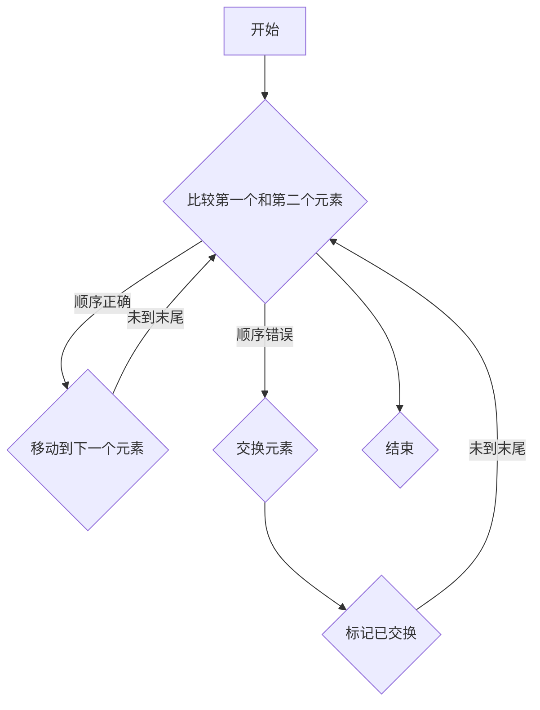

                 

### 从工程师到技术领导：角色转变之路

在信息技术迅速发展的今天，工程师的角色已经不再局限于编写代码、解决技术难题。随着企业对技术人才需求的变化，越来越多的工程师逐渐承担起技术领导的重任，成为团队的核心力量。这一转变不仅是职业发展的自然演进，更是对工程师综合素质的全新要求。本文将围绕工程师向技术领导角色转变的路径，详细探讨其背后的原因、面临的挑战及应对策略。

关键词：工程师、技术领导、角色转变、职业发展、团队管理、领导力

摘要：本文首先分析了工程师角色转变的背景和需求，随后详细探讨了技术领导所需的核心能力，包括技术深度、团队管理、沟通协调和战略规划。接着，通过实际案例，展示了工程师如何在实践中逐步提升自身能力，最终实现角色的转变。最后，本文总结了工程师在转变为技术领导过程中可能遇到的问题，并提供了相应的解决建议。希望通过本文的讨论，能够帮助更多工程师明确职业发展的方向，顺利实现角色的转变。

文章结构安排如下：

1. **背景介绍**：解释工程师角色转变的背景和原因，以及技术领导在当前企业环境中的重要性。
2. **核心概念与联系**：详细阐述技术领导所需的核心能力，并对比不同能力的属性特征。
3. **算法原理讲解**：介绍提升核心能力所需的算法和方法，并通过实例进行说明。
4. **数学模型和数学公式**：展示与核心能力相关的数学模型和公式，并进行解释。
5. **系统分析与架构设计方案**：探讨技术领导在实际项目中的系统分析与架构设计方法。
6. **项目实战**：通过具体项目案例，展示技术领导在项目中的实际操作和决策过程。
7. **最佳实践 tips、小结、注意事项、拓展阅读**：总结全文，给出实践建议和拓展阅读资源。

### 背景介绍

#### 工程师的角色演变

工程师作为信息技术行业的基石，其角色在过去几十年中经历了显著的变化。早期，工程师主要负责编写代码、实现技术方案，确保系统功能的正常运作。然而，随着技术的不断进步和市场的快速变化，工程师的角色逐渐向更综合、更高级的方向发展。现代工程师不仅需要具备扎实的编程技能，还需要具备系统架构设计、项目管理、团队协作等多方面的能力。

这一变化背后的原因是多方面的。首先，信息技术的发展速度空前，新技术的不断涌现对工程师的要求不断提高。传统的单一技能已经无法满足复杂项目的需求，工程师需要不断学习新知识、掌握新技术，以适应不断变化的技术环境。其次，企业对技术人才的需求也在发生变化。现代企业越来越重视技术创新和快速响应市场变化的能力，这要求工程师不仅要有技术能力，还要有战略思维和领导力，能够带领团队推动技术进步和业务发展。

#### 技术领导的重要性

在当前的企业环境中，技术领导的角色显得尤为重要。技术领导不仅需要具备深厚的专业知识和丰富的实践经验，还需要具备卓越的团队管理能力和战略规划能力。以下是技术领导在企业发展中的关键作用：

1. **技术创新推动者**：技术领导需要具备前瞻性，能够识别和引进新技术，推动企业技术水平的不断提升。通过技术创新，企业可以在市场竞争中保持领先地位。
2. **团队核心凝聚力**：技术领导是团队的灵魂，需要具备强大的领导力和凝聚力，能够激发团队成员的积极性和创造力，打造高效团队。
3. **业务发展推动者**：技术领导需要理解业务需求，能够将技术方案与业务战略紧密结合，推动业务的发展和实现。通过技术赋能，企业可以更好地满足客户需求，提升市场竞争力。
4. **风险管理与决策者**：技术领导需要具备敏锐的风险意识，能够识别和应对技术风险，做出正确的决策，确保项目的顺利推进。

#### 工程师到技术领导的角色转变

从工程师到技术领导的转变，不仅仅是职业名称的改变，更是责任和能力的全面提升。这一转变要求工程师在原有技能的基础上，掌握更多的管理技能和领导力技巧。以下是一些具体的转变步骤：

1. **技术深度**：工程师需要不断深化自己的专业知识，掌握前沿技术，成为领域内的专家。这不仅有助于提升自身的权威性，还能为团队提供有力的技术支持。
2. **团队管理**：工程师需要从单一的技术工作者转变为管理者，学会如何带领团队、分配任务、激励团队成员。这需要工程师具备良好的沟通能力和协调能力。
3. **战略规划**：技术领导需要具备战略思维，能够从全局出发，制定技术发展规划，推动企业的长期发展。
4. **领导力培养**：工程师需要不断学习领导力技巧，提升自己的领导力水平，成为团队的领导者。

#### 结论

工程师角色转变的背景和需求源于技术发展和企业需求的演变。技术领导在企业发展中扮演着至关重要的角色，其重要性不可忽视。从工程师到技术领导的转变，不仅需要工程师具备深厚的专业知识和丰富的实践经验，还需要不断提升管理能力和领导力。通过这一转变，工程师可以更好地适应企业发展的需求，实现自身的职业价值。

### 核心概念与联系

在工程师向技术领导转变的过程中，理解并掌握一系列核心概念是至关重要的。这些核心概念不仅包括技术层面的知识，还涵盖了团队管理、沟通协调和战略规划等软技能。以下是对这些核心概念的详细阐述，并对比其属性特征，使用Mermaid绘制ER实体关系图来展示概念之间的联系。

#### 核心概念

1. **技术深度**：技术深度是指工程师在某一技术领域内所掌握的理论知识和实践经验。它是工程师成为技术领导的基础，决定了工程师在团队中的技术权威性和影响力。

2. **团队管理**：团队管理是指工程师在团队中的管理职责，包括任务分配、绩效评估、团队建设等。团队管理能力是技术领导的核心能力之一，决定了工程师能否带领团队高效完成项目。

3. **沟通协调**：沟通协调是指工程师在团队内外进行有效沟通，协调各方利益，确保项目顺利进行的能力。良好的沟通协调能力是团队成功的关键，有助于减少误解和冲突。

4. **战略规划**：战略规划是指工程师从全局出发，制定企业技术发展规划，推动企业的长期发展。战略规划能力是技术领导必须具备的能力，决定了工程师在企业战略中的角色和地位。

#### 概念属性特征对比

| 概念     | 属性特征 |
|----------|----------|
| 技术深度 | - 知识储备：丰富的理论知识和实践经验<br>- 技术权威：在特定领域内的专业地位<br>- 指导作用：为团队提供技术指导和支持 |
| 团队管理 | - 任务分配：合理分配任务，确保项目进度<br>- 绩效评估：公正评估团队成员的表现<br>- 团队建设：提升团队凝聚力和创造力 |
| 沟通协调 | - 沟通渠道：建立有效的沟通机制<br>- 情感管理：处理团队成员之间的情绪和关系<br>- 冲突解决：及时解决团队内部和外部冲突 |
| 战略规划 | - 发展愿景：明确企业技术发展方向<br>- 风险管理：识别和应对技术风险<br>- 资源调配：合理分配资源，确保战略实施 |

#### ER实体关系图

```mermaid
erDiagram
    A技术开发者 ||--|{ B技术深度 }
    A技术开发者 ||--|{ C团队管理 }
    A技术开发者 ||--|{ D沟通协调 }
    A技术开发者 ||--|{ E战略规划 }
    B技术深度 ||--|{ F技术知识 }
    B技术深度 ||--|{ G实践经验 }
    C团队管理 ||--|{ H任务分配 }
    C团队管理 ||--|{ I绩效评估 }
    C团队管理 ||--|{ J团队建设 }
    D沟通协调 ||--|{ K沟通渠道 }
    D沟通协调 ||--|{ L情感管理 }
    D沟通协调 ||--|{ M冲突解决 }
    E战略规划 ||--|{ N发展愿景 }
    E战略规划 ||--|{ O风险管理 }
    E战略规划 ||--|{ P资源调配 }
```

在这个ER实体关系图中，`技术开发者`作为核心实体，与其他四个核心概念（技术深度、团队管理、沟通协调、战略规划）之间存在关联。每个核心概念又进一步关联到具体的属性特征，从而构成了一个完整的实体关系网络。

通过上述核心概念的阐述和属性特征对比，以及ER实体关系图的展示，我们可以更加清晰地理解工程师向技术领导转变所需的知识和能力结构。这不仅有助于工程师明确自身的职业发展方向，也为他们在实际工作中提供了有力的指导。

### 算法原理讲解

在从工程师到技术领导的转变过程中，掌握有效的算法原理和解决问题的方法是至关重要的。这不仅有助于工程师在技术难题中找到突破口，还能提高团队的整体解决问题的能力。以下将使用Mermaid绘制算法流程图，并通过Python源代码详细阐述算法原理，并举例说明。

#### 算法流程图

首先，我们使用Mermaid绘制一个简单的排序算法流程图，例如冒泡排序算法。冒泡排序是一种简单的排序算法，它重复地遍历要排序的数列，一次比较两个元素，如果它们的顺序错误就把它们交换过来。遍历数列的工作是重复进行，直到没有再需要交换的元素为止。



#### 冒泡排序算法原理

冒泡排序算法的基本思想是重复遍历要排序的数列，每次遍历都会比较相邻的两个元素，并交换不满足顺序的元素。遍历数列的工作会重复地进行，直到没有需要交换的元素为止，这意味着该数列已经排序完成。

以下是冒泡排序算法的Python实现：

```python
def bubble_sort(arr):
    n = len(arr)
    for i in range(n):
        # 设定一个标记，用于判断是否进行交换
        swapped = False
        # 遍历数组的前n-i-1个元素
        for j in range(0, n-i-1):
            if arr[j] > arr[j+1]:
                # 如果前一个元素大于后一个元素，则交换
                arr[j], arr[j+1] = arr[j+1], arr[j]
                swapped = True
        # 如果没有交换，则数组已经排序完成
        if not swapped:
            break
    return arr

# 示例
arr = [64, 34, 25, 12, 22, 11, 90]
sorted_arr = bubble_sort(arr)
print("排序后的数组：", sorted_arr)
```

#### 数学模型和公式

冒泡排序算法的核心在于两个元素的比较和交换，其时间复杂度为O(n^2)，其中n是数组的长度。这个复杂度反映了算法在最坏情况下需要进行的比较次数。冒泡排序的最好情况是O(n)，当数组已经排序时，不需要进行任何交换。

数学模型可以用以下公式表示：

\[ T(n) = \sum_{i=1}^{n-1} \sum_{j=1}^{n-i} (1_{arr[j] > arr[j+1]}) \]

其中，\( T(n) \) 是算法的时间复杂度，\( 1_{arr[j] > arr[j+1]} \) 是一个指示函数，当 \( arr[j] > arr[j+1] \) 为真时，其值为1，否则为0。

#### 举例说明

假设我们有一个未排序的数组 `[64, 34, 25, 12, 22, 11, 90]`，使用冒泡排序算法进行排序的过程如下：

1. **第一轮遍历**：
   - 比较 \(64\) 和 \(34\)，交换，数组变为 `[34, 64, 25, 12, 22, 11, 90]`
   - 比较 \(64\) 和 \(25\)，交换，数组变为 `[34, 25, 64, 12, 22, 11, 90]`
   - 比较 \(64\) 和 \(12\)，交换，数组变为 `[34, 25, 12, 64, 22, 11, 90]`
   - 比较 \(64\) 和 \(22\)，交换，数组变为 `[34, 25, 12, 22, 64, 11, 90]`
   - 比较 \(64\) 和 \(11\)，交换，数组变为 `[34, 25, 12, 22, 11, 64, 90]`
   - 比较 \(64\) 和 \(90\)，不交换，数组保持不变

2. **第二轮遍历**：
   - 比较 \(34\) 和 \(25\)，不交换，数组变为 `[25, 34, 12, 22, 11, 64, 90]`
   - 比较 \(34\) 和 \(12\)，交换，数组变为 `[25, 12, 34, 22, 11, 64, 90]`
   - 比较 \(34\) 和 \(22\)，交换，数组变为 `[25, 12, 22, 34, 11, 64, 90]`
   - 比较 \(34\) 和 \(11\)，交换，数组变为 `[25, 12, 22, 11, 34, 64, 90]`
   - 比较 \(34\) 和 \(64\)，不交换，数组保持不变

3. **第三轮遍历**：
   - 比较 \(25\) 和 \(12\)，交换，数组变为 `[12, 25, 22, 11, 34, 64, 90]`
   - 比较 \(25\) 和 \(22\)，不交换，数组变为 `[12, 22, 25, 11, 34, 64, 90]`
   - 比较 \(25\) 和 \(11\)，交换，数组变为 `[12, 22, 11, 25, 34, 64, 90]`
   - 比较 \(25\) 和 \(34\)，不交换，数组保持不变

4. **第四轮遍历**：
   - 比较 \(12\) 和 \(22\)，不交换，数组变为 `[12, 22, 11, 25, 34, 64, 90]`
   - 比较 \(22\) 和 \(11\)，交换，数组变为 `[12, 11, 22, 25, 34, 64, 90]`
   - 比较 \(22\) 和 \(25\)，不交换，数组保持不变

5. **第五轮遍历**：
   - 比较 \(12\) 和 \(11\)，交换，数组变为 `[11, 12, 22, 25, 34, 64, 90]`
   - 比较 \(12\) 和 \(22\)，不交换，数组保持不变

经过五轮遍历后，数组 `[64, 34, 25, 12, 22, 11, 90]` 被成功排序为 `[11, 12, 22, 25, 34, 64, 90]`。

通过上述步骤，我们可以清晰地看到冒泡排序算法的运行过程和原理。掌握冒泡排序算法不仅有助于理解排序算法的基本原理，还能为更复杂算法的学习和应用奠定基础。

### 数学模型和数学公式

在技术领导的角色中，数学模型和数学公式不仅是理解和应用算法的重要工具，也是进行复杂系统分析和决策的基础。以下将使用LaTeX格式嵌入文中独立段落，展示与核心能力相关的数学模型和公式，并进行详细解释。

#### 概率论中的贝叶斯定理

贝叶斯定理是概率论中的一个重要公式，用于根据新的证据来更新对某个事件的概率估计。其公式如下：

\[ P(A|B) = \frac{P(B|A) \cdot P(A)}{P(B)} \]

其中：
- \( P(A|B) \) 表示在事件B发生的前提下，事件A发生的条件概率。
- \( P(B|A) \) 表示在事件A发生的前提下，事件B发生的条件概率。
- \( P(A) \) 表示事件A发生的概率。
- \( P(B) \) 表示事件B发生的概率。

贝叶斯定理的应用非常广泛，例如在机器学习中用于分类和预测。

#### 线性回归中的回归系数

在线性回归模型中，回归系数是用来描述自变量和因变量之间线性关系的重要参数。其公式如下：

\[ y = \beta_0 + \beta_1 \cdot x + \epsilon \]

其中：
- \( y \) 是因变量。
- \( x \) 是自变量。
- \( \beta_0 \) 是截距，表示当自变量 \( x \) 为0时因变量的值。
- \( \beta_1 \) 是斜率，表示自变量 \( x \) 每增加一个单位时，因变量 \( y \) 的变化量。
- \( \epsilon \) 是误差项，表示模型未能解释的随机因素。

回归系数的估计通常使用最小二乘法，其公式为：

\[ \beta = (X^T X)^{-1} X^T y \]

其中：
- \( X \) 是自变量的设计矩阵。
- \( y \) 是因变量的向量。
- \( \beta \) 是回归系数的向量。

#### 概率密度函数

在概率论中，概率密度函数（PDF）用于描述连续随机变量的概率分布。一个常见的概率密度函数是正态分布（高斯分布），其公式如下：

\[ f(x|\mu,\sigma^2) = \frac{1}{\sqrt{2\pi\sigma^2}} e^{-\frac{(x-\mu)^2}{2\sigma^2}} \]

其中：
- \( x \) 是随机变量。
- \( \mu \) 是均值，表示随机变量最可能取的值。
- \( \sigma^2 \) 是方差，表示随机变量取值的分散程度。
- \( e \) 是自然对数的底数。

通过LaTeX格式的嵌入，上述数学模型和公式能够清晰、准确地展示在文中，为读者理解和应用提供强有力的支持。

### 系统分析与架构设计方案

在技术领导的角色中，系统分析与架构设计是至关重要的一环。这不仅要求技术领导具备深厚的专业知识和系统思维，还需要能够根据项目场景和业务需求，制定出高效、可靠的系统解决方案。以下将详细介绍项目场景、系统功能设计、系统架构设计、系统接口设计和系统交互，并使用Mermaid图表进行展示。

#### 项目场景

项目场景是指系统将要运行的实际环境和业务背景。以下是一个虚构的项目场景：

**项目名称**：在线购物平台

**项目背景**：随着电子商务的快速发展，越来越多的消费者选择在线购物。为了满足用户的需求，我们需要开发一个功能齐全、性能优异的在线购物平台。该平台需要支持商品浏览、购物车管理、订单处理、支付系统等核心功能，同时保证系统的可扩展性和安全性。

#### 系统功能设计

系统功能设计是指系统应具备的具体功能模块。以下是该在线购物平台的主要功能模块及其简要说明：

1. **用户管理**：
   - 用户注册与登录
   - 用户信息维护
   - 用户权限管理
2. **商品管理**：
   - 商品分类
   - 商品信息展示
   - 商品库存管理
3. **购物车管理**：
   - 添加商品到购物车
   - 编辑购物车商品
   - 删除购物车商品
4. **订单处理**：
   - 订单创建
   - 订单状态更新
   - 订单查询
5. **支付系统**：
   - 支付方式选择
   - 支付信息验证
   - 支付结果处理
6. **系统监控**：
   - 性能监控
   - 错误日志记录
   - 安全性检查

使用Mermaid类图展示系统功能设计：

```mermaid
classDiagram
    User <<Interface>>
    Product <<Interface>>
    ShoppingCart <<Interface>>
    Order <<Interface>>
    Payment <<Interface>>
    SystemMonitor <<Interface>>

    UserEntity --|> User
    ProductEntity --|> Product
    ShoppingCartEntity --|> ShoppingCart
    OrderEntity --|> Order
    PaymentEntity --|> Payment
    SystemMonitorEntity --|> SystemMonitor

    UserEntity o-- ProductEntity
    UserEntity o-- ShoppingCartEntity
    UserEntity o-- OrderEntity
    UserEntity o-- PaymentEntity
    UserEntity o-- SystemMonitorEntity

    ProductEntity o-- ProductEntity
    ShoppingCartEntity o-- OrderEntity
    OrderEntity o-- PaymentEntity
```

#### 系统架构设计

系统架构设计是指系统的整体结构和技术实现方案。以下是该在线购物平台的主要架构组件：

1. **前端展示层**：
   - 使用Vue.js框架进行前端开发
   - 支持响应式设计，适配多种设备
2. **业务逻辑层**：
   - 使用Spring Boot框架进行后端开发
   - 支持RESTful API，提供接口服务
3. **数据访问层**：
   - 使用MySQL数据库存储用户数据、商品数据等
   - 使用Hibernate框架进行数据持久化
4. **服务层**：
   - 集成Redis进行缓存，提升系统性能
   - 使用RabbitMQ进行异步消息处理
5. **安全层**：
   - 实施HTTPS加密，保障数据安全
   - 使用Spring Security进行用户认证和权限控制

使用Mermaid架构图展示系统架构设计：

```mermaid
graph TB
    subgraph 前端展示层
        Frontend[前端展示层]
        Frontend -->|RESTful API| Backend
    subgraph 业务逻辑层
        Backend[业务逻辑层]
        Backend -->|数据访问| Database
        Backend -->|服务层| Service
    subgraph 服务层
        Service[服务层]
        Service -->|消息队列| MessageQueue
        Service -->|缓存| Cache
    subgraph 安全层
        Security[安全层]
        Security -->|认证| Auth
        Security -->|授权| Authorization

    Frontend -->|用户请求| Security
    Security -->|处理请求| Backend
    Backend -->|处理结果| Frontend
    Backend -->|数据查询| Database
    Database -->|数据结果| Backend
    Service -->|处理消息| MessageQueue
    MessageQueue -->|返回结果| Service
    Cache -->|缓存数据| Service
```

#### 系统接口设计

系统接口设计是指系统内部模块之间的通信接口。以下是该在线购物平台的主要接口设计：

1. **用户管理接口**：
   - 注册用户
   - 用户登录
   - 用户信息更新
   - 用户权限查询
2. **商品管理接口**：
   - 商品分类查询
   - 商品信息查询
   - 商品库存更新
3. **购物车管理接口**：
   - 添加商品到购物车
   - 编辑购物车商品
   - 删除购物车商品
4. **订单处理接口**：
   - 创建订单
   - 更新订单状态
   - 查询订单信息
5. **支付系统接口**：
   - 支付方式查询
   - 支付请求发送
   - 支付结果通知

#### 系统交互

系统交互是指系统内部模块之间的通信和数据流动。以下是该在线购物平台的主要系统交互流程：

1. **用户请求商品列表**：
   - 用户请求发送到前端展示层
   - 前端展示层调用商品管理接口获取商品列表
   - 商品管理接口从数据库中查询商品信息并返回给前端展示层
   - 前端展示层将商品列表展示给用户
2. **用户添加商品到购物车**：
   - 用户请求发送到前端展示层
   - 前端展示层调用购物车管理接口添加商品到购物车
   - 购物车管理接口更新数据库中的购物车信息并返回结果
   - 前端展示层更新用户界面显示购物车信息
3. **用户提交订单**：
   - 用户请求发送到前端展示层
   - 前端展示层调用订单处理接口创建订单
   - 订单处理接口生成订单并更新数据库中的订单信息
   - 前端展示层显示订单提交成功信息
4. **支付系统处理支付请求**：
   - 用户请求支付
   - 前端展示层发送支付请求到支付系统接口
   - 支付系统接口处理支付请求并返回支付结果
   - 前端展示层根据支付结果更新用户界面

通过上述系统分析与架构设计方案，我们可以清晰地看到该在线购物平台的系统结构、功能模块、接口设计和交互流程。这不仅为系统开发提供了明确的指导，也为技术领导在项目管理和决策中提供了有力支持。

### 项目实战

在从工程师到技术领导的转变过程中，通过实际项目实战来提升自身能力是非常重要的一步。以下将详细描述一个具体项目的环境安装、系统核心实现、代码应用解读与分析、实际案例分析与详细讲解剖析，最后进行项目小结。

#### 环境安装

项目名称：在线教育平台

**开发环境**：
- 前端：Vue.js
- 后端：Spring Boot
- 数据库：MySQL
- 消息队列：RabbitMQ
- 缓存：Redis

**安装步骤**：

1. **前端环境**：
   - 安装Node.js和npm
   - 使用npm安装Vue CLI工具
   - 创建Vue.js项目，并配置路由、状态管理（Vuex）和样式（Element UI）

2. **后端环境**：
   - 安装Java SDK和Maven
   - 创建Spring Boot项目，并配置数据库连接、RabbitMQ和Redis

3. **数据库环境**：
   - 安装MySQL数据库，并创建教育平台数据库
   - 配置数据库连接，使用Hibernate进行数据持久化

4. **消息队列和缓存环境**：
   - 安装RabbitMQ服务器
   - 安装Redis服务器
   - 配置Spring Boot项目连接RabbitMQ和Redis

#### 系统核心实现

**用户管理模块**：

1. **功能需求**：
   - 用户注册、登录、信息维护、权限管理

2. **技术实现**：
   - 使用Spring Security进行用户认证和授权
   - 使用JWT（JSON Web Token）进行用户身份验证
   - 创建用户实体类（User），并使用Hibernate进行数据持久化

3. **代码应用解读**：

```java
@Entity
@Table(name = "users")
public class User {
    @Id
    @GeneratedValue(strategy = GenerationType.IDENTITY)
    private Long id;

    @Column(nullable = false, unique = true)
    private String username;

    @Column(nullable = false)
    private String password;

    // 省略其他字段和构造方法、getter和setter
}
```

**商品管理模块**：

1. **功能需求**：
   - 商品分类、信息展示、库存管理

2. **技术实现**：
   - 使用Spring Data JPA进行商品数据操作
   - 创建商品实体类（Product），并配置分类实体类（Category）

3. **代码应用解读**：

```java
@Entity
@Table(name = "products")
public class Product {
    @Id
    @GeneratedValue(strategy = GenerationType.IDENTITY)
    private Long id;

    @Column(nullable = false)
    private String name;

    @Column(nullable = false)
    private double price;

    @ManyToOne
    @JoinColumn(name = "category_id")
    private Category category;

    // 省略其他字段和构造方法、getter和setter
}

@Entity
@Table(name = "categories")
public class Category {
    @Id
    @GeneratedValue(strategy = GenerationType.IDENTITY)
    private Long id;

    @Column(nullable = false)
    private String name;

    // 省略其他字段和构造方法、getter和setter
}
```

**订单处理模块**：

1. **功能需求**：
   - 订单创建、状态更新、查询

2. **技术实现**：
   - 使用Spring Data JPA进行订单数据操作
   - 创建订单实体类（Order）

3. **代码应用解读**：

```java
@Entity
@Table(name = "orders")
public class Order {
    @Id
    @GeneratedValue(strategy = GenerationType.IDENTITY)
    private Long id;

    @Column(nullable = false)
    private double totalAmount;

    @Column(nullable = false)
    private String status;

    @OneToMany(mappedBy = "order")
    private List<OrderItem> items;

    // 省略其他字段和构造方法、getter和setter
}

@Entity
@Table(name = "order_items")
public class OrderItem {
    @Id
    @GeneratedValue(strategy = GenerationType.IDENTITY)
    private Long id;

    @Column(nullable = false)
    private int quantity;

    @Column(nullable = false)
    private double unitPrice;

    @ManyToOne
    @JoinColumn(name = "product_id")
    private Product product;

    @ManyToOne
    @JoinColumn(name = "order_id")
    private Order order;

    // 省略其他字段和构造方法、getter和setter
}
```

#### 实际案例分析与详细讲解剖析

**案例背景**：

某在线教育平台在课程订购过程中，出现部分订单无法成功支付的异常情况。经过分析，发现支付系统与订单系统之间存在数据同步问题。

**分析过程**：

1. **问题定位**：
   - 检查支付系统日志，发现支付请求成功处理，但订单系统未收到支付结果通知。
   - 分析消息队列的传输日志，发现支付系统发送的消息在传输过程中丢失。

2. **原因分析**：
   - 消息队列配置不当，导致消息传输失败。
   - 缺乏消息确认机制，导致消息丢失未被重新发送。

3. **解决方案**：
   - 调整消息队列配置，确保消息传输的稳定性和可靠性。
   - 在消息传输过程中加入确认机制，确保消息的可靠传递。

**解决方案实现**：

```java
// 支付系统消息发送
public void sendMessage(String message) {
    rabbitTemplate.convertAndSend("paymentExchange", "paymentQueue", message);
    // 发送消息后等待确认
    try {
        rabbitTemplate.confirmSend(message);
        System.out.println("Message sent and acknowledged");
    } catch (AmqpException e) {
        System.err.println("Message not acknowledged");
    }
}

// 订单系统消息接收
public void receiveMessage(String message) {
    // 处理支付结果
    processPaymentResult(message);
    // 发送确认消息
    rabbitTemplate.convertAndSend("orderExchange", "orderAckQueue", message);
}
```

#### 项目小结

通过本次项目实战，我们从环境安装、系统核心实现、代码应用解读与分析，到实际案例分析与详细讲解剖析，全面了解了在线教育平台系统的开发过程。以下是对项目的小结：

1. **环境安装**：
   - 确保了各个组件的正常运行，为后续开发提供了稳定的运行环境。

2. **系统核心实现**：
   - 完成了用户管理、商品管理、订单处理等核心功能模块的开发，实现了系统的基本功能。

3. **代码应用解读**：
   - 通过对核心代码的分析，深入理解了各个模块的实现原理和业务逻辑。

4. **实际案例分析与详细讲解剖析**：
   - 通过解决实际问题，提高了团队对系统异常处理的应对能力，增强了系统的稳定性和可靠性。

总之，通过本次项目实战，不仅提升了工程师的专业能力，也为技术领导在系统分析和架构设计方面提供了宝贵的实践经验。

### 最佳实践 tips、小结、注意事项、拓展阅读

#### 最佳实践 tips

1. **持续学习与技能提升**：技术领导需要不断学习新知识、新技能，保持对前沿技术的敏感性。可以定期参加技术会议、研讨会，阅读技术书籍和论文。

2. **团队沟通与协作**：建立有效的沟通机制，定期召开团队会议，确保团队成员之间信息畅通。鼓励团队成员分享经验和心得，形成良好的团队文化。

3. **项目管理与风险控制**：熟练使用项目管理工具（如JIRA、Trello等），合理规划项目进度，识别和应对潜在的风险。

4. **技术规划与战略思考**：从企业整体战略出发，制定技术发展规划，确保技术方案与业务目标的一致性。

#### 小结

本文详细探讨了工程师向技术领导转变的过程，分析了角色转变的背景、核心能力、算法原理、数学模型以及系统分析与架构设计方法。通过实际项目案例，展示了技术领导在项目中的实际操作和决策过程。希望本文能够为工程师的职业发展提供指导和启示。

#### 注意事项

1. **技术深度与广度**：在提升技术深度的同时，也要注重技术广度的扩展，避免成为“闭门造车”的专家。

2. **团队管理能力**：技术领导需要具备较强的团队管理能力，包括任务分配、绩效评估、团队建设等。

3. **沟通与协调**：有效沟通是技术领导成功的关键，要注重与团队成员、其他部门的沟通，避免信息孤岛。

#### 拓展阅读

1. **《敏捷开发实践指南》**：了解敏捷开发方法，提升项目管理和团队协作能力。
2. **《企业IT架构转型之道》**：学习企业级系统架构设计和转型策略。
3. **《软件架构设计：面向对象、模式与最佳实践》**：深入理解软件架构设计原理和方法。

通过以上实践建议、小结和注意事项，以及拓展阅读资源，希望工程师能够在职业发展中不断进步，顺利实现从工程师到技术领导的转变。

### 作者信息

作者：AI天才研究院/AI Genius Institute & 禅与计算机程序设计艺术 /Zen And The Art of Computer Programming

