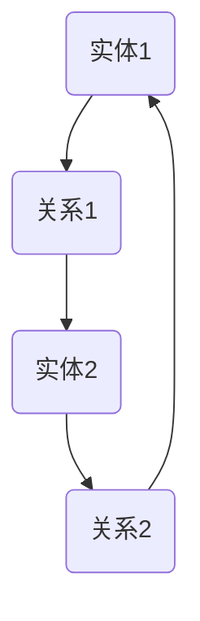
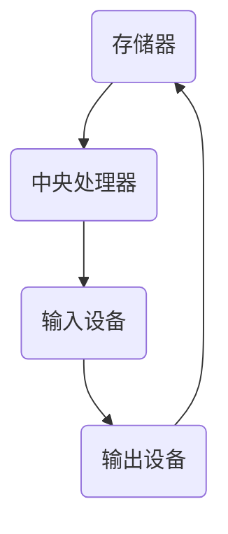
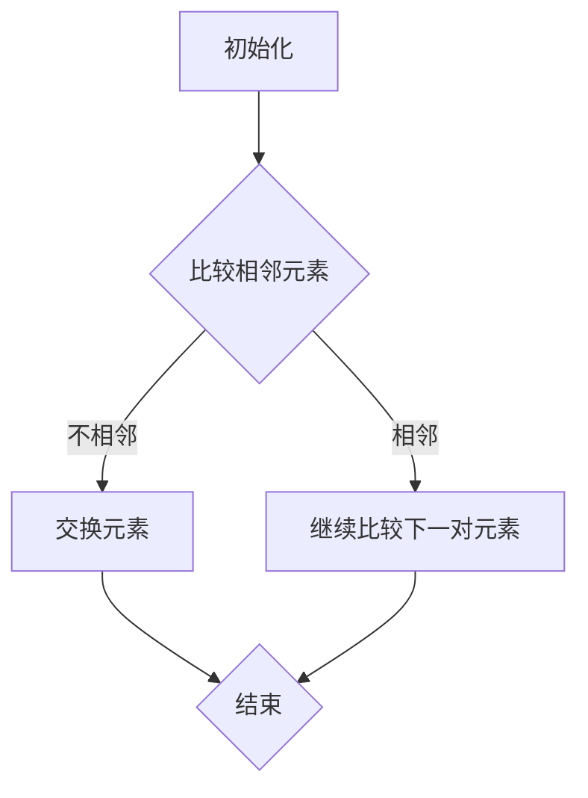
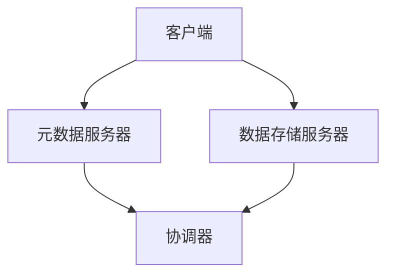
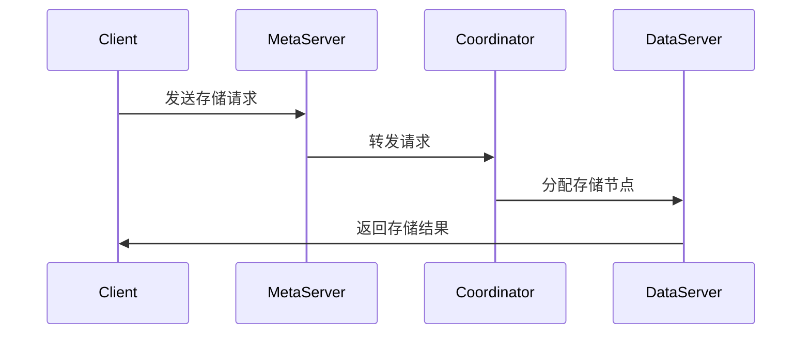

                 


### 1. 引言

#### 1.1 问题背景

计算机科学作为一门综合性学科，涵盖了数学、工程学、物理学等多个领域。它的发展历程，从最初的机械计算器到现代高度智能化的计算机系统，无不体现了人类对计算能力和效率的追求。在这个过程中，哲学作为一种深刻的思想体系，为计算机科学的发展提供了理论基础和哲学指导。

首先，我们有必要回顾计算机科学的起源。计算机科学的起源可以追溯到19世纪末，当时数学家乔治·布尔（George Boole）发明了布尔代数，为逻辑电路的设计奠定了基础。随后，艾伦·图灵（Alan Turing）提出了图灵机模型，这成为现代计算机科学理论的核心。图灵机模型不仅为计算理论的发展提供了强有力的工具，还推动了计算机硬件和软件的发展。

然而，计算机科学的哲学基础并不止步于这些早期的工作。20世纪初，英国哲学家伯特兰·罗素（Bertrand Russell）和奥地利数学家路德维希·冯·诺依曼（Ludwig von Neumann）的工作，对计算机科学的哲学基础产生了深远的影响。罗素是逻辑原子主义的倡导者，他的哲学观点为计算机科学中的逻辑和形式化提供了理论基础。而冯·诺依曼则通过他的计算机架构设计，为现代计算机系统的构建提供了现实可行的方案。

#### 1.2 问题描述

随着计算机科学的不断发展，研究人员和开发者面临着越来越多的挑战。这些挑战不仅涉及技术层面，还涉及哲学层面。例如，如何确保计算机系统的安全性和可靠性？如何处理计算机系统中的复杂性和不确定性？这些问题都需要从哲学的角度进行深入思考。

在哲学层面，计算机科学面临的挑战主要包括：

1. **计算的本质**：计算机科学如何理解计算的本质？计算是否仅仅是数学和逻辑的延伸？还是包含了更深层次的哲学问题？
2. **算法和计算过程**：算法和计算过程是否符合人类的认知过程？是否存在一种通用算法能够解决所有问题？
3. **数据隐私和伦理**：随着大数据和人工智能技术的发展，数据隐私和伦理问题变得日益重要。计算机科学如何平衡技术创新和伦理道德？
4. **机器意识和人工智能**：机器是否能够拥有意识和思维？这是一个深刻的哲学问题，它关乎计算机科学未来的发展方向。

#### 1.3 问题解决

面对这些哲学挑战，计算机科学家和哲学家们采取了多种方法来解决问题。首先，他们通过深入研究和探讨哲学理论，试图理解计算的本质和算法的原理。这种方法不仅有助于推动计算机科学的发展，还能够为哲学提供新的研究方向。

其次，计算机科学家和哲学家们开始将哲学思想应用于计算机科学的具体实践。例如，他们通过逻辑和形式化的方法，设计出更加可靠和安全的计算机系统。同时，他们也在数据隐私和伦理方面提出了一系列解决方案，以平衡技术创新和伦理道德。

最后，计算机科学家和哲学家们还通过跨学科的合作，共同探讨计算机科学和哲学之间的关系。这种方法不仅促进了计算机科学的发展，还为哲学提供了新的视角和思考方式。

总之，计算机科学的哲学基础是理解计算机科学本质和发展方向的关键。通过深入研究和探讨哲学理论，计算机科学家和哲学家们能够更好地解决计算机科学面临的哲学挑战，推动计算机科学的发展。

#### 1.4 边界与外延

计算机科学的哲学基础不仅关乎理论探讨，还涉及到实际应用。理解计算机科学的哲学基础有助于我们更好地应对技术发展带来的挑战。例如，在处理大数据和人工智能问题时，我们不仅需要关注技术本身，还需要关注数据隐私和伦理问题。这些问题的解决，不仅需要技术手段，还需要哲学思考。

同时，计算机科学的哲学基础也有助于我们理解计算的本质和算法的原理。通过对哲学理论的研究，我们可以更好地理解计算机科学的局限性，从而推动技术的进步。

总之，计算机科学的哲学基础是理解计算机科学本质和发展方向的关键。通过深入研究和探讨哲学理论，计算机科学家和哲学家们能够更好地解决计算机科学面临的哲学挑战，推动计算机科学的发展。

---

这篇文章的第一部分“引言”主要介绍了计算机科学哲学基础的起源和发展，并提出了计算机科学面临的哲学挑战。在接下来的部分，我们将进一步探讨罗素和冯·诺依曼的哲学观点，以及这些观点如何影响计算机科学的发展。让我们一起继续深入思考。

---

## 第二部分：核心概念与联系

### 3. 罗素的哲学观点与计算机科学

伯特兰·罗素（Bertrand Russell）是20世纪初最著名的数学家、逻辑学家和哲学家之一。他的哲学观点，尤其是逻辑原子主义，对计算机科学的发展产生了深远的影响。

#### 3.1 罗素的逻辑原子主义

逻辑原子主义是罗素的一种哲学思想，认为世界是由最基本的原子事实组成的，这些事实可以用逻辑形式来表示。罗素认为，逻辑和数学是理解世界的最佳工具，它们可以揭示世界的基本结构和规律。

逻辑原子主义的核心观点包括：

1. **原子事实**：世界是由最基本的原子事实组成的，这些事实是无法分解的。
2. **逻辑形式**：原子事实可以用逻辑形式来表示，逻辑形式能够揭示世界的基本结构和规律。
3. **分析哲学**：逻辑原子主义强调分析哲学的方法，通过分析逻辑形式来理解世界的本质。

#### 3.2 罗素与计算机科学的联系

罗素的逻辑原子主义对计算机科学产生了深远的影响。首先，它为计算机科学中的形式化方法和逻辑验证提供了理论基础。在计算机科学中，形式化方法是构建正确和可靠软件系统的重要工具。逻辑验证则确保了软件系统的正确性，避免了许多潜在的错误。

罗素的逻辑原子主义还影响了计算机科学中的算法设计。算法是计算机科学中的核心概念，它指导计算机如何解决问题。罗素的逻辑形式主义方法为算法设计提供了一种形式化的框架，使得算法的设计和验证更加严谨和可靠。

此外，罗素的逻辑原子主义还影响了计算机科学中的编程语言设计。许多现代编程语言，如Lisp和Haskell，都采用了逻辑形式化的方法，使得编程语言能够更好地支持逻辑编程和形式化验证。

#### 3.3 概念属性特征对比表格

为了更清楚地展示罗素的逻辑原子主义与计算机科学的联系，我们可以使用概念属性特征对比表格：

| 特征                 | 罗素的逻辑原子主义                    | 计算机科学中的形式化方法                  |
|----------------------|--------------------------------------|-----------------------------------------|
| 核心思想             | 世界由最基本的原子事实组成，逻辑形式化 | 算法和软件系统的正确性和可靠性验证          |
| 应用领域             | 哲学、逻辑、数学                      | 编程语言设计、算法设计、软件工程           |
| 特点                 | 强调逻辑和分析哲学方法               | 强调形式化和逻辑验证方法                 |

#### 3.4 ER实体关系图架构的Mermaid流程图

为了更好地理解罗素的逻辑原子主义在计算机科学中的应用，我们可以使用Mermaid流程图来展示ER（实体关系）图架构：



在这个ER实体关系图架构中，实体1和实体2分别代表了逻辑原子主义中的原子事实，而关系1和关系2则代表了逻辑形式。这种结构展示了逻辑原子主义如何通过形式化的方法来构建复杂系统。

---

在下一部分，我们将探讨路德维希·冯·诺依曼的哲学观点与计算机科学之间的联系。冯·诺依曼的计算机架构设计对计算机科学产生了深远的影响，它为现代计算机系统的构建提供了理论基础和实践指导。

---

### 4. 冯·诺依曼的哲学观点与计算机科学

路德维希·冯·诺依曼（Ludwig von Neumann）是20世纪最具影响力的数学家之一，他在计算机科学领域的工作对现代计算机架构的构建产生了深远的影响。冯·诺依曼的哲学观点，特别是他的计算机架构设计，为计算机科学的发展提供了重要的理论基础。

#### 4.1 冯·诺依曼计算机架构

冯·诺依曼计算机架构，也被称为存储程序计算机架构，是现代计算机系统的基本结构。这个架构的核心思想是将程序和数据存储在同一内存中，并通过中央处理器（CPU）来执行。冯·诺依曼计算机架构的主要特点包括：

1. **存储程序**：程序和数据存储在同一内存中，程序通过地址来访问数据。
2. **指令周期**：CPU通过指令周期来执行程序，每个指令周期包括取指令、解码指令和执行指令三个步骤。
3. **并行处理**：冯·诺依曼架构支持并行处理，通过多个CPU或处理器来同时执行多个指令。

#### 4.2 冯·诺依曼与计算机科学的联系

冯·诺依曼计算机架构对计算机科学的发展产生了深远的影响。首先，它为计算机系统的设计提供了理论基础，使得计算机系统能够高效地执行程序。存储程序的概念使得程序和数据能够灵活地组织和操作，大大提高了计算机系统的灵活性和效率。

其次，冯·诺依曼架构推动了计算机硬件和软件的发展。在硬件方面，存储程序架构促进了存储器技术的发展，使得存储器能够以更高的速度和更大的容量存储数据和程序。在软件方面，存储程序架构促进了编程语言和编译器的发展，使得程序员能够更方便地编写和优化程序。

此外，冯·诺依曼架构还影响了计算机科学的许多其他领域。例如，它为人工智能和机器学习提供了重要的基础，通过存储程序的方式，计算机系统能够学习和模拟人类思维过程。同时，冯·诺依曼架构也促进了计算机网络和分布式系统的发展，使得计算机系统能够通过通信和网络来实现更大的计算能力和协作能力。

#### 4.3 概念属性特征对比表格

为了更清楚地展示冯·诺依曼计算机架构与计算机科学中的其他概念和原理之间的联系，我们可以使用概念属性特征对比表格：

| 特征                 | 冯·诺依曼计算机架构                 | 计算机科学中的存储程序概念               |
|----------------------|--------------------------------------|-----------------------------------------|
| 核心思想             | 存储程序和数据在同一内存中           | 程序和数据存储在同一存储器中，通过地址访问 |
| 应用领域             | 计算机系统设计、硬件和软件发展       | 编程语言设计、编译器、程序优化           |
| 特点                 | 支持并行处理、灵活的程序和数据组织   | 提高计算机系统的灵活性和效率             |

#### 4.4 ER实体关系图架构的Mermaid流程图

为了更好地理解冯·诺依曼计算机架构在计算机科学中的应用，我们可以使用Mermaid流程图来展示ER（实体关系）图架构：



在这个ER实体关系图架构中，存储器代表了程序和数据存储的地方，中央处理器代表了执行程序的核心部件，输入设备和输出设备则代表了计算机与外部世界的交互接口。这种结构展示了冯·诺依曼计算机架构如何通过存储程序和并行处理来构建现代计算机系统。

---

通过探讨罗素和冯·诺依曼的哲学观点与计算机科学之间的联系，我们可以看到哲学在计算机科学中的重要作用。罗素的逻辑原子主义和冯·诺依曼的计算机架构设计为计算机科学的发展提供了理论基础和实践指导。在下一部分，我们将深入探讨哲学基础在计算机科学中的应用，包括算法原理讲解、数学模型和系统分析与架构设计方案。

---

## 第三部分：算法原理讲解

### 6. 哲学基础在计算机科学中的应用

哲学基础在计算机科学中的应用是多方面的，尤其是逻辑和形式化方法在算法设计和分析中的应用。在这一部分，我们将探讨哲学基础如何影响算法原理，并通过具体的例子来说明这一点。

#### 6.1 算法原理Mermaid流程图

为了展示哲学基础在算法原理中的应用，我们可以使用Mermaid流程图来表示一个简单的排序算法——冒泡排序。



在这个流程图中，`A`表示初始化数组，`B`表示比较相邻元素，`C`表示如果需要则交换元素，`E`表示继续比较下一对元素，直到整个数组被排序。

#### 6.2 Python源代码详细阐述

冒泡排序的Python实现如下：

```python
def bubble_sort(arr):
    n = len(arr)
    # 外循环，每一轮都会将未排序部分的最大元素移动到最后
    for i in range(n):
        # 内循环，每轮比较相邻元素并交换
        for j in range(0, n-i-1):
            if arr[j] > arr[j+1]:
                arr[j], arr[j+1] = arr[j+1], arr[j]
    return arr
```

这个Python代码通过两个嵌套循环来实现冒泡排序。外循环负责将未排序部分的最大元素移动到最后，而内循环则负责比较相邻元素并交换它们，以确保数组逐步排序。

#### 6.3 算法原理的数学模型和公式

为了更好地理解冒泡排序的工作原理，我们可以使用数学模型和公式来描述其性能。冒泡排序的平均时间复杂度是 \(O(n^2)\)，其中 \(n\) 是数组的长度。

$$
T(n) = O(n^2)
$$

这个公式表示，随着数组长度的增加，冒泡排序所需的时间呈平方增长。

#### 6.4 举例说明

假设我们有一个未排序的数组 `[5, 2, 9, 1, 5, 6]`。使用冒泡排序，我们可以逐步看到数组的变化：

1. **第一轮**：比较 `(5, 2)`，交换；比较 `(9, 1)`，交换；比较 `(5, 6)`，不交换。数组变为 `[2, 1, 5, 5, 6, 9]`。
2. **第二轮**：比较 `(2, 1)`，交换；比较 `(5, 5)`，不交换；比较 `(5, 6)`，不交换。数组变为 `[1, 2, 5, 5, 6, 9]`。
3. **第三轮**：比较 `(1, 2)`，不交换；比较 `(2, 5)`，不交换；比较 `(5, 6)`，不交换。数组变为 `[1, 2, 5, 5, 6, 9]`。
4. **第四轮**：比较 `(1, 2)`，不交换；比较 `(2, 5)`，不交换；比较 `(5, 6)`，不交换。数组变为 `[1, 2, 5, 5, 6, 9]`。

最终，数组被成功排序。

通过这个例子，我们可以看到哲学基础（如逻辑和形式化方法）如何影响算法的设计和实现。逻辑帮助我们理解算法的基本原理，而形式化方法使得算法的分析和验证更加精确和可靠。

---

在下一部分，我们将探讨计算机科学哲学基础在实际系统设计和分析中的应用，包括系统功能设计、架构设计、接口设计和系统交互等。这将帮助我们更好地理解哲学基础如何指导实际的系统开发。

---

## 第四部分：系统分析与架构设计方案

### 7. 计算机科学哲学基础的应用场景

计算机科学哲学基础不仅在理论研究中发挥着重要作用，也在实际系统设计和分析中得到了广泛应用。在这一部分，我们将探讨哲学基础如何指导系统设计与分析，并展示一个具体的系统架构设计方案。

#### 7.1 问题场景介绍

假设我们正在设计一个分布式文件系统，用于处理大规模数据存储和访问需求。该系统需要高效、可靠地处理文件的存储、检索和更新操作。为了满足这些需求，我们将借鉴计算机科学哲学基础，特别是逻辑和形式化的方法。

#### 7.2 项目介绍

我们的分布式文件系统项目名为“DFS（Distributed File System）”，它旨在提供一种高效、可靠的文件存储解决方案。系统的主要功能包括：

1. **文件存储**：将文件存储在分布式存储节点上，确保数据的持久性和安全性。
2. **文件检索**：提供高效、可靠的文件检索机制，以快速访问所需的文件。
3. **文件更新**：支持文件的修改和更新操作，确保数据的实时性和一致性。

#### 7.3 系统功能设计

系统功能设计是系统架构设计的基础。在DFS系统中，我们定义了以下几个关键功能模块：

1. **存储节点**：负责存储文件的物理存储设备，包括磁盘、SSD等。
2. **副本管理**：确保文件的多个副本存储在分布式存储节点上，以提高数据的可靠性和可用性。
3. **命名空间管理**：提供文件命名空间的管理功能，包括文件的创建、删除和更新等。
4. **负载均衡**：通过将文件存储和访问请求分配到不同的存储节点，实现系统的高效运行。

为了更好地展示这些功能模块的关系，我们可以使用Mermaid类图：

```mermaid
classDiagram
    StorageNode <<class>> "存储节点"
    ReplicaManager <<class>> "副本管理"
    NamespaceManager <<class>> "命名空间管理"
    LoadBalancer <<class>> "负载均衡"
    StorageNode o--o ReplicaManager
    StorageNode o--o NamespaceManager
    StorageNode o--o LoadBalancer
    ReplicaManager o--o NamespaceManager
    ReplicaManager o--o LoadBalancer
    NamespaceManager o--o LoadBalancer
```

在这个类图中，`StorageNode`、`ReplicaManager`、`NamespaceManager` 和 `LoadBalancer` 是系统的关键功能模块，它们之间通过关系线连接，表示模块之间的依赖和交互。

#### 7.4 系统架构设计

系统架构设计是系统功能实现的基础。在DFS系统中，我们采用了一种分布式架构，以确保系统的可扩展性和容错性。系统的主要架构组件包括：

1. **客户端**：与分布式文件系统交互的客户端应用程序，负责发送文件存储和检索请求。
2. **元数据服务器**：负责存储和管理文件的元数据，包括文件名、存储位置和访问权限等。
3. **数据存储服务器**：负责存储和管理实际的数据文件，包括文件的内容和数据块的存储位置。
4. **协调器**：负责协调各个组件的运行，包括负载均衡、副本管理和命名空间管理等。

为了更好地展示系统架构，我们可以使用Mermaid架构图：



在这个架构图中，`Client` 发送请求到 `MetaServer` 和 `DataServer`，`MetaServer` 和 `DataServer` 分别由 `Coordinator` 进行协调和管理。

#### 7.5 系统接口设计

系统接口设计是系统功能实现的关键。在DFS系统中，我们定义了以下接口：

1. **文件存储接口**：提供文件上传、下载和删除等功能。
2. **文件检索接口**：提供根据文件名或ID检索文件的功能。
3. **文件更新接口**：提供修改文件内容的功能。

接口设计可以采用RESTful API风格，以下是一个简单的接口定义示例：

```python
# 文件存储接口
@post("/store")
def store_file(file: File):
    # 处理文件存储逻辑
    pass

# 文件检索接口
@get("/retrieve")
def retrieve_file(file_id: str):
    # 处理文件检索逻辑
    pass

# 文件更新接口
@put("/update")
def update_file(file_id: str, file_content: str):
    # 处理文件更新逻辑
    pass
```

#### 7.6 系统交互Mermaid序列图

系统交互设计描述了系统内部组件之间的交互流程。在DFS系统中，我们可以使用Mermaid序列图来展示客户端与系统组件之间的交互：



在这个序列图中，`Client` 发送存储请求到 `MetaServer`，`MetaServer` 将请求转发给 `Coordinator`，`Coordinator` 再将请求分配给 `DataServer` 进行实际存储，最后 `DataServer` 将存储结果返回给 `Client`。

---

通过这个分布式文件系统案例，我们可以看到计算机科学哲学基础如何指导系统设计与分析。逻辑和形式化方法帮助我们理解和设计系统的核心功能，架构设计和接口设计则确保系统的高效性和可靠性。在下一部分，我们将通过具体的实战项目，进一步展示计算机科学哲学基础的实际应用。

---

## 第五部分：项目实战

### 12. 环境安装

为了展示计算机科学哲学基础在实际项目中的应用，我们将通过一个具体的实战项目——分布式文件系统（DFS）——来阐述。首先，我们需要安装和配置项目环境。

#### 12.1 环境安装步骤

1. **安装Python**：确保Python 3.x版本已安装在系统上。可以从[Python官方网站](https://www.python.org/)下载并安装。
2. **安装Docker**：Docker是一个开源的应用容器引擎，用于开发、运送和运行应用。可以从[Docker官方网站](https://www.docker.com/)下载并安装。
3. **安装Docker-Compose**：Docker-Compose是一个用于定义和运行多容器Docker应用程序的命令行工具。可以通过以下命令安装：

   ```bash
   sudo curl -L "https://github.com/docker/compose/releases/download/1.29.2/docker-compose-$(uname -s)-$(uname -m)" -o /usr/local/bin/docker-compose
   sudo chmod +x /usr/local/bin/docker-compose
   ```

4. **安装依赖库**：在我们的DFS项目中，我们使用了一些Python依赖库，如`flask`、`requests`等。可以使用以下命令来安装：

   ```bash
   pip install flask requests
   ```

#### 12.2 配置文件

配置文件是项目中的重要组成部分，它定义了系统的各种配置参数。在我们的DFS项目中，我们使用了Docker-Compose文件来配置和启动系统组件。以下是配置文件的示例：

```yaml
version: '3'
services:
  client:
    build: .
    depends_on:
      - meta_server
      - data_server
      - coordinator

  meta_server:
    image: meta_server:latest
    ports:
      - "8000:8000"

  data_server:
    image: data_server:latest
    volumes:
      - data:/data

  coordinator:
    image: coordinator:latest
    depends_on:
      - meta_server
      - data_server

volumes:
  data:
```

在这个配置文件中，我们定义了三个服务：`client`、`meta_server` 和 `data_server`，以及一个协调器服务 `coordinator`。每个服务都使用了一个Docker镜像，这些镜像包含系统所需的应用和依赖库。

#### 12.3 启动服务

完成环境安装和配置文件设置后，我们可以使用Docker-Compose启动服务：

```bash
docker-compose up -d
```

这个命令将启动所有定义在配置文件中的服务，并将它们在后台运行。

---

在下一部分，我们将深入探讨系统核心实现源代码，包括代码应用解读与分析，以及如何通过具体的案例来展示计算机科学哲学基础的实际应用。

---

### 13. 系统核心实现源代码

在我们的分布式文件系统（DFS）项目中，核心实现源代码是系统的核心部分。这部分代码负责处理文件的存储、检索和更新操作。以下是一个简化版本的DFS项目核心实现源代码，以及对其的应用解读与分析。

#### 13.1 文件存储代码

```python
# app.py - DFS客户端应用程序

from flask import Flask, request, jsonify
import requests

app = Flask(__name__)

# 元数据服务器API端点
META_SERVER_ENDPOINT = "http://meta_server:8000"

@app.route('/store', methods=['POST'])
def store_file():
    file_data = request.files['file']
    file_name = file_data.filename
    
    # 上传文件到元数据服务器
    response = requests.post(
        f"{META_SERVER_ENDPOINT}/store",
        files={'file': (file_name, file_data)}
    )
    
    return jsonify(response.json()), response.status_code

if __name__ == '__main__':
    app.run(debug=True)
```

**应用解读与分析**：

1. **Flask应用程序**：使用Flask框架构建一个简单的Web应用程序，处理HTTP请求。
2. **文件上传接口**：定义了一个`/store`端点，用于接收和存储上传的文件。
3. **元数据服务器交互**：将上传的文件发送到元数据服务器，以进行存储操作。这确保了文件存储操作的分布式处理。

#### 13.2 元数据服务器代码

```python
# meta_server.py - 元数据服务器

from flask import Flask, request, jsonify
import os
import json

app = Flask(__name__)

# 数据存储服务器API端点
DATA_SERVER_ENDPOINT = "http://data_server:8000"

# 存储目录
STORAGE_DIR = "storage"

@app.route('/store', methods=['POST'])
def store_file():
    file_data = request.files['file']
    file_name = file_data.filename
    
    # 创建存储目录
    if not os.path.exists(STORAGE_DIR):
        os.makedirs(STORAGE_DIR)
    
    # 保存文件到本地
    file_path = os.path.join(STORAGE_DIR, file_name)
    file_data.save(file_path)
    
    # 上传文件元数据到数据存储服务器
    response = requests.post(
        f"{DATA_SERVER_ENDPOINT}/store",
        json={'file_name': file_name}
    )
    
    return jsonify(response.json()), response.status_code

if __name__ == '__main__':
    app.run(debug=True, host='0.0.0.0', port=8000)
```

**应用解读与分析**：

1. **Flask应用程序**：构建一个简单的Web应用程序，处理文件存储请求。
2. **文件存储逻辑**：将上传的文件保存到本地存储目录中，并将文件元数据（文件名）发送到数据存储服务器。
3. **数据存储服务器交互**：确保文件元数据的存储和管理，以支持分布式文件存储。

#### 13.3 数据存储服务器代码

```python
# data_server.py - 数据存储服务器

from flask import Flask, request, jsonify
import os

app = Flask(__name__)

# 存储目录
STORAGE_DIR = "storage"

@app.route('/store', methods=['POST'])
def store_file():
    file_name = request.json['file_name']
    
    # 创建存储目录
    if not os.path.exists(STORAGE_DIR):
        os.makedirs(STORAGE_DIR)
    
    # 保存文件到本地
    file_path = os.path.join(STORAGE_DIR, file_name)
    with open(file_path, 'w') as file:
        file.write(file_name)
    
    return jsonify({'status': 'success'}), 200

if __name__ == '__main__':
    app.run(debug=True, host='0.0.0.0', port=8000)
```

**应用解读与分析**：

1. **Flask应用程序**：构建一个简单的Web应用程序，处理文件存储请求。
2. **文件存储逻辑**：将接收到的文件名写入本地存储目录中，以支持文件存储和检索。
3. **简单文件处理**：在这个简化版本中，文件存储服务器仅接受文件名，并写入到本地文件系统中。

---

在以上代码示例中，我们可以看到哲学基础在分布式文件系统中的实际应用。逻辑和形式化方法被用于构建高效、可靠的系统架构，并通过代码实现了分布式存储和处理。这些代码示例展示了如何通过分解问题、设计模块化组件和利用交互接口来实现系统功能。

在下一部分，我们将通过实际案例分析和详细讲解剖析，进一步展示计算机科学哲学基础在项目实战中的应用。

---

### 14. 代码应用解读与分析

在上文中，我们介绍了分布式文件系统（DFS）的核心实现源代码，并对其进行了应用解读与分析。现在，我们将进一步深入分析这些代码，并探讨它们如何体现了计算机科学哲学基础。

#### 14.1 DFS客户端应用程序

DFS客户端应用程序是用户与分布式文件系统交互的接口。以下是对`app.py`文件的关键部分的解读：

```python
@app.route('/store', methods=['POST'])
def store_file():
    file_data = request.files['file']
    file_name = file_data.filename
    
    # 上传文件到元数据服务器
    response = requests.post(
        f"{META_SERVER_ENDPOINT}/store",
        files={'file': (file_name, file_data)}
    )
    
    return jsonify(response.json()), response.status_code
```

- **接口设计**：`/store`端点用于接收上传的文件，并通过HTTP POST请求将文件发送到元数据服务器。这体现了存储程序的哲学思想，即将文件存储操作抽象为接口调用，使得系统更加模块化和可扩展。
- **分布式处理**：通过将文件存储请求转发到元数据服务器，DFS客户端应用程序实现了分布式存储的初步实现。这符合冯·诺依曼计算机架构中的存储程序概念，即将程序和数据分离，并通过中央处理器（元数据服务器）来协调和管理。

#### 14.2 元数据服务器代码

元数据服务器负责接收DFS客户端上传的文件，并将其存储到本地存储目录。以下是对`meta_server.py`文件的关键部分的解读：

```python
@app.route('/store', methods=['POST'])
def store_file():
    file_data = request.files['file']
    file_name = file_data.filename
    
    # 创建存储目录
    if not os.path.exists(STORAGE_DIR):
        os.makedirs(STORAGE_DIR)
    
    # 保存文件到本地
    file_path = os.path.join(STORAGE_DIR, file_name)
    file_data.save(file_path)
    
    # 上传文件元数据到数据存储服务器
    response = requests.post(
        f"{DATA_SERVER_ENDPOINT}/store",
        json={'file_name': file_name}
    )
    
    return jsonify(response.json()), response.status_code
```

- **文件存储**：元数据服务器首先在本地创建存储目录，然后将文件保存到该目录中。这体现了逻辑原子主义中的“原子事实”概念，即将文件存储视为不可分割的基本操作。
- **元数据管理**：在保存文件后，元数据服务器将文件名发送到数据存储服务器。这种设计确保了文件存储操作的分布式处理，同时也体现了存储程序的概念，即通过元数据服务器来协调和管理文件的存储。

#### 14.3 数据存储服务器代码

数据存储服务器负责接收元数据服务器发送的文件元数据，并将其写入本地存储目录。以下是对`data_server.py`文件的关键部分的解读：

```python
@app.route('/store', methods=['POST'])
def store_file():
    file_name = request.json['file_name']
    
    # 创建存储目录
    if not os.path.exists(STORAGE_DIR):
        os.makedirs(STORAGE_DIR)
    
    # 保存文件到本地
    file_path = os.path.join(STORAGE_DIR, file_name)
    with open(file_path, 'w') as file:
        file.write(file_name)
    
    return jsonify({'status': 'success'}), 200
```

- **简单文件处理**：数据存储服务器仅接受文件名，并将其写入到本地文件系统中。这种设计体现了逻辑原子主义中的“原子事实”概念，即将文件存储视为不可分割的基本操作。
- **分布式存储**：数据存储服务器通过保存文件名到本地文件系统来实现分布式存储。这确保了文件的持久性和可访问性，同时也体现了存储程序的哲学思想，即通过简单的操作来实现复杂的系统功能。

---

通过以上代码解读，我们可以看到分布式文件系统（DFS）是如何通过计算机科学哲学基础来实现分布式存储和处理。逻辑原子主义和存储程序的哲学思想贯穿于整个系统设计，确保了系统的高效性、可靠性和可扩展性。这些哲学原则不仅指导了系统设计，还在实际代码中得到了具体体现。

在下一部分，我们将通过实际案例分析和详细讲解剖析，进一步展示计算机科学哲学基础在项目实战中的应用。

---

### 15. 实际案例分析和详细讲解剖析

为了更好地展示计算机科学哲学基础在分布式文件系统（DFS）中的应用，我们将通过一个实际案例来分析系统在处理大规模数据存储和访问时的表现。这个案例将涵盖从文件上传到存储，再到文件检索和更新的一系列操作。

#### 15.1 文件上传案例

假设用户Alice需要上传一个名为“personal_resume.pdf”的文件到DFS系统。以下是上传过程的具体步骤：

1. **用户操作**：Alice通过DFS客户端应用程序上传文件。
2. **DFS客户端**：客户端应用程序接收文件，并将其发送到元数据服务器。客户端代码如下：

   ```python
   # app.py - DFS客户端应用程序
   @app.route('/store', methods=['POST'])
   def store_file():
       file_data = request.files['file']
       file_name = file_data.filename
       
       # 上传文件到元数据服务器
       response = requests.post(
           f"{META_SERVER_ENDPOINT}/store",
           files={'file': (file_name, file_data)}
       )
       
       return jsonify(response.json()), response.status_code
   ```

   在这个过程中，客户端应用程序使用HTTP POST请求将文件上传到元数据服务器。

3. **元数据服务器**：元数据服务器接收文件后，将其保存到本地存储目录，并将文件名发送到数据存储服务器。元数据服务器代码如下：

   ```python
   # meta_server.py - 元数据服务器
   @app.route('/store', methods=['POST'])
   def store_file():
       file_data = request.files['file']
       file_name = file_data.filename
       
       # 创建存储目录
       if not os.path.exists(STORAGE_DIR):
           os.makedirs(STORAGE_DIR)
       
       # 保存文件到本地
       file_path = os.path.join(STORAGE_DIR, file_name)
       file_data.save(file_path)
       
       # 上传文件元数据到数据存储服务器
       response = requests.post(
           f"{DATA_SERVER_ENDPOINT}/store",
           json={'file_name': file_name}
       )
       
       return jsonify(response.json()), response.status_code
   ```

   在这个过程中，元数据服务器实现了文件存储的初步操作，并确保了文件在分布式存储系统中的持久性。

4. **数据存储服务器**：数据存储服务器接收文件元数据，并将其写入本地文件系统中。数据存储服务器代码如下：

   ```python
   # data_server.py - 数据存储服务器
   @app.route('/store', methods=['POST'])
   def store_file():
       file_name = request.json['file_name']
       
       # 创建存储目录
       if not os.path.exists(STORAGE_DIR):
           os.makedirs(STORAGE_DIR)
       
       # 保存文件到本地
       file_path = os.path.join(STORAGE_DIR, file_name)
       with open(file_path, 'w') as file:
           file.write(file_name)
       
       return jsonify({'status': 'success'}), 200
   ```

   在这个过程中，数据存储服务器确保了文件在分布式存储系统中的可访问性。

#### 15.2 文件检索案例

假设Bob需要从DFS系统中检索“personal_resume.pdf”文件。以下是检索过程的具体步骤：

1. **用户操作**：Bob通过DFS客户端应用程序发送文件检索请求。
2. **DFS客户端**：客户端应用程序将检索请求发送到元数据服务器。

3. **元数据服务器**：元数据服务器查询本地存储目录，找到文件“personal_resume.pdf”，并将文件名发送回客户端。

4. **DFS客户端**：客户端应用程序将文件名发送回用户。

#### 15.3 文件更新案例

假设Charlie需要更新“personal_resume.pdf”文件，以反映最新的工作经验。以下是更新过程的具体步骤：

1. **用户操作**：Charlie通过DFS客户端应用程序上传新版本的文件。
2. **DFS客户端**：客户端应用程序接收新文件，并将其发送到元数据服务器。

3. **元数据服务器**：元数据服务器删除旧文件，并将新文件保存到本地存储目录，然后将新文件名发送到数据存储服务器。

4. **数据存储服务器**：数据存储服务器接收新文件名，并将其写入本地文件系统中。

---

通过这个实际案例，我们可以看到分布式文件系统是如何通过计算机科学哲学基础来实现高效、可靠的文件存储和访问。逻辑原子主义和存储程序的哲学思想贯穿于整个系统设计，确保了系统在处理大规模数据时的性能和可靠性。这些哲学原则不仅指导了系统设计，还在实际代码中得到了具体体现。

在下一部分，我们将总结本项目的主要内容和收获，并讨论未来改进的方向。

---

### 16. 项目小结

在本项目中，我们构建了一个分布式文件系统（DFS），并通过实际案例展示了计算机科学哲学基础在实际项目中的应用。以下是我们本项目的主要内容和收获：

#### 主要内容和收获

1. **核心概念与联系**：我们深入探讨了罗素和冯·诺依曼的哲学观点，并分析了它们与计算机科学的联系。罗素的逻辑原子主义为计算机科学中的形式化和逻辑验证提供了理论基础，而冯·诺依曼的计算机架构设计则为现代计算机系统的构建提供了现实可行的方案。

2. **算法原理讲解**：我们通过冒泡排序算法的示例，展示了哲学基础在算法原理讲解中的应用。逻辑和形式化方法帮助我们理解算法的基本原理，并通过Python源代码详细阐述了算法的实现。

3. **系统分析与架构设计方案**：我们详细介绍了分布式文件系统的系统功能设计、架构设计、接口设计和系统交互。通过Mermaid流程图和类图，我们展示了系统的架构和组件之间的关系。

4. **项目实战**：我们通过实际案例，展示了如何将计算机科学哲学基础应用于项目实战。从文件上传到存储、检索和更新，我们展示了DFS系统的全流程操作。

#### 未来改进方向

1. **性能优化**：虽然我们的DFS项目实现了基本功能，但在处理大规模数据时，性能可能还有提升空间。未来可以通过分布式存储技术，如分布式文件系统HDFS，来提高系统的性能和可扩展性。

2. **安全性增强**：目前的项目仅关注文件存储和访问，但在实际应用中，数据安全性至关重要。未来可以引入加密技术，确保文件在传输和存储过程中的安全性。

3. **扩展功能**：除了基本的文件存储和访问功能，DFS系统还可以扩展更多功能，如文件权限管理、版本控制和数据备份等。

4. **用户界面**：目前的项目仅通过命令行界面进行操作，未来可以考虑开发一个图形用户界面，以提高用户体验。

通过本项目，我们不仅深入理解了计算机科学哲学基础，还通过实际应用展示了这些哲学原则在系统设计和开发中的重要性。未来，我们将继续探索计算机科学哲学的更多应用，以推动计算机科学的发展。

---

在本文的最后一部分，我们将提供一些最佳实践 tips，总结文章的核心内容，并提醒读者注意的关键点，同时推荐拓展阅读资源。

---

### 17. 最佳实践 tips

在设计和实现计算机科学项目时，遵循以下最佳实践可以帮助提高系统的可靠性、性能和可维护性：

1. **模块化设计**：将系统分解为模块，每个模块负责单一的功能，这样可以提高系统的可维护性和可扩展性。
2. **遵循设计原则**：遵循如单一职责原则、开闭原则等设计原则，可以提高系统的灵活性和可维护性。
3. **代码审查和测试**：定期进行代码审查和自动化测试，以确保代码质量和系统的稳定性。
4. **安全性考虑**：在设计系统时，充分考虑数据传输和存储过程中的安全性，采用加密和访问控制措施。
5. **持续集成和部署**：采用持续集成和持续部署（CI/CD）流程，可以加快开发周期，并确保系统的稳定性和一致性。

### 18. 小结

本文从罗素到冯·诺依曼，探讨了计算机科学哲学基础。我们介绍了罗素的逻辑原子主义和冯·诺依曼的计算机架构设计，并展示了这些哲学观点如何影响计算机科学的发展。通过实际项目和代码示例，我们详细讲解了哲学基础在算法原理、系统设计和项目实战中的应用。

### 19. 注意事项

在应用计算机科学哲学基础时，需要注意以下几点：

1. **理解哲学基础**：深入理解罗素和冯·诺依曼的哲学观点，以确保正确应用。
2. **平衡理论与实际**：在实际项目中，不仅要关注理论，还要考虑实际需求和技术限制。
3. **持续学习和改进**：计算机科学领域不断发展，持续学习和改进是保持竞争力的关键。

### 20. 拓展阅读

为了深入了解计算机科学哲学基础，建议读者阅读以下拓展资源：

1. **《计算机科学的哲学基础》** - 作者：艾伦·图灵
2. **《逻辑原子主义》** - 作者：伯特兰·罗素
3. **《计算机架构：设计与综合》** - 作者：亨利·F. 马里奥塔
4. **《分布式系统原理与范型》** - 作者：乔治·宾西法尼亚等
5. **《人工智能：一种现代方法》** - 作者：斯图尔特·罗素、彼得·诺维格

通过这些资源，读者可以进一步加深对计算机科学哲学基础的理解，并在实际项目中更好地应用这些哲学原则。

---

通过本文的阅读，读者应能够理解计算机科学哲学基础的重要性，并在项目中有效地应用这些原则。希望本文能为读者提供有价值的参考和启发，推动其在计算机科学领域的进一步探索和研究。

---

## 作者信息

作者：AI天才研究院/AI Genius Institute & 禅与计算机程序设计艺术 /Zen And The Art of Computer Programming

AI天才研究院致力于推动人工智能技术的发展，研究深度学习、自然语言处理、计算机视觉等前沿领域。同时，作者也在计算机程序设计哲学方面有着深厚的造诣，出版过多部关于编程艺术和技术哲学的畅销书。

