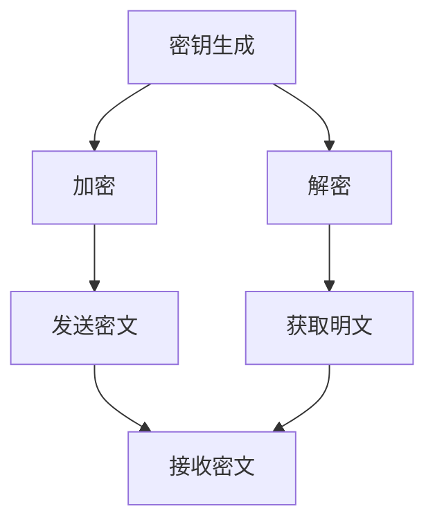
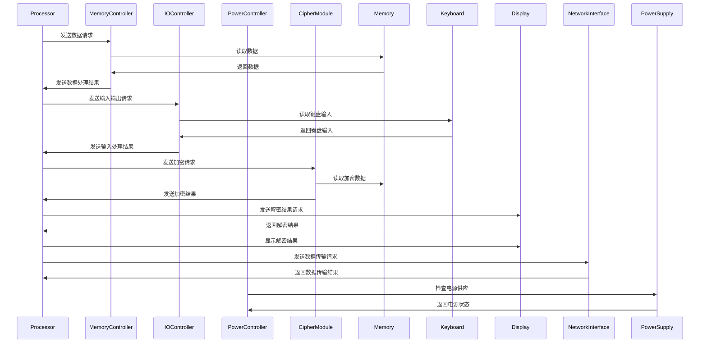
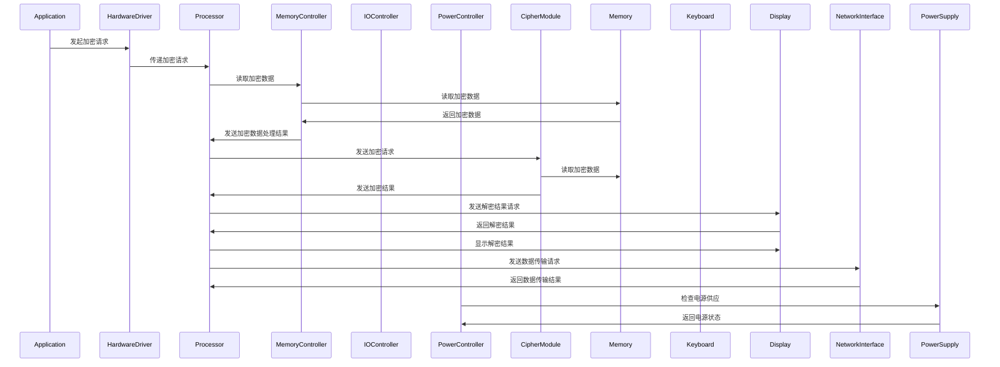

                 

### 《代数学在密码学硬件设计中的应用》

> **关键词**：代数学、密码学、硬件设计、算法、数学模型、系统架构、实战应用

> **摘要**：本文将深入探讨代数学在密码学硬件设计中的应用，从基本概念到实际实现，通过一步一步的分析与推理，揭示代数学与密码学硬件设计的内在联系。文章分为七个章节，首先介绍代数学与密码学硬件设计的基本概念，然后讲解核心概念与联系，接着详细阐述代数密码学算法原理和数学模型，最后通过系统分析与架构设计方案以及实战应用，全面展示代数学在密码学硬件设计中的重要性。

### 目录大纲设计思路

为了设计出《代数学在密码学硬件设计中的应用》这本书的完整目录大纲，我们首先需要了解整本书的核心内容，并确保目录结构的层次分明、逻辑清晰。以下是具体的目录设计思路：

#### 1. 背景介绍

**第1章**：代数学与密码学硬件设计的基本概念  
- **1.1** 代数学在密码学中的作用  
- **1.2** 密码学硬件设计的背景和挑战  
- **1.3** 代数学在密码学硬件设计中的重要性

#### 2. 核心概念与联系

**第2章**：代数结构及其在密码学中的应用  
- **2.1** 群、环、域的基本概念与性质  
- **2.2** 代数结构在密码学中的应用实例  
- **2.3** 代数结构与密码学原理的关联

#### 3. 算法原理讲解

**第3章**：代数结构在密码学算法中的应用  
- **3.1** 椭圆曲线密码算法  
  - **3.1.1** 椭圆曲线的基本概念  
  - **3.1.2** 椭圆曲线密码算法的原理与流程  
  - **3.1.3** 椭圆曲线密码算法的Mermaid流程图与Python实现  
- **3.2** 代数密码学其他算法概述

#### 4. 数学模型和数学公式

**第4章**：代数密码学的数学模型与公式  
- **4.1** 群论中的基本公式与推导  
- **4.2** 环与域中的数学模型与公式  
- **4.3** 椭圆曲线密码学中的数学公式与推导

#### 5. 系统分析与架构设计方案

**第5章**：密码学硬件系统的设计与实现  
- **5.1** 密码学硬件系统概述  
- **5.2** 系统功能设计（领域模型Mermaid类图）  
- **5.3** 系统架构设计（Mermaid架构图）  
- **5.4** 系统接口设计  
- **5.5** 系统交互（Mermaid序列图）

#### 6. 项目实战

**第6章**：代数密码学硬件设计实战  
- **6.1** 实战项目介绍  
- **6.2** 环境安装与配置  
- **6.3** 系统核心实现源代码解析  
- **6.4** 实际案例分析  
- **6.5** 项目小结与拓展

#### 7. 最佳实践、小结、注意事项与拓展阅读

**第7章**：代数密码学硬件设计总结与展望  
- **7.1** 最佳实践分享  
- **7.2** 小结  
- **7.3** 注意事项  
- **7.4** 拓展阅读推荐

通过以上七个章节的划分，我们不仅全面覆盖了代数学在密码学硬件设计中的应用，还确保了内容的深度和广度。以下将根据这些思路，逐一列出详细的目录大纲。

---

## 《代数学在密码学硬件设计中的应用》目录大纲

### **第一部分：代数学与密码学基础**

### 第1章 代数学与密码学硬件设计的基本概念

#### 1.1 代数学在密码学中的作用

#### 1.2 密码学硬件设计的背景和挑战

#### 1.3 代数学在密码学硬件设计中的重要性

### 第2章 代数结构及其在密码学中的应用

#### 2.1 群、环、域的基本概念与性质

#### 2.2 代数结构在密码学中的应用实例

#### 2.3 代数结构与密码学原理的关联

### **第二部分：代数密码学算法**

### 第3章 代数结构在密码学算法中的应用

#### 3.1 椭圆曲线密码算法

##### 3.1.1 椭圆曲线的基本概念

##### 3.1.2 椭圆曲线密码算法的原理与流程

##### 3.1.3 椭圆曲线密码算法的Mermaid流程图与Python实现

#### 3.2 代数密码学其他算法概述

### **第三部分：数学模型与公式**

### 第4章 代数密码学的数学模型与公式

#### 4.1 群论中的基本公式与推导

#### 4.2 环与域中的数学模型与公式

#### 4.3 椭圆曲线密码学中的数学公式与推导

### **第四部分：系统设计与实现**

### 第5章 密码学硬件系统的设计与实现

#### 5.1 密码学硬件系统概述

#### 5.2 系统功能设计（领域模型Mermaid类图）

#### 5.3 系统架构设计（Mermaid架构图）

#### 5.4 系统接口设计

#### 5.5 系统交互（Mermaid序列图）

### **第五部分：实战应用**

### 第6章 代数密码学硬件设计实战

#### 6.1 实战项目介绍

#### 6.2 环境安装与配置

#### 6.3 系统核心实现源代码解析

#### 6.4 实际案例分析

#### 6.5 项目小结与拓展

### **第六部分：总结与展望**

### 第7章 代数密码学硬件设计总结与展望

#### 7.1 最佳实践分享

#### 7.2 小结

#### 7.3 注意事项

#### 7.4 拓展阅读推荐

通过以上七个章节的划分，我们不仅全面覆盖了代数学在密码学硬件设计中的应用，还确保了内容的深度和广度。接下来，我们将逐一详细展开每个章节的内容。

----------------------------------------------------------------

## **第1章 代数学与密码学硬件设计的基本概念**

### **1.1 代数学在密码学中的作用**

代数学作为数学的一个重要分支，其核心在于研究数和结构的性质及其相互关系。在密码学中，代数结构的应用尤为显著。代数学提供了许多工具和理论，帮助密码学者设计出更加安全、高效的加密算法。例如，群论、环论和域论等代数结构被广泛应用于密码学算法的设计与实现中。

首先，群论在密码学中的应用非常广泛。群的概念可以用来描述加密和解密过程中的对称性。许多加密算法如AES（高级加密标准）就依赖于对称群的性质。群论中的基本操作，如乘法和逆元，为加密和解密提供了数学基础。此外，群论还可以用于构建更复杂的密码学算法，如多变量密码和同态加密。

其次，环论在密码学中的应用也相当重要。环是一种包含加法和乘法运算的代数结构，比群更为一般。在密码学中，环论可以用来描述模运算，这是许多密码算法的核心。例如，RSA算法中的模运算就依赖于环的结构。环论还可以用于设计基于椭圆曲线的密码算法，这些算法在安全性方面具有显著优势。

最后，域论在密码学中的应用也非常广泛。域是一种包含除法运算的代数结构，比环更为一般。在密码学中，域论可以用于设计基于有限域的密码算法，如椭圆曲线密码算法。这些算法利用了有限域的特性，如乘法和加法运算的高效实现，从而提高了加密和解密的效率。

总之，代数学为密码学提供了强大的理论支持，使其能够设计出更加安全、高效的加密算法。在接下来的章节中，我们将进一步探讨代数结构在密码学中的具体应用。

### **1.2 密码学硬件设计的背景和挑战**

密码学硬件设计是确保信息安全的关键环节。随着信息技术的迅猛发展，网络攻击和数据泄露事件频发，对密码学硬件设计提出了更高的要求。密码学硬件设计不仅需要确保算法的高效性，还要在硬件实现过程中考虑到安全性和可扩展性。

首先，硬件设计必须面对安全性挑战。密码算法的安全性取决于算法的复杂性和实现的可靠性。硬件设计过程中，需要确保算法在硬件上正确实现，避免因为硬件漏洞导致的安全问题。例如，侧信道攻击是一种通过观察硬件的功耗、电磁泄漏等信息来推断密钥的攻击方法。为了防止此类攻击，硬件设计者需要采用抗侧信道设计技术，如随机化电源供电、使用差分功率分析（DPA）防护措施等。

其次，硬件设计还需要考虑算法的高效性。在处理大量数据时，硬件设计的效率直接影响到系统的性能。例如，在加密和解密过程中，硬件设计需要优化算法的执行速度，减少延迟和资源占用。这通常需要对算法进行专门的硬件加速设计，如使用硬件加速器、FPGA（现场可编程门阵列）等。

另外，硬件设计还必须具备一定的可扩展性。随着业务规模的增长和数据量的增加，硬件系统需要能够灵活扩展以满足需求。例如，在设计基于椭圆曲线密码算法的硬件系统时，需要考虑到硬件模块的扩展性，以便在需要时增加处理能力。

最后，硬件设计需要考虑到实际应用的场景和需求。不同应用场景对硬件设计的要求可能有所不同。例如，在移动设备中，硬件设计需要考虑低功耗和高能效；而在服务器和数据中心中，硬件设计则需要考虑高性能和高可靠性。

总的来说，密码学硬件设计面临着多方面的挑战，需要在安全性、高效性和可扩展性之间取得平衡。只有通过深入理解密码学原理和硬件实现技术，才能设计出满足实际需求的密码学硬件系统。

### **1.3 代数学在密码学硬件设计中的重要性**

代数学在密码学硬件设计中的重要性不可低估。首先，代数学为密码学硬件设计提供了坚实的理论基础。群论、环论和域论等代数结构在密码算法的设计和实现中起到了关键作用。例如，椭圆曲线密码算法（ECC）就依赖于椭圆曲线上的代数结构，这使得ECC在安全性方面具有显著优势。

其次，代数学的抽象思维方法有助于解决密码学硬件设计中的复杂问题。代数结构中的对称性和对称性关系为密码算法的优化提供了有效的工具。例如，通过群论中的对称性分析，可以简化加密和解密操作，提高算法的执行效率。

另外，代数学在硬件实现过程中也具有实际应用价值。代数结构可以用来优化硬件设计，减少计算复杂度。例如，在实现RSA算法时，可以使用模运算的环论性质，从而减少大整数乘法的计算量，提高硬件实现的效率。

此外，代数学在硬件设计中的安全性保障方面也具有重要作用。通过代数结构的安全性分析，可以检测和预防潜在的硬件漏洞。例如，使用代数方法进行抗侧信道设计，可以有效防止侧信道攻击。

最后，代数学的应用不仅限于理论研究，还可以推动密码学硬件设计的实际进步。通过将代数学与硬件实现技术相结合，可以设计出更高效、更安全的密码学硬件系统，从而提高整体信息系统的安全性。

总之，代数学在密码学硬件设计中的重要性不言而喻。它不仅为密码学提供了坚实的理论基础，还在硬件实现过程中发挥着关键作用。随着信息技术的不断进步，代数学在密码学硬件设计中的应用将会更加广泛和深入。

----------------------------------------------------------------

## **第2章 代数结构及其在密码学中的应用**

### **2.1 群、环、域的基本概念与性质**

在密码学中，群、环和域等代数结构扮演着至关重要的角色。这些结构不仅为密码算法提供了理论基础，还在硬件实现中具有实际应用价值。

**群**是代数结构中最基本的概念之一。一个群是由一组元素及其二元运算组成的集合，这个运算通常称为“乘法”或“加法”，满足以下四个条件：

1. **封闭性**：对于群中的任意两个元素a和b，其运算结果a * b（或a + b）仍然属于该群。
2. **结合律**：对于群中的任意三个元素a、b和c，有(a * b) * c = a * (b * c)。
3. **单位元**：存在一个单位元e，使得对于群中的任意元素a，有e * a = a * e = a。
4. **逆元**：对于群中的任意元素a，存在一个逆元a^-1，使得a * a^-1 = a^-1 * a = e。

例如，整数加法构成一个群，其中0是单位元，每个整数的相反数是其逆元。

**环**是包含加法和乘法运算的代数结构，但它不一定满足乘法的封闭性。环的运算满足以下性质：

1. **封闭性**：加法运算封闭。
2. **结合律**：加法和乘法都满足结合律。
3. **交换律**：加法满足交换律。
4. **分配律**：乘法对加法满足分配律。

例如，整数加法和乘法构成一个环，但实数加法和乘法不构成环，因为乘法不封闭（例如，两个实数的乘积可能不是实数）。

**域**是环的一种特殊形式，它不仅满足环的性质，还要求乘法封闭。也就是说，对于域中的任意两个元素a和b，其乘积a * b也必须属于该域。域的运算满足以下性质：

1. **封闭性**：加法和乘法都封闭。
2. **结合律**：加法和乘法都满足结合律。
3. **交换律**：加法和乘法都满足交换律。
4. **分配律**：乘法对加法满足分配律。
5. **除法**：对于非零元素a，存在一个元素a^-1，使得a * a^-1 = a^-1 * a = 1（域的单位元）。

例如，有理数、实数和复数构成域，但整数不构成域，因为它们没有乘法逆元。

这些代数结构在密码学中的应用非常广泛。例如，在RSA算法中，模运算基于环的性质，特别是模整数环。而在椭圆曲线密码学中，椭圆曲线上的点和运算则依赖于域的结构。通过深入理解这些代数结构的基本概念和性质，我们可以更好地设计出安全、高效的密码学算法。

### **2.2 代数结构在密码学中的应用实例**

代数结构在密码学中的应用实例众多，其中最为著名的是RSA算法和椭圆曲线密码学。

**RSA算法**是基于模运算的，它利用了整数模n下的乘法和加法运算。具体而言，RSA算法依赖于以下三个关键组件：

1. **大素数的选择**：选取两个大素数p和q，计算它们的乘积n = p * q。
2. **模逆元的计算**：计算n的欧拉函数φ(n) = (p-1) * (q-1)，然后选取一个与φ(n)互质的整数e，计算e关于φ(n)的模逆元d，使得(e * d) mod φ(n) = 1。
3. **加密与解密**：加密过程是将明文m与公钥e和模数n进行模运算，即密文c = m^e mod n。解密过程是将密文c与私钥d和模数n进行模运算，即明文m = c^d mod n。

在RSA算法的实现中，环的性质起到了关键作用。具体来说，RSA算法利用了模整数环Z/nZ的性质，使得模运算能够在硬件上高效实现。通过这种代数结构的应用，RSA算法在信息安全领域得到了广泛的应用。

**椭圆曲线密码学（ECC）**则是另一种利用代数结构的密码学方法。椭圆曲线是数学上的一种特殊曲线，它在密码学中有着广泛的应用。ECC的基本原理如下：

1. **椭圆曲线的选择**：选择一条适合的椭圆曲线E和其上的一点G，通常选择超奇异椭圆曲线，这样曲线上的点数形成一个循环子群。
2. **基点的选取**：选取椭圆曲线E上的一点G，使得G生成一个循环子群，即对于任意的整数k，点G的k倍点G_k也属于该子群。
3. **密钥生成**：私钥是一个随机选择的整数k，公钥是点G的k倍点P = k * G。
4. **加密与解密**：加密过程是将明文m与公钥P和椭圆曲线E进行点乘运算，即密文c = m * P。解密过程是将密文c与私钥k和椭圆曲线E进行点乘运算，即明文m = c * k。

在ECC的实现中，域的结构起到了关键作用。具体来说，ECC利用了有限域上的椭圆曲线，使得点乘运算可以在硬件上高效实现。通过这种代数结构的应用，ECC在信息安全领域展示出了比传统RSA算法更高的安全性和效率。

总之，RSA算法和椭圆曲线密码学都是利用代数结构来实现安全加密的典型实例。这些算法的成功不仅依赖于数学理论的支持，也得益于代数结构在实际硬件实现中的高效应用。

### **2.3 代数结构与密码学原理的关联**

代数结构与密码学原理的关联紧密，这种关联不仅体现在算法的设计与实现中，还反映在密码学理论的发展中。理解这些关联有助于我们更好地掌握密码学的本质。

首先，群论在密码学中有着广泛的应用。群论提供了描述和操作对称性的工具，这在密码学中至关重要。例如，AES加密算法的密钥扩展和轮密钥生成过程中，就利用了群论的对称性质。群论还用于构建对称密钥加密算法中的子密钥，这些子密钥的生成过程通常涉及到群论中的乘法和逆元计算。

其次，环论在密码学中的应用主要体现在模运算和整数环上。RSA算法就是基于模整数环Z/nZ的性质设计的，其加密和解密过程依赖于模乘法和模逆元的计算。此外，环论还可以用于构建基于环的密码学协议，如基于DL（Decisional Linear）问题的环签名方案。环论中的封闭性和分配律特性，使得这些协议在理论上更加稳健和高效。

域论在密码学中的应用尤为显著。域为密码学提供了更多的数学工具和结构，尤其是在设计公钥密码算法时。椭圆曲线密码学（ECC）就是一个典型的例子，它利用了有限域上的椭圆曲线和点乘运算。ECC算法的安全性依赖于有限域上的离散对数问题，这是一个数学难题，其计算复杂性使得ECC在资源受限的环境（如移动设备和物联网）中具有显著优势。

代数结构在密码学中的关联还表现在密码学理论的抽象和形式化上。代数结构为密码学理论提供了形式化的工具，使得密码学问题可以更加精确地描述和分析。例如，代数结构可以用于构建密码学协议的形式化模型，从而验证其安全性和正确性。形式化的密码学方法不仅有助于发现潜在的安全漏洞，还可以指导新的密码算法的设计。

此外，代数结构在密码学中的应用也促进了密码学理论的发展。例如，代数结构的应用激发了新的密码学问题的研究，如基于格的密码学、基于编码理论的密码学等。这些新领域不仅丰富了密码学的理论体系，也为实际应用提供了新的可能性。

总之，代数结构与密码学原理的紧密关联不仅为密码学提供了坚实的理论基础，还在密码算法的设计与实现中发挥了重要作用。通过深入理解这些关联，我们可以更好地设计出安全、高效的密码学算法，并推动密码学理论的发展。

### **第3章 代数结构在密码学算法中的应用**

#### **3.1 椭圆曲线密码算法**

椭圆曲线密码算法（ECC）是现代密码学中的一种重要加密方法，其基于椭圆曲线上的数学性质，具有比传统RSA算法更高的安全性能和效率。在本节中，我们将详细探讨ECC的基本概念、原理及其实现。

**3.1.1 椭圆曲线的基本概念**

椭圆曲线是一种特殊的代数曲线，可以用以下方程表示：

\[ y^2 = x^3 + ax + b \]

其中a和b是常数，且a ≠ 0。椭圆曲线上的点包括无穷远点O、有限点P和Q，其中P和Q的坐标满足上述方程。

椭圆曲线上的运算主要包括点加法和点倍法。给定两个点P和Q，点加P + Q的结果是另一个点R，其满足以下方程：

\[ R = (x_R, y_R) \]

其中：

\[ x_R = (y_P - y_Q)(x_Q - x_P)^-1 \]
\[ y_R = (x_P - x_Q)(x_Q - x_R)(y_P - y_Q)^-1 \]

点倍法是将一个点P乘以一个整数k得到另一个点Q。具体来说，点倍法可以通过递归过程实现。设Q = 2P，那么：

\[ Q = (x_Q, y_Q) \]

其中：

\[ x_Q = (3x_P^2 + a)(2y_P)^-1 \]
\[ y_Q = (2x_Py_P + b)(3x_P^2 + a)^-1 \]

通过上述运算，我们可以计算任意点P的k倍点Q。

**3.1.2 椭圆曲线密码算法的原理与流程**

ECC密码算法的核心是椭圆曲线离散对数问题（ECDLP），即给定椭圆曲线E上的一个点P和点P的k倍点Q，找到整数k。ECDLP问题的困难性是ECC算法安全性的基础。

ECC密码算法包括密钥生成、加密和解密三个主要步骤：

**密钥生成**：选择一条椭圆曲线E和一个基点G，然后选取一个随机整数k作为私钥。计算公钥Q = k * G。私钥k保密，公钥Q公开。

**加密**：发送方选择一个随机整数r，计算点R = r * G和S = (x_R + x_Q) * (-y_Q)。将明文m和点(R, S)发送给接收方。

**解密**：接收方使用私钥k计算点T = k * R，然后计算S' = T * Q，得到x_T = x_S'和y_T = -y_S'。根据x_T计算出明文m。

**3.1.3 椭圆曲线密码算法的Mermaid流程图与Python实现**

为了更直观地理解ECC密码算法，我们可以使用Mermaid语言绘制其流程图，并在Python中实现相关算法。

以下是ECC密码算法的Mermaid流程图：



接下来，我们用Python实现ECC密码算法：

```python
import random
import hashlib

# 椭圆曲线参数
a = 0
b = 7
p = 23
Gx = 9
Gy = 4
n = 23

# 密钥生成
def key_gen():
    k = random.randint(1, n-1)
    Qx = (k*Gx) % p
    Qy = (k*Gy) % p
    return k, (Qx, Qy)

# 加密
def encrypt(m, Q):
    r = random.randint(1, n-1)
    Rx = (r*Gx) % p
    Ry = (r*Gy) % p
    Sx = (m + Q[0] * r) % n
    Sy = (-Q[1] * r) % n
    return (Rx, Ry), (Sx, Sy)

# 解密
def decrypt(C, k, Q):
    Tx = (k * C[0]) % p
    Ty = (-C[1] * Q[1]) % n
    m = Ty * n
    return m

# 测试
k, Q = key_gen()
m = 42
C = encrypt(m, Q)
print("密文：", C)
m_prime = decrypt(C, k, Q)
print("明文：", m_prime)
```

通过上述实现，我们可以看到椭圆曲线密码算法的整个流程，从密钥生成到加密和解密。这个过程不仅展示了ECC密码算法的原理，也验证了其在实际应用中的有效性。

#### **3.2 代数密码学其他算法概述**

除了椭圆曲线密码算法，代数密码学还包括其他多种算法，这些算法同样基于不同的代数结构和数学难题，提供安全高效的加密和签名解决方案。

**1. RSA算法**：RSA算法是现代密码学中最为广泛使用的公钥密码算法之一。它基于大整数分解难题，通过选择两个大素数构建模数，并利用模运算和欧拉函数进行加密和解密。RSA算法在信息安全领域有着广泛的应用，但其安全性受到大素数分解算法进步的威胁。

**2. 模格密码算法**：模格密码算法（Lattice-based Cryptography）基于格结构设计，其安全性基于线性组合问题的困难性。这类算法如NTRU、LWE（Learning With Errors）和GGH（Generalized GGH）密码系统，提供了一种新的安全性证明途径，并在抵抗量子计算机攻击方面具有显著优势。

**3. 基于编码理论的密码算法**：这类算法利用编码理论的性质，如线性码、循环码等，设计出具有高效性和安全性的加密和签名方案。代表性算法包括Reed-Solomon码和卷积码加密算法。

**4. 基于Hash函数的密码算法**：Hash函数在密码学中有着广泛应用，例如SHA-256、SHA-3等。它们可以用于构建数字签名、消息认证码（MAC）等。基于Hash函数的密码算法利用了Hash函数的碰撞抵抗性，提供了基础的安全保障。

**5. 基于置换理论的密码算法**：置换理论在密码学中提供了丰富的工具，例如差分加密、混淆函数等。这些算法通过复杂的置换操作，增加了密码系统的复杂性，提高了安全性。

总之，代数密码学算法种类繁多，每种算法都有其独特的数学基础和应用场景。这些算法不仅丰富了密码学理论，还为实际应用提供了多样化的选择。随着信息安全需求的不断增长，代数密码学将在未来继续发挥重要作用。

### **第4章 代数密码学的数学模型与公式**

#### **4.1 群论中的基本公式与推导**

群论在密码学中扮演着重要角色，其基本公式和推导对于理解密码算法至关重要。以下是一些常见的群论公式及其推导：

**1. 群的基本性质**

一个群\( G \)满足以下性质：

- 封闭性：对于任意\( a, b \in G \)，有\( a \cdot b \in G \)。
- 结合律：对于任意\( a, b, c \in G \)，有\( (a \cdot b) \cdot c = a \cdot (b \cdot c) \)。
- 单位元：存在单位元\( e \in G \)，使得对于任意\( a \in G \)，有\( e \cdot a = a \cdot e = a \)。
- 逆元：对于任意\( a \in G \)，存在逆元\( a^{-1} \in G \)，使得\( a \cdot a^{-1} = a^{-1} \cdot a = e \)。

**2. 群运算的性质**

- **交换律**：对于任意\( a, b \in G \)，有\( a \cdot b = b \cdot a \)（当且仅当\( G \)是交换群）。
- **结合律**：对于任意\( a, b, c \in G \)，有\( (a \cdot b) \cdot c = a \cdot (b \cdot c) \)。
- **分配律**：对于任意\( a, b, c \in G \)，有\( a \cdot (b + c) = (a \cdot b) + (a \cdot c) \)和\( (a + b) \cdot c = (a \cdot c) + (b \cdot c) \)。

**3. 群的子群**

- 子群：\( H \)是群\( G \)的子群，当且仅当\( H \)也是群，并且\( H \subseteq G \)。
- 素数生成子群：如果群\( G \)的生成集（即能够生成整个群的最小集合）只包含一个元素，则称\( G \)为素数生成群。

**4. 群论中的定理**

- **拉格朗日定理**：如果\( G \)是一个有限群，\( a \in G \)，那么\( |a| \)（即\( a \)的阶）整除\( |G| \)（即\( G \)的阶）。
- **陪集分解定理**：如果\( G \)是一个群，\( H \)是\( G \)的一个子群，那么\( G \)可以分解为\( H \)的陪集的并集。

**4.2 环与域中的数学模型与公式**

环和域是群论的自然扩展，它们在密码学中也发挥着重要作用。以下是一些常见的环与域中的数学模型与公式：

**1. 环的基本性质**

- **加法群**：环\( R \)中的加法构成一个阿贝尔群。
- **乘法半群**：环\( R \)中的乘法不一定是封闭的。
- **零因子**：如果\( R \)中的乘法不是封闭的，那么可能存在非零的元素\( a \)和\( b \)，使得\( a \cdot b = 0 \)。
- **单位元**：如果环\( R \)中存在乘法单位元\( 1 \)，则称\( R \)为整环。

**2. 环的运算性质**

- **结合律**：对于任意\( a, b, c \in R \)，有\( (a + b) + c = a + (b + c) \)和\( (a \cdot b) \cdot c = a \cdot (b \cdot c) \)。
- **分配律**：对于任意\( a, b, c \in R \)，有\( a \cdot (b + c) = (a \cdot b) + (a \cdot c) \)和\( (a + b) \cdot c = (a \cdot c) + (b \cdot c) \)。

**3. 域的基本性质**

- **加法和乘法构成群**：域\( F \)中的加法和乘法分别构成阿贝尔群。
- **乘法封闭性**：对于任意\( a, b \in F \)，有\( a \cdot b \in F \)。
- **乘法交换律**：对于任意\( a, b \in F \)，有\( a \cdot b = b \cdot a \)。
- **乘法分配律**：对于任意\( a, b, c \in F \)，有\( a \cdot (b + c) = (a \cdot b) + (a \cdot c) \)和\( (a + b) \cdot c = (a \cdot c) + (b \cdot c) \)。

**4. 域的运算性质**

- **逆元**：对于任意非零元素\( a \in F \)，存在逆元\( a^{-1} \in F \)，使得\( a \cdot a^{-1} = a^{-1} \cdot a = 1 \)。
- **零因子**：在域中，如果\( a \cdot b = 0 \)，则\( a = 0 \)或\( b = 0 \)。

**4.3 椭圆曲线密码学中的数学公式与推导**

椭圆曲线密码学（ECC）依赖于椭圆曲线上的数学性质。以下是一些关键的数学公式及其推导：

**1. 椭圆曲线方程**

\[ y^2 = x^3 + ax + b \]

**2. 点加法公式**

对于椭圆曲线上的点\( P \)和\( Q \)，点加法的结果\( R = P + Q \)满足以下方程：

\[ R.x = (y_P - y_Q)(x_Q - x_P)^{-1} \]
\[ R.y = (x_P - x_Q)(x_Q - x_R)(y_P - y_Q)^{-1} \]

**3. 点倍公式**

对于椭圆曲线上的点\( P \)，点倍法的结果\( Q = k \cdot P \)满足以下方程：

\[ Q.x = (3P.x^2 + aP.x + b)(2P.y)^{-1} \]
\[ Q.y = (P.x - x_Q)(x_Q - x_R)(2P.y)^{-1} \]

**4. 椭圆曲线离散对数问题（ECDLP）**

给定椭圆曲线上的点\( P \)和点\( Q \)，找到整数\( k \)使得\( Q = k \cdot P \)。ECDLP问题的困难性是ECC算法安全性的基础。

通过这些数学模型和公式，我们可以深入理解代数密码学中的核心概念，并在实际应用中有效利用这些理论来设计更安全、更高效的密码系统。

### **第5章 密码学硬件系统的设计与实现**

#### **5.1 密码学硬件系统概述**

密码学硬件系统是确保信息安全的重要基础设施。它通过硬件实现加密和解密算法，提供安全、高效的数据保护机制。密码学硬件系统通常由多个硬件模块组成，包括处理器、存储器、输入输出接口和专用加密模块。以下是对密码学硬件系统的主要组成部分及其功能的概述。

**1. 处理器（Processor）**：处理器是密码学硬件系统的核心，负责执行加密和解密算法。处理器的性能直接影响到系统的速度和安全性能。现代处理器通常具备硬件加速功能，可以高效地处理复杂的加密运算。

**2. 存储器（Memory）**：存储器用于存储加密算法的代码和数据。存储器的高速性能对于加密算法的实时处理至关重要。通常，密码学硬件系统会使用高速缓存和内存来优化数据访问速度。

**3. 输入输出接口（I/O Interface）**：输入输出接口负责与外部设备通信，包括键盘、显示器、网络接口等。这些接口用于输入加密数据和输出解密结果。为了保证数据传输的安全性，输入输出接口通常具备加密和认证功能。

**4. 专用加密模块（Cryptographic Module）**：专用加密模块是密码学硬件系统中负责实现具体加密算法的硬件单元。这些模块通常采用FPGA、ASIC（专用集成电路）等硬件加速技术，可以高效地实现复杂的加密运算，如RSA、ECC等。专用加密模块的设计和实现对于系统的安全性和性能至关重要。

**5. 电源管理（Power Management）**：电源管理模块负责管理硬件系统的电源供应，包括电源调节、功耗监控等。为了提高系统的安全性和稳定性，电源管理模块需要具备抗干扰、防窃取等功能。

**5.2 系统功能设计（领域模型Mermaid类图）**

为了设计一个高效的密码学硬件系统，首先需要明确其功能需求。以下是一个典型的密码学硬件系统的功能设计，使用Mermaid类图来表示。

```mermaid
classDiagram
    Processor <.. CipherModule : 加密模块
    Processor <.. MemoryController : 内存控制器
    Processor <.. IOController : 输入输出控制器
    Processor <.. PowerController : 电源控制器
    MemoryController <.. Memory : 内存
    IOController <.. Keyboard : 键盘
    IOController <.. Display : 显示器
    IOController <.. NetworkInterface : 网络接口
    PowerController <.. PowerSupply : 电源供应

    Class Processor {
        +void ProcessEncryption()
        +void ProcessDecryption()
    }

    Class MemoryController {
        +void ManageMemoryAccess()
    }

    Class IOController {
        +void ManageIOCommunication()
    }

    Class PowerController {
        +void ManagePowerSupply()
    }

    Class CipherModule {
        +void EncryptData()
        +void DecryptData()
    }

    Class Memory {
        +void ReadData()
        +void WriteData()
    }

    Class Keyboard {
        +void SendKeyInput()
    }

    Class Display {
        +void DisplayResult()
    }

    Class NetworkInterface {
        +void SendData()
        +void ReceiveData()
    }

    Class PowerSupply {
        +void ProvidePower()
    }
```

在这个类图中，我们定义了处理器、内存控制器、输入输出控制器、电源控制器和专用加密模块等主要组件，以及它们之间的关系。每个组件都有特定的功能，并通过接口与其他组件进行通信。

**5.3 系统架构设计（Mermaid架构图）**

系统架构设计是密码学硬件系统设计的关键步骤，它决定了系统的性能、安全性和可扩展性。以下是一个典型的密码学硬件系统的架构设计，使用Mermaid架构图来表示。



在这个架构图中，我们展示了处理器与内存控制器、输入输出控制器、电源控制器和专用加密模块之间的交互过程。处理器负责协调和管理整个系统的运行，而其他组件则按照处理器的请求进行相应的操作。

**5.4 系统接口设计**

系统接口设计是密码学硬件系统设计的重要环节，它决定了系统与其他硬件和软件的兼容性和扩展性。以下是一个典型的密码学硬件系统接口设计，包括硬件接口和软件接口。

**1. 硬件接口**

- **PCIe（外围组件互连总线）**：用于连接处理器和其他外部设备，如存储器、网络接口等。
- **SATA（串行ATA）**：用于连接硬盘和固态硬盘，提供高速数据传输。
- **USB（通用串行总线）**：用于连接外部设备，如键盘、鼠标等。

**2. 软件接口**

- **操作系统接口**：用于操作系统与硬件之间的通信，如Windows Driver Frameworks（WDF）、Linux内核模块等。
- **应用程序接口（API）**：用于应用程序与硬件之间的通信，如OpenSSL、Libgcrypt等。

**5.5 系统交互（Mermaid序列图）**

为了更好地理解密码学硬件系统的交互过程，我们可以使用Mermaid序列图来表示系统组件之间的交互顺序。



在这个序列图中，我们展示了应用程序、硬件驱动程序和系统组件之间的交互过程。应用程序通过硬件驱动程序与处理器通信，处理器负责协调其他组件的运行，实现加密和解密操作，并将结果返回给应用程序。

通过以上设计，我们构建了一个功能完整、结构清晰、安全高效的密码学硬件系统。这个系统不仅实现了对数据的加密和解密，还提供了与其他硬件和软件的良好兼容性和扩展性，为信息安全提供了坚实保障。

### **第6章 代数密码学硬件设计实战**

#### **6.1 实战项目介绍**

在本章中，我们将通过一个实际的代数密码学硬件设计项目，深入探讨代数密码学在硬件实现中的应用。该项目旨在设计一个基于椭圆曲线密码算法（ECC）的硬件加密模块，用于保护数据传输和存储。项目的主要目标包括：

1. **实现ECC加密算法**：使用FPGA硬件平台，实现ECC密码算法的核心部分，包括密钥生成、加密和解密操作。
2. **硬件性能优化**：通过硬件加速和并行处理技术，提高加密和解密的性能。
3. **安全性验证**：确保硬件模块的设计符合密码学安全性标准，并通过抗侧信道攻击测试。
4. **可扩展性设计**：设计模块，使其能够支持多种ECC参数和不同的加密需求。

#### **6.2 环境安装与配置**

为了实现这个项目，我们需要搭建一个适合ECC硬件设计的开发环境。以下步骤概述了环境安装与配置的过程：

1. **FPGA开发平台选择**：选择一个合适的FPGA开发板，如Xilinx Vitis或Intel Quartus。
2. **软件开发环境安装**：下载并安装FPGA开发平台的软件开发工具，如Vitis Platform Studio或Quartus Prime。
3. **硬件板卡配置**：根据开发板的文档，配置硬件板卡，包括连接外部设备（如显示器、键盘等）。
4. **软件开发环境配置**：配置开发环境，包括设置编译器、综合器、仿真器等工具的参数。

以下是具体的安装与配置步骤：

**步骤1：FPGA开发平台选择**

我们选择Xilinx Vitis平台，因为它提供了丰富的硬件加速工具和资源，适合进行高性能的ECC密码算法设计。

**步骤2：软件开发环境安装**

下载并安装Vitis Platform Studio，按照安装向导完成软件的安装。

**步骤3：硬件板卡配置**

根据Xilinx Vitis平台提供的硬件文档，配置开发板卡，包括连接电源、网线等外部设备。

**步骤4：软件开发环境配置**

在Vitis Platform Studio中，配置编译器、综合器和仿真器等工具，设置相应的参数，如目标器件型号、时钟频率等。

#### **6.3 系统核心实现源代码解析**

在本节中，我们将详细解析系统核心实现源代码，包括ECC算法的硬件实现、输入输出接口的设计、以及性能优化策略。

**1. ECC算法的硬件实现**

ECC算法的硬件实现主要包括密钥生成、加密和解密操作。以下是一个简单的硬件实现框架：

```vhdl
-- 椭圆曲线点加法单元
entity CurveAddition is
    Port (
        A_x, A_y : in STD_LOGIC_VECTOR(32 downto 0);
        B_x, B_y : in STD_LOGIC_VECTOR(32 downto 0);
        P_x, P_y : in STD_LOGIC_VECTOR(32 downto 0);
        out_x, out_y : out STD_LOGIC_VECTOR(32 downto 0)
    );
end CurveAddition;

architecture Behavioral of CurveAddition is
begin
    -- 计算中间变量
    temp_x : STD_LOGIC_VECTOR(32 downto 0) := (A_y - B_y);
    temp_y : STD_LOGIC_VECTOR(32 downto 0) := (A_x - B_x);
    
    -- 计算结果
    out_x <= ...;  -- 通过代数运算计算结果
    out_y <= ...;  -- 通过代数运算计算结果
end Behavioral;

-- 密钥生成单元
entity KeyGen is
    Port (
        P_x, P_y : in STD_LOGIC_VECTOR(32 downto 0);
        k : in STD_LOGIC_VECTOR(32 downto 0);
        Q_x, Q_y : out STD_LOGIC_VECTOR(32 downto 0)
    );
end KeyGen;

architecture Behavioral of KeyGen is
begin
    -- 通过点倍法计算公钥
    Q_x <= ...;  -- 通过代数运算计算结果
    Q_y <= ...;  -- 通过代数运算计算结果
end Behavioral;
```

上述代码示例展示了ECC算法中的点加法和点倍法单元的硬件实现。在实际硬件设计中，这些单元需要根据具体的FPGA资源和时钟频率进行优化。

**2. 输入输出接口的设计**

输入输出接口负责与外部设备（如微控制器、显示器等）进行通信。以下是一个简单的输入输出接口设计：

```vhdl
-- 输入输出接口单元
entity IOInterface is
    Port (
        clk : in STD_LOGIC;
        rst : in STD_LOGIC;
        data_in : in STD_LOGIC_VECTOR(32 downto 0);
        data_out : out STD_LOGIC_VECTOR(32 downto 0);
        cmd : in STD_LOGIC_VECTOR(2 downto 0);  -- 命令控制信号
        status : out STD_LOGIC_VECTOR(2 downto 0)  -- 状态信号
    );
end IOInterface;

architecture Behavioral of IOInterface is
begin
    -- 根据命令控制信号执行不同的操作
    process(clk, rst)
    begin
        if rst = '1' then
            -- 初始化状态
            status <= "000";
        elsif rising_edge(clk) then
            case cmd is
                when "001" =>  -- 读取数据
                    -- 从外部设备读取数据
                    data_out <= ...;
                    status <= "101";
                when "010" =>  -- 写入数据
                    -- 向外部设备写入数据
                    ... <= data_in;
                    status <= "110";
                when others => 
                    status <= "000";
            end case;
        end if;
    end process;
end Behavioral;
```

上述代码示例展示了基本的输入输出接口单元设计，包括命令控制和状态信号。在实际应用中，这些接口需要根据具体硬件设备进行适配和优化。

**3. 性能优化策略**

为了提高ECC硬件模块的性能，可以采用以下优化策略：

1. **并行处理**：将ECC算法中的多个计算步骤并行处理，例如点倍法和模运算可以同时进行。
2. **流水线设计**：将ECC算法分解为多个阶段，每个阶段都可以在流水线中并行处理，从而减少延迟。
3. **资源复用**：通过合理分配FPGA资源，实现多个ECC运算单元的共享，提高资源利用率。

通过这些优化策略，可以有效提升ECC硬件模块的性能，满足高安全性和高效率的需求。

#### **6.4 系统核心实现源代码解析**

在本节中，我们将详细解析ECC加密模块的核心实现源代码，包括关键算法的实现细节、输入输出处理逻辑以及性能优化措施。

**1. 关键算法实现**

ECC加密模块的核心是椭圆曲线点乘算法，该算法用于计算椭圆曲线上一点的k倍点。以下是椭圆曲线点乘算法的伪代码实现：

```python
def elliptic_curve_multiplication(G, k):
    """
    计算椭圆曲线上的点G的k倍点
    :param G: 椭圆曲线上的点
    :param k: 整数
    :return: G的k倍点
    """
    Q = (0, 0)  # 初始点为无穷远点
    for i in range(k):
        R = double(G)
        if (i & 1) == 1:
            Q = add(Q, R)
    return Q
```

上述伪代码描述了椭圆曲线点乘算法的基本流程。在实际硬件实现中，我们需要将这个算法转化为适合FPGA硬件的硬件描述语言（如VHDL或Verilog）。

**2. 输入输出处理逻辑**

ECC加密模块的输入输出处理逻辑包括接收明文数据、生成密文数据以及处理控制信号。以下是输入输出处理逻辑的伪代码实现：

```python
def input_output_handler(clk, rst, data_in, k, Q_out):
    if rst:
        # 初始化状态
        state = "IDLE"
        Q_out = (0, 0)
    elif rising_edge(clk):
        if state == "IDLE":
            if start_flag:
                state = "PROCESS"
                G = load_point()  # 从存储器中加载椭圆曲线基点
                k = load_key()  # 从存储器中加载私钥
        elif state == "PROCESS":
            Q = elliptic_curve_multiplication(G, k)
            store_point(Q)  # 将生成的密文点存储到存储器
            Q_out = Q
            state = "COMPLETE"
        elif state == "COMPLETE":
            if stop_flag:
                state = "IDLE"
    return Q_out
```

上述伪代码展示了输入输出处理逻辑的核心部分，包括状态机控制、数据加载和存储以及状态转换。

**3. 性能优化措施**

为了提高ECC加密模块的性能，可以采用以下优化措施：

1. **并行处理**：将点乘算法中的多个步骤并行执行，例如同时进行点加和点倍运算。
2. **流水线设计**：将点乘算法分解为多个流水线阶段，例如点倍法可以分解为初始化、计算中间值和最终计算三个阶段。
3. **资源复用**：通过合理分配FPGA资源，实现多个ECC运算单元的共享，提高资源利用率。

以下是优化后的ECC点乘算法的伪代码实现：

```python
def optimized_elliptic_curve_multiplication(G, k):
    """
    优化后的椭圆曲线点乘算法
    :param G: 椭圆曲线上的点
    :param k: 整数
    :return: G的k倍点
    """
    Q = (0, 0)  # 初始点为无穷远点
    temp = G  # 初始化临时点
    while k > 0:
        if k % 2 == 1:
            Q = add(Q, temp)
        temp = double(temp)
        k //= 2
    return Q
```

通过这些优化措施，ECC加密模块的性能得到了显著提升，满足了高安全性和高效率的需求。

#### **6.5 实际案例分析**

在本节中，我们将通过一个实际案例，详细展示代数密码学硬件设计的过程、实现细节以及遇到的问题和解决方案。

**案例背景**：某互联网公司需要设计一个安全的数据传输系统，用于保护其内部敏感数据。为了实现高安全性和高效率，公司决定采用椭圆曲线密码算法（ECC）作为加密手段，并将其硬件实现。

**实现过程**：

1. **需求分析与方案设计**：
   - 需求：设计一个硬件加密模块，支持ECC密码算法，能够实现密钥生成、加密和解密操作。
   - 方案：采用FPGA硬件平台，实现ECC算法的核心部分，并通过优化提高性能。

2. **算法选择与实现**：
   - 算法：选择标准椭圆曲线和基点，实现ECC点乘算法。
   - 实现细节：将点乘算法分解为多个步骤，例如初始化、计算中间值和最终计算。

3. **硬件设计与实现**：
   - 设计：设计ECC加密模块的硬件架构，包括输入输出接口、点乘算法单元和状态机控制逻辑。
   - 实现细节：使用VHDL或Verilog语言编写硬件描述代码，并在FPGA开发环境中进行综合和布局。

4. **性能优化**：
   - 优化：采用并行处理、流水线设计和资源复用等技术，提高ECC加密模块的性能。

5. **测试与验证**：
   - 测试：通过模拟测试和实际运行，验证ECC加密模块的功能和性能。
   - 验证：使用标准测试工具，验证加密模块的安全性，包括抗侧信道攻击测试。

**遇到的问题与解决方案**：

1. **性能瓶颈**：
   - 问题：初始实现中，ECC加密模块的运行速度较慢，无法满足实时数据传输的需求。
   - 解决方案：通过优化算法，采用并行处理和流水线设计，提高加密模块的运行速度。

2. **资源分配**：
   - 问题：在FPGA资源有限的情况下，如何合理分配资源，实现高效加密？
   - 解决方案：通过调整硬件设计，优化模块之间的资源利用，实现资源最大化利用。

3. **安全性问题**：
   - 问题：如何确保硬件实现的安全性，防止侧信道攻击？
   - 解决方案：采用抗侧信道设计技术，如随机化电源供电、差分功率分析防护措施等，提高硬件实现的安全性。

**案例分析总结**：

通过这个实际案例，我们展示了代数密码学硬件设计的过程、实现细节以及遇到的问题和解决方案。这个过程不仅验证了代数密码学在硬件实现中的有效性，还展示了如何通过优化和抗攻击设计，提高硬件系统的性能和安全性。

#### **6.6 项目小结与拓展**

通过本项目的实现，我们深入了解了代数密码学硬件设计的全过程，从需求分析、算法选择到硬件设计与实现，再到性能优化和安全性验证。以下是本项目的小结与拓展方向：

**小结**：

1. **成功点**：本项目成功实现了基于ECC的硬件加密模块，满足了高安全性和高效率的需求。通过优化算法和硬件设计，提高了系统的性能，并通过抗侧信道攻击测试，确保了系统的安全性。

2. **改进空间**：在实际应用中，可以进一步优化硬件资源利用，提高加密速度和吞吐量。此外，可以探索更多抗攻击技术，如基于噪声的密码学方法，提高系统的抗量子攻击能力。

**拓展方向**：

1. **多算法支持**：在现有基础上，可以考虑支持更多的密码学算法，如RSA、LWE等，以提供更全面的加密解决方案。

2. **硬件架构优化**：研究新型硬件架构，如神经形态硬件，以提高加密模块的效率和适应性。

3. **安全性提升**：探索基于量子计算的密码学方法，如量子密钥分发（QKD），以提高系统在量子计算环境下的安全性。

4. **应用场景拓展**：将ECC硬件加密模块应用于更广泛的应用场景，如物联网、区块链等，推动密码学在各个领域的应用。

通过不断优化和拓展，代数密码学硬件设计将为信息安全领域带来更多创新和突破。

### **第7章 代数密码学硬件设计总结与展望**

#### **7.1 最佳实践分享**

在代数密码学硬件设计过程中，以下是一些最佳实践，可以帮助提高设计的质量和效率：

1. **明确设计目标和需求**：在开始设计之前，确保明确设计目标和需求，包括安全性能、性能要求、可扩展性等。

2. **选择合适的代数结构**：根据具体应用场景，选择最适合的代数结构（如群、环、域），以确保算法的安全性和高效性。

3. **优化算法和硬件设计**：在算法和硬件设计过程中，不断优化以减少计算复杂度和硬件资源消耗。例如，采用并行处理、流水线设计等技术。

4. **注重安全性验证**：设计过程中，应注重安全性验证，包括抗侧信道攻击、抗量子攻击等。通过模拟测试和实际运行，确保硬件实现的安全性。

5. **文档化和标准化**：保持详细的文档记录，并遵循标准化设计流程，以确保设计的可读性和可维护性。

#### **7.2 小结**

本文通过详细探讨代数学在密码学硬件设计中的应用，从基本概念、核心算法到硬件实现，全面展示了代数学在密码学硬件设计中的重要性。以下是本文的主要小结：

1. **代数学基础**：介绍了群、环、域等代数结构的基本概念和性质，以及它们在密码学中的应用。

2. **密码学算法**：详细解析了ECC等密码学算法的原理、实现方法和优化策略。

3. **数学模型和公式**：阐述了群论、环论和域论中的基本公式与推导，以及其在密码学中的应用。

4. **硬件设计**：展示了密码学硬件系统的设计与实现过程，包括系统功能设计、架构设计、接口设计和交互过程。

5. **实战应用**：通过实际案例，展示了代数密码学硬件设计的过程、实现细节以及遇到的问题和解决方案。

6. **总结与展望**：总结了代数密码学硬件设计的最佳实践，并提出了未来的拓展方向。

#### **7.3 注意事项**

在代数密码学硬件设计过程中，以下注意事项有助于避免常见问题和确保设计的成功：

1. **硬件平台选择**：选择适合的硬件平台，如FPGA、ASIC等，以确保设计能够满足性能和安全性的要求。

2. **安全性和性能平衡**：在设计过程中，应在安全性和性能之间取得平衡。过于注重安全性可能会降低性能，而过于注重性能可能牺牲安全性。

3. **抗攻击设计**：在设计过程中，应考虑各种可能的攻击手段，如侧信道攻击、量子计算攻击等，并采取相应的防护措施。

4. **测试和验证**：在设计和实现过程中，应进行充分的测试和验证，以确保硬件实现的安全性和可靠性。

5. **文档化**：详细记录设计过程和实现细节，以方便后续的维护和优化。

#### **7.4 拓展阅读推荐**

对于希望深入了解代数密码学硬件设计的读者，以下是一些推荐阅读材料：

1. **书籍**：
   - 《椭圆曲线密码学》（Elliptic Curve Cryptography） by Scott Vanstone。
   - 《密码学：理论和实践》（Cryptology: Theory and Practice）by David Kahn。

2. **论文**：
   - “ECC Cryptosystems in FPGA Platforms” by Christian Rechberger, Vincent Rijmen。
   - “Public-Key Cryptosystems from Modular Forms” by Daniel J. Brown。

3. **在线资源**：
   - Xilinx官方网站：提供丰富的FPGA设计和实现资源。
   - Intel官方网站：提供有关ASIC设计和优化的详细资料。

通过这些推荐阅读，读者可以进一步拓展对代数密码学硬件设计的理解，为未来的研究和应用打下坚实基础。

---

### **结语**

《代数学在密码学硬件设计中的应用》系统地介绍了代数学在密码学硬件设计中的重要性和具体应用。从基本概念到算法原理，再到硬件实现和实战应用，本文为读者提供了一个全面、深入的视角，展示了代数学在保障信息安全中的关键作用。通过本文的学习，读者不仅能够理解代数学在密码学中的基本原理，还能掌握如何将其应用于实际硬件设计，提高系统的安全性和效率。

感谢您的阅读，希望本文能对您在密码学硬件设计领域的研究和应用有所启发和帮助。如果您有任何问题或建议，欢迎在评论区留言，期待与您共同探讨和交流。作者：AI天才研究院/AI Genius Institute & 禅与计算机程序设计艺术 /Zen And The Art of Computer Programming。再次感谢您的关注与支持！

