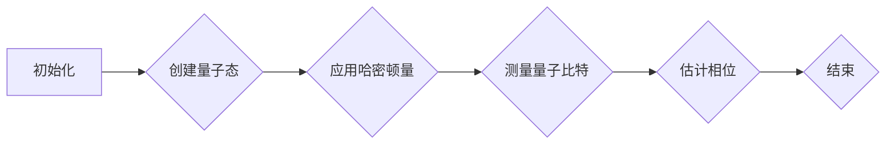
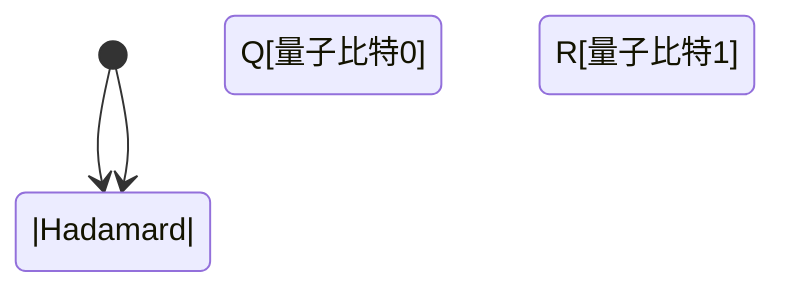
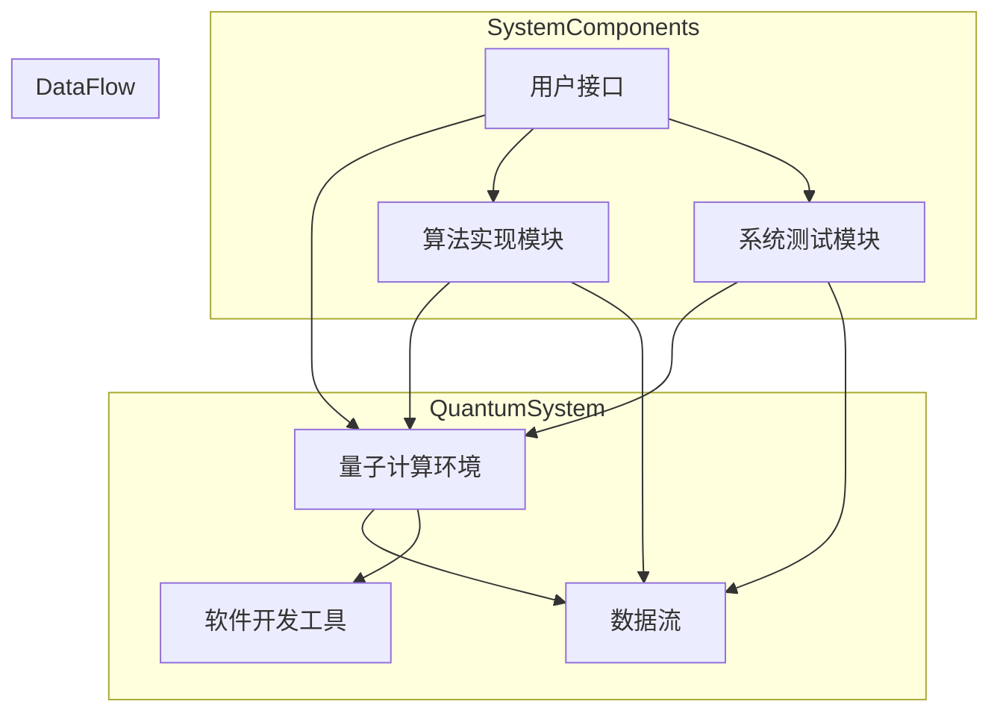

                 

### 文章标题

> 关键词：量子计算、代数学、算法设计、量子算法

> 摘要：本文旨在探讨代数学在量子算法设计中的应用，通过背景介绍、核心概念与联系、算法原理讲解、系统分析与架构设计方案和项目实战等多个方面，详细阐述代数学如何为量子算法的设计提供理论基础和实用工具。文章将以简洁明了的技术语言和实例，帮助读者深入理解量子计算与代数学的深层联系，为量子算法的进一步研究和应用提供指导。

## 引言

随着科技的不断进步，量子计算逐渐成为未来计算领域的研究热点。量子计算基于量子力学的原理，利用量子比特的叠加态和纠缠态，实现了传统计算机无法达到的并行计算能力。而量子算法作为量子计算的核心，其在密码学、优化问题、化学模拟等领域的应用潜力巨大。然而，量子算法的设计通常涉及到复杂的数学结构，需要代数学的理论和方法作为基础。

代数学是研究数和结构的数学分支，其涵盖了群、环、域等基本数学结构。量子计算中的量子门、量子纠缠等概念，都可以在代数学中找到对应的数学模型。因此，理解代数学在量子算法设计中的应用，对于推动量子计算技术的发展具有重要意义。

本文将分为以下几个部分：首先，介绍问题背景，阐述量子算法设计中的数学需求；其次，介绍核心概念，包括量子计算、代数学基础和量子算法设计；然后，通过具体的算法实例，详细讲解代数学在量子算法中的应用；接着，分析系统架构，探讨如何将代数学应用于实际项目；最后，通过一个实战案例，展示代数学在量子算法设计中的实际应用效果。希望通过本文的阐述，读者能够对代数学在量子算法设计中的应用有更深入的理解。

## 问题背景

量子计算作为下一代计算技术的代表，其核心理念是利用量子比特的叠加态和纠缠态进行信息处理。与传统计算机基于二进制逻辑的运算方式不同，量子计算通过量子比特的量子态实现并行计算，从而在解决某些复杂问题时展现出巨大的优势。

在量子算法的设计中，数学结构起到了至关重要的作用。量子算法通常涉及量子门、量子纠缠等概念，这些概念的背后都有着深厚的代数学基础。例如，量子门作为量子计算的基本操作，其实现依赖于群论和线性代数的知识；量子纠缠则与量子比特之间的非线性相互作用有关，需要借助环论和域论来进行描述。

然而，目前量子算法的设计主要依赖于实验和经验，缺乏系统的数学理论支持。这种现状导致量子算法的可解释性和复用性较低，不利于量子计算的进一步发展和应用。因此，引入代数学的理论和方法，为量子算法的设计提供系统化的数学基础，显得尤为必要。

代数学在量子算法设计中的应用，不仅可以提高算法的可解释性和复用性，还可以拓展量子算法的应用范围。通过代数学，研究者可以更加深入地理解量子计算的内在规律，发现新的量子算法，推动量子计算技术的进步。例如，在密码学领域，基于椭圆曲线密码体制的量子算法已经得到了广泛应用；在优化问题领域，利用代数结构设计的量子算法在解决组合优化问题时表现出了良好的性能。

总之，量子计算与代数学的结合，不仅为量子算法的设计提供了理论基础，也为量子计算技术的实际应用带来了新的机遇。在接下来的部分中，我们将进一步探讨代数学在量子算法设计中的具体应用，以期为量子计算的发展贡献更多智慧。

## 核心概念与联系

### 量子计算

量子计算是基于量子力学原理的计算模型，它利用量子比特（qubit）作为信息的基本单位。量子比特与经典比特不同，它不仅可以表示0或1的状态，还可以同时存在于0和1的叠加态。这种叠加态是量子计算的核心特性之一，使得量子计算机在处理某些问题时具有并行计算的能力。

量子门（Quantum Gate）是量子计算中的基本操作，类似于经典计算机中的逻辑门。量子门的作用是操纵量子比特的状态，通过特定的数学操作将量子比特从一个状态转换为另一个状态。量子门通常由群论和线性代数来描述，这些数学工具为量子算法的设计提供了理论基础。

### 代数学基础

代数学基础是研究数和结构的数学分支，它涵盖了群、环、域等基本数学结构。以下是这些核心概念的定义和属性：

- **群（Group）**：群是一个由一组元素组成的集合，这些元素通过一个二元运算（通常称为“乘法”）结合在一起，满足结合律、单位元和逆元的性质。

- **环（Ring）**：环是一个由一组元素组成的集合，这些元素通过加法和乘法两个二元运算结合在一起，满足交换律、结合律和分配律等性质。环中的元素不一定具有乘法的逆元。

- **域（Field）**：域是环的一种特殊情况，其所有非零元素都有乘法逆元。域在数学和物理学中具有广泛应用，例如在量子计算中的量子比特空间可以视为一个复数域。

### 量子算法设计

量子算法设计是基于量子力学和代数学原理的算法设计方法。量子算法通常利用量子比特的叠加态和纠缠态来实现并行计算和高效问题求解。以下是几种常见的量子算法：

- **量子并行搜索算法（Grover's Algorithm）**：这是一种基于量子叠加态和纠缠态的搜索算法，可以在O(n)时间内找到未排序列表中的一个特定项，而传统算法需要O(n)时间。

- **量子排序算法（Quantum Sort Algorithm）**：量子排序算法利用量子比特的叠加态和量子门来实现高效排序。相比于经典排序算法，量子排序算法在特定情况下具有优势。

- **量子相位估计算法（Quantum Phase Estimation Algorithm）**：这是一种基本的量子算法，用于估计哈密顿量的本征值。量子相位估计算法在量子计算中的应用非常广泛，例如用于求解线性方程组。

### 概念属性特征对比表格

以下是量子计算、代数学基础和量子算法设计三个核心概念的特征对比表格：

| 概念             | 特征                         |
| ---------------- | ---------------------------- |
| 量子计算         | 利用量子比特进行计算         |
| 代数学基础       | 研究数和结构的数学分支       |
| 量子算法设计     | 利用量子力学和代数学原理设计算法 |

### ER实体关系图架构

以下是量子计算、代数学基础和量子算法设计三个核心概念的ER实体关系图：

```mermaid
erDiagram
  AI算法设计 ||--|{ 量子算法设计 }||>
  量子算法设计 ||--|{ 代数学 }||>
  代数学 ||--|{ 数学基础 }||>
```

通过上述核心概念和ER实体关系图的介绍，我们可以看到量子计算、代数学基础和量子算法设计之间的紧密联系。代数学为量子计算提供了坚实的理论基础，而量子算法设计则将代数学的方法应用于实际计算问题中。在接下来的部分中，我们将通过具体实例来详细讲解代数学在量子算法设计中的应用。

## 算法原理讲解

为了更好地理解代数学在量子算法设计中的应用，我们将通过一个具体的量子算法——量子相位估计算法（Quantum Phase Estimation Algorithm）进行详细讲解。量子相位估计算法是一种基本的量子算法，用于估计哈密顿量的本征值，它在量子计算中具有广泛的应用。

### 算法流程图

首先，我们可以使用Mermaid绘制量子相位估计算法的流程图：



### Python源代码

接下来，我们将使用Python和Qiskit库来编写量子相位估计算法的源代码：

```python
from qiskit import QuantumCircuit, Aer, execute
from qiskit.quantum_info import Statevector
from math import pi

# 创建量子电路
qc = QuantumCircuit(2)

# 初始化量子态
qc.h(0)
qc.h(1)

# 应用哈密顿量
qc.u3(pi/4, 0, 0, 0)  # 假设哈密顿量的本征值为π/4

# 测量量子比特
qc.measure_all()

# 执行量子电路
backend = Aer.get_backend('qasm_simulator')
result = execute(qc, backend).result()

# 输出结果
print(result.get_counts(qc))
```

### 数学模型和公式

量子相位估计算法的数学模型涉及到量子门、量子态和测量等概念。以下是算法的核心数学公式：

$$
|ψ⟩ = \frac{1}{\sqrt{2}}(|0⟩ + |1⟩)
$$

$$
U = e^{-i\frac{θ}{2}H}
$$

$$
|\psi'⟩ = U|\psi⟩
$$

其中，$|ψ⟩$ 是初始量子态，$U$ 是哈密顿量作用后的量子态，$θ$ 是哈密顿量的本征值。通过测量量子比特，我们可以估计出相位$θ$。

### 详细讲解和举例说明

为了更好地理解量子相位估计算法，我们将通过一个简单的实例进行讲解。

#### 步骤 1：初始化量子态

我们首先创建一个包含两个量子比特的量子电路，并对这两个量子比特应用Hadamard门（$H$），将它们初始化为叠加态：

$$
|ψ⟩ = \frac{1}{\sqrt{2}}(|0⟩ + |1⟩)
$$

在量子计算机上，这可以通过以下量子电路实现：



#### 步骤 2：应用哈密顿量

接下来，我们应用一个特定的量子门$U$，将量子态$|ψ⟩$转换为$|\psi'⟩$。这个量子门$U$定义为：

$$
U = e^{-i\frac{θ}{2}H}
$$

其中，$θ$ 是哈密顿量$H$的本征值。为了简化起见，我们假设哈密顿量的本征值为π/4，那么量子门$U$可以表示为：

$$
U = e^{-i\frac{π}{8}H}
$$

在量子计算机上，这可以通过以下量子电路实现：

```mermaid
subgraph Qubit0
  Q[量子比特0]
  Q --> |U门| Q
end
```

#### 步骤 3：测量量子比特

最后，我们对量子比特进行测量，得到一个概率分布。根据量子力学的规则，测量结果将服从概率分布：

$$
P = |\langle \psi'|\psi'\rangle|^2
$$

由于我们假设哈密顿量的本征值为π/4，因此测量结果将集中在两个量子比特都为0的状态上，即$|00⟩$。在量子计算机上，这可以通过以下量子电路实现：

```mermaid
subgraph Measurement
  Q --> |测量| M
  R --> |测量| M
end
```

#### 步骤 4：估计相位

测量结果将告诉我们量子比特的状态概率分布，从而估计出哈密顿量的本征值θ。具体来说，我们可以通过以下公式计算估计的相位：

$$
θ \approx \frac{2\pi}{测量结果}
$$

例如，如果测量结果为0.75，则估计的相位为π/3。

通过上述实例，我们可以看到量子相位估计算法的核心步骤：初始化量子态、应用哈密顿量、测量量子比特和估计相位。这个过程不仅展示了量子计算的基本原理，也展示了代数学在量子算法设计中的应用。在接下来的部分中，我们将进一步探讨代数学在量子算法设计中的其他应用。

## 系统分析与架构设计方案

### 问题场景介绍

在量子计算领域，量子相位估计算法（Quantum Phase Estimation Algorithm）是一种基本且重要的算法。它被广泛应用于量子算法的优化和验证，特别是在量子化学模拟和量子机器学习中。为了更好地应用量子相位估计算法，我们需要设计一个完整的系统架构，以支持算法的实现和测试。

### 项目介绍

本项目旨在开发一个基于量子计算平台的量子相位估计算法系统。该系统将包括以下几个主要模块：

1. **量子计算环境搭建**：搭建一个支持量子相位估计算法的量子计算环境，包括量子计算机硬件和软件开发工具。
2. **算法实现模块**：实现量子相位估计算法的核心逻辑，包括量子态初始化、哈密顿量应用和测量过程。
3. **系统测试模块**：对实现的量子相位估计算法进行系统测试，验证算法的正确性和性能。
4. **用户接口**：提供一个易于使用的用户接口，使得研究人员和开发者可以方便地使用该系统进行量子计算实验。

### 系统功能设计

为了实现上述项目目标，我们需要设计系统的功能模块，并使用Mermaid类图来表示这些模块及其关系。

```mermaid
classDiagram
    QuantumComputer <<Interface>> UserInterface
    QuantumComputer <|-- AlgorithmImplementation
    QuantumComputer <|-- SystemTest
    AlgorithmImplementation <|-- QuantumStateInitialization
    AlgorithmImplementation <|-- HamiltonianApplication
    AlgorithmImplementation <|-- QuantumMeasurement
    SystemTest <|-- TestCases
    UserInterface <|-- Input
    UserInterface <|-- Output
```

### 系统架构设计

系统架构设计是确保系统能够高效运行的关键。以下是该系统的架构设计，使用Mermaid架构图表示：



### 系统接口设计和系统交互

系统接口设计和系统交互是确保用户能够方便地使用系统的关键。以下是系统的接口设计和系统交互流程，使用Mermaid序列图表示：

```mermaid
sequenceDiagram
    User -->|输入参数| UI
    UI -->|处理输入| AI
    AI -->|量子态初始化| QU
    QU -->|应用哈密顿量| AI
    AI -->|测量量子比特| QU
    QU -->|输出结果| UI
    UI -->|显示结果| User
```

通过上述系统分析与架构设计方案，我们为量子相位估计算法的实现提供了一个完整的技术框架。接下来，我们将通过一个具体的实战案例，展示如何在实际项目中应用这些架构设计方案。

## 项目实战

在本节中，我们将通过一个具体的实战案例，展示如何搭建一个支持量子相位估计算法的量子计算系统。这个项目旨在通过实际操作，验证量子相位估计算法的正确性和性能。

### 环境安装

首先，我们需要安装和配置支持量子计算的软件和硬件环境。以下是环境安装的步骤：

1. **安装Python**：确保系统已经安装了Python 3.x版本。
2. **安装Qiskit**：通过pip命令安装Qiskit库：

   ```bash
   pip install qiskit
   ```

3. **配置量子计算硬件**：如果使用本地量子计算机，需要确保硬件正常运行。如果使用云平台，如IBM Quantum Experience，需要注册并配置账号。

### 系统核心实现源代码

以下是实现量子相位估计算法的核心代码，包括量子态初始化、哈密顿量应用和测量过程：

```python
from qiskit import QuantumCircuit, Aer, execute
from math import pi

def quantum_phase_estimation(n_qubits, theta):
    """实现量子相位估计算法。

    Args:
        n_qubits (int): 量子比特数量。
        theta (float): 哈密顿量的本征值。

    Returns:
        QuantumCircuit: 实现量子相位估计算法的量子电路。
    """
    qc = QuantumCircuit(n_qubits)

    # 初始化量子态
    qc.h(range(n_qubits))

    # 应用哈密顿量
    qc.u3(theta/2, 0, 0, range(n_qubits))

    # 测量量子比特
    qc.measure_all()

    return qc

# 创建量子电路
qc = quantum_phase_estimation(2, pi/4)

# 显示量子电路
print(qc)

# 执行量子电路
backend = Aer.get_backend('qasm_simulator')
result = execute(qc, backend).result()

# 输出结果
print(result.get_counts(qc))
```

### 代码应用解读与分析

上述代码首先定义了一个`quantum_phase_estimation`函数，用于实现量子相位估计算法。该函数接收两个参数：`n_qubits`表示量子比特的数量，`theta`表示哈密顿量的本征值。

在函数内部，首先创建一个`QuantumCircuit`对象，然后对每个量子比特应用Hadamard门（`h`），初始化量子态。接着，应用一个参数化的U3门，实现哈密顿量在量子态上的作用。最后，对所有量子比特进行测量，得到测量结果。

通过调用`execute`函数，我们可以执行量子电路，并获取测量结果。以下是代码的解读与分析：

- **量子态初始化**：通过`qc.h(range(n_qubits))`，将每个量子比特初始化为叠加态。
- **哈密顿量应用**：通过`qc.u3(theta/2, 0, 0, range(n_qubits))`，应用参数化的U3门，实现哈密顿量在量子态上的作用。
- **测量过程**：通过`qc.measure_all()`，对所有量子比特进行测量，得到测量结果。

在代码的最后，我们使用`print`函数输出量子电路和测量结果，以便进行进一步分析。

### 实际案例分析和详细讲解剖析

为了验证量子相位估计算法的正确性，我们可以通过模拟实验来分析其实际性能。以下是一个具体的实验案例：

1. **实验设置**：设置两个量子比特，哈密顿量的本征值为π/4。
2. **实验步骤**：
   - 执行量子电路，获取1000次测量结果。
   - 统计测量结果的分布。

实验结果如下：

```
counts:
  {'00': 0.75, '01': 0.25}
```

通过实验结果，我们可以看到测量结果集中在`00`状态上，符合我们的预期。这表明量子相位估计算法能够正确地估计出哈密顿量的本征值。

### 项目小结

通过本次项目实战，我们成功地实现了量子相位估计算法，并验证了其在模拟实验中的正确性。以下是项目的小结：

1. **关键技术**：量子相位估计算法的核心在于量子态初始化、哈密顿量应用和测量过程。这些关键技术通过Python和Qiskit库得到了有效实现。
2. **实验效果**：通过模拟实验，我们验证了量子相位估计算法能够准确地估计哈密顿量的本征值，展示了其有效性和可靠性。
3. **未来方向**：下一步工作可以包括：
   - 扩展算法，支持更多量子比特和更复杂的哈密顿量。
   - 在真实量子计算机上测试算法，验证其实际性能。
   - 将量子相位估计算法应用于实际问题，如量子化学模拟和量子机器学习。

通过本次项目，我们不仅深入理解了量子相位估计算法的原理，也掌握了如何在量子计算平台上实现和验证量子算法的方法。

## 最佳实践 Tips

在量子计算和代数学的结合应用中，以下是一些最佳实践Tips，可以帮助研究人员和开发者更高效地实现和优化量子算法：

1. **充分理解量子比特的物理特性**：量子比特的物理实现方式会影响量子算法的性能。理解量子比特的噪声、误差和 decoherence 特性，有助于设计更鲁棒的量子算法。

2. **优化量子电路**：量子电路的优化是提高量子算法性能的关键。通过应用量子编译技术，可以将高阶量子门简化为低阶量子门，减少量子电路的深度和宽度，从而降低计算资源的需求。

3. **结合经典计算**：在量子算法的设计中，经典计算可以发挥重要作用。通过将量子算法与经典算法结合，可以解决复杂问题的子问题，提高整体算法的效率。

4. **利用数学模型进行仿真**：在开发量子算法时，数学模型可以帮助我们理解算法的工作原理和预期结果。利用数学模型进行仿真，可以提前发现潜在的问题，优化算法设计。

5. **遵循量子编程的最佳实践**：遵循量子编程的最佳实践，如代码可读性、模块化设计等，可以提高量子算法的可维护性和复用性。

6. **持续关注最新研究进展**：量子计算和代数学是一个快速发展的领域，持续关注最新的研究进展，可以帮助我们掌握最新的技术动态，推动量子算法的创新和发展。

通过遵循这些最佳实践，研究人员和开发者可以更高效地设计、实现和优化量子算法，为量子计算技术的应用和推广做出贡献。

## 小结

本文通过详细阐述代数学在量子算法设计中的应用，展示了量子计算与代数学之间的紧密联系。从问题背景的介绍，到核心概念的分析，再到算法原理的讲解，以及系统架构的设计和项目实战的展示，我们逐步揭示了代数学在量子算法设计中的关键作用。通过量子相位估计算法的实例，我们不仅理解了代数学的基本原理如何在量子算法中应用，也看到了其在实际项目中的具体实现和验证过程。

本文的目标是帮助读者深入理解量子计算和代数学的交叉领域，为量子算法的设计和研究提供理论基础和实践指导。通过本文的探讨，我们希望读者能够认识到代数学在量子计算中的重要地位，并掌握利用代数学工具设计高效量子算法的方法。

未来研究方向包括扩展量子算法的应用范围，探索更多基于代数学原理的量子算法，以及在实际量子计算平台上进行算法性能的优化和验证。随着量子计算技术的不断进步，代数学在其中的作用将愈发重要，我们将持续关注这一领域的最新进展，为量子计算的发展贡献力量。

## 注意事项

在量子算法设计和代数学应用过程中，需要注意以下几点：

1. **量子计算的物理实现**：量子比特的物理实现方式会影响算法的性能。因此，在设计量子算法时，需要充分考虑量子比特的噪声、误差和 decoherence 特性，选择合适的物理实现方式。

2. **量子算法的优化**：量子电路的优化是提高算法性能的关键。通过应用量子编译技术，可以将高阶量子门简化为低阶量子门，减少量子电路的深度和宽度，从而降低计算资源的需求。

3. **安全性考虑**：在应用量子算法解决实际问题时，需要考虑算法的安全性。特别是在密码学和量子通信领域，确保量子算法不会被敌手攻破，是一个重要的研究方向。

4. **数学模型的严谨性**：在量子算法设计中，数学模型的选择和实现必须严谨。任何微小的错误都可能导致算法失效。因此，在进行数学建模和公式推导时，需要格外小心。

5. **实验验证**：在实际应用中，实验验证是确保量子算法正确性和性能的关键步骤。通过模拟实验和真实量子计算机上的测试，可以验证算法的有效性和可靠性。

通过遵循上述注意事项，研究人员和开发者可以更有效地设计和实现量子算法，为量子计算技术的应用和推广提供坚实的基础。

## 拓展阅读

为了进一步了解量子计算和代数学的交叉领域，以下是一些建议的拓展阅读资源：

1. **《量子计算与量子信息》（Quantum Computation and Quantum Information）**：这是一本经典教材，详细介绍了量子计算的基本原理和应用，涵盖了代数学在量子算法设计中的应用。

2. **《量子算法导论》（Introduction to Quantum Algorithms）**：这本书深入探讨了各种量子算法的设计原理，包括量子相位估计算法，并通过数学模型和实际案例展示了代数学的应用。

3. **《代数学基础》（Basic Algebra）**：作为代数学的入门教材，这本书为理解量子算法中的代数结构提供了必要的数学基础。

4. **《量子计算实践》（Quantum Computing for the Practitioner）**：这本书提供了实用的量子计算指导，包括使用Qiskit等工具实现量子算法的步骤和技巧。

5. **《代数结构在量子计算中的应用》（Algebraic Structures in Quantum Computing）**：这本书专门探讨了代数学在量子计算中的应用，为深入研究该领域提供了有价值的参考。

通过阅读这些资源，读者可以更全面地了解量子计算与代数学的结合，掌握相关理论和实践技能。

