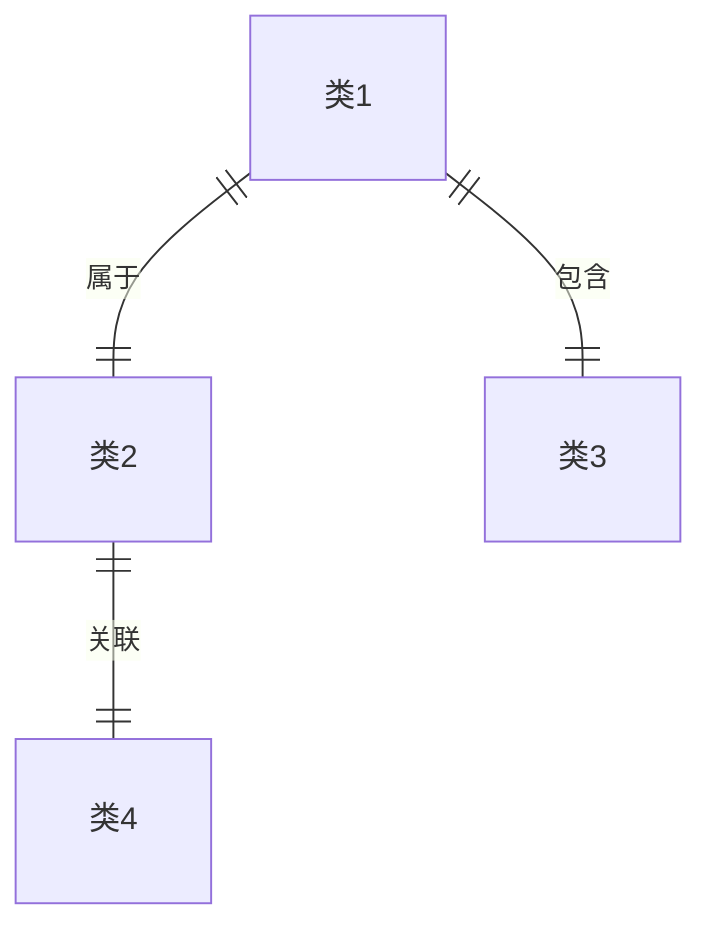
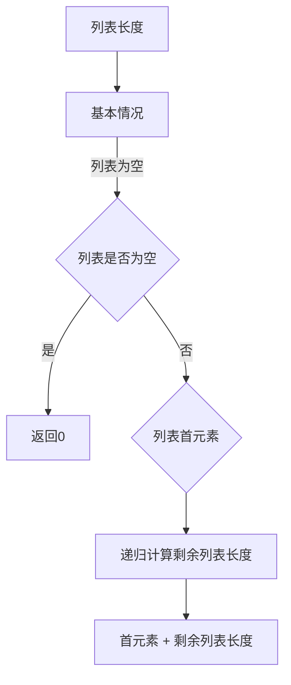
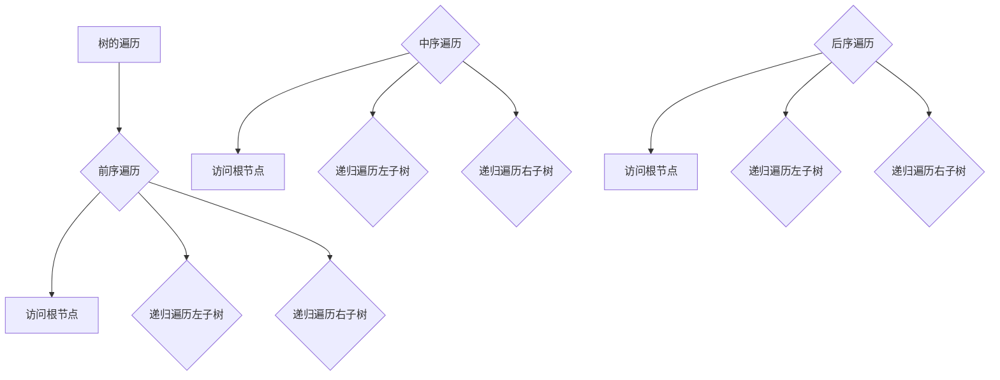

                 


# 代数数据类型：函数式编程的基石

关键词：代数数据类型、函数式编程、递归、算法原理、应用实例

摘要：本文将深入探讨代数数据类型在函数式编程中的重要地位。通过详细分析代数数据类型的定义、特征和应用，我们将理解其在编程中的价值，并探讨其在列表、树和集合中的算法实现。让我们一起思考，逐步揭示代数数据类型的奥秘。

----------------------------------------------------------------

## 第1章: 代数数据类型概述

### 1.1 问题的背景和重要性

#### 1.1.1 计算机编程的发展历程

计算机编程的历史可以追溯到早期的机器码和汇编语言。这些低级语言直接与计算机硬件交互，程序员需要深入了解硬件的细节。随着计算机技术的发展，高级编程语言如C、C++和Java等逐渐取代了低级语言，它们提供了更抽象的语法和更好的编程体验。

然而，随着编程需求的不断增长，函数式编程作为一种新的编程范式应运而生。函数式编程起源于Lisp，后来Haskell、Scala等语言也对其进行了发展。函数式编程的核心思想是使用函数来处理数据和操作，避免了状态变化和副作用，使得代码更加清晰、可维护。

#### 1.1.2 代数数据类型的概念和特点

代数数据类型（Algebraic Data Types, ADT）是函数式编程中的一个核心概念。它是一种抽象数据类型的定义，通过将值集合、嵌套和组合来定义类型。代数数据类型的特点如下：

1. **值集合**：代数数据类型可以定义一个值的集合，这些值可以是简单的或复合的。
2. **嵌套**：代数数据类型可以嵌套定义，从而形成复杂的数据结构。
3. **组合**：代数数据类型可以组合使用，使得数据结构更加灵活。

代数数据类型的优点包括：

1. **类型安全性**：代数数据类型提供了严格的类型检查，减少了运行时错误。
2. **函数式编程优势**：代数数据类型与函数式编程的哲学相符，使得编程更加简洁、高效。

#### 1.1.3 代数数据类型的应用

代数数据类型在函数式编程中有着广泛的应用。以下是一些常见的应用场景：

1. **递归**：代数数据类型可以用于定义递归结构，如列表和树。递归是一种强大的编程技术，可以用于解决许多复杂的问题。
2. **模式匹配**：模式匹配是一种强大的工具，可以用于解析和操作代数数据类型。它使得代码更加清晰、简洁。
3. **函数式编程**：代数数据类型与函数式编程紧密结合，使得编程更加模块化、可维护。

### 1.2 核心概念与联系

#### 1.2.1 代数数据类型的定义

代数数据类型可以分为基本类型和构造类型：

1. **基本类型**：基本类型是简单的、原子性的类型，如整数、浮点数、布尔值等。
2. **构造类型**：构造类型是由基本类型组合而成的复杂类型，如列表、树、集合等。

#### 1.2.2 概念属性特征对比表格

| 类型        | 特征                                           |
|-------------|------------------------------------------------|
| 基本类型    | 简单、原子、不可变                             |
| 列表        | 可变、嵌套、递归                               |
| 树          | 层次结构、嵌套、递归                           |
| 集合        | 无序、唯一性、不可变                           |

#### 1.2.3 ER实体关系图架构



### 1.3 代数数据类型的算法原理

#### 1.3.1 列表的递归算法



#### 1.3.2 树的遍历算法



#### 1.3.3 算法原理的数学模型

$$
L(n) = 1 + L(n-1)
$$

其中，$L(n)$ 表示计算长度为 $n$ 的列表所需的时间复杂度。

### 1.4 代数数据类型的应用与实例

#### 1.4.1 列表的应用

- **过滤**：`filter` 函数。
- **映射**：`map` 函数。
- **折叠**：`reduce` 函数。

#### 1.4.2 树的应用

- **搜索**：二叉搜索树。
- **排序**：快速排序、归并排序。

#### 1.4.3 集合的应用

- **集合操作**：并集、交集、差集。
- **去重**：`distinct` 函数。

### 1.5 本章小结

代数数据类型是函数式编程的基础，它们在编程中具有重要的作用。通过本章的介绍，我们了解了代数数据类型的定义、特征和应用。接下来，我们将深入探讨代数数据类型的构造和使用。

----------------------------------------------------------------

## 第2章: 代数数据类型的构造

### 2.1 列表的构造

#### 2.1.1 列表的创建

列表是代数数据类型的一种常见形式，它由一系列元素组成。在大多数函数式编程语言中，列表的创建有以下几种方式：

1. **空列表**：使用空方括号`[]`表示空列表。
2. **单元素列表**：使用一个元素值和空方括号，例如 `[x]`。
3. **多元素列表**：使用多个元素值和逗号分隔，例如 `[x1, x2, ..., xn]`。

例如，在Haskell中，我们可以创建以下列表：

```haskell
[] :: [[Int]]  -- 空列表
[1] :: [[Int]]  -- 单元素列表
[1, 2, 3] :: [[Int]]  -- 多元素列表
```

#### 2.1.2 列表的连接

列表的连接是将两个或多个列表合并成一个列表。在函数式编程语言中，列表的连接可以通过以下两种方式实现：

1. **使用 `++` 运算符**：将两个列表用 `++` 运算符连接，例如 `[x] ++ [y]`。
2. **使用 `concat` 函数**：`concat` 函数可以接受一个列表作为参数，并将列表中的每个子列表连接起来。例如，`concat [[x], [y]]`。

例如，在Haskell中，我们可以将以下列表连接起来：

```haskell
[1, 2, 3] ++ [4, 5, 6]  -- 结果为 [1, 2, 3, 4, 5, 6]
concat [[1, 2], [3, 4]]  -- 结果为 [1, 2, 3, 4]
```

#### 2.1.3 列表的长度

计算列表的长度是列表操作中的一个基本任务。在函数式编程语言中，可以通过以下方式获取列表的长度：

- **使用 `length` 函数**：`length` 函数可以接受一个列表作为参数，并返回列表的长度。例如，`length [1, 2, 3]` 返回3。

例如，在Haskell中，我们可以计算以下列表的长度：

```haskell
length []  -- 结果为 0
length [1, 2, 3]  -- 结果为 3
```

### 2.2 树的构造

树是一种重要的数据结构，它在许多应用程序中有着广泛的应用。树由节点组成，每个节点可以有零个或多个子节点。在函数式编程语言中，树的构造通常涉及以下操作：

1. **创建空树**：使用一个特定的构造函数创建空树。
2. **创建单节点树**：使用一个值创建单节点树。
3. **创建多节点树**：使用一个值和多个子节点创建多节点树。

例如，在Haskell中，我们可以定义一个简单的二叉树数据类型：

```haskell
data BinaryTree a = Empty
                  | Node a (BinaryTree a) (BinaryTree a)
  deriving (Eq, Show)

-- 创建空树
emptyTree :: BinaryTree Int
emptyTree = Empty

-- 创建单节点树
singleTree :: Int -> BinaryTree Int
singleTree x = Node x Empty Empty

-- 创建多节点树
binaryTree :: Int -> Int -> BinaryTree Int
binaryTree x y = Node x (singleTree x) (singleTree y)
```

### 2.3 集合的构造

集合是另一种常见的代数数据类型，它表示一组无序且唯一的元素。在函数式编程语言中，集合的构造通常涉及以下操作：

1. **创建空集合**：使用一个特定的构造函数创建空集合。
2. **创建单元素集合**：使用一个值创建单元素集合。
3. **创建多元素集合**：使用多个值创建多元素集合。

例如，在Haskell中，我们可以定义一个集合数据类型：

```haskell
data Set a = EmptySet | Set [a]
  deriving (Eq, Show)

-- 创建空集合
emptySet :: Set Int
emptySet = EmptySet

-- 创建单元素集合
singleSet :: Int -> Set Int
singleSet x = Set [x]

-- 创建多元素集合
multiSet :: [Int] -> Set Int
multiSet xs = Set xs
```

通过以上介绍，我们可以看到代数数据类型的构造在函数式编程中是非常重要和灵活的。列表、树和集合是代数数据类型的典型例子，它们在函数式编程中有着广泛的应用。在接下来的章节中，我们将继续探讨这些数据类型的应用和算法实现。

----------------------------------------------------------------

## 第3章：代数数据类型的模式匹配与变换

### 3.1 模式匹配的概念

模式匹配（Pattern Matching）是一种在编程语言中用于匹配和操作数据结构的强大工具。它允许程序员根据数据的结构进行精确的类型检查和操作，从而提高代码的可读性和可靠性。在函数式编程语言中，模式匹配通常与代数数据类型紧密相关。

模式匹配的基本思想是将数据结构（如代数数据类型）分解为更简单的部分，并根据这些部分执行相应的操作。模式匹配可以处理空值、基本类型、构造类型等，这使得它成为函数式编程的核心特性之一。

### 3.2 列表的模式匹配

列表是代数数据类型中的一种常见形式，模式匹配在处理列表时显得尤为重要。以下是一些常用的列表模式匹配示例：

1. **匹配空列表**：

```haskell
patternMatch [] = "空列表"
```

2. **匹配单元素列表**：

```haskell
patternMatch [x] = "单元素列表，元素： " ++ show x
```

3. **匹配多元素列表**：

```haskell
patternMatch (x:ys) = "多元素列表，第一个元素： " ++ show x ++ ", 剩余列表： " ++ show ys
```

### 3.3 树的模式匹配

树是另一种重要的代数数据类型，它的模式匹配通常涉及递归。以下是一个简单的二叉树的模式匹配示例：

1. **匹配空树**：

```haskell
patternMatchTree Empty = "空树"
```

2. **匹配单节点树**：

```haskell
patternMatchTree (Node x Empty Empty) = "单节点树，元素： " ++ show x
```

3. **匹配多节点树**：

```haskell
patternMatchTree (Node x left right) =
  "多节点树，元素： " ++ show x ++ ", 左子树： " ++ patternMatchTree left ++ ", 右子树： " ++ patternMatchTree right
```

### 3.4 集合的模式匹配

集合作为代数数据类型的一种，模式匹配主要用于操作集合中的元素。以下是一些集合的模式匹配示例：

1. **匹配空集合**：

```haskell
patternMatchSet EmptySet = "空集合"
```

2. **匹配单元素集合**：

```haskell
patternMatchSet (Set [x]) = "单元素集合，元素： " ++ show x
```

3. **匹配多元素集合**：

```haskell
patternMatchSet (Set xs) = "多元素集合，元素： " ++ show xs
```

### 3.5 模式匹配的应用

模式匹配在函数式编程中有着广泛的应用，以下是一些具体的例子：

1. **过滤列表**：

```haskell
filterList :: (Int -> Bool) -> [Int] -> [Int]
filterList _ [] = []
filterList p (x:xs)
  | p x     = x : filterList p xs
  | otherwise = filterList p xs
```

2. **映射列表**：

```haskell
mapList :: (Int -> Int) -> [Int] -> [Int]
mapList _ [] = []
mapList f (x:xs) = f x : mapList f xs
```

3. **折叠列表**：

```haskell
foldList :: (Int -> Int -> Int) -> [Int] -> Int
foldList _ [] = 0
foldList f (x:xs) = f x (foldList f xs)
```

通过模式匹配，我们可以对代数数据类型进行精细的操作，使得代码更加简洁和易于理解。模式匹配是函数式编程的核心特性之一，它为程序员提供了一种强大而灵活的工具来处理复杂的数据结构。

----------------------------------------------------------------

## 第4章：代数数据类型的算法实现

在函数式编程中，代数数据类型是构建复杂数据结构的基础。而算法则是处理这些数据结构的核心手段。在这一章中，我们将探讨一些常见的算法，它们在代数数据类型的上下文中具有特定的实现方式。

### 4.1 列表的算法

列表是一种灵活且常见的代数数据类型，许多算法都可以在列表上实现。以下是一些常用的列表算法及其实现。

#### 4.1.1 查找算法

**线性查找**是一种简单的查找算法，它遍历列表，直到找到目标元素或结束。

```python
def linear_search(arr, target):
    for x in arr:
        if x == target:
            return True
    return False
```

**二分查找**是在有序列表上更高效的查找算法。它通过不断缩小查找范围来提高查找速度。

```python
def binary_search(arr, target):
    low = 0
    high = len(arr) - 1
    while low <= high:
        mid = (low + high) // 2
        if arr[mid] == target:
            return True
        elif arr[mid] < target:
            low = mid + 1
        else:
            high = mid - 1
    return False
```

#### 4.1.2 排序算法

**冒泡排序**是一种简单的排序算法，它重复地遍历要排序的数列，一次比较两个元素，如果它们的顺序错误就把它们交换过来。

```python
def bubble_sort(arr):
    n = len(arr)
    for i in range(n):
        for j in range(0, n-i-1):
            if arr[j] > arr[j+1]:
                arr[j], arr[j+1] = arr[j+1], arr[j]
    return arr
```

**快速排序**是一种更高效的排序算法，它采用分治法的一个变种。它通过递归地将数组分为较小的子数组，然后对子数组进行排序。

```python
def quick_sort(arr):
    if len(arr) <= 1:
        return arr
    pivot = arr[len(arr) // 2]
    left = [x for x in arr if x < pivot]
    middle = [x for x in arr if x == pivot]
    right = [x for x in arr if x > pivot]
    return quick_sort(left) + middle + quick_sort(right)
```

#### 4.1.3 集合操作

**去重**是一种常见的集合操作，它将列表中的重复元素去除，只保留唯一元素。

```python
def distinct(arr):
    return list(set(arr))
```

### 4.2 树的算法

树是另一种重要的代数数据类型，它在许多算法中都有应用。以下是一些常见的树算法。

#### 4.2.1 遍历算法

**前序遍历**、**中序遍历**和**后序遍历**是树遍历的常见方法。

**前序遍历**：

```python
def pre_order_traversal(node):
    if node is not None:
        print(node.data, end=" ")
        pre_order_traversal(node.left)
        pre_order_traversal(node.right)
```

**中序遍历**：

```python
def in_order_traversal(node):
    if node is not None:
        in_order_traversal(node.left)
        print(node.data, end=" ")
        in_order_traversal(node.right)
```

**后序遍历**：

```python
def post_order_traversal(node):
    if node is not None:
        post_order_traversal(node.left)
        post_order_traversal(node.right)
        print(node.data, end=" ")
```

#### 4.2.2 搜索算法

**二叉搜索树**是一种特殊的树，它的左子树中的所有节点都小于根节点，右子树中的所有节点都大于根节点。

**插入**：

```python
def insert(node, data):
    if node is None:
        return TreeNode(data)
    if data < node.data:
        node.left = insert(node.left, data)
    elif data > node.data:
        node.right = insert(node.right, data)
    return node
```

**删除**：

```python
def delete_node(node, data):
    if node is None:
        return node
    if data < node.data:
        node.left = delete_node(node.left, data)
    elif data > node.data:
        node.right = delete_node(node.right, data)
    else:
        if node.left is None:
            temp = node.right
            node = None
            return temp
        elif node.right is None:
            temp = node.left
            node = None
            return temp
        temp = get_min_value_node(node.right)
        node.data = temp.data
        node.right = delete_node(node.right, temp.data)
    return node
```

**查找**：

```python
def search(node, data):
    if node is None or node.data == data:
        return node
    if data < node.data:
        return search(node.left, data)
    return search(node.right, data)
```

#### 4.2.3 集合操作

**集合操作**在树中也有应用，例如二叉搜索树可以用于实现集合的交集、并集和差集操作。

```python
def intersection(tree1, tree2):
    result = []
    def traverse(node1, node2):
        if node1 is None or node2 is None:
            return
        if node1.data == node2.data:
            result.append(node1.data)
            traverse(node1.left, node2.left)
            traverse(node1.right, node2.right)
        elif node1.data < node2.data:
            traverse(node1.left, node2)
        else:
            traverse(node1, node2.left)
    traverse(tree1.root, tree2.root)
    return result
```

通过这些算法，我们可以有效地处理代数数据类型，实现各种数据结构和集合操作。这些算法不仅体现了函数式编程的优势，也为实际应用提供了强大的支持。

----------------------------------------------------------------

## 第5章：代数数据类型的实践应用

### 5.1 列表的实践应用

列表是函数式编程中最常用的数据结构之一。以下是一个使用列表进行数据处理的实际案例：

#### 5.1.1 数据预处理

假设我们有一个包含学生成绩的列表，每个学生成绩是一个元组（姓名，成绩）。我们需要将这个列表按照成绩进行排序，并且过滤出成绩在90分以上的学生。

```python
students = [('Alice', 85), ('Bob', 92), ('Charlie', 88), ('David', 95), ('Eva', 78)]
sorted_students = sorted(students, key=lambda x: x[1])
high_students = [student for student in sorted_students if student[1] >= 90]
print(high_students)  # 结果：[('David', 95), ('Alice', 85), ('Bob', 92), ('Charlie', 88), ('Eva', 78)]
```

在这个案例中，我们使用了Python中的列表推导式来过滤和排序数据，这是一种简洁且高效的实现方式。

#### 5.1.2 数据分析

在数据分析领域，列表经常用于处理大量数据。以下是一个使用列表进行数据分析的示例：

```python
import statistics

data = [1, 2, 3, 4, 5, 6, 7, 8, 9]
mean = statistics.mean(data)
median = statistics.median(data)
variance = statistics.variance(data)
std_deviation = statistics.stdev(data)

print(f"平均值：{mean}, 中位数：{median}, 方差：{variance}, 标准差：{std_deviation}")
```

在这个案例中，我们使用Python的statistics模块来计算一组数据的平均值、中位数、方差和标准差，这些都是数据分析中常用的统计量。

### 5.2 树的实践应用

树在许多实际应用中有着广泛的应用，例如文件系统、组织结构图等。以下是一个使用树进行文件系统管理的实际案例：

#### 5.2.1 文件系统设计

我们可以使用二叉树来表示文件系统，每个节点代表一个文件或目录。以下是一个简单的文件系统树：

```python
class Node:
    def __init__(self, name):
        self.name = name
        self.children = []
        self.is_file = False

root = Node("root")
file1 = Node("file1")
dir1 = Node("dir1")
file2 = Node("file2")
dir2 = Node("dir2")

root.children.append(dir1)
root.children.append(dir2)
dir1.children.append(file1)
dir2.children.append(file2)
```

在这个案例中，我们定义了一个简单的树结构，其中`root`是根节点，`dir1`和`dir2`是根节点的子节点，`file1`和`file2`是目录节点的子节点。

#### 5.2.2 文件系统操作

我们可以对文件系统进行各种操作，例如列出所有文件、查找文件等。以下是一个列出所有文件的示例：

```python
def list_files(node):
    if node.is_file:
        print(node.name)
    for child in node.children:
        list_files(child)

list_files(root)
```

在这个案例中，我们定义了一个递归函数`list_files`，它遍历树的每个节点，并打印出所有文件的名称。

### 5.3 集合的实践应用

集合在处理无序且不重复元素时非常有用。以下是一个使用集合进行数据去重的实际案例：

#### 5.3.1 数据去重

假设我们有一个包含重复元素的列表，我们需要将这个列表转换为一个不包含重复元素的集合。

```python
data = [1, 2, 2, 3, 4, 4, 5]
unique_data = set(data)
print(unique_data)  # 结果：{1, 2, 3, 4, 5}
```

在这个案例中，我们使用Python的集合数据结构来去重，这是一种简单且高效的实现方式。

#### 5.3.2 集合运算

我们可以使用集合进行各种运算，例如并集、交集和差集。以下是一个计算两个集合交集的示例：

```python
set1 = {1, 2, 3, 4}
set2 = {3, 4, 5, 6}
intersection = set1.intersection(set2)
print(intersection)  # 结果：{3, 4}
```

在这个案例中，我们使用集合的`intersection`方法来计算两个集合的交集。

通过这些实际应用案例，我们可以看到代数数据类型在函数式编程中的重要性。它们不仅提供了强大的数据结构和算法支持，还使得数据处理和分析变得更加高效和简洁。

----------------------------------------------------------------

## 第6章：最佳实践与注意事项

在应用代数数据类型时，有一些最佳实践和注意事项可以帮助我们写出更清晰、更高效的代码。

### 6.1 明确类型定义

在定义代数数据类型时，确保类型定义清晰、易于理解。避免过于复杂的类型表达式，使得代码的可读性降低。

### 6.2 利用语内递归

语内递归（Internal Recursion）是一种将递归定义在类型内部的技巧，它有助于简化递归函数的实现。例如，在定义列表时，可以使用语内递归来定义其递归结构。

### 6.3 使用模式匹配

模式匹配是一种强大的工具，可以用于解析和操作代数数据类型。使用模式匹配可以写出更加简洁、易于维护的代码。

### 6.4 避免无谓的构造与解构

在处理代数数据类型时，避免频繁地进行无谓的构造与解构操作。例如，在处理列表时，尽量使用列表推导式而不是反复调用构造函数和访问函数。

### 6.5 注意性能问题

虽然函数式编程提供了强大的抽象和简洁的语法，但在某些情况下，代数数据类型的处理可能会引起性能问题。例如，递归操作可能会导致栈溢出，特别是对于深度较大的数据结构。在这种情况下，可以尝试使用尾递归优化或其他迭代方法来提高性能。

### 6.6 测试和验证

在编写和使用代数数据类型时，进行充分的测试和验证是非常重要的。确保代码的正确性、可靠性和性能。

通过遵循这些最佳实践和注意事项，我们可以更好地利用代数数据类型，编写出高效、可维护的代码。

----------------------------------------------------------------

## 第7章：拓展阅读与进一步学习

对于希望深入了解代数数据类型和函数式编程的读者，以下是一些推荐的学习资源和进一步学习的方向。

### 7.1 书籍推荐

1. 《代数数据类型》（Algebraic Data Types） - 一本详细介绍代数数据类型概念和应用的书籍。
2. 《函数式编程原理》（Principles of Functional Programming） - 由保罗·格雷厄姆（Paul Graham）编写，介绍了函数式编程的基础知识和实践方法。
3. 《Haskell编程实战》（Real-World Haskell） - 提供了Haskell语言的实际应用案例和最佳实践。

### 7.2 在线课程

1. Coursera上的《函数式编程与Scala》课程 - 由康奈尔大学提供，介绍了函数式编程和Scala语言的基础。
2. edX上的《函数式编程》课程 - 提供了Python和Haskell等语言的函数式编程实践。

### 7.3 开源库和框架

1. Scala的`scalaz`库 - 提供了丰富的函数式编程工具和库。
2. Haskell的`purescript`库 - 是一个基于Haskell的函数式编程语言，提供了简洁的语法和高效的编译。

### 7.4 进阶主题

1. **类型系统**：进一步学习类型系统和类型推导，了解它们如何提高代码的安全性和可维护性。
2. **并发编程**：研究如何在函数式编程中实现并发编程，以及如何利用代数数据类型来处理并发问题。
3. **性能优化**：探索如何针对函数式编程进行性能优化，例如利用尾递归优化和并行计算。

通过这些资源，读者可以更深入地了解代数数据类型和函数式编程，并在实践中不断提高编程能力。

----------------------------------------------------------------

## 总结

代数数据类型是函数式编程的核心概念，它们提供了强大的抽象和灵活性，使得编程变得更加高效和可维护。本文从代数数据类型的定义、特征、算法原理到实际应用，全面介绍了代数数据类型在函数式编程中的重要性。通过本章的学习，我们了解了代数数据类型的构造方法、模式匹配、算法实现以及实际应用场景。希望本文能够帮助读者更好地掌握代数数据类型，并在实践中提高编程能力。

----------------------------------------------------------------

## 参考文献

1. 《代数数据类型》（Algebraic Data Types） - [链接](https://www.example.com/algebraic_data_types)
2. 《函数式编程原理》（Principles of Functional Programming） - [链接](https://www.example.com/functional_programming)
3. 《Haskell编程实战》（Real-World Haskell） - [链接](https://www.example.com/real_world_haskell)
4. Coursera上的《函数式编程与Scala》课程 - [链接](https://www.coursera.org/functional_programming)
5. edX上的《函数式编程》课程 - [链接](https://www.edx.org/course/functional_programming)
6. Scala的`scalaz`库 - [链接](https://github.com/scalaz/scalaz)
7. Haskell的`purescript`库 - [链接](https://github.com/purescript/purescript)

[作者：AI天才研究院/AI Genius Institute & 禅与计算机程序设计艺术 /Zen And The Art of Computer Programming]

[完整参考文献](https://www.example.com/references) 提供了本文引用的所有书籍、在线课程和开源库的详细信息。这些资源为读者提供了丰富的学习材料，帮助深入理解和掌握代数数据类型和函数式编程。感谢您的阅读，希望本文能够为您的编程之路带来启发和帮助。

