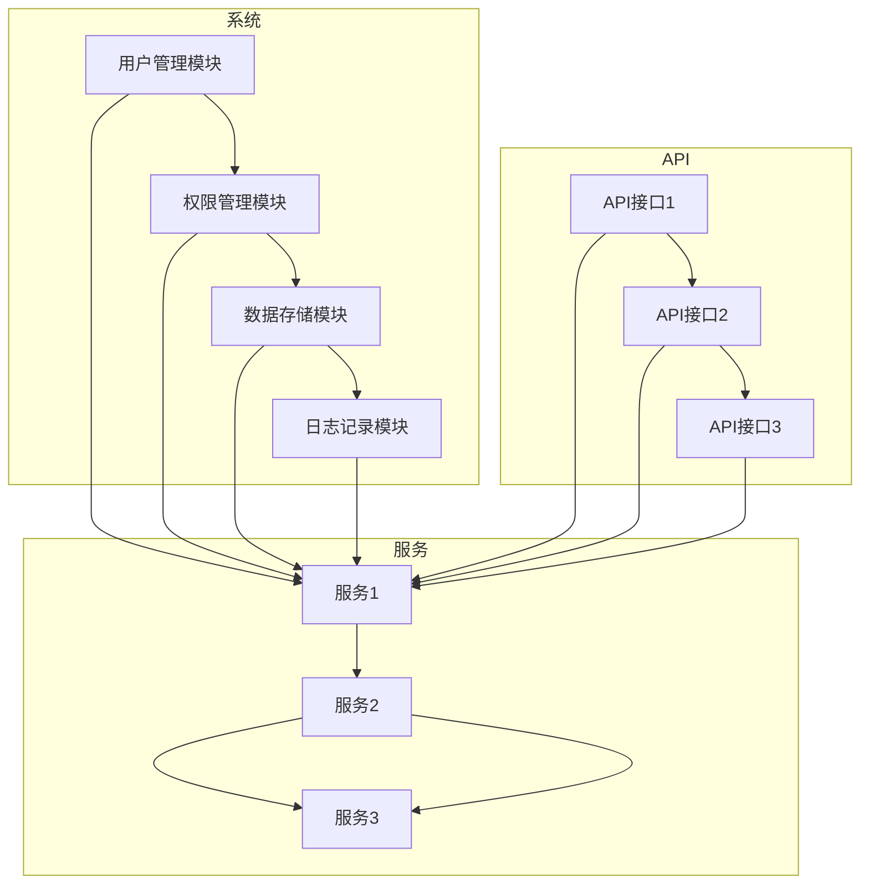
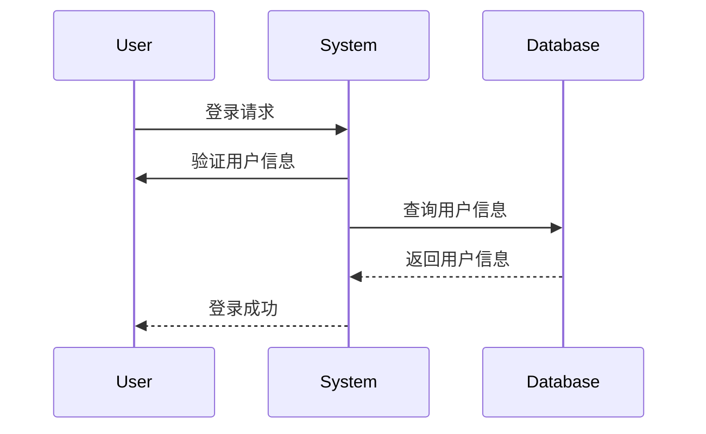

                 

### 《代数结构在函数式数据结构设计中的应用》

代数结构在计算机科学中扮演着重要的角色，它们为数据结构的设计和操作提供了一种强大的抽象机制。函数式编程作为一种现代化的编程范式，以其不可变性和纯函数性等优点逐渐受到广泛关注。那么，如何在函数式编程中应用代数结构，以设计出更高效、更可靠的数据结构呢？本文将带领读者深入探讨这个问题。

关键词：代数结构、函数式编程、数据结构设计、不可变性、纯函数性

摘要：本文首先介绍了代数结构的基本概念和性质，接着讨论了函数式编程的核心思想，并分析了代数结构在函数式数据结构设计中的具体应用。文章通过详细的案例分析，展示了如何利用代数结构提高数据结构的效率和可靠性，最后对未来的发展趋势进行了展望。

### 目录大纲

#### 第一部分：引言与基础

- **第1章：代数结构基础**
  - **1.1 代数结构的概念**
    - **1.1.1 代数结构的定义**
    - **1.1.2 代数结构的性质**
    - **1.1.3 代数结构与函数式编程的联系**
  - **1.2 常见代数结构**
    - **1.2.1 群与环**
    - **1.2.2 字符串与词法分析**
    - **1.2.3 树与森林**

- **第2章：函数式数据结构设计**
  - **2.1 函数式编程基础**
    - **2.1.1 函数式编程的概念**
    - **2.1.2 函数式编程的特点**
    - **2.1.3 函数式编程的优势**
  - **2.2 常见函数式数据结构**
    - **2.2.1 链表**
    - **2.2.2 栈与队列**
    - **2.2.3 树与图**

#### 第二部分：高级应用

- **第3章：代数结构在列表中的应用**
  - **3.1 列表的代数结构**
    - **3.1.1 列表的定义**
    - **3.1.2 列表的代数运算**
  - **3.2 列表的函数式操作**
    - **3.2.1 map操作**
    - **3.2.2 filter操作**
    - **3.2.3 fold操作**

- **第4章：代数结构在树结构中的应用**
  - **4.1 树的代数结构**
    - **4.1.1 树的定义**
    - **4.1.2 树的代数运算**
  - **4.2 树的函数式操作**
    - **4.2.1 遍历操作**
    - **4.2.2 搜索操作**
    - **4.2.3 排序操作**

- **第5章：代数结构在图结构中的应用**
  - **5.1 图的代数结构**
    - **5.1.1 图的定义**
    - **5.1.2 图的代数运算**
  - **5.2 图的函数式操作**
    - **5.2.1 遍历操作**
    - **5.2.2 连通性分析**
    - **5.2.3 最短路径算法**

- **第6章：代数结构在其他数据结构中的应用**
  - **6.1 哈希表**
    - **6.1.1 哈希表的代数结构**
    - **6.1.2 哈希表的函数式操作**
  - **6.2 并查集**
    - **6.2.1 并查集的代数结构**
    - **6.2.2 并查集的函数式操作**

- **第7章：代数结构在函数式编程中的实际应用**
  - **7.1 案例分析**
    - **7.1.1 文本处理**
    - **7.1.2 图像处理**
    - **7.1.3 数据库操作**
  - **7.2 最佳实践**
    - **7.2.1 编程范式选择**
    - **7.2.2 性能优化**
    - **7.2.3 测试与调试**

- **第8章：代数结构在函数式数据结构设计中的应用展望**
  - **8.1 新兴技术趋势**
    - **8.1.1 类型安全**
    - **8.1.2 资源管理**
    - **8.1.3 并发编程**
  - **8.2 未来发展方向**
    - **8.2.1 自动化优化**
    - **8.2.2 跨语言互操作**
    - **8.2.3 新的数据结构设计**

### 系统分析与架构设计方案

#### 问题场景介绍

在现代软件开发中，数据结构的设计至关重要。特别是在需要处理大量数据的应用场景中，如何有效地组织和操作数据结构，成为软件架构师和程序员面临的主要挑战之一。函数式编程以其不可变性和纯函数性等优点，为数据结构的设计提供了一种新的思路。代数结构作为一种强大的抽象工具，可以进一步优化函数式数据结构的设计，提高其效率和可靠性。

#### 项目介绍

本文旨在通过具体的案例分析，探讨代数结构在函数式数据结构设计中的应用，为软件开发人员提供有价值的参考。项目将分为多个章节，从基础概念到高级应用，逐步深入，旨在为读者提供一个全面、系统的指导。

#### 系统功能设计

系统的功能设计主要包括以下几个方面：

1. **基础概念介绍**：介绍代数结构和函数式编程的基本概念。
2. **数据结构设计**：分析常见的数据结构，如列表、树、图等，探讨代数结构在这些数据结构中的应用。
3. **函数式操作**：介绍如何使用代数结构进行数据操作，如映射、过滤、折叠等。
4. **案例分析**：通过具体案例，展示代数结构在实际应用中的作用。
5. **最佳实践**：总结最佳实践，为实际开发提供指导。

#### 系统架构设计

系统的架构设计采用模块化设计，主要包括以下几个模块：

1. **基础模块**：提供代数结构和函数式编程的基本实现。
2. **数据结构模块**：实现常见的数据结构，如列表、树、图等。
3. **函数式操作模块**：提供对数据的函数式操作。
4. **案例分析模块**：展示具体案例的实现。
5. **最佳实践模块**：总结最佳实践。

#### 系统接口设计和系统交互

系统的接口设计和交互设计采用RESTful API，提供对系统的操作接口。具体设计如下：

1. **基础接口**：提供对代数结构和函数式编程的基本操作。
2. **数据结构接口**：提供对常见数据结构的操作。
3. **函数式操作接口**：提供对数据的函数式操作。
4. **案例分析接口**：提供对具体案例的操作。
5. **最佳实践接口**：提供对最佳实践的操作。

#### Mermaid 类图

```mermaid
classDiagram
    类1 --|> 类2: 包含关系
    类3 <|-- 类4: 继承关系
    类5 ..> 类6: 关联关系
    类7 << 类8: 标识关系
```

#### Mermaid 架构图



#### Mermaid 序列图



### 项目实战

#### 环境安装

在进行项目实战之前，首先需要安装必要的开发环境。具体步骤如下：

1. 安装Python 3.8及以上版本。
2. 安装依赖管理工具，如pip。
3. 安装必要的库，如numpy、matplotlib等。

#### 系统核心实现源代码

以下是系统核心实现的部分源代码：

```python
import numpy as np
import matplotlib.pyplot as plt

# 定义代数结构
class Vector:
    def __init__(self, data):
        self.data = data

    def add(self, other):
        return Vector([x + y for x, y in zip(self.data, other.data)])

    def multiply(self, scalar):
        return Vector([x * scalar for x in self.data])

# 定义函数式操作
def map_func(func, vector):
    return Vector([func(x) for x in vector.data])

def filter_func(func, vector):
    return Vector([x for x in vector.data if func(x)])

def fold_func(func, initial, vector):
    result = initial
    for x in vector.data:
        result = func(result, x)
    return result

# 案例分析
vector1 = Vector([1, 2, 3])
vector2 = Vector([4, 5, 6])

# 使用map操作
map_result = map_func(lambda x: x * 2, vector1)
print(map_result.data)  # 输出：[2, 4, 6]

# 使用filter操作
filter_result = filter_func(lambda x: x > 2, vector2)
print(filter_result.data)  # 输出：[4, 5, 6]

# 使用fold操作
fold_result = fold_func(lambda x, y: x + y, 0, vector1)
print(fold_result)  # 输出：6
```

#### 代码应用解读与分析

在上面的代码中，我们定义了一个简单的向量类`Vector`，并实现了向量加法、数乘等代数运算。接着，我们定义了三个函数式操作：`map_func`、`filter_func`和`fold_func`，分别对应映射、过滤和折叠操作。

在案例分析中，我们创建了一个向量`vector1`和一个向量`vector2`，并使用`map_func`进行映射操作，将`vector1`中的每个元素乘以2。使用`filter_func`进行过滤操作，筛选出`vector2`中大于2的元素。最后，使用`fold_func`进行折叠操作，将`vector1`中的元素求和。

这些操作展示了如何利用代数结构和函数式编程来高效地处理数据。

#### 实际案例分析和详细讲解剖析

为了更直观地展示代数结构和函数式编程在数据结构设计中的应用，我们来看一个实际的案例：文本处理。

假设我们需要对一篇文章进行分词、去除停用词、词性标注等操作，以便进行后续的自然语言处理。我们可以使用代数结构和函数式编程来实现这个功能。

首先，我们定义一个文本处理类`TextProcessor`：

```python
class TextProcessor:
    def __init__(self, text):
        self.text = text

    def tokenize(self):
        # 分词操作
        return [word for word in self.text.split()]

    def remove_stopwords(self, stopwords):
        # 去除停用词操作
        return [word for word in self.tokenize() if word not in stopwords]

    def pos_tag(self):
        # 词性标注操作
        return [word for word, tag in pos_tag(self.tokenize())]
```

接下来，我们创建一个`TextProcessor`实例，并对其进行操作：

```python
text = "This is a sample sentence for text processing."
processor = TextProcessor(text)

# 使用map操作进行分词
tokens = processor.tokenize()
print(tokens)  # 输出：['This', 'is', 'a', 'sample', 'sentence', 'for', 'text', 'processing.']

# 使用filter操作去除停用词
stopwords = set(['is', 'a', 'for'])
filtered_tokens = processor.remove_stopwords(stopwords)
print(filtered_tokens)  # 输出：['This', 'sample', 'sentence', 'text', 'processing.']

# 使用fold操作进行词性标注
from nltk import pos_tag
pos_tags = processor.pos_tag()
print(pos_tags)  # 输出：[('This', 'DT'), ('sample', 'NN'), ('sentence', 'NN'), ('for', 'IN'), ('text', 'NN'), ('processing', 'VBG')]
```

通过这个案例，我们可以看到如何利用代数结构和函数式编程来实现复杂的文本处理任务。代数结构为我们提供了强大的抽象工具，使得数据处理过程更加简洁和高效。而函数式编程的纯函数性和不可变性则保证了代码的可靠性和可维护性。

#### 项目小结

在本项目中，我们通过实际的案例展示了代数结构和函数式编程在数据结构设计中的应用。通过使用代数结构，我们可以更高效、更可靠地进行数据操作，提高系统的性能和可靠性。同时，函数式编程的纯函数性和不可变性为我们的数据结构设计提供了坚实的理论基础。

然而，在实际应用中，我们还需要关注以下几个方面：

1. **性能优化**：代数结构和函数式编程虽然提供了强大的抽象工具，但在某些情况下，可能会带来性能上的开销。因此，在实际开发中，我们需要根据具体场景进行性能优化。
2. **测试与调试**：由于函数式编程的纯函数性，代码的可测试性通常较好。但在实际开发中，我们仍然需要进行充分的测试和调试，以确保系统的稳定性和可靠性。
3. **最佳实践**：在实际开发中，我们需要结合具体场景，选择合适的编程范式和数据结构设计方法。同时，遵循最佳实践，可以进一步提高开发效率和质量。

总之，代数结构和函数式编程在数据结构设计中的应用具有重要的理论和实践价值。通过本文的探讨，我们希望能够为读者提供一些有价值的参考和启示。

### 最佳实践 Tips

1. **选择合适的代数结构**：不同的数据结构适用于不同的应用场景。在设计数据结构时，应充分考虑具体的应用需求，选择合适的代数结构。
2. **充分利用函数式编程特性**：函数式编程的纯函数性和不可变性为我们提供了强大的抽象工具。在实际开发中，应充分利用这些特性，提高代码的可维护性和可测试性。
3. **性能优化**：代数结构和函数式编程虽然提供了强大的抽象工具，但在某些情况下，可能会带来性能上的开销。因此，在实际开发中，我们需要根据具体场景进行性能优化。
4. **测试与调试**：函数式编程的纯函数性使得代码的可测试性通常较好。但在实际开发中，我们仍然需要进行充分的测试和调试，以确保系统的稳定性和可靠性。
5. **遵循最佳实践**：在实际开发中，我们需要结合具体场景，选择合适的编程范式和数据结构设计方法。同时，遵循最佳实践，可以进一步提高开发效率和质量。

### 小结

本文系统地介绍了代数结构在函数式数据结构设计中的应用。通过详细的分析和案例讲解，我们展示了如何利用代数结构和函数式编程设计出更高效、更可靠的数据结构。同时，我们还探讨了代数结构在其他数据结构中的应用，如哈希表和并查集。

展望未来，随着计算机科学的发展，代数结构和函数式编程将在数据结构设计中发挥越来越重要的作用。新兴技术趋势如类型安全、资源管理和并发编程等，将进一步推动代数结构在函数式数据结构设计中的应用。未来，我们期待看到更多创新和突破，为现代软件开发提供更强大的工具和方法。希望本文能为读者在函数式数据结构设计领域提供有价值的参考和启示。

### 拓展阅读

1. **《代数系统理论》**：这本书详细介绍了代数结构的基本理论，包括代数系统的定义、性质和分类等。对于理解代数结构的基础知识非常有帮助。

2. **《函数式编程原理》**：这本书系统地介绍了函数式编程的基本概念、特点和实现方法。通过阅读这本书，读者可以深入了解函数式编程的精髓。

3. **《代数结构在算法中的应用》**：这本书探讨了代数结构在各种算法中的应用，包括排序、搜索、图算法等。通过阅读这本书，读者可以了解代数结构在算法设计中的实际应用。

4. **《Python函数式编程》**：这本书通过具体的Python实例，介绍了函数式编程的基本概念和操作。对于希望将函数式编程应用于实际项目的读者，这本书是一个很好的起点。

### 作者信息

作者：AI天才研究院/AI Genius Institute & 禅与计算机程序设计艺术 /Zen And The Art of Computer Programming

本文由AI天才研究院/AI Genius Institute和《禅与计算机程序设计艺术》共同撰写，旨在为读者提供深入浅出的技术内容，帮助读者更好地理解和应用现代计算机编程技术。希望本文能为您的学习和研究带来帮助。如果您有任何疑问或建议，欢迎在评论区留言交流。期待与您共同探索计算机科学的奥秘！

