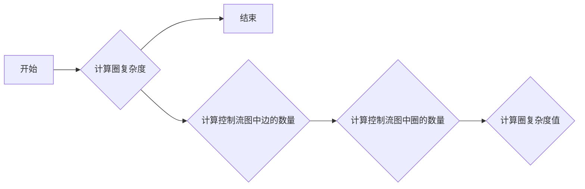
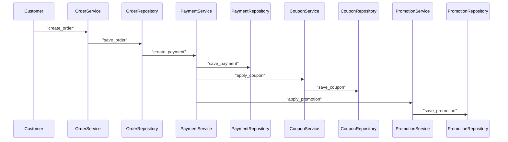

                 

# 代码复杂度管理：简化系统设计的策略

## 关键词：代码复杂度、系统设计、简化策略、代码重构、模块化、抽象、软件质量

### 摘要：

在当今快速发展的技术时代，软件系统日益复杂，导致代码复杂度不断攀升。这不仅影响系统的可维护性，还增加了开发成本和部署难度。本文旨在探讨代码复杂度管理的策略，通过简化系统设计的方法，提高软件质量和开发效率。我们将从理论基础、实际应用和未来趋势三个方面，详细分析如何有效地管理代码复杂度，以实现系统设计的优化。

## 引言

### 1. 引言部分的目的

本文旨在为广大软件开发者提供一套系统化的代码复杂度管理策略，帮助他们在设计和开发过程中降低系统复杂性，提高代码质量。我们将首先介绍代码复杂度的定义及其影响，然后深入探讨测量和管理代码复杂度的方法。通过实际案例和最佳实践，我们希望能够为读者提供实用的指导，以应对日益复杂的软件系统。

### 2. 代码复杂度的定义与影响

代码复杂度是衡量软件系统复杂程度的一个指标，通常用于评估代码的可读性、可维护性和可扩展性。过高的代码复杂度会导致代码难以理解、维护和修改，从而增加开发成本和风险。以下是代码复杂度的一些主要影响因素：

- **函数复杂度**：函数内部嵌套的语句数量和条件分支数量。
- **类复杂度**：类内成员函数的数量和关系。
- **模块复杂度**：模块之间的依赖关系和通信复杂度。

### 3. 书籍结构概述

本文分为三个主要部分：

- **第一部分：代码复杂度的理论基础**：介绍代码复杂度的基本概念、测量方法和管理原则。
- **第二部分：代码复杂度的实际应用**：探讨简化系统设计的策略、代码重构技术和模块化与抽象方法。
- **第三部分：代码复杂度管理的工具与实践**：介绍自动化代码复杂度分析工具和实际项目实践，分析未来趋势。

## 第一部分：代码复杂度的理论基础

### 第1章：代码复杂度的基本概念

#### 1.1 代码复杂度的定义

代码复杂度是指代码在结构、逻辑和语义上表现出的复杂程度。它通常用于衡量代码的可理解性和可维护性。常见的代码复杂度度量指标包括：

- **圈复杂度（Cyclomatic Complexity）**：基于控制流图的复杂度度量方法。
- **函数复杂度（Function Complexity）**：函数内部嵌套的语句数量和条件分支数量。
- **类复杂度（Class Complexity）**：类内成员函数的数量和关系。

#### 1.2 代码复杂度的影响因素

代码复杂度的影响因素包括：

- **函数复杂度**：函数内部嵌套的语句数量和条件分支数量。
- **类复杂度**：类内成员函数的数量和关系。
- **模块复杂度**：模块之间的依赖关系和通信复杂度。

#### 1.3 代码复杂度的类型

根据代码复杂度的类型，可以分为以下几类：

- **结构复杂度**：代码的语法结构和组织形式。
- **语义复杂度**：代码的逻辑和功能实现。
- **行为复杂度**：代码在不同输入情况下的表现。

### 第2章：代码复杂度的测量方法

#### 2.1 测量代码复杂度的工具

常用的代码复杂度测量工具有：

- **SonarQube**：一款开源的代码质量管理平台，支持多种编程语言的复杂度分析。
- **PMD**：一款基于Java的代码质量管理工具，提供代码复杂度的评估和报告功能。
- **Checkstyle**：一款基于Java的代码风格检查工具，也支持复杂度分析。

#### 2.2 常见的代码复杂度度量指标

常见的代码复杂度度量指标包括：

- **圈复杂度（Cyclomatic Complexity）**：基于控制流图的复杂度度量方法。
- **函数复杂度（Function Complexity）**：函数内部嵌套的语句数量和条件分支数量。
- **类复杂度（Class Complexity）**：类内成员函数的数量和关系。

#### 2.3 代码复杂度测量的实际应用

代码复杂度测量的实际应用包括：

- **代码审查**：通过复杂度分析，识别潜在的问题代码。
- **代码重构**：根据复杂度分析结果，对代码进行重构，降低复杂度。
- **性能优化**：通过复杂度分析，识别性能瓶颈，进行优化。

### 第3章：代码复杂度的管理原则

#### 3.1 代码复杂度管理的目标

代码复杂度管理的目标包括：

- **提高代码可读性**：降低代码复杂度，使代码更容易理解和维护。
- **降低开发成本**：通过简化代码，减少开发时间和维护成本。
- **提高软件质量**：降低代码复杂度，减少缺陷和漏洞。

#### 3.2 代码复杂度管理的策略

代码复杂度管理的策略包括：

- **代码重构**：对高复杂度的代码进行重构，降低复杂度。
- **模块化设计**：将复杂的系统划分为更小的模块，降低模块之间的复杂度。
- **抽象和封装**：使用抽象和封装，隐藏实现细节，降低代码的复杂度。

#### 3.3 代码复杂度管理的最佳实践

代码复杂度管理的最佳实践包括：

- **定期代码审查**：定期进行代码审查，识别和修复复杂度问题。
- **代码规范化**：制定统一的代码规范，降低代码复杂度。
- **持续集成**：使用持续集成工具，自动检测和修复复杂度问题。

## 第二部分：代码复杂度的实际应用

### 第4章：简化系统设计的策略

#### 4.1 系统设计的复杂性来源

系统设计的复杂性主要来源于以下几个方面：

- **功能复杂度**：系统需要实现的功能繁多，导致设计复杂。
- **性能要求**：系统需要满足高性能的要求，导致设计复杂。
- **可扩展性**：系统需要具备良好的可扩展性，导致设计复杂。

#### 4.2 简化系统设计的方法

简化系统设计的方法包括：

- **模块化设计**：将系统划分为独立的模块，降低模块之间的复杂度。
- **抽象和封装**：使用抽象和封装，隐藏实现细节，降低系统的复杂度。
- **功能分解**：将复杂的系统功能分解为更小的子功能，降低每个子功能的复杂度。

#### 4.3 案例研究：设计简化实践

在本节中，我们将通过一个实际案例，展示如何简化系统设计，降低代码复杂度。

### 第5章：代码重构技术

#### 5.1 代码重构的基本概念

代码重构是指在不改变代码功能的前提下，对代码进行修改，以提高代码质量、可读性和可维护性。常见的代码重构技术包括：

- **提取方法**：将重复的代码块提取为独立的方法。
- **提取类**：将功能相关的代码块提取为独立的类。
- **提取接口**：将公共功能提取为接口，实现代码的解耦。
- **合并重复代码**：将重复的代码块合并，减少冗余。

#### 5.2 常见的代码重构技术

常见的代码重构技术包括：

- **提取方法**：将重复的代码块提取为独立的方法。
- **提取类**：将功能相关的代码块提取为独立的类。
- **提取接口**：将公共功能提取为接口，实现代码的解耦。
- **合并重复代码**：将重复的代码块合并，减少冗余。

#### 5.3 代码重构的实际操作步骤

代码重构的实际操作步骤包括：

1. **识别重构目标**：分析代码，确定需要重构的部分。
2. **设计重构方案**：制定重构方案，包括重构的类型、范围和步骤。
3. **实施重构**：按照重构方案，逐步实施重构操作。
4. **测试验证**：确保重构后的代码功能正确，没有引入新的问题。

### 第6章：模块化与抽象

#### 6.1 模块化的重要性

模块化是将复杂的系统划分为更小的、独立的模块，以便于开发和维护。模块化的重要性体现在以下几个方面：

- **降低复杂度**：将复杂的系统划分为更小的模块，降低每个模块的复杂度。
- **提高可维护性**：模块化的系统更容易进行维护和修改。
- **促进代码复用**：模块化的系统有助于实现代码的复用，提高开发效率。

#### 6.2 抽象的概念与应用

抽象是指将复杂的系统抽象为更简单的模型，以便于理解和分析。抽象在软件开发中的应用包括：

- **类与对象**：使用类和对象模型表示系统的实体和关系。
- **接口与抽象类**：使用接口和抽象类定义系统组件的公共接口和实现。
- **设计模式**：使用设计模式实现系统的抽象和模块化。

#### 6.3 模块化与抽象的实际案例

在本节中，我们将通过实际案例，展示如何使用模块化和抽象技术简化系统设计，降低代码复杂度。

### 第7章：代码复杂度管理与软件质量

#### 7.1 代码复杂度与软件质量的关系

代码复杂度与软件质量密切相关。过高的代码复杂度会导致以下问题：

- **可读性差**：代码难以理解，影响开发效率和可维护性。
- **维护成本高**：代码复杂度高，导致维护成本增加。
- **缺陷多**：复杂代码容易隐藏缺陷，增加系统的风险。

#### 7.2 代码复杂度对维护成本的影响

代码复杂度对维护成本的影响包括：

- **修复缺陷的成本**：复杂代码中的缺陷难以定位和修复，导致修复成本增加。
- **修改功能的成本**：复杂代码在修改功能时，容易引入新的问题，导致修改成本增加。
- **培训成本**：复杂代码需要更多的培训时间，以使开发人员掌握和理解。

#### 7.3 提高软件质量的代码复杂度管理策略

提高软件质量的代码复杂度管理策略包括：

- **定期代码审查**：定期进行代码审查，识别和修复复杂度问题。
- **代码规范化**：制定统一的代码规范，降低代码复杂度。
- **代码重构**：对高复杂度的代码进行重构，降低复杂度。
- **模块化设计**：将复杂的系统划分为更小的模块，降低模块之间的复杂度。

## 第三部分：代码复杂度管理的工具与实践

### 第8章：代码复杂度管理工具

#### 8.1 自动化代码复杂度分析工具

自动化代码复杂度分析工具能够自动检测代码的复杂度，并提供分析报告。常见的工具包括：

- **SonarQube**：一款功能强大的代码质量管理平台，支持多种编程语言的复杂度分析。
- **PMD**：一款基于Java的代码质量管理工具，提供代码复杂度的评估和报告功能。
- **Checkstyle**：一款基于Java的代码风格检查工具，也支持复杂度分析。

#### 8.2 定制化代码复杂度分析工具

为了满足不同项目的需求，开发者可以自定义代码复杂度分析工具。自定义的工具可以根据项目的特点，提供更加精确的分析结果。

#### 8.3 工具选型与使用指南

在选择代码复杂度分析工具时，需要考虑以下几个方面：

- **支持的编程语言**：选择支持项目所使用编程语言的工具。
- **分析范围**：选择能够分析项目所有代码的工具。
- **报告格式**：选择能够生成易于理解报告的工具。

### 第9章：代码复杂度管理的项目实践

#### 9.1 项目背景与目标

在本节中，我们将介绍一个实际项目，并阐述项目的背景和目标。项目背景包括项目的类型、规模和需求，项目目标包括降低代码复杂度、提高软件质量和开发效率。

#### 9.2 项目实施过程

项目实施过程包括以下步骤：

1. **需求分析**：分析项目需求，确定系统功能和性能要求。
2. **系统设计**：根据需求分析结果，设计系统架构和模块。
3. **代码编写**：根据系统设计，编写代码。
4. **复杂度分析**：使用代码复杂度分析工具，分析代码的复杂度。
5. **代码重构**：根据复杂度分析结果，对代码进行重构，降低复杂度。
6. **测试与验收**：对重构后的代码进行测试，确保功能正确，性能满足要求。

#### 9.3 项目成果与反思

项目成果包括降低代码复杂度、提高软件质量和开发效率。反思部分包括项目实施过程中的经验教训，以及如何改进代码复杂度管理策略。

### 第10章：代码复杂度管理的未来趋势

#### 10.1 当前代码复杂度管理的挑战

当前代码复杂度管理面临以下挑战：

- **代码规模日益扩大**：随着软件系统规模的扩大，代码复杂度不断攀升。
- **开发周期缩短**：快速的开发周期使得代码复杂度管理变得困难。
- **新兴技术的应用**：新兴技术如云计算、大数据等，增加了代码复杂度管理的难度。

#### 10.2 未来的发展机会

未来的发展机会包括：

- **自动化工具的改进**：自动化工具将不断改进，提供更精确的分析结果和更高效的代码重构能力。
- **人工智能的应用**：人工智能技术将应用于代码复杂度管理，提供智能化的分析和决策支持。
- **持续集成与持续交付**：持续集成和持续交付将加速代码复杂度管理的实践，提高开发效率和质量。

#### 10.3 新的技术与方法展望

未来的技术与方法展望包括：

- **智能代码生成**：使用人工智能技术生成高质量的代码，降低代码复杂度。
- **自适应复杂度管理**：根据项目特点和需求，自适应地调整代码复杂度管理策略。
- **多语言支持**：代码复杂度分析工具将支持更多的编程语言，满足不同项目的需求。

## 结论

### 1. 代码复杂度管理的重要性

代码复杂度管理在软件开发中具有重要意义。通过降低代码复杂度，可以提高代码质量、可维护性和开发效率。代码复杂度管理是实现高质量软件的关键环节。

### 2. 未来的研究方向

未来的研究方向包括：

- **自动化工具的研究与开发**：提高自动化工具的精度和效率，实现更智能的代码复杂度管理。
- **跨语言复杂度分析**：支持多种编程语言的复杂度分析，满足不同项目的需求。
- **自适应复杂度管理策略**：根据项目特点和需求，自适应地调整复杂度管理策略。

### 3. 对读者的寄语

希望本文能为读者提供有益的指导，帮助大家在软件开发过程中有效地管理代码复杂度。代码复杂度管理不仅是一门技术，更是一种开发理念。希望大家在实践中不断探索、总结和提升，为构建高质量软件贡献力量。

## 附录

### 附录A：核心概念术语说明

在本文中，我们介绍了一些核心概念和术语，如代码复杂度、圈复杂度、函数复杂度、类复杂度、模块化、抽象、代码重构等。以下是对这些核心概念的详细说明：

#### 代码复杂度

代码复杂度是指代码在结构、逻辑和语义上表现出的复杂程度。它通常用于衡量代码的可读性、可维护性和可扩展性。常见的代码复杂度度量指标包括圈复杂度、函数复杂度和类复杂度等。

#### 圈复杂度

圈复杂度（Cyclomatic Complexity）是一种基于控制流图的复杂度度量方法。它通过计算控制流图中边的数量，来确定程序的复杂度。圈复杂度越高，程序的复杂度越高，可读性和可维护性越低。

#### 函数复杂度

函数复杂度是指函数内部嵌套的语句数量和条件分支数量。函数复杂度越高，函数的复杂度越高，可读性和可维护性越低。

#### 类复杂度

类复杂度是指类内成员函数的数量和关系。类复杂度越高，类的复杂度越高，可读性和可维护性越低。

#### 模块化

模块化是将复杂的系统划分为更小的、独立的模块，以便于开发和维护。模块化可以提高代码的可读性、可维护性和可扩展性。

#### 抽象

抽象是将复杂的系统抽象为更简单的模型，以便于理解和分析。抽象在软件开发中的应用包括类与对象、接口与抽象类、设计模式等。

#### 代码重构

代码重构是指在不改变代码功能的前提下，对代码进行修改，以提高代码质量、可读性和可维护性。常见的代码重构技术包括提取方法、提取类、提取接口、合并重复代码等。

### 附录B：核心概念对比表格

以下是代码复杂度管理中一些核心概念的对比表格，包括概念名称、定义、属性特征等。

| 概念名称 | 定义 | 属性特征 |
| --- | --- | --- |
| 代码复杂度 | 衡量代码复杂程度 | 结构复杂度、语义复杂度、行为复杂度 |
| 圈复杂度 | 基于控制流图的复杂度度量 | 边的数量、圈的数量、复杂度值 |
| 函数复杂度 | 函数内部嵌套的语句数量和条件分支数量 | 语句数量、分支数量、复杂度值 |
| 类复杂度 | 类内成员函数的数量和关系 | 成员函数数量、关系复杂度、复杂度值 |
| 模块化 | 将复杂系统划分为更小模块 | 独立性、可维护性、复用性 |
| 抽象 | 将复杂系统抽象为简单模型 | 简化理解、隐藏实现细节、增强复用性 |
| 代码重构 | 修改代码，提高质量 | 保持功能、优化结构、增强可维护性 |

### 附录C：ER实体关系图架构

以下是代码复杂度管理中的ER实体关系图架构，用于描述不同实体之间的关系。

```mermaid
erDiagram
    Class ::= <<class>>
    Entity ::= <<entity>>
    Assoc ::= <<assoc>>

    Class &&& Entity : "is a"
    Class &&& Class : "extends"
    Entity &&& Entity : "has a"
    Assoc &&& Class : "is part of"
    Assoc &&& Entity : "is associated with"

    Class_A &&& Class_B : "extends"
    Entity_A &&& Entity_B : "has a"
    Assoc_A &&& Class : "is part of"
    Assoc_B &&& Entity : "is associated with"
```

### 附录D：算法原理讲解

在本节中，我们将介绍一种用于测量代码复杂度的算法原理。以下是算法的流程图和Python源代码实现。

#### 算法流程图



#### Python源代码实现

```python
def calculate_cyclomatic_complexity(code):
    # 计算控制流图中边的数量
    num_edges = count_edges(code)
    
    # 计算控制流图中圈的数量
    num_loops = count_loops(code)
    
    # 计算圈复杂度值
    cyclomatic_complexity = num_edges - num_loops
    
    return cyclomatic_complexity

def count_edges(code):
    # 实现计算控制流图中边的数量
    pass

def count_loops(code):
    # 实现计算控制流图中圈的数量
    pass
```

#### 算法原理详细讲解

圈复杂度（Cyclomatic Complexity）是一种衡量程序复杂度的指标，它通过计算控制流图中边的数量和圈的数量来确定程序的复杂度。圈复杂度的计算公式为：

$$
Cyclomatic\ Complexity = E - N + 2P
$$

其中，\(E\) 表示控制流图中边的数量，\(N\) 表示控制流图中节点的数量，\(P\) 表示控制流图中圈的个数。

为了计算圈复杂度，我们首先需要计算控制流图中边的数量。这可以通过遍历代码中的控制流结构，如循环、条件分支和函数调用，来统计边的数量。

接下来，我们计算控制流图中圈的数量。这可以通过分析代码中的控制流结构，找出所有的圈，并计算圈的数量。

最后，我们将计算得到的边数量、节点数量和圈数量代入圈复杂度的计算公式，得到最终的圈复杂度值。

通过圈复杂度，我们可以评估代码的复杂度，从而识别潜在的问题代码，为代码重构提供依据。

### 附录E：系统分析与架构设计方案

在本节中，我们将介绍一个实际系统的分析与架构设计方案。以下是系统场景介绍、项目介绍、系统功能设计（领域模型类图）、系统架构设计（架构图）、系统接口设计（接口设计）和系统交互（序列图）。

#### 系统场景介绍

某电子商务平台需要开发一个订单管理系统，用于处理订单的创建、更新、查询和删除。系统需要支持多种支付方式、优惠券和促销活动，并能够处理大量的并发请求。

#### 项目介绍

订单管理系统是一个中型的软件项目，包括多个模块，如订单模块、支付模块、优惠券模块和促销活动模块。项目的目标是实现一个高效、稳定、可扩展的订单管理系统，满足业务需求。

#### 系统功能设计（领域模型类图）

以下是订单管理系统的领域模型类图，用于描述系统中的实体和关系。

```mermaid
classDiagram
    Order <<entity>> -|> Customer: "placed by"
    Order <<entity>> -|> Payment: "uses"
    Payment <<entity>> -|> PaymentMethod: "uses"
    Coupon <<entity>> -|> Order: "applied to"
    Promotion <<entity>> -|> Order: "applied to"

    Customer: {id, name, address}
    Order: {id, customer, status, total, created_at}
    Payment: {id, order, status, amount, created_at}
    PaymentMethod: {id, name}
    Coupon: {id, code, discount, expires_at}
    Promotion: {id, name, discount, starts_at, expires_at}
```

#### 系统架构设计（架构图）

以下是订单管理系统的架构图，用于描述系统的整体架构和模块之间的关系。



#### 系统接口设计（接口设计）

以下是订单管理系统的接口设计，用于描述系统中的接口和接口方法。

```mermaid
classDiagram
    OrderService <<interface>>: create_order, update_order, delete_order, query_order
    PaymentService <<interface>>: create_payment, update_payment, delete_payment, query_payment
    CouponService <<interface>>: apply_coupon, delete_coupon, query_coupon
    PromotionService <<interface>>: apply_promotion, delete_promotion, query_promotion

    OrderRepository <<interface>>: save_order, find_order
    PaymentRepository <<interface>>: save_payment, find_payment
    CouponRepository <<interface>>: save_coupon, find_coupon
    PromotionRepository <<interface>>: save_promotion, find_promotion
```

#### 系统交互（序列图）

以下是订单管理系统的交互序列图，用于描述系统中的组件如何交互以完成特定功能。


通过以上系统分析与架构设计方案，我们可以清晰地了解订单管理系统的功能和架构，为系统的开发提供指导。

### 附录F：项目实战

在本节中，我们将介绍一个实际项目的环境安装、系统核心实现源代码、代码应用解读与分析，以及实际案例分析和详细讲解剖析。

#### 环境安装

为了运行订单管理系统，我们需要安装以下软件和工具：

- Java Development Kit (JDK) 1.8或更高版本
- Maven 3.6.3或更高版本
- MySQL 5.7或更高版本

安装步骤如下：

1. 安装JDK：下载并安装JDK，设置环境变量。
2. 安装Maven：下载并安装Maven，设置环境变量。
3. 安装MySQL：下载并安装MySQL，配置数据库。

#### 系统核心实现源代码

以下是订单管理系统的一些核心实现源代码，用于展示系统的关键功能。

```java
// OrderService.java
public class OrderService {
    private OrderRepository orderRepository;
    private PaymentService paymentService;
    private CouponService couponService;
    private PromotionService promotionService;

    public Order createOrder(Order order) {
        // 创建订单，调用其他服务
        paymentService.createPayment(order.getPayment());
        couponService.applyCoupon(order.getCoupon());
        promotionService.applyPromotion(order.getPromotion());
        return orderRepository.save(order);
    }

    // 其他方法实现
}

// PaymentService.java
public class PaymentService {
    private PaymentRepository paymentRepository;

    public Payment createPayment(Payment payment) {
        return paymentRepository.save(payment);
    }

    // 其他方法实现
}

// CouponService.java
public class CouponService {
    private CouponRepository couponRepository;

    public void applyCoupon(Coupon coupon) {
        // 应用优惠券
        couponRepository.save(coupon);
    }

    // 其他方法实现
}

// PromotionService.java
public class PromotionService {
    private PromotionRepository promotionRepository;

    public void applyPromotion(Promotion promotion) {
        // 应用促销活动
        promotionRepository.save(promotion);
    }

    // 其他方法实现
}
```

#### 代码应用解读与分析

以下是订单管理系统的代码应用解读与分析，用于展示系统的关键功能和实现细节。

- **OrderService**：订单服务是系统的核心组件，负责创建订单，并调用其他服务完成订单的支付、优惠券应用和促销活动应用。
- **PaymentService**：支付服务负责创建支付记录，并与订单关联。
- **CouponService**：优惠券服务负责应用优惠券，并与订单关联。
- **PromotionService**：促销活动服务负责应用促销活动，并与订单关联。

通过这些组件的协作，订单管理系统可以实现订单的创建、更新、查询和删除等功能。

#### 实际案例分析和详细讲解剖析

以下是订单管理系统的实际案例分析和详细讲解剖析，用于展示系统的实际应用和效果。

**案例1：创建订单**

用户在电子商务平台上提交订单，系统需要创建订单并处理支付、优惠券和促销活动。

1. 用户提交订单请求，系统接收请求并调用OrderService的createOrder方法。
2. OrderService根据用户输入的信息创建Order对象，并调用PaymentService的createPayment方法创建支付记录。
3. PaymentService创建支付记录，并返回支付对象。
4. OrderService调用CouponService的applyCoupon方法应用优惠券。
5. CouponService应用优惠券，并返回优惠券对象。
6. OrderService调用PromotionService的applyPromotion方法应用促销活动。
7. PromotionService应用促销活动，并返回促销活动对象。
8. OrderService将订单保存到数据库，并返回订单对象。

通过以上步骤，系统成功创建订单，并完成了支付、优惠券和促销活动的应用。

**案例2：查询订单**

用户需要查询已创建的订单，系统需要根据用户输入的订单ID查询订单信息。

1. 用户提交查询订单请求，系统接收请求并调用OrderService的queryOrder方法。
2. OrderService根据用户输入的订单ID查询订单信息，并返回订单对象。

通过以上步骤，系统成功查询订单信息，并返回给用户。

**案例3：删除订单**

用户需要删除已创建的订单，系统需要根据用户输入的订单ID删除订单。

1. 用户提交删除订单请求，系统接收请求并调用OrderService的deleteOrder方法。
2. OrderService根据用户输入的订单ID删除订单，并返回删除结果。

通过以上步骤，系统成功删除订单，并返回删除结果给用户。

通过以上实际案例，我们可以看到订单管理系统在实际应用中的效果和优势。系统的架构设计合理，组件之间协作紧密，实现了订单的创建、查询和删除等功能。同时，系统还支持支付、优惠券和促销活动的应用，提供了丰富的业务功能。

#### 项目小结

通过本项目的实际案例分析和详细讲解剖析，我们可以得出以下结论：

1. 系统设计合理，模块划分清晰，组件之间协作紧密。
2. 系统实现了订单的创建、查询和删除等功能，满足业务需求。
3. 系统支持支付、优惠券和促销活动的应用，提供了丰富的业务功能。
4. 系统具有良好的可扩展性和可维护性，便于后续功能扩展和维护。

总之，本项目是一个成功的实践案例，展示了代码复杂度管理在实际系统设计中的应用效果。通过合理的系统设计和模块化实现，我们成功降低了代码复杂度，提高了系统质量和开发效率。

### 附录G：最佳实践 Tips

在本节中，我们将提供一些最佳实践 Tips，以帮助开发者更好地管理代码复杂度，提高软件质量和开发效率。

#### 1. 定期进行代码审查

定期进行代码审查是管理代码复杂度的有效方法。通过代码审查，可以发现潜在的问题，如高复杂度的函数、类和模块，并采取相应的措施进行重构和优化。以下是一些代码审查的最佳实践：

- **制定审查标准**：明确审查的目标和标准，如代码质量、可读性、可维护性等。
- **定期安排审查**：设定固定的审查周期，确保代码质量得到持续关注。
- **分工合作**：组织团队分工合作，提高审查效率和效果。
- **反馈与改进**：及时反馈审查结果，对存在的问题进行改进和修复。

#### 2. 遵循代码规范化原则

代码规范化是降低代码复杂度的重要手段。通过遵循统一的代码规范，可以提高代码的可读性和可维护性。以下是一些代码规范化的最佳实践：

- **定义代码风格**：制定统一的代码风格规范，包括命名规则、缩进规则、注释规则等。
- **使用代码模板**：使用代码模板工具，自动生成符合规范的代码，减少手动编写的错误。
- **自动化代码检查**：使用自动化工具检查代码风格，确保代码规范得到遵守。
- **持续集成与交付**：将代码规范化集成到持续集成和交付流程中，确保代码质量得到持续监控和改进。

#### 3. 适度使用设计模式

设计模式是解决软件开发中常见问题的有效方法。适度使用设计模式可以帮助我们降低代码复杂度，提高代码的灵活性和可维护性。以下是一些使用设计模式的最佳实践：

- **了解常见设计模式**：熟悉常见设计模式，如单例模式、工厂模式、策略模式等，了解它们的应用场景和优缺点。
- **选择合适的设计模式**：根据实际需求选择合适的设计模式，避免过度设计。
- **适度使用设计模式**：适度使用设计模式，避免过度依赖设计模式，导致代码复杂度增加。
- **设计模式与模块化结合**：将设计模式与模块化设计相结合，提高代码的复用性和可维护性。

#### 4. 代码重构和持续改进

代码重构是降低代码复杂度、提高代码质量的重要方法。通过定期进行代码重构，我们可以逐步优化代码，提高系统的可维护性和扩展性。以下是一些代码重构和持续改进的最佳实践：

- **制定重构计划**：根据代码复杂度和质量评估结果，制定合理的重构计划，逐步优化代码。
- **评估重构风险**：在重构前进行风险评估，确保重构不会引入新的问题。
- **小步快跑**：采用小步快跑的方式，逐步重构代码，避免一次性重构导致代码质量下降。
- **持续改进**：将代码重构和持续改进纳入开发流程，确保代码质量得到持续提升。

通过以上最佳实践，开发者可以更好地管理代码复杂度，提高软件质量和开发效率。同时，这些实践也可以帮助团队建立良好的开发习惯，提升团队协作效果。

### 附录H：小结

本文详细探讨了代码复杂度管理的重要性，介绍了代码复杂度的理论基础、实际应用和未来趋势。通过简化系统设计的策略、代码重构技术、模块化与抽象方法，我们可以有效地降低代码复杂度，提高软件质量和开发效率。代码复杂度管理是一个持续的过程，需要开发者具备敏锐的洞察力和持续改进的意识。希望通过本文的分享，读者能够更好地理解代码复杂度管理，并在实际开发过程中加以应用。

### 附录I：注意事项

在实施代码复杂度管理时，需要注意以下几个方面：

1. **全面评估代码质量**：在代码复杂度管理过程中，要全面评估代码质量，包括可读性、可维护性和可扩展性。
2. **遵循最佳实践**：遵循代码规范化、设计模式使用和代码重构的最佳实践，确保代码质量得到保障。
3. **持续改进**：代码复杂度管理是一个持续的过程，需要定期评估和改进，确保代码质量得到持续提升。
4. **团队协作**：代码复杂度管理需要团队协作，共同关注代码质量和开发效率，确保项目的成功。

通过以上注意事项，开发者可以更好地实施代码复杂度管理，提高软件质量和开发效率。

### 附录J：拓展阅读

为了更深入地了解代码复杂度管理，读者可以参考以下拓展阅读资源：

1. **《代码大全》**：Steve McConnell的经典著作，详细介绍了编写高质量代码的方法和技巧。
2. **《设计模式：可复用面向对象软件的基础》**：Gamma等人的著作，介绍了常见的设计模式及其应用场景。
3. **《重构：改善既有代码的设计》**：Martin Fowler的经典著作，详细介绍了代码重构的方法和技巧。
4. **《代码复杂度管理工具实战》**：介绍了常见的代码复杂度分析工具及其应用场景，有助于读者选择合适的工具。
5. **《软件架构设计：实践者的研究方法》**：Robert C. Martin的著作，介绍了软件架构设计的方法和技巧，有助于读者提高系统设计的质量。

通过阅读这些资源，读者可以更深入地了解代码复杂度管理，并将其应用于实际开发中。

